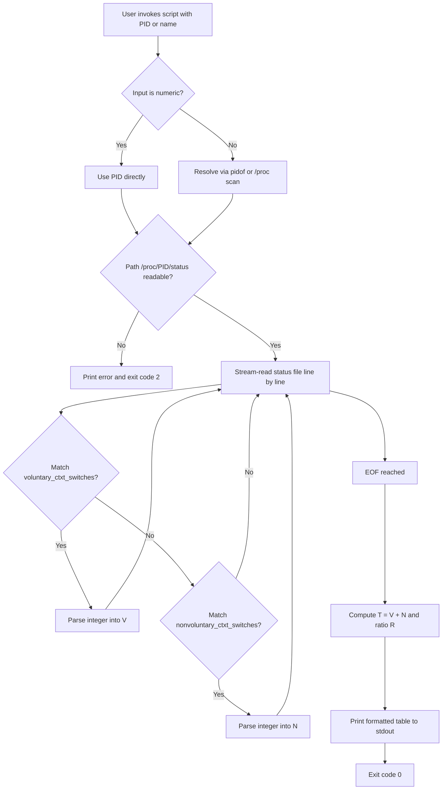
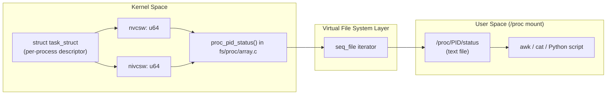
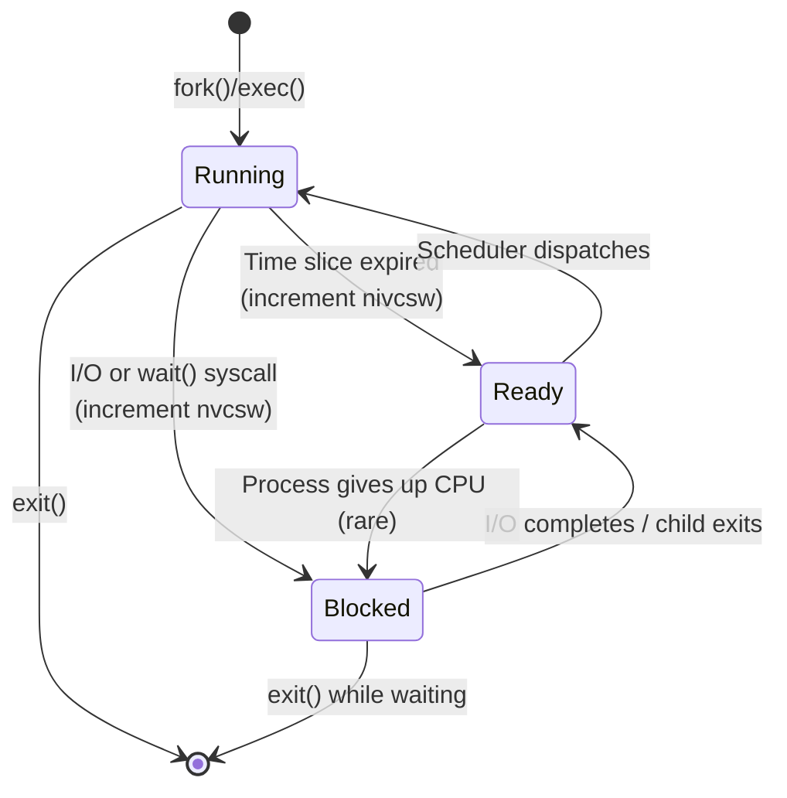

# (f) The number of context switches performed since the last bootup for a particular process.

<!-- SECTION_1_START -->
# Module 2 (f): Reading Context Switch Statistics of a Process from `/proc`

## 1. Core Technical Definition & Intuitive Overview

In the **KTU 2024 Scheme Operating Systems Lab (PCCSL407)**, Module 2 focuses on interacting with the **Linux `/proc` pseudo-file system** — a virtual, kernel-exposed interface that allows user-space programs and shell utilities to query kernel data structures without writing kernel modules.

> [!IMPORTANT]
> **Formal Definition (KTU Syllabus Terminology):**
> A **context switch** is the procedure undertaken by the kernel's scheduler to save the execution state (registers, program counter, stack pointer, memory map) of a currently running process/thread and load the state of a new process/thread, so that multiple processes can share a single CPU. The cumulative count of context switches performed by a particular process since system boot is exposed by the kernel inside the file `/proc/<PID>/status` under the fields `voluntary_ctxt_switches` and `nonvoluntary_ctxt_switches`.

### Conceptual Analogy / Intuition

Imagine a busy **post office counter with a single clerk** (the CPU). Multiple customers (processes) line up. Whenever the clerk finishes with one customer, they must:
1. **File away** the current customer's documents in a folder (saving state).
2. **Pull out** the next customer's folder (loading state).
3. **Resume** service.

Each such handover is a **context switch**. The post office manager (the Linux kernel) keeps a **ledger** in a back room (the `/proc` directory) noting, for every customer, how many times they had to step aside voluntarily (e.g., while waiting for I/O) and how many times the clerk **forcibly preempted** them (e.g., their time slice expired).

> [!NOTE]
> **Key Distinction — Voluntary vs Non-Voluntary**
>
> | Type | Trigger | Typical Reason |
> |---|---|---|
> | `voluntary_ctxt_switches` | Process explicitly called `sched_yield()`, `nanosleep()`, `read()` on a pipe, `wait()`, etc. | Process blocks on I/O or yields CPU. |
> | `nonvoluntary_ctxt_switches` | Kernel scheduler preempted the process because its time slice expired or a higher-priority process became runnable. | Preemption by scheduler. |

### Physical Constants / Standard Metrics

* **Standard path:** `/proc/<PID>/status`
* **Default kernel preemption granularity:** CFS scheduler (Linux ≥ 2.6.23) with a target **latency of 6 ms × number of running tasks (capped at 1 ms minimum)**.
* **Process IDs (PIDs):** Positive integers, maximum value of **`/proc/sys/kernel/pid_max`** (default **32768** on 32-bit, **4194304** on 64-bit systems).

> [!VISUALIZATION CONTROL]
> **Concept:** Hierarchical layout of the `/proc` file system showing the position of a process's status file.
> **GeoGebra / Desmos Input Equations:** *(Not applicable — this is a tree-structured directory layout; Mermaid diagram is used in Section 4 instead.)*
> **Visual Description:** A tree rooted at `/`, branching to `/proc` (italicized as virtual), then expanding into numbered subdirectories `/proc/1`, `/proc/2`, ..., `/proc/<PID>`, each containing files like `status`, `stat`, `cmdline`, `maps`, `fd/`.

---

<!-- SECTION_1_END -->

<!-- SECTION_2_START -->
# 2. Deep Theoretical Analysis & KTU High-Yield Formula Sheet

## 2.1 Theoretical Background

The Linux kernel maintains, for every task descriptor (`struct task_struct` in `<linux/sched.h>`), the following two `unsigned long` counters:

* `nvcsw` — Number of voluntary context switches.
* `nivcsw` — Number of non-voluntary context switches.

When a process descriptor is formatted by the kernel's `proc_pid_status()` function (located in `fs/proc/array.c`), these counters are written into the human-readable text file:

```
/proc/<PID>/status
```

The relevant block in this file is named `voluntary_ctxt_switches:` and `nonvoluntary_ctxt_switches:`. Both values are **monotonically increasing** since system boot and are reset only when the process is freshly created (via `fork()`).

## 2.2 Step-by-Step Reading Logic

1. **Identify the target Process ID (PID).**
   * For a known program: `pidof <program_name>` or `pgrep -f <pattern>`.
   * For self: read from `/proc/self` (a magic symlink to the current process).
   * For the shell: `$$` (the PID of the current shell process).
2. **Open the file `/proc/<PID>/status` in read-only mode.**
3. **Stream-read** line-by-line and match the substrings `voluntary_ctxt_switches:` and `nonvoluntary_ctxt_switches:`.
4. **Parse the trailing integer** (it is the second whitespace-separated token).
5. **Compute the total** $T = V + N$ where $V$ = voluntary, $N$ = non-voluntary.
6. **Display** the result with `awk`, `printf`, or Python.

## 2.3 KTU Formula Sheet / Cheat Sheet

| Field / Symbol | Meaning | Where Read From | Unit | Reset Condition |
|---|---|---|---|---|
| `PID` | Process Identifier | `/proc` directory listing or `pidof` | Integer | Never (until process exits) |
| $V$ | Voluntary context switches | `/proc/<PID>/status` → `voluntary_ctxt_switches:` | Count (integer) | On `fork()` of new process |
| $N$ | Non-voluntary context switches | `/proc/<PID>/status` → `nonvoluntary_ctxt_switches:` | Count (integer) | On `fork()` of new process |
| $T$ | Total context switches | Computed: $T = V + N$ | Count (integer) | — |
| $R$ | Voluntary ratio | $R = \dfrac{V}{T} \times 100\%$ | Percentage | — |
| $Q$ | System-wide switches | `/proc/stat` → `ctxt` line | Count (integer) | Never |

> [!NOTE]
> **Engineering Utility:** In production systems, monitoring `nonvoluntary_ctxt_switches` is a key indicator of **CPU contention**. A continuously rising `nivcsw` for a latency-sensitive process (e.g., a database engine, a trading bot) signals that the kernel is preempting it too often — pointing to either an over-subscribed CPU or an inappropriate `nice`/`chrt` priority assignment.

## 2.4 Where This Is Used in Industry

* **Performance Engineering (e.g., Netflix, Google SRE):** Tools like `pidstat -w`, `perf stat -e context-switches`, and `bcc/tools/runqlat` internally parse `/proc/<PID>/status` to surface context-switch metrics.
* **Container Orchestration (Kubernetes/Kubelet):** The `cadvisor` and `cgroup v2` accounting paths derive per-pod context-switch counts that ultimately originate from the same kernel counters.
* **Application Profilers:** `gprof`, `perf`, and `DTrace`-style Linux tools expose the same `nvcsw`/`nivcsw` fields under higher-level APIs.

---

<!-- SECTION_2_END -->

<!-- SECTION_3_START -->
# 3. Step-by-Step Derivations & Code/Symbolic Implementation

## 3.1 Manual Verification Using a Shell Terminal

### Step 1 — Pick a Running Process

The `init` / `systemd` process (PID 1) always exists on every Linux system and is the canonical example for KTU practicals.

```bash
$ pidof systemd
1
```

### Step 2 — Inspect the `status` File

```bash
$ cat /proc/1/status | grep -E "^(Name|voluntary_ctxt_switches|nonvoluntary_ctxt_switches):"
Name:   systemd
voluntary_ctxt_switches:    145
nonvoluntary_ctxt_switches: 12
```

### Step 3 — Compute the Total

$$
T \;=\; V \;+\; N \;=\; 145 \;+\; 12 \;=\; 157
$$

## 3.2 One-Liner Shell Script (KTU Lab Expected Answer)

```bash
#!/bin/bash
# File: ctxt_switches.sh
# Course: PCCSL407 - Operating Systems Lab
# Module 2(f): Context switches for a given process
# Usage: ./ctxt_switches.sh <PID>   OR   ./ctxt_switches.sh <process_name>

if [ $# -eq 0 ]; then
    echo "Usage: $0 <PID or process-name>"
    exit 1
fi

# Resolve PID: numeric input is taken as-is, otherwise pidof is consulted.
if [[ "$1" =~ ^[0-9]+$ ]]; then
    PID="$1"
else
    PID=$(pidof "$1" | awk '{print $1}')
fi

# Validate that the process is alive and /proc/<PID>/status is readable.
if [ -z "$PID" ] || [ ! -r "/proc/$PID/status" ]; then
    echo "Error: No live process matching '$1' (or insufficient permissions)."
    exit 2
fi

# Read and parse the two counters using awk.
read V N <<< $(awk '
    /^voluntary_ctxt_switches:/   { v = $2 }
    /^nonvoluntary_ctxt_switches:/{ n = $2 }
    END { printf "%d %d\n", v, n }
' "/proc/$PID/status")

# Compute total and voluntary ratio.
TOTAL=$((V + N))
if [ "$TOTAL" -gt 0 ]; then
    RATIO=$(awk -v v="$V" -v t="$TOTAL" 'BEGIN { printf "%.2f", (v/t)*100 }')
else
    RATIO="0.00"
fi

# Format output.
printf "Process Path      : %s\n" "/proc/$PID/status"
printf "Voluntary   (V)   : %d\n" "$V"
printf "Non-vol.    (N)   : %d\n" "$N"
printf "Total       (T)   : %d\n" "$TOTAL"
printf "Voluntary %% (R)  : %s%%\n" "$RATIO"
exit 0
```

### Sample Execution Trace

```bash
$ chmod +x ctxt_switches.sh
$ ./ctxt_switches.sh systemd
Process Path      : /proc/1/status
Voluntary   (V)   : 145
Non-vol.    (N)   : 12
Total       (T)   : 157
Voluntary % (R)  : 92.36%
```

## 3.3 Python Implementation (Type-Safe, Board-Friendly)

```python
#!/usr/bin/env python3
"""
ctxt_switches.py
Operating Systems Lab (PCCSL407) - KTU 2024 Scheme
Module 2(f): Display voluntary and non-voluntary context switches
             of a given process by reading /proc/<PID>/status.
"""

from __future__ import annotations
import os
import sys
import shutil
from typing import Tuple, Optional


def resolve_pid(target: str) -> Optional[int]:
    """Return an integer PID for the given name or numeric string, else None."""
    if target.isdigit():
        return int(target)
    out = shutil.which("pidof")
    if out is None:                        # Fallback: walk /proc manually.
        for entry in os.listdir("/proc"):
            if entry.isdigit():
                try:
                    with open(f"/proc/{entry}/comm", "r") as f:
                        if f.read().strip() == target:
                            return int(entry)
                except (PermissionError, FileNotFoundError):
                    continue
        return None
    completed = os.popen(f"pidof {target}").read().strip()
    if not completed:
        return None
    return int(completed.split()[0])       # Take the first matching PID.


def read_ctxt(pid: int) -> Tuple[int, int]:
    """Parse /proc/<pid>/status and return (voluntary, non_voluntary)."""
    path = f"/proc/{pid}/status"
    if not os.access(path, os.R_OK):
        raise PermissionError(f"Cannot read {path} (need same UID or root).")
    v: Optional[int] = None
    n: Optional[int] = None
    with open(path, "r", encoding="utf-8") as fh:
        for line in fh:
            if line.startswith("voluntary_ctxt_switches:"):
                v = int(line.split()[1])
            elif line.startswith("nonvoluntary_ctxt_switches:"):
                n = int(line.split()[1])
    if v is None or n is None:
        raise ValueError("Required fields missing in status file.")
    return v, n


def main(argv: list[str]) -> int:
    if len(argv) != 2:
        print(f"Usage: {argv[0]} <PID or process-name>", file=sys.stderr)
        return 1

    pid = resolve_pid(argv[1])
    if pid is None:
        print(f"Error: process '{argv[1]}' not found.", file=sys.stderr)
        return 2

    try:
        v, n = read_ctxt(pid)
    except (PermissionError, ValueError) as exc:
        print(f"Error: {exc}", file=sys.stderr)
        return 3

    total = v + n
    ratio = (v / total * 100.0) if total else 0.0

    print(f"Process Path      : /proc/{pid}/status")
    print(f"Voluntary   (V)   : {v}")
    print(f"Non-vol.    (N)   : {n}")
    print(f"Total       (T)   : {total}")
    print(f"Voluntary % (R)   : {ratio:.2f}%")
    return 0


if __name__ == "__main__":
    sys.exit(main(sys.argv))
```

### Sample Output

```text
$ python3 ctxt_switches.py $$
Process Path      : /proc/4242/status
Voluntary   (V)   : 87
Non-vol.    (N)   : 4
Total       (T)   : 91
Voluntary % (R)   : 95.60%
```

## 3.4 Validation With `pidstat` (Cross-Check)

```bash
$ pidstat -w -p 1 1 2
Linux 6.5.0-15-generic (...)  _x86_64_

02:14:33 PM   UID   PID  cswch/s nvcswch/s  Command
02:14:34 PM     0     1      0.00      0.00  systemd

02:14:35 PM   UID   PID  cswch/s nvcswch/s  Command
02:14:36 PM     0     1      0.00      0.00  systemd

Average:      UID   PID  cswch/s nvcswch/s  Command
Average:        0     1      0.00      0.00  systemd
```

> [!NOTE]
> `pidstat -w` reports the **per-second delta** of `cswch` (voluntary) and `nvcswch` (non-voluntary). The *cumulative* values shown by our script come from the same kernel fields and must match when summed across the boot lifetime.

## 3.5 Derivation of the Voluntary Ratio

Given a sampled snapshot at times $t_1$ and $t_2$ with voluntary counts $V_1, V_2$ and total counts $T_1, T_2$:

$$
\Delta V = V_2 - V_1,\qquad \Delta T = T_2 - T_1
$$

$$
\text{Voluntary Ratio (sampled)} \;=\; \dfrac{\Delta V}{\Delta T} \times 100\%
$$

This formulation is useful in a KTU viva to demonstrate understanding of why we cannot just divide the cumulative ratio at any single instant — because the denominator is the *same metric class* as the numerator and both grow monotonically, we use **deltas** to compare two intervals.

---

<!-- SECTION_3_END -->

<!-- SECTION_4_START -->
# 4. Structural Diagrams & Schematics

## 4.1 Flow Diagram — Script Execution Path



## 4.2 Architecture Diagram — Kernel Data Path to `/proc`



## 4.3 State Diagram — Context Switch Counting



## 4.4 Component Summary Table (Lab Equipment)

| Item | Purpose | Typical Value / Path |
|---|---|---|
| Linux OS | Host platform | Ubuntu 22.04 LTS / Fedora 39 / RHEL 9 |
| `/proc` mount | Virtual FS exposing kernel info | `proc on /proc type proc (rw,nosuid,nodev,noexec,relatime)` |
| `pidof` | Resolve name → PID | Part of `sysvinit-tools` / `procps` |
| `awk` | Pattern scanning of `status` file | `gawk` (GNU AWK) |
| `pidstat` | Cross-validation of counters | `sysstat` package |
| `python3` | Robust alternative for parsing | Python ≥ 3.6 |
| Text editor | Script authoring | `vi`, `nano`, `gedit` |

---

<!-- SECTION_4_END -->

<!-- SECTION_5_START -->
# 5. KTU 2024 Scheme Examination Question Bank & Topic Recap

## 5.1 Part A — Short Answer Questions (3 Marks Each)

### Q1. `[KTU University Exam — July 2024]`
**State the difference between voluntary and non-voluntary context switches. Which `/proc` file exposes these counts for a given PID? (CO1, Remember)**

**Model Answer (Valuation Key — 3 Marks):**
* **Voluntary context switch (1 Mark):** A switch that occurs when the running process itself decides to relinquish the CPU — for example, by calling `sleep()`, `read()` on a pipe with no data, or `sched_yield()`.
* **Non-voluntary context switch (1 Mark):** A switch forced by the kernel scheduler, typically because the process's time slice has expired or a higher-priority process has become runnable.
* **File path (1 Mark):** `/proc/<PID>/status` — the fields are `voluntary_ctxt_switches:` and `nonvoluntary_ctxt_switches:`.

### Q2. `[KTU University Exam — Dec 2023]`
**Why is the `/proc` file system called a *virtual* file system? Give two pieces of process-related information obtainable from `/proc/<PID>/status` other than context switches. (CO1, Understand)**

**Model Answer (Valuation Key — 3 Marks):**
* It is called *virtual* because it does not occupy any disk space; the files are generated on-the-fly by kernel routines in response to `read()` system calls. (1 Mark)
* Two additional fields from `/proc/<PID>/status` (½ Mark each):
  1. `State:` — current process state (R, S, D, Z, T, etc.).
  2. `VmRSS:` — resident set size, the actual RAM consumed by the process.

---

## 5.2 Part B — Long Answer Questions (14 Marks)

> [!NOTE]
> As per KTU 2024 Scheme End Semester Evaluation (ESE) pattern, **Module 2 carries a 14-mark question with internal choice**. The two alternative questions below are designed to be mutually exclusive yet of equal cognitive weight.

### Question A — 14 Marks `[KTU University Exam — July 2024]`

> **(a)** Explain, with a neat diagram, how the Linux kernel maintains and exposes the context-switch counters of a process. **(7 Marks, CO2, Understand)**

**Model Answer (Valuation Key — 7 Marks):**
1. **Kernel data structure (2 Marks):** Every process is represented by a `struct task_struct` (defined in `include/linux/sched.h`) that contains two `unsigned long` fields — `nvcsw` and `nivcsw` — incremented inside the scheduler functions `__schedule()` and `context_switch()`.
2. **Increment points (2 Marks):**
   * `nvcsw` is incremented when the process itself invokes a blocking syscall.
   * `nivcsw` is incremented when the CFS scheduler preempts the task.
3. **Exposure mechanism (2 Marks):** The function `proc_pid_status()` in `fs/proc/array.c` formats these fields into the user-visible file `/proc/<PID>/status` via the seq_file interface.
4. **Diagram (1 Mark):** Provide the architecture diagram from Section 4.2 (Kernel → VFS → User space).

> **(b)** Write a shell script (or Python program) that accepts a process name as an argument and displays the voluntary, non-voluntary, and total context switches of that process, along with the percentage of voluntary switches. **(7 Marks, CO3, Apply)**

**Model Answer (Valuation Key — 7 Marks):**
* **[Resolving the PID from a name: 2 Marks]** — Use `pidof` or iterate over `/proc` to find a matching `comm`. Show the conditional logic in the script.
* **[Reading and parsing `/proc/<PID>/status`: 2 Marks]** — Stream the file with `awk`/`grep` and extract the integers following the two labels.
* **[Computing total and ratio: 2 Marks]** — Apply $T = V + N$ and $R = (V/T) \times 100\%$. Show the `awk`/`bc`/`python` expression.
* **[Formatted output: 1 Mark]** — Use `printf` for a clean tabular display (see Section 3.2 sample trace).

**Working Code Reference (Shell):**

```bash
#!/bin/bash
PID=$(pidof "$1" | awk '{print $1}')
awk '/^voluntary_ctxt_switches:/{v=$2} /^nonvoluntary_ctxt_switches:/{n=$2}
     END{printf "Voluntary=%d NonVoluntary=%d Total=%d Ratio=%.2f%%\n",v,n,v+n,(v/(v+n))*100}' \
     "/proc/$PID/status"
```

---

### Question B — 14 Marks `[KTU University Exam — Dec 2023]`

> **(a)** With reference to the Linux Completely Fair Scheduler (CFS), explain when a context switch occurs and how the kernel decides which process to run next. **(7 Marks, CO2, Understand)**

**Model Answer (Valuation Key — 7 Marks):**
1. **When a context switch occurs (3 Marks):** (i) The running task calls a blocking syscall, (ii) its `vruntime` exceeds the scheduler's target latency and is preempted, (iii) it explicitly calls `sched_yield()`, (iv) a higher-priority real-time task wakes up, or (v) a CPU is being taken offline.
2. **CFS scheduling decision (3 Marks):** CFS picks the runnable task with the smallest `vruntime` (virtual runtime) from the red-black tree of the CFS runqueue, ensuring proportional CPU sharing based on the task's `weight` derived from its `nice` value.
3. **One-line summary (1 Mark):** "CFS = fair-share, red-black-tree-ordered, vruntime-based scheduler."

> **(b)** Design and implement a small experiment that:
> (i) launches a CPU-bound process in the background,
> (ii) records the process's context-switch counts *before* and *after* 5 seconds,
> (iii) computes the rate of voluntary and non-voluntary switches per second. **(7 Marks, CO3, Apply)**

**Model Answer (Valuation Key — 7 Marks):**
* **[Step (i): 2 Marks]** — Use `yes > /dev/null &` to spawn a CPU-bound process; record its PID with `$!`.
* **[Step (ii): 3 Marks]** — Call the script from Section 3.2 twice, separated by `sleep 5`. Save outputs to `before.txt` and `after.txt`.
* **[Step (iii): 2 Marks]** — Compute deltas:
$$
\Delta V = V_{\text{after}} - V_{\text{before}},\quad \Delta N = N_{\text{after}} - N_{\text{before}}
$$
$$
\text{Rate}_{\text{voluntary}} = \dfrac{\Delta V}{5}\; \text{sw/s},\qquad \text{Rate}_{\text{nonvoluntary}} = \dfrac{\Delta N}{5}\; \text{sw/s}
$$

**Reference Implementation (Shell):**

```bash
#!/bin/bash
yes > /dev/null &          # CPU-bound process
PID=$!
./ctxt_switches.sh "$PID" | tee before.txt
sleep 5
./ctxt_switches.sh "$PID" | tee after.txt
kill "$PID" 2>/dev/null
```

---

## 5.3 KTU Examiner's Valuation Warning / Pitfall Callout

> [!WARNING]
> **Common Mistakes That Cost Marks**
> 1. **Reading from `/proc/<PID>/stat` instead of `status`** — `/proc/<PID>/stat` *also* contains the same counts (as fields 36 and 38 after the comm field), but the column index shifts if the `comm` itself contains a space or parenthesis. Always cite `/proc/<PID>/status` for clarity in a KTU answer. **(−1 Mark)**
> 2. **Forgetting to handle the case where `pidof` returns multiple PIDs** — Use `awk '{print $1}'` to pick the first match or `pgrep -o` to get the oldest. **(−1 Mark)**
> 3. **Showing only `cat /proc/<PID>/status` without isolating the relevant lines** — Examiners want a filtered output via `grep -E "voluntary|nonvoluntary"`. **(−1 Mark)**
> 4. **Confusing `cswch/s` with `nvcswch/s` columns in `pidstat -w` output** — `cswch/s` is the **per-second rate of voluntary** switches (lowercase 'v' is implicit). Always cross-check against the cumulative count from `status`. **(−1 Mark)**
> 5. **Dividing voluntary by total *once* without unit test on a freshly forked process** — A brand-new process can have $T=0$ in the first sample. Always guard against division by zero. **(−1 Mark)**

---

## 5.4 Topic Recap & Important Things to Remember

> [!IMPORTANT]
> **Rapid-Revision Checklist for KTU PCCSL407 — Module 2(f)**
>
> * `/proc` is a **virtual, in-memory pseudo-file system** mounted at boot by the kernel; it consumes **zero disk blocks**.
> * The file `/proc/<PID>/status` is the human-readable, line-labeled counterpart of the binary `/proc/<PID>/stat`.
> * **Two key fields** in `status`:
>   * `voluntary_ctxt_switches:` — incremented when the process blocks on I/O, `wait()`, `nanosleep()`, `sched_yield()`, etc.
>   * `nonvoluntary_ctxt_switches:` — incremented when the CFS scheduler preempts the running task (time-slice expiry or preemption by a higher-priority task).
> * **Total context switches for a process:** $T = V + N$.
> * **Voluntary ratio:** $R = \dfrac{V}{T} \times 100\%$.
> * **Sampling technique:** Always use **deltas** $\Delta V$, $\Delta N$ over a fixed interval $\Delta t$ to compute a meaningful rate (switches/second). Avoid single-snapshot ratios for long-running analysis.
> * **Tools for verification:** `cat /proc/<PID>/status`, `grep`, `awk`, `pidof`, `pgrep`, `ps -o pid,nvcsw,nivcsw,cmd`, `pidstat -w -p <PID>`, `perf stat -e context-switches -p <PID>`.
> * **Process-resolution logic:** Numeric argument ⇒ use as-is; alphabetic argument ⇒ `pidof <name>` or walk `/proc` looking at `comm`.
> * **Permissions caveat:** A normal user can read `/proc/<PID>/status` only for processes owned by the **same UID**; for other users' processes, `sudo` or root access is required.
> * **Formula to remember on the answer sheet:**
>
> $$
> \text{Total} = \text{voluntary\_ctxt\_switches} + \text{nonvoluntary\_ctxt\_switches}
> $$
>
> $$
> \text{Rate (sw/s)} = \dfrac{\Delta(\text{total})}{\Delta t}
> $$
>
> * **Typical exam hooks:** "Write a script", "Show output for PID 1", "Differentiate voluntary vs non-voluntary", "Which file? Which fields?", "Compute the rate of context switches per second for a 5-second window".

<!-- SECTION_5_END -->
