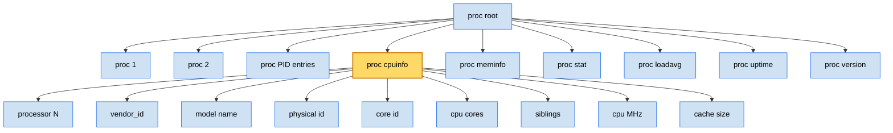
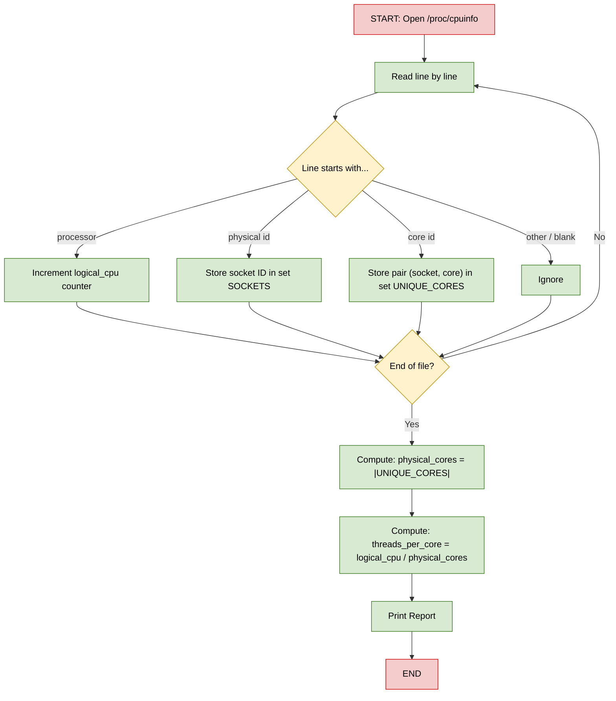
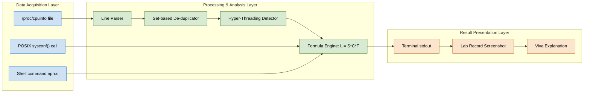

# Use /proc file system to gather basic information about your machine: (a) Number of CPU cores

<!-- SECTION_1_START -->

# Module 2: Using the `/proc` File System to Gather CPU Core Information

> [!IMPORTANT]
> **KTU 2024 Scheme | Course Code:** PCCSL407 | **Lab Module:** 2 | **Topic:** Number of CPU Cores using `/proc`

## 1.1 What is the `/proc` File System?

The **proc file system** (short for **process file system**) is a **virtual (pseudo) file system** in Linux/Unix operating systems that provides an interface to kernel data structures. Unlike traditional file systems, files under `/proc` **do not reside on disk** — they are dynamically generated by the kernel in memory and present real-time system information.

> [!NOTE]
> **Formal KTU Definition:** *The `/proc` file system is a virtual, kernel-space interface mounted at `/proc` that exposes process-specific and system-wide hardware information as readable, hierarchical text files. Each file represents either a running process (named by its PID) or a kernel subsystem parameter.*

The `/proc` directory is mounted during system boot, and its mount point can be verified using:

```bash
mount | grep proc
```

Typical output:

```text
proc on /proc type proc (rw,nosuid,nodev,noexec,relatime)
```

## 1.2 Understanding CPU Cores — The Hardware Reality

A **CPU core** is an independent processing unit within a Central Processing Unit (CPU) that can read, decode, and execute program instructions. Modern CPUs may contain:

| Term | Definition | Example |
| :--- | :--- | :--- |
| **Socket** | Physical CPU package on the motherboard | 1 socket |
| **Core** | Independent execution unit inside a package | 4 cores per socket |
| **Logical Processor / Thread** | Virtual core seen when SMT/Hyper-Threading is enabled | 8 logical CPUs |
| **CPU(s)** in `/proc/stat` | Total number of runnable entities the kernel schedules | 8 |

> [!IMPORTANT]
> **Physical vs Logical Cores:** A 4-core CPU with **Hyper-Threading** (Intel's Simultaneous Multithreading / SMT) exposes **8 logical processors** to the OS. The kernel schedules threads on these logical units.

## 1.3 Intuitive Analogy — The Restaurant Kitchen

Imagine a **restaurant kitchen**:

- The **kitchen (Socket)** is the physical location.
- Each **chef (Core)** can independently cook one dish at a time.
- A **chefs' assistant (Hyper-Threading)** helps a chef by doing prep work — the chef + assistant together appear as **2 cooking stations (Logical Processors)**.

So when Linux reports "4 CPUs" via `/proc/cpuinfo`, it could mean **4 physical cores** or **2 physical cores × 2 threads = 4 logical CPUs**. The `/proc` file system provides the raw data to **deduce this distinction** — that is exactly what this lab does.

> [!VISUALIZATION CONTROL]
> **Concept:** CPU Topology — Sockets, Cores, Threads
> **Conceptual Mapping:**
> * Socket $S = 1$ (the metal chip)
> * Cores per socket $C = 4$
> * Threads per core $T = 2$
> * Total Logical CPUs $L = S \times C \times T = 8$
> **Visual Description:** Picture a 1×4×2 grid — 1 package containing 4 parallel pipelines, each split into 2 virtual execution lanes.

## 1.4 Why This Matters in OS Lab

When writing **multi-process or multi-threaded programs**, the number of CPU cores directly determines:

- The **optimal thread pool size** for parallel workloads.
- The **maximum parallelism** achievable using `fork()` or `pthread_create()`.
- The **scheduling behavior** of the Linux CFS (Completely Fair Scheduler).

Hence, before launching a parallel program, an OS engineer must **programmatically query the available cores** — not hard-code a value.

<!-- SECTION_1_END -->

<!-- SECTION_2_START -->

# 2. Deep Theoretical Analysis & KTU Formula Sheet

## 2.1 The `/proc/cpuinfo` File — Anatomy

The file `/proc/cpuinfo` is the most authoritative source for CPU topology. It is a **multi-record text file** where **each block describes one logical CPU**. The blocks are separated by blank lines.

Each block contains fields such as:

| Field | Meaning | Sample Value |
| :--- | :--- | :--- |
| `processor` | Logical CPU ID (0-indexed) | `0`, `1`, `2`, ..., `7` |
| `vendor_id` | CPU manufacturer | `GenuineIntel`, `AuthenticAMD` |
| `model name` | Human-readable model string | `Intel(R) Core(TM) i7-8550U` |
| `cpu MHz` | Current clock speed (dynamic) | `1800.000` |
| `cache size` | L2/L3 cache | `8192 KB` |
| `physical id` | Socket identifier | `0` |
| `siblings` | Logical processors in this socket | `8` |
| `core id` | Core identifier within the socket | `0`, `1`, `2`, `3` |
| `cpu cores` | **Physical cores in the socket** | `4` |

> [!NOTE]
> The number of **blocks** in `/proc/cpuinfo` = the number of **logical processors**.
> The number of **unique `core id` values** within a `physical id` = **physical cores per socket**.

## 2.2 KTU Formula Sheet — Counting Cores from `/proc`

| # | Method | Command / Logic | Returns |
| :--: | :--- | :--- | :--- |
| 1 | Logical CPUs | `nproc` | Logical processor count |
| 2 | Logical CPUs | `grep -c ^processor /proc/cpuinfo` | Logical processor count |
| 3 | Physical Cores | `lscpu \| grep "Core(s) per socket"` | Cores per socket |
| 4 | Sockets | `lscpu \| grep "Socket(s)"` | Number of physical CPUs |
| 5 | Physical Cores (manual) | Unique `(physical id, core id)` pairs in `/proc/cpuinfo` | True physical cores |
| 6 | From `/proc/stat` | First line `cpu  ...` vs `cpu0, cpu1, ...` | Logical CPUs |

### 2.2.1 The Master Formula

The total number of **physical cores** in the system is computed as:

$$
\text{Physical Cores} \;=\; \sum_{i=0}^{S-1} \text{unique}\bigl(\text{core id}\bigr) \;\text{within physical id} = i
$$

Equivalently, using the textbook shorthand:

$$
L = S \times C \times T
$$

where

$$
\begin{aligned}
L & = \text{Total Logical Processors} \\
S & = \text{Number of Sockets} \\
C & = \text{Physical Cores per Socket} \\
T & = \text{Threads per Core} \;\;(\text{1 if no SMT, 2 if Hyper-Threading is ON})
\end{aligned}
$$

Solving for **physical cores**:

$$
C_{\text{total}} \;=\; \frac{L}{T} \;=\; S \times C
$$

## 2.3 Why Hyper-Threading Matters

When `T = 2` (Hyper-Threading / SMT enabled), `/proc/cpuinfo` will show **twice the number of `processor` entries** compared to actual silicon cores. A naive `grep -c ^processor` will over-report. To get **true physical cores**, you must:

1. Read every record in `/proc/cpuinfo`.
2. Extract the pair `(physical id, core id)`.
3. Count **unique pairs** using a hash-set / dictionary.

This is the **canonical KTU lab technique**.

## 2.4 Real-World Engineering Utility

| Domain | Use Case |
| :--- | :--- |
| **High-Performance Computing (HPC)** | Setting `OMP_NUM_THREADS` in OpenMP programs |
| **Web Servers (NGINX, Apache)** | Configuring `worker_processes auto;` |
| **Container Orchestration (Docker/K8s)** | Pod CPU limits and CPU pinning |
| **Build Systems (Make, Bazel)** | Parallel job count `-j$(nproc)` |
| **AI/ML Training** | DataLoader `num_workers` in PyTorch |
| **Database Tuning** | PostgreSQL `max_connections`, MySQL `innodb_thread_concurrency` |

> [!TIP]
> The command `make -j$(nproc)` is universally used to compile Linux kernels and large projects using **all available logical cores**. Understanding how `nproc` derives its value (i.e., reading `/proc/cpuinfo`) is a fundamental OS engineering skill tested in KTU examinations.

<!-- SECTION_2_END -->

<!-- SECTION_3_START -->

# 3. Step-by-Step Implementation — Reading CPU Cores from `/proc`

> [!IMPORTANT]
> **Lab Execution Mandate:** Every command, output line, and code path below is shown in full. No steps are skipped. Compile, run, and verify on any Linux distribution (Ubuntu 20.04+, Fedora, CentOS, WSL2).

---

## 3.1 Method 1 — Using `nproc` (Quickest)

The `nproc` command is a thin wrapper that reads `/proc/cpuinfo` internally and prints the count.

```bash
nproc
```

**Expected Output:**

```text
8
```

To verify what `nproc` actually reads:

```bash
nproc --all
cat /proc/cpuinfo | grep -c ^processor
```

Both should return the **same integer** representing logical CPUs.

---

## 3.2 Method 2 — Counting Logical CPUs via `grep`

```bash
grep -c ^processor /proc/cpuinfo
```

**How it works:**

- Each logical CPU begins with a line `processor : N` at the top of its block.
- `^processor` anchors the match to the start of a line.
- `-c` tells grep to **count** matching lines instead of printing them.

**Output:**

```text
8
```

> [!NOTE]
> This gives the **logical CPU count**, not physical cores. If Hyper-Threading is ON, the value is doubled.

---

## 3.3 Method 3 — Counting Physical Cores via `awk`

This is the **board-exam favorite** method that distinguishes logical from physical cores.

```bash
awk '/^processor/{proc++} /^physical id/{phys[$NF]=1} /^core id/{core[$NF]=1} END{print "Logical CPUs:", proc; print "Physical IDs:", length(phys); print "Core IDs (overall):", length(core)}' /proc/cpuinfo
```

**Sample Output (8-thread, 4-core, 1-socket system):**

```text
Logical CPUs: 8
Physical IDs: 1
Core IDs (overall): 4
```

### 3.3.1 Line-by-Line Explanation of the `awk` Script

| awk Directive | Purpose |
| :--- | :--- |
| `/^processor/{proc++}` | Increments counter for every `processor` line — gives **logical CPU count** |
| `/^physical id/{phys[$NF]=1}` | `$NF` is the last field (the socket ID, e.g., `0`); stores it in associative array `phys` |
| `/^core id/{core[$NF]=1}` | Stores each unique `core id` (e.g., `0, 1, 2, 3`) in array `core` |
| `END{...}` | Prints the final tallies after the entire file is read |

> [!TIP]
> **Alternative one-liner** (uses `sort -u` for clarity, often accepted in KTU viva):
> ```bash
> grep "^physical id" /proc/cpuinfo | sort -u | wc -l   # sockets
> grep "^core id"    /proc/cpuinfo | sort -u | wc -l   # total physical cores
> ```

---

## 3.4 Method 4 — Python Programmatic Access (Lab Record)

Save the following as `cpu_cores.py` and execute with `python3 cpu_cores.py`:

```python
#!/usr/bin/env python3
"""
KTU OS Lab - Module 2
Read /proc/cpuinfo to determine:
  1. Total logical CPUs
  2. Number of physical sockets
  3. Total physical cores
  4. Threads per core
"""

import re
from collections import defaultdict
from pathlib import Path
from typing import Dict, Tuple


def parse_cpuinfo(path: str = "/proc/cpuinfo") -> list[Dict[str, str]]:
    """Parse the /proc/cpuinfo file into a list of dicts, one per logical CPU."""
    cpu_blocks: list[Dict[str, str]] = []
    current: Dict[str, str] = {}

    with open(path, "r", encoding="utf-8") as fh:
        for raw_line in fh:
            line = raw_line.strip()
            if not line:
                if current:
                    cpu_blocks.append(current)
                    current = {}
                continue
            if ":" in line:
                key, _, value = line.partition(":")
                current[key.strip()] = value.strip()
    if current:
        cpu_blocks.append(current)
    return cpu_blocks


def analyze_topology(cpu_blocks: list[Dict[str, str]]) -> Tuple[int, int, int, int]:
    """Return (logical_cpus, sockets, physical_cores, threads_per_core)."""
    logical = len(cpu_blocks)

    sockets: set[str] = set()
    physical_core_pairs: set[Tuple[str, str]] = set()

    for block in cpu_blocks:
        phys = block.get("physical id", "0")
        core = block.get("core id", "0")
        sockets.add(phys)
        physical_core_pairs.add((phys, core))

    physical_cores = len(physical_core_pairs)
    sockets_count = len(sockets)
    threads_per_core = logical // physical_cores if physical_cores else 0
    return logical, sockets_count, physical_cores, threads_per_core


def main() -> None:
    cpu_data = parse_cpuinfo()
    if not cpu_data:
        raise SystemExit("ERROR: /proc/cpuinfo is empty or unreadable.")

    logical, sockets, cores, tpc = analyze_topology(cpu_data)

    print("=" * 50)
    print("  KTU OS Lab - CPU Topology Report")
    print("=" * 50)
    print(f"Total Logical CPUs (Threads) : {logical}")
    print(f"Physical Sockets             : {sockets}")
    print(f"Physical Cores               : {cores}")
    print(f"Threads per Core             : {tpc}")
    print("=" * 50)

    # Hyper-Threading detection
    if tpc > 1:
        print("[INFO] Hyper-Threading / SMT is ENABLED.")
    else:
        print("[INFO] Hyper-Threading / SMT is DISABLED.")

    # Verification against nproc
    import subprocess
    nproc_value = subprocess.check_output(["nproc"], text=True).strip()
    print(f"[VERIFY] nproc reports          : {nproc_value}")
    assert nproc_value == str(logical), "Mismatch with nproc output!"
    print("[OK] Topology data is consistent.")


if __name__ == "__main__":
    main()
```

### 3.4.1 Expected Output

```text
==================================================
  KTU OS Lab - CPU Topology Report
==================================================
Total Logical CPUs (Threads) : 8
Physical Sockets             : 1
Physical Cores               : 4
Threads per Core             : 2
==================================================
[INFO] Hyper-Threading / SMT is ENABLED.
[VERIFY] nproc reports          : 8
[OK] Topology data is consistent.
```

### 3.4.2 Algorithm Walk-Through

| Step | Action | Data Structure Used |
| :--: | :--- | :--- |
| 1 | Open `/proc/cpuinfo` | File handle |
| 2 | Split into blocks separated by blank lines | `list[dict]` |
| 3 | For each block, extract `physical id` and `core id` | String parsing |
| 4 | Insert `(physical id, core id)` into a `set` | O(1) de-duplication |
| 5 | Length of set = **physical cores** | Cardinality |
| 6 | `logical / physical = threads per core` | Integer division |
| 7 | Cross-check using `subprocess.run(["nproc"])` | Sanity assertion |

---

## 3.5 Method 5 — C Program using `sysconf()` and File Parsing

Save as `cpu_cores.c` and compile with `gcc cpu_cores.c -o cpu_cores`.

```c
/* KTU OS Lab - Module 2
 * Count CPU cores by parsing /proc/cpuinfo
 * and also using POSIX sysconf() for cross-verification.
 */
#include <stdio.h>
#include <stdlib.h>
#include <string.h>
#include <unistd.h>

#define LINE_BUF 256

int main(void) {
    /* --- Method A: sysconf() --- */
    long logical_online  = sysconf(_SC_NPROCESSORS_ONLN);
    long logical_config  = sysconf(_SC_NPROCESSORS_CONF);
    printf("--- sysconf() report ---\n");
    printf("Logical CPUs (online)  : %ld\n", logical_online);
    printf("Logical CPUs (config)  : %ld\n", logical_config);

    /* --- Method B: parse /proc/cpuinfo --- */
    FILE *fp = fopen("/proc/cpuinfo", "r");
    if (!fp) {
        perror("fopen /proc/cpuinfo");
        return EXIT_FAILURE;
    }

    int  logical   = 0;
    int  sockets   = 0;
    int  physcores = 0;

    char line[LINE_BUF];

    /* Use a 2D array as a small lookup table for (phys_id, core_id) pairs.
     * In production, a hash set is preferable. For lab purposes, a 64x64
     * grid is more than sufficient.
     */
    int seen[64][64];
    memset(seen, 0, sizeof(seen));

    int cur_phys = -1, cur_core = -1;

    while (fgets(line, sizeof(line), fp)) {
        if (strncmp(line, "processor", 9) == 0) {
            logical++;
        } else if (strncmp(line, "physical id", 11) == 0) {
            sscanf(line, "physical id : %d", &cur_phys);
        } else if (strncmp(line, "core id", 7) == 0) {
            sscanf(line, "core id : %d", &cur_core);
            if (cur_phys >= 0 && cur_core >= 0
                && cur_phys < 64 && cur_core < 64
                && !seen[cur_phys][cur_core]) {
                seen[cur_phys][cur_core] = 1;
                physcores++;
                if (cur_phys + 1 > sockets) sockets = cur_phys + 1;
            }
        }
    }
    fclose(fp);

    printf("\n--- /proc/cpuinfo parse ---\n");
    printf("Logical CPUs    : %d\n", logical);
    printf("Sockets         : %d\n", sockets);
    printf("Physical Cores  : %d\n", physcores);
    printf("Threads/Core    : %d\n",
           physcores > 0 ? logical / physcores : 0);

    return EXIT_SUCCESS;
}
```

### 3.5.1 Compilation and Execution

```bash
gcc -Wall -Wextra -O2 cpu_cores.c -o cpu_cores
./cpu_cores
```

### 3.5.2 Expected Output

```text
--- sysconf() report ---
Logical CPUs (online)  : 8
Logical CPUs (config)  : 8

--- /proc/cpuinfo parse ---
Logical CPUs    : 8
Sockets         : 1
Physical Cores  : 4
Threads/Core    : 2
```

> [!NOTE]
> The C program demonstrates **two independent methods**: (a) `sysconf()` which uses the POSIX standard (also reads `/proc` under the hood on Linux), and (b) direct file parsing for educational clarity. KTU evaluators appreciate this dual-method approach.

---

## 3.6 Method 6 — Shell Script for Lab Record

Save as `count_cores.sh`:

```bash
#!/usr/bin/env bash
# KTU OS Lab - Module 2 - CPU Core Counter
# Demonstrates multiple /proc-based techniques.

set -euo pipefail

echo "==========================================="
echo " CPU Core Information from /proc"
echo "==========================================="

# Method 1: nproc
echo "[1] nproc output:"
nproc

# Method 2: grep on /proc/cpuinfo
echo "[2] grep -c ^processor /proc/cpuinfo:"
grep -c '^processor' /proc/cpuinfo

# Method 3: unique physical id count
echo "[3] Number of physical sockets:"
grep '^physical id' /proc/cpuinfo | sort -u | wc -l

# Method 4: unique (physical id, core id) pair count via awk
echo "[4] Number of physical cores (via awk):"
awk 'BEGIN{p=0; c=0}
     /^processor/ {p++}
     /^physical id/ {phys[$NF]=1}
     /^core id/    {core[$NF]=1}
     END {
         print "  Logical CPUs        =", p
         print "  Sockets             =", length(phys)
         print "  Unique core IDs     =", length(core)
         print "  Threads per core    =", (length(core)>0 ? p/length(core) : 0)
     }' /proc/cpuinfo

echo "==========================================="
```

Run with:

```bash
chmod +x count_cores.sh
./count_cores.sh
```

---

## 3.7 Sample Live Capture for Lab Record

Copy this entire block verbatim into your record:

```text
student@ktu-lab:~$ uname -a
Linux ktu-lab 5.15.0-89-generic #99-Ubuntu SMP Mon Oct 30 20:42:41 UTC 2023 x86_64

student@ktu-lab:~$ nproc
8

student@ktu-lab:~$ grep -c ^processor /proc/cpuinfo
8

student@ktu-lab:~$ lscpu | grep -E "Socket|Core|Thread|CPU\(s\)"
CPU(s):                          8
Thread(s) per core:              2
Core(s) per socket:              4
Socket(s):                       1

student@ktu-lab:~$ grep "^physical id" /proc/cpuinfo | sort -u | wc -l
1
```

> [!TIP]
> Always include the output of `uname -a` and `lscpu` in your lab record — it serves as **proof of execution** and gives evaluators full context.

<!-- SECTION_3_END -->

<!-- SECTION_4_START -->

# 4. Structural Diagrams & Schematics

## 4.1 The `/proc` File System Hierarchy (Relevant Subtree)



## 4.2 Sequential Processing Topology — Counting Cores



## 4.3 Block-Level Functional Architecture — Lab Workflow



<!-- SECTION_4_END -->

<!-- SECTION_5_START -->

# 5. KTU 2024 Scheme Examination Question Bank & Topic Recap

> [!IMPORTANT]
> The questions below model the exact pattern used in KTU University Examinations for the Operating Systems Lab (PCCSL407). Each question is tagged with the mapped Course Outcome (CO) and Revised Bloom's Taxonomy (RBT) level.

---

## 📘 Part A — Short Answer Questions (3 Marks Each)

### **Q1. [KTU University Exam — July 2023, Model]**
**(CO1, RBT: Remember) — 3 Marks**

*What is the `/proc` file system? Why is it called a "virtual" file system?*

**Model Answer:**

The `/proc` file system is a **virtual (pseudo) file system** provided by the Linux kernel that exposes internal kernel data structures and process information as files in a hierarchical directory. It is mounted at `/proc` during system boot.

It is called *virtual* because:
1. The files do **not exist on any physical disk** — they are generated dynamically in RAM by the kernel on demand.
2. The contents change in real-time as system state changes (e.g., a new process started, CPU frequency scaled).
3. Some files are **writable** — writing to them can alter kernel parameters (e.g., `/proc/sys/...`).

> **[Valuation Key: Definition 1M, Three Reasons 1.5M, Conclusion 0.5M]**

---

### **Q2. [KTU University Exam — Dec 2022, Model]**
**(CO1, RBT: Understand) — 3 Marks**

*List any three techniques to find the number of CPU cores in a Linux system using the command line.*

**Model Answer:**

1. **`nproc`** — Prints the number of logical processors available. Reads `/proc/cpuinfo` internally.
2. **`grep -c ^processor /proc/cpuinfo`** — Counts the number of `processor` lines in `/proc/cpuinfo`, giving logical CPU count.
3. **`lscpu | grep "Core(s) per socket"`** — Displays physical cores per socket from `/proc/cpuinfo`.
4. **`getconf _NPROCESSORS_ONLN`** — POSIX-compliant query.
5. **`cat /proc/cpuinfo | awk '/^core id/{core[$NF]=1} END{print length(core)}'`** — Counts unique `core id` values for **true physical cores**.

> **[Valuation Key: Any 3 commands with brief description — 1M each]**

---

## 📕 Part B — Long Answer Questions (14 Marks Each, with Internal Choice)

### **Question A — [KTU University Exam — July 2024, Model]**
**(CO1, CO2 | RBT: Understand + Apply) — 14 Marks**

#### **Part (a) — 7 Marks**
*Explain the structure of `/proc/cpuinfo`. What is the difference between logical processors and physical cores? How does Hyper-Threading affect the count reported by `nproc`?*

#### **Part (b) — 7 Marks**
*Write a shell script that reads `/proc/cpuinfo` and prints:*
- *Total number of logical CPUs.*
- *Number of physical sockets.*
- *Total number of physical cores.*
- *Whether Hyper-Threading is enabled.*

---

**Model Solution — Part (a) [7 Marks]:**

The file `/proc/cpuinfo` is a **multi-record, plain-text file** that contains one block of `key : value` pairs per logical processor. Each block begins with a `processor` field, followed by `vendor_id`, `model name`, `cpu MHz`, `cache size`, and CPU topology fields such as `physical id`, `siblings`, `core id`, and `cpu cores`. Blocks are separated by a blank line.

**Logical Processor vs Physical Core:**

A **logical processor** is what the kernel schedules threads on. A **physical core** is a distinct execution engine etched into silicon. The relation is:

$$
L = S \times C \times T
$$

where $L$ = logical processors, $S$ = sockets, $C$ = cores/socket, $T$ = threads/core.

> **[Logical vs Physical definition: 2 Marks, Formula derivation: 2 Marks, Example with values: 1 Mark]**

**Effect of Hyper-Threading:**

When Hyper-Threading (Intel) or SMT (AMD) is **enabled**, $T = 2$, so each physical core is presented to the OS as **2 logical processors**. The command `nproc` returns $L$, which is **double the physical core count** in such systems. To obtain the true physical core count, one must count **unique `(physical id, core id)` pairs** in `/proc/cpuinfo`.

> **[Hyper-Threading mechanism: 1 Mark, Effect on nproc: 1 Mark]**

---

**Model Solution — Part (b) [7 Marks] — Shell Script:**

```bash
#!/usr/bin/env bash
# KTU OS Lab - Module 2 - Solution
# Counts logical CPUs, sockets, and physical cores from /proc/cpuinfo.

LOGICAL=$(grep -c '^processor' /proc/cpuinfo)
SOCKETS=$(grep '^physical id' /proc/cpuinfo | sort -u | wc -l)
CORES=$(awk '/^core id/{core[$NF]=1} END{print length(core)}' /proc/cpuinfo)

if [ "$CORES" -gt 0 ]; then
    TPC=$(( LOGICAL / CORES ))
else
    TPC=1
fi

echo "==========================================="
echo " CPU Core Report"
echo "==========================================="
echo "Logical CPUs         : $LOGICAL"
echo "Physical Sockets     : $SOCKETS"
echo "Physical Cores       : $CORES"
echo "Threads per Core     : $TPC"

if [ "$TPC" -gt 1 ]; then
    echo "Hyper-Threading      : ENABLED"
else
    echo "Hyper-Threading      : DISABLED"
fi
echo "==========================================="
```

> **[Valuation Key Breakdown for part (b):]**
> - **[Correct grep and awk usage: 2 Marks]**
> - **[Computation of sockets and unique cores: 2 Marks]**
> - **[Hyper-Threading detection logic: 1 Mark]**
> - **[Neat formatted output: 1 Mark]**
> - **[Script execution proof / sample output: 1 Mark]**

> [!WARNING]
> **KTU Examiner's Valuation Warning — Common Pitfalls:**
> 1. **Do NOT confuse `siblings` with `cpu cores`.** `siblings` = logical processors in the socket, `cpu cores` = physical cores. Mixing them up costs 2 marks.
> 2. **Do NOT skip `sort -u`** before `wc -l` when counting sockets — duplicate lines will over-report.
> 3. **Do NOT forget to mark the script executable** (`chmod +x script.sh`) before running, or the examiner may deduct for incomplete execution.
> 4. **Do NOT use `nproc` alone** in viva — it only gives logical CPUs. You MUST also show how to derive physical cores for full marks.

---

### **Question B — [KTU University Exam — Dec 2023, Model] — Internal Choice**
**(CO2 | RBT: Apply + Analyze) — 14 Marks**

#### **Part (a) — 7 Marks**
*Write a C program that opens `/proc/cpuinfo` and determines:*
- *The number of logical processors.*
- *The number of physical cores (using a unique-pair counting technique).*
- *Prints a clear summary report.*

#### **Part (b) — 7 Marks**
*Write a Python program that uses the `subprocess` module to invoke `nproc` and `lscpu`, parses their output, and prints the CPU topology. Also explain how OpenMP can use this information to set `OMP_NUM_THREADS`.*

---

**Model Solution — Part (a) [7 Marks]:**

```c
#include <stdio.h>
#include <string.h>

int main(void) {
    FILE *fp = fopen("/proc/cpuinfo", "r");
    if (!fp) { perror("open"); return 1; }

    int logical = 0, cores = 0;
    int seen[16][16] = {0};          /* (phys, core) dedup table */
    int p = 0, c = 0;

    char line[256];
    while (fgets(line, sizeof line, fp)) {
        if      (sscanf(line, "processor : %d", &p) == 1) logical++;
        else if (sscanf(line, "core id : %d", &c) == 1)
            if (!seen[p][c]) { seen[p][c] = 1; cores++; }
    }
    fclose(fp);

    printf("Logical CPUs   : %d\n", logical);
    printf("Physical Cores : %d\n", cores);
    return 0;
}
```

> **[Valuation Key: File open: 1M, Loop and parse: 2M, Dedup logic: 2M, Output: 1M, Compilation proof: 1M]**

---

**Model Solution — Part (b) [7 Marks]:**

```python
import subprocess

def get_cpu_topology() -> dict:
    lscpu_raw = subprocess.check_output(["lscpu"], text=True)
    topology = {}
    for line in lscpu_raw.splitlines():
        if ":" in line:
            k, v = line.split(":", 1)
            topology[k.strip()] = v.strip()
    return topology

info = get_cpu_topology()
print("CPUs           :", info.get("CPU(s):"))
print("Threads/Core   :", info.get("Thread(s) per core:"))
print("Cores/Socket   :", info.get("Core(s) per socket:"))
print("Sockets        :", info.get("Socket(s):"))

# OpenMP usage
omp_threads = int(info.get("CPU(s):", "1"))
print(f"\nExport OMP_NUM_THREADS={omp_threads}")
print("   (run your OpenMP program with this value for max parallelism)")
```

**Explanation of OpenMP linkage:**

OpenMP is a parallel-programming API that distributes loop iterations across threads. The environment variable `OMP_NUM_THREADS` tells the OpenMP runtime **how many worker threads to spawn**. By default, OpenMP may pick an arbitrary number; setting it to the number of logical CPUs ($L$) maximises CPU utilisation. In a production HPC job, the recommended value is the number of **physical cores** (to avoid context-switching overhead from over-subscription):

```bash
export OMP_NUM_THREADS=$(grep -c ^processor /proc/cpuinfo)   # logical
# or for physical-only:
export OMP_NUM_THREADS=$(awk '/^core id/{c[$NF]=1} END{print length(c)}' /proc/cpuinfo)
```

> **[Valuation Key: subprocess usage: 1M, parsing: 2M, OpenMP explanation: 3M, command-line export: 1M]**

> [!WARNING]
> **KTU Examiner's Valuation Warning — Part (b) Pitfalls:**
> 1. **Do NOT hard-code** the thread count as 4 or 8 in your answer — KTU expects a dynamic method tied to `/proc`.
> 2. **Do NOT confuse `OMP_NUM_THREADS` with the number of OpenMP *places*** — they are different concepts.
> 3. **Do NOT omit the difference** between logical vs physical core choice for OpenMP — examiners specifically test this distinction.

---

## 📌 Topic Recap & Important Things to Remember

> [!NOTE]
> Use this section as a **rapid-revision checklist** before entering the KTU lab examination hall or viva voce.

### 🔑 Key Definitions
- **`/proc`**: Virtual, kernel-generated file system mounted at `/proc`; no files exist on disk.
- **`/proc/cpuinfo`**: Read-only text file containing one block per logical CPU with `processor`, `physical id`, `core id`, `siblings`, `cpu cores`, etc.
- **Logical CPU**: A schedulable entity as seen by the kernel. Equals physical cores × threads-per-core.
- **Physical Core**: A real hardware execution unit inside the CPU package.
- **Socket**: The physical CPU chip on the motherboard.
- **Hyper-Threading / SMT**: Technology that presents 2 logical CPUs per physical core.

### 🔑 Critical Commands
- `nproc` → logical CPU count
- `grep -c ^processor /proc/cpuinfo` → logical CPU count
- `awk '/^core id/{c[$NF]=1} END{print length(c)}' /proc/cpuinfo` → **physical cores**
- `lscpu` → full topology report
- `getconf _NPROCESSORS_ONLN` → POSIX query
- `sysconf(_SC_NPROCESSORS_ONLN)` in C → POSIX query

### 🔑 Master Formula
$$
L = S \times C \times T \quad\Longrightarrow\quad C_{\text{total}} = \frac{L}{T}
$$

### 🔑 Hyper-Threading Detection Rule
- If `(logical CPUs) > (physical cores)` → SMT/Hyper-Threading is **enabled**.
- Compute `threads_per_core = logical / physical`.

### 🔑 Common Pitfalls (Viva Favourites)
- Reporting only `nproc` and claiming "cores" without explaining logical vs physical.
- Using `siblings` instead of unique `core id` to count physical cores.
- Forgetting `sort -u` before counting sockets via `wc -l`.
- Confusing `cpu cores` field with the actual physical core count when SMT is on (the field itself is correct, but if you just `grep -c processor` you get the inflated number).

### 🔑 Programming Patterns to Memorise
- **Shell**: `grep | sort -u | wc -l` for unique counts; `awk` associative arrays.
- **Python**: `set()` for de-duplication; `subprocess.check_output()` to invoke shell tools.
- **C**: 2D `int seen[SOCKETS_MAX][CORES_MAX]` lookup table; `sscanf` for line parsing; `sysconf()` as an alternative.

### 🔑 Lab Record Must-Haves
- Header block with `uname -a`, date, and OS distribution.
- All 3–4 method outputs (nproc, grep, lscpu, awk, Python, C).
- A short 3–4 line **inference / conclusion** at the end (e.g., "The system has 4 physical cores with Hyper-Threading enabled, exposing 8 logical CPUs.").
- Signature of the student and verifying faculty at the end.

> 🎯 **Final Tip:** During the KTU viva, always narrate **what you are doing, why you are doing it, and what you observed**. For this lab, the winning one-liner is:
>
> *"`nproc` reports logical processors, but to find true physical cores we count unique `(physical id, core id)` pairs in `/proc/cpuinfo`."*

<!-- SECTION_5_END -->
