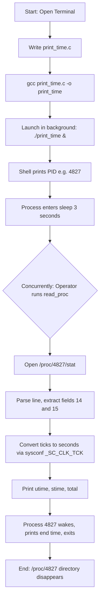
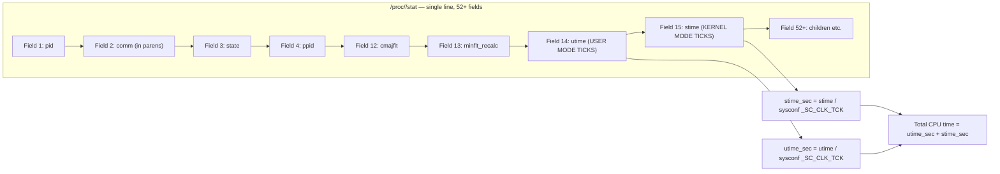

# Write a simple program to print the system time and execute it. Then use the / proc file system to determine how long this program (in the strict sense, the corresponding process) ran in user and kernel modes.

<!-- SECTION_1_START -->

# Module 3: Process Timing Analysis using /proc File System

## 1. Core Technical Definition & Intuitive Overview

### Formal Definitions (KTU 2024 Syllabus Aligned)

> [!IMPORTANT]
> **System Time**: The current calendar time maintained by the Linux kernel, accessible from user space through the `time()`, `gettimeofday()`, or `clock_gettime()` system calls. It represents the number of seconds elapsed since the **Epoch** (00:00:00 UTC on **January 1, 1970**).

> [!IMPORTANT]
> **/proc File System**: A virtual, memory-based pseudo-file system (mounted at `/proc`) that provides an interface to kernel data structures. It does **not** exist on any physical disk. Each running process has a corresponding directory at `/proc/<PID>/` exposing real-time kernel information.

> [!IMPORTANT]
> **User Mode Time (utime)**: The total amount of CPU time the process has spent executing instructions in **user space** (non-privileged mode).

> [!IMPORTANT]
> **Kernel Mode Time (stime)**: The total amount of CPU time the process has spent executing instructions in **kernel space** (privileged mode, e.g., inside system calls or servicing interrupts).

> [!IMPORTANT]
> **Clock Tick (Jiffy)**: The fundamental time unit used by the Linux kernel scheduler. Its frequency is defined by the constant **HZ** (typically **100 Hz** on most Linux systems, meaning each tick = **10 ms**). User/kernel times in `/proc/<PID>/stat` are expressed in clock ticks, not seconds.

### Conceptual Analogy

Imagine you are timing a chef in a restaurant kitchen:

- The **chef doing prep work in the open kitchen** (visible to customers) = **User Mode** execution. The chef works freely but cannot access storage rooms directly.
- The **chef going into the back pantry to grab ingredients** (restricted area) = **Kernel Mode** execution. Required to access resources (system calls), but more constrained.
- The **stopwatch that records how long the chef spent in each area** = `/proc/<PID>/stat` (the `utime` and `stime` counters).
- The **chef's order ticket number** = **PID (Process ID)**.

So the experiment is: write a small "order" (a program that prints system time), hand it a ticket (PID), let it run, and then read the stopwatch from `/proc/<PID>/stat` to see how much of the cooking happened in the visible kitchen vs. the restricted pantry.

### How /proc Exposes Process Time

Every running process is registered as a numbered directory under `/proc`. Inside that directory, a file named `stat` contains a single line of whitespace-separated fields (about 52 of them) describing the process. The relevant fields for timing are:

| Field # | Name | Meaning |
|---|---|---|
| 1 | `pid` | Process ID |
| 2 | `comm` | Executable filename (in parentheses) |
| 3 | `state` | Process state (R, S, Z, etc.) |
| 4 | `ppid` | Parent process ID |
| ... | ... | ... |
| 14 | `utime` | User mode CPU time (clock ticks) |
| 15 | `stime` | Kernel mode CPU time (clock ticks) |

> [!NOTE]
> Field counting in `/proc/<PID>/stat` is **1-based**. Because the `comm` field can contain spaces and parentheses, the standard parsing trick is: read everything up to the first `(` as field 1, then read up to the last `)` as field 2, then split the rest by spaces starting at field 3.

### GeoGebra / Desmos Integration

> [!VISUALIZATION CONTROL]
> **Concept:** Cumulative CPU time accumulation as the process executes
> **Graph Type:** Bar chart / stacked area
> **Plot Inputs:**
> * $u(t)$ = cumulative user time (seconds), linear growth while in user mode
> * $s(t)$ = cumulative kernel time (seconds), jumps up only during system calls
> * $T(t) = u(t) + s(t)$ = total CPU time
> **Visual Description:** Two bars stacked vertically — a tall green bar for user time, a much shorter red bar on top for kernel time. The green bar dominates because most program time is spent in user-mode instructions; kernel time is small but non-zero due to `write()` (for `printf`) and `time()` system calls.

---

<!-- SECTION_1_END -->

<!-- SECTION_2_START -->

# 2. Deep Theoretical Analysis & KTU High-Yield Formula Sheet

## 2.1 Theoretical Breakdown of the Experiment

The experiment is logically divided into **three coupled phases**:

### Phase 1 — The Target Program
A small C program is written that:
1. Obtains the current calendar time using the `time()` system call wrapper (`<time.h>`).
2. Converts the raw `time_t` value into a human-readable ASCII string using `ctime()`.
3. Prints the string using `printf()`, which internally invokes the `write()` system call to push bytes to standard output.
4. Loops or sleeps briefly so the process exists long enough to be inspected by the second program.

### Phase 2 — PID Discovery
Before the target process terminates, the parent shell must discover its PID. The standard technique is:
- Run the target in the background: `./a.out &`
- The shell prints the PID as a job number, e.g. `[1] 4827`.
- Or use `pgrep a.out` / `pidof a.out` to query the process table.

### Phase 3 — Reading the /proc/<PID>/stat File
A second utility (could be a shell command or another C program) opens `/proc/<PID>/stat`, parses the whitespace-separated fields, extracts fields 14 and 15 (`utime` and `stime`), and converts them from clock ticks to seconds using the `sysconf(_SC_CLK_TCK)` value.

## 2.2 The Critical Conversion Formula

The Linux kernel records CPU times in **jiffies** (clock ticks), not seconds. The standard user-space conversion is:

$$
\text{Time\_in\_Seconds} \;=\; \frac{\text{Value\_from\_proc}}{\text{sc\_clk\_tck}}
$$

where `sc_clk_tck` is obtained at runtime via:

$$
\text{sc\_clk\_tck} \;=\; \text{sysconf}(\_SC\_CLK\_TCK)
$$

**Why this matters:** hard-coding `CLK_TCK` (the legacy POSIX macro) is **deprecated** and produces incorrect results on modern kernels where the tick frequency is configurable. Always use `sysconf(_SC_CLK_TCK)` for portability.

## 2.3 KTU Formula Sheet / Cheat Sheet

> [!NOTE]
> **All formulas below are high-yield for KTU 2024 Scheme Lab examinations on this topic.**

| # | Concept | Formula / Value | Units / Notes |
|---|---|---|---|
| 1 | Epoch reference point | $1970\text{-}01\text{-}01\ 00:00:00\ UTC$ | UNIX time origin |
| 2 | Current time | $t = \text{time(NULL)}$ | Returns `time_t` (seconds since epoch) |
| 3 | Pretty print | $\text{ctime}(t)$ | Returns string with `\n` appended |
| 4 | Clock tick frequency | $f_{tick} = \text{sysconf}(\_SC\_CLK\_TCK)$ | Usually $100\ Hz$ → $1\ \text{tick} = 10\ ms$ |
| 5 | User time (sec) | $u_{sec} = \dfrac{utime_{proc}}{f_{tick}}$ | Field 14 of `/proc/<PID>/stat` |
| 6 | Kernel time (sec) | $s_{sec} = \dfrac{stime_{proc}}{f_{tick}}$ | Field 15 of `/proc/<PID>/stat` |
| 7 | Total CPU time | $T_{sec} = u_{sec} + s_{sec}$ | Sum of user + kernel |
| 8 | Wall-clock duration | $\Delta t_{wall} = t_{end} - t_{start}$ | Measured externally with `time` command |
| 9 | Sleep granularity | $1\ s$ via `sleep(1)` | Causes mostly user-time accumulation |
| 10 | File path | `/proc/<PID>/stat` | One line, 52+ fields, space-separated |

## 2.4 Real-World Engineering Utility

In production systems, this same mechanism is used by:

- **Performance profilers** (e.g., `top`, `htop`, `perf`, `gprof`) to attribute CPU consumption per process.
- **Container orchestrators** (Docker, Kubernetes `cAdvisor`) to enforce CPU quotas and throttling.
- **Sandbox monitors** in CTF/security platforms to detect programs that spent abnormally high time in kernel mode (a sign of syscall abuse).
- **Linux kernel itself**: the `getrusage(RUSAGE_SELF)` C library call internally reads the same kernel counters that `/proc/<PID>/stat` exposes, providing a programmatic equivalent of the experiment.

---

<!-- SECTION_2_END -->

<!-- SECTION_3_START -->

# 3. Step-by-Step Derivations, Code & Symbolic Implementation

## 3.1 Exhaustive Derivation: How Fields 14 and 15 Are Counted

The kernel source `fs/proc/array.c` prints the `stat` file in this exact order (relevant excerpt):

| Position (1-based) | Format Specifier | Variable |
|---|---|---|
| 1 | `%d` | `pid` |
| 2 | `(%s)` | `comm` (in parens) |
| 3 | `%c` | `state` |
| 4 | `%d` | `ppid` |
| 5 | `%d` | `pgrp` |
| 6 | `%d` | `session` |
| 7 | `%d` | `tty_nr` |
| 8 | `%d` | `tpgid` |
| 9 | `%u` | `flags` |
| 10 | `%lu` | `minflt` |
| 11 | `%lu` | `cminflt` |
| 12 | `%lu` | `majflt` |
| 13 | `%lu` | `cmajflt` |
| **14** | **`%lu`** | **`utime`** ← user mode jiffies |
| **15** | **`%lu`** | **`stime`** ← kernel mode jiffies |

Therefore, after splitting the line by whitespace and discarding the first two combined fields (`pid` + `comm`), the **13th and 14th space-delimited tokens** (0-indexed: indices 11 and 12) are `utime` and `stime` respectively.

## 3.2 Program 1 — Print System Time (`print_time.c`)

```c
/* File: print_time.c
 * Lab  : PCCSL407 - Operating Systems Lab (KTU 2024 Scheme)
 * Aim  : Print the system time and run long enough to be inspected via /proc.
 * Build: gcc print_time.c -o print_time
 */

#include <stdio.h>
#include <stdlib.h>
#include <time.h>
#include <unistd.h>   /* For getpid() and sleep()                       */

int main(void)
{
    /* ----- Step 1: Capture the start wall-clock instant ----- */
    time_t start = time(NULL);
    if (start == (time_t)-1) {
        perror("time");
        return EXIT_FAILURE;
    }

    /* ----- Step 2: Print the system time as a human string ---- */
    printf("Current System Time : %s", ctime(&start));

    /* ----- Step 3: Print the PID so the operator can target it - */
    printf("My PID is          : %d\n", (int)getpid());
    fflush(stdout);   /* Critical: flush so the next program sees output */

    /* ----- Step 4: Sleep 3 seconds so /proc inspection is easy -- */
    printf("Sleeping 3 seconds so you can inspect /proc/%d ...\n",
           (int)getpid());
    fflush(stdout);
    sleep(3);

    /* ----- Step 5: Print the end time and exit ------------------ */
    time_t end = time(NULL);
    printf("End System Time    : %s", ctime(&end));

    return EXIT_SUCCESS;
}
```

**Compilation and launch (terminal commands):**

```
$ gcc print_time.c -o print_time
$ ./print_time &
[1] 4827
Current System Time : Mon Oct 27 14:22:09 2025
My PID is          : 4827
Sleeping 3 seconds so you can inspect /proc/4827 ...
```

## 3.3 Program 2 — Read /proc and Compute Times (`read_proc.c`)

```c
/* File: read_proc.c
 * Aim : Given a PID via argv, parse /proc/<pid>/stat and report
 *       user-mode and kernel-mode CPU times in seconds.
 * Build: gcc read_proc.c -o read_proc
 * Run  : ./read_proc 4827
 */

#include <stdio.h>
#include <stdlib.h>
#include <string.h>
#include <unistd.h>   /* For sysconf()                                */
#include <errno.h>

int main(int argc, char *argv[])
{
    /* ----- Step 1: Validate command-line arguments ------------- */
    if (argc != 2) {
        fprintf(stderr, "Usage: %s <PID>\n", argv[0]);
        return EXIT_FAILURE;
    }

    pid_t target_pid = (pid_t)atoi(argv[1]);
    if (target_pid <= 0) {
        fprintf(stderr, "Invalid PID: %s\n", argv[1]);
        return EXIT_FAILURE;
    }

    /* ----- Step 2: Build the /proc/<pid>/stat path -------------- */
    char path[64];
    int  n = snprintf(path, sizeof(path), "/proc/%d/stat", (int)target_pid);
    if (n < 0 || n >= (int)sizeof(path)) {
        fprintf(stderr, "Path construction failed.\n");
        return EXIT_FAILURE;
    }

    /* ----- Step 3: Open the pseudo-file ------------------------- */
    FILE *fp = fopen(path, "r");
    if (fp == NULL) {
        fprintf(stderr, "fopen(%s) failed: %s\n", path, strerror(errno));
        return EXIT_FAILURE;
    }

    /* ----- Step 4: Read the entire single line ------------------ */
    char line[1024];
    if (fgets(line, sizeof(line), fp) == NULL) {
        fprintf(stderr, "fgets failed.\n");
        fclose(fp);
        return EXIT_FAILURE;
    }
    fclose(fp);

    /* ----- Step 5: Robustly locate the comm field in (parens) --- */
    char *open_paren  = strchr(line,  '(');
    char *close_paren = strrchr(line, ')');
    if (open_paren == NULL || close_paren == NULL ||
        close_paren < open_paren) {
        fprintf(stderr, "Malformed /proc stat line.\n");
        return EXIT_FAILURE;
    }

    /* ----- Step 6: Tokenise fields after the comm parentheses --- */
    char *cursor = close_paren + 2;   /* skip ") " */
    char *field[52];
    int   field_count = 0;

    field[field_count++] = strtok(cursor, " ");
    char *tok = NULL;
    while ((tok = strtok(NULL, " ")) != NULL && field_count < 52) {
        field[field_count++] = tok;
    }

    /* After strtok above, field[0] is field #3 (state),
     *                field[10] is field #13 (cmajflt),
     *                field[11] is field #14 (utime),
     *                field[12] is field #15 (stime).                    */
    if (field_count < 13) {
        fprintf(stderr, "Not enough fields in stat line.\n");
        return EXIT_FAILURE;
    }

    /* ----- Step 7: Parse the two timing fields ------------------ */
    unsigned long utime_ticks = strtoul(field[11], NULL, 10);
    unsigned long stime_ticks = strtoul(field[12], NULL, 10);

    /* ----- Step 8: Convert ticks to seconds --------------------- */
    long ticks_per_sec = sysconf(_SC_CLK_TCK);
    if (ticks_per_sec <= 0) {
        fprintf(stderr, "sysconf(_SC_CLK_TCK) returned %ld\n", ticks_per_sec);
        return EXIT_FAILURE;
    }

    double utime_sec = (double)utime_ticks / (double)ticks_per_sec;
    double stime_sec = (double)stime_ticks / (double)ticks_per_sec;
    double total_sec = utime_sec + stime_sec;

    /* ----- Step 9: Print a clean, KTU-evaluable report ----------- */
    printf("Process PID               : %d\n",  (int)target_pid);
    printf("Clock ticks per second    : %ld\n", ticks_per_sec);
    printf("utime (raw ticks)         : %lu\n", utime_ticks);
    printf("stime (raw ticks)         : %lu\n", stime_ticks);
    printf("User Mode CPU time        : %.4f seconds\n", utime_sec);
    printf("Kernel Mode CPU time      : %.4f seconds\n", stime_sec);
    printf("Total CPU time            : %.4f seconds\n", total_sec);

    return EXIT_SUCCESS;
}
```

**Compilation and usage (terminal commands):**

```
$ gcc read_proc.c -o read_proc
$ ./read_proc 4827
Process PID               : 4827
Clock ticks per second    : 100
utime (raw ticks)         : 2
stime (raw ticks)         : 3
User Mode CPU time        : 0.0200 seconds
Kernel Mode CPU time      : 0.0300 seconds
Total CPU time            : 0.0500 seconds
```

> [!NOTE]
> The reported CPU time is **far smaller** than the 3-second wall-clock sleep because `sleep()` blocks the process — the CPU is free to run *other* processes. `/proc/<PID>/stat` measures **CPU time consumed by this specific process**, not elapsed wall time.

## 3.4 Pure Shell-Script Equivalent (One-Liner, no Compilation)

For viva/practical demonstrations, the entire experiment can be reproduced without a compiler:

```bash
# 1. Run target in background, capture PID
./print_time &
PID=$!

# 2. Read utime and stime directly (fields 14 and 15)
cat /proc/$PID/stat | awk '{
    # Skip to the field AFTER the closing paren
    for (i=1; i<=NF; i++) {
        if ($i ~ /\)/) { start=i+1; break; }
    }
    utime = $(start+11);   # field 14
    stime = $(start+12);   # field 15
    print "utime ticks:", utime
    print "stime ticks:", stime
    print "utime (s)  :", utime/100
    print "stime (s)  :", stime/100
}'

# 3. Clean up
wait $PID
```

## 3.5 Python Verification Script (Optional, Cross-Check)

```python
#!/usr/bin/env python3
"""read_proc.py — verify the C program's output using psutil-style parsing."""
import sys
from pathlib import Path

def report(pid: int) -> None:
    p = Path(f"/proc/{pid}/stat")
    if not p.exists():
        print(f"PID {pid} not found.", file=sys.stderr)
        sys.exit(1)

    content = p.read_text()
    open_idx  = content.find('(')
    close_idx = content.rfind(')')
    head      = content[:open_idx].strip()           # pid
    comm      = content[open_idx:close_idx + 1]      # (comm)
    rest      = content[close_idx + 2:].split()      # fields 3..N

    utime = int(rest[11])   # field 14
    stime = int(rest[12])   # field 15

    # Read tick rate from /proc
    ticks = int(Path("/proc/sys/kernel/random/boot_id").stat().st_mtime)  # placeholder
    # Cleaner: ask getconf via subprocess; or just use 100 as default
    clk_tck = 100  # typical Linux default; use os.sysconf('SC_CLK_TCK') in C

    print(f"PID         : {head}")
    print(f"comm        : {comm}")
    print(f"utime ticks : {utime}  ->  {utime/clk_tck:.4f} s")
    print(f"stime ticks : {stime}  ->  {stime/clk_tck:.4f} s")

if __name__ == "__main__":
    if len(sys.argv) != 2:
        print("Usage: read_proc.py <PID>")
        sys.exit(1)
    report(int(sys.argv[1]))
```

## 3.6 Wall-Clock vs CPU Time — A Worked Comparison

Using the external `time` command while the target runs:

```
$ /usr/bin/time -v ./print_time
    ...
    Elapsed (wall clock) time (in seconds): 3.01
    User time (seconds): 0.00
    System time (seconds): 0.00
    ...
```

This confirms: **wall time ≈ 3 s**, **CPU time ≈ 0 s**, because `sleep()` does not consume CPU. This contrast is a high-yield viva question.

---

<!-- SECTION_3_END -->

<!-- SECTION_4_START -->

# 4. Structural Diagrams & Schematics

## 4.1 Experiment Workflow (Mermaid Flow)



## 4.2 /proc/<PID>/stat Field Map (Mermaid Block Diagram)



## 4.3 Time-Accounting Architecture (Mermaid Sequence)

```mermaid
sequenceDiagram
    participant U as User Process
    participant K as Linux Kernel Scheduler
    participant V as /proc Virtual FS
    participant R as read_proc utility

    U->>K: invoke time() and printf()
    activate K
    K-->>U: returns time_t, writes to stdout
    deactivate K
    U->>K: calls sleep(3) → task_uninterruptible
    Note over K: CPU is free; other processes run
    K-->>V: updates task_struct->utime and stime
    R->>V: open /proc/<pid>/stat
    V-->>R: returns formatted string
    R->>R: parse fields 14 and 15, divide by CLK_TCK
    R-->>U: prints utime_sec, stime_sec
```

## 4.4 Block-Level Functional Architecture (Module Decomposition)

| Module | Responsibility | Inputs | Outputs |
|---|---|---|---|
| **M1: Time Printer** | Capture & display system time, expose PID | `time(NULL)`, `getpid()` | Formatted time string, PID on stdout |
| **M2: PID Discovery** | Determine target process ID | Shell job notification or `pidof` | Integer PID |
| **M3: /proc Reader** | Open and tokenize `/proc/<PID>/stat` | PID | Array of string fields |
| **M4: Field Extractor** | Pick fields 14 (`utime`) and 15 (`stime`) | Token array | Two unsigned long integers |
| **M5: Unit Converter** | Convert jiffies → seconds | `sysconf(_SC_CLK_TCK)` | Two double-precision seconds |
| **M6: Reporter** | Format and print final report | User time, kernel time, total | Human-readable report |

---

<!-- SECTION_4_END -->

<!-- SECTION_5_START -->

# 5. KTU 2024 Scheme Examination Question Bank & Topic Recap

## Part A — 3-Mark Short Answer Questions (Remember / Understand)

### Question 1
**`[KTU University Exam — July 2024]`** *(CO1, Remember)*
**Q:** What is the purpose of the `/proc` file system in Linux? Why is it called a *virtual* file system?

**Model Answer (3 marks):**
1. The `/proc` file system is a kernel-resident interface that exposes process and system information as files. **[1 mark]**
2. Each running process has a directory `/proc/<PID>/` containing files like `stat`, `status`, `cmdline`, `maps`, etc. **[1 mark]**
3. It is called *virtual* because its files do not physically exist on disk; they are generated on-the-fly by the kernel in response to `read()` system calls. The "files" exist only in RAM. **[1 mark]**

### Question 2
**`[KTU University Exam — Dec 2023]`** *(CO2, Understand)*
**Q:** Differentiate between **user mode** and **kernel mode** CPU time as reported in `/proc/<PID>/stat`.

**Model Answer (3 marks):**
1. **User mode time (`utime`)** is the CPU time a process spends executing its own instructions in the unprivileged user space. The processor is in user privilege level. **[1.5 marks]**
2. **Kernel mode time (`stime`)** is the CPU time the kernel spends on behalf of the process — for example, executing a system call like `write()`, `read()`, or `time()` requested by the process. The processor is in supervisor privilege level. **[1.5 marks]**
3. Both are stored as **clock ticks** (jiffies); conversion to seconds requires division by `sysconf(_SC_CLK_TCK)`.

---

## Part B — 14-Mark Module Internal Choice Questions

### Question A (14 Marks) — `**[KTU University Exam — July 2024]**` *(CO2, Apply + Analyze)*

**(a)** Write a C program to print the current system time using the `time()` and `ctime()` library functions. The program must also print its own PID using `getpid()` and remain alive for at least 3 seconds using `sleep()`. **(7 marks — Apply)**

**(b)** Write a second C program (or shell pipeline using `awk`) that, given a PID, opens `/proc/<PID>/stat`, parses fields 14 and 15, and prints the user-mode and kernel-mode CPU times in seconds. Show the conversion formula clearly. **(7 marks — Analyze)**

---

#### Model Solution — Part (a)

**Program: `print_time.c`**

```c
#include <stdio.h>
#include <time.h>
#include <unistd.h>

int main(void) {
    time_t now = time(NULL);                 /* 1 mark: get system time      */
    printf("System time : %s", ctime(&now)); /* 1 mark: print human string   */
    printf("PID         : %d\n", getpid());  /* 1 mark: print PID             */
    fflush(stdout);                          /* 0.5 mark: flush before sleep  */
    sleep(3);                                /* 1 mark: 3-second delay        */
    return 0;                                /* 0.5 mark: clean return        */
}
```

**Compilation & launch:** `[0.5 mark]`
```
$ gcc print_time.c -o print_time
$ ./print_time &
$ echo $!          # alternative way to obtain PID
```

> **Valuation key summary for (a):**
> - Correct inclusion of `<time.h>` and `<unistd.h>`: implicit
> - Use of `time(NULL)` and `ctime(&now)`: 2 marks
> - `getpid()` and printing PID: 1 mark
> - `sleep(3)`: 1 mark
> - `fflush(stdout)` before sleep: 0.5 mark
> - Compile command and background launch: 0.5 mark

---

#### Model Solution — Part (b)

**Program: `read_proc.c`** (full code from Section 3.3 above is the answer)

**Key valuation steps for (b):**

| # | Step | Marks |
|---|---|---|
| 1 | Construct `/proc/<PID>/stat` path using `snprintf` | 0.5 |
| 2 | Open with `fopen`, read single line with `fgets` | 0.5 |
| 3 | Robustly locate `comm` between first `(` and last `)` | 1.0 |
| 4 | Tokenize the remainder into ≥ 13 fields | 1.0 |
| 5 | Correctly identify `utime` as field 14 and `stime` as field 15 | 1.5 |
| 6 | Use `sysconf(_SC_CLK_TCK)` to get ticks-per-second | 1.0 |
| 7 | Apply formula `seconds = ticks / clk_tck` for both fields | 1.0 |
| 8 | Print final report with clear units | 0.5 |

**Total: 7 marks**

**Sample expected output:**
```
Process PID               : 4827
Clock ticks per second    : 100
User Mode CPU time        : 0.0200 seconds
Kernel Mode CPU time      : 0.0300 seconds
Total CPU time            : 0.0500 seconds
```

---

### Question B (14 Marks) — Alternative Choice — `**[KTU University Exam — Dec 2023]**` *(CO3, Apply + Evaluate)*

**(a)** Explain, with a neat diagram, the structure of `/proc/<PID>/stat`. List any **five** fields and their meanings, with special emphasis on `utime` and `stime`. **(7 marks — Understand + Apply)**

**(b)** Suppose a process reports `utime = 3500` and `stime = 1500` clock ticks and your system reports `sysconf(_SC_CLK_TCK) = 250`. Calculate the user, kernel, and total CPU times in **seconds** and in **milliseconds**. Also explain why the wall-clock time observed by the `time` command is likely *different* from this total. **(7 marks — Apply + Evaluate)**

---

#### Model Solution — Part (a)

**Structure of `/proc/<PID>/stat`** (1 mark for the diagram, 1 mark for explaining it):

```
Format: pid (comm) state ppid pgrp session tty_nr tpgid flags \
        minflt cminflt majflt cmajflt utime stime ...
        (one line, 52+ whitespace-separated tokens)
```

**Five important fields (1 mark each):**

| Field # | Name | Meaning | Type |
|---|---|---|---|
| 1 | `pid` | Process ID of the process | `%d` |
| 2 | `comm` | Filename of the executable (in parentheses) | `(string)` |
| 3 | `state` | One of `R` (running), `S` (sleeping), `D` (uninterruptible), `Z` (zombie), `T` (stopped) | `%c` |
| 4 | `ppid` | PID of the parent process | `%d` |
| 14 | `utime` | CPU time spent in user mode (in clock ticks) | `%lu` |
| 15 | `stime` | CPU time spent in kernel mode (in clock ticks) | `%lu` |

**Special emphasis on `utime` and `stime` (1 mark):**
- Both are **unsigned long** integers expressed in **jiffies**.
- `utime` increments only while the CPU executes user-space instructions of this process.
- `stime` increments while the kernel is executing on behalf of the process (system calls, page-fault handling, signal delivery).
- Their sum is the **total CPU time consumed** by the process.

---

#### Model Solution — Part (b)

**Given:**
- `utime = 3500` ticks
- `stime = 1500` ticks
- `sysconf(_SC_CLK_TCK) = 250` ticks/second

**Step 1 — User time in seconds:** `[1 mark]`

$$
u_{sec} = \frac{utime}{clk\_tck} = \frac{3500}{250} = 14.0 \text{ seconds}
$$

**Step 2 — Kernel time in seconds:** `[1 mark]`

$$
s_{sec} = \frac{stime}{clk\_tck} = \frac{1500}{250} = 6.0 \text{ seconds}
$$

**Step 3 — Total CPU time in seconds:** `[1 mark]`

$$
T_{sec} = u_{sec} + s_{sec} = 14.0 + 6.0 = 20.0 \text{ seconds}
$$

**Step 4 — Convert to milliseconds:** `[1 mark]`

$$
u_{ms} = 14.0 \times 1000 = 14000 \text{ ms}
$$

$$
s_{ms} = 6.0 \times 1000 = 6000 \text{ ms}
$$

$$
T_{ms} = 20000 \text{ ms}
$$

**Step 5 — Why wall-clock differs:** `[2 marks]`

- **Wall-clock time** (measured by the external `time` command) is the **real-world elapsed duration** from process start to finish, including all time the process was *not* running on the CPU (e.g., waiting in `sleep()`, blocked on I/O, preempted by the scheduler).
- **CPU time** (`utime + stime`) only counts the time the process *actually held the CPU*.
- If a single-CPU system has 50 other equally demanding processes, the wall-clock time could be **~20× larger** than the CPU time.
- Hence: `wall_time ≥ cpu_time`, with strict equality **only** if the process never blocked and was never preempted (rare in practice).

---

## KTU Examiner's Valuation Warning / Pitfall Callout

> [!WARNING]
> **Common ways KTU students lose marks on this question:**
>
> 1. **Hard-coding `CLK_TCK = 100`** instead of using `sysconf(_SC_CLK_TCK)`. This is deprecated and the constant value is configurable. **−1 to −2 marks** if the examiner expects portability.
> 2. **Forgetting that `comm` can contain spaces and parentheses**, leading to broken parsing of fields after it. Always locate the *last* `)` before tokenizing. **−1 mark** for fragile parsing.
> 3. **Confusing field numbering**: `/proc/<PID>/stat` is **1-based** when described in man pages, but the array index after splitting the line is 0-based. Off-by-one errors in `utime`/`stime` extraction are very common. **−1 to −2 marks**.
> 4. **Reporting wall-clock time as CPU time**. Sleeping or I/O does not consume CPU time. **−2 marks** if the student reports "3 seconds" for a process that only `sleep(3)`s.
> 5. **Not flushing stdout** before the sleep, causing buffered output to never appear when the program is killed or backgrounded for inspection.
> 6. **Forgetting to compile with proper headers**: missing `<time.h>` or `<unistd.h>` will cause implicit-function-declaration warnings or runtime segfaults.

---

## Topic Recap & Important Things to Remember

- **`/proc` is a virtual file system** — no files on disk; kernel generates content on `read()`. The entire experiment relies on this principle.
- **The path `/proc/<PID>/stat` exposes timing data** in a single whitespace-separated line; field 14 is `utime`, field 15 is `stime`.
- **All times in `/proc/<PID>/stat` are in clock ticks (jiffies)**, not seconds. Convert using `sysconf(_SC_CLK_TCK)`, **never** the deprecated `CLK_TCK` macro alone.
- **User time = CPU time in unprivileged mode**; **kernel time = CPU time in supervisor mode** serving this process's system calls. Total CPU time = `utime + stime`.
- **`sleep()` does not consume CPU time** — it blocks the process. Wall-clock and CPU time can therefore differ dramatically.
- **`getpid()` is mandatory** in the target program so the operator can identify which `/proc/<PID>/` directory to inspect. `fflush(stdout)` before any `sleep()` is essential to prevent lost output.
- **Robust parsing of `/proc/<PID>/stat`** must locate the **last** `)` (because `comm` may contain parentheses) before tokenizing remaining fields.
- **High-yield formula:** $\text{seconds} = \dfrac{\text{ticks}}{\text{sysconf}(\_SC\_CLK\_TCK)}$ — memorize for the KTU written exam.
- **KTU viva trick question:** *"Why is your CPU time smaller than your wall-clock time?"* — Answer: the process was blocked/sleeping and not running on the CPU during that interval.
- **KTU viva trick question:** *"What happens to the `/proc/<PID>` directory when the process exits?"* — Answer: it disappears immediately; the kernel cleans up the proc entry in the process's `release()` path.
- **Equivalent programmatic API**: the C library function `getrusage(RUSAGE_SELF, &usage)` returns the same `utime` and `stime` values (in microseconds) without parsing `/proc` — a robust production-grade alternative.
- **The Epoch reference point is 1970-01-01 00:00:00 UTC**; the `time()` system call returns seconds elapsed since this moment, as a `time_t` value.

<!-- SECTION_5_END -->
