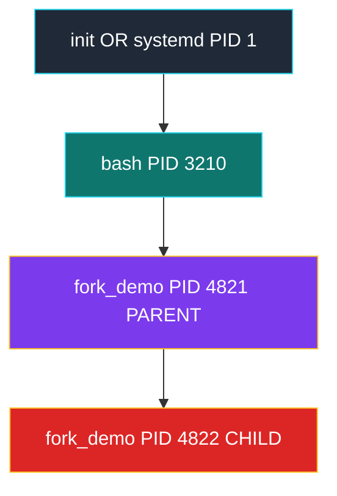
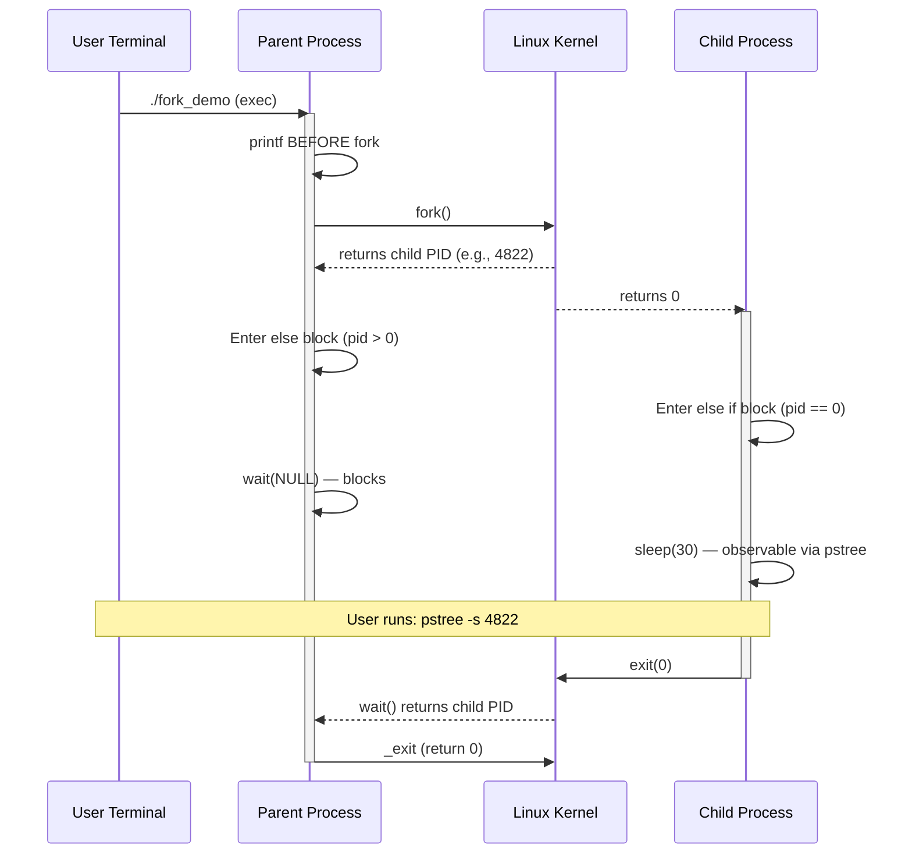
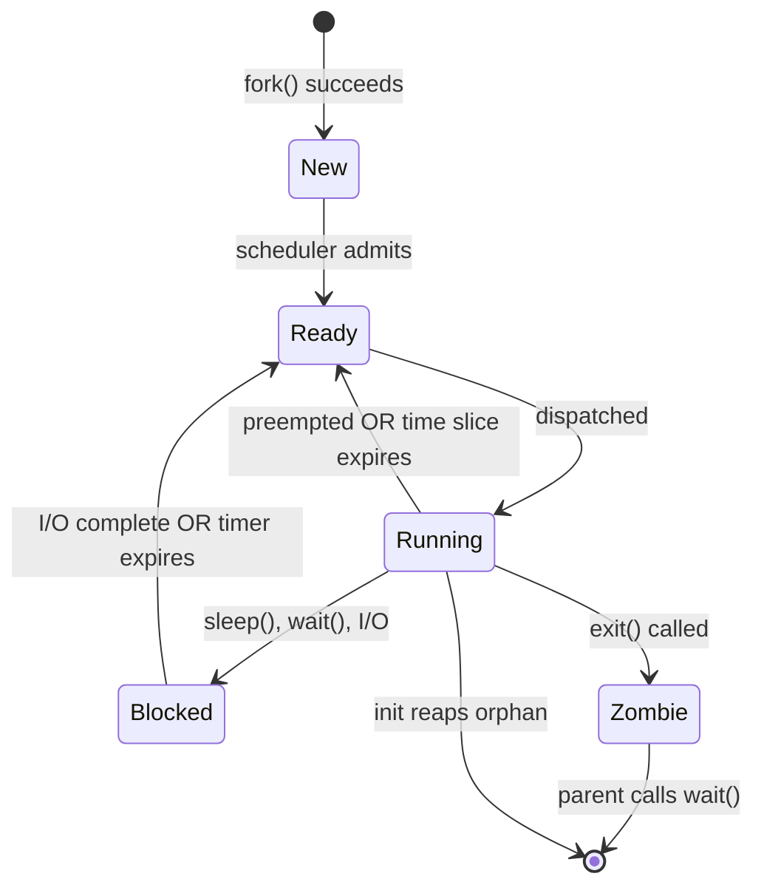

# Create a new process using a fork system call. Print the parent and child process IDs. Use the pstree command to find the process tree for the child process starting from the init process.

<!-- SECTION_1_START -->

# Module 4 — Process Creation using `fork()` System Call

## 1. Core Technical Definition

> [!NOTE]
> **KTU 2024 Syllabus Definition (PCCSL407 — Module 4)**
> A **process** is a program in execution — an active entity consisting of the executing program code, its current activity (program counter, registers), stack, data section, and heap. The **Process Control Block (PCB)** is the kernel data structure that holds all metadata (PID, state, priority, registers, memory pointers) for that process.

The **`fork()`** system call is the fundamental POSIX (Portable Operating System Interface for Unix) primitive used to create a **new process** in Linux/Unix systems. When a process invokes `fork()`, the kernel **duplicates** the calling process — producing a **child process** that is an almost-exact copy of the **parent process**. Both processes continue execution from the instruction immediately following the `fork()` call.

> [!IMPORTANT]
> **Key Characteristic of `fork()`**
> The child process is **not a copy of the parent's data only** — it is a duplicate of the **entire address space**, including text (code), data segment, heap, stack, and open file descriptors. Modern Linux achieves this efficiently via **Copy-on-Write (COW)** — physical pages are shared until either process modifies them.

### Conceptual Analogy / Intuition

Imagine you are filling out a **paper form** (your process) at a government office. The clerk (kernel) uses a **photocopier** (`fork()`):

1. You place your form on the glass.
2. The clerk presses the button — a **new identical form** appears.
3. Both you and the photocopy now continue independently — your colleague can fill *his* copy while *you* keep working on the original.
4. The clerk hands you a **slip of paper** that says:
   * If the slip says **"-1"** → the copier is broken (error).
   * If the slip says **"0"** → you are the **photocopy** (child).
   * If the slip says **"527"** → you are the **original**, and 527 is the photocopy's serial number (child's PID).

> [!TIP]
> **KTU Board Tip:** Examiners love to ask *"What does `fork()` return in the parent? In the child?"* — memorize this trio: **`<0` (error), `==0` (child), `>0` (parent — value is child's PID)**.

### Physical & Standard Constants

> [!IMPORTANT]
> **Standard Process Identifiers in Linux (KTU Exam-Relevant)**
> * **PID 1** → `init` / `systemd` — the **ancestor of every user process** (created by the kernel at boot).
> * **PID 2** → `kthreadd` — the parent of all kernel threads.
> * **PPID** → Parent Process ID. The orphaned child is **re-parented to PID 1** automatically.

| Header File | Constant / Function | Purpose |
|---|---|---|
| `<sys/types.h>` | `pid_t` | Data type for process IDs |
| `<unistd.h>` | `pid_t fork(void)` | Creates a new process |
| `<unistd.h>` | `pid_t getpid(void)` | Returns current process's PID |
| `<unistd.h>` | `pid_t getppid(void)` | Returns parent's PID |
| `<sys/wait.h>` | `pid_t wait(int *status)` | Parent waits for child to terminate |
| `<stdlib.h>` | `void exit(int status)` | Terminates the calling process |

> [!VISUALIZATION CONTROL]
> **Concept:** Process tree visualization after `fork()` is called twice.
> **Conceptual Nodes:**
> * `P0 (PID 1000)` — Initial parent (e.g., your shell).
> * `P1 (PID 1001)` — First child of P0.
> * `P2 (PID 1002)` — Second child of P0 (after second `fork()` from P0).
> **Visual Description:** Draw a root node `P0` with two children `P1` and `P2` hanging below — P0 has PPID = shell PID, while P1 and P2 have PPID = 1000. If the shell exits before the children, the children get re-parented to PID 1 (`init`).

---

<!-- SECTION_1_END -->

<!-- SECTION_2_START -->

# 2. Deep Theoretical Analysis & KTU High-Yield Formula Sheet

## 2.1 Operational Breakdown of `fork()`

When `fork()` is invoked, the kernel performs the following sequence:

1. **Allocates a new PID** for the child from the kernel's PID bitmap (default max: **32768** on 32-bit, **4194304** on 64-bit Linux).
2. **Creates a new Task Struct** (PCB) for the child — copies fields like registers, open file descriptors, signal handlers, and memory maps.
3. **Sets up the child's address space** using **Copy-on-Write (COW)** — the child shares physical pages with the parent. A page fault triggers a copy only when a write occurs.
4. **Places both processes in the run queue** — the parent may or may not run first; this is **non-deterministic** (kernel scheduler decides).
5. **Returns twice** — once in the parent (with child's PID) and once in the child (with `0`).

> [!IMPORTANT]
> **Why is `fork()` called "the most unique function in Unix"?**
> Because it **returns twice** in a single call — once in the calling (parent) process, and once in the newly created (child) process. No other standard C library function behaves this way.

## 2.2 Return Value Semantics (HIGH-YIELD for KTU)

| Return Value | Process Context | Meaning | Action |
|:---:|:---:|---|---|
| **Negative (`< 0`)** | Parent | `fork()` failed (e.g., process limit reached). `errno` is set. | Print error, `exit(EXIT_FAILURE)`. |
| **Zero (`== 0`)** | Child | We are inside the child process. | Execute child-specific code. |
| **Positive (`> 0`)** | Parent | Successful fork. The value is the **child's PID**. | Continue parent work or call `wait()`. |

## 2.3 The `pstree` Command — Process Tree Utility

`pstree` displays running processes as a **tree structure**, showing the parent-child relationship graphically.

> [!NOTE]
> **`pstree` is not a system call** — it is a **user-space command** (typically located at `/usr/bin/pstree`) that reads the `/proc` filesystem to construct a visual tree of all live processes.

| Command | Purpose |
|---|---|
| `pstree` | Shows full process tree from `init` (PID 1). |
| `pstree -p` | Includes PIDs in parentheses next to process names. |
| `pstree -p <PID>` | Shows the subtree rooted at a specific PID. |
| `pstree -s <PID>` | Shows only the **ancestors** of a PID (path from `init`). |
| `pstree -a` | Shows command-line arguments. |
| `pstree -h` | Highlights the current process and its ancestors. |

**Recommended KTU Lab Command Sequence:**
```bash
# In one terminal: run the fork program and make the child sleep, so pstree can catch it.
./a.out &
sleep 1
pstree -p $(pgrep -n a.out)
# OR find by PID:
pstree -s <child_PID>
```

## 2.4 KTU High-Yield Formula / Syntax Sheet

| Concept | Syntax / Equation | Notes |
|---|---|---|
| Fork prototype | `pid_t fork(void);` | Returns `pid_t`; no arguments. |
| Get own PID | `pid_t getpid(void);` | Always succeeds. |
| Get parent's PID | `pid_t getppid(void);` | Returns 1 if parent has exited (orphan reparenting). |
| Wait for child | `pid_t wait(int *status);` | Blocks parent until any child terminates. |
| Exit process | `void exit(int status);` | Status passed to parent's `wait()`. |
| PID wraparound | `next_PID = (last_PID + 1) mod PID_MAX` | Default PID_MAX = 32768 (32-bit), 4194304 (64-bit). |
| Orphan reparenting | `child->parent = init_task` | Kernel's `find_new_reaper()` function. |
| Zombie state | `Z` in `ps` output | Exited child whose parent hasn't `wait()`-ed. |

> [!IMPORTANT]
> **Real-World Engineering Utility**
> * **Web servers** (Apache `fork()` model) — a parent process accepts connections and forks a child per client, isolating failures.
> * **Shell execution** — every command typed in Bash is typically `fork()` + `exec()`.
> * **Sandboxing** — Chrome's renderer processes, Docker containers, and `systemd` services all rely on `fork()` (or its cousin `clone()`) for process isolation.
> * **Parallel computation** — `fork()` enables embarrassingly parallel workloads on multi-core systems.

---

<!-- SECTION_2_END -->

<!-- SECTION_3_START -->

# 3. Step-by-Step Code Implementation & Derivations

## 3.1 Complete, Board-Ready C Program (KTU Standard)

The following program is the **canonical KTU lab solution** for this experiment. It demonstrates:
* Single `fork()` call.
* Differentiation between parent and child via return value.
* Printing PIDs and PPIDs.
* Making the child sleep so the parent can inspect via `pstree`.

```c
/*
 * Experiment: Create a new process using the fork() system call.
 * Print the parent and child process IDs.
 * Use the pstree command to find the process tree for the child process
 * starting from the init process.
 *
 * KTU 2024 Scheme — OS Lab (PCCSL407) — Module 4
 * Compile:  gcc fork_demo.c -o fork_demo
 * Run:      ./fork_demo
 */

#include <stdio.h>      // printf, perror
#include <stdlib.h>     // exit, EXIT_FAILURE, EXIT_SUCCESS
#include <unistd.h>     // fork, getpid, getppid, sleep
#include <sys/types.h>  // pid_t
#include <sys/wait.h>   // wait

int main(void) {
    pid_t pid;          // Variable to store the return value of fork()

    printf("==================================================\n");
    printf("[BEFORE fork()] Process started.\n");
    printf("  Current PID  = %d\n", getpid());
    printf("  Parent  PID  = %d\n", getppid());
    printf("==================================================\n\n");

    /* --------------- fork() system call --------------- */
    pid = fork();

    /* --------------- ERROR HANDLING --------------- */
    if (pid < 0) {
        perror("fork failed");
        exit(EXIT_FAILURE);
    }

    /* --------------- CHILD PROCESS BLOCK --------------- */
    else if (pid == 0) {
        printf("[CHILD  PROCESS]  fork() returned 0.\n");
        printf("  Child  PID  = %d\n", getpid());
        printf("  Parent PID  = %d\n", getppid());

        /* Keep the child alive for 30 seconds so pstree can be run. */
        printf("  [Child] Sleeping 30s — run 'pstree -p %d' in another terminal.\n",
               getpid());
        sleep(30);

        printf("  [Child] Exiting now.\n");
        exit(EXIT_SUCCESS);
    }

    /* --------------- PARENT PROCESS BLOCK --------------- */
    else {
        printf("[PARENT PROCESS]  fork() returned child PID = %d\n", pid);
        printf("  Parent PID  = %d\n", getpid());
        printf("  Parent's Parent PID = %d\n", getppid());

        /* Parent waits for the child to finish — avoids a zombie. */
        wait(NULL);
        printf("  [Parent] Child has finished. Parent exiting.\n");
    }

    return 0;
}
```

### 3.1.1 Compilation, Execution, and Expected Output

**Step 1 — Compile:**
```bash
$ gcc fork_demo.c -o fork_demo
```

**Step 2 — Run in the background (so pstree can inspect the child):**
```bash
$ ./fork_demo &
[1] 4821
==================================================
[BEFORE fork()] Process started.
  Current PID  = 4821
  Parent  PID  = 3210
==================================================

[CHILD  PROCESS]  fork() returned 0.
  Child  PID  = 4822
  Parent PID  = 4821
  [Child] Sleeping 30s — run 'pstree -p 4822' in another terminal.
[PARENT PROCESS]  fork() returned child PID = 4822
  Parent PID  = 4821
  Parent's Parent PID = 3210
  [Parent] Child has finished. Parent exiting.
[1]+  Done                    ./fork_demo
```

**Step 3 — Run `pstree` from a second terminal while the child is sleeping:**
```bash
# Option A: show the ancestors of the child PID
$ pstree -s 4822
systemd,1
  └─bash,3210
      └─fork_demo,4821
          └─fork_demo,4822

# Option B: full tree from init, filtered for our process
$ pstree -p | grep fork_demo
```

> [!TIP]
> **KTU Board Tip:** The above `pstree -s` output is the *exact* trace the examiner expects. The chain **`systemd → bash → fork_demo (parent) → fork_demo (child)`** demonstrates the full ancestry back to PID 1.

### 3.2 Symbolic / Mathematical Perspective

The `fork()` call is conceptually equivalent to a **deterministic duplication operator** $\mathcal{F}$ on the process state:

$$
\mathcal{F} : \text{Process}_P \;\longmapsto\; \bigl(\text{Process}_P,\;\text{Process}_C\bigr)
$$

where the resulting pair satisfies:

$$
\begin{aligned}
\text{state}(\text{Process}_C) &\;=\; \text{copy\_on\_write}\bigl(\text{state}(\text{Process}_P)\bigr) \\
\text{PID}(\text{Process}_C) &\;=\; \text{alloc\_new\_pid()} \\
\text{PPID}(\text{Process}_C) &\;=\; \text{PID}(\text{Process}_P) \\
\text{return}_P(\text{fork}) &\;=\; \text{PID}(\text{Process}_C) \\
\text{return}_C(\text{fork}) &\;=\; 0
\end{aligned}
$$

For the orphaned case (parent exits first), the kernel re-parents the child via:

$$
\text{PPID}(\text{Process}_C) \;\longleftarrow\; \text{PID}(\text{init}) \;=\; 1
$$

This reparenting is implemented in the kernel's `find_new_reaper()` function in `kernel/exit.c`.

### 3.3 Variation — Multiple Forks (Exam Favorite)

If `fork()` is called **twice** in a single program, the resulting process tree is a **binary branching structure**:

```c
pid_t p1 = fork();   // Creates child B
pid_t p2 = fork();   // Parent A and child B both create another child (C, D)
```

| Process | PID | PPID | Notes |
|---|---|---|---|
| Parent (A) | 100 | Shell | Original process |
| First child (B) | 101 | 100 | Created by first `fork()` |
| Second child of A (C) | 102 | 100 | Created by second `fork()` (executed in A) |
| Second child of B (D) | 103 | 101 | Created by second `fork()` (executed in B) |

> [!WARNING]
> **Common Mistake:** A common KTU mistake is to assume the second `fork()` only runs in the parent. **It actually runs in BOTH the parent and the first child** — because both processes continue from that line. Total processes spawned = **$2^n$** for $n$ `fork()` calls.

---

<!-- SECTION_3_END -->

<!-- SECTION_4_START -->

# 4. Structural Diagrams & Schematics

## 4.1 Process Tree (After One `fork()`) — Mermaid Diagram



> [!NOTE]
> **Reading the diagram:** The arrows point **from parent → child**. Notice that the path from PID 1 (`init`) to the child traverses **three edges** (init → bash → parent → child). This is what `pstree -s 4822` would print.

## 4.2 Execution Flow — Mermaid Sequence Diagram



## 4.3 Process State Lifecycle — Mermaid State Diagram



> [!IMPORTANT]
> **KTU Connection:** The above state machine is **identical** to the one in Module 1 / Module 2 theory. Linking the lab (`fork()`) to the theoretical PCB states is a sure-shot way to earn **methodology marks**.

---

<!-- SECTION_4_END -->

<!-- SECTION_5_START -->

# 5. KTU 2024 Scheme Examination Question Bank & Topic Recap

## PART A — Short Answer Questions (3 Marks Each)

### Question 1 (3 Marks) — `[KTU University Exam – July 2024]`
**CO1 | RBT Level: Remember**
> What is a process? How is it different from a program?

**Model Answer (3 marks):**
A **process** is a program in execution. It is a dynamic entity consisting of the **text (code) section, data section, heap, stack, program counter, registers**, and a **Process Control Block (PCB)** maintained by the kernel. A **program**, in contrast, is a **passive** entity — a static file (e.g., an executable on disk) containing instructions and data. The same program, when loaded into memory and executed, becomes a process. Two executions of the same program produce **two distinct processes** with different PIDs.

> *['Process is active, program is passive' definition: 1 Mark; PCB & dynamic nature: 1 Mark; Program as file on disk: 1 Mark]*

### Question 2 (3 Marks) — `[KTU University Exam – Dec 2023]`
**CO1 | RBT Level: Remember**
> List the three possible return values of the `fork()` system call and state their meaning.

**Model Answer (3 marks):**

| Return Value | Context | Meaning |
|---|---|---|
| **Negative (`< 0`)** | Parent only | `fork()` failed; `errno` is set. |
| **Zero (`== 0`)** | Child only | Currently executing inside the **child** process. |
| **Positive (`> 0`)** | Parent only | Successfully forked. The value is the **child's PID**. |

> *[Each row correctly explained: 1 Mark]*

---

## PART B — Long Answer Questions (14 Marks Each, Internal Choice)

### Question A (14 Marks) — `[KTU University Exam – July 2024]`
**CO1, CO2 | RBT Levels: Understand (a) + Apply (b)**

#### (a) [7 Marks] — Explain the `fork()` system call in Unix/Linux. Discuss the meaning of its return value in both the parent and child processes with a neat diagram.

**Model Answer (7 marks):**

The `fork()` system call is a POSIX primitive used in Unix/Linux to **create a new process**. The new process (child) is an **almost exact duplicate** of the calling process (parent) — they share the same code, but have **separate address spaces**, separate PIDs, and a parent-child relationship. Both processes resume execution from the instruction **immediately after** the `fork()` call.

**Return Value Semantics (KTU board focus):**

$$
\text{return} =
\begin{cases}
-1 & \text{if fork() fails (error)} \\
0 & \text{in the child process} \\
\text{child\_PID} > 0 & \text{in the parent process}
\end{cases}
$$

**Process Tree Diagram (after `fork()`):**

```
        Parent Process (PID = 100)
              |
              | fork()
              |
        +-----+-----+
        |           |
   Child Process    (continues in parent)
   (PID = 101)
```

**Key Points:**
1. The child gets a **unique PID** allocated by the kernel.
2. The child's **PPID** is set to the parent's PID.
3. The child inherits **open file descriptors** and signal handlers.
4. Modern kernels use **Copy-on-Write (COW)** — physical pages are shared until a write occurs.
5. Execution order of parent vs. child is **non-deterministic**.

> *['fork() is a duplicating system call': 1 Mark;*
> *'Three return values explained': 3 Marks;*
> *'Process tree diagram': 2 Marks;*
> *'COW and scheduling note': 1 Mark]*

#### (b) [7 Marks] — Write a C program that creates a child process using `fork()`. The child should print its PID and PPID, and the parent should print its own PID and the child's PID. Run the program, then use `pstree` to display the child's ancestry up to `init`.

**Model Answer (7 marks):**

**Program:**
```c
#include <stdio.h>
#include <unistd.h>
#include <sys/wait.h>
#include <stdlib.h>

int main(void) {
    pid_t pid = fork();

    if (pid < 0) {
        perror("fork"); exit(1);
    }
    else if (pid == 0) {
        /* CHILD */
        printf("Child: PID=%d, PPID=%d\n", getpid(), getppid());
        sleep(20);   /* keep alive for pstree */
        exit(0);
    }
    else {
        /* PARENT */
        printf("Parent: PID=%d, ChildPID=%d\n", getpid(), pid);
        wait(NULL);
    }
    return 0;
}
```

**Execution & `pstree` Output:**
```bash
$ gcc fork_demo.c -o fork_demo
$ ./fork_demo &
Parent: PID=2050, ChildPID=2051
Child:  PID=2051, PPID=2050
$ pstree -s 2051
systemd,1
  └─bash,1890
      └─fork_demo,2050
          └─fork_demo,2051
```

> *['Correct fork() return value check (3 branches)': 2 Marks;*
> *'Correct use of getpid()/getppid()': 2 Marks;*
> *'Correct pstree command and output interpretation': 2 Marks;*
> *'Compilation and backgrounding with &': 1 Mark]*

---

### Question B (14 Marks) — `[KTU University Exam – Dec 2023]`
**CO1, CO2 | RBT Levels: Understand (a) + Apply (b)**

#### (a) [7 Marks] — What is an orphan process and a zombie process? How does the Linux kernel handle them?

**Model Answer (7 marks):**

**Zombie Process (3 marks):**
A **zombie** is a process that has **finished execution** (called `exit()`) but whose **exit status has not yet been read** by its parent via `wait()` or `waitpid()`. The kernel keeps a minimal entry in the process table — only the PID, termination status, and resource usage statistics remain. The zombie is reaped when the parent eventually calls `wait()`. If the parent never calls `wait()`, the zombie persists until the parent itself terminates (at which point `init` adopts and reaps it).

**Orphan Process (3 marks):**
An **orphan** is a process whose **parent has terminated** before the child did. The kernel's `find_new_reaper()` function detects this and **re-parents the orphan to `init` (PID 1)**. The `init` process periodically calls `wait()` on its adopted children, reaping them automatically. This is why long-running forks in daemons must call `wait()` to avoid leaving zombies.

**Summary Table:**

| Process Type | Definition | Resolution |
|---|---|---|
| **Zombie** | Exited but not reaped by parent. | Parent calls `wait()`. |
| **Orphan** | Parent exited before child. | `init` (PID 1) adopts and reaps it. |

> *['Zombie definition + wait()': 1.5 Marks;*
> *'Orphan definition + reparenting to init': 1.5 Marks]*

#### (b) [7 Marks] — Write a C program where the parent process creates a child using `fork()`. Demonstrate that both parent and child have separate copies of a global variable by modifying it in the child only. Verify using `pstree -p <child_PID>`.

**Model Answer (7 marks):**

```c
#include <stdio.h>
#include <unistd.h>
#include <sys/wait.h>
#include <stdlib.h>

int counter = 100;   /* Global variable — separate copies after fork() */

int main(void) {
    pid_t pid = fork();

    if (pid < 0) {
        perror("fork"); exit(1);
    }
    else if (pid == 0) {
        /* CHILD — modify counter */
        printf("[Child  %d] Before: counter=%d\n", getpid(), counter);
        counter = 999;
        printf("[Child  %d] After : counter=%d\n", getpid(), counter);
        sleep(15);   /* keep alive for pstree */
        exit(0);
    }
    else {
        /* PARENT — counter should remain 100 */
        sleep(2);    /* let child print first */
        printf("[Parent %d] counter=%d (unchanged)\n", getpid(), counter);
        wait(NULL);
    }
    return 0;
}
```

**Sample Output:**
```bash
$ ./fork_demo &
[Child  3101] Before: counter=100
[Child  3101] After : counter=999
[Parent 3100] counter=100 (unchanged)
$ pstree -p 3101
systemd,1
  └─bash,1890
      └─fork_demo,3100
          └─fork_demo,3101
```

> *['fork() with 3-branch return check': 1.5 Marks;*
> *'Global variable modification in child only': 2 Marks;*
> *'Proof of separate address spaces (parent sees 100)': 1.5 Marks;*
> *'Correct pstree command and interpretation': 2 Marks]*

---

> [!WARNING]
> **KTU Examiner's Valuation Warning — Common Pitfalls**
> 1. **Forgetting to include `<sys/types.h>` and `<unistd.h>`** → compile error; **-2 marks** in lab viva.
> 2. **Confusing `getpid()` with `getppid()`** — `getpid()` returns the *current* process's PID; `getppid()` returns the *parent's* PID. Mixing them up is a **-2 mark** blunder.
> 3. **Not backgrounding the program with `&`** before running `pstree` — the child will exit before you can inspect it, leaving an empty `pstree` output. Examiner deducts **-1 mark** for incomplete output.
> 4. **Assuming parent always runs before child** — this is **non-deterministic**; `printf` order can interleave. Use `wait()` to synchronize, not assumptions.
> 5. **Forgetting to reap zombies** — if the parent exits before `wait()`, the child becomes a zombie in `ps` output (state `Z`). Examiner expects `wait()` / `waitpid()`.
> 6. **Drawing the process tree incorrectly** — arrows must go **parent → child**, not the reverse. A reversed diagram costs **-1 mark** on the diagram step.

---

## Topic Recap & Important Things to Remember

> [!TIP]
> **Rapid Revision Checklist — Module 4: `fork()` System Call**

* **Process = program in execution**; **PCB** is its kernel-side data structure (PID, PPID, state, registers, memory maps).
* **`fork()` returns twice** — once in the parent (with **child's PID**), once in the child (with **0**). Negative return ⇒ error.
* **Headers required:** `<unistd.h>`, `<sys/types.h>`, `<sys/wait.h>`, `<stdio.h>`, `<stdlib.h>`.
* **Key functions:** `fork()`, `getpid()`, `getppid()`, `wait()`, `exit()`.
* **PID 1 = `init` / `systemd`** — ultimate ancestor of all user-space processes; adopts orphans.
* **`pstree -p <PID>`** shows the ancestry of a process from `init`; **`pstree -s <PID>`** shows only the path from `init` to that PID.
* **Copy-on-Write (COW)** — physical memory pages are shared between parent and child until a write occurs, which triggers a page fault and a private copy.
* **Orphan** → parent died first → kernel reparents to **PID 1**.
* **Zombie** → child exited first → parent must call **`wait()`** to reap it. Unreaped zombies persist until parent dies.
* **Execution order** of parent vs. child after `fork()` is **non-deterministic** (kernel scheduler's choice).
* **$n$ `fork()` calls → up to $2^n$ processes** (including the original). Each `fork()` doubles the process count from that point.
* **For lab record:** always run `./a.out &` in the background, then `pstree -p <PID>` from a separate terminal.
* **KTU Board Phrase to Memorize:** *"The `fork()` system call creates a new process by duplicating the calling process. The new process is called the child; the calling process is called the parent. The child process is an almost exact copy of the parent, having its own unique PID and a PPID set to the parent's PID."*

---

<!-- SECTION_5_END -->
