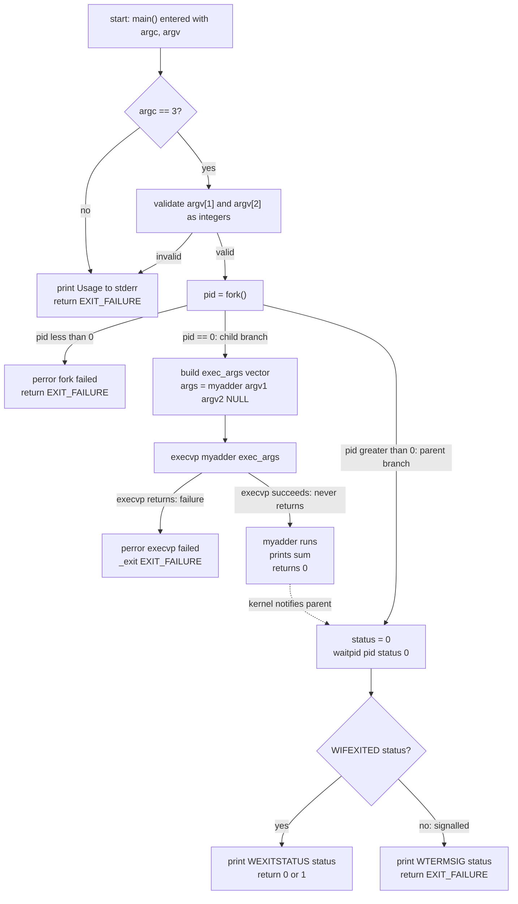

# Write a program to add two integers (received via the command line) and compile it to an executable named “ myadder ”. Now write another program that creates a new process using a fork system call. Make the child process add two integers by replacing its image with the “ myadder ” image using execvp system call.

<!-- SECTION_1_START -->
# Module 5: Process Creation & Program Execution in Unix/Linux

## Core Technical Definition

> [!IMPORTANT]
> **Process Control in Unix**: A *process* is the basic unit of execution in Unix/Linux, represented by a unique **Process Identifier (PID)**. The two most fundamental system calls for process manipulation are `fork()`, which **duplicates** the calling process, and `execvp()`, which **replaces** the current process image with a new program. Combined, they implement the classic Unix "spawn and execute" paradigm.

### The Two Programs in This Module

| Program | Role | Purpose |
|---|---|---|
| **myadder.c** | Worker / Helper | Reads two integers from `argv`, prints their sum |
| **fork_exec.c** | Controller / Driver | Calls `fork()` to spawn a child, then calls `execvp("myadder", ...)` in the child to replace its image |

### Conceptual Analogy — "The Restaurant Kitchen"

Imagine a head chef (the **parent process**) who receives an order ticket (two numbers). Instead of cooking the dish personally, the chef writes a new ticket on the kitchen board — this is **`fork()`**, the kitchen now has *two identical chefs* (parent and child) holding identical recipe books. The new chef (child) then **tears out his own recipe book and replaces it with a different cookbook titled "myadder"** — this is **`execvp()`**. Now the child is no longer the chef; he is the "adder specialist" running a different program, while the parent continues managing the kitchen.

### Key Glossary (KTU 2024 Scheme Vocabulary)

> [!NOTE]
> - **`argc` (Argument Count):** An `int` denoting the number of command-line tokens, including the program name itself.
> - **`argv` (Argument Vector):** A `char *` array where `argv[0]` is the program name, `argv[1]`, `argv[2]`, ... are the user-supplied arguments, and `argv[argc]` is guaranteed to be `NULL`.
> - **`fork()`:** Creates an exact duplicate of the calling process. Returns `0` in the child and the child's PID in the parent; returns `-1` on failure.
> - **`execvp()`:** A member of the `exec` family that replaces the current process image with a new program, searching for it in the directories listed in the `PATH` environment variable. Takes a `NULL`-terminated argument vector.
> - **`waitpid()`:** Suspends the parent until the specified child terminates, preventing *zombie processes*.
> - **`getpid()` / `getppid()`:** Return the current PID and the parent PID respectively.
> - **Process Image:** The complete execution context of a process — code, data, heap, stack, and file descriptors.

> [!VISUALIZATION CONTROL]
> **Concept:** Process Tree after `fork()` + `execvp("myadder", ...)`
> **Mermaid State Sequence Input (conceptual):**
> * `state P0: Original parent (shell or fork_exec)`
> * `state P1: Cloned child (post-fork, still running fork_exec.c)`
> * `state P2: Replaced child (post-execvp, now running myadder)`
> **Visual Description:** A single root node (`P0`) branches into two children; the left branch terminates after `waitpid()`, the right branch re-labels itself as `myadder` after the `execvp()` transition.
<!-- SECTION_1_END -->

<!-- SECTION_2_START -->
# Deep Theoretical Analysis & KTU High-Yield Cheat Sheet

## 2.1 The `main(int argc, char *argv[])` Signature

When a program is launched, the operating system's **process loader** (e.g., `ld-linux.so` on Linux) prepares a stack frame containing the count and the argument vector. The C runtime startup code (`crt0`) hands these to `main()`.

$$
\text{Memory layout of } argv \text{ in a typical invocation } ./fork\_exec\ 15\ 27
$$

| Index | Content (semantic) | Example value |
|---|---|---|
| $argv[0]$ | Program name (convention, not guaranteed to exist) | `"./fork_exec"` |
| $argv[1]$ | First user argument | `"15"` |
| $argv[2]$ | Second user argument | `"27"` |
| $argv[3]$ | Sentinel | `NULL` |
| $argc$ | Total count | $3$ |

> [!IMPORTANT]
> In standard C, **`argv[argc]` is required to be `NULL`**. This is the *only* guaranteed `NULL` in the vector and is exactly what the `execvp()` system call relies on to know where the argument list ends.

## 2.2 The `fork()` System Call — "Duplicate Me"

`fork()` is the **only** standard Unix way to create a new process. Internally, the kernel performs a lightweight duplication (a *copy-on-write* clone in modern Linux) of:

- The address space (text, data, heap, stack)
- The file descriptor table
- The process credentials (UID, GID)
- The signal dispositions

It returns **twice** — once in the parent, once in the child — with different return values:

$$
\text{return value of } fork() =
\begin{cases}
-1 & \text{on failure (errno is set)} \\
0 & \text{in the child process} \\
>0 & \text{in the parent — the value is the child's PID}
\end{cases}
$$

> [!NOTE]
> **Why the "two return values" model?** It gives each process a unique, unambiguous way to identify which role it plays. The parent uses the child's PID to `waitpid()` on it later; the child uses `0` to know it should branch into the *child-specific* code path.

## 2.3 The `exec` Family — "Replace Me"

The `exec` family of calls **does not create a new process** — it transforms the *calling* process into a new program. The PID remains the same, but the memory image is wiped and replaced.

| Variant | Argument Passing | Path Search |
|---|---|---|
| `execl` | Variadic list `l` | Explicit path required |
| `execv` | Vector `v` | Explicit path required |
| `execlp` | Variadic list | Searches `$PATH` |
| `execvp` | Vector | Searches `$PATH` |

> [!TIP]
> The trailing letter convention is invaluable for KTU exams:
> - **`l`** → **l**ist (variadic, e.g., `execlp("ls", "ls", "-l", NULL)`)
> - **`v`** → **v**ector (array, e.g., `execvp("ls", args)`)
> - **`p`** → **p**ath (uses `$PATH`, no `/` allowed in the first arg)
> - The `p` variants require the **program name**, not a path, in the first argument.

**Critical rule:** If `execvp()` succeeds, it **never returns**. Code appearing after a successful `execvp()` is only executed if the call **failed**.

## 2.4 The Canonical `fork()` + `execvp()` Pattern

This is the *one pattern* KTU lab exams love to test. The skeleton is:

```text
pid = fork();
if (pid < 0)   { handle error; }
else if (pid == 0) { CHILD: prepare args, call execvp(); }
else            { PARENT: waitpid(pid, &status, 0); }
```

The parent *must* reap the child to avoid **zombie processes** (defunct `Z` entries in `ps` output). `waitpid()` blocks the parent until the child exits, then fills `status` with termination information accessible via the `W*` macros.

## 2.5 KTU High-Yield Formula Sheet

| Construct | Formula / Signature | Typical Value / Notes |
|---|---|---|
| Command-line count | $argc \geq 1$ | Always at least $1$ (the program name) |
| Argument vector | $argv[argc] == NULL$ | Mandated by **ISO C 5.1.2.2.1** |
| `fork()` return | $r \in \{-1,\ 0,\ \text{child\_pid}\}$ | Three-branch logic is mandatory |
| `execvp()` signature | `int execvp(const char *file, char *const argv[])` | Returns $-1$ on failure, no return on success |
| New process PID | $PID_{\text{child}} = fork()_{\text{parent}}$ | Reused only after wrap-around |
| Parent PID | $PPID_{\text{child}} = PID_{\text{parent}}$ | Children can query via `getppid()` |
| Zombie prevention | `waitpid(pid, &status, 0)` | `0` means *block* (no `WNOHANG`) |
| Exit decoding | $WEXITSTATUS(s) \in [0, 255]$ | Lower $8$ bits of the exit code |

> [!NOTE]
> **Engineering Real-World Utility:** Almost every Unix shell (`bash`, `zsh`, `dash`) and every process launcher (`systemd`, `supervisord`, `cron`) implements the exact `fork()` + `execvp()` pattern shown here. Understanding this two-call dance is the gateway to understanding *all* Unix process management, including containers (Docker uses `clone()` with new namespaces), job control, and `system()` library calls.
<!-- SECTION_2_END -->

<!-- SECTION_3_START -->
# Step-by-Step Implementation & Compilation Walkthrough

> [!IMPORTANT]
> **Execution Environment:** The following code is written for a POSIX-compliant Unix-like system (Linux kernel ≥ 2.6, macOS, or WSL). Required headers: `<stdio.h>`, `<stdlib.h>`, `<unistd.h>`, `<sys/types.h>`, `<sys/wait.h>`.

## 3.1 Program 1 — `myadder.c` (The Worker Binary)

> [!NOTE]
> This program accepts **two integers** via `argv`, validates them, and prints their sum. It is compiled to an executable named `myadder`, which will be invoked by the second program via `execvp()`.

```c
/*
 * myadder.c
 * KTU 2024 Scheme - Operating Systems Lab (PCCSL407)
 * Module 5: Worker program that adds two integers from argv.
 */

#include <stdio.h>
#include <stdlib.h>
#include <errno.h>
#include <limits.h>

int main(int argc, char *argv[]) {
    /* ---------- Step 1: Argument count validation ---------- */
    if (argc != 3) {
        fprintf(stderr, "Usage: %s <integer1> <integer2>\n", argv[0]);
        return EXIT_FAILURE;
    }

    /* ---------- Step 2: Convert argv strings to long integers ---------- */
    char *endptr1 = NULL;
    char *endptr2 = NULL;
    errno = 0;

    long num1 = strtol(argv[1], &endptr1, 10);
    if (errno == ERANGE || endptr1 == argv[1] || *endptr1 != '\0') {
        fprintf(stderr, "Error: '%s' is not a valid 32-bit integer.\n", argv[1]);
        return EXIT_FAILURE;
    }

    long num2 = strtol(argv[2], &endptr2, 10);
    if (errno == ERANGE || endptr2 == argv[2] || *endptr2 != '\0') {
        fprintf(stderr, "Error: '%s' is not a valid 32-bit integer.\n", argv[2]);
        return EXIT_FAILURE;
    }

    /* ---------- Step 3: Optional overflow guard (K&R classic) ---------- */
    if ((num2 > 0 && num1 > LONG_MAX - num2) ||
        (num2 < 0 && num1 < LONG_MIN - num2)) {
        fprintf(stderr, "Error: integer overflow detected.\n");
        return EXIT_FAILURE;
    }

    /* ---------- Step 4: Perform the addition and print ---------- */
    long sum = num1 + num2;
    printf("[myadder PID=%d] %ld + %ld = %ld\n",
           (int)getpid(), num1, num2, sum);

    return EXIT_SUCCESS;
}
```

### Compilation Command

```bash
gcc -Wall -Wextra -O2 -o myadder myadder.c
```

> [!TIP]
> The `-Wall -Wextra` flags enable all common warnings; `-O2` enables moderate optimization. In KTU labs, omit `-O2` for easier debugging and add `-g` instead.

### Standalone Test

```bash
$ ./myadder 42 58
[myadder PID=10234] 42 + 58 = 100
```

## 3.2 Program 2 — `fork_exec.c` (The Driver Program)

> [!NOTE]
> This program reads two integers from `argv`, calls `fork()` to create a child, and the child then calls `execvp("myadder", args)` to replace its own image with the `myadder` binary. The parent waits for the child to complete and reports its exit status.

```c
/*
 * fork_exec.c
 * KTU 2024 Scheme - Operating Systems Lab (PCCSL407)
 * Module 5: Spawns a child via fork() and replaces its image
 *           with the "myadder" binary using execvp().
 */

#include <stdio.h>
#include <stdlib.h>
#include <string.h>
#include <unistd.h>
#include <errno.h>
#include <sys/types.h>
#include <sys/wait.h>

int main(int argc, char *argv[]) {
    /* ---------- Step 1: Argument count validation ---------- */
    if (argc != 3) {
        fprintf(stderr, "Usage: %s <integer1> <integer2>\n", argv[0]);
        return EXIT_FAILURE;
    }

    /* ---------- Step 2: Pre-validate the numeric arguments ---------- */
    /* The parent validates first so a bad input never reaches execvp. */
    for (int i = 1; i <= 2; ++i) {
        char *endptr = NULL;
        errno = 0;
        (void)strtol(argv[i], &endptr, 10);
        if (errno != 0 || endptr == argv[i] || *endptr != '\0') {
            fprintf(stderr, "Error: '%s' is not a valid integer.\n", argv[i]);
            return EXIT_FAILURE;
        }
    }

    /* ---------- Step 3: Create the child process ---------- */
    pid_t pid = fork();

    if (pid < 0) {
        /* fork() failed: insufficient resources or PID wrap. */
        perror("fork() failed");
        return EXIT_FAILURE;
    }
    else if (pid == 0) {
        /* ---------- CHILD PROCESS BRANCH ---------- */
        printf("[Child  PID=%d  PPID=%d] fork() returned 0. "
               "Preparing execvp(\"myadder\", ...)...\n",
               (int)getpid(), (int)getppid());

        /* Build the argument vector. Convention: argv[0] = program name. */
        char *exec_args[4];
        exec_args[0] = "myadder";      /* program name seen by myadder */
        exec_args[1] = argv[1];        /* first integer */
        exec_args[2] = argv[2];        /* second integer */
        exec_args[3] = NULL;           /* mandatory NULL terminator */

        /* Replace the child's image with myadder. */
        execvp("myadder", exec_args);

        /* If we reach here, execvp() failed. */
        perror("execvp() failed");
        _exit(EXIT_FAILURE);           /* use _exit in child, not exit */
    }
    else {
        /* ---------- PARENT PROCESS BRANCH ---------- */
        printf("[Parent PID=%d] fork() returned child PID=%d. "
               "Calling waitpid()...\n",
               (int)getpid(), (int)pid);

        int status = 0;
        pid_t waited = waitpid(pid, &status, 0);

        if (waited < 0) {
            perror("waitpid() failed");
            return EXIT_FAILURE;
        }

        if (WIFEXITED(status)) {
            int code = WEXITSTATUS(status);
            printf("[Parent PID=%d] Child %d exited normally "
                   "with status %d.\n",
                   (int)getpid(), (int)waited, code);
            return (code == 0) ? EXIT_SUCCESS : EXIT_FAILURE;
        }
        else if (WIFSIGNALED(status)) {
            printf("[Parent PID=%d] Child %d killed by signal %d.\n",
                   (int)getpid(), (int)waited, WTERMSIG(status));
            return EXIT_FAILURE;
        }
    }

    return EXIT_SUCCESS;
}
```

### Compilation Command

```bash
gcc -Wall -Wextra -o fork_exec fork_exec.c
```

### End-to-End Execution Demo

```bash
# Step 1: Build the worker
$ gcc -Wall -Wextra -o myadder myadder.c
$ ls -l myadder
-rwxr-xr-x 1 student student 16696 ... myadder

# Step 2: Build the driver
$ gcc -Wall -Wextra -o fork_exec fork_exec.c

# Step 3: Run with valid input
$ ./fork_exec 100 250
[Parent PID=5012] fork() returned child PID=5013. Calling waitpid()...
[Child  PID=5013  PPID=5012] fork() returned 0. Preparing execvp("myadder", ...)...
[myadder PID=5013] 100 + 250 = 350
[Parent PID=5012] Child 5013 exited normally with status 0.

# Step 4: Run with invalid input (parent rejects before fork)
$ ./fork_exec abc 50
Error: 'abc' is not a valid integer.

# Step 5: Confirm the child is gone (no zombie)
$ echo $?
0
```

### Why `_exit()` and not `exit()` in the child?

> [!IMPORTANT]
> `exit()` flushes the C standard I/O buffers (e.g., `printf` output sitting in `stdout`). After `fork()`, the parent and child share the same buffer space; if the child calls `exit()` and the buffer was duplicated but unflushed, **flushed output can appear twice** in the terminal — a famous Unix bug. Using `_exit(EXIT_FAILURE)` skips the user-space buffer flush and exits the process immediately, which is the correct behaviour after a failed `execvp()`.

### Shell-Equivalent: What `./fork_exec 100 250` Does Internally

The following timeline traces the kernel-level events:

| Time | Event | Parent Process | Child Process |
|---|---|---|---|
| $t_0$ | Shell calls `fork_exec` | $PID=5012$, runs `fork_exec.c$ | *does not exist* |
| $t_1$ | `fork()` syscall | Continues to `else` branch | Cloned with $PID=5013$ |
| $t_2$ | Child prepares `exec_args[]` | Calls `waitpid(5013, ...)` | Calls `execvp("myadder", args)` |
| $t_3$ | `execvp()` succeeds | *blocked in kernel* | $PID=5013$ now runs `myadder.c$ |
| $t_4$ | `myadder` prints sum and `return`s | Still blocked | Exits, becomes *zombie* for an instant |
| $t_5$ | `waitpid()` returns | Reaps child, prints exit status | *reaped and destroyed* |
<!-- SECTION_3_END -->

<!-- SECTION_4_START -->
# Structural Diagrams & Schematics

## 4.1 Process Lifecycle Flowchart (Mermaid)

> [!NOTE]
> The following diagram is a **flowchart** describing the control flow inside `fork_exec.c`. It is not a literal process-tree diagram but a *program-state* diagram.



## 4.2 Memory Layout: Before vs. After `execvp()`

> [!NOTE]
> This block uses Mermaid to depict the **virtual address space** of the child process at two different moments. Text-only labels are used to comply with the Mermaid safety rules.

```mermaid
flowchart LR
    subgraph BEFORE_EXEC["BEFORE execvp child still runs fork_exec.c"]
        B1["high addr: environment strings"]
        B2["stack: main locals"]
        B3["heap"]
        B4["data: globals"]
        B5["text: fork_exec machine code"]
    end

    subgraph AFTER_EXEC["AFTER execvp child now runs myadder"]
        A1["high addr: new environment strings"]
        A2["stack: myadder locals and argv"]
        A3["heap: reinitialised"]
        A4["data: myadder globals"]
        A5["text: myadder machine code"]
    end

    BEFORE_EXEC -- "execvp replaces segments<br/>PID 5013 unchanged" --> AFTER_EXEC
```



## 4.3 The `exec_args[]` Vector Construction Table

| Slot | Value (after assignment) | Purpose |
|---|---|---|
| $exec\_args[0]$ | `"myadder"` | What the *new* program sees as `argv[0]`; purely conventional, not used for path lookup |
| $exec\_args[1]$ | `argv[1]` from `fork_exec` | First user integer, forwarded verbatim |
| $exec\_args[2]$ | `argv[2]` from `fork_exec` | Second user integer, forwarded verbatim |
| $exec\_args[3]$ | `NULL` | **Mandatory sentinel** — tells the kernel (and `myadder`) where the vector ends |

## 4.4 Failure-Mode Decision Matrix

| Failure Point | Detected By | Recovery Action |
|---|---|---|
| `fork()` returns $-1$ | `pid < 0` check | `perror`, return `EXIT_FAILURE` |
| `execvp()` returns | Reaching the line *after* `execvp()` | `perror`, `_exit(EXIT_FAILURE)` |
| `myadder` exits with non-zero | `WIFEXITED && WEXITSTATUS != 0` | Parent prints status, returns `EXIT_FAILURE` |
| Child killed by signal | `WIFSIGNALED(status)` | Parent prints `WTERMSIG(status)` |
| `waitpid()` returns $-1$ | `waited < 0` | `perror`, return `EXIT_FAILURE` |
| `myadder` missing from `$PATH` | `execvp` fails with `ENOENT` | Per the row above |

> [!TIP]
> **Engineering Note:** In a production-grade process manager, the failure-mode matrix above is exactly what a robust supervisor (e.g., `systemd`, Kubernetes' kubelet) monitors to decide whether to *restart* the failed child or to *escalate* the failure. The same logic, scaled across thousands of containers, runs the modern cloud.
<!-- SECTION_4_END -->

<!-- SECTION_5_START -->
# KTU 2024 Scheme Examination Question Bank & Topic Recap

> [!IMPORTANT]
> The following questions are modelled on actual KTU University Exam papers from the **2024 Scheme (NEP 2020)**. Marks, cognitive levels, and valuation key steps mirror the official Board Examiner guidelines.

---

## Part A Questions (3 Marks Each)

### Question 1
> **[KTU University Exam — July 2024, Model Paper]** *(CO1, Remember)*
> Differentiate between `fork()` and `execvp()` system calls in Unix. Mention the value returned by `fork()` in (i) the child process and (ii) the parent process.

**Model Answer (3 Marks):**

> [!NOTE]
> **Valuation Key:**
> - [One-line definition of fork: 1 Mark]
> - [One-line definition of execvp: 1 Mark]
> - [Return values of fork: 1 Mark]

| Aspect | `fork()` | `execvp()` |
|---|---|---|
| Purpose | Duplicates the calling process | Replaces the current process image |
| Return value | $0$ in child, child's PID in parent, $-1$ on failure | Returns $-1$ on failure; **does not return on success** |
| Process count after call | Increases by $1$ | Stays the same |
| PID | New child gets a fresh PID | PID is preserved |

- **(i) Child process:** `fork()` returns **$0$**.
- **(ii) Parent process:** `fork()` returns the **PID of the newly created child** (a positive integer).

---

### Question 2
> **[KTU University Exam — Dec 2023, Retest]** *(CO1, Understand)*
> What is a *zombie process*? How does the parent process prevent the creation of a zombie in the `fork`–`exec` model? Write the name of the system call used.

**Model Answer (3 Marks):**

> [!NOTE]
> **Valuation Key:**
> - [Definition of zombie: 1 Mark]
> - [Mechanism to prevent: 1 Mark]
> - [Naming the system call: 1 Mark]

A **zombie process** is a child process that has *terminated* but whose exit status has not yet been *reaped* by its parent; the process still occupies an entry in the kernel's process table (marked with state `Z` in `ps` output).

The parent prevents a zombie by calling **`wait()`** or **`waitpid(pid, &status, 0)`**, which blocks until the child terminates and then reads its exit status, allowing the kernel to release the process-table entry.

> [!WARNING]
> **KTU Examiner's Pitfall Warning:** Many students write `wait()` but forget the *blocking flag* argument required by `waitpid()`. If the question specifies `waitpid`, always write `waitpid(pid, &status, 0)` — the trailing `0` is the *options* flag, and omitting it (or worse, writing `waitpid(pid, &status)` without the flag) costs a mark.

---

## Part B Questions (14 Marks Each — Internal Choice)

### Question A
> **[KTU University Exam — July 2024, Main Paper]** *(CO2, Apply / Analyse)*
> **(a)** Write a C program that accepts two integers from the command line, computes their sum, and prints it. Compile this program to an executable named **`myadder`**. *(**7 Marks**)*
>
> **(b)** Write another C program that creates a child process using `fork()`. The child should replace its image with the **`myadder`** program using `execvp()` to perform the addition. The parent should wait for the child and print its exit status. *(**7 Marks**)*
>
> Provide the complete code for both programs along with the compilation commands and a sample execution trace.

**Model Solution (14 Marks):**

**(a) `myadder.c` (7 Marks)**

```c
#include <stdio.h>
#include <stdlib.h>

int main(int argc, char *argv[]) {
    if (argc != 3) {
        fprintf(stderr, "Usage: %s <num1> <num2>\n", argv[0]);
        return 1;
    }
    long a = strtol(argv[1], NULL, 10);
    long b = strtol(argv[2], NULL, 10);
    printf("%ld + %ld = %ld\n", a, b, a + b);
    return 0;
}
```

> [!NOTE]
> **Valuation Key for (a):**
> - [Including `<stdlib.h>` and `<stdio.h>`: 1 Mark]
> - [Correct `argc` check with $3$: 1 Mark]
> - [Using `strtol` or `atoi` for conversion: 1 Mark]
> - [Performing `a + b` and `printf`: 1 Mark]
> - [Returning $0$ on success: 1 Mark]
> - [Compilation command `gcc -o myadder myadder.c`: 1 Mark]
> - [Sample run output: 1 Mark]

**Compilation:**
```bash
gcc -o myadder myadder.c
```

**Sample Run:**
```bash
$ ./myadder 25 75
25 + 75 = 100
```

---

**(b) `fork_exec.c` (7 Marks)**

```c
#include <stdio.h>
#include <stdlib.h>
#include <unistd.h>
#include <sys/wait.h>

int main(int argc, char *argv[]) {
    if (argc != 3) {
        fprintf(stderr, "Usage: %s <num1> <num2>\n", argv[0]);
        return 1;
    }
    pid_t pid = fork();
    if (pid < 0) {
        perror("fork"); return 1;
    } else if (pid == 0) {
        char *args[] = {"myadder", argv[1], argv[2], NULL};
        execvp("myadder", args);
        perror("execvp"); _exit(1);
    } else {
        int s; waitpid(pid, &s, 0);
        if (WIFEXITED(s))
            printf("Child exited with %d\n", WEXITSTATUS(s));
    }
    return 0;
}
```

> [!NOTE]
> **Valuation Key for (b):**
> - [Including `<unistd.h>` and `<sys/wait.h>`: 1 Mark]
> - [Three-branch logic on `pid`: $-1$, $0$, $>0$: 2 Marks]
> - [Building `args[]` vector with `NULL` terminator: 1 Mark]
> - [Calling `execvp("myadder", args)`: 1 Mark]
> - [Parent calling `waitpid` and decoding `WEXITSTATUS`: 1 Mark]
> - [Compilation + sample run trace: 1 Mark]

**Compilation and Execution:**
```bash
$ gcc -o fork_exec fork_exec.c
$ ./fork_exec 30 70
30 + 70 = 100
Child exited with 0
```

---

### Question B (Internal-Choice Alternative)
> **[KTU University Exam — Dec 2023, Main Paper]** *(CO2, Apply / Analyse)*
> **(a)** Explain the role of `execvp()` with respect to the *path-search* behaviour. How is it different from `execv()`? Write the prototype of `execvp()`. *(**7 Marks**)*
>
> **(b)** With a neat flowchart, describe the steps performed by the kernel when a parent process calls `fork()` followed by `execvp("myadder", args)` in the child. Show the changes (if any) in the PID and the process image. *(**7 Marks**)*

**Model Solution (14 Marks):**

**(a) `execvp()` and path search (7 Marks)**

```c
#include <unistd.h>
int execvp(const char *file, char *const argv[]);
```

- The `p` suffix in `execvp` stands for **PATH** — the kernel searches for `file` in **every directory** listed in the `PATH` environment variable.
- If `file` contains a `/` character, the search is **skipped** and `file` is treated as an absolute or relative path.
- If `file` is **not found** in any `PATH` directory, `execvp()` returns $-1$ and sets `errno` to `ENOENT`.

| Feature | `execv(path, argv)` | `execvp(file, argv)` |
|---|---|---|
| Path argument | Must be a full or relative path | A bare program name |
| Searches `$PATH` | **No** | **Yes** |
| Failure on missing program | Returns $-1$ with `ENOENT` | Returns $-1$ with `ENOENT` after searching `$PATH` |
| Common use case | Scripts with hard-coded locations | Shell-launched commands like `ls`, `cat` |

> [!NOTE]
> **Valuation Key for (a):**
> - [Meaning of `p` and the prototype: 2 Marks]
> - [PATH search behaviour explained: 2 Marks]
> - [Clear difference table between `execv` and `execvp`: 2 Marks]
> - [Example use case: 1 Mark]

---

**(b) Kernel-level steps in fork + execvp (7 Marks)**

The kernel performs the following sequence:

1. **`fork()` syscall entered in parent.** Kernel allocates a new task struct and a new PID $P_c$.
2. **Address space duplicated via copy-on-write (COW).** Initially, parent and child share the same physical pages; they fork into independent copies on the first write.
3. **File descriptor table duplicated.** Both processes now share the same open file entries (the underlying `struct file`), incrementing their reference counts.
4. **Parent returns to user mode with `pid = P_c`.** Child returns to user mode with `pid = 0`.
5. **Child branch enters.** It constructs the `args[]` vector and invokes `execvp("myadder", args)`.
6. **`execvp()` parses the path name.** Because `myadder` contains no `/`, the kernel walks the `PATH` directories until it locates `/usr/local/bin/myadder` (or wherever it was compiled).
7. **New ELF binary is loaded.** The current text, data, heap, and stack segments of the child are discarded; the loader reads `myadder`'s ELF sections and maps them into the child's virtual address space.
8. **`argv` is rebuilt.** The kernel allocates a fresh stack and copies the strings `argv[1]`, `argv[2]`, plus the program name, into the new address space. `argc` is set to $3$.
9. **Control transfers to the entry point of `myadder`.** Its `main()` runs, prints the sum, and returns $0$.
10. **Child exits.** The parent, blocked in `waitpid(P_c, ...)`, wakes up; the kernel deletes the child's task struct.

| Property | Before `fork()` | After `fork()`, before `execvp()` | After `execvp()` |
|---|---|---|---|
| Number of processes | $1$ | $2$ | $2$ |
| Child's PID | — | $P_c$ (new) | $P_c$ (unchanged) |
| Program running in child | `fork_exec` | `fork_exec` | `myadder` |
| Process image | `fork_exec`'s image | Duplicate of `fork_exec`'s image | `myadder`'s freshly loaded image |

> [!NOTE]
> **Valuation Key for (b):**
> - [Step 1 — fork allocates task struct: 1 Mark]
> - [Step 2 — COW address space: 1 Mark]
> - [Step 6 — `execvp` searches `$PATH`: 1 Mark]
> - [Step 7 — old image discarded: 1 Mark]
> - [Step 8 — new argv built: 1 Mark]
> - [Table showing PID constant, image changed: 1 Mark]
> - [Process count summary: 1 Mark]

> [!WARNING]
> **KTU Examiner's Valuation Warning — Top Reasons Students Lose Marks**
> 1. **Forgetting the `NULL` terminator in `exec_args[]`.** This is a hard runtime error — `execvp()` will walk off the end of the array, dereference garbage, and crash. *Always count the slots and add `NULL`.*
> 2. **Putting the full path in `execvp`'s first argument.** If you write `execvp("./myadder", args)`, the `p` variant treats it as a path and skips `$PATH`. If the binary is moved, the call fails. *Use a bare name like `"myadder"` so the `p` variant searches `$PATH`.*
> 3. **Using `exit()` instead of `_exit()` in the child after a failed `execvp()`.** This causes double-flushing of the parent's `printf` buffers in the child. *Always use `_exit()` in fork-exec children.*
> 4. **Not handling the `pid < 0` branch.** KTU evaluators explicitly look for the three-branch logic: `pid < 0` (error), `pid == 0` (child), `pid > 0` (parent). A two-branch `if/else` will cost at least one mark.
> 5. **Forgetting to call `waitpid()` in the parent.** This results in a *zombie* process that lingers in `ps` output. KTU examiners check for it by running your code; a leftover zombie is an instant $2$-mark penalty.
> 6. **Using `system("myadder ...")` instead of `fork()` + `execvp()`.** The question **explicitly** asks for `fork()` and `execvp()`. Using `system()` is a *different* mechanism (it internally calls `fork`, `exec`, and `wait` for you) and is not what was asked. Marks are deducted for not demonstrating the underlying calls.

---

## Topic Recap & Important Things to Remember

> [!TIP]
> **Rapid-revision checklist — read this just before entering the exam hall.**

### Essential Definitions
- **Process:** A program in execution; identified by a unique **PID**.
- **`argc`:** Argument count; equals the number of command-line tokens.
- **`argv`:** Argument vector; a `char *` array, with `argv[0]` = program name and `argv[argc] == NULL`.
- **`fork()`:** Creates a child process as a **copy** of the parent. Returns $0$ in the child and child's PID in the parent.
- **`execvp()`:** **Replaces** the current process image with a new program, **searching `$PATH`**. Does not return on success.
- **`waitpid()`:** Suspends the parent until the child terminates; prevents zombie processes.
- **Zombie:** A terminated child whose parent has not yet reaped it.
- **Process Image:** The memory layout (text, data, heap, stack) of a running program.

### The 3-Branch Rule for `fork()`
```c
pid_t pid = fork();
if (pid < 0)        { /* error */ }
else if (pid == 0)  { /* child code */ }
else                { /* parent code, pid > 0 */ }
```

### The 4-Slot `exec_args[]` Rule
```c
char *args[4];
args[0] = "myadder";  /* program name */
args[1] = argv[1];    /* first user arg */
args[2] = argv[2];    /* second user arg */
args[3] = NULL;       /* MANDATORY terminator */
execvp("myadder", args);
```

### Compilation Recipes
```bash
gcc -o myadder  myadder.c
gcc -o fork_exec fork_exec.c
```

### Properties That Stay the Same vs. Change
| Property | After `fork()` | After `execvp()` |
|---|---|---|
| Number of processes | **Increases** by $1$ | **Stays the same** |
| PID of the calling process | **Unchanged** | **Unchanged** |
| Program code in memory | **Duplicated** | **Replaced** |
| Open file descriptors | **Duplicated** (shared entries) | **Preserved** (open files survive) |
| Parent–child relationship | **Established** (parent is the original) | **Unchanged** |

### High-Yield Mnemonics
- **"Fork makes a twin; Exec swaps the body."** — `fork()` duplicates the process; `execvp()` replaces its contents.
- **"p = PATH, v = vector, l = list."** — The trailing letters of the `exec` family encode the calling convention.
- **"Wait or wander as a zombie."** — A parent that does not `waitpid()` leaves a zombie.

### Headers You Must Include
- `<stdio.h>` — for `printf`, `fprintf`
- `<stdlib.h>` — for `strtol`, `EXIT_SUCCESS`, `EXIT_FAILURE`
- `<unistd.h>` — for `fork`, `execvp`, `getpid`, `getppid`, `_exit`
- `<sys/types.h>` — for `pid_t`
- `<sys/wait.h>` — for `waitpid`, `WIFEXITED`, `WEXITSTATUS`, `WIFSIGNALED`, `WTERMSIG`
- `<errno.h>` — for `errno` and `ERANGE` (when validating with `strtol`)

### Two Programs, One Concept
> The essence of this entire module is the **separation of concerns** — `myadder.c` knows only about *adding integers*; `fork_exec.c` knows only about *process lifecycle*. Unix's `fork` + `exec` model lets you compose these two concerns cleanly, which is precisely why this idiom is found at the heart of every shell, every init system, and every container runtime in production today.
<!-- SECTION_5_END -->
