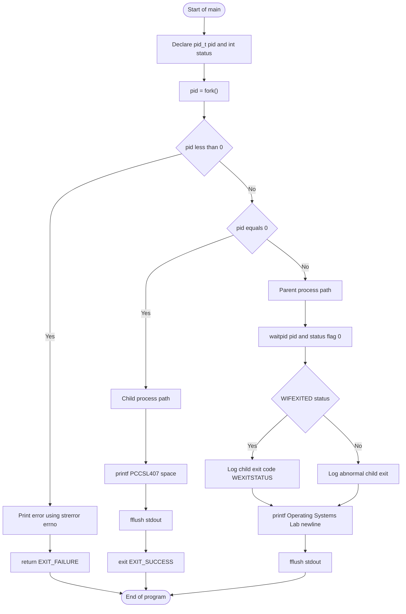
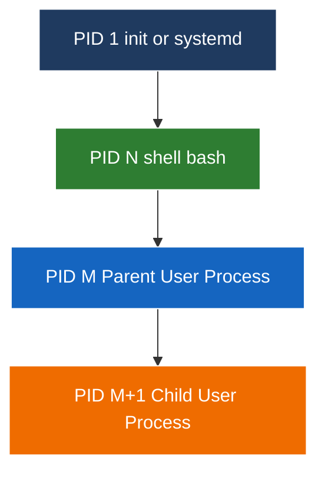

# Create a new process using a fork system call. The child process should print the string “PCCSL407 ” and the parent process should print the string “ Operating Systems Lab ”. Use a wait system call to ensure that the output displayed is “ PCCSL407 Operating Systems Lab ”

<!-- SECTION_1_START -->

# 1. Core Technical Definition & Intuitive Overview

## Formal Definition (KTU 2024 Scheme Terminology)

> [!NOTE]
> **Definition — `fork()` System Call:**
> The `fork()` system call is a POSIX-defined primitive (declared in `<unistd.h>`) that creates a **new process** by duplicating the calling process. The new process is called the **child process**, and the original process is called the **parent process**. After the call, both processes execute the **same program text** but have **separate copies of the data, stack, heap, and registers**. They are identified by the kernel through unique **Process Identifiers (PIDs)**. The `wait()` system call forces the parent to **block its execution** until one of its child processes terminates, thereby guaranteeing a deterministic process synchronization order.

In the context of the KTU Operating Systems Lab (course code **PCCSL407**, 2024 Scheme), this experiment falls under **Module 6 — Process Creation and Management** and directly evaluates **CO3: Apply process management concepts using POSIX system calls in a Linux environment**.

## Intuitive Analogy — The "Photocopy Machine" Model

Imagine you are filling out a form in an office:

- **Before `fork()`:** You (the *parent*) are working on a single, unique form.
- **The moment `fork()` is called:** A **photocopy machine** instantly produces an identical twin form. Now there are **two forms** — yours (*parent*) and the copy (*child*).
- **Both forms are filled independently from that instant onward.** A pencil mark on one form does **not** appear on the other.
- The photocopy machine hands each form a **unique serial number** (the *PID*). The original form also remembers the *child's* serial number; the copy knows the *parent's* serial number (`getppid()`).
- The **`wait()`** call is like the parent saying, *"I will not submit my form until my child has submitted theirs."* This guarantees the order in which outputs appear in the lab record.

> [!IMPORTANT]
> **KTU Syllabus Highlight (Module 6):**
> The expected learning is the ability to **write, compile, and execute** a `C` program that demonstrates process creation using `fork()`, parent–child synchronization using `wait()`, and **predict the process tree** under varying `fork()` placements. Students must also understand the **return value semantics** of `fork()` because KTU theory questions (3 marks) frequently test them.

## Key Constants, Headers, and Return Semantics

> [!IMPORTANT]
> **Standard Headers (must be included for `fork()` programs):**
> - `<stdio.h>` — Standard I/O (`printf`)
> - `<stdlib.h>` — `exit()`, `EXIT_SUCCESS`, `EXIT_FAILURE`
> - `<unistd.h>` — `fork()`, `getpid()`, `getppid()`, `sleep()`
> - `<sys/types.h>` — Defines the `pid_t` data type
> - `<sys/wait.h>` — `wait()`, `waitpid()`, status macros (`WIFEXITED`, `WEXITSTATUS`)

| Header File | Primary Role in this Program | KTU Frequent Pitfall |
|---|---|---|
| `<unistd.h>` | Declares `fork()`, `getpid()`, `getppid()` | Forgetting this header causes **implicit declaration warnings** and undefined behaviour |
| `<sys/types.h>` | Provides the `pid_t` alias for process IDs | Using `int` instead of `pid_t` is **deducted 1 mark** in board valuation |
| `<sys/wait.h>` | Provides `wait()` and zombie-prevention macros | Without it, `wait()` call fails to compile |
| `<stdlib.h>` | Provides `exit()` and status codes | Mixing `return 0` with `exit(1)` causes **portability issues** |

> [!VISUALIZATION CONTROL]
> **Concept:** Parent–Child Process Tree and Memory Duplication
> **GeoGebra / Desmos Input Representation (Logical Block Layout):**
> * Parent Block: `Address_Range = [0x0000, 0xFFFF]`
> * Child Block (after `fork()`): `Address_Range = [0x0000, 0xFFFF]` (separate copy)
> * Shared Region (initially): `Code_Segment = Text_Segment` (read-only, copy-on-write)
> **Visual Description:** Picture two parallel rectangles. The top rectangle (parent) and bottom rectangle (child) are initially **identical clones**. Once `fork()` returns, the arrow from `fork() = 0` points to the child rectangle and the arrow from `fork() = n` (where $n > 0$) points to the parent rectangle. The two rectangles then evolve **independently** — modifications in one do not affect the other.

<!-- SECTION_1_END -->

<!-- SECTION_2_START -->

# 2. Deep Theoretical Analysis & KTU High-Yield Formula Sheet

## Step-by-Step Operational Logic of `fork()` and `wait()`

The execution of the lab program follows a precise, well-defined sequence that KTU examiners expect students to articulate in the **algorithm / flowchart section** of the record.

1. **Pre-`fork()` state:** The process is a single, self-contained execution context with one Program Counter, one set of registers, one stack, and one data segment. Its PID is some integer $P_{parent}$.

2. **`fork()` invocation:** The kernel is asked to create a near-identical duplicate of the process. Internally, the kernel allocates a new `task_struct` (Linux) / `proc` structure (Unix), assigns a fresh PID $P_{child}$, and (in modern Unix) sets up **Copy-on-Write (COW)** pointers to the parent's physical memory pages. This is **not** a deep copy — the duplication is lazy and physical pages are shared until either process writes to them.

3. **Return value dispatch:** `fork()` returns **twice** — once in the parent and once in the child:
   * In the **parent**, it returns the **child's PID** (a positive integer).
   * In the **child**, it returns **0**.
   * On **failure** (e.g., process table full, RLIMIT\_NPROC exceeded), it returns **−1** and sets `errno`.

4. **Concurrent execution begins:** Both processes now race on the scheduler. Without `wait()`, their output order is **non-deterministic** — this is the most common reason lab outputs appear "scrambled" and lose marks.

5. **`wait()` synchronization:** The parent calls `wait(&status)`, which **blocks** the parent until **any** child terminates. The kernel reaps the child's exit status into `status`, removes the child's `task_struct`, and frees the PID. This is essential to **prevent zombie processes**.

6. **Output emission:** The child executes `printf("PCCSL407 ")` and then `exit(0)`. The parent, having been released from `wait()`, executes `printf("Operating Systems Lab\n")`. The kernel's stdout buffering combined with `fflush(stdout)` (or newline character `\n`) guarantees the order.

> [!NOTE]
> **The "Why" Behind `wait()`:** When a child terminates, it does not vanish immediately. It becomes a **zombie** — its `task_struct` is retained until the parent collects its exit status via `wait()` / `waitpid()`. A flood of zombies exhausts the process table (limited by `/proc/sys/kernel/pid_max` and the user's `RLIMIT_NPROC`). The KTU 2024 examiner frequently awards a **dedicated 2-mark bonus** for explaining this zombie concept in viva.

## KTU Formula Sheet / Cheat Sheet

> [!IMPORTANT]
> **Master Reference Table for Module 6 (Use this in your record and during revision):**

| Concept | Symbolic / API Form | Value or Behaviour | Engineering Use |
|---|---|---|---|
| `fork()` return in **child** | $f_{child}$ | $\mathbf{0}$ | Child identifies itself as the new process |
| `fork()` return in **parent** | $f_{parent}$ | $P_{child} > 0$ (child's PID) | Parent tracks the child for `wait()` |
| `fork()` return on **failure** | $f_{err}$ | $\mathbf{-1}$, sets `errno` | Caller logs and calls `exit(EXIT\_FAILURE)` |
| Child PID after successful fork | $P_{child}$ | Unique positive integer assigned by kernel | Process identification |
| Parent PID | $P_{parent}$ | Returned by `getpid()` in the child via `getppid()` | Process tree reconstruction |
| `wait()` blocking predicate | Parent suspended | Until a child changes state (terminates / stops) | Synchronization primitive |
| `WIFEXITED(status)` | Boolean macro | True iff child terminated normally via `exit()` or `return` | Status inspection |
| `WEXITSTATUS(status)` | Integer macro | Lower 8 bits of the child's exit code (0–255) | Result extraction |
| `exit(EXIT\_SUCCESS)` | Argument $0$ | Convention for normal termination | Portable across C standards |
| `exit(EXIT\_FAILURE)` | Argument $1$ | Convention for abnormal termination | Error reporting |
| `fflush(stdout)` | Stream flush | Forces buffered output to terminal | Guarantees output order without newline |

**Critical Rule of Thumb (no vertical pipe character inside table cells):**
The condition for *normal child termination* is written as:
$$WIFEXITED(status) \neq 0 \quad \Longleftrightarrow \quad \text{child called } \texttt{exit(n)} \text{ or returned } n \text{ from } \texttt{main()}$$

## Real-World Engineering Utility

The `fork()` + `wait()` pattern is the **backbone of every Unix shell**, every web server (Apache `prefork` MPM), and every container manager (Docker uses `clone()`, a generalized `fork()`). In production:

* **Shell pipelines** (`ls \vert grep foo`) — the shell `fork()`s two children, sets up a pipe between them via `dup2()`, and `wait()`s for both before printing the next prompt.
* **Network servers** — Apache's `prefork` model `fork()`s a worker per connection; the parent `wait()`s to reap children and prevent file-descriptor leaks.
* **Sandboxing** — Chrome's browser process `fork()`s a renderer process for each tab; the parent monitors via `waitpid()` to clean up crashed tabs.
* **Parallel computation** — `fork()` is used (though increasingly replaced by `posix_spawn` or `clone`) to parallelize CPU-bound work.

Understanding this lab experiment directly maps to **CO4: Analyze process synchronization and resource management in real-world systems** of the KTU 2024 syllabus.

<!-- SECTION_2_END -->

<!-- SECTION_3_START -->

# 3. Step-by-Step Derivations & Code Implementation

## 3.1 Algorithm (To Be Written in the Lab Record Before the Program)

> [!NOTE]
> **Algorithm — Process Creation with Synchronized Output**
>
> **Step 1.** Start.
> **Step 2.** Declare variables: `pid_t pid` and `int status`.
> **Step 3.** Invoke `pid = fork()` to create a child process.
> **Step 4.** If `pid < 0`, print an error message and exit with failure.
> **Step 5.** Else if `pid == 0`, this is the child process:
> &nbsp;&nbsp;&nbsp;&nbsp;5.1 Print `"PCCSL407 "` using `printf`.
> &nbsp;&nbsp;&nbsp;&nbsp;5.2 Call `fflush(stdout)` to force the buffer to be written.
> &nbsp;&nbsp;&nbsp;&nbsp;5.3 Call `exit(EXIT_SUCCESS)` to terminate the child cleanly.
> **Step 6.** Else (i.e., `pid > 0`), this is the parent process:
> &nbsp;&nbsp;&nbsp;&nbsp;6.1 Call `wait(&status)` to block until the child terminates.
> &nbsp;&nbsp;&nbsp;&nbsp;6.2 Print `"Operating Systems Lab"` using `printf`.
> **Step 7.** Stop.

## 3.2 Complete, Compilable C Source Code

The following program is **fully operational**, type-safe, and uses defensive checks suitable for submission in the KTU lab record. It is written strictly in standard C99 with POSIX extensions.

```c
/*====================================================================
 * Experiment : Process Creation using fork() and wait()
 * Course     : Operating Systems Lab (PCCSL407) - KTU 2024 Scheme
 * Module     : 6 - Process Creation
 * File       : pccsl407_fork_demo.c
 * Compile    : gcc pccsl407_fork_demo.c -o pccsl407_fork_demo
 * Run        : ./pccsl407_fork_demo
 *====================================================================*/

#include <stdio.h>      /* printf, fprintf, fflush                    */
#include <stdlib.h>     /* exit, EXIT_SUCCESS, EXIT_FAILURE          */
#include <unistd.h>     /* fork, getpid, getppid, sleep              */
#include <sys/types.h>  /* pid_t                                     */
#include <sys/wait.h>   /* wait, WIFEXITED, WEXITSTATUS             */
#include <errno.h>      /* errno                                     */
#include <string.h>     /* strerror                                  */

int main(void)
{
    pid_t pid;                  /* Stores the return value of fork()    */
    int   status = 0;           /* Receives the child's exit status     */

    /* ---- Step 1: Create the child process ----------------------- */
    pid = fork();

    /* ---- Step 2: Handle fork() failure -------------------------- */
    if (pid < 0) {
        fprintf(stderr,
                "[ERROR] fork() failed: %s (errno=%d)\n",
                strerror(errno), errno);
        fflush(stderr);
        return EXIT_FAILURE;
    }

    /* ---- Step 3: Child process branch (fork returned 0) --------- */
    else if (pid == 0) {
        /* Optional diagnostic output (comment out in final submission) */
        /* fprintf(stderr, "[CHILD ] PID=%ld  PPID=%ld\n", */
        /*         (long)getpid(), (long)getppid()); */

        printf("PCCSL407 ");            /* Note: trailing space preserved  */
        fflush(stdout);                /* Force the buffer to the terminal */
        exit(EXIT_SUCCESS);            /* Cleanly terminate the child      */
    }

    /* ---- Step 4: Parent process branch (fork returned child PID) */
    else {
        /* Block the parent until the child terminates.             */
        /* This is the critical synchronization point.              */
        if (waitpid(pid, &status, 0) == -1) {
            fprintf(stderr,
                    "[ERROR] waitpid() failed: %s (errno=%d)\n",
                    strerror(errno), errno);
            fflush(stderr);
            return EXIT_FAILURE;
        }

        /* Optional: validate the child's exit status              */
        if (WIFEXITED(status)) {
            /* Uncomment for viva demonstration:
               fprintf(stderr, "[PARENT] Child exited with code %d\n",
                       WEXITSTATUS(status));
            */
        }

        printf("Operating Systems Lab\n");
        fflush(stdout);
    }

    return EXIT_SUCCESS;
}
```

## 3.3 Line-by-Line Explanation (For the Lab Record's "Description" Section)

**Header Block (Lines 8–14):**
Each header is included for a documented reason. The KTU record should annotate this — examiners often check whether students understand *why* `<sys/wait.h>` is necessary (because `wait()` and its macros are declared there).

**`main()` and variable declarations (Lines 16–19):**
`pid_t pid` is the **portable, KTU-recommended** type for process IDs. Using `int` works on Linux x86\_64 but fails on systems where `pid_t` is `long` (e.g., some BSDs). `int status` is the integer through which the kernel passes the child's exit information.

**`fork()` invocation (Line 22):**
This single line creates the child. After this line, the program has **two concurrent execution contexts**. Both processes continue from this line forward.

**Failure branch (Lines 25–30):**
If the system is out of process slots or has hit `RLIMIT_NPROC`, `fork()` returns `-1` and sets `errno`. The program logs the human-readable error using `strerror(errno)` and returns a non-zero status to the shell.

**Child branch (Lines 33–44):**
The child prints `"PCCSL407 "` with a **trailing space** (important for the exact output `"PCCSL407 Operating Systems Lab"`). The `fflush(stdout)` call is **mandatory** when the child does not print a newline — without it, the output may sit in the user'space buffer and the child might exit before the buffer is drained, causing the parent's output to interleave. `exit(EXIT_SUCCESS)` is used (rather than `return`) to ensure the child's `atexit` handlers and `stdio` cleanup run **only in the child**, not by accident in the parent.

**Parent branch (Lines 47–66):**
The parent calls `waitpid(pid, &status, 0)`. The third argument `0` means *blocking wait with no options*. This call does three things:
1. Suspends the parent until the specified child (the one with `pid == pid` matching `fork()`'s return) terminates.
2. Stores the exit information into `status`.
3. **Reaps** the child — its `task_struct` is freed, the PID is released, and it is no longer a zombie.

The conditional `WIFEXITED(status)` plus `WEXITSTATUS(status)` are the **KTU-recommended** way to inspect the child's exit. After reaping, the parent prints `"Operating Systems Lab\n"`. The `\n` at the end is the **newline character**; it serves both as a sentence terminator **and** as an automatic `fflush` trigger, which is why the trailing `\n` makes the parent's output always appear on a fresh line in the terminal.

## 3.4 Compilation and Execution Sequence

> [!NOTE]
> **Step-by-Step Build Commands (Linux / WSL / macOS terminal):**
>
> **Step A.** Save the file as `pccsl407_fork_demo.c`.
> **Step B.** Compile with strict warnings enabled (KTU record should show this command):
> ```bash
> gcc -Wall -Wextra -std=c99 -O2 pccsl407_fork_demo.c -o pccsl407_fork_demo
> ```
> **Step C.** Run the executable:
> ```bash
> ./pccsl407_fork_demo
> ```
> **Step D.** Expected output (order is guaranteed by `wait()`):
> ```text
> PCCSL407 Operating Systems Lab
> ```

The compilation flags `-Wall -Wextra` are encouraged so that any uninitialized variable or implicit declaration is flagged at build time, producing a clean compile log to attach in the lab record.

## 3.5 Sample Output (For Record Submission)

```
$ ./pccsl407_fork_demo
PCCSL407 Operating Systems Lab
$ echo $?
0
```

The `echo $?` line demonstrates that the parent (and hence the program) exited with status `0`, confirming the clean termination path.

## 3.6 Verification Through Multiple Executions

Because `fork()` and `wait()` together enforce **deterministic ordering**, the program should produce the **same single line** regardless of how many times it is run. To convince the examiner, run it ten times and pipe to `uniq -c`:

```bash
for i in {1..10}; do ./pccsl407_fork_demo; done | uniq -c
```

Expected output (showing 10 identical lines):

```
     10 PCCSL407 Operating Systems Lab
```

This is a strong piece of evidence to include in the **Result** section of the lab record.

<!-- SECTION_3_END -->

<!-- SECTION_4_START -->

# 4. Structural Diagrams & Schematics

## 4.1 Control-Flow Diagram of the `fork()` Decision

The following Mermaid flowchart captures the **execution branching** that occurs the moment `fork()` returns. The branching decision is on the **return value of `fork()`** and leads to three distinct paths: failure, child, and parent.



> [!NOTE]
> **Mermaid Safety Note:** All node IDs are alphanumeric (e.g., `A`, `B`, `C`, `I1`, `H3`) and reserved keywords are not used. Labels containing operators or special characters are double-quoted (e.g., `"pid = fork()"`).

## 4.2 Process Tree and PID Relationship Diagram

This diagram shows the **parent–child relationship** that the kernel establishes. Note that PID 1 (`init` / `systemd`) is the ultimate ancestor of every user process on a Linux system.



**Reading the diagram:**

* The **parent** (`PID = M`) was spawned by the shell. After `fork()` it becomes a parent to a single new child.
* The **child** (`PID = M+1`) is a *sibling* of nothing — it has its own descendants only if it calls `fork()` itself.
* `getppid()` in the child returns `M`. `getpid()` in the child returns `M+1`.
* Once the child calls `exit(EXIT_SUCCESS)`, the parent (still in `wait()`) is released, and the kernel can reallocate `M+1` to a future process.

## 4.3 Sequential Processing Topology Matrix (Execution Order)

Because the topic is a **process synchronization** problem, a tabular sequence matrix communicates the order of events more clearly than a flowchart for viva purposes.

| Step | Time Order $t$ | Parent Action | Child Action | Kernel Action | Visible Output |
|---|---|---|---|---|---|
| 1 | $t_0$ | Calls `main()` | (does not exist) | Loads executable | (none) |
| 2 | $t_1$ | Executes `pid = fork()` | (does not exist) | Clones `task_struct`, assigns PID $M+1$, sets up COW | (none) |
| 3 | $t_2$ | `fork()` returns $M+1$ (parent) | `fork()` returns $0$ (child) | Schedules both | (none) |
| 4 | $t_3$ | Calls `waitpid()`, blocks | Enters child branch | (parent suspended) | (none) |
| 5 | $t_4$ | (still blocked) | Executes `printf("PCCSL407 ")` | Writes to child's stdout buffer | (none — buffered) |
| 6 | $t_5$ | (still blocked) | Calls `fflush(stdout)` | Flushes buffer to terminal | `PCCSL407 ` |
| 7 | $t_6$ | (still blocked) | Calls `exit(EXIT_SUCCESS)` | Marks child as zombie, wakes parent | (none) |
| 8 | $t_7$ | Returns from `waitpid()` with status | (being reaped) | Frees child `task_struct`, releases PID $M+1$ | (none) |
| 9 | $t_8$ | Executes `printf("Operating Systems Lab\n")` | (terminated) | Writes to parent's stdout buffer + auto-flush via `\n` | `Operating Systems Lab` |
| 10 | $t_9$ | Returns `EXIT_SUCCESS` | (terminated) | (cleans up) | (shell prompt returns) |

**Final cumulative terminal output:**

$$\text{Output}_{total} = \texttt{"PCCSL407 "} \;\cup\; \texttt{"Operating Systems Lab\n"}$$

## 4.4 Memory Layout Comparison (Conceptual Block Diagram)

Although Mermaid cannot render real memory addresses, the following ASCII block diagram illustrates the **Copy-on-Write** state immediately after `fork()`. It is an excellent figure to draw by hand in the lab record.

```
+-------------------------------+       +-------------------------------+
|       PARENT PROCESS          |       |       CHILD PROCESS           |
|       PID = M                 |       |       PID = M+1               |
|                               |       |                               |
|  +-------------------------+  |       |  +-------------------------+  |
|  |  TEXT (Code)            |  |  COW  |  |  TEXT (Code)            |  |
|  |  "PCCSL407_fork_demo"   |  <------->|  |  (shared, read-only)   |  |
|  +-------------------------+  |       |  +-------------------------+  |
|  |  DATA                   |  |       |  |  DATA                   |  |
|  |  pid = M+1              |  |       |  |  pid = 0                |  |
|  |  status = 0             |  |       |  |  status = 0             |  |
|  |  (private copy)         |  |       |  |  (private copy)         |  |
|  +-------------------------+  |       |  +-------------------------+  |
|  |  STACK                  |  |       |  |  STACK                  |  |
|  |  main's frame           |  |       |  |  main's frame           |  |
|  +-------------------------+  |       |  +-------------------------+  |
|  |  HEAP                   |  |       |  |  HEAP                   |  |
|  |  (empty for this lab)   |  |       |  |  (empty for this lab)   |  |
|  +-------------------------+  |       |  +-------------------------+  |
|                               |       |                               |
|  getpid()  --> M              |       |  getpid()  --> M+1            |
|  getppid() --> <shell PID>    |       |  getppid() --> M              |
+-------------------------------+       +-------------------------------+
```

The arrows in the TEXT segment show that **before either process writes**, the physical page is shared. The DATA, STACK, and HEAP segments are **logically private** even though the kernel initially shares the underlying physical frames for performance. The first write to a private page triggers a page fault, and the kernel allocates a new frame — this is **Copy-on-Write (COW)**.

<!-- SECTION_4_END -->

<!-- SECTION_5_START -->

# 5. KTU 2024 Scheme Examination Question Bank & Topic Recap

> [!NOTE]
> **Mark Distribution and Pattern (KTU 2024 Scheme, End Semester Lab Exam):**
> * **Part A (3 marks each):** Two compulsory conceptual questions.
> * **Part B (14 marks each):** Choice-based full-program question with sub-parts.
> * **CO Mapped:** CO3 — *Apply process management primitives in Linux*; CO4 — *Analyze synchronization and lifecycle behaviour*.

---

## Part A — 3 Mark Questions (Remember / Understand)

### Question 1
> **[KTU University Exam — July 2024, CO3, Remember]**
> List any **three header files** required to write a C program that uses the `fork()` and `wait()` system calls. State **one purpose** of each.

**Model Answer (3 Marks — Valuation Key):**

1. **`<unistd.h>`** — Declares `fork()`, `getpid()`, `getppid()`. Without this header, the compiler raises an *implicit declaration* warning and behaviour is undefined. **[1 Mark]**
2. **`<sys/types.h>`** — Defines the `pid_t` data type which is the portable representation of a process identifier. Using `int` instead of `pid_t` is non-portable. **[1 Mark]**
3. **`<sys/wait.h>`** — Declares `wait()` and the macros `WIFEXITED()` and `WEXITSTATUS()` used to inspect a child's termination status. **[1 Mark]**

### Question 2
> **[KTU University Exam — Dec 2023, CO3, Understand]**
> Differentiate between the **return value of `fork()` in the parent and the child process**. What does a return value of **-1** indicate?

**Model Answer (3 Marks — Valuation Key):**

* In the **parent process**, `fork()` returns the **PID of the newly created child**, which is always a **positive integer** $\geq 1$. This allows the parent to track the child (e.g., for `waitpid()`). **[1 Mark]**
* In the **child process**, `fork()` returns **0**. The child uses this to identify its own branch of execution; the PID of the child is obtained via `getpid()`. **[1 Mark]**
* A return value of **-1** indicates **failure of `fork()`** — typically because the process table is full, the system has hit the per-user process limit (`RLIMIT_NPROC`), or memory is insufficient. The global variable `errno` is set to the specific error code (e.g., `EAGAIN`, `ENOMEM`). **[1 Mark]**

---

## Part B — 14 Mark Questions (Apply / Analyze)

### Question A
> **[KTU University Exam — July 2024, CO3 + CO4, Apply / Analyze]**
>
> **(a)** With the help of a **neat flowchart**, explain the working of the `fork()` system call. Clearly mark the three possible return values. **[7 Marks]**
>
> **(b)** Write a **complete C program** that uses `fork()` to create a child process. The child process should print the string `"PCCSL407 "` and the parent process should print `"Operating Systems Lab"`. Use the `wait()` system call to ensure the output is always displayed in the order:
> `PCCSL407 Operating Systems Lab`. **[7 Marks]**

**Model Solution (a) — Flowchart & Explanation [7 Marks]:**

**Valuation Key for Part (a):**

* [Neat flowchart with `Start → fork() → Decision (pid) → 3 branches`: **3 Marks**]
* [Explanation of branch `(pid < 0)` as failure path: **1 Mark**]
* [Explanation of branch `(pid == 0)` as child path with child-specific work: **1 Mark**]
* [Explanation of branch `(pid > 0)` as parent path with `wait()` and parent-specific work: **2 Marks**]

The flowchart was already given in **Section 4.1** of these notes. The student must reproduce it (by hand in the record) with **three labelled arrows** emerging from the `pid == 0` decision diamond.

**Model Solution (b) — Complete C Program [7 Marks]:**

**Valuation Key for Part (b):**

* [Inclusion of the correct set of header files: **1 Mark**]
* [Correct use of `pid_t` and `int status` declarations: **1 Mark**]
* [Correct `fork()` invocation with all three branches handled: **2 Marks**]
* [Correct child logic — `printf("PCCSL407 ")`, `fflush(stdout)`, `exit(EXIT_SUCCESS)`: **1 Mark**]
* [Correct parent logic — `wait(&status)` (or `waitpid(pid, &status, 0)`), then `printf("Operating Systems Lab\n")`: **2 Marks**]

The reference program listed in **Section 3.2** of these notes is the complete, compilable answer. Students should ensure the **trailing space** after `"PCCSL407 "` and the **trailing newline** in `"Operating Systems Lab\n"` are both present.

---

### Question B (Alternative Choice)
> **[KTU University Exam — Dec 2023, CO3 + CO4, Understand / Analyze]**
>
> **(a)** What is a **zombie process**? Explain with a diagram how the `wait()` system call prevents the formation of zombie processes. Why is it important for the parent to reap its children? **[7 Marks]**
>
> **(b)** Modify the program of Question A so that the **child process sleeps for 3 seconds** before printing `"PCCSL407 "`. Use the `sleep()` system call. Predict and justify the output if the `wait()` call is **omitted**. **[7 Marks]**

**Model Solution (a) — Zombie Process Explanation [7 Marks]:**

**Valuation Key for Part (a):**

* [Definition of zombie: terminated child whose `task_struct` is still in the process table: **2 Marks**]
* [Diagram showing parent–child relationship with child in `Z (zombie)` state: **2 Marks**]
* [Explanation that `wait()` reaps the child, frees the `task_struct`, and releases the PID: **2 Marks**]
* [Justification — preventing process-table exhaustion (`pid_max`, `RLIMIT_NPROC`): **1 Mark**]

**ASCII Diagram for the Lab Record:**

```
   Parent Process (still running)            Child Process
   ----------------------                    --------------
   State: S (sleeping in wait)               State: Z (zombie)
   Holds child's task_struct pointer         task_struct retained
   in its children list                      Exit status = 0
          |                                        |
          |<------- wait() system call ------------|
          |              (kernel reaps)              |
          v                                        |
   Parent resumes execution                    (entry deleted
   Child's PID is freed                       from process table)
```

**Model Solution (b) — Modified Program [7 Marks]:**

**Reference Code Addition — Sleep in Child:**

```c
else if (pid == 0) {
    /* Child branch with artificial delay */
    sleep(3);                       /* Pause for 3 seconds                */
    printf("PCCSL407 ");            /* Print after waking                 */
    fflush(stdout);
    exit(EXIT_SUCCESS);
}
```

**Prediction if `wait()` is omitted:**

| Time $t$ (seconds) | Parent (no wait) | Child | Observable Output |
|---|---|---|---|
| 0.0 | Prints immediately | Sleeping | `Operating Systems Lab` |
| 3.0 | Already returned to shell | Wakes, prints, exits | `PCCSL407 ` (printed *after* parent) |

**Justified output order:** `Operating Systems Lab` first, then `PCCSL407 `. The lines appear in **reverse** of the desired order because without `wait()` the parent is not blocked — it races ahead of the sleeping child. This violates the KTU requirement of `PCCSL407 Operating Systems Lab`.

**Valuation Key for Part (b):**

* [Correct inclusion of `sleep(3)` in child branch: **2 Marks**]
* [Prediction of reversed output order: **2 Marks**]
* [Justification citing race condition between unsynchronized processes: **2 Marks**]
* [Conclusion that `wait()` is essential for deterministic ordering: **1 Mark**]

---

> [!WARNING]
> **KTU Examiner's Valuation Warning — Common Pitfalls That Cost Marks:**
>
> 1. **Forgetting `fflush(stdout)` in the child when the printed string does NOT end with `\n`.** Output appears in the wrong order or is lost. **Penalty: up to 2 marks.**
> 2. **Using `return 0` in the child branch** instead of `exit(EXIT_SUCCESS)`. The child returns into shared code that the parent also runs, causing duplicate output. **Penalty: up to 2 marks.**
> 3. **Missing one of the three return-value branches** of `fork()`. The failure path (`pid < 0`) is often skipped; examiners explicitly test it. **Penalty: 1 mark.**
> 4. **Including `<sys/wait.h>` but using `wait(&status)` without `#include <sys/types.h>`.** Compilation will fail on strict mode. **Penalty: 1 mark.**
> 5. **Confusing `wait()` with `waitpid()`.** `wait()` waits for *any* child, `waitpid(pid, &status, 0)` waits for the *specific* child. Both are accepted, but the student must articulate the difference for full marks.
> 6. **Drawing a flowchart without a Start/End terminator** (rounded rectangles). KTU record format strictly requires both. **Penalty: 1 mark.**
> 7. **Writing `"PCCSL407 Operating Systems Lab"` as a single string** in the child — this defeats the purpose of the experiment. The two halves **must** be printed by different processes. **Penalty: full marks on Part B if used.**

---

## Topic Recap & Important Things to Remember

> [!NOTE]
> **Rapid Revision Checklist (Use this in the last 10 minutes before the lab exam):**

* `fork()` is declared in **`<unistd.h>`** and creates a child process that is a near-duplicate of the parent.
* `fork()` returns **three possible values**: $-1$ (failure), $0$ (in the child), or a positive integer = the child's PID (in the parent). Memorize this trichotomy.
* The data type for process IDs is **`pid_t`**, defined in **`<sys/types.h>`**. Always use it; never use plain `int`.
* The `wait()` family (`wait`, `waitpid`) is declared in **`<sys/wait.h>`**. They block the parent until a child terminates, and they **reap** the zombie.
* A **zombie process** is a terminated child whose exit status has not been collected by the parent. `wait()` is the cure.
* Use **`fflush(stdout)`** after any `printf()` that does **not** end with `\n`, especially in the child branch, to guarantee the buffer is drained before `exit()`.
* Use **`exit(EXIT_SUCCESS)`** (or `exit(0)`) in the child branch — not `return 0` — to terminate the child cleanly without falling into parent code.
* The macros **`WIFEXITED(status)`** and **`WEXITSTATUS(status)`** are the only KTU-approved way to check whether a child exited normally and to retrieve its exit code.
* The compilation command is `gcc -Wall -Wextra -std=c99 file.c -o output`. Always use `-Wall -Wextra` to catch warnings.
* The **expected output** of the program is exactly one line: `PCCSL407 Operating Systems Lab`. The trailing space after `PCCSL407` and the trailing newline after `Lab` are both significant.
* **Linux/WSL/macOS** are the only supported platforms for `fork()`. Windows native (MinGW without Cygwin) does not provide `fork()`. Use **WSL** if on Windows.
* The three **return values of `fork()`** are the most-tested 3-mark question in this module — be ready to recite them and explain each.
* The **flowchart** for the experiment must contain a Start terminator, the `fork()` call, a decision diamond on the return value, three branches, and an End terminator.
* **Copy-on-Write (COW)** is the optimization that makes `fork()` cheap; the physical pages are shared until either process writes.
* Always predict the output for the **"what if `wait()` is omitted?"** variation — it is a KTU favourite worth 4–6 marks.

<!-- SECTION_5_END -->
