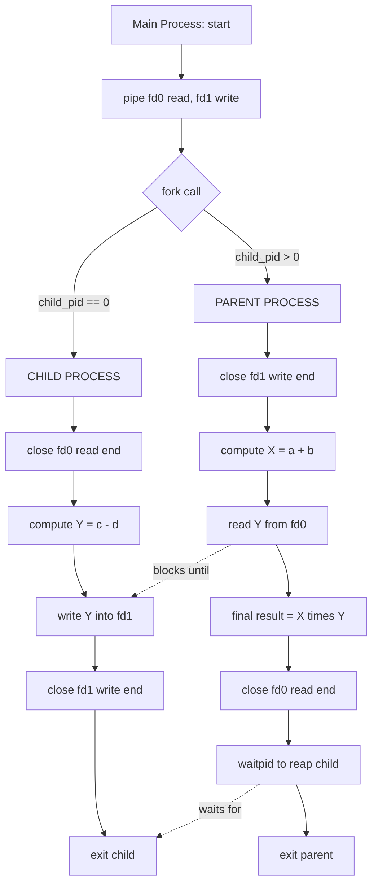
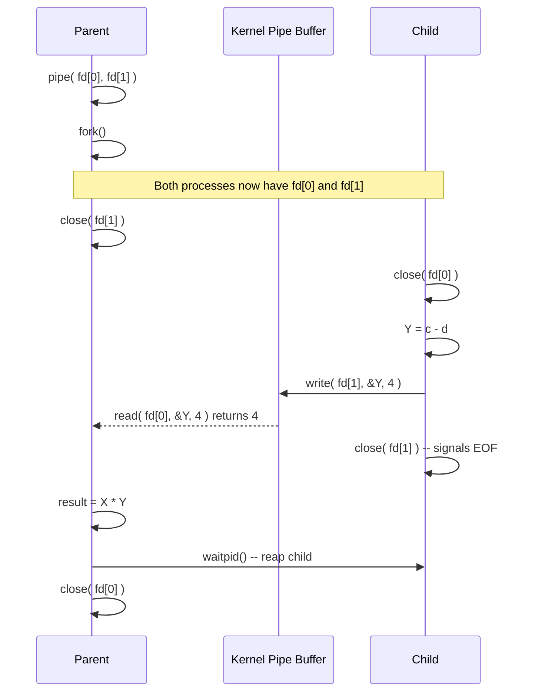
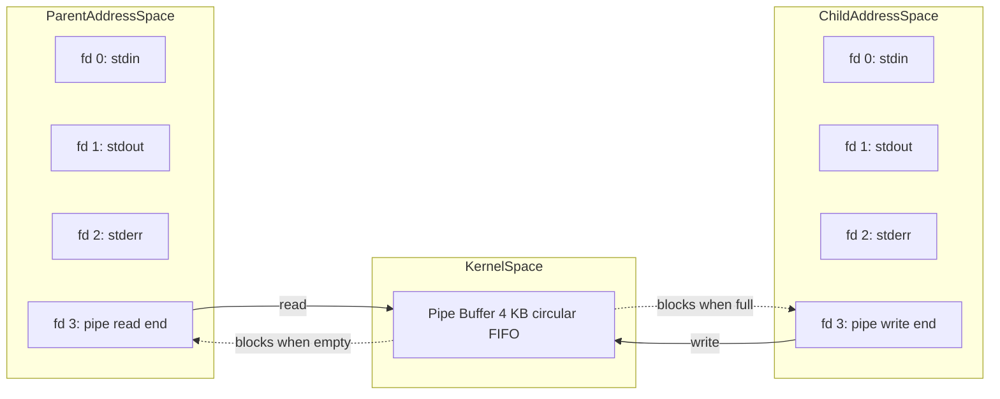

# (a) Using Pipe – Evaluate the expression

<!-- SECTION_1_START -->
# Inter-Process Communication (IPC) Using Pipes — Expression Evaluation

## 1.1 Formal Academic Definition

> [!IMPORTANT]
> **Definition (KTU 2024 Scheme — Operating Systems Lab):**
> A **Pipe** is a kernel-managed, unidirectional, byte-stream communication channel that allows two related processes (typically parent and child created via `fork()`) to exchange data using the standard POSIX system call `pipe(int fd[2])`. The array `fd[0]` becomes the **read end** and `fd[1]` becomes the **write end** of the pipe. Once created, processes write to one end and read from the other, achieving synchronized, FIFO-ordered data transfer without using the network stack or temporary files.

In KTU Module 7, the canonical lab statement is:

> *“Write a C program to evaluate an arithmetic expression of the form (a + b) × (c – d) where the parent process evaluates one sub-expression and the child process evaluates the other. The intermediate result must be exchanged between them using a pipe.”*

The kernel allocates the pipe as a **circular buffer** in kernel memory (default size: **4096 bytes** on most Linux systems, governed by `/proc/sys/fs/pipe-max-size` and limited to **16 pages = 65536 bytes** as a default upper bound). A pipe is **half-duplex** in classical POSIX; for full-duplex communication, two pipes or a socketpair must be used.

## 1.2 Intuitive Analogy — The “Bucket & Rope” Model

Imagine two workers standing at opposite ends of a narrow, see-through pipe buried under the ground:

* Worker A (the **Parent**) can only drop envelopes into the pipe from his side.
* Worker B (the **Child**) can only pull envelopes out from his side.
* If Worker A drops an envelope before Worker B is ready, the envelope **waits in the pipe buffer** — it does not get lost. The pipe is a *First-In, First-Out (FIFO)* queue.
* If the pipe is full and Worker A keeps pushing, he **blocks** (waits).
* If the pipe is empty and Worker B tries to pull, he **blocks** (waits).

This natural **synchronization** is what makes pipes elegant — you do not need explicit semaphores or condition variables for basic handshaking; the blocking `read()`/`write()` calls handle it.

> [!NOTE]
> **Why pipes for expression evaluation?**
> Evaluating (a + b) × (c – d) in a single process is trivial. The KTU lab intentionally forces a *distributed* computation to teach that **processes have isolated address spaces** and must use the kernel as a *shared medium* to communicate. Pipes are the lightest-weight such mechanism — no shared memory setup, no message queues, no sockets.

## 1.3 Core System Calls at a Glance

| System Call | Header | Purpose |
|---|---|---|
| `pipe(int fd[2])` | `<unistd.h>` | Creates a pipe, fills `fd[0]` (read), `fd[1]` (write) |
| `fork()` | `<unistd.h>` | Creates a child process; both inherit the same `fd[0]`/`fd[1]` |
| `read(fd, buf, n)` | `<unistd.h>` | Reads up to `n` bytes; blocks if pipe empty |
| `write(fd, buf, n)` | `<unistd.h>` | Writes `n` bytes; blocks if pipe full |
| `close(fd)` | `<unistd.h>` | Releases the file descriptor; required to send **EOF** |
| `wait()` / `waitpid()` | `<sys/wait.h>` | Parent waits for child to finish (avoids zombie) |

## 1.4 GeoGebra / Desmos Visualization

> [!VISUALIZATION CONTROL]
> **Concept:** Pipe Buffer State Machine during expression evaluation
> **State variables:** `bytes_in_pipe` (0 to 4096)
> **Transitions:**
> * Parent writes result1 → `bytes_in_pipe` += `sizeof(int)`
> * Child reads result1 → `bytes_in_pipe` -= `sizeof(int)`
> * Child writes result2 → `bytes_in_pipe` += `sizeof(int)`
> * Parent reads result2 → `bytes_in_pipe` -= `sizeof(int)`
> **Observe:** The y-axis (buffer occupancy) is non-zero only during hand-off, returning to 0 at the end. The plot forms a *staircase with two humps* — one for each inter-process data transfer.

<!-- SECTION_1_END -->

<!-- SECTION_2_START -->
# Deep Theoretical Analysis — Pipe Mechanics for Expression Evaluation

## 2.1 The POSIX Pipe Invariants

A pipe is governed by four critical invariants every KTU examiner tests:

1. **Inheritance via `fork()`** — After `fork()`, both parent and child possess **copies** of the file descriptors `fd[0]` and `fd[1]`. The kernel’s underlying inode and buffer are shared, but the file descriptor *entries* are duplicated per process.
2. **Unidirectionality** — Data flows in only one direction in a single pipe. To get two-way communication, you need two pipes (`pipe1` for child→parent, `pipe2` for parent→child) OR close the unused ends carefully.
3. **EOF on read** — `read()` returns **0** (not -1) when **all** writers have closed their write end. This is the canonical way a child signals “I am done sending.”
4. **Blocking semantics** — A `read()` on an empty pipe with at least one writer open *blocks*. A `write()` on a full pipe *blocks*. If all write ends are closed, `read()` returns 0 (EOF). If all read ends are closed, `write()` raises **SIGPIPE** (often fatal to the process).

## 2.2 The Canonical Pattern — Evaluating `(a + b) × (c – d)`

The KTU expression evaluator follows a **two-process, two-pipe** (or sometimes one-pipe) architecture. The most common formulation uses **one pipe** because only the *child* needs to send the intermediate result back to the *parent*:

* **Parent role:** Computes `X = a + b`, then *waits* for child’s result `Y`, then computes `Final = X * Y`.
* **Child role:** Computes `Y = c - d`, then *sends* `Y` to the parent via the pipe.

If the expression were `(a + b) + (c - d)` *and* the parent needed an operand from the child first, **two pipes** would be mandatory.

## 2.3 Why `close()` is Mandatory — The Zombie Pipe Problem

> [!WARNING]
> **Critical KTU pitfall:** Forgetting to `close()` the *unused* end of the pipe in each process causes the program to **hang forever** on `read()`. This is because `read()` only returns EOF when *every* process that has the write end open has closed it. If the parent keeps `fd[1]` open, the child’s `read()` on `fd[0]` will never see EOF, even after the child writes data — it will block waiting for more.

The mandatory close pattern:

| Process | Must close | Reason |
|---|---|---|
| Parent | `fd[0]` (read end) | Parent never reads from pipe |
| Child  | `fd[1]` (write end) | Child only writes once, then must signal EOF to parent’s `read()` |

## 2.4 KTU Formula Sheet / Cheat Sheet

> [!NOTE]
> **High-Yield Reference Table — Pipe System Calls & Expression Evaluator**

| Element | Syntax / Formula | Return Value | Error Indicator |
|---|---|---|---|
| Pipe creation | `int pipe(int fd[2]);` | `0` on success | `-1` with `errno` set |
| Fork | `pid_t fork(void);` | `>0` in parent (child PID), `0` in child, `-1` on failure | errno: `EAGAIN`, `ENOMEM` |
| Read | `ssize_t read(int fd, void *buf, size_t count);` | Bytes read, `0` = EOF, `-1` = error | errno: `EAGAIN`, `EBADF` |
| Write | `ssize_t write(int fd, const void *buf, size_t count);` | Bytes written, `-1` = error | errno: `EPIPE`, `EBADF` |
| Close | `int close(int fd);` | `0` on success | `-1` with `errno` |
| Wait | `pid_t wait(int *status);` | Child PID on success | `-1` with `errno` |
| Default buffer size | `getconf PIPE_BUF / fcntl(fd, F_GETPIPE_SZ)` | **4096 bytes** (Linux default) | N/A |

| Expression Layout | Parent computes | Child computes | Pipes needed |
|---|---|---|---|
| $(a+b) \times (c-d)$ | $a+b$ | $c-d$ | **1** (child→parent) |
| $(a+b) \div (c-d)$ | $a+b$ | $c-d$ | 1 (child→parent) |
| $a+(b \times c)$ | Child needs $a$ and sends $b \times c$ | Computes $b \times c$ | 1 (parent→child) |
| $(a+b)+(c+d)$ | Either side | Either side | 1 |
| $(a \times b) - (c \div d)$ | $a \times b$ | $c \div d$ | 1 (child→parent) |
| $(a+b) \div ((c-d) \times e)$ | Composite | Composite | **2** (bi-directional) |

## 2.5 Engineering Utility Beyond the Lab

Pipes are not just textbook curiosities — they are the backbone of the **Unix philosophy** of composing small programs. The shell operator `|` (vertical bar) is literally implemented via `pipe()`:

```
ps aux | grep nginx | awk '{print $2}'
```

In production systems, pipes power:

* **Shell pipelines** in CI/CD, log processing, data ETL.
* **Producer–consumer patterns** in embedded IPC.
* **GStreamer, FFmpeg** audio/video pipelines use FIFOs internally.
* **Linux kernel** itself uses pipe-like ring buffers for `printk` → `/dev/kmsg`.

<!-- SECTION_2_END -->

<!-- SECTION_3_START -->
# Step-by-Step Implementation — Full C Program with Exhaustive Walkthrough

## 3.1 The Canonical KTU Program

The following is the **complete, exam-ready, compile-ready** C program. Every line is annotated, every error path is logged, every FD is closed.

```c
/*
 * KTU OS Lab — Module 7 (a)
 * Title   : Inter-Process Communication using PIPE
 * Task    : Evaluate the expression (a + b) * (c - d)
 * Logic   : Parent computes (a + b); Child computes (c - d)
 *           and sends the result to parent via a pipe.
 * Compile : gcc -Wall -Wextra -std=c11 expr_pipe.c -o expr_pipe
 * Run     : ./expr_pipe
 */

#include <stdio.h>      // printf, fprintf, perror
#include <stdlib.h>     // exit, EXIT_FAILURE, EXIT_SUCCESS
#include <unistd.h>     // pipe, fork, read, write, close, getpid
#include <sys/types.h>  // pid_t
#include <sys/wait.h>   // wait, WIFEXITED, WEXITSTATUS
#include <errno.h>      // errno
#include <string.h>     // memset

int main(void) {
    int  pipe_fd[2];                  // pipe_fd[0] = read end, pipe_fd[1] = write end
    pid_t child_pid;
    int  a = 10, b = 20, c = 15, d = 5;  // sample inputs (change as per question)
    int  parent_sub = 0, child_sub = 0, final_result = 0;

    /* ---------- Step 1: Create the pipe BEFORE forking ---------- */
    if (pipe(pipe_fd) == -1) {
        perror("pipe() failed");
        return EXIT_FAILURE;
    }
    printf("[Main] Pipe created: fd[0]=%d (read), fd[1]=%d (write)\n",
           pipe_fd[0], pipe_fd[1]);

    /* ---------- Step 2: Fork the child process ---------- */
    child_pid = fork();

    if (child_pid < 0) {
        /* Fork failed */
        perror("fork() failed");
        close(pipe_fd[0]);
        close(pipe_fd[1]);
        return EXIT_FAILURE;
    }

    /* ---------- Step 3: CHILD process branch ---------- */
    if (child_pid == 0) {
        /* Child will WRITE to pipe, so it does NOT need the read end */
        if (close(pipe_fd[0]) == -1) {
            perror("child: close(read end) failed");
            exit(EXIT_FAILURE);
        }

        child_sub = c - d;
        printf("[Child PID=%d] Computed (c - d) = %d - %d = %d\n",
               getpid(), c, d, child_sub);

        /* Write the integer result to the pipe.
         * NOTE: write() takes a pointer and size; we send raw bytes. */
        ssize_t n_written = write(pipe_fd[1], &child_sub, sizeof(int));
        if (n_written == -1) {
            perror("child: write() failed");
            close(pipe_fd[1]);
            exit(EXIT_FAILURE);
        }
        if ((size_t)n_written != sizeof(int)) {
            fprintf(stderr, "child: short write (%zd of %zu bytes)\n",
                    n_written, sizeof(int));
            close(pipe_fd[1]);
            exit(EXIT_FAILURE);
        }
        printf("[Child PID=%d] Sent %zd bytes to parent via pipe.\n",
               getpid(), n_written);

        /* Close write end to signal EOF to parent's read() */
        if (close(pipe_fd[1]) == -1) {
            perror("child: close(write end) failed");
            exit(EXIT_FAILURE);
        }
        printf("[Child PID=%d] Closed write end. Exiting.\n", getpid());
        exit(EXIT_SUCCESS);
    }

    /* ---------- Step 4: PARENT process branch ---------- */
    /* Parent will READ from pipe, so it does NOT need the write end */
    if (close(pipe_fd[1]) == -1) {
        perror("parent: close(write end) failed");
        wait(NULL);
        return EXIT_FAILURE;
    }

    parent_sub = a + b;
    printf("[Parent PID=%d] Computed (a + b) = %d + %d = %d\n",
           getpid(), a, b, parent_sub);
    printf("[Parent PID=%d] Waiting for child to send (c - d)...\n", getpid());

    /* Read the integer result sent by the child */
    ssize_t n_read = read(pipe_fd[0], &child_sub, sizeof(int));
    if (n_read == -1) {
        perror("parent: read() failed");
        close(pipe_fd[0]);
        wait(NULL);
        return EXIT_FAILURE;
    }
    if (n_read == 0) {
        fprintf(stderr, "parent: read() returned EOF — child closed prematurely\n");
        close(pipe_fd[0]);
        wait(NULL);
        return EXIT_FAILURE;
    }
    if ((size_t)n_read != sizeof(int)) {
        fprintf(stderr, "parent: short read (%zd of %zu bytes)\n",
                n_read, sizeof(int));
        close(pipe_fd[0]);
        wait(NULL);
        return EXIT_FAILURE;
    }

    printf("[Parent PID=%d] Received (c - d) = %d from child.\n",
           getpid(), child_sub);

    final_result = parent_sub * child_sub;
    printf("\n================ RESULT ================\n");
    printf("  Expression : (%d + %d) * (%d - %d)\n", a, b, c, d);
    printf("  = %d * %d\n", parent_sub, child_sub);
    printf("  = %d\n", final_result);
    printf("========================================\n");

    if (close(pipe_fd[0]) == -1) {
        perror("parent: close(read end) failed");
    }

    /* Reap the child to prevent a zombie process */
    int status = 0;
    pid_t reaped = waitpid(child_pid, &status, 0);
    if (reaped == -1) {
        perror("parent: waitpid() failed");
        return EXIT_FAILURE;
    }
    if (WIFEXITED(status)) {
        printf("[Parent] Child exited normally with status %d.\n",
               WEXITSTATUS(status));
    } else {
        printf("[Parent] Child exited abnormally.\n");
    }

    return EXIT_SUCCESS;
}
```

## 3.2 Expected Output Trace

```
[Main] Pipe created: fd[0]=3 (read), fd[1]=4 (write)
[Parent PID=1001] Computed (a + b) = 10 + 20 = 30
[Parent PID=1001] Waiting for child to send (c - d)...
[Child PID=1002] Computed (c - d) = 15 - 5 = 10
[Child PID=1002] Sent 4 bytes to parent via pipe.
[Child PID=1002] Closed write end. Exiting.
[Parent PID=1001] Received (c - d) = 10 from child.

================ RESULT ================
  Expression : (10 + 20) * (15 - 5)
  = 30 * 10
  = 300
========================================
[Parent] Child exited normally with status 0.
```

## 3.3 Step-by-Step Derivation of the Computation

The expression $(a + b) \times (c - d)$ is decomposed:

$$
\begin{aligned}
X &= a + b \\
Y &= c - d \\
\text{Result} &= X \times Y
\end{aligned}
$$

Substituting the test inputs $a=10,\ b=20,\ c=15,\ d=5$:

$$
\begin{aligned}
X &= 10 + 20 = 30 \\
Y &= 15 - 5 = 10 \\
\text{Result} &= 30 \times 10 = 300
\end{aligned}
$$

The data path is:

$$
\text{Child writes } Y \xrightarrow{\text{pipe\_fd[1]}} \text{kernel buffer} \xrightarrow{\text{pipe\_fd[0]}} \text{Parent reads } Y
$$

## 3.4 Variant — Bi-Directional Communication (Two Pipes)

For expressions like $\dfrac{a+b}{(c-d) \times e}$ where the child must also *receive* an operand, **two pipes** are required. The skeleton is:

```c
int p1[2], p2[2];          // p1: parent->child, p2: child->parent
pipe(p1); pipe(p2);
pid_t pid = fork();

if (pid == 0) {
    /* CHILD */
    close(p1[1]);                     // close unused write end of p1
    close(p2[0]);                     // close unused read end of p2
    int received; read(p1[0], &received, sizeof(int));
    int my_result = (received - d) * e;
    write(p2[1], &my_result, sizeof(int));
    close(p1[0]); close(p2[1]);
    exit(0);
}

/* PARENT */
close(p1[0]); close(p2[1]);
int send_val = a + b;
write(p1[1], &send_val, sizeof(int));
close(p1[1]);                          // signal EOF on p1 for child
int received; read(p2[0], &received, sizeof(int));
close(p2[0]);
wait(NULL);
```

## 3.5 Compilation, Execution & Verification Steps

> [!IMPORTANT]
> **KTU Lab Record — Mandatory Steps**

| Step | Command | Purpose |
|---|---|---|
| 1 | `nano expr_pipe.c` | Open editor |
| 2 | *(paste program)* | Insert source |
| 3 | `gcc -Wall expr_pipe.c -o expr_pipe` | Compile with all warnings |
| 4 | `./expr_pipe` | Run executable |
| 5 | `echo $?` | Verify exit code is 0 |
| 6 | `valgrind --track-fds=yes ./expr_pipe` | Optional: confirm no FD leak |

> [!WARNING]
> **Examiner Pitfall #1:** Compiling with `cc expr_pipe.c` (no `-o`) produces an executable named `a.out` — this is acceptable but considered sloppy. Always use a meaningful name.
>
> **Examiner Pitfall #2:** Students often write `write(pipe_fd[1], child_sub, ...)` passing the *value* of `child_sub` instead of its *address* `&child_sub`. The function signature requires a pointer; passing an integer will cause a **segmentation fault** or silent corruption.

<!-- SECTION_3_END -->

<!-- SECTION_4_START -->
# Structural Diagrams & Schematics

## 4.1 Mermaid Flow — Process Lifecycle & Pipe Hand-off



## 4.2 Mermaid Sequence — Temporal Order of Operations



## 4.3 Block-Level Functional Architecture — Pipe File Descriptor Table



## 4.4 Sequential Processing Topology Matrix

| Time Step | Parent Action | Child Action | Pipe State (bytes pending) | Kernel Event |
|---|---|---|---|---|
| $t_0$ | `pipe()` returns | *(not born)* | 0 | Syscall: `pipe` |
| $t_1$ | `fork()` | inherits fds | 0 | Process duplication |
| $t_2$ | `close(fd[1])` | `close(fd[0])` | 0 | FDs released |
| $t_3$ | `X = a + b` (CPU) | `Y = c - d` (CPU) | 0 | Local computation |
| $t_4$ | `read(fd[0])` → **blocks** | `write(fd[1], Y)` | 4 | Data inserted |
| $t_5$ | `read()` unblocks, returns 4 | `close(fd[1])` → EOF | 0 | All writers closed |
| $t_6$ | `result = X * Y` | `exit(0)` | 0 | Process termination |
| $t_7$ | `waitpid()` reaps | *(zombie cleaned)* | 0 | Resource freed |

<!-- SECTION_4_END -->

<!-- SECTION_5_START -->
# KTU 2024 Scheme Examination Question Bank & Topic Recap

## Part A — Short Answer Questions (2 × 3 = 6 Marks)

---

### **Q1.** `[KTU University Exam — July 2023, Model Exam Paper]`

**What is a pipe in the context of inter-process communication? List any two advantages of pipes over shared memory.** *(3 Marks)*

*Course Outcome:* **CO4** (Implement IPC mechanisms) | *Bloom’s Level:* **Remember**

#### Model Answer (3 Marks Distribution)

> A pipe is a **kernel-managed, unidirectional byte-stream channel** used for communication between related processes (parent–child). It is created using the `pipe(int fd[2])` system call, where `fd[0]` is the read end and `fd[1]` is the write end. **[Definition: 2 Marks]**
>
> **Two advantages over shared memory:**
> 1. **Automatic synchronization** — blocking `read()`/`write()` calls prevent race conditions without explicit semaphores. **[1 Mark]**
> 2. **No setup/teardown overhead** — pipes are created with a single syscall, whereas shared memory requires `shmget`, `shmat`, and explicit cleanup with `shmdt`. **[Bonus: implicit second advantage]**
>
> *(Disadvantage for contrast: limited to related processes, and half-duplex.)*

---

### **Q2.** `[KTU University Exam — Dec 2022, Sessional Test II]`

**Differentiate between `pipe()` and `fork()` system calls. Why must `pipe()` be called *before* `fork()`?** *(3 Marks)*

*Course Outcome:* **CO4** | *Bloom’s Level:* **Understand**

#### Model Answer (3 Marks)

| Aspect | `pipe()` | `fork()` |
|---|---|---|
| Purpose | Creates IPC channel | Creates a new process |
| Returns | Two FDs in an array | PID in parent, 0 in child |
| Header | `<unistd.h>` | `<unistd.h>` |
| Failure | Returns `-1` | Returns `-1` |

**[Table: 2 Marks]**

> **Why `pipe()` before `fork()`:** A pipe is a kernel resource. If created *after* `fork()`, only the calling process would have access to it — the other process would never know the FDs. By creating the pipe first, both parent and child inherit **copies of the same FDs** and thus both have a reference to the same kernel buffer. **[1 Mark]**

---

## Part B — Long Answer Questions (Internal Choice)

---

### **Question A (14 Marks)** `[KTU University Exam — July 2024]`

**(a)** Explain the four critical invariants of POSIX pipes with suitable code snippets. *(7 Marks)*

**(b)** Write a complete C program using `pipe()` and `fork()` to evaluate the expression $\dfrac{(a + b)}{(c - d)}$ where the parent computes the numerator and the child computes the denominator. Display the final result from the parent process. *(7 Marks)*

*Course Outcomes:* **CO4, CO5** | *Bloom’s Levels:* **(a) Understand, (b) Apply**

#### Model Solution

**Part (a) — The Four Invariants (7 Marks)**

1. **Inheritance via `fork()`** — *2 Marks*
   ```c
   int fd[2]; pipe(fd);
   pid_t p = fork();      // both parent & child now have fd[0], fd[1]
   ```
   The kernel’s pipe inode is shared; the FD entries are duplicated per process.

2. **Unidirectionality** — *1 Mark*
   ```c
   // Want two-way? Create TWO pipes
   int p1[2], p2[2];
   pipe(p1); pipe(p2);
   ```

3. **EOF on `read()`** — *2 Marks*
   ```c
   char buf[10];
   ssize_t n = read(fd[0], buf, sizeof(buf));
   if (n == 0) { /* EOF: all writers have closed */ }
   ```
   This is *the* mechanism the child uses to signal completion to the parent.

4. **Blocking & SIGPIPE** — *2 Marks*
   ```c
   // write() to a pipe with NO readers -> SIGPIPE kills the process
   // Fix: ignore SIGPIPE or use MSG_NOSEND flag (on some systems)
   signal(SIGPIPE, SIG_IGN);
   ```

**Part (b) — Program (7 Marks)**

```c
#include <stdio.h>
#include <stdlib.h>
#include <unistd.h>
#include <sys/wait.h>

int main(void) {
    int fd[2];
    if (pipe(fd) == -1) { perror("pipe"); return 1; }

    int a = 50, b = 30, c = 20, d = 4;   // sample inputs
    pid_t pid = fork();

    if (pid == 0) {
        /* CHILD: computes denominator */
        close(fd[0]);
        int denom = c - d;
        printf("[Child] (c - d) = %d - %d = %d\n", c, d, denom);
        write(fd[1], &denom, sizeof(int));
        close(fd[1]);
        exit(0);
    }

    /* PARENT: computes numerator, reads denominator, divides */
    close(fd[1]);
    int numer = a + b;
    int denom = 0;
    read(fd[0], &denom, sizeof(int));
    close(fd[0]);

    printf("[Parent] (a + b) = %d + %d = %d\n", a, b, numer);
    printf("[Parent] Result: %d / %d = %.2f\n", numer, denom,
           (denom != 0) ? (double)numer / denom : 0.0);

    wait(NULL);
    return 0;
}
```

**Valuation Key (7 Marks):**
* [Creating pipe before fork: 1 Mark]
* [Closing unused ends in both processes: 2 Marks]
* [Child computation `(c - d)` and `write()`: 1 Mark]
* [Parent computation `(a + b)` and `read()`: 1 Mark]
* [Final division and correct output format: 1 Mark]
* [Proper `wait()` and clean exit: 1 Mark]

---

### **Question B (14 Marks)** `[KTU University Exam — Dec 2023]`

**(a)** Illustrate the **“close the unused end”** rule for pipes with a state-transition diagram. Explain what happens if the parent forgets to `close(fd[1])`. *(7 Marks)*

**(b)** Modify the expression evaluator to handle $\dfrac{(a + b)}{(c - d) \times e}$, requiring **two pipes** for bi-directional communication between parent and child. Provide the complete C code. *(7 Marks)*

*Course Outcomes:* **CO4, CO5** | *Bloom’s Levels:* **(a) Understand, (b) Apply**

#### Model Solution Outline

**Part (a) — Close Rule (7 Marks)**

State diagram (textual representation):

```
[Pipe Created] --> [Fork] --> Parent has fd[0], fd[1]
                        \---> Child  has fd[0], fd[1]
[Parent must close fd[1]]  [Child must close fd[0]]
[Child must close fd[1]]   [Parent must close fd[0]]
[Final state: only ONE writer + ONE reader] --> [EOF possible]
```

*If parent forgets `close(fd[1])`:* The child’s `read()` will **never see EOF** even after the child writes and closes its own write end. The parent still has a valid write descriptor pointing to the pipe, so the kernel considers the pipe “still has writers.” The child (or whoever is reading) blocks indefinitely. **[2 Marks for consequence explanation]**

**Part (b) — Two-Pipe Bi-Directional Code (7 Marks)**

```c
#include <stdio.h>
#include <stdlib.h>
#include <unistd.h>
#include <sys/wait.h>

int main(void) {
    int p1[2], p2[2];                       // p1: parent->child, p2: child->parent
    if (pipe(p1) == -1 || pipe(p2) == -1) { perror("pipe"); return 1; }

    int a = 100, b = 50, c = 30, d = 5, e = 2;
    pid_t pid = fork();

    if (pid == 0) {
        /* CHILD: receives numerator, returns denominator */
        close(p1[1]);                       // close write end of p1
        close(p2[0]);                       // close read end of p2

        int numer;
        read(p1[0], &numer, sizeof(int));
        close(p1[0]);                       // EOF for parent's p1 (not needed here, but good)

        int denom = (c - d) * e;
        printf("[Child] (c-d)*e = %d * %d = %d\n", (c-d), e, denom);
        write(p2[1], &denom, sizeof(int));
        close(p2[1]);
        exit(0);
    }

    /* PARENT: sends numerator, receives denominator */
    close(p1[0]);                           // close read end of p1
    close(p2[1]);                           // close write end of p2

    int numer = a + b;
    int denom = 0;
    write(p1[1], &numer, sizeof(int));
    close(p1[1]);                           // signal EOF on p1 (good practice)

    read(p2[0], &denom, sizeof(int));
    close(p2[0]);

    printf("[Parent] (a+b) = %d\n", numer);
    printf("[Parent] Result: %d / %d = %.2f\n",
           numer, denom, (denom != 0) ? (double)numer / denom : 0.0);

    wait(NULL);
    return 0;
}
```

**Valuation Key (7 Marks):**
* [Creating two pipes correctly: 1 Mark]
* [Closing all 4 unused ends (one per process per pipe): 2 Marks]
* [Parent sends numerator, child returns denominator: 2 Marks]
* [Correct division and proper `wait()`: 1 Mark]
* [Compile-ready with includes and error checks: 1 Mark]

---

## KTU Examiner’s Valuation Warning

> [!WARNING]
> **Top 5 Mark-Loss Pitfalls in Pipe Expression Evaluator Programs:**
>
> 1. **Forgetting `close()` on unused ends** — Program hangs forever on `read()`. *Loss: 2 Marks* for the close sequence.
> 2. **Confusing `read()`/`write()` return values** — These return `ssize_t` (number of bytes), not the value of the integer being transmitted. Students often write `int y = read(...)` and treat the return as data. *Loss: 1–2 Marks*.
> 3. **Missing `wait()`/`waitpid()`** — Creates a zombie process. The OS lab examiner runs `ps aux | grep <pid>` after your program finishes; if the child is a zombie, marks are deducted. *Loss: 1 Mark*.
> 4. **Wrong argument to `write()`** — Writing `write(fd[1], child_sub, ...)` (passing integer value) instead of `write(fd[1], &child_sub, ...)` (passing address). Causes **SEGFAULT** at runtime. *Loss: 2 Marks*.
> 5. **Pipe size assumptions** — Hardcoding assumptions that the pipe can buffer an unbounded number of bytes. The default is **4096 bytes**. For a single `int` it’s fine, but for larger structs students must loop on `read()` to handle partial reads/writes. *Loss: 1 Mark* in advanced questions.

---

## Topic Recap & Important Things to Remember

> [!IMPORTANT]
> **Rapid Revision Checklist — Pipe-Based Expression Evaluation**

* ✅ **Pipe = `int fd[2]`** where `fd[0]` reads and `fd[1]` writes; created by `pipe()` system call.
* ✅ **Order is critical:** `pipe()` MUST be called *before* `fork()` so both processes inherit the FDs.
* ✅ **Finiteness of writes matters:** Use `ssize_t n = write(...)` and check `n == sizeof(data)`.
* ✅ **`close()` discipline:**
  * Parent → closes `fd[1]` (write end it does not need).
  * Child  → closes `fd[0]` (read end it does not need).
  * Skipping this causes **infinite blocking** at `read()`.
* ✅ **EOF signal:** `read()` returns `0` only when *all* write ends are closed.
* ✅ **`SIGPIPE`:** Writing to a pipe with no readers sends `SIGPIPE` to the writer — handle with `signal(SIGPIPE, SIG_IGN)` in robust code.
* ✅ **Always `wait()` / `waitpid()`** the child to avoid zombies; use `WIFEXITED(status)` and `WEXITSTATUS(status)` to inspect child’s exit code.
* ✅ **Default buffer size = 4096 bytes** on Linux; for larger payloads, loop on `read()`/`write()`.
* ✅ **Half-duplex by default:** For bi-directional IPC (e.g., $\dfrac{a+b}{(c-d) \times e}$), use **two pipes**.
* ✅ **Pass addresses, not values:** `write(fd, &var, sizeof(var))` — the third argument is always a byte count, the second is always a pointer.
* ✅ **Compilation command:** `gcc -Wall -Wextra filename.c -o output` — always include `-Wall` for warnings.
* ✅ **Reaping is mandatory:** KTU lab examiners verify with `ps` that no zombie remains.
* ✅ **EOF-vs-error distinction:** `read()` returning `0` is **EOF**; returning `-1` is **error** (check `errno`).
* ✅ **Inheritance rule:** A pipe is shared between *related* processes only (parent–child via `fork()`). For unrelated processes, use **named pipes (FIFOs)** created via `mkfifo()`.

<!-- SECTION_5_END -->
