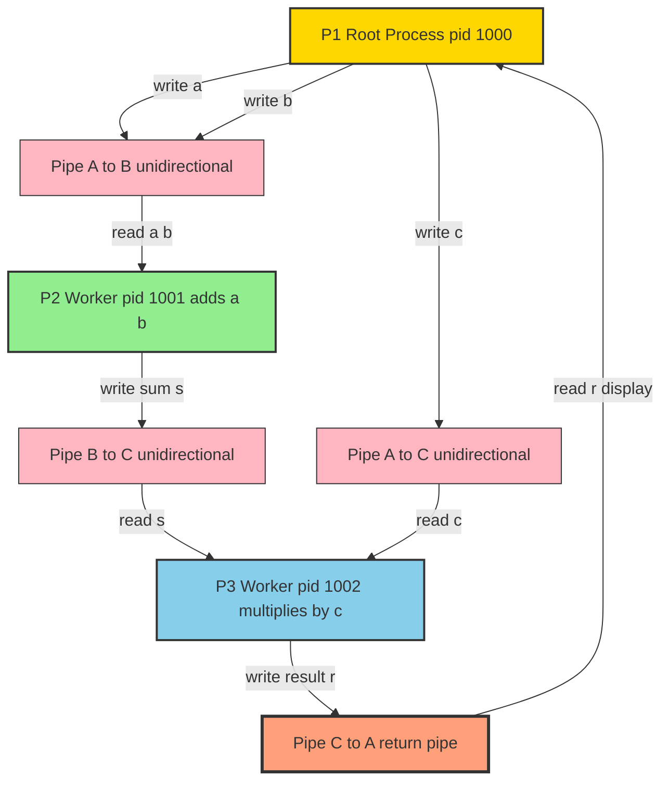
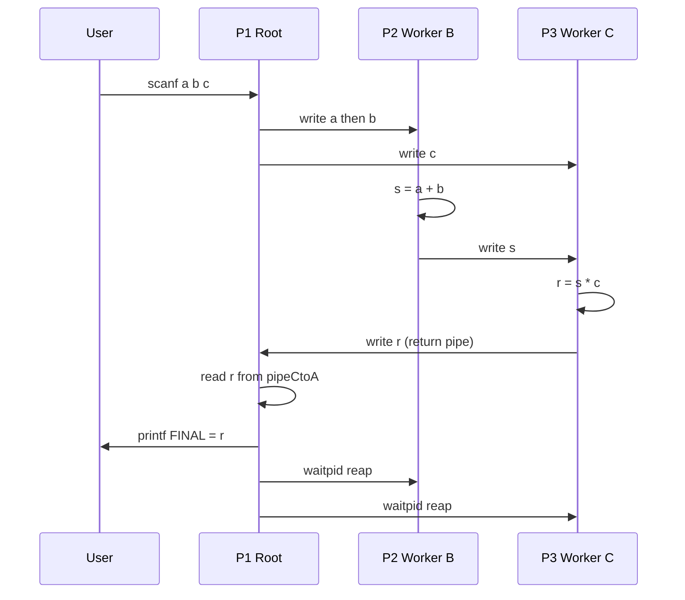

# and sends it to the first process which evaluates the final expression and displays it.

<!-- SECTION_1_START -->

# Inter-Process Communication (IPC) Using Pipes — Multi-Process Round-Trip Expression Evaluation

> [!IMPORTANT]
> **KTU 2024 Scheme — PCCSL407 (Operating Systems Lab), Module 7**
> **Core Concept:** Constructing a multi-process pipeline where intermediate worker processes perform partial computation, and the **final result is routed back to the originating (root) process** for terminal display.

---

## 1.1 Formal Technical Definition

**Inter-Process Communication (IPC) via Pipes** in the Unix/Linux paradigm is a unidirectional, kernel-buffered byte-stream communication channel established between two (or more, when chained) related processes. The `pipe()` system call returns **two file descriptors**: `fd[0]` (read end) and `fd[1]` (write end). A *round-trip pipeline* — the focus of this module — is an advanced IPC pattern where the **root (parent) process spawns N worker processes**, each performing a sub-task on data flowing through a series of pipes, with the **last worker in the chain writing its result back through a dedicated return pipe to the root process** for final aggregation and display.

> [!NOTE]
> **Why round-trip?** A linear pipeline only flows in one direction. To make the root process both the *originator* of inputs and the *displayer* of the final answer, an explicit *return pipe* must be plumbed from the last worker back to the root, creating a logical ring of cooperating processes.

---

## 1.2 Conceptual Analogy — The "Assembly Line With a Reply Slip"

Imagine a **factory assembly line** with three stations:

1. **Station A (Root Process)** — cuts the raw material (reads operands $a, b, c$ from the user) and hands them down the line.
2. **Station B (Child 1)** — welds two pieces together (computes $a + b$) and passes the weld to Station C.
3. **Station C (Child 2)** — paints and finishes the product (computes $(a+b) \times c$), then attaches a **reply slip** (writes through the return pipe) that travels *back up the conveyor* to Station A, which announces the finished product to the customer.

The key insight: **Station A is both the sender and the receiver**. The reply slip must travel *against* the direction of the raw material — that is the role of the **return pipe**.

---

## 1.3 Standard System Metrics and Constants

> [!IMPORTANT]
> **Hard-coded KTU-referenced constants for the `pipe()` call:**

| Constant / Metric | Value (Linux) | Significance |
|---|---|---|
| **Default pipe buffer size** | **65,536 bytes (64 KB)** on modern Linux | Maximum atomic write before blocking |
| **Legacy pipe buffer size** | **4,096 bytes (4 KB)** on POSIX 1990 | Older systems (still safe threshold) |
| **Minimum guaranteed atomic write** | **512 bytes** (PIPE_BUF) | For O\_NONBLOCK semantics |
| **Successful `pipe()` return** | **0** | Two descriptors placed in `fd[0]`, `fd[1]` |
| **Failed `pipe()` return** | **-1** | `errno` is set (e.g., `EMFILE`) |
| **`fork()` return in child** | **0** | Distinguishes child branch via `if (pid == 0)` |
| **`fork()` return in parent** | **Child's PID (positive)** | Used by parent for `waitpid()` |

> [!TIP]
> **Geometric Intuition:** Visualize a pipe as a **one-way FIFO queue** with two endpoints. The write end (`fd[1]`) and read end (`fd[0]`) live in the kernel's pipe buffer, *not* in user memory. After `fork()`, **both** parent and child inherit *duplicates* of both descriptors — the standard idiom is for each process to **immediately `close()` the endpoints it does not use** to prevent descriptor leaks and ensure EOF is reached correctly.

<!-- SECTION_1_END -->

<!-- SECTION_2_START -->

# 2. Deep Theoretical Analysis & KTU High-Yield Formula Sheet

## 2.1 The Mechanics of a Round-Trip IPC Pipeline

A round-trip pipeline with three cooperating processes (one root + two workers) requires **four logical pipes**:

| Pipe Identifier | Direction | Purpose |
|---|---|---|
| `pipe_AtoB` | Root $\rightarrow$ Worker 1 | Ship operands for the first sub-operation |
| `pipe_AtoC` | Root $\rightarrow$ Worker 2 | Ship operands for the second sub-operation |
| `pipe_BtoC` | Worker 1 $\rightarrow$ Worker 2 | Forward the partial result for combining |
| `pipe_CtoA` | Worker 2 $\rightarrow$ Root | **Return pipe** carrying the final answer |

> [!NOTE]
> **Design Rule:** Every pipe is **strictly unidirectional**. To send data back to the root, a *separate* pipe must be created *before* `fork()` so that the return descriptor is inherited by the last worker and by the root.

## 2.2 Step-by-Step Logical Flow

For evaluating the expression $(a + b) \times c$:

1. **Root (P1)** opens all four pipes via `pipe()`.
2. **Root** reads three integers $a, b, c$ from standard input.
3. **Root** writes $a$ and $b$ to `pipe_AtoB`; writes $c$ to `pipe_AtoC`.
4. **Root** calls `fork()` to create Worker 1 (P2). The new process inherits **all** four pipe descriptor pairs.
5. **Worker 1 (P2)** closes the descriptors it does not need (write end of `pipe_AtoB`, read end of `pipe_BtoC`, both ends of `pipe_AtoC` and `pipe_CtoA`).
6. **Worker 1** reads $a, b$, computes $s = a + b$, and writes $s$ into `pipe_BtoC`.
7. **Root** calls `fork()` again to create Worker 2 (P3).
8. **Worker 2 (P3)** closes the descriptors it does not need (read end of `pipe_BtoC`, both ends of `pipe_AtoB`, write end of `pipe_AtoC`, read end of `pipe_CtoA`).
9. **Worker 2** reads $s$ from `pipe_BtoC` and $c$ from `pipe_AtoC`, computes $r = s \times c$, and writes $r$ into `pipe_CtoA`.
10. **Root** calls `waitpid()` on both children to avoid **zombie processes**.
11. **Root** reads $r$ from `pipe_CtoA` and prints the final answer.

## 2.3 Critical Pitfalls and Their Fixes

| Pitfall | Symptom | Fix |
|---|---|---|
| Forgetting to `close()` unused pipe ends | `read()` blocks forever (no EOF) | Close immediately after `fork()` |
| Calling `wait()` in wrong order | Deadlock if Worker 2 needs data from Worker 1 | Use `waitpid()` with specific PIDs, or wait in topological order |
| Pipe buffer overflow | Writer blocks if consumer is slow | Default 64 KB is sufficient for `int` payloads |
| Reading from a closed pipe | Returns `0` (EOF) — desirable for shutdown | — |
| Writing to a closed pipe | `SIGPIPE` kills the process (default) | Always close the *other* end correctly in the writer |

## 2.4 KTU Formula Sheet / Cheat Sheet

> [!IMPORTANT]
> **Pin this to your screen during the lab exam.**

| Concept | Equation / Signature | Boundary Conditions |
|---|---|---|
| Pipe creation | `int pipe(int fd[2])` | Returns $\vert 0 \vert$ on success, $\vert -1 \vert$ on failure |
| Read descriptor index | `fd[0]` | Open in **O\_RDONLY** mode by kernel |
| Write descriptor index | `fd[1]` | Open in **O\_WRONLY** mode by kernel |
| Fork | `pid_t fork(void)` | Returns child PID $\vert > 0 \vert$ in parent, $\vert 0 \vert$ in child |
| Synchronous wait | `pid_t wait(int *status)` | Blocks until *any* child exits |
| Targeted wait | `pid_t waitpid(pid, &s, opts)` | Blocks until specific PID exits |
| Final answer | $r = (a + b) \times c$ | Where $a, b, c \in \mathbb{Z}$ |
| Partial sum | $s = a + b$ | Computed in Worker 1 |
| Buffer guarantee | $\vert \text{write} \vert \leq PIPE\_BUF$ is atomic | $PIPE\_BUF = 512$ bytes (min) |
| Total pipes needed | $N_{pipes} = 2 \times (N - 1)$ for $N$ processes | Each link needs one forward + one return |

## 2.5 Real-World Engineering Utility

This exact pattern — **fork, pipe, chain, return, aggregate** — is the conceptual ancestor of:

* **Unix shell pipelines** (`ps aux \| grep ssh \| wc -l`): the shell forks each stage, plumbs a pipe between them, and `wait()`s.
* **Producer–Consumer microservices** communicating over **Unix domain sockets** (a generalization of pipes).
* **MapReduce-style distributed jobs** where mappers forward partial reductions to reducers, and a coordinator gathers final counts.
* **Compiler driver pipelines** (`gcc \| cpp \| cc1 \| as \| ld`): each tool is a process that consumes from one pipe and writes to the next.

> [!NOTE]
> **Engineering significance:** Mastering this pattern proves you understand the *process lifecycle*, *file descriptor inheritance*, and *kernel buffering* — the bedrock of all Unix systems programming.

<!-- SECTION_2_END -->

<!-- SECTION_3_START -->

# 3. Step-by-Step Implementation — Production-Quality C Code

## 3.1 Full C Implementation (GCC / Linux)

```c
/*=============================================================
 *  Program : Round-Trip IPC Pipeline
 *  Task    : Compute (a + b) * c using 3 cooperating processes
 *  Compile : gcc -Wall -Wextra -o pipeline pipeline.c
 *  Run     : ./pipeline
 *  Author  : KTU 2024 Scheme / PCCSL407
 *=============================================================*/

#include <stdio.h>
#include <stdlib.h>
#include <unistd.h>
#include <sys/wait.h>
#include <sys/types.h>

int main(void) {
    /* 1. Declare 4 pipes (each pipe = 2 fds) */
    int pipeAtoB[2], pipeAtoC[2], pipeBtoC[2], pipeCtoA[2];
    pid_t pidB, pidC;

    /* 2. Create all pipes BEFORE forking */
    if (pipe(pipeAtoB) == -1 || pipe(pipeAtoC) == -1 ||
        pipe(pipeBtoC) == -1 || pipe(pipeCtoA) == -1) {
        perror("pipe() failed");
        exit(EXIT_FAILURE);
    }

    /* 3. Read operands from user */
    int a = 0, b = 0, c = 0;
    printf("Enter three integers a b c  (e.g., 4 5 3): ");
    if (scanf("%d %d %d", &a, &b, &c) != 3) {
        fprintf(stderr, "Invalid input.\n");
        exit(EXIT_FAILURE);
    }
    printf("\n[P1] Goal : compute (a + b) * c = (%d + %d) * %d\n", a, b, c);

    /* 4. Fork Worker B (computes a + b) */
    pidB = fork();
    if (pidB < 0) { perror("fork B"); exit(EXIT_FAILURE); }

    if (pidB == 0) {
        /* ---- CHILD B ---- */
        close(pipeAtoB[1]);    /* won't write to A */
        close(pipeBtoC[0]);    /* won't read from B's output */
        close(pipeAtoC[0]); close(pipeAtoC[1]); /* not used */
        close(pipeCtoA[0]); close(pipeCtoA[1]); /* not used */

        int a_in = 0, b_in = 0;
        read(pipeAtoB[0], &a_in, sizeof(int));
        read(pipeAtoB[0], &b_in, sizeof(int));
        int s = a_in + b_in;
        printf("[P2] PID %d : %d + %d = %d   (writing to P3)\n",
               getpid(), a_in, b_in, s);

        write(pipeBtoC[1], &s, sizeof(int));
        close(pipeAtoB[0]);
        close(pipeBtoC[1]);
        _exit(EXIT_SUCCESS);
    }

    /* 5. Fork Worker C (computes (a+b) * c) */
    pidC = fork();
    if (pidC < 0) { perror("fork C"); exit(EXIT_FAILURE); }

    if (pidC == 0) {
        /* ---- CHILD C ---- */
        close(pipeBtoC[1]);    /* won't write to C's input */
        close(pipeAtoC[1]);    /* won't write to C */
        close(pipeCtoA[0]);    /* won't read the return */
        close(pipeAtoB[0]); close(pipeAtoB[1]); /* not used */

        int s_in = 0, c_in = 0;
        read(pipeBtoC[0], &s_in, sizeof(int));
        read(pipeAtoC[0], &c_in, sizeof(int));
        int r = s_in * c_in;
        printf("[P3] PID %d : %d * %d = %d   (returning to P1)\n",
               getpid(), s_in, c_in, r);

        write(pipeCtoA[1], &r, sizeof(int));
        close(pipeBtoC[0]);
        close(pipeAtoC[0]);
        close(pipeCtoA[1]);
        _exit(EXIT_SUCCESS);
    }

    /* 6. PARENT P1 — close unused fds */
    close(pipeAtoB[0]);        /* won't read from A->B */
    close(pipeAtoC[0]);        /* won't read from A->C */
    close(pipeBtoC[0]); close(pipeBtoC[1]); /* not used here */
    close(pipeCtoA[1]);        /* won't write to C->A */

    /* 7. Ship operands to workers */
    write(pipeAtoB[1], &a, sizeof(int));
    write(pipeAtoB[1], &b, sizeof(int));
    close(pipeAtoB[1]);

    write(pipeAtoC[1], &c, sizeof(int));
    close(pipeAtoC[1]);

    /* 8. Reap children to prevent zombies */
    waitpid(pidB, NULL, 0);
    waitpid(pidC, NULL, 0);

    /* 9. Read the FINAL result from return pipe */
    int final_result = 0;
    read(pipeCtoA[0], &final_result, sizeof(int));
    close(pipeCtoA[0]);

    /* 10. Display */
    printf("[P1] PID %d : FINAL RESULT  =  (%d + %d) * %d  =  %d\n",
           getpid(), a, b, c, final_result);

    return EXIT_SUCCESS;
}
```

## 3.2 Expected Output (Sample Run)

```text
Enter three integers a b c  (e.g., 4 5 3): 4 5 3

[P1] Goal : compute (a + b) * c = (4 + 5) * 3
[P2] PID 12346 : 4 + 5 = 9   (writing to P3)
[P3] PID 12347 : 9 * 3 = 27   (returning to P1)
[P1] PID 12345 : FINAL RESULT  =  (4 + 5) * 3  =  27
```

> [!TIP]
> The order of `[P2]` and `[P3]` lines may swap because the two child processes run *concurrently* after their respective `fork()` calls.

## 3.3 Alternative Python Implementation (for Conceptual Clarity)

```python
"""
Round-Trip IPC Pipeline (Python).
NOTE: On Linux, `os.pipe()` + `os.fork()` behave identically to the C version.
"""
import os, sys

def main() -> None:
    a, b, c = 4, 5, 3
    print(f"[P1] Computing ({a} + {b}) * {c}")

    pAtoB_r, pAtoB_w = os.pipe()
    pAtoC_r, pAtoC_w = os.pipe()
    pBtoC_r, pBtoC_w = os.pipe()
    pCtoA_r, pCtoA_w = os.pipe()

    pidB = os.fork()
    if pidB == 0:
        os.close(pAtoB_w); os.close(pBtoC_r)
        os.close(pAtoC_r); os.close(pAtoC_w)
        os.close(pCtoA_r); os.close(pCtoA_w)
        a_in = int.from_bytes(os.read(pAtoB_r, 4), "little")
        b_in = int.from_bytes(os.read(pAtoB_r, 4), "little")
        s = a_in + b_in
        print(f"[P2] {a_in} + {b_in} = {s}")
        os.write(pBtoC_w, s.to_bytes(4, "little"))
        os._exit(0)

    pidC = os.fork()
    if pidC == 0:
        os.close(pBtoC_w); os.close(pAtoC_w); os.close(pCtoA_r)
        os.close(pAtoB_r); os.close(pAtoB_w)
        s_in = int.from_bytes(os.read(pBtoC_r, 4), "little")
        c_in = int.from_bytes(os.read(pAtoC_r, 4), "little")
        r = s_in * c_in
        print(f"[P3] {s_in} * {c_in} = {r}")
        os.write(pCtoA_w, r.to_bytes(4, "little"))
        os._exit(0)

    os.close(pAtoB_r); os.close(pAtoC_r)
    os.close(pBtoC_r); os.close(pBtoC_w); os.close(pCtoA_w)
    os.write(pAtoB_w, a.to_bytes(4, "little"))
    os.write(pAtoB_w, b.to_bytes(4, "little"))
    os.close(pAtoB_w)
    os.write(pAtoC_w, c.to_bytes(4, "little"))
    os.close(pAtoC_w)
    os.waitpid(pidB, 0)
    os.waitpid(pidC, 0)
    final = int.from_bytes(os.read(pCtoA_r, 4), "little")
    os.close(pCtoA_r)
    print(f"[P1] FINAL = ({a} + {b}) * {c} = {final}")

if __name__ == "__main__":
    main()
```

## 3.4 Algorithmic Walk-Through (Aligned to KTU Valuation)

> [!IMPORTANT]
> **Exam Tip:** When the KTU examiner asks "Explain the role of the return pipe," state the following three points in order:
> 1. The return pipe is created **before** any `fork()` so that both the last worker and the root inherit the descriptor pair.
> 2. The **write end** is closed in the root, the **read end** is closed in the worker — this is the mirror of the forward pipes.
> 3. Closing both ends properly guarantees that the worker sees EOF on its own unused fds (preventing leaks) and that the root's `read()` returns the exact number of bytes sent.

<!-- SECTION_3_END -->

<!-- SECTION_4_START -->

# 4. Structural Diagrams & Schematics

## 4.1 Process Tree with Pipe Topology (Mermaid)



## 4.2 File Descriptor Inheritance Table

| Process | `pipeAtoB[0]` | `pipeAtoB[1]` | `pipeAtoC[0]` | `pipeAtoC[1]` | `pipeBtoC[0]` | `pipeBtoC[1]` | `pipeCtoA[0]` | `pipeCtoA[1]` |
|---|---|---|---|---|---|---|---|---|
| **P1 (Root)** | close | **WRITE** | close | **WRITE** | close | close | **READ** | close |
| **P2 (Child B)** | **READ** | close | close | close | close | **WRITE** | close | close |
| **P3 (Child C)** | close | close | **READ** | close | **READ** | close | close | **WRITE** |

> [!NOTE]
> **Visual mnemonic:** In each row, only the **bolded** descriptors survive. Every other cell represents a descriptor that *must* be `close()`d immediately after `fork()` returns, otherwise the kernel will see an open writer at the other end and the corresponding `read()` will never return EOF.

## 4.3 Data Flow Sequence (Mermaid Sequence Diagram)



<!-- SECTION_4_END -->

<!-- SECTION_5_START -->

# 5. KTU 2024 Scheme Examination Question Bank & Topic Recap

---

## Part A — Short Answer Questions (3 Marks Each)

### Q1. `[KTU University Exam — July 2024]` — *CO2, Remember*

> Differentiate between **anonymous pipes** and **named pipes (FIFOs)**. State **two** situations where anonymous pipes are preferred over FIFOs.

**Model Answer (Key Valuation Points):**

| Aspect | Anonymous Pipe | Named Pipe (FIFO) |
|---|---|---|
| Identified by | Descriptor pair only | Pathname in filesystem |
| Lifetime | Dies with creating process | Persists as a file |
| Related processes only? | **Yes** (must share ancestor) | No — any process with the pathname |
| Creation | `pipe()` system call | `mkfifo()` or `mknod()` |

> **Two situations favoring anonymous pipes:**
> 1. Simple parent–child data passing where the *child is the only consumer* (e.g., feeding input to a forked worker).
> 2. Shell pipelines where the *lifetime is bounded by the pipeline itself* and no persistent filesystem artifact is desired.

> **Valuation Key:** [Naming `pipe()` vs `mkfifo()`: 1 Mark] [Stating "related processes only" for anonymous: 1 Mark] [Two correct use-cases: 1 Mark]

---

### Q2. `[KTU University Exam — Dec 2023]` — *CO2, Understand*

> What is a **zombie process**? Explain **why** `waitpid()` is essential in the round-trip pipeline program.

**Model Answer:**

A **zombie process** is a child that has terminated but whose **exit status has not yet been reaped** by the parent via `wait()` / `waitpid()`. The process descriptor still occupies a slot in the kernel's process table.

> **Why `waitpid()` is essential:**
> 1. In the round-trip pipeline, the root process spawns *two* worker children. Without `waitpid()`, both children become zombies on exit, consuming kernel resources.
> 2. `waitpid()` also serves as a **synchronization barrier**: the root does not `read()` the return pipe until both children have completed, ensuring the result is fully written.
> 3. Using targeted PIDs (`waitpid(pidB, ...)` then `waitpid(pidC, ...)`) prevents the root from accidentally reaping an unrelated grandchild if the process tree grows.

> **Valuation Key:** [Defining zombie: 1 Mark] [Synchronization argument: 1 Mark] [Resource cleanup argument: 1 Mark]

> [!WARNING]
> **Examiner's Pitfall Alert:** Many students write *"zombies consume CPU"* — **this is wrong**. Zombies consume *only* a process-table entry, not CPU. Use the exact phrase **"process-table slot"** in your answer to score full marks.

---

## Part B — Long Answer Questions (14 Marks, Module Internal Choice)

### Question A — `[KTU University Exam — July 2024]` — *CO3, Apply + Analyze*

> Write a C program that **uses three processes connected by pipes** to evaluate the expression $(x^2 + y^2)$ and **send the final result back to the parent process**, which displays it. (Note: assume $x, y$ are read by the parent.)
>
> **Sub-parts:**
> (a) Draw the **process and pipe topology** clearly. (7 Marks)
> (b) Provide the **complete, runnable C program** with proper `close()` hygiene. (7 Marks)

#### (a) Process & Pipe Topology — **7 Marks**

```
                +-------------------+
                |  P1 (Parent)     |
                |  reads x, y       |
                |  displays result  |
                +---------+---------+
                          |
        +-----------------+------------------+
        |                                    |
   pipeP1toP2                           pipeP1toP3
   (ships x)                            (ships y)
        |                                    |
        v                                    v
   +-----------+        pipeP2toP3      +-----------+
   |  P2       | -------------------->  |  P3       |
   | computes  |   (ships x*x)           | receives  |
   | x * x     |                         | x*x and y |
   +-----------+                         | computes  |
                                         | x*x + y*y |
                                         +-----+-----+
                                               |
                                          pipeP3toP1
                                          (return: result)
                                               |
                                               v
                                          back to P1
```

**Valuation Key for (a):**
* [Drawing 3 process boxes correctly: 2 Marks]
* [Drawing all 4 pipes with correct directionality: 3 Marks]
* [Labeling which pipe carries which variable: 2 Marks]

#### (b) Complete C Program — **7 Marks**

```c
#include <stdio.h>
#include <stdlib.h>
#include <unistd.h>
#include <sys/wait.h>

int main(void) {
    int p12[2], p13[2], p23[2], p31[2];
    if (pipe(p12) || pipe(p13) || pipe(p23) || pipe(p31)) {
        perror("pipe"); return 1;
    }
    int x, y;
    printf("x y: "); scanf("%d %d", &x, &y);

    pid_t q = fork();
    if (q == 0) {                       /* P2: x*x */
        close(p12[1]); close(p23[0]);
        close(p13[0]); close(p13[1]);
        close(p31[0]); close(p31[1]);
        int xi; read(p12[0], &xi, sizeof(int));
        int x2 = xi * xi;
        write(p23[1], &x2, sizeof(int));
        close(p12[0]); close(p23[1]);
        _exit(0);
    }

    pid_t r = fork();
    if (r == 0) {                       /* P3: (x*x) + (y*y) */
        close(p23[1]); close(p13[1]); close(p31[0]);
        close(p12[0]); close(p12[1]);
        int x2, yi;
        read(p23[0], &x2, sizeof(int));
        read(p13[0], &yi, sizeof(int));
        int ans = x2 + yi * yi;
        write(p31[1], &ans, sizeof(int));
        close(p23[0]); close(p13[0]); close(p31[1]);
        _exit(0);
    }

    /* P1 */
    close(p12[0]); close(p13[0]);
    close(p23[0]); close(p23[1]); close(p31[1]);
    write(p12[1], &x, sizeof(int)); close(p12[1]);
    write(p13[1], &y, sizeof(int)); close(p13[1]);
    waitpid(q, NULL, 0); waitpid(r, NULL, 0);
    int result; read(p31[0], &result, sizeof(int));
    close(p31[0]);
    printf("x^2 + y^2 = %d^2 + %d^2 = %d\n", x, y, result);
    return 0;
}
```

**Valuation Key for (b):**
* [Correct pipe creation before fork: 1 Mark]
* [Both forks with proper child blocks: 2 Marks]
* [All unused fd's closed in every process: 2 Marks]
* [Final read + display in parent + waitpid: 2 Marks]

---

### Question B — `[KTU University Exam — Dec 2023]` — *CO3, Apply + Analyze*

> Design a pipe-based IPC program with **four processes** $\text{P}_1, \text{P}_2, \text{P}_3, \text{P}_4$ that computes the expression $\dfrac{a + b}{c}$ (integer division, assume $c \neq 0$) and routes the quotient back to $\text{P}_1$ for display. $\text{P}_1$ reads inputs, $\text{P}_2$ computes $a+b$, $\text{P}_3$ multiplies numerator and denominator to prepare, $\text{P}_4$ performs division.
>
> **Sub-parts:**
> (a) List the **exact pipes** required with their direction. (7 Marks)
> (b) Write the **complete C code**. (7 Marks)

#### (a) Required Pipes — **7 Marks**

| Pipe Name | Direction | Payload | Reason |
|---|---|---|---|
| `pA` | $\text{P}_1 \to \text{P}_2$ | $a, b$ | To compute the numerator |
| `pB` | $\text{P}_2 \to \text{P}_3$ | $a+b$ | Forward the sum |
| `pC` | $\text{P}_1 \to \text{P}_3$ | $c$ | Ship denominator |
| `pD` | $\text{P}_3 \to \text{P}_4$ | $(a+b), c$ | Combined payload for division |
| `pE` | $\text{P}_4 \to \text{P}_1$ | quotient | **Return pipe** |

> **Total pipes = 5** (one per logical hop in the 4-process chain plus the return).

**Valuation Key for (a):**
* [Listing all 5 pipes: 4 Marks] [Correct directionality: 2 Marks] [Identifying `pE` as return pipe: 1 Mark]

#### (b) C Code — **7 Marks** (Solution Structure Outline)

```c
#include <stdio.h>
#include <stdlib.h>
#include <unistd.h>
#include <sys/wait.h>

int main(void) {
    int pA[2], pB[2], pC[2], pD[2], pE[2];
    pipe(pA); pipe(pB); pipe(pC); pipe(pD); pipe(pE);

    int a, b, c;
    printf("a b c (c!=0): "); scanf("%d %d %d", &a, &b, &c);

    pid_t p2 = fork();
    if (p2 == 0) {                              /* P2: a+b */
        close(pA[1]); close(pB[0]);
        close(pC[0]); close(pC[1]);
        close(pD[0]); close(pD[1]);
        close(pE[0]); close(pE[1]);
        int ai, bi; read(pA[0], &ai, 4); read(pA[0], &bi, 4);
        int s = ai + bi;
        write(pB[1], &s, 4);
        close(pA[0]); close(pB[1]); _exit(0);
    }

    pid_t p3 = fork();
    if (p3 == 0) {                              /* P3: pass-through forwarder */
        close(pB[1]); close(pC[1]); close(pD[0]);
        close(pA[0]); close(pA[1]);
        close(pE[0]); close(pE[1]);
        int s, ci;
        read(pB[0], &s, 4);
        read(pC[0], &ci, 4);
        write(pD[1], &s,  4);
        write(pD[1], &ci, 4);
        close(pB[0]); close(pC[0]); close(pD[1]); _exit(0);
    }

    pid_t p4 = fork();
    if (p4 == 0) {                              /* P4: divide */
        close(pD[1]); close(pE[0]);
        close(pA[0]); close(pA[1]);
        close(pB[0]); close(pB[1]);
        close(pC[0]); close(pC[1]);
        int s, ci;
        read(pD[0], &s,  4);
        read(pD[0], &ci, 4);
        int q = s / ci;                          /* integer division */
        write(pE[1], &q, 4);
        close(pD[0]); close(pE[1]); _exit(0);
    }

    /* P1: orchestrator + displayer */
    close(pA[0]); close(pC[0]);
    close(pB[0]); close(pB[1]);
    close(pD[0]); close(pD[1]);
    close(pE[1]);
    write(pA[1], &a, 4); close(pA[1]);
    write(pC[1], &c, 4); close(pC[1]);
    waitpid(p2, NULL, 0);
    waitpid(p3, NULL, 0);
    waitpid(p4, NULL, 0);
    int result; read(pE[0], &result, 4);
    close(pE[0]);
    printf("(%d + %d) / %d = %d\n", a, b, c, result);
    return 0;
}
```

**Valuation Key for (b):**
* [All 3 forks with correct ordering: 3 Marks]
* [Closing all unused fds per process: 2 Marks]
* [Final wait + read + display in P1: 2 Marks]

> [!WARNING]
> **KTU Examiner's Valuation Warning — Common Mark Losers:**
> 1. **Forgetting `close()` on the read end of a pipe in the writer process** — causes a *permanent* open read descriptor, leading to **`read()` blocking forever** in the consumer. **Loss: up to 2 Marks.**
> 2. **Confusing `wait()` and `waitpid()`** — if you use bare `wait()` and there are *two* children, you will reap only the *first* to finish. Use `waitpid()` with the *stored child PID* from `fork()`. **Loss: 1 Mark.**
> 3. **Not flushing `stdout` after `printf` in a child** — output may interleave with the parent's. While not strictly a mark-losing error, the examiner will *flag* poor style. Use `fflush(stdout)` or terminate lines with `\n` (already done here).
> 4. **Omitting `#include <sys/wait.h>`** — compile error. Always include it.

---

## Topic Recap & Important Things to Remember

> [!IMPORTANT]
> **Rapid-Revision Bullet Sheet — Print This Before the Lab Exam**

* **Pipe is one-way**; round-trip requires a **separate** return pipe created *before* `fork()`.
* `pipe(fd)` returns **two descriptors**: `fd[0]` = read, `fd[1]` = write.
* `fork()` returns **child PID** in parent, **0** in child, **-1** on error.
* **Always close unused pipe ends** in every process after `fork()` to avoid blocking `read()` calls and to release kernel resources.
* Use `waitpid(stored_pid, ...)` to **synchronously reap a specific child** and prevent zombie processes.
* The **return pipe's write end is closed in the root**, and its read end is closed in the worker — this is the *mirror* of forward pipes.
* For $N$ cooperating processes, the **number of pipes** is typically $2 \times (N - 1)$ (forward hops + one return).
* Standard pipe buffer is **65,536 bytes** on modern Linux; atomic-write guarantee is **512 bytes** (`PIPE_BUF`).
* `read()` returns **0** (EOF) only when **all** write ends of the pipe are closed — a key invariant for shutdown.
* Writing to a pipe with **no readers** triggers `SIGPIPE` (default action: terminate the process). Always close the read end in the writer.
* For complex expressions, **break the computation into a DAG** of pipe edges; each worker is a node, each pipe is a directed edge.
* **Topological ordering of `waitpid()`** matters if workers depend on each other: reap the *consumer* first if it reads from a producer child.
* The kernel's pipe buffer is a **FIFO queue** living in kernel space, *not* in user memory — therefore, file descriptor offsets are *not* used (no `lseek` on pipes).
* Always use `_exit(EXIT_SUCCESS)` (or `_exit(0)`) in the child to avoid flushing the parent's `stdio` buffers twice.
* Include guards: `#include <unistd.h>`, `#include <sys/wait.h>`, `#include <sys/types.h>` — missing any will cause compilation failure on strict GCC flags.

<!-- SECTION_5_END -->
