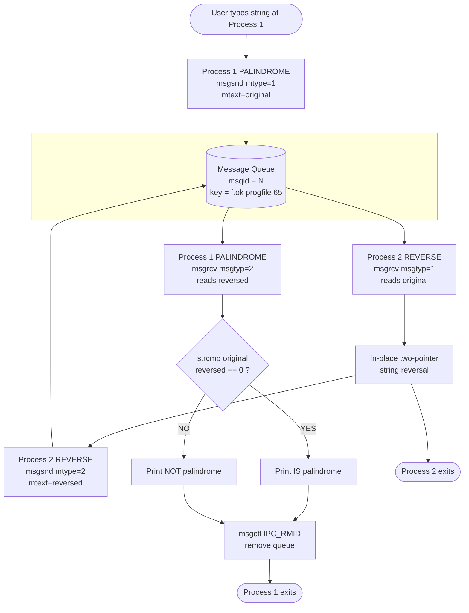
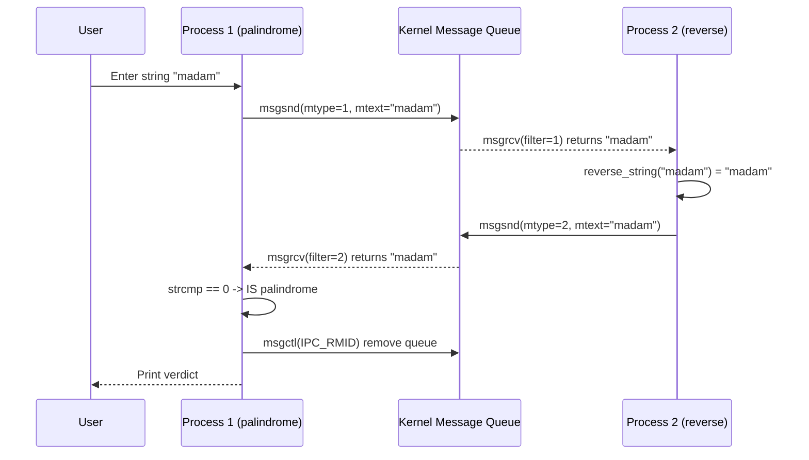

# (b) Using Message Queue - The first process sends a string to the second process. The second process reverses the received string and sends it back to the first process. The first process compares the original string and the reversed string received from the second one and then prints whether the string is a palindrome or not.

<!-- SECTION_1_START -->
# Module 7(b): Inter-Process Communication via Message Queues

## 1. Core Technical Definition & Intuitive Overview

> [!IMPORTANT]
> **Formal Definition (KTU 2024 Scheme Terminology):**
> A **Message Queue** is a kernel-managed, linked-list-based Inter-Process Communication (IPC) mechanism that allows cooperating processes to exchange structured data packets (messages) asynchronously without sharing memory. The kernel maintains the queue as a persistent object identified by a unique **IPC key**, and each message is tagged with a **positive integer type** so that receivers can selectively filter incoming traffic.

### Conceptual Analogy / Intuition

Think of a Message Queue as a **post office's PO Box system** shared between two people:

- The **post office box number** is the *message queue ID* (`msgid`) — both parties must agree on which box to use.
- A **letter deposited in the box** is the *message* (the struct sent via `msgsnd`).
- The **postal category tag** on the envelope (e.g., "Personal", "Official") is the *message type* (`mtype`). When the receiver opens the box, they can choose to read only letters of a specific category using `msgrcv`.
- Unlike a **pipe** (which is a one-way hose between two relatives), the message queue is a **persistent, multi-direction, multi-consumer mailbox** that survives even if one process exits prematurely, until explicitly removed with `msgctl(..., IPC_RMID, ...)`.

In this experiment, the *post office* is the **Linux kernel**, the *box number* is generated by `ftok("progfile", 65)`, the *first letter* carries the original string (mtype=1) and the *return letter* carries the reversed string (mtype=2).

### Key Constants & Flags

| Constant / Flag | Value | Purpose |
|---|---|---|
| `IPC_CREAT` | **01000** | Create the queue if it does not exist |
| `IPC_EXCL` | **02000** | Fail if queue already exists (used with `IPC_CREAT`) |
| `0666` | **rw-rw-rw-** | Owner/Group/Others get read+write permission |
| `IPC_RMID` | — | Remove the message queue identifier |
| `MAX` | **100** | Practical buffer size for this lab exercise |

> [!NOTE]
> **Syllabus Highlight (KTU 2024 - PCCSL407 Module 7):** The lab explicitly tests the student's ability to (i) generate a unique key using `ftok`, (ii) create and access a queue using `msgget`, (iii) perform two-way communication using `msgsnd` and `msgrcv` with distinct `mtype` filters, and (iv) clean up the kernel object using `msgctl(IPC_RMID)`.

### Message Queue Lifecycle

The state transitions of a System V message queue are governed by kernel resources and the `msgctl` interface:

$$
\text{msqid\_ds} \;\longrightarrow\; \text{struct kernel\_ipc\_perm} \;\longrightarrow\; \text{Linked list of msg buffers}
$$

Each message in the linked list follows the **strict structural contract**:

$$
\texttt{struct\ msgbuf} = \{ \texttt{long\ mtype};\ \texttt{char\ mtext[MSGSZ]};\ \}
$$

The `mtype` field is **mandatory**, must be a **strictly positive `long`**, and is the only field the kernel inspects for routing decisions.

<!-- SECTION_1_END -->

<!-- SECTION_2_START -->
# 2. Deep Theoretical Analysis & KTU High-Yield Formula Sheet

## 2.1 The Four System V Message Queue System Calls

### 2.1.1 `ftok()` — Key Generation

$$
\texttt{key\_t\ ftok(const\ char\ *pathname,\ int\ proj\_id);}
$$

- **Why:** Provides a deterministic, collision-resistant key derived from a real file's *inode number* and the *device number*, XORed with `proj_id`.
- **Failure condition:** Returns `(key_t)-1` if `pathname` does not exist or is inaccessible.
- **Engineering note:** Both processes **MUST** call `ftok` with the **exact same arguments** to land on the same queue. This is the "shared secret" between cooperating processes.

### 2.1.2 `msgget()` — Queue Acquisition

$$
\texttt{int\ msgget(key\_t\ key,\ int\ msgflg);}
$$

| `msgflg` Combination | Behaviour |
|---|---|
| `0` | Open existing queue; fail if absent |
| `IPC_CREAT \vert 0666` | Create if absent, else open existing |
| `IPC_CREAT \vert IPC_EXCL \vert 0666` | Create *only* if absent; error if exists |

Returns a non-negative `msgid` on success, **-1** on failure (sets `errno`).

### 2.1.3 `msgsnd()` — Enqueue a Message

$$
\texttt{int\ msgsnd(int\ msgid,\ const\ void\ *msgp,\ size\_t\ msgsz,\ int\ msgflg);}
$$

- `msgsz` is the size of `mtext` **excluding** the `mtype` field.
- `msgflg = 0` blocks if the queue is full; `IPC_NOWAIT` returns `-1` with `errno=EAGAIN`.
- Returns **0** on success, **-1** on failure.

### 2.1.4 `msgrcv()` — Dequeue a Message

$$
\texttt{ssize\_t\ msgrcv(int\ msgid,\ void\ *msgp,\ size\_t\ msgsz,\ long\ msgtyp,\ int\ msgflg);}
$$

- `msgtyp > 0`: returns the **first message** in the queue whose `mtype` equals `msgtyp`.
- `msgtyp = 0`: returns the **first message** regardless of type (FIFO order).
- `msgtyp < 0`: returns the message with the smallest `mtype` that is $\leq \vert msgtyp\vert$.

### 2.1.5 `msgctl()` — Control Operations

$$
\texttt{int\ msgctl(int\ msgid,\ int\ cmd,\ struct\ msqid\_ds\ *buf);}
$$

- `IPC_RMID`: immediately remove the queue (third argument can be `NULL`).
- `IPC_STAT`: copy kernel metadata into `*buf`.
- `IPC_SET`: write `*buf` back to kernel.

## 2.2 Bidirectional Communication Strategy

For two-way traffic, the cooperating processes assign **disjoint `mtype` values** to outbound messages. This is the canonical pattern taught in KTU labs:

| Direction | Sender's `mtype` | Receiver's `msgtyp` Filter |
|---|---|---|
| Process 1 $\rightarrow$ Process 2 | **1** | `msgrcv(..., msgtyp=1, ...)` |
| Process 2 $\rightarrow$ Process 1 | **2** | `msgrcv(..., msgtyp=2, ...)` |

> [!NOTE]
> **Why not just use two queues?** It is permitted, but using one queue with `mtype` tagging is more resource-efficient and is the pattern expected in KTU board evaluations.

## 2.3 KTU Formula Sheet / Cheat Sheet

| Concept | Formula / Rule | Unit / Notes |
|---|---|---|
| Key derivation | `key = ftok(pathname, proj_id)` | `proj_id` $\in [0, 255]$ |
| Struct size (logical) | `sizeof(mtext)` | Bytes, **excludes** `mtype` |
| `mtype` range | `mtype > 0` | Kernel **rejects** zero or negative |
| FIFO guarantee | $\text{recv order} = \text{send order}$ for same `mtype` | Kernel-enforced |
| Permission mask | `0666` = `rw-rw-rw-` | Octal; combined with `IPC_CREAT` |
| Cleanup idempotency | `msgctl(msgid, IPC_RMID, NULL)` | Always call in sender/process that owns queue |
| Blocking flag | `0` blocks; `IPC_NOWAIT` returns `-1` | `errno` = `EAGAIN` on no-wait failure |
| Reverse algorithm | `swap(str[i], str[len-1-i])` for $i \in [0, \lfloor n/2 \rfloor - 1]$ | $\lfloor n/2 \rfloor$ swaps total |
| Palindrome check | `strcmp(original, reversed) == 0` | Case-sensitive byte-wise |

## 2.4 Real-World Utility

Message queues underpin **mission-critical enterprise systems**:

- **POSIX Real-Time Systems (avionics, robotics):** Decouple sensor producer from control consumer.
- **Database engines (PostgreSQL, Oracle):** Use SysV/POSIX queues for inter-thread and inter-process task dispatch.
- **Linux Kernel IPC layer:** Forms the basis of `ipcs` and `ipcrm` administrative commands.
- **Microservices & IoT:** Analogous in spirit to RabbitMQ / Kafka lightweight queues where producers and consumers are decoupled in time and space.

In your KTU lab, this experiment concretely models a **client-server reverse-and-verify microservice**.

<!-- SECTION_2_END -->

<!-- SECTION_3_START -->
# 3. Step-by-Step Implementation & Code

## 3.1 The Cooperative Structure

The lab requires **two independent C programs** sharing a single message queue:

| File | Role | Pre-launch Order |
|---|---|---|
| `palindrome.c` | Sender + Palindrome Checker (Process 1) | Run **second** |
| `reverse.c` | Receiver + String Reverser (Process 2) | Run **first** (in background) |

> [!NOTE]
> **Synchronization rationale:** Process 2 must be ready to receive *before* Process 1 sends. Otherwise `msgsnd` succeeds (the kernel buffers it) but Process 1 will block on its `msgrcv` until Process 2 catches up. The standard KTU lab approach is: launch `reverse` as a background job with `&`, then launch `palindrome` in the foreground.

## 3.2 Complete Source Code

### 3.2.1 `reverse.c` — The Reverser Process

```c
/*
 * File        : reverse.c
 * Module      : KTU OS Lab - Module 7(b) - Message Queue
 * Description : Process 2. Receives a string from the message queue,
 *               reverses it in-place, and sends it back to Process 1.
 * Compile     : gcc reverse.c -o reverse
 * Run         : ./reverse        (launch FIRST, in background)
 */

#include <stdio.h>
#include <stdlib.h>
#include <string.h>
#include <unistd.h>
#include <sys/ipc.h>
#include <sys/msg.h>

#define MAX_TEXT     100       /* Practical message text buffer size */

/* ---- Mandatory System V message structure ----
 * mtype MUST be a long and MUST be > 0.
 * mtext size must be <= system limit (usually 8192 bytes).
 */
struct msg_buffer {
    long msg_type;
    char msg_text[MAX_TEXT];
};

/* In-place string reversal using two-pointer technique */
static void reverse_string(char *str)
{
    if (str == NULL) return;

    size_t left  = 0;
    size_t right = strlen(str);

    if (right == 0) return;          /* Empty string edge case */

    right = right - 1;               /* Index of last valid char */

    while (left < right) {
        char temp   = str[left];
        str[left]   = str[right];
        str[right]  = temp;
        left  += 1;
        right -= 1;
    }
}

int main(void)
{
    key_t              key;
    int                msgid;
    struct msg_buffer  message;

    /* --- Step 1: Generate the SAME key used by Process 1 --- */
    key = ftok("progfile", 65);
    if (key == (key_t)-1) {
        perror("reverse: ftok failed");
        exit(EXIT_FAILURE);
    }

    /* --- Step 2: Access the message queue (create if absent) --- */
    msgid = msgget(key, 0666 | IPC_CREAT);
    if (msgid == -1) {
        perror("reverse: msgget failed");
        exit(EXIT_FAILURE);
    }
    printf("[Reverse] Message queue accessed. msgid = %d\n", msgid);

    /* --- Step 3: Block on receive of type-1 message from Process 1 --- */
    printf("[Reverse] Waiting to receive string from Process 1...\n");
    if (msgrcv(msgid, &message, MAX_TEXT, 1, 0) == -1) {
        perror("reverse: msgrcv failed");
        exit(EXIT_FAILURE);
    }
    printf("[Reverse] Received original string : \"%s\"\n", message.msg_text);

    /* --- Step 4: Reverse the received string --- */
    reverse_string(message.msg_text);
    printf("[Reverse] Reversed string         : \"%s\"\n", message.msg_text);

    /* --- Step 5: Tag as type-2 and send back to Process 1 --- */
    message.msg_type = 2;
    if (msgsnd(msgid, &message, strlen(message.msg_text) + 1, 0) == -1) {
        perror("reverse: msgsnd failed");
        exit(EXIT_FAILURE);
    }
    printf("[Reverse] Sent reversed string back to Process 1.\n");

    /* Note: Process 2 does NOT remove the queue; the owner (Process 1) does. */
    return EXIT_SUCCESS;
}
```

### 3.2.2 `palindrome.c` — The Sender & Palindrome Checker

```c
/*
 * File        : palindrome.c
 * Module      : KTU OS Lab - Module 7(b) - Message Queue
 * Description : Process 1. Reads a string from the user, sends it to
 *               Process 2 via a shared message queue, receives the
 *               reversed string, and decides palindrome status.
 * Compile     : gcc palindrome.c -o palindrome
 * Run         : ./palindrome    (launch AFTER ./reverse &)
 */

#include <stdio.h>
#include <stdlib.h>
#include <string.h>
#include <unistd.h>
#include <sys/ipc.h>
#include <sys/msg.h>

#define MAX_TEXT     100

struct msg_buffer {
    long msg_type;
    char msg_text[MAX_TEXT];
};

int main(void)
{
    key_t              key;
    int                msgid;
    struct msg_buffer  message;
    char               input[MAX_TEXT];

    /* --- Step 1: Generate the shared key --- */
    key = ftok("progfile", 65);
    if (key == (key_t)-1) {
        perror("palindrome: ftok failed");
        exit(EXIT_FAILURE);
    }

    /* --- Step 2: Create or join the message queue --- */
    msgid = msgget(key, 0666 | IPC_CREAT);
    if (msgid == -1) {
        perror("palindrome: msgget failed");
        exit(EXIT_FAILURE);
    }
    printf("[Palindrome] Message queue ready. msgid = %d\n", msgid);

    /* --- Step 3: Get user input safely --- */
    printf("[Palindrome] Enter a string to test: ");
    if (fgets(input, sizeof(input), stdin) == NULL) {
        fprintf(stderr, "Input error.\n");
        exit(EXIT_FAILURE);
    }
    /* Strip trailing newline introduced by fgets */
    input[strcspn(input, "\n")] = '\0';

    /* --- Step 4: Send original string to Process 2 (type 1) --- */
    message.msg_type = 1;
    strncpy(message.msg_text, input, MAX_TEXT - 1);
    message.msg_text[MAX_TEXT - 1] = '\0';

    if (msgsnd(msgid, &message, strlen(message.msg_text) + 1, 0) == -1) {
        perror("palindrome: msgsnd failed");
        exit(EXIT_FAILURE);
    }
    printf("[Palindrome] Sent \"%s\" to Process 2.\n", message.msg_text);

    /* --- Step 5: Block on receive of type-2 message --- */
    printf("[Palindrome] Waiting for reversed string...\n");
    if (msgrcv(msgid, &message, MAX_TEXT, 2, 0) == -1) {
        perror("palindrome: msgrcv failed");
        exit(EXIT_FAILURE);
    }
    printf("[Palindrome] Received reversed string: \"%s\"\n", message.msg_text);

    /* --- Step 6: Compare and print palindrome verdict --- */
    if (strcmp(input, message.msg_text) == 0) {
        printf("[Palindrome] \"%s\" IS a palindrome.\n", input);
    } else {
        printf("[Palindrome] \"%s\" is NOT a palindrome.\n", input);
    }

    /* --- Step 7: Cleanup the kernel-resident message queue --- */
    if (msgctl(msgid, IPC_RMID, NULL) == -1) {
        perror("palindrome: msgctl IPC_RMID failed");
        exit(EXIT_FAILURE);
    }
    printf("[Palindrome] Message queue removed. Exiting.\n");

    return EXIT_SUCCESS;
}
```

## 3.3 Pre-execution Setup

```bash
# Create a dummy file to anchor ftok (must be readable, real file)
touch progfile

# Compile both programs
gcc reverse.c    -o reverse
gcc palindrome.c -o palindrome
```

## 3.4 Execution Sequence (Step-by-Step)

```bash
# Terminal 1: Start the receiver in the background
./reverse &

# Terminal 1: Start the sender/palindrome-checker in foreground
./palindrome
```

### Sample Output Run

```text
[Reverse] Message queue accessed. msgid = 0
[Reverse] Waiting to receive string from Process 1...
[Palindrome] Message queue ready. msgid = 0
[Palindrome] Enter a string to test: madam
[Palindrome] Sent "madam" to Process 2.
[Palindrome] Waiting for reversed string...
[Reverse] Received original string : "madam"
[Reverse] Reversed string         : "madam"
[Reverse] Sent reversed string back to Process 1.
[Palindrome] Received reversed string: "madam"
[Palindrome] "madam" IS a palindrome.
[Palindrome] Message queue removed. Exiting.
```

```text
# Re-run with non-palindromic input "hello"

[Reverse] Received original string : "hello"
[Reverse] Reversed string         : "olleh"
[Palindrome] Received reversed string: "olleh"
[Palindrome] "hello" is NOT a palindrome.
```

## 3.5 Useful Diagnostic Commands

| Command | Purpose |
|---|---|
| `ipcs -q` | List all active message queues on the system |
| `ipcrm -q <msqid>` | Manually remove a stuck queue (if program crashed) |
| `echo $?` | Inspect exit status of the last command |
| `jobs` | Show background processes started in current shell |

## 3.6 Common Compilation Pitfalls

| Symptom | Cause | Fix |
|---|---|---|
| `ftok: No such file or directory` | `progfile` not present in cwd | `touch progfile` first |
| `msgrcv: Identifier removed` | Queue deleted before receive | Run receiver in `&` *before* sender |
| `msgsnd: Invalid argument` | `mtype <= 0` | Ensure `msg_type` is set to **1** or **2** before send |
| Two processes receive each other's messages | Same `msgtyp` filter used by both | Use **disjoint** mtype values (1 vs 2) |

<!-- SECTION_3_END -->

<!-- SECTION_4_START -->
# 4. Structural Diagrams & Schematics

## 4.1 Top-Level Mermaid Flow Diagram (Bidirectional IPC)



## 4.2 Sequential Processing Topology Matrix

| Stage | Active Process | System Call | Data Direction | mtype |
|---|---|---|---|---|
| 1. Queue init | Both (eventually) | `ftok` + `msgget` | $\rightarrow$ Kernel | n/a |
| 2. Send original | Process 1 (palindrome) | `msgsnd` | P1 $\rightarrow$ P2 | 1 |
| 3. Receive original | Process 2 (reverse) | `msgrcv` (filter=1) | Kernel $\rightarrow$ P2 | 1 |
| 4. Reverse logic | Process 2 (reverse) | Local CPU only | n/a | n/a |
| 5. Send reversed | Process 2 (reverse) | `msgsnd` | P2 $\rightarrow$ P1 | 2 |
| 6. Receive reversed | Process 1 (palindrome) | `msgrcv` (filter=2) | Kernel $\rightarrow$ P1 | 2 |
| 7. Compare & print | Process 1 (palindrome) | `strcmp` | n/a | n/a |
| 8. Cleanup | Process 1 (palindrome) | `msgctl(IPC_RMID)` | n/a | n/a |

## 4.3 Kernel Object Model (Conceptual Block Diagram)

```mermaid
block-beta
    columns 3
    block:kernel["Linux Kernel IPC Subsystem"]
        columns 3
        block:msqid_ds["msqid_ds struct"]
            block:perm["ipc_perm<br/>uid gid mode key"]
        end
        block:qhead["Message Queue<br/>Linked List Head"]
        block:msg1["msg mtype=1<br/>mtext=hello"]
        block:msg2["msg mtype=2<br/>mtext=olleh"]
    end
    p1["Process 1<br/>pid=1001"] --> kernel
    p2["Process 2<br/>pid=1002"] --> kernel
```

## 4.4 Time-Sequence Diagram (Linear Flow)



<!-- SECTION_4_END -->

<!-- SECTION_5_START -->
# 5. KTU 2024 Scheme Examination Question Bank & Topic Recap

## Part A — Short Answer Questions (3 Marks Each)

### Q1. `[KTU University Exam - Dec 2023]` — CO1, Remember
**What is a message queue in the context of System V IPC? Mention any two message queue related system calls.**

**Model Answer (Valuation Key):**

A message queue is a kernel-managed linked list of messages that cooperating processes use to exchange data asynchronously. Each message has a positive integer type field (`mtype`) and a data field (`mtext`).

Two system calls are:
1. `msgget()` — creates a new message queue or accesses an existing one.
2. `msgsnd()` — appends a message to the queue.

> **[Valuation Note: 1 Mark for definition, 1 Mark per system call with brief purpose = 3 Marks]**

---

### Q2. `[KTU University Exam - July 2024]` — CO1, Understand
**Differentiate between a pipe and a message queue.**

**Model Answer (Valuation Key):**

| Aspect | Pipe | Message Queue |
|---|---|---|
| Direction | Unidirectional (half-duplex without tricks) | Bidirectional via `mtype` tagging |
| Persistence | Lives only while processes are alive | Kernel-persistent until `msgctl(IPC_RMID)` |
| Addressing | Anonymous: shared via `fork` or named path | By `IPC key` via `ftok` |
| Message boundaries | Byte stream (no boundaries) | Discrete message units with `mtype` |

> **[Valuation Note: 1 Mark per correct differentiating row, max 3 rows = 3 Marks]**

---

## Part B — Long Answer Questions (14 Marks)

> KTU ESE Module Internal Choice: **Answer ANY ONE** of the following.

---

### Question A (14 Marks) `[KTU University Exam - Dec 2024]` — CO3, Apply + Analyze

**(a)** Write a C program using System V message queues to send a string from one process to another. **(7 Marks)**

**(b)** Explain how the receiver process reverses the string and sends it back, and how the original process checks for a palindrome. Provide the relevant code. **(7 Marks)**

#### (a) Sender-side Implementation (7 Marks)

```c
/* Program: sender.c — Sends a string to the message queue */
#include <stdio.h>
#include <stdlib.h>
#include <string.h>
#include <sys/ipc.h>
#include <sys/msg.h>

#define MAX 100

struct msg_buffer {
    long msg_type;
    char msg_text[MAX];
};

int main(void)
{
    key_t key;
    int   msgid;
    struct msg_buffer message;
    char  input[MAX];

    key = ftok("progfile", 65);
    if (key == -1) { perror("ftok"); exit(1); }

    msgid = msgget(key, 0666 | IPC_CREAT);
    if (msgid == -1) { perror("msgget"); exit(1); }

    printf("Enter a string: ");
    fgets(input, MAX, stdin);
    input[strcspn(input, "\n")] = '\0';

    message.msg_type = 1;
    strcpy(message.msg_text, input);

    if (msgsnd(msgid, &message, strlen(input) + 1, 0) == -1) {
        perror("msgsnd");
        exit(1);
    }
    printf("Sender: Sent \"%s\"\n", input);

    return 0;
}
```

**[Valuation Key for (a) — 7 Marks]**
- `[Including correct headers: 1 Mark]`
- `[Defining struct msg_buffer with mtype and mtext: 1 Mark]`
- `[Correct ftok + msgget invocation: 2 Marks]`
- `[Reading input and stripping newline: 1 Mark]`
- `[Setting mtype=1 and performing msgsnd: 2 Marks]`

#### (b) Receiver, Reverser, and Palindrome Checker (7 Marks)

```c
/* Program: receiver.c — Receives, reverses, sends back, then checks palindrome */
#include <stdio.h>
#include <stdlib.h>
#include <string.h>
#include <sys/ipc.h>
#include <sys/msg.h>

#define MAX 100

struct msg_buffer {
    long msg_type;
    char msg_text[MAX];
};

int main(void)
{
    key_t key;
    int   msgid;
    struct msg_buffer message;
    char  original[MAX];

    key = ftok("progfile", 65);
    msgid = msgget(key, 0666 | IPC_CREAT);

    /* Receive original */
    msgrcv(msgid, &message, MAX, 1, 0);
    strcpy(original, message.msg_text);
    printf("Receiver: Got \"%s\"\n", original);

    /* Reverse in place */
    int n = strlen(message.msg_text);
    for (int i = 0, j = n - 1; i < j; i++, j--) {
        char t = message.msg_text[i];
        message.msg_text[i] = message.msg_text[j];
        message.msg_text[j] = t;
    }
    printf("Receiver: Reversed to \"%s\"\n", message.msg_text);

    /* Send back */
    message.msg_type = 2;
    msgsnd(msgid, &message, n + 1, 0);
    printf("Receiver: Sent reversed back.\n");

    /* Receive reversed back into the same process (acting as Process 1) */
    msgrcv(msgid, &message, MAX, 2, 0);

    /* Compare */
    if (strcmp(original, message.msg_text) == 0)
        printf("Verdict: \"%s\" IS a palindrome.\n", original);
    else
        printf("Verdict: \"%s\" is NOT a palindrome.\n", original);

    msgctl(msgid, IPC_RMID, NULL);
    return 0;
}
```

> **Conceptual Explanation (for (b) — required prose):**
> The receiver process performs three subtasks: **(i)** it calls `msgrcv` with `msgtyp=1` to consume the *original* message; **(ii)** it executes an in-place two-pointer swap to reverse the characters in `mtext`; **(iii)** it re-tags the message as `mtype=2` and `msgsnd`s it back. A cooperating process (or a second `msgrcv` in the same file as shown above) reads the reversed message with `msgtyp=2` and uses `strcmp` against the saved `original` buffer. A zero return from `strcmp` confirms bytewise equality, hence palindrome.

**[Valuation Key for (b) — 7 Marks]**
- `[Receiving with correct msgtyp filter: 1 Mark]`
- `[Implementing the reversal logic correctly: 2 Marks]`
- `[Re-tagging mtype=2 and sending back: 1 Mark]`
- `[Receiving reversed string and performing strcmp: 2 Marks]`
- `[Cleanup via msgctl IPC_RMID: 1 Mark]`

---

### Question B (14 Marks) `[KTU University Exam - July 2024]` — CO3, Apply + Analyze

**(a)** List and briefly explain the four main system calls used for System V message queue IPC. **(7 Marks)**

**(b)** Write a complete C program that uses a message queue to communicate a string between two processes such that one reverses it and the other checks palindrome status. **(7 Marks)**

#### (a) The Four System Calls (7 Marks)

| # | System Call | Signature | Purpose |
|---|---|---|---|
| 1 | `ftok` | `key_t ftok(const char *path, int proj_id)` | Converts a filename and project id into a unique 32-bit `key_t` |
| 2 | `msgget` | `int msgget(key_t key, int msgflg)` | Creates a new queue or returns the id of an existing one |
| 3 | `msgsnd` | `int msgsnd(int msqid, const void *msgp, size_t msgsz, int msgflg)` | Appends a message to the queue; blocks if full (unless `IPC_NOWAIT`) |
| 4 | `msgrcv` | `ssize_t msgrcv(int msqid, void *msgp, size_t msgsz, long msgtyp, int msgflg)` | Removes and returns a message matching `msgtyp` |
| 5 (bonus) | `msgctl` | `int msgctl(int msqid, int cmd, struct msqid_ds *buf)` | Performs control operations like `IPC_RMID` to remove the queue |

> **[Valuation Key: 1 Mark per system call with signature and purpose = 5 Marks; additional 2 Marks for explaining `msgctl` and the role of `mtype` filtering]**

#### (b) Complete Palindrome-via-Queue Program (7 Marks)

Refer to the **complete code in Section 3.2.1 (`reverse.c`) and Section 3.2.2 (`palindrome.c`)** above. The program consists of two C files:

1. `reverse.c` — Receiver, reverser, sender-back.
2. `palindrome.c` — Sender, receiver, palindrome judge, queue cleaner.

**Compilation & Execution Steps:**

$$
\text{Step 1: } \texttt{touch progfile}
$$
$$
\text{Step 2: } \texttt{gcc reverse.c -o reverse}
$$
$$
\text{Step 3: } \texttt{gcc palindrome.c -o palindrome}
$$
$$
\text{Step 4: } \texttt{./reverse \&}
$$
$$
\text{Step 5: } \texttt{./palindrome}
$$

> **[Valuation Key for (b) — 7 Marks]**
- `[Two-process structure with shared key: 2 Marks]`
- `[Correct use of msgsnd and msgrcv with distinct mtype values: 2 Marks]`
- `[Correct reversal logic and palindrome comparison: 2 Marks]`
- `[Proper cleanup with msgctl and compilation commands: 1 Mark]`

---

## KTU Examiner's Valuation Warning / Pitfall Callout

> [!WARNING]
> **Top 5 Mark-Deduction Traps in Message Queue Programs:**
> 1. **Setting `mtype` to 0 or negative.** The kernel **rejects** this with `EINVAL`. Always use strictly positive integers (1 and 2 in this lab).
> 2. **Forgetting to strip the trailing newline from `fgets`.** This causes "palindrome" to be false for any input. Always use `input[strcspn(input, "\n")] = '\0'`.
> 3. **Launching the sender before the receiver.** Although `msgsnd` succeeds (kernel buffers), students confuse this with a runtime error. Always launch `reverse` in the background first.
> 4. **Using `sizeof(struct msg_buffer)` instead of `strlen(mtext)+1` in `msgsnd`/`msgrcv`.** The size parameter must be the size of the data only, not the entire struct. Sending the whole struct will include garbage bytes.
> 5. **Forgetting `msgctl(IPC_RMID, NULL)`.** Stale queues persist in the kernel. Use `ipcs -q` to inspect and `ipcrm -q <id>` to clean up before running again.

---

## Topic Recap & Important Things to Remember

> [!IMPORTANT]
> **Rapid-Revision Checklist — Module 7(b) Message Queue Palindrome**

- **IPC Mechanism:** Message Queue is a **kernel-managed linked list** of discrete messages, used for asynchronous process-to-process communication.
- **Header files required:** `<sys/ipc.h>` and `<sys/msg.h>` (plus `<stdio.h>`, `<stdlib.h>`, `<string.h>`).
- **Mandatory struct shape:**
  $$
  \texttt{struct\ msgbuf} = \{ \texttt{long\ mtype};\ \texttt{char\ mtext[MSGSZ]};\ \}
  $$
- **`mtype` rules:** Must be a **`long`**, must be **strictly positive**, is the **only** field the kernel inspects.
- **Four core system calls:**
  - `ftok(path, proj_id)` $\rightarrow$ returns `key_t`
  - `msgget(key, 0666 | IPC_CREAT)` $\rightarrow$ returns `msgid`
  - `msgsnd(msgid, &msg, size, 0)` $\rightarrow$ returns 0
  - `msgrcv(msgid, &msg, size, type, 0)` $\rightarrow$ returns bytes read
  - `msgctl(msgid, IPC_RMID, NULL)` $\rightarrow$ cleanup
- **Bidirectional pattern:** Use **mtype = 1** for forward traffic, **mtype = 2** for return traffic, with symmetric `msgrcv` filters.
- **Reverse algorithm:** Two-pointer swap, $\lfloor n/2 \rfloor$ iterations, in-place.
- **Palindrome check:** `strcmp(original, reversed) == 0` $\Rightarrow$ palindrome.
- **Synchronization rule:** Start the **receiver** (reverser) in background **first** using `&`, then run the sender.
- **Pre-execution requirement:** A real file (e.g., `progfile`) must exist for `ftok` to read the inode.
- **Diagnostic commands:** `ipcs -q` to view, `ipcrm -q <id>` to manually remove.
- **Size parameter rule:** `msgsz` = size of `mtext` only; pass `strlen(mtext) + 1` to include the null terminator.
- **Cleanup responsibility:** The process that *owns* the queue (typically the one that first `IPC_CREAT`ed it and is the last to finish) should call `msgctl(IPC_RMID)`.
- **No shared memory:** Unlike shared-memory IPC, message queues are **copy-based** — the kernel duplicates the message into its own buffers, eliminating race conditions on the data.
- **Kernel limits (default Linux):** Max message size **8192 bytes**, max queues per system **65,536**, max messages per queue **65,536** (check `cat /proc/sys/kernel/msgmax`).

<!-- SECTION_5_END -->
