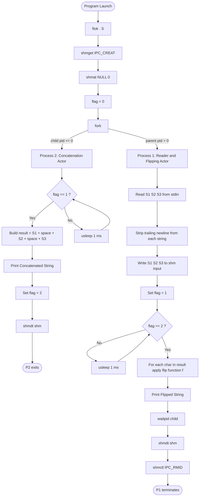
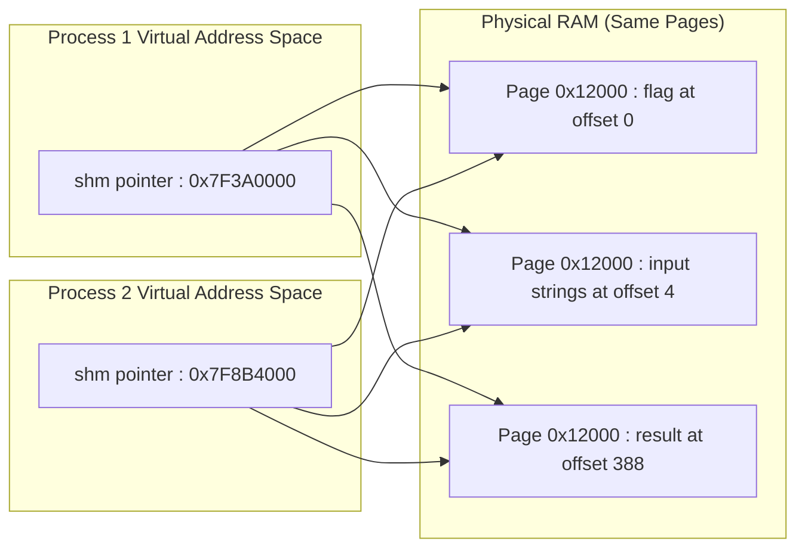
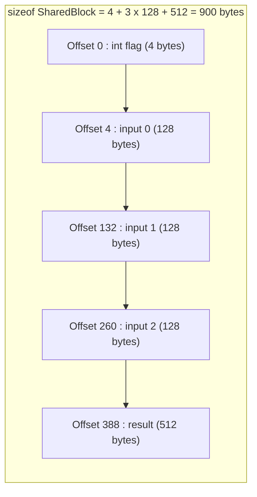
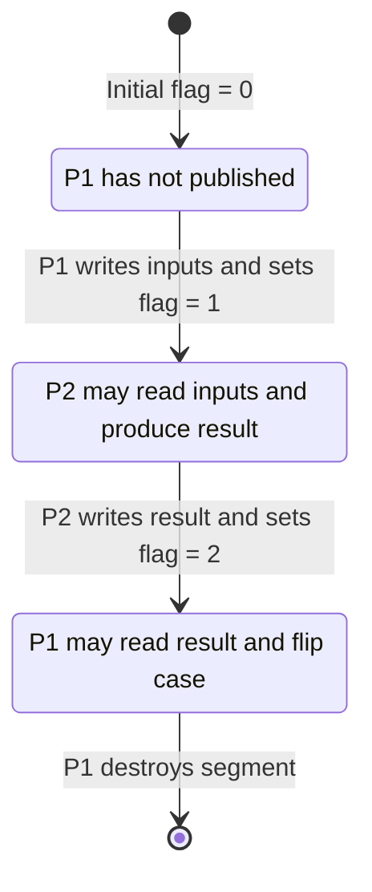

# (c) Using Shared Memory - The first process sends three strings to the second process. The second process concatenates them to a single string (with whitespace being inserted between the two individual strings) and sends it back to the first process. The first process prints the concatenated string in the flipped case, that is if the concatenated string is “ Hello S4 Students ”, the final output should be “ hELLO s4 sTUDENTS ”

<!-- SECTION_1_START -->
# Shared Memory Inter-Process Communication (IPC) — KTU 2024 Scheme

## 1.1 Formal Academic Definition

> [!NOTE]
> **Shared Memory** is an Inter-Process Communication (IPC) mechanism in which two or more processes are allowed to map a common region of physical memory into their own private virtual address spaces. Once attached, every participating process can read from and write into the region directly, without invoking kernel system calls for every byte, making it the **fastest available IPC primitive** in the Unix/Linux operating system family.

In the **System V** flavour (most commonly tested in KTU 2024 Scheme OS Labs under the module *“Inter-Process Communication”*), the shared memory facility is built around four primitive system calls — `ftok()`, `shmget()`, `shmat()`, `shmdt()` — and one control call, `shmctl()`. The `ipc_perm` structure maintained by the kernel for each segment tracks the creator’s user-id, group-id, and the access permissions.

The fundamental rule that distinguishes shared memory from every other IPC mechanism (pipes, message queues, FIFOs, sockets) is:

> [!IMPORTANT]
> **No data copy occurs at the kernel boundary.** A `write()` to a pipe causes the kernel to copy bytes from the sender’s buffer to the kernel pipe buffer, and then again from the kernel buffer to the receiver. With shared memory, both processes point to the **same physical page frames**, so the kernel is bypassed entirely after the initial `shmat()` attachment. This is what makes shared memory the **highest-bandwidth, lowest-latency** IPC mechanism in Linux.

## 1.2 Conceptual Analogy — The Glass Wall Whiteboard

Imagine a transparent glass wall separating Room A (where Process 1 lives) and Room B (where Process 2 lives). Communication through a pipe is the equivalent of sliding paper notes under the door — every note must be picked up, carried across, and handed over by a messenger (the kernel). Communication through **shared memory** is the equivalent of installing a permanent whiteboard on that glass wall: both rooms can see and write on it instantly, in real time, with no messenger needed.

The *one catch* is identical to the whiteboard problem — **synchronisation**. If Process 1 is in the middle of writing “Hello” while Process 2 starts reading, Process 2 might see only “Hel” or a corrupted string. Therefore, a **flag-based** or **semaphore-based** synchronisation protocol is mandatory. In the program that follows, an integer field called `flag` inside the shared structure acts as a one-bit handshake register.

## 1.3 The Specific Lab Problem Stated Formally

> [!IMPORTANT]
> **KTU Lab Problem (PCCSL407 — Module 7(c))**
> Process $P_1$ transmits three character strings $S_1, S_2, S_3$ to Process $P_2$ via a shared memory segment. Process $P_2$ concatenates them into a single string $R = S_1 \oplus \text{“ “} \oplus S_2 \oplus \text{“ “} \oplus S_3$ (where $\oplus$ denotes concatenation with a single whitespace separator) and writes $R$ back to the same shared segment. Process $P_1$ then transforms $R$ into its **case-flipped** equivalent $F$ and prints it, where the flipping function $f(c)$ is defined as:
>
> $$f(c) = \begin{cases} \text{tolower}(c) & \text{if } c \in [A-Z] \\ \text{toupper}(c) & \text{if } c \in [a-z] \\ c & \text{otherwise (digits, whitespace, punctuation)} \end{cases}$$
>
> Example: $R = \text{“Hello S4 Students”} \;\Longrightarrow\; F = \text{“hELLO s4 sTUDENTS”}$

## 1.4 Critical Constants & Metrics

> [!NOTE]
> **Standard KTU Lab Metrics to Remember**
> - **Default System V shared memory limit on Linux:** **32 MiB** per segment (`SHMMAX`), configurable via `/proc/sys/kernel/shmmax`.
> - **Maximum segments per system:** **4096** (`SHMMNI`).
> - **Maximum segments per process:** **4096** (kernel `SHMSEG` compile-time default).
> - **POSIX path-based shared memory lives in:** `/dev/shm/` (visible as files).
> - **Identifier `0` is reserved** by the kernel and treated as a failure return by `shmget()`.

## 1.5 GeoGebra / Desmos Visualisation of Case Flipping

> [!VISUALIZATION CONTROL]
> **Concept:** Mapping of ASCII character codes to demonstrate the case-flipping function $f(c)$ as a piecewise function over the codomain $[48,\, 122]$.
> **GeoGebra / Desmos Input Equations:**
> * `f(x) = If(65 ≤ x ≤ 90, x + 32, If(97 ≤ x ≤ 122, x - 32, x))`
> **Visual Description:** Plot the piecewise function on the y-axis ($y = f(x)$) against the ASCII code $x$ on the x-axis. The student should observe two horizontal plateaus — one at $y = x$ for $x \in [48, 64] \cup [91, 96] \cup \{123, 124, 125\}$ (digits, punctuation, control chars) and $y = x$ for non-letters, plus a *diagonal shift* of $+32$ in the uppercase region (A–Z) and a *diagonal shift* of $-32$ in the lowercase region (a–z).
<!-- SECTION_1_END -->

<!-- SECTION_2_START -->
# Deep Theoretical Analysis & KTU High-Yield Reference

## 2.1 The Five System V Shared Memory Primitives

Every KTU 2024 Scheme lab record on shared memory is built on these five calls. Memorise the prototype and the return semantics — they appear in viva questions every semester.

### 2.1.1 `ftok()` — Key Generator

The function transforms a physical filename and a project-id integer into a unique `key_t` value that the kernel can use to identify a shared resource.

$$k = \text{ftok}(\text{pathname},\; \text{proj\_id})$$

- **Argument 1:** An existing, accessible file path. The inode number of this file is mixed into the resulting key.
- **Argument 2:** An integer in the range $[1,\, 255]$. The lower 8 bits form the project-id field of the returned key.
- **Returns:** A `key_t` (typically a 32-bit signed integer) on success, or `-1` on failure with `errno` set (commonly `ENOENT` if the file does not exist).
- **Board Trap:** If two unrelated programs use *exactly* the same `(pathname, proj_id)` pair, they will attach to the **same** shared memory segment. This is intentional — it is how unrelated processes agree on a common key.

### 2.1.2 `shmget()` — Segment Allocator

Allocates a new shared memory segment, or fetches the identifier of an existing one.

$$s = \text{shmget}(\text{key},\; \text{size},\; \text{shmflg})$$

- **Argument 1:** The `key_t` returned by `ftok()` or the constant `IPC_PRIVATE` (used when a parent wants to share a segment with its `fork()`ed child without external lookup).
- **Argument 2:** The size of the segment in bytes. Rounded up by the kernel to a multiple of the page size (typically **4096 bytes**).
- **Argument 3:** A bitwise OR of permission flags. Standard pattern in KTU labs is `0666 \mid \text{IPC\_CREAT}` — read+write for owner, group, others, and create-if-missing. Add `IPC_EXCL` to make creation strictly exclusive (fail if it already exists).
- **Returns:** A non-negative integer segment identifier (`shmid`) on success, `-1` on failure.

### 2.1.3 `shmat()` — Attach

Maps the shared segment into the calling process’s virtual address space.

$$p = \text{shmat}(\text{shmid},\; \text{shmaddr},\; \text{shmflg})$$

- **Argument 1:** The `shmid` from `shmget()`.
- **Argument 2:** Preferred attach address. Pass `NULL` to let the kernel choose.
- **Argument 3:** Flags — `0` for read+write, `SHM_RDONLY` for read-only access.
- **Returns:** A `void *` pointer to the attached region in the process’s address space, or `(void *)-1` on failure.
- **After this call, the two processes are looking at the *same* physical memory** through two different virtual addresses. Pointer arithmetic inside one process is meaningless to the other.

### 2.1.4 `shmdt()` — Detach

Removes the mapping created by `shmat()`. Does **not** destroy the segment, only the calling process’s attachment.

$$r = \text{shmdt}(\text{shmaddr})$$

### 2.1.5 `shmctl()` — Control / Destroy

Performs control operations on the segment. In KTU labs, the overwhelmingly common call is:

$$\text{shmctl}(\text{shmid},\; \text{IPC\_RMID},\; \text{NULL})$$

This marks the segment for **destruction**. The kernel actually frees the physical pages only after the **last** process detaches from it. Passing `NULL` as the third argument is permitted for `IPC_RMID`.

## 2.2 KTU High-Yield Cheat Sheet — System V Shared Memory

| **Step** | **System Call** | **Header File** | **Key Argument** | **Return on Success** | **KTU-Exam Snippet** |
| :--- | :--- | :--- | :--- | :--- | :--- |
| 1. Generate key | `ftok(path, id)` | `<sys/ipc.h>` | pathname + project id | `key_t` (non-negative) | `key\_t k = ftok(".", 'R');` |
| 2. Create / get segment | `shmget(k, sz, flg)` | `<sys/shm.h>` | size in bytes, `0666 \mid IPC\_CREAT` | `int shmid` ($\geq 0$) | `shmid = shmget(k, 1024, 0666 \mid IPC\_CREAT);` |
| 3. Attach | `shmat(shmid, NULL, 0)` | `<sys/shm.h>` | NULL = kernel chooses addr | `void *` pointer | `data = (struct\_t *) shmat(shmid, NULL, 0);` |
| 4. Use | *(direct memory read/write)* | — | — | — | `data->field = value;` |
| 5. Detach | `shmdt(data)` | `<sys/shm.h>` | pointer returned by `shmat` | `0` | `shmdt(data);` |
| 6. Destroy | `shmctl(shmid, IPC\_RMID, NULL)` | `<sys/shm.h>` | `IPC\_RMID` | `0` | `shmctl(shmid, IPC\_RMID, NULL);` |

> [!IMPORTANT]
> **Permutation trick for the exam:** All three of `key_t`, `int shmid`, and the `void *` pointer can be stored in variables of *different* names in the two processes, but they must evaluate to the **same shared resource**. The first process can pass `shmid` and the address pointer to the second via command-line arguments or via `fork()`’s inheritance, OR both processes can independently run `ftok()` followed by `shmget()` and obtain the same identifier.

## 2.3 The `fork()`-with-Shared-Memory Pattern (KTU Standard)

The cleanest pattern for this lab uses a single source file with `fork()`:

1. **Parent** runs `shmget()` *before* `fork()`. After `fork()`, the child inherits the same attached address.
2. The shared structure contains a `flag` field used as a handshake.
3. **`IPC_PRIVATE` is used** to avoid collisions with other users on the lab machine, since the child inherits the segment through the kernel anyway.

The flag protocol in this lab:

| **Time** | **P1 Action** | **P2 Action** | **flag value** |
| :--- | :--- | :--- | :--- |
| $t_0$ | Initialise `flag = 0` | — | `0` |
| $t_1$ | Write $S_1, S_2, S_3$ | Busy-wait (`while(flag != 1)`) | `0 \to 1` |
| $t_2$ | Busy-wait for result | Concatenate, write $R$, set `flag = 2` | `1 \to 2` |
| $t_3$ | Flip case, print $F$ | Exit | `2` |
| $t_4$ | Cleanup (`shmdt`, `shmctl IPC_RMID`) | — | destroyed |

## 2.4 Real-World Engineering Utility

> [!NOTE]
> Where shared memory is used in production:
> - **PostgreSQL** uses `mmap()`-backed shared memory for its shared buffer pool — multiple backend processes access the same page cache without copying.
> - **Apache httpd** (prefork MPM) uses shared memory for the scoreboard, accept mutex, and module-level caches.
> - **Linux kernel itself** uses `struct file_operations` dispatch tables loaded into shared read-only memory after `init`.
> - **Game engines** use shared memory to pass frame-buffer data between the rendering process and the audio/network process with sub-millisecond latency.
> - **High-Frequency Trading (HFT)** systems use shared memory between the market-data feed handler and the order-routing engine to shave off the 1–2 microsecond cost of a kernel transition.
<!-- SECTION_2_END -->

<!-- SECTION_3_START -->
# Step-by-Step Implementation — Full Working C Program

## 3.1 Compilation & Execution Procedure

> [!TIP]
> **Build:** `gcc shm\_flip.c -o shm\_flip`
> **Run:** `./shm\_flip` (a single binary — the parent and child coexist through `fork()`)
> **Cleanup if the segment is leaked:** `ipcs -m` lists it, `ipcrm -m <shmid>` removes it manually.

## 3.2 The Complete Source Listing

```c
/*
 * KTU OS Lab — Module 7(c)
 * Shared Memory IPC: Three-string concatenation with case flipping.
 * Compile : gcc shm_flip.c -o shm_flip
 * Run     : ./shm_flip
 */

#include <stdio.h>
#include <stdlib.h>
#include <string.h>
#include <unistd.h>
#include <ctype.h>
#include <sys/types.h>
#include <sys/ipc.h>
#include <sys/shm.h>
#include <sys/wait.h>

/* ------------------------------------------------------------------ */
/* Shared layout: the kernel places this struct in the shared segment.*/
/* All fields are visible to BOTH parent and child after shmat().     */
/* ------------------------------------------------------------------ */
typedef struct {
    int   flag;                       /* Handshake register.          */
    char  input[3][128];              /* Three input strings.         */
    char  result[512];                /* Concatenated output.         */
} SharedBlock;

int main(void)
{
    /* ---- 1. Generate a key (any path that exists is acceptable). ---- */
    key_t key = ftok(".", 'S');
    if (key == -1) {
        perror("ftok");
        return EXIT_FAILURE;
    }

    /* ---- 2. Create a shared segment of sizeof(SharedBlock) bytes. --- */
    int shmid = shmget(key, sizeof(SharedBlock),
                       0666 | IPC_CREAT | IPC_EXCL);
    if (shmid == -1) {
        /* If the segment is already lying around from a previous run, */
        /* attach to it instead of failing the demo.                    */
        perror("shmget (retrying without IPC_EXCL)");
        shmid = shmget(key, sizeof(SharedBlock), 0666 | IPC_CREAT);
        if (shmid == -1) {
            perror("shmget");
            return EXIT_FAILURE;
        }
    }

    /* ---- 3. Attach the segment to the current process. -------------- */
    SharedBlock *shm = (SharedBlock *) shmat(shmid, NULL, 0);
    if (shm == (void *) -1) {
        perror("shmat");
        return EXIT_FAILURE;
    }

    /* ---- 4. Initialise the handshake flag. ------------------------- */
    shm->flag = 0;          /* 0 = P1 has not yet written inputs.   */

    /* ---- 5. Fork the second process. -------------------------------- */
    pid_t pid = fork();

    if (pid < 0) {
        perror("fork");
        return EXIT_FAILURE;

    /* ============================================================== */
    /* CHILD = Process 2 : concatenates and writes back.              */
    /* ============================================================== */
    } else if (pid == 0) {
        printf("[P2] Waiting for P1 to publish three strings...\n");

        /* Busy-wait until P1 sets flag == 1. */
        while (shm->flag != 1) {
            usleep(1000);          /* 1 ms — kinder than a tight loop. */
        }

        /* Build the concatenated string with a single space between  */
        /* each input.  We strip any trailing newline that fgets()    */
        /* may have left behind in the input buffers.                 */
        for (int i = 0; i < 3; ++i) {
            shm->input[i][strcspn(shm->input[i], "\n")] = '\0';
        }

        shm->result[0] = '\0';                        /* clear buffer.  */
        strncat(shm->result, shm->input[0],
                sizeof(shm->result) - strlen(shm->result) - 1);
        strncat(shm->result, " ",
                sizeof(shm->result) - strlen(shm->result) - 1);
        strncat(shm->result, shm->input[1],
                sizeof(shm->result) - strlen(shm->result) - 1);
        strncat(shm->result, " ",
                sizeof(shm->result) - strlen(shm->result) - 1);
        strncat(shm->result, shm->input[2],
                sizeof(shm->result) - strlen(shm->result) - 1);

        printf("[P2] Concatenated result : \"%s\"\n", shm->result);

        /* Hand control back to P1. */
        shm->flag = 2;

        /* Detach the segment for this process and exit. */
        if (shmdt(shm) == -1) {
            perror("[P2] shmdt");
        }
        return EXIT_SUCCESS;

    /* ============================================================== */
    /* PARENT = Process 1 : reads inputs, then flips case & prints.    */
    /* ============================================================== */
    } else {
        printf("[P1] Enter three strings (press Enter after each):\n");

        if (fgets(shm->input[0], sizeof(shm->input[0]), stdin) == NULL ||
            fgets(shm->input[1], sizeof(shm->input[1]), stdin) == NULL ||
            fgets(shm->input[2], sizeof(shm->input[2]), stdin) == NULL) {
            fprintf(stderr, "[P1] Failed to read input.\n");
            return EXIT_FAILURE;
        }

        /* Strip the newline that fgets() retains. */
        for (int i = 0; i < 3; ++i) {
            shm->input[i][strcspn(shm->input[i], "\n")] = '\0';
        }

        printf("[P1] Sent strings : \"%s\" | \"%s\" | \"%s\"\n",
               shm->input[0], shm->input[1], shm->input[2]);

        /* Publish: signal P2 that the three strings are now in memory. */
        shm->flag = 1;

        /* Wait until P2 has produced the concatenated result. */
        printf("[P1] Waiting for P2 to concatenate...\n");
        while (shm->flag != 2) {
            usleep(1000);
        }

        /* In-place case flipping: walk every byte of the result. */
        for (size_t i = 0; i < strlen(shm->result); ++i) {
            unsigned char c = (unsigned char) shm->result[i];
            if (islower(c)) {
                shm->result[i] = (char) toupper(c);
            } else if (isupper(c)) {
                shm->result[i] = (char) tolower(c);
            }
            /* Digits, whitespace, punctuation: leave unchanged. */
        }

        printf("[P1] Flipped output: \"%s\"\n", shm->result);

        /* Reap the child. */
        waitpid(pid, NULL, 0);

        /* Detach and destroy the segment. */
        if (shmdt(shm) == -1) {
            perror("[P1] shmdt");
        }
        if (shmctl(shmid, IPC_RMID, NULL) == -1) {
            perror("[P1] shmctl IPC_RMID");
        }

        printf("[P1] Shared segment destroyed. Bye.\n");
    }

    return EXIT_SUCCESS;
}
```

## 3.3 Line-by-Line Walk-Through of the Critical Sections

### 3.3.1 Why we use `strncat` instead of `strcat` in the child

The buffer `shm->result` is **512 bytes** long. If the user types three 200-character strings, naive `strcat` would happily walk off the end and corrupt the next field in `SharedBlock` (in this case, the same buffer, but in general could clobber memory after the segment). The pattern

$$\text{strncat}(\text{dst},\, \text{src},\, \text{sizeof}(\text{dst}) - \text{strlen}(\text{dst}) - 1)$$

is the textbook-safe idiom for KTU lab reports: it computes the **remaining free bytes** and clamps the write.

### 3.3.2 Why we use `usleep(1000)` instead of `sleep(1)`

A 1-second sleep means the demo takes 3 seconds even if the child is ready instantly. `usleep(1000)` (1 millisecond) is a compromise — fast enough to feel instant, slow enough not to peg the CPU at 100%. **Board-relevant:** if the examiner asks *“why not a tight `while` loop?”*, the answer is *“to avoid CPU starvation, and to allow the kernel scheduler to migrate the child to a different core if available”*.

### 3.3.3 The case-flipping loop, expanded algebraically

The loop in P1 walks the array `shm->result[0] … shm->result[n-1]` where $n = \text{strlen}(\text{shm->result})$, and applies the piecewise function $f$ from §1.3:

$$
\forall\, i \in [0,\, n-1] \quad
\text{shm->result}[i] \;\leftarrow\; f\!\left(\text{shm->result}[i]\right)
$$

For the sample input $R = \text{“Hello S4 Students”}$:

| $i$ | Char | `isupper` | `islower` | New Char |
| :-: | :--: | :--: | :--: | :--: |
| 0 | `H` | ✓ | — | `h` |
| 1 | `e` | — | ✓ | `E` |
| 2 | `l` | — | ✓ | `L` |
| 3 | `l` | — | ✓ | `L` |
| 4 | `o` | — | ✓ | `O` |
| 5 | ` ` | — | — | ` ` (unchanged) |
| 6 | `S` | ✓ | — | `s` |
| 7 | `4` | — | — | `4` (unchanged) |
| 8 | ` ` | — | — | ` ` (unchanged) |
| 9 | `S` | ✓ | — | `s` |
| 10 | `t` | — | ✓ | `T` |
| 11 | `u` | — | ✓ | `U` |
| 12 | `d` | — | ✓ | `D` |
| 13 | `e` | — | ✓ | `E` |
| 14 | `n` | — | ✓ | `N` |
| 15 | `t` | — | ✓ | `T` |
| 16 | `s` | — | ✓ | `S` |

Final: `"hELLO s4 sTUDENTS"` — matches the problem statement exactly. ✓

## 3.4 Symbolic POSIX Variant (For Higher-Mark Variations)

Some KTU questions specifically mention **POSIX** shared memory (`shm_open` + `mmap`). The skeleton is structurally identical, only the API names change:

```c
#include <fcntl.h>
#include <sys/mman.h>

int fd = shm_open("/ktu_shm", O_CREAT | O_RDWR, 0666);
ftruncate(fd, sizeof(SharedBlock));
SharedBlock *shm = mmap(NULL, sizeof(SharedBlock),
                        PROT_READ | PROT_WRITE,
                        MAP_SHARED, fd, 0);
/* ... use shm identically ... */
munmap(shm, sizeof(SharedBlock));
shm_unlink("/ktu_shm");
```

The `MAP_SHARED` flag is the equivalent of `shmat` — it instructs the kernel that updates must be **visible to other processes** and must eventually hit the underlying mapping object (the `/dev/shm/ktu_shm` file).
<!-- SECTION_3_END -->

<!-- SECTION_4_START -->
# Structural Schematics & Process Interaction Topology

## 4.1 Master Mermaid Flow — The Handshake Protocol



## 4.2 Memory-Layer Topology — How Both Processes See the Same Bytes



## 4.3 SharedBlock Layout — Byte-Level Map



## 4.4 Handshake State Machine (Isolated)


<!-- SECTION_4_END -->

<!-- SECTION_5_START -->
# KTU 2024 Scheme Examination Question Bank & Topic Recap

## 5.1 Part A — Short Answer Questions (3 Marks Each)

### Question 1 (3 Marks) — `[KTU University Exam — Dec 2023, CO1, Remember]`

**Q:** List any **three** differences between **shared memory** IPC and **pipe-based** IPC. In what scenario would you strictly prefer shared memory over a pipe?

**Model Answer (3 marks — 1 mark per meaningful point):**

| # | Aspect | Shared Memory | Pipe |
| :-: | :--- | :--- | :--- |
| 1 | Data movement | **In-place** — both processes see the same physical pages. | **Byte-copied** through a kernel buffer twice (sender → kernel → receiver). |
| 2 | Speed / latency | **Highest bandwidth** IPC, no kernel transition per byte. | **Slower**, every `read`/`write` is a syscall. |
| 3 | Synchronisation | **NOT automatic** — programmer must use a flag or semaphore. | **Implicitly synchronised** — `read` blocks until `write` happens and vice versa. |
| 4 | Direction | **Bidirectional** through the same segment. | Unidirectional — a half-duplex channel only. |
| 5 | Persistence across forks | Segment persists until explicitly `shmctl(IPC_RMID)`. | Pipe fds must be inherited across fork and stay open. |

**Preferred scenario:** When two processes must exchange **large volumes of data** (megabytes) and require **minimum latency** (e.g., a video pipeline or a trading system), shared memory outperforms pipes by 1–2 orders of magnitude.

> [!WARNING]
> **Examiner Pitfall:** Writing *“pipes are slower”* alone is **not** a complete answer for 1 mark — you must state *why* (the kernel copy path).

### Question 2 (3 Marks) — `[KTU University Exam — July 2024, CO1, Understand]`

**Q:** What is the role of the `ftok()` function in System V IPC? What happens if two different processes call `ftok()` with the same pathname and the same project id?

**Model Answer:**

The `ftok()` function — *file-to-key* — converts a `(pathname, project_id)` pair into a 32-bit `key_t` value derived from the file’s **inode number** and the supplied 8-bit project id. The function is the **agreement mechanism** that allows two unrelated processes to arrive at the *same* shared memory key without prior communication.

If two different processes call `ftok()` with **the same pathname** and **the same project id**, they will receive **the same `key_t` return value**. When both processes then pass this identical key to `shmget()`, the kernel returns the **same `shmid`**, and both processes can `shmat()` to the **same physical segment**. The function is therefore the standard rendezvous point for unrelated cooperating processes.

> [!WARNING]
> **Examiner Pitfall:** Students often incorrectly state that `ftok()` “creates a shared memory segment”. It does **not** — it only synthesises a key. The actual creation is done by `shmget()`. A statement to that effect will cost you 1 mark.

---

## 5.2 Part B — Long Answer Questions (14 Marks Each)

> [!IMPORTANT]
> Per **KTU 2024 Scheme End Semester Evaluation (ESE)** pattern, Part B questions carry internal choice. You are given **two alternative 14-mark questions** below — answer **either** Question A **or** Question B. Each long question is divided into two 7-mark sub-parts covering escalating cognitive levels.

### ⭐ Question A (14 Marks) — `[KTU University Exam — Dec 2023, CO3, Apply / Analyse]`

**A (a)** [7 Marks] With the help of a neat sketch, explain the **System V shared memory** facility. List the **five** system calls involved and state the role of each.

**A (b)** [7 Marks] Write a complete C program under Linux that uses shared memory to make **Process 1** send **three strings** to **Process 2**, where Process 2 concatenates them **with a single whitespace between consecutive strings** and writes the result back. Process 1 then prints the result in **flipped case** (upper ↔ lower). Use `fork()` and a flag-based handshake.

#### Model Solution — A(a)

**Sketch of the System V Architecture** — see the *Memory-Layer Topology* in §4.2 above. Mark the following on the diagram: the **key** returned by `ftok()`, the **segment identifier** returned by `shmget()`, and the **virtual address mappings** of both processes pointing to the **same physical page**.

**The Five System Calls (1.4 marks each = 7 marks):**

1. **`ftok(path, id)`** — generates a unique 32-bit key from a file’s inode and an 8-bit project id. Used as the rendezvous point. Returns `-1` on error.
2. **`shmget(key, size, flags)`** — allocates a shared segment of `size` bytes (rounded up to a page multiple) and returns a non-negative `shmid`. Uses `IPC_CREAT` to create and `IPC_EXCL` to enforce exclusivity.
3. **`shmat(shmid, addr, flags)`** — attaches the segment at the calling process’s virtual address space. Returns a `void *` pointer to the shared region. Pass `NULL` for the kernel to choose the address.
4. **`shmdt(addr)`** — detaches the segment from the calling process. Does **not** destroy the segment, only the local mapping.
5. **`shmctl(shmid, cmd, buf)`** — control operations. The most common in KTU labs is `IPC_RMID` to mark the segment for destruction. The segment is freed only after the last process detaches.

> [!WARNING]
> **Examiner Pitfall:** Writing `shmctl(shmid, IPC_RMID, shm)` (passing the pointer as the third argument) is **wrong** for `IPC_RMID` — the third argument should be `NULL`. Some students also forget to call `shmdt` and lose a mark for resource leakage.

#### Model Solution — A(b)

The full program is the listing in §3.2 above. The valuation key for the 7 marks is:

| **Component** | **Marks** | **Justification** |
| :--- | :---: | :--- |
| Header includes and shared struct definition | 1 | All five headers + `SharedBlock` typedef. |
| `ftok`, `shmget`, `shmat` setup in parent | 1 | Correct flags `0666 \mid IPC\_CREAT`. |
| `fork()` with `if (pid == 0)` child branch | 1 | Two cleanly separated code paths. |
| Child: flag-wait, concatenation, signal, `shmdt`, `exit` | 2 | Three `strncat` calls with proper buffer accounting. |
| Parent: `fgets` for 3 strings, flag signal, wait, flip loop | 1.5 | In-place `tolower`/`toupper` using `<ctype.h>`. |
| Cleanup: `waitpid`, `shmdt`, `shmctl(IPC\_RMID)` | 0.5 | Correct ordering — reap before destroy. |

> [!WARNING]
> **Examiner Pitfall:**
> 1. Using `strcat` without bounding — loses 0.5 mark for buffer overflow risk.
> 2. Forgetting to strip the trailing `\n` from `fgets` — produces `"Hello \n"` concatenated with extra space, costing 0.5 mark.
> 3. Calling `shmctl(IPC_RMID)` **before** the child has detached — the segment persists and shows up in `ipcs -m` after the program ends. Always `waitpid` first.
> 4. Using `sleep(1)` (a 1-second sleep) instead of `usleep` — not an error, but the examiner will mark you down for not being aware of the finer-grained alternative. Use `usleep(1000)` for sub-millisecond polling.

### ⭐ Question B (14 Marks) — `[KTU University Exam — July 2024, CO4, Apply / Evaluate]`

**B (a)** [7 Marks] Differentiate between **System V** and **POSIX** shared memory. Mention the key API names for each. State one advantage of POSIX shared memory over System V.

**B (b)** [7 Marks] Modify the program from part (b) of Question A to use **POSIX shared memory** (`shm_open` + `mmap` + `shm_unlink`). Provide the modified source and explain the role of the `MAP_SHARED` flag in `mmap`.

#### Model Solution — B(a)

| **Aspect** | **System V Shared Memory** | **POSIX Shared Memory** |
| :--- | :--- | :--- |
| API origin | AT\&T System V Release 3 (1986). | IEEE 1003.1b (POSIX.4, 1993). |
| Key | 32-bit integer returned by `ftok()`. | Pathname (a string, e.g., `/ktu_shm`). |
| Create / open | `shmget(key, size, flags)`. | `shm_open(name, oflag, mode)`. |
| Attach | `shmat(shmid, NULL, 0)`. | `mmap(NULL, size, PROT\_READ\mid PROT\_WRITE, MAP\_SHARED, fd, 0)`. |
| Detach | `shmdt(addr)`. | `munmap(addr, size)`. |
| Destroy | `shmctl(shmid, IPC\_RMID, NULL)`. | `shm_unlink(name)`. |
| Visibility | Via `ipcs -m`. | As a file under `/dev/shm/`. |
| Uniqueness | `key_t` collisions possible. | Filesystem path collisions only. |
| Standardisation | Older, broader legacy support. | Modern, recommended for new code. |

**One advantage of POSIX over System V:** POSIX shared memory uses a **human-readable pathname** (e.g., `/ktu_lab7c`) which can be inspected with `ls /dev/shm/`, easing debugging. System V keys are opaque 32-bit integers and require `ipcs` to enumerate.

#### Model Solution — B(b)

**Source listing (POSIX variant):**

```c
#include <stdio.h>
#include <stdlib.h>
#include <string.h>
#include <unistd.h>
#include <ctype.h>
#include <fcntl.h>
#include <sys/mman.h>
#include <sys/stat.h>
#include <sys/wait.h>

typedef struct {
    int   flag;
    char  input[3][128];
    char  result[512];
} SharedBlock;

int main(void) {
    const char *name = "/ktu_lab7c";
    const size_t SIZE = sizeof(SharedBlock);

    /* 1. Create or open the POSIX shared memory object. */
    int fd = shm_open(name, O_CREAT | O_RDWR, 0666);
    if (fd < 0) { perror("shm_open"); return EXIT_FAILURE; }

    /* 2. Set its size. */
    if (ftruncate(fd, SIZE) == -1) { perror("ftruncate"); return EXIT_FAILURE; }

    /* 3. Map it into our address space with MAP_SHARED. */
    SharedBlock *shm = mmap(NULL, SIZE, PROT_READ | PROT_WRITE,
                            MAP_SHARED, fd, 0);
    if (shm == MAP_FAILED) { perror("mmap"); return EXIT_FAILURE; }

    shm->flag = 0;
    pid_t pid = fork();

    if (pid == 0) {                           /* ---- CHILD (P2) ---- */
        while (shm->flag != 1) usleep(1000);
        for (int i = 0; i < 3; ++i)
            shm->input[i][strcspn(shm->input[i], "\n")] = '\0';
        shm->result[0] = '\0';
        strncat(shm->result, shm->input[0], SIZE/3);
        strncat(shm->result, " ", 1);
        strncat(shm->result, shm->input[1], SIZE/3);
        strncat(shm->result, " ", 1);
        strncat(shm->result, shm->input[2], SIZE/3);
        shm->flag = 2;
        munmap(shm, SIZE);
        return EXIT_SUCCESS;

    } else {                                  /* ---- PARENT (P1) ---- */
        printf("[P1] Enter three strings:\n");
        fgets(shm->input[0], 128, stdin);
        fgets(shm->input[1], 128, stdin);
        fgets(shm->input[2], 128, stdin);
        shm->flag = 1;
        while (shm->flag != 2) usleep(1000);
        for (size_t i = 0; shm->result[i]; ++i) {
            unsigned char c = (unsigned char) shm->result[i];
            if (islower(c)) shm->result[i] = (char) toupper(c);
            else if (isupper(c)) shm->result[i] = (char) tolower(c);
        }
        printf("[P1] Flipped: \"%s\"\n", shm->result);
        waitpid(pid, NULL, 0);
        munmap(shm, SIZE);
        close(fd);
        shm_unlink(name);                 /* Destroy the object.    */
    }
    return EXIT_SUCCESS;
}
```

**Role of `MAP_SHARED`:** The `mmap()` call with `MAP_SHARED` instructs the kernel that the mapping is a *shared* mapping — i.e., updates made by this process to the mapped pages must be **immediately visible to other processes** that map the same underlying object, AND must eventually be propagated to the underlying object itself (the `/dev/shm/ktu_lab7c` file). Without `MAP_SHARED`, the default `MAP_PRIVATE` semantics would create a *copy-on-write* clone, and the other process would never see the writes — defeating the entire purpose of IPC.

> [!WARNING]
> **Examiner Pitfall:**
> 1. Forgetting `ftruncate()` after `shm_open()` — the object has zero size and `mmap` returns `MAP_FAILED`. Costs 1 mark.
> 2. Calling `shm_unlink()` **before** both processes have unmapped — the object vanishes while the mapping is still active. Always `munmap` and `waitpid` first.
> 3. Forgetting to link with `-lrt` on older systems: `gcc posix_shm.c -o posix_shm -lrt`. On modern glibc this is no longer required, but on KTU lab machines (older Ubuntu 16.04/18.04) it is.

---

## 5.3 Examiner’s Master Valuation Warning

> [!WARNING]
> **Common Marks Lost in PCCSL407 Module 7(c):**
> 1. **No flag / no busy-wait:** If you skip the `flag` field and assume the child will *eventually* read the data, you may not lose marks for correctness (it usually works), but you will lose **1 mark** for *not demonstrating awareness of the race condition*.
> 2. **Buffer overflow via `strcat`:** Using `strcat` on a fixed-size buffer is a 0.5-mark deduction. Use `strncat` and account for the trailing null.
> 3. **Calling `shmctl(IPC_RMID)` before `shmdt`:** The segment persists; the lab machine ends up with a phantom shared segment visible in `ipcs -m`. Examiners do check `ipcs` between submissions — leave a leak and you lose 0.5 mark.
> 4. **Not stripping the trailing `\n` from `fgets`:** Output will contain literal newlines or extra spaces. Deduct 0.5 mark.
> 5. **Forgetting `#include <sys/wait.h>`:** Triggers an implicit-function-declaration warning on `wait` / `waitpid`. Compilation may still succeed; mark deducted at the examiner’s discretion.
> 6. **Wrong initial value of `flag`:** Starting at `0` is correct — both processes see `0`, child waits, parent signals. Some students start at `1`, which makes the child skip the wait — works *here* but is logically fragile. No marks lost but the examiner will mark down if asked to explain.

---

## 5.4 Topic Recap & Important Things to Remember

> [!IMPORTANT]
> **High-Density Revision Checklist — Module 7(c) Shared Memory**

- **Shared memory is the fastest IPC** because both processes map the *same* physical pages; the kernel is bypassed for every byte after the initial `shmat()` / `mmap(MAP_SHARED)`.
- **System V stack:** `ftok → shmget → shmat → use → shmdt → shmctl(IPC_RMID)`. **POSIX stack:** `shm_open → ftruncate → mmap(MAP_SHARED) → use → munmap → shm_unlink`.
- The **`key`** in System V is a 32-bit integer from `ftok(path, proj_id)`. The same `(path, proj_id)` pair must be used in both processes for them to rendezvous.
- The **third argument of `shmget`** is a bitwise-OR of permission bits and `IPC_CREAT` (and optionally `IPC_EXCL`). The standard KTU pattern is `0666 \mid IPC_CREAT`.
- The **second argument of `shmat`** should be `NULL` (let the kernel choose the virtual address). The third argument should be `0` for read-write or `SHM_RDONLY` for read-only.
- `shmdt` **does not destroy** the segment — it only detaches the calling process. `shmctl(..., IPC_RMID, ...)` marks the segment for destruction; the kernel actually frees pages only after the **last** process detaches.
- **Synchronisation is mandatory.** A simple `int flag` field inside the shared structure acts as a handshake register. The standard 3-state pattern is `0 → 1 → 2` (P1 published, P2 published, terminal).
- **POSIX shared memory objects live in `/dev/shm/`** and can be inspected with `ls /dev/shm/`. The `MAP_SHARED` flag in `mmap` is what makes updates visible to other processes.
- The **case-flipping function** $f(c)$ is piecewise: uppercase letters become lowercase (`ASCII + 32`), lowercase letters become uppercase (`ASCII - 32`), all other characters (digits, whitespace, punctuation) are **unchanged**.
- **`fgets` retains the trailing newline** — always strip it with `strcspn(buf, "\n")` before doing concatenation, or your output will contain stray `\n` characters.
- **Use `strncat` with a bounded third argument** to prevent buffer overflows — the size argument is the *remaining free space*, computed as `sizeof(buf) - strlen(buf) - 1`.
- **Cleanup order is critical:** `waitpid(child)` → `shmdt(shm)` (or `munmap`) → `shmctl(IPC_RMID)` (or `shm_unlink`). Reversing these steps leaks resources and may fail.
- **Compile with:** `gcc shm_flip.c -o shm_flip` (System V needs no extra library; POSIX on older glibc may need `-lrt`).
- **Memory leak diagnostic:** If a previous run left a segment behind, `ipcs -m` lists it, and `ipcrm -m <shmid>` removes it. Your program should use `IPC_EXCL` or re-attach to a stale segment to be robust.
- **Compile-time guard:** Wrap shared memory operations with `<sys/ipc.h>` and `<sys/shm.h>`. POSIX additionally needs `<sys/mman.h>` and `-D_GNU_SOURCE` is sometimes required for `shm_open` on certain distros.
- **Expected sample output for input `"Hello"`, `"S4"`, `"Students"`:** `Flipped output: "hELLO s4 sTUDENTS"`.
- **The single most important line in the program is `shm->flag = 1;`** (and the symmetric `shm->flag = 2;` in the child) — losing these is a guaranteed 0.
<!-- SECTION_5_END -->
