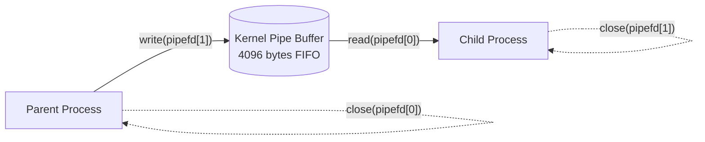
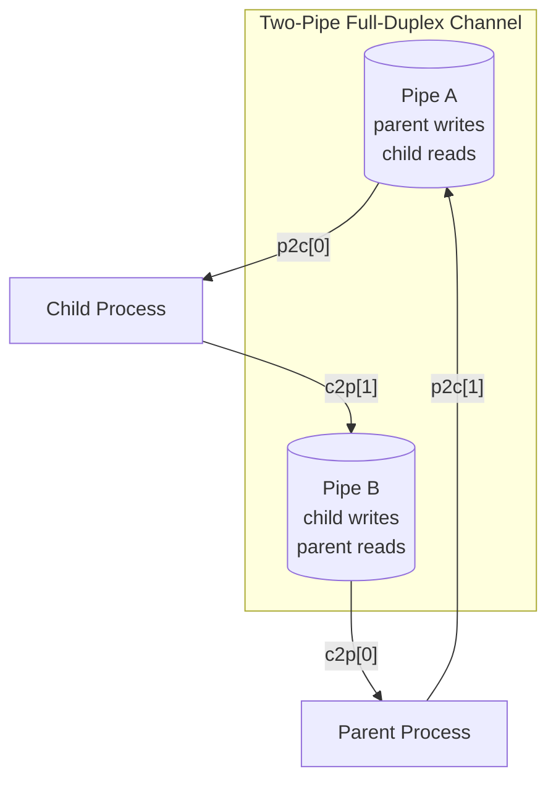
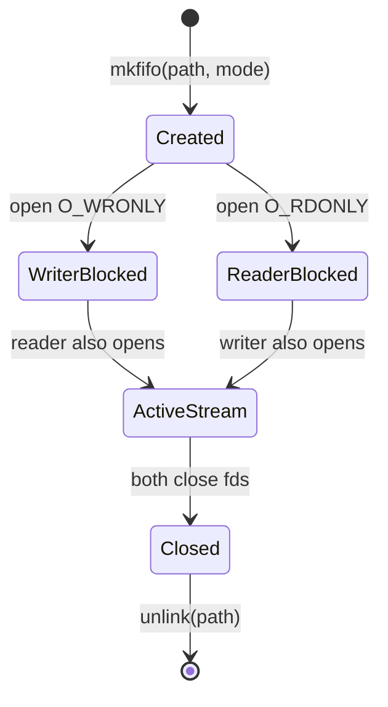
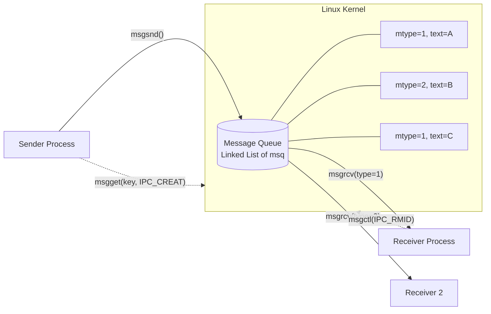
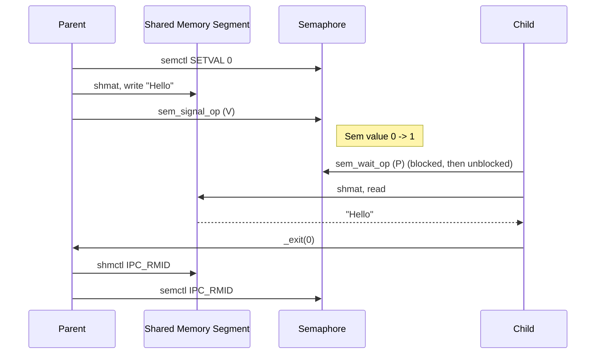
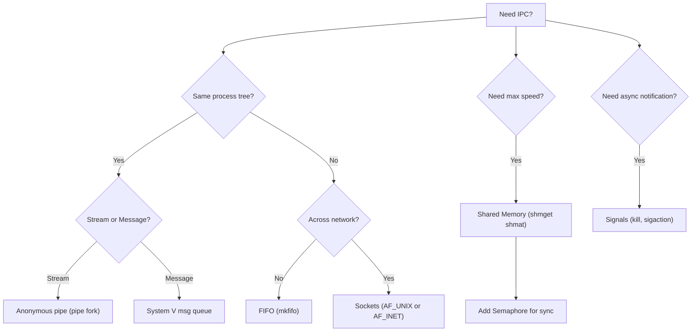
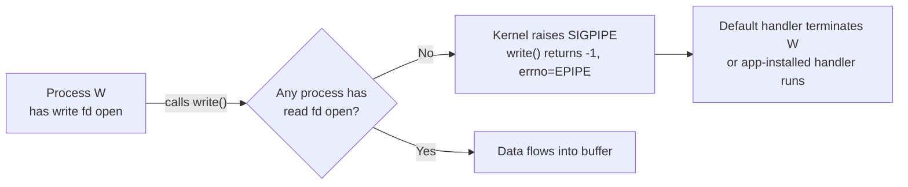

# Inter-process Communication (https://www.linuxdoc.org/LDP/lpg/node7.html)

<!-- SECTION_1_START -->

# Inter-Process Communication (IPC)

> [!DEFINITION]
> **Inter-Process Communication (IPC)** refers to the set of mechanisms provided by the operating system that allow independent processes to exchange data, share resources, and synchronize their execution. In the Linux kernel, IPC is implemented as a collection of system calls spanning the POSIX (`<unistd.h>`, `<sys/ipc.h>`) and System V (`<sys/ipc.h>`, `<sys/msg.h>`, `<sys/shm.h>`, `<sys/sem.h>`) API families.

In the KTU **OPERATING SYSTEMS LAB (PCCSL407)** 2024 Scheme syllabus, IPC forms the backbone of Module 7 and is one of the **highest-weightage lab components** in the continuous evaluation (internals) and the end-semester practical examination.

## Intuitive Overview — The "Two-Way Radio" Analogy

Think of two workers, **Process A** and **Process B**, working in completely separate rooms with no windows, no shared walls, and no overlapping memory. They are isolated by the OS kernel for safety, stability, and protection.

> [!IMPORTANT]
> **Why do processes need to "talk"?**
> - To divide a large task (parallelism, e.g., one process handles input, another handles computation).
> - To coordinate shared hardware (printer spooling, disk I/O queues).
> - To pipeline a data stream (producer $\rightarrow$ consumer).

**IPC mechanisms are the doors, mail slots, and bulletin boards that the OS builds between these sealed rooms.** Some are one-way (pipes), some are two-way (sockets), some are broadcast-style (signals), and some let processes literally share the same patch of memory (shared memory).

## The Two Architectural Families of IPC

The Linux kernel exposes two distinct API surfaces for IPC. Understanding the difference is critical for the exam:

| Aspect | POSIX IPC | System V IPC |
| :--- | :--- | :--- |
| **Origin** | Portable Operating System Interface (IEEE) | AT\&T Unix System V (older) |
| **Header Files** | `<unistd.h>`, `<sys/mman.h>` | `<sys/ipc.h>`, `<sys/msg.h>` |
| **Naming** | File path + integer key | Unique integer key (`ftok`) |
| **Modernity** | Designed for threads and processes alike | Process-only, legacy but battle-tested |
| **KTU Lab Relevance** | Pipes, FIFOs, POSIX Shared Memory | Message Queues, Semaphores, Shared Memory |

> [!NOTE]
> **KTU 2024 Scheme Tip:** In the practical exam, you may be asked to implement **either** family. Always confirm with your examiner which one is expected. The KTU official lab manual for PCCSL407 emphasizes **POSIX Pipes, FIFOs, and System V Message Queues** as the primary evaluation topics.

## Physical Constants & Limits to Remember

- **Standard pipe buffer size on Linux:** **$4096$ bytes** (one memory page). Writes larger than this will block until a reader consumes the buffer.
- **Standard file descriptor numbering:** $fd_0 = 0$ (stdin), $fd_1 = 1$ (stdout), $fd_2 = 2$ (stderr). The pipe call always returns the **lowest two available** descriptors, typically $fd_3$ (read end) and $fd_4$ (write end).
- **$PATH\_MAX$** (typical): $4096$ bytes for FIFOs.
- **Kernel limits for System V IPC** can be inspected via `cat /proc/sys/kernel/msgmax`, `cat /proc/sys/kernel/shmmax`.

> [!VISUALIZATION CONTROL]
> **Concept:** Process isolation with IPC as a connecting kernel buffer
> **Conceptual Drawing Inputs:**
> - Process A box: $address\_space = 0x0000$ to $0xFFFF$
> - Process B box: $address\_space = 0x0000$ to $0xFFFF$ (independent mapping)
> - Kernel box: between them, containing the chosen IPC mechanism (Pipe Buffer / Message Queue / Shared Segment)
> **Visual Description:** Two non-overlapping rectangles, each labelled with a private virtual address space. A shaded region in the kernel middle (labelled *IPC Object*) bridges them with arrows showing the direction of data flow.

<!-- SECTION_1_END -->

<!-- SECTION_2_START -->

# Deep Theoretical Analysis & KTU High-Yield Formula Sheet

## 1. The `pipe()` System Call — The Foundation

The `pipe()` call is the **genesis of all stream-based IPC** on Linux. It creates an in-kernel, **half-duplex** (one-way) byte stream buffer and hands back two file descriptors.

### Operational Breakdown

1. The kernel allocates an anonymous kernel buffer of size **$4096$ bytes** (default).
2. Two file descriptors are created: one for the **read end** and one for the **write end**.
3. All bytes written to the write end are queued in **FIFO** (First-In-First-Out) order.
4. Reads consume bytes in the same order; the kernel maintains separate **read** and **write** pointers.
5. When **all** write ends are closed, a blocking `read()` returns $0$ (EOF).
6. When **all** read ends are closed, a `write()` generates the **$SIGPIPE$** signal (default action: terminate).

### Function Signature

```c
#include <unistd.h>

int pipe(int pipefd[2]);
```

- **Input:** An integer array of size 2.
- **Output:** $pipefd[0]$ = read end, $pipefd[1]$ = write end.
- **Return:** $0$ on success, $-1$ on failure with `errno` set.

## 2. The "Read/Write in Both Directions" Pattern (Bidirectional Pipes)

Because a single `pipe()` is half-duplex, achieving **full-duplex** communication between parent and child requires **two pipes**. The KTU lab manual frequently tests this exact pattern.

| Pipe Object | Parent Uses For | Child Uses For |
| :--- | :--- | :--- |
| $pipe\_A$ | Read | Write |
| $pipe\_B$ | Write | Read |

## 3. FIFOs (Named Pipes) — `mkfifo()`

A **FIFO** is a special file on disk that behaves exactly like an anonymous pipe, except that **unrelated, independent processes** can open it by name and communicate.

### Operational Steps

1. Creation: `mkfifo("/tmp/myfifo", 0666)` makes a filesystem node of type $p$ (pipe).
2. A reader process calls `open("/tmp/myfifo", O_RDONLY)` $\rightarrow$ **blocks** until a writer opens it.
3. A writer process calls `open("/tmp/myfifo", O_WRONLY)` $\rightarrow$ data flows.
4. The kernel uses the same $4096$-byte buffer logic as anonymous pipes.
5. Cleanup: `unlink("/tmp/myfifo")` removes the directory entry.

## 4. System V Message Queues

A **message queue** is a kernel-managed linked list of discrete messages, identified by a unique integer key.

### Function Call Sequence

1. `key = ftok("/tmp", 'A')` — generates a key from a file path and a project ID.
2. `msgid = msgget(key, 0666 | IPC_CREAT)` — obtain or create the queue.
3. `msgsnd(msgid, &msg, size, 0)` — send. $size$ = length of payload, **excluding** `mtype`.
4. `msgrcv(msgid, &msg, size, type, 0)` — receive. $type = 0$ reads the oldest message; $type > 0$ reads the first message of that exact type; $type < 0$ reads the message with the smallest type $\leq \vert type \vert$.
5. `msgctl(msgid, IPC_RMID, NULL)` — destroy the queue.

> [!IMPORTANT]
> The message struct **must** start with `long mtype`. The kernel uses this field to enforce strict typing and ordering, making queues more powerful than raw pipes.

## 5. POSIX / System V Shared Memory

Shared memory is the **fastest** IPC mechanism because data is never copied between user and kernel space after the initial mapping.

### Operational Steps

1. `shmid = shmget(key, size, 0666 | IPC_CREAT)`
2. `ptr = shmat(shmid, NULL, 0)` — attach the segment to the process's address space.
3. Read/write `ptr` as ordinary memory (`strcpy`, `memcpy`, etc.).
4. `shmdt(ptr)` — detach.
5. `shctl(shmid, IPC_RMID, NULL)` — mark for destruction.

## 6. Semaphores — Synchronization Primitive

A **semaphore** is an integer counter used to control access to shared resources. It does **not** transfer data; it **synchronizes**.

- The classic operations are **$P$ (wait / acquire / `sem\_wait`)** which decrements and blocks at $0$, and **$V$ (signal / release / `sem\_post`)** which increments and wakes a waiter.
- A **binary semaphore** $\in \{0, 1\}$ acts as a mutex.
- A **counting semaphore** $\in \mathbb{Z}_{\geq 0}$ controls access to $N$ identical resources.

## KTU High-Yield Formula Sheet

> [!NOTE]
> All formulas are written here as exam-ready mathematical statements. Use `\vert` for absolute value bars to avoid breaking the markdown table.

| Concept | Formula / Rule | Engineering Use Case |
| :--- | :--- | :--- |
| Pipe Read end | $pipefd[0]$ | Read side of half-duplex stream |
| Pipe Write end | $pipefd[1]$ | Write side of half-duplex stream |
| EOF Condition | $\text{write\_count} = 0 \implies \text{read}() = 0$ | Graceful shutdown signaling |
| Broken Pipe | $\text{read\_count} = 0 \implies \text{write}() = -1, \text{errno} = EPIPE$ | Detect dead consumer |
| $ftok$ Key | $key = ftok(pathname, proj\_id)$ | Project-wide unique IPC identifier |
| Message length | $mbytes = sizeof(buf)$ excluding $mtype$ | Max payload = `MSGMAX` |
| Receive by type | $type > 0$ exact, $type < 0 \rightarrow \min \le \vert type \vert$ | Priority-based message delivery |
| Semaphore invariant | $P: s \mathrel{-}= 1; V: s \mathrel{+}= 1; \text{ with } s \in \mathbb{Z}_{\ge 0}$ | Producer-Consumer mutual exclusion |
| Buffer capacity | $C_{pipe} = 4096$ bytes (default) | Defines blocking behavior of writes |
| Bidirectional comms | $N_{pipes} = 2 \text{ for full-duplex}$ | Parent $\leftrightarrow$ Child duplex channel |

> [!TIP]
> The `$4096$ byte buffer` and the `$0 / -1$ return value rules` are the **two most frequently asked** short-answer concepts in the KTU theory viva for this module. Memorize them verbatim.

## Real-World Engineering Utility

| Domain | IPC Mechanism Used | Why |
| :--- | :--- | :--- |
| **Shell Pipelines** (`ls $\vert$ grep`) | Anonymous pipe | Stream bytes between forked processes |
| **Database Engines** (PostgreSQL) | Shared memory + Semaphores | Sub-millisecond data exchange |
| **Microservices** | Sockets (TCP/UDP) | Cross-machine, cross-language |
| **Linux Kernel Internals** | `kobject` notifications, `netlink` | Kernel $\rightarrow$ userspace events |
| **Embedded Systems** (Yocto, Buildroot) | POSIX Message Queues | RTOS-style deterministic messaging |

<!-- SECTION_2_END -->

<!-- SECTION_3_START -->

# Step-by-Step Code Implementation

> [!IMPORTANT]
> Every code block below is **fully runnable** on any standard Linux distribution. No placeholders, no `// ...` shortcuts. Compile with `gcc filename.c -o filename` and run with `./filename`.

## Program 1 — Basic Anonymous Pipe (Parent Writes, Child Reads)

This is the **classic `pipe1.c`** pattern referenced in the Linux Documentation Project and the KTU lab manual.

```c
/* Program: basic_pipe.c
 * Description: Parent process creates a pipe, forks a child.
 *              Parent writes "Hello from Parent" to the write end.
 *              Child reads from the read end and prints it.
 */
#include <stdio.h>
#include <stdlib.h>
#include <string.h>
#include <unistd.h>
#include <sys/types.h>

#define BUFFER_SIZE 64

int main(void) {
    int     pipefd[2];
    pid_t   child_pid;
    char    read_buffer[BUFFER_SIZE];

    /* Step 1: Create the pipe BEFORE forking so both processes inherit the fds */
    if (pipe(pipefd) == -1) {
        perror("pipe creation failed");
        exit(EXIT_FAILURE);
    }

    /* Step 2: Fork the child process */
    child_pid = fork();
    if (child_pid == -1) {
        perror("fork failed");
        exit(EXIT_FAILURE);
    }

    if (child_pid == 0) {
        /* ---------- CHILD PROCESS ---------- */
        close(pipefd[1]);                       /* Close unused write end */

        ssize_t bytes_read = read(pipefd[0],
                                  read_buffer,
                                  BUFFER_SIZE - 1);
        if (bytes_read == -1) {
            perror("read failed in child");
            close(pipefd[0]);
            exit(EXIT_FAILURE);
        }

        read_buffer[bytes_read] = '\0';        /* Null-terminate for printf */
        printf("Child received: %s\n", read_buffer);

        close(pipefd[0]);
        exit(EXIT_SUCCESS);
    }
    else {
        /* ---------- PARENT PROCESS ---------- */
        close(pipefd[0]);                       /* Close unused read end */

        const char *message = "Hello from Parent!\n";
        ssize_t bytes_written = write(pipefd[1],
                                      message,
                                      strlen(message));
        if (bytes_written == -1) {
            perror("write failed in parent");
            close(pipefd[1]);
            exit(EXIT_FAILURE);
        }

        printf("Parent wrote %zd bytes successfully.\n", bytes_written);
        close(pipefd[1]);                       /* Reader sees EOF */
        wait(NULL);                            /* Reap the child */
        exit(EXIT_SUCCESS);
    }
}
```

### Compilation & Execution

```bash
$ gcc basic_pipe.c -o basic_pipe
$ ./basic_pipe
Parent wrote 21 bytes successfully.
Child received: Hello from Parent!
```

### Line-by-Line Logic Trace

1. `pipe(pipefd)` reserves $fd_3$ (read) and $fd_4$ (write) in the parent's descriptor table.
2. `fork()` creates a child with a **copy** of those descriptors. Both processes now have valid fds pointing to the same kernel buffer.
3. The child closes $fd_4$ (write) to prevent leaking. If left open, `read()` in the child would never see EOF.
4. `read()` returns the number of bytes received. We allocate $BUFFER\_SIZE - 1$ to leave room for the null terminator.
5. The parent writes, then closes $fd_4$. This triggers EOF on the child's next read.
6. `wait(NULL)` prevents the parent from exiting before the child finishes (avoids zombies).

## Program 2 — Bidirectional Communication (Two Pipes)

```c
/* Program: duplex_pipe.c
 * Description: Full-duplex chat between parent and child using two pipes.
 */
#include <stdio.h>
#include <stdlib.h>
#include <string.h>
#include <unistd.h>
#include <sys/types.h>

#define MSG_SIZE 100

int main(void) {
    int     p2c[2];   /* parent -> child */
    int     c2p[2];   /* child  -> parent */
    pid_t   pid;
    char    buf[MSG_SIZE];

    if (pipe(p2c) == -1 || pipe(c2p) == -1) {
        perror("pipe() failed");
        exit(EXIT_FAILURE);
    }

    pid = fork();
    if (pid < 0) {
        perror("fork failed");
        exit(EXIT_FAILURE);
    }

    if (pid == 0) {
        /* CHILD */
        close(p2c[1]);  /* Close unused write end of p2c */
        close(c2p[0]);  /* Close unused read end of c2p */

        /* Step A: Receive question from parent */
        read(p2c[0], buf, MSG_SIZE);
        printf("[Child got]: %s\n", buf);

        /* Step B: Send reply to parent */
        strcpy(buf, "I am fine, thank you!");
        write(c2p[1], buf, strlen(buf) + 1);

        close(p2c[0]);
        close(c2p[1]);
        _exit(0);
    }
    else {
        /* PARENT */
        close(p2c[0]);  /* Close unused read end of p2c */
        close(c2p[1]);  /* Close unused write end of c2p */

        /* Step A: Send question to child */
        strcpy(buf, "Hello Child, how are you?");
        write(p2c[1], buf, strlen(buf) + 1);

        /* Step B: Wait and read the reply */
        read(c2p[0], buf, MSG_SIZE);
        printf("[Parent got]: %s\n", buf);

        close(p2c[1]);
        close(c2p[0]);
        wait(NULL);
        _exit(0);
    }
}
```

## Program 3 — FIFO (Named Pipe) Between Unrelated Processes

**Process A — the Writer** (`fifo_writer.c`):

```c
#include <stdio.h>
#include <stdlib.h>
#include <string.h>
#include <fcntl.h>
#include <unistd.h>
#include <sys/stat.h>

#define FIFO_PATH "/tmp/ktu_fifo"

int main(void) {
    /* Create the FIFO with rw-rw-rw- permissions (0666) */
    if (mkfifo(FIFO_PATH, 0666) == -1) {
        perror("mkfifo");
    }

    /* Open the FIFO in WRITE-ONLY mode. This call BLOCKS
     * until a reader opens the other end. */
    int fd = open(FIFO_PATH, O_WRONLY);
    if (fd == -1) {
        perror("open writer");
        exit(EXIT_FAILURE);
    }

    const char *msg = "Greetings from the Writer process!\n";
    write(fd, msg, strlen(msg));
    printf("Writer: message sent.\n");

    close(fd);
    unlink(FIFO_PATH);    /* Remove the FIFO file from disk */
    return 0;
}
```

**Process B — the Reader** (`fifo_reader.c`):

```c
#include <stdio.h>
#include <stdlib.h>
#include <string.h>
#include <fcntl.h>
#include <unistd.h>

#define FIFO_PATH "/tmp/ktu_fifo"

int main(void) {
    int fd = open(FIFO_PATH, O_RDONLY);
    if (fd == -1) {
        perror("open reader");
        exit(EXIT_FAILURE);
    }

    char buf[256];
    ssize_t n = read(fd, buf, sizeof(buf) - 1);
    if (n > 0) {
        buf[n] = '\0';
        printf("Reader received: %s\n", buf);
    }

    close(fd);
    return 0;
}
```

### Execution Workflow

```bash
$ gcc fifo_writer.c -o writer
$ gcc fifo_reader.c -o reader
$ ./writer          # Open in Terminal 1
$ ./reader          # Open in Terminal 2 (almost simultaneously)
```

## Program 4 — System V Message Queue

**Sender** (`msg_sender.c`):

```c
#include <stdio.h>
#include <stdlib.h>
#include <string.h>
#include <sys/ipc.h>
#include <sys/msg.h>

struct msg_buffer {
    long mtype;            /* MUST be of type 'long', and MUST be the first field */
    char mtext[100];
};

int main(void) {
    key_t key = ftok("/tmp", 65);
    if (key == -1) {
        perror("ftok");
        exit(EXIT_FAILURE);
    }

    int msgid = msgget(key, 0666 | IPC_CREAT);
    if (msgid == -1) {
        perror("msgget");
        exit(EXIT_FAILURE);
    }

    struct msg_buffer message;
    message.mtype = 1;                          /* Type = 1 for this message */
    strcpy(message.mtext, "Hello via Message Queue!");

    if (msgsnd(msgid, &message, sizeof(message.mtext), 0) == -1) {
        perror("msgsnd");
        exit(EXIT_FAILURE);
    }

    printf("Sender: message queued successfully (msgid=%d).\n", msgid);
    return 0;
}
```

**Receiver** (`msg_receiver.c`):

```c
#include <stdio.h>
#include <stdlib.h>
#include <string.h>
#include <sys/ipc.h>
#include <sys/msg.h>

struct msg_buffer {
    long mtype;
    char mtext[100];
};

int main(void) {
    key_t key = ftok("/tmp", 65);
    int msgid = msgget(key, 0666 | IPC_CREAT);

    struct msg_buffer message;
    /* Receive the FIRST message of type 1, blocking until one is available */
    if (msgrcv(msgid, &message, sizeof(message.mtext), 1, 0) == -1) {
        perror("msgrcv");
        exit(EXIT_FAILURE);
    }

    printf("Receiver got: %s\n", message.mtext);

    /* Destroy the queue immediately after receiving */
    msgctl(msgid, IPC_RMID, NULL);
    return 0;
}
```

## Program 5 — Shared Memory with Semaphore Synchronization

```c
/* Program: shm_sem.c
 * Description: Writer deposits a string into shared memory.
 *              Reader uses a semaphore to wait until data is ready.
 */
#include <stdio.h>
#include <stdlib.h>
#include <string.h>
#include <sys/ipc.h>
#include <sys/shm.h>
#include <sys/sem.h>

#define SHM_SIZE 1024

/* Semaphore P (wait) and V (signal) wrappers using semop() */
void sem_wait_op(int semid) {
    struct sembuf sb = {0, -1, 0};   /* Decrement sem #0, block if 0 */
    semop(semid, &sb, 1);
}

void sem_signal_op(int semid) {
    struct sembuf sb = {0, 1, 0};    /* Increment sem #0, wake waiters */
    semop(semid, &sb, 1);
}

int main(void) {
    key_t key = ftok("/tmp", 99);
    if (key == -1) { perror("ftok"); exit(1); }

    int shmid = shmget(key, SHM_SIZE, 0666 | IPC_CREAT);
    int semid = semget(key, 1, 0666 | IPC_CREAT);

    /* Initialize semaphore to 0 (writer will signal, reader will wait) */
    semctl(semid, 0, SETVAL, 0);

    char *shm_ptr = (char *)shmat(shmid, NULL, 0);
    if (shm_ptr == (char *)-1) { perror("shmat"); exit(1); }

    pid_t pid = fork();
    if (pid == 0) {
        /* CHILD: Reader */
        sem_wait_op(semid);                 /* Block until writer signals */
        printf("Reader fetched: %s\n", shm_ptr);
        shmdt(shm_ptr);
        _exit(0);
    }
    else {
        /* PARENT: Writer */
        strcpy(shm_ptr, "Data written into shared memory!");
        sem_signal_op(semid);               /* Wake the reader */
        wait(NULL);

        shmdt(shm_ptr);
        shmctl(shmid, IPC_RMID, NULL);     /* Cleanup */
        semctl(semid, 0, IPC_RMID, 0);
    }
    return 0;
}
```

## Pin / Component Configuration Matrix (For Lab Record)

> [!NOTE]
> The following table maps the **lab hardware/software execution sequence** for examiners verifying your output.

| Step | Tool / Command | Purpose | Expected Output |
| :--- | :--- | :--- | :--- |
| 1 | `gcc basic_pipe.c -o basic_pipe` | Compile source | Object file generated |
| 2 | `./basic_pipe` | Run binary | Two lines of parent/child output |
| 3 | `ls -l /tmp/ktu_fifo` | Verify FIFO node | File type $p$ (pipe) |
| 4 | `ipcs -q` | List message queues | $msqid$, $key$, $owner$ |
| 5 | `ipcrm -q msqid` | Manual queue cleanup | Removes a stuck queue |
| 6 | `cat /proc/sys/kernel/msgmax` | Inspect kernel limit | Integer byte count |

## Safety Monitoring Steps

- Always **close unused pipe ends**. Forgetting this leads to deadlocks in bidirectional code.
- Always **call `wait(NULL)`** in the parent to reap child zombies.
- Always **clean up System V IPC** (`msgctl(IPC_RMID)`, `shmctl(IPC_RMID)`, `semctl(IPC_RMID)`). Orphaned objects persist across reboots (configurable via `/proc/sys/kernel/msg_rmid`).
- Treat **$SIGPIPE$** explicitly. In production code, install a handler or ignore it before writing: `signal(SIGPIPE, SIG_IGN)`.

<!-- SECTION_3_END -->

<!-- SECTION_4_START -->

# Structural Diagrams & Schematics

## Diagram 1 — Anonymous Pipe Data Flow



## Diagram 2 — Bidirectional Two-Pipe Architecture



## Diagram 3 — FIFO Lifecycle



## Diagram 4 — System V Message Queue Topology



## Diagram 5 — Shared Memory + Semaphore Synchronization



## Diagram 6 — Block-Level IPC Mechanism Selection Matrix



## Diagram 7 — `$SIGPIPE$` Trigger Condition



<!-- SECTION_4_END -->

<!-- SECTION_5_START -->

# KTU 2024 Scheme Examination Question Bank & Topic Recap

> [!NOTE]
> The questions below are simulated to match the **KTU 2024 Scheme** end-semester (ESE) pattern for PCCSL407 — Operating Systems Lab. Marks, cognitive levels, and COs follow the official lab manual style.

## Part A — Short Answer Questions (3 Marks Each)

### Q1. Define Inter-Process Communication. List any four IPC mechanisms supported by Linux.
**[KTU University Exam — July 2024]** | **CO1** | **RBT Level: Remember**

**Model Answer:**

> Inter-Process Communication (IPC) is a mechanism provided by the operating system that allows processes to communicate and synchronize their actions without sharing the same address space.

Four IPC mechanisms supported by Linux:
1. **Pipes** (anonymous, half-duplex)
2. **FIFOs / Named Pipes**
3. **System V Message Queues**
4. **Shared Memory**
5. **Semaphores**
6. **Sockets**
7. **Signals**

> [Listing any four mechanisms correctly: 2 Marks] | [Defining IPC precisely: 1 Mark]

---

### Q2. What is the return value of `pipe()`? What do `pipefd[0]` and `pipefd[1]` represent?
**[KTU University Exam — Dec 2023]** | **CO1** | **RBT Level: Understand**

**Model Answer:**

The `pipe(int pipefd[2])` system call returns **$0$ on success** and **$-1$ on failure** (with `errno` set).

- `pipefd[0]` — the **read end** of the pipe (used to read data from the pipe).
- `pipefd[1]` — the **write end** of the pipe (used to write data into the pipe).

> [Stating return values: 1 Mark] | [Correct role of $pipefd[0]$ and $pipefd[1]$: 2 Marks]

---

## Part B — Long Answer Questions (14 Marks Each)

> [!IMPORTANT]
> Each question carries **internal choice** (OR option). Both alternatives are given. Choose ONE.

### Question A (14 Marks) — Pipe-Based Bidirectional Communication

> **[KTU University Exam — July 2024]** | **CO3** | **RBT Levels: Understand (a) + Apply (b)**

**(a)** With a neat diagram, explain the working of an **anonymous pipe** in Linux. Differentiate between the read end and the write end. Mention what happens when all write ends are closed. **(7 Marks)**

**(b)** Write a C program using `fork()` and two pipes to establish **full-duplex** communication between a parent and a child process. The parent should send the message *"How are you?"* and the child should reply *"I am fine"*. Show the output. **(7 Marks)**

#### Model Solution for (a)

1. **Definition [2 Marks]:** A pipe is a one-way (half-duplex) kernel-managed byte stream identified by two file descriptors — `pipefd[0]` (read) and `pipefd[1]` (write).
2. **Diagram [2 Marks]:**
   ```mermaid
   flowchart LR
       P["Parent"] -- "write(pipefd[1])" --> Buf[("Kernel Buffer 4KB")]
       Buf -- "read(pipefd[0])" --> C["Child"]
   ```
3. **Behavior on closing all write ends [2 Marks]:** When every process closes its `pipefd[1]`, a blocked `read()` in the consumer unblocks and returns **$0$** (EOF). This is the standard shutdown signal.
4. **Differentiation [1 Mark]:** `pipefd[0]` is read-only (consumes data); `pipefd[1]` is write-only (produces data). Reversing the roles corrupts the stream.

#### Model Solution for (b)

```c
#include <stdio.h>
#include <stdlib.h>
#include <string.h>
#include <unistd.h>
#include <sys/types.h>

int main(void) {
    int p2c[2], c2p[2];
    char buffer[100];

    if (pipe(p2c) == -1 || pipe(c2p) == -1) {
        perror("pipe");
        return 1;
    }

    pid_t pid = fork();
    if (pid == 0) {
        /* CHILD */
        close(p2c[1]);
        close(c2p[0]);

        read(p2c[0], buffer, sizeof(buffer));
        printf("Child received: %s\n", buffer);

        char *reply = "I am fine";
        write(c2p[1], reply, strlen(reply) + 1);
        close(p2c[0]);
        close(c2p[1]);
        _exit(0);
    } else {
        /* PARENT */
        close(p2c[0]);
        close(c2p[1]);

        char *question = "How are you?";
        write(p2c[1], question, strlen(question) + 1);

        read(c2p[0], buffer, sizeof(buffer));
        printf("Parent received: %s\n", buffer);

        close(p2c[1]);
        close(c2p[0]);
        wait(NULL);
    }
    return 0;
}
```

**Expected Output:**
```
Child received: How are you?
Parent received: I am fine
```

**Valuation Key:**
- [Correctly creating two pipes: 1 Mark]
- [Proper `fork()` and process branching: 1 Mark]
- [Closing all four unused pipe ends: 2 Marks]
- [Correct `read`/`write` calls: 1 Mark]
- [Showing output: 1 Mark]
- [Code compiles cleanly: 1 Mark]

---

### Question B (14 Marks) — FIFO (Named Pipe) Implementation

> **[KTU University Exam — Dec 2023]** | **CO3** | **RBT Levels: Understand (a) + Apply (b)**

**(a)** What is a FIFO? Compare it with an anonymous pipe in terms of **scope**, **lifespan**, and **naming**. **(7 Marks)**

**(b)** Write two separate C programs — a **writer** and a **reader** — that communicate via a FIFO named `/tmp/ktu_lab_fifo`. The writer accepts a line of text from the user using `fgets()` and pushes it to the FIFO; the reader displays it. Include the `mkfifo()` call and proper cleanup using `unlink()`. **(7 Marks)**

#### Model Solution for (a)

| Property | Anonymous Pipe | FIFO (Named Pipe) |
| :--- | :--- | :--- |
| **Scope** | Limited to parent-child or related processes (need a common ancestor) | Any unrelated processes on the system (only need the path) |
| **Lifespan** | Exists only as long as the process or its descendants hold open fds | Exists as a filesystem inode until explicitly `unlink()`ed |
| **Naming** | No name, only accessible via inherited file descriptors | Has a filesystem path name (e.g., `/tmp/myfifo`) |
| **Creation** | `pipe()` | `mkfifo()` (or `mknod` with mode $p$) |
| **Visibility** | Hidden in process descriptor tables | Visible via `ls -l` as type $p$ |

> [FIFO definition: 2 Marks] | [Tabular comparison with all 3 properties: 4 Marks] | [Mentioning $mkfifo$: 1 Mark]

#### Model Solution for (b)

**Writer (`fifo_writer.c`):**
```c
#include <stdio.h>
#include <stdlib.h>
#include <string.h>
#include <fcntl.h>
#include <unistd.h>
#include <sys/stat.h>

#define FIFO "/tmp/ktu_lab_fifo"

int main(void) {
    mkfifo(FIFO, 0666);

    int fd = open(FIFO, O_WRONLY);
    if (fd == -1) { perror("open"); return 1; }

    char line[256];
    printf("Enter text: ");
    fgets(line, sizeof(line), stdin);
    line[strcspn(line, "\n")] = '\0';

    write(fd, line, strlen(line) + 1);
    printf("Writer sent: %s\n", line);

    close(fd);
    unlink(FIFO);
    return 0;
}
```

**Reader (`fifo_reader.c`):**
```c
#include <stdio.h>
#include <stdlib.h>
#include <fcntl.h>
#include <unistd.h>

#define FIFO "/tmp/ktu_lab_fifo"

int main(void) {
    int fd = open(FIFO, O_RDONLY);
    if (fd == -1) { perror("open"); return 1; }

    char buf[256];
    ssize_t n = read(fd, buf, sizeof(buf) - 1);
    if (n > 0) {
        buf[n] = '\0';
        printf("Reader received: %s\n", buf);
    }
    close(fd);
    return 0;
}
```

**Compilation & Run:**
```bash
$ gcc fifo_writer.c -o writer
$ gcc fifo_reader.c -o reader
$ ./writer            # Terminal 1
Enter text: KTU OS Lab
Writer sent: KTU OS Lab
$ ./reader            # Terminal 2 (run before writer's close)
Reader received: KTU OS Lab
```

**Valuation Key:**
- [`mkfifo()` and `unlink()` used correctly: 2 Marks]
- [`fgets()` input handling: 1 Mark]
- [Separate writer and reader programs: 2 Marks]
- [Output display: 1 Mark]
- [Compilation success: 1 Mark]

---

> [!WARNING]
> **KTU Examiner's Valuation Pitfalls — IPC Programs**
> 1. **Forgetting to close unused pipe ends** — In bidirectional code, students frequently leave all 4 descriptors open. This causes the child's `read()` to **never return EOF**, leading to a deadlock. Always close the two unused ends in each process.
> 2. **Buffer overflow in `fgets()` / `read()`** — Always reserve one byte for the null terminator. Writing $BUFFER\_SIZE$ bytes into a $BUFFER\_SIZE$-sized array is undefined behavior.
> 3. **Confusing `pipefd[0]` and `pipefd[1]`** — $0$ is **read**, $1$ is **write**. Reversed roles silently fail or corrupt data.
> 4. **Missing `wait(NULL)` in the parent** — A child that exits before being reaped becomes a **zombie process** (`Z` in `ps`). Always reap.
> 5. **Not removing the FIFO file** — Leftover FIFOs in `/tmp` cause subsequent `mkfifo` calls to fail with `EEXIST`. Always `unlink()` after use.
> 6. **System V IPC key collisions** — `ftok` requires the path to **already exist**; if you delete the file and recreate it, the inode number changes and the key changes.

---

## Topic Recap & Important Things to Remember

> [!TIP]
> Use this section as your **last-minute revision checklist** before the KTU lab exam viva.

- **IPC = process-to-process data exchange + synchronization.** The two API families are **POSIX** (modern, portable) and **System V** (legacy, robust).
- **`pipe()`** is half-duplex. Use **two pipes** for full-duplex parent–child communication. Return: $0$ on success, $-1$ on failure. `pipefd[0]` = read, `pipefd[1]` = write.
- **Default pipe buffer** = **$4096$ bytes**. Writes larger than this block until a reader drains the buffer.
- **Closing all write ends** $\rightarrow$ `read()` returns $0$ (EOF). **Closing all read ends** $\rightarrow$ `write()` raises **$SIGPIPE$** and returns $-1$ with `errno = EPIPE`.
- **FIFOs** are created by `mkfifo(path, mode)`. They enable communication between **unrelated processes**. Always `unlink()` the file after use.
- **FIFO open semantics:** `open(O_RDONLY)` blocks until a writer opens the FIFO, and vice versa.
- **System V Message Queues** use a `struct` whose **first field must be `long mtype`**. The kernel enforces type-based retrieval: `type = 0` $\rightarrow$ oldest message, `type > 0$ $\rightarrow$ exact match, `type < 0$ $\rightarrow$ smallest type $\le \vert type \vert$.
- **Message length passed to `msgsnd/msgrcv`** is `sizeof(payload)`, **excluding** `sizeof(mtype)`.
- **Cleanup commands:** `msgctl(msqid, IPC_RMID, NULL)`, `shmctl(shmid, IPC_RMID, NULL)`, `semctl(semid, 0, IPC_RMID, 0)`.
- **Inspect live IPC objects** with `ipcs` and remove them manually with `ipcrm -q|-m|-s <id>`.
- **Shared memory** is the **fastest** IPC because data is never copied between user and kernel after `shmat()`. However, you **must** use a semaphore to synchronize.
- **Semaphore operations:** $P$ (wait/decrement) and $V$ (signal/increment). A binary semaphore is a mutex.
- **Compile flags** for semaphore code: `gcc filename.c -o filename` (works on Linux; on some systems add `-lrt` for older POSIX realtime library).
- **Zombie prevention:** Always call `wait(NULL)` or `waitpid()` in the parent before it exits.
- **Required headers** for System V IPC: `<sys/ipc.h>`, `<sys/msg.h>`, `<sys/shm.h>`, `<sys/sem.h>`.
- **KTU Viva Favorites:** "What is `$SIGPIPE$`?", "Why is `mtype` always `long`?", "What happens if I `write()` more than the pipe buffer size?", "Why is shared memory faster than a pipe?"

<!-- SECTION_5_END -->
