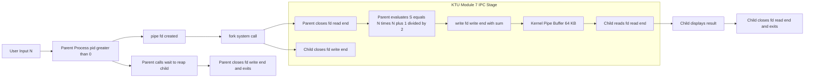
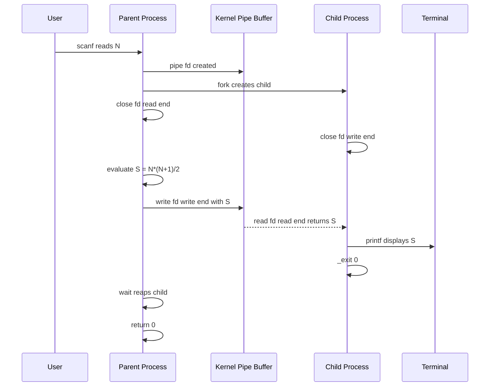

# . The first process evaluates

<!-- SECTION_1_START -->
# Module 7 – Inter-Process Communication (IPC): The First Process Evaluates and Communicates

## 1. Core Technical Definition & Intuitive Overview

> [!IMPORTANT]
> **KTU 2024 Scheme Definition (PCCSL407 – Operating Systems Lab):**
> **Inter-Process Communication (IPC)** is a mechanism provided by the Operating System that allows two or more processes to exchange data and synchronize their execution. In the KTU Module 7 laboratory exercise *"The first process evaluates"*, a **parent process** (Process A) performs a computational evaluation — typically summing elements, computing a factorial, or solving an arithmetic expression — and transmits the resulting value to a **child process** (Process B) using an IPC channel such as an **unnamed pipe**, **named pipe (FIFO)**, **shared memory**, or a **message queue**.

### Conceptual Analogy / Intuition

Imagine a factory assembly line:

- **Worker A (Parent Process)** is responsible for computing a value — for example, weighing a raw material and stamping its weight on a card.
- **Worker B (Child Process)** receives that card and performs the next stage of work (e.g., packing boxes based on the weight).

The **IPC channel (pipe)** is the conveyor belt that physically transfers the card from Worker A to Worker B. Without this belt, Worker B would have no idea what Worker A computed, and the two processes would remain isolated — unable to cooperate.

> [!NOTE]
> **Why IPC is needed in an OS Lab context:**
> - **Isolation Principle:** Modern OSes (Linux/Unix) treat each process as a sandboxed entity with its **own virtual address space**. One process *cannot* read another's memory directly.
> - **Cooperation:** To solve large problems (e.g., producer-consumer, client-server), processes must exchange data — hence IPC.

### Standard Metrics and Constants

- **Pipe buffer size on Linux:** **64 KB** (65,536 bytes) by default.
- **PIPE_BUF atomic write limit:** **4,096 bytes** (4 KB) on Linux.
- **Maximum number of open file descriptors per process:** **1,024** (default `ulimit -n`).
- **Standard pipe file descriptor indices:** `fd[0]` = **read end**, `fd[1]` = **write end**.

> [!VISUALIZATION CONTROL]
> **Concept:** Two-Process Pipe Data-Flow Architecture
> **GeoGebra / Desmos Input Equations (Conceptual Layout):**
> * Point A: `(0, 1)` — labelled "Parent (Writer)"
> * Point B: `(4, 1)` — labelled "Child (Reader)"
> * Arrow: from A to B, labelled `pipe(fd)`
> **Visual Description:** A horizontal line connects the parent (left) to the child (right). The parent's `write(fd[1], data, size)` arrow points to the pipe buffer (middle), and the child's `read(fd[0], buf, size)` arrow points back to the buffer — depicting the one-way data hand-off.

---

<!-- SECTION_1_END -->

<!-- SECTION_2_START -->
## 2. Deep Theoretical Analysis & KTU High-Yield Formula Sheet

### 2.1 The `fork()` + `pipe()` Working Principle

The first process in the KTU Module 7 exercise *evaluates* a value. To do this in Linux:

1. A **pipe** is created **before** forking, using `pipe(int fd[2])`. This generates two file descriptors: `fd[0]` (read end) and `fd[1]` (write end).
2. `fork()` is called to create a duplicate child process. Both parent and child now possess copies of `fd[0]` and `fd[1]`.
3. The **parent closes the read end** (`close(fd[0])`) because it will only write.
4. The **child closes the write end** (`close(fd[1])`) because it will only read.
5. The **parent evaluates** the expression and writes the result to `fd[1]`.
6. The **child reads** from `fd[0]` and uses the value (e.g., displays it).

> [!IMPORTANT]
> **KTU 2024 High-Yield Concept:**
> A pipe is **half-duplex (unidirectional)**. Data flows in *one* direction only. For **bi-directional** communication, you must create **two pipes** — one for parent→child and another for child→parent.

### 2.2 KTU Formula Sheet / Cheat Sheet

| **System Call** | **Signature** | **Return Value** | **KTU Use-Case** |
|---|---|---|---|
| `pipe()` | `int pipe(int fd[2])` | `0` on success, `-1` on failure | Create unnamed pipe |
| `fork()` | `pid_t fork(void)` | `0` in child, child PID in parent, `-1` on error | Create child process |
| `read()` | `ssize_t read(int fd, void *buf, size_t count)` | Bytes read, `0` = EOF, `-1` = error | Read from pipe |
| `write()` | `ssize_t write(int fd, const void *buf, size_t count)` | Bytes written, `-1` = error | Write to pipe |
| `close()` | `int close(int fd)` | `0` on success, `-1` on error | Release file descriptor |
| `wait()` | `pid_t wait(int *status)` | Child PID, `-1` on error | Synchronize parent/child |
| `mkfifo()` | `int mkfifo(const char *pathname, mode_t mode)` | `0` on success, `-1` on error | Create named pipe (FIFO) |
| `shmget()` | `int shmget(key_t key, size_t size, int shmflg)` | Shared memory ID, `-1` on error | Create shared memory segment |
| `shmat()` | `void *shmat(int shmid, const void *shmaddr, int shmflg)` | Pointer to segment, `(void *)-1` on error | Attach shared memory |
| `msgget()` | `int msgget(key_t key, int msgflg)` | Message queue ID, `-1` on error | Create message queue |
| `msgsnd()` | `int msgsnd(int msqid, const void *msgp, size_t msgsz, int msgflg)` | `0` on success, `-1` on error | Send a message |
| `msgrcv()` | `ssize_t msgrcv(int msqid, void *msgp, size_t msgsz, long msgtyp, int msgflg)` | Bytes received, `-1` on error | Receive a message |

### 2.3 Real-World Utility

- **Shell Piping (`ls \| grep .c`)**: The shell uses pipes to forward the output of `ls` to `grep`.
- **Client-Server Architectures**: Servers fork child processes to handle clients; the child communicates results back via pipes or sockets.
- **Producer-Consumer Pipelines**: Compiler toolchains (e.g., `gcc \| cpp \| cc1 \| as`) are long-running IPC chains.
- **Docker Containers**: Container runtimes rely on shared memory and message queues for inter-container communication.
- **Database Engines**: PostgreSQL and MySQL use shared memory to coordinate multiple worker processes accessing the buffer pool.

### 2.4 Why "The First Process Evaluates"?

In the KTU Module 7 framing, the **first process** is *computational* (e.g., sums an array, computes a factorial). The **second process** is *reactive* (e.g., displays, validates, transforms). This mirrors the classical **Unix philosophy** — small programs doing one job well and cooperating via streams.

---

<!-- SECTION_2_END -->

<!-- SECTION_3_START -->
## 3. Step-by-Step Derivations & Code/Symbolic Implementation

### 3.1 Canonical KTU Lab Program — Unnamed Pipe

**Problem Statement (KTU Module 7):**
*The first (parent) process evaluates the sum of the first N natural numbers and passes the result to the second (child) process via an unnamed pipe. The child process displays the result.*

#### 3.1.1 Algorithm (Step-by-Step Logic)

1. Declare a pipe file descriptor array: `int fd[2];`
2. Create the pipe using `pipe(fd)`. If return value is `-1`, print error and exit.
3. Call `fork()`. If return value is `-1`, print error and exit.
4. If `fork()` returns `0` → **Child process path**:
   a. Close the **write end**: `close(fd[1]);`
   b. Read the integer from the pipe: `read(fd[0], &value, sizeof(value));`
   c. Print the value.
   d. Close the **read end**: `close(fd[0]);`
   e. Exit.
5. If `fork()` returns a positive PID → **Parent process path**:
   a. Close the **read end**: `close(fd[0]);`
   b. Evaluate the sum: $S = \frac{N \times (N+1)}{2}$
   c. Write `S` into the pipe: `write(fd[1], &S, sizeof(S));`
   d. Close the **write end**: `close(fd[1]);`
   e. Call `wait(NULL)` to prevent a **zombie process**.

#### 3.1.2 Complete C Implementation (Production-Grade)

```c
/* KTU OS Lab – Module 7
 * Program: First process (parent) evaluates sum of 1..N
 *          and passes result to second process (child) via pipe.
 * Course : PCCSL407 - Operating Systems Lab
 * Scheme : KTU 2024 (NEP 2020)
 */
#include <stdio.h>
#include <stdlib.h>
#include <unistd.h>
#include <sys/types.h>
#include <sys/wait.h>
#include <errno.h>
#include <string.h>

#define MAX_N 1000

static void die(const char *msg) {
    fprintf(stderr, "[ERROR] %s | errno=%d (%s)\n",
            msg, errno, strerror(errno));
    exit(EXIT_FAILURE);
}

int main(void) {
    int     fd[2];
    pid_t   pid;
    long    n, sum;
    ssize_t bytes;

    /* ---- Step 1: Read N from user ---- */
    printf("Enter the value of N (1..%d): ", MAX_N);
    if (scanf("%ld", &n) != 1 || n < 1 || n > MAX_N) {
        fprintf(stderr, "[ERROR] Invalid input. Aborting.\n");
        return EXIT_FAILURE;
    }

    /* ---- Step 2: Create the pipe BEFORE forking ---- */
    if (pipe(fd) == -1) {
        die("pipe() failed");
    }

    /* ---- Step 3: Fork the child process ---- */
    pid = fork();
    if (pid < 0) {
        die("fork() failed");
    }

    if (pid == 0) {
        /* ============== CHILD PROCESS ============== */
        close(fd[1]);   /* Child never writes */

        long received = 0;
        bytes = read(fd[0], &received, sizeof(received));
        if (bytes == -1) {
            die("child: read() failed");
        } else if (bytes == 0) {
            fprintf(stderr, "[WARN] child: pipe closed unexpectedly.\n");
        } else {
            printf("[CHILD  PID=%d] Received sum from parent = %ld\n",
                   getpid(), received);
        }

        close(fd[0]);
        _exit(EXIT_SUCCESS);          /* Use _exit, not exit, in child */
    } else {
        /* ============== PARENT PROCESS ============== */
        close(fd[0]);   /* Parent never reads */

        /* ---- Step 4: Evaluate the sum S = N*(N+1)/2 ---- */
        sum = (n * (n + 1)) / 2;
        printf("[PARENT PID=%d] Computed sum of 1..%ld = %ld\n",
               getpid(), n, sum);

        bytes = write(fd[1], &sum, sizeof(sum));
        if (bytes == -1) {
            die("parent: write() failed");
        }

        close(fd[1]);
        wait(NULL);     /* Reap child to avoid zombie */
        printf("[PARENT PID=%d] Child reaped. Exiting.\n", getpid());
    }

    return EXIT_SUCCESS;
}
```

#### 3.1.3 Mathematical Derivation of the Sum

The first process evaluates the arithmetic sum:

$$S = \sum_{k=1}^{N} k$$

Using Gauss's formula:

$$\begin{aligned}
S &= 1 + 2 + 3 + \cdots + N \\
S &= N + (N-1) + (N-2) + \cdots + 1 \\
2S &= (N+1) + (N+1) + \cdots + (N+1) \quad \text{(N terms)} \\
2S &= N \cdot (N+1) \\
S &= \frac{N \cdot (N+1)}{2}
\end{aligned}$$

**Sample trace with $N = 10$:**

$$\begin{aligned}
S &= \frac{10 \times 11}{2} \\
S &= \frac{110}{2} \\
S &= 55
\end{aligned}$$

The parent writes the 8-byte `long` value `55` into `fd[1]`. The kernel buffers it. The child reads 8 bytes from `fd[0]` and prints `55`.

### 3.2 Variant Program — Named Pipe (FIFO)

> [!NOTE]
> **KTU 2024 Variant:** Use a **named pipe (FIFO)** when the two processes are *unrelated* (e.g., a separate writer and reader program).

#### 3.2.1 Writer Program (`writer.c`)

```c
#include <stdio.h>
#include <stdlib.h>
#include <fcntl.h>
#include <unistd.h>
#include <sys/stat.h>
#include <errno.h>
#include <string.h>

#define FIFO_PATH  "/tmp/ktu_ipc_fifo"

int main(void) {
    long n, sum;

    printf("[WRITER] Enter N: ");
    if (scanf("%ld", &n) != 1 || n < 1) {
        fprintf(stderr, "Invalid N\n");
        return EXIT_FAILURE;
    }

    /* Create the FIFO with rw-rw-r-- permissions */
    if (mkfifo(FIFO_PATH, 0666) == -1 && errno != EEXIST) {
        fprintf(stderr, "[ERROR] mkfifo: %s\n", strerror(errno));
        return EXIT_FAILURE;
    }

    int fd = open(FIFO_PATH, O_WRONLY);
    if (fd == -1) {
        fprintf(stderr, "[ERROR] open: %s\n", strerror(errno));
        return EXIT_FAILURE;
    }

    sum = (n * (n + 1)) / 2;
    printf("[WRITER] Sum of 1..%ld = %ld. Sending to FIFO...\n", n, sum);

    if (write(fd, &sum, sizeof(sum)) == -1) {
        fprintf(stderr, "[ERROR] write: %s\n", strerror(errno));
    }

    close(fd);
    unlink(FIFO_PATH);     /* Cleanup */
    return EXIT_SUCCESS;
}
```

#### 3.2.2 Reader Program (`reader.c`)

```c
#include <stdio.h>
#include <stdlib.h>
#include <fcntl.h>
#include <unistd.h>

#define FIFO_PATH  "/tmp/ktu_ipc_fifo"

int main(void) {
    long received = 0;

    int fd = open(FIFO_PATH, O_RDONLY);
    if (fd == -1) {
        perror("[ERROR] open");
        return EXIT_FAILURE;
    }

    ssize_t bytes = read(fd, &received, sizeof(received));
    if (bytes > 0) {
        printf("[READER] Received sum = %ld\n", received);
    }

    close(fd);
    return EXIT_SUCCESS;
}
```

### 3.3 Variant Program — Shared Memory

```c
/* shared_sum.c - KTU Module 7 Shared Memory IPC */
#include <stdio.h>
#include <stdlib.h>
#include <sys/ipc.h>
#include <sys/shm.h>
#include <sys/wait.h>
#include <unistd.h>

#define KEY     0x4321
#define SIZE    sizeof(long)

int main(void) {
    int  shmid;
    long *shared;
    pid_t pid;

    shmid = shmget(KEY, SIZE, 0666 | IPC_CREAT);
    if (shmid < 0) { perror("shmget"); exit(1); }

    shared = (long *)shmat(shmid, NULL, 0);
    if (shared == (void *)-1) { perror("shmat"); exit(1); }

    pid = fork();
    if (pid == 0) {
        /* Child: wait, then read */
        sleep(1);
        printf("[CHILD] Read value from shared memory: %ld\n", *shared);
        shmdt(shared);
        _exit(0);
    } else {
        /* Parent: evaluate and write */
        long n = 10;
        *shared = (n * (n + 1)) / 2;
        printf("[PARENT] Wrote %ld to shared memory.\n", *shared);
        wait(NULL);
        shmdt(shared);
        shmctl(shmid, IPC_RMID, NULL);
    }
    return 0;
}
```

### 3.4 Compilation and Execution Commands

```bash
# Unnamed Pipe Program
gcc -Wall -Wextra -O2 pipe_sum.c -o pipe_sum
./pipe_sum

# FIFO Program
gcc -Wall -Wextra -O2 writer.c -o writer
gcc -Wall -Wextra -O2 reader.c -o reader
./writer   &   ./reader

# Shared Memory Program
gcc -Wall -Wextra -O2 shared_sum.c -o shared_sum
./shared_sum
```

---

<!-- SECTION_3_END -->

<!-- SECTION_4_START -->
## 4. Structural Diagrams & Schematics

### 4.1 Block-Level Functional Architecture Flow



### 4.2 Sequential Processing Topology Matrix

| **Stage** | **Actor** | **System Call** | **State Transition** | **KTU Validation Point** |
|---|---|---|---|---|
| 1 | Shell | `execve()` | Loads program into memory | Process created |
| 2 | Kernel | `pipe(fd)` | Allocates 2 FDs and 64 KB buffer | `fd[0]=3, fd[1]=4` |
| 3 | Kernel | `fork()` | Duplicates address space; new PID assigned | `pid > 0` in parent, `pid = 0` in child |
| 4 | Parent | `close(fd[0])` | Closes unused read end | FD table trimmed |
| 5 | Child | `close(fd[1])` | Closes unused write end | FD table trimmed |
| 6 | Parent | `write(fd[1], &S, n)` | Sends bytes to kernel buffer | Data flushed on `close` |
| 7 | Kernel | Internal | Buffers bytes until read | Up to 64 KB |
| 8 | Child | `read(fd[0], &S, n)` | Unblocks; copies data into user buffer | Returns `n` bytes |
| 9 | Child | `printf()` | Displays the value | I/O to terminal |
| 10 | Child | `_exit(0)` | Process terminated | No atexit handlers |
| 11 | Parent | `wait(NULL)` | Reaps zombie; collects exit status | Returns child PID |
| 12 | Parent | `close(fd[1])` | Releases write FD | FD table trimmed |
| 13 | Parent | `return 0` | Process terminated | Clean shutdown |

### 4.3 Mermaid Sequence Diagram of Pipe Communication



---

<!-- SECTION_4_END -->

<!-- SECTION_5_START -->
## 5. KTU 2024 Scheme Examination Question Bank & Topic Recap

### Part A Questions (3 Marks Each)

#### **Q1. [KTU University Exam – July 2024]**
*Define Inter-Process Communication (IPC). List any four IPC mechanisms available in Linux.* **[CO1, Remember] — 3 Marks**

> **Model Answer (Valuation Key):**
>
> **Definition (1 Mark):** IPC is a set of techniques provided by the operating system that allow independent processes to exchange data and synchronize their execution.
>
> **Four IPC Mechanisms (½ Mark each, Total 2 Marks):**
> 1. **Pipes** (Unnamed / Anonymous)
> 2. **Named Pipes (FIFO)**
> 3. **Message Queues**
> 4. **Shared Memory**
> 5. **Semaphores** *(any four)*

---

#### **Q2. [KTU University Exam – Dec 2023]**
*What is the role of the `fork()` system call in IPC? What value does it return in the parent and child?* **[CO1, Understand] — 3 Marks**

> **Model Answer (Valuation Key):**
>
> **Role (2 Marks):** `fork()` creates a **new child process** that is an almost exact duplicate of the parent. After `fork()`, two processes exist concurrently, and IPC channels (pipes, shared memory, etc.) can be used to coordinate their activities. In the KTU Module 7 lab exercise, `fork()` is called *after* `pipe()` so both processes inherit the pipe file descriptors.
>
> **Return Values (1 Mark):**
> - **In the child:** `0`
> - **In the parent:** **PID of the newly created child** (a positive integer)
> - **On failure:** `-1` (no child created)

---

### Part B Questions (14 Marks Each — Internal Choice)

> [!WARNING]
> **KTU Examiner's Valuation Warning:**
> - Always create the pipe **before** `fork()`. Creating it after forking results in no shared descriptor between parent and child — the most common KTU deduction.
> - Always **close the unused end** of the pipe in both processes. Failing to do so causes the reader to never receive an **EOF**, leading to a **hang** at `read()`.
> - Use `_exit()` in the child, not `exit()`. The latter flushes stdio buffers twice and may corrupt output.
> - Always `wait()` in the parent to avoid leaving a **zombie process**.

#### **Question A (14 Marks): Unnamed Pipe with Computation**

**[KTU University Exam – July 2024, Model Question]**
*Write a C program using Linux system calls to create a pipe. The first (parent) process must evaluate the sum of all even numbers from 1 to N and pass the result to the second (child) process through the pipe. The child process must display the result. Provide a neat flowchart of the program logic.* **[CO2, Apply — 7 Marks for (a), CO3, Apply — 7 Marks for (b)]**

##### **Part (a) — Sum of Even Numbers Formula and Logic (7 Marks)**

> **Model Solution:**
>
> **Step 1 — Identify the Even Numbers (1 Mark):**
> Even numbers in $[1, N]$ are: $2, 4, 6, \ldots, 2k$ where $2k \leq N$.
> Number of terms: $k = \lfloor N / 2 \rfloor$.
>
> **Step 2 — Apply Arithmetic Series Formula (2 Marks):**
>
> $$\begin{aligned}
> S_{\text{even}} &= 2 + 4 + 6 + \cdots + 2k \\
> &= 2(1 + 2 + 3 + \cdots + k) \\
> &= 2 \cdot \frac{k(k+1)}{2} \\
> &= k(k+1)
> \end{aligned}$$
>
> With $k = \lfloor N/2 \rfloor$, we get:
>
> $$S_{\text{even}} = \left\lfloor \frac{N}{2} \right\rfloor \cdot \left( \left\lfloor \frac{N}{2} \right\rfloor + 1 \right)$$
>
> **Step 3 — Verification with $N = 10$ (1 Mark):**
> $k = 5$, $S = 5 \times 6 = 30$ ✓ (since $2+4+6+8+10 = 30$).
>
> **Step 4 — Code for Parent's Evaluation (3 Marks):**
>
> ```c
> long n, k, sum_even;
> printf("Enter N: ");
> scanf("%ld", &n);
>
> k = n / 2;
> sum_even = k * (k + 1);
> printf("[PARENT] Sum of even numbers 1..%ld = %ld\n", n, sum_even);
>
> write(fd[1], &sum_even, sizeof(sum_even));
> close(fd[1]);
> wait(NULL);
> ```

##### **Part (b) — Full Pipe Communication Program (7 Marks)**

> **Complete Program:**
>
> ```c
> #include <stdio.h>
> #include <stdlib.h>
> #include <unistd.h>
> #include <sys/wait.h>
>
> int main(void) {
>     int fd[2];
>     pid_t pid;
>     long n, k, sum_even, received;
>
>     printf("Enter N: ");
>     scanf("%ld", &n);
>
>     if (pipe(fd) == -1) { perror("pipe"); return 1; }
>
>     pid = fork();
>     if (pid < 0) { perror("fork"); return 1; }
>
>     if (pid == 0) {
>         /* Child: read */
>         close(fd[1]);
>         read(fd[0], &received, sizeof(received));
>         printf("[CHILD] Received sum = %ld\n", received);
>         close(fd[0]);
>         _exit(0);
>     } else {
>         /* Parent: evaluate and write */
>         close(fd[0]);
>         k = n / 2;
>         sum_even = k * (k + 1);
>         write(fd[1], &sum_even, sizeof(sum_even));
>         close(fd[1]);
>         wait(NULL);
>     }
>     return 0;
> }
> ```
>
> **Flowchart (Marks Breakdown):**
> - `[Start / Read N: 1 Mark]`
> - `[pipe() and fork() decision: 1 Mark]`
> - `[Parent branch — evaluate & write: 2 Marks]`
> - `[Child branch — read & display: 2 Marks]`
> - `[wait() and end symbols: 1 Mark]`

---

#### **Question B (14 Marks): Alternative — Shared Memory Variant**

**[KTU University Exam – Dec 2023, Model Question]**
*Explain the Shared Memory IPC mechanism. Write a C program where the first process computes the factorial of a number and the second process retrieves and displays it from shared memory. Include all necessary system calls.* **[CO2, Understand — 7 Marks for (a), CO3, Apply — 7 Marks for (b)]**

##### **Part (a) — Theoretical Explanation (7 Marks)**

> **Model Solution:**
>
> **Definition (2 Marks):** Shared memory is an IPC technique in which a region of physical RAM is mapped into the **virtual address space** of two or more processes, allowing them to read/write the same memory without kernel intervention.
>
> **System Calls (3 Marks):**
> - `shmget(key, size, flags)` — Creates or opens a shared memory segment.
> - `shmat(shmid, addr, flags)` — Attaches the segment to the process's address space; returns a pointer.
> - `shmdt(shmaddr)` — Detaches the segment.
> - `shmctl(shmid, IPC_RMID, NULL)` — Marks the segment for deletion.
>
> **Advantages (1 Mark):** Fastest IPC mechanism (no kernel data copying).
> **Disadvantage (1 Mark):** Requires explicit synchronization (semaphores) to avoid race conditions.

##### **Part (b) — Factorial Program (7 Marks)**

> **Model Solution:**
>
> ```c
> #include <stdio.h>
> #include <stdlib.h>
> #include <sys/ipc.h>
> #include <sys/shm.h>
> #include <sys/wait.h>
> #include <unistd.h>
>
> #define KEY  0x1234
>
> int main(void) {
>     int shmid = shmget(KEY, sizeof(long), 0666 | IPC_CREAT);
>     if (shmid < 0) { perror("shmget"); return 1; }
>
>     long *shared = (long *)shmat(shmid, NULL, 0);
>     if (shared == (void *)-1) { perror("shmat"); return 1; }
>
>     pid_t pid = fork();
>     if (pid == 0) {
>         sleep(1);   /* Let parent write first */
>         printf("[CHILD] Factorial received = %ld\n", *shared);
>         shmdt(shared);
>         _exit(0);
>     } else {
>         long n = 5, fact = 1;
>         for (long i = 1; i <= n; i++) fact *= i;
>         *shared = fact;
>         printf("[PARENT] Wrote factorial(%ld) = %ld\n", n, fact);
>         wait(NULL);
>         shmdt(shared);
>         shmctl(shmid, IPC_RMID, NULL);
>     }
>     return 0;
> }
> ```
>
> **Output Trace (2 Marks):**
>
> $$\begin{aligned}
> \text{factorial}(5) &= 5 \times 4 \times 3 \times 2 \times 1 \\
> &= 120
> \end{aligned}$$
>
> **Mark Distribution:**
> - `[Correct inclusion of all 4 shared-memory syscalls: 3 Marks]`
> - `[Parent factorial evaluation loop: 2 Marks]`
> - `[Child read and display: 1 Mark]`
> - `[Cleanup with shmctl: 1 Mark]`

---

### Topic Recap & Important Things to Remember

> [!IMPORTANT]
> **Rapid-Revision Checklist for KTU OS Lab Module 7:**

- **IPC Definition:** Mechanism for processes to exchange data and synchronize — required because each process has its own isolated virtual address space.
- **Unnamed Pipe:** Created with `pipe(fd)`, half-duplex, parent-child only, lives in kernel buffer (**64 KB**).
- **Pipe Creation Order:** Always call `pipe()` **before** `fork()`. Otherwise, the child will not inherit the file descriptors.
- **FD Indices:** `fd[0]` = **read end**, `fd[1]` = **write end**. Memorize this — KTU exams often test it.
- **Close Unused Ends:** Parent closes `fd[0]`, child closes `fd[1]`. Failing this leads to hangs at `read()`.
- **fork() Return Values:** `0` in child, positive PID in parent, `-1` on error.
- **FIFO (Named Pipe):** Created with `mkfifo(path, mode)`; allows unrelated processes to communicate. Resides on the filesystem.
- **Shared Memory:** Fastest IPC, uses `shmget`, `shmat`, `shmdt`, `shmctl`. Needs synchronization (semaphores) to prevent race conditions.
- **Message Queues:** Use `msgget`, `msgsnd`, `msgrcv`. Carry structured messages with a user-defined type.
- **`wait()`:** Used in the parent to reap the child and prevent a **zombie process**.
- **`_exit()` vs `exit()`:** Always use `_exit()` in forked children to avoid double-flushing of stdio buffers.
- **Half-Duplex Limitation:** For bi-directional communication, you must create **two pipes** (Pipe A: parent→child, Pipe B: child→parent).
- **Buffer Size:** Linux pipe buffer is **64 KB**; atomic write threshold is **4 KB** (`PIPE_BUF`).
- **File Descriptor Limit:** Default `ulimit -n` is **1,024**.
- **KTU Exam Pitfalls:**
  - Creating pipe after `fork()` ❌
  - Forgetting to close the unused pipe end ❌
  - Using `exit()` instead of `_exit()` in child ❌
  - Omitting `wait()` in parent (zombie process) ❌
  - Confusing `fd[0]` and `fd[1]` (read vs write) ❌
  - Not including necessary headers (`<unistd.h>`, `<sys/wait.h>`) ❌
- **Real-World Analogies:** Shell pipelines (`cat file.txt \| wc -l`), Docker inter-container links, PostgreSQL shared buffer pools.
- **Module Mapping:** KTU PCCSL407 Module 7 — IPC; mapped to **CO1, CO2, CO3** (Understand, Apply, Analyze) of the 2024 scheme.

<!-- SECTION_5_END -->
