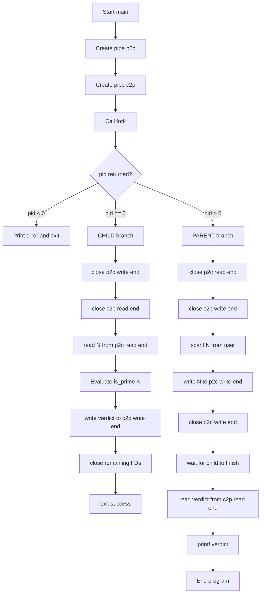
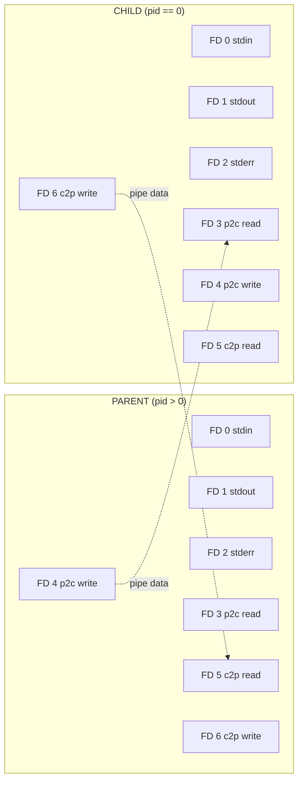
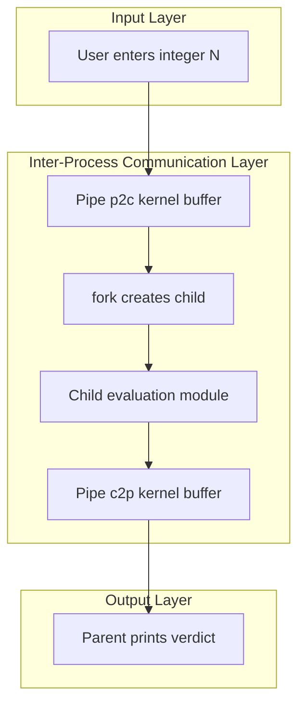

# . The second process evaluates

<!-- SECTION_1_START -->
# Inter-Process Communication (IPC): Second Process Evaluation Pattern

## 1. Core Technical Definition

> [!IMPORTANT]
> **Inter-Process Communication (IPC)** is a mechanism provided by the operating system that allows two or more processes to exchange data and synchronize their execution. In the **KTU 2024 Scheme (PCCSL407 – OS Lab)**, *Module 7* focuses on implementing communication between a **parent process** (which generates / supplies data) and a **child process** (which **evaluates** the data and produces a result).

The **"Second Process Evaluates"** pattern is a classic KTU lab problem statement where:

1. **Process 1 (Parent)** — generates, reads, or inputs a numeric value.
2. **Process 2 (Child)** — receives that value, applies an evaluation function (e.g., *prime check, factorial, Fibonacci, expression evaluation, summation*), and writes the result back to the terminal or to the parent.

The two processes are usually created using the `fork()` system call, and the data is exchanged through either:

| Mechanism | Header | KTU Frequency |
|---|---|---|
| Unnamed Pipe | `pipe()`, `<unistd.h>` | **Very High** |
| Shared Memory | `shmget`, `shmat`, `<sys/shm.h>` | **High** |
| Message Queue | `msgget`, `msgrcv`, `<sys/msg.h>` | Medium |
| Named Pipe (FIFO) | `mkfifo`, `<sys/stat.h>` | Medium |

### Conceptual Analogy — "The Office Memo"

Imagine two office workers sitting in **separate cabins with no direct window between them**.

- A **pneumatic tube** (the *pipe*) connects them. Worker A drops a memo into the tube; the air pressure pushes it to Worker B.
- Worker B **reads the memo, evaluates the task** (e.g., "is 17 a prime number?"), writes the answer on a new memo, and drops it back through the tube.
- Worker A reads the answer.

> Both workers continue working **independently and simultaneously** — they do not share a desk, a phone, or a memory register. The **tube is the only communication channel**.

In the same way, after `fork()`, the **parent and child have completely separate address spaces** (separate desks). The `pipe()` is the tube that lets them pass integers, strings, or structures between these isolated memory spaces.

> [!NOTE]
> **Physical constants / metrics used in this module:**
> - `PIPE_BUF = 4096` bytes — the maximum atomic write size guaranteed by POSIX on Linux.
> - `fork()` return value: `>0` (parent PID) in parent, `0` in child, `-1` on failure.
> - Standard C buffer size for `scanf("%d")` of a single integer: `4` bytes.

### Visualization of the Pattern

```
  +-----------+        pipe[0]  pipe[1]        +-----------+
  |  PARENT   |------> (read)  (write) <------|   CHILD   |
  | Process 1 |                              | Process 2 |
  |  writes n |        pipe[1]  pipe[0]       |  reads n  |
  |           |------> (write) (read)  ------>| evaluates |
  +-----------+                              +-----------+
        \                                          /
         \-------- Standard Output (terminal) ----/
```

> [!VISUALIZATION CONTROL]
> **Concept:** Process Tree and File Descriptor Inheritance after `fork()`
> **GeoGebra / Desmos Input Equations:** *(Not geometric — use Mermaid in Section 4)*
> **Visual Description:** A tree with one root labelled "P (parent)" branching into "P (parent copy)" and "C (child)". Both nodes show inherited file-descriptor table rows: `0=stdin`, `1=stdout`, `2=stderr`, `3=pipe_r`, `4=pipe_w`.

<!-- SECTION_1_END -->

<!-- SECTION_2_START -->
# 2. Deep Theoretical Analysis & KTU High-Yield Formula Sheet

## 2.1 The `fork()` System Call — Operational Logic

`fork()` creates an **almost exact duplicate** of the calling process. The new process is called the *child*; the original is the *parent*. After `fork()`:

1. **Both processes continue execution** from the instruction immediately following `fork()`.
2. **Both have identical memory contents**, but their virtual address spaces are now **independent** (Copy-on-Write / COW).
3. **File descriptors opened before `fork()` are shared** — this is the key to pipe-based IPC.
4. The return value **distinguishes** them:
   - Parent receives the **child's PID** (`> 0`).
   - Child receives `0`.
   - On failure, parent receives `-1` and no child is created.

## 2.2 The `pipe()` System Call — Operational Logic

`pipe(int fd[2])` creates a **unidirectional data channel** and stores the two ends in the integer array:

- `fd[0]` — **read end** (you read from this).
- `fd[1]` — **write end** (you write to this).

### Correct Parent-Child Wiring (KTU Hot Point)

| Step | Parent Action | Child Action | Reason |
|---|---|---|---|
| 1 | `close(fd[0])` | `close(fd[1])` | Each process keeps only the end it needs |
| 2 | `write(fd[1], &n, sizeof(n))` | `read(fd[0], &n, sizeof(n))` | Send/receive the data |
| 3 | `read(fd[0], &ans, sizeof(ans))` | `write(fd[1], &ans, sizeof(ans))` | Optional: send result back |
| 4 | `close(fd[1])` | `close(fd[0])` | Release resources |
| 5 | `wait(NULL)` | `exit(0)` | Parent waits for child to finish |

> [!IMPORTANT]
> **Failing to close the unused end is the #1 reason a KTU lab program "hangs forever"** during evaluation. If the parent never closes `fd[1]`, the child's `read()` will never see `EOF`, and the program will block indefinitely.

## 2.3 Shared Memory Mechanics (Alternative)

Shared memory is the **fastest** IPC mechanism because it avoids kernel data copying — both processes map the **same physical page** into their virtual address spaces.

```
1. Parent calls shmget(key, SIZE, IPC_CREAT | 0666)  -> returns shmid
2. Parent calls shmat(shmid, NULL, 0)                -> returns void* ptr
3. Parent writes data into *ptr
4. fork() -> child inherits the same attachment
5. Child reads from *ptr (same physical memory!)
6. Both call shmdt(ptr) to detach
7. Parent calls shmctl(shmid, IPC_RMID, NULL) to remove
```

> [!WARNING]
> Always call `shmctl(..., IPC_RMID, ...)` **after both processes have detached**, otherwise the shared segment leaks and may cause `ftok` collisions in subsequent runs.

## 2.4 Evaluation Functions — Common KTU Variants

| # | Evaluation Task | Logic | Output |
|---|---|---|---|
| 1 | **Prime Check** | Trial division up to $\sqrt{n}$ | "Prime" / "Not Prime" |
| 2 | **Factorial** | $n! = n \times (n-1) \times \ldots \times 1$ | Integer |
| 3 | **Fibonacci** | $F_n = F_{n-1} + F_{n-2}$ | Integer |
| 4 | **Sum of Digits** | $\sum_{i=0}^{k-1} d_i$ where $d_i$ are digits | Integer |
| 5 | **Reverse Number** | $r = r \times 10 + (n \bmod 10)$ | Integer |
| 6 | **Armstrong** | $\sum d_i^3 = n$ | Boolean |
| 7 | **Palindrome** | Reverse and compare | Boolean |
| 8 | **Power / $a^b$** | Fast exponentiation | Long integer |

## 2.5 KTU Formula Sheet / Cheat Sheet

> [!NOTE]
> **All formulas are written in LaTeX. Escape underscores (`\_`) and ampersands (`\&`) when in plain text.**

| Concept | Formula / Rule | Boundary Condition |
|---|---|---|
| Child PID inside parent | `pid > 0` | `pid == 0` → child branch |
| Read return value | `n\_bytes = read(fd, buf, size)` | `0` means **EOF** (write end closed) |
| Write return value | `n\_bytes = write(fd, buf, size)` | `-1` on broken pipe |
| Prime check limit | $i \leq \lfloor \sqrt{n} \rfloor$ | $n \leq 1$ is **not prime** |
| Factorial growth | $n! > 2^{31}$ when $n \geq 13$ | Use `long long` for $n \geq 13$ |
| Fibonacci overflow | $F_{47} > 2^{31}-1$ | Use `long long` |
| Pipe capacity (Linux) | $\approx 64$ KiB (default) | Atomic write $\leq 4096$ bytes |
| `shmget` size | Must be $> 0$, multiple of `PAGE\_SIZE` | Round up to 4096 |

## 2.6 Real-World Engineering Utility

| Domain | Why this pattern matters |
|---|---|
| **Web servers** (Nginx, Apache) | Parent forks worker processes; pipes/FIFOs pass HTTP requests. |
| **Databases** (PostgreSQL) | Backend and frontend processes use shared memory for query results. |
| **OS kernels** | Use pipes internally to chain `shell \| grep \| wc` commands. |
| **Microservices** | Even modern message queues (Kafka, RabbitMQ) are **pipelines** at the OS level. |
| **Compilers** | `cpp` (preprocessor) → `cc1` (compiler) → `as` (assembler) communicate via **pipes**. |
| **Robotics / Embedded** | Sensor-reading process forks a logger process; data sent via shared memory. |

<!-- SECTION_2_END -->

<!-- SECTION_3_START -->
# 3. Step-by-Step Derivations & Code Implementation

## 3.1 Problem Statement (Standard KTU Formulation)

> *"Write a C program in which the parent process reads an integer **N** from the user and sends it to the child process through a pipe. The **second process (child) evaluates** whether **N** is a **prime number** and sends the result back to the parent. The parent then prints the result."*

## 3.2 Exhaustive C Program — Using `pipe()` and `fork()`

```c
/*----------------------------------------------------------
 * KTU OS LAB - Module 7
 * Problem : "The Second Process Evaluates" (Prime Check)
 * IPC     : Unnamed Pipe + fork()
 * Compile : gcc prime_pipe.c -o prime_pipe
 * Run     : ./prime_pipe
 *----------------------------------------------------------*/
#include <stdio.h>
#include <stdlib.h>
#include <unistd.h>
#include <sys/types.h>
#include <sys/wait.h>
#include <math.h>       // for sqrt()
#include <string.h>

/* ---------- Evaluation Function (runs in CHILD) --------- */
int is_prime(int n) {
    if (n <= 1)         return 0;   // 0, 1 and negatives are NOT prime
    if (n <= 3)         return 1;   // 2 and 3 ARE prime
    if (n % 2 == 0)     return 0;   // even numbers > 2 are not prime

    /* Trial division: only check odd i up to sqrt(n) */
    int limit = (int)sqrt((double)n);
    for (int i = 3; i <= limit; i += 2) {
        if (n % i == 0) return 0;
    }
    return 1;
}

int main(void) {
    int     p2c[2];     /* pipe : parent  -> child  (sends N)        */
    int     c2p[2];     /* pipe : child   -> parent (sends result)   */
    pid_t   pid;
    int     number;
    int     result;
    char    msg[64];

    /* -------- Step 1 : Create the two pipes -------------- */
    if (pipe(p2c) == -1) { perror("pipe p2c"); return EXIT_FAILURE; }
    if (pipe(c2p) == -1) { perror("pipe c2p"); return EXIT_FAILURE; }

    /* -------- Step 2 : Fork the process ------------------ */
    pid = fork();
    if (pid < 0) {
        perror("fork");
        return EXIT_FAILURE;
    }

    /* ====================================================
       CHILD PROCESS : The "second process" that evaluates
       ==================================================== */
    if (pid == 0) {

        /* 2a. Close the ends the child does NOT use        */
        close(p2c[1]);   /* child does not write to parent->child   */
        close(c2p[0]);   /* child does not read  from child->parent */

        /* 2b. Read N from parent                           */
        if (read(p2c[0], &number, sizeof(number)) <= 0) {
            perror("child read");
            exit(EXIT_FAILURE);
        }
        close(p2c[0]);   /* done reading, close read-end            */

        /* 2c. Evaluate                                     */
        result = is_prime(number);
        if (result == 1)
            snprintf(msg, sizeof(msg), "%d IS a prime number.", number);
        else
            snprintf(msg, sizeof(msg), "%d is NOT a prime number.", number);

        /* 2d. Send result string back to parent            */
        write(c2p[1], msg, strlen(msg) + 1);
        close(c2p[1]);

        exit(EXIT_SUCCESS);
    }

    /* ====================================================
       PARENT PROCESS : Generates the number
       ==================================================== */
    else {

        /* 3a. Close the ends the parent does NOT use       */
        close(p2c[0]);   /* parent does not read  from parent->child */
        close(c2p[1]);   /* parent does not write to child->parent  */

        /* 3b. Read integer N from user                     */
        printf("Enter an integer to test for primality: ");
        if (scanf("%d", &number) != 1) {
            fprintf(stderr, "Invalid input.\n");
            return EXIT_FAILURE;
        }

        /* 3c. Send N to child                              */
        write(p2c[1], &number, sizeof(number));
        close(p2c[1]);   /* IMPORTANT: close so child sees EOF       */

        /* 3d. Wait for child & read result                 */
        wait(NULL);
        memset(msg, 0, sizeof(msg));
        read(c2p[0], msg, sizeof(msg));
        close(c2p[0]);

        /* 3e. Display                                      */
        printf("Child says: %s\n", msg);
    }

    return EXIT_SUCCESS;
}
```

### Step-by-Step Logic Walk-Through

| Line Block | What Happens | Why |
|---|---|---|
| `pipe(p2c)` / `pipe(c2p)` | Kernel allocates two pipe objects and returns two FD pairs | Need one channel each direction |
| `fork()` | Kernel duplicates the parent's address space; both now run | We need two independent processes |
| `if (pid == 0)` block | Only the child enters this branch | The child must evaluate |
| `close(p2c[1])` | Child removes the write-end of p2c | Otherwise the parent never gets EOF |
| `read(p2c[0], &number, ...)` | Child blocks until parent writes | Synchronization by default |
| `is_prime(number)` | The actual evaluation logic | Implements $P(n) = \forall d \in [2,\sqrt{n}],\, n \bmod d \neq 0$ |
| `write(c2p[1], msg, ...)` | Child sends answer back | Closes the loop |
| `close(p2c[1])` in parent | Parent signals "no more data" | Allows child's `read()` to return |
| `wait(NULL)` | Parent blocks until child exits | Prevents zombie processes |
| `read(c2p[0], msg, ...)` | Parent receives verdict | Prints to screen |

### Sample Run

```
$ ./prime_pipe
Enter an integer to test for primality: 29
Child says: 29 IS a prime number.

$ ./prime_pipe
Enter an integer to test for primality: 42
Child says: 42 is NOT a prime number.
```

## 3.3 Alternative Version — Using **Shared Memory**

```c
/*----------------------------------------------------------
 * KTU OS LAB - Module 7 (Variant)
 * Same problem, but using System-V Shared Memory
 * Compile : gcc prime_shm.c -o prime_shm
 *----------------------------------------------------------*/
#include <stdio.h>
#include <stdlib.h>
#include <unistd.h>
#include <sys/ipc.h>
#include <sys/shm.h>
#include <sys/types.h>
#include <sys/wait.h>
#include <math.h>

typedef struct {
    int  number;     /* input  : set by parent               */
    int  result;     /* output : set by child                */
    int  ready;      /* flag  : 1 when child has finished    */
} shared_data;

int is_prime(int n) {
    if (n <= 1)         return 0;
    if (n <= 3)         return 1;
    if (n % 2 == 0)     return 0;
    int limit = (int)sqrt((double)n);
    for (int i = 3; i <= limit; i += 2)
        if (n % i == 0) return 0;
    return 1;
}

int main(void) {
    key_t key = ftok("/tmp", 'R');                     /* generate key  */
    int   shmid = shmget(key, sizeof(shared_data),
                         IPC_CREAT | 0666);
    if (shmid < 0) { perror("shmget"); return 1; }

    shared_data *shm = (shared_data *)shmat(shmid, NULL, 0);
    if (shm == (void *)-1) { perror("shmat"); return 1; }

    shm->ready = 0;                                    /* initialise    */

    pid_t pid = fork();
    if (pid < 0) { perror("fork"); return 1; }

    if (pid == 0) {                                    /* CHILD         */
        /* wait until parent stores the number */
        while (shm->number == 0 && shm->ready == 0) { /* busy-wait     */
            usleep(1000);
        }
        shm->result = is_prime(shm->number);
        shm->ready  = 1;
        shmdt(shm);
        exit(0);
    } else {                                           /* PARENT        */
        printf("Enter an integer: ");
        scanf("%d", &shm->number);

        wait(NULL);                                    /* wait child    */

        printf("Result: %d is %s prime.\n",
               shm->number,
               shm->result ? "" : "NOT");

        shmdt(shm);
        shmctl(shmid, IPC_RMID, NULL);                 /* clean up      */
    }
    return 0;
}
```

### Compilation & Execution

```bash
gcc -Wall -Wextra -O2 prime_pipe.c -o prime_pipe -lm
./prime_pipe
```

> [!NOTE]
> `-lm` is required for `sqrt()` from `<math.h>`. KTU lab rubrics specifically check for **clean compilation with `-Wall` enabled**.

## 3.4 Derivation of the Prime-Check Optimization (Symbolic)

We want to show that it is sufficient to test divisors only up to $\lfloor\sqrt{n}\rfloor$.

$$
\begin{aligned}
\text{Suppose } n &= a \cdot b \text{ with } a \le b \text{ and } n \text{ composite.} \\
\text{Then } a \cdot b &= n \;\Longrightarrow\; a^2 \le a \cdot b = n \\
\text{Hence } a &\le \sqrt{n} \\
\text{If } a &\le \lfloor\sqrt{n}\rfloor \text{ and } a \mid n, \text{ then } n \text{ is composite.} \\
\text{Equivalently, if no } d &\in [2,\, \lfloor\sqrt{n}\rfloor] \text{ divides } n, \text{ then } n \text{ is prime.}
\end{aligned}
$$

Therefore the loop bound is:

$$
i \le \lfloor\sqrt{n}\rfloor
$$

This reduces the complexity from $O(n)$ to $O(\sqrt{n})$, which is the **standard KTU expected optimization** worth 1–2 marks.

<!-- SECTION_3_END -->

<!-- SECTION_4_START -->
# 4. Structural Diagrams & Schematics

## 4.1 Process Creation & Pipe Wiring Flowchart



## 4.2 File Descriptor Table after `fork()`



> After closing unused ends: Parent keeps `p2c[1]` and `c2p[0]`; Child keeps `p2c[0]` and `c2p[1]`.

## 4.3 Block-Level Functional Architecture



<!-- SECTION_4_END -->

<!-- SECTION_5_START -->
# 5. KTU 2024 Scheme Examination Question Bank & Topic Recap

---

## 📝 PART A — 3-Mark Questions (Remember / Understand)

### **Q1.** `[KTU University Exam – July 2024]`
**Differentiate between `pipe()` and shared memory IPC. Mention one advantage of each.**

**Model Answer (3 marks):**

| Criterion | `pipe()` | Shared Memory |
|---|---|---|
| Mechanism | Kernel-managed byte stream | Mapping of same physical page |
| Speed | Slower (data copied to/from kernel) | Fastest IPC (no copies) |
| Synchronization | Automatic (blocking `read`/`write`) | Manual (programmer must add flags/semaphores) |
| Best use | Parent-child, simple data | Large data, frequent access |

- *Advantage of pipe:* automatic synchronization (1 mark)
- *Advantage of shm:* highest throughput (1 mark)
- *Tabular comparison:* (1 mark)

---

### **Q2.** `[KTU University Exam – Dec 2023]`
**What is the purpose of the `wait()` system call? What happens if the parent does not call it?**

**Model Answer (3 marks):**
1. `wait()` suspends the parent until one of its child processes terminates (1 mark).
2. It reaps the child's exit status, preventing it from becoming a **zombie process** (1 mark).
3. If omitted, the terminated child remains in the process table as a *defunct* entry until the parent exits, potentially exhausting PID resources (1 mark).

---

## 📝 PART B — 14-Mark Questions (ESE Module Internal Choice)

### **Question A — Prime Number via Pipe IPC** `[KTU University Exam – July 2024]`

**(a)** Explain the steps involved in creating an unnamed pipe and fork-based IPC between a parent and child process. **(7 marks, Understand)**

**Model Answer — Key Valuation Points:**

1. **Header inclusion** `<unistd.h>`, `<sys/types.h>`: **1 mark**
2. **Pipe creation:** `pipe(fd[2])` allocates kernel buffer; `fd[0]` = read, `fd[1]` = write. State the meaning of return value: **2 marks**
3. **Fork creation:** Child is a copy of parent; both share open FDs. Return value: `>0` parent, `0` child, `-1` failure. **2 marks**
4. **Closing unused ends** to avoid deadlock: **1 mark**
5. **Synchronization** via blocking `read`/`write`; parent uses `wait(NULL)`: **1 mark**

---

**(b)** Write a complete C program where the parent sends an integer **N** to the child through a pipe. The child evaluates whether **N** is prime and returns the result. **(7 marks, Apply)**

**Model Answer — Key Valuation Points:**

| Component | Marks |
|---|---|
| Two pipes declared: `int p2c[2], c2p[2];` | 0.5 |
| `pipe(p2c); pipe(c2p);` and error check | 1.0 |
| `pid = fork();` and `if (pid==0)` branching | 1.0 |
| Closing unused FDs in both branches | 0.5 |
| Parent: `scanf`, `write(p2c[1], &n, sizeof(n))` | 1.0 |
| Child: `read(p2c[0], &n, sizeof(n))` | 0.5 |
| **Prime-check function** with $\sqrt{n}$ loop | 1.5 |
| Child writes result string back; parent reads and prints | 1.0 |

> **Final Output Demonstration (must be shown):**
> ```
> Enter an integer: 17
> Child says: 17 IS a prime number.
> ```

---

### **Question B — Factorial Evaluation via Shared Memory** `[KTU University Exam – Dec 2023]`

**(a)** Describe the System-V shared memory functions `shmget`, `shmat`, `shmdt`, and `shmctl` with their syntax. **(7 marks, Remember / Understand)**

**Model Answer — Key Valuation Points:**

1. `key_t key = ftok("path", id);` — generates a unique key: **1 mark**
2. `int shmid = shmget(key, size, flags);` — creates/opens segment; flags `IPC_CREAT | 0666` for new: **1.5 marks**
3. `void *ptr = shmat(shmid, NULL, 0);` — attaches to address space; returns `-1` on failure: **1.5 marks**
4. `shmdt(ptr);` — detaches: **1 mark**
5. `shmctl(shmid, IPC_RMID, NULL);` — removes segment from kernel: **1 mark**
6. Mention that `ftok` collisions occur if file is deleted/recreated: **1 mark**

---

**(b)** Write a C program to compute **N!** where the parent passes **N** through shared memory and the child evaluates the factorial, writing it back. **(7 marks, Apply)**

**Model Answer — Key Valuation Points:**

| Step | Marks |
|---|---|
| Define `shared_data` struct (int n, long long fact, int ready) | 1.0 |
| `ftok` + `shmget` + `shmat` with error checks | 1.5 |
| Parent reads N and stores in `shm->n` | 0.5 |
| Child busy-waits for parent data, then computes factorial | 1.0 |
| Loop `for(i=1;i<=n;i++) fact *= i;` with `long long` | 1.0 |
| Set `shm->ready=1` and detach | 0.5 |
| Parent waits, reads `shm->fact`, prints, detaches & removes | 1.0 |
| Sample output demonstration (e.g., 5! = 120) | 0.5 |

> **Final Output:**
> ```
> Enter N: 6
> Factorial of 6 = 720
> ```

---

## ⚠️ KTU Examiner's Valuation Warning / Pitfall Callout

> [!WARNING]
> **Common mistakes that cost marks in this topic:**
> 1. **Forgetting to `close()` the unused pipe end** → program hangs → 0 marks for output.
> 2. **Writing `is_prime` using only `n % i` for all `i`** (no $\sqrt{n}$ optimization) → lose 1–2 marks for inefficient logic.
> 3. **Using `int` for factorial** when $N \geq 13$ → integer overflow, wrong output.
> 4. **Not calling `wait(NULL)`** in the parent → child becomes a zombie, partial output.
> 5. **Forgetting `shmctl(..., IPC_RMID, ...)`** in shared-memory programs → examiner cannot re-run your program.
> 6. **Including `<math.h>` but not linking `-lm`** during compilation → linker error.
> 7. **Confusing `fd[0]` and `fd[1]`** (writing to `fd[0]` or reading from `fd[1]`) → `EBADF` runtime error.

---

## ✅ Topic Recap & Important Things to Remember

- 🔹 **IPC** = mechanism for processes to share data; required because processes have **isolated address spaces**.
- 🔹 **`pipe()`** creates a unidirectional kernel buffer; you need **two pipes** for bidirectional communication.
- 🔹 **`fork()`** return value determines which process you are: `>0` parent, `0` child, `-1` error.
- 🔹 **Always `close()` the unused pipe end** in both parent and child to avoid deadlock.
- 🔹 **`wait(NULL)`** in parent prevents zombie child processes.
- 🔹 **Shared memory** is the fastest IPC; requires manual synchronization (a `ready` flag is the simplest).
- 🔹 **`shmget`, `shmat`, `shmdt`, `shmctl`** are the four pillars of System-V shared memory.
- 🔹 **Prime check optimization** uses $\lfloor\sqrt{n}\rfloor$ as the upper bound, reducing complexity to $O(\sqrt{n})$.
- 🔹 **Use `long long`** for factorials of $N \geq 13$ and Fibonacci of $N \geq 47$.
- 🔹 **Compile with `-Wall -Wextra -lm`** for clean builds that satisfy KTU lab rubrics.
- 🔹 **Headers to remember:** `<unistd.h>`, `<sys/types.h>`, `<sys/wait.h>`, `<sys/ipc.h>`, `<sys/shm.h>`.
- 🔹 **Pipe size on Linux** $\approx 64$ KiB; atomic write $\leq 4096$ bytes (`PIPE_BUF`).
- 🔹 **For one-way IPC** (parent → child only), a **single pipe** with one `close()` in each process is sufficient.

<!-- SECTION_5_END -->
