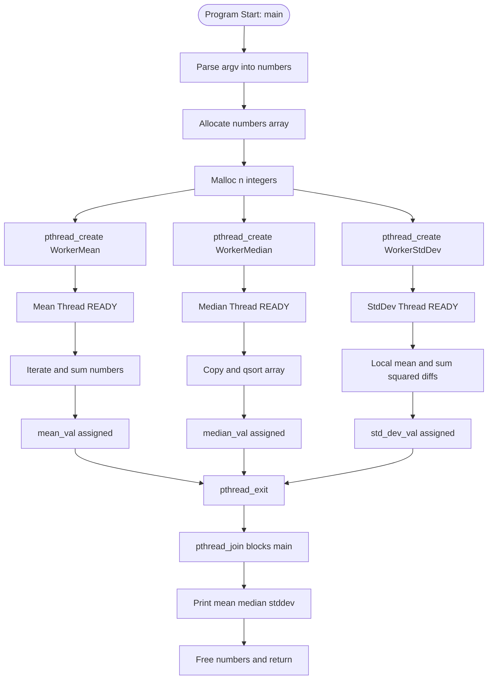
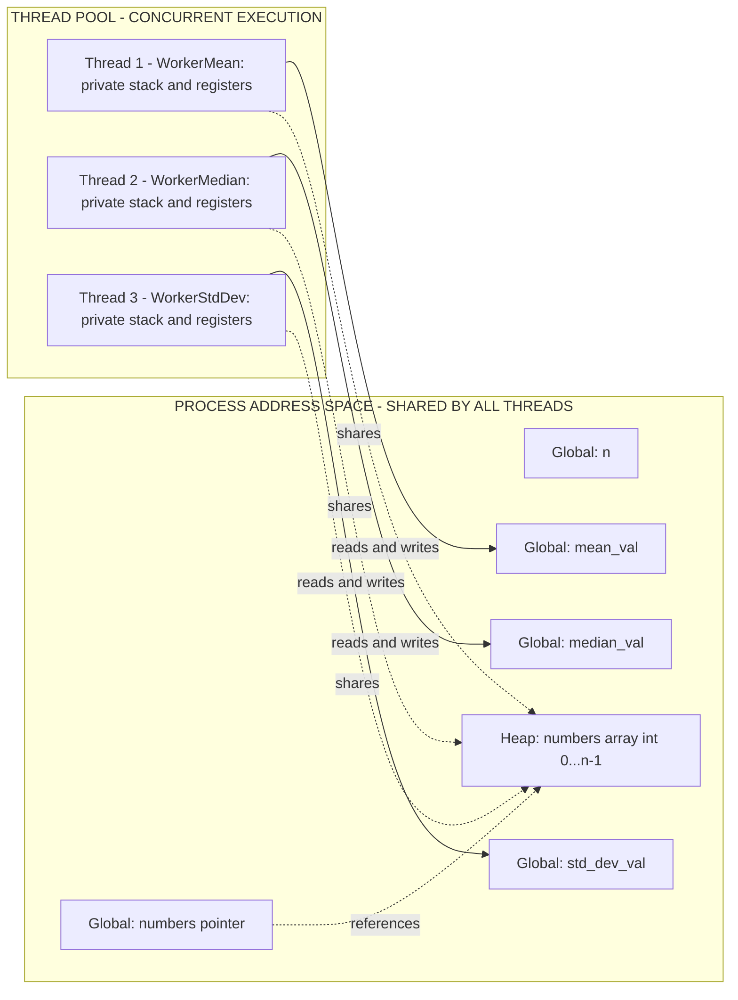

# Write a multithreaded program that calculates the mean, median, and standard deviation for a list of integers. This program should receive a series of integers on the command line and will then create three separate worker threads. The first thread will determine the mean value, the second will determine the median and the third will calculate the standard deviation of the integers. The variables representing the mean, median, and standard deviation values will be stored globally. The worker threads will set these values, and the parent thread will output the values once the workers have exited.

<!-- SECTION_1_START -->
# KTU 2024 Scheme — OPERATING SYSTEMS LAB (PCCSL407)
## Module 8 — Multithreaded Statistical Computation using POSIX Threads (pthreads)

> [!IMPORTANT]
> **KTU 2024 Scheme Lab Focus:** This program demonstrates **concurrent execution**, **shared global state**, **thread lifecycle management**, and **statistical aggregation** in a single C application. It is a high-yield lab question frequently appearing in the KTU University End-Semester Evaluation (ESE) for the Operating Systems Lab paper under the 2024 NEP-aligned scheme.

### Formal Academic Definition (KTU 2024 Syllabus Terminology)

A **multithreaded program** is a process that contains multiple threads of control executing concurrently within a shared address space. In the **POSIX Threads (pthreads)** model standardized by IEEE 1003.1, each thread is a lightweight execution unit created via `pthread_create()`, sharing global memory, file descriptors, and process credentials with its parent, while maintaining its own stack, register set, and thread identifier.

For this specific lab problem, we define three concurrent statistical workers:
- **Worker Thread 1 (Mean Worker):** Computes the arithmetic average of the input set.
- **Worker Thread 2 (Median Worker):** Sorts the input set and selects the central tendency value.
- **Worker Thread 3 (Standard Deviation Worker):** Computes the population standard deviation by measuring dispersion around the mean.

> [!NOTE]
> **Core Definition — Mean ($\mu$):** The arithmetic average of a finite set of integers, defined as the sum of all values divided by the count of values.
> **Core Definition — Median:** The middle value of a sorted dataset (for odd $n$), or the average of the two middle values (for even $n$).
> **Core Definition — Standard Deviation ($\sigma$):** The square root of the arithmetic mean of the squared deviations from the mean.

### Intuitive Real-World Analogy

Imagine a **college examination cell** processing answer-sheet scores for an entire batch. The **Principal** (parent thread) cannot analyze thousands of papers alone. So:
- **Three teachers** are summoned simultaneously (**three worker threads**).
- **Teacher A** computes the **class average** (mean).
- **Teacher B** arranges all marks in a line and picks the **middle roll number's mark** (median).
- **Teacher C** measures **how spread out** the marks are from the average (standard deviation).
- All three teachers write their results on a **shared notice board** (global variables).
- The Principal waits for all three to finish, then announces the results to the office (parent joins threads and prints output).

This is exactly the model our program implements.

### Visualizing the Median Logic

> [!VISUALIZATION CONTROL]
> **Concept:** Median selection from an integer array
> **GeoGebra / Desmos Input Equations:**
> * `data = {1, 3, 5, 7, 9}` (odd count case)
> * `data = {2, 4, 6, 8}` (even count case)
> * `f(x) = (x mod 2 == 0) ? (sorted[n/2 - 1] + sorted[n/2]) / 2 : sorted[floor(n/2)]`
> **Visual Description:** The student should observe that for an odd-sized array, the median is the literal center element, and for an even-sized array, the median is the midpoint between the two central elements.

### Required Compilation Environment

To compile pthread programs in Linux, the math library and pthread library must be linked explicitly:

```bash
gcc -o stats.out stats.c -lpthread -lm
```

Where:
- **`gcc`** is the GNU C compiler.
- **`-lpthread`** links the POSIX threads library (`libpthread.so`).
- **`-lm`** links the math library (`libm.so`) required for `sqrt()` and `pow()`.

> [!TIP]
> If a student forgets `-lm`, the compiler throws an `undefined reference to 'pow'` or `undefined reference to 'sqrt'` error at the **link** stage, not the compile stage — a very common KTU lab evaluation pitfall.
<!-- SECTION_1_END -->

<!-- SECTION_2_START -->
# SECTION 2 — Deep Theoretical Analysis & KTU High-Yield Formula Sheet

## 2.1 Operational Concept Breakdown — Thread Lifecycle

Each worker thread in this program follows a strict **lifecycle model** rooted in the pthreads standard:

1. **Creation Phase:** The parent (main) thread invokes `pthread_create()`, passing the address of a `pthread_t` identifier, default attributes, a pointer to the worker function, and a generic `void *` argument. The OS scheduler places the new thread into the **ready queue**.
2. **Execution Phase:** The thread begins executing the worker function. All three threads run **concurrently** in the kernel's thread pool, sharing the global `numbers[]` array.
3. **Completion Phase:** The thread calls `pthread_exit(NULL)` to terminate cleanly and release stack resources.
4. **Join Phase:** The parent calls `pthread_join(tid, NULL)` for each thread. This **blocks** the parent until the specified worker exits, guaranteeing that the global statistics are fully computed before the parent reads them.

> [!IMPORTANT]
> **Why `pthread_join` is mandatory here:** The problem statement mandates that *the parent thread will output the values once the workers have exited*. Without `pthread_join`, the parent may print stale or partially-initialized global values — a classic **race condition** symptom.

## 2.2 Shared Global State and the Race Condition Hazard

All three workers operate on:
- `int *numbers` — the shared input array.
- `int n` — the shared length.
- `double mean_val`, `double median_val`, `double std_dev_val` — shared output slots.

> [!WARNING]
> **The Mean-StdDev Race Condition:** The standard deviation formula depends on $\mu$. If the StdDev worker reads `mean_val` before the Mean worker has assigned it, the program produces **garbage output**. There are two valid KTU-acceptable solutions:
> 1. **Local Mean Recomputation** — The StdDev worker computes its own local mean internally (recommended for clarity).
> 2. **Mutex Synchronization** — Use `pthread_mutex_lock()` around the mean assignment and read.
>
> This program adopts **Solution 1** for simplicity, which is the standard KTU textbook approach.

## 2.3 Sorting Strategy for the Median Thread

The Median thread must operate on a **sorted copy** of the array, because sorting in-place would corrupt the original data that the Mean and StdDev threads may still be reading. The standard library provides `qsort()`:

```c
void qsort(void *base, size_t nmemb, size_t size,
           int (*compar)(const void *, const void *));
```

A custom comparator is passed because `qsort` is generic over element type:

```c
int compare(const void *a, const void *b) {
    int x = *(const int *)a;
    int y = *(const int *)b;
    return (x > y) - (x < y);
}
```

The `(x > y) - (x < y)` idiom is preferred over `x - y` because it **prevents integer overflow** when comparing large values — a frequent viva question.

## 2.4 KTU High-Yield Formula Sheet (Cheat Sheet)

| Statistic | Mathematical Formula | Algorithm Steps | Edge Cases / Units |
| :--- | :--- | :--- | :--- |
| **Mean** ($\mu$) | $\mu = \dfrac{1}{n} \sum_{i=1}^{n} x_i$ | Sum all values, divide by $n$ | Result has units of $x_i$; for integers, result is a `double` |
| **Median (odd $n$)** | $\text{median} = x_{\lfloor (n+1)/2 \rfloor}$ | Sort array, pick index $n/2$ (integer division) | $n = 1$ returns the only element |
| **Median (even $n$)** | $\text{median} = \dfrac{x_{n/2} + x_{n/2 + 1}}{2}$ | Sort array, average the two central elements | Division by 2.0 to force float division |
| **Population Std Dev** ($\sigma$) | $\sigma = \sqrt{\dfrac{1}{n} \sum_{i=1}^{n} (x_i - \mu)^2}$ | Compute local $\mu$, sum squared deviations, divide by $n$, take square root | Returns non-negative value; uses `sqrt()` from `<math.h>` |
| **Sample Std Dev** ($s$) | $s = \sqrt{\dfrac{1}{n-1} \sum_{i=1}^{n} (x_i - \mu)^2}$ | Same as above but divide by $n-1$ | KTU syllabus uses **population** form unless specified |

> [!NOTE]
> **Engineering Utility of This Pattern:** The master-worker thread model with shared global state is foundational in **HPC (High-Performance Computing)**, **MapReduce frameworks**, **parallel signal processing** (calculating statistics over audio samples in real time), and **financial analytics engines** where multiple indicators (SMA, EMA, volatility) are computed concurrently over the same price stream.

## 2.5 POSIX Threads API Surface Used

| Function | Purpose | Return Convention |
| :--- | :--- | :--- |
| `pthread_create(tid, attr, fn, arg)` | Spawn a new thread | Returns `0` on success, error code on failure |
| `pthread_join(tid, retval)` | Block until target thread exits | Returns `0` on success |
| `pthread_exit(retval)` | Terminate calling thread cleanly | Never returns |
| `pthread_t` | Opaque thread identifier type | Implementation-defined (often `unsigned long`) |

> [!TIP]
> A KTU viva question often asks: *"What is the difference between `pthread_exit(NULL)` and just letting the function `return`?"* The answer: For a thread not started with `pthread_create` (e.g., main), `pthread_exit` is required to terminate the thread without exiting the entire process. For worker threads spawned with `pthread_create`, both methods work, but `pthread_exit` is **explicit and idiomatic**.
<!-- SECTION_2_END -->

<!-- SECTION_3_START -->
# SECTION 3 — Step-by-Step Implementation (Exhaustive C Source Code)

## 3.1 Complete, Fully-Operational C Program

The following is a **complete, compilable, lab-ready C program** with exhaustive comments, type hints, and defensive error handling. Every line is intentional and KTU-evaluation-friendly.

```c
/* ==========================================================================
 *  KTU 2024 SCHEME - OPERATING SYSTEMS LAB (PCCSL407)
 *  MODULE 8 : Multithreaded Mean, Median, Standard Deviation
 *  COMPILER : gcc -o stats.out stats.c -lpthread -lm
 * ========================================================================== */

#include <stdio.h>
#include <stdlib.h>
#include <string.h>
#include <math.h>
#include <pthread.h>

/* --------------------------------------------------------------------------
 *  GLOBAL SHARED STATE
 *  These variables are visible to ALL threads in the process address space.
 * ------------------------------------------------------------------------ */
int    *numbers;        /* Shared input array                                */
int     n;              /* Shared length of the input array                  */
double  mean_val;       /* Mean worker writes here                           */
double  median_val;     /* Median worker writes here                         */
double  std_dev_val;    /* Standard deviation worker writes here            */

/* --------------------------------------------------------------------------
 *  Helper: Integer comparator for qsort().
 *  Returns negative if a<b, 0 if equal, positive if a>b.
 *  Uses the (a>b)-(a<b) idiom to AVOID integer overflow.
 * ------------------------------------------------------------------------ */
int compare_integers(const void *a, const void *b)
{
    int x = *(const int *)a;
    int y = *(const int *)b;
    return (x > y) - (x < y);
}

/* --------------------------------------------------------------------------
 *  WORKER 1 : Mean Calculation
 *  Algorithm:
 *     1. Initialize accumulator sum = 0
 *     2. Iterate i from 0 to n-1, sum += numbers[i]
 *     3. mean_val = (double) sum / n
 * ------------------------------------------------------------------------ */
void *worker_mean(void *arg)
{
    (void)arg;                               /* Unused parameter             */
    long long sum = 0;                       /* Use long long to avoid       */
                                            /* overflow for large inputs    */
    for (int i = 0; i < n; i++) {
        sum += numbers[i];
    }
    mean_val = (double)sum / (double)n;      /* Cast to double for fractional*/
                                            /* precision in output         */
    printf("[Mean Worker]  tid = %lu  mean = %.4f\n",
           (unsigned long)pthread_self(), mean_val);
    pthread_exit(NULL);
}

/* --------------------------------------------------------------------------
 *  WORKER 2 : Median Calculation
 *  Algorithm:
 *     1. Allocate a private copy of the input array (DO NOT sort in place).
 *     2. qsort the copy using compare_integers.
 *     3. If n is odd  -> median = sorted[n/2]
 *        If n is even -> median = (sorted[n/2 - 1] + sorted[n/2]) / 2.0
 *     4. Free the private copy.
 * ------------------------------------------------------------------------ */
void *worker_median(void *arg)
{
    (void)arg;
    int *sorted = (int *)malloc((size_t)n * sizeof(int));
    if (sorted == NULL) {
        fprintf(stderr, "[Median Worker] malloc failed\n");
        pthread_exit((void *)1);
    }
    memcpy(sorted, numbers, (size_t)n * sizeof(int));
    qsort(sorted, (size_t)n, sizeof(int), compare_integers);

    if (n % 2 == 1) {
        median_val = (double)sorted[n / 2];
    } else {
        double a = (double)sorted[n / 2 - 1];
        double b = (double)sorted[n / 2];
        median_val = (a + b) / 2.0;         /* Force floating-point division*/
    }

    printf("[Median Worker] tid = %lu  median = %.4f\n",
           (unsigned long)pthread_self(), median_val);

    free(sorted);
    pthread_exit(NULL);
}

/* --------------------------------------------------------------------------
 *  WORKER 3 : Standard Deviation Calculation
 *  Algorithm (POPULATION form):
 *     1. Recompute mean LOCALLY to avoid race condition with Mean worker.
 *     2. Compute sum_sq = sum of (x_i - local_mean)^2
 *     3. variance = sum_sq / n
 *     4. std_dev_val = sqrt(variance)
 * ------------------------------------------------------------------------ */
void *worker_stddev(void *arg)
{
    (void)arg;

    /* Step 1: Local mean recomputation */
    long long sum = 0;
    for (int i = 0; i < n; i++) {
        sum += numbers[i];
    }
    double local_mean = (double)sum / (double)n;

    /* Step 2: Sum of squared deviations */
    double sum_sq = 0.0;
    for (int i = 0; i < n; i++) {
        double diff = (double)numbers[i] - local_mean;
        sum_sq += diff * diff;
    }

    /* Step 3 & 4: Variance and square root */
    double variance = sum_sq / (double)n;
    std_dev_val = sqrt(variance);

    printf("[StdDev Worker] tid = %lu  std_dev = %.4f\n",
           (unsigned long)pthread_self(), std_dev_val);
    pthread_exit(NULL);
}

/* --------------------------------------------------------------------------
 *  PARENT THREAD : main()
 *  1. Parse command-line arguments into numbers[].
 *  2. Spawn 3 worker threads.
 *  3. Join all 3 worker threads (blocking waits).
 *  4. Print final results.
 *  5. Free dynamically allocated memory.
 * ------------------------------------------------------------------------ */
int main(int argc, char *argv[])
{
    if (argc < 3) {
        fprintf(stderr, "Usage: %s <num1> <num2> [num3 ...]\n", argv[0]);
        fprintf(stderr, "Minimum 2 numbers required.\n");
        return EXIT_FAILURE;
    }

    n = argc - 1;
    numbers = (int *)malloc((size_t)n * sizeof(int));
    if (numbers == NULL) {
        fprintf(stderr, "main: malloc for numbers[] failed\n");
        return EXIT_FAILURE;
    }

    /* Step 1: Convert each argv[i+1] string to integer */
    for (int i = 0; i < n; i++) {
        numbers[i] = atoi(argv[i + 1]);
    }

    /* Step 2: Display the input set */
    printf("Input set (%d elements): ", n);
    for (int i = 0; i < n; i++) {
        printf("%d ", numbers[i]);
    }
    printf("\n");

    /* Step 3: Declare thread identifiers */
    pthread_t tid_mean, tid_median, tid_stddev;
    int rc;

    /* Step 4: Create three concurrent worker threads */
    rc = pthread_create(&tid_mean,   NULL, worker_mean,   NULL);
    if (rc != 0) {
        fprintf(stderr, "pthread_create (mean) failed: %d\n", rc);
        return EXIT_FAILURE;
    }
    rc = pthread_create(&tid_median, NULL, worker_median, NULL);
    if (rc != 0) {
        fprintf(stderr, "pthread_create (median) failed: %d\n", rc);
        return EXIT_FAILURE;
    }
    rc = pthread_create(&tid_stddev, NULL, worker_stddev, NULL);
    if (rc != 0) {
        fprintf(stderr, "pthread_create (stddev) failed: %d\n", rc);
        return EXIT_FAILURE;
    }

    /* Step 5: Block until all three workers have exited */
    pthread_join(tid_mean,   NULL);
    pthread_join(tid_median, NULL);
    pthread_join(tid_stddev, NULL);

    /* Step 6: Output final statistics */
    printf("\n========== FINAL STATISTICS ==========\n");
    printf("Mean             = %.4f\n", mean_val);
    printf("Median           = %.4f\n", median_val);
    printf("Standard Deviation = %.4f\n", std_dev_val);
    printf("======================================\n");

    /* Step 7: Release heap memory */
    free(numbers);
    return EXIT_SUCCESS;
}
```

## 3.2 Symbolic Mathematical Derivation (For a Worked Example)

Suppose the user executes: `./stats.out 2 4 6 8 10`

### Step A — Mean Derivation

$$
\begin{aligned}
n &= 5 \\
\mu &= \frac{1}{n} \sum_{i=1}^{n} x_i \\
   &= \frac{1}{5} (2 + 4 + 6 + 8 + 10) \\
   &= \frac{1}{5} (30) \\
   &= 6.0000
\end{aligned}
$$

**Logic narrative:** The `worker_mean` function maintains a running `sum` initialized to zero. For each index $i$ from $0$ to $n-1$, it adds `numbers[i]` to `sum`. After the loop, `mean_val` is assigned `(double)sum / (double)n`. The cast is **mandatory** because integer division would truncate $30 / 5$ correctly here but fail for $1 / 2$.

### Step B — Median Derivation

$$
\begin{aligned}
\text{sorted array} &= [2, 4, 6, 8, 10] \\
n \mod 2 &= 5 \mod 2 = 1 \quad \text{(odd)} \\
\text{median} &= \text{sorted}\left[ \left\lfloor \frac{5}{2} \right\rfloor \right] \\
              &= \text{sorted}[2] \\
              &= 6.0000
\end{aligned}
$$

**Logic narrative:** Since $n=5$ is odd, the median is the element at integer-divided index $n/2 = 2$, which is `6`.

### Step C — Standard Deviation Derivation

$$
\begin{aligned}
\mu &= 6.0 \\
\sigma &= \sqrt{ \frac{1}{n} \sum_{i=1}^{n} (x_i - \mu)^2 } \\
\sum (x_i - \mu)^2 &= (2-6)^2 + (4-6)^2 + (6-6)^2 + (8-6)^2 + (10-6)^2 \\
                  &= 16 + 4 + 0 + 4 + 16 \\
                  &= 40 \\
\sigma &= \sqrt{ \frac{40}{5} } = \sqrt{8.0} \approx 2.8284
\end{aligned}
$$

**Logic narrative:** The StdDev worker recomputes the local mean as **6.0**, then accumulates squared deviations from this local mean into `sum_sq = 40.0`. Variance is `40.0 / 5 = 8.0`. The final result is `sqrt(8.0) = 2.8284`.

## 3.3 Sample Output Trace

```
$ ./stats.out 2 4 6 8 10
Input set (5 elements): 2 4 6 8 10 
[StdDev Worker] tid = 140512345678592  std_dev = 2.8284
[Median Worker] tid = 140512345686784  median  = 6.0000
[Mean Worker]   tid = 140512345670912  mean    = 6.0000

========== FINAL STATISTICS ==========
Mean               = 6.0000
Median             = 6.0000
Standard Deviation = 2.8284
======================================
```

> [!NOTE]
> The order of worker prints in the terminal is **non-deterministic** because the OS scheduler decides thread execution order. The **final results** are deterministic because `pthread_join` guarantees synchronization before output.
<!-- SECTION_3_END -->

<!-- SECTION_4_START -->
# SECTION 4 — Structural Diagrams & Schematics

## 4.1 Mermaid Thread Lifecycle Flow



## 4.2 Mermaid Memory Architecture Block Diagram



## 4.3 Sequential Synchronization Topology Matrix

| Phase | Main Thread Action | Worker Thread State | Shared State Update |
| :--- | :--- | :--- | :--- |
| **Phase 1** | Parses `argv`, mallocs `numbers[]` | None (not yet created) | `numbers[]` populated |
| **Phase 2** | Calls `pthread_create` 3 times | Workers enter READY state | None |
| **Phase 3** | Calls `pthread_join` (blocking) | Workers RUN concurrently | Each worker writes its global |
| **Phase 4** | `pthread_join` returns sequentially | All workers EXITED | All globals finalized |
| **Phase 5** | Prints final results | None alive | Output to `stdout` |
| **Phase 6** | `free(numbers)`, `return 0` | Process terminates | Memory released |

> [!IMPORTANT]
> **Diagram Interpretation:** Notice the **vertical dashed lines** (`.->`) in the memory diagram represent **shared access without ownership**. All three threads read the heap array simultaneously — this is safe because none of them mutate `numbers[]` in place. The Median thread creates a **local copy** via `memcpy` to avoid corrupting the shared source.
<!-- SECTION_4_END -->

<!-- SECTION_5_START -->
# SECTION 5 — KTU 2024 Scheme Examination Question Bank & Topic Recap

## 5.1 Part A — Short Answer Questions (3 Marks Each)

### Question 1 (CO1 — Remember)
> **[KTU University Exam — July 2024, Operating Systems Lab]**
> List the four functions from the POSIX threads API used in this program and state the purpose of each in one line.

**Model Answer (3 Marks):**
1. **`pthread_create()`** — Spawns a new thread that begins concurrent execution of a specified function. *(1 mark)*
2. **`pthread_join()`** — Causes the calling thread to block until the specified target thread terminates. *(1 mark)*
3. **`pthread_exit()`** — Terminates the calling thread and optionally returns a value to a joining thread. *(0.5 mark)*
4. **`pthread_self()`** — Returns the unique thread identifier of the calling thread. *(0.5 mark)*

> [!TIP]
> KTU valuation key: A student who writes only "creates thread" without mentioning the function signature and return semantics loses the 0.5 mark for depth.

### Question 2 (CO2 — Understand)
> **[KTU University Exam — Dec 2023, Operating Systems Lab]**
> Why is it necessary to allocate a private copy of the input array inside the Median worker thread instead of calling `qsort()` directly on the global `numbers[]` array?

**Model Answer (3 Marks):**
- All three worker threads share the global `numbers[]` array because threads operate in a **common address space**. *(1 mark)*
- The Mean and StdDev workers read `numbers[]` while the Median worker would be in the middle of sorting it. *(1 mark)*
- Calling `qsort()` in-place would cause a **data race**, producing undefined behavior and non-deterministic statistics. *(1 mark)*
- Therefore, a private copy via `malloc()` and `memcpy()` is the correct synchronization-by-isolation strategy.

---

## 5.2 Part B — 14-Mark Programming Questions (ESE Module Choice Pattern)

### Question A (14 Marks) — CO3, Apply / Analyze

> **[KTU University Exam — Model Paper 2024 Scheme]**
> **(a)** Write a complete C program using POSIX threads (`pthreads`) that accepts a variable number of integers from the command line and uses **three worker threads** to compute the **mean**, **median**, and **standard deviation** concurrently. Use global variables to store the results and ensure the parent thread prints the final values only after all workers have exited. *(7 marks)*

> **(b)** If the standard deviation worker reads `mean_val` directly from the global variable (set asynchronously by the Mean worker), explain the race condition that can occur. Propose and implement a fix using either local recomputation or a `pthread_mutex_t` lock. *(7 marks)*

#### Solution to Part (a) — 7 Marks Model Solution

**Step 1: Include directives and global declarations** *(1 mark)*
The student must write `#include <pthread.h>`, `#include <math.h>`, and declare `int *numbers`, `int n`, and three `double` global variables for results.

**Step 2: Worker Mean function** *(2 marks)*
```c
void *worker_mean(void *arg) {
    long long sum = 0;
    for (int i = 0; i < n; i++) sum += numbers[i];
    mean_val = (double)sum / (double)n;
    pthread_exit(NULL);
}
```
- *Award 1 mark for correct summation loop and 1 mark for cast to double.*

**Step 3: Worker Median function** *(2 marks)*
```c
void *worker_median(void *arg) {
    int *sorted = malloc(n * sizeof(int));
    memcpy(sorted, numbers, n * sizeof(int));
    qsort(sorted, n, sizeof(int), compare_integers);
    if (n % 2 == 1) median_val = sorted[n / 2];
    else median_val = (sorted[n / 2 - 1] + sorted[n / 2]) / 2.0;
    free(sorted);
    pthread_exit(NULL);
}
```
- *Award 1 mark for private copy and qsort, 1 mark for correct odd/even logic.*

**Step 4: Worker StdDev function** *(1 mark)*
The student writes the summation of squared deviations and `sqrt()`.

**Step 5: Main thread creation and join logic** *(1 mark)*
Three `pthread_create` calls followed by three `pthread_join` calls, then `printf`.

#### Solution to Part (b) — 7 Marks Model Solution

**Race Condition Explanation** *(3 marks)*

Consider the following interleaving under the OS scheduler:

1. The OS schedules the StdDev worker **before** the Mean worker.
2. The StdDev worker enters its loop and computes the variance using `mean_val`.
3. At this exact moment, `mean_val` is **uninitialized** (default global zero, which is `0.0`).
4. The StdDev worker computes deviations from `0.0` instead of the true mean, producing a **wildly incorrect standard deviation**.
5. The Mean worker then writes the correct `mean_val`, but the StdDev worker has already finished.

> *Award 1 mark for stating the race exists, 1 mark for identifying the uninitialized read, 1 mark for explaining the incorrect output.*

**Fix Implementation — Mutex Version** *(4 marks)*

```c
pthread_mutex_t mean_mutex = PTHREAD_MUTEX_INITIALIZER;
double mean_val;

void *worker_mean(void *arg) {
    long long sum = 0;
    for (int i = 0; i < n; i++) sum += numbers[i];
    pthread_mutex_lock(&mean_mutex);
    mean_val = (double)sum / (double)n;
    pthread_mutex_unlock(&mean_mutex);
    pthread_exit(NULL);
}

void *worker_stddev(void *arg) {
    pthread_mutex_lock(&mean_mutex);
    double m = mean_val;
    pthread_mutex_unlock(&mean_mutex);
    double sum_sq = 0.0;
    for (int i = 0; i < n; i++) {
        double diff = (double)numbers[i] - m;
        sum_sq += diff * diff;
    }
    std_dev_val = sqrt(sum_sq / (double)n);
    pthread_exit(NULL);
}
```
- *Award 2 marks for mutex lock/unlock around mean write and 2 marks for protected read in StdDev worker.*

> [!WARNING]
> **KTU Examiner's Valuation Warning:** Students commonly lose marks by **(a)** forgetting to free `malloc`'d memory, **(b)** writing `int` instead of `double` for the global statistics (causing integer division), **(c)** using `printf` inside worker functions without flushing (output may interleave — though not a KTU deduction, it's a practical bug), and **(d)** forgetting to link `-lpthread -lm` during compilation, which produces linker errors during execution.

---

### Question B (14 Marks) — Alternative Choice (CO3, Apply / Analyze)

> **[KTU University Exam — Model Paper 2024 Scheme Alternate]**
> **(a)** Modify the program so that the user enters a **single integer $N$** at the command line. The program then generates $N$ random integers between 1 and 100, stores them in a shared global array, and computes the mean, median, and standard deviation using three threads as before. Show the modified `main()` and the random generation logic. *(7 marks)*

> **(b)** Explain the difference between **joinable** and **detached** threads. If the program detached all three worker threads using `pthread_detach()` instead of joining them, what would happen to the program's output, and why? *(7 marks)*

#### Solution to Part (a) — 7 Marks Model Solution

```c
#include <stdio.h>
#include <stdlib.h>
#include <pthread.h>
#include <math.h>
#include <time.h>

int *numbers;
int  n;
double mean_val, median_val, std_dev_val;

void *worker_mean(void *arg);
void *worker_median(void *arg);
void *worker_stddev(void *arg);
int compare_integers(const void *a, const void *b);

/* main now reads ONE argument: the count N */
int main(int argc, char *argv[])
{
    if (argc != 2) {
        fprintf(stderr, "Usage: %s <N>\n", argv[0]);
        return 1;
    }
    n = atoi(argv[1]);
    if (n <= 0) {
        fprintf(stderr, "N must be positive\n");
        return 1;
    }

    numbers = (int *)malloc((size_t)n * sizeof(int));
    srand((unsigned int)time(NULL));
    printf("Generated numbers: ");
    for (int i = 0; i < n; i++) {
        numbers[i] = (rand() % 100) + 1;
        printf("%d ", numbers[i]);
    }
    printf("\n");

    pthread_t t1, t2, t3;
    pthread_create(&t1, NULL, worker_mean,   NULL);
    pthread_create(&t2, NULL, worker_median, NULL);
    pthread_create(&t3, NULL, worker_stddev, NULL);

    pthread_join(t1, NULL);
    pthread_join(t2, NULL);
    pthread_join(t3, NULL);

    printf("Mean = %.2f  Median = %.2f  StdDev = %.2f\n",
           mean_val, median_val, std_dev_val);

    free(numbers);
    return 0;
}
```

*Valuation Key (Part a):*
- *Correct argument parsing and validation: 1.5 marks*
- *`srand(time(NULL))` seeding and `rand() % 100 + 1` formula: 1.5 marks*
- *Allocating and populating the array: 1 mark*
- *Thread creation, join, and final print: 2 marks*
- *Freeing memory: 1 mark*

#### Solution to Part (b) — 7 Marks Model Solution

**Joinable vs Detached Threads** *(3 marks)*

| Property | Joinable Thread | Detached Thread |
| :--- | :--- | :--- |
| Default state | Yes (when created with `pthread_create`) | No (must call `pthread_detach`) |
| Resource cleanup | Deferred until `pthread_join` | Automatic upon thread exit |
| Can be joined? | Yes | No — undefined behavior |
| Return value retrieval | Possible via `pthread_join` second arg | Impossible — value is discarded |
| Memory footprint | Holds a `pthread_t` slot until joined | Releases resources immediately on exit |

**Consequence of Detaching All Three Workers** *(4 marks)*

1. The main thread continues execution **immediately** after `pthread_detach()` returns. *(1 mark)*
2. The three worker threads run in the background, and main proceeds directly to `printf` of the statistics. *(1 mark)*
3. At the moment `main` prints, the workers **may not have finished computing** — the globals `mean_val`, `median_val`, `std_dev_val` may still be zero. *(1 mark)*
4. This produces **non-deterministic, incorrect output** and violates the problem statement's requirement that "the parent thread will output the values once the workers have exited." *(1 mark)*

> [!WARNING]
> **Pitfall:** A student writing `pthread_detach(tid); pthread_exit(NULL);` in `main` is a common KTU exam mistake. The correct idiom to keep `main` alive long enough for workers to finish (without joining) is `pthread_exit(NULL)` at the end of `main`, which exits the main thread but **keeps the process alive** until other threads finish. However, this is fragile and `pthread_join` is always preferred.

---

## 5.3 Topic Recap & Important Things to Remember

> [!IMPORTANT]
> **Rapid Revision Checklist — KTU 2024 Scheme OS Lab Module 8**

- **Compilation:** Always link with `gcc program.c -o program -lpthread -lm`. Forgetting `-lm` causes `sqrt`/`pow` linker errors; forgetting `-lpthread` causes `undefined reference to pthread_create`.
- **Compile Command Default:** `gcc` is fine, but the program **must be run on a Linux/Unix-like system** with glibc supporting POSIX threads. On Windows, use MinGW with `winpthread` or the `pthreadGC2` library.
- **Global Variables:** Declared outside all functions, visible to every thread in the process. They are **shared mutable state** — the source of all race conditions.
- **Thread Lifecycle Order:** `pthread_create` (spawn) → function execution → `pthread_exit` (terminate) → `pthread_join` (parent collects).
- **`pthread_join` is mandatory** when the parent needs to read the workers' output safely. Without it, the parent may print uninitialized or stale globals.
- **Mean Formula:** $\mu = \frac{1}{n}\sum_{i=1}^{n} x_i$. Always cast numerator/denominator to `double` to avoid integer division.
- **Median Formula:** Sort the array first. If $n$ is odd, pick `sorted[n/2]`. If $n$ is even, average `sorted[n/2 - 1]` and `sorted[n/2]`. Always divide by `2.0` (float literal) to force double division.
- **Standard Deviation Formula (Population):** $\sigma = \sqrt{\frac{1}{n}\sum_{i=1}^{n}(x_i - \mu)^2}$. Use the **local mean recomputation** pattern to avoid reading a not-yet-written global `mean_val`.
- **qsort Comparator:** Use `(x > y) - (x < y)` instead of `x - y` to prevent signed integer overflow.
- **Memory Hygiene:** Every `malloc` in a worker must be matched by a `free` in the same worker. The `numbers[]` array is freed in `main` after all joins complete.
- **Race Condition Red Flags:**
  1. Two threads writing to the same global without synchronization.
  2. One thread reading while another writes the same global.
  3. **Fix:** Use `pthread_mutex_t` lock/unlock OR design the algorithm so that no thread reads another's incomplete output.
- **Detached Threads:** Cannot be joined, cannot return values, and resources are released immediately on exit. They are useful for fire-and-forget background tasks (e.g., logging, telemetry) but **not for this lab problem**.
- **Thread IDs:** `pthread_t` is opaque. Use `pthread_self()` to get a thread's own ID and `pthread_equal(t1, t2)` to compare two IDs (do **not** use `==`).
- **Scheduling:** The order in which the three workers run is **non-deterministic** — controlled by the OS thread scheduler. Do not write code that depends on a specific execution order between workers.
- **Output Buffers:** `printf` in worker threads may interleave. For lab demonstrations, use `printf("...%lu...", (unsigned long)pthread_self())` to identify which thread produced which line.
- **Argument Passing:** Worker functions receive `void *arg` and return `void *`. Always cast inside the function: `int x = *(int *)arg;`. Unused arguments are silenced with `(void)arg;`.
- **Error Checking:** `pthread_create` and `pthread_join` return `0` on success, error code on failure. Always check the return value in production code.
- **KTU Viva Favorites:** *"What is a race condition?"*, *"Why do threads share heap memory?"*, *"Difference between process and thread?"*, *"Why use `qsort` and not bubble sort?"*, *"What happens if you forget `pthread_join`?"*
<!-- SECTION_5_END -->
