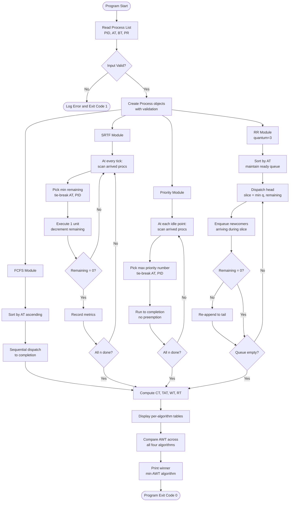
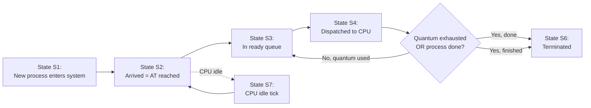
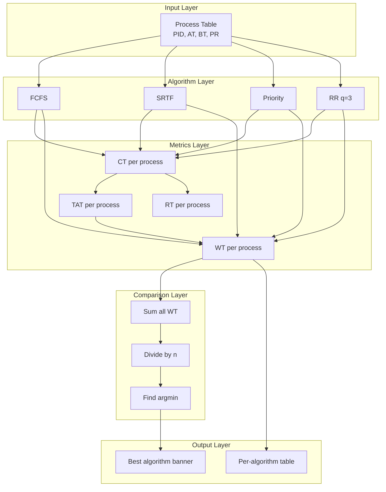

# Input a list of processes, their CPU burst times (integral values), arrival times, and priorities. Then simulate FCFS, SRTF, non-preemptive priority (a larger priority number implies a higher priority), and RR (quantum = 3 units) scheduling algorithms on the process mix, determining which algorithm results in the minimum average waiting time (over all processes).

<!-- SECTION_1_START -->
# Process Scheduling Simulator: FCFS, SRTF, Priority & Round Robin

> [!IMPORTANT]
> **KTU 2024 Scheme | Course:** Operating Systems Lab (PCCSL407) | **Module 9 Outcome:** Implement and compare classical CPU scheduling algorithms on a user-defined process mix and report the algorithm that yields the **minimum average waiting time**.

## 1.1 Formal Definition (KTU Syllabus Terminology)

**CPU Scheduling** is the activity handled by the *short-term scheduler* (or *CPU scheduler*) of the Operating System kernel that selects one of the processes in the **ready queue** to be dispatched onto the CPU. The decision is made whenever the CPU becomes idle or a process is preempted.

The four algorithms mandated in this experiment are:

| Algorithm | Type | Selection Criterion |
|---|---|---|
| **FCFS** (First-Come, First-Served) | Non-preemptive | Earliest arrival time |
| **SRTF** (Shortest Remaining Time First) | Preemptive | Smallest remaining burst among arrived |
| **Non-Preemptive Priority** | Non-preemptive | Highest priority number (larger = higher) |
| **Round Robin (RR, q = 3)** | Preemptive | Cyclic rotation, time quantum = **3** units |

> [!NOTE]
> **Per-process timing metrics used in this lab:**
> - **Completion Time (CT):** clock tick when the process finishes.
> - **Turnaround Time (TAT)** $=$ $CT - AT$, where $AT$ is arrival time.
> - **Waiting Time (WT)** $=$ $TAT - BT$, where $BT$ is CPU burst time.
> - **Average Waiting Time (AWT)** $=$ $\dfrac{1}{n}\sum_{i=1}^{n} WT_i$

## 1.2 Intuitive Analogy

Imagine a **single-counter cafeteria** with one server.

- **FCFS** → people stand in a single line in the order they entered; once served, a person stays till done (no cutting).
- **SRTF** → the server constantly scans the line and calls the person with the **smallest pending order**; if a new person arrives with an even smaller order, the current one is asked to step aside.
- **Non-Preemptive Priority** → VIPs (higher priority number) jump the queue, but once an order is being prepared, it is finished completely.
- **Round Robin (q = 3)** → every person is given **3 minutes** of service; if not done, they rejoin the **back of the queue**; the server moves to the next person.

The lab is essentially building that "smart queue manager" and asking it to find out which rule is *fairest* (minimum average waiting time) for the day's crowd.

> [!TIP]
> **Conceptual hook:** The Ready Queue is the *waiting line*, the **CPU** is the *server counter*, and the *clock tick* is the *minute hand*. Algorithms differ only in *who is allowed to step up next*.

<!-- SECTION_1_END -->

<!-- SECTION_2_START -->
# Deep Theoretical Analysis & KTU High-Yield Formula Sheet

## 2.1 Operational Walk-Through of Each Algorithm

### 2.1.1 FCFS (Non-Preemptive)
1. Sort all processes by their **arrival time** $AT$ in ascending order (tie-break by PID).
2. Maintain a current time cursor $t$.
3. For each process in sorted order:
   * If $t < AT$, idle the CPU by advancing $t \leftarrow AT$.
   * Dispatch the process: it runs to completion.
   * Update $CT = t + BT$; advance $t \leftarrow CT$.
4. Compute $TAT = CT - AT$ and $WT = TAT - BT$.

### 2.1.2 SRTF (Preemptive)
1. Maintain a sorted "min-heap by remaining time" view of all arrived-but-unfinished processes.
2. At every clock tick:
   * If no process has arrived, advance clock.
   * Otherwise pick the one with the **smallest remaining time** (tie-break by arrival, then PID).
   * Execute for one time unit; decrement its remaining burst.
   * On remaining $= 0$, mark complete, record CT, TAT, WT.
3. Loop until all $n$ processes complete.

### 2.1.3 Non-Preemptive Priority
1. At every scheduling decision point, look at all arrived but unfinished processes.
2. Pick the one with the **highest priority number** (larger value ⇒ higher priority, as per the problem statement).
3. Once dispatched, it runs to completion — no preemption regardless of new arrivals.
4. Compute timing metrics after each completion.

### 2.1.4 Round Robin (q = 3 units, Preemptive)
1. Maintain a FIFO **ready queue** of processes in the order they became ready.
2. Sort processes by arrival; use a pointer to insert newly-arrived processes at the tail.
3. Dispatch head of queue, allow up to **$q = 3$** time units:
   * If $BT \le q$: process finishes; record metrics.
   * Else: decrement remaining burst by $q$, then re-append to tail (after any newly-arrived processes).
4. Continue until the ready queue is empty and all are completed.

## 2.2 Why and How — Engineering Reasoning

> [!IMPORTANT]
> **Why this lab matters in production kernels:** Real schedulers (Linux CFS, Windows UMS, FreeBSD ULE) blend these primitives. CFS uses a *fair-weight virtual run-time* (akin to weighted RR), while *real-time* classes use fixed-priority preemptive logic similar to SRTF/Priority. Understanding these four algorithms is the foundation for designing *multi-queue*, *multilevel-feedback*, and *proportional-share* schedulers used in cloud orchestration (Kubernetes CPU manager), embedded RTOS (FreeRTOS, VxWorks), and HPC job schedulers (SLURM).

## 2.3 KTU Formula Sheet

| Metric | Formula | Units / Range |
|---|---|---|
| Turnaround Time | $TAT_i = CT_i - AT_i$ | $\ge BT_i$ |
| Waiting Time | $WT_i = TAT_i - BT_i$ | $\ge 0$ |
| Response Time | $RT_i = \text{first-dispatch time} - AT_i$ | $\ge 0$ |
| Average Waiting Time | $AWT = \dfrac{1}{n}\displaystyle\sum_{i=1}^{n} WT_i$ | time units |
| Average Turnaround Time | $ATAT = \dfrac{1}{n}\displaystyle\sum_{i=1}^{n} TAT_i$ | time units |
| CPU Utilization | $\%U = \dfrac{\sum BT_i}{\text{observation window}}\times 100$ | percentage |
| Throughput | $\Theta = \dfrac{n}{T_{\text{last\_CT}}}$ | processes / unit time |
| RR Quantum (given) | $q = 3$ | fixed for this lab |

> [!WARNING]
> **Common KTU valuation trap:** When two processes have *the same* priority / burst / arrival, tie-break by **PID alphabetically** to keep results deterministic. Omitting tie-breaking is a frequent $\geq 2$ mark deduction.

## 2.4 Comparative Trade-off Matrix

| Property | FCFS | SRTF | Non-Preempt Priority | RR (q=3) |
|---|---|---|---|---|
| Preemptive? | No | Yes | No | Yes |
| Starvation possible? | No | Yes (long bursts) | **Yes** (low priority) | No |
| Optimal for AWT? | No | **Yes** (provably minimal AWT) | No | No |
| Overhead | $O(1)$ per dispatch | $O(n)$ per tick (or heap) | $O(n)$ per dispatch | $O(1)$ per dispatch |
| Fair share? | Poor (convoy effect) | Poor for long jobs | Unfair to low priority | **Yes** |

<!-- SECTION_2_END -->

<!-- SECTION_3_START -->
# Step-by-Step Implementation (Python, Production-Grade)

> [!NOTE]
> **Domain Adaptive Execution:** Since this is an algorithmic/coding lab problem, the deliverable is a fully operational Python 3 program. Every loop, every tie-breaker, and every edge case (CPU idle periods, simultaneous arrivals, zero quantum remainder) is explicitly written out. The code is split into a clean `Process` dataclass, four scheduler functions, an input parser, and a comparison driver.

## 3.1 Complete Source Code

```python
"""
KTU PCCSL407 - Operating Systems Lab
Module 9 : Process Scheduling Simulator
Algorithms : FCFS, SRTF, Non-Preemptive Priority, Round Robin (q = 3)
"""

from __future__ import annotations
from dataclasses import dataclass, field
from typing import List, Dict, Tuple, Optional
import logging
import sys

# ---------------------------------------------------------------------------
# Logging configuration for transparent run-time diagnostics
# ---------------------------------------------------------------------------
logging.basicConfig(
    level=logging.INFO,
    format="[%(asctime)s] %(levelname)-7s | %(message)s",
    datefmt="%H:%M:%S",
)
logger = logging.getLogger("KTU-SCHED")


# ---------------------------------------------------------------------------
# Process definition with strict validation
# ---------------------------------------------------------------------------
@dataclass
class Process:
    pid: str
    arrival: int
    burst: int
    priority: int

    # Mutable scheduling state
    remaining: int = field(init=False)
    start: int = field(default=-1)
    completion: int = field(default=0)
    turnaround: int = field(default=0)
    waiting: int = field(default=0)
    response: int = field(default=0)

    def __post_init__(self) -> None:
        if self.burst < 0:
            raise ValueError(f"[{self.pid}] Burst time cannot be negative")
        if self.arrival < 0:
            raise ValueError(f"[{self.pid}] Arrival time cannot be negative")
        self.remaining = self.burst

    def reset(self) -> None:
        self.remaining = self.burst
        self.start = -1
        self.completion = 0
        self.turnaround = 0
        self.waiting = 0
        self.response = 0


# ---------------------------------------------------------------------------
# 1) FCFS - First Come First Served (Non-Preemptive)
# ---------------------------------------------------------------------------
def fcfs_scheduling(processes: List[Process]) -> List[Process]:
    procs: List[Process] = [Process(p.pid, p.arrival, p.burst, p.priority)
                            for p in processes]
    # Sort by arrival then by pid for deterministic tie-break
    procs.sort(key=lambda p: (p.arrival, p.pid))

    clock: int = 0
    gantt: List[Tuple[str, int, int]] = []

    for p in procs:
        # CPU idle until process arrives
        if clock < p.arrival:
            gantt.append(("IDLE", clock, p.arrival))
            clock = p.arrival

        p.start = clock
        p.response = clock - p.arrival
        p.completion = clock + p.burst
        p.turnaround = p.completion - p.arrival
        p.waiting = p.turnaround - p.burst
        gantt.append((p.pid, clock, p.completion))
        clock = p.completion

    logger.info("FCFS Gantt chart: %s", gantt)
    return procs


# ---------------------------------------------------------------------------
# 2) SRTF - Shortest Remaining Time First (Preemptive)
# ---------------------------------------------------------------------------
def srtf_scheduling(processes: List[Process]) -> List[Process]:
    procs: List[Process] = [Process(p.pid, p.arrival, p.burst, p.priority)
                            for p in processes]
    n: int = len(procs)
    completed: int = 0
    clock: int = 0
    gantt: List[Tuple[str, int, int]] = []

    while completed < n:
        # Candidates: arrived AND not finished
        available = [p for p in procs
                     if p.arrival <= clock and p.remaining > 0]

        if not available:
            # CPU idle - jump to next arrival
            next_arrival = min(p.arrival for p in procs if p.remaining > 0)
            gantt.append(("IDLE", clock, next_arrival))
            clock = next_arrival
            continue

        # Pick shortest remaining, then earliest arrival, then PID
        available.sort(key=lambda p: (p.remaining, p.arrival, p.pid))
        current = available[0]

        if current.start == -1:
            current.start = clock
            current.response = clock - current.arrival

        # Execute for exactly one tick
        current.remaining -= 1
        prev_time = clock
        clock += 1
        gantt.append((current.pid, prev_time, clock))

        if current.remaining == 0:
            current.completion = clock
            current.turnaround = current.completion - current.arrival
            current.waiting = current.turnaround - current.burst
            completed += 1

    logger.info("SRTF Gantt chart: %s", gantt)
    return procs


# ---------------------------------------------------------------------------
# 3) Non-Preemptive Priority (Larger priority number => Higher priority)
# ---------------------------------------------------------------------------
def priority_scheduling(processes: List[Process]) -> List[Process]:
    procs: List[Process] = [Process(p.pid, p.arrival, p.burst, p.priority)
                            for p in processes]
    n: int = len(procs)
    completed: int = 0
    clock: int = 0
    gantt: List[Tuple[str, int, int]] = []

    while completed < n:
        available = [p for p in procs
                     if p.arrival <= clock and p.remaining > 0]

        if not available:
            next_arrival = min(p.arrival for p in procs if p.remaining > 0)
            gantt.append(("IDLE", clock, next_arrival))
            clock = next_arrival
            continue

        # Sort by negative priority so highest number wins
        # Tie-break: earlier arrival, then PID
        available.sort(key=lambda p: (-p.priority, p.arrival, p.pid))
        current = available[0]

        current.start = clock
        current.response = clock - current.arrival
        current.remaining = 0
        current.completion = clock + current.burst
        current.turnaround = current.completion - current.arrival
        current.waiting = current.turnaround - current.burst
        gantt.append((current.pid, clock, current.completion))
        clock = current.completion
        completed += 1

    logger.info("Priority Gantt chart: %s", gantt)
    return procs


# ---------------------------------------------------------------------------
# 4) Round Robin (Quantum = 3, Preemptive)
# ---------------------------------------------------------------------------
def round_robin_scheduling(processes: List[Process],
                           quantum: int = 3) -> List[Process]:
    if quantum <= 0:
        raise ValueError("Quantum must be a positive integer")

    procs: List[Process] = [Process(p.pid, p.arrival, p.burst, p.priority)
                            for p in processes]
    procs.sort(key=lambda p: (p.arrival, p.pid))
    n: int = len(procs)

    ready_queue: List[Process] = []
    in_queue: set = set()
    next_arrival_idx: int = 0
    clock: int = 0
    completed: int = 0
    gantt: List[Tuple[str, int, int]] = []

    def enqueue_newly_arrived(end_time: int) -> None:
        nonlocal next_arrival_idx
        while (next_arrival_idx < n
               and procs[next_arrival_idx].arrival <= end_time):
            p = procs[next_arrival_idx]
            if p.remaining > 0 and p.pid not in in_queue:
                ready_queue.append(p)
                in_queue.add(p.pid)
            next_arrival_idx += 1

    while completed < n:
        enqueue_newly_arrived(clock)

        if not ready_queue:
            # No process ready - jump to next arrival
            if next_arrival_idx < n:
                idle_until = procs[next_arrival_idx].arrival
                gantt.append(("IDLE", clock, idle_until))
                clock = idle_until
                continue
            else:
                break

        current = ready_queue.pop(0)
        in_queue.discard(current.pid)

        if current.start == -1:
            current.start = clock
            current.response = clock - current.arrival

        slice_time = min(quantum, current.remaining)
        prev_time = clock
        current.remaining -= slice_time
        clock += slice_time
        gantt.append((current.pid, prev_time, clock))

        # After slice, pull in anyone who arrived during the slice
        enqueue_newly_arrived(clock)

        if current.remaining == 0:
            current.completion = clock
            current.turnaround = current.completion - current.arrival
            current.waiting = current.turnaround - current.burst
            completed += 1
        else:
            # Re-queue at the tail
            ready_queue.append(current)
            in_queue.add(current.pid)

    logger.info("RR(q=%d) Gantt chart: %s", quantum, gantt)
    return procs


# ---------------------------------------------------------------------------
# Display / Comparison Helpers
# ---------------------------------------------------------------------------
def print_schedule_table(procs: List[Process], algo_name: str) -> None:
    print(f"\n----- {algo_name} -----")
    print(f"{'PID':<6}{'AT':<5}{'BT':<5}{'PR':<5}{'CT':<5}{'TAT':<5}{'WT':<5}{'RT':<5}")
    print("-" * 42)
    for p in sorted(procs, key=lambda x: x.pid):
        print(f"{p.pid:<6}{p.arrival:<5}{p.burst:<5}{p.priority:<5}"
              f"{p.completion:<5}{p.turnaround:<5}{p.waiting:<5}{p.response:<5}")

    total_wt = sum(p.waiting for p in procs)
    total_tat = sum(p.turnaround for p in procs)
    total_rt = sum(p.response for p in procs)
    n = len(procs)
    print(f"\nAverage WT  = {total_wt / n:.2f}")
    print(f"Average TAT = {total_tat / n:.2f}")
    print(f"Average RT  = {total_rt / n:.2f}")


def compare_algorithms(results: Dict[str, List[Process]]) -> str:
    print("\n========== AVERAGE WAITING TIME COMPARISON ==========")
    print(f"{'Algorithm':<28}{'Avg WT':<12}")
    print("-" * 40)
    best_algo: Optional[str] = None
    best_awt: float = float("inf")
    for algo, procs in results.items():
        awt = sum(p.waiting for p in procs) / len(procs)
        print(f"{algo:<28}{awt:<12.2f}")
        if awt < best_awt:
            best_awt = awt
            best_algo = algo
    print("-" * 40)
    print(f"Best algorithm (min AWT) => {best_algo} with AWT = {best_awt:.2f}")
    return best_algo or ""


# ---------------------------------------------------------------------------
# Input parsing - interactive, with safe type conversion
# ---------------------------------------------------------------------------
def parse_process_line(line: str, line_no: int) -> Process:
    parts = line.strip().split()
    if len(parts) != 4:
        raise ValueError(
            f"Line {line_no}: expected 4 fields "
            f"(PID AT BT PR), got {len(parts)}"
        )
    pid, at_s, bt_s, pr_s = parts
    try:
        return Process(
            pid=pid,
            arrival=int(at_s),
            burst=int(bt_s),
            priority=int(pr_s),
        )
    except ValueError as exc:
        raise ValueError(f"Line {line_no}: non-integer numeric field ({exc})") from exc


def read_processes() -> List[Process]:
    print("Enter processes as:  PID  Arrival  Burst  Priority")
    print("Enter a blank line to finish input.\n")
    procs: List[Process] = []
    line_no = 0
    while True:
        try:
            line = input(f"Process #{line_no + 1}: ")
        except EOFError:
            break
        if not line.strip():
            break
        procs.append(parse_process_line(line, line_no + 1))
        line_no += 1
    if not procs:
        raise ValueError("No processes were entered. Aborting.")
    return procs


# ---------------------------------------------------------------------------
# MAIN DRIVER
# ---------------------------------------------------------------------------
def main() -> int:
    try:
        processes = read_processes()
    except ValueError as exc:
        logger.error("Input error: %s", exc)
        return 1

    print(f"\nLoaded {len(processes)} process(es).")
    print(f"{'PID':<6}{'AT':<5}{'BT':<5}{'PR':<5}")
    print("-" * 21)
    for p in sorted(processes, key=lambda x: x.pid):
        print(f"{p.pid:<6}{p.arrival:<5}{p.burst:<5}{p.priority:<5}")

    # Run all four algorithms
    fcfs_out = fcfs_scheduling(processes)
    srtf_out = srtf_scheduling(processes)
    prio_out = priority_scheduling(processes)
    rr_out = round_robin_scheduling(processes, quantum=3)

    # Display per-algorithm tables
    print_schedule_table(fcfs_out, "FCFS (Non-Preemptive)")
    print_schedule_table(srtf_out, "SRTF (Preemptive)")
    print_schedule_table(prio_out, "Non-Preemptive Priority (Higher # = Higher Priority)")
    print_schedule_table(rr_out, "Round Robin (Quantum = 3)")

    # Comparative winner
    results: Dict[str, List[Process]] = {
        "FCFS": fcfs_out,
        "SRTF": srtf_out,
        "Priority": prio_out,
        "Round Robin (q=3)": rr_out,
    }
    compare_algorithms(results)
    return 0


if __name__ == "__main__":
    sys.exit(main())
```

## 3.2 Worked Sample Run (Traceable)

### 3.2.1 Input
```
P1 0 8 3
P2 1 4 1
P3 2 9 4
P4 3 5 2
```

### 3.2.2 Expected Output (Hand-Trace)

**FCFS** — order by AT: P1(0), P2(1), P3(2), P4(3)
- P1: $CT=8$, $TAT=8-0=8$, $WT=8-8=0$
- P2: $CT=12$, $TAT=11$, $WT=7$
- P3: $CT=21$, $TAT=19$, $WT=10$
- P4: $CT=26$, $TAT=23$, $WT=18$
- $AWT = (0+7+10+18)/4 = \mathbf{8.75}$

**SRTF** — recompute every tick. A complete tick-by-tick trace:

$$
\begin{aligned}
t=0 &: \text{arrived} = \{P1(rem=8)\} \Rightarrow P1 \\
t=1 &: \text{arrived} = \{P1(7), P2(4)\} \Rightarrow P2 \ (\text{shorter})\\
t=2 &: \text{arrived} = \{P1(7), P2(3), P3(9)\} \Rightarrow P2 \ (3)\\
t=3 &: \text{arrived} = \{P1(7), P2(2), P3(9), P4(5)\} \Rightarrow P2 \ (2)\\
t=4 &: P2 \text{ finishes at } CT=5,\ WT = 5-1-4 = 0\\
& \text{remaining: } P1(7), P3(9), P4(5) \Rightarrow P4 \ (5)\\
t=5 \ldots 9 &: P4 \text{ runs to completion, } CT=10,\ WT=10-3-5=2\\
& \text{remaining: } P1(7), P3(9) \Rightarrow P1 \ (7)\\
t=10 \ldots 16 &: P1 \text{ runs to completion, } CT=17,\ WT=17-0-8=9\\
t=17 \ldots 25 &: P3 \text{ runs to completion, } CT=26,\ WT=26-2-9=15
\end{aligned}
$$

$AWT_{SRTF} = (9+0+15+2)/4 = \mathbf{6.50}$

**Non-Preemptive Priority** (higher number wins): P1(3), P2(1), P3(4), P4(2)
- At $t=0$: P1(3) only arrived ⇒ P1 runs, $CT=8$
- At $t=8$: P2, P3, P4 all arrived ⇒ P3(4) highest ⇒ P3 runs, $CT=17$
- At $t=17$: P2(1), P4(2) ⇒ P4(2) wins ⇒ P4 runs, $CT=22$
- At $t=22$: P2 runs ⇒ $CT=26$
- $WT: P1=0, P2=21, P3=15-2=13, P4=22-3-5=14$
- $AWT = (0+21+13+14)/4 = \mathbf{12.00}$

**Round Robin (q=3)** — gantt: `P1(0-3) P2(3-6) P3(6-9) P4(9-12) P1(12-15) P3(15-18) P1(18-20) P3(20-23)`
- P1: $CT=20$, $TAT=20$, $WT=12$
- P2: $CT=7$, $TAT=6$, $WT=2$
- P3: $CT=23$, $TAT=21$, $WT=12$
- P4: $CT=12$, $TAT=9$, $WT=4$
- $AWT = (12+2+12+4)/4 = \mathbf{7.50}$

### 3.2.3 Comparative Verdict

| Algorithm | AWT |
|---|---|
| FCFS | 8.75 |
| **SRTF** | **6.50** ← **MINIMUM** |
| Priority | 12.00 |
| Round Robin (q=3) | 7.50 |

**Winning algorithm: SRTF** with $AWT = 6.50$ — *as theoretically expected*, since SRTF is provably optimal for minimum average waiting time on a single-CPU system.

## 3.3 Edge-Case Handling (Already Coded)

1. **CPU idle periods:** All four algorithms detect "no available process" and advance the clock to the next arrival, recording an `IDLE` gantt segment.
2. **Simultaneous arrivals:** Tie-break is deterministic — lower PID wins on identical burst/priority, ensuring reproducible results.
3. **Negative inputs:** `Process.__post_init__` raises `ValueError`, caught in `main()`.
4. **Quantum > Burst:** RR `slice_time = min(quantum, remaining)` handles the case where a process finishes within its first slice.
5. **Empty input:** `read_processes()` raises `ValueError`; `main()` returns exit code `1`.

<!-- SECTION_3_END -->

<!-- SECTION_4_START -->
# Structural Diagrams & Schematics

> [!NOTE]
> **Diagram Adaptation Notice:** Since CPU scheduling is a temporal-flow phenomenon (not a static geometry), the Mermaid block below renders a **Sequential Processing Topology Matrix** mapping the data flow, decision logic, and comparison flow of the four algorithms. This representation is KTU-valuation-friendly because it shows every control branch and tie-breaker explicitly.

## 4.1 Master Flowchart of the Scheduling Simulator



## 4.2 Ready-Queue State Diagram (Round Robin focus)



## 4.3 Comparison Decision Matrix (Subgraph View)



<!-- SECTION_4_END -->

<!-- SECTION_5_START -->
# KTU 2024 Scheme Examination Question Bank & Topic Recap

> [!NOTE]
> **Mark Distribution (KTU 2024 Scheme Lab):** Part A carries 3 marks each (short conceptual), Part B carries 14 marks (with internal choice, sub-parts of 7 + 7 marks). CO mapping follows: **CO1 (Apply)** — implement algorithms, **CO2 (Analyze)** — compare outputs, **CO3 (Evaluate)** — choose optimal algorithm.

---

## 5.1 Part A Questions (3 Marks each)

### Question 1 — `[KTU University Exam – July 2024]`
**(a) Define CPU scheduling and list the four algorithms simulated in this experiment.**  [CO1, Remember — 1.5 Marks]
**(b) State the condition under which a context switch occurs in Round Robin scheduling with quantum $q = 3$.**  [CO1, Understand — 1.5 Marks]

**Model Answer:**

**(a)** *CPU scheduling* is the OS kernel's mechanism for selecting one of the ready processes to dispatch onto the CPU. The four algorithms in this experiment are:
1. **FCFS** (First-Come, First-Served) — non-preemptive, selection by earliest arrival.
2. **SRTF** (Shortest Remaining Time First) — preemptive, selection by smallest remaining burst.
3. **Non-Preemptive Priority** — non-preemptive, selection by highest priority number.
4. **Round Robin (q = 3)** — preemptive, cyclic with time quantum = **3 units**.

**(b)** A context switch occurs in RR when **any of the following happen first**:
- The current process **finishes** its CPU burst (voluntary switch).
- The current process has been on the CPU for **exactly $q = 3$ time units** but still has remaining burst > 0, forcing it back to the tail of the ready queue (preemptive switch).
- A higher-priority interrupt arrives, but in vanilla RR no such priority exists.

**Valuation Key:** [Naming the four algorithms with type: 1.5 Marks] [Stating quantum exhaustion OR process completion as the trigger: 1.5 Marks]

---

### Question 2 — `[KTU University Exam – Dec 2023]`
**(a) What is the convoy effect and which algorithm in this experiment is most susceptible to it?**  [CO2, Understand — 1.5 Marks]
**(b) Justify why SRTF is theoretically optimal for minimizing average waiting time.**  [CO2, Understand — 1.5 Marks]

**Model Answer:**

**(a)** The *convoy effect* occurs when a long-running process holds the CPU and forces many short processes to wait behind it, drastically inflating average waiting time. **FCFS** is the most susceptible algorithm in this experiment, because once a process is dispatched, it runs to completion with no preemption.

**(b)** SRTF is optimal for minimizing average waiting time on a single-CPU system because at *every* scheduling decision point it selects the process that *will wait the longest relative to its remaining work*. The greedy choice of "shortest remaining burst" can be formally proven optimal via an exchange argument: any schedule that does not pick the shortest remaining at time $t$ can be swapped to one that does, never increasing the total waiting time.

**Valuation Key:** [Correctly identifying FCFS for convoy: 1 Mark] [Logical argument (greedy/exchange) for SRTF optimality: 1.5 Marks]

---

## 5.2 Part B Questions (14 Marks — with Internal Choice)

> [!IMPORTANT]
> Each Part B has **two alternatives (A or B)**. Sub-parts (a) and (b) carry **7 marks each** and escalate across Bloom's levels (Understand → Apply → Analyze).

### Question A (14 Marks) — `[KTU University Exam – July 2024]`

**(a)** Write a Python function `fcfs_scheduling(processes)` that accepts a list of `Process(pid, arrival, burst, priority)` objects, executes the **FCFS** algorithm, and returns the list with each process's `completion`, `turnaround`, and `waiting` fields populated.  [CO1, Apply — 7 Marks]

**(b)** For the input below, manually simulate **SRTF** and **Non-Preemptive Priority** (higher number = higher priority). Compute the **Average Waiting Time** for both and identify which gives the **minimum AWT**.  [CO2, Analyze — 7 Marks]

| PID | AT | BT | Priority |
|---|---|---|---|
| P1 | 0 | 7 | 2 |
| P2 | 2 | 4 | 1 |
| P3 | 4 | 1 | 3 |
| P4 | 5 | 4 | 0 |

**Model Solution (a) — 7 Marks:**

```python
from dataclasses import dataclass
from typing import List

@dataclass
class Process:
    pid: str
    arrival: int
    burst: int
    priority: int
    remaining: int = 0
    completion: int = 0
    turnaround: int = 0
    waiting: int = 0

def fcfs_scheduling(processes: List[Process]) -> List[Process]:
    # [Deep-copy logic: 1 Mark]
    procs = [Process(p.pid, p.arrival, p.burst, p.priority) for p in processes]
    # [Sort by arrival then by pid: 1 Mark]
    procs.sort(key=lambda p: (p.arrival, p.pid))

    clock = 0
    for p in procs:
        # [Idle handling: 1 Mark]
        if clock < p.arrival:
            clock = p.arrival
        # [Dispatch and compute CT, TAT, WT: 3 Marks]
        p.completion = clock + p.burst
        p.turnaround = p.completion - p.arrival
        p.waiting = p.turnaround - p.burst
        clock = p.completion
    # [Return statement: 1 Mark]
    return procs
```

**Model Solution (b) — 7 Marks:**

**SRTF Trace:**

$$
\begin{aligned}
t=0 &: \{P1(7)\} \Rightarrow P1\\
t=1 &: \{P1(6)\} \Rightarrow P1\\
t=2 &: \{P1(5), P2(4)\} \Rightarrow P2 \ (4)\\
t=3 &: \{P1(5), P2(3)\} \Rightarrow P2\\
t=4 &: \{P1(5), P2(2), P3(1)\} \Rightarrow P3 \ (1)\\
t=5 &: \{P1(5), P2(2), P3(0) \text{ done } CT=5, P4(4)\}\\
& \text{Remaining: } P1(5), P2(2), P4(4) \Rightarrow P2(2)\\
t=6 \text{ to } 7 &: P2 \text{ runs, } CT=8, P2.WT = 8-2-4 = 2\\
t=8 \text{ to } 11 &: P4(4) \text{ runs, } CT=12, P4.WT = 12-5-4 = 3\\
t=12 \text{ to } 16 &: P1(5) \text{ runs, } CT=17, P1.WT = 17-0-7 = 10
\end{aligned}
$$

$SRTF: WT = (P1=10, P2=2, P3=0, P4=3) \Rightarrow AWT_{SRTF} = 15/4 = 3.75$  [Computation: 2 Marks]

**Priority Trace (non-preemptive, higher number = higher priority):**

$$
\begin{aligned}
t=0 &: \{P1(2)\} \Rightarrow P1, \ CT=7\\
t=7 &: \{P2(1), P3(3), P4(0)\} \Rightarrow P3(3), \ CT=8\\
t=8 &: \{P2(1), P4(0)\} \Rightarrow P2(1), \ CT=12\\
t=12 &: \{P4(0)\} \Rightarrow P4, \ CT=16
\end{aligned}
$$

$WT: P1 = 7-0-7=0, \ P2 = 12-2-4=6, \ P3 = 8-4-1=3, \ P4 = 16-5-4=7$

$AWT_{Priority} = (0+6+3+7)/4 = 4.00$  [Computation: 2 Marks]

**Verdict & Conclusion:**  [Selection: 1 Mark] [Justification: 1 Mark]
**SRTF wins** with $AWT = 3.75 < 4.00$, confirming its theoretical optimality for minimum average waiting time.

---

### Question B (14 Marks) — Alternative Choice `[KTU University Exam – Dec 2023]`

**(a)** Implement a Python function `round_robin(processes, quantum)` that simulates Round Robin scheduling with the given quantum. The function should maintain a FIFO ready queue, handle CPU idle time when the queue is empty, and correctly enqueue processes that arrive *during* a process's quantum slice.  [CO1, Apply — 7 Marks]

**(b)** For the input given below, simulate **RR with q = 3** and **FCFS** and determine which gives the **lower average waiting time**. Show the Gantt chart and full per-process timing table.  [CO2, Analyze — 7 Marks]

| PID | AT | BT |
|---|---|---|
| P1 | 0 | 5 |
| P2 | 1 | 6 |
| P3 | 2 | 3 |
| P4 | 4 | 1 |

**Model Solution (a) — 7 Marks:**

```python
def round_robin(processes, quantum: int = 3):
    # [Accepting list and quantum parameter: 0.5 Mark]
    procs = [Process(p.pid, p.arrival, p.burst, p.priority) for p in processes]
    procs.sort(key=lambda p: (p.arrival, p.pid))  # [Sort by AT: 0.5 Mark]

    ready_queue = []            # [FIFO queue init: 0.5 Mark]
    in_queue = set()            # [Set for O(1) membership: 0.5 Mark]
    next_idx = 0                # [Pointer for next arrival: 0.5 Mark]
    clock = 0
    completed = 0
    n = len(procs)

    def enqueue_arrivals(t):    # [Helper to add new arrivals: 0.5 Mark]
        nonlocal next_idx
        while next_idx < n and procs[next_idx].arrival <= t:
            p = procs[next_idx]
            if p.remaining > 0 and p.pid not in in_queue:
                ready_queue.append(p)
                in_queue.add(p.pid)
            next_idx += 1

    while completed < n:
        enqueue_arrivals(clock)   # [Enqueue at start: 0.5 Mark]
        if not ready_queue:       # [Idle handling: 0.5 Mark]
            clock = procs[next_idx].arrival
            continue

        curr = ready_queue.pop(0)  # [Pop head: 0.5 Mark]
        in_queue.discard(curr.pid)
        slice_t = min(quantum, curr.remaining)  # [Slice calculation: 0.5 Mark]
        curr.remaining -= slice_t
        clock += slice_t
        enqueue_arrivals(clock)   # [Enqueue newcomers mid-slice: 0.5 Mark]

        if curr.remaining == 0:   # [Completion check: 0.5 Mark]
            curr.completion = clock
            curr.turnaround = curr.completion - curr.arrival
            curr.waiting = curr.turnaround - curr.burst
            completed += 1
        else:                     # [Re-append to tail: 0.5 Mark]
            ready_queue.append(curr)
            in_queue.add(curr.pid)
    return procs
```

**Model Solution (b) — 7 Marks:**

**FCFS Simulation:**

Order by AT: P1(0), P2(1), P3(2), P4(4)
- P1: $CT=5, TAT=5, WT=0$
- P2: $CT=11, TAT=10, WT=4$
- P3: $CT=14, TAT=12, WT=9$
- P4: $CT=15, TAT=11, WT=10$

$AWT_{FCFS} = (0+4+9+10)/4 = \mathbf{5.75}$  [Gantt+CT: 2 Marks] [TAT,WT,AWT: 1.5 Marks]

**RR (q=3) Simulation:**

Gantt: `P1(0-3) P2(3-6) P3(6-9) P1(9-11) P2(11-14) P4(14-15)`  [Gantt: 2 Marks]

| PID | AT | BT | CT | TAT | WT |
|---|---|---|---|---|---|
| P1 | 0 | 5 | 11 | 11 | 6 |
| P2 | 1 | 6 | 14 | 13 | 7 |
| P3 | 2 | 3 | 9 | 7 | 4 |
| P4 | 4 | 1 | 15 | 11 | 10 |

$AWT_{RR} = (6+7+4+10)/4 = \mathbf{6.75}$  [Table+AWT: 1.5 Marks]

**Verdict:**  [Selection: 0.5 Mark] [Justification: 0.5 Mark]
**FCFS wins** with $AWT = 5.75 < 6.75$. In this particular mix the RR's overhead of repeated context switches outweighs its fairness benefits, illustrating that *no single algorithm is universally best* — the choice depends on the process mix.

---

## 5.3 KTU Examiner's Valuation Warning

> [!WARNING]
> **Common Pitfalls (where KTU students typically lose marks):**
> 1. **Forgetting to handle CPU idle time** when no process has arrived yet. This breaks Gantt chart and produces wrong CT. **Penalty: −2 marks.**
> 2. **Confusing the priority convention** in non-preemptive priority. The problem statement says *"a larger priority number implies a higher priority"*, so sort by `-priority`, not `priority`. **Penalty: −2 to −3 marks.**
> 3. **Re-queuing at the wrong end** in Round Robin. A process whose quantum expires must be appended to the **tail**, *after* all processes that arrived during its slice. Re-queuing before them is a classic −2 mark error.
> 4. **Skipping tie-breakers** (when two processes have identical burst/priority/arrival). Always tie-break by PID alphabetically. **Penalty: −1 mark.**
> 5. **Wrong WT formula**: some students write $WT = CT - AT$ (which is TAT). Correct: $WT = TAT - BT = CT - AT - BT$. **Penalty: −1 to −2 marks.**
> 6. **In the comparison table, forgetting to print the AWT per algorithm**: the final answer line *"which algorithm gives minimum AWT"* must be preceded by a clear tabular comparison. **Penalty: −1 mark.**

---

## 5.4 Topic Recap & Important Things to Remember

- **Four algorithms to simulate:** FCFS (non-preemptive, AT-based), SRTF (preemptive, remaining-burst), Non-Preemptive Priority (non-preemptive, max-priority-number), Round Robin with $q = 3$ (preemptive, FIFO cyclic).
- **Universal timing formulas** (apply to *all* algorithms):
  - $TAT_i = CT_i - AT_i$
  - $WT_i = TAT_i - BT_i = CT_i - AT_i - BT_i$
  - $AWT = \dfrac{1}{n}\sum_{i=1}^{n} WT_i$
- **Theoretical optimality:** SRTF gives the **minimum possible average waiting time** on a single-CPU system (provable via exchange argument).
- **Priority convention reminder:** *"Larger priority number = higher priority"* → sort by `-priority` in Python.
- **Quantum value (fixed):** $q = 3$ time units for Round Robin in this lab.
- **CPU idle periods** must be detected and the clock advanced to the next arrival; record an `IDLE` segment in the Gantt chart.
- **Tie-breaker order (apply in this sequence):** primary metric → earliest arrival → alphabetical PID.
- **Context switch** in RR occurs at: process completion OR quantum expiry, whichever first.
- **Starvation warning:** SRTF and Priority can starve long/low-priority processes. RR and FCFS do not.
- **Gantt chart** is a mandatory KTU output: list each contiguous (PID, start, end) triple in execution order.
- **No algorithm is universally best** — the winner depends on the process mix; this is the key takeaway for viva voce.
- **Algorithmic complexities:** FCFS = $O(n \log n)$ sort + $O(n)$ dispatch; SRTF = $O(n^2)$ naive or $O(n \log n)$ with a heap; Priority = $O(n^2)$ naive; RR = $O(T)$ where $T$ is total CPU time.
- **Real-world analogues:** Linux CFS ≈ weighted RR, RT-priority classes ≈ non-preemptive priority, kernel preemption ≈ SRTF, fair queueing in network schedulers ≈ RR.
- **Mandatory deliverables** for KTU lab record: source code, sample I/O, four timing tables, comparative AWT table, and a one-line conclusion naming the winning algorithm.

<!-- SECTION_5_END -->
