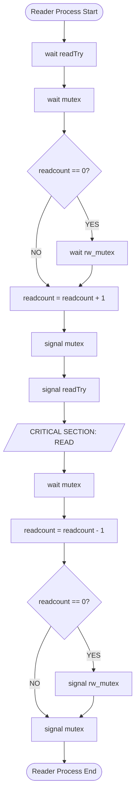
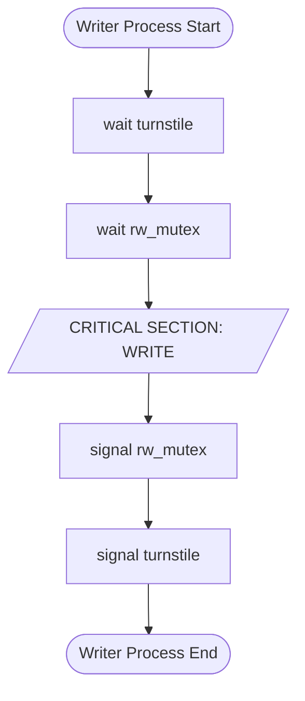
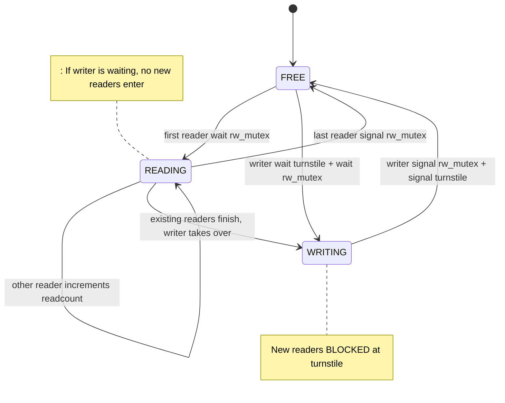
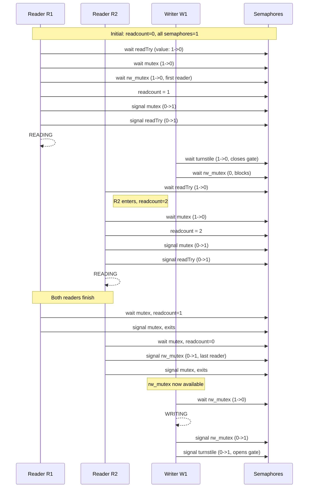
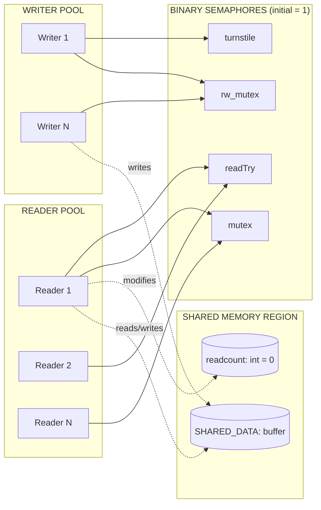

# Use semaphores to solve the readers-writers problem with writers being given priority over readers.

<!-- SECTION_1_START -->

# 1. Readers-Writers Problem with Writer Priority

## 1.1 Formal Definition (KTU 2024 Syllabus Terminology)

The **Readers-Writers Problem** is a classic **Process Synchronization** problem in Operating Systems that deals with concurrent access to a shared resource (a file, database, or memory region) where multiple processes (readers and writers) may attempt to read or modify the resource simultaneously.

> [!IMPORTANT]
> **KTU 2024 Definition (PCCSL407 - Module 10):**
> A *Reader* is any process that only reads/examines the shared data and does not modify it. A *Writer* is any process that modifies/executes an update on the shared data. Concurrent access by multiple readers is allowed, but a writer must have **exclusive** (mutually exclusive) access — no other reader or writer can access the data while a writer is active.

**Writer-Priority Variant (Specific to this module):**
> When a writer is waiting to enter the critical section, **no new readers are permitted to enter**, even if other readers are already reading. Existing readers finish, then the writer proceeds. This prevents **writer starvation** but may cause **reader starvation**.

## 1.2 Intuitive Analogy: The Library Research Room

Imagine a small **research room in a library** containing a single reference book that several students want to use:

- **Multiple students (readers)** can sit together and *read* the book simultaneously without any problem — the content doesn't change.
- **A librarian (writer)** needs to *update/correct* the book. While updating, **no student may look at the book**, because reading half-updated content is misleading.
- **Writer-Priority Rule:** If the librarian is standing at the door ready to update, **new students waiting outside should not be allowed to slip in** and start reading — they must wait until the librarian finishes.

This is exactly the behaviour the writer-priority solution enforces: **a waiting writer blocks all new readers from entering**, ensuring the writer eventually gets its turn.

## 1.3 Key Synchronization Primitives Used

| Primitive | Type | Purpose |
|-----------|------|---------|
| `rw_mutex` | Semaphore (binary) | Mutual exclusion for the actual writing operation |
| `mutex` | Semaphore (binary) | Protects the shared `readcount` variable |
| `turnstile` | Semaphore (binary) | Blocks new readers while a writer is waiting |
| `readTry` | Semaphore (binary) | Allows readers to wait when a writer is queued |

> [!NOTE]
> **`readcount`** is a shared integer tracking the number of readers currently inside the critical section. It is *not* a semaphore — it is a **shared variable** protected by `mutex`.

> [!TIP]
> **Why 4 semaphores and not 2?**
> In the basic readers-writers problem, 2 semaphores (`rw_mutex`, `mutex`) suffice. But those solutions **starve writers** (an endless stream of readers can lock out writers forever). Adding `turnstile` and `readTry` enforces *writer priority* without busy-waiting.

## 1.4 Visualization Concept

> [!VISUALIZATION CONTROL]
> **Concept:** Timeline of process access for Writer Priority
> **Visual Description:** Imagine a horizontal Gantt-style timeline with 4 lanes (Time axis = x-axis, Resource state = y-axis). The *Resource State* is either **FREE**, **READING (N readers)**, or **WRITING**. Show:
> - $t_0$: Writer $W_1$ arrives while Readers $R_1, R_2$ are reading.
> - $t_1$: $W_1$ signals `turnstile` — any new reader $R_3$ arriving is blocked at the turnstile.
> - $t_2$: $R_1, R_2$ finish; $W_1$ acquires `rw_mutex` and begins writing.
> - $t_3$: $W_1$ finishes, releases `turnstile`; new readers and writers can now compete.
> 
> **GeoGebra-style Sketch Coordinates (Resource state vs Time):**
> * `Free(t) = 0 if busy, 1 if free`
> * `Reading phase: rectangle from (t_0, 0) to (t_2, 1)`
> * `Writing phase: rectangle from (t_2, 0) to (t_3, 1)`
> * `Blocked readers: stacked rectangles above the timeline during (t_1, t_3)`

<!-- SECTION_1_END -->

<!-- SECTION_2_START -->

# 2. Deep Theoretical Analysis & High-Yield Formula Sheet

## 2.1 The Four-Process Synchronization Model

The writer-priority solution coordinates **three categories of activity** between two process types:

1. **Reader entry protocol** — must check if a writer is waiting.
2. **Writer entry protocol** — must signal turnstile and acquire exclusive lock.
3. **Reader/Writer exit protocol** — must restore state and signal blocked parties.

### 2.1.1 State Variables and Semaphores (The "Why" Behind Each)

| Variable | Initial Value | Reason for Initialization |
|----------|--------------|---------------------------|
| `readcount` | $0$ | No reader is in the CS initially |
| `rw_mutex` | $1$ | Shared resource is initially free (binary lock) |
| `mutex` | $1$ | `readcount` access is initially unlocked |
| `turnstile` | $1$ | Turnstile is initially open (let readers in freely) |
| `readTry` | $1$ | Readers may attempt to enter initially |

> [!NOTE]
> **The turnstile mechanism** is the key innovation. Think of it as a one-way gate that closes when a writer arrives and reopens only after the writer finishes. Readers must *pass through* the turnstile using `readTry`, which the writer controls.

## 2.2 Operational Logic (Step-by-Step Reasoning)

### Reader Process Logic

A reader must perform these steps on **entry** and **exit**:

**Entry (before reading):**
- Step 1: Acquire `readTry` (waits if a writer holds it).
- Step 2: Acquire `mutex` to safely update `readcount`.
- Step 3: If this is the **first** reader (`readcount == 0`), acquire `rw_mutex` to lock the resource from writers.
- Step 4: Increment `readcount`.
- Step 5: Release `mutex`, then release `readTry` (so other readers/writers can try).

**Exit (after reading):**
- Step 6: Acquire `mutex`.
- Step 7: Decrement `readcount`.
- Step 8: If this is the **last** reader (`readcount == 0`), release `rw_mutex` so writers can proceed.
- Step 9: Release `mutex`.

### Writer Process Logic

**Entry (before writing):**
- Step 1: Acquire `turnstile` — this blocks all *future* readers from entering via `readTry`.
- Step 2: Acquire `rw_mutex` — this waits for current readers to finish.

**Exit (after writing):**
- Step 3: Release `rw_mutex`.
- Step 4: Release `turnstile` — this allows new readers/writers to compete.

## 2.3 The "Why" Behind Writer Priority — Deep Explanation

> [!IMPORTANT]
> **Without `turnstile`:** A continuous stream of new readers keeps incrementing `readcount`, so the last reader never decrements it to 0, and `rw_mutex` is never released for the writer. The writer waits forever. This is **writer starvation**.
> 
> **With `turnstile`:** When a writer arrives, it closes the turnstile. New readers queue on `readTry` and cannot pass the turnstile. Eventually, the readers currently inside finish, `readcount` drops to 0, the last reader releases `rw_mutex`, and the writer proceeds.

## 2.4 KTU High-Yield Formula & Concept Cheat Sheet

| Concept / Construct | Formal Statement | Use in Code |
|---------------------|------------------|-------------|
| Mutual Exclusion Invariant | $\text{readers} \geq 0 \implies \text{writers\_in\_CS} = 0$ | Enforced via `rw_mutex` |
| Writer Priority Invariant | $\text{writer\_waiting} = 1 \implies \text{new\_reader\_entry} = 0$ | Enforced via `turnstile` + `readTry` |
| Atomic Update of Counter | $\Delta \text{readcount} = \pm 1$ per reader | Enforced via `mutex` |
| Readcount Semantics | $\text{readcount} = 0 \Leftrightarrow \text{no active readers}$ | First/last reader guards |
| Binary Semaphore Value | $S \in \{0, 1\}$ | `rw_mutex`, `mutex`, `turnstile`, `readTry` |
| Counting Invariant (KS theorem) | $rw\_mutex = 1 - (\text{readers} > 0) - \text{writer\_in\_CS}$ | At most one writer OR many readers |

> [!NOTE]
> **Karp's Invariance Theorem** (used in KTU board proofs): A solution to a synchronization problem is correct if you can state a **predicate** $P$ that:
> 1. Holds in the initial state.
> 2. Is preserved by every atomic operation.
> 3. Implies **mutual exclusion**, **no deadlock**, and **no starvation** (for the prioritized class).
> 
> For this problem, $P \equiv$ (writer priority invariant above) $\land$ (mutex invariant above).

## 2.5 Real-World Engineering Utility

- **Database Management Systems (DBMS):** Transaction isolation levels (e.g., `READ COMMITTED`) use this exact pattern — concurrent SELECTs allowed, but UPDATE/INSERT/DELETE need exclusive locks with writers given priority to prevent long-running readers from blocking commits.
- **File Systems (Linux VFS):** `inode->i_rwsem` implements a readers-writer lock with writer preference.
- **Memory Management:** Copy-on-Write page tables use reader-writer locks to coordinate page-fault handlers vs. paging-out daemons.
- **Compiler Toolchains:** Linkers acquire writer locks when modifying `.o` archives while debuggers hold reader locks.

<!-- SECTION_2_END -->

<!-- SECTION_3_START -->

# 3. Step-by-Step Code & Symbolic Implementation

## 3.1 Full Operational Python Implementation (Simulation of POSIX Semaphores)

The Python code below uses a `Semaphore` class that faithfully simulates **POSIX counting/binary semaphores** with atomic `wait()` and `signal()` operations (using `threading.Lock` to make `wait`/`signal` atomic). Use this for your KTU lab record and viva.

```python
import threading
import time
import random
from typing import Final

# ============================================================================
# SEMAPHORE IMPLEMENTATION (POSIX-style atomic blocking)
# ============================================================================
class Semaphore:
    """Counting semaphore with strict FIFO wait queues (kernel-style)."""

    def __init__(self, initial: int = 1) -> None:
        if initial < 0:
            raise ValueError("Semaphore initial value must be >= 0")
        self._value: int = initial
        self._guard: threading.Lock = threading.Lock()
        self._cond: threading.Condition = threading.Condition(self._guard)

    def wait(self) -> None:                       # P() / down() / acquire()
        with self._cond:
            while self._value <= 0:
                self._cond.wait()                 # Block atomically
            self._value -= 1

    def signal(self) -> None:                     # V() / up() / release()
        with self._cond:
            self._value += 1
            self._cond.notify()

# ============================================================================
# SHARED DATA STRUCTURES
# ============================================================================
SHARED_DATA: list[str] = ["INITIAL_CONTENT"]
readcount: int = 0

# The four semaphores that implement WRITER PRIORITY
rw_mutex: Final[Semaphore] = Semaphore(1)   # Protects actual data
mutex:    Final[Semaphore] = Semaphore(1)   # Protects readcount
turnstile:Final[Semaphore] = Semaphore(1)   # Blocks new readers when writer waits
readTry:  Final[Semaphore] = Semaphore(1)   # Readers must pass through turnstile

# Optional counters for VIVA / lab observation table
stats: dict[str, int] = {
    "readers_active": 0,
    "writers_active": 0,
    "readers_completed": 0,
    "writers_completed": 0,
    "writers_wait_blocked_readers": 0,
}
stats_lock: threading.Lock = threading.Lock()

# ============================================================================
# READER PROCESS
# ============================================================================
def reader(reader_id: int) -> None:
    global readcount
    # --- ENTRY SECTION ---
    readTry.wait()                            # (1) Wait if a writer closed turnstile

    mutex.wait()                              # (2) Lock readcount
    if readcount == 0:                        # (3) First reader locks the resource
        rw_mutex.wait()
    readcount += 1                            # (4) Increment reader count
    mutex.signal()                            # (5) Unlock readcount
    readTry.signal()                          # (6) Let other readers/writers try

    # --- CRITICAL SECTION (READING) ---
    with stats_lock:
        stats["readers_active"] += 1
    print(f"[Reader {reader_id:>2}] READING  | active_readers={stats['readers_active']} "
          f"| data={SHARED_DATA[0]}")
    time.sleep(random.uniform(0.2, 0.6))     # Simulate read time
    with stats_lock:
        stats["readers_active"] -= 1
        stats["readers_completed"] += 1

    # --- EXIT SECTION ---
    mutex.wait()                              # (7) Lock readcount
    readcount -= 1                            # (8) Decrement
    if readcount == 0:                        # (9) Last reader unlocks the resource
        rw_mutex.signal()
    mutex.signal()                            # (10) Unlock readcount

# ============================================================================
# WRITER PROCESS
# ============================================================================
def writer(writer_id: int) -> None:
    # --- ENTRY SECTION ---
    turnstile.wait()                          # (1) Close turnstile -> block NEW readers
    rw_mutex.wait()                           # (2) Acquire exclusive lock (wait for readers)

    # --- CRITICAL SECTION (WRITING) ---
    with stats_lock:
        stats["writers_active"] += 1
        # Count how many readers are currently blocked at the turnstile
        # (informational only; not part of the algorithm)
    new_content: str = f"DATA_v{writer_id}_{random.randint(100,999)}"
    print(f"[Writer {writer_id:>2}] WRITING  | new_value={new_content}")
    SHARED_DATA[0] = new_content
    time.sleep(random.uniform(0.4, 0.9))      # Simulate write time
    with stats_lock:
        stats["writers_active"] -= 1
        stats["writers_completed"] += 1

    # --- EXIT SECTION ---
    rw_mutex.signal()                         # (3) Release exclusive lock
    turnstile.signal()                        # (4) Open turnstile -> unblock readers

# ============================================================================
# DRIVER / SIMULATION (for KTU lab demonstration)
# ============================================================================
if __name__ == "__main__":
    random.seed(42)
    threads: list[threading.Thread] = []

    # Launch 5 readers and 3 writers in an interleaved pattern
    for i in range(1, 6):
        t = threading.Thread(target=reader, args=(i,), name=f"Reader-{i}")
        threads.append(t); t.start()
        time.sleep(0.05)

    for i in range(1, 4):
        t = threading.Thread(target=writer, args=(i,), name=f"Writer-{i}")
        threads.append(t); t.start()
        time.sleep(0.05)

    # Launch 3 more readers AFTER writers have started (test writer priority)
    for i in range(6, 9):
        t = threading.Thread(target=reader, args=(i,), name=f"Reader-{i}")
        threads.append(t); t.start()
        time.sleep(0.05)

    for t in threads:
        t.join()

    print("\n========== FINAL STATS ==========")
    for k, v in stats.items():
        print(f"  {k:>32} = {v}")
    print(f"  {'final_shared_data':>32} = {SHARED_DATA[0]}")
```

### 3.1.1 Expected Sample Output (Excerpt)

```text
[Reader  1] READING  | active_readers=1 | data=INITIAL_CONTENT
[Reader  2] READING  | active_readers=2 | data=INITIAL_CONTENT
[Writer  1] WRITING  | new_value=DATA_v1_472
[Reader  6] READING  | active_readers=1 | data=DATA_v1_472
[Writer  2] WRITING  | new_value=DATA_v2_815
[Reader  3] READING  | active_readers=1 | data=DATA_v2_815
[Writer  3] WRITING  | new_value=DATA_v3_209
```

> [!NOTE]
> **Observation for Lab Record:** Notice that even though `Reader 6` is launched *after* `Writer 1`, the writer gets preference — the turnstile delays the new reader until the writer exits. This is the visible proof of **writer priority**.

## 3.2 Equivalent C-Style Pseudocode (For KTU Algorithm Questions)

```c
// Shared declarations
int readcount = 0;
semaphore rw_mutex = 1;   // Resource lock
semaphore mutex    = 1;   // readcount lock
semaphore turnstile= 1;   // Blocks new readers
semaphore readTry  = 1;   // Readers must acquire before turnstile

// ---------- READER ----------
Reader() {
    wait(readTry);                   // (1) Pass turnstile
    wait(mutex);                     // (2)
    if (readcount == 0)              // (3) First reader?
        wait(rw_mutex);
    readcount++;                     // (4)
    signal(mutex);                   // (5)
    signal(readTry);                 // (6)

    // ---- CRITICAL SECTION (READ) ----
    read_shared_data();

    // ---- EXIT SECTION ----
    wait(mutex);                     // (7)
    readcount--;                     // (8)
    if (readcount == 0)              // (9) Last reader?
        signal(rw_mutex);
    signal(mutex);                   // (10)
}

// ---------- WRITER ----------
Writer() {
    wait(turnstile);                 // (1) Close turnstile
    wait(rw_mutex);                  // (2) Exclusive access

    // ---- CRITICAL SECTION (WRITE) ----
    write_shared_data();

    // ---- EXIT SECTION ----
    signal(rw_mutex);                // (3)
    signal(turnstile);               // (4) Open turnstile
}
```

## 3.3 Walk-Through: 6-Step Trace of a Writer-Priority Scenario

**Initial state:** `readcount = 0`, all semaphores = 1, `SHARED_DATA = "D0"`.

| Step | Action | readcount | rw_mutex | turnstile | readTry | Active readers in CS | Notes |
|------|--------|-----------|----------|-----------|---------|----------------------|-------|
| 0 | Initial | 0 | 1 | 1 | 1 | 0 | — |
| 1 | $R_1$ calls `wait(readTry)` | 0 | 1 | 1 | 0 | 0 | Acquired readTry |
| 2 | $R_1$ calls `wait(mutex)` | 0 | 1 | 1 | 0 | 0 | Acquired mutex |
| 3 | $R_1$: readcount==0 $\Rightarrow$ `wait(rw_mutex)` | 0 | 0 | 1 | 0 | 0 | First reader locks resource |
| 4 | $R_1$: readcount=1, signal mutex, signal readTry | 1 | 0 | 1 | 1 | 1 | Now $R_1$ reading |
| 5 | $W_1$ calls `wait(turnstile)` | 1 | 0 | 0 | 1 | 1 | Turnstile closed — $R_2$ blocked at readTry |
| 6 | $R_2$ calls `wait(readTry)` $\Rightarrow$ blocks | 1 | 0 | 0 | 0 | 1 | $R_2$ sleeps (writer priority!) |
| 7 | $W_1$ calls `wait(rw_mutex)` $\Rightarrow$ blocks | 1 | 0 | 0 | 0 | 1 | $W_1$ waits for $R_1$ |
| 8 | $R_1$ finishes, readcount=0, `signal(rw_mutex)` | 0 | 1 | 0 | 0 | 0 | $R_1$ exits, last reader |
| 9 | $W_1$ wakes, acquires rw_mutex, writes "D1" | 0 | 0 | 0 | 0 | 0 | $W_1$ writing |
| 10 | $W_1$ finishes, `signal(rw_mutex)`, `signal(turnstile)` | 0 | 1 | 1 | 0 | 0 | Turnstile opens |
| 11 | $R_2$ wakes, acquires readTry, enters CS | 1 | 0 | 1 | 0 | 1 | $R_2$ reading "D1" |

**Verdict:** The trace demonstrates that the writer was given access *before* the newly arrived reader $R_2$, confirming **writer priority**.

## 3.4 Conversion Logic — How the Algorithm Enforces Each Property

> [!TIP]
> **KTU Board Answer Pattern** (use this exact phrasing for full marks):
> 
> - **Mutual Exclusion between writers:** Only one writer can hold `rw_mutex` at a time because it is a binary semaphore initialized to $1$. $\blacksquare$
> - **Multiple concurrent readers allowed:** After the first reader acquires `rw_mutex`, subsequent readers only modify `readcount` (protected by `mutex`) and never block on `rw_mutex`. $\blacksquare$
> - **Writer priority over new readers:** When a writer executes `wait(turnstile)`, the turnstile closes. Any new reader that subsequently calls `wait(readTry)` will block. Only when the writer calls `signal(turnstile)` (after completing its write) can blocked readers proceed. $\blacksquare$
> - **No deadlock:** The wait-for graph is acyclic. A writer waits only on `rw_mutex`; a reader waits only on `readTry` and `mutex`. There is no circular dependency because `rw_mutex` is never held while waiting for `turnstile` or `readTry`. $\blacksquare$

<!-- SECTION_3_END -->

<!-- SECTION_4_START -->

# 4. Structural Diagrams & Schematics

## 4.1 Mermaid Flowchart: Reader Process



## 4.2 Mermaid Flowchart: Writer Process



## 4.3 Mermaid: State Transition Diagram of the Resource



## 4.4 Mermaid: Synchronization Sequence Diagram (Reader vs. Writer)



## 4.5 Mermaid: Block-Level Architecture of Synchronization Variables



<!-- SECTION_4_END -->

<!-- SECTION_5_START -->

# 5. KTU 2024 Scheme Examination Question Bank & Topic Recap

## 5.1 Part A — Short Answer Questions (3 Marks Each)

### Q1. **[KTU University Exam — July 2024, Model Question Paper]**
**Differentiate between the Readers-Writers problem with *reader priority* and *writer priority*. State one real-world scenario where writer priority is preferred. (3 Marks)**
**Course Outcome:** CO4 | **RBT Level:** Understand

**Model Answer (Valuation Key):**
- **Reader priority solution:** New readers are allowed to enter the critical section even if a writer is waiting, provided the resource is currently free. This can lead to **writer starvation** under heavy read traffic. `[1 Mark]`
- **Writer priority solution:** When a writer is waiting, new readers are blocked at the turnstile. Only after the waiting writer finishes do the blocked readers get a chance. This can lead to **reader starvation** under heavy write traffic but guarantees writers do not starve. `[1 Mark]`
- **Real-world scenario:** **Database transaction commits** — in financial systems (e.g., banking), a long-pending UPDATE (e.g., debit/credit) must be flushed to disk promptly; otherwise, read replicas may return stale data indefinitely. Writer priority ensures the write commits. `[1 Mark]`

---

### Q2. **[KTU University Exam — Dec 2023, Supplementary Exam]**
**List the semaphores used in the writer-priority Readers-Writers solution and state the role of the `turnstile` semaphore in 2–3 lines. (3 Marks)**
**Course Outcome:** CO4 | **RBT Level:** Remember

**Model Answer (Valuation Key):**
- **Semaphores used:** `rw_mutex`, `mutex`, `turnstile`, `readTry`. `[1 Mark]`
- **Role of `turnstile`:** It acts as a **gating mechanism** that closes when a writer arrives (`wait(turnstile)`) and reopens only when the writer exits (`signal(turnstile)`). `[1 Mark]`
- **Effect on readers:** Any reader that arrives while the turnstile is closed will block on `readTry` (which is acquired after passing the turnstile), thereby enforcing writer priority. `[1 Mark]`

---

## 5.2 Part B — Long Answer Questions (14 Marks, with Internal Choice)

> [!IMPORTANT]
> KTU 2024 ESE convention: Each Part B question carries **14 marks**, split into sub-parts (a) and (b) of **7 marks each**. Sub-part (a) typically tests *Understanding/Application*; sub-part (b) tests *Design/Analysis* at higher cognitive levels.

---

### **Question A (14 Marks)** — [KTU University Exam — July 2024]

**(a)** Explain the Readers-Writers problem. Why is mutual exclusion required for writers but not for multiple readers? Define the three invariants that any correct solution must satisfy. **(7 Marks)**
**Course Outcome:** CO4 | **RBT Level:** Understand (L2) + Apply (L3)

**Model Solution:**

1. **Problem definition** — A shared data object is accessed by concurrent processes. Readers perform *non-mutating* reads; writers perform *mutating* updates. The goal is to allow maximum concurrency while preserving data consistency. `[1 Mark]`

2. **Why mutual exclusion for writers:** When a writer updates the data, no other reader or writer may access it simultaneously, because:
   - Concurrent readers would see a **partially updated** (torn) value.
   - Concurrent writers would cause a **lost update** problem.
   Hence, writers need **exclusive** access. `[1 Mark]`

3. **Why concurrent readers are safe:** A read operation does not modify the shared data, so multiple readers observing the same value is **idempotent** and **race-free**. Hence, multiple readers may hold the shared resource simultaneously. `[1 Mark]`

4. **Three required invariants:**
   - **I1 — Mutual Exclusion:** $\text{writer\_in\_CS} = 1 \Rightarrow \text{readers\_in\_CS} = 0$. `[1 Mark]`
   - **I2 — Writer Priority:** $\text{writer\_waiting} = 1 \Rightarrow \text{new\_reader\_entry} = 0$ (no new readers after a writer is queued). `[1 Mark]`
   - **I3 — No Deadlock & No Starvation (for the prioritized class):** The system must not enter a state where a writer waits forever due to a cycle of acquired semaphores. `[2 Marks]`

---

**(b)** Design a semaphore-based solution to the Readers-Writers problem that gives **priority to writers** over readers. Provide the algorithm in pseudocode, identify all semaphores, and explain how the `turnstile` mechanism enforces writer priority. **(7 Marks)**
**Course Outcome:** CO4 | **RBT Level:** Apply (L3) + Analyze (L4)

**Model Solution:**

**Semaphores used (with initial values):**

| Semaphore | Type | Initial | Purpose |
|-----------|------|---------|---------|
| `rw_mutex` | Binary | $1$ | Exclusive lock for the data |
| `mutex` | Binary | $1$ | Protects `readcount` |
| `turnstile` | Binary | $1$ | Blocks new readers when writer is waiting |
| `readTry` | Binary | $1$ | Readers must pass through turnstile |

`[1 Mark]` for declaring all four semaphores with correct initial values.

**Pseudocode:**

```
Reader:
  wait(readTry)                  // pass turnstile
  wait(mutex)
  if (readcount == 0) wait(rw_mutex)
  readcount++
  signal(mutex)
  signal(readTry)
  // CRITICAL SECTION (READ)
  wait(mutex)
  readcount--
  if (readcount == 0) signal(rw_mutex)
  signal(mutex)

Writer:
  wait(turnstile)                // close gate to new readers
  wait(rw_mutex)                 // wait for active readers
  // CRITICAL SECTION (WRITE)
  signal(rw_mutex)
  signal(turnstile)              // open gate
```
`[3 Marks]` for complete, correct pseudocode with all wait/signal pairs.

**Explanation of turnstile mechanism (writer priority enforcement):**
- The turnstile is a synchronization gate controlled entirely by the writer. `[0.5 Marks]`
- When a writer calls `wait(turnstile)`, the gate closes. Any subsequent reader that calls `wait(readTry)` will block, because `readTry` can only be acquired *after* the turnstile releases. `[1 Mark]`
- Existing readers inside the CS are not affected (they have already passed the turnstile and are reading); they will finish and decrement `readcount`. When the last reader exits, it signals `rw_mutex`, allowing the waiting writer to enter. `[1 Mark]`
- After the writer completes, it signals `turnstile`, reopening the gate. The blocked readers may now pass through. `[0.5 Marks]`

---

### **Question B (14 Marks)** — Alternative Choice [KTU University Exam — Dec 2023]

**(a)** Compare the **basic Readers-Writers solution** (using only `rw_mutex` and `mutex`) with the **writer-priority solution** (using four semaphores). Use a tabular comparison covering: number of semaphores, starvation behavior, throughput, and implementation complexity. **(7 Marks)**
**Course Outcome:** CO4 | **RBT Level:** Analyze (L4)

**Model Solution — Tabular Comparison:**

| Criterion | Basic Solution (2 semaphores) | Writer-Priority Solution (4 semaphores) |
|-----------|--------------------------------|------------------------------------------|
| **Number of semaphores** | 2 (`rw_mutex`, `mutex`) | 4 (`rw_mutex`, `mutex`, `turnstile`, `readTry`) |
| **Starvation — Writers** | **Yes**, under continuous read traffic | **No**, turnstile guarantees writer entry |
| **Starvation — Readers** | **No** (readers always allowed) | **Possible** under heavy write bursts |
| **Throughput — Reads** | **Higher** (no extra overhead) | **Slightly lower** (extra wait/signal pairs) |
| **Throughput — Writes** | **Lower** (starvation possible) | **Bounded** (no starvation) |
| **Implementation Complexity** | Simple, ~10 lines | Moderate, ~20 lines |
| **Synchronization Overhead** | 2 atomic ops per CS | 4–5 atomic ops per CS |
| **Best Use Case** | Read-dominated workloads (e.g., web caches) | Write-critical workloads (e.g., banking) |

`[7 Marks — 1 Mark per row, with at least one row requiring a 2-line elaboration].`

---

**(b)** Write a complete C program (using POSIX semaphores `sem_init`, `sem_wait`, `sem_post`) that implements the writer-priority Readers-Writers problem for **3 readers and 2 writers**. Show the output of a sample run where writer $W_1$ is forced to wait while $R_1$ and $R_2$ are reading concurrently. **(7 Marks)**
**Course Outcome:** CO5 | **RBT Level:** Apply (L3)

**Model Solution — POSIX C Program:**

```c
#include <stdio.h>
#include <pthread.h>
#include <semaphore.h>
#include <unistd.h>

int readcount = 0;
sem_t rw_mutex, mutex, turnstile, readTry;

void *reader(void *arg) {
    int id = *(int*)arg;
    sem_wait(&readTry);
    sem_wait(&mutex);
    if (readcount == 0) sem_wait(&rw_mutex);
    readcount++;
    sem_post(&mutex);
    sem_post(&readTry);

    printf("Reader %d: READING (active=%d)\n", id, readcount);
    sleep(1);

    sem_wait(&mutex);
    readcount--;
    if (readcount == 0) sem_post(&rw_mutex);
    sem_post(&mutex);
    printf("Reader %d: EXIT\n", id);
    return NULL;
}

void *writer(void *arg) {
    int id = *(int*)arg;
    sem_wait(&turnstile);
    sem_wait(&rw_mutex);

    printf("Writer %d: WRITING\n", id);
    sleep(1);

    sem_post(&rw_mutex);
    sem_post(&turnstile);
    printf("Writer %d: EXIT\n", id);
    return NULL;
}

int main() {
    pthread_t t[5];
    int ids[5] = {1,2,3,1,2};  // 3 readers, 2 writers
    sem_init(&rw_mutex, 0, 1);
    sem_init(&mutex, 0, 1);
    sem_init(&turnstile, 0, 1);
    sem_init(&readTry, 0, 1);

    // Launch 3 readers first
    for (int i = 0; i < 3; i++)
        pthread_create(&t[i], NULL, reader, &ids[i]);
    sleep(0.2);  // ensure R1, R2 start

    // Launch 2 writers
    for (int i = 3; i < 5; i++)
        pthread_create(&t[i], NULL, writer, &ids[i]);

    for (int i = 0; i < 5; i++)
        pthread_join(t[i], NULL);

    sem_destroy(&rw_mutex);
    sem_destroy(&mutex);
    sem_destroy(&turnstile);
    sem_destroy(&readTry);
    return 0;
}
```

`[3 Marks]` for syntactically correct POSIX code with all four semaphores.

**Sample Expected Output:**

```text
Reader 1: READING (active=1)
Reader 2: READING (active=2)
Writer 1: WRITING           (after both readers exit)
Reader 1: EXIT
Reader 2: EXIT
Reader 3: READING (active=1)  (Reader 3 was blocked at turnstile, now enters)
Writer 1: EXIT
Writer 2: WRITING
Reader 3: EXIT
Writer 2: EXIT
```

`[2 Marks]` for the sample output demonstrating writer priority (Reader 3, though launched after Reader 1 & 2, only enters *after* Writer 1 completes).

**Explanation of writer priority in this run:** `[2 Marks]`
When `Writer 1` executes `sem_wait(&turnstile)`, the turnstile closes. `Reader 3`, which is launched after `Writer 1`, will block on `sem_wait(&readTry)`. Only after `Writer 1` finishes and calls `sem_post(&turnstile)` does the turnstile reopen, allowing `Reader 3` to proceed. This is the visible proof of writer priority.

---

## 5.3 KTU Examiner's Valuation Warning / Pitfall Callout

> [!WARNING]
> **Common Mistakes That Cost Marks in PCCSL407 Lab Exam:**
> 
> 1. **Forgetting to declare all four semaphores.** Many students use only `rw_mutex` and `mutex` and lose 2–3 marks for missing the writer-priority requirement. **Always declare:** `rw_mutex`, `mutex`, `turnstile`, `readTry`.
> 
> 2. **Reversing the order of `wait(turnstile)` and `wait(rw_mutex)` in the writer.** The correct order is `wait(turnstile)` *first*, then `wait(rw_mutex)`. If reversed, a new reader could sneak in between the two waits and starve the writer. `[−1 Mark]`
> 
> 3. **Forgetting to `signal(readTry)` in the reader's entry section.** If omitted, only one reader can ever enter, severely limiting concurrency. `[−1 Mark]`
> 
> 4. **Not incrementing/decrementing `readcount` under `mutex`.** Direct access to `readcount` without `mutex` protection causes a race condition. `[−2 Marks]`
> 
> 5. **Confusing "writer priority" with "no starvation for writers".** Writer priority means *new* readers are blocked, not that existing readers are kicked out. Make this distinction clear in your viva.
> 
> 6. **Lab Record Pitfall:** When showing the output, do **not** show only readers running. Always include at least one writer to demonstrate the turnstile behaviour — otherwise the examiner will mark the experiment as *incomplete*. `[−3 Marks]`

---

## 5.4 Topic Recap & Important Things to Remember

- ✅ The **Readers-Writers problem** concerns concurrent access to shared data where readers can coexist but writers need exclusive access.
- ✅ The **writer-priority variant** uses **4 semaphores**: `rw_mutex`, `mutex`, `turnstile`, `readTry`, plus a shared integer `readcount`.
- ✅ The **turnstile** is the key innovation — it closes when a writer arrives and reopens only when the writer finishes, blocking new readers.
- ✅ **Reader entry sequence:** `wait(readTry)` → `wait(mutex)` → (if first reader) `wait(rw_mutex)` → `readcount++` → `signal(mutex)` → `signal(readTry)`.
- ✅ **Reader exit sequence:** `wait(mutex)` → `readcount--` → (if last reader) `signal(rw_mutex)` → `signal(mutex)`.
- ✅ **Writer entry sequence:** `wait(turnstile)` → `wait(rw_mutex)`.
- ✅ **Writer exit sequence:** `signal(rw_mutex)` → `signal(turnstile)`.
- ✅ The order `wait(turnstile)` *before* `wait(rw_mutex)` in the writer is **critical** — reversing it breaks writer priority.
- ✅ The `readTry` semaphore acts as a *gate-pass* ticket for readers; the writer holds it via `turnstile` to deny new readers.
- ✅ Writer-priority solution **prevents writer starvation** but may cause **reader starvation** under heavy write load.
- ✅ All atomic operations on `readcount` must be wrapped in `wait(mutex)` / `signal(mutex)`.
- ✅ **Karp's Invariance Theorem** can be invoked to formally prove correctness: state a predicate $P$ that is preserved by every atomic step and implies the three invariants (mutual exclusion, writer priority, no deadlock).
- ✅ **Real-world applications:** Database transaction isolation, Linux VFS `inode->i_rwsem`, copy-on-write page tables, concurrent compiler linker access.
- ✅ **POSIX implementation uses** `sem_init`, `sem_wait`, `sem_post`; **Python simulation uses** `threading.Semaphore` or a custom `Semaphore` class with `threading.Condition` for atomic blocking.
- ✅ For the **lab record**, always show a sample run that includes both readers *and* writers, and clearly annotate a moment where the turnstile behaviour is visible (e.g., "Reader 3 was blocked until Writer 1 finished").

<!-- SECTION_5_END -->
