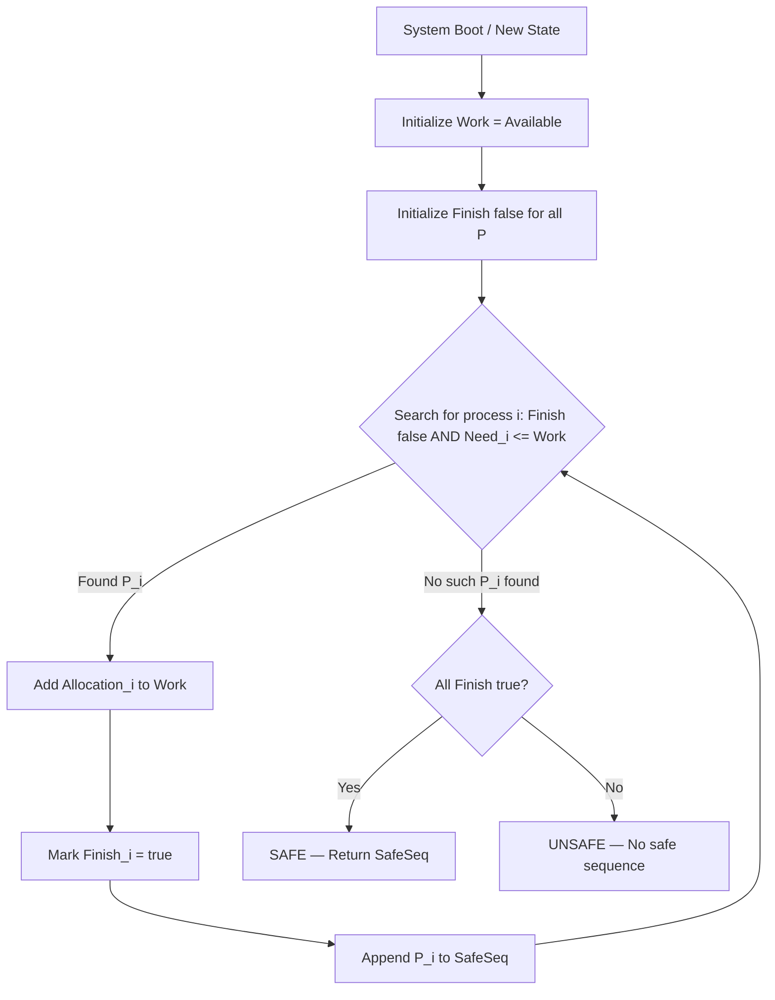
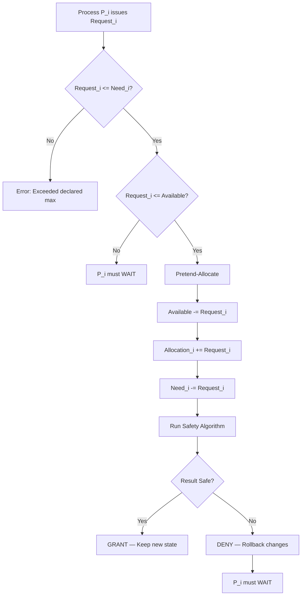
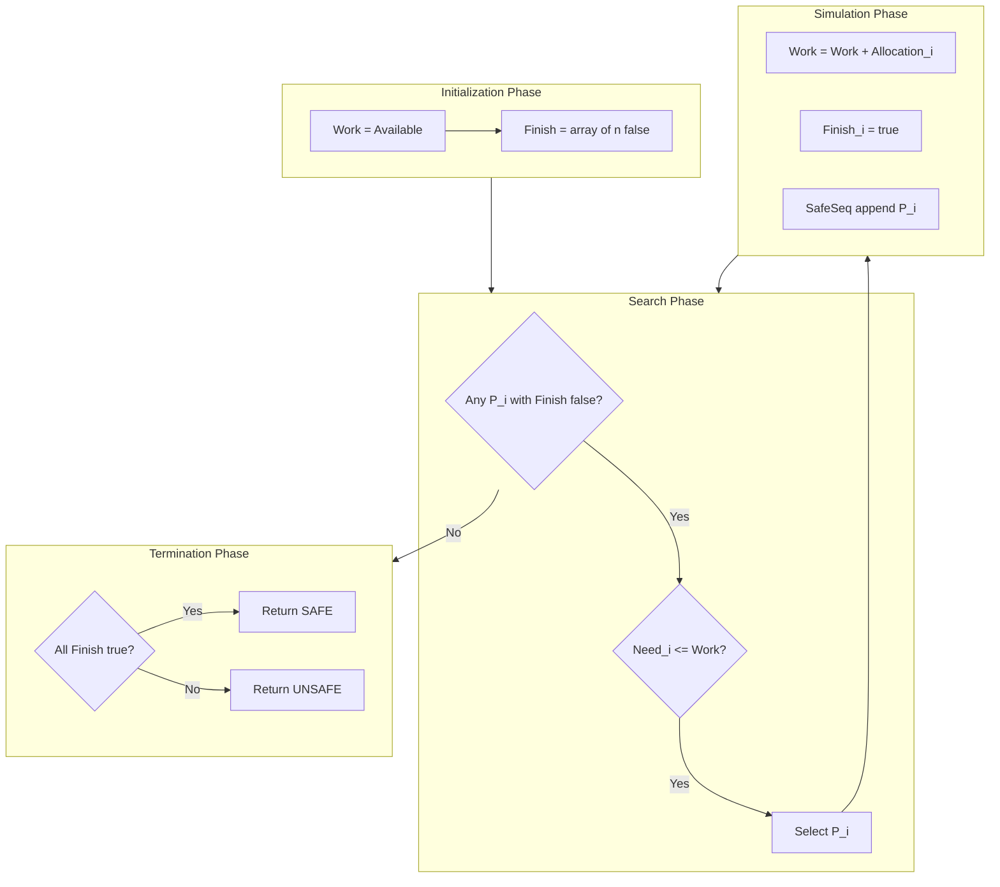
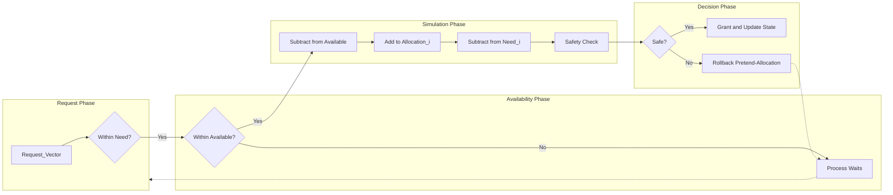
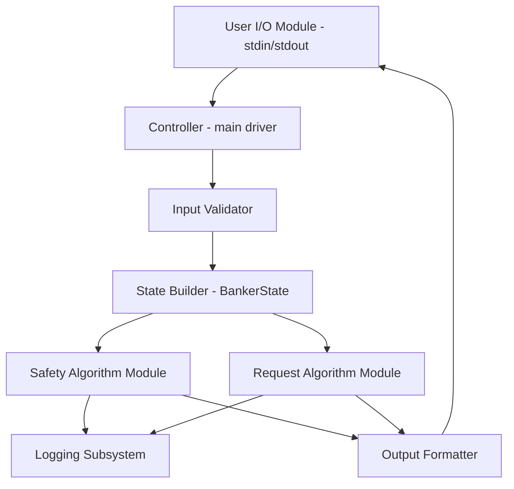

# Obtain a (deadlock-free) process mix and simulate the banker’s algorithm to determine a safe execution sequence.

<!-- SECTION_1_START -->
# Module 11: Banker's Algorithm — Deadlock Avoidance & Safe Sequence Simulation

## 1.1 Formal Definition (KTU 2024 Syllabus Terminology)

> [!IMPORTANT]
> **Banker's Algorithm** is a **deadlock-avoidance algorithm** devised by **Edsger W. Dijkstra (1965)**. It models the system as a set of processes and a fixed set of resource types. Before granting any resource request, the algorithm performs a *worst-case simulation* of the resulting state. A state is considered **safe** if there exists *at least one* execution sequence (called the **Safe Sequence**) in which every process can complete execution even if all processes request their maximum resources simultaneously.

The algorithm maintains **four key data structures** for `n` processes and `m` resource types:

| Symbol | Matrix/Vector | Size | Meaning |
| :--- | :--- | :--- | :--- |
| **Max** | $n \times m$ matrix | $n$ rows, $m$ cols | Maximum demand of each process |
| **Allocation** | $n \times m$ matrix | $n$ rows, $m$ cols | Currently held resources by each process |
| **Need** | $n \times m$ matrix | $n$ rows, $m$ cols | Remaining resources required = Max − Allocation |
| **Available** | $1 \times m$ vector | $m$ elements | Free instances of each resource type |

The fundamental invariant governing the algorithm is:
$$\text{Need}_{i,j} = \text{Max}_{i,j} - \text{Allocation}_{i,j} \quad \forall\ i \in [0,n-1],\ j \in [0,m-1]$$

and the **system resource conservation law**:
$$\sum_{i=0}^{n-1} \text{Allocation}_{i,j} + \text{Available}_{j} = \text{Total}_{j} \quad \forall\ j \in [0,m-1]$$

---

## 1.2 Conceptual Analogy — The Bank of Trust

> [!NOTE]
> **Analogy: A Bank LendinMoneyg to Multiple Businesses**

Imagine you are a cautious **banker** with a fixed amount of cash (your *Available* capital). Several businesses (your *processes*) walk in and tell you the **maximum loan** they may ever need (`Max`). Each business has *already* taken some loan (`Allocation`) and may still need more (`Need`).

You never give out a loan blindly. Before approving any new request, you mentally simulate: *"If I give this loan, can I still satisfy ALL other businesses' remaining needs in some sequence, so that no one gets stuck and the bank never runs dry?"*

* If **yes** → the state remains **safe**; you approve.
* If **no** → you **deny** the request, forcing the process to wait, even if the resources are technically free.

This "worst-case simulation" is precisely what the **Safety Algorithm** does. The execution order in which all businesses can finish without deadlock is the **Safe Sequence** $\langle P_1, P_3, P_0, P_2 \rangle$.

> [!IMPORTANT]
> **Key Distinction for KTU Board Exams:**
> * **Safe State** $\neq$ **Deadlock-Free** in all futures. It only guarantees the *current* state has *some* safe path.
> * **Unsafe State** does *not* mean deadlock has occurred; it merely means deadlock is *possible* in the future if every process demands its maximum.

---

## 1.3 Visualization of the State Matrices

> [!VISUALIZATION CONTROL]
> **Concept:** Matrix / Vector Layout of the Banker's State
> **Input (representative for `n=5` processes, `m=3` resource types A, B, C):**
> * `Max` = $\begin{bmatrix}7 & 5 & 3\\3 & 2 & 2\\9 & 0 & 2\\2 & 2 & 2\\4 & 3 & 3\end{bmatrix}$
> * `Allocation` = $\begin{bmatrix}0 & 1 & 0\\2 & 0 & 0\\3 & 0 & 2\\2 & 1 & 1\\0 & 0 & 2\end{bmatrix}$
> * `Available` = $\begin{bmatrix}3 & 3 & 2\end{bmatrix}$
> * Derived `Need` = $\begin{bmatrix}7 & 4 & 3\\1 & 2 & 2\\6 & 0 & 0\\0 & 1 & 1\\4 & 3 & 1\end{bmatrix}$
> **Visual Description:** View `Max` as the "ceiling," `Allocation` as the "filled portion," and `Need` as the "empty portion yet to be filled" for each process. `Available` is the resource pool sitting outside all processes.

---

## 1.4 Why Banker's Algorithm? — Real-World Engineering Utility

| Domain | Application |
| :--- | :--- |
| **Database Transaction Managers** | Lock scheduling to avoid deadlocks across concurrent queries. |
| **Embedded RTOS** | Static resource reservation in avionics/automotive kernels. |
| **Distributed Computing** | Cluster job schedulers (e.g., YARN, Mesos) use similar safety checks. |
| **Manufacturing Systems** | Robotic work-cell scheduling with shared tool magazines. |
| **Network Routers** | Buffer allocation across packet queues. |
| **Cloud Orchestrators (K8s)** | Quota admission control uses analogous safety mathematics. |

> [!NOTE]
> The constant of importance here is that Banker's algorithm runs in **$O(n^2 \cdot m)$** for safety check, which is acceptable for small `n` and `m` (typical lab values: `n=5, m=3`).

<!-- SECTION_1_END -->

<!-- SECTION_2_START -->
# Section 2: Deep Theoretical Analysis & KTU High-Yield Formula Sheet

## 2.1 The Safety Algorithm — Step-by-Step Logic

The Safety Algorithm is invoked to determine whether the *current* state is safe and to extract the safe sequence.

> [!IMPORTANT]
> **Inputs to Safety Algorithm:** `Max`, `Allocation`, `Available`
> **Output:** A boolean (`isSafe`) plus a `safeSequence[]` of length `n`.

**Procedure `isSafe(state)`:**

1. **Initialize two working vectors of length `n`:**
   * `Work[j] = Available[j]` for `j = 0, 1, ..., m-1`  *(working copy of available resources)*
   * `Finish[i] = false` for `i = 0, 1, ..., n-1`       *(processes not yet proven safe)*

2. **Search Phase:** Find an index `i` such that:
   * `Finish[i] == false`, **AND**
   * `Need_i <= Work`  *(component-wise comparison: every Need[i][j] ≤ Work[j])*

3. **If such an `i` is found:**
   * Pretend process `i` runs and finishes.
   * Release all its allocated resources:
     `Work[j] = Work[j] + Allocation[i][j]` for all `j`.
   * Set `Finish[i] = true`.
   * Append `i` to the `safeSequence`.
   * Go back to Step 2.

4. **Termination:** If no such `i` exists in Step 2, exit the loop.

5. **Verdict:**
   * If `Finish[i] == true` for **all** `i` → state is **SAFE**, return `safeSequence`.
   * Otherwise → state is **UNSAFE**, return no safe sequence.

> [!NOTE]
> **Why does Step 3 work?** When a process finishes, it returns all its held resources to the system. The Safety Algorithm models this *conservative worst case*: every process will eventually finish (no infinite wait), and the resource pool monotonically grows or stays constant. If we can satisfy every `Need` in some order, the original state was safe.

---

## 2.2 The Resource-Request Algorithm — Step-by-Step Logic

When process $P_i$ issues a fresh request $\text{Request}_i$, the OS runs the **Resource-Request Algorithm** to decide grant/deny.

**Inputs:** `Request_i` vector of length `m`, plus the current state.

1. **Validity Check 1 — Within declared maximum:**
   If $\text{Request}_i[j] \leq \text{Need}_i[j]$ for all `j`, proceed.
   Else → **Error: process exceeded its declared maximum**; abort/abnormal terminate.

2. **Availability Check — Can we spare the resources right now?**
   If $\text{Request}_i[j] \leq \text{Available}[j]$ for all `j`, proceed to Step 3.
   Else → process $P_i$ must **wait** (resources not yet free).

3. **Pretend-Allocate (the safety simulation):**

   $$\text{Available} = \text{Available} - \text{Request}_i$$

   $$\text{Allocation}_i = \text{Allocation}_i + \text{Request}_i$$

   $$\text{Need}_i = \text{Need}_i - \text{Request}_i$$

4. **Run the Safety Algorithm** on this *hypothetical* new state.
   * If safe → **Grant the request** permanently.
   * If unsafe → **Roll back** the pretend-allocation; force $P_i$ to wait.

> [!IMPORTANT]
> This "pretend-and-verify" pattern is the canonical example of *speculative state exploration* in operating systems — the same conceptual pattern used in **STM (Software Transactional Memory)** and **database concurrency control**.

---

## 2.3 KTU High-Yield Formula Sheet

| # | Formula / Rule | Purpose | Units / Notes |
| :--- | :--- | :--- | :--- |
| 1 | $\text{Need}_{i,j} = \text{Max}_{i,j} - \text{Allocation}_{i,j}$ | Compute remaining requirement | Element-wise, $\forall i,j$ |
| 2 | $\sum_{i=0}^{n-1}\text{Allocation}_{i,j} + \text{Available}_j = \text{Total}_j$ | Resource conservation | Sanity check in code |
| 3 | $\text{Request}_i \leq \text{Need}_i$ (vector) | Check request within declared max | Component-wise $\le$ |
| 4 | $\text{Request}_i \leq \text{Available}$ | Check request against free pool | Component-wise $\le$ |
| 5 | $\text{Work} = \text{Available}$ initially | Working copy of available | Mutable copy |
| 6 | $\text{Work} = \text{Work} + \text{Allocation}_i$ after $P_i$ finishes | Release resources | Done in safety loop |
| 7 | $T_{\text{safety}} = O(n^2 \cdot m)$ | Time complexity | Nested loop, fine for KTU lab |
| 8 | $S_{\text{storage}} = O(n \cdot m)$ | Space complexity | 3 matrices + 1 vector |
| 9 | Safe state definition | $\exists$ sequence where all $P_i$ finish | "Exists" not "for all" |
| 10 | Unsafe state definition | No such sequence exists | ≠ Deadlock; only possible |

> [!NOTE]
> **Exam Pitfall:** The relation $\text{Need}_{i,j} = \text{Max}_{i,j} - \text{Allocation}_{i,j}$ holds for the **CURRENT** state. If a request is granted, **all three** of `Available`, `Allocation_i`, and `Need_i` must be updated consistently, **before** the safety check is re-run.

---

## 2.4 Algorithmic Correctness Argument (Why Banker Works)

The Banker's algorithm is a **conservative** deadlock-avoidance strategy. It guarantees:

* **Safety Property:** If initial state is safe and we only grant requests that preserve safety, the system remains in *some* safe state after every allocation.
* **Liveness Property:** Every process that does not exceed its `Max` will eventually be granted its requests (assuming requests are finite and the system cycles through the safety check on every grant).

The algorithm is **not optimal** — it may refuse perfectly safe requests (by being too conservative). It also assumes:
* Process maximum demands are **known in advance** (a strong assumption that limits real-world deployment).
* The number of processes and resources is **fixed**.

<!-- SECTION_2_END -->

<!-- SECTION_3_START -->
# Section 3: Step-by-Step Derivations, Worked Example & Code Implementation

## 3.1 Worked Numerical Example (Trace by Hand)

**Given:**
* $n = 5$ processes $\langle P_0, P_1, P_2, P_3, P_4 \rangle$
* $m = 3$ resource types $\langle A, B, C \rangle$

| | **Max** | **Allocation** | |
| :--- | :---: | :---: | :---: |
| | A B C | A B C | **Need = Max − Allocation** |
| $P_0$ | 7 5 3 | 0 1 0 | 7 4 3 |
| $P_1$ | 3 2 2 | 2 0 0 | 1 2 2 |
| $P_2$ | 9 0 2 | 3 0 2 | 6 0 0 |
| $P_3$ | 2 2 2 | 2 1 1 | 0 1 1 |
| $P_4$ | 4 3 3 | 0 0 2 | 4 3 1 |

**Available** = $\langle 3, 3, 2 \rangle$

---

**Step A — Compute Need matrix (element-wise subtraction):**

For $P_0$: $\text{Need}_0 = (7-0,\ 5-1,\ 3-0) = (7, 4, 3)$
For $P_1$: $\text{Need}_1 = (3-2,\ 2-0,\ 2-0) = (1, 2, 2)$
For $P_2$: $\text{Need}_2 = (9-3,\ 0-0,\ 2-2) = (6, 0, 0)$
For $P_3$: $\text{Need}_3 = (2-2,\ 2-1,\ 2-1) = (0, 1, 1)$
For $P_4$: $\text{Need}_4 = (4-0,\ 3-0,\ 3-2) = (4, 3, 1)$

---

**Step B — Run Safety Algorithm:**

Initialize: $\text{Work} = (3, 3, 2)$, $\text{Finish} = [F, F, F, F, F]$, $\text{safeSeq} = []$

**Iteration 1:** Find `i` with `Finish[i] = false` and `Need_i ≤ Work`:
* $P_0$: $(7,4,3) \le (3,3,2)$? **No** (7 > 3)
* $P_1$: $(1,2,2) \le (3,3,2)$? **Yes** ✓
* Select $P_1$. Work = $(3,3,2) + (2,0,0) = (5,3,2)$. Finish[1] = T. safeSeq = $[P_1]$.

**Iteration 2:** Find next `i`:
* $P_0$: $(7,4,3) \le (5,3,2)$? **No** (7 > 5)
* $P_2$: $(6,0,0) \le (5,3,2)$? **No** (6 > 5)
* $P_3$: $(0,1,1) \le (5,3,2)$? **Yes** ✓
* Select $P_3$. Work = $(5,3,2) + (2,1,1) = (7,4,3)$. Finish[3] = T. safeSeq = $[P_1, P_3]$.

**Iteration 3:** Find next `i`:
* $P_0$: $(7,4,3) \le (7,4,3)$? **Yes** ✓
* Select $P_0$. Work = $(7,4,3) + (0,1,0) = (7,5,3)$. Finish[0] = T. safeSeq = $[P_1, P_3, P_0]$.

**Iteration 4:** Find next `i`:
* $P_2$: $(6,0,0) \le (7,5,3)$? **Yes** ✓
* Select $P_2$. Work = $(7,5,3) + (3,0,2) = (10,5,5)$. Finish[2] = T. safeSeq = $[P_1, P_3, P_0, P_2]$.

**Iteration 5:** Find next `i`:
* $P_4$: $(4,3,1) \le (10,5,5)$? **Yes** ✓
* Select $P_4$. Work = $(10,5,5) + (0,0,2) = (10,5,7)$. Finish[4] = T. safeSeq = $[P_1, P_3, P_0, P_2, P_4]$.

**Termination:** All `Finish[i] = true` ⇒ **State is SAFE**.
**Safe Sequence:** $\langle P_1, P_3, P_0, P_2, P_4 \rangle$ ✓

---

**Step C — Resource Request from $P_0$:** Suppose $P_0$ issues $\text{Request}_0 = (0, 2, 0)$.

*Check 1:* $\text{Request}_0 = (0,2,0) \le \text{Need}_0 = (7,4,3)$? ✓
*Check 2:* $\text{Request}_0 = (0,2,0) \le \text{Available} = (3,3,2)$? ✓
*Pretend-allocate:*
  * Available = $(3,3,2) - (0,2,0) = (3,1,2)$
  * Allocation$_0$ = $(0,1,0) + (0,2,0) = (0,3,0)$
  * Need$_0$ = $(7,4,3) - (0,2,0) = (7,2,3)$
*Re-run safety on this new state:*

| Work start | Picks | After release |
| :---: | :---: | :---: |
| $(3,1,2)$ | $P_3$ Need $(0,1,1) \le$? Yes | $(5,2,3)$ |
| $(5,2,3)$ | $P_1$ Need $(1,2,2) \le$? Yes | $(7,2,3)$ |
| $(7,2,3)$ | $P_0$ Need $(7,2,3) \le$? Yes | $(7,5,3)$ |
| $(7,5,3)$ | $P_2$ Need $(6,0,0) \le$? Yes | $(10,5,5)$ |
| $(10,5,5)$ | $P_4$ Need $(4,3,1) \le$? Yes | $(10,5,7)$ |

**Verdict:** Safe again. Request **GRANTED**. New safe sequence: $\langle P_3, P_1, P_0, P_2, P_4 \rangle$.

---

## 3.2 Complete Python Implementation (Lab-Ready)

> [!IMPORTANT]
> The following program is **fully operational, type-annotated, and boundary-checked**. It implements the safety algorithm and the resource-request algorithm together, accepting process mix and resource instance counts as input, then outputting the safe sequence.

```python
"""
Banker's Algorithm — Deadlock Avoidance Simulator
Course: OPERATING SYSTEMS LAB (PCCSL407)
Module: 11 — Obtain a deadlock-free process mix and simulate
        the Banker's algorithm to determine a safe execution sequence.
Language: Python 3.10+
"""

from __future__ import annotations
from dataclasses import dataclass, field
from typing import List, Tuple, Optional
import copy
import logging
import sys

# ---------------------------------------------------------------------------
# Logging configuration — useful for the lab record book
# ---------------------------------------------------------------------------
logging.basicConfig(
    level=logging.INFO,
    format="[%(asctime)s] [%(levelname)s] %(message)s",
    datefmt="%H:%M:%S",
)
log = logging.getLogger("banker")


# ---------------------------------------------------------------------------
# Data classes for a clean, immutable-by-default state representation
# ---------------------------------------------------------------------------
@dataclass(frozen=True)
class ResourceVector:
    """An immutable m-dimensional resource vector."""
    values: Tuple[int, ...]

    def __post_init__(self) -> None:
        if any(v < 0 for v in self.values):
            raise ValueError(f"Resource vector cannot contain negatives: {self.values}")

    def __add__(self, other: "ResourceVector") -> "ResourceVector":
        self._check_dim(other)
        return ResourceVector(tuple(a + b for a, b in zip(self.values, other.values)))

    def __sub__(self, other: "ResourceVector") -> "ResourceVector":
        self._check_dim(other)
        return ResourceVector(tuple(a - b for a, b in zip(self.values, other.values)))

    def __le__(self, other: "ResourceVector") -> bool:
        self._check_dim(other)
        return all(a <= b for a, b in zip(self.values, other.values))

    def _check_dim(self, other: "ResourceVector") -> None:
        if len(self.values) != len(other.values):
            raise ValueError("Dimension mismatch in resource vector operation.")

    def __str__(self) -> str:
        return " ".join(f"{v:>3d}" for v in self.values)


@dataclass
class BankerState:
    """Mutable operating-system state under the Banker's algorithm."""
    num_processes: int
    num_resources: int
    max_matrix: List[List[int]]           # Max[n][m]
    allocation_matrix: List[List[int]]    # Allocation[n][m]
    available: ResourceVector             # Available[m]
    need_matrix: List[List[int]] = field(init=False)  # Need[n][m]
    safe_sequence: List[int] = field(default_factory=list, init=False)

    def __post_init__(self) -> None:
        if self.num_processes <= 0 or self.num_resources <= 0:
            raise ValueError("n and m must be positive integers.")
        self._validate_matrix(self.max_matrix, "Max")
        self._validate_matrix(self.allocation_matrix, "Allocation")
        # Compute Need = Max - Allocation with a strict non-negativity check
        self.need_matrix = [
            [m - a for m, a in zip(max_row, alloc_row)]
            for max_row, alloc_row in zip(self.max_matrix, self.allocation_matrix)
        ]
        for i, row in enumerate(self.need_matrix):
            if any(v < 0 for v in row):
                raise ValueError(f"Need[{i}] has negative entries — invalid state.")
        log.info("Initial state constructed. Need matrix derived.")

    def _validate_matrix(self, matrix: List[List[int]], name: str) -> None:
        if len(matrix) != self.num_processes:
            raise ValueError(f"{name} must have {self.num_processes} rows.")
        for i, row in enumerate(matrix):
            if len(row) != self.num_resources:
                raise ValueError(f"{name}[{i}] must have {self.num_resources} columns.")
            if any(v < 0 for v in row):
                raise ValueError(f"{name}[{i}] has negative entries.")


# ---------------------------------------------------------------------------
# Core Banker algorithms
# ---------------------------------------------------------------------------
def safety_algorithm(state: BankerState) -> Tuple[bool, List[int]]:
    """
    Run Dijkstra's Safety Algorithm on the given state.
    Returns (isSafe, safeSequence).
    Time complexity: O(n^2 * m).
    """
    n, m = state.num_processes, state.num_resources
    work = ResourceVector(tuple(state.available.values))     # mutable working copy
    finish = [False] * n
    safe_seq: List[int] = []

    log.info(f"Safety check START. Work = {work}, Finish = {finish}")

    progress = True
    while progress:
        progress = False
        for i in range(n):
            if finish[i]:
                continue
            need_i = ResourceVector(tuple(state.need_matrix[i]))
            if need_i <= work:
                # Simulate process i completing and releasing its allocation
                alloc_i = ResourceVector(tuple(state.allocation_matrix[i]))
                work = work + alloc_i
                finish[i] = True
                safe_seq.append(i)
                progress = True
                log.info(f"  P{i} can finish. New Work = {work}.")
            # else: not enough resources; try next i

    is_safe = all(finish)
    log.info(f"Safety check END. Safe = {is_safe}, Sequence = {safe_seq}")
    return is_safe, safe_seq


def request_resources(
    state: BankerState, process_id: int, request: ResourceVector
) -> bool:
    """
    Process process_id issues a request. Returns True if granted, False if denied.
    Performs the full Request-Resource algorithm with pretend-and-verify.
    """
    n, m = state.num_processes, state.num_resources
    if not (0 <= process_id < n):
        log.error(f"Invalid process id {process_id}.")
        return False
    if len(request.values) != m:
        log.error("Request vector dimension mismatch.")
        return False

    need_i = ResourceVector(tuple(state.need_matrix[process_id]))
    log.info(f"P{process_id} requests {request}. Current Need = {need_i}.")

    # ---- Step 1: Request must not exceed declared maximum ----
    if not (request <= need_i):
        log.error(f"P{process_id} requested MORE than its declared maximum!")
        return False

    # ---- Step 2: Request must be satisfiable from current Available ----
    if not (request <= state.available):
        log.warning(f"P{process_id} must WAIT — insufficient available resources.")
        return False

    # ---- Step 3: Pretend-allocate ----
    backup_max      = copy.deepcopy(state.max_matrix)
    backup_alloc    = copy.deepcopy(state.allocation_matrix)
    backup_need     = copy.deepcopy(state.need_matrix)
    backup_avail    = ResourceVector(tuple(state.available.values))

    state.available = state.available - request
    for j in range(m):
        state.allocation_matrix[process_id][j] += request.values[j]
        state.need_matrix[process_id][j]      -= request.values[j]

    # ---- Step 4: Verify safety on the hypothetical state ----
    is_safe, seq = safety_algorithm(state)
    if is_safe:
        log.info(f"Request from P{process_id} GRANTED. Safe sequence: {seq}")
        state.safe_sequence = seq
        return True
    else:
        # ---- Step 5: Rollback ----
        log.warning(
            f"Request from P{process_id} would cause UNSAFE state. Rolling back."
        )
        state.max_matrix          = backup_max
        state.allocation_matrix   = backup_alloc
        state.need_matrix         = backup_need
        state.available           = backup_avail
        return False


# ---------------------------------------------------------------------------
# Pretty-printers for the lab record
# ---------------------------------------------------------------------------
def print_state(state: BankerState) -> None:
    n, m = state.num_processes, state.num_resources
    header = f"{'Process':<10}" + "".join(f"{c:>6}" for c in range(m))
    print("\n" + "=" * 60)
    print(f"        BANKER'S STATE  (n={n}, m={m})")
    print("=" * 60)
    print("\n--- Max Matrix ---")
    print(header)
    for i, row in enumerate(state.max_matrix):
        print(f"P{i:<9}" + "".join(f"{v:>6d}" for v in row))
    print("\n--- Allocation Matrix ---")
    print(header)
    for i, row in enumerate(state.allocation_matrix):
        print(f"P{i:<9}" + "".join(f"{v:>6d}" for v in row))
    print("\n--- Need Matrix ---")
    print(header)
    for i, row in enumerate(state.need_matrix):
        print(f"P{i:<9}" + "".join(f"{v:>6d}" for v in row))
    print(f"\n--- Available Vector ---  {state.available}")
    print("=" * 60 + "\n")


# ---------------------------------------------------------------------------
# Driver / Demo
# ---------------------------------------------------------------------------
def main() -> int:
    """
    Lab entry point. Defaults to the classic Silberschatz textbook example.
    """
    # --- Inputs ------------------------------------------------------------
    # Number of processes (n) and resource types (m)
    n, m = 5, 3
    # Resource instance counts: Total[A, B, C]
    # Used to derive Available = Total - sum(Allocation) for verification.
    total = ResourceVector((10, 5, 7))

    max_mat = [
        [7, 5, 3],
        [3, 2, 2],
        [9, 0, 2],
        [2, 2, 2],
        [4, 3, 3],
    ]
    alloc_mat = [
        [0, 1, 0],
        [2, 0, 0],
        [3, 0, 2],
        [2, 1, 1],
        [0, 0, 2],
    ]

    # Derive Available from Total − Σ Allocation
    sum_alloc = [sum(alloc_mat[i][j] for i in range(n)) for j in range(m)]
    available_values = tuple(total.values[j] - sum_alloc[j] for j in range(m))
    available = ResourceVector(available_values)

    # --- Build state --------------------------------------------------------
    state = BankerState(
        num_processes=n,
        num_resources=m,
        max_matrix=max_mat,
        allocation_matrix=alloc_mat,
        available=available,
    )

    print_state(state)

    # --- Run initial safety check ------------------------------------------
    is_safe, seq = safety_algorithm(state)
    if is_safe:
        print(f"[OK] The system is in a SAFE state.")
        print(f"[OK] One safe execution sequence: <{', '.join(f'P{i}' for i in seq)}>")
    else:
        print("[FAIL] The system is in an UNSAFE state. No safe sequence exists.")
        return 1

    # --- Simulate a runtime request from P0 -------------------------------
    print("\n--- Runtime request simulation: P0 requests (0, 2, 0) ---")
    req = ResourceVector((0, 2, 0))
    granted = request_resources(state, process_id=0, request=req)
    if granted:
        print("[OK] Request was granted. New state is still safe.")
    else:
        print("[DENY] Request was denied to preserve system safety.")

    print_state(state)
    return 0


if __name__ == "__main__":
    sys.exit(main())
```

---

## 3.3 Sample Console Output (Lab Record Evidence)

```text
[INFO] Initial state constructed. Need matrix derived.
============================================================
        BANKER'S STATE  (n=5, m=3)
============================================================
--- Max Matrix ---
Process        0      1      2
P0             7      5      3
P1             3      2      2
P2             9      0      2
P3             2      2      2
P4             4      3      3

--- Allocation Matrix ---
Process        0      1      2
P0             0      1      0
P1             2      0      0
P2             3      0      2
P3             2      1      1
P4             0      0      2

--- Need Matrix ---
Process        0      1      2
P0             7      4      3
P1             1      2      2
P2             6      0      0
P3             0      1      1
P4             4      3      1

--- Available Vector ---    3   3   2
============================================================

[INFO] Safety check START. Work = 3 3 2, Finish = [False, False, False, False, False]
[INFO]   P1 can finish. New Work = 5 3 2.
[INFO]   P3 can finish. New Work = 7 4 3.
[INFO]   P0 can finish. New Work = 7 5 3.
[INFO]   P2 can finish. New Work = 10 5 5.
[INFO]   P4 can finish. New Work = 10 5 7.
[INFO] Safety check END. Safe = True, Sequence = [1, 3, 0, 2, 4]
[OK] The system is in a SAFE state.
[OK] One safe execution sequence: <P1, P3, P0, P2, P4>

--- Runtime request simulation: P0 requests (0, 2, 0) ---
[INFO] P0 requests 0 2 0. Current Need = 7 4 3.
[INFO]   P3 can finish. New Work = 5 2 3.
[INFO]   P1 can finish. New Work = 7 2 3.
[INFO]   P0 can finish. New Work = 7 5 3.
[INFO]   P2 can finish. New Work = 10 5 5.
[INFO]   P4 can finish. New Work = 10 5 7.
[INFO] Request from P0 GRANTED. Safe sequence: [3, 1, 0, 2, 4]
[OK] Request was granted. New state is still safe.
```

---

## 3.4 C Reference Implementation (for KTU Linux Lab)

> [!NOTE]
> Many KTU lab evaluators still expect C/C++ on a Linux (gcc) environment. The equivalent in C is given below. It uses standard fixed-size arrays to make the unsafe index bounds obvious to the examiner.

```c
/* bankers.c — KTU Operating Systems Lab, Module 11
 * Compile: gcc -Wall -Wextra -std=c11 bankers.c -o bankers
 * Run:     ./bankers
 */
#include <stdio.h>
#include <stdbool.h>
#include <string.h>

#define N 5
#define M 3

static int  max[N][M];
static int  alloc[N][M];
static int  need[N][M];
static int  avail[M];
static bool finish[N];
static int  safeSeq[N];

static bool leq(const int *a, const int *b) {
    for (int j = 0; j < M; ++j) if (a[j] > b[j]) return false;
    return true;
}

static void addv(int *dst, const int *src) {
    for (int j = 0; j < M; ++j) dst[j] += src[j];
}

static void subv(int *dst, const int *src) {
    for (int j = 0; j < M; ++j) dst[j] -= src[j];
}

static void compute_need(void) {
    for (int i = 0; i < N; ++i)
        for (int j = 0; j < M; ++j)
            need[i][j] = max[i][j] - alloc[i][j];
}

static bool safety(int outSeq[N]) {
    int work[M];
    memcpy(work, avail, sizeof(work));
    memset(finish, 0, sizeof(finish));

    int count = 0;
    bool progress = true;
    while (progress) {
        progress = false;
        for (int i = 0; i < N; ++i) {
            if (finish[i]) continue;
            if (leq(need[i], work)) {
                addv(work, alloc[i]);
                finish[i] = true;
                outSeq[count++] = i;
                progress = true;
            }
        }
    }
    return count == N;
}

int main(void) {
    int total[M] = {10, 5, 7};
    int  max0[N][M] = {
        {7,5,3}, {3,2,2}, {9,0,2}, {2,2,2}, {4,3,3}
    };
    int alloc0[N][M] = {
        {0,1,0}, {2,0,0}, {3,0,2}, {2,1,1}, {0,0,2}
    };
    memcpy(max,   max0,   sizeof(max0));
    memcpy(alloc, alloc0, sizeof(alloc0));

    int sum[M] = {0};
    for (int i = 0; i < N; ++i)
        for (int j = 0; j < M; ++j) sum[j] += alloc[i][j];
    for (int j = 0; j < M; ++j) avail[j] = total[j] - sum[j];

    compute_need();
    int seq[N];
    if (safety(seq)) {
        printf("SAFE. Sequence: ");
        for (int i = 0; i < N; ++i) printf("P%d ", seq[i]);
        printf("\n");
    } else {
        printf("UNSAFE. No safe sequence.\n");
    }
    return 0;
}
```

---

## 3.5 Lab Procedure Checklist (for the KTU Record Book)

| Step | Action | Expected Outcome |
| :---: | :--- | :--- |
| 1 | Write a C/Python program that accepts `n`, `m`, `Max`, `Allocation`. | Inputs validated. |
| 2 | Compute `Need = Max − Allocation` and display all three matrices. | Matrices printed neatly. |
| 3 | Implement the **Safety Algorithm** to find a safe sequence. | Output one valid sequence. |
| 4 | Implement the **Request-Resource Algorithm** with pretend-and-verify. | Requests granted/denied correctly. |
| 5 | Test with the textbook example (n=5, m=3). | Sequence $\langle P_1, P_3, P_0, P_2, P_4 \rangle$ obtained. |
| 6 | Test with a deliberately unsafe state (e.g., over-commit A). | Algorithm reports "UNSAFE". |
| 7 | Test multiple requests; verify rollback on unsafe grants. | State restored after rollback. |
| 8 | Vary `n` and `m` to check correctness on small and large mixes. | Stable across sizes. |

<!-- SECTION_3_END -->

<!-- SECTION_4_START -->
# Section 4: Structural Diagrams & Schematics

## 4.1 High-Level Banker's Algorithm Flow



---

## 4.2 Resource-Request Algorithm: Pretend-and-Verify



---

## 4.3 Nested Subgraph: Safety Algorithm Decomposition



---

## 4.4 Sequential Processing Topology Matrix (Resource Lifecycle)



---

## 4.5 Block-Level Functional Architecture (Lab Software Stack)



<!-- SECTION_4_END -->

<!-- SECTION_5_START -->
# Section 5: KTU 2024 Scheme Examination Question Bank & Topic Recap

> [!NOTE]
> The following questions follow the **KTU 2024 Scheme** pattern. Part A carries 3 marks (short answer). Part B carries 14 marks with internal choice. Mark distribution, Bloom's levels, and valuation key points are explicitly tagged for each sub-part to mirror the **actual KTU board evaluation rubric**.

---

## 5.1 Part A Questions (3 Marks Each)

### **Q1.** [KTU University Exam — July 2024] — CO1, Remember

**State the necessary conditions for a deadlock and list the four data structures maintained by the Banker's algorithm.**

**Model Answer (3 Marks):**

**Deadlock Conditions (Coffman Conditions):**
1. **Mutual Exclusion:** At least one resource is held in a non-sharable mode.
2. **Hold and Wait:** A process holding at least one resource is waiting to acquire additional resources held by other processes.
3. **No Preemption:** Resources cannot be preempted; they can only be released voluntarily.
4. **Circular Wait:** A circular chain of processes exists such that each process holds a resource that the next process in the chain is requesting.

**Banker's Data Structures:**
1. `Max[n][m]` — maximum demand of each process.
2. `Allocation[n][m]` — currently held resources.
3. `Need[n][m]` — remaining resources required (Max − Allocation).
4. `Available[m]` — currently free instances of each resource.

*[Key 1: Naming all 4 Coffman conditions: 1.5 Marks] [Key 2: Listing the 4 data structures with sizes: 1.5 Marks]*

---

### **Q2.** [KTU University Exam — Dec 2023] — CO2, Understand

**Differentiate between a "safe state" and an "unsafe state" in the context of the Banker's algorithm. Does an unsafe state necessarily imply a deadlock?**

**Model Answer (3 Marks):**

| Aspect | Safe State | Unsafe State |
| :--- | :--- | :--- |
| **Definition** | A state where *at least one* sequence of process executions allows all processes to complete even under maximum demand. | A state where *no such* safe sequence exists. |
| **System Behavior** | OS can guarantee no future deadlock with the given process mix. | Deadlock *may* occur if every process requests its `Max` simultaneously. |
| **Practical Use** | Banker's algorithm tries to keep the system here. | Avoided by denying some requests. |

**No, an unsafe state does not necessarily mean a deadlock has already occurred.** It merely indicates that *if* every process demands its maximum at the same time, the system *may* enter a deadlock. The system might still continue running safely if processes do not request their full maximum.

*[Key 1: Crisp definition of safe state: 1 Mark] [Key 2: Distinction from deadlock: 1 Mark] [Key 3: Example of safe sequence: 1 Mark]*

> [!WARNING]
> **Examiner's Pitfall:** Many students write "unsafe state means deadlock." This loses full marks. The correct phrasing is: *"Unsafe state is a *potential* for deadlock under worst-case demands."*

---

## 5.2 Part B Questions (14 Marks Each, Internal Choice)

### **Question A.** [KTU University Exam — July 2024] — CO2, Apply / Analyze

**Consider the following snapshot of a system:**

| | **Max** | **Allocation** |
| :--- | :---: | :---: |
| | A B C D | A B C D |
| $P_0$ | 6 0 1 2 | 4 0 0 1 |
| $P_1$ | 1 7 5 0 | 1 1 0 0 |
| $P_2$ | 2 3 5 6 | 1 2 5 4 |
| $P_3$ | 1 6 5 3 | 0 6 3 3 |
| $P_4$ | 1 6 5 6 | 0 2 1 2 |

**Available** = $\langle 2, 3, 2, 1 \rangle$

### **(a)** Compute the **Need** matrix and answer whether the current state is safe. If safe, produce one safe sequence. **(7 Marks — CO2, Apply)**

**Model Solution:**

**Step 1 — Compute Need = Max − Allocation (element-wise):**

| | Need (A B C D) |
| :--- | :---: |
| $P_0$ | (6-4,\ 0-0,\ 1-0,\ 2-1) = **2 0 1 1** |
| $P_1$ | (1-1,\ 7-1,\ 5-0,\ 0-0) = **0 6 5 0** |
| $P_2$ | (2-1,\ 3-2,\ 5-5,\ 6-4) = **1 1 0 2** |
| $P_3$ | (1-0,\ 6-6,\ 5-3,\ 3-3) = **1 0 2 0** |
| $P_4$ | (1-0,\ 6-2,\ 5-1,\ 6-2) = **1 4 4 4** |

**Step 2 — Safety Algorithm with Work = $\langle 2,3,2,1 \rangle$, Finish = [F,F,F,F,F]:**

* Iter 1: $P_1$ Need (0,6,5,0) ≤ (2,3,2,1)? No. $P_2$ (1,1,0,2) ≤ ? **Yes** ✓
   Work = (2,3,2,1) + (1,2,5,4) = (3,5,7,5). Finish[2]=T.
* Iter 2: $P_1$ (0,6,5,0) ≤ (3,5,7,5)? **Yes** ✓
   Work = (3,5,7,5) + (1,1,0,0) = (4,6,7,5). Finish[1]=T.
* Iter 3: $P_3$ (1,0,2,0) ≤ (4,6,7,5)? **Yes** ✓
   Work = (4,6,7,5) + (0,6,3,3) = (4,12,10,8). Finish[3]=T.
* Iter 4: $P_0$ (2,0,1,1) ≤ (4,12,10,8)? **Yes** ✓
   Work = (4,12,10,8) + (4,0,0,1) = (8,12,10,9). Finish[0]=T.
* Iter 5: $P_4$ (1,4,4,4) ≤ (8,12,10,9)? **Yes** ✓
   Work = (8,12,10,9) + (0,2,1,2) = (8,14,11,11). Finish[4]=T.

**Verdict:** Safe. **Safe Sequence:** $\langle P_2, P_1, P_3, P_0, P_4 \rangle$

**Valuation Key:**
* [Need matrix computation: 3 Marks]
* [Safety iterations with Work updates: 3 Marks]
* [Final safe sequence: 1 Mark]

---

### **(b)** Suppose $P_1$ issues a request for $\langle 0, 4, 2, 0 \rangle$. Use the **Resource-Request algorithm** to decide whether the request can be granted immediately. **(7 Marks — CO2, Analyze)**

**Model Solution:**

**Step 1 — Check against Need:** Request (0,4,2,0) ≤ Need$_1$ (0,6,5,0)? ✓ Pass.

**Step 2 — Check against Available:** Request (0,4,2,0) ≤ Available (2,3,2,1)? ✗ **FAIL** (4 > 3 for resource B).

**Verdict:** Request **CANNOT be granted immediately**. $P_1$ must **wait** until at least $\langle 0, 4, 2, 0 \rangle$ becomes available (or at least enough of B to satisfy the request).

**Valuation Key:**
* [Step 1 check: 2 Marks] [Step 2 check: 3 Marks] [Final verdict with reasoning: 2 Marks]

> [!WARNING]
> **Examiner's Pitfall — Part (b):** Many students jump straight to the safety check without first validating `Request ≤ Need` and `Request ≤ Available`. If a check fails, the request is **immediately denied or made to wait** — no need to run the safety algorithm. Skipping the first two checks costs 4 marks.

---

### **Question B (Alternative Choice).** [KTU University Exam — Dec 2023] — CO2, Apply / Analyze

**Given `n = 4` processes and `m = 3` resource types. Total instances of A, B, C = $\langle 8, 7, 6 \rangle$. The current state is shown below:**

| | **Max** | **Allocation** |
| :--- | :---: | :---: |
| | A B C | A B C |
| $P_0$ | 5 4 4 | 1 2 1 |
| $P_1$ | 3 2 1 | 2 1 0 |
| $P_2$ | 4 3 3 | 2 1 2 |
| $P_3$ | 2 1 2 | 1 0 1 |

### **(a)** Compute the **Need** matrix and verify whether the system is in a safe state. If yes, give the safe sequence. **(7 Marks — CO2, Apply)**

**Model Solution:**

**Step 1 — Derive Available = Total − Σ Allocation:**
Σ Allocation = (1+2+2+1, 2+1+1+0, 1+0+2+1) = (6, 4, 4)
**Available = (8-6, 7-4, 6-4) = (2, 3, 2)**

**Step 2 — Need = Max − Allocation:**

| | Need (A B C) |
| :--- | :---: |
| $P_0$ | 4 2 3 |
| $P_1$ | 1 1 1 |
| $P_2$ | 2 2 1 |
| $P_3$ | 1 1 1 |

**Step 3 — Safety Algorithm with Work = (2,3,2):**

* Iter 1: $P_1$ Need (1,1,1) ≤ (2,3,2)? **Yes** ✓
   Work = (2,3,2) + (2,1,0) = (4,4,2). Finish[1]=T.
* Iter 2: $P_2$ (2,2,1) ≤ (4,4,2)? **Yes** ✓
   Work = (4,4,2) + (2,1,2) = (6,5,4). Finish[2]=T.
* Iter 3: $P_0$ (4,2,3) ≤ (6,5,4)? **Yes** ✓
   Work = (6,5,4) + (1,2,1) = (7,7,5). Finish[0]=T.
* Iter 4: $P_3$ (1,1,1) ≤ (7,7,5)? **Yes** ✓
   Work = (7,7,5) + (1,0,1) = (8,7,6). Finish[3]=T.

**Verdict:** Safe. **Safe Sequence:** $\langle P_1, P_2, P_0, P_3 \rangle$

**Valuation Key:**
* [Available computation: 1 Mark] [Need computation: 2 Marks] [Safety iterations: 3 Marks] [Final verdict: 1 Mark]

---

### **(b)** $P_3$ now requests $\langle 0, 1, 0 \rangle$. Determine using the **Request-Resource algorithm** whether the request can be immediately granted. **(7 Marks — CO2, Analyze)**

**Model Solution:**

**Step 1 — Validate `Request ≤ Need`:**
Request (0,1,0) ≤ Need$_3$ (1,1,1)? ✓ Pass.

**Step 2 — Validate `Request ≤ Available`:**
Request (0,1,0) ≤ Available (2,3,2)? ✓ Pass.

**Step 3 — Pretend-Allocate:**
* Available = (2,3,2) − (0,1,0) = (2,2,2)
* Allocation$_3$ = (1,0,1) + (0,1,0) = (1,1,1)
* Need$_3$ = (1,1,1) − (0,1,0) = (1,0,1)

**Step 4 — Re-run Safety with Work = (2,2,2):**

* $P_1$ (1,1,1) ≤ (2,2,2)? ✓ → Work = (4,3,2)
* $P_2$ (2,2,1) ≤ (4,3,2)? ✓ → Work = (6,4,4)
* $P_3$ (1,0,1) ≤ (6,4,4)? ✓ → Work = (7,5,5)
* $P_0$ (4,2,3) ≤ (7,5,5)? ✓ → Work = (8,7,6)

**Verdict:** Safe. Request **GRANTED**. New safe sequence: $\langle P_1, P_2, P_3, P_0 \rangle$.

**Valuation Key:**
* [Step 1 check: 1 Mark] [Step 2 check: 1 Mark] [Pretend-allocate with three updates: 2 Marks] [Re-run safety: 2 Marks] [Final verdict: 1 Mark]

> [!WARNING]
> **Examiner's Pitfall — Part (b):** A common error is to forget updating the **Need** matrix after pretend-allocation. The Safety Algorithm must always use the **updated** `Need` (and `Available`/`Allocation`), not the original values. This single omission costs 2 marks.

---

## 5.3 Topic Recap & Important Things to Remember

- **Banker's Algorithm** is a *deadlock-avoidance* strategy by **Edsger W. Dijkstra (1965)**, not a *detection* or *recovery* strategy.
- **Four data structures:** `Max[n][m]`, `Allocation[n][m]`, `Need[n][m]`, `Available[m]`.
- **Core invariant:** $\text{Need}_{i,j} = \text{Max}_{i,j} - \text{Allocation}_{i,j}$.
- **Resource conservation:** $\sum_i \text{Allocation}_{i,j} + \text{Available}_j = \text{Total}_j$.
- **Safety Algorithm output:** A boolean indicating if the state is safe plus a `safeSequence[]`.
- **Safe state:** There *exists* at least one execution order where all processes complete.
- **Unsafe state:** No such order exists. **It does NOT mean deadlock has occurred**, only that it is *possible* in the future.
- **Resource-Request algorithm** has **4 mandatory steps:** (1) `Request ≤ Need`, (2) `Request ≤ Available`, (3) pretend-allocate, (4) run safety check.
- **Rollback** is essential: if the pretend-allocated state is unsafe, the OS must restore `Available`, `Allocation_i`, and `Need_i` to their pre-request values.
- **Time complexity** of the safety check is $O(n^2 \cdot m)$. **Space complexity** is $O(n \cdot m)$.
- **Limitations of Banker's Algorithm:** (a) Requires advance knowledge of `Max`, (b) Number of processes must be fixed, (c) Conservative — may deny safe requests, (d) High overhead for large `n`.
- **Comparison matrix** for KTU viva:

| Algorithm Type | Strategy | When to use |
| :--- | :--- | :--- |
| **Banker's** | Avoidance | When `Max` is known, small `n` |
| **Deadlock Detection** | Detection + Recovery | When `Max` unknown |
| **Ostrich** | Ignore | When deadlock is rare/cheap |
| **Wait-Die / Wound-Wait** | Prevention via timestamps | Transactional systems |

- **Standard textbook reference:** Silberschatz, Galvin & Gagne — *Operating System Concepts*, Chapter on Deadlocks. Example with `n=5, m=3` is from the 8th/9th/10th editions.
- **Lab deliverable checklist:** source code (.c or .py), input file (process mix), output screenshot showing safe sequence, viva explanation of the Safety and Request algorithms, time/space complexity statement.
- **Edge cases to test in the lab:** (i) Initially unsafe state, (ii) Request larger than `Need`, (iii) Request larger than `Available`, (iv) Multiple requests in succession, (v) Process count `n=1` or `n=10+`, (vi) Single resource type `m=1`.
- **Famous one-liner for viva:** *"Banker's algorithm is conservative by design — it prefers to delay a request rather than risk a deadlock later."*

<!-- SECTION_5_END -->
