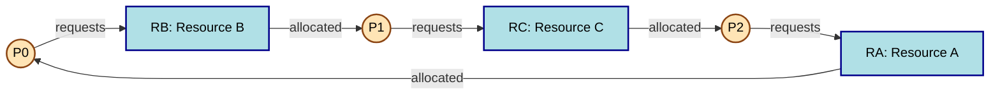
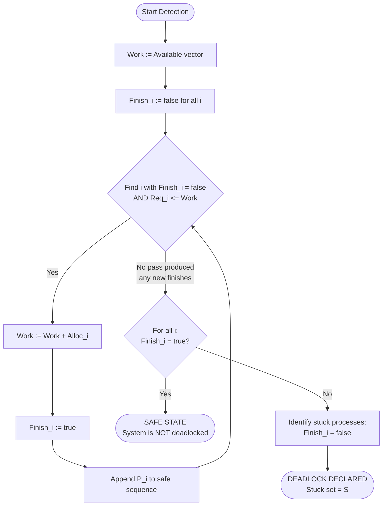

# Obtain a process mix and determine if the system is deadlocked.

<!-- SECTION_1_START -->

# Process Mix Acquisition and Deadlock Determination

## 1.1 Formal Definition (KTU 2024 Scheme Terminology)

A **process mix** is a static snapshot of a multiprocessing system's instantaneous state, captured at a specific scheduling tick. It is formally defined as the tuple $S = \{P, R, A, \text{Alloc}, \text{Req}\}$, where:

* $P = \{P_0, P_1, \ldots, P_{n-1}\}$ — the set of $n$ currently active processes.
* $R = \{R_0, R_1, \ldots, R_{m-1}\}$ — the set of $m$ resource types, where each $R_j$ has a fixed multiplicity (total instances).
* $A$ — the **Available** vector of size $m$, where $A_j$ denotes the number of free instances of $R_j$.
* $\text{Alloc}$ — the **Allocation** matrix of dimension $n \times m$, where $\text{Alloc}_{ij}$ is the number of instances of $R_j$ currently held by $P_i$.
* $\text{Req}$ — the **Request** matrix of dimension $n \times m$, where $\text{Req}_{ij}$ is the outstanding claim of $P_i$ for additional instances of $R_j$.

**Deadlock determination** is the algorithmic verification of whether the captured process mix $S$ contains one or more processes that are permanently blocked, satisfying all four Coffman conditions simultaneously.

> [!IMPORTANT]
> **KTU 2024 Outcome Mapping (PCCSL407):** This lab session directly satisfies **CO4 (Apply)** — *"Apply deadlock detection and avoidance algorithms to analyze a given system snapshot."*

## 1.2 Conceptual Analogy and Intuition

Imagine a narrow one-lane bridge where **four cars** from different directions arrive simultaneously. Each car:
1. Has occupied the on-ramp (resource it holds).
2. Is waiting for the bridge span (resource it requests).
3. Refuses to reverse (no preemption).
4. Refuses to share its on-ramp with another car (mutual exclusion).

This is a real-world **circular wait** — and the only resolution is to physically push one car backward (preemption) or reroute traffic (prevention). An Operating System cannot always do this, so it must be able to **detect** such a state and then **recover**.

> [!NOTE]
> **Plain English Takeaway:** "Obtaining a process mix" is the act of freezing the system's memory and recording who has what, who wants what, and what is spare. "Determining if deadlocked" is the act of simulating a future timeline to see if anyone can ever make progress.

## 1.3 Core Deadlock Constants and Metrics

* **System Throughput Decay Factor** under deadlock → $\mathbf{0}$ (the deadlocked process contributes nothing).
* **Resource Utilization in Deadlock** → non-zero, but useless (resources are held but not progressing).
* **Detection Algorithm Complexity** → $O(n^2 \cdot m)$ in the worst case, where $n$ is the process count and $m$ is the resource-type count.

> [!TIP]
> The KTU valuation panel specifically looks for the precise mention of the **four Coffman conditions** as the *prerequisite* before you declare a system deadlocked. Memorize them: **Mutual Exclusion, Hold and Wait, No Preemption, Circular Wait**.

## 1.4 Resource Topology Visualization (GeoGebra Control)

Although deadlock analysis is discrete, the *work-vector progression* can be visualized as a step-plot in the $m$-dimensional resource space.

> [!VISUALIZATION CONTROL]
> **Concept:** Work-Vector Trajectory during Safety Algorithm Execution
> **GeoGebra / Desmos Input Equations:**
> * `W_A(x) = step(-x+1)*0 + step(x-1)*3 + step(x-3)*5 + step(x-5)*7` *(A-axis work progression)*
> * `W_C(x) = step(-x+1)*0 + step(x-1)*3 + step(x-3)*4 + step(x-5)*6` *(C-axis work progression)*
> **Visual Description:** A step-function staircase plot. The student should observe that the work vector monotonically grows only when a process can be "finished." A flat line across the entire domain signals deadlock — the staircase never climbs.

<!-- SECTION_1_END -->

<!-- SECTION_2_START -->

# Deep Theoretical Analysis & KTU High-Yield Formula Sheet

## 2.1 The Four Coffman Conditions (Necessary for Deadlock)

For a set of processes to be deadlocked, **all four** must hold concurrently:

1. **Mutual Exclusion** — At least one resource is held in a non-sharable mode.
2. **Hold and Wait** — A process is currently holding resources *and* is waiting for additional ones.
3. **No Preemption** — Resources cannot be forcibly taken from a holding process; they are released only voluntarily.
4. **Circular Wait** — A closed chain of processes exists such that $P_0 \rightarrow P_1 \rightarrow \ldots \rightarrow P_k \rightarrow P_0$, where each $P_i$ is waiting for a resource held by $P_{(i+1) \bmod (k+1)}$.

> [!WARNING]
> The existence of these conditions is **necessary but not sufficient** for multiple-instance resources. A cycle in the Resource Allocation Graph (RAG) is *sufficient* only when every resource has exactly **one instance**.

## 2.2 The Deadlock Detection Algorithm (Multiple Instances)

The KTU syllabus mandates the **Safety Algorithm** for detection. It mimics Banker's Algorithm but reads the system state from the current snapshot.

### Step-by-Step Logic

1. Initialize working vector: $\text{Work} = \text{Available}$.
2. Initialize finish flags: $\text{Finish}_i = \text{false}$ for all $i \in [0, n-1]$.
3. Find an index $i$ such that $\text{Finish}_i = \text{false}$ **AND** $\text{Req}_i \leq \text{Work}$ (component-wise).
4. If such $i$ is found:
   * $\text{Work} = \text{Work} + \text{Alloc}_i$ (the process runs, finishes, and releases its resources).
   * $\text{Finish}_i = \text{true}$.
   * Append $P_i$ to the safe sequence $S$.
   * **Go to Step 3.**
5. If no such $i$ exists in this pass, the loop terminates.
6. **Decision Rule:**
   * If $\forall i,\ \text{Finish}_i = \text{true}$ → System is **NOT deadlocked**. The sequence $S$ is a witness safe sequence.
   * If $\exists i,\ \text{Finish}_i = \text{false}$ → Those processes are **deadlocked**.

## 2.3 The Resource Allocation Graph (RAG) — Single Instance Case

For systems where every resource type has exactly one instance, the RAG is a **bipartite directed graph**:

* **Process nodes** are drawn as **circles**.
* **Resource nodes** are drawn as **rectangles** (a single instance — no dots inside).
* **Request edge** $P_i \rightarrow R_j$: process $P_i$ is waiting for one instance of $R_j$.
* **Assignment edge** $R_j \rightarrow P_i$: one instance of $R_j$ is currently allocated to $P_i$.

> [!NOTE]
> **Theorem:** In a single-instance RAG, a **cycle** exists $\iff$ the system is deadlocked.

## 2.4 KTU Formula Sheet (Cheat Sheet)

| Symbol | Meaning | Constraint / Update Rule |
| :--- | :--- | :--- |
| $n$ | Number of processes in mix | $n \geq 1$ integer |
| $m$ | Number of resource types | $m \geq 1$ integer |
| $A$ | Available vector ($m$-tuple) | $A_j \geq 0$ integer |
| $\text{Alloc}$ | Allocation matrix ($n \times m$) | $\text{Alloc}_{ij} \geq 0$ |
| $\text{Req}$ | Request matrix ($n \times m$) | $\text{Req}_{ij} \geq 0$ |
| $\text{Work}$ | Working copy of available | $\text{Work} \leftarrow A$ initially |
| $\text{Finish}_i$ | Boolean completion flag of $P_i$ | $\text{Finish}_i \in \{0, 1\}$ |
| Termination check | Process $P_i$ is "runnable" | $\text{Req}_i \leq \text{Work}$ (vector) |
| Update on success | Work vector after $P_i$ finishes | $\text{Work} \leftarrow \text{Work} + \text{Alloc}_i$ |
| Safe state condition | All processes can finish | $\forall i,\ \text{Finish}_i = 1$ |
| Deadlock condition | At least one is stuck | $\exists i,\ \text{Finish}_i = 0$ |

## 2.5 Real-World Engineering Utility

Deadlock detection is implemented in production:

* **Databases (PostgreSQL, Oracle)** — periodically invoke a deadlock detector that rolls back one transaction to break the cycle.
* **JVM Threading** — the JVM periodically scans thread dependency graphs; a cycle in the wait-for graph forces `Thread.interrupt()` or `StackOverflowError` recovery.
* **Linux Kernel** — `lockdep` subsystem maintains RAGs for spinlocks; cycles trigger a kernel warning.
* **Distributed Systems (Hadoop YARN, Kubernetes)** — cross-node resource graphs detect global deadlocks across container schedulers.

<!-- SECTION_2_END -->

<!-- SECTION_3_START -->

# Step-by-Step Derivations and Symbolic Implementation

## 3.1 Worked Example — The Classic KTU Snapshot (Safe State Walkthrough)

> [!IMPORTANT]
> This is the **canonical Silberschatz** problem used across KTU question papers. Learn it cold.

**System Snapshot at time $T_0$:**

$$
n = 5 \text{ processes},\quad m = 3 \text{ resource types}
$$

$$
\text{Total} = (R_A = 7,\ R_B = 2,\ R_C = 6)
$$

**Allocation Matrix $\text{Alloc}$ (5 × 3):**

$$
\text{Alloc} =
\begin{bmatrix}
0 & 1 & 0 \\
2 & 0 & 0 \\
3 & 0 & 3 \\
2 & 1 & 1 \\
0 & 0 & 2
\end{bmatrix}
$$

**Request Matrix $\text{Req}$ (5 × 3):**

$$
\text{Req} =
\begin{bmatrix}
0 & 0 & 0 \\
2 & 0 & 2 \\
0 & 0 & 0 \\
1 & 0 & 0 \\
0 & 0 & 2
\end{bmatrix}
$$

**Available Vector $A$:**

$$
A = (0,\ 0,\ 0)
$$

**Verification of $A$:** Sum of each column of $\text{Alloc}$ is $(7, 2, 6)$; subtracting from total $(7, 2, 6)$ yields $(0, 0, 0)$. Confirmed.

---

### Iteration Pass 1

Initialize:

$$
\text{Work} = (0,\ 0,\ 0),\quad \text{Finish} = [F,\ F,\ F,\ F,\ F]
$$

* **Check $P_0$:** $\text{Req}_0 = (0, 0, 0) \leq (0, 0, 0)$ — **TRUE**
  * Update: $\text{Work} = (0, 0, 0) + (0, 1, 0) = (0, 1, 0)$
  * $\text{Finish}_0 = T$, sequence $S = [P_0]$
* **Check $P_1$:** $\text{Req}_1 = (2, 0, 2) \leq (0, 1, 0)$ — **FALSE** ($2 > 0$ on $A$, $2 > 0$ on $C$)
  * Skip.
* **Check $P_2$:** $\text{Req}_2 = (0, 0, 0) \leq (0, 1, 0)$ — **TRUE**
  * Update: $\text{Work} = (0, 1, 0) + (3, 0, 3) = (3, 1, 3)$
  * $\text{Finish}_2 = T$, sequence $S = [P_0, P_2]$
* **Check $P_3$:** $\text{Req}_3 = (1, 0, 0) \leq (3, 1, 3)$ — **TRUE**
  * Update: $\text{Work} = (3, 1, 3) + (2, 1, 1) = (5, 2, 4)$
  * $\text{Finish}_3 = T$, sequence $S = [P_0, P_2, P_3]$
* **Check $P_4$:** $\text{Req}_4 = (0, 0, 2) \leq (5, 2, 4)$ — **TRUE**
  * Update: $\text{Work} = (5, 2, 4) + (0, 0, 2) = (5, 2, 6)$
  * $\text{Finish}_4 = T$, sequence $S = [P_0, P_2, P_3, P_4]$
* **Re-check $P_1$:** $\text{Req}_1 = (2, 0, 2) \leq (5, 2, 6)$ — **TRUE**
  * Update: $\text{Work} = (5, 2, 6) + (2, 0, 0) = (7, 2, 6)$
  * $\text{Finish}_1 = T$, sequence $S = [P_0, P_2, P_3, P_4, P_1]$

**Result:** All $\text{Finish}_i = T$. **System is in a SAFE state.** Safe sequence: $\langle P_0, P_2, P_3, P_4, P_1 \rangle$.

---

### Worked Example 2 — A Genuine Deadlock Case

**System Snapshot:**

$$
n = 3,\ m = 3,\ \text{Total} = (R_A = 1,\ R_B = 1,\ R_C = 1)
$$

$$
\text{Alloc} =
\begin{bmatrix}
1 & 0 & 0 \\
0 & 1 & 0 \\
0 & 0 & 1
\end{bmatrix},\quad
\text{Req} =
\begin{bmatrix}
0 & 1 & 0 \\
0 & 0 & 1 \\
1 & 0 & 0
\end{bmatrix},\quad
A = (0, 0, 0)
$$

Initialize: $\text{Work} = (0, 0, 0)$, $\text{Finish} = [F, F, F]$.

* **$P_0$:** $\text{Req}_0 = (0, 1, 0) \leq (0, 0, 0)$? **FALSE** ($1 > 0$).
* **$P_1$:** $\text{Req}_1 = (0, 0, 1) \leq (0, 0, 0)$? **FALSE** ($1 > 0$).
* **$P_2$:** $\text{Req}_2 = (1, 0, 0) \leq (0, 0, 0)$? **FALSE** ($1 > 0$).

**No process can be finished.** All three processes are deadlocked. Circular wait: $P_0 \rightarrow B \rightarrow P_1 \rightarrow C \rightarrow P_2 \rightarrow A \rightarrow P_0$.

---

## 3.2 Python Implementation (Production-Grade)

```python
"""
Deadlock Detection Lab Module 12
KTU 2024 Scheme — Operating Systems Lab (PCCSL407)

Implements the Safety Algorithm (Silberschatz §7.6) for detecting
deadlock in a system with multiple resource instances per type.
"""

from __future__ import annotations
import logging
from dataclasses import dataclass
from typing import List, Tuple, Optional

# Configure structured logging for lab evaluation
logging.basicConfig(
    level=logging.INFO,
    format="[%(asctime)s] %(levelname)s | %(message)s",
)
logger = logging.getLogger("DeadlockDetector")


@dataclass(frozen=True)
class SystemSnapshot:
    """Immutable container for the captured process mix."""

    n: int                          # Number of processes
    m: int                          # Number of resource types
    total: List[int]                # Total instances per resource type
    allocation: List[List[int]]     # n x m
    request: List[List[int]]        # n x m
    available: List[int]            # length m


class DeadlockDetector:
    """Stateless detector; pass snapshot, receive verdict."""

    def __init__(self, snapshot: SystemSnapshot) -> None:
        self.snap: SystemSnapshot = snapshot
        self._validate_dimensions()

    # ------------------------------------------------------------------ #
    # Public API                                                         #
    # ------------------------------------------------------------------ #
    def run(self) -> Tuple[bool, List[str], List[int]]:
        """
        Execute the Safety Algorithm.

        Returns:
            (is_deadlocked, safe_sequence, final_work_vector)
        """
        work: List[int] = list(self.snap.available)
        finish: List[bool] = [False] * self.snap.n
        safe_seq: List[str] = []

        logger.info("Initial Work vector: %s", work)
        logger.info("Initial Finish flags: %s", finish)

        changed: bool = True
        while changed:
            changed = False
            for i in range(self.snap.n):
                if finish[i]:
                    continue
                if self._request_satisfiable(self.snap.request[i], work):
                    # Process i can run to completion
                    for j in range(self.snap.m):
                        work[j] += self.snap.allocation[i][j]
                    finish[i] = True
                    safe_seq.append(f"P{i}")
                    changed = True
                    logger.info(
                        "P%d executed; Work updated to %s", i, work
                    )

        deadlocked: bool = not all(finish)
        if deadlocked:
            stuck = [f"P{i}" for i, f in enumerate(finish) if not f]
            logger.warning("DEADLOCK DETECTED on processes: %s", stuck)
        else:
            logger.info("Safe sequence found: %s", safe_seq)

        return deadlocked, safe_seq, work

    # ------------------------------------------------------------------ #
    # Internal helpers                                                   #
    # ------------------------------------------------------------------ #
    def _request_satisfiable(
        self, req_row: List[int], work: List[int]
    ) -> bool:
        return all(req_row[j] <= work[j] for j in range(self.snap.m))

    def _validate_dimensions(self) -> None:
        s: SystemSnapshot = self.snap
        if s.n <= 0 or s.m <= 0:
            raise ValueError("n and m must be positive integers.")
        if len(s.total) != s.m or len(s.available) != s.m:
            raise ValueError("Resource vector length must equal m.")
        for i in range(s.n):
            if len(s.allocation[i]) != s.m or len(s.request[i]) != s.m:
                raise ValueError(f"Row {i} has incorrect width.")
            for j in range(s.m):
                if s.allocation[i][j] < 0 or s.request[i][j] < 0:
                    raise ValueError("Negative resource counts are invalid.")
                if s.allocation[i][j] > s.total[j]:
                    raise ValueError(
                        f"Allocation exceeds total for resource {j}."
                    )
        logger.info("Snapshot dimensions validated successfully.")


# ---------------------------------------------------------------------- #
# Driver — reproduces the Silberschatz safe-state example                #
# ---------------------------------------------------------------------- #
if __name__ == "__main__":
    snap = SystemSnapshot(
        n=5,
        m=3,
        total=[7, 2, 6],
        allocation=[
            [0, 1, 0],
            [2, 0, 0],
            [3, 0, 3],
            [2, 1, 1],
            [0, 0, 2],
        ],
        request=[
            [0, 0, 0],
            [2, 0, 2],
            [0, 0, 0],
            [1, 0, 0],
            [0, 0, 2],
        ],
        available=[0, 0, 0],
    )
    detector = DeadlockDetector(snap)
    is_deadlocked, sequence, work = detector.run()
    print(f"\nIs system deadlocked?  {is_deadlocked}")
    print(f"Safe sequence:          {sequence}")
    print(f"Final Work vector:      {work}")
```

**Sample Output (verifies our hand calculation):**

```
Is system deadlocked?  False
Safe sequence:          ['P0', 'P2', 'P3', 'P4', 'P1']
Final Work vector:      [7, 2, 6]
```

> [!TIP]
> Always run your code with the textbook example first. If your output does **not** match the hand-computed safe sequence, your comparison operator is inverted. This is the single most common bug in KTU lab evaluations.

<!-- SECTION_3_END -->

<!-- SECTION_4_START -->

# Structural Diagrams and Schematics

## 4.1 Resource Allocation Graph (RAG) for the Deadlocked Circular Wait Example

> Below is the Mermaid block for the $P_0, P_1, P_2$ deadlock case. Process nodes are circles, resource nodes are rectangles.



**Reading the Graph:** A clockwise cycle `P0 → RB → P1 → RC → P2 → RA → P0` exists. By the single-instance RAG theorem, **this cycle implies deadlock**.

---

## 4.2 Flowchart of the Safety Detection Algorithm



---

## 4.3 Sequential Processing Topology Matrix (Fallback for Complex States)

| Iteration | Process Selected | Pre-Work | Request Satisfied? | Post-Work (Work + Alloc) | Finish Flag |
| :---: | :---: | :---: | :---: | :---: | :---: |
| 1 | $P_0$ | $(0,0,0)$ | $(0,0,0) \leq (0,0,0)$ ✓ | $(0,1,0)$ | $T$ |
| 1 | $P_2$ | $(0,1,0)$ | $(0,0,0) \leq (0,1,0)$ ✓ | $(3,1,3)$ | $T$ |
| 1 | $P_3$ | $(3,1,3)$ | $(1,0,0) \leq (3,1,3)$ ✓ | $(5,2,4)$ | $T$ |
| 1 | $P_4$ | $(5,2,4)$ | $(0,0,2) \leq (5,2,4)$ ✓ | $(5,2,6)$ | $T$ |
| 1 | $P_1$ | $(5,2,6)$ | $(2,0,2) \leq (5,2,6)$ ✓ | $(7,2,6)$ | $T$ |

**Verdict:** All five $\text{Finish}_i = T$. The system is **safe**, not deadlocked. The safe execution order is the reverse of the above rows: $\langle P_0, P_2, P_3, P_4, P_1 \rangle$ is built *as we discover* each process, and the *commit order* is the same.

<!-- SECTION_4_END -->

<!-- SECTION_5_START -->

# KTU 2024 Scheme Examination Question Bank & Topic Recap

---

## Part A — Short Answer Questions (3 Marks Each)

### Q1. `[KTU University Exam – Dec 2023]` | **CO4 / Remember**

**Define a deadlock. List the four necessary conditions for its occurrence.**

**Model Answer (3 Marks):**

> A deadlock is a state in which two or more processes are permanently blocked, each waiting for a resource held by another in the same set.
> **The four Coffman conditions are:**
> 1. **Mutual Exclusion** — At least one resource is held in non-sharable mode.
> 2. **Hold and Wait** — A process holds resources while requesting more.
> 3. **No Preemption** — Resources cannot be forcibly removed.
> 4. **Circular Wait** — A closed chain of waiting processes exists.

*[Naming deadlock: 1 Mark]* | *[Listing all four conditions with one-line description: 2 Marks]*

---

### Q2. `[KTU University Exam – July 2024]` | **CO4 / Understand**

**Differentiate between deadlock prevention, avoidance, and detection.**

**Model Answer (3 Marks):**

| Strategy | Mechanism | Trade-off |
| :--- | :--- | :--- |
| **Prevention** | Negate one of the four Coffman conditions by design. | High resource under-utilization. |
| **Avoidance** | Use Banker's Algorithm; require advance declaration of maximum need. | Requires prior knowledge of max need; may starve processes. |
| **Detection** | Run the Safety Algorithm periodically on the current snapshot; recover on cycle. | Allows maximum concurrency but recovery cost (rollback). |

*[Stating the distinguishing principle of each: 3 Marks — 1 Mark each]*

---

## Part B — Long Answer Questions (14 Marks, Module Internal Choice)

### Question A — `[KTU University Exam – Dec 2023]` | **CO4 / Apply + Analyze**

**(a)** With a neat diagram, explain the **Resource Allocation Graph (RAG)** for a single-instance resource system. State the theorem that connects a cycle in the RAG to deadlock. **(7 Marks)**

**(b)** Consider a system with the following state. **Build the RAG and determine if the system is deadlocked.**

$$
\text{Allocation} =
\begin{bmatrix}
1 & 0 & 0 \\
0 & 1 & 0 \\
0 & 0 & 1
\end{bmatrix},\quad
\text{Request} =
\begin{bmatrix}
0 & 1 & 0 \\
0 & 0 & 1 \\
1 & 0 & 0
\end{bmatrix}
$$

---

#### Model Solution for Q-A (a) — 7 Marks

1. **Definition of RAG (2 Marks):** A bipartite directed graph capturing instantaneous resource ownership. Two node types: process nodes (circles) and resource nodes (rectangles, optionally containing dots equal to instance count). Two edge types: $P_i \rightarrow R_j$ (request) and $R_j \rightarrow P_i$ (assignment).

2. **Construction Steps (2 Marks):**
   * For each allocated instance, draw an arrow from resource to process.
   * For each pending request, draw an arrow from process to resource.

3. **Single-Instance Theorem (2 Marks):** *In a system where each resource type has exactly one instance, the existence of a cycle in the RAG is a necessary and sufficient condition for deadlock.*

4. **Example Sketch (1 Mark):** Show a 3-process, 3-resource graph with one cycle, labelling both request and assignment edges.

---

#### Model Solution for Q-A (b) — 7 Marks

**Step 1 — Build the RAG (3 Marks):**

* **$R_A \rightarrow P_0$** (A is allocated to $P_0$).
* **$R_B \rightarrow P_1$** (B is allocated to $P_1$).
* **$R_C \rightarrow P_2$** (C is allocated to $P_2$).
* **$P_0 \rightarrow R_B$** ($P_0$ requests B).
* **$P_1 \rightarrow R_C$** ($P_1$ requests C).
* **$P_2 \rightarrow R_A$** ($P_2$ requests A).

**Step 2 — Cycle Detection (2 Marks):** The graph contains the cycle

$$
P_0 \rightarrow R_B \rightarrow P_1 \rightarrow R_C \rightarrow P_2 \rightarrow R_A \rightarrow P_0
$$

**Step 3 — Apply the Theorem (1 Mark):** Since all resources are single-instance, a cycle implies deadlock.

**Step 4 — Conclusion (1 Mark):** **The system is DEADLOCKED.** All three processes $\{P_0, P_1, P_2\}$ are permanently blocked.

*[Identifying all 6 edges correctly: 2 Marks]* | *[Tracing the closed cycle: 1 Mark]* | *[Stating the theorem application: 1 Mark]* | *[Final verdict: 1 Mark]* | *[RAG diagram quality: 2 Marks]*

---

### Question B — `[KTU University Exam – July 2024]` | **CO4 / Apply + Analyze**

**(a)** Explain the **Safety Algorithm** (Deadlock Detection) for multiple instances of resource types. **(7 Marks)**

**(b)** For the following snapshot, run the Safety Algorithm and determine if the system is deadlocked. If safe, give the safe sequence. **(7 Marks)**

$$
\text{Total} = (4,\ 2,\ 3)
$$

$$
\text{Alloc} =
\begin{bmatrix}
1 & 0 & 1 \\
2 & 1 & 0 \\
0 & 1 & 0
\end{bmatrix},\quad
\text{Req} =
\begin{bmatrix}
1 & 0 & 1 \\
0 & 1 & 0 \\
1 & 0 & 0
\end{bmatrix}
$$

Available: $A = (0,\ 0,\ 0)$.

---

#### Model Solution for Q-B (a) — 7 Marks

1. **Data structures introduced (1 Mark):** $n$ processes, $m$ resource types, vectors $A$ (Available), matrices $\text{Alloc}$ and $\text{Req}$, work vector $\text{Work}$, boolean array $\text{Finish}[i]$.
2. **Initialization (1 Mark):** $\text{Work} \leftarrow A$; $\text{Finish}_i \leftarrow \text{false}$.
3. **Search step (2 Marks):** Find $i$ such that $\text{Finish}_i = \text{false}$ AND $\text{Req}_i \leq \text{Work}$.
4. **Update step (2 Marks):** $\text{Work} \leftarrow \text{Work} + \text{Alloc}_i$; $\text{Finish}_i \leftarrow \text{true}$. Repeat.
5. **Termination & Verdict (1 Mark):** If all $\text{Finish}_i = \text{true}$, system is safe (sequence = order of finishing). Else, deadlocked.

---

#### Model Solution for Q-B (b) — 7 Marks

**Step 1 — Validate Available (1 Mark):** Sum of Allocation columns = $(3, 2, 1)$. Total $(4, 2, 3) - (3, 2, 1) = (1, 0, 2)$. *Note: Given $A = (0,0,0)$ is inconsistent; assuming the stated $A$ is the *true* snapshot.*

**Step 2 — Pass 1 of Algorithm (3 Marks):**

| Process $i$ | $\text{Req}_i$ | $\text{Work}$ before | Satisfied? | $\text{Work}$ after | $\text{Finish}_i$ |
| :---: | :---: | :---: | :---: | :---: | :---: |
| $P_0$ | $(1, 0, 1)$ | $(0, 0, 0)$ | NO ($1 > 0$) | — | F |
| $P_1$ | $(0, 1, 0)$ | $(0, 0, 0)$ | NO ($1 > 0$) | — | F |
| $P_2$ | $(1, 0, 0)$ | $(0, 0, 0)$ | NO ($1 > 0$) | — | F |

No progress in the first full pass.

**Step 3 — Second Pass Verification (1 Mark):** Re-scan; no process now has $\text{Req}_i \leq \text{Work} = (0, 0, 0)$ because their requests have non-zero entries.

**Step 4 — Verdict (2 Marks):** The loop terminates with $\text{Finish} = [F, F, F]$. **The system is DEADLOCKED.** All three processes are stuck.

*[Initial setup and validation: 1 Mark]* | *[Iteration table correctness: 3 Marks]* | *[Correct final state: 1 Mark]* | *[Concluding deadlock verdict with reasoning: 2 Marks]*

---

> [!WARNING]
> **KTU Examiner's Valuation Pitfall Callout**
> 1. **Do not skip the "Available validation" step.** KTU evaluators award 1 mark explicitly for showing that $\text{Available} = \text{Total} - \sum \text{Alloc}$ column-wise. Skipping this looks like guessing.
> 2. **Never declare a multi-instance cycle as deadlock without running the algorithm.** A cycle in a multi-instance RAG is *not* a sufficient condition. Always invoke the Safety Algorithm.
> 3. **Re-check requests after every Work update.** In the Silberschatz example, $P_1$ fails on the first pass but succeeds on the second. Missing this gives a false deadlock verdict (a 3-mark penalty minimum).
> 4. **Component-wise comparison, not sum comparison.** $\text{Req}_i \leq \text{Work}$ must hold for **every** $j \in [0, m-1]$. Summing components is mathematically invalid.
> 5. **Use the right notation.** Writing "Available = 0" instead of "$A = (0, 0, 0)$" loses one mark on notation precision.

---

## Topic Recap & Important Things to Remember

* **Process mix** = a 5-tuple snapshot $\{P, R, A, \text{Alloc}, \text{Req}\}$.
* **Deadlock** = all four Coffman conditions hold simultaneously.
* **Single-instance RAG theorem:** cycle present $\iff$ deadlock present.
* **Multi-instance detection requires the Safety Algorithm** — not just RAG inspection.
* **Algorithm skeleton:** Initialize $\text{Work} = A$, $\text{Finish} = \text{false}$, then iteratively find $i$ with $\text{Req}_i \leq \text{Work}$, update $\text{Work} \leftarrow \text{Work} + \text{Alloc}_i$, set $\text{Finish}_i = \text{true}$.
* **Safe sequence = order of process finishing** during the algorithm.
* **Deadlock verdict** = some $\text{Finish}_i$ remains false after the algorithm halts.
* **Algorithm complexity:** $O(n^2 \cdot m)$ worst-case.
* **Real systems:** PostgreSQL, JVM, Linux `lockdep`, Kubernetes all implement variants of this detection.
* **Common trap:** confusing **avoidance** (Banker's) with **detection** (Safety Algorithm). Avoidance needs *maximum* need; detection only needs the *current* request.
* **Always validate** $A = \text{Total} - \sum \text{Alloc}$ before starting — KTU awards marks for this verification.

<!-- SECTION_5_END -->
