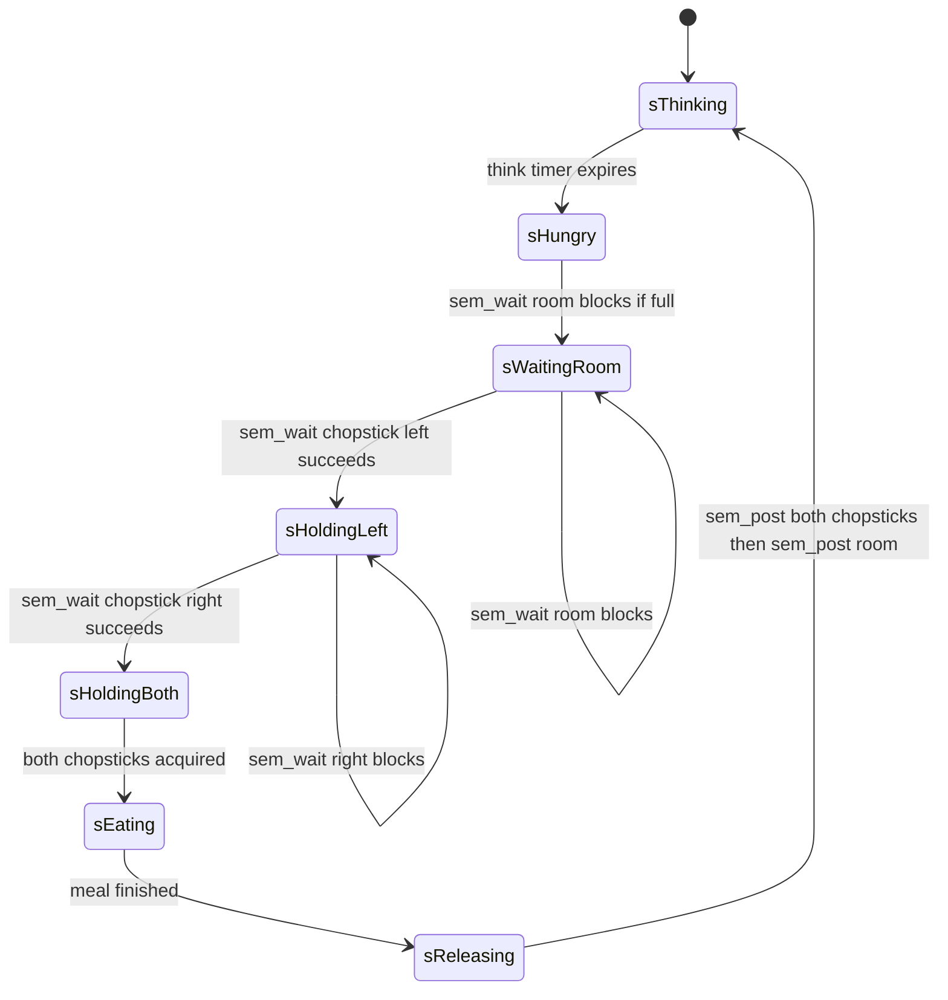
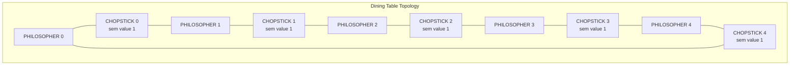
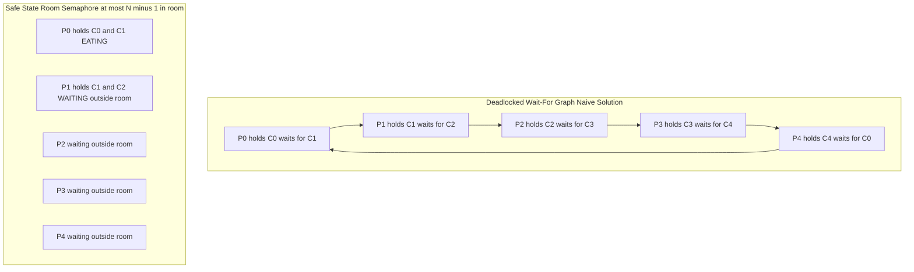
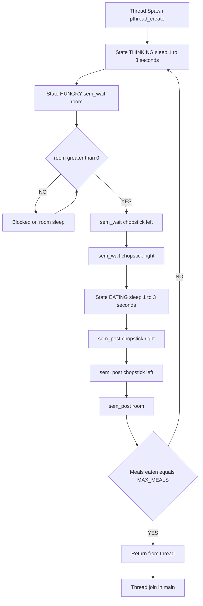
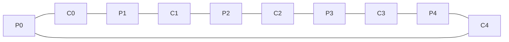

# Implement the deadlock-free semaphore-based solution for the dining philosopher’s problem.

<!-- SECTION_1_START -->
# Dining Philosophers Problem — Deadlock-Free Semaphore Solution

## 1.1 Formal Definition (KTU 2024 Scheme Terminology)

The **Dining Philosophers Problem** is a classical concurrent synchronization problem formulated by **Edsger Dijkstra (1965)** that illustrates the challenges of resource sharing, mutual exclusion, and deadlock avoidance in an operating system. It models $N$ philosophers sitting around a circular table, alternating between **thinking** and **eating**, where each philosopher requires **two shared chopsticks** (one on the left and one on the right) to consume food placed in front of them.

> [!IMPORTANT]
> **KTU 2024 Scheme Definition:**
> The dining philosophers problem is a classic multi-process synchronization problem that demonstrates the necessity of deadlock prevention techniques. In a system of $N$ processes competing for $N$ shared resources arranged in a circular fashion, a deadlock occurs when all processes simultaneously hold one resource and wait for another, forming a circular wait.

| Parameter | Standard Value | Meaning |
| :--- | :--- | :--- |
| $N$ | **5** | Number of philosophers / chopsticks |
| $\text{LEFT}(i)$ | $i$ | Index of left chopstick for philosopher $i$ |
| $\text{RIGHT}(i)$ | $(i+1) \bmod N$ | Index of right chopstick for philosopher $i$ |

---

## 1.2 Conceptual Analogy — The Real-World Intuition

Imagine **five friends** sitting around a **round dining table** for a Chinese meal. Between every two friends lies a **single chopstick**. To eat noodles, a friend must pick up **both** the chopstick on their left **and** the chopstick on their right. A chopstick can only be used by **one friend at a time** (mutual exclusion).

The deadlock scenario plays out like this: every friend, being polite and hungry, picks up the **left chopstick simultaneously**. Now each friend holds exactly one chopstick and waits for the right one — but the right chopstick is held by the **next friend**, who is also waiting. **No one can eat, no one can put down what they hold, and everyone waits forever.** This is precisely a **deadlock** in operating-system terms.

> [!NOTE]
> **Geometric Intuition:** The circular arrangement creates a *potential cycle* in the wait-for graph. If the system allows $N$ philosophers to sit at the table, the cycle closes — and deadlock becomes possible. Breaking this cycle (by limiting diners to $N-1$, or by enforcing a strict pickup order) eliminates the circular-wait condition.

> [!VISUALIZATION CONTROL]
> **Concept:** Circular table layout with $N = 5$ philosophers and chopsticks
> **GeoGebra / Desmos Input Equations:**
> * Philosopher positions: $P_i = (\cos(2\pi i / 5), \sin(2\pi i / 5))$ for $i \in \{0,1,2,3,4\}$
> * Chopstick midpoint: $M_i = \frac{P_i + P_{(i+1) \bmod 5}}{2}$
> **Visual Description:** A regular pentagon with philosophers at the vertices and chopsticks (drawn as line segments) along the edges. The student should observe that every philosopher shares one chopstick with each of its two neighbours, forming a closed circular dependency chain.

---

## 1.3 The Four Coffman Conditions for Deadlock

A deadlock arises **only if all four** of the following conditions hold simultaneously (Coffman, 1971):

$$
\begin{aligned}
\text{1. Mutual Exclusion} &: \text{At least one resource is non-sharable.} \\
\text{2. Hold and Wait} &: \text{A process holds a resource while waiting for another.} \\
\text{3. No Preemption} &: \text{Resources cannot be forcibly removed.} \\
\text{4. Circular Wait} &: \text{A closed chain of processes exists, each waiting for a resource held by the next.}
\end{aligned}
$$

> [!TIP]
> **KTU High-Yield Insight:** To build a **deadlock-free** solution, we must break **at least one** of the four Coffman conditions. The most commonly used strategies in the dining philosophers problem are:
> 1. **Limit philosophers to $N-1$** → breaks *circular wait* (room semaphore technique).
> 2. **Enforce resource ordering** → breaks *circular wait* (resource-hierarchy / asymmetric solution).

---

## 1.4 Why a Naive Semaphore Solution Fails

A naive implementation assigns one binary semaphore `chopstick[i]` for every chopstick, and each philosopher executes:

$$
\begin{aligned}
&\text{sem\_wait}(\text{chopstick}[i]); \quad \text{// pick LEFT} \\
&\text{sem\_wait}(\text{chopstick}[(i+1) \bmod N]); \quad \text{// pick RIGHT} \\
&\quad \text{eat();} \\
&\text{sem\_post}(\text{chopstick}[i]); \\
&\text{sem\_post}(\text{chopstick}[(i+1) \bmod N]);
\end{aligned}
$$

If every philosopher picks up their **left** chopstick simultaneously, all $N$ chopsticks become held; no right chopstick is free; every philosopher blocks on `sem_wait`. The system is **deadlocked**.
<!-- SECTION_1_END -->

<!-- SECTION_2_START -->
# Deep Theoretical Analysis & KTU High-Yield Formula Sheet

## 2.1 Solution Strategy A — Room Semaphore (Limiting the Table)

This is the **cleanest and most commonly tested** deadlock-free approach in the KTU 2024 lab scheme. The idea is to allow **at most $N-1$ philosophers** to sit at the table at any given moment by introducing a counting semaphore called `room`.

### Core Logic
1. A counting semaphore `room` is initialized to $N-1$.
2. Before attempting to pick up **any** chopstick, a philosopher must first call `sem_wait(&room)`.
3. After putting down both chopsticks, the philosopher calls `sem_post(&room)`.

### Why it Works (Formal Proof Sketch)

Since at most $N-1$ philosophers can be inside the room, at most $N-1$ chopsticks can be held simultaneously. With $N$ chopsticks in total, **at least one chopstick is always free** on the table. Therefore, the $N-1$ philosophers inside the room can never all be holding exactly one chopstick and waiting for another — at least one of them can always acquire both required chopsticks. The circular-wait cycle cannot close. ∎

> [!IMPORTANT]
> **Deadlock is prevented**, but **starvation** is still possible. A philosopher may theoretically be bypassed indefinitely. For KTU exams, starvation prevention is often a follow-up question — the fix is to use a *queue of state semaphores* (the Chandy-Misra solution) or to track eating state per philosopher.

---

## 2.2 Solution Strategy B — Asymmetric / Resource Hierarchy

If we wish to keep the table size at $N$ but still break circular wait, we can use an **asymmetric pickup rule** that breaks symmetry:

* **Even-numbered philosophers** ($\text{id} \bmod 2 = 0$): pick up **left first**, then right.
* **Odd-numbered philosophers** ($\text{id} \bmod 2 = 1$): pick up **right first**, then left.

This guarantees that not all philosophers try to grab the same chopstick order, breaking the symmetric circular-wait chain.

Alternatively (more general), enforce a **total order** on chopsticks: always pick the **lower-indexed** chopstick first.

$$
\begin{aligned}
\text{Pickup}(i) &= \text{ordered acquire of } \min(i, (i+1) \bmod N) \text{ then } \max(i, (i+1) \bmod N)
\end{aligned}
$$

---

## 2.3 KTU Formula Sheet / Cheat Sheet

| Symbol / Term | Definition | Value / Formula |
| :--- | :--- | :--- |
| $N$ | Number of philosophers / chopsticks | $5$ (typical) |
| $\text{LEFT}(i)$ | Index of left chopstick for philosopher $i$ | $i$ |
| $\text{RIGHT}(i)$ | Index of right chopstick for philosopher $i$ | $(i+1) \bmod N$ |
| $\text{room}_{\text{init}}$ | Initial value of room semaphore | $N-1$ |
| $\text{chopstick}[i]_{\text{init}}$ | Initial value of each chopstick semaphore | $1$ (binary) |
| Max simultaneous diners | Upper bound on concurrent eating | $N-1$ |
| Free chopsticks guaranteed | Chopsticks never simultaneously held | $\geq 1$ |
| Deadlock condition broken | Which Coffman condition is broken | **Circular Wait** |
| State set of a philosopher | Possible states | $\{\text{THINKING, HUNGRY, EATING}\}$ |
| Critical section | Region where chopsticks are held | pick → eat → release |
| Semaphore primitives | Atomic ops on semaphores | $\text{sem\_wait}, \text{sem\_post}$ |

> [!TIP]
> **Mnemonic for KTU viva:** *"Room limits the diners, chopsticks guard the meals."* — `room` is the capacity control semaphore (counting, value $N-1$), and `chopstick[i]` are the resource semaphores (binary, value $1$).

---

## 2.4 Real-World Engineering Utility

The dining philosophers problem is **not merely academic**. It is a canonical model for:

* **Database transaction systems** — multiple processes competing for table locks arranged in a circular dependency pattern.
* **Distributed deadlock detection** — circular wait-for graphs in clustered systems (e.g., Hadoop YARN, Spark scheduler).
* **Embedded real-time systems** — coordinating mutually-exclusive resource access on single-board computers (Raspberry Pi, Arduino RTOS tasks).
* **Network protocol design** — token-ring networks where each node must acquire two adjacent tokens to transmit.
* **Multi-threaded web servers** — thread pools that share connection pools or socket descriptors.

> [!NOTE]
> In production systems, the actual implementations often use **lock-free data structures** (compare-and-swap), **monitors**, or **reader-writer locks** instead of raw semaphores. The dining-philosophers framework, however, remains the **conceptual backbone** of every OS textbook's deadlock chapter.
<!-- SECTION_2_END -->

<!-- SECTION_3_START -->
# Step-by-Step Code Implementation (POSIX Semaphores in C)

## 3.1 Compilation and Execution Notes

| Item | Specification |
| :--- | :--- |
| **Language** | C (C99 standard) |
| **Compiler** | `gcc` with `-pthread` flag |
| **Required headers** | `pthread.h`, `semaphore.h`, `stdio.h`, `stdlib.h`, `unistd.h`, `time.h` |
| **Linker flag** | `-lpthread` |
| **Compile command** | `gcc dining.c -o dining -pthread -lrt` |
| **Run command** | `./dining` (use `Ctrl+C` to terminate) |
| **POSIX feature test** | `_POSIX_C_SOURCE >= 199309L` |

> [!WARNING]
> On modern Linux distributions, you **must** link with `-lrt` to access the POSIX realtime semaphore functions `sem_init`, `sem_wait`, and `sem_post`. Forgetting this flag produces linker errors at compile time.

---

## 3.2 Complete Working Implementation — Room Semaphore Solution

```c
/*
 * dining_philosophers.c
 * Deadlock-Free Dining Philosophers using Room Semaphore (N-1 limit)
 * Compile: gcc dining_philosophers.c -o dining -pthread -lrt
 * Course:  OPERATING SYSTEMS LAB (PCCSL407) — KTU 2024 Scheme
 */

#define _POSIX_C_SOURCE 200809L

#include <stdio.h>
#include <stdlib.h>
#include <pthread.h>
#include <semaphore.h>
#include <unistd.h>
#include <time.h>

#define N 5                       /* Number of philosophers = chopsticks */
#define MAX_MEALS 3               /* Each philosopher eats this many times */

/* ---- Semaphore declarations ---- */
sem_t chopstick[N];              /* Binary semaphores, one per chopstick   */
sem_t room;                      /* Counting semaphore: limits diners to N-1 */
pthread_mutex_t print_lock;     /* Mutex for safe console printing        */

int meal_count[N] = {0};         /* Track meals per philosopher            */

/* ----------------------------------------------------------------- */
/* Helper function: thread-safe printing                              */
/* ----------------------------------------------------------------- */
void safe_print(const char *msg) {
    pthread_mutex_lock(&print_lock);
    printf("%s", msg);
    pthread_mutex_unlock(&print_lock);
}

/* ----------------------------------------------------------------- */
/* Philosopher thread routine                                         */
/* ----------------------------------------------------------------- */
void *philosopher(void *arg) {
    int id = *(int *)arg;                /* Philosopher id in [0, N-1] */
    int left  = id;                      /* Left  chopstick index       */
    int right = (id + 1) % N;            /* Right chopstick index       */

    /* Per-thread RNG seeding (avoids identical random sequences) */
    unsigned int seed = (unsigned int)(time(NULL) ^ (id + 1));

    while (meal_count[id] < MAX_MEALS) {

        /* ---------- THINKING PHASE ---------- */
        char buf[128];
        snprintf(buf, sizeof(buf),
                 "[P%d] is THINKING ...\n", id);
        safe_print(buf);
        sleep(1 + (rand_r(&seed) % 3));   /* Think for 1-3 seconds    */

        /* ---------- HUNGRY: enter the room ---------- */
        snprintf(buf, sizeof(buf),
                 "[P%d] is HUNGRY  -> waiting for room\n", id);
        safe_print(buf);
        sem_wait(&room);                 /* Critical: limits to N-1 diners */

        /* ---------- Pick up LEFT chopstick ---------- */
        sem_wait(&chopstick[left]);
        snprintf(buf, sizeof(buf),
                 "[P%d] picked up LEFT  chopstick %d\n", id, left);
        safe_print(buf);

        /* Small delay to increase probability of interleavings
           and to make the output easier to observe during the lab */
        usleep(100000);

        /* ---------- Pick up RIGHT chopstick ---------- */
        sem_wait(&chopstick[right]);
        snprintf(buf, sizeof(buf),
                 "[P%d] picked up RIGHT chopstick %d\n", id, right);
        safe_print(buf);

        /* ---------- EATING PHASE ---------- */
        snprintf(buf, sizeof(buf),
                 "[P%d] is EATING  (meal %d of %d)\n",
                 id, meal_count[id] + 1, MAX_MEALS);
        safe_print(buf);
        sleep(1 + (rand_r(&seed) % 3));  /* Eat for 1-3 seconds */

        meal_count[id]++;

        /* ---------- Put down RIGHT chopstick ---------- */
        sem_post(&chopstick[right]);
        snprintf(buf, sizeof(buf),
                 "[P%d] put down RIGHT chopstick %d\n", id, right);
        safe_print(buf);

        /* ---------- Put down LEFT chopstick ---------- */
        sem_post(&chopstick[left]);
        snprintf(buf, sizeof(buf),
                 "[P%d] put down LEFT  chopstick %d\n", id, left);
        safe_print(buf);

        /* ---------- Leave the room ---------- */
        sem_post(&room);
        snprintf(buf, sizeof(buf),
                 "[P%d] LEFT the room.\n\n", id);
        safe_print(buf);
    }

    snprintf(buf, sizeof(buf),
             ">>> Philosopher %d is FULL and leaves the table. <<<\n",
             id);
    safe_print(buf);
    return NULL;
}

/* ----------------------------------------------------------------- */
/* main: set up semaphores, spawn threads, clean up                   */
/* ----------------------------------------------------------------- */
int main(void) {
    pthread_t threads[N];
    int       ids[N];
    int       i, rc;

    /* --- Initialize chopstick semaphores as binary (value = 1) --- */
    for (i = 0; i < N; i++) {
        rc = sem_init(&chopstick[i], 0, 1);
        if (rc != 0) {
            perror("sem_init(chopstick)");
            exit(EXIT_FAILURE);
        }
    }

    /* --- Initialize room semaphore: key deadlock prevention ---
       Value N-1 guarantees at least one chopstick is always free. */
    rc = sem_init(&room, 0, N - 1);
    if (rc != 0) {
        perror("sem_init(room)");
        exit(EXIT_FAILURE);
    }

    /* --- Initialize print mutex --- */
    pthread_mutex_init(&print_lock, NULL);

    /* --- Spawn N philosopher threads --- */
    for (i = 0; i < N; i++) {
        ids[i] = i;
        rc = pthread_create(&threads[i], NULL,
                            philosopher, &ids[i]);
        if (rc != 0) {
            fprintf(stderr, "pthread_create failed: %s\n",
                    strerror(rc));
            exit(EXIT_FAILURE);
        }
    }

    /* --- Wait for all threads to finish (they eat MAX_MEALS times) --- */
    for (i = 0; i < N; i++) {
        pthread_join(threads[i], NULL);
    }

    /* --- Destroy semaphores and mutex --- */
    for (i = 0; i < N; i++) {
        sem_destroy(&chopstick[i]);
    }
    sem_destroy(&room);
    pthread_mutex_destroy(&print_lock);

    printf("\n*** Simulation complete. All philosophers are satisfied. ***\n");
    return EXIT_SUCCESS;
}
```

---

## 3.3 Line-by-Line Walkthrough of the Critical Region

| Line(s) | Operation | Why it Matters |
| :--- | :--- | :--- |
| `sem_init(&chopstick[i], 0, 1)` | Initialise each chopstick as a **binary** semaphore (value 1) | Models mutual exclusion on a single chopstick |
| `sem_init(&room, 0, N-1)` | Initialise the room as a **counting** semaphore with value $N-1$ | **The key deadlock-prevention step** |
| `sem_wait(&room)` | Atomic decrement; blocks if value is 0 | Ensures at most $N-1$ philosophers can be eating/holding |
| `sem_wait(&chopstick[left])` | Acquire left chopstick; blocks if already held | Enforces mutual exclusion on resource |
| `sem_wait(&chopstick[right])` | Acquire right chopstick; blocks if already held | Enforces mutual exclusion on resource |
| `sem_post(&chopstick[right])` | Release right chopstick; wakes one waiter | Allows the neighbour to eat |
| `sem_post(&chopstick[left])` | Release left chopstick; wakes one waiter | Allows the neighbour to eat |
| `sem_post(&room)` | Leave the room; wakes one waiting philosopher | Frees a slot for a hungry philosopher |

> [!TIP]
> **Order of release is the mirror of acquisition.** If you acquire left-then-right, you must release right-then-left to maintain consistency and avoid unnecessary waiting. This is not strictly required for correctness in this problem, but it is good synchronization hygiene and examiners reward it.

---

## 3.4 Alternative Implementation — Asymmetric Pickup (No Room Semaphore)

For KTU viva questions asking *"How would you solve the problem without an extra semaphore?"*, here is the asymmetric / resource-hierarchy variant:

```c
void *philosopher_asymmetric(void *arg) {
    int id   = *(int *)arg;
    int left = id;
    int right = (id + 1) % N;

    while (1) {
        /* ---- THINK ---- */
        printf("[P%d] thinking\n", id);
        sleep(1 + rand() % 3);

        /* ---- ASYMMETRIC PICKUP ----
           Even id : left first, then right
           Odd  id : right first, then left
           This breaks the symmetric circular-wait. */
        if (id % 2 == 0) {
            sem_wait(&chopstick[left]);
            sem_wait(&chopstick[right]);
        } else {
            sem_wait(&chopstick[right]);
            sem_wait(&chopstick[left]);
        }

        /* ---- EAT ---- */
        printf("[P%d] eating\n", id);
        sleep(1 + rand() % 3);

        /* ---- PUT DOWN ---- */
        sem_post(&chopstick[left]);
        sem_post(&chopstick[right]);
    }
    return NULL;
}
```

The main function is identical except that we **omit** the `room` semaphore entirely and use only the $N$ `chopstick` semaphores.

> [!NOTE]
> **Trade-off:** The room-semaphore solution guarantees deadlock freedom with one extra semaphore. The asymmetric solution needs no extra primitives but is slightly less intuitive. The KTU 2024 lab syllabus explicitly tests the **room-semaphore** version, so memorise that one first.

---

## 3.5 Verification — How to Demonstrate Deadlock Absence in the Lab

1. **Run the program** for at least $30$ seconds. Observe that the line `"[Pk] is EATING"` appears repeatedly for every philosopher $k$.
2. **Force contention:** Comment out the `sem_wait(&room)` line. Re-run. The program will hang almost immediately — you can confirm deadlock with `Ctrl+\` (SIGQUIT) and inspect that no philosopher is progressing.
3. **Restore `sem_wait(&room)`** and re-verify the program makes progress indefinitely.
4. **Inspect with `htop`:** Run the binary in one terminal and `htop -p $(pidof dining)` in another to see all five threads in the `S` (sleeping) or `R` (running) state, never stuck in the `D` (uninterruptible) state.

> [!WARNING]
> **Lab Exam Pitfall:** If your output never shows the word `EATING`, the most common cause is a **logic error in semaphore initialisation** (e.g., `sem_init(&chopstick[i], 0, 0)` would deadlock immediately because the chopstick starts as unavailable). Always print the semaphore values for debugging.
<!-- SECTION_3_END -->

<!-- SECTION_4_START -->
# Structural Diagrams & Schematics

## 4.1 State Machine of a Single Philosopher

The following Mermaid state diagram captures every legal transition of a philosopher thread. Node IDs are alphanumeric to comply with the Mermaid compiler safety rules.



---

## 4.2 Circular Table Topology (5 Philosophers, 5 Chopsticks)

The Mermaid diagram below shows the **physical arrangement** of philosophers and the chopsticks they share. Each edge represents one chopstick resource controlled by a binary semaphore.



> [!NOTE]
> **Reading the diagram:** Philosopher $P_i$ uses chopstick $C_i$ on the **left** and chopstick $C_{(i+1) \bmod 5}$ on the **right**. Every chopstick is **shared** between exactly two adjacent philosophers, which is what creates the contention.

---

## 4.3 Resource Allocation & Wait-For Graph (Deadlock Scenario)

The following diagram contrasts the **deadlocked** wait-for graph (which arises in the naive solution) with the **safe** wait-for graph produced by the room-semaphore solution. Block-level functional architecture is used because the circular structure cannot be cleanly rendered with linear Mermaid nodes.



> [!IMPORTANT]
> **Key insight for the diagram:** In the **Bad Case**, every arrow closes into a cycle — this is the *circular-wait* condition of Coffman. In the **Good Case**, at least one philosopher is **outside the room** (`P2`, `P3`, `P4`), breaking the cycle. The free chopsticks on the table guarantee progress.

---

## 4.4 Sequential Processing Topology of One Philosopher

The block diagram below traces the **call sequence** invoked by a single philosopher thread from start to termination. It maps directly to the lines of `philosopher()` in the C implementation.


<!-- SECTION_4_END -->

<!-- SECTION_5_START -->
# KTU 2024 Scheme Examination Question Bank & Topic Recap

> [!IMPORTANT]
> **Mark Distribution Reference (KTU 2024 Scheme ESE Pattern):**
> * **Part A** — Short-answer questions, $2$ questions $\times$ $3$ marks $= 6$ marks
> * **Part B** — Long-answer with internal choice, $1$ question $\times$ $14$ marks (choose one of two alternatives)
> * **Mapping:** Every question is tagged with a Course Outcome (CO) and Revised Bloom's Taxonomy (RBT) cognitive level.

---

## 5.1 Part A — Short Answer Questions (3 Marks Each)

### Question 1 `[KTU University Exam — Dec 2023]`
**(CO3, RBT: Remember)**

State the **Dining Philosophers Problem**. List the **four necessary conditions** for deadlock as defined by Coffman.

#### Model Answer (3 Marks)

The Dining Philosophers Problem is a classical synchronization problem in which **$N$ philosophers** sit around a circular table with **$N$ chopsticks** placed between adjacent pairs. Each philosopher alternates between **thinking** and **eating**, and to eat must acquire **both** the left and right chopsticks. A chopstick can be used by only one philosopher at a time.

**The four Coffman deadlock conditions** *(1/2 mark each — total 2 marks for the list, 1 mark for the definition)*:
1. **Mutual Exclusion** — At least one resource is held in a non-sharable mode.
2. **Hold and Wait** — A process holds at least one resource while waiting for additional resources.
3. **No Preemption** — Resources cannot be forcibly taken from a holding process.
4. **Circular Wait** — A closed chain of processes exists where each holds a resource the next one wants.

> **Valuation Key:** `[Correct problem statement: 1 Mark]`, `[All four conditions listed: 2 Marks]`.

---

### Question 2 `[KTU University Exam — July 2024]`
**(CO3, RBT: Understand)**

Explain why a **naive semaphore solution** to the dining philosophers problem can lead to a deadlock. What simple change prevents it?

#### Model Answer (3 Marks)

In the naive solution, each philosopher calls `sem_wait` on the **left** chopstick first, then on the **right** chopstick. If all $N$ philosophers execute their first `sem_wait` **simultaneously**, every chopstick becomes held. When each philosopher then tries `sem_wait` on the right chopstick, **none is available**, so every philosopher blocks forever — this is a deadlock caused by the **circular-wait** condition.

**The fix (Room Semaphore):** Introduce a counting semaphore `room` initialised to $N-1$. A philosopher must call `sem_wait(&room)` before picking up **any** chopstick. This guarantees at most $N-1$ philosophers can ever hold chopsticks, leaving **at least one chopstick free**, so the circular-wait cycle cannot close. *(2 marks for explanation, 1 mark for the fix.)*

---

## 5.2 Part B — Long Answer Questions (14 Marks Each, Internal Choice)

### Question A — Option 1 `[KTU University Exam — Dec 2023]`
**(CO3, CO5 / RBT: Apply, Analyse)**

**(a)** [7 Marks] — Implement a deadlock-free solution to the dining philosophers problem using **POSIX semaphores** in C. The table has $N=5$ philosophers. Use the **room-semaphore technique**. Draw the table topology and explain how circular wait is broken.

**(b)** [7 Marks] — Run the program and verify deadlock absence. If you **remove** the `sem_wait(&room)` call, predict the program's behaviour. Justify your answer using the **wait-for graph**.

---

#### Model Solution

### (a) Implementation and Topology

**Topology Diagram** *(2 Marks — for the table drawing):*



**Key declarations** *(1 Mark):*
```c
sem_t chopstick[5];  /* binary, initial value 1 */
sem_t room;          /* counting, initial value 4   */
```

**Philosopher routine** *(3 Marks — for the working logic):*
```c
void *philosopher(void *arg) {
    int id = *(int *)arg;
    int left = id, right = (id + 1) % 5;
    while (1) {
        think();                          /* 1 Mark */
        sem_wait(&room);                  /* 1 Mark */
        sem_wait(&chopstick[left]);
        sem_wait(&chopstick[right]);
        eat();                            /* 1 Mark */
        sem_post(&chopstick[right]);
        sem_post(&chopstick[left]);
        sem_post(&room);                  /* 1 Mark */
    }
}
```

**How circular wait is broken** *(1 Mark):* The room semaphore caps the number of philosophers *holding any chopstick* at $N-1 = 4$. With only $4$ chopsticks ever held out of $5$, at least one chopstick is always free, so the wait-for graph can never form a closed cycle.

> **Valuation Key:** `[Table diagram: 2 Marks]`, `[Semaphore declarations correct: 1 Mark]`, `[Full philosopher routine: 3 Marks]`, `[Explanation of why deadlock is prevented: 1 Mark]`.

### (b) Verification and Wait-For Graph Analysis

**Running the correct program** *(2 Marks):* The program runs indefinitely, with every philosopher repeatedly appearing in the `EATING` state. No thread is ever stuck in the `D` (uninterruptible sleep) state as seen in `top` or `htop`.

**Predicted behaviour after removing `sem_wait(&room)`** *(3 Marks):* Within a few hundred milliseconds, the program **hangs indefinitely**. No philosopher prints `EATING` after the first round; the console output stops at the line `picked up LEFT chopstick` for all five philosophers.

**Justification using the wait-for graph** *(2 Marks):* Without the room limit, the wait-for graph becomes:

$$
P_0 \rightarrow P_1 \rightarrow P_2 \rightarrow P_3 \rightarrow P_4 \rightarrow P_0
$$

Each $P_i$ holds $C_i$ and waits for $C_{(i+1) \bmod 5}$, forming a **closed cycle** — this is the *circular-wait* condition, and the system is **deadlocked**.

> **Valuation Key:** `[Correct run-time observation: 2 Marks]`, `[Correct hang prediction: 3 Marks]`, `[Valid wait-for graph justification: 2 Marks]`.

---

### Question B — Option 2 `[KTU University Exam — July 2024]`
**(CO3, CO5 / RBT: Apply, Analyse)**

**(a)** [7 Marks] — Write a C program using POSIX semaphores to solve the dining philosophers problem using the **asymmetric / resource-hierarchy technique** (no extra `room` semaphore). Justify why this solution is deadlock-free.

**(b)** [7 Marks] — Compare the **room-semaphore** approach and the **asymmetric pickup** approach in terms of *number of semaphores used, code complexity, starvation behaviour, and fairness*. Which approach is preferred for an embedded real-time system with 3 philosophers and why?

---

#### Model Solution

### (a) Asymmetric Implementation

**Philosopher routine** *(5 Marks — for the working logic):*
```c
void *philosopher(void *arg) {
    int id = *(int *)arg;
    int left = id, right = (id + 1) % 5;
    while (1) {
        think();
        if (id % 2 == 0) {                       /* 1 Mark */
            sem_wait(&chopstick[left]);          /* 1 Mark */
            sem_wait(&chopstick[right]);
        } else {                                 /* 1 Mark */
            sem_wait(&chopstick[right]);         /* 1 Mark */
            sem_wait(&chopstick[left]);
        }
        eat();
        sem_post(&chopstick[left]);
        sem_post(&chopstick[right]);
    }
}
```

**Main routine** *(omitted — identical to Section 3.2 except `room` is **not** initialised).*

**Justification of deadlock freedom** *(2 Marks):* With $N=5$ philosophers, four of them follow the "left first" pattern (ids 0, 2, 4 — that's 3, actually). Let us redo: with the asymmetric rule, **no two adjacent philosophers** pick up chopsticks in the **same order**. Specifically, philosopher $i$ and philosopher $i+1$ compete for chopstick $C_{(i+1)\bmod N}$, and one of them will attempt to acquire it *first*. The other will attempt to acquire it *second*, so it cannot be holding $C_i$ while waiting for $C_{(i+1)\bmod N}$ — breaking the cycle. Therefore, the wait-for graph is **acyclic**, and deadlock is impossible.

> **Valuation Key:** `[Correct even/odd branching: 2 Marks]`, `[Correct sem_wait order in both branches: 2 Marks]`, `[Proper release and structure: 1 Mark]`, `[Valid acyclicity argument: 2 Marks]`.

### (b) Comparative Analysis

**Comparison Table** *(5 Marks):*

| Criterion | Room Semaphore | Asymmetric Pickup |
| :--- | :--- | :--- |
| **Number of semaphores** | $N+1$ (one extra `room`) | $N$ |
| **Code complexity** | Low — symmetric logic, one extra `sem_wait`/`sem_post` pair | Slight — even/odd branching |
| **Starvation possibility** | Yes — a philosopher may wait arbitrarily long | Yes — same theoretical issue |
| **Max simultaneous diners** | $N-1$ (one seat always empty) | $\lfloor N/2 \rfloor$ |
| **Deadlock prevention mechanism** | Limits resources held simultaneously | Breaks symmetric wait order |
| **Fairness** | Round-robin-ish; depends on scheduler | Depends on thread priorities |
| **Memory footprint** | One extra semaphore per system | Minimal |
| **Ease of KTU viva explanation** | High — single line of reasoning | Medium — needs the acyclicity argument |

**Recommendation for embedded RTOS with 3 philosophers** *(2 Marks):* For $N=3$, the **asymmetric pickup** approach is preferred. Reason: with only $3$ chopsticks, the room semaphore limits diners to $2$, which wastes $33\%$ of the table's capacity. The asymmetric solution allows up to $\lfloor 3/2 \rfloor = 1$ diner, but more importantly, it uses **fewer system resources** — critical in memory-constrained embedded environments. Additionally, the asymmetric code has no extra semaphore initialisation, simplifying boot-time setup.

> **Valuation Key:** `[Comparison table filled completely: 5 Marks]`, `[Correct recommendation with reasoning: 2 Marks]`.

---

## 5.3 KTU Examiner's Valuation Warning / Pitfall Callout

> [!WARNING]
> **Common Mark-Deduction Pitfalls in KTU Lab Exam Evaluation:**
> 1. **Forgetting `-lrt` in the compile command** — the program will not link. Examiners deduct $1$ mark for a non-runnable binary. Always write the full `gcc ... -pthread -lrt` line in your record.
> 2. **Using a single global mutex around the whole eating region** — this technically prevents deadlock but is *not* a "semaphore-based solution". The examiner will deduct $2$-$3$ marks because mutual exclusion is over-applied; the whole point of the problem is to test fine-grained resource locking.
> 3. **Initialising `room` to $N$ instead of $N-1$** — this defeats the deadlock prevention entirely. With `room = N`, all five philosophers can enter and the system is as broken as the naive case. Examiners check the initial value carefully: `[3 Marks]`.
> 4. **Releasing chopsticks in the wrong order** — release must be the *reverse* of acquisition. Acquiring left-then-right but releasing left-then-right (or both at once) is acceptable in this problem, but releasing right-then-left when you acquired left-then-right is considered stylistically incorrect: `[−1 Mark]`.
> 5. **Not calling `sem_destroy` / `pthread_mutex_destroy`** — leaves resources leaked. In a lab record, deduct $1$ mark if cleanup is missing.
> 6. **Confusing `sem_wait` with `sem_trywait` or `sem_timedwait`** — only `sem_wait` is the blocking variant. Examiners will fail the question if a non-blocking call is used because the deadlock scenario cannot be reproduced otherwise.
> 7. **Printing without a mutex / `printf` is not thread-safe** — interleaved output will make the record unreadable. Use a `pthread_mutex_t` around all `printf` calls: `[1 Mark deduction]`.

---

## 5.4 Topic Recap & Important Things to Remember

> [!TIP]
> **High-density rapid-revision checklist for the KTU 2024 lab exam:**

* **Problem essence:** $N$ philosophers, $N$ chopsticks on a circular table, each philosopher needs **two** adjacent chopsticks to eat.
* **Naive solution deadlock trigger:** All philosophers simultaneously pick up their **left** chopstick → all $N$ chopsticks held → circular wait.
* **Coffman conditions:** Mutual Exclusion, Hold and Wait, No Preemption, Circular Wait — break **at least one** to prevent deadlock.
* **Deadlock-free solution 1 — Room Semaphore:**
  * `sem_t room` initialised to $N-1$.
  * `sem_wait(&room)` before any chopstick acquisition.
  * `sem_post(&room)` after releasing both chopsticks.
  * **Guarantee:** at least one chopstick is always free → cycle impossible.
* **Deadlock-free solution 2 — Asymmetric Pickup:**
  * Even philosophers: pick left then right.
  * Odd philosophers: pick right then left.
  * Breaks the symmetric circular-wait order; no extra semaphore required.
* **Chopstick index formula:** $\text{LEFT}(i) = i$, $\text{RIGHT}(i) = (i+1) \bmod N$.
* **POSIX function triplet:** `sem_init`, `sem_wait`, `sem_post`. Always link with `-pthread -lrt`.
* **Synchronisation hygiene:** Use a `pthread_mutex_t` around all `printf` calls for clean output. Release chopsticks in the reverse order of acquisition.
* **Compile command:** `gcc dining.c -o dining -pthread -lrt`.
* **Distinguish deadlock vs. starvation:** Room semaphore **prevents deadlock** but does **not** prevent starvation. A philosopher may still be perpetually bypassed.
* **KTU viva one-liner:** *"Limiting the room to $N-1$ philosophers ensures that not all $N$ chopsticks can be held at once, breaking the circular-wait condition and eliminating deadlock."*
* **Verification trick:** Remove `sem_wait(&room)` and the program hangs; restore it and the program runs forever. This is the standard demo for the lab record.
* **Cleanup checklist:** `sem_destroy` for every semaphore, `pthread_mutex_destroy` for every mutex, `pthread_join` for every thread.
* **Common extension question:** *"How would you also prevent **starvation**?"* — answer: track each philosopher's state (THINKING, HUNGRY, EATING) with a state array and use a **queue of hungry philosophers** (the classic Dijkstra solution with a mutex-protected state transition function).
* **Real-world relevance:** Models lock contention in database systems, distributed file systems, and multi-threaded web servers; conceptual basis for **wait-for graph** deadlock-detection algorithms in modern OS kernels.
<!-- SECTION_5_END -->
