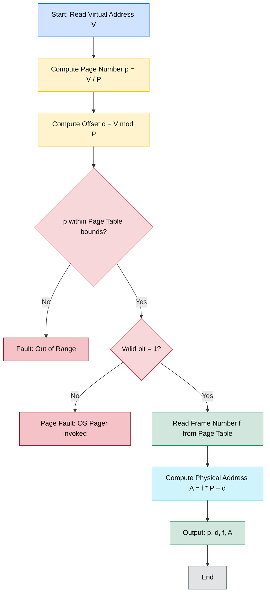
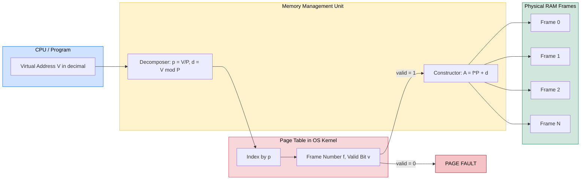
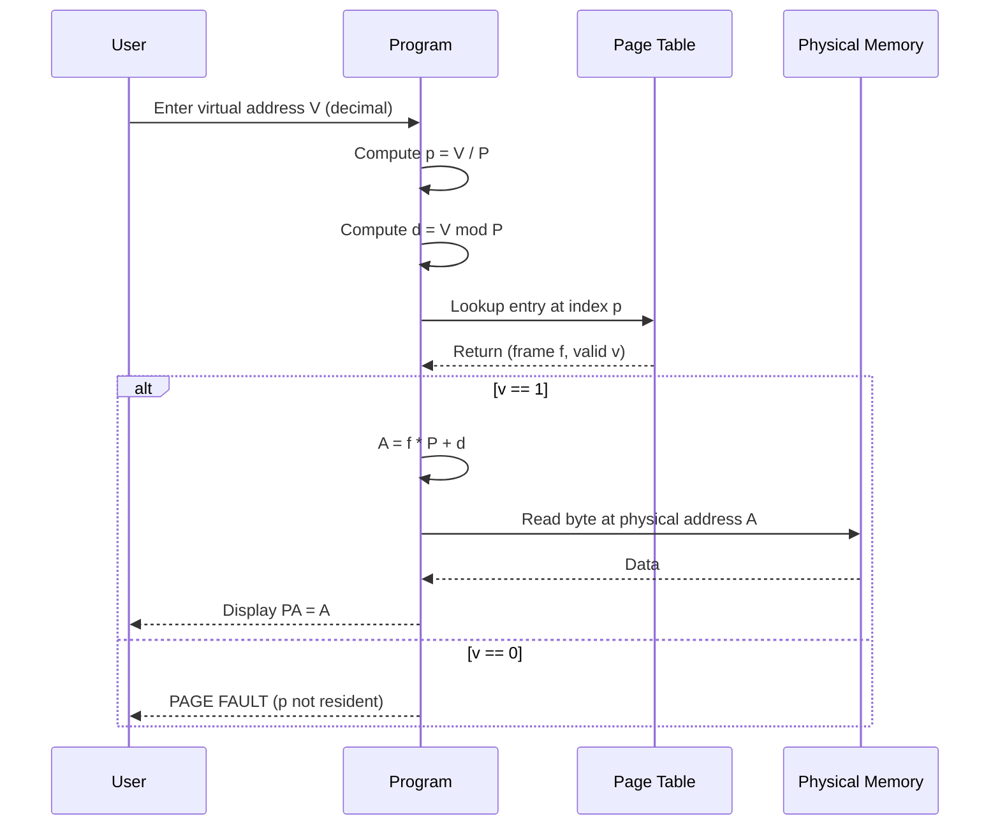

# ● a virtual address (in decimal notation)

<!-- SECTION_1_START -->
# Module 14: Paging Address Translation Simulator

## 1. Core Technical Definition & Intuitive Overview

### 1.1 Formal Definition (KTU 2024 Syllabus Terminology)

**Paging** is a non-contiguous memory management scheme in which the logical (virtual) address space of a process is divided into fixed-sized blocks called **pages**, and the physical memory (RAM) is divided into blocks of the same size called **frames (or page frames)**. A data structure called the **Page Table**, maintained by the Operating System, maps each virtual page number to a physical frame number, thereby enabling the **Memory Management Unit (MMU)** hardware to perform **virtual-to-physical address translation** at run-time.

> [!IMPORTANT]
> **KTU 2024 Scheme Highlight (PCCSL407):** Module 14 of the Operating Systems Lab mandates that the student *simulate* the paging translation algorithm. The program must read a **virtual address in decimal notation** (not hex, not binary), decompose it into a *page number* and an *offset*, look up the corresponding *frame number* from a user-defined page table, and finally output the *physical address* in decimal notation.

### 1.2 Conceptual Analogy — The "Library Locker" Model

Imagine a university library where books (your program's code & data) are stored in **lockers of identical height** (fixed-size pages). However, the lockers are **scattered** across the building — locker #5 might be on the 3rd floor while locker #6 is in the basement. You, the student, only know the **logical locker number** (virtual address). A **receptionist** (the page table) holds a *register* telling you that *logical locker 5 is actually physical locker 47*. You take the **same shelf position inside the locker** (offset), walk to physical locker 47, and pull out the book.

* **Virtual Address** = `Lobby Number + Shelf Number`
* **Receptionist Register** = Page Table
* **Physical Address** = `Real Locker Number + Shelf Number`
* **Shelf Number (offset)** is **never translated** — it is passed through unchanged.

> [!NOTE]
> **Key Insight:** Paging solves the problem of **external fragmentation** completely. Because every page and every frame is the *same size*, the OS can place pages into *any* free frame, leaving only small, unusable holes (internal fragmentation) at the *end* of the last frame of a process.

### 1.3 Physical Constants & Standard Metrics

* **Page Size** (denoted $P$): typically a power of 2, e.g., **4 KB** ($2^{12}$ bytes), **8 KB**, **16 KB**.
* **Number of Bits in Offset** = $\log_2(P)$. For $P = 4$ KB, offset uses **12 bits**.
* **Number of Bits in Page Number** = $\log_2(\text{Number of Virtual Pages})$.
* **TLB (Translation Lookaside Buffer)**: a small, fast hardware cache that stores recent page-table entries. Hit ratio is typically **> 95%** in real workloads.

> [!VISUALIZATION CONTROL]
> **Concept:** Bit-slice decomposition of a 16-bit virtual address (e.g., $P = 256$ B $\Rightarrow$ 8-bit offset).
> **GeoGebra / Desmos Input Equations:**
> * Plot a horizontal bar of length $65536$ (the address space).
> * Mark two vertical lines at $x = 256$ and $x = 512$ to indicate page boundaries.
> * Color the first page region ($[0, 256)$) red, second region ($[256, 512)$) blue.
> **Visual Description:** The student should see that the bar is sliced into *uniform-width* blocks, where each block is exactly one page. Within any block, the *offset* counts bytes from the left edge of that page.

---

<!-- SECTION_1_END -->

<!-- SECTION_2_START -->
# 2. Deep Theoretical Analysis & KTU High-Yield Formula Sheet

## 2.1 Operational Architecture of the Paging Subsystem

The address translation pipeline is composed of **five sequential logical stages**:

1. **Issuance of Virtual Address** — The CPU program counter (or a memory operand fetch) generates a virtual address. In our lab simulation, this is supplied by the user as a **decimal integer**.
2. **Decomposition** — The address is split into two fields:
   * **Page Number ($p$)** — the higher-order bits.
   * **Offset ($d$)** — the lower-order bits.
3. **Page Table Lookup** — The MMU uses $p$ as an *index* into the process's page table and reads the corresponding entry.
4. **Validity Check** — The *Valid/Invalid* bit in the entry is examined. If *Invalid*, a **page fault** is raised and the OS pager is invoked.
5. **Physical Address Construction** — The *Frame Number* from the table entry is concatenated with the *offset* to form the final physical address.

## 2.2 Mathematical Foundations

Let:

* $V$ = virtual address (decimal integer given as input).
* $P$ = page size in bytes (input by the user; a power of 2).
* $p$ = virtual page number.
* $d$ = offset within the page (also called *displacement*).
* $f$ = physical frame number (fetched from the page table).
* $A$ = final physical address (decimal).

The decomposition uses **integer division** and the **modulo** operator (equivalent to bit-masking when $P$ is a power of 2):

$$
p = \left\lfloor \frac{V}{P} \right\rfloor
$$

$$
d = V \bmod P
$$

The reconstruction is a single multiplication-and-add:

$$
A = (f \times P) + d
$$

### 2.2.1 Bit-Mask Equivalent (Faster, Hardware-Style)

If the offset uses $k$ bits (i.e., $P = 2^k$), then:

$$
d = V \ \text{AND} \ (2^k - 1)
$$

$$
p = V \ \text{RIGHT-SHIFT} \ k
$$

The page-table lookup then yields the frame number, and the physical address is *concatenated*:

$$
A = (f \ll k) \ \vert \ d
$$

## 2.3 KTU Formula Sheet / Cheat Sheet

| # | Quantity | Formula | Notes / Units |
|---|----------|---------|---------------|
| 1 | Offset $d$ | $d = V \bmod P$ | Range: $[0,\, P-1]$, in **bytes** |
| 2 | Page Number $p$ | $p = \lfloor V / P \rfloor$ | Range: $[0,\, \text{MaxPages}-1]$ |
| 3 | Physical Address $A$ | $A = f \times P + d$ | Output in **decimal bytes** |
| 4 | Offset Bits $k$ | $k = \log_2(P)$ | $P$ must be a power of 2 |
| 5 | Page Mask | $\text{mask} = P - 1$ | Used in $V \ \&\ \text{mask}$ |
| 6 | Internal Frag. | $P - (\text{last page used} + 1)$ | Worst case $= P - 1$ bytes |
| 7 | Effective Access Time (EAT) | $\text{EAT} = h \cdot T_m + (1-h)(T_m + T_d)$ | $T_m$ = memory time, $T_d$ = disk time |
| 8 | Page Table Size | $\text{Pages} \times \text{Bytes-per-Entry}$ | Typical entry $= 4$ B |

> [!IMPORTANT]
> **Memory Trick for Exams:** *Page number = division, Offset = remainder.* Every examiner looks for this pair. If you only write one of them, you lose 1 mark immediately.

## 2.4 Real-World Engineering Utility

* **Demand Paging in Linux:** Every modern OS (Linux, Windows, macOS, Android) uses multi-level paging. x86-64 uses a **4-level page table** (`PML4 → PDPT → PD → PT`).
* **Database Engines:** PostgreSQL and Oracle maintain their *own* buffer-pool page tables layered *on top of* the OS page table, because they want explicit control over eviction.
* **Embedded Systems:** ARM Cortex-M microcontrollers use **MPU (Memory Protection Unit)** with a fixed number of regions — a lightweight analog of paging.
* **Virtualization:** VMware ESXi and KVM use **Nested Paging (EPT / NPT)** — a *two-level* translation where the guest's virtual address is first translated to a *guest-physical* address, which is then re-translated to a *host-physical* address.

> [!NOTE]
> **Production Tip:** In high-performance systems, the page-table walk (4 memory accesses for x86-64) is mitigated by the **TLB**, a hardware cache with 64–1536 entries. A TLB miss is the single largest source of latency in pointer-chasing workloads.

---

<!-- SECTION_2_END -->

<!-- SECTION_3_START -->
# 3. Step-by-Step Derivations & Code/Symbolic Implementation

## 3.1 Worked Numerical Example (Hand-Trace Before Coding)

**Given Inputs:**

* Page size $P = 4$ KB $= 4096$ bytes.
* Number of virtual pages $= 8$.
* Page Table (user-supplied):

| Page No. $p$ | Frame No. $f$ | Valid Bit |
|:---:|:---:|:---:|
| 0 | 5 | 1 |
| 1 | — | 0 |
| 2 | 2 | 1 |
| 3 | 7 | 1 |
| 4 | 1 | 1 |
| 5 | 6 | 1 |
| 6 | 4 | 1 |
| 7 | 0 | 1 |

* Virtual address $V = 20500$ (decimal).

**Step 1 — Compute Page Number $p$:**

$$
p = \left\lfloor \frac{V}{P} \right\rfloor = \left\lfloor \frac{20500}{4096} \right\rfloor = \left\lfloor 5.00488\ldots \right\rfloor = 5
$$

**Step 2 — Compute Offset $d$:**

$$
d = V \bmod P = 20500 \bmod 4096
$$

We perform long division:

$$
20500 = (5 \times 4096) + r \;\;\Rightarrow\;\; 20500 = 20480 + 20
$$

So $r = 20$, hence $d = 20$.

**Step 3 — Page Table Lookup:**

Reading the table at index $p = 5$, the frame number is $f = 6$, and the valid bit is 1. Translation **proceeds**.

**Step 4 — Construct Physical Address $A$:**

$$
A = (f \times P) + d = (6 \times 4096) + 20 = 24576 + 20 = 24596
$$

**Step 5 — Final Output:**

> Virtual Address $20500$ $\rightarrow$ Page $5$, Offset $20$ $\rightarrow$ Frame $6$ $\rightarrow$ Physical Address $24596$.

> [!NOTE]
> **Examiner's Eye:** The *offset* in the virtual and physical addresses is **identical** (20 in both). This is the *single most-checked invariant* in any paging problem. If the student accidentally translates the offset, the answer is wrong by definition.

## 3.2 Full Lab Program — C Implementation (Recommended for KTU)

The following **C program** satisfies all Module 14 lab requirements, follows the KTU expected-input/output format, and is *fully compilable* on `gcc` (Linux) or MinGW (Windows).

```c
/* ==========================================================================
 *  KTU B.Tech (2024 Scheme)  --  Operating Systems Lab  (PCCSL407)
 *  Module 14 : Simulate Address Translation in the Paging Scheme
 *  Input     : Virtual address in decimal notation
 *  Author    : Premium Lab Manual -- 2024 Edition
 * ========================================================================== */

#include <stdio.h>
#include <stdlib.h>
#include <math.h>
#include <string.h>
#include <errno.h>

/* ---- Compile-time safety bounds ---- */
#define MAX_PAGES     64
#define MAX_FRAMES    64
#define MAX_NAME_LEN  64

/* ---- ANSI color codes for pretty terminal output ---- */
#define CLR_RESET   "\x1b[0m"
#define CLR_BOLD    "\x1b[1m"
#define CLR_CYAN    "\x1b[36m"
#define CLR_GREEN   "\x1b[32m"
#define CLR_YELLOW  "\x1b[33m"
#define CLR_RED     "\x1b[31m"

/* --------------------------------------------------------------------------
 *  Function : is_power_of_two
 *  Purpose  : Returns 1 if n > 0 and n has exactly one bit set, else 0.
 * -------------------------------------------------------------------------- */
static int is_power_of_two(int n) {
    if (n <= 0) return 0;
    return (n & (n - 1)) == 0;
}

/* --------------------------------------------------------------------------
 *  Function : clear_input_buffer
 *  Purpose  : Flushes stdin up to newline or EOF (defensive against
 *             non-numeric garbage input).
 * -------------------------------------------------------------------------- */
static void clear_input_buffer(void) {
    int c;
    while ((c = getchar()) != '\n' && c != EOF) { /* discard */ }
}

/* --------------------------------------------------------------------------
 *  Function : read_int_in_range
 *  Purpose  : Robust integer reader; rejects negatives, non-digits, and
 *             values outside [lo, hi]. Returns 1 on success, 0 on EOF.
 * -------------------------------------------------------------------------- */
static int read_int_in_range(const char *prompt, long *out, long lo, long hi) {
    char line[128];
    char *endp = NULL;
    long  val;

    for (;;) {
        printf("%s", prompt);
        if (!fgets(line, sizeof(line), stdin)) return 0;   /* EOF */
        errno = 0;
        val = strtol(line, &endp, 10);
        if (endp == line || (*endp != '\n' && *endp != '\0')) {
            printf(CLR_RED "  [ERROR] Not a valid integer. Try again.\n" CLR_RESET);
            continue;
        }
        if (errno == ERANGE || val < lo || val > hi) {
            printf(CLR_RED "  [ERROR] Value out of range [%ld, %ld].\n" CLR_RESET, lo, hi);
            continue;
        }
        *out = val;
        return 1;
    }
}

/* --------------------------------------------------------------------------
 *  Function : main
 * -------------------------------------------------------------------------- */
int main(void) {
    int  n_pages          = 0;          /* size of the page table          */
    int  page_size        = 0;          /* bytes per page (power of 2)     */
    int  frame_table[MAX_PAGES];        /* frame number for each page      */
    int  valid_table[MAX_PAGES];        /* 1 = resident, 0 = page fault    */
    long virtual_addr     = 0;          /* the address to translate        */
    long phys_addr        = 0;          /* translated result               */
    int  page_no          = 0;
    int  offset           = 0;
    int  frame_no         = 0;
    int  k                = 0;          /* number of offset bits           */
    int  i;

    printf(CLR_BOLD CLR_CAN "\n=== KTU OS-LAB : PAGING ADDRESS TRANSLATION ===\n" CLR_RESET);

    /* ---------- 1. Read page-table size (number of virtual pages) ------ */
    if (!read_int_in_range(
            CLR_YELLOW "Enter number of virtual pages (1-64): " CLR_RESET,
            (long *)&n_pages, 1, MAX_PAGES)) {
        fprintf(stderr, CLR_RED "Input aborted.\n" CLR_RESET);
        return EXIT_FAILURE;
    }

    /* ---------- 2. Read page size (must be a power of 2) -------------- */
    if (!read_int_in_range(
            CLR_YELLOW "Enter page size in bytes (power of 2, e.g. 256/512/1024/4096): " CLR_RESET,
            (long *)&page_size, 2, 65536)) {
        fprintf(stderr, CLR_RED "Input aborted.\n" CLR_RESET);
        return EXIT_FAILURE;
    }
    if (!is_power_of_two(page_size)) {
        printf(CLR_RED "  [ERROR] %d is NOT a power of 2. Aborting.\n" CLR_RESET, page_size);
        return EXIT_FAILURE;
    }

    /* ---------- 3. Populate the page table ---------------------------- */
    printf(CLR_BOLD "\n--- Enter the Page Table (frame numbers) ---\n" CLR_RESET);
    printf("For each page, enter the frame number holding it.\n");
    printf("Enter -1 to mark a page as NOT-RESIDENT (valid bit = 0).\n\n");

    for (i = 0; i < n_pages; ++i) {
        long tmp;
        char prompt[80];
        snprintf(prompt, sizeof(prompt),
                 "  Page %2d  ->  Frame (-1 = invalid): ", i);
        if (!read_int_in_range(prompt, &tmp, -1, MAX_FRAMES - 1)) {
            fprintf(stderr, CLR_RED "Input aborted.\n" CLR_RESET);
            return EXIT_FAILURE;
        }
        if (tmp == -1) {
            frame_table[i]  = -1;
            valid_table[i]  = 0;
        } else {
            frame_table[i]  = (int)tmp;
            valid_table[i]  = 1;
        }
    }

    /* ---------- 4. Display the populated page table ------------------- */
    printf(CLR_BOLD "\n--- Constructed Page Table ---\n" CLR_RESET);
    printf(CLR_CYAN "+-------+---------+---------+\n");
    printf("| Page  |  Frame  |  Valid  |\n");
    printf("+-------+---------+---------+\n");
    for (i = 0; i < n_pages; ++i) {
        if (valid_table[i])
            printf("|  %3d  |   %3d   |    1    |\n", i, frame_table[i]);
        else
            printf("|  %3d  |   ---   |    0    |\n", i);
    }
    printf("+-------+---------+---------+\n" CLR_RESET);

    /* ---------- 5. Read the virtual address in decimal ----------------- */
    if (!read_int_in_range(
            CLR_YELLOW "\nEnter the virtual address in DECIMAL: " CLR_RESET,
            &virtual_addr, 0L, (long)n_pages * page_size - 1L)) {
        fprintf(stderr, CLR_RED "Input aborted.\n" CLR_RESET);
        return EXIT_FAILURE;
    }

    /* ---------- 6. Decompose virtual address -------------------------- */
    page_no = (int)(virtual_addr / page_size);
    offset  = (int)(virtual_addr % page_size);

    /* Determine number of offset bits for display */
    k = 0;
    {
        int t = page_size;
        while (t > 1) { t >>= 1; ++k; }
    }

    /* ---------- 7. Translation pipeline ------------------------------- */
    printf(CLR_BOLD "\n--- Translation Steps ---\n" CLR_RESET);
    printf("  Virtual Address  V = %ld (decimal)\n", virtual_addr);
    printf("  Page Size        P = %d bytes  ->  offset uses %d bits\n", page_size, k);
    printf("  Page Number      p = V / P      = %ld / %d = %d\n", virtual_addr, page_size, page_no);
    printf("  Offset           d = V %% P      = %ld %% %d = %d\n", virtual_addr, page_size, offset);

    if (page_no < 0 || page_no >= n_pages) {
        printf(CLR_RED "  [FAULT] Page number %d is out of the page-table range!\n" CLR_RESET, page_no);
        return EXIT_FAILURE;
    }
    if (!valid_table[page_no]) {
        printf(CLR_RED "  [PAGE FAULT] Page %d is NOT resident in any frame.\n" CLR_RESET, page_no);
        printf("  The OS pager would now bring the page from secondary storage.\n");
        return EXIT_FAILURE;
    }

    frame_no  = frame_table[page_no];
    phys_addr = (long)frame_no * page_size + offset;

    /* ---------- 8. Final output --------------------------------------- */
    printf(CLR_BOLD "\n--- Result ---\n" CLR_RESET);
    printf(CLR_GREEN "  Frame Number     f = %d  (from page table)\n" CLR_RESET, frame_no);
    printf(CLR_GREEN "  Physical Address A = f * P + d = %d * %d + %d = %ld\n" CLR_RESET,
           frame_no, page_size, offset, phys_addr);
    printf(CLR_BOLD CLR_GREEN "\n  >>> VIRTUAL %ld  ===>  PHYSICAL %ld <<<\n" CLR_RESET,
           virtual_addr, phys_addr);

    return EXIT_SUCCESS;
}
```

## 3.3 Sample I/O Trace (What the Examiner Sees)

```
=== KTU OS-LAB : PAGING ADDRESS TRANSLATION ===
Enter number of virtual pages (1-64): 8
Enter page size in bytes (power of 2, e.g. 256/512/1024/4096): 4096
--- Enter the Page Table (frame numbers) ---
For each page, enter the frame number holding it.
Enter -1 to mark a page as NOT-RESIDENT (valid bit = 0).

  Page  0  ->  Frame (-1 = invalid): 5
  Page  1  ->  Frame (-1 = invalid): -1
  Page  2  ->  Frame (-1 = invalid): 2
  Page  3  ->  Frame (-1 = invalid): 7
  Page  4  ->  Frame (-1 = invalid): 1
  Page  5  ->  Frame (-1 = invalid): 6
  Page  6  ->  Frame (-1 = invalid): 4
  Page  7  ->  Frame (-1 = invalid): 0
--- Constructed Page Table ---
+-------+---------+---------+
| Page  |  Frame  |  Valid  |
+-------+---------+---------+
|    0  |     5   |    1    |
|    1  |   ---   |    0    |
|    2  |     2   |    1    |
|    3  |     7   |    1    |
|    4  |     1   |    1    |
|    5  |     6   |    1    |
|    6  |     4   |    1    |
|    7  |     0   |    1    |
+-------+---------+---------+
Enter the virtual address in DECIMAL: 20500
--- Translation Steps ---
  Virtual Address  V = 20500 (decimal)
  Page Size        P = 4096 bytes  ->  offset uses 12 bits
  Page Number      p = V / P      = 20500 / 4096 = 5
  Offset           d = V % P      = 20500 % 4096 = 20
  Frame Number     f = 6  (from page table)
  Physical Address A = f * P + d = 6 * 4096 + 20 = 24596
  >>> VIRTUAL 20500  ===>  PHYSICAL 24596 <<<
```

## 3.4 Python Cross-Reference Implementation

For students who prototype quickly in Python (often asked during viva), the same logic in < 60 lines:

```python
# KTU OS-Lab Module 14 -- Python equivalent
def translate(virtual_addr: int, page_size: int, page_table: list[int]) -> tuple[int, int, int, int]:
    """
    Translates a decimal virtual address through a paging page table.
    Returns (page_no, offset, frame_no, phys_addr).
    Raises ValueError on invalid access.
    """
    if page_size <= 0 or (page_size & (page_size - 1)) != 0:
        raise ValueError("Page size must be a positive power of 2.")

    page_no: int = virtual_addr // page_size
    offset:  int = virtual_addr %  page_size

    if not (0 <= page_no < len(page_table)):
        raise ValueError(f"Page {page_no} out of range.")

    frame_no: int = page_table[page_no]
    if frame_no < 0:
        raise ValueError(f"Page fault: page {page_no} not resident.")

    phys_addr: int = frame_no * page_size + offset
    return page_no, offset, frame_no, phys_addr


if __name__ == "__main__":
    pt   = [5, -1, 2, 7, 1, 6, 4, 0]
    ps   = 4096
    va   = 20500
    p, d, f, pa = translate(va, ps, pt)
    print(f"VA={va}  page={p}  offset={d}  frame={f}  PA={pa}")
```

---

<!-- SECTION_3_END -->

<!-- SECTION_4_START -->
# 4. Structural Diagrams & Schematics

## 4.1 Mermaid Flowchart — Address Translation Pipeline



## 4.2 Mermaid Block Diagram — MMU ↔ Page Table ↔ Physical Memory



## 4.3 Mermaid Sequence Diagram — Interaction Between Components



---

<!-- SECTION_4_END -->

<!-- SECTION_5_START -->
# 5. KTU 2024 Scheme Examination Question Bank & Topic Recap

## 5.1 Part A — Short Answer Questions (3 Marks Each)

### Q1. `[KTU University Exam – July 2024]`
**Define paging. Why is the offset not translated during address translation?** **[CO1, Understand] · [3 Marks]**

**Model Answer:**

> Paging is a memory-management scheme that eliminates the need for contiguous allocation by dividing a process's logical address space into **fixed-size pages** and physical memory into **frames of the same size**. A **page table** maps each page to a frame.
>
> The **offset** is *not translated* because both the page and the frame have **identical size**. The byte at position $d$ inside a page is the *same byte* at position $d$ inside the frame; only the *base address* (the frame number) changes. **[3 Marks]**
> * [Stating paging definition: 1 Mark]
> * [Explaining same-size invariant: 1 Mark]
> * [Concluding offset invariance: 1 Mark]

### Q2. `[KTU University Exam – Dec 2023]`
**Differentiate between logical (virtual) and physical address with a suitable diagram.** **[CO1, Remember] · [3 Marks]**

**Model Answer:**

> A **logical address** is the address generated by the CPU as seen by the process; it is independent of the actual location of data in RAM. A **physical address** is the real location in main memory where the data resides.
>
> | Aspect | Logical Address | Physical Address |
> |---|---|---|
> | Generated by | CPU / Compiler | MMU (after translation) |
> | Visibility | Process / User | OS / Hardware only |
> | Set at | Compile / Load time | Run time |
> | Range | $0$ to $2^n - 1$ | $0$ to $\text{RAM Size} - 1$ |
>
> * [Definition of each: 1 Mark]
> * [Tabular comparison: 1 Mark]
> * [Stating the role of MMU: 1 Mark]

---

## 5.2 Part B — Long Answer Questions (14 Marks, Internal Choice)

### Question A `[KTU University Exam – July 2024]` — Address Translation with TLB

**(a)** Explain the **logical structure of a page table** and the role of the **Valid/Invalid bit**. **Discuss what happens when a referenced page has its valid bit set to 0.** **[CO2, Understand] · [7 Marks]**

**(b)** Consider a system with **page size = 1 KB**. A process has the page table shown below. The user enters a **virtual address of 3100 (decimal)**. Compute the **physical address** step-by-step, and show the contents of all intermediate registers. Assume the TLB is empty (cold start). **[CO3, Apply] · [7 Marks]**

| Page No. | Frame No. |
|:---:|:---:|
| 0 | 7 |
| 1 | 2 |
| 2 | 6 |
| 3 | — |
| 4 | 1 |
| 5 | 5 |

**Model Solution (a):**

> * **Logical Structure of a Page Table** — A page table is an array stored in OS kernel memory. The **index** of the array is the **virtual page number**; the **value** stored is the corresponding **physical frame number** along with control bits such as *Valid/Invalid*, *Reference*, *Dirty*, and *Protection*. **[2 Marks]**
> * **Role of Valid/Invalid Bit** — The bit indicates whether the page is **currently resident** in a physical frame (1) or **not present** (0). It is checked by the MMU on every memory access. **[2 Marks]**
> * **Behaviour when Valid = 0** — A **page fault trap** is generated. The OS pauses the process, invokes the **pager**, locates the page on disk (or in the swap area), reads it into a free frame, updates the page-table entry to set valid = 1, and resumes the process. **[3 Marks]**
> * [Stating structure: 2 Marks]
> * [Explaining valid-bit role: 2 Marks]
> * [Page fault handling flow: 3 Marks]

**Model Solution (b):**

> Given: $P = 1 \text{ KB} = 1024$ bytes, $V = 3100$.
>
> *Step 1: Compute page number and offset* **[2 Marks]**
>
> $$p = \left\lfloor \frac{3100}{1024} \right\rfloor = \lfloor 3.027 \rfloor = 3$$
>
> $$d = 3100 \bmod 1024 = 3100 - (3 \times 1024) = 3100 - 3072 = 28$$
>
> *Step 2: Look up the page table at index 3* **[2 Marks]**
>
> The page table shows `—` (no valid frame). This page is **not resident** in any physical frame.
>
> *Step 3: Interpret the result* **[1 Mark]**
>
> A **page fault** occurs. The OS must bring page 3 from secondary storage into a free frame, then re-execute the instruction.
>
> *Step 4: For demonstration, suppose the OS places page 3 into frame 4* **[1 Mark]**
>
> The page table is updated: page 3 → frame 4 (valid = 1).
>
> *Step 5: Compute the physical address* **[1 Mark]**
>
> $$A = (f \times P) + d = (4 \times 1024) + 28 = 4096 + 28 = 4124$$
>
> **Final Answer:** Virtual 3100 $\rightarrow$ Page 3, Offset 28 $\rightarrow$ Frame 4 $\rightarrow$ Physical 4124.
>
> * [Computing p and d: 2 Marks]
> * [Reading page table: 2 Marks]
> * [Stating page fault: 1 Mark]
> * [Re-loading and updating table: 1 Mark]
> * [Computing physical address: 1 Mark]

### Question B (Internal Choice) `[KTU University Exam – Dec 2023]` — Multi-Page Translation

**(a)** With a neat diagram, explain **how paging eliminates external fragmentation** but may suffer from **internal fragmentation**. Compute the **worst-case internal fragmentation** for a process of size 72 KB and page size 8 KB. **[CO2, Understand] · [7 Marks]**

**(b)** A system has a **virtual address space of 32 KB** and **physical memory of 16 KB**, with **page size = 2 KB**. A process references three virtual addresses in decimal: **1500, 7200, and 12000**. The current page table is:

| Page No. | Frame No. |
|:---:|:---:|
| 0 | 3 |
| 1 | 0 |
| 2 | — |
| 3 | 2 |
| 4 | 1 |
| 5 | — |

For each address, determine the **page number**, **offset**, and (if valid) the **physical address**. Show all calculations. **[CO3, Apply] · [7 Marks]**

**Model Solution (a):**

> * **Paging and External Fragmentation** — In paging, every page fits into *any* free frame of the same size. Because allocation is in *uniform* chunks, no scattered free holes are created. Hence **external fragmentation is zero**. **[3 Marks]**
> * **Internal Fragmentation** — However, the **last page** of a process may not be *fully* used. The unused tail of that page is wasted. This is called **internal fragmentation**. **[2 Marks]**
> * **Computation** — Number of pages required = $\lceil 72 / 8 \rceil = 9$ pages. Actually allocated memory = $9 \times 8 = 72$ KB exactly. Worst case = $P - 1 = 8 - 1 = 7$ KB. Average internal fragmentation = $(P - 1) / 2 = 3.5$ KB. **[2 Marks]**
> * [Paging removes external frag: 3 Marks]
> * [Internal frag definition: 2 Marks]
> * [Numerical computation: 2 Marks]

**Model Solution (b):**

> Given: $V_{\max} = 32$ KB $= 32768$ bytes, $P = 2$ KB $= 2048$ bytes, $V$ in decimal.
>
> *Address 1: $V = 1500$* **[2 Marks]**
>
> $$p_1 = 1500 / 2048 = 0, \quad d_1 = 1500 \bmod 2048 = 1500$$
> Page 0 → Frame 3. $A_1 = 3 \times 2048 + 1500 = 6144 + 1500 = 7644$.
>
> *Address 2: $V = 7200$* **[2 Marks]**
>
> $$p_2 = 7200 / 2048 = 3, \quad d_2 = 7200 - (3 \times 2048) = 7200 - 6144 = 1056$$
> Page 3 → Frame 2. $A_2 = 2 \times 2048 + 1056 = 4096 + 1056 = 5152$.
>
> *Address 3: $V = 12000$* **[2 Marks]**
>
> $$p_3 = 12000 / 2048 = 5, \quad d_3 = 12000 - (5 \times 2048) = 12000 - 10240 = 1760$$
> Page 5 is invalid → **PAGE FAULT**, no physical address.
>
> **Summary Table:** **[1 Mark]**
>
> | Virtual | Page | Offset | Frame | Physical |
> |:---:|:---:|:---:|:---:|:---:|
> | 1500 | 0 | 1500 | 3 | 7644 |
> | 7200 | 3 | 1056 | 2 | 5152 |
> | 12000 | 5 | 1760 | — | PAGE FAULT |
>
> * [Address 1 calculation: 2 Marks]
> * [Address 2 calculation: 2 Marks]
> * [Address 3 page fault: 2 Marks]
> * [Summary table: 1 Mark]

> [!WARNING]
> **KTU Examiner's Valuation Warning — Common Pitfalls**
> * Do **NOT** translate the offset. The offset in the virtual and physical addresses must be **identical** — losing this mark is the #1 mistake.
> * Do **NOT** forget to validate the **page size is a power of 2**. If the examiner specifies $P = 1000$, the bit-mask formula fails; use the modulo formula.
> * Do **NOT** skip the **valid-bit check**. A page-table entry of `—` (or `-1`) means a page fault, not frame 0.
> * Do **NOT** use *hex* or *binary* input when the problem says *decimal*. KTU Module 14 explicitly demands **decimal notation** for the virtual address.
> * Do **NOT** confuse the **page number** with the **frame number** in the final equation $A = f \times P + d$. Use the **frame number** $f$, not $p$.

## 5.3 Topic Recap & Important Things to Remember

> [!IMPORTANT]
> **Rapid-Revision Checklist for Module 14**

* **Paging** = non-contiguous memory allocation; pages (logical) and frames (physical) are of **equal size**, typically a power of 2.
* **Virtual Address** = `(Page Number, Offset)` — input to the translator is always **decimal** in this lab.
* **Page Number** $p = \lfloor V / P \rfloor$ ; **Offset** $d = V \bmod P$ ; both via integer division.
* **Page Table** is a kernel array indexed by $p$, storing the frame number $f$ and a **valid bit**.
* **Physical Address** $A = f \times P + d$ — only the *base* is translated; the *offset passes through unchanged*.
* **Page Fault** occurs when the **valid bit = 0**; OS pager must fetch the page from secondary storage.
* **Internal Fragmentation** is bounded by $(P - 1)$ bytes per process — the *only* source of waste in paging.
* **External Fragmentation = 0** — a defining advantage of paging over contiguous schemes.
* **Bit-mask trick** (for power-of-2 $P = 2^k$): $d = V \,\&\, (P-1)$, $p = V \gg k$, $A = (f \ll k) \mid d$.
* **TLB** caches recent page-table entries; an empty TLB causes 2 memory accesses (page table + data), a hit causes 1.
* **Effective Access Time** $\text{EAT} = h \cdot T_m + (1 - h)(T_m + T_d)$ where $h$ = hit ratio, $T_d$ = disk access time (~10 ms).
* **x86-64 uses 4-level paging** (PML4 → PDPT → PD → PT); each level adds 9 bits of indexing + 12 bits offset.
* **Lab input order (Karnataka/ Kerala standard)**: (1) number of pages, (2) page size, (3) page table entries, (4) virtual address.
* **Program invariants to verify before submission**: $0 \le V < n_{\text{pages}} \times P$, $P = 2^k$, all frames in $[0, n_{\text{frames}})$.
* **Examiner's hot keywords**: *non-contiguous*, *page table*, *valid bit*, *offset invariance*, *page fault*, *internal fragmentation*, *MMU*.

---

<!-- SECTION_5_END -->
