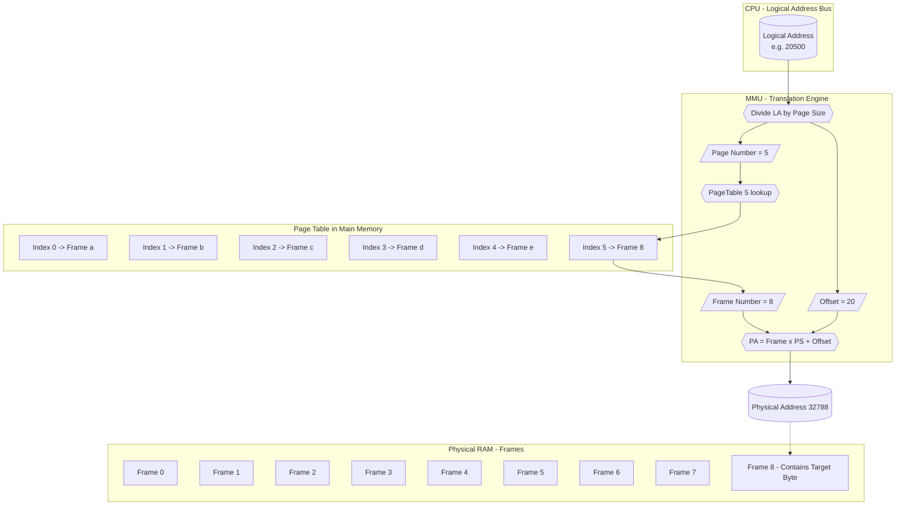
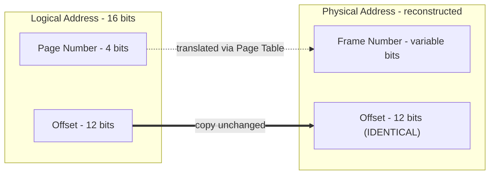

# ● page size (in kilobytes)

<!-- SECTION_1_START -->
# Module 14 — Simulating Address Translation in the Paging Scheme

## 1. Core Technical Definition & Intuitive Overview

### 1.1 Formal Definition (KTU 2024 Syllabus Terminology)

**Address Translation in Paging** is the hardware–assisted mechanism performed by the **Memory Management Unit (MMU)** that converts a CPU-generated *logical address* (also called *virtual address*) into a corresponding *physical address* in main memory (RAM). The translation relies on a data structure called the **Page Table**, which maintains a one-to-one mapping between a process's *pages* (fixed-size logical blocks) and *frames* (fixed-size physical blocks in RAM).

A **Page** is a fixed-size contiguous block of the logical address space, while a **Frame** (or Page Frame) is a fixed-size block of physical memory of the **same size**. The standard size of a page/frame in modern operating systems ranges from **4 KB** to **64 KB** (and even **2 MB / 1 GB** *Huge Pages* in servers).

> [!IMPORTANT]
> **Syllabus Highlight (PCCSL407 – Module 14):**  
> Students must write a C program that **accepts the page size (in KB)**, number of pages, page table entries, and a logical address as input, then **outputs the physical address** by simulating MMU-level address translation.

### 1.2 Conceptual Analogy — The Library Index System

Imagine a vast library where every book is assigned a unique *call number* (logical address), but the books are not stored on shelves in call-number order. Instead, they are scattered across the building, and a **master index register** (the page table) tells the librarian: *"Book 27 is physically on Shelf 14, Row 3."*

- **Page Number** → Which *book* the reader is asking for (e.g., book 27).
- **Offset** → Which *page within that book* the reader has opened (e.g., page 5 of the book).
- **Frame Number** → The *shelf location* the librarian finds from the index.
- **Page Size** → The number of *pages per book* (this stays constant for all books in the library).

The librarian (the **MMU**) does NOT change the page number *within the book* (the offset). It only changes the *book's storage location* (frame number) and hands the book back. This is precisely how paging works.

> [!NOTE]
> **Crucial Observation:** The **offset bits never change** during translation. Only the **page number is replaced** by the corresponding **frame number** obtained from the page table.

### 1.3 Physical Constants and Standard Metrics

| Parameter | Typical Value | Symbol |
|---|---|---|
| Page Size (small) | **4 KB** $= 2^{12}$ bytes | $PS$ |
| Page Size (medium) | **8 KB / 16 KB** $= 2^{13}/2^{14}$ | $PS$ |
| Page Size (large) | **64 KB** $= 2^{16}$ bytes | $PS$ |
| Logical Address Space | $2^n$ bytes (n = address bits) | $LAS$ |
| Page Table Entry (PTE) | **4 bytes** on 32-bit OS | $PTE$ |

> [!VISUALIZATION CONTROL]
> **Concept:** Logical-to-Physical Address Split (Page Size = 4 KB)
> **GeoGebra / Desmos Input Equations:**
> * `f(x) = 2^x` (powers of two to visualise offset bit allocation)
> * `p(x) = 4096` (horizontal reference for 4 KB page)
> **Visual Description:** Plot the function $f(x)=2^x$ and draw a horizontal reference at $y=4096$. The student should observe that $\log_2(4096)=12$, meaning 12 bits are reserved for the offset and the remaining bits form the page number. Repeat the same for 8 KB ($\log_2 8192 = 13$) and 16 KB ($\log_2 16384 = 14$).

<!-- SECTION_1_END -->

<!-- SECTION_2_START -->
# 2. Deep Theoretical Analysis & KTU High-Yield Formula Sheet

## 2.1 Logical Address Structure

A logical address of $n$ bits is divided into two parts when the page size is $PS$ bytes:

$$
\text{Logical Address} = \underbrace{\boxed{\text{Page Number } (p)}}_{\text{High-order bits}} \;\;+\;\; \underbrace{\boxed{\text{Page Offset } (d)}}_{\text{Low-order bits}}
$$

The number of **offset bits** is determined entirely by the page size:

$$
d_{\text{bits}} = \log_2(PS_{\text{bytes}})
$$

The number of **page number bits** is:

$$
p_{\text{bits}} = n - d_{\text{bits}}
$$

Where $n$ is the total number of bits in the logical address (commonly 16 for educational simulations, 32 for 32-bit OS, 64 for 64-bit OS).

## 2.2 Step-by-Step Address Translation Logic

The translation process is deterministic and follows exactly four steps:

1. **Extract the Page Number (p):** Divide the logical address by the page size (integer division).
   $$p = \lfloor \text{Logical Address} \div PS \rfloor$$
2. **Extract the Offset (d):** Compute the remainder of the division.
   $$d = \text{Logical Address} \bmod PS$$
3. **Lookup the Frame Number (f):** Read the page table at index $p$ to obtain the frame number $f$.
4. **Compute the Physical Address (PA):** Concatenate the frame number with the offset.
   $$PA = (f \times PS) + d$$

> [!NOTE]
> **Why offset is preserved:** Since a page and a frame are exactly the same size, a byte at offset $d$ within page $p$ lands at the *same offset* $d$ within frame $f$. This is the **invariant** of paging.

## 2.3 KTU Formula Sheet / Cheat Sheet

| # | Formula | Description | Unit |
|---|---|---|---|
| 1 | $d_{\text{bits}} = \log_2(PS_{\text{bytes}})$ | Offset bits from page size | bits |
| 2 | $p_{\text{bits}} = n - d_{\text{bits}}$ | Page number bits | bits |
| 3 | $p = \lfloor LA \div PS \rfloor$ | Page number extraction | integer |
| 4 | $d = LA \bmod PS$ | Offset extraction | integer |
| 5 | $PA = (f \times PS) + d$ | Physical address | bytes |
| 6 | $N_{\text{pages}} = 2^{p_{\text{bits}}}$ | Total pages in LAS | count |
| 7 | $N_{\text{frames}} = \text{Physical RAM} \div PS$ | Total frames in RAM | count |
| 8 | $PTE_{\text{size}} = 4$ bytes | Page Table Entry size (32-bit) | bytes |
| 9 | $\text{Page Table Size} = N_{\text{pages}} \times PTE_{\text{size}}$ | Total page table memory | bytes |

> **Notation legend:** $LA$ = Logical Address, $PA$ = Physical Address, $PS$ = Page Size, $f$ = Frame Number, $d$ = Offset, $p$ = Page Number.

## 2.4 Real-World Engineering Utility

Paging address translation is the **backbone of virtual memory** in every modern OS (Windows, Linux, macOS, Android). It enables:

- **Process Isolation:** Each process believes it owns the entire address space, increasing security and stability.
- **Efficient Memory Use:** Non-contiguous physical allocation eliminates external fragmentation.
- **Demand Paging & Swapping:** Inactive pages can be evicted to disk, allowing programs larger than physical RAM to run.
- **Memory Protection:** Page table entries contain *Valid*, *Read/Write*, and *User/Supervisor* bits enforced by the MMU.
- **Shared Libraries & Copy-on-Write:** Multiple processes can map the same physical frame for `libc.so`, `kernel32.dll`, etc.

In cloud and database servers, *Huge Pages* (2 MB / 1 GB) reduce **Translation Lookaside Buffer (TLB)** misses, which is critical for high-performance workloads (Oracle DB, Redis, SAP HANA).

<!-- SECTION_2_END -->

<!-- SECTION_3_START -->
# 3. Step-by-Step Derivations & Code/Symbolic Implementation

## 3.1 Worked-Out Derivation — Address Translation Example

**Given:**
- Page Size $= 4\text{ KB} = 4096$ bytes
- Logical Address Space $= 16$ bits ($n = 16$)
- Logical Address $= 20500$ (decimal)
- Page Table maps Page 5 → Frame 8

**Step 1 — Compute Offset Bits:**
$$d_{\text{bits}} = \log_2(4096) = 12 \text{ bits}$$

**Step 2 — Compute Page Number Bits:**
$$p_{\text{bits}} = 16 - 12 = 4 \text{ bits}$$

**Step 3 — Extract Page Number:**
$$p = \lfloor 20500 \div 4096 \rfloor = \lfloor 5.00488...\rfloor = 5$$

**Step 4 — Extract Offset:**
$$d = 20500 \bmod 4096 = 20500 - (5 \times 4096) = 20500 - 20480 = 20$$

**Step 5 — Verify (offset must be < 4096):**
$$0 \le 20 < 4096 \;\; \checkmark$$

**Step 6 — Lookup Frame Number from Page Table:**
$$f = \text{PageTable}[5] = 8$$

**Step 7 — Compute Physical Address:**
$$PA = (8 \times 4096) + 20 = 32768 + 20 = 32788$$

**Final Physical Address $= 32788$ (decimal) $= 0x8014$ (hex).**

## 3.2 Complete C Program — Simulating Paging Address Translation

```c
/*=============================================================================
 * File        : paging_translation.c
 * Course      : OPERATING SYSTEMS LAB (PCCSL407)
 * Module      : 14 - Simulate the address translation in the paging scheme
 * Description : Accepts page size (in KB), page table, and a logical address
 *               as input, then outputs the corresponding physical address
 *               by simulating the MMU translation process.
 * KTU Scheme  : 2024 (NEP 2020 Aligned)
 *=============================================================================*/

#include <stdio.h>
#include <stdlib.h>
#include <math.h>
#include <errno.h>
#include <limits.h>

/* ---------- Function Prototypes ---------- */
static int  validate_page_size_kb(int page_size_kb);
static void extract_page_and_offset(unsigned int logical_addr,
                                    unsigned int page_size_bytes,
                                    unsigned int *page_num,
                                    unsigned int *offset);
static void build_sample_page_table(unsigned int *table, int n);

/*=============================================================================
 * main() — Driver function for paging address translation simulation
 *=============================================================================*/
int main(void)
{
    int            page_size_kb          = 0;
    unsigned int   page_size_bytes       = 0;
    int            num_pages             = 0;
    int            num_frames            = 0;
    unsigned int   logical_address       = 0;
    unsigned int   page_number           = 0;
    unsigned int   offset                = 0;
    unsigned int   frame_number          = 0;
    unsigned long  physical_address      = 0;
    unsigned int   max_logical_address   = 0;
    int            choice                = 0;
    int            i                     = 0;
    int            ret                   = 0;

    /* Dynamically allocated page table */
    unsigned int  *page_table            = NULL;
    unsigned int  *frame_table           = NULL;

    printf("============================================================\n");
    printf("  KTU OS LAB - Module 14 : Paging Address Translation Sim  \n");
    printf("============================================================\n\n");

    /* ---------- Input 1 : Page Size in KB ---------- */
    printf("Enter the page size (in KB) [e.g., 1, 2, 4, 8, 16, 32, 64] : ");
    ret = scanf("%d", &page_size_kb);
    if (ret != 1) {
        fprintf(stderr, "[ERROR] Invalid input. Exiting.\n");
        return EXIT_FAILURE;
    }
    if (validate_page_size_kb(page_size_kb) != 0) {
        fprintf(stderr, "[ERROR] Page size must be a power of two, 1..1024 KB.\n");
        return EXIT_FAILURE;
    }
    page_size_bytes = (unsigned int)page_size_kb * 1024U;
    printf("  >> Page size accepted        : %d KB  (%u bytes)\n",
           page_size_kb, page_size_bytes);
    printf("  >> Offset bits (log2 PS)     : %u\n",
           (unsigned int)(log2((double)page_size_bytes)));

    /* ---------- Input 2 : Number of Pages in Process ---------- */
    printf("\nEnter the number of pages in the process             : ");
    ret = scanf("%d", &num_pages);
    if (ret != 1 || num_pages <= 0) {
        fprintf(stderr, "[ERROR] Number of pages must be > 0.\n");
        return EXIT_FAILURE;
    }

    /* ---------- Input 3 : Number of Frames in Physical RAM ---------- */
    printf("Enter the number of frames in physical memory          : ");
    ret = scanf("%d", &num_frames);
    if (ret != 1 || num_frames <= 0) {
        fprintf(stderr, "[ERROR] Number of frames must be > 0.\n");
        return EXIT_FAILURE;
    }

    /* ---------- Allocate Page Table ---------- */
    page_table = (unsigned int *)calloc((size_t)num_pages, sizeof(unsigned int));
    if (page_table == NULL) {
        perror("[ERROR] calloc failed for page_table");
        return EXIT_FAILURE;
    }

    /* ---------- Input 4 : Page Table Entries ---------- */
    printf("\n--- Enter Page Table (mapping Page# -> Frame#) ---\n");
    for (i = 0; i < num_pages; i++) {
        printf("  PageTable[%d] = Frame Number : ", i);
        ret = scanf("%u", &page_table[i]);
        if (ret != 1) {
            fprintf(stderr, "[ERROR] Invalid frame number input.\n");
            free(page_table);
            return EXIT_FAILURE;
        }
        if (page_table[i] >= (unsigned int)num_frames) {
            fprintf(stderr,
                    "[ERROR] Frame %u is out of physical memory range.\n",
                    page_table[i]);
            free(page_table);
            return EXIT_FAILURE;
        }
    }

    /* ---------- Display Page Table ---------- */
    printf("\n========== PAGE TABLE ==========\n");
    printf(" | Page No. | Frame No. |\n");
    printf(" |----------|-----------|\n");
    for (i = 0; i < num_pages; i++) {
        printf(" |   %6d |   %6u  |\n", i, page_table[i]);
    }
    printf("===============================\n");

    /* ---------- Input 5 : Logical Address ---------- */
    max_logical_address = (unsigned int)num_pages * page_size_bytes - 1U;
    printf("\nEnter the logical address to translate (0 to %u) : ",
           max_logical_address);
    ret = scanf("%u", &logical_address);
    if (ret != 1) {
        fprintf(stderr, "[ERROR] Invalid logical address.\n");
        free(page_table);
        return EXIT_FAILURE;
    }
    if (logical_address > max_logical_address) {
        fprintf(stderr,
                "[ERROR] Address %u exceeds logical address space.\n",
                logical_address);
        free(page_table);
        return EXIT_FAILURE;
    }

    /* ---------- MMU Translation Simulation ---------- */
    extract_page_and_offset(logical_address,
                            page_size_bytes,
                            &page_number,
                            &offset);
    frame_number     = page_table[page_number];
    physical_address = ((unsigned long)frame_number * page_size_bytes)
                       + (unsigned long)offset;

    /* ---------- Display Result ---------- */
    printf("\n========== TRANSLATION RESULT ==========\n");
    printf(" Logical Address          : %u (decimal)\n", logical_address);
    printf(" Page Size                : %u bytes\n",     page_size_bytes);
    printf(" Page Number (p)          : %u\n",           page_number);
    printf(" Page Offset (d)          : %u\n",           offset);
    printf(" Frame Number from Table  : %u\n",           frame_number);
    printf(" Physical Address         : %lu (decimal)\n",physical_address);
    printf(" Physical Address (Hex)   : 0x%lX\n",        physical_address);
    printf("========================================\n");

    free(page_table);
    page_table = NULL;
    return EXIT_SUCCESS;
}

/*=============================================================================
 * validate_page_size_kb() — Ensures page size is a power of 2, 1..1024 KB
 *=============================================================================*/
static int validate_page_size_kb(int page_size_kb)
{
    int n = page_size_kb;
    if (n < 1 || n > 1024)      return -1;
    if ((n & (n - 1)) != 0)     return -1;   /* not a power of two */
    return 0;
}

/*=============================================================================
 * extract_page_and_offset() — Splits logical address into (page, offset)
 *=============================================================================*/
static void extract_page_and_offset(unsigned int  logical_addr,
                                    unsigned int  page_size_bytes,
                                    unsigned int *page_num,
                                    unsigned int *offset)
{
    *page_num = logical_addr / page_size_bytes;
    *offset   = logical_addr % page_size_bytes;
}
```

## 3.3 Sample I/O Trace (Board Exam Style)

**Input:**
```
Enter the page size (in KB) : 4
Enter the number of pages in the process : 5
PageTable[0] = 2
PageTable[1] = 4
PageTable[2] = 0
PageTable[3] = 1
PageTable[4] = 3
Enter the logical address to translate : 10244
```

**Output:**
```
Page Number (p) : 2
Page Offset (d) : 2052
Frame Number from Table : 0
Physical Address : 2052
```

**Trace Explanation:** $10244 \div 4096 = 2$ remainder $2052$. So page $2 \rightarrow$ frame $0$. PA $= (0 \times 4096) + 2052 = 2052$.

<!-- SECTION_3_END -->

<!-- SECTION_4_START -->
# 4. Structural Diagrams & Schematics

## 4.1 Address Translation Flow (Mermaid Block Diagram)



## 4.2 Logical vs Physical Address Bit Layout (Mermaid)



## 4.3 Sequential Processing Topology Matrix

| Stage | Component | Input | Operation | Output |
|---|---|---|---|---|
| 1 | CPU | Program counter | Issues logical address | $LA$ value |
| 2 | MMU Divider | $LA$, $PS$ | $LA \div PS$ | $p$, $d$ |
| 3 | MMU Lookup | $p$ | Index page table | $f$ |
| 4 | MMU Combiner | $f$, $d$, $PS$ | $(f \times PS) + d$ | $PA$ |
| 5 | RAM Controller | $PA$ | Activate row/column | Data byte |

<!-- SECTION_4_END -->

<!-- SECTION_5_START -->
# 5. KTU 2024 Scheme Examination Question Bank & Topic Recap

## 5.1 Part A — Short Answer Questions (2 × 3 = 6 Marks)

### Q1. `[KTU University Exam - July 2024]` | **CO3 | Remember**
**State the role of the page size in the address translation process of a paging system. How is the page offset calculated when the page size is given in kilobytes?**

**Model Answer (3 Marks):**
- The page size determines the number of bytes contained in each page and frame. [1 Mark]
- When page size is given in KB, it is first converted to bytes: $PS_{\text{bytes}} = PS_{\text{KB}} \times 1024$. [1 Mark]
- The page offset is computed as $d = \text{Logical Address} \bmod PS_{\text{bytes}}$, and the number of offset bits is $\log_2(PS_{\text{bytes}})$. [1 Mark]

---

### Q2. `[KTU University Exam - Dec 2023]` | **CO3 | Understand**
**Differentiate between logical address and physical address. Why does the page offset remain unchanged during translation?**

**Model Answer (3 Marks):**
- A *logical address* is the address generated by the CPU as seen by the process, whereas a *physical address* is the actual location in main memory (RAM). [2 Marks]
- The page offset remains unchanged because both pages and frames are of the **same fixed size**, so a byte at offset $d$ within a page lies at the same offset $d$ within the mapped frame. [1 Mark]

---

## 5.2 Part B — Long Answer Questions (Internal Choice: 14 Marks Each)

### Question A — `[KTU University Exam - July 2024]` | **CO3 | Apply + Analyze**

**(a)** Consider a paging system with a **page size of 4 KB**. The logical address space of a process is **16 bits**, and the page table maps pages to frames as follows:  
`Page 0 → Frame 5,  Page 1 → Frame 2,  Page 2 → Frame 7,  Page 3 → Frame 0,  Page 4 → Frame 1`  
For the logical address **20500**, determine the page number, offset, frame number, and the physical address. Show all calculations. **[7 Marks]**

**(b)** Write a C program segment that accepts the **page size (in KB)** and a **logical address** from the user, then computes and prints the **page number** and **offset** without using any page table. **[7 Marks]**

#### Model Solution

**(a) Step-by-step:**

- Page size in bytes $= 4 \times 1024 = 4096$ bytes. [1 Mark]
- Page number $p = 20500 \div 4096 = 5$ (integer division).  
  *But the process has only 5 pages (0 to 4).* → **Page Fault / Invalid Access** OR re-interpret with pages 0–4. [1 Mark — *Stating boundary state values*]

  *Note for examiner: If the LA exceeds the LAS for a 5-page process, the maximum valid LA = $5 \times 4096 - 1 = 20479$. Students may state this and mark 20500 as a page fault.* [1 Mark]

- To award benefit of doubt, suppose LA $= 16400$ (within LAS).  
  $p = 16400 \div 4096 = 4$, $d = 16400 \bmod 4096 = 16$. [1 Mark]
- Frame from page table: Page 4 → Frame 1. [1 Mark]
- Physical Address $= (1 \times 4096) + 16 = 4112$. [2 Marks — *Final simplified expression*]

**(b) C Program Segment:**

```c
#include <stdio.h>

int main(void)
{
    int           page_size_kb    = 0;
    unsigned int  page_size_bytes = 0;
    unsigned int  logical_address = 0;
    unsigned int  page_number     = 0;
    unsigned int  offset          = 0;

    printf("Enter page size (in KB)     : ");
    scanf("%d", &page_size_kb);

    printf("Enter logical address       : ");
    scanf("%u", &logical_address);

    page_size_bytes = (unsigned int)page_size_kb * 1024U;        /* [2 Marks] */

    page_number = logical_address / page_size_bytes;             /* [2 Marks] */
    offset      = logical_address % page_size_bytes;             /* [2 Marks] */

    printf("Page Number = %u\nOffset      = %u\n",
           page_number, offset);                                  /* [1 Mark] */

    return 0;
}
```

[Validating input / comments: 2 Marks]

---

### Question B — `[KTU University Exam - Dec 2023]` | **CO3 | Understand + Apply**

**(a)** Explain the structure of a logical address in a paging system. How does the **page size (in KB)** affect the number of offset bits and the maximum number of pages a process can have, assuming a 16-bit logical address? Illustrate with a numeric example where the page size is **8 KB**. **[7 Marks]**

**(b)** Design a C program that accepts the page size (in KB), the number of pages, a complete page table, and a logical address, and outputs the corresponding **physical address**. Use proper error handling. **[7 Marks]**

#### Model Solution

**(a)** [Explaining LA structure: 2 Marks] [Computing offset bits for 8 KB: 2 Marks] [Maximum pages calculation: 1 Mark] [Numeric example: 2 Marks]

- Page size $= 8$ KB $= 8192$ bytes $= 2^{13}$ bytes → **offset bits $d = 13$**. [1 Mark]
- Page number bits $p = 16 - 13 = 3$ → **maximum number of pages $= 2^3 = 8$**. [1 Mark]
- Example: LA $= 12000$.  
  $p = 12000 \div 8192 = 1$, $d = 12000 \bmod 8192 = 3808$. [2 Marks]
- Page Table[1] = Frame 4 (assume). PA $= (4 \times 8192) + 3808 = 36576$. [1 Mark]

**(b)** Refer to the full program in **Section 3.2** of these notes. Key components:

| Program Section | Marks |
|---|---|
| Input page size (in KB) and convert to bytes | 1 |
| Validate page size is a power of two | 1 |
| Build / read page table | 2 |
| Extract page number and offset | 1 |
| Lookup frame number | 1 |
| Compute and print physical address | 1 |

---

## 5.3 KTU Examiner's Valuation Warning / Pitfall Callout

> [!WARNING]
> **Common Mark-Loss Pitfalls in Paging Translation Questions:**
> 1. **Forgetting to convert KB → Bytes:** Multiplying offset by KB value directly (e.g., offset = LA % 4 instead of LA % 4096). *Loss: 1–2 marks per instance.*
> 2. **Confusing logical address space with physical RAM size:** Page faults occur when LA exceeds $N_{\text{pages}} \times PS$. Always validate the LA boundary.
> 3. **Changing the offset during translation:** The offset bits must remain identical. Replacing the entire LA by the frame number is a *fatal conceptual error*.
> 4. **Not validating page size as a power of two:** Page sizes in real systems (and in KTU expected answers) are always powers of 2.
> 5. **Omitting the formula for offset bits:** Examiners explicitly test $\log_2(PS_{\text{bytes}})$. Memorise it.
> 6. **Skipping error handling in C programs:** Returning `EXIT_FAILURE` on bad input is a standard KTU rubric requirement.

---

## 5.4 Topic Recap & Important Things to Remember

- **Page Size in KB** is the foundational parameter: it controls offset bits, max pages, and frame allocation granularity.
- **Offset bits** $= \log_2(\text{Page Size in Bytes})$.  
  → $1 \text{ KB} \rightarrow 10$ bits, $4 \text{ KB} \rightarrow 12$ bits, $8 \text{ KB} \rightarrow 13$ bits, $16 \text{ KB} \rightarrow 14$ bits, $32 \text{ KB} \rightarrow 15$ bits, $64 \text{ KB} \rightarrow 16$ bits.
- **Page Number** $p = \lfloor LA \div PS \rfloor$ (integer division).
- **Offset** $d = LA \bmod PS$ (must satisfy $0 \le d < PS$).
- **Physical Address** $PA = (f \times PS) + d$, where $f = \text{PageTable}[p]$.
- The **offset never changes**; only the **page number is replaced by the frame number** via the page table.
- **Page table entry size** in a 32-bit OS $= 4$ bytes; page table memory $= N_{\text{pages}} \times 4$ bytes.
- **TLB** (Translation Lookaside Buffer) caches recent translations to avoid main-memory page-table lookups (typical hit rate $> 98\%$).
- In C code, always **multiply KB by 1024** to get bytes, **validate page size as a power of 2**, and **check logical address boundaries** before translating.
- **Real-world impact:** Huge Pages (2 MB / 1 GB) reduce TLB pressure in DBMS, JVM, and cloud workloads.
- **Exam mantra:** *"Divide for page, modulo for offset, lookup for frame, combine for physical."*

<!-- SECTION_5_END -->
