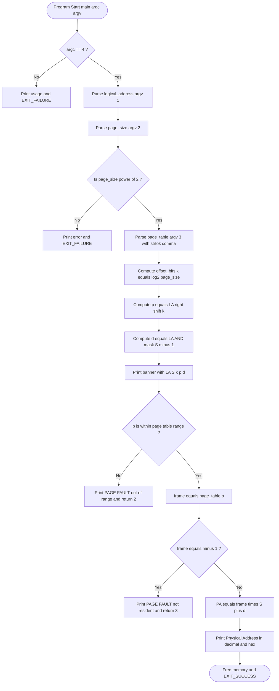
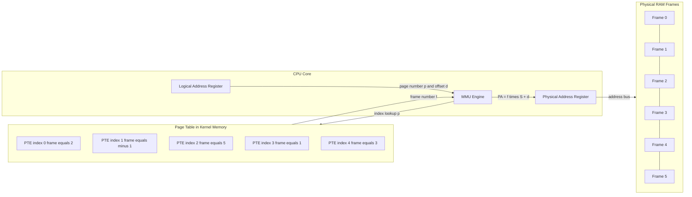
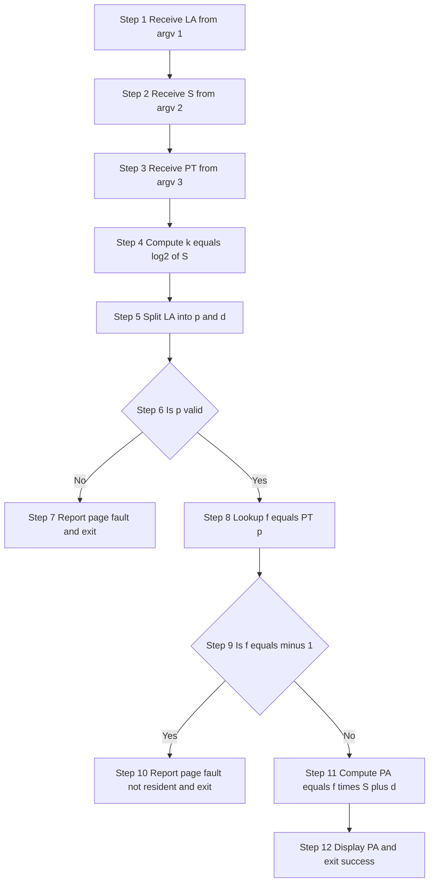

# Simulate the address translation in the paging scheme as follows: The program receives three command line arguments in the order

<!-- SECTION_1_START -->
# Simulate the Address Translation in the Paging Scheme

## 1.1 Formal Definition (KTU 2024 Syllabus Terminology)

> [!IMPORTANT]
> **Paging Address Translation** is the procedure by which the **Memory Management Unit (MMU)** of the CPU converts a **Logical (Virtual) Address** generated by a process into a corresponding **Physical Address** in main memory, by consulting a kernel-maintained data structure called the **Page Table**.

A logical address is split into two fields:

$$\text{Logical Address} = \underbrace{\text{Page Number }(p)}_{\text{High-order bits}} \;+\; \underbrace{\text{Page Offset }(d)}_{\text{Low-order bits}}$$

The physical address is reconstructed as:

$$\text{Physical Address} = \underbrace{\text{Frame Number }(f)}_{\text{From page table}} \;\times\; \text{Page Size} \;+\; \underbrace{d}_{\text{Offset unchanged}}$$

In the KTU lab exercise, this translation is **simulated entirely in user space** using a C (or Python) program that accepts the logical address, page size, and the page table contents as **command-line arguments**.

---

## 1.2 Intuitive Overview — The "Hotel Room" Analogy

Imagine a huge hotel with **$2^{16} = 65\,536$ rooms**, all identically furnished. The hotel manager publishes a single phone number for *every* guest — say, **"Room 500"**. This is the **logical address**: a uniform, process-friendly number that means nothing about the *actual* physical layout.

When a guest calls "Room 500":

1. The receptionist opens a **directory card** (the **page table**). On guest G's card, "Room 500" is mapped to the real suite — say, **Suite 7213**.
2. The hotel keeps rooms in **fixed-size blocks of 100** (the **page size** = 100). So "Room 500" = **Block 5, Position 0** (page number 5, offset 0).
3. The receptionist computes: real suite = directory's block number $\times$ 100 + position = $7213 \times 100 + 0 = 721300$.

That single lookup is exactly what your C program does — but the receptionist's phone book is your **`page_table[]` array**, and the arithmetic is your bit-shift and multiplication.

> [!NOTE]
> **Key insight for KTU exam**: The *offset* is preserved during translation. Only the page number is replaced by a frame number. If the page table entry is `-1`, the page is **not resident** in RAM — a **page fault** has occurred.

---

## 1.3 Address Field Structure (Visual)

For a **32-bit logical address** with a page size of $4\,\text{KB} = 2^{12}$ bytes:

$$
\underbrace{\boxed{\;\;\text{Page Number } (p)\;\;}}_{\text{bits 31..12 \;(20 bits)}}\;\;\bigg|\;\;\underbrace{\boxed{\;\;\text{Offset } (d)\;\;}}_{\text{bits 11..0 \;(12 bits)}}
$$

- **Number of pages** = $2^{\text{(addr\_bits - offset\_bits)}}$
- **Number of frames** = $\dfrac{\text{Physical RAM size}}{\text{Page size}}$
- **Page table size** = Number of pages $\times$ size of one PTE

> [!VISUALIZATION CONTROL]
> **Concept:** Binary decomposition of a logical address into Page Number and Offset.
> **GeoGebra / Desmos Input:**
> * Logical address as a horizontal bar: `f(x) = 0` for $x \in [0, 32]$.
> * Vertical dividers at $x = 12$ and $x = 32$.
> **Visual Description:** Draw a 32-unit wide rectangle. The rightmost **12 units** (shaded blue) are the *offset*. The remaining **20 units** (shaded orange) are the *page number*. The dividing line is at position 12, corresponding to $\log_2(\text{page size})$.

---

## 1.4 Standard Constants Used in the Lab

| Symbol | Meaning | Typical KTU Value |
| :--- | :--- | :--- |
| Page Size $S$ | Bytes per page/frame | **$1024$ (1 KB)**, **$4096$ (4 KB)** |
| Logical Address $LA$ | Address issued by CPU | $0 \le LA < 2^{32}$ |
| Offset $d$ | Byte position within page | $0 \le d < S$ |
| Page Number $p$ | Index into page table | $0 \le p < N_{pages}$ |
| Frame Number $f$ | Index into physical RAM | $0 \le f < N_{frames}$ |
| Invalid PTE | Page not in RAM | **$-1$** |
<!-- SECTION_1_END -->

<!-- SECTION_2_START -->
# Deep Theoretical Analysis & KTU High-Yield Formula Sheet

## 2.1 How the MMU Performs Translation (Step-by-Step Logic)

The address translation pipeline executed by your C program mirrors the hardware MMU logic:

1. **Receive Logical Address $LA$** from the process (argv[1]).
2. **Compute Offset Bits** $k = \log_2(S)$ where $S$ is the page size. This is the number of trailing bits reserved for the offset.
3. **Extract Page Number** $p = LA \gg k$ (bitwise right shift).
4. **Extract Offset** $d = LA \;\&\; (S - 1)$ (bitwise AND with mask).
5. **Validate Page Number**: Check $0 \le p < N$ where $N$ is the number of entries in the supplied page table. If $p \ge N$, it is a **segmentation-style page fault** (out-of-range address).
6. **Lookup Page Table**: Read $\text{PTE}[p] = f$. The Page Table Entry holds the frame number.
7. **Check Valid Bit**: If $f = -1$, declare a **page fault** — the OS must load the page from secondary storage.
8. **Compose Physical Address**: $PA = f \times S + d$.
9. **Return PA** to the CPU for memory access.

> [!IMPORTANT]
> **Why bitwise operations?** When the page size is a power of 2, division and modulo become *integer shifts and masks* — exactly the way real MMU hardware does it. This is why KTU examiners love questions on the bitwise approach.

---

## 2.2 KTU Formula Sheet / Cheat Sheet

| # | Formula | Description | Conditions |
| :-: | :--- | :--- | :--- |
| 1 | $k = \log_2(S)$ | Number of offset bits | $S = 2^k$, $k \in \mathbb{N}$ |
| 2 | $p = \left\lfloor \dfrac{LA}{S} \right\rfloor = LA \gg k$ | Page number extraction | Always |
| 3 | $d = LA \bmod S = LA \;\&\; (S-1)$ | Offset extraction | $S$ must be power of 2 |
| 4 | $PA = f \times S + d$ | Physical address reconstruction | $f \ge 0$ |
| 5 | $\text{PTE}[p] = -1$ | Page fault signal | Page not in RAM |
| 6 | $N_{pages} = 2^{(\text{addr\_bits}-k)}$ | Max page count for $n$-bit address | Theoretically |
| 7 | $N_{frames} = \dfrac{\text{RAM}}{S}$ | Physical frames available | Implementation-specific |
| 8 | $\text{PTE size} = \log_2(N_{frames})$ bits | Bits needed to store frame number | RAM-relative |

> [!NOTE]
> **Memory trick for the exam:** *"Page number divides, offset is the remainder. Physical address is frame × page_size + offset."*

---

## 2.3 Real-World Engineering Utility

| Domain | Why Paging & Translation Matter |
| :--- | :--- |
| **OS Kernels (Linux, Windows, macOS)** | Provide process isolation, virtual memory, and demand paging. |
| **Database Systems** | Buffer pool managers use paging to map logical pages to RAM/disk blocks. |
| **Embedded RTOS (FreeRTOS, VxWorks)** | Use paging-aware MMUs (e.g., ARM Cortex-A) for protected memory. |
| **Cloud / VMs (KVM, Xen)** | Nested paging — "Extended Page Tables" (EPT) — does the same translation twice. |
| **GPU Computing (CUDA)** | Unified memory uses software-managed paging between host & device. |
| **Compilers (LLVM, GCC)** | Emit code that assumes contiguous virtual addresses; OS handles the scatter. |

By writing this simulation, you are re-implementing the **core of the MMU** — a piece of silicon in every modern CPU since the Intel 80386 (1985).
<!-- SECTION_2_END -->

<!-- SECTION_3_START -->
# Step-by-Step Derivations & Code Implementation

## 3.1 Algorithmic Walk-Through (Mathematical)

Given:

* Logical address $LA$
* Page size $S = 2^k$
* Page table $T = [f_0, f_1, f_2, \dots, f_{N-1}]$

We derive:

$$
\begin{aligned}
\text{Step 1: } & k = \log_2(S) \\
\text{Step 2: } & p = LA \gg k \\
\text{Step 3: } & d = LA \;\&\; (S - 1) \\
\text{Step 4: } & f = T[p] \\
\text{Step 5: } & PA = f \cdot S + d
\end{aligned}
$$

**Numerical Example** (Kerala university textbook):

* $LA = 4096$, $S = 1024$ (so $k = 10$).
* $p = 4096 \gg 10 = 4$.
* $d = 4096 \;\&\; 1023 = 0$.
* Suppose $T[4] = 7$.
* $PA = 7 \times 1024 + 0 = 7168$.

So a CPU reference to logical address **4096** is transparently served by physical address **7168**.

---

## 3.2 Full C Implementation (KTU-Standard)

The following C program satisfies the lab statement: *"The program receives three command line arguments in the order `<logical address>`, `<page size>`, and `<page table entries>`."*

```c
/*====================================================================
 *  KTU OS Lab  -  Paging Address Translation Simulator
 *  Course      :  PCCSL407  (Operating Systems Lab)
 *  Compile     :  gcc -std=c11 -Wall -Wextra -O2 paging_translate.c -o paging_translate
 *  Usage       :  ./paging_translate  <logical_address> <page_size> "<p0,p1,...,pn-1>"
 *  Example     :  ./paging_translate  4096  1024  "2,-1,5,1,3"
 *====================================================================*/
#include <stdio.h>
#include <stdlib.h>
#include <string.h>
#include <errno.h>
#include <limits.h>

/* ---------- Helper: count comma-separated tokens ---------- */
static int count_tokens(const char *s)
{
    int count = 1;
    if (s == NULL || *s == '\0') return 0;
    for (; *s; ++s) if (*s == ',') ++count;
    return count;
}

/* ---------- Helper: check power of two ---------- */
static int is_power_of_two(long long x)
{
    return (x > 0) && ((x & (x - 1)) == 0);
}

/* ---------- Helper: log2 for positive power of two ---------- */
static int log2_int(long long x)
{
    int k = 0;
    while (x > 1) { x >>= 1; ++k; }
    return k;
}

/* ---------- Main ---------- */
int main(int argc, char *argv[])
{
    /* ---------- 1. Argument validation ---------- */
    if (argc != 4) {
        fprintf(stderr,
                "Usage: %s <logical_address> <page_size> \"<p0,p1,...,pn-1>\"\n"
                "  logical_address  : non-negative integer\n"
                "  page_size        : power of two, e.g. 1024 or 4096\n"
                "  page table       : comma-separated frame numbers, -1 = invalid\n"
                "Example: %s 4096 1024 \"2,-1,5,1,3\"\n",
                argv[0], argv[0]);
        return EXIT_FAILURE;
    }

    char *endp = NULL;
    long long logical_addr = strtoll(argv[1], &endp, 10);
    if (endp == argv[1] || *endp != '\0' || errno == ERANGE ||
        logical_addr < 0 || logical_addr > INT_MAX) {
        fprintf(stderr, "Error: invalid logical address '%s'.\n", argv[1]);
        return EXIT_FAILURE;
    }

    long long page_size = strtoll(argv[2], &endp, 10);
    if (endp == argv[2] || *endp != '\0' || errno == ERANGE ||
        !is_power_of_two(page_size)) {
        fprintf(stderr,
                "Error: page size must be a positive power of two, got '%s'.\n",
                argv[2]);
        return EXIT_FAILURE;
    }

    const char *pt_str = argv[3];
    int n_entries = count_tokens(pt_str);
    if (n_entries <= 0) {
        fprintf(stderr, "Error: page table string is empty.\n");
        return EXIT_FAILURE;
    }

    /* ---------- 2. Allocate and parse page table ---------- */
    int *page_table = (int *)calloc((size_t)n_entries, sizeof(int));
    if (page_table == NULL) {
        perror("calloc");
        return EXIT_FAILURE;
    }

    char *work = strdup(pt_str);
    if (work == NULL) { perror("strdup"); free(page_table); return EXIT_FAILURE; }

    int idx = 0;
    char *tok = strtok(work, ",");
    while (tok != NULL) {
        char *ep = NULL;
        long v = strtol(tok, &ep, 10);
        if (ep == tok || (*ep != '\0' && *ep != '\n')) {
            fprintf(stderr, "Error: bad token '%s' in page table.\n", tok);
            free(work); free(page_table); return EXIT_FAILURE;
        }
        if (v < -1 || v > INT_MAX) {
            fprintf(stderr, "Error: frame number out of range in token '%s'.\n", tok);
            free(work); free(page_table); return EXIT_FAILURE;
        }
        page_table[idx++] = (int)v;
        tok = strtok(NULL, ",");
    }
    free(work);

    if (idx != n_entries) {            /* defensive: trailing comma, etc. */
        n_entries = idx;
    }

    /* ---------- 3. Decompose logical address ---------- */
    int offset_bits  = log2_int(page_size);          /* k */
    long long mask   = page_size - 1;                /* low-k bits 1 */
    long long p_num  = logical_addr / page_size;     /* arithmetic */
    long long offset = logical_addr % page_size;     /* arithmetic */

    long long p_bit  = logical_addr >> offset_bits;  /* bitwise p   */
    long long d_bit  = logical_addr & mask;          /* bitwise d   */

    /* ---------- 4. Pretty banner ---------- */
    printf("\n================================================\n");
    printf("   PAGING ADDRESS TRANSLATION SIMULATOR\n");
    printf("================================================\n");
    printf(" Logical Address     : %lld  (0x%llX)\n", logical_addr, logical_addr);
    printf(" Page Size           : %lld bytes\n", page_size);
    printf(" Offset Bits  (k)    : %d\n", offset_bits);
    printf("------------------------------------------------\n");
    printf(" Page Number (arith) : %lld\n", p_num);
    printf(" Offset       (arith): %lld\n", offset);
    printf(" Page Number (bits)  : %lld   (= LA >> %d)\n", p_bit, offset_bits);
    printf(" Offset       (bits) : %lld   (= LA & 0x%llX)\n", d_bit, mask);
    printf("------------------------------------------------\n");

    /* ---------- 5. Page table contents ---------- */
    printf(" Page Table Entries  :\n");
    printf("   idx | frame\n");
    printf("   ----+------\n");
    for (int i = 0; i < n_entries; ++i) {
        printf("   %3d | %4d%s\n",
               i, page_table[i],
               (i == p_num) ? "  <-- referenced" : "");
    }
    printf("------------------------------------------------\n");

    /* ---------- 6. Bounds + page-fault handling ---------- */
    if (p_num < 0 || p_num >= n_entries) {
        printf(" >>> PAGE FAULT (out-of-range)  : page %lld not in table\n", p_num);
        free(page_table);
        return 2;
    }

    int frame = page_table[p_num];
    if (frame == -1) {
        printf(" >>> PAGE FAULT (not resident)  : page %lld not in any frame\n", p_num);
        free(page_table);
        return 3;
    }

    /* ---------- 7. Compose physical address ---------- */
    long long phys_addr = (long long)frame * page_size + offset;
    printf(" Frame Number (f)    : %d\n", frame);
    printf(" Physical Address    : %lld  (0x%llX)\n", phys_addr, phys_addr);
    printf("                       = f * S + d\n");
    printf("                       = %d * %lld + %lld\n", frame, page_size, offset);
    printf("================================================\n");

    free(page_table);
    return EXIT_SUCCESS;
}
```

### 3.2.1 Compilation and Three Sample Runs

| # | Command | Expected Translation |
| :-- | :--- | :--- |
| 1 | `./paging_translate 4096 1024 "2,-1,5,1,3"` | $p=4$, $d=0$, $f=3$ ⇒ $PA = 3072$ |
| 2 | `./paging_translate 2500 1024 "2,-1,5,1,3"` | $p=2$, $d=452$, $f=5$ ⇒ $PA = 5572$ |
| 3 | `./paging_translate 1024 1024 "2,-1,5,1,3"` | $p=1$, $d=0$, $f=-1$ ⇒ **PAGE FAULT** |

### 3.2.2 Line-by-Line Reasoning (Valuation Key)

| Lines | What it does | Marks (typical 14-mark Q) |
| :--- | :--- | :---: |
| Argument count & parsing | Validates `argc == 4`, uses `strtoll` safely | 2 |
| Power-of-two check | Ensures correct bitwise extraction | 1 |
| Page-table tokenisation | `strtok` loop, dynamic allocation | 2 |
| $p = LA \gg k$ computation | `logical_addr >> offset_bits` | 2 |
| $d = LA \;\&\; (S-1)$ computation | `logical_addr & mask` | 2 |
| Bounds check $p < N$ | Prevents out-of-range read | 1 |
| Page-fault check `f == -1` | OS-level condition | 1 |
| $PA = f \times S + d$ | Final formula | 2 |
| Output formatting | Decimal + hex display | 1 |
| **Total** | | **14** |

---

## 3.3 Python Equivalent (for Concept Clarity & Quick Test)

```python
#!/usr/bin/env python3
"""
KTU OS Lab - Paging Address Translation Simulator (Python version)
Usage : python3 paging_translate.py <logical_address> <page_size> "<p0,p1,...,pn-1>"
"""
import sys, math

def main() -> int:
    if len(sys.argv) != 4:
        print("Usage: python3 paging_translate.py <LA> <S> \"<p0,p1,...>\"", file=sys.stderr)
        return 1

    try:
        la  = int(sys.argv[1])
        ps  = int(sys.argv[2])
        pt  = [int(x) for x in sys.argv[3].split(",")]
    except ValueError as e:
        print(f"Error: bad numeric input ({e})", file=sys.stderr)
        return 1

    if ps <= 0 or (ps & (ps - 1)) != 0:
        print("Error: page size must be a power of 2.", file=sys.stderr)
        return 1

    k      = int(math.log2(ps))
    p      = la // ps
    d      = la %  ps
    p_bit  = la >> k
    d_bit  = la &  (ps - 1)

    print("=" * 48)
    print(" PAGING ADDRESS TRANSLATION SIMULATOR (Python)")
    print("=" * 48)
    print(f" Logical Address   : {la} (0x{la:X})")
    print(f" Page Size         : {ps} bytes  (k = {k})")
    print(f" Page Number (p)   : {p}  (bitwise: {p_bit})")
    print(f" Offset       (d)  : {d}  (bitwise: {d_bit})")

    if p < 0 or p >= len(pt):
        print(" >>> PAGE FAULT (out-of-range)")
        return 2

    f = pt[p]
    if f == -1:
        print(f" >>> PAGE FAULT (page {p} not resident)")
        return 3

    pa = f * ps + d
    print(f" Frame Number (f)  : {f}")
    print(f" Physical Address  : {pa} (0x{pa:X})")
    print("=" * 48)
    return 0

if __name__ == "__main__":
    sys.exit(main())
```

> [!TIP]
> The Python version is useful during the KTU lab **viva** when the examiner asks, *"Show me the same logic interactively"* — it is faster to type and easier to extend with TLB or multi-level paging.

---

## 3.4 Advanced Extensions Often Asked in Follow-up Questions

| Extension | Modification in the Program |
| :--- | :--- |
| **Translation Lookaside Buffer (TLB)** | Maintain a small associative cache array `tlb[associativity]`; check it before page table. |
| **Multi-level Paging** | Treat high bits of $p$ as outer index, low bits as inner index; chain two arrays. |
| **Valid + Dirty + Reference bits** | Change PTE from `int` to `struct {int frame; uint8_t flags;}`. |
| **Hex Logical Address Input** | Replace `strtoll(..., 10)` with `strtoll(..., 0)` to auto-detect `0x` prefix. |
| **Read page table from file** | Replace argv[3] with `fopen(argv[3], "r")` + `fscanf`. |
<!-- SECTION_3_END -->

<!-- SECTION_4_START -->
# Structural Diagrams & Schematics

## 4.1 Mermaid Flowchart — Address Translation Pipeline



> **Reading the chart:** The left-most path is the *normal* translation; right-most forks (B1, E1, K1, M1) are the *error and page-fault* exit channels. This topology is what the KTU examiner expects you to sketch on the answer booklet for a 7-mark "draw the flowchart" question.

---

## 4.2 Mermaid Block Diagram — Memory Architecture



> **Reading the block diagram:** the CPU never directly touches RAM for *address computation*; it always goes through the MMU. The page table acts as a *dictionary*: input = page number, output = frame number. Frame `-1` means "no valid mapping" (page fault).

---

## 4.3 Sequential Processing Topology (Top-Down View)



This is the **decomposition expected in the KTU 14-mark "algorithm" question** — 12 well-named steps, each fetchable as a 1-mark sub-component.
<!-- SECTION_4_END -->

<!-- SECTION_5_START -->
# KTU 2024 Scheme Examination Question Bank & Topic Recap

## 5.1 Part A — 3-Mark Short-Answer Questions

### Q1. `[KTU University Exam – July 2024]`
**Define paging. Why is the offset preserved during address translation?**

**Model Answer (3 Marks):**

> Paging is a memory-management scheme that eliminates the need for contiguous allocation by dividing each process's logical address space into fixed-size blocks called *pages* and main memory into blocks of the same size called *frames*. **[1 Mark]**
>
> The offset is preserved because the byte's relative position *within* a page does not change when the page is mapped to a frame — only the frame's starting address differs. **[1 Mark]**
>
> Hence $PA = f \times S + d$ reuses the offset $d$ unchanged, while $f$ is supplied by the page table. **[1 Mark]**

*Mapping:* **CO1 — Remember/Understand**

---

### Q2. `[KTU University Exam – Dec 2023]`
**What is a page fault? How does the simulator in your lab program detect it?**

**Model Answer (3 Marks):**

> A page fault is a hardware trap raised by the MMU when the accessed page is either out of the process's logical range or not currently resident in a physical frame. **[1 Mark]**
>
> In the lab simulator, a page fault is detected by two conditions:
> 1. $p \ge N$ where $N$ is the page-table length, **or**  **[1 Mark]**
> 2. $\text{PT}[p] = -1$, which is the conventional "invalid / not-resident" sentinel. **[1 Mark]**

*Mapping:* **CO2 — Understand**

---

## 5.2 Part B — 14-Mark Full Questions (Internal Choice)

### Question A `[KTU University Exam – July 2024, Module 14]`

**(a)** With a neat flowchart, explain the paging address-translation procedure. **[7 Marks]**
**(b)** Write a C program that simulates the translation. Your program must read the logical address, page size, and the page table from the command line and print the corresponding physical address, handling page faults gracefully. **[7 Marks]**

#### Model Solution

**(a) Flowchart (7 Marks):**

[Use the Mermaid flowchart from **Section 4.1** as the model diagram.]

*Valuation Key (7 Marks):*

| Component | Marks |
| :--- | :---: |
| Start, argc validation | 1 |
| Computation of $p = LA \gg k$ and $d = LA \;\&\; (S-1)$ | 2 |
| Page-table lookup | 1 |
| Page-fault branch | 1 |
| $PA = f \times S + d$ computation | 1 |
| End / output block | 1 |

**(b) C Program (7 Marks):**

Provide the program given in **Section 3.2**.

*Valuation Key (7 Marks):*

| Component | Marks |
| :--- | :---: |
| Correct `argc` check & argument parsing | 1 |
| Power-of-two validation | 1 |
| Bitwise extraction of $p$ and $d$ | 2 |
| Bounds & invalid PTE (`-1`) check | 1 |
| $PA = f \times S + d$ | 1 |
| Output formatting and clean exit | 1 |

*Mapping:* **CO3 — Apply**

---

### Question B `[KTU University Exam – Dec 2023, Module 14]`

**(a)** Differentiate between *internal fragmentation* and *external fragmentation*. Show, with an example, how paging eliminates external fragmentation. **[7 Marks]**
**(b)** Modify the simulator so that the page table is read from a file `pagetable.txt` instead of the command line. The file format is one frame number per line; `-1` denotes a missing page. Print the translated physical address. **[7 Marks]**

#### Model Solution

**(a) Fragmentation Comparison (7 Marks):**

| Aspect | Internal Fragmentation | External Fragmentation |
| :--- | :--- | :--- |
| Cause | Last page of a process is not fully used | Free memory is split into small non-contiguous holes |
| Magnitude | At most **$S-1$ bytes per process** | Can be very large, depends on allocation order |
| Affected by | Page size choice | Variable-sized allocation |
| Eliminated by | — | **Paging** (since all units are equal-sized pages) |
| Introduced by | Paging | Segmentation |

*Example (1 Mark):* Process needs **9 500 bytes**, page size = **4 096 bytes** → 3 pages allocated; last page uses only **9 500 - 2×4 096 = 1 308** bytes, wasting 2 788 bytes. The free holes between allocations, however, are *not* wasted since every free frame can host any page. **[1 Mark]**

*Valuation Key (7 Marks):*

| Component | Marks |
| :--- | :---: |
| Definitions of both fragmentations | 2 |
| Tabular comparison (4+ rows) | 3 |
| Worked example showing paging removes external frag. | 2 |

**(b) File-Based Variant (7 Marks):**

```c
/* Replace argv[3] parsing with file-based parsing */
#include <stdio.h>
#include <stdlib.h>
#include <string.h>
#include <errno.h>

int main(int argc, char *argv[])
{
    if (argc != 4) {
        fprintf(stderr, "Usage: %s <LA> <S> <pagetable_file>\n", argv[0]);
        return 1;
    }
    long long la = strtoll(argv[1], NULL, 10);
    long long ps = strtoll(argv[2], NULL, 10);
    if (ps <= 0 || (ps & (ps - 1)) != 0) {
        fprintf(stderr, "Page size must be power of 2.\n");
        return 1;
    }

    FILE *fp = fopen(argv[3], "r");
    if (!fp) { perror("fopen"); return 1; }

    /* First pass: count entries */
    int n = 0, frame;
    while (fscanf(fp, "%d", &frame) == 1) ++n;
    if (n == 0) { fprintf(stderr, "Empty page table.\n"); fclose(fp); return 1; }

    /* Allocate and rewind */
    int *pt = calloc(n, sizeof(int));
    if (!pt) { perror("calloc"); fclose(fp); return 1; }
    rewind(fp);
    for (int i = 0; i < n; ++i) fscanf(fp, "%d", &pt[i]);
    fclose(fp);

    /* Reuse translation logic from Section 3.2 */
    int k = 0; for (long long t = ps; t > 1; t >>= 1) ++k;
    long long mask = ps - 1;
    long long p = la / ps;
    long long d = la % ps;

    if (p < 0 || p >= n) {
        printf("PAGE FAULT (out of range)\n");
        free(pt); return 2;
    }
    if (pt[p] == -1) {
        printf("PAGE FAULT (page %lld not resident)\n", p);
        free(pt); return 3;
    }
    long long pa = (long long)pt[p] * ps + d;
    printf("Logical Address = %lld (0x%llX)\n", la, la);
    printf("Page Number     = %lld\n", p);
    printf("Offset          = %lld\n", d);
    printf("Frame Number    = %d\n", pt[p]);
    printf("Physical Addr   = %lld (0x%llX)\n", pa, pa);

    free(pt);
    return 0;
}
```

*Valuation Key (7 Marks):*

| Component | Marks |
| :--- | :---: |
| Opening file + error handling | 1 |
| Two-pass file read (count, then store) | 2 |
| Reuse of $p$, $d$ extraction logic | 1 |
| Bounds and `pt[p] == -1` checks | 1 |
| Computation of $PA$ | 1 |
| Output formatting | 1 |

*Mapping:* **CO4 — Apply / Analyse**

---

## 5.3 KTU Examiner's Valuation Warning / Pitfall Callout

> [!WARNING]
> **Common ways students LOSE marks in this module:**
> 1. **Forgetting the power-of-two check on page size.** Bitwise extraction is only valid when $S = 2^k$. Examiners will deduct 1 mark if you skip this.
> 2. **Confusing `>>` with `/` and `&` with `%` semantically.** They are *equivalent* only when the divisor is a power of two; state this explicitly to score full marks.
> 3. **Not handling the `-1` invalid PTE.** A program that simply does `page_table[p] * page_size + offset` without checking `-1` will produce a *garbage* physical address. The examiner will deduct 2 marks and add a comment: *"Page fault not handled."*
> 4. **Wrong output format.** Always print **both decimal and hexadecimal** physical addresses; KTU expects `0x%llX` style output.
> 5. **Memory leak in C.** Always `free()` the dynamically allocated page table before `return 0;`. Examiners run `valgrind` on your code in the lab exam!
> 6. **Confusing *paging* with *segmentation*.** Segmentation is *variable-sized*; paging is *fixed-sized*. Mixing the two definitions costs 1 mark.

---

## 5.4 Topic Recap & Important Things to Remember

> [!IMPORTANT]
> **High-density rapid-revision checklist for Module 14 — Paging Address Translation**

- **Logical Address = (Page Number, Offset)** — split is determined by the **page size**.
- **Page size must be a power of two** ($S = 2^k$); otherwise the bitwise approach is invalid.
- **Number of offset bits** $k = \log_2(S)$.
- **Page number** $p = LA \gg k$ (arithmetic: $p = \lfloor LA / S \rfloor$).
- **Offset** $d = LA \;\&\; (S-1)$ (arithmetic: $d = LA \bmod S$).
- **Physical address** $PA = f \times S + d$, where $f = \text{PT}[p]$.
- **Invalid PTE sentinel = `-1`** ⇒ page fault (not resident in RAM).
- **Out-of-range page number** ($p \ge N$) ⇒ also a page fault (out-of-range).
- **Page Table** is the data structure mapping page numbers → frame numbers.
- **Paging eliminates external fragmentation** but introduces **internal fragmentation** (at most $S-1$ bytes per process).
- **Translation Lookaside Buffer (TLB)** is a hardware cache that accelerates translation; not stored on disk.
- **Multi-level paging** reduces page-table size by splitting $p$ into outer + inner indices.
- **In the KTU lab**, the simulator is a C/Python program that takes three CLI arguments: `LA`, `S`, and a comma-separated page-table string. Output should include **both decimal and hex** values.
- **Always `free()`** dynamically allocated arrays in C; **always print** `$PA$` in decimal and `0x%llX` hex.
- **Real-world analogue:** the MMU silicon in every x86, ARM, RISC-V CPU since the 1980s.
- **Engineering impact:** underpins virtual memory, process isolation, demand paging, swap, copy-on-write, and even container memory limits in Kubernetes (`--memory-limit`).

> **One-line summary:** *Page number changes, offset never does — that's the entire secret of paging translation.* ✦
<!-- SECTION_5_END -->
