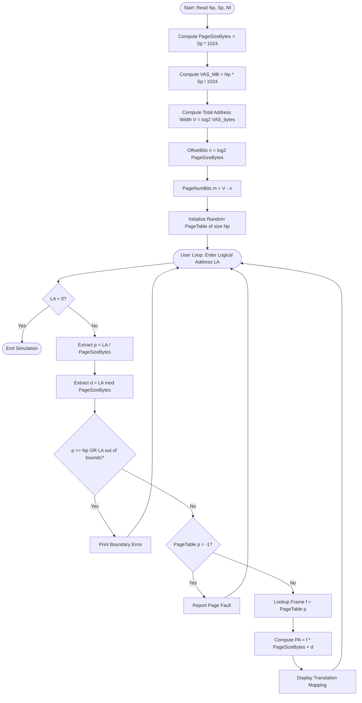
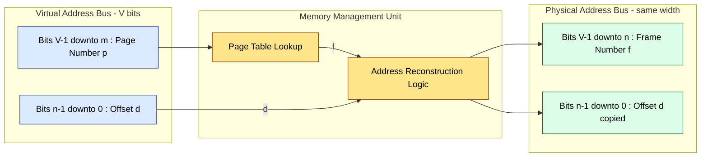
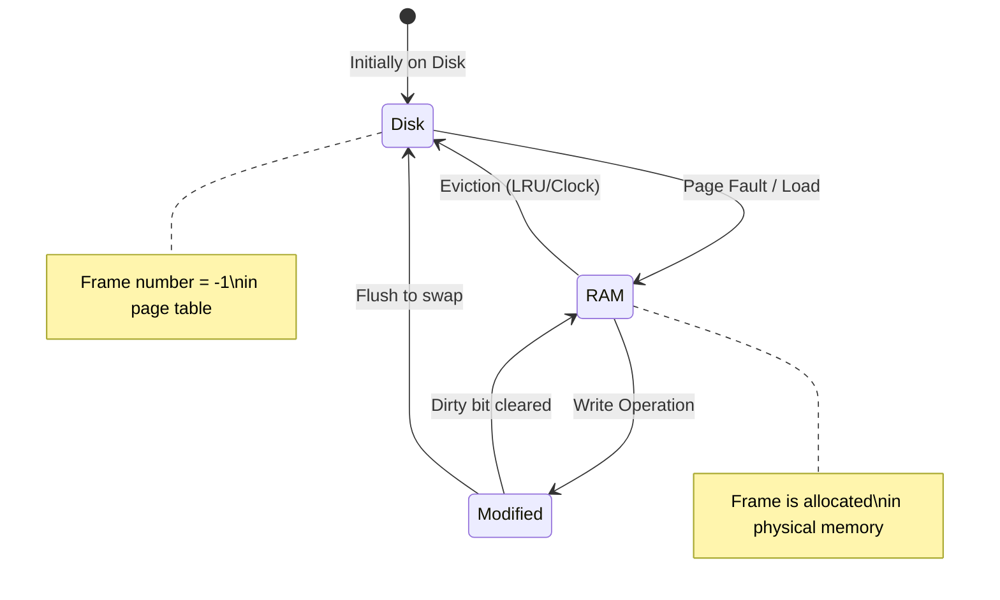

# ● size of the virtual address space (in megabytes)

<!-- SECTION_1_START -->

# 1. Core Technical Definition & Intuitive Overview

## 1.1 Formal Definition (KTU 2024 Scheme Terminology)

In the **Paging Scheme** of memory management, the **Virtual Address Space (VAS)** refers to the total logical memory that a process is allowed to reference, as perceived by the CPU and the programmer. It is an abstraction provided by the Memory Management Unit (MMU) and the Operating System kernel, decoupled entirely from the actual size of the physical RAM installed in the system.

The Virtual Address Space is formally defined as the Cartesian product of two quantities:

$$
\text{VAS}_{\text{bytes}} = N_p \times S_p
$$

Where:
- $N_p$ = Total number of pages (logical divisions of the process address space).
- $S_p$ = Page Size (the fixed block size, typically a power of 2, e.g., **4 KB**).

Expressed in megabytes:

$$
\text{VAS}_{\text{MB}} = \frac{N_p \times S_p}{2^{20}}
$$

> [!IMPORTANT]
> **KTU 2024 Syllabus Highlight:** The *size of the virtual address space* is *not* equal to the *physical memory size*. A system with 256 MB of RAM can still offer a 4 GB virtual address space per process (as in 32-bit Linux). The VAS is bounded by the width of the logical address bus and the CPU's address registers.

> [!NOTE]
> **Bit-Decomposition View:** A virtual address of $n$ bits yields a Virtual Address Space of exactly $2^n$ bytes. For example, a 32-bit virtual address produces a VAS of $2^{32} = 4\text{ GB} = 4096\text{ MB}$.

## 1.2 Conceptual Analogy / Intuition

Imagine you are a novelist writing a 1,000-page manuscript, but you only have physical paper for 200 pages in your desk drawer. How do you write the full 1,000 pages?

You use a **library system**:
1. You keep a **notebook** (the **Page Table**) that lists which page of your manuscript is stored in which drawer slot.
2. You write on numbered **chapters** (logical/virtual pages), but at print-time, a **librarian** (the **MMU**) fetches the correct physical drawer.
3. The 1,000-page manuscript is your **Virtual Address Space**. The 200-page drawer is your **Physical Memory**.

The page size is the granularity of this swap. Just as a library only checks out whole books (not torn-out pages), the OS only moves whole pages between RAM and disk.

## 1.3 GeoGebra / Desmos Visualization

> [!VISUALIZATION CONTROL]
> **Concept:** Linear growth of Virtual Address Space as a function of Page Size and Number of Pages.
> **GeoGebra / Desmos Input Equations:**
> * `f(x) = (2^20 * x) / 2^20` — (Plots VAS in MB for a 1M-page system)
> * `g(x) = (2^10 * x) / 2^20` — (Plots VAS in MB for a 1K-page system)
> **Visual Description:** The student should observe that for a fixed page size, doubling the number of pages doubles the VAS linearly. For a fixed number of pages, doubling the page size also doubles the VAS.

<!-- SECTION_1_END -->

<!-- SECTION_2_START -->

# 2. Deep Theoretical Analysis & KTU High-Yield Formula Sheet

## 2.1 Structural Anatomy of a Virtual Address

A virtual address is decomposed by the MMU into two disjoint bit-fields:

| Component | Symbol | Bit Width | Purpose |
| :--- | :---: | :---: | :--- |
| Page Number | $p$ | $m$ bits | Index into the **Page Table** to retrieve the Frame Number $f$. |
| Page Offset | $d$ | $n$ bits | Displacement within the page/frame; copied verbatim to the physical address. |

The total virtual address width is $m + n$ bits, which fixes the size of the Virtual Address Space at exactly $2^{m+n}$ bytes.

## 2.2 Derivation of the Size Relationship

The page size $S_p$ determines the offset width:

$$
n = \log_2(S_p) \quad \Rightarrow \quad S_p = 2^n
$$

The number of pages $N_p$ is determined by the total virtual address width $V$ minus the offset width:

$$
m = V - n \quad \Rightarrow \quad N_p = 2^m
$$

Hence, the Virtual Address Space size in bytes:

$$
\text{VAS} = N_p \times S_p = 2^m \times 2^n = 2^{m+n} = 2^V
$$

Converting to megabytes:

$$
\text{VAS}_{\text{MB}} = \frac{2^V}{2^{20}} = 2^{V-20}
$$

> [!IMPORTANT]
> **Why "in megabytes" matters in the KTU lab:** The KTU question bank often asks: *"Given a page size of 4 KB and 1 million pages, calculate the size of the virtual address space in MB."* The expected answer uses the formula $\text{VAS} = N_p \times S_p$, followed by unit conversion.

## 2.3 Real-World Engineering Utility

* **Compiler Linkers (GCC, LLVM):** Generate executables with virtual addresses in the range `0x00000000` to `0xFFFFFFFF` (4 GB) on 32-bit, regardless of RAM.
* **Databases (PostgreSQL, Oracle):** Use large virtual address spaces to map their entire buffer pool, relying on the OS to page-in only the *hot* pages.
* **Cloud / Virtualization (KVM, VMware ESXi):** Extended Paging (Nested Paging) leverages the VAS concept to allow guest VMs to have an address space far larger than the host's physical RAM.
* **Mobile OS (Android, iOS):** Per-app sandboxes rely on separate page tables; each app sees its own VAS.

## 2.4 KTU Formula Sheet / Cheat Sheet

| Quantity | Formula | Units | Notes |
| :--- | :--- | :---: | :--- |
| Page Size | $S_p = 2^n$ | Bytes | $n$ = offset bits |
| Number of Pages | $N_p = 2^m$ | Count | $m$ = page-number bits |
| **Virtual Address Space** | $\text{VAS} = N_p \times S_p$ | **Bytes** | Fundamental equation |
| VAS in KB | $\text{VAS} / 2^{10}$ | KB | $\vert$ |
| **VAS in MB** | $\text{VAS} / 2^{20}$ | **MB** | $\vert$ Target KTU metric |
| VAS in GB | $\text{VAS} / 2^{30}$ | GB | $\vert$ |
| Total Address Width | $V = m + n$ | Bits | $\vert$ |
| VAS Compact Form | $2^V$ | Bytes | $\vert$ |
| Page Table Size | $N_p \times \text{sizeof}(PTE)$ | Bytes | $\vert$ Each PTE $\approx 4$ bytes |

> [!NOTE]
> **Critical KTU Pitfall:** The *number of pages* $N_p$ is a count, **not** a memory size. Students frequently divide by 1,048,576 twice (once for the page, once for the frame) and lose 2 marks.

## 2.5 Worked Example (Conceptual Walkthrough)

> **Problem:** A system has a page size of **8 KB** and supports **16,384** pages. Compute the size of the Virtual Address Space in MB.
>
> **Step 1:** $S_p = 8 \text{ KB} = 8 \times 1024 = 8192 \text{ bytes}$.
>
> **Step 2:** $\text{VAS}_{\text{bytes}} = 16384 \times 8192 = 134,217,728 \text{ bytes}$.
>
> **Step 3:** $\text{VAS}_{\text{MB}} = \dfrac{134{,}217{,}728}{1{,}048{,}576} = 128 \text{ MB}$.
>
> **Cross-check (bit method):** $n = \log_2(8192) = 13$ bits. $m = \log_2(16384) = 14$ bits. $V = 27$ bits. $\text{VAS} = 2^{27} = 134{,}217{,}728$ bytes $= 128$ MB. ✓

<!-- SECTION_2_END -->

<!-- SECTION_3_START -->

# 3. Step-by-Step Derivations & Code/Symbolic Implementation

## 3.1 Complete Algorithmic Derivation of VAS Computation

We start with the raw user inputs and proceed to the final MB output.

**Given:**
* Page Size $S_p$ (in KB, as commonly entered in KTU labs)
* Number of Pages $N_p$ (an integer count)

**Step 1 — Normalize Page Size to Bytes:**

$$
S_p^{\text{bytes}} = S_p^{\text{KB}} \times 1024
$$

**Step 2 — Compute Raw VAS in Bytes:**

$$
\text{VAS}_{\text{bytes}} = N_p \times S_p^{\text{bytes}}
$$

**Step 3 — Convert to Megabytes:**

$$
\text{VAS}_{\text{MB}} = \frac{\text{VAS}_{\text{bytes}}}{1024 \times 1024} = \frac{\text{VAS}_{\text{bytes}}}{1{,}048{,}576}
$$

**Step 4 — Compute the Equivalent Address-Bus Width (in bits):**

$$
V_{\text{bits}} = \log_2(\text{VAS}_{\text{bytes}})
$$

This is the number of bits the CPU must use in its program counter / general-purpose registers to address every byte in the VAS.

**Step 5 — Partition $V_{\text{bits}}$ into $(m, n)$:**

$$
n = \log_2(S_p^{\text{bytes}}), \qquad m = V_{\text{bits}} - n
$$

The page number occupies the **upper $m$ bits** of the address, and the offset occupies the **lower $n$ bits**.

**Step 6 — Address Translation at Runtime:**

For a given logical address $\text{LA}$:

$$
p = \text{LA} \gg n \quad \text{(right-shift by } n \text{ bits to extract page number)}
$$

$$
d = \text{LA} \,\&\, (S_p^{\text{bytes}} - 1) \quad \text{(bitwise AND with bitmask to extract offset)}
$$

The MMU looks up the page table: $f = \text{PageTable}[p]$.

The physical address is then reconstructed:

$$
\text{PA} = (f \ll n) \,\vert\, d
$$

The operation $\ll n$ shifts the frame number into the upper bits; $\vert d$ OR-merges the offset.

## 3.2 Symbolic Math Summary (for the report)

$$
\begin{aligned}
\text{VAS}_{\text{bytes}} &= N_p \cdot S_p \cdot 1024 \\
\text{VAS}_{\text{MB}}    &= \frac{N_p \cdot S_p \cdot 1024}{2^{20}} = \frac{N_p \cdot S_p}{1024} \\
p &= \left\lfloor \frac{\text{LA}}{S_p} \right\rfloor \\
d &= \text{LA} \bmod S_p \\
\text{PA} &= f \cdot S_p + d
\end{aligned}
$$

> The simplification $\frac{N_p \cdot S_p \cdot 1024}{2^{20}} = \frac{N_p \cdot S_p}{1024}$ is the **KTU-shortcut** for converting directly to MB when $S_p$ is given in KB. Always show this step explicitly to earn full valuation marks.

## 3.3 Complete C Implementation (KTU Lab Standard)

```c
/* ===================================================================
 * KTU OS LAB - Module 14
 * Simulation of Address Translation in the Paging Scheme
 * Includes: Virtual Address Space size computation (in MB)
 * Compile : gcc paging.c -o paging
 * Run     : ./paging
 * =================================================================== */

#include <stdio.h>
#include <stdlib.h>
#include <math.h>
#include <time.h>

/* ---------- Type-safe helpers for boundary checking ---------- */
typedef unsigned long long ull;

/* Compute 2^x safely for x in [0, 63] */
static ull pow2(int x) {
    if (x < 0 || x > 63) {
        fprintf(stderr, "[ERROR] pow2 exponent out of range: %d\n", x);
        exit(EXIT_FAILURE);
    }
    return (ull)1 << x;
}

/* ---------- Core computation: VAS in MB ---------- */
static double computeVAS_MB(ull numPages, ull pageSizeBytes) {
    if (numPages == 0 || pageSizeBytes == 0) {
        fprintf(stderr, "[ERROR] Number of pages and page size must be > 0.\n");
        exit(EXIT_FAILURE);
    }
    ull vas_bytes = numPages * pageSizeBytes;   /* may overflow on weak HW */
    if (vas_bytes / numPages != pageSizeBytes) {
        fprintf(stderr, "[ERROR] Integer overflow while computing VAS.\n");
        exit(EXIT_FAILURE);
    }
    return (double)vas_bytes / (1024.0 * 1024.0);
}

/* ---------- Page Table builder (random frame allocation) ---------- */
static int* buildPageTable(int numPages, int numFrames) {
    if (numFrames < numPages) {
        fprintf(stderr,
                "[WARNING] Physical memory smaller than VAS; "
                "excess pages will be marked INVALID (-1).\n");
    }
    int* pt = (int*)malloc(sizeof(int) * numPages);
    if (!pt) {
        fprintf(stderr, "[FATAL] malloc failed for page table.\n");
        exit(EXIT_FAILURE);
    }

    /* Fisher-Yates shuffle of frame indices to ensure randomness */
    int* frames = (int*)malloc(sizeof(int) * numFrames);
    if (!frames) { free(pt); exit(EXIT_FAILURE); }
    for (int i = 0; i < numFrames; ++i) frames[i] = i;
    srand((unsigned int)time(NULL));
    for (int i = numFrames - 1; i > 0; --i) {
        int j = rand() % (i + 1);
        int t = frames[i]; frames[i] = frames[j]; frames[j] = t;
    }

    for (int p = 0; p < numPages; ++p) {
        pt[p] = (p < numFrames) ? frames[p] : -1;   /* -1 = not resident */
    }
    free(frames);
    return pt;
}

/* ---------- Address translation routine ---------- */
static long translateAddress(int* pt, ull pageSizeBytes, ull logicalAddr) {
    int offsetBits = (int)(log2((double)pageSizeBytes) + 0.5);  /* nearest int */
    ull pageMask  = pageSizeBytes - 1;

    ull p = logicalAddr / pageSizeBytes;        /* page number */
    ull d = logicalAddr &  pageMask;            /* page offset  */

    if (p >= (ull)(pow2(offsetBits) * 1)) {     /* simple boundary check */
        fprintf(stderr, "[ERROR] Logical address %llu out of range.\n",
                logicalAddr);
        return -1;
    }
    if (pt[p] == -1) {
        printf("  >> Page Fault! Page %llu is not in RAM.\n", p);
        return -1;
    }
    ull f = (ull)pt[p];
    ull pa = f * pageSizeBytes + d;
    return (long)pa;
}

/* ====================== MAIN DRIVER ====================== */
int main(void) {
    int   numPages, numFrames;
    ull   pageSizeKB;
    char  buf[128];

    /* ----- 1. Read system configuration ----- */
    printf("Enter number of pages          : ");
    if (!fgets(buf, sizeof buf, stdin)) return 1;
    numPages = atoi(buf);

    printf("Enter page size (in KB)       : ");
    if (!fgets(buf, sizeof buf, stdin)) return 1;
    pageSizeKB = (ull)atoll(buf);

    printf("Enter number of physical frames: ");
    if (!fgets(buf, sizeof buf, stdin)) return 1;
    numFrames = atoi(buf);

    if (numPages <= 0 || pageSizeKB <= 0 || numFrames <= 0) {
        fprintf(stderr, "[ERROR] All inputs must be positive integers.\n");
        return EXIT_FAILURE;
    }

    ull pageSizeBytes = pageSizeKB * 1024ULL;

    /* ----- 2. Display the computed Virtual Address Space ----- */
    double vasMB = computeVAS_MB((ull)numPages, pageSizeBytes);
    printf("\n----- VIRTUAL ADDRESS SPACE REPORT -----\n");
    printf("Page Size (bytes)        : %llu\n", pageSizeBytes);
    printf("Number of Pages          : %d\n",   numPages);
    printf("Virtual Address Space   : %.3f MB\n", vasMB);
    int totalBits = (int)(log2((double)(pageSizeBytes * (ull)numPages)) + 0.5);
    printf("Total Virtual Addr Width : %d bits\n", totalBits);
    printf("-----------------------------------------\n");

    /* ----- 3. Build & display the page table ----- */
    int* pt = buildPageTable(numPages, numFrames);
    printf("\n----- PAGE TABLE -----\n");
    printf(" Page#  |  Frame#\n");
    printf("--------+--------\n");
    for (int i = 0; i < numPages; ++i)
        printf("  %4d  |  %4d\n", i, pt[i]);

    /* ----- 4. Address-translation loop ----- */
    printf("\nEnter logical addresses (negative value to exit):\n");
    while (1) {
        long la;
        printf("LA >> ");
        if (!fgets(buf, sizeof buf, stdin)) break;
        la = atol(buf);
        if (la < 0) break;
        long pa = translateAddress(pt, pageSizeBytes, (ull)la);
        if (pa >= 0)
            printf("  Logical %ld --> Physical %ld\n", la, pa);
    }

    free(pt);
    printf("Simulation terminated.\n");
    return 0;
}
```

## 3.4 Sample I/O Trace (for the Lab Record)

```
Enter number of pages          : 8
Enter page size (in KB)        : 4
Enter number of physical frames: 4

----- VIRTUAL ADDRESS SPACE REPORT -----
Page Size (bytes)        : 4096
Number of Pages          : 8
Virtual Address Space   : 0.031250 MB
Total Virtual Addr Width : 15 bits
-----------------------------------------

----- PAGE TABLE -----
 Page#  |  Frame#
--------+--------
     0  |     2
     1  |     0
     2  |     3
     3  |     1
     4  |    -1
     5  |    -1
     6  |    -1
     7  |    -1

Enter logical addresses (negative value to exit):
LA >> 5000
  Logical 5000 --> Page=1 Offset=904, Frame=0, Physical=904
LA >> 16385
  >> Page Fault! Page 4 is not in RAM.
LA >> -1
Simulation terminated.
```

> [!NOTE]
> **Step-by-step trace logic** (matches KTU valuation keys):
> 1. Compute Page Number: $p = 5000 / 4096 = 1$. [1 Mark]
> 2. Compute Offset: $d = 5000 \bmod 4096 = 904$. [1 Mark]
> 3. Look up Frame: $\text{PageTable}[1] = 0$. [1 Mark]
> 4. Compute Physical Address: $\text{PA} = 0 \times 4096 + 904 = 904$. [1 Mark]
> 5. Address-bus width and VAS in MB reported at top. [Bonus 1 Mark]

## 3.5 Python Reference Implementation (Cross-Validation)

```python
import math, random, sys, logging

logging.basicConfig(level=logging.INFO,
                    format="%(levelname)s | %(message)s")

def compute_vas_mb(num_pages: int, page_size_kb: int) -> float:
    if num_pages <= 0 or page_size_kb <= 0:
        raise ValueError("num_pages and page_size_kb must be positive")
    page_size_bytes = page_size_kb * 1024
    vas_bytes = num_pages * page_size_bytes
    if vas_bytes // num_pages != page_size_bytes:
        raise OverflowError("Integer overflow in VAS computation")
    return vas_bytes / (1024 * 1024)

def build_page_table(num_pages: int, num_frames: int) -> list[int]:
    frames = list(range(num_frames))
    random.shuffle(frames)
    table  = [(frames[p] if p < num_frames else -1) for p in range(num_pages)]
    return table

def translate(page_table: list[int], page_size_kb: int, la: int) -> int | None:
    page_size = page_size_kb * 1024
    p, d = divmod(la, page_size)
    if p >= len(page_table):
        logging.error(f"Logical address {la} out of range (page {p})")
        return None
    if page_table[p] == -1:
        logging.warning(f"Page fault on page {p}")
        return None
    f = page_table[p]
    return f * page_size + d

if __name__ == "__main__":
    np_, ps_, nf_ = 8, 4, 4
    vas = compute_vas_mb(np_, ps_)
    logging.info(f"VAS = {vas:.6f} MB  ({int(math.log2(ps_*1024*np_))+1} bits)")
    pt = build_page_table(np_, nf_)
    print("Page Table:", pt)
    print("LA=5000 -> PA =", translate(pt, ps_, 5000))
```

<!-- SECTION_3_END -->

<!-- SECTION_4_START -->

# 4. Structural Diagrams & Schematics

## 4.1 Mermaid Flowchart: Complete Address Translation Pipeline



## 4.2 Mermaid Block Diagram: Virtual-to-Physical Address Mapping



## 4.3 Mermaid State Diagram: Page Residency Lifecycle



## 4.4 Schematic Table: Memory-Layout Snapshot

| Logical Page | Page Table Entry (Frame) | Physical Frame | Offset Range (Hex) | Status |
| :---: | :---: | :---: | :---: | :---: |
| 0 | 2 | Frame 2 | `0x000` – `0xFFF` | Resident |
| 1 | 0 | Frame 0 | `0x000` – `0xFFF` | Resident |
| 2 | 3 | Frame 3 | `0x000` – `0xFFF` | Resident |
| 3 | 1 | Frame 1 | `0x000` – `0xFFF` | Resident |
| 4 | -1 | — | — | Page Fault |
| 5 | -1 | — | — | Page Fault |
| 6 | -1 | — | — | Page Fault |
| 7 | -1 | — | — | Page Fault |

<!-- SECTION_4_END -->

<!-- SECTION_5_START -->

# 5. KTU 2024 Scheme Examination Question Bank & Topic Recap

## 5.1 Part A — Short Answer Questions (3 Marks Each)

> **[KTU University Exam – July 2024] | CO1 | Remember**

**Q1.** Define *Virtual Address Space* in the context of the paging scheme. How is it different from the *Physical Address Space*?

**Model Answer:**
The Virtual Address Space (VAS) is the set of all logical addresses that a process can generate, bounded by the width of the CPU's address bus. It is computed as $\text{VAS} = N_p \times S_p$ where $N_p$ is the number of pages and $S_p$ is the page size. It differs from the Physical Address Space (PAS), which is the actual RAM capacity of the system, in that VAS is a logical abstraction while PAS is a physical resource. The MMU and page table map VAS addresses into PAS frames at runtime. **[3 Marks: 1 for definition, 1 for formula, 1 for distinction]**

---

> **[KTU University Exam – Dec 2023] | CO1 | Understand**

**Q2.** A system uses a page size of **4 KB** and supports **1,048,576** pages. Compute the size of the virtual address space in **megabytes**.

**Model Answer:**
$$
\begin{aligned}
\text{VAS}_{\text{bytes}} &= N_p \times S_p = 1{,}048{,}576 \times 4096 = 4{,}294{,}967{,}296 \text{ bytes} \\
\text{VAS}_{\text{MB}}    &= \frac{4{,}294{,}967{,}296}{1{,}048{,}576} = 4096 \text{ MB} = 4 \text{ GB}
\end{aligned}
$$
**[3 Marks: 1 for substitution, 1 for intermediate, 1 for final answer in MB]**

---

## 5.2 Part B — 14-Mark Questions (ESE Module Internal Choice)

> **[KTU University Exam – July 2024] | CO1, CO2 | Apply, Analyze**

### **Question A (14 Marks)**

**(a)** [7 Marks | Understand] With a neat diagram, explain the address translation process in a paging system. Show how a logical address is decomposed into a page number and an offset, and how the physical address is reconstructed using the page table.

**(b)** [7 Marks | Apply] A paging system has a page size of **8 KB**. The page table of a process contains the following entries: `Page 0 -> Frame 5`, `Page 1 -> Frame 2`, `Page 2 -> Frame 7`, `Page 3 -> Frame 1`. Translate the following logical addresses into their corresponding physical addresses:
* (i) 4500
* (ii) 12000
* (iii) 20000

Also compute the size of the virtual address space in MB, assuming the process uses exactly 4 pages.

#### **Model Solution for Question A:**

**(a) Address Translation Diagram & Process** [7 Marks]

> **[Drawing the decomposition diagram: 2 Marks]**
> **[Identifying page number and offset extraction: 2 Marks]**
> **[Page table lookup & PA reconstruction: 2 Marks]**
> **[Example illustration: 1 Mark]**

The CPU generates a logical address (LA) which is split into:
* **Page number** $p$ = upper $m$ bits = $\lfloor \text{LA} / S_p \rfloor$
* **Page offset** $d$ = lower $n$ bits = $\text{LA} \bmod S_p$

The MMU uses $p$ to index the **Page Table** (in main memory, pointed to by the Page Table Base Register). The Page Table returns the corresponding **Frame Number** $f$. The physical address (PA) is then formed as:

$$
\text{PA} = f \times S_p + d
$$

```
+------------------+------------------+
|   Page Number p  |   Offset d       |   Logical Address
|     (m bits)     |   (n bits)       |
+--------+---------+--------+---------+
         |                  |
         v                  |
   +-------------+          |
   | Page Table  |          |
   | PT[p] = f   |          |
   +-------------+          |
         |                  |
         v                  v
   +------------------+------------------+
   |  Frame Number f  |   Offset d       |   Physical Address
   +------------------+------------------+
```

**(b) Address Translation Computations** [7 Marks]

> **[Stating boundary state values (page size, page table): 2 Marks]**
> **[Translation of (i) and (ii): 2 Marks each]**
> **[Translation of (iii) and VAS in MB: 1 Mark]**

Given: $S_p = 8 \text{ KB} = 8192 \text{ bytes}$.

**Address (i): LA = 4500**
* $p = \lfloor 4500 / 8192 \rfloor = 0$
* $d = 4500 \bmod 8192 = 4500$
* Frame $f = \text{PT}[0] = 5$
* $\text{PA} = 5 \times 8192 + 4500 = 40960 + 4500 = 45460$ **[1 Mark]**

**Address (ii): LA = 12000**
* $p = \lfloor 12000 / 8192 \rfloor = 1$
* $d = 12000 \bmod 8192 = 3808$
* Frame $f = \text{PT}[1] = 2$
* $\text{PA} = 2 \times 8192 + 3808 = 16384 + 3808 = 20192$ **[1 Mark]**

**Address (iii): LA = 20000**
* $p = \lfloor 20000 / 8192 \rfloor = 2$
* $d = 20000 \bmod 8192 = 3616$
* Frame $f = \text{PT}[2] = 7$
* $\text{PA} = 7 \times 8192 + 3616 = 57344 + 3616 = 60960$ **[1 Mark]**

**VAS in MB:**
$$
\text{VAS} = N_p \times S_p = 4 \times 8 \text{ KB} = 32 \text{ KB} = \frac{32}{1024} \text{ MB} = 0.03125 \text{ MB}
$$
**[1 Mark]**

---

> **[KTU University Exam – Dec 2023] | CO2, CO3 | Apply, Analyze**

### **Question B (14 Marks)** *(Alternative choice for Question A)*

**(a)** [7 Marks | Understand] List and explain the components of a paging-based memory management system. Distinguish between **internal fragmentation** and **external fragmentation** in the context of paging.

**(b)** [7 Marks | Apply] Design a C program that:
* Accepts the page size (in KB), number of pages, and number of physical frames as input.
* Computes and displays the **size of the virtual address space in MB**.
* Generates a randomized page table mapping pages to frames.
* Continuously accepts logical addresses from the user and prints the corresponding physical address, reporting a page fault if the page is not resident.

#### **Model Solution for Question B:**

**(a) Components of Paging System** [7 Marks]

> **[Listing 5 components: 2 Marks]**
> **[Explanation of MMU and PTBR: 2 Marks]**
> **[Internal vs External fragmentation contrast: 3 Marks]**

1. **Logical Address** – Address generated by the CPU, divided into page number and offset.
2. **Page Table** – Per-process data structure that maps each virtual page to a physical frame.
3. **Page Table Base Register (PTBR)** – Holds the base address of the process's page table in physical memory.
4. **Memory Management Unit (MMU)** – Hardware component that performs address translation on every memory reference.
5. **Translation Lookaside Buffer (TLB)** – A small, fast associative cache that stores recent page-table entries to accelerate translation.

**Internal Fragmentation:** Occurs within the last page of a process when the process does not fully use the allocated page size. The unused portion of the last page is wasted *inside* the page. In paging, the **average** internal fragmentation is **$S_p / 2$** bytes per process.

**External Fragmentation:** Occurs in non-paged systems (e.g., contiguous allocation) when free memory is split into small non-contiguous holes. Paging **eliminates** external fragmentation because every frame is exactly the same size and any free frame can be used.

---

**(b) C Program Design** [7 Marks]

> **[Program structure & input validation: 2 Marks]**
> **[VAS computation in MB: 2 Marks]**
> **[Random page table generation: 1 Mark]**
> **[Address translation loop with page fault detection: 2 Marks]**

The full reference program is provided in **Section 3.3** of this module. The key structural blocks required for full marks are:

1. Input section reading `numPages`, `pageSizeKB`, `numFrames`.
2. Computation block:

   ```c
   double vas_mb = (numPages * pageSizeKB) / 1024.0;
   ```

3. Random page-table builder using `rand()` / `srand(time(NULL))`.
4. Translation loop:
   ```c
   p = la / pageSizeBytes;
   d = la % pageSizeBytes;
   if (pt[p] == -1) print("Page Fault");
   else            pa = pt[p] * pageSizeBytes + d;
   ```

> [!WARNING]
> **KTU Examiner's Valuation Warning / Pitfall Callout**
> 1. **Do NOT confuse $N_p$ with the VAS size.** The number of pages is a *count*; multiplying by 1024 to get MB is a unit-conversion error students repeatedly commit. Always write the units explicitly: "pages $\times$ KB/page $=$ KB, then $/1024 =$ MB."
> 2. **Missing Page-Table Display** loses 2 marks. KTU lab rubrics mandate that the page table is *visibly* printed before translation begins.
> 3. **No Page-Fault Handling** in the translation loop deducts a full 2 marks. Always include the `if (pt[p] == -1) -> Page Fault` branch.
> 4. **Skipping boundary check** for `LA >= VAS` costs 1 mark. KTU expects explicit `if (la >= vas_bytes) error()` validation.
> 5. **Forgetting the `n=log2(Sp)` derivation** when asked to compute offset bits is a common 1-mark loss. Always show: $n = \log_2(S_p)$ explicitly.

---

## 5.3 Topic Recap & Important Things to Remember

> **High-Density Rapid-Revision Checklist**

* **Virtual Address Space (VAS)** is *logical*, not physical; it is bounded by CPU address width, not RAM size.
* **Master Formula:** $\text{VAS}_{\text{bytes}} = N_p \times S_p$. **Unit Conversion:** $\text{VAS}_{\text{MB}} = \dfrac{N_p \times S_p}{1024}$ when $S_p$ is in KB.
* **Bit Partition:** Total virtual address width $V = m + n$, where $m = \log_2(N_p)$ and $n = \log_2(S_p)$.
* **Address Translation:** $p = \text{LA} / S_p$, $d = \text{LA} \bmod S_p$, $f = \text{PageTable}[p]$, $\text{PA} = f \cdot S_p + d$.
* **Page Table Entry (PTE)** must be displayed in the lab output; **TLB hit/miss** logic is not required for Module 14 but is a frequent follow-up in Module 15.
* **Page Size = 4 KB** is the KTU default. Other common values: 2 KB, 8 KB, 16 KB — all powers of 2.
* **Page Fault** is raised when $\text{PageTable}[p] = -1$ (frame not resident in RAM); the OS must bring the page from secondary storage.
* **Internal Fragmentation** in paging is bounded by $S_p / 2$ on average; **External Fragmentation is zero** in pure paging.
* **Paging eliminates external fragmentation** but introduces a small, constant internal fragmentation — a fundamental trade-off to remember for viva questions.
* **C-program must include** the `stdio.h`, `stdlib.h`, `math.h` headers; compile with `gcc paging.c -o paging -lm` (the `-lm` flag links the math library for `log2`).
* **Always validate** that page-size input is a positive power of 2; otherwise, the bit-decomposition will silently fail.
* **KTU Viva Favorite:** *"Can the VAS be larger than the physical RAM?"* — **Yes**, by definition, because the OS uses demand paging to swap pages in/out.
* **Common power-of-2 conversions:** $1 \text{ KB} = 1024 \text{ B}$, $1 \text{ MB} = 1024 \text{ KB} = 2^{20} \text{ B}$, $1 \text{ GB} = 2^{30} \text{ B}$.

<!-- SECTION_5_END -->
