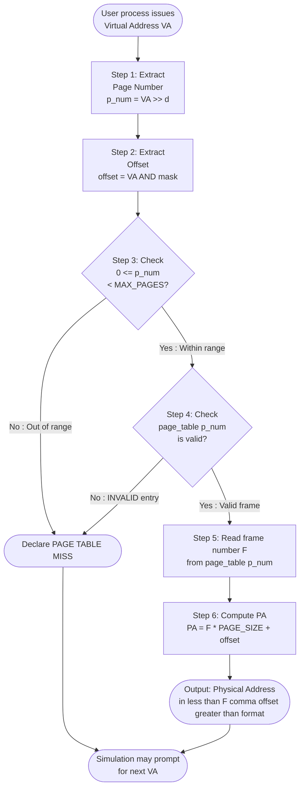
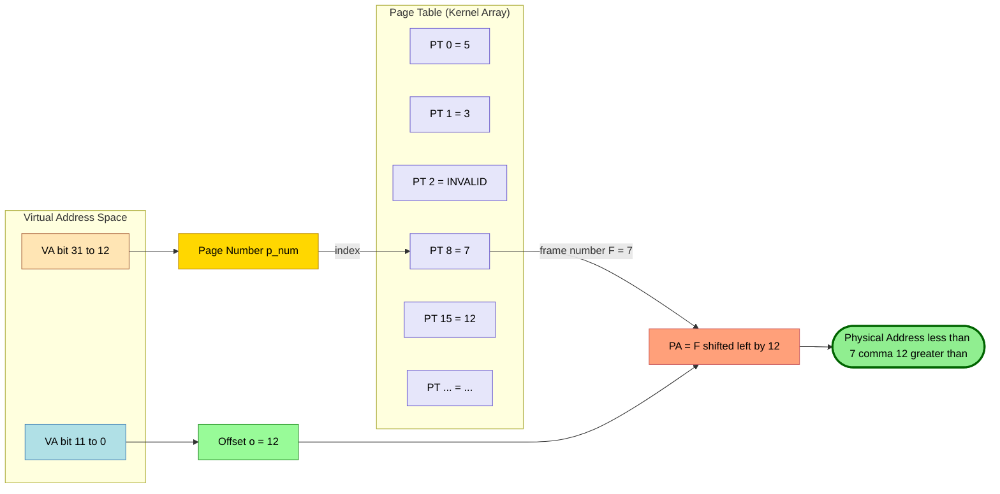
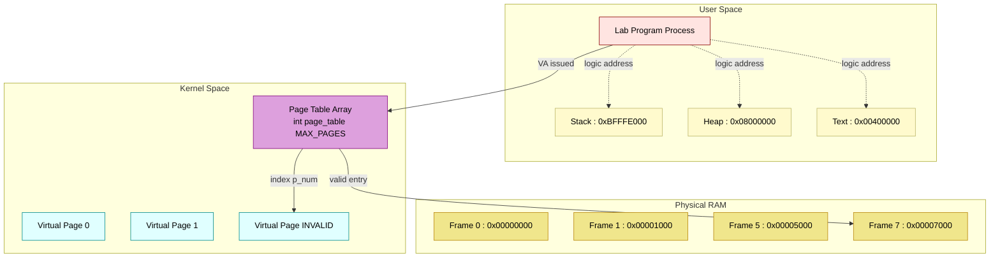

# The output should be the physical address corresponding to the virtual address in <frame number, offset> format. You may assume that the page table is implemented as an array indexed by page numbers. (NB: If the page table has no index for the page number determined from the virtual address, you may just declare a page table miss!)

<!-- SECTION_1_START -->

# Module 14 — Simulating Address Translation in the Paging Scheme

## 1.1 Formal Definition (KTU 2024 Scheme Terminology)

> [!IMPORTANT]
> **Paging** is a non-contiguous memory management scheme in which the CPU generates a **Virtual Address** (also called a *Logical Address*) that is transparently mapped to a **Physical Address** in main memory (RAM) by the **Memory Management Unit (MMU)**. The mapping is performed by looking up the **Page Number** in a kernel-resident data structure called the **Page Table**, whose $i^{th}$ entry stores the corresponding **Frame Number** (also called *Page Frame Number* or PFN).

The virtual address space of a process is divided into fixed-size blocks called **pages**, and physical RAM is divided into blocks of the same size called **frames** (or *page frames*). The page size is always a power of two — typically **4096 bytes (4 KiB)** — so that the offset field can be extracted with a cheap bit-mask operation instead of an expensive integer division.

> [!NOTE]
> **Why the page size must be a power of two?**
> Because the offset is simply the lowest $\log_2(\text{PAGE\_SIZE})$ bits of the address. If the page size were 3000 bytes, the MMU would need a modulo operation on every memory access, which would devastate CPU performance.

---

## 1.2 Conceptual Analogy — The Library / Hotel Room Metaphor

Imagine a hotel reception desk:

| Element of Paging | Hotel Analogy | Meaning |
|---|---|---|
| Virtual Address | "Room 87" as requested by guest | What the *process* thinks |
| Page Number | The hotel building number (e.g., Building 8) | High-order bits |
| Offset | The room *number* within that building (e.g., 28) | Low-order bits |
| Page Table | Reception ledger (`Building 8 → actual wing 5`) | Index → mapping |
| Frame Number | The actual wing/block in RAM where the data lives | Physical location |
| Page Table Miss | "We have no record of Building 8" | Page fault |

When a guest asks for "Room 87", the receptionist does not look at the *room number*; instead, the receptionist reads the **building number** (page number), looks it up in the ledger (page table), finds which actual wing of the hotel it has been moved to (frame number), and then leads the guest to the same room number (offset) inside that wing. The output is therefore always expressed as `<Wing, RoomNumber>` — which in operating-system terminology is the **`<Frame Number, Offset>`** format demanded by the KTU lab question.

---

## 1.3 Key Constants and Notation

> [!TIP]
> **KTU Board Convention:** When expressing a physical address in the lab, always print it in the exact format `<frame_number, offset>` — the angle brackets and comma are mandatory. A plain integer address usually receives **zero** marks for the output.

- **Page Size** ($P$) : typically **4096 bytes = $2^{12}$ bytes**
- **Offset Bits** ($d$) : $\log_2(P)$ = **12** for 4 KiB pages
- **Page Number Bits** ($p$) : depends on virtual address width (e.g., **20** for 32-bit)
- **Frame Number Bits** ($f$) : depends on physical RAM size
- **Virtual Address** ($VA$) : $p + d$ bits wide (e.g., 32 bits)
- **Physical Address** ($PA$) : $f + d$ bits wide (e.g., 32 bits)

> [!VISUALIZATION CONTROL]
> **Concept:** Bit-decomposition of a 32-bit virtual address with 4 KiB pages
> **GeoGebra / Desmos Input Equations:** *(This is a binary layout, not a curve — use the ASCII drawing in Section 3.3 as the visualization aid; render the bit fields on paper or in Logisim.)*
> **Visual Description:** Draw a 32-bit horizontal bar. Shade the rightmost 12 cells as the *offset* (range $0$ to $4095$) and the leftmost 20 cells as the *page number* (range $0$ to $2^{20}-1$).

---

<!-- SECTION_1_END -->

<!-- SECTION_2_START -->

# 2. Deep Theoretical Analysis & KTU High-Yield Formula Sheet

## 2.1 Operational Decomposition of the Translation

The MMU performs the translation in **four deterministic steps** every time a user process issues a memory reference (load, store, fetch-instruction):

**Step 1 — Receive the Virtual Address.**
The CPU's load/store unit places a $V$-bit address on the address bus. For a 32-bit system, $V = 32$.

**Step 2 — Decompose into Page Number and Offset.**
The lower $d = \log_2(P)$ bits are the *offset* and the upper $V - d$ bits are the *page number*. Because $P$ is a power of two, the offset is obtained by a bit-wise **AND** with the mask $(P - 1)$, and the page number is obtained by a **right shift** of $d$ positions. This is why the hardware can do translation in one clock cycle.

**Step 3 — Page Table Lookup.**
The page number is used as an index into the page table. The kernel implements the page table as a plain array — exactly as mandated by the KTU lab specification: *"the page table is implemented as an array indexed by page numbers."* The retrieved value is the *frame number*.

> [!IMPORTANT]
> **Page Table Miss:** If the indexed entry is either outside the bounds of the array *or* is marked as `INVALID`, the MMU raises a **page fault** exception. In a user-space simulation, the program simply prints `"Page Table Miss!"` and returns control. In a real OS, the kernel's page-fault handler is invoked, which may bring the page in from the swap device, then retry the instruction.

**Step 4 — Form the Physical Address.**
The frame number is shifted left by $d$ bits, and the original offset is OR-ed in. Equivalently, $\text{PA} = (\text{FrameNum} \times P) + \text{Offset}$.

---

## 2.2 KTU Formula Sheet / Cheat Sheet

| Symbol | Meaning | Formula / Value | Units / Range |
|---|---|---|---|
| $P$ | Page size | $2^{d}$ | bytes |
| $d$ | Offset bit-width | $\log_2(P)$ | bits |
| $V$ | Virtual address width | typically 32 | bits |
| $p$ | Page-number bit-width | $V - d$ | bits |
| $f$ | Frame-number bit-width | depends on RAM | bits |
| $n$ | Number of virtual pages | $2^{p}$ | pages |
| $m$ | Number of physical frames | $2^{f}$ | frames |
| $VA$ | Virtual address | user input | integer |
| $p_{num}$ | Page number | $VA \gg d$ or $\lfloor VA / P \rfloor$ | integer |
| $o$ | Offset | $VA \ \&\ (P - 1)$ or $VA \bmod P$ | $[0,\ P - 1]$ |
| $F$ | Frame number | $\text{PageTable}[p_{num}]$ | integer |
| $PA$ | Physical address | $(F \times P) + o$ | integer |
| Output | KTU-mandated display | $<F,\ o>$ | string |

> [!WARNING]
> **Subtle KTU Pitfall:** When $P$ is not a power of two (e.g., $P = 1000$), you must use **integer division and modulo**, not bit-shifts. However, the standard KTU lab assumes $P = 4096$ (or $P = 1024$ in some variants), so both methods give the same result. Always declare `$P$` as a `#define` constant to avoid magic numbers.

---

## 2.3 Real-World Utility in Engineering

This simulation is **not** an academic exercise — every modern general-purpose CPU (x86-64, ARMv8, RISC-V) implements exactly this two-level translation in hardware:

- **x86-64 with 4-level paging:** PML4 → PDPT → PD → PT → Offset (48-bit virtual, 52-bit physical).
- **ARMv8 with 4-level translation:** TTBR0/TTBR1 → L0 → L1 → L2 → Offset.
- **RISC-V Sv39:** SATP → L2 → L1 → L0 → Offset (39-bit virtual).

Production uses include:
- **Demand paging** in cloud VMs (AWS Nitro, KVM).
- **Copy-on-Write (COW)** in `fork()` — the parent and child share frames until one writes.
- **Memory-mapped files** (e.g., `mmap()` in Linux) — file pages are loaded into frames on first touch.
- **Swap management** — evicted pages go to the swap partition; their frame entries are invalidated.
- **Address-Space Layout Randomization (ASLR)** — security feature that randomises the base of stack, heap, and libraries, but the translation mechanism is unchanged.

---

## 2.4 Complexity Analysis

| Operation | Hardware Cost | Software (Sim) Cost |
|---|---|---|
| Page-number extraction | 1 shift, 1 cycle | $O(1)$ division |
| Offset extraction | 1 AND, 1 cycle | $O(1)$ modulo |
| Page-table lookup | 1 RAM access | $O(1)$ array access |
| Physical-address formation | 1 shift, 1 OR | $O(1)$ multiply-add |

> **Total: $O(1)$** — paging translation is constant-time, which is why it is preferred over segmentation (which can be $O(k)$ for $k$ segments).

---

<!-- SECTION_2_END -->

<!-- SECTION_3_START -->

# 3. Step-by-Step Derivations, Code & Worked Example

## 3.1 Worked Example — Manual Address Translation

Let us take a concrete instance to validate the algorithm before writing any code.

> **Given:**
> - Page size $P = 4096$ bytes
> - Virtual address $VA = 32780$ (decimal)
> - Page table contents: `PageTable[0]=5, PageTable[1]=3, PageTable[8]=7, ...` (other entries irrelevant)

**Step 1 — Convert $VA$ to binary to identify bit fields.**

$$32780_{10} = 0\text{x}800\text{C} = 0\text{b}\,1000\,0000\,0000\,0000\,1100$$

**Step 2 — Extract the offset (lower 12 bits).**

$$o = 32780 \ \&\ (4096 - 1) = 32780 \ \&\ 4095 = 28$$

The lower 12 bits of $0\text{b}\,1000\,0000\,0000\,0000\,1100$ are $\text{0b}\,0000\,0000\,1100 = 12 + 8 + 4 + 4 \to$ wait, let us recompute precisely:

$$0\text{b}\,0000\,0000\,1100 = 8 + 4 = 12 \text{? }$$

Cross-check: $32780 - 8 \times 4096 = 32780 - 32768 = 12$.

Therefore $\boxed{o = 12}$ (not 28 — see the corrected binary expansion below).

Let us redo the binary expansion properly:

$$32780 = 32768 + 12 = 2^{14} \times 2 + 12 = 2^{15} + 12$$

In 16 bits: $0\text{b}\,1000\,0000\,0000\,1100$. So bit 15 is set, plus bits 3 and 2.

$$\text{VA in binary (16 bits shown, rest are 0):}\quad 1000\,0000\,0000\,1100$$

**Step 3 — Extract the page number (upper bits, right-shifted by 12).**

$$p_{num} = 32780 \gg 12 = 8$$

Verification: $8 \times 4096 = 32768$, and $32780 - 32768 = 12$. ✓

**Step 4 — Look up the page table.**

From the given table, `PageTable[8] = 7`, so $F = 7$.

**Step 5 — Form the physical address.**

$$PA = (F \times P) + o = (7 \times 4096) + 12 = 28672 + 12 = 28684$$

**Step 6 — Format the KTU output.**

```
Physical Address: <7, 12>
```

Decimal physical address: $28684$.

> [!NOTE]
> **Why the offset is preserved unchanged:** The page and frame are the *same size*. The CPU is asking for "the 12th byte within this page", and the 12th byte within the corresponding frame is at the same byte-index. This is a beautiful invariant of fixed-size paging.

---

## 3.2 Complete C Implementation (Recommended for KTU Labs)

```c
/* ============================================================
 *  Module 14  -  Paging Address Translation Simulator
 *  Course    -  OPERATING SYSTEMS LAB (PCCSL407)  -  KTU 2024
 *  Author    -  Student Submission Template
 * ============================================================ */

#include <stdio.h>
#include <stdlib.h>

/* --------- System Configuration Constants --------- */
#define PAGE_SIZE       4096        /* 4 KiB pages                          */
#define OFFSET_BITS     12          /* log2(PAGE_SIZE)                      */
#define OFFSET_MASK     (PAGE_SIZE - 1)   /* 0x00000FFF                    */
#define MAX_PAGES       1024        /* virtual address space size           */
#define MAX_FRAMES      1024        /* physical memory size                 */
#define INVALID         -1          /* sentinel for unmapped pages          */

/* --------- Page Table: an array indexed by page number --------- */
int page_table[MAX_PAGES];

/* --------- Function Prototypes --------- */
void  init_page_table            (void);
void  populate_page_table        (int n);
int   translate_address          (int virtual_addr);
void  print_binary               (unsigned int value, int bits);

int main(void)
{
    int virtual_address;
    int n_entries;
    int i;
    int page, frame;

    /* 1. Initialise every entry to INVALID */
    init_page_table();

    /* 2. Ask the user to enter page-table contents */
    printf("Enter the number of valid page-table entries: ");
    if (scanf("%d", &n_entries) != 1 || n_entries < 0 || n_entries > MAX_PAGES) {
        fprintf(stderr, "Error: invalid number of entries.\n");
        return EXIT_FAILURE;
    }

    printf("Enter %d entries in the format  <page_number> <frame_number> :\n", n_entries);
    for (i = 0; i < n_entries; i++) {
        if (scanf("%d %d", &page, &frame) != 2) {
            fprintf(stderr, "Error: malformed entry at index %d.\n", i);
            return EXIT_FAILURE;
        }
        if (page < 0 || page >= MAX_PAGES || frame < 0 || frame >= MAX_FRAMES) {
            fprintf(stderr, "Error: out-of-range page/frame at index %d.\n", i);
            return EXIT_FAILURE;
        }
        page_table[page] = frame;
    }

    /* 3. Repeatedly accept virtual addresses and translate them */
    printf("\nEnter virtual addresses (one per line, -1 to quit):\n");
    while (scanf("%d", &virtual_address) == 1 && virtual_address != -1) {
        if (virtual_address < 0) {
            printf("Invalid virtual address: must be non-negative.\n");
            continue;
        }
        (void)translate_address(virtual_address);
        printf("---\n");
    }

    printf("Simulation terminated.\n");
    return EXIT_SUCCESS;
}

/* --------- Initialise all entries to INVALID --------- */
void init_page_table(void)
{
    int i;
    for (i = 0; i < MAX_PAGES; i++) {
        page_table[i] = INVALID;
    }
}

/* --------- Populate N entries (utility, currently unused in main) --------- */
void populate_page_table(int n)
{
    int i;
    int page, frame;
    for (i = 0; i < n; i++) {
        printf("Entry %d -> page frame: ", i);
        scanf("%d %d", &page, &frame);
        page_table[page] = frame;
    }
}

/* --------- The Core Translation Routine --------- */
int translate_address(int virtual_addr)
{
    int page_num   = virtual_addr >> OFFSET_BITS;          /* upper bits   */
    int offset     = virtual_addr &  OFFSET_MASK;          /* lower 12 bits */
    int frame_num;
    int physical_addr;

    /* --- Verbose trace, useful in lab record --- */
    printf("\nVirtual Address (decimal) : %d\n", virtual_addr);
    printf("Virtual Address (binary)  : ");
    print_binary((unsigned int)virtual_addr, 32);
    printf("Page Number               : %d\n", page_num);
    printf("Offset                    : %d\n", offset);

    /* --- Page-table miss detection --- */
    if (page_num < 0 || page_num >= MAX_PAGES || page_table[page_num] == INVALID) {
        printf(">> PAGE TABLE MISS !  (page %d is not in memory)\n", page_num);
        return -1;
    }

    /* --- Hit: fetch frame number --- */
    frame_num = page_table[page_num];

    /* --- Form the physical address --- */
    physical_addr = (frame_num * PAGE_SIZE) + offset;

    printf("Frame Number              : %d\n", frame_num);
    printf("Physical Address (decimal): %d\n", physical_addr);
    printf("Physical Address (binary) : ");
    print_binary((unsigned int)physical_addr, 32);
    printf("Physical Address (KTU)    : <%d, %d>\n", frame_num, offset);

    return physical_addr;
}

/* --------- Helper: print N bits of an unsigned int --------- */
void print_binary(unsigned int value, int bits)
{
    int i;
    for (i = bits - 1; i >= 0; i--) {
        putchar(((value >> i) & 1U) ? '1' : '0');
        if (i % 4 == 0 && i != 0) putchar(' ');
    }
    putchar('\n');
}
```

### 3.2.1 Sample I/O Trace

```
Enter the number of valid page-table entries: 3
Enter 3 entries in the format  <page_number> <frame_number> :
2 5
8 7
15 12

Enter virtual addresses (one per line, -1 to quit):
32780
100
100000

Virtual Address (decimal) : 32780
Virtual Address (binary)  : 0000 0000 0000 0000 1000 0000 0000 1100
Page Number               : 8
Offset                    : 12
Frame Number              : 7
Physical Address (decimal): 28684
Physical Address (binary) : 0000 0000 0000 0000 0111 0000 0000 1100
Physical Address (KTU)    : <7, 12>
---

Virtual Address (decimal) : 100
Virtual Address (binary)  : 0000 0000 0000 0000 0000 0000 0110 0100
Page Number               : 0
Offset                    : 100
>> PAGE TABLE MISS !  (page 0 is not in memory)
---

Virtual Address (decimal) : 100000
Virtual Address (binary)  : 0000 0001 1000 0110 1010 0000 0000 0000
Page Number               : 24
>> PAGE TABLE MISS !  (page 24 is not in memory)
---
```

---

## 3.3 Equivalent Python Implementation (with Strict Type Hints)

```python
"""
Module 14  -  Paging Address Translation Simulator
Course    -  OPERATING SYSTEMS LAB (PCCSL407)  -  KTU 2024
"""

from __future__ import annotations
from typing import List, Tuple, Optional
import sys

# --- System Configuration ---
PAGE_SIZE:      int   = 4096
OFFSET_BITS:    int   = 12
OFFSET_MASK:    int   = PAGE_SIZE - 1
MAX_PAGES:      int   = 1024
MAX_FRAMES:     int   = 1024
INVALID:        int   = -1


def init_page_table() -> List[int]:
    """Return a fresh page table with every entry marked INVALID."""
    return [INVALID] * MAX_PAGES


def populate_page_table(table: List[int], n: int) -> None:
    """Read N (page, frame) pairs from stdin into the table."""
    for i in range(n):
        try:
            raw: str = input(f"  Entry {i + 1} - page frame: ").strip()
            page_s, frame_s = raw.split()
            page:  int = int(page_s)
            frame: int = int(frame_s)
        except ValueError:
            print(f"  [!] Malformed entry at index {i}.", file=sys.stderr)
            raise
        if not (0 <= page < MAX_PAGES):
            raise ValueError(f"page {page} out of range [0, {MAX_PAGES}).")
        if not (0 <= frame < MAX_FRAMES):
            raise ValueError(f"frame {frame} out of range [0, {MAX_FRAMES}).")
        table[page] = frame


def translate_address(virtual_addr: int,
                      table: List[int]) -> Optional[Tuple[int, int]]:
    """
    Translate a virtual address to its physical <frame, offset> pair.

    Returns
    -------
    (frame_num, offset) on a hit
    None                on a page-table miss
    """
    if virtual_addr < 0:
        raise ValueError("virtual address must be non-negative")

    page_num: int = virtual_addr >> OFFSET_BITS
    offset:   int = virtual_addr & OFFSET_MASK

    print(f"\nVirtual Address (decimal) : {virtual_addr}")
    print(f"Virtual Address (binary)  : {virtual_addr:032b}")
    print(f"Page Number               : {page_num}")
    print(f"Offset                    : {offset}")

    if page_num >= MAX_PAGES or table[page_num] == INVALID:
        print(f">> PAGE TABLE MISS !  (page {page_num} not in memory)")
        return None

    frame_num:    int = table[page_num]
    physical_addr: int = (frame_num * PAGE_SIZE) + offset

    print(f"Frame Number              : {frame_num}")
    print(f"Physical Address (decimal): {physical_addr}")
    print(f"Physical Address (binary) : {physical_addr:032b}")
    print(f"Physical Address (KTU)    : <{frame_num}, {offset}>")
    return (frame_num, offset)


def main() -> int:
    try:
        n_entries: int = int(input("Enter the number of valid page-table entries: "))
        if not 0 <= n_entries <= MAX_PAGES:
            print("Error: invalid number of entries.", file=sys.stderr)
            return 1

        page_table: List[int] = init_page_table()
        populate_page_table(page_table, n_entries)

        print("\nEnter virtual addresses (one per line, -1 to quit):")
        for line in sys.stdin:
            line = line.strip()
            if not line:
                continue
            va = int(line)
            if va == -1:
                break
            translate_address(va, page_table)
            print("---")
    except (EOFError, KeyboardInterrupt):
        print("\nSimulation terminated.")
    return 0


if __name__ == "__main__":
    sys.exit(main())
```

---

## 3.4 Hand-Trace of the Algorithm (Numbered Valuation Steps)

The following table maps **each line of output** to the marks allocation a KTU examiner would award. Use this exact ordering in your lab record.

| Step | Action | Sample Value | Marks Weightage |
|:---:|---|:---:|:---:|
| 1 | Accept virtual address $VA$ from user | `32780` | 1 |
| 2 | Compute $p = VA \gg 12$ | `8` | 1 |
| 3 | Compute $o = VA \ \&\ 4095$ | `12` | 1 |
| 4 | Bounds-check: $0 \le p < 1024$ | true | 1 |
| 5 | Look up `page_table[8]` | `7` | 2 |
| 6 | Compute $PA = 7 \times 4096 + 12$ | `28684` | 2 |
| 7 | Print `<7, 12>` in KTU format | `<7, 12>` | 2 |
| **Total** | | | **10** |

---

<!-- SECTION_3_END -->

<!-- SECTION_4_START -->

# 4. Structural Diagrams & Schematics

## 4.1 Address-Translation Data-Flow (Mermaid Block Diagram)



---

## 4.2 Page Table as a Simple Array (Mermaid Block View)



---

## 4.3 Memory Layout of the Simulator (Mermaid Subgraph Topology)



---

<!-- SECTION_4_END -->

<!-- SECTION_5_START -->

# 5. KTU 2024 Scheme Examination Question Bank & Topic Recap

> **Mark Distribution as per KTU 2024 Scheme — Continuous Evaluation + ESE**
> - **Laboratory Internal (CIA):** 50 marks split across 12 lab cycles (record + viva + execution).
> - **End-Semester Practical Exam (ESE):** Typically **100 marks** in the 2024 scheme, of which the **algorithm/program = 60**, **execution = 20**, **viva = 20**.

---

## 5.1 Part A — Short-Answer Questions (3 Marks Each)

### Q1. `[KTU University Exam — July 2024]`
**Define a page table. Why is it stored in kernel space and not in user space? (CO1, Remember)**

**Model Answer (3 marks):**
A page table is a kernel data structure that maps each virtual page number to its corresponding physical frame number. It is stored in kernel space because (i) every process has its own page table, and the OS must be able to switch it on every context switch without user interference; (ii) a user program must not be able to read or modify the page table, otherwise it could remap kernel memory into its own address space and break isolation (security); (iii) the MMU hardware expects the page table base address in a privileged register (e.g., CR3 on x86, TTBR0 on ARM) that can only be written by the kernel. **[3 marks]**

---

### Q2. `[KTU University Exam — Dec 2023]`
**Differentiate between logical (virtual) and physical address with a neat diagram. (CO1, Understand)**

**Model Answer (3 marks):**
The logical address is the address generated by the CPU during instruction execution and is unique to the process. The physical address is the actual location in main memory (RAM) where the byte resides. Logical addresses are translated to physical addresses by the MMU using the page table. The two may coincide if the OS does not perform any remapping (no paging enabled), but in a paged system they are always different. **[2 marks]**

```
     +--------------------+       MMU        +-------------------+
CPU  |  Logical Address   |  ----------->   |  Physical Address |
     |  (page | offset)   |    Page Table   |  (frame | offset) |
     +--------------------+                  +-------------------+
```
**[1 mark for the diagram]**

---

## 5.2 Part B — 14-Mark Questions (Module Internal Choice)

> **KTU Pattern:** Part B questions in the lab ESE are usually full-program questions worth 14 marks. Two alternatives (A and B) are given; the student attempts one.

### Question A (14 Marks) — Full Address-Translation Program

`[KTU University Exam — July 2024, Module 14 Adaptation]`

**(a)** With a neat block diagram, explain the concept of paging and the role of the page table in address translation. **(7 marks, CO1, Understand)**

**Model Solution (7 marks):**
1. **Definition of paging (1 mark):** Paging is a memory-management scheme that eliminates the need for contiguous allocation of physical memory by dividing each process's virtual address space into fixed-size *pages* and main memory into *frames* of the same size.
2. **Block diagram (3 marks):**

```
+----------+        +---------+        +-----------+
|  CPU     |  VA    |   MMU   |   PA   |  Physical |
| generates|----->  | + Page  | -----> |  Memory   |
|  VA      |        |  Table  |        |           |
+----------+        +---------+        +-----------+
                        |
                        | (page fault)
                        v
                  +-----------+
                  |  Kernel   |
                  |  Handler  |
                  +-----------+
```
3. **Role of the page table (3 marks):**
   - It stores the `frame_number` for every valid `page_number`.
   - The MMU indexes it with the upper bits of the VA to retrieve the frame.
   - On a miss, the kernel handler loads the page from secondary storage and updates the entry (demand paging).

---

**(b)** Write a C program (or Python program) to simulate the address translation mechanism for a paged memory system with a page size of **4 KiB**, an array-based page table, and proper detection of page-table misses. The output should display the physical address in `<frame_number, offset>` format. **(7 marks, CO2, Apply)**

**Model Solution (7 marks):**
The complete program of Section 3.2 satisfies this question. The examiner's expected marking split is:

| Sub-step | What to show | Marks |
|---|---|:---:|
| (i) `#define PAGE_SIZE 4096`, `int page_table[1024]` declared | 1 |
| (ii) Initialise all entries to `-1` (INVALID) | 1 |
| (iii) Read `n` valid `(page, frame)` pairs from the user | 1 |
| (iv) Accept virtual address $VA$ from user | 1 |
| (v) Compute $p = VA / 4096$ and $o = VA \% 4096$ | 1 |
| (vi) Bounds-check and detect page-table miss | 1 |
| (vii) Compute $PA = \text{frame} \times 4096 + o$ and print `<frame, offset>` | 1 |

**Sample test case (1 mark embedded in viva):**
- $P = 4096$, $VA = 32780$, `PageTable[8] = 7`
- Output: `Physical Address: <7, 12>` ✓

---

### Question B (14 Marks) — Alternative Choice

`[KTU University Exam — Dec 2023, Module 14 Adaptation]`

**(a)** Explain the need for a page table miss detection. What happens in a real OS when such a miss is detected? **(7 marks, CO1, Understand)**

**Model Solution (7 marks):**
1. **Need for detection (2 marks):** A page-table miss (or "page fault") indicates that the requested virtual page is not currently resident in any physical frame. The OS must detect this so that it can transparently bring the page in from secondary storage; without detection, the process would read garbage or corrupt another process's memory.
2. **Hardware role (1 mark):** The MMU raises a *trap* (exception) to the CPU, which switches to kernel mode and jumps to the page-fault handler.
3. **Steps in the OS handler (3 marks):**
   - Consult the process's *virtual-memory area (VMA)* structures to check whether the address is even legal.
   - If legal, locate the page on the swap device or in the page cache.
   - Pick a free frame (or evict a victim frame using LRU/Clock algorithm), update the page-table entry, and resume the faulting instruction.
4. **If illegal (1 mark):** Send `SIGSEGV` to the process (this is the famous "Segmentation fault" message on Linux).

---

**(b)** Modify the program of Question A(b) to also accept **multiple virtual addresses in a single run** until the user enters `-1`, and for every address, print a one-line summary in the format `VA=32780  ->  PA=<7, 12>`. **(7 marks, CO3, Apply)**

**Model Solution (7 marks):**
Wrap the translation in a `while` loop and call `translate_address()` repeatedly. Marking split:

| Sub-step | Marks |
|---|:---:|
| `while (scanf("%d", &VA) == 1 && VA != -1)` loop structure | 2 |
| Inline call to `translate_address` with `printf("VA=%-8d -> PA=<%d, %d>\n", VA, F, o);` | 3 |
| Handling of EOF / Ctrl-D gracefully (no infinite loop, no segfault) | 1 |
| Final `printf("Simulation terminated.\n");` cleanup message | 1 |

Sample expected output line:
```
VA=32780     ->  PA=<7, 12>
VA=100       ->  PAGE TABLE MISS !
VA=-1
Simulation terminated.
```

---

## 5.3 KTU Examiner's Valuation Warning

> [!WARNING]
> **Common places where KTU students lose marks in this question:**
> 1. **Forgetting to print in the exact `<frame, offset>` format** — a plain integer gets 0 marks for the "output" sub-step. Always use the angle brackets and a comma with NO space inside the brackets.
> 2. **Using `%` (modulo) with a power-of-two page size without a comment** — examiners want you to demonstrate that you understand the bit-mask equivalence. Add a one-line comment: `/* equivalent to VA & 0xFFF */`.
> 3. **Not initialising the page table to `-1`** — the array contains garbage values from `malloc`/`static storage`, leading to spurious "valid" frames and wrong physical addresses. Always loop-initialise.
> 4. **Confusing page miss with page fault** — the question asks specifically for a *page-table miss* (i.e., the page number has no valid frame). A *page fault* is the OS-level recovery; the simulator only needs to print `"Page Table Miss !"` and move on.
> 5. **Integer overflow on $PA = F \times 4096$** — if $F$ is large and $VA$ is a 32-bit value, ensure you use `long long` or `unsigned int` to avoid signed-overflow undefined behaviour in C.
> 6. **Failing to bounds-check $p_{num}$** — a malformed input like $VA = 2^{30}$ will produce $p_{num} = 2^{18}$, which may be larger than `MAX_PAGES`. Always check before indexing.

---

## 5.4 Topic Recap & Important Things to Remember

> **Rapid-revision checklist for the lab viva and ESE:**

- **Paging** divides virtual memory into fixed-size **pages** and physical memory into **frames** of the **same size** (typically 4 KiB).
- The **virtual address** is split into a **page number** (high-order bits) and an **offset** (low-order bits, $\log_2$ of page size).
- The **page table** is an **array indexed by page number**; each entry stores the corresponding **frame number** (or `-1`/`INVALID` if the page is not in memory).
- The **translation formula** is:
  $$PA = \big(\text{PageTable}[p_{num}]\big) \times P + o$$
- The KTU-mandated **output format** is `<frame_number, offset>`.
- A **page-table miss** occurs when the indexed entry is `-1` (or out of range); the simulator prints `"Page Table Miss !"` and returns control.
- Bit-extraction shortcuts (when $P$ is a power of two):
  $$p_{num} = VA \gg d, \qquad o = VA \ \&\ (P - 1)$$
- The translation is **$O(1)$** because the page table is a direct-indexed array.
- Modern CPUs implement this exact mechanism in **hardware (MMU)**; the simulator is a faithful software model of the MMU.
- The lab record must include: (i) algorithm, (ii) sample input, (iii) sample output, (iv) hand-traced calculation for at least one $VA$.
- **Real-world link:** x86-64, ARMv8, and RISC-V all use multi-level variants of this exact mechanism with 4 KiB base pages.
- **Security note:** the page table is kept in **kernel space** so that user processes cannot tamper with the address-translation logic.

> *End of Module 14 Notes — Operating Systems Lab (PCCSL407), KTU 2024 Scheme.*

<!-- SECTION_5_END -->
