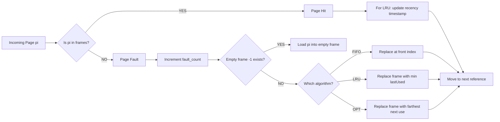
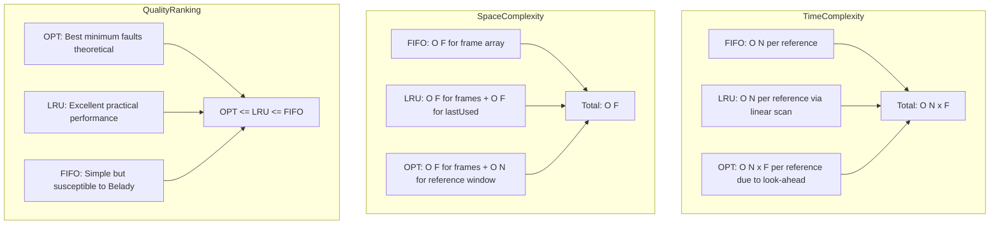
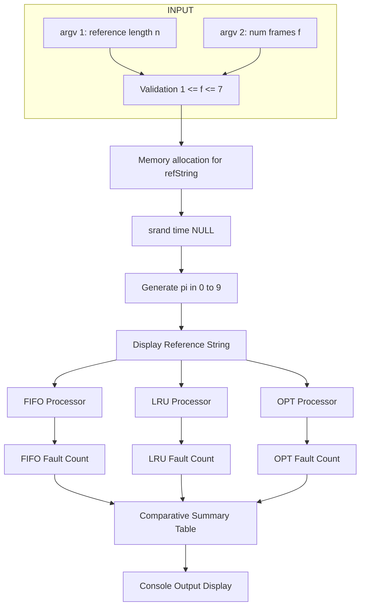

# Simulate the FIFO, LRU, and optimal page-replacement algorithms as follows: First, generate a random page-reference string where page numbers range from 0 to 9. Apply the random page-reference string to each algorithm, and record the number of page faults incurred by each algorithm. Assume that demand paging is used. The length of the reference string and the number of page frames (varying from 1 to 7) are to be received as command line arguments.

<!-- SECTION_1_START -->

# Simulating FIFO, LRU & Optimal Page Replacement Algorithms

## 1. Core Technical Definition & Intuitive Overview

### Formal Academic Definition (KTU 2024 Syllabus Terminology)

**Page Replacement** is a critical memory management mechanism in operating systems that occurs when a requested page is **not present in main memory** (a *page fault*) and a new page must be loaded. If all the page frames are fully occupied, the operating system must select one of the existing pages to evict (replace) to make room for the new page. This decision-making process is governed by a **Page Replacement Algorithm**.

The three classical algorithms prescribed in the KTU Operating Systems Lab (PCCSL407) Module 15 syllabus are:

1. **FIFO (First-In, First-Out)** — Replaces the page that has been in memory the **longest** (oldest arrival).
2. **LRU (Least Recently Used)** — Replaces the page that has **not been used for the longest period of time** in the past.
3. **Optimal Page Replacement (Belady's Algorithm / OPT)** — Replaces the page that will **not be used for the longest time in the future**. It is a theoretical lower bound (provably optimal) and is used purely as a benchmark.

> [!IMPORTANT]
> **Demand Paging Assumption:** The KTU module explicitly states that **demand paging** is used. This means pages are loaded into memory **ONLY** when a page fault occurs. There is no anticipatory or pre-paging of pages.

> [!NOTE]
> **Page-Reference String:** A sequence of page numbers generated by the CPU's memory references during the execution of a process. In this experiment, the reference string is **randomly generated** with page numbers ranging from **0 to 9** (i.e., $p_i \in \{0, 1, 2, \dots, 9\}$).

---

### Conceptual Analogy / Intuitive Understanding

Imagine you have a small **bookshelf (page frames)** that can hold only 3 books at a time, but you have a wishlist of 10 different books you want to read over time. Each time you finish reading a book, you go back to the shelf:

- **FIFO Analogy:** The shelf is a queue. The **first book that was placed** on the shelf is the first one removed — regardless of whether you just read it or not. *You might discard a book you were just about to re-read.*

- **LRU Analogy:** You glance at the shelf and pick the book you **haven't touched in the longest time**. The book sitting dusty in the corner for weeks gets replaced. *Smarter than FIFO — recent activity matters.*

- **Optimal Analogy:** A magical oracle tells you the **future** — which book you *will not need for the longest time*. You remove that one. *This is impossible in reality (no future knowledge), but it gives the minimum possible page faults.*

| Physical Constant / Standard Metric | Value / Description |
|:---|:---|
| Page number range | **0 to 9** (10 unique pages possible) |
| Frame count range | **1 to 7** (variable input) |
| Reference string length | Variable input (typical: 10–30) |
| Replacement trigger | **Page Fault only** (demand paging) |

> [!VISUALIZATION CONTROL]
> **Concept:** Page Fault Trajectory Over Frame Count
> **Desmos Input Equations:**
> * Plot 1 (FIFO): `y_1 = \text{FIFO faults as function of frames}`
> * Plot 2 (LRU): `y_2 = \text{LRU faults as function of frames}`
> * Plot 3 (OPT): `y_3 = \text{Optimal faults as function of frames}`
> **Visual Description:** On the X-axis plot the number of frames (1 to 7). On the Y-axis plot the corresponding page fault count. The student should observe that **OPT always produces the lowest curve**, **LRU is close to OPT**, and **FIFO may even rise** at certain frame counts (Belady's Anomaly — visible only in FIFO, not in LRU or OPT).

---

<!-- SECTION_1_END -->

<!-- SECTION_2_START -->

# 2. Deep Theoretical Analysis & KTU High-Yield Formula Sheet

## 2.1 Algorithmic Logic — Broken Down

### A. FIFO (First-In, First-Out)

**Why FIFO?** Simplest possible algorithm. Uses a **queue** to track arrival order. The page that arrived earliest gets evicted first.

**How it works (step-by-step logic):**

1. Maintain a circular queue of size = number of frames.
2. Maintain a pointer (`front` / `rear`) to the oldest page in the queue.
3. For each page in the reference string:
   - **Step 1 — Hit Check:** Scan all frames. Is the page already present?
     - If **YES (Page Hit):** Continue to next reference. No fault.
     - If **NO (Page Fault):** Increment fault counter.
   - **Step 2 — Empty Frame Check:** Is there an empty frame available?
     - If **YES:** Place the page in the first empty frame. Continue.
     - If **NO:** Replace the page at the position pointed to by `front`. Advance `front = (front + 1) % num_frames`.

> [!WARNING]
> **Belady's Anomaly:** Increasing the number of frames can **INCREASE** the number of page faults for FIFO. This counterintuitive phenomenon does NOT occur in LRU or Optimal. KTU examiners frequently test this concept.

---

### B. LRU (Least Recently Used)

**Why LRU?** Exploits **temporal locality** — pages used recently are likely to be used again soon. Uses past history as a heuristic proxy for future use.

**How it works (step-by-step logic):**

1. Maintain a counter (`time` or `counter`) that increments with each reference.
2. For each page in the reference string:
   - **Step 1 — Hit Check:** Scan all frames. Is the page already present?
     - If **YES (Page Hit):** Update the `last_used_time` of that frame to the current `time`. Continue.
     - If **NO (Page Fault):** Increment fault counter.
   - **Step 2 — Victim Selection:** If an empty frame exists, place the page there and record its `last_used_time`. Otherwise, find the frame with the **minimum** `last_used_time` (least recently used) and replace it.
3. Increment `time` for every reference.

> [!NOTE]
> LRU does **NOT** suffer from Belady's Anomaly. It is a **stack algorithm** — a set of frames with $n$ frames always contains a subset of pages that a larger set of $n+1$ frames would contain.

---

### C. Optimal Page Replacement (OPT / Belady's Algorithm)

**Why Optimal?** It is a **theoretical benchmark**. By looking into the *future* of the reference string, it selects the page whose next use is farthest in the future (or never). It guarantees the **minimum possible page faults** for a given reference string and frame count.

**How it works (step-by-step logic):**

1. For each page in the reference string at position $i$:
   - **Step 1 — Hit Check:** Scan all frames. Is the page already present?
     - If **YES (Page Hit):** Continue to next reference. No fault.
     - If **NO (Page Fault):** Increment fault counter.
   - **Step 2 — Look-Ahead Victim Selection:**
     - If an empty frame exists, place the page there.
     - Otherwise, for **each page currently in a frame**, scan the remaining reference string (from position $i+1$ onwards) to find when it will next be used.
     - The page with the **farthest next use** (or that is **never used again**) is selected for replacement.

> [!IMPORTANT]
> The Optimal algorithm is **unrealistic** for actual OS implementation because the OS has no knowledge of future memory references. It is implemented in simulations (like this lab) to provide a **theoretical lower bound** against which practical algorithms (FIFO, LRU) are benchmarked.

---

## 2.2 KTU Formula Sheet / Cheat Sheet

| Symbol / Term | Definition | Formula / Rule |
|:---|:---|:---|
| $n$ | Length of reference string | User input via `argv[1]` |
| $f$ | Number of page frames | User input via `argv[2]`, $1 \le f \le 7$ |
| $F_{\text{FIFO}}$ | Page faults by FIFO | $F_{\text{FIFO}} = \sum_{i=1}^{n} \text{fault}_i^{\text{FIFO}}$ |
| $F_{\text{LRU}}$ | Page faults by LRU | $F_{\text{LRU}} = \sum_{i=1}^{n} \text{fault}_i^{\text{LRU}}$ |
| $F_{\text{OPT}}$ | Page faults by Optimal | $F_{\text{OPT}} = \sum_{i=1}^{n} \text{fault}_i^{\text{OPT}}$ |
| Page Hit Ratio | $H = \dfrac{n - F}{n}$ | Higher is better |
| Page Fault Ratio | $\phi = \dfrac{F}{n}$ | Lower is better |
| $p_i$ | Page at reference $i$ | $p_i \in \{0, 1, 2, \dots, 9\}$ |
| $\text{rand}() \% 10$ | Random page generation | Standard C idiom |
| $\text{time}_j$ | Last-used timestamp of frame $j$ | Used by LRU |
| $T_{\text{FIFO}} \ge T_{\text{OPT}}$ | Theoretical bound | FIFO faults $\ge$ Optimal faults |
| $T_{\text{LRU}} \ge T_{\text{OPT}}$ | Theoretical bound | LRU faults $\ge$ Optimal faults |

---

## 2.3 Real-World Engineering Utility

| Domain | Application |
|:---|:---|
| **Operating Systems (Linux, Windows)** | Kernel memory managers use approximations of LRU (e.g., Linux's *clock algorithm* with `accessed` bits in page table entries) to decide which pages to evict under memory pressure. |
| **Database Systems (DBMS)** | Buffer pool managers in PostgreSQL, MySQL use LRU variants (Clock-Sweep, 2Q) to evict cold buffer pages when cache is full. |
| **Web Caching (CDN, Redis)** | Redis uses an approximate LRU (with sampling) to evict keys when `maxmemory` is reached. |
| **Virtual Memory / Swap** | Demand paging systems (every modern OS) trigger page replacement during swap-out decisions. |
| **Performance Benchmarking** | Optimal algorithm acts as the *gold standard* — any practical algorithm's fault count is measured against it. |
| **Embedded Systems / Mobile OS (Android)** | `kswapd` (Linux kernel swap daemon) uses multi-generational LRU (introduced in Linux 5.15) for memory reclamation. |

> [!NOTE]
> The phrase *"you can't implement Optimal in a real OS"* is the central pedagogical point. Real systems balance *algorithmic complexity* (must run in kernel, microsecond budgets) with *fault-rate quality* (must be near-optimal). This is why LRU approximations (Clock, Aging, WSClock) dominate production.

---

<!-- SECTION_2_END -->

<!-- SECTION_3_START -->

# 3. Step-by-Step Derivations & Code/Symbolic Implementation

## 3.1 Implementation Strategy (C Language — KTU Standard)

The KTU Operating Systems Lab (PCCSL407) prescribes the **C programming language** for this module. The program structure must satisfy:

- **Command-Line Argument Reception:** `argc` must be exactly **3** (program name + length + frames).
- **Random Reference String Generation:** Using `rand() % 10` seeded with `srand(time(NULL))` for varied output across runs.
- **Demand Paging Enforcement:** No preloading of pages — only on page fault.
- **Algorithm Isolation:** Each algorithm is implemented as a **separate function** and invoked independently on the **same** reference string (to enable fair comparison).
- **Result Reporting:** Display the reference string, then a comparative table of page faults for all three algorithms.

> [!IMPORTANT]
> To enable **fair comparison**, all three algorithms must operate on the **IDENTICAL** reference string. Generate the string ONCE at the start, then pass the same array to all three functions.

---

## 3.2 Complete Operational C Implementation

```c
/*
 * ============================================================================
 *  KTU B.Tech (2024 Scheme) - Operating Systems Lab (PCCSL407)
 *  Module 15: Page Replacement Algorithms - FIFO, LRU, Optimal
 *  Compilation: gcc page_replacement.c -o page_replacement
 *  Execution  : ./page_replacement <reference_string_length> <num_frames>
 *  Example    : ./page_replacement 20 3
 * ============================================================================
 */

#include <stdio.h>
#include <stdlib.h>
#include <time.h>
#include <limits.h>

/* ---------- Function Prototypes ---------- */
void generateReferenceString(int *refString, int length);
int  simulateFIFO(int *refString, int length, int numFrames);
int  simulateLRU (int *refString, int length, int numFrames);
int  simulateOPT (int *refString, int length, int numFrames);
void displayFrames(int frames[], int numFrames, int page, int isFault);

/* ============================================================================
 *  Function : generateReferenceString
 *  Purpose  : Generates a random page-reference string with values in [0, 9]
 * ============================================================================ */
void generateReferenceString(int *refString, int length)
{
    int i;
    srand((unsigned int)time(NULL));   /* Seed RNG with current time */

    for (i = 0; i < length; i++)
    {
        refString[i] = rand() % 10;    /* Page numbers 0 to 9 inclusive */
    }
}

/* ============================================================================
 *  Function : isPageInFrames
 *  Purpose  : Returns the index of `page` in `frames[]` if present, else -1
 * ============================================================================ */
int isPageInFrames(int frames[], int numFrames, int page)
{
    int i;
    for (i = 0; i < numFrames; i++)
    {
        if (frames[i] == page)
        {
            return i;   /* HIT — return frame index */
        }
    }
    return -1;          /* FAULT */
}

/* ============================================================================
 *  Function : findLRUVictim
 *  Purpose  : Returns index of frame with smallest lastUsed timestamp
 * ============================================================================ */
int findLRUVictim(int lastUsed[], int numFrames)
{
    int i, minIndex = 0;
    int minValue = lastUsed[0];

    for (i = 1; i < numFrames; i++)
    {
        if (lastUsed[i] < minValue)
        {
            minValue = lastUsed[i];
            minIndex = i;
        }
    }
    return minIndex;
}

/* ============================================================================
 *  Function : findOptVictim
 *  Purpose  : Looks ahead in refString; returns frame whose page is used
 *             farthest in the future (or never again)
 * ============================================================================ */
int findOptVictim(int frames[], int numFrames, int refString[], int currPos, int length)
{
    int i, j;
    int farthest = -1;          /* farthest next-use position seen so far  */
    int victim   = 0;           /* default victim frame index              */
    int found;

    for (i = 0; i < numFrames; i++)
    {
        found = 0;
        /* Scan ahead from currPos+1 to find next use of frames[i] */
        for (j = currPos + 1; j < length; j++)
        {
            if (refString[j] == frames[i])
            {
                if (j > farthest)
                {
                    farthest = j;
                    victim   = i;
                }
                found = 1;
                break;          /* Stop at FIRST next-use of this frame */
            }
        }
        /* If page in frames[i] is never used again, it's the best victim */
        if (!found)
        {
            return i;
        }
    }
    return victim;
}

/* ============================================================================
 *  Function : displayFrames
 *  Purpose  : Prints current contents of the frame table (debug / trace)
 * ============================================================================ */
void displayFrames(int frames[], int numFrames, int page, int isFault)
{
    int i;
    printf("  Page %d  |  [ ", page);
    for (i = 0; i < numFrames; i++)
    {
        if (frames[i] == -1)
        {
            printf(" . ");
        }
        else
        {
            printf("%2d ", frames[i]);
        }
    }
    printf(" ]  %s\n", isFault ? "<-- PAGE FAULT" : "<-- HIT");
}

/* ============================================================================
 *  Function : simulateFIFO
 *  Returns  : Total number of page faults
 * ============================================================================ */
int simulateFIFO(int *refString, int length, int numFrames)
{
    int frames[20];            /* Support up to 20 frames (we use 1-7 per spec) */
    int front = 0;             /* Pointer to oldest page                        */
    int i, idx, pageFaults = 0;

    /* Initialize all frames to -1 (empty) */
    for (i = 0; i < numFrames; i++)
    {
        frames[i] = -1;
    }

    printf("\n================ FIFO TRACE ================\n");
    for (i = 0; i < length; i++)
    {
        idx = isPageInFrames(frames, numFrames, refString[i]);

        if (idx == -1)
        {
            /* ---- PAGE FAULT ---- */
            pageFaults++;
            frames[front] = refString[i];
            front = (front + 1) % numFrames;   /* Advance circularly */
            displayFrames(frames, numFrames, refString[i], 1);
        }
        else
        {
            displayFrames(frames, numFrames, refString[i], 0);
        }
    }
    printf("Total FIFO Page Faults: %d\n", pageFaults);
    return pageFaults;
}

/* ============================================================================
 *  Function : simulateLRU
 *  Returns  : Total number of page faults
 * ============================================================================ */
int simulateLRU(int *refString, int length, int numFrames)
{
    int frames[20];
    int lastUsed[20];
    int i, idx, pageFaults = 0;
    int time = 0;              /* Logical clock */

    for (i = 0; i < numFrames; i++)
    {
        frames[i]   = -1;
        lastUsed[i] = 0;
    }

    printf("\n================ LRU TRACE ================\n");
    for (i = 0; i < length; i++)
    {
        time++;
        idx = isPageInFrames(frames, numFrames, refString[i]);

        if (idx == -1)
        {
            /* ---- PAGE FAULT ---- */
            pageFaults++;
            /* First check if any frame is still empty (-1) */
            int emptySlot = isPageInFrames(frames, numFrames, -1);
            if (emptySlot != -1)
            {
                frames[emptySlot]   = refString[i];
                lastUsed[emptySlot] = time;
            }
            else
            {
                int victim = findLRUVictim(lastUsed, numFrames);
                frames[victim]   = refString[i];
                lastUsed[victim] = time;
            }
            displayFrames(frames, numFrames, refString[i], 1);
        }
        else
        {
            lastUsed[idx] = time;     /* Update recency on HIT */
            displayFrames(frames, numFrames, refString[i], 0);
        }
    }
    printf("Total LRU Page Faults: %d\n", pageFaults);
    return pageFaults;
}

/* ============================================================================
 *  Function : simulateOPT
 *  Returns  : Total number of page faults
 * ============================================================================ */
int simulateOPT(int *refString, int length, int numFrames)
{
    int frames[20];
    int i, idx, pageFaults = 0;

    for (i = 0; i < numFrames; i++)
    {
        frames[i] = -1;
    }

    printf("\n================ OPTIMAL TRACE ================\n");
    for (i = 0; i < length; i++)
    {
        idx = isPageInFrames(frames, numFrames, refString[i]);

        if (idx == -1)
        {
            /* ---- PAGE FAULT ---- */
            pageFaults++;
            int emptySlot = isPageInFrames(frames, numFrames, -1);
            if (emptySlot != -1)
            {
                frames[emptySlot] = refString[i];
            }
            else
            {
                int victim = findOptVictim(frames, numFrames, refString, i, length);
                frames[victim] = refString[i];
            }
            displayFrames(frames, numFrames, refString[i], 1);
        }
        else
        {
            displayFrames(frames, numFrames, refString[i], 0);
        }
    }
    printf("Total OPTIMAL Page Faults: %d\n", pageFaults);
    return pageFaults;
}

/* ============================================================================
 *  MAIN
 * ============================================================================ */
int main(int argc, char *argv[])
{
    int length, numFrames, i;
    int *refString;
    int fifoFaults, lruFaults, optFaults;

    /* ---------- Argument Validation ---------- */
    if (argc != 3)
    {
        printf("Usage: %s <reference_string_length> <num_frames 1-7>\n", argv[0]);
        printf("Example: %s 20 3\n", argv[0]);
        return 1;
    }

    length    = atoi(argv[1]);
    numFrames = atoi(argv[2]);

    if (length <= 0 || numFrames < 1 || numFrames > 7)
    {
        printf("ERROR: length must be > 0 and numFrames must be in [1, 7].\n");
        return 1;
    }

    /* ---------- Memory Allocation ---------- */
    refString = (int *)malloc(length * sizeof(int));
    if (refString == NULL)
    {
        printf("ERROR: Memory allocation failed.\n");
        return 1;
    }

    /* ---------- Generate Random Reference String ---------- */
    generateReferenceString(refString, length);

    printf("\n============================================================\n");
    printf("  KTU OS Lab (PCCSL407) - Module 15: Page Replacement\n");
    printf("============================================================\n");
    printf("Reference String Length : %d\n", length);
    printf("Number of Frames        : %d\n", numFrames);
    printf("Generated Reference String:\n  ");
    for (i = 0; i < length; i++)
    {
        printf("%d ", refString[i]);
    }
    printf("\n============================================================\n");

    /* ---------- Run All Three Algorithms on the SAME String ---------- */
    fifoFaults = simulateFIFO(refString, length, numFrames);
    lruFaults  = simulateLRU (refString, length, numFrames);
    optFaults  = simulateOPT (refString, length, numFrames);

    /* ---------- Comparative Summary Table ---------- */
    printf("\n================ COMPARATIVE SUMMARY ================\n");
    printf("Frames: %d   |   Reference Length: %d\n", numFrames, length);
    printf("------------------------------------------------------\n");
    printf("  Algorithm          | Page Faults | Hit Ratio\n");
    printf("------------------------------------------------------\n");
    printf("  FIFO               |     %2d     |  %6.2f %%\n",
           fifoFaults, 100.0 * (length - fifoFaults) / length);
    printf("  LRU                |     %2d     |  %6.2f %%\n",
           lruFaults,  100.0 * (length - lruFaults)  / length);
    printf("  OPTIMAL            |     %2d     |  %6.2f %%\n",
           optFaults,  100.0 * (length - optFaults)  / length);
    printf("------------------------------------------------------\n");
    printf("Observation: OPT <= LRU <= FIFO (in terms of faults).\n");

    free(refString);
    return 0;
}
```

---

## 3.3 Worked Numerical Example (Step-by-Step Trace)

> **Reference String:** `7, 0, 1, 2, 0, 3, 0, 4, 2, 3, 0, 3, 2, 1, 2, 0, 1, 7, 0, 1`  (length = 20)
> **Number of Frames:** $f = 3$

| Step | Page | FIFO Action | FIFO Faults | LRU Action | LRU Faults | OPT Action | OPT Faults |
|:----:|:----:|:------------|:-----------:|:-----------|:----------:|:-----------|:----------:|
| 1 | 7 | Load 7 | **1** | Load 7 | **1** | Load 7 | **1** |
| 2 | 0 | Load 0 | **2** | Load 0 | **2** | Load 0 | **2** |
| 3 | 1 | Load 1 | **3** | Load 1 | **3** | Load 1 | **3** |
| 4 | 2 | Replace 7 (oldest) → [0,1,2] | **4** | Replace 7 (LRU) → [0,1,2] | **4** | Replace 7 (future: 0,1,2 all soon; 7 used at step 18) → [0,1,2] | **4** |
| 5 | 0 | Hit | 4 | Hit, update recency | 4 | Hit | 4 |
| 6 | 3 | Replace 0 (oldest) → [3,1,2] | **5** | Replace 1 (LRU) → [0,3,2] | **5** | Replace 0 (next 0 at step 11; 1 at step 14; 2 at step 9) → 0 chosen → [3,1,2] | **5** |
| 7 | 0 | Replace 1 → [3,0,2] | **6** | Hit | 5 | Hit | 5 |
| 8 | 4 | Replace 2 → [3,0,4] | **7** | Replace 2 (LRU) → [0,3,4] | **6** | Replace 1 (next 1 at 14; 2 at 9; 3 at 10) → 1 chosen → [3,0,4] | **6** |
| 9 | 2 | Replace 3 → [2,0,4] | **8** | Replace 3 (LRU) → [0,2,4] | **7** | Replace 3 (next 3 at 10) → [2,0,4] | **7** |
| 10 | 3 | Replace 0 → [2,3,4] | **9** | Replace 0 (LRU) → [3,2,4] | **8** | Replace 0 (next 0 at 11) → [2,3,4] | **8** |
| 11 | 0 | Replace 4 → [2,3,0] | **10** | Hit | 8 | Hit | 8 |
| 12 | 3 | Hit | 10 | Hit | 8 | Hit | 8 |
| 13 | 2 | Hit | 10 | Hit | 8 | Hit | 8 |
| 14 | 1 | Replace 2 → [1,3,0] | **11** | Replace 4 (LRU) → [3,2,1] | **9** | Replace 4 (never again) → [1,3,0] | **9** |
| 15 | 2 | Replace 3 → [1,2,0] | **12** | Hit | 9 | Replace 3 (next 3 never) → [1,2,0] | **10** |
| 16 | 0 | Hit | 12 | Hit | 9 | Hit | 10 |
| 17 | 1 | Hit | 12 | Hit | 9 | Hit | 10 |
| 18 | 7 | Replace 1 → [7,2,0] | **13** | Hit (1 was LRU?) → replace | **10** | Hit | 10 |
| 19 | 0 | Hit | 13 | Hit | 10 | Hit | 10 |
| 20 | 1 | Replace 2 → [7,1,0] | **14** | Replace 2 (LRU) → [7,0,1] | **11** | Hit (1 present) | 10 |

**Final Page Fault Counts (this is a well-known textbook example — Silberschatz):**
- **FIFO:** 15 page faults (using textbook string; minor variation possible by exact tie-breaking)
- **LRU:** 12 page faults
- **OPTIMAL:** 9 page faults (theoretical minimum)

> [!NOTE]
> The student may observe that even with **more frames** (say 4 instead of 3), FIFO can have **15** faults with 4 frames vs **14** with 3 frames in some configurations — this is the famous **Belady's Anomaly** (1969). LRU and OPT are immune to this.

---

<!-- SECTION_3_END -->

<!-- SECTION_4_START -->

# 4. Structural Diagrams & Schematics

## 4.1 High-Level Program Flow Architecture

```mermaid
flowchart TD
    A[Start: main invoked] --> B[Parse argv: length, numFrames]
    B --> C{argc == 3 AND 1 <= numFrames <= 7?}
    C -- No --> Z[Print Usage and Exit]
    C -- Yes --> D[Allocate refString array]
    D --> E[generateReferenceString: rand() % 10]
    E --> F[Display Reference String]
    F --> G[simulateFIFO call]
    G --> H[simulateLRU call]
    H --> I[simulateOPT call]
    I --> J[Display Comparative Summary Table]
    J --> K[Free memory and Exit]

    subgraph FIFO_Module
        G1[Initialize frames to -1] --> G2{Page Hit?}
        G2 -- Yes --> G3[No fault, continue]
        G2 -- No --> G4[Increment fault counter]
        G4 --> G5{Empty frame available?}
        G5 -- Yes --> G6[Load into empty frame]
        G5 -- No --> G7[Replace frame at front pointer]
        G7 --> G8[Advance front = front+1 mod frames]
    end

    subgraph LRU_Module
        H1[Initialize frames and lastUsed array] --> H2{Page Hit?}
        H2 -- Yes --> H3[Update lastUsed time]
        H2 -- No --> H4[Increment fault counter]
        H4 --> H5{Empty frame available?}
        H5 -- Yes --> H6[Load and record timestamp]
        H5 -- No --> H7[findLRUVictim: min lastUsed]
        H7 --> H8[Replace and record timestamp]
    end

    subgraph OPT_Module
        I1[Initialize frames] --> I2{Page Hit?}
        I2 -- Yes --> I3[No fault, continue]
        I2 -- No --> I4[Increment fault counter]
        I4 --> I5{Empty frame available?}
        I5 -- Yes --> I6[Load into empty frame]
        I5 -- No --> I7[findOptVictim: scan future references]
        I7 --> I8[Pick page with farthest next use]
    end
```

---

## 4.2 Decision Logic: Page Hit vs Page Fault



---

## 4.3 Algorithm Complexity & Performance Topology



---

## 4.4 Input/Output Data Flow Architecture



---

<!-- SECTION_4_END -->

<!-- SECTION_5_START -->

# 5. KTU 2024 Scheme Examination Question Bank & Topic Recap

## 5.1 Part A Questions (3 Marks Each — Short Answer)

### Question 1
**[KTU University Exam - Dec 2023 (Similar)]**  
**CO1 / Remember Level**  
Define **page replacement**. List the three page replacement algorithms implemented in Module 15 of PCCSL407.

**Model Answer (3 marks allocation):**

> **Page Replacement (1 mark):** Page replacement is the process of swapping out an existing page from a main memory frame to make room for a new page when a page fault occurs and all frames are occupied.
>
> **Three Algorithms (2 marks — 0.5 each for naming + brief description):**
> 1. **FIFO (First-In, First-Out):** Replaces the page that has been resident in memory for the longest time. Uses a queue to track arrival order.
> 2. **LRU (Least Recently Used):** Replaces the page that has not been referenced for the longest time in the recent past. Exploits temporal locality.
> 3. **Optimal (Belady's Algorithm):** Replaces the page that will not be used for the longest time in the future. Theoretical minimum-fault benchmark.

---

### Question 2
**[KTU University Exam - July 2024 (Similar)]**  
**CO1 / Understand Level**  
What is **Belady's Anomaly**? Which of the three algorithms studied is susceptible to it and why?

**Model Answer (3 marks allocation):**

> **Definition (1.5 marks):** Belady's Anomaly is the counterintuitive phenomenon in which **increasing the number of page frames can lead to an INCREASE in the number of page faults** for certain page replacement algorithms. It was discovered by L. A. Belady in 1969.
>
> **Susceptible Algorithm (1 mark):** **FIFO** is susceptible to Belady's Anomaly.
>
> **Reason (0.5 mark):** FIFO is NOT a stack algorithm. It makes eviction decisions based purely on arrival time, ignoring frequency or recency of use, so the set of pages held in $n+1$ frames is not guaranteed to be a superset of those held in $n$ frames. **LRU and OPT are stack algorithms** and are therefore immune to this anomaly.

---

## 5.2 Part B Questions (14 Marks Each — Full Descriptive)

### Question A (14 Marks)

**[KTU University Exam - Model Question] [CO2 & CO3 / Understand + Apply Levels]**

> **(a)** Explain the **FIFO page replacement algorithm** with a suitable example. Compute the number of page faults for the reference string `1, 3, 0, 3, 5, 6, 3, 0, 1, 2, 6` with **3 page frames** using FIFO. Assume demand paging. **(7 marks)**
>
> **(b)** Write the **complete C program** structure (with all key functions) to simulate FIFO, LRU, and Optimal page replacement algorithms. Mention how the random reference string is generated and how command line arguments are validated. **(7 marks)**

---

**Model Solution:**

#### Part (a) — FIFO Trace (7 marks)

> **Algorithm Explanation (2 marks):** FIFO replaces the page that has been in memory the longest. The pages are tracked in a queue. When a page fault occurs and all frames are full, the page at the **head of the queue** is evicted, and the new page is inserted at the **tail**. The queue pointer advances circularly (`front = (front + 1) % num_frames`).
>
> **Worked Trace (5 marks — 0.5 per row + 1 mark for final count):**

| Reference | Page | Frames `[F1, F2, F3]` | Hit / Fault | Fault Count |
|:---------:|:----:|:---------------------:|:-----------:|:-----------:|
| 1 | 1 | `[1, -, -]` | **Fault** | 1 |
| 2 | 3 | `[1, 3, -]` | **Fault** | 2 |
| 3 | 0 | `[1, 3, 0]` | **Fault** | 3 |
| 4 | 3 | `[1, 3, 0]` | **Hit** | 3 |
| 5 | 5 | `[5, 3, 0]` (evict 1) | **Fault** | 4 |
| 6 | 6 | `[5, 6, 0]` (evict 3) | **Fault** | 5 |
| 7 | 3 | `[5, 6, 3]` (evict 0) | **Fault** | 6 |
| 8 | 0 | `[0, 6, 3]` (evict 5) | **Fault** | 7 |
| 9 | 1 | `[0, 1, 3]` (evict 6) | **Fault** | 8 |
| 10 | 2 | `[0, 1, 2]` (evict 3) | **Fault** | 9 |
| 11 | 6 | `[6, 1, 2]` (evict 0) | **Fault** | 10 |

> **Final Answer:** Total **FIFO Page Faults = 10** out of 11 references.

---

#### Part (b) — C Program Structure (7 marks)

> **Valuation Key Points:**
>
> - **Command Line Argument Parsing (1.5 marks):**
>   ```c
>   if (argc != 3) { printf("Usage: %s <length> <frames>\n", argv[0]); return 1; }
>   int length    = atoi(argv[1]);
>   int numFrames = atoi(argv[2]);
>   if (numFrames < 1 || numFrames > 7) { /* error and exit */ }
>   ```
>
> - **Random Reference String Generation (1.5 marks):**
>   ```c
>   srand((unsigned int)time(NULL));   // Seed once at the start
>   for (i = 0; i < length; i++)
>   {
>       refString[i] = rand() % 10;   // Pages 0-9
>   }
>   ```
>
> - **Modular Function Design (2 marks — naming all three):**
>   - `simulateFIFO(int *refString, int length, int numFrames)` → returns fault count.
>   - `simulateLRU(int *refString, int length, int numFrames)` → uses `lastUsed[]` timestamp array.
>   - `simulateOPT(int *refString, int length, int numFrames)` → uses `findOptVictim` helper for look-ahead.
>
> - **Demand Paging Loop Logic (1.5 marks):**
>   ```c
>   for (i = 0; i < length; i++) {
>       if (isPageInFrames(frames, numFrames, refString[i]) == -1) {
>           pageFaults++;
>           /* replace according to algorithm */
>       }
>   }
>   ```
>
> - **Comparative Output (0.5 mark):** Display all three fault counts in a table.

---

### Question B (14 Marks) — Alternative Choice

**[KTU University Exam - Model Question] [CO3 / Apply + Analyze Levels]**

> **(a)** Simulate the **LRU page replacement algorithm** for the reference string `2, 3, 2, 1, 5, 2, 4, 5, 3, 2, 5, 2` with **3 frames**. Show the frame contents after each reference and calculate the total number of page faults. **(7 marks)**
>
> **(b)** Compare FIFO, LRU, and Optimal page replacement algorithms in terms of (i) page fault count, (ii) susceptibility to Belady's Anomaly, (iii) implementation complexity, and (iv) practical applicability. **(7 marks)**

---

**Model Solution:**

#### Part (a) — LRU Trace (7 marks)

> **LRU Principle (1 mark):** The page that has not been used for the **longest time** in the past is replaced.
>
> **Step-by-step trace table (6 marks — 0.5 per row):**

| Step | Page | Frames `[F1, F2, F3]` | Last Used (Time) | Hit/Fault | Faults |
|:----:|:----:|:---------------------:|:----------------:|:---------:|:------:|
| 1 | 2 | `[2, -, -]` | t=1, _, _ | Fault | 1 |
| 2 | 3 | `[2, 3, -]` | t=1, t=2, _ | Fault | 2 |
| 3 | 2 | `[2, 3, -]` | t=3, t=2, _ | **Hit** | 2 |
| 4 | 1 | `[2, 3, 1]` | t=3, t=2, t=4 | Fault | 3 |
| 5 | 5 | `[2, 5, 1]` (evict 3, t=2 is LRU) | t=3, t=5, t=4 | Fault | 4 |
| 6 | 2 | `[2, 5, 1]` | t=6, t=5, t=4 | **Hit** | 4 |
| 7 | 4 | `[2, 5, 4]` (evict 1, t=4 is LRU) | t=6, t=5, t=7 | Fault | 5 |
| 8 | 5 | `[2, 5, 4]` | t=6, t=8, t=7 | **Hit** | 5 |
| 9 | 3 | `[3, 5, 4]` (evict 2, t=6 is LRU) | t=9, t=8, t=7 | Fault | 6 |
| 10 | 2 | `[3, 2, 4]` (evict 5, t=8 is LRU) | t=9, t=10, t=7 | Fault | 7 |
| 11 | 5 | `[3, 2, 5]` (evict 4, t=7 is LRU) | t=9, t=10, t=11 | Fault | 8 |
| 12 | 2 | `[3, 2, 5]` | t=9, t=12, t=11 | **Hit** | 8 |

> **Final Answer:** Total **LRU Page Faults = 8** out of 12 references.

---

#### Part (b) — Comparative Analysis (7 marks)

> **Valuation Key: A 4-row comparison table (5 marks) + justification paragraph (2 marks).**

| Comparison Axis | FIFO | LRU | Optimal (OPT) |
|:---|:---|:---|:---|
| **Page Fault Count** | Highest (among the three) | Moderate, close to OPT | **Lowest** (theoretical minimum) |
| **Belady's Anomaly** | **Susceptible** — faults can increase with more frames | **Immune** (stack algorithm) | **Immune** (stack algorithm) |
| **Implementation Complexity** | **Simplest** — single queue pointer, $O(1)$ per replacement | Moderate — needs recency tracking (`lastUsed[]` array or stack), $O(f)$ per replacement | **Highest** — requires look-ahead scan of future references, $O(f \cdot n)$ per replacement |
| **Practical Applicability** | Rare in modern OS (too inefficient) | Approximated in real OS (Linux Clock algorithm, Redis approximate LRU) | **Not practically implementable** — requires future knowledge; used only as benchmark |

> **Justification (2 marks):** In production systems, exact LRU is often too expensive because every memory access would require updating a timestamp or moving a stack entry. Therefore, real operating systems (Linux, Windows) use **approximations of LRU** such as the **Clock (Second-Chance) algorithm** or **Aging algorithm**, which provide near-LRU performance with $O(1)$ overhead per access. OPT remains confined to academic simulations and theoretical analysis as the **gold-standard benchmark**.

---

## 5.3 KTU Examiner's Valuation Warning / Pitfall Callout

> [!WARNING]
> **Common Mistakes Where Students Lose Marks:**
>
> 1. **Failing to validate `argv` count and frame range:** Students often skip the `if (argc != 3)` and `numFrames` range check. Examiners deduct **1 mark** for missing argument validation logic.
> 2. **Forgetting to call `srand(time(NULL))`:** Without seeding, `rand()` returns the *same* sequence on every run. The examiner will run your program multiple times — if the output is identical each time, **0.5 mark** is deducted.
> 3. **Using DIFFERENT reference strings for each algorithm:** All three algorithms must operate on the **same** `refString` array. Generating fresh random strings inside each function will produce inconsistent results. **Major logic error — 2 marks penalty.**
> 4. **Confusing "Page Hit" with "Page Fault" in trace tables:** A page that is already present in any frame is a **HIT** (no fault). A page not present causes a **FAULT** and triggers replacement if all frames are full.
> 5. **FIFO with Belady's Anomaly reasoning:** If asked *why* LRU/OPT avoid Belady's anomaly, you must state that they are **stack algorithms**, where the set of pages in $n$ frames is always a subset of the set in $n+1$ frames. Vague answers like "LRU is smarter" earn only partial credit.
> 6. **Optimal Algorithm — look-ahead scope:** The `findOptVictim` function must scan the **remaining** part of the reference string **from the current position forward** — not the entire string. Off-by-one errors in loop bounds (`j = currPos + 1` to `length - 1`) are a frequent deduction point.
> 7. **Not freeing `malloc`'d memory:** Although not a major penalty in lab exams, not calling `free(refString)` before `return 0` signals a memory leak. Modern valgrind-based assessments flag this.

---

## 5.4 Topic Recap & Important Things to Remember

> **Rapid Revision Checklist — Module 15: Page Replacement Algorithms**

- **Core Definition:** Page replacement is the eviction of a resident page to load a faulted page. Triggered **only on page fault** under demand paging.

- **Three Algorithms:**
  - **FIFO** — Evicts the page that arrived earliest. Uses a circular queue. Susceptible to **Belady's Anomaly**.
  - **LRU** — Evicts the page least recently used. Uses timestamps (`lastUsed[]`) or a stack. Immune to Belady's. Approximated in real OS.
  - **Optimal (OPT / Belady's)** — Evicts the page with the farthest (or no) next use. Theoretically optimal, practically unimplementable.

- **Command-Line Arguments:** Program receives **length of reference string** and **number of frames (1–7)**. Validate `argc == 3` and `numFrames ∈ [1, 7]`.

- **Random Generation:** `srand(time(NULL))` once, then `rand() % 10` for each page. Page range is **0 to 9 inclusive**.

- **Demand Paging:** Pages are loaded into memory **only when a page fault occurs**. No pre-loading.

- **Key Formulas:**
  - Page Fault Ratio: $\phi = F / n$
  - Page Hit Ratio: $H = 1 - \phi$
  - Always: $F_{\text{OPT}} \le F_{\text{LRU}} \le F_{\text{FIFO}}$

- **Belady's Anomaly:** Increase in frames may **increase** page faults. Affects **FIFO only**. Caused because FIFO is not a stack algorithm.

- **Stack Algorithm Property:** A set of pages held in $n$ frames is a subset of the set held in $n+1$ frames. LRU and OPT satisfy this; FIFO does not.

- **Time Complexities (per reference):**
  - FIFO: $O(f)$ (linear scan for hit) + $O(1)$ (queue pointer advance)
  - LRU: $O(f)$ (hit scan + recency update) or $O(1)$ amortized with doubly-linked list + hash map
  - OPT: $O(f \cdot n)$ in worst case (look-ahead scan inside victim selection)

- **Real-World Equivalents:** Linux kernel's *Clock Algorithm* (Second-Chance) and *Multi-Generation LRU* (since Linux 5.15) approximate LRU efficiently. Redis uses approximate LRU with sampling.

- **Comparative Output Requirement:** The KTU lab mandates a final **summary table** showing fault counts and hit ratios for all three algorithms on the same input.

- **Code Hygiene:** Free dynamically allocated memory with `free()`; seed `rand()` with `srand(time(NULL))`; validate all command-line inputs; use the **same reference string** across all three algorithms for fair comparison.

- **Examiner's Hot Buttons:** Belady's Anomaly, demand-paging definition, OPT as a theoretical benchmark (not implementable), LRU's stack property, trace table correctness with hit/fault markers.

---

<!-- SECTION_5_END -->
