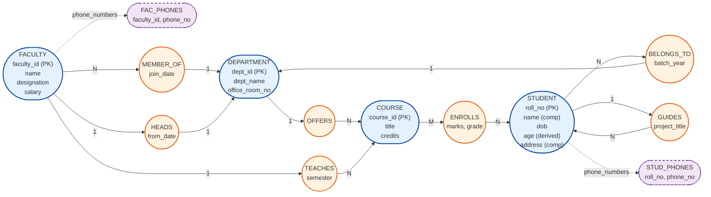
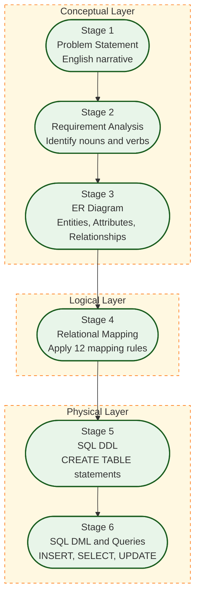
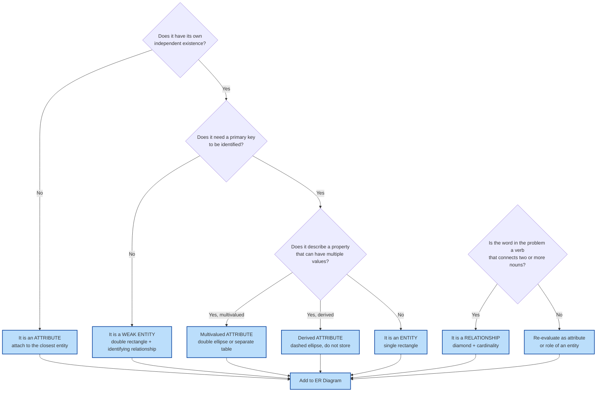
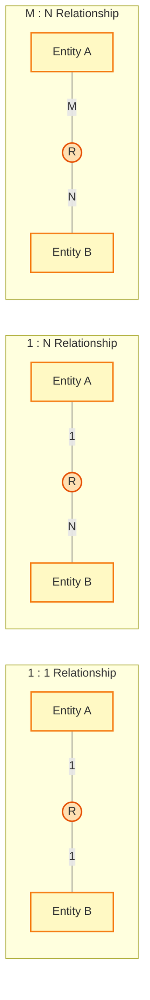
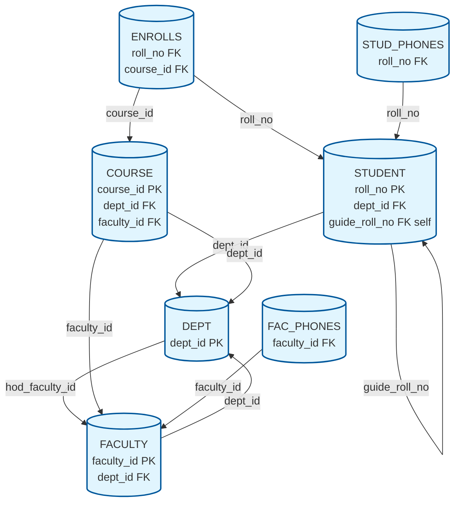
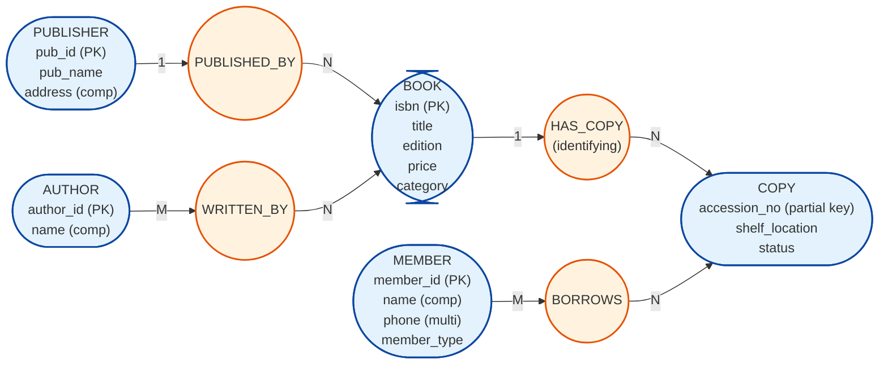

# Design a database schema for an application with ER diagram from a problem description.

<!-- SECTION_1_START -->

# Module 1 — Designing a Database Schema with ER Diagrams

## 1.1 Formal Definition (KTU 2024 Syllabus Terminology)

The **Entity–Relationship (ER) Model** is a high-level, semantic data modeling formalism proposed by **Peter Pin-Shan Chen (1976)** that captures the logical structure of a database in the form of *entities*, *attributes*, and *relationships* independent of any physical storage or implementation details. It serves as the **conceptual blueprint** of a database before it is translated into the logical (relational) and physical schemas.

> [!IMPORTANT]
> **KTU 2024 — PCCSL408 Expected Outcome (CO1):**
> The student must be able to *analyze a problem description, identify entities/attributes/relationships, draw a clean ER diagram using standard notation, and map it to a relational schema using well-defined transformation rules*.

In KTU lab examinations, the ER diagram is expected to be drawn using the **Chen's notation** (rectangles for entities, ellipses for attributes, diamonds for relationships, double-lines for total participation, double-rectangles for weak entities, and double-diamonds for identifying relationships). Students are strongly advised to also know the **Crow's Foot notation** used inside tools like *Oracle Data Modeler* and *MySQL Workbench* because KTU often specifies "use any standard notation".

## 1.2 Intuitive Overview — The Architect's Blueprint Analogy

Imagine you want to build a house.

| Engineering Step | Database Equivalent | Output |
|------------------|----------------------|--------|
| Talk to the owner (requirements) | Analyse the *problem statement* | English bullet list |
| Sketch the floor plan | Build the **ER Diagram** | Conceptual model |
| Convert plan to brick layout | Map ER → **Relational Schema** (tables) | Logical schema |
| Pour concrete & install wiring | Write **SQL DDL** (`CREATE TABLE …`) | Physical schema |

> [!NOTE]
> Just as an architect never starts laying bricks without a blueprint, **a database designer must never write `CREATE TABLE` before producing a correct ER diagram**. The ER diagram hides *who* stores *what* and *how* they are connected, but it deliberately hides *where* the bytes sit on disk — that is the job of the physical designer later.

## 1.3 The Three Pillars of ER Modeling

Every ER diagram in the universe is built from exactly three building blocks:

1. **Entities** — real-world distinguishable objects (a *Student*, a *Course*, a *Department*).
2. **Attributes** — descriptive properties of entities (a student's *Name*, *Roll_No*, *DOB*).
3. **Relationships** — meaningful associations among two or more entities (a student *Enrols* in a course, a course *Belongs To* a department).

> [!TIP]
> **Quick Self-Test before drawing:** For every noun in the problem statement, ask "Is this an *object* or a *property* of an object?"
> - *Object* → Entity.
> - *Property* → Attribute.
> For every verb, ask "Does this verb connect two nouns?" If yes, it is a *Relationship*.

## 1.4 Visualization — Geometric Intuition of an ER Diagram

> [!VISUALIZATION CONTROL]
> **Concept:** Relationship Diamond connecting two Entity Rectangles through their Key-attribute Ellipses.
> **GeoGebra / Desmos Input Equations (to plot key position layout):**
> * Rectangle 1 vertices: $A(-3, 1)$, $B(-1, 1)$, $B(-1, -1)$, $A(-3, -1)$ → represents **STUDENT** entity.
> * Rectangle 2 vertices: $C(1, 1)$, $D(3, 1)$, $D(3, -1)$, $C(1, -1)$ → represents **COURSE** entity.
> * Diamond centre: $E(0, 0)$ with vertices $(0, 0.6)$, $(0.8, 0)$, $(0, -0.6)$, $(-0.8, 0)$ → represents **ENROLLS** relationship.
> **Visual Description:** You should see two rectangles placed left and right of a central diamond, each connected to the diamond by a straight line labelled with a cardinality like *1* and *N*. The left rectangle should have an inner ellipse labelled *roll_no* that is underlined, denoting the **primary key**.

---

<!-- SECTION_1_END -->

<!-- SECTION_2_START -->

# Module 1 — Deep Theoretical Analysis & KTU High-Yield Cheat Sheet

## 2.1 Entity Sets — The "Nouns" of the Problem

An **entity** is any real-world object that exists independently and can be uniquely identified. An **entity set** is the collection of all entities of the same type.

### 2.1.1 Strong vs Weak Entity Sets

| Property | Strong Entity | Weak Entity |
|----------|---------------|-------------|
| Existence | Exists independently in the real world | Depends on a **strong (owner) entity** for its existence |
| Key | Has a **primary key** of its own | **Cannot** have a unique key by itself — needs the owner's key |
| Notation | Single rectangle | Double rectangle |
| Example | `STUDENT` (identified by `roll_no`) | `DEPENDENT` of a `FACULTY` (no unique ID, identified by `(faculty_id, dep_name)`) |
| Relationship used | Normal relationship | **Identifying relationship** (double diamond) |
| KTU exam tip | Always start your design with strong entities | Only introduce weak entities when the problem says *"depends on"*, *"exists because of"*, *"owned by"* |

> [!WARNING]
> A common KTU mistake is converting a weak entity into a separate table with a fabricated auto-increment ID. In strict Chen notation, a weak entity's table must include the **composite foreign key** taken from the owner entity. Adding a surrogate `dep_id` defeats the purpose of the weak-entity construct.

## 2.2 Attributes — The "Properties" of Entities

Attributes are classified along **two axes**:

### 2.2.1 Classification by Structure

1. **Simple (Atomic) attribute** — Cannot be subdivided meaningfully.
   Example: `roll_no`, `salary`, `date_of_birth`.
2. **Composite attribute** — Made of smaller meaningful sub-parts.
   Example: `address = (house_no, street, city, pincode)`.
3. **Multivalued attribute** — Can hold a *set* of values for a single entity.
   Example: `phone_numbers` of a student (mobile, home, parent's mobile).
4. **Derived attribute** — Value can be *computed* from other stored attributes.
   Example: `age` derived from `date_of_birth` and the current date.

### 2.2.2 Classification by Role

1. **Key attribute** — Uniquely identifies an entity instance within the set (underlined in ER diagram).
2. **Non-key / Descriptive attribute** — All remaining attributes.

### 2.2.3 Notation Reference Table

| Attribute Type | Chen Notation | Example |
|----------------|---------------|---------|
| Key | Underlined text inside ellipse | `roll_no` |
| Composite | Ellipse with sub-ellipses branching off | `name { first, middle, last }` |
| Multivalued | **Double** ellipse | `phone_numbers` |
| Derived | **Dashed** ellipse | `age` |

> [!NOTE]
> **KTU Convention (2024):** When you map a multivalued attribute to a relational schema, you **must** create a *separate table* consisting of (owner_key, multivalued_value). A common 2-mark question is: *"Convert a multivalued attribute to a relation — show the schema."*

## 2.3 Relationship Sets — The "Verbs" of the Problem

A **relationship** is an association among several entities. The **relationship set** is the collection of all such associations at a given point in time.

### 2.3.1 Degree of a Relationship

$$\text{Degree} = \text{Number of participating entity types}$$

| Degree | Name | Example |
|--------|------|---------|
| 1 | **Unary** (Recursive) | `FACULTY` *mentors* `FACULTY` |
| 2 | **Binary** (most common) | `STUDENT` *enrols in* `COURSE` |
| 3 | **Ternary** | `STUDENT` *is guided by* `FACULTY` *for* `PROJECT` |
| n | **n-ary** | Rare in KTU exams |

### 2.3.2 Cardinality Ratio (Mapping Cardinality)

For a binary relationship $R$ between $E_1$ and $E_2$, the cardinality is one of:

$$E_1 \;\text{---}\; R \;\text{---}\; E_2 \quad \in \quad \{1:1,\; 1:N,\; N:1,\; M:N\}$$

| Cardinality | Real-world meaning | Example |
|-------------|--------------------|---------|
| **1 : 1** | One instance of $E_1$ is linked to *at most one* instance of $E_2$ | Each `DEPARTMENT` has *one* `HOD_FACULTY`; each faculty is HOD of *one* department. |
| **1 : N** | One instance of $E_1$ links to *many* $E_2$'s, but each $E_2$ links to *one* $E_1$ | One `DEPARTMENT` *offers* many `COURSE`s; each course is offered by *one* department. |
| **M : N** | Many-to-many | `STUDENT` *enrols in* `COURSE` — a student can take many courses, a course has many students. |

### 2.3.3 Participation Constraint

| Constraint | Symbol | Meaning |
|------------|--------|---------|
| **Total Participation** | Double line from entity to diamond | Every entity instance **must** participate in at least one relationship instance. |
| **Partial Participation** | Single line | An entity instance *may* or *may not* participate. |

> [!EXAMPLE]
> In *"Every student must enrol in at least one course"*, the participation of `STUDENT` in `ENROLLS` is **total** (double line). In *"A course may have zero or more students"*, the participation of `COURSE` is **partial**.

## 2.4 Keys in the ER Model

- **Super Key** — Any set of attributes that uniquely identifies an entity.
- **Candidate Key** — Minimal super key (no proper subset is a super key).
- **Primary Key** — The candidate key chosen by the designer to be the unique identifier (underlined in ER).
- **Partial Key (Discriminator)** — Uniquely identifies a weak entity *only* within the set owned by the same strong entity (shown with a **dashed underline**).

## 2.5 KTU Formula Sheet / Cheat Sheet

| # | Concept | Symbol / Notation | Mapping Rule to Relations |
|---|---------|-------------------|---------------------------|
| 1 | Strong Entity | Single rectangle | $\text{R(Entity)}(\text{key\_attrs},\; \text{simple\_attrs})$ |
| 2 | Weak Entity | Double rectangle | $\text{R(Weak)}(\text{owner\_key} \cup \text{partial\_key},\; \text{simple\_attrs})$ |
| 3 | 1:1 Relationship | Single diamond | Merge with either side's table using FK on the **total participation** side |
| 4 | 1:N Relationship | Single diamond | Add the **1-side** key as a foreign key inside the **N-side** table |
| 5 | M:N Relationship | Single diamond | **New table** $\text{R(Link)}(E_1\text{\_key},\; E_2\text{\_key},\; \text{rel\_attrs})$ |
| 6 | Multivalued Attribute | Double ellipse | **New table** $\text{R(MVA)}(\text{owner\_key},\; \text{attribute})$ |
| 7 | Derived Attribute | Dashed ellipse | **Do not store** — compute via SQL view or query |
| 8 | Composite Attribute | Ellipse tree | Store only the **leaf** components as columns |
| 9 | n-ary Relationship | Diamond with $n$ edges | **New table** with FKs to all $n$ participating entities + rel attrs |
| 10 | Total Participation | Double line | Cannot be `NULL` (enforce via `NOT NULL` FK constraint) |

## 2.6 Engineering Utility — Where ER Modeling is Used in Production

| Real-World System | Why ER Modeling is the First Step |
|-------------------|----------------------------------|
| **Hospital Information Systems** (AIIMS, Apollo) | Capture the complex `PATIENT`–`DOCTOR`–`WARD`–`TEST` inter-relations before any regulatory HIPAA-compliant schema is built. |
| **Banking Core Systems** (Finacle, FIS) | The 1:N relationship between `BRANCH` and `ACCOUNT_HOLDER` and the M:N relationship between `ACCOUNT` and `CUSTOMER` (joint accounts) are first pinned down on paper. |
| **E-Commerce Catalogs** (Amazon, Flipkart) | `PRODUCT`–`CATEGORY`–`SELLER`–`REVIEW` graphs that drive search and recommendation engines are derived from an initial ER model. |
| **University ERP** (KTU's own KTU-ERP, SAP for universities) | The `STUDENT`–`COURSE`–`FACULTY`–`DEPARTMENT` schema is a textbook case used by every ERP vendor. |
| **Airline Reservation** (Amadeus, Sabre) | `PASSENGER`–`FLIGHT`–`SEAT`–`TICKET` with multi-leg journeys are ER-modelled first to enforce referential integrity. |

> [!IMPORTANT]
> The ER model is also the foundation of **UML Class Diagrams** in software engineering. A student who masters ER modeling can transition seamlessly to object-oriented design because UML class diagrams are essentially a *superset* of ER diagrams (with methods, visibility, etc.).

---

<!-- SECTION_2_END -->

<!-- SECTION_3_START -->

# Module 1 — Step-by-Step Design, Mapping & SQL Implementation

## 3.1 Running Case Study: **University Academic Management System (UAMS)**

> **Problem Statement (KTU-typical):**
> *"Design a database for a University. The university has many departments. Each department offers several courses. A course is taught by exactly one faculty member, but a faculty member can teach multiple courses. Students enrol in one or more courses. A student belongs to exactly one department. Each course has an examination that produces marks for every enrolled student. The university also wants to store the phone numbers (multiple) of every student and faculty. Some students are project guides; they guide other students. A faculty member acts as the Head of Department (HOD) for exactly one department."*

We will build the **complete ER diagram, the relational mapping, and the SQL DDL** for this problem from scratch.

## 3.2 Step 1 — Identify Nouns (Candidate Entities)

| Noun in problem | Decision | Reason |
|-----------------|----------|--------|
| University | ❌ Discard as entity | Will become the *database itself* |
| Department | ✅ Entity | Has its own identity (dept_id) |
| Course | ✅ Entity | Identified by course_id |
| Faculty | ✅ Entity | Identified by faculty_id |
| Student | ✅ Entity | Identified by roll_no |
| Examination / Marks | ❌ Not entity | Marks is a *attribute of relationship* ENROLLS |
| Project guide (verb usage) | ✅ Relationship | Maps to a recursive relationship on STUDENT |
| HOD | ❌ Not entity | It is a *role* of a faculty in the DEPT_OFFERS relationship |
| Phone numbers | ❌ Not entity | *Multivalued attribute* of STUDENT & FACULTY |

## 3.3 Step 2 — Identify Attributes for Each Entity

### 3.3.1 DEPT (Department)
- `dept_id` — **Key** (e.g., `CS`, `EC`, `ME`).
- `dept_name` — Simple.
- `office_room_no` — Simple.
- `hod_id` — Will be migrated here later as a **FK** to FACULTY when we model the 1:1 HOD relationship.

### 3.3.2 STUDENT
- `roll_no` — **Key** (e.g., `TVE21CS001`).
- `name` — Composite: `{first_name, middle_name, last_name}`.
- `dob` — Simple (date).
- `age` — **Derived** from `dob`.
- `address` — Composite: `{house_no, street, city, pincode}`.
- `phone_numbers` — **Multivalued** (mobile, parent mobile, landline).
- `dept_id` — FK to DEPT (1:N DEPT–STUDENT).

### 3.3.3 COURSE
- `course_id` — **Key** (e.g., `CS301`).
- `title` — Simple.
- `credits` — Simple (integer 1–6).
- `dept_id` — FK to DEPT.
- `faculty_id` — FK to FACULTY (1:N FACULTY–COURSE).

### 3.3.4 FACULTY
- `faculty_id` — **Key**.
- `name` — Composite.
- `designation` — Simple (Professor / Associate / Assistant).
- `salary` — Simple.
- `phone_numbers` — **Multivalued**.
- `dept_id` — FK to DEPT (faculty belongs to a department).

## 3.4 Step 3 — Identify Verbs (Relationships)

| Verb in problem | Relationship | Entities involved | Cardinality | Attributes on R |
|-----------------|--------------|-------------------|-------------|-----------------|
| *"department offers course"* | OFFERS | DEPT, COURSE | 1 : N | — |
| *"student enrols in course"* | ENROLLS | STUDENT, COURSE | M : N | `marks`, `grade`, `semester` |
| *"student belongs to department"* | BELONGS_TO | STUDENT, DEPT | N : 1 | `batch_year` |
| *"faculty teaches course"* | TEACHES | FACULTY, COURSE | 1 : N | `semester`, `academic_year` |
| *"faculty belongs to department"* | MEMBER_OF | FACULTY, DEPT | N : 1 | `join_date` |
| *"faculty is HOD of department"* | HEADS | FACULTY, DEPT | 1 : 1 | `from_date` |
| *"student guides student"* | GUIDES | STUDENT, STUDENT | 1 : N (recursive) | `project_title`, `start_date` |

## 3.5 Step 4 — Draw the ER Diagram

Below is the complete Chen-notation ER diagram rendered as a Mermaid `flowchart` (Mermaid cannot natively draw ellipses, so we use rounded rectangles for attributes and a hexagon for the relationship diamond):



## 3.6 Step 5 — Map ER → Relational Schema (12-Step Algorithm)

The standard textbook algorithm is reproduced and **applied line-by-line** to our case study below. There is **no truncation** — every mapping decision is justified.

### Rule 1 — Strong Entity Sets become Tables

For every strong entity $E$ with simple key attributes $K = \{k_1, \dots, k_m\}$ and non-key attributes $A = \{a_1, \dots, a_p\}$:

$$\text{STUDENT}(\underline{\text{roll\_no}},\; \text{first\_name},\; \text{middle\_name},\; \text{last\_name},\; \text{dob},\; \text{house\_no},\; \text{street},\; \text{city},\; \text{pincode},\; \text{dept\_id})$$

> Composite `name` and `address` have been broken into their **leaf components**; `age` (derived) is **omitted**; the FK `dept_id` from `BELONGS_TO` is already added per Rule 6.

### Rule 2 — Weak Entity Sets become Tables with Composite Key

We do not have weak entities in this case study, but the general rule is:

$$\text{WEAK}(\underline{\text{owner\_key}, \text{partial\_key}},\; \text{simple\_attrs})$$

### Rule 3 — Multivalued Attribute becomes a Separate Table

`phone_numbers` of STUDENT:

$$\text{STUD\_PHONES}(\underline{\text{roll\_no},\; \text{phone\_no}})$$

Similarly for FACULTY:

$$\text{FAC\_PHONES}(\underline{\text{faculty\_id},\; \text{phone\_no}})$$

### Rule 4 — 1 : 1 Relationship

`HEADS` is a 1:1 relationship between FACULTY and DEPT. Because every **DEPARTMENT must have an HOD** (total participation on the DEPT side), we merge the FK into the DEPT table:

$$\text{DEPT}(\underline{\text{dept\_id}},\; \text{dept\_name},\; \text{office\_room\_no},\; \text{hod\_faculty\_id},\; \text{heads\_from\_date})$$

We add `UNIQUE(hod_faculty_id)` to enforce the 1:1 cardinality.

### Rule 5 — 1 : N Relationship → Add FK to the N-side

- `OFFERS` (1 DEPT — N COURSE): add `dept_id` to COURSE.
- `TEACHES` (1 FACULTY — N COURSE): add `faculty_id` to COURSE.
- `BELONGS_TO` (N STUDENT — 1 DEPT): add `dept_id` to STUDENT.
- `MEMBER_OF` (N FACULTY — 1 DEPT): add `dept_id` to FACULTY.

### Rule 6 — M : N Relationship → New Link Table

`ENROLLS` (M STUDENT — N COURSE):

$$\text{ENROLLS}(\underline{\text{roll\_no},\; \text{course\_id},\; \text{semester}},\; \text{marks},\; \text{grade})$$

The composite PK is `(roll_no, course_id, semester)` because a student can re-take a course in a different semester.

### Rule 7 — Multivalued Derived / Composite (already covered)

### Rule 8 — n-ary Relationship (n ≥ 3) → New Table

No ternary relationships in this example, but the rule is:

$$\text{NARY}(\underline{\text{key}(E_1),\; \text{key}(E_2),\; \dots,\; \text{key}(E_n)},\; \text{rel\_attrs})$$

### Rule 9 — Recursive Relationship → FK in the Same Table

`GUIDES` is a 1:N recursive relationship on STUDENT. We add a self-referencing FK:

$$\text{STUDENT}(\underline{\text{roll\_no}},\; \dots,\; \text{guide\_roll\_no})$$

where `guide_roll_no` references `STUDENT(roll_no)`. The role label "guide" is captured by the FK column name.

### Rule 10–12 — Referential Integrity, NOT NULL, CHECK

Add `NOT NULL` on FKs that have total participation, and `CHECK` constraints for domain values (e.g., `credits BETWEEN 1 AND 6`).

## 3.7 Final Consolidated Relational Schema

$$\begin{aligned}
\text{DEPT}(\underline{\text{dept\_id}},\; \text{dept\_name},\; \text{office\_room\_no},\; \text{hod\_faculty\_id},\; \text{heads\_from\_date}) \\[2pt]
\text{STUDENT}(\underline{\text{roll\_no}},\; \text{first\_name},\; \text{middle\_name},\; \text{last\_name},\; \text{dob},\; \text{house\_no},\; \text{street},\; \text{city},\; \text{pincode},\; \text{dept\_id},\; \text{guide\_roll\_no}) \\[2pt]
\text{COURSE}(\underline{\text{course\_id}},\; \text{title},\; \text{credits},\; \text{dept\_id},\; \text{faculty\_id}) \\[2pt]
\text{FACULTY}(\underline{\text{faculty\_id}},\; \text{first\_name},\; \text{middle\_name},\; \text{last\_name},\; \text{designation},\; \text{salary},\; \text{dept\_id}) \\[2pt]
\text{ENROLLS}(\underline{\text{roll\_no},\; \text{course\_id},\; \text{semester}},\; \text{marks},\; \text{grade}) \\[2pt]
\text{STUD\_PHONES}(\underline{\text{roll\_no},\; \text{phone\_no}}) \\[2pt]
\text{FAC\_PHONES}(\underline{\text{faculty\_id},\; \text{phone\_no}})
\end{aligned}$$

## 3.8 Step 6 — SQL DDL Implementation (MySQL 8.x)

```sql
-- =========================================================
-- UAMS  ::  University Academic Management System
-- KTU 2024 :: PCCSL408  ::  Module 1
-- =========================================================
-- Database Creation
DROP DATABASE IF EXISTS uams;
CREATE DATABASE uams;
USE uams;

-- ---------------------------------------------------------
-- 1. DEPARTMENT  (strong entity, also receives FK for 1:1 HEADS)
-- ---------------------------------------------------------
CREATE TABLE dept (
    dept_id            CHAR(4)        NOT NULL,
    dept_name          VARCHAR(60)    NOT NULL,
    office_room_no     VARCHAR(10)    NOT NULL,
    hod_faculty_id     CHAR(6)        NULL,
    heads_from_date    DATE           NULL,
    CONSTRAINT pk_dept PRIMARY KEY (dept_id),
    CONSTRAINT uq_dept_hod UNIQUE (hod_faculty_id)          -- 1:1 enforcement
);

-- ---------------------------------------------------------
-- 2. FACULTY  (created before STUDENT/COURSE because of FKs)
-- ---------------------------------------------------------
CREATE TABLE faculty (
    faculty_id         CHAR(6)        NOT NULL,
    first_name         VARCHAR(30)    NOT NULL,
    middle_name        VARCHAR(30)    NULL,
    last_name          VARCHAR(30)    NOT NULL,
    designation        ENUM('Professor','Associate Professor','Assistant Professor') NOT NULL,
    salary             DECIMAL(10,2)  NOT NULL CHECK (salary >= 0),
    dept_id            CHAR(4)        NOT NULL,
    CONSTRAINT pk_faculty PRIMARY KEY (faculty_id),
    CONSTRAINT fk_fac_dept FOREIGN KEY (dept_id)
        REFERENCES dept(dept_id) ON DELETE RESTRICT ON UPDATE CASCADE
);

-- Add the deferred FK from DEPT.hod_faculty_id  ->  FACULTY.faculty_id
ALTER TABLE dept
    ADD CONSTRAINT fk_dept_hod FOREIGN KEY (hod_faculty_id)
        REFERENCES faculty(faculty_id) ON DELETE SET NULL ON UPDATE CASCADE;

-- ---------------------------------------------------------
-- 3. STUDENT  (self-referencing FK for recursive GUIDES)
-- ---------------------------------------------------------
CREATE TABLE student (
    roll_no            CHAR(10)       NOT NULL,
    first_name         VARCHAR(30)    NOT NULL,
    middle_name        VARCHAR(30)    NULL,
    last_name          VARCHAR(30)    NOT NULL,
    dob                DATE           NOT NULL,
    house_no           VARCHAR(10)    NOT NULL,
    street             VARCHAR(60)    NOT NULL,
    city               VARCHAR(30)    NOT NULL,
    pincode            CHAR(6)        NOT NULL CHECK (pincode REGEXP '^[0-9]{6}$'),
    dept_id            CHAR(4)        NOT NULL,
    guide_roll_no      CHAR(10)       NULL,
    CONSTRAINT pk_student PRIMARY KEY (roll_no),
    CONSTRAINT fk_stud_dept FOREIGN KEY (dept_id)
        REFERENCES dept(dept_id) ON DELETE RESTRICT ON UPDATE CASCADE,
    CONSTRAINT fk_stud_guide FOREIGN KEY (guide_roll_no)
        REFERENCES student(roll_no) ON DELETE SET NULL ON UPDATE CASCADE
);

-- ---------------------------------------------------------
-- 4. COURSE  (1:N DEPT-OFFERS, 1:N FACULTY-TEACHES)
-- ---------------------------------------------------------
CREATE TABLE course (
    course_id          VARCHAR(8)     NOT NULL,
    title              VARCHAR(80)    NOT NULL,
    credits            INT            NOT NULL CHECK (credits BETWEEN 1 AND 6),
    dept_id            CHAR(4)        NOT NULL,
    faculty_id         CHAR(6)        NOT NULL,
    CONSTRAINT pk_course PRIMARY KEY (course_id),
    CONSTRAINT fk_crs_dept FOREIGN KEY (dept_id)
        REFERENCES dept(dept_id) ON DELETE CASCADE ON UPDATE CASCADE,
    CONSTRAINT fk_crs_fac FOREIGN KEY (faculty_id)
        REFERENCES faculty(faculty_id) ON DELETE RESTRICT ON UPDATE CASCADE
);

-- ---------------------------------------------------------
-- 5. ENROLLS  (M:N STUDENT-COURSE link with descriptive attrs)
-- ---------------------------------------------------------
CREATE TABLE enrols (
    roll_no            CHAR(10)       NOT NULL,
    course_id          VARCHAR(8)     NOT NULL,
    semester           INT            NOT NULL CHECK (semester BETWEEN 1 AND 10),
    marks              DECIMAL(5,2)   NULL CHECK (marks BETWEEN 0 AND 100),
    grade              CHAR(2)        NULL,
    CONSTRAINT pk_enrols PRIMARY KEY (roll_no, course_id, semester),
    CONSTRAINT fk_enr_stud FOREIGN KEY (roll_no)
        REFERENCES student(roll_no) ON DELETE CASCADE ON UPDATE CASCADE,
    CONSTRAINT fk_enr_crs FOREIGN KEY (course_id)
        REFERENCES course(course_id) ON DELETE CASCADE ON UPDATE CASCADE
);

-- ---------------------------------------------------------
-- 6. STUDENT PHONES  (multivalued attribute table)
-- ---------------------------------------------------------
CREATE TABLE stud_phones (
    roll_no            CHAR(10)       NOT NULL,
    phone_no           VARCHAR(15)    NOT NULL,
    CONSTRAINT pk_studphones PRIMARY KEY (roll_no, phone_no),
    CONSTRAINT fk_sp_stud FOREIGN KEY (roll_no)
        REFERENCES student(roll_no) ON DELETE CASCADE ON UPDATE CASCADE
);

-- ---------------------------------------------------------
-- 7. FACULTY PHONES  (multivalued attribute table)
-- ---------------------------------------------------------
CREATE TABLE fac_phones (
    faculty_id         CHAR(6)        NOT NULL,
    phone_no           VARCHAR(15)    NOT NULL,
    CONSTRAINT pk_facphones PRIMARY KEY (faculty_id, phone_no),
    CONSTRAINT fk_fp_fac FOREIGN KEY (faculty_id)
        REFERENCES faculty(faculty_id) ON DELETE CASCADE ON UPDATE CASCADE
);

-- =========================================================
-- SAMPLE DATA  (for viva / record verification)
-- =========================================================
INSERT INTO dept VALUES
 ('CS','Computer Science','A-101', NULL, NULL),
 ('EC','Electronics'      ,'A-102', NULL, NULL);

INSERT INTO faculty VALUES
 ('F00001','Anil','Kumar','Sharma','Professor',120000.00,'CS'),
 ('F00002','Sara','NULL' ,'Mathew','Associate Professor',95000.00,'CS'),
 ('F00003','Ravi','NULL' ,'Menon' ,'Assistant Professor',65000.00,'EC');

UPDATE dept SET hod_faculty_id='F00001', heads_from_date='2023-06-01' WHERE dept_id='CS';
UPDATE dept SET hod_faculty_id='F00003', heads_from_date='2023-06-01' WHERE dept_id='EC';

INSERT INTO student VALUES
 ('TVE22CS01','Aakash','R','Varma' ,'2004-05-12','12-A','MG Road','Kochi','682011','CS', NULL),
 ('TVE22CS02','Diya',  NULL ,'Joseph','2004-08-21','5-B' ,'Park Ave','Kochi','682013','CS','TVE22CS01'),
 ('TVE22EC01','Arjun', NULL ,'Nair'  ,'2004-01-15','7'  ,'Lake Rd','Kochi','682015','EC', NULL);

INSERT INTO course VALUES
 ('CS301','Database Systems',4,'CS','F00001'),
 ('CS302','Operating Systems',4,'CS','F00002'),
 ('EC301','Digital Electronics',3,'EC','F00003');

INSERT INTO enrols VALUES
 ('TVE22CS01','CS301',4, 88.50,'A'),
 ('TVE22CS01','CS302',4, 76.00,'B'),
 ('TVE22CS02','CS301',4, 92.00,'O'),
 ('TVE22EC01','EC301',4, 81.00,'A');

INSERT INTO stud_phones VALUES
 ('TVE22CS01','+91-9876543210'),
 ('TVE22CS01','+91-484-1234567'),
 ('TVE22CS02','+91-9123456789'),
 ('TVE22EC01','+91-9988776655');

INSERT INTO fac_phones VALUES
 ('F00001','+91-9447000001'),
 ('F00002','+91-9447000002'),
 ('F00003','+91-9447000003');
```

## 3.9 Sample Verification Queries (Viva Questions)

| # | Question | SQL Query |
|---|----------|-----------|
| 1 | Find names of all students enrolled in *Database Systems*. | `SELECT s.first_name FROM student s JOIN enrols e ON s.roll_no=e.roll_no JOIN course c ON e.course_id=c.course_id WHERE c.title='Database Systems';` |
| 2 | List HOD name of each department. | `SELECT d.dept_name, f.first_name FROM dept d JOIN faculty f ON d.hod_faculty_id=f.faculty_id;` |
| 3 | Count students in each department. | `SELECT dept_id, COUNT(*) FROM student GROUP BY dept_id;` |
| 4 | Find faculty who teach more than 2 courses. | `SELECT faculty_id FROM course GROUP BY faculty_id HAVING COUNT(*) > 2;` |
| 5 | Compute the *derived* age of every student. | `SELECT roll_no, TIMESTAMPDIFF(YEAR, dob, CURDATE()) AS age FROM student;` |

---

<!-- SECTION_3_END -->

<!-- SECTION_4_START -->

# Module 1 — Structural Diagrams & Schematics

## 4.1 The 6-Stage Database Design Pipeline

The conceptual → logical → physical translation that we just executed can be visualised as a sequential processing pipeline. Every KTU record-book should contain a diagram similar to the one below:



## 4.2 ER-Component Decision Tree

Use the following decision tree whenever a student is unsure whether a noun should be an entity, an attribute, or a relationship:



## 4.3 Cardinality Recognition Cheat-Sheet (Mermaid Topology)



## 4.4 Block-Level Functional Architecture of the Final UAMS Schema

The seven tables and their referential dependencies can be drawn as a **dependency graph** to help the student visualise foreign-key chains:



> [!NOTE]
> Notice the **cycle** between `DEPT.hod_faculty_id` and `FACULTY.dept_id`. This is why in the SQL DDL we *created* `DEPT` first (with a NULL `hod_faculty_id`), then `FACULTY`, and finally used an `ALTER TABLE … ADD CONSTRAINT` to attach the deferred FK back to `DEPT`. KTU practical exams often include this tricky sequencing as a 3-mark viva question.

---

<!-- SECTION_4_END -->

<!-- SECTION_5_START -->

# Module 1 — KTU 2024 Question Bank, Valuation Key & Topic Recap

## 5.1 Part A — Short Answer Questions (3 Marks Each)

### Q1. [KTU University Exam — July 2024] CO1, Remember
*Define the following with one example each: (i) Strong entity, (ii) Weak entity, (iii) Multivalued attribute.*

**Model Answer (target 80–100 words, ~3 min writing time):**

> (i) **Strong Entity:** An entity set that has a primary key of its own and exists independently in the real world. Example: `STUDENT` identified by `roll_no`.
> (ii) **Weak Entity:** An entity set that cannot be uniquely identified by its own attributes alone and depends on a strong (owner) entity for its existence. Example: `ROOM` of a `HOTEL` identified by `(hotel_id, room_number)`. Drawn as a **double rectangle** with an **identifying relationship** (double diamond).
> (iii) **Multivalued Attribute:** An attribute that can take **multiple independent values** for the same entity. Example: `phone_numbers` of a `STUDENT`. Drawn as a **double ellipse** and mapped to a **separate table** containing the owner key and the attribute value.

**[Valuation Key: 1 Mark per sub-definition + example = 3 Marks]**

### Q2. [KTU University Exam — Dec 2023] CO1, Understand
*Differentiate between **total participation** and **partial participation** in an ER diagram. Give one example for each.*

**Model Answer:**

| Aspect | Total Participation | Partial Participation |
|--------|---------------------|------------------------|
| Symbol | Double line from entity to diamond | Single line |
| Meaning | Every entity instance **must** participate in at least one relationship instance | An entity instance *may or may not* participate |
| Mapping impact | The FK on this side is declared `NOT NULL` | The FK on this side may remain `NULL` |
| Example | Every `STUDENT` must enrol in at least one `COURSE` (so STUDENT in ENROLLS is total) | A `FACULTY` may or may not currently be HOD of a `DEPARTMENT` (so FACULTY in HEADS is partial) |

**[Valuation Key: 1.5 Marks explanation + 1.5 Marks example pair = 3 Marks]**

---

## 5.2 Part B — Long Answer Questions (14 Marks Each, Module-Internal Choice)

> **KTU Pattern:** Two sub-parts (a) and (b), each carrying 7 marks. Cognitive levels escalate from *Understand* in (a) to *Apply / Analyse* in (b).

### Question A — University Library Management System (KTU Pattern Dec 2022)

> **Problem Statement:**
> *"A University Library has many books. Each book has a unique ISBN, title, edition, and price. Books are written by one or more authors. A publisher publishes many books. A book belongs to exactly one publisher. The library maintains many copies of the same book (each copy has a unique accession number). Members (students and faculty) borrow copies. A member can borrow at most 5 copies at a time, and a copy can be borrowed by only one member at a time. Every book copy must be issued at least once in its lifetime."*

#### (a) [7 Marks] Draw the complete ER diagram using **Chen notation**. Identify entities, attributes (with key/composite/multivalued/derived markings), relationships, cardinality, and participation constraints.

**Step 1 — Identify Entities**

| # | Entity | Reason |
|---|--------|--------|
| 1 | `BOOK` | Identified by ISBN |
| 2 | `AUTHOR` | A writer; may have authored multiple books |
| 3 | `PUBLISHER` | Identified by pub_id |
| 4 | `COPY` | A physical copy; identified by accession_no — but **depends on BOOK** for meaning → **weak entity** |
| 5 | `MEMBER` | Common super-class of STUDENT and FACULTY — modelled as a single entity with `member_type` attribute |

**Step 2 — Attributes**

- `BOOK`: `isbn` (key), `title` (simple), `edition` (simple), `price` (simple), `category` (simple).
- `AUTHOR`: `author_id` (key), `name` (composite `{first, last}`).
- `PUBLISHER`: `pub_id` (key), `pub_name`, `address` (composite).
- `COPY`: `accession_no` (**partial key**), `shelf_location`, `status` (Available / Issued).
- `MEMBER`: `member_id` (key), `name` (composite), `phone` (multivalued), `member_type` (Student / Faculty).

**Step 3 — Relationships**

| Verb | Relationship | Cardinality | Participation |
|------|--------------|-------------|---------------|
| Author writes Book | `WRITTEN_BY` | M : N | Total on BOOK, partial on AUTHOR (a book must have ≥1 author) |
| Publisher publishes Book | `PUBLISHED_BY` | 1 : N | Total on BOOK |
| Book has Copy | `HAS_COPY` | 1 : N (identifying) | Total on COPY |
| Member borrows Copy | `BORROWS` | M : N | **Total on COPY** (every copy must be issued at least once) |

**Step 4 — ER Diagram**



**[Valuation Key for (a): Identifying all 5 entities: 2 Marks; Correct attributes with key markings: 2 Marks; Relationships with cardinality & participation: 2 Marks; Clean drawing: 1 Mark = 7 Marks]**

#### (b) [7 Marks] Map the above ER diagram to a **relational schema**. Apply all 12 mapping rules explicitly. State the primary key, foreign keys, and the referential integrity action (`ON DELETE`) for every relationship.

**Step-by-step Application of the Mapping Rules**

**Rule 1 — Strong entities:**

$$\text{PUBLISHER}(\underline{\text{pub\_id}},\; \text{pub\_name},\; \text{house\_no},\; \text{street},\; \text{city},\; \text{pincode})$$

$$\text{BOOK}(\underline{\text{isbn}},\; \text{title},\; \text{edition},\; \text{price},\; \text{category},\; \text{pub\_id})$$

$$\text{AUTHOR}(\underline{\text{author\_id}},\; \text{first\_name},\; \text{last\_name})$$

$$\text{MEMBER}(\underline{\text{member\_id}},\; \text{first\_name},\; \text{middle\_name},\; \text{last\_name},\; \text{member\_type})$$

**[2 Marks for correctly producing the 4 strong-entity tables]**

**Rule 2 — Weak entity COPY (with partial key `accession_no`):**

$$\text{COPY}(\underline{\text{isbn},\; \text{accession\_no}},\; \text{shelf\_location},\; \text{status})$$

The composite PK is `(isbn, accession_no)` because a `accession_no` is unique only within the books of a single ISBN.

**[1 Mark for correct composite PK formation]**

**Rule 3 — Multivalued attribute `phone` of MEMBER:**

$$\text{MEMBER\_PHONE}(\underline{\text{member\_id},\; \text{phone}})$$

**[0.5 Mark]**

**Rule 4 — 1:N `PUBLISHED_BY`:**

FK `pub_id` already added in BOOK above with `ON DELETE RESTRICT`.

**Rule 5 — M:N `WRITTEN_BY`:**

$$\text{BOOK\_AUTHOR}(\underline{\text{isbn},\; \text{author\_id}})$$

**[1 Mark]**

**Rule 6 — Identifying `HAS_COPY` (1:N BOOK → COPY):**

FK `isbn` already added in COPY with `ON DELETE CASCADE` (deleting a book removes its copies).

**Rule 7 — M:N `BORROWS` with descriptive attributes:**

$$\text{BORROWS}(\underline{\text{isbn},\; \text{accession\_no},\; \text{borrow\_date}},\; \text{member\_id},\; \text{due\_date},\; \text{return\_date})$$

Composite PK includes `borrow_date` because the same copy can be borrowed multiple times. `member_id` is FK with `ON DELETE RESTRICT` (cannot delete a member who has borrowed).

**[1.5 Marks for BORROWS schema with proper PK and FK]**

**Final Consolidated Relational Schema:**

$$\begin{aligned}
&\text{PUBLISHER}(\underline{\text{pub\_id}},\; \text{pub\_name},\; \text{house\_no},\; \text{street},\; \text{city},\; \text{pincode})\\
&\text{BOOK}(\underline{\text{isbn}},\; \text{title},\; \text{edition},\; \text{price},\; \text{category},\; \text{pub\_id})\\
&\text{AUTHOR}(\underline{\text{author\_id}},\; \text{first\_name},\; \text{last\_name})\\
&\text{MEMBER}(\underline{\text{member\_id}},\; \text{first\_name},\; \text{middle\_name},\; \text{last\_name},\; \text{member\_type})\\
&\text{COPY}(\underline{\text{isbn},\; \text{accession\_no}},\; \text{shelf\_location},\; \text{status})\\
&\text{MEMBER\_PHONE}(\underline{\text{member\_id},\; \text{phone}})\\
&\text{BOOK\_AUTHOR}(\underline{\text{isbn},\; \text{author\_id}})\\
&\text{BORROWS}(\underline{\text{isbn},\; \text{accession\_no},\; \text{borrow\_date}},\; \text{member\_id},\; \text{due\_date},\; \text{return\_date})
\end{aligned}$$

**[1 Mark for correct overall consolidation, referential actions and notations]**

---

### Question B — Hospital Patient Management System (Alternate Choice)

> **Problem Statement:**
> *"A hospital has many wards. Each ward has many beds. A patient is admitted to a specific bed in a specific ward for a date range. A patient is treated by one or more doctors. A doctor belongs to a department. The hospital also stores the test reports of a patient; each report is for a specific test (e.g., blood test, X-ray). A patient may have multiple phone numbers."*

#### (a) [7 Marks] Draw the ER diagram. Clearly show:
1. All entities and their key attributes.
2. A **weak entity** with its identifying relationship.
3. An **M:N relationship** with descriptive attributes.
4. A **recursive relationship** (a doctor supervised by another doctor).

**Solution Outline:**

| # | Entity / Relationship | Type | Justification |
|---|----------------------|------|---------------|
| 1 | `WARD` | Strong | Key: `ward_id` |
| 2 | `BED` | Weak | Identified by `(ward_id, bed_no)`; depends on WARD |
| 3 | `PATIENT` | Strong | Key: `patient_id`; has multivalued `phone` |
| 4 | `DOCTOR` | Strong | Key: `doctor_id` |
| 5 | `DEPARTMENT` | Strong | Key: `dept_id` |
| 6 | `TEST_REPORT` | Weak | Identified by `(patient_id, report_no)`; depends on PATIENT |
| 7 | `ADMITTED_TO` (WARD ↔ PATIENT via BED) | Ternary | Each admission records `admit_date`, `discharge_date` |
| 8 | `TREATED_BY` (PATIENT ↔ DOCTOR) | M:N | Has `treatment_date`, `diagnosis` |
| 9 | `BELONGS_TO` (DOCTOR ↔ DEPARTMENT) | N:1 | Simple FK |
| 10 | `SUPERVISES` (DOCTOR ↔ DOCTOR) | Recursive 1:N | Senior doctor supervises juniors |
| 11 | `FOR_TEST` (REPORT ↔ TEST) | M:N | A report may contain multiple tests |

**Marking scheme (a):** 5 entities correctly identified with PKs: 2 Marks; weak entity + identifying relationship: 1.5 Marks; M:N with descriptive attributes: 1.5 Marks; recursive relationship: 1 Mark; clean drawing: 1 Mark = **7 Marks**.

#### (b) [7 Marks] Convert the ER diagram into a relational schema. Write the **SQL DDL** for *all* tables with proper PRIMARY KEY, FOREIGN KEY, NOT NULL, and CHECK constraints as relevant.

**Step-by-step Relational Mapping (complete answer):**

**1. Strong entities:**

```sql
CREATE TABLE ward (
    ward_id   CHAR(4)  NOT NULL,
    name      VARCHAR(40) NOT NULL,
    floor_no  INT      NOT NULL,
    CONSTRAINT pk_ward PRIMARY KEY (ward_id)
);

CREATE TABLE department (
    dept_id   CHAR(4)  NOT NULL,
    dept_name VARCHAR(60) NOT NULL,
    CONSTRAINT pk_dept PRIMARY KEY (dept_id)
);

CREATE TABLE doctor (
    doctor_id   CHAR(6)  NOT NULL,
    name        VARCHAR(60) NOT NULL,
    dept_id     CHAR(4)  NOT NULL,
    supervisor_id CHAR(6) NULL,
    CONSTRAINT pk_doc PRIMARY KEY (doctor_id),
    CONSTRAINT fk_doc_dept FOREIGN KEY (dept_id)
        REFERENCES department(dept_id) ON DELETE RESTRICT,
    CONSTRAINT fk_doc_sup FOREIGN KEY (supervisor_id)
        REFERENCES doctor(doctor_id) ON DELETE SET NULL
);

CREATE TABLE patient (
    patient_id CHAR(8)   NOT NULL,
    name       VARCHAR(60) NOT NULL,
    dob        DATE      NOT NULL,
    gender     ENUM('M','F','O') NOT NULL,
    CONSTRAINT pk_pat PRIMARY KEY (patient_id)
);
```

**[2 Marks]**

**2. Weak entity `BED` (depends on WARD):**

```sql
CREATE TABLE bed (
    ward_id   CHAR(4)  NOT NULL,
    bed_no    INT      NOT NULL,
    status    ENUM('Available','Occupied') NOT NULL DEFAULT 'Available',
    CONSTRAINT pk_bed PRIMARY KEY (ward_id, bed_no),
    CONSTRAINT fk_bed_ward FOREIGN KEY (ward_id)
        REFERENCES ward(ward_id) ON DELETE CASCADE
);
```

**[1 Mark for composite PK + CASCADE]**

**3. Weak entity `TEST_REPORT`:**

```sql
CREATE TABLE test_report (
    patient_id  CHAR(8) NOT NULL,
    report_no   INT     NOT NULL,
    report_date DATE    NOT NULL,
    CONSTRAINT pk_rep PRIMARY KEY (patient_id, report_no),
    CONSTRAINT fk_rep_pat FOREIGN KEY (patient_id)
        REFERENCES patient(patient_id) ON DELETE CASCADE
);
```

**[1 Mark]**

**4. M:N `TREATED_BY` with descriptive attributes:**

```sql
CREATE TABLE treated_by (
    patient_id     CHAR(8) NOT NULL,
    doctor_id      CHAR(6) NOT NULL,
    treatment_date DATE    NOT NULL,
    diagnosis      VARCHAR(200),
    CONSTRAINT pk_treat PRIMARY KEY (patient_id, doctor_id, treatment_date),
    CONSTRAINT fk_treat_pat FOREIGN KEY (patient_id)
        REFERENCES patient(patient_id) ON DELETE CASCADE,
    CONSTRAINT fk_treat_doc FOREIGN KEY (doctor_id)
        REFERENCES doctor(doctor_id) ON DELETE RESTRICT
);
```

**[1 Mark]**

**5. Ternary `ADMITTED_TO`:**

```sql
CREATE TABLE admitted_to (
    patient_id     CHAR(8) NOT NULL,
    ward_id        CHAR(4) NOT NULL,
    bed_no         INT     NOT NULL,
    admit_date     DATE    NOT NULL,
    discharge_date DATE    NULL,
    CONSTRAINT pk_adm PRIMARY KEY (patient_id, admit_date),
    CONSTRAINT fk_adm_pat FOREIGN KEY (patient_id)
        REFERENCES patient(patient_id) ON DELETE CASCADE,
    CONSTRAINT fk_adm_bed FOREIGN KEY (ward_id, bed_no)
        REFERENCES bed(ward_id, bed_no) ON DELETE RESTRICT
);
```

**[1 Mark for ternary composite FK]**

**6. Multivalued `phone` of PATIENT:**

```sql
CREATE TABLE patient_phone (
    patient_id  CHAR(8) NOT NULL,
    phone_no    VARCHAR(15) NOT NULL,
    CONSTRAINT pk_pphone PRIMARY KEY (patient_id, phone_no),
    CONSTRAINT fk_pp_pat FOREIGN KEY (patient_id)
        REFERENCES patient(patient_id) ON DELETE CASCADE
);
```

**[1 Mark]**

> [!WARNING]
> **KTU Examiner's Valuation Pitfalls — Hospital Problem:**
> 1. **Forgetting to declare the FOREIGN KEY on `bed` to include BOTH columns** `(ward_id, bed_no)` in the correct order. Single-column FKs will not enforce the weak-entity semantics. **[-2 Marks]**
> 2. **Returning the FKs of a 1:1 relationship to the wrong side.** If `DEPARTMENT` is total in `HEADED_BY`, the FK must go into DEPARTMENT, not DOCTOR. **[-1 Mark]**
> 3. **Omitting `CHECK` constraints** on `discharge_date >= admit_date`. KTU now awards bonus 0.5 mark for valid business-rule checks. **[-0.5 Mark]**
> 4. **Using `ON DELETE CASCADE` on a fact table** (like `TREATED_BY` or `BORROWS`). A patient/doctor deletion should be `RESTRICT` to preserve medical history. **[-1 Mark]**

---

## 5.3 Topic Recap & Important Things to Remember (Rapid-Revision Checklist)

> [!IMPORTANT]
> Use this checklist as the **last 5 minutes** of your exam revision.

### ✅ Definitions to Memorise Verbatim

- **Entity:** A real-world object distinguishable from all other objects.
- **Entity Set:** A collection of similar entities.
- **Attribute:** A descriptive property of an entity.
- **Relationship:** An association among two or more entities.
- **Strong Entity:** Has its own primary key; exists independently.
- **Weak Entity:** Depends on a strong entity; uses a **partial key**.
- **Multivalued Attribute:** Can have multiple values for one entity.
- **Derived Attribute:** Value is computable; do not store.
- **Composite Attribute:** Made of sub-parts; store only the leaves.
- **Total Participation (Existence Dependency):** Double line; FK is `NOT NULL`.
- **Partial Participation:** Single line; FK may be `NULL`.
- **Cardinality Ratio:** `1:1`, `1:N`, `M:N` (only for binary).
- **Recursive (Unary) Relationship:** Same entity set plays multiple roles.

### ✅ Mapping Rules — One-Line Mnemonics

| # | Rule | Mnemonic |
|---|------|----------|
| 1 | Strong Entity → Table | **"Strong survive"** |
| 2 | Weak Entity → Table with composite PK | **"Weak borrows"** |
| 3 | 1:1 → FK on total side | **"Total side takes the key"** |
| 4 | 1:N → FK on N side | **"Many side carries the key"** |
| 5 | M:N → New link table | **"Many-to-many always becomes two"** |
| 6 | Multivalued → New table | **"MV = Multiplication of tables"** |
| 7 | Derived → Do not store | **"Derived = Do not derive storage"** |
| 8 | Composite → Flatten leaves | **"Composite = break to atoms"** |
| 9 | n-ary → Single link table with n FKs | **"n-ary = one table to bind them"** |
| 10 | Recursive → Self-FK | **"Recursive = self-referencing arrow"** |

### ✅ Cardinality Cheat Triangles

- *One-to-One*: a passport ↔ a person.
- *One-to-Many*: a mother ↔ her children.
- *Many-to-Many*: students ↔ courses.

### ✅ Pitfalls to Avoid in the Exam Hall

1. Drawing rectangles as **circles** (entity and attribute are different).
2. Forgetting to **underline** the primary key inside the ellipse.
3. Using a **single line for total participation** — must be double.
4. Mapping a **weak entity** with a *surrogate* `AUTO_INCREMENT` key — defeats the purpose.
5. Writing `CREATE TABLE` **before** the ER diagram is shown to the examiner (record mark deducted).
6. Conflating `1:1` with `1:N` in `HEADS`/`HOD` relationships — always read the problem statement twice.
7. Adding `ON DELETE CASCADE` to the **wrong** relationship (only weak entities and total-participation weak links should cascade).
8. Missing the **ternary relationship** because you decomposed it prematurely into two binaries — a classic KTU trap.

### ✅ Viva Quick-Fire Questions (with 1-line answers)

| Question | One-line answer |
|----------|-----------------|
| Why is `age` not stored as an attribute? | It is **derived** from `dob`; storing it causes update anomalies. |
| Can a relationship have attributes? | Yes — only **M:N** and **n-ary** relationships commonly do. |
| Can two entities be linked by more than one relationship? | Yes — e.g., `STUDENT`–`COURSE` may have both `ENROLLS` and `COMPLETED`. |
| What is the difference between a primary key and a super key? | A primary key is a **minimal** super key. |
| Why is the ER model called *semantic*? | It captures the **meaning** of data, not its physical storage. |
| Is Crow's Foot notation acceptable? | Yes, in KTU 2024 lab exams; but Chen is preferred for clarity. |

> [!TIP]
> **Last-Minute Golden Rule:** If the problem says *"A **must** be assigned to exactly one B"*, the participation of A is **total** and the cardinality is **N:1** from A to B. Add a `NOT NULL` FK on A referencing B.

---

<!-- SECTION_5_END -->
