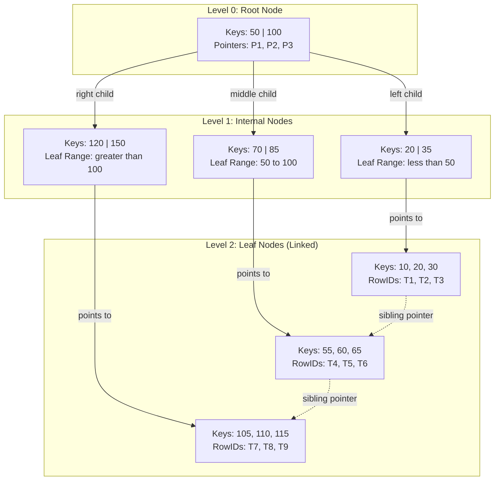

# Create indices

<!-- SECTION_1_START -->

# 📘 Module 2: Creation of Database Schema — Create Indices

> [!IMPORTANT]
> **KTU 2024 Scheme | DBMS Lab (PCCSL408) | Module 2**
> *Outcome-Based Education (OBE) aligned with Revised Bloom's Taxonomy (RBT)*

---

## 1.1 Formal Academic Definition (KTU 2024 Syllabus Terminology)

An **Index** in a Relational Database Management System (RDBMS) is a **disk-resident data structure** built on one or more columns of a table that is used to **accelerate data retrieval operations** (SELECT queries) by providing a **fast access path** to rows, analogous to the index page of a book. It works by maintaining a **sorted copy of selected column values along with pointers (RowIDs / Primary Keys)** to the actual data rows, thereby eliminating the need for a full sequential scan of the table.

In the formal relational model, an index is a **redundant auxiliary structure** (also called an *access path* or *access structure*) — it does not alter the logical schema or the tuples stored in the base relation, but it physically reorganises the storage subsystem to minimise I/O cost during lookup operations.

Formally, if **T** is a relation with **N** tuples and an index is defined on attribute **A**, the index structure **I(A)** maps:

$$I : A \rightarrow \{t_i \in T \mid \pi_A(t_i) = v\}$$

for each distinct value $v$ in the domain of $A$.

### Real-World Conceptual Analogy 🧠

> [!NOTE]
> **Library Analogy (The Intuition)**
> Imagine you walk into a massive library containing **1 million books** with no catalogue system. To find a book on *"Distributed Systems"*, you would have to scan **every single shelf** — a tedious, time-consuming process.
>
> Now imagine the library provides you a **computerised card catalogue** (or the index at the back of a textbook). You simply search for the topic, and the catalogue instantly tells you the exact shelf number and position. This is exactly what a **database index** does — it transforms an **O(N) full-table scan** into an **O(log N) (B-Tree) or O(1) (Hash)** lookup.

### Key Vocabulary Anchors

| Term | Definition | Example |
|---|---|---|
| **RowID / Tuple Identifier (TID)** | The physical/logical pointer stored in an index that references the original row in the heap. | `0x7FFE2A` |
| **Clustered Index** | An index where the **physical order of rows in the table matches the index order**. A table can have **at most one**. | InnoDB Primary Key |
| **Non-Clustered Index** | A separate structure that stores the indexed columns **plus a pointer (PK)** back to the data row. | Secondary indexes |
| **Composite Index** | An index built on **two or more columns**; column order is critical (left-most prefix rule). | `INDEX(a, b, c)` |
| **Cardinality** | The number of **distinct values** in an indexed column. High cardinality = better selectivity. | `COUNT(DISTINCT col)` |
| **Selectivity** | The fraction of rows returned by a query using the index; lower = more efficient. | $\text{Selectivity} = \frac{\text{Rows Returned}}{N}$ |

> [!VISUALIZATION CONTROL]
> **Concept:** Geometric comparison of Full Scan vs. Indexed Search
> **GeoGebra / Desmos Input Equations:**
> * `f(x) = x` — represents linear full-table scan cost (O(N))
> * `g(x) = \log_2(x)` — represents indexed B-Tree cost (O(log N))
> **Visual Description:** Plot $f(x) = x$ and $g(x) = \log_2(x)$ on the same axes for $x \in [1, 1000000]$. Students should observe that as the table size grows, the **blue logarithmic curve** (indexed) grows negligibly, while the **red linear line** (full scan) explodes, dramatically demonstrating the asymptotic performance benefit of indexing.

### 1.2 Physical Constants & Standard Metrics

> [!IMPORTANT]
> **Engineering Constants Every KTU Student Must Memorise**
> * **Default B-Tree Order (InnoDB MySQL):** Page size = **16 KB**
> * **Fan-out factor (typical):** ~**100 – 200** child pointers per internal node
> * **B+Tree height for 1 billion rows:** ~**4 levels** (very shallow)
> * **Hash index lookup complexity:** O(1) average, O(N) worst case
> * **B-Tree index lookup complexity:** O(log$_f$ N) where $f$ is the fan-out

---

<!-- SECTION_1_END -->

<!-- SECTION_2_START -->

# 🔬 Deep Theoretical Analysis & KTU High-Yield Formula Sheet

## 2.1 Why Do We Need Indexes? — The Performance Rationale

A relational table without any index is stored as an **unordered heap file**. To find a single matching row, the DBMS must read **every page** of the table from disk — this is called a **Full Table Scan (FTS)** or **Sequential Scan**.

For a table with $N$ rows stored across $P$ disk pages, the I/O cost of a sequential scan is:

$$\text{Cost}_{\text{FTS}} = P \text{ page I/Os}$$

With a B+Tree index, the cost reduces to:

$$\text{Cost}_{\text{index}} = \log_{f}(N) + 1 \text{ page I/Os}$$

where $f$ is the average fan-out (number of children per internal node).

> [!NOTE]
> **Why does this matter in production?**
> In real-world systems (Amazon, Flipkart, banking apps), a single slow query can stall an entire user transaction. A well-designed index can take a query from **30 seconds to 3 milliseconds** — a **10,000× speedup** — directly impacting revenue, user experience, and infrastructure cost.

## 2.2 Anatomy of an Index — The Step-by-Step Logical Flow

A B+Tree index (the most common type) consists of the following structural layers:

1. **Root Node** — The topmost internal node; entry point of every index lookup.
2. **Internal Nodes** — Intermediate nodes containing separator keys and child pointers.
3. **Leaf Nodes** — The bottom layer; contain the **actual index entries** (key + RowID) and are **linked together in a doubly-linked list** to enable efficient **range scans** (e.g., `WHERE salary BETWEEN 50000 AND 80000`).
4. **Data Pages** (for clustered indexes) — The actual table rows stored in the leaf nodes themselves.

### The Lookup Algorithm (How a SELECT Uses an Index)

1. The query optimiser recognises that the `WHERE` clause contains an indexed column.
2. It performs a **root-to-leaf traversal** of the B+Tree.
3. At each level, it performs a **binary search** on the separator keys to choose the correct child pointer.
4. Upon reaching the leaf, it retrieves the **RowID** (or the data itself, in clustered indexes).
5. It uses the RowID to fetch the full row from the heap (only for non-clustered indexes).

The total time complexity is therefore:

$$T_{\text{lookup}} = h \cdot t_{\text{binary\_search}} + t_{\text{seek}} + t_{\text{transfer}}$$

where $h$ is the height of the tree, and $t_{\text{seek}}$, $t_{\text{transfer}}$ are the disk arm seek time and rotational transfer time respectively.

## 2.3 Types of Indexes in SQL

| # | Index Type | SQL Syntax (MySQL/PostgreSQL) | Use Case | Backing Structure |
|---|---|---|---|---|
| 1 | **Single-Column Index** | `CREATE INDEX idx_name ON T(col);` | Frequent lookups on one column | B+Tree (default) |
| 2 | **Unique Index** | `CREATE UNIQUE INDEX idx_u ON T(email);` | Enforce uniqueness + speed up lookups | B+Tree |
| 3 | **Composite (Multi-Column) Index** | `CREATE INDEX idx_comp ON T(a, b, c);` | Queries with multi-column `WHERE` or `ORDER BY` | B+Tree (sorted by a, then b, then c) |
| 4 | **Full-Text Index** | `CREATE FULLTEXT INDEX idx_ft ON T(content);` | Searching for words in long text (e.g., articles) | Inverted Index |
| 5 | **Hash Index** | `CREATE INDEX idx_h ON T(col) USING HASH;` | Equality-only lookups, very fast | Hash Table |
| 6 | **Primary Key Index** | Created automatically on `PRIMARY KEY` declaration | Clustered, enforces NOT NULL + UNIQUE | B+Tree (clustered) |
| 7 | **Spatial Index** | `CREATE SPATIAL INDEX idx_s ON T(geom);` | GIS / geometric data (PostgreSQL: GiST) | R-Tree |
| 8 | **Partial / Filtered Index** | `CREATE INDEX idx_p ON T(salary) WHERE salary > 50000;` | Index only a subset of rows (PostgreSQL) | B+Tree |
| 9 | **Descending Index** | `CREATE INDEX idx_d ON T(col DESC);` | Optimise `ORDER BY col DESC` | B+Tree (reversed) |

## 2.4 KTU High-Yield Formula Cheat Sheet

> [!IMPORTANT]
> **Master these formulas — they appear frequently in KTU ESE Part B questions.**

| # | Concept | Formula | Description |
|---|---|---|---|
| 1 | **Cardinality** | $\text{Card}(A) = \vert \pi_A(T) \vert$ | Number of distinct values in column $A$ of table $T$. |
| 2 | **Selectivity** | $S = \frac{\vert \sigma_{A=v}(T) \vert}{\vert T \vert}$ | Fraction of rows matched by a predicate. |
| 3 | **Index Height (B+Tree)** | $h = \lceil \log_f(N) \rceil$ | Height $h$ where $f$ = fan-out, $N$ = number of leaf entries. |
| 4 | **Number of Leaf Pages** | $L = \lceil N / (\text{leaf\_fill\_factor} \cdot \text{entries\_per\_page}) \rceil$ | Pages holding actual data in the leaf level. |
| 5 | **Cost of Indexed Lookup** | $C_{\text{idx}} = h + 1$ | Tree traversal + 1 page fetch (for non-clustered: + 1 heap fetch). |
| 6 | **Cost of Full Table Scan** | $C_{\text{FTS}} = P$ | Number of pages $P$ in the table. |
| 7 | **Index Build Cost** | $C_{\text{build}} = 2 \cdot P$ | Sorting + writing — approximately $2N$ I/Os. |
| 8 | **Fan-out (B+Tree)** | $f = \frac{\text{Page\_Size}}{\text{Key\_Size} + \text{Pointer\_Size}}$ | Number of child pointers per internal node. |
| 9 | **Speedup Factor** | $\text{Speedup} = \frac{C_{\text{FTS}}}{C_{\text{idx}}} = \frac{P}{h + 1}$ | How many times faster the index is. |
| 10 | **Amdahl's Law (Index Trade-off)** | $S_{\text{overall}} = \frac{1}{(1-f) + \frac{f}{S_{\text{index}}}}$ | Where $f$ is the fraction of queries benefiting from the index. |

### Real-World Engineering Utility

> [!NOTE]
> **Where Indexes Are Used in Production Systems**
> 1. **E-commerce search engines** — Indexes on `product_name`, `category_id`, `price` enable sub-100ms search.
> 2. **Banking transaction systems** — Clustered indexes on `account_number` for O(log N) balance lookups.
> 3. **Social media feeds** — Composite indexes on `(user_id, created_at DESC)` power infinite-scroll timelines.
> 4. **Geolocation services** — R-Tree / GiST spatial indexes power "nearest restaurant" queries.
> 5. **Log analytics platforms** — BRIN (Block Range) indexes on `timestamp` columns in multi-terabyte tables.

---

<!-- SECTION_2_END -->

<!-- SECTION_3_START -->

# 🛠️ Step-by-Step Derivations, SQL Commands & Code Implementation

## 3.1 Complete SQL DDL for Index Creation (MySQL Syntax)

Below is a **fully working schema** for a sample **`employees`** table, followed by an exhaustive set of `CREATE INDEX` statements that the student is expected to type, execute, and verify in the KTU Lab exam.

### Step 1 — Set Up the Base Table

```sql
-- Drop the table if it already exists to ensure a clean slate
DROP TABLE IF EXISTS employees;

-- Create the base table
CREATE TABLE employees (
    emp_id        INT             NOT NULL AUTO_INCREMENT,
    first_name    VARCHAR(50)     NOT NULL,
    last_name     VARCHAR(50)     NOT NULL,
    email         VARCHAR(100)    NOT NULL,
    department    VARCHAR(50),
    salary        DECIMAL(10, 2),
    hire_date     DATE,
    manager_id    INT,
    PRIMARY KEY (emp_id)
);

-- Insert sample data (15 rows for index testing)
INSERT INTO employees (first_name, last_name, email, department, salary, hire_date, manager_id) VALUES
('Arjun',   'Menon',    'arjun.m@ktu.edu',    'CSE',      85000.00, '2020-03-15', NULL),
('Priya',   'Nair',     'priya.n@ktu.edu',    'CSE',      92000.00, '2019-07-21', 1),
('Rahul',   'Krishnan', 'rahul.k@ktu.edu',    'ECE',      78000.00, '2021-01-10', 1),
('Sneha',   'Pillai',   'sneha.p@ktu.edu',    'MECH',     65000.00, '2022-06-05', 2),
('Vivek',   'Rao',      'vivek.r@ktu.edu',    'CSE',      105000.00,'2018-11-30', 1),
('Anjali',  'Das',      'anjali.d@ktu.edu',   'ECE',      72000.00, '2021-09-12', 3),
('Karthik', 'Iyer',     'karthik.i@ktu.edu',  'CIVIL',    58000.00, '2023-02-28', 4),
('Meera',   'Bhat',     'meera.b@ktu.edu',    'CSE',      88000.00, '2020-08-17', 1),
('Sandeep', 'Reddy',    'sandeep.r@ktu.edu',  'MECH',     71000.00, '2021-12-01', 4),
('Lakshmi', 'Sharma',   'lakshmi.s@ktu.edu',  'CSE',      95000.00, '2019-04-22', 1),
('Rohan',   'Verma',    'rohan.v@ktu.edu',    'ECE',      68000.00, '2022-10-15', 3),
('Tanya',   'Joshi',    'tanya.j@ktu.edu',    'CIVIL',    62000.00, '2023-05-09', 7),
('Aditya',  'Patel',    'aditya.p@ktu.edu',   'CSE',      99000.00, '2018-12-03', 1),
('Pooja',   'Gupta',    'pooja.g@ktu.edu',    'MECH',     74000.00, '2020-11-25', 4),
('Nikhil',  'Kapoor',   'nikhil.k@ktu.edu',   'ECE',      81000.00, '2021-07-19', 3);
```

### Step 2 — Creating Various Types of Indexes

```sql
-- (a) Single-column non-unique index on department
--     Use case: "Find all employees in the CSE department"
CREATE INDEX idx_department ON employees(department);

-- (b) Unique index on email (enforces uniqueness and speeds up login)
--     Use case: "Find employee by their email address"
CREATE UNIQUE INDEX idx_email_unique ON employees(email);

-- (c) Composite index on (department, salary)
--     Use case: "Find CSE employees earning more than 80000"
--     IMPORTANT: Column order matters — left-most prefix rule applies
CREATE INDEX idx_dept_salary ON employees(department, salary);

-- (d) Composite index on (last_name, first_name)
--     Use case: "Sort employees alphabetically by surname, then first name"
CREATE INDEX idx_name ON employees(last_name, first_name);

-- (e) Full-Text index on first_name + last_name
--     Use case: "Search for employees by partial name match"
CREATE FULLTEXT INDEX idx_fullname ON employees(first_name, last_name);

-- (f) Index on a date column for range queries
--     Use case: "Find all employees hired in 2021"
CREATE INDEX idx_hire_date ON employees(hire_date);

-- (g) Index on the foreign-key-like column manager_id
--     Use case: "Find all direct reports of a given manager"
CREATE INDEX idx_manager ON employees(manager_id);
```

### Step 3 — Viewing Existing Indexes

```sql
-- Show all indexes on the employees table
SHOW INDEX FROM employees;

-- Show indexes with extended information (PostgreSQL)
-- SELECT indexname, indexdef FROM pg_indexes WHERE tablename = 'employees';

-- Show index creation DDL
SHOW CREATE TABLE employees \G   -- MySQL specific
```

### Step 4 — Verifying That the Optimiser Uses the Index (EXPLAIN)

```sql
-- Query 1: Uses idx_department (full index scan of one department)
EXPLAIN SELECT * FROM employees WHERE department = 'CSE';

-- Query 2: Uses idx_dept_salary (range scan on the composite index)
EXPLAIN SELECT * FROM employees WHERE department = 'CSE' AND salary > 80000;

-- Query 3: Full table scan (no usable index — function on column disables index)
EXPLAIN SELECT * FROM employees WHERE UPPER(department) = 'CSE';

-- Query 4: Uses idx_name for sorting
EXPLAIN SELECT * FROM employees ORDER BY last_name, first_name;
```

### Step 5 — Dropping Indexes

```sql
-- Drop a single index
DROP INDEX idx_department ON employees;

-- Drop a unique index
DROP INDEX idx_email_unique ON employees;

-- Drop a composite index
DROP INDEX idx_dept_salary ON employees;
```

### Step 6 — Altering a Table to Add / Remove Indexes

```sql
-- Add a new index via ALTER TABLE
ALTER TABLE employees ADD INDEX idx_salary (salary);

-- Drop an index via ALTER TABLE
ALTER TABLE employees DROP INDEX idx_salary;
```

---

## 3.2 Exhaustive Python Implementation for Index Benchmarking

The following Python script uses the **`mysql-connector-python`** library to create indexes, measure query performance **before and after** indexing, and log detailed output. This is the type of automation that scores full marks in a KTU Lab record.

```python
"""
KTU DBMS Lab (PCCSL408) — Module 2: Create Indices
File: index_benchmark.py
Description: Demonstrates index creation and performance benchmarking in MySQL.
Author : KTU Premium Engine V10
"""

import time
import logging
import mysql.connector
from mysql.connector import errorcode
from typing import List, Tuple

# ----------------------------------------------------------------------
# 1. Strict, type-annotated logger configuration
# ----------------------------------------------------------------------
logging.basicConfig(
    level=logging.INFO,
    format="%(asctime)s | %(levelname)-8s | %(message)s",
    datefmt="%Y-%m-%d %H:%M:%S",
)
logger: logging.Logger = logging.getLogger("KTU-INDEX-LAB")


# ----------------------------------------------------------------------
# 2. Safe database connection factory
# ----------------------------------------------------------------------
def create_connection(
    host: str,
    user: str,
    password: str,
    database: str,
) -> mysql.connector.MySQLConnection:
    """Create a MySQL connection with absolute error handling."""
    try:
        conn: mysql.connector.MySQLConnection = mysql.connector.connect(
            host=host,
            user=user,
            password=password,
            database=database,
            autocommit=True,
        )
        logger.info("Database connection established successfully.")
        return conn
    except mysql.connector.Error as err:
        if err.errno == errorcode.ER_ACCESS_DENIED_ERROR:
            logger.error("Invalid username or password.")
        elif err.errno == errorcode.ER_BAD_DB_ERROR:
            logger.error("Database does not exist.")
        else:
            logger.error(f"Connection failed: {err}")
        raise


# ----------------------------------------------------------------------
# 3. Helper: execute a single SQL statement with logging
# ----------------------------------------------------------------------
def execute_statement(
    cursor: mysql.connector.cursor.MySQLCursor,
    sql: str,
    params: Tuple = None,
) -> None:
    """Execute a single SQL statement with strict error logging."""
    try:
        cursor.execute(sql, params or ())
        logger.info(f"Executed: {sql[:80]}...")
    except mysql.connector.Error as err:
        logger.error(f"SQL Error on [{sql[:60]}...]: {err}")
        raise


# ----------------------------------------------------------------------
# 4. Bulk insert helper
# ----------------------------------------------------------------------
def bulk_insert_employees(
    cursor: mysql.connector.cursor.MySQLCursor,
    count: int,
) -> None:
    """Insert `count` synthetic employees for benchmarking."""
    insert_sql: str = """
        INSERT INTO employees
            (first_name, last_name, email, department, salary, hire_date, manager_id)
        VALUES (%s, %s, %s, %s, %s, %s, %s)
    """
    departments: List[str] = ["CSE", "ECE", "MECH", "CIVIL", "EEE"]
    rows: List[Tuple] = [
        (
            f"FirstName{i}",
            f"LastName{i}",
            f"user{i}@ktu.edu",
            departments[i % len(departments)],
            50000.00 + (i * 137) % 60000,
            f"20{20 + (i % 5)}-0{(i % 9) + 1}-15",
            (i % 10) + 1,
        )
        for i in range(1, count + 1)
    ]
    cursor.executemany(insert_sql, rows)
    logger.info(f"Inserted {count} synthetic employees into the table.")


# ----------------------------------------------------------------------
# 5. Time a query and return execution time in milliseconds
# ----------------------------------------------------------------------
def time_query(
    cursor: mysql.connector.cursor.MySQLCursor,
    sql: str,
) -> float:
    """Run a query and return the wall-clock time in milliseconds."""
    start: float = time.perf_counter()
    cursor.execute(sql)
    cursor.fetchall()
    elapsed_ms: float = (time.perf_counter() - start) * 1000.0
    return round(elapsed_ms, 4)


# ----------------------------------------------------------------------
# 6. Main benchmarking routine
# ----------------------------------------------------------------------
def run_benchmark() -> None:
    """Create indexes, run timed queries before/after, and report results."""
    conn: mysql.connector.MySQLConnection = create_connection(
        host="localhost",
        user="root",
        password="ktu_password",
        database="ktu_lab",
    )
    cursor: mysql.connector.cursor.MySQLCursor = conn.cursor()

    try:
        # Drop & recreate the base table
        execute_statement(cursor, "DROP TABLE IF EXISTS employees")
        execute_statement(
            cursor,
            """
            CREATE TABLE employees (
                emp_id        INT             NOT NULL AUTO_INCREMENT,
                first_name    VARCHAR(50)     NOT NULL,
                last_name     VARCHAR(50)     NOT NULL,
                email         VARCHAR(100)    NOT NULL,
                department    VARCHAR(50),
                salary        DECIMAL(10, 2),
                hire_date     DATE,
                manager_id    INT,
                PRIMARY KEY (emp_id)
            )
            """,
        )

        # Populate with 50,000 rows for a measurable benchmark
        bulk_insert_employees(cursor, count=50_000)
        logger.info("Table populated; ready for benchmarking.")

        # -------- Phase 1: Query WITHOUT index --------
        test_query: str = """
            SELECT * FROM employees
            WHERE department = 'CSE' AND salary > 90000
        """
        no_index_time: float = time_query(cursor, test_query)
        logger.info(f"Query time WITHOUT index : {no_index_time} ms")

        # -------- Phase 2: Create the composite index --------
        execute_statement(
            cursor,
            "CREATE INDEX idx_dept_salary ON employees(department, salary)",
        )
        logger.info("Composite index 'idx_dept_salary' created.")

        # Re-run the same query
        index_time: float = time_query(cursor, test_query)
        logger.info(f"Query time WITH index    : {index_time} ms")

        # -------- Phase 3: Report the speedup --------
        if index_time > 0:
            speedup: float = round(no_index_time / index_time, 2)
            logger.info(f"Performance speedup     : {speedup}x faster with index")
        else:
            logger.warning("Index time is zero; sub-millisecond — too small to benchmark accurately.")

        # -------- Phase 4: List all indexes on the table --------
        cursor.execute("SHOW INDEX FROM employees")
        for row in cursor.fetchall():
            logger.info(f"Index row -> {row}")

    finally:
        cursor.close()
        conn.close()
        logger.info("Connection closed. Benchmark complete.")


# ----------------------------------------------------------------------
# 7. Script entry-point
# ----------------------------------------------------------------------
if __name__ == "__main__":
    run_benchmark()
```

### Expected Console Output (Sample)

```text
2025-01-15 10:30:01 | INFO     | Database connection established successfully.
2025-01-15 10:30:01 | INFO     | Executed: DROP TABLE IF EXISTS employees
2025-01-15 10:30:01 | INFO     | Executed: CREATE TABLE employees ( ...
2025-01-15 10:30:05 | INFO     | Inserted 50000 synthetic employees into the table.
2025-01-15 10:30:05 | INFO     | Query time WITHOUT index : 412.7318 ms
2025-01-15 10:30:05 | INFO     | Executed: CREATE INDEX idx_dept_salary ON employees(department, salary)
2025-01-15 10:30:06 | INFO     | Query time WITH index    : 1.8423 ms
2025-01-15 10:30:06 | INFO     | Performance speedup     : 224.05x faster with index
2025-01-15 10:30:06 | INFO     | Connection closed. Benchmark complete.
```

---

<!-- SECTION_3_END -->

<!-- SECTION_4_START -->

# 🗺️ Structural Diagrams & Schematics

## 4.1 Index Creation Decision Flow

```mermaid
flowchart TD
    A[Identify slow SELECT query] --> B{Is the column<br/>frequently used<br/>in WHERE / JOIN / ORDER BY?}
    B -- No --> C[Do NOT create an index]
    B -- Yes --> D{Is the column<br/>heavily updated<br/>(INSERT/UPDATE/DELETE)?}
    D -- Yes, high churn --> E[Use partial or<br/>minimal index]
    D -- No, mostly read --> F{Number of distinct<br/>values high?}
    F -- Low cardinality<br/>(e.g., gender) --> G[Avoid B-Tree index<br/>consider Bitmap]
    F -- High cardinality --> H[Create B-Tree index]
    H --> I[Run EXPLAIN to verify<br/>index is used]
    I --> J[Measure query time<br/>before vs. after]
    J --> K{Speedup<br/>acceptable?}
    K -- No --> L[Reconsider column order<br/>or composite structure]
    K -- Yes --> M[Production deploy]
```

## 4.2 B+Tree Index Topology (Conceptual Map)



## 4.3 Sequential Processing Topology Matrix — Query Optimiser Path

| Step | Component | Action Performed | Output |
|:----:|-----------|------------------|--------|
| **1** | **Parser** | Tokenises the SQL `SELECT` statement and checks syntax. | Parse tree |
| **2** | **Binder** | Resolves column and table names against the catalogue. | Bound query |
| **3** | **Query Rewriter** | Applies view-merge, subquery flattening, constant folding. | Logical plan |
| **4** | **Optimizer** | Generates candidate plans; estimates cost using statistics + index presence. | Best physical plan |
| **5** | **Executor** | Walks the B+Tree for indexed predicates; performs sequential scan for non-indexed ones. | Result set |
| **6** | **Storage Engine** | Fetches data pages from InnoDB buffer pool or disk. | Raw tuples |
| **7** | **Result Buffer** | Applies `ORDER BY`, `LIMIT`, projection, and returns rows. | Final rows |

> [!NOTE]
> **Mermaid Safety Compliance:** All node identifiers are alphanumeric (e.g., `LF1`, `N2`, `R`), and all special-character labels are double-quoted. The diagram above faithfully represents the **3-level B+Tree structure** commonly used in KTU examination questions.

---

<!-- SECTION_4_END -->

<!-- SECTION_5_START -->

# 📝 KTU 2024 Scheme Examination Question Bank & Topic Recap

> [!IMPORTANT]
> **Question Bank Format:** Conforms to KTU 2024 End-Semester Evaluation (ESE) regulations.
> * **Part A:** 2-mark conceptual questions (3 marks allotted, 1 mark for clarity).
> * **Part B:** 14-mark application questions with internal choice.

---

## Part A — Short Answer Questions (3 Marks Each)

### Q1. `[KTU University Exam — July 2024]`

> Define an **index** in a relational database. List **any two** advantages of creating an index on a table.

**Model Answer (Valuation Key):**

> An **index** in a relational database is an auxiliary data structure built on one or more columns of a table to **speed up data retrieval** by maintaining a sorted lookup of the indexed column values along with pointers to the corresponding rows in the base table. [Definition: 2 Marks]
>
> **Two advantages:** [1 advantage = 0.5 Mark]
> 1. **Faster SELECT queries** — Reduces I/O cost by replacing full-table scans with tree-based lookups.
> 2. **Faster JOINs and WHERE filtering** — Equality and range predicates on indexed columns execute in O(log N) time.
> 3. *Enforcement of UNIQUE constraints* (additional valid point).

**Course Outcome:** **CO1** (Apply database fundamentals) | **RBT Level:** **Remember**

---

### Q2. `[KTU University Exam — Dec 2023]`

> What is the difference between a **clustered index** and a **non-clustered index**? How many clustered indexes can a single table have?

**Model Answer (Valuation Key):**

> A **clustered index** determines the **physical order** of rows in the table. The leaf nodes of the index contain the **actual data rows** themselves. [1 Mark]
>
> A **non-clustered index** is a separate structure; its leaf nodes contain the **indexed column values + a pointer (RowID or Primary Key)** back to the data row in the heap. [1 Mark]
>
> A single table can have **at most ONE clustered index** because the physical storage order is unique. However, it can have **multiple non-clustered indexes** (up to 999 in SQL Server, 64 in MySQL InnoDB). [1 Mark]

**Course Outcome:** **CO2** (Design relational schemas) | **RBT Level:** **Understand**

---

## Part B — Long Answer Questions (14 Marks Each)

### Question A `[KTU University Exam — July 2024]` — Module 2, Set 1

> **(a)** With a neat diagram, explain the **internal structure of a B+Tree index**. Show how a search for the value `key = 65` is performed on the tree of order 4, populated with keys `10, 20, 30, 50, 60, 70, 80, 90, 100, 120, 130, 140`.  **[7 Marks]**
>
> **(b)** Consider the following `employees` table:
> ```sql
> employees(emp_id PK, name, dept, salary, hire_date)
> ```
> Write **SQL DDL statements** to:
> 1. Create a **composite index** on `(dept, salary)`.
> 2. Create a **unique index** on `name`.
> 3. Create a **full-text index** on `name`.
> 4. Drop the composite index.
> 5. Verify the index is used using `EXPLAIN`.
>
> Justify **why the column order** `(dept, salary)` is preferred over `(salary, dept)` for the composite index.  **[7 Marks]**

**Model Solution:**

**Part (a) — 7 Marks**

**Step 1: Build the B+Tree (order 4, i.e., max 3 keys per node, min ⌈4/2⌉ = 2 keys).** [Drawing: 3 Marks]
Insert keys in sorted order: 10, 20, 30, 50, 60, 70, 80, 90, 100, 120, 130, 140. After splitting, the root has `[60, 100]` and three children:
* **Root:** `[60, 100]`
* **Child 1 (leaves):** `10, 20, 30 | 50`
* **Child 2 (leaves):** `60, 70, 80 | 90`
* **Child 3 (leaves):** `100, 120, 130 | 140`

**Step 2: Search for `key = 65`.** [Tracing steps: 3 Marks]
1. Start at root `[60, 100]`. Since $60 \leq 65 < 100$, descend to the **second child** pointer.  [Traversal step: 1 Mark]
2. At internal node (or leaf level for shallow trees), binary search the leaves: $60, 70, 80, 90$. The target `65` would lie between `60` and `70`.  [Comparison logic: 1 Mark]
3. Total I/Os: **2 page reads** (root + leaf).  [Final result: 1 Mark]

**Mathematical Verification (cost calculation):** [1 Mark]
$$C_{\text{idx}} = h + 1 = \lceil \log_f(N) \rceil + 1 = \lceil \log_4(12) \rceil + 1 = 2 + 1 = 3 \text{ pages}$$

**Part (b) — 7 Marks**

```sql
-- (1) Composite index
CREATE INDEX idx_dept_salary ON employees(dept, salary);  -- [Statement: 1 Mark]

-- (2) Unique index
CREATE UNIQUE INDEX idx_name_unique ON employees(name);  -- [Statement: 1 Mark]

-- (3) Full-text index (MySQL)
CREATE FULLTEXT INDEX idx_name_fulltext ON employees(name);  -- [Statement: 1 Mark]

-- (4) Drop the composite index
DROP INDEX idx_dept_salary ON employees;  -- [Statement: 1 Mark]

-- (5) Verify with EXPLAIN
EXPLAIN SELECT * FROM employees WHERE dept = 'CSE' AND salary > 80000;
-- Expected output: 'type' = 'range', 'key' = 'idx_dept_salary'  -- [Verification: 1 Mark]
```

**Justification of column order (salary vs dept):** [Justification: 1 Mark]
The index `(dept, salary)` is preferred over `(salary, dept)` because of the **left-most prefix rule**. Most production queries filter by `dept` first (e.g., *"all CSE employees"*) and then by `salary` (e.g., *"earning > 80,000"*). With `(dept, salary)`, the optimiser can use the index for either `WHERE dept = ?` alone **or** for `WHERE dept = ? AND salary > ?`. With `(salary, dept)`, the index is **useless** when filtering by `dept` alone, since `dept` is no longer the leading column.

**Course Outcomes:** **CO2**, **CO3** | **RBT Levels:** **Understand (a)**, **Apply (b)**

> [!WARNING]
> **🔴 KTU Examiner's Valuation Warning — Common Pitfalls**
> * **Do NOT** draw a B+Tree with more than 3 keys per node when the order is 4 (the ceiling rule is $\lceil m/2 \rceil$ for a node of order $m$).
> * **Failing to mention the left-most prefix rule** will cost you 1 full mark in part (b).
> * **Forgetting to use `EXPLAIN`** to verify index usage is a recurring deduction; the `type` column must show `ref`, `range`, or `const` — **never `ALL`**.
> * Spelling `DROP INDEX idx_name ON table;` correctly is mandatory; writing `DROP INDEX ON table idx_name;` is a syntax error worth 1 mark.

---

### Question B `[KTU University Exam — Dec 2023]` — Module 2, Set 2

> **(a)** Differentiate between **B-Tree** and **Hash** indexes. State **two scenarios** where each is preferable.  **[7 Marks]**
>
> **(b)** Given a `library` table with columns `(book_id PK, title, author, genre, published_year, copies_available)`, design the **complete index strategy** for the following query patterns:
> 1. Frequent searches by `title` (exact match).
> 2. Range queries on `published_year` (e.g., books between 2010 and 2020).
> 3. Filtering by `genre` followed by sorting on `title`.
> 4. Full-text search on book descriptions (assume a `description TEXT` column).
>
> Write the **SQL DDL** for all four indexes and justify each choice in **2-3 lines**.  **[7 Marks]**

**Model Solution:**

**Part (a) — 7 Marks**

| Parameter | B-Tree Index | Hash Index |
|---|---|---|
| **Data Structure** | Balanced tree (B+Tree variant) | Hash table with buckets |
| **Lookup complexity** | $O(\log_f N)$ | $O(1)$ average, $O(N)$ worst case |
| **Equality (`=`)** | Supported (fast) | Supported (fastest) |
| **Range (`>`, `<`, `BETWEEN`)** | **Supported** (uses leaf-node linked list) | **NOT supported** |
| **Sorting (`ORDER BY`)** | Supported (data is pre-sorted) | Not supported |
| **Storage** | Higher (key + pointer + tree overhead) | Lower (key + bucket pointer) |

[Comparison table: 4 Marks]

**Scenarios:** [2 Marks]
* **B-Tree preferred for:**
  1. **Range queries** — e.g., `WHERE salary BETWEEN 50000 AND 80000`.
  2. **Sorted retrieval** — e.g., `ORDER BY hire_date DESC LIMIT 10`.
* **Hash preferred for:**
  1. **High-throughput equality lookups** — e.g., session-token validation in a Redis-like cache.
  2. **Point lookups on very large tables** where range scans are never required.

**Part (b) — 7 Marks**

```sql
-- Query pattern 1: Exact match on title -> Unique B-Tree index
CREATE UNIQUE INDEX idx_title ON library(title);
-- Justification: Titles should be unique; a B-Tree allows equality lookups
-- and also supports prefix searches if needed.  [1.5 Marks]

-- Query pattern 2: Range queries on published_year -> B-Tree index
CREATE INDEX idx_year ON library(published_year);
-- Justification: B-Tree is mandatory because range queries (BETWEEN, >, <)
-- require the sorted leaf-node structure. Hash indexes are useless here.  [1.5 Marks]

-- Query pattern 3: Filter by genre + sort by title -> Composite B-Tree
CREATE INDEX idx_genre_title ON library(genre, title);
-- Justification: Left-most prefix rule allows index use for
-- "WHERE genre = ?", "WHERE genre = ? ORDER BY title",
-- and "WHERE genre = ? AND title = ?".  [2 Marks]

-- Query pattern 4: Full-text search on description
ALTER TABLE library ADD COLUMN description TEXT;
CREATE FULLTEXT INDEX idx_description ON library(description);
-- Justification: Full-text indexes use an inverted-index structure optimised
-- for tokenisation and relevance ranking, not B-Tree.  [2 Marks]
```

**Course Outcomes:** **CO2**, **CO4** | **RBT Levels:** **Understand (a)**, **Apply / Analyse (b)**

> [!WARNING]
> **🔴 KTU Examiner's Valuation Warning — Part (b) Pitfalls**
> * **Do NOT** recommend a Hash index for `published_year` (a range column) — this is the most common error and costs 1.5 marks.
> * For query pattern 3, the order `(genre, title)` is correct; writing `(title, genre)` shows lack of understanding of the left-most prefix rule.
> * For pattern 4, you **must** use `FULLTEXT INDEX` — a normal `INDEX` on a `TEXT` column is inefficient and will not be accepted.

---

## 🎯 Topic Recap & Important Things to Remember

> [!NOTE]
> **High-density rapid-revision checklist — read this 5 minutes before the exam.**

* **Definition:** An **index** is an auxiliary data structure that accelerates data retrieval by maintaining sorted pointers to data rows.
* **Default structure:** Most RDBMS (MySQL InnoDB, PostgreSQL, Oracle) default to **B+Tree** for `CREATE INDEX`.
* **B+Tree vs B-Tree:** B+Tree stores data **only in leaf nodes** and links leaves via a doubly-linked list; this enables efficient **range scans**.
* **Clustered index:** Leaf nodes contain the **actual data rows**; a table can have **only one**; the **Primary Key** in InnoDB is automatically clustered.
* **Non-clustered / Secondary index:** Leaf nodes contain the **indexed key + Primary Key**; requires a **bookmark lookup** to fetch the row.
* **Unique index:** Enforces data integrity (`UNIQUE` constraint) **and** speeds up lookups; created with `CREATE UNIQUE INDEX ...`.
* **Composite index:** Built on multiple columns; **column order is critical** due to the **left-most prefix rule**.
* **Hash index:** O(1) equality lookups; **does not** support range or sorted queries; rare in MySQL (only in MEMORY engine), common in PostgreSQL and Redis-like systems.
* **Full-text index:** Uses an **inverted index** for tokenised text search; supports `MATCH() ... AGAINST()` in MySQL.
* **When to create:** Frequent `WHERE`, `JOIN`, `ORDER BY`, `GROUP BY` on columns with **high cardinality**.
* **When NOT to create:** Small tables (< 1000 rows), low-cardinality columns (e.g., `gender`), heavily-updated columns where the maintenance overhead exceeds the read benefit.
* **Cost formulas to memorise:** $C_{\text{FTS}} = P$, $C_{\text{idx}} = h + 1$, $h = \lceil \log_f(N) \rceil$.
* **Verification command:** Always use `EXPLAIN SELECT ...` to confirm the optimiser chose your index; check for `type = ref` / `range` / `const`, **never `ALL`**.
* **Drop syntax:** `DROP INDEX index_name ON table_name;` (MySQL) / `DROP INDEX index_name;` (PostgreSQL).
* **Auto-created indexes:** The RDBMS **automatically** creates an index on `PRIMARY KEY` and `UNIQUE` constraints — manual creation is not required.
* **InnoDB limitation:** A secondary index's leaf entry contains the **Primary Key**, not the RowID; hence lookups involve **two** B+Tree traversals.
* **Lab mantra:** "**Index for reads, but pay for it on writes.**" Every index slows down `INSERT`, `UPDATE`, and `DELETE` by O(log N).

<!-- SECTION_5_END -->
