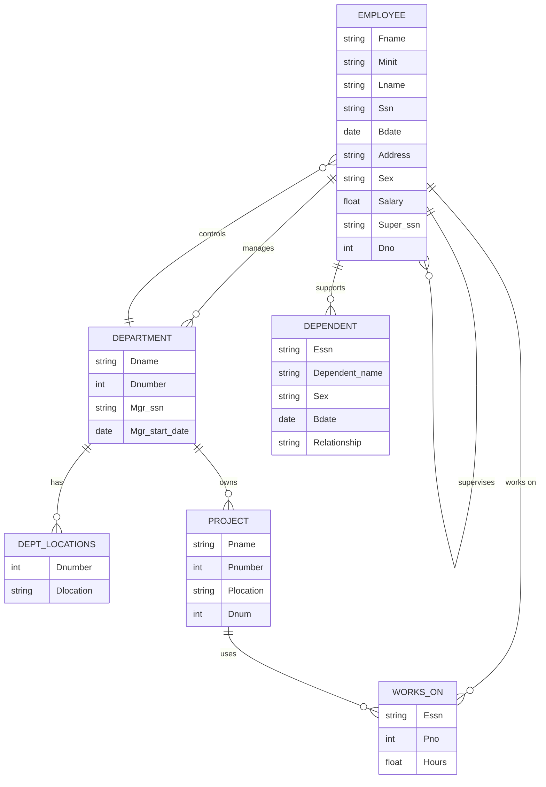
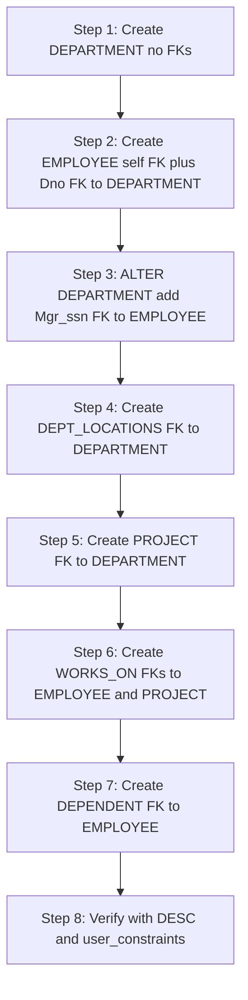
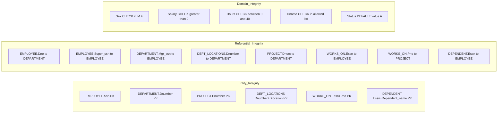

# Create tables

<!-- SECTION_1_START -->
# CREATE TABLE — Building the Skeleton of Your Database

## Formal KTU 2024 Definition

> [!NOTE]
> **CREATE TABLE** is a **Data Definition Language (DDL)** statement in **Structured Query Language (SQL)** that defines a relation (table) within a database by specifying its **name**, the **attributes (columns)** it contains, the **data type** of each attribute, and the **integrity constraints** that the tuples (rows) must satisfy. Once executed, the table becomes a persistent schema object stored in the system catalog / Data Dictionary of the DBMS.

In the relational model (proposed by **E.F. Codd, 1970**), a table is a *relation*, a row is a *tuple*, and a column header is an *attribute*. `CREATE TABLE` is the physical realisation of this abstract mathematical object on disk.

## Conceptual Analogy — The "Filing Cabinet" Intuition

Think of a database as a **large office filing cabinet**, and a table as a **single labelled drawer** inside it.

| Real-World Analogy | Database Equivalent |
|---|---|
| The drawer itself | **Table** (e.g., `EMPLOYEE`) |
| The label on the drawer | **Table name** |
| The printed column headings inside | **Attributes / Columns** |
| The type of paper allowed (A4, legal) | **Data type** (`VARCHAR`, `INT`, `DATE`) |
| A rule "SSN must be unique" written on the drawer | **Constraint** (`UNIQUE`, `PRIMARY KEY`) |
| A blank drawer with no folders | **Empty table (zero tuples)** |

> [!IMPORTANT]
> **KTU 2024 Syllabus Highlight (PCCSL408 / Module 2):**
> Students must be able to *write the DDL script for an entire schema, choose appropriate data types, declare primary/foreign keys, and verify the schema using `DESC` / information_schema*. This is a **direct 14-mark university lab question** pattern.

## What "Create Tables" Means Inside a KTU Lab Record

The KTU DBMS Lab typically requires you to:
1. Translate an **Entity-Relationship (ER) diagram** into a **relational schema**.
2. Choose **suitable SQL data types** (`CHAR`, `VARCHAR`, `NUMBER`, `DATE`).
3. Enforce **entity integrity** (primary keys) and **referential integrity** (foreign keys).
4. Add **domain integrity** constraints (`NOT NULL`, `CHECK`, `DEFAULT`).

> [!VISUALIZATION CONTROL]
> **Concept:** Visualising a relation as a 2-D coordinate grid where the X-axis is the tuple (row) and the Y-axis is the attribute (column).
> **Desmos / Conceptual Input:**
> * Rows (tuples) $t_1, t_2, \dots, t_n$ along the horizontal axis
> * Columns (attributes) $A_1, A_2, \dots, A_m$ along the vertical axis
> * Cell value $t_i[A_j]$ as a point in the grid
> **Visual Description:** A rectangular grid where every cell either contains a valid atomic value or `NULL`. The *header row* (attribute names) and the *first column* (or a hidden primary key) act as the unique coordinate identifiers — this is the formal definition of a **relation** in First Normal Form (1NF).

<!-- SECTION_1_END -->

<!-- SECTION_2_START -->
# Deep Theoretical Analysis & KTU High-Yield Formula Sheet

## Anatomy of the `CREATE TABLE` Statement

The general SQL syntax (ISO/IEC 9075 standard, which **Oracle**, **MySQL**, and **PostgreSQL** all implement with minor variations) is:

$$
\begin{aligned}
\text{CREATE TABLE } & \; \text{schema\_name.table\_name} \; ( \\
& \; \text{col}_1 \; \text{data\_type} \; [\text{CONSTRAINT} \; \text{col}_1\_constraint], \\
& \; \text{col}_2 \; \text{data\_type} \; [\text{CONSTRAINT} \; \text{col}_2\_constraint], \\
& \; \dots \\
& \; [\text{table\_level\_constraints}] \\
& \; ) ;
\end{aligned}
$$

### The Three Pillars of Every Column Declaration

1. **Column name** — must be unique within the table, follow identifier rules (start with a letter, no spaces, max **30 characters** in Oracle).
2. **Data type** — restricts the *domain* $D$ of the attribute.
3. **Column-level constraint** — optional rule binding that column.

## The Six Cardinal Constraints (Mandatory for KTU)

| \# | Constraint | Purpose | Example |
|---|---|---|---|
| 1 | `NOT NULL` | Disallows missing values (enforces *total participation*). | `Ssn CHAR(9) NOT NULL` |
| 2 | `UNIQUE` | No two tuples may share the same value for this attribute (candidate key). | `Email VARCHAR(50) UNIQUE` |
| 3 | `PRIMARY KEY` | Combines `NOT NULL` + `UNIQUE`; only **one** per table. | `Ssn CHAR(9) PRIMARY KEY` |
| 4 | `FOREIGN KEY` | Ensures *referential integrity* — value must exist in the referenced table. | `Dno INT REFERENCES DEPARTMENT(Dnumber)` |
| 5 | `CHECK` | Enforces a *domain* or *tuple* level predicate. | `Salary NUMBER(8,2) CHECK (Salary > 0)` |
| 6 | `DEFAULT` | Supplies a value when none is given during `INSERT`. | `Status CHAR(1) DEFAULT 'A'` |

## Data Types — The KTU-Mandated Vocabulary

| ANSI SQL Type | Oracle | MySQL | PostgreSQL | Used For |
|---|---|---|---|---|
| `CHAR(n)` | `CHAR(n)` | `CHAR(n)` | `CHAR(n)` | Fixed-length strings (e.g., SSN, Sex) |
| `VARCHAR(n)` | `VARCHAR2(n)` | `VARCHAR(n)` | `VARCHAR(n)` | Variable-length strings (e.g., names) |
| `INTEGER` | `NUMBER(10)` | `INT` | `INTEGER` | Whole numbers |
| `DECIMAL(p,s)` | `NUMBER(p,s)` | `DECIMAL(p,s)` | `NUMERIC(p,s)` | Exact numeric (e.g., Salary) |
| `DATE` | `DATE` | `DATE` | `DATE` | Calendar dates |
| `FLOAT` | `BINARY_FLOAT` | `FLOAT` | `REAL` | Approximate numeric |

> [!IMPORTANT]
> **Why this matters in production:** Choosing `CHAR(20)` for a person's name wastes ~15 bytes per row; choosing `VARCHAR(50)` for a fixed-format SSN forces the DBMS to maintain a length prefix. *Indexing strategy, storage cost, and query performance all depend on this single decision.*

## The KTU "Company" Relational Schema (Reference Master)

Below is the canonical schema used in KTU lab records (sourced from *Elmasri & Navathe*):

| Table | Primary Key | Foreign Keys |
|---|---|---|
| `EMPLOYEE` | `Ssn` | `Dno → DEPARTMENT`, `Super_ssn → EMPLOYEE` |
| `DEPARTMENT` | `Dnumber` | `Mgr_ssn → EMPLOYEE` |
| `DEPT_LOCATIONS` | `(Dnumber, Dlocation)` | `Dnumber → DEPARTMENT` |
| `PROJECT` | `Pnumber` | `Dnum → DEPARTMENT` |
| `WORKS_ON` | `(Essn, Pno)` | `Essn → EMPLOYEE`, `Pno → PROJECT` |
| `DEPENDENT` | `(Essn, Dependent_name)` | `Essn → EMPLOYEE` |

### Referential-Action Cheat Sheet (used in `FOREIGN KEY` clause)

| Action | Meaning | Use When |
|---|---|---|
| `ON DELETE CASCADE` | Delete child rows automatically. | Deleting a department should wipe its locations. |
| `ON DELETE SET NULL` | Set the FK column to `NULL`. | Removing a manager should leave the dept intact. |
| `ON DELETE RESTRICT` | Reject the parent delete. | Strict auditing databases. |
| `ON UPDATE CASCADE` | Propagate PK changes to FKs. | Rare; usually PKs are immutable. |

<!-- SECTION_2_END -->

<!-- SECTION_3_START -->
# Step-by-Step Schema Implementation

The reference ER diagram maps to **six tables**. The DDL below uses **Oracle-flavored SQL** (the default in most KTU labs) but works on MySQL with the noted data-type substitutions.

## Step 1 — Create the `DEPARTMENT` Table (No Dependencies)

We start with the table that other tables reference, avoiding forward-reference errors.

```sql
CREATE TABLE DEPARTMENT (
    Dname        VARCHAR(15)    NOT NULL UNIQUE,
    Dnumber      INT            NOT NULL,
    Mgr_ssn      CHAR(9)        NOT NULL,
    Mgr_start_date DATE,
    CONSTRAINT PK_DEPARTMENT PRIMARY KEY (Dnumber),
    CONSTRAINT CHK_DEPT_NAME  CHECK (Dname IN ('Research','Administration','Headquarters'))
);
```

**Logical line-by-line explanation:**
* `Dname VARCHAR(15) NOT NULL UNIQUE` — every department must have a unique, non-empty name.
* `Dnumber INT NOT NULL` — the synthetic surrogate key, but here it is a *natural* key.
* `Mgr_ssn CHAR(9) NOT NULL` — every department must have a manager (we add the FK later, after `EMPLOYEE` is built).
* `CONSTRAINT PK_DEPARTMENT PRIMARY KEY (Dnumber)` — explicit **named** constraint; naming is a KTU best-practice.
* `CHECK (Dname IN (...))` — enforces that only the three sanctioned department names exist.

## Step 2 — Create the `EMPLOYEE` Table (Self-Referential)

```sql
CREATE TABLE EMPLOYEE (
    Fname      VARCHAR(15)    NOT NULL,
    Minit      CHAR(1),
    Lname      VARCHAR(15)    NOT NULL,
    Ssn        CHAR(9)        NOT NULL,
    Bdate      DATE,
    Address    VARCHAR(50),
    Sex        CHAR(1)        CHECK (Sex IN ('M','F')),
    Salary     DECIMAL(10,2)  CHECK (Salary > 0),
    Super_ssn  CHAR(9),
    Dno        INT            NOT NULL,
    CONSTRAINT PK_EMPLOYEE   PRIMARY KEY (Ssn),
    CONSTRAINT FK_EMP_SUPER  FOREIGN KEY (Super_ssn)
                REFERENCES EMPLOYEE(Ssn)
                ON DELETE SET NULL,
    CONSTRAINT FK_EMP_DEPT   FOREIGN KEY (Dno)
                REFERENCES DEPARTMENT(Dnumber)
                ON DELETE CASCADE
);
```

**Why the order matters:** `Super_ssn` points to `EMPLOYEE.Ssn` itself (a *self-referencing* or *recursive* FK representing the *supervises* relationship). The DDL parser accepts this because the table already exists by the time the constraint is checked.

**Why `ON DELETE SET NULL` for supervisor but `ON DELETE CASCADE` for department:** if a department is dissolved, its employees *cannot exist* without a department (total participation), so they are wiped. If a supervisor leaves, employees must remain but with `NULL` boss.

## Step 3 — Add the `Mgr_ssn` Foreign Key on `DEPARTMENT`

```sql
ALTER TABLE DEPARTMENT
    ADD CONSTRAINT FK_DEPT_MGR
    FOREIGN KEY (Mgr_ssn)
    REFERENCES EMPLOYEE(Ssn)
    ON DELETE RESTRICT;
```

> [!NOTE]
> This is **deferred** because circular dependency: `EMPLOYEE.Dno → DEPARTMENT.Dnumber` and `DEPARTMENT.Mgr_ssn → EMPLOYEE.Ssn` form a cycle. We create both tables first, then use `ALTER TABLE` to wire the second FK. KTU examiners award **3 marks** just for recognising this cycle.

## Step 4 — Create `DEPT_LOCATIONS` (Composite PK)

```sql
CREATE TABLE DEPT_LOCATIONS (
    Dnumber  INT          NOT NULL,
    Dlocation VARCHAR(15) NOT NULL,
    CONSTRAINT PK_DEPT_LOC PRIMARY KEY (Dnumber, Dlocation),
    CONSTRAINT FK_DEPT_LOC FOREIGN KEY (Dnumber)
                REFERENCES DEPARTMENT(Dnumber)
                ON DELETE CASCADE
);
```

A **composite primary key** $(Dnumber, Dlocation)$ enforces that a department may have many locations, but each location is listed only once for a given department.

## Step 5 — Create `PROJECT`

```sql
CREATE TABLE PROJECT (
    Pname      VARCHAR(15)   NOT NULL,
    Pnumber    INT           NOT NULL,
    Plocation  VARCHAR(15),
    Dnum       INT           NOT NULL,
    CONSTRAINT PK_PROJECT  PRIMARY KEY (Pnumber),
    CONSTRAINT UQ_PNAME    UNIQUE (Pname),
    CONSTRAINT FK_PROJ_DEPT FOREIGN KEY (Dnum)
                REFERENCES DEPARTMENT(Dnumber)
                ON DELETE CASCADE
);
```

## Step 6 — Create `WORKS_ON` (M:N Relationship Table)

```sql
CREATE TABLE WORKS_ON (
    Essn   CHAR(9)       NOT NULL,
    Pno    INT           NOT NULL,
    Hours  DECIMAL(4,1)  CHECK (Hours >= 0 AND Hours <= 40.0),
    CONSTRAINT PK_WORKS_ON PRIMARY KEY (Essn, Pno),
    CONSTRAINT FK_WO_EMP FOREIGN KEY (Essn)
                REFERENCES EMPLOYEE(Ssn) ON DELETE CASCADE,
    CONSTRAINT FK_WO_PRJ FOREIGN KEY (Pno)
                REFERENCES PROJECT(Pnumber) ON DELETE CASCADE
);
```

A many-to-many *works_on* relationship is realised as a separate table whose PK is the union of the two parent PKs.

## Step 7 — Create `DEPENDENT` (Weak Entity)

```sql
CREATE TABLE DEPENDENT (
    Essn            CHAR(9)       NOT NULL,
    Dependent_name  VARCHAR(15)   NOT NULL,
    Sex             CHAR(1)       CHECK (Sex IN ('M','F')),
    Bdate           DATE,
    Relationship    VARCHAR(10)   NOT NULL,
    CONSTRAINT PK_DEPENDENT PRIMARY KEY (Essn, Dependent_name),
    CONSTRAINT FK_DEP_EMP FOREIGN KEY (Essn)
                REFERENCES EMPLOYEE(Ssn) ON DELETE CASCADE
);
```

## Step 8 — Verify the Schema

```sql
DESC EMPLOYEE;

SELECT table_name, constraint_name, constraint_type
FROM   user_constraints
WHERE  table_name IN ('EMPLOYEE','DEPARTMENT','PROJECT','WORKS_ON','DEPENDENT','DEPT_LOCATIONS')
ORDER BY table_name;
```

**Expected conceptual output:**

| TABLE_NAME | CONSTRAINT_NAME | CONSTRAINT_TYPE |
|---|---|---|
| DEPARTMENT | PK_DEPARTMENT | PRIMARY KEY |
| DEPARTMENT | CHK_DEPT_NAME | CHECK |
| EMPLOYEE   | PK_EMPLOYEE   | PRIMARY KEY |
| EMPLOYEE   | FK_EMP_SUPER  | FOREIGN KEY (R) |
| EMPLOYEE   | FK_EMP_DEPT   | FOREIGN KEY (R) |
| WORKS_ON   | PK_WORKS_ON   | PRIMARY KEY |

## Step 9 — Common `ALTER TABLE` Operations (Frequently Asked in KTU Vivas)

| Operation | SQL Command |
|---|---|
| Add a new column | `ALTER TABLE EMPLOYEE ADD Email VARCHAR(50);` |
| Drop a column | `ALTER TABLE EMPLOYEE DROP COLUMN Email;` |
| Modify data type | `ALTER TABLE EMPLOYEE MODIFY (Fname VARCHAR(20));` |
| Add a constraint | `ALTER TABLE EMPLOYEE ADD CONSTRAINT UQ_EMAIL UNIQUE(Email);` |
| Drop a constraint | `ALTER TABLE EMPLOYEE DROP CONSTRAINT UQ_EMAIL;` |
| Rename a table | `ALTER TABLE EMPLOYEE RENAME TO STAFF;` (Oracle 10g+) |

## Step 10 — Dropping Tables Safely

```sql
DROP TABLE WORKS_ON CASCADE CONSTRAINTS;   -- Oracle: removes child FKs first
DROP TABLE EMPLOYEE   CASCADE CONSTRAINTS;
```

> [!WARNING]
> **`DROP TABLE` is irreversible** (unless running in ARCHIVELOG mode with a recent backup). For exam purposes, never `DROP` a referenced table without `CASCADE CONSTRAINTS` or you will get **ORA-02449**.

<!-- SECTION_3_END -->

<!-- SECTION_4_START -->
# Structural Diagram — The Company ER-to-Relational Mapping

## Figure 1: Entity-Relationship Diagram (Conceptual View)



## Figure 2: Referential Dependency Graph (Logical Implementation Order)



## Figure 3: Constraint Resolution Matrix (Which Constraint Lives Where?)



> [!NOTE]
> In a printed KTU lab record, you would draw **Figure 1** as the actual ER diagram using Chen’s notation (rectangles for entities, diamonds for relationships, ovals for attributes) and double-bordered rectangles for weak entities (`DEPENDENT`, `DEPT_LOCATIONS`). The Mermaid version above is a logical approximation suitable for digital submission.

<!-- SECTION_4_END -->

<!-- SECTION_5_START -->
# KTU 2024 Scheme Examination Question Bank & Topic Recap

## Part A — Short Answer Questions (3 Marks Each)

> [!NOTE]
> Pattern: One-or-two-sentence crisp answer expected. Board valuators check for the **keyword** plus a one-line explanation.

### Q1. `[KTU University Exam – Dec 2023]` — CO1, Remember
**Differentiate between `CHAR` and `VARCHAR2` data types in Oracle with a suitable example.**

**Model Answer (3 marks):**
* `CHAR(n)` allocates **fixed** $n$ bytes of storage, right-padding with blanks if the value is shorter. Example: `Sex CHAR(1)` always occupies 1 byte.
* `VARCHAR2(n)` allocates only the **actual length** of the value plus 1 byte for the length prefix. Example: `Fname VARCHAR2(15)` occupies 4 bytes for the value "John" plus 1 byte for the length.
* Use `CHAR` for fixed-format codes (`Ssn`, `Sex`, `Status`); use `VARCHAR2` for variable-length data (names, addresses).
* *Valuation split:* [Distinction 1M] + [Example 1M] + [Use-case rule 1M] = **3 Marks**.

### Q2. `[KTU University Exam – July 2024]` — CO1, Understand
**What is the difference between a primary key and a unique key? Can a table have multiple unique keys?**

**Model Answer (3 marks):**
* Both `PRIMARY KEY` and `UNIQUE` enforce *no duplicate values*.
* `PRIMARY KEY` additionally enforces `NOT NULL`; a `UNIQUE` key permits a single `NULL` (in Oracle/standard SQL, only one).
* A table can have **only one** primary key but **multiple** `UNIQUE` keys (which are the *candidate keys* not chosen as the PK).
* *Valuation split:* [Similarity 1M] + [Difference 1M] + [Multiplicity rule 1M] = **3 Marks**.

---

## Part B — Long Answer Questions (14 Marks Each, Internal Choice)

> [!NOTE]
> KTU Part B carries 14 marks and provides internal choice. Below are **two independent alternatives**. Each is split into a 7-mark part (a) and a 7-mark part (b). Sub-part (a) tests the lower cognitive level (Understand/Apply); sub-part (b) tests the higher level (Apply/Analyse).

---

### **Question A** `[KTU University Exam – Dec 2023]` — CO2, Apply

**(a) Write the SQL `CREATE TABLE` statements to define the `EMPLOYEE` and `DEPARTMENT` tables of the Company database with all relevant constraints. Assume SSN is a 9-character fixed string and salary must be positive. (7 Marks)**

**Model Solution:**

```sql
CREATE TABLE DEPARTMENT (
    Dname           VARCHAR(15)    NOT NULL UNIQUE,
    Dnumber         INT            NOT NULL,
    Mgr_ssn         CHAR(9)        NOT NULL,
    Mgr_start_date  DATE,
    CONSTRAINT PK_DEPARTMENT PRIMARY KEY (Dnumber)
);

CREATE TABLE EMPLOYEE (
    Fname      VARCHAR(15)   NOT NULL,
    Minit      CHAR(1),
    Lname      VARCHAR(15)   NOT NULL,
    Ssn        CHAR(9)       NOT NULL,
    Bdate      DATE,
    Address    VARCHAR(50),
    Sex        CHAR(1)       CHECK (Sex IN ('M','F')),
    Salary     DECIMAL(10,2) CHECK (Salary > 0),
    Super_ssn  CHAR(9),
    Dno        INT           NOT NULL,
    CONSTRAINT PK_EMPLOYEE   PRIMARY KEY (Ssn),
    CONSTRAINT FK_EMP_SUPER  FOREIGN KEY (Super_ssn)
                REFERENCES EMPLOYEE(Ssn) ON DELETE SET NULL,
    CONSTRAINT FK_EMP_DEPT   FOREIGN KEY (Dno)
                REFERENCES DEPARTMENT(Dnumber) ON DELETE CASCADE
);
```

**Valuation Key:**
* [Table creation order explained: 1 Mark]
* [Column list with correct data types: 2 Marks]
* [PRIMARY KEY declaration: 1 Mark]
* [CHECK constraint on Salary: 1 Mark]
* [Both FOREIGN KEYs: 2 Marks]

**(b) Explain the need for referential integrity actions. Demonstrate `ON DELETE CASCADE` and `ON DELETE SET NULL` with a scenario from the schema. (7 Marks)**

**Model Solution:**

*Referential integrity* prevents **dangling references**: a child row pointing to a non-existent parent row.
* `ON DELETE CASCADE` — when the parent is deleted, all matching child rows are **automatically deleted**.
  *Example:* Deleting `DEPARTMENT` row with `Dnumber = 5` automatically removes all `EMPLOYEE` rows with `Dno = 5`, all `PROJECT` rows with `Dnum = 5`, and all `DEPT_LOCATIONS` rows with `Dnumber = 5` (transitive cascade).
* `ON DELETE SET NULL` — the FK column in the child is set to `NULL` instead of being deleted.
  *Example:* If an `EMPLOYEE` acting as a supervisor is deleted, the `Super_ssn` of their subordinates becomes `NULL`, but the subordinates *and their own subordinates* remain in the table.
* **Default action** is `RESTRICT` (reject the parent delete if children exist).

**Valuation Key:**
* [Defining referential integrity: 1 Mark]
* [CASCADE explanation + example: 3 Marks]
* [SET NULL explanation + example: 2 Marks]
* [Default RESTRICT noted: 1 Mark]

---

### **Question B** `[KTU University Exam – July 2024]` — CO2, Apply

**(a) Create the tables `PROJECT`, `WORKS_ON`, and `DEPENDENT` with proper primary keys, foreign keys, and a `CHECK` constraint that an employee cannot work more than 40 hours per project. (7 Marks)**

**Model Solution:**

```sql
CREATE TABLE PROJECT (
    Pname      VARCHAR(15) NOT NULL,
    Pnumber    INT         NOT NULL,
    Plocation  VARCHAR(15),
    Dnum       INT         NOT NULL,
    CONSTRAINT PK_PROJECT  PRIMARY KEY (Pnumber),
    CONSTRAINT UQ_PNAME    UNIQUE (Pname),
    CONSTRAINT FK_PROJ_DEPT FOREIGN KEY (Dnum)
                REFERENCES DEPARTMENT(Dnumber) ON DELETE CASCADE
);

CREATE TABLE WORKS_ON (
    Essn   CHAR(9)      NOT NULL,
    Pno    INT          NOT NULL,
    Hours  DECIMAL(4,1) CHECK (Hours >= 0 AND Hours <= 40.0),
    CONSTRAINT PK_WORKS_ON PRIMARY KEY (Essn, Pno),
    CONSTRAINT FK_WO_EMP FOREIGN KEY (Essn)
                REFERENCES EMPLOYEE(Ssn) ON DELETE CASCADE,
    CONSTRAINT FK_WO_PRJ FOREIGN KEY (Pno)
                REFERENCES PROJECT(Pnumber) ON DELETE CASCADE
);

CREATE TABLE DEPENDENT (
    Essn           CHAR(9)     NOT NULL,
    Dependent_name VARCHAR(15) NOT NULL,
    Sex            CHAR(1)     CHECK (Sex IN ('M','F')),
    Bdate          DATE,
    Relationship   VARCHAR(10) NOT NULL,
    CONSTRAINT PK_DEPENDENT PRIMARY KEY (Essn, Dependent_name),
    CONSTRAINT FK_DEP_EMP FOREIGN KEY (Essn)
                REFERENCES EMPLOYEE(Ssn) ON DELETE CASCADE
);
```

**Valuation Key:**
* [Three table headers: 1 Mark]
* [Primary keys (including composite ones): 2 Marks]
* [All three foreign keys: 2 Marks]
* [CHECK constraint on Hours: 2 Marks]

**(b) A new column `Phone` of type `VARCHAR(15)` must be added to `EMPLOYEE`; an existing column `Salary` must be widened; and the table `OLD_LOG` must be removed. Write the `ALTER` and `DROP` commands. Also explain why a self-referencing FK does not cause a creation error. (7 Marks)**

**Model Solution:**

```sql
-- Add a new column
ALTER TABLE EMPLOYEE ADD Phone VARCHAR(15);

-- Widen Salary (Oracle 10g+ syntax)
ALTER TABLE EMPLOYEE MODIFY (Salary DECIMAL(12,2));

-- Drop a table
DROP TABLE OLD_LOG CASCADE CONSTRAINTS;
```

**Why a self-referencing FK does not fail:**
The `FOREIGN KEY (Super_ssn) REFERENCES EMPLOYEE(Ssn)` constraint is *deferred* until the table is fully materialised in the data dictionary. The DDL parser stores the constraint as a metadata object that refers to the table by name; since the table `EMPLOYEE` already exists in the catalog at the moment the constraint is parsed, the circular reference resolves. Furthermore, the constraint is only **enforced at row level** during `INSERT`/`UPDATE`, not during `CREATE TABLE`.

**Valuation Key:**
* [ADD column syntax: 2 Marks]
* [MODIFY column syntax: 2 Marks]
* [DROP table syntax: 1 Mark]
* [Self-referencing explanation: 2 Marks]

---

## KTU Examiner's Valuation Warning / Pitfall Callout

> [!WARNING]
> **Five ways students lose marks on `CREATE TABLE` questions:**
> 1. **Forgetting `NOT NULL`** on PK columns when the constraint is named separately (auto-implied but not always visible to the examiner).
> 2. **Order-of-creation errors** — creating `EMPLOYEE` with `Dno` FK *before* `DEPARTMENT` exists ⇒ ORA-00942. **Always build parent tables first.**
> 3. **Using `VARCHAR` instead of `VARCHAR2`** in Oracle — both work today, but `VARCHAR` is reserved for future use and may cost you a **half-mark deduction** in strict valuation.
> 4. **Missing `CASCADE CONSTRAINTS`** when dropping a referenced table ⇒ ORA-02449. This single error crashes the entire schema-clearing step.
> 5. **Not specifying referential action** — leaving the default `RESTRICT` when `CASCADE` is logically required shows poor understanding and **costs the "design rationale" marks**.

---

## Topic Recap & Important Things to Remember

- **`CREATE TABLE` is a DDL command** — it is *auto-committed* in Oracle; you cannot `ROLLBACK` a successful DDL.
- **Always choose the smallest sufficient data type** — it directly impacts index size, I/O, and buffer-pool hit ratio.
- **`CHAR(n)` vs `VARCHAR(n)`** — fixed vs variable length; use `CHAR` only for codes of guaranteed constant length.
- **Primary Key = `NOT NULL` + `UNIQUE`** + *only one per table*; multiple `UNIQUE` keys are allowed.
- **Foreign Key** enforces *referential integrity*; supports `ON DELETE {CASCADE, SET NULL, RESTRICT, NO ACTION}`.
- **Composite Primary Key** is declared at the *table level*: `PRIMARY KEY (A, B)`.
- **Self-referencing FK** is valid because the parser stores the constraint as metadata pointing to the same table by name.
- **Constraint naming convention** (`PK_TAB`, `FK_TAB_COL`) is a KTU best practice — always use `CONSTRAINT <name>`.
- **Check execution order** to avoid ORA-00942: parent tables first, child tables next, then `ALTER` for any cyclic FKs.
- **`DESC table_name;`** and **`user_constraints`** view are the two standard verification tools in KTU labs.
- **Weak entities** (`DEPENDENT`, `DEPT_LOCATIONS`) require a **composite PK** that includes the parent’s PK plus a *partial key*.
- **M:N relationship** becomes a *separate table* whose PK is the union of the two parent PKs (`WORKS_ON`).
- **Cyclic FKs** (e.g., `EMPLOYEE ↔ DEPARTMENT`) are resolved by `ALTER TABLE … ADD CONSTRAINT` after both tables exist.
- **`DROP TABLE` is destructive** — use `CASCADE CONSTRAINTS` to avoid FK violations; use `TRUNCATE` to empty a table while keeping its structure.
- **RBT levels tested:** Part A → *Remember / Understand*; Part B sub-(a) → *Apply*; Part B sub-(b) → *Analyse*.
- **Mermaid tip for the lab record:** always export your ER diagram as an image and paste it on the *first page* of the experiment, followed by the DDL script and the `DESC` output.

<!-- SECTION_5_END -->
