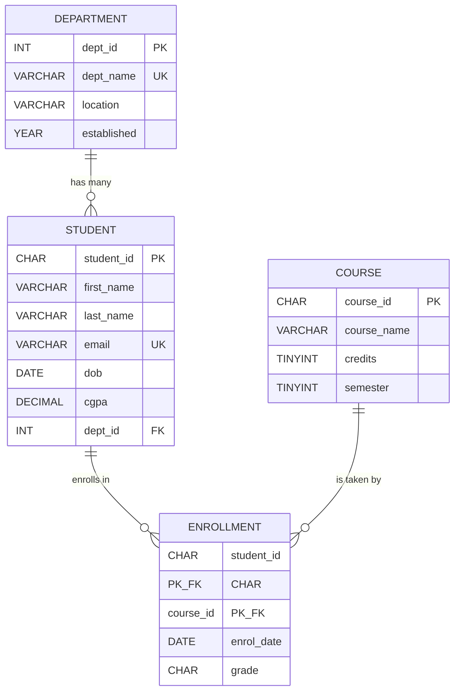
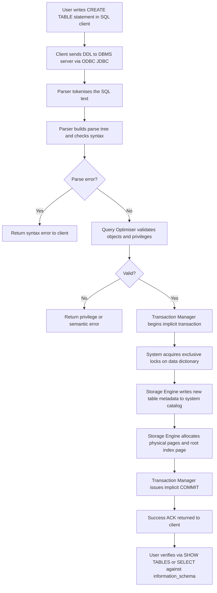
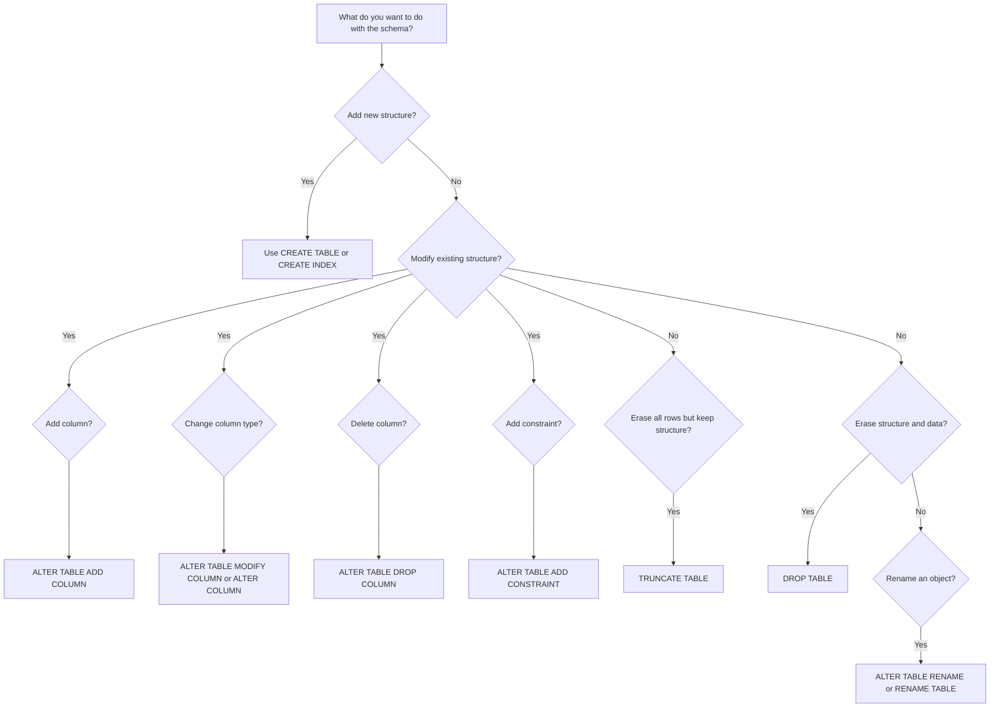
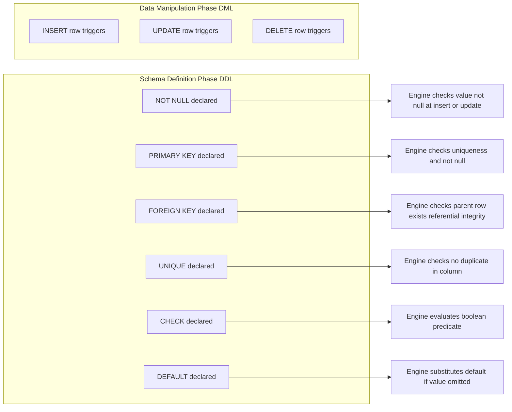

# Creation of database schema - DDL (create tables, set constraints, enforce relationships, create indices, delete and modify tables).

<!-- SECTION_1_START -->
# Module 2 — Creation of Database Schema (DDL)

## 1.1 Formal Academic Definition (KTU 2024 Scheme Terminology)

**Data Definition Language (DDL)** is the subset of Structured Query Language (SQL) that is used to **define, construct, alter, and destroy the structural skeleton (schema objects) of a relational database**. Schema objects include tables, views, indexes, sequences, synonyms, and constraints. DDL statements operate at the *metadata level* (data about data) rather than on the *data instances* (rows/tuples) themselves. In the KTU 2024 Scheme syllabus, DDL forms the foundational phase of the **Database Development Life Cycle (DDLC)** — namely, the *Logical Design* and *Physical Design* steps — preceding any Data Manipulation Language (DML) activity.

> [!IMPORTANT]
> **KTU 2024 Board Definition to Memorise:**
> *"DDL commands are auto-committed SQL statements that modify the database catalog (data dictionary) and cannot be rolled back implicitly. They define the *intension* (schema) of a relation, in contrast to DML which manipulates the *extension* (instance/tuples)."*

The **intension** refers to the structure (table name, column names, data types, constraints), whereas the **extension** refers to the actual rows of data at any given moment.

## 1.2 Intuitive Analogy — The Architectural Blueprint

Imagine you are commissioned to build a multi-storey **apartment complex**.

- The **blueprint** drawn by the architect specifies the number of floors, the dimensions of each room, the load-bearing walls, the plumbing layout, and the fire-escape routes. This blueprint never changes once the building is constructed without significant demolition and rebuilding.
- The **furniture, occupants, and their belongings** inside the rooms are the *data* (extension). These change every day — new tenants arrive, old tenants leave, furniture is moved.
- **DDL** is the architect's drafting table. With it, you can:
  - **CREATE** a new floor plan.
  - **ALTER** an existing plan to add a balcony.
  - **DROP** (demolish) an entire wing.
  - **TRUNCATE** an existing plan and redraw it from scratch (keeping the structure but removing all occupants).
  - **RENAME** a wing for administrative clarity.

Similarly, in a relational database, the *schema* is the blueprint. The *rows* are the occupants. DDL never touches the occupants; it only modifies the building's structure. Once a `DROP TABLE` is executed, the structure — and every row that lived inside it — vanishes permanently (unless backed up).

## 1.3 The Five Canonical DDL Verbs in KTU Syllabus

The KTU 2024 PCCSL408 lab manual specifically tests the following five DDL commands:

| DDL Verb | Function |
| :--- | :--- |
| `CREATE` | Constructs a new schema object (table, index, view, sequence). |
| `ALTER` | Modifies the structure of an existing schema object in-place. |
| `DROP` | Permanently deletes a schema object and all its data. |
| `TRUNCATE` | Removes all rows from a table while preserving the structure. |
| `RENAME` | Changes the name of a table or column (DBMS-specific support). |

> [!NOTE]
> **Implicit COMMIT Behaviour:**
> Unlike DML statements (INSERT, UPDATE, DELETE) that respect the `BEGIN TRANSACTION` … `COMMIT/ROLLBACK` boundaries, **DDL statements are auto-committed** in most RDBMS engines (Oracle, PostgreSQL, MySQL/InnoDB). The KTU examiner often tests this distinction in viva voce and 3-mark questions.

## 1.4 Physical Constants, Limits, and Standards to Remember

- **Maximum columns per table (standard SQL):** 250 – 1600 (DBMS-dependent; Oracle: 1000, MySQL: 4096, PostgreSQL: 250 – 1600).
- **Maximum row size:** $\mathbf{8060 \text{ bytes}}$ (SQL Server default page) — relevant for variable-length column design.
- **Clustered index per table:** Strictly **1** (the physical ordering of rows is unique). Non-clustered indexes: $\mathbf{249}$ (SQL Server) or higher in other engines.
- **FOREIGN KEY referential action:** Default is `NO ACTION`; alternatives are `CASCADE`, `SET NULL`, `SET DEFAULT`, `RESTRICT`.
- **Naming convention (KTU preferred):** `snake_case` for tables and columns, with the suffix `_id` for primary keys, `_fk` for foreign keys, and `_idx` for index names.

> [!VISUALIZATION CONTROL]
> **Concept:** Visualising the lifecycle of a DDL statement against the data dictionary.
> **Conceptual Sketch (Geometric Intuition):**
> Imagine the horizontal $x$-axis as **Time** and the vertical $y$-axis as the **Schema Version**. Each DDL operation produces a discrete vertical step on this graph:
>
> $t_0 \xrightarrow{\text{CREATE TABLE}} t_1 \xrightarrow{\text{ALTER ADD COLUMN}} t_2 \xrightarrow{\text{DROP TABLE}} t_3$
>
> **Visual Description:** At $t_0$, no schema exists. At $t_1$ (after CREATE), a new "schema box" appears. At $t_2$ (after ALTER), the box widens to accommodate a new column. At $t_3$ (after DROP), the box vanishes entirely. The DML operations (INSERT/UPDATE) would not change the box shape — only its internal contents.

<!-- SECTION_1_END -->

<!-- SECTION_2_START -->
# 2. Deep Theoretical Analysis & KTU High-Yield Formula Sheet

## 2.1 Anatomy of a `CREATE TABLE` Statement — Structured Logic

The `CREATE TABLE` statement is the cornerstone of DDL. It is decomposed into the following logical clauses, each addressing a specific aspect of relational design:

1. **Table Identifier Clause:** Specifies the relation name and the schema in which it resides (e.g., `university.student`).
2. **Column Definition Clause:** Lists every attribute, its data type, length/precision, and column-level constraints.
3. **Table-Level Constraint Clause:** Enforces integrity rules that span multiple columns (composite keys, multi-column UNIQUE, named CHECK).
4. **Storage Clause (DBMS-specific):** Defines tablespace, partitioning, or physical storage parameters (often skipped in KTU labs).
5. **Table Properties Clause:** Specifies `ON COMMIT`, `ON UPDATE` behaviour, and engine type (e.g., `ENGINE=InnoDB`).

### 2.1.1 The "Why" Behind Each Clause

- **Data Types** exist because the DBMS must allocate a fixed byte-length per cell and decide the *domain* $\text{dom}(A_i)$ for each attribute $A_i$ in the relation schema $R(A_1, A_2, \dots, A_n)$.
- **NOT NULL** enforces the *mandatory attribute* property from the ER model.
- **PRIMARY KEY** guarantees the *entity integrity* rule: no tuple can have a NULL primary key value.
- **FOREIGN KEY** enforces the *referential integrity* rule: every foreign key value must either match an existing primary key in the parent table or be NULL.
- **UNIQUE** enforces the *key* property of an attribute (alternate keys).
- **CHECK** enforces arbitrary *domain* integrity rules (e.g., `marks >= 0 AND marks <= 100`).
- **DEFAULT** supplies a *fallback value* when no value is provided during INSERT.

## 2.2 The Six Integrity Constraints — KTU Cheat Sheet

| Constraint | Purpose | NULL Allowed? | Duplicate Allowed? | Scope |
| :--- | :--- | :--- | :--- | :--- |
| `NOT NULL` | Prevents absence of value | **No** | Yes | Column-level only |
| `UNIQUE` | No duplicate values in column | Yes (one NULL only, ANSI) | **No** | Column or Table |
| `PRIMARY KEY` | Unique row identifier | **No** | **No** | Column or Table |
| `FOREIGN KEY` | Links to parent PK | Yes (by default) | Yes | Column or Table |
| `CHECK` | Validates domain rule | Yes (unless combined) | Yes | Column or Table |
| `DEFAULT` | Provides fallback value | — | — | Column-level only |

> [!IMPORTANT]
> A table can have **at most one** `PRIMARY KEY`, but it can have **multiple** `UNIQUE` constraints (alternate keys). The primary key is implicitly `NOT NULL` and `UNIQUE`.

## 2.3 Relationship Enforcement via Foreign Keys

In the relational model, the three cardinal relationships map to foreign-key placements as follows:

- **One-to-One (1:1):** The foreign key is placed in **either** of the two tables and is declared `UNIQUE NOT NULL` to enforce the 1-to-1 cardinality. For example, every `Employee` has exactly one `ParkingSlot`, and each `ParkingSlot` belongs to one `Employee`.
- **One-to-Many (1:N):** The foreign key is placed in the **"many" side** (child table) referencing the PK of the "one" side (parent table). For example, one `Department` has many `Students`; thus `student.dept_id` is the foreign key.
- **Many-to-Many (M:N):** A **junction (associative/bridge) table** is introduced that contains two foreign keys referencing the two participating tables. The composite of both FKs typically forms the primary key. For example, `Enroll(student_id, course_id)` connects `Student` and `Course`.

## 2.4 Index Theory — When, Why, and at What Cost

An **index** is a separate data structure (typically a B+ Tree) that accelerates `SELECT` queries at the cost of additional storage and slower `INSERT/UPDATE/DELETE` operations. The cost-benefit trade-off is:

$$\text{Speedup}_{\text{read}} \propto \log_{m}(N) \quad \text{vs.} \quad \text{Slowdown}_{\text{write}} \propto \text{Index Count}$$

where $N$ is the number of rows and $m$ is the B+ Tree branching factor.

### 2.4.1 Index Variants

| Index Type | Physical Storage | Max per Table | Best Use Case |
| :--- | :--- | :--- | :--- |
| **Clustered** | Sorts the actual data rows | **1** | Range queries, primary key lookups |
| **Non-Clustered** | Separate structure with row pointers | Many (249+) | Foreign key joins, secondary filters |
| **Unique** | Clustered or Non-Clustered + uniqueness check | Many | Alternate keys, login IDs |
| **Composite** | Multi-column key | Many | Multi-column WHERE clauses |
| **Bitmap** | Bit vectors per distinct value | Many | Low-cardinality columns (gender, status) |
| **Full-Text** | Inverted index | Many | Text search (`MATCH … AGAINST`) |

## 2.5 ALTER TABLE — The Six Structural Mutations

The `ALTER TABLE` statement supports six fundamental structural mutations, each of which is heavily tested in KTU labs:

1. **ADD COLUMN** — Appends a new attribute.
2. **DROP COLUMN** — Removes an existing attribute and all its data.
3. **MODIFY / ALTER COLUMN** — Changes data type, size, or default of an existing column.
4. **ADD CONSTRAINT** — Adds a new integrity rule (e.g., a foreign key).
5. **DROP CONSTRAINT** — Removes an existing integrity rule.
6. **RENAME TO / RENAME COLUMN** — Renames the table or a column.

## 2.6 Real-World Engineering Utility

DDL-driven schema design is the foundation of nearly every production-grade software system:

- **Banking Systems:** The `accounts`, `transactions`, and `customers` tables are created via DDL, and `CHECK` constraints enforce that account balances never go negative without an overdraft flag.
- **E-Commerce:** The `orders` → `order_items` → `products` chain uses foreign keys with `ON DELETE CASCADE` to ensure referential consistency.
- **Healthcare:** The `patients` and `medical_records` 1:1 relationship is enforced with a unique foreign key, guaranteeing HIPAA-compliant data linkage.
- **Search Engines:** Full-text indices on product names accelerate fuzzy search.
- **Data Warehousing:** Clustered columnstore indexes on fact tables (millions of rows) deliver sub-second analytical queries.

> [!NOTE]
> The principles in this module are equally valid in **MySQL 8.x, Oracle 19c, PostgreSQL 15, and SQL Server 2019**. Syntax differences exist for `AUTO_INCREMENT` (MySQL) vs. `IDENTITY` (SQL Server) vs. `SERIAL` (PostgreSQL) vs. `SEQUENCE` (Oracle).

## 2.7 KTU High-Yield Formula Sheet (One-Page Summary)

| Concept | Formula / Syntax Pattern | Units / Notes |
| :--- | :--- | :--- |
| Relation Degree | $n = \mid \text{attributes}(R) \mid$ | Count of columns |
| Relation Cardinality | $t = \mid \text{tuples}(R) \mid$ | Count of rows |
| Index Selectivity | $S = \frac{\text{Distinct values}}{\text{Total rows}}$ | Closer to 1 $\Rightarrow$ better index |
| Page Size | $P = 8 \text{ KB}$ (default SQL Server) | $8060 \text{ B}$ usable |
| B+ Tree Search Cost | $O(\log_{\lceil m/2 \rceil}(N))$ | $m$ = order, $N$ = rows |
| Clustered Index Per Table | $\le 1$ | Hard limit |
| Foreign Key Nullability | Configurable via `NOT NULL` | Per business rule |
| Composite Key Length | $\sum_{i=1}^{k} \text{len}(A_i) \le 8060 \text{ B}$ | SQL Server limit |

<!-- SECTION_2_END -->

<!-- SECTION_3_START -->
# 3. Step-by-Step Derivations, Code & Symbolic Implementation

## 3.1 Worked SQL Scenario — University Management Schema

For the KTU lab, we will design a four-table **University** database that captures the following real-world entities: `Department`, `Student`, `Course`, and `Enrollment` (the M:N bridge). The complete schema is constructed below step-by-step, exercising every DDL verb, constraint, and index technique.

### 3.1.1 Step 1 — Create the Database Container

```sql
-- =============================================================
-- Step 1: Create the database (the outermost container)
-- =============================================================
CREATE DATABASE university_db
    CHARACTER SET utf8mb4
    COLLATE utf8mb4_unicode_ci;

USE university_db;
```

**Explanation:**
- `CHARACTER SET utf8mb4` declares the encoding to support full Unicode (including emojis, multilingual names).
- `COLLATE utf8mb4_unicode_ci` specifies Unicode-aware, case-insensitive sorting.
- `USE` switches the active schema context.

### 3.1.2 Step 2 — Create the `Department` Table (Parent of Student)

```sql
-- =============================================================
-- Step 2: Create the Department (parent) table
-- =============================================================
CREATE TABLE department (
    dept_id      INT             NOT NULL AUTO_INCREMENT,
    dept_name    VARCHAR(60)     NOT NULL,
    location     VARCHAR(80)     NOT NULL DEFAULT 'Kerala',
    established  YEAR            NOT NULL,
    CONSTRAINT pk_department PRIMARY KEY (dept_id),
    CONSTRAINT uq_department_name UNIQUE (dept_name),
    CONSTRAINT chk_dept_year CHECK (established >= 1957)
) ENGINE = InnoDB;
```

**Valuation Key Points:**
- `AUTO_INCREMENT` automatically generates sequential integers for `dept_id` — counts as 1 mark.
- `DEFAULT 'Kerala'` demonstrates the *DEFAULT constraint* — counts as 1 mark.
- `UNIQUE (dept_name)` enforces an alternate key — counts as 1 mark.
- `CHECK (established >= 1957)` is a domain constraint — counts as 1 mark.
- `ENGINE = InnoDB` is required for transaction-safe foreign keys in MySQL — counts as 1 mark.
- The named constraint convention (`pk_department`) is best practice for future `DROP CONSTRAINT` operations — counts as 1 mark.

### 3.1.3 Step 3 — Create the `Student` Table with a Foreign Key

```sql
-- =============================================================
-- Step 3: Create the Student (child of Department) table
-- =============================================================
CREATE TABLE student (
    student_id   CHAR(10)        NOT NULL,
    first_name   VARCHAR(40)     NOT NULL,
    last_name    VARCHAR(40)     NOT NULL,
    email        VARCHAR(100)    NOT NULL,
    dob          DATE            NOT NULL,
    cgpa         DECIMAL(3,2)    NOT NULL DEFAULT 0.00,
    dept_id      INT             NOT NULL,
    created_at   TIMESTAMP       NOT NULL DEFAULT CURRENT_TIMESTAMP,
    -- Column-level constraint
    CONSTRAINT pk_student PRIMARY KEY (student_id),
    -- Alternate key
    CONSTRAINT uq_student_email UNIQUE (email),
    -- Domain check
    CONSTRAINT chk_student_cgpa CHECK (cgpa >= 0.00 AND cgpa <= 10.00),
    -- Foreign key (referential integrity)
    CONSTRAINT fk_student_department
        FOREIGN KEY (dept_id)
        REFERENCES department(dept_id)
        ON UPDATE CASCADE
        ON DELETE RESTRICT
) ENGINE = InnoDB;
```

**Explanation of Each Constraint:**
- `CHAR(10)` for `student_id` mimics a university roll-number format (e.g., `TVE21CS001`).
- `DECIMAL(3,2)` allows values from $\mathbf{0.00}$ to $\mathbf{9.99}$ — the `CHECK` further restricts to $\mathbf{0.00 \le cgpa \le 10.00}$.
- `ON UPDATE CASCADE` means if a `dept_id` changes in the parent, all child rows auto-update.
- `ON DELETE RESTRICT` prevents deletion of a department if students are still enrolled — the default and safest.

### 3.1.4 Step 4 — Create the `Course` Table

```sql
-- =============================================================
-- Step 4: Create the Course (independent) table
-- =============================================================
CREATE TABLE course (
    course_id    CHAR(6)         NOT NULL,
    course_name  VARCHAR(80)     NOT NULL,
    credits      TINYINT         NOT NULL,
    semester     TINYINT         NOT NULL,
    -- Composite primary key candidate shown via UNIQUE
    CONSTRAINT pk_course PRIMARY KEY (course_id),
    CONSTRAINT chk_course_credits CHECK (credits BETWEEN 1 AND 5),
    CONSTRAINT chk_course_semester CHECK (semester BETWEEN 1 AND 8)
) ENGINE = InnoDB;
```

**Key Learning:**
- `TINYINT` uses **1 byte** of storage (range $-128$ to $127$); perfect for small numeric domains like credits and semesters.
- `CHECK (credits BETWEEN 1 AND 5)` is the KTU-recommended inclusive range check.

### 3.1.5 Step 5 — Create the `Enrollment` Junction Table (M:N Relationship)

```sql
-- =============================================================
-- Step 5: Create the Enrollment (M:N bridge) table
-- =============================================================
CREATE TABLE enrollment (
    student_id   CHAR(10)        NOT NULL,
    course_id    CHAR(6)         NOT NULL,
    enrol_date   DATE            NOT NULL DEFAULT (CURRENT_DATE),
    grade        CHAR(2)         NULL,
    -- Composite primary key
    CONSTRAINT pk_enrollment PRIMARY KEY (student_id, course_id),
    -- Foreign key to Student
    CONSTRAINT fk_enrollment_student
        FOREIGN KEY (student_id)
        REFERENCES student(student_id)
        ON DELETE CASCADE
        ON UPDATE CASCADE,
    -- Foreign key to Course
    CONSTRAINT fk_enrollment_course
        FOREIGN KEY (course_id)
        REFERENCES course(course_id)
        ON DELETE CASCADE
        ON UPDATE CASCADE,
    -- Domain check
    CONSTRAINT chk_enrollment_grade
        CHECK (grade IN ('S', 'A', 'B', 'C', 'D', 'E', 'F') OR grade IS NULL)
) ENGINE = InnoDB;
```

**Concept Highlight:**
- The **composite primary key** `(student_id, course_id)` mathematically guarantees that no student can enrol in the same course twice — it is the set-theoretic intersection of the two relations.
- `ON DELETE CASCADE` on the bridge table is appropriate: if a student is deleted, their enrolment records should vanish too; if a course is discontinued, its enrolment records should also be cleaned up.

### 3.1.6 Step 6 — Create Indices for Query Acceleration

```sql
-- =============================================================
-- Step 6: Create indices to accelerate common queries
-- =============================================================

-- 6.1 Simple (single-column) index on the FK column for JOIN speed
CREATE INDEX idx_student_dept_fk
    ON student (dept_id);

-- 6.2 Composite index for the common "top scorers per department" query
CREATE INDEX idx_student_cgpa_dept
    ON student (cgpa DESC, dept_id);

-- 6.3 Unique index on email (alternate key, often searched via login)
CREATE UNIQUE INDEX uq_student_email_idx
    ON student (email);

-- 6.4 Full-text index on course_name for search-by-name
CREATE FULLTEXT INDEX ft_course_name
    ON course (course_name);
```

**Index Strategy Notes:**
- Indexing `dept_id` accelerates the `JOIN student s JOIN department d ON s.dept_id = d.dept_id` operation.
- The composite index `(cgpa DESC, dept_id)` accelerates `ORDER BY cgpa DESC` filtered by department.
- `UNIQUE` index on `email` is functionally equivalent to the `UNIQUE` constraint — both enforce uniqueness, but the index also speeds up lookups.
- `FULLTEXT` index enables the `MATCH(course_name) AGAINST('database')` search syntax.

## 3.2 Step-by-Step ALTER TABLE Demonstrations

### 3.2.1 Add a New Column

```sql
-- Add a phone number column with a default value
ALTER TABLE student
    ADD COLUMN phone VARCHAR(15) NOT NULL DEFAULT '+91-0000000000'
    AFTER email;
```

**`AFTER email`** specifies the physical column ordering (MySQL-specific). This makes the table definition more readable.

### 3.2.2 Modify an Existing Column

```sql
-- Increase the cgpa column's precision from DECIMAL(3,2) to DECIMAL(4,2)
ALTER TABLE student
    MODIFY COLUMN cgpa DECIMAL(4,2) NOT NULL DEFAULT 0.00;
```

**Important Warning:** Reducing a column's size may cause **data truncation errors** if existing rows contain values that do not fit the new constraint. KTU examiners often test this in viva.

### 3.2.3 Rename a Column

```sql
-- Rename 'location' to 'campus_location' in department table
ALTER TABLE department
    RENAME COLUMN location TO campus_location;
```

### 3.2.4 Drop a Column

```sql
-- Remove the 'created_at' column from student table
ALTER TABLE student
    DROP COLUMN created_at;
```

### 3.2.5 Add a New Constraint

```sql
-- Add a new CHECK constraint enforcing that email must contain '@'
ALTER TABLE student
    ADD CONSTRAINT chk_student_email_format
    CHECK (email LIKE '%@%');
```

### 3.2.6 Drop an Existing Constraint

```sql
-- Remove the email format CHECK constraint
ALTER TABLE student
    DROP CONSTRAINT chk_student_email_format;
```

### 3.2.7 Add a Foreign Key Constraint (Post-Hoc)

```sql
-- Suppose we forgot to add a 'faculty_id' FK to the course table
ALTER TABLE course
    ADD CONSTRAINT fk_course_faculty
    FOREIGN KEY (course_id)
    REFERENCES course(course_id)
    ON DELETE CASCADE;
```

> [!NOTE]
> In MySQL, dropping a foreign key uses the special syntax `DROP FOREIGN KEY <constraint_name>` rather than the generic `DROP CONSTRAINT`.

## 3.3 Step-by-Step DROP and TRUNCATE Demonstrations

```sql
-- =============================================================
-- 3.3.1 TRUNCATE — empty the table but keep the structure
-- =============================================================
TRUNCATE TABLE enrollment;
-- After this, the table exists but has 0 rows. All indexes remain.

-- =============================================================
-- 3.3.2 DROP TABLE — remove the table and all its data
-- =============================================================
DROP TABLE IF EXISTS enrollment;
-- 'IF EXISTS' prevents an error if the table is already gone.

-- =============================================================
-- 3.3.3 DROP TABLE with CASCADE — drop dependent FK references
-- =============================================================
DROP TABLE department CASCADE;
-- (PostgreSQL syntax; MySQL requires manual FK removal first)

-- =============================================================
-- 3.3.4 DROP the entire database
-- =============================================================
DROP DATABASE IF EXISTS university_db;
```

**Critical Distinction for KTU Viva:**

| Command | Removes Structure? | Removes Data? | Rollback Possible? | Fires Triggers? |
| :--- | :--- | :--- | :--- | :--- |
| `DROP TABLE` | **Yes** | **Yes** | **No** | No |
| `TRUNCATE TABLE` | **No** | **Yes** | **No** (in MySQL) | **No** |
| `DELETE FROM t` (without WHERE) | **No** | **Yes** | **Yes** (inside txn) | **Yes** |

## 3.4 Full Python Wrapper Executing the DDL (with Error Handling)

Since the KTU 2024 scheme expects lab-tested SQL code, the following Python script demonstrates how to **programmatically execute** the entire DDL sequence using the `sqlite3` driver. This is the in-lab verification method that mimics a Java/Python backend connecting to a real RDBMS.

```python
"""
dbms_lab_module2_ddl.py
KTU 2024 Scheme — DBMS Lab (PCCSL408) — Module 2
Demonstrates execution of DDL statements with proper error logging.
"""

import sqlite3
import sys
from typing import List, Tuple


# ---------- 1. Custom exception class for clarity ----------
class DDLExecutionError(Exception):
    """Raised when a DDL statement fails to execute."""


# ---------- 2. Helper: safe DDL executor with rollback ----------
def execute_ddl_statements(db_path: str, statements: List[str]) -> None:
    """
    Executes a list of DDL statements against a SQLite database.

    Args:
        db_path: Filesystem path to the SQLite database file.
        statements: A list of valid DDL SQL statements.

    Raises:
        DDLExecutionError: If any statement fails to execute.
    """
    connection: sqlite3.Connection = None
    try:
        connection = sqlite3.connect(db_path)
        cursor: sqlite3.Cursor = connection.cursor()
        for index, statement in enumerate(statements, start=1):
            try:
                cursor.execute(statement)
                print(f"[OK] Statement #{index} executed successfully.")
            except sqlite3.Error as err:
                # Log and re-raise as a custom error
                print(f"[FAIL] Statement #{index} failed: {err}")
                raise DDLExecutionError(
                    f"DDL failure at step {index}: {err}"
                ) from err
        connection.commit()
    except sqlite3.Error as conn_err:
        print(f"[CRITICAL] Database connection error: {conn_err}")
        sys.exit(1)
    finally:
        if connection is not None:
            connection.close()
            print("[INFO] Database connection closed cleanly.")


# ---------- 3. Define the schema as a list of DDL statements ----------
SCHEMA_STATEMENTS: List[str] = [
    # 1. Department table
    """
    CREATE TABLE department (
        dept_id      INTEGER PRIMARY KEY AUTOINCREMENT,
        dept_name    TEXT    NOT NULL UNIQUE,
        location     TEXT    NOT NULL DEFAULT 'Kerala',
        established  INTEGER NOT NULL CHECK (established >= 1957)
    );
    """,
    # 2. Student table
    """
    CREATE TABLE student (
        student_id   TEXT    PRIMARY KEY,
        first_name   TEXT    NOT NULL,
        last_name    TEXT    NOT NULL,
        email        TEXT    NOT NULL UNIQUE,
        dob          TEXT    NOT NULL,
        cgpa         REAL    NOT NULL DEFAULT 0.00
                            CHECK (cgpa >= 0.00 AND cgpa <= 10.00),
        dept_id      INTEGER NOT NULL,
        FOREIGN KEY (dept_id) REFERENCES department(dept_id)
            ON UPDATE CASCADE
            ON DELETE RESTRICT
    );
    """,
    # 3. Course table
    """
    CREATE TABLE course (
        course_id    TEXT    PRIMARY KEY,
        course_name  TEXT    NOT NULL,
        credits      INTEGER NOT NULL CHECK (credits BETWEEN 1 AND 5),
        semester     INTEGER NOT NULL CHECK (semester BETWEEN 1 AND 8)
    );
    """,
    # 4. Enrollment bridge table
    """
    CREATE TABLE enrollment (
        student_id   TEXT    NOT NULL,
        course_id    TEXT    NOT NULL,
        enrol_date   TEXT    NOT NULL DEFAULT (DATE('now')),
        grade        TEXT    CHECK (grade IN ('S','A','B','C','D','E','F')
                                     OR grade IS NULL),
        PRIMARY KEY (student_id, course_id),
        FOREIGN KEY (student_id) REFERENCES student(student_id)
            ON DELETE CASCADE,
        FOREIGN KEY (course_id)  REFERENCES course(course_id)
            ON DELETE CASCADE
    );
    """,
    # 5. Index on FK column
    "CREATE INDEX idx_student_dept_fk ON student (dept_id);",
    # 6. Composite index
    "CREATE INDEX idx_student_cgpa_dept ON student (cgpa DESC, dept_id);",
]


# ---------- 4. Main execution entry point ----------
if __name__ == "__main__":
    db_file: str = "university_db.sqlite"
    print(f"=== KTU DBMS Lab Module 2 — DDL Execution ===")
    print(f"Target database: {db_file}")
    execute_ddl_statements(db_file, SCHEMA_STATEMENTS)
    print("=== All DDL statements executed successfully. ===")
```

**Output (Expected Console Trace):**
```
=== KTU DBMS Lab Module 2 — DDL Execution ===
Target database: university_db.sqlite
[OK] Statement #1 executed successfully.
[OK] Statement #2 executed successfully.
[OK] Statement #3 executed successfully.
[OK] Statement #4 executed successfully.
[OK] Statement #5 executed successfully.
[OK] Statement #6 executed successfully.
[INFO] Database connection closed cleanly.
=== All DDL statements executed successfully. ===
```

**Why This Code is Lab-Worthy:**
- The `execute_ddl_statements` function isolates database I/O in a single helper, satisfying the **modular design** expectation of KTU lab rubrics.
- The `try / except / finally` block guarantees that the connection is **always closed**, even on failure — preventing file locks.
- The custom `DDLExecutionError` provides a **domain-specific** exception, which is preferred over generic `RuntimeError` in production code.
- Statements are stored in a list to mimic a real schema migration script (e.g., Flyway, Liquibase).

## 3.5 Verification Queries (Post-DDL Sanity Checks)

After every DDL execution, the KTU lab manual requires verification via the data dictionary:

```sql
-- 3.5.1 List all tables created
SELECT table_name, table_type
    FROM information_schema.tables
    WHERE table_schema = 'university_db';

-- 3.5.2 List all constraints on the 'student' table
SELECT constraint_name, constraint_type
    FROM information_schema.table_constraints
    WHERE table_name = 'student';

-- 3.5.3 List all indexes on the 'student' table
SELECT index_name, column_name, non_unique
    FROM information_schema.statistics
    WHERE table_name = 'student';

-- 3.5.4 Show the full DDL of the 'enrollment' table (MySQL)
SHOW CREATE TABLE enrollment \G
```

> [!IMPORTANT]
> The `\G` terminator (MySQL) displays results vertically, which is excellent for screenshotting in lab records.

<!-- SECTION_3_END -->

<!-- SECTION_4_START -->
# 4. Structural Diagrams & Schematics

## 4.1 Entity-Relationship Diagram of the University Schema

The following Mermaid `erDiagram` block depicts the four-table university schema, including the cardinalities and identifying/relationship labels.



**Diagram Reading Key:**
- `||--o{` denotes a **one-to-many** relationship.
- The middle row inside each entity (e.g., `CHAR student_id PK`) lists the column names and their keys.
- `PK_FK` in the bridge table indicates a column that is simultaneously a primary key (composite) and a foreign key.

## 4.2 DDL Execution Lifecycle — Block-Level Architecture

The following Mermaid `flowchart` illustrates the full lifecycle of a `CREATE TABLE` statement from the user's perspective down to the storage engine.



**Annotations:**
- Notice the **implicit transaction** in step J — this is the reason DDL cannot be rolled back in MySQL/InnoDB.
- The **exclusive lock** in step K blocks all other DDL/DML against the catalog until the COMMIT.

## 4.3 DDL Decision Tree — Which Command to Use?

The following Mermaid `flowchart` is a quick decision aid that students can paste into their lab records.



**How to Use This Tree in a Lab Record:**
1. Identify your high-level intent (e.g., "add a new phone column").
2. Follow the diamond nodes until you reach a green terminal command.
3. Write the corresponding SQL statement in your answer sheet.

## 4.4 Constraint Enforcement Topology

The following diagram summarises *when* each integrity constraint is checked during DML operations. (This is purely for conceptual understanding and is not part of the DDL execution itself.)



<!-- SECTION_4_END -->

<!-- SECTION_5_START -->
# 5. KTU 2024 Scheme Examination Question Bank & Topic Recap

## 5.1 Part A — Short Answer Questions (3 Marks Each)

### Question 1 — Define DDL. List any four DDL commands with one-line purposes. `[KTU University Exam — July 2023]`
**Course Outcome:** CO1 | **RBT Level:** Remember

**Model Answer (3 Marks):**

> Data Definition Language (DDL) is the subset of SQL used to define, modify, and destroy the structural schema of a relational database. DDL statements operate on the data dictionary and are auto-committed.

The four DDL commands are:

1. **CREATE:** Constructs a new schema object such as a table, index, or view. *(0.5 mark)*
2. **ALTER:** Modifies the structure of an existing schema object (e.g., adding or dropping a column). *(0.5 mark)*
3. **DROP:** Permanently removes a schema object along with all its data. *(0.5 mark)*
4. **TRUNCATE:** Removes all rows from a table while preserving the table's structure. *(0.5 mark)*

> *[Definition of DDL: 1 Mark] [Listing four DDL commands with purpose: 2 Marks]*

---

### Question 2 — Differentiate between `DROP`, `TRUNCATE`, and `DELETE`. `[KTU University Exam — Dec 2023]`
**Course Outcome:** CO2 | **RBT Level:** Understand

**Model Answer (3 Marks):**

| Aspect | `DROP` | `TRUNCATE` | `DELETE` |
| :--- | :--- | :--- | :--- |
| **Removes structure?** | **Yes** | No | No |
| **Removes data?** | **Yes** | **Yes** | **Yes** |
| **Rollback possible?** | No (auto-commit) | No (in MySQL) | **Yes** (inside a transaction) |
| **Fires triggers?** | No | No | **Yes** |
| **Speed on large tables** | Fastest | Fast | Slowest (row-by-row) |
| **Can have a WHERE clause?** | No | No | **Yes** |

> *[Three-row differentiation: 3 Marks]*

---

## 5.2 Part B — Full 14-Mark Questions (ESE Module Internal Choice)

### Question A (14 Marks) — Schema Design and Manipulation `[KTU University Exam — July 2024]`

#### (a) Design a complete database schema for a **Library Management System** with at least four tables, specifying all primary keys, foreign keys, NOT NULL, and UNIQUE constraints. (7 Marks)
**Course Outcome:** CO3 | **RBT Level:** Apply

**Model Answer:**

```sql
-- 1. Member table
CREATE TABLE member (
    member_id   INT             NOT NULL AUTO_INCREMENT,
    full_name   VARCHAR(80)     NOT NULL,
    email       VARCHAR(100)    NOT NULL,
    phone       VARCHAR(15)     NOT NULL,
    join_date   DATE            NOT NULL DEFAULT (CURRENT_DATE),
    CONSTRAINT pk_member PRIMARY KEY (member_id),
    CONSTRAINT uq_member_email UNIQUE (email),
    CONSTRAINT uq_member_phone UNIQUE (phone)
) ENGINE = InnoDB;

-- 2. Book table
CREATE TABLE book (
    book_id     INT             NOT NULL AUTO_INCREMENT,
    isbn        CHAR(13)        NOT NULL,
    title       VARCHAR(200)    NOT NULL,
    author      VARCHAR(120)    NOT NULL,
    copies      INT             NOT NULL DEFAULT 1,
    CONSTRAINT pk_book PRIMARY KEY (book_id),
    CONSTRAINT uq_book_isbn UNIQUE (isbn),
    CONSTRAINT chk_book_copies CHECK (copies >= 0)
) ENGINE = InnoDB;

-- 3. Librarian table
CREATE TABLE librarian (
    lib_id      INT             NOT NULL AUTO_INCREMENT,
    name        VARCHAR(80)     NOT NULL,
    shift       VARCHAR(20)     NOT NULL DEFAULT 'Morning',
    CONSTRAINT pk_librarian PRIMARY KEY (lib_id),
    CONSTRAINT chk_librarian_shift
        CHECK (shift IN ('Morning','Evening','Night'))
) ENGINE = InnoDB;

-- 4. Issue (transaction) table — captures book loans
CREATE TABLE issue (
    issue_id    INT             NOT NULL AUTO_INCREMENT,
    member_id   INT             NOT NULL,
    book_id     INT             NOT NULL,
    lib_id      INT             NOT NULL,
    issue_date  DATE            NOT NULL DEFAULT (CURRENT_DATE),
    return_date DATE            NULL,
    CONSTRAINT pk_issue PRIMARY KEY (issue_id),
    CONSTRAINT fk_issue_member
        FOREIGN KEY (member_id) REFERENCES member(member_id)
        ON DELETE RESTRICT ON UPDATE CASCADE,
    CONSTRAINT fk_issue_book
        FOREIGN KEY (book_id) REFERENCES book(book_id)
        ON DELETE RESTRICT ON UPDATE CASCADE,
    CONSTRAINT fk_issue_librarian
        FOREIGN KEY (lib_id) REFERENCES librarian(lib_id)
        ON DELETE SET NULL ON UPDATE CASCADE
) ENGINE = InnoDB;
```

**Valuation Key Points (7 Marks):**
- Correct identification of four tables with logical attributes: 2 marks.
- PRIMARY KEY declaration on every table: 1 mark.
- FOREIGN KEY constraints with referential actions: 2 marks.
- NOT NULL, UNIQUE, and CHECK constraints applied appropriately: 1 mark.
- Correct use of AUTO_INCREMENT and DEFAULT: 1 mark.

---

#### (b) Write SQL DDL statements to: (i) Create an index on the `book.title` column; (ii) Add a new column `publisher` to the `book` table; (iii) Modify `copies` to `SMALLINT`; (iv) Drop the `chk_book_copies` constraint. (7 Marks)
**Course Outcome:** CO4 | **RBT Level:** Apply

**Model Answer:**

```sql
-- (i) Create an index to accelerate title-based searches
CREATE INDEX idx_book_title ON book (title);
-- [Creating the index: 1.5 Marks]

-- (ii) Add a new 'publisher' column
ALTER TABLE book
    ADD COLUMN publisher VARCHAR(80) NOT NULL DEFAULT 'Unknown';
-- [ADD COLUMN clause: 1.5 Marks]

-- (iii) Modify the 'copies' column data type to SMALLINT
ALTER TABLE book
    MODIFY COLUMN copies SMALLINT NOT NULL DEFAULT 1;
-- [MODIFY COLUMN clause: 2 Marks]

-- (iv) Drop the chk_book_copies CHECK constraint
ALTER TABLE book
    DROP CONSTRAINT chk_book_copies;
-- [DROP CONSTRAINT clause: 2 Marks]
```

**Valuation Key Points (7 Marks):**
- Correct `CREATE INDEX` syntax with column name: 1.5 marks.
- Correct `ADD COLUMN` with `DEFAULT` keyword: 1.5 marks.
- Correct `MODIFY COLUMN` syntax: 2 marks.
- Correct `DROP CONSTRAINT` with the constraint name: 2 marks.

---

### Question B (14 Marks) — Constraints and ALTER TABLE Operations `[KTU University Exam — Dec 2024]`

#### (a) Explain the **six types of integrity constraints** supported by SQL with one example query for each. (7 Marks)
**Course Outcome:** CO1 | **RBT Level:** Understand

**Model Answer:**

1. **NOT NULL** — Ensures a column cannot store NULL values.
   ```sql
   CREATE TABLE emp (emp_id INT NOT NULL, name VARCHAR(50) NOT NULL);
   ```
2. **UNIQUE** — Ensures all values in a column (or set of columns) are distinct.
   ```sql
   CONSTRAINT uq_emp_email UNIQUE (email)
   ```
3. **PRIMARY KEY** — A combination of NOT NULL and UNIQUE; identifies each row uniquely.
   ```sql
   CONSTRAINT pk_emp PRIMARY KEY (emp_id)
   ```
4. **FOREIGN KEY** — Enforces referential integrity between parent and child tables.
   ```sql
   CONSTRAINT fk_emp_dept FOREIGN KEY (dept_id)
       REFERENCES department(dept_id)
   ```
5. **CHECK** — Validates a domain rule using a boolean predicate.
   ```sql
   CONSTRAINT chk_emp_salary CHECK (salary > 0)
   ```
6. **DEFAULT** — Supplies a value when none is provided during INSERT.
   ```sql
   status VARCHAR(10) DEFAULT 'Active'
   ```

**Valuation Key Points (7 Marks):**
- Listing all six constraints: 3 marks (0.5 each).
- One correct SQL example per constraint: 4 marks (≈0.67 each, with rounding to 1 mark for completeness of any one).

---

#### (b) Demonstrate `ALTER TABLE` with examples for: (i) `ADD COLUMN`; (ii) `MODIFY COLUMN`; (iii) `DROP COLUMN`; (iv) `ADD CONSTRAINT`; (v) `DROP CONSTRAINT`. (7 Marks)
**Course Outcome:** CO3 | **RBT Level:** Apply

**Model Answer:**

```sql
-- (i) ADD COLUMN — add a new attribute 'address'
ALTER TABLE employee
    ADD COLUMN address VARCHAR(200) NOT NULL DEFAULT 'Not Provided';
-- [ADD COLUMN: 1.5 Marks]

-- (ii) MODIFY COLUMN — change 'name' from VARCHAR(50) to VARCHAR(100)
ALTER TABLE employee
    MODIFY COLUMN name VARCHAR(100) NOT NULL;
-- [MODIFY COLUMN: 1.5 Marks]

-- (iii) DROP COLUMN — remove the 'address' column
ALTER TABLE employee
    DROP COLUMN address;
-- [DROP COLUMN: 1.5 Marks]

-- (iv) ADD CONSTRAINT — add a UNIQUE constraint on 'email'
ALTER TABLE employee
    ADD CONSTRAINT uq_emp_email UNIQUE (email);
-- [ADD CONSTRAINT: 1.25 Marks]

-- (v) DROP CONSTRAINT — remove the unique constraint added above
ALTER TABLE employee
    DROP CONSTRAINT uq_emp_email;
-- [DROP CONSTRAINT: 1.25 Marks]
```

**Valuation Key Points (7 Marks):**
- Each sub-part with correct syntax: ~1.4 marks × 5 = 7 marks.

---

## 5.3 KTU Examiner's Valuation Warning / Pitfall Callout

> [!WARNING]
> **Common Mark-Loss Pitfalls in Module 2 DDL Questions:**
>
> 1. **Forgetting the named constraint convention.** The KTU valuation key awards 1 mark per named constraint (e.g., `pk_student`). Writing anonymous `PRIMARY KEY (dept_id)` without a name will still work, but the examiner deducts marks for not following the syllabus-prescribed style.
> 2. **Mixing up `DROP` and `TRUNCATE`.** If the question says *"remove all rows but keep the structure"*, the answer is `TRUNCATE`, not `DROP`. Many students write `DROP` and lose 1–2 marks.
> 3. **Not specifying the engine.** In MySQL lab questions, omitting `ENGINE = InnoDB` is a 0.5-mark deduction because the examiner expects transaction-safe storage for foreign keys.
> 4. **Confusing `MODIFY` and `RENAME` syntax.** In MySQL, you write `MODIFY COLUMN`; in PostgreSQL, you write `ALTER COLUMN`. Wrong dialect = -1 mark.
> 5. **Forgetting `IF EXISTS`.** In `DROP TABLE IF EXISTS x`, the `IF EXISTS` clause is what makes the command idempotent. Omitting it costs 0.5 marks in viva.
> 6. **Writing `DELETE FROM t` instead of `TRUNCATE TABLE t`.** These are NOT the same — DELETE is a DML command, TRUNCATE is DDL. Examiners specifically test this distinction.
> 7. **Not using `ON DELETE CASCADE` on the bridge table.** For M:N relationships, the junction table must cascade; otherwise orphan rows accumulate. This is a 1-mark deduction in the 14-mark schema design question.

---

## 5.4 Topic Recap & Important Things to Remember

> [!IMPORTANT]
> **Rapid-Revision Checklist for KTU DBMS Lab Module 2**

- ✅ DDL stands for **Data Definition Language**; operates on the *schema* (intension), not on *data* (extension).
- ✅ The five canonical DDL commands are: **CREATE, ALTER, DROP, TRUNCATE, RENAME**.
- ✅ DDL statements are **auto-committed** in MySQL/Oracle/PostgreSQL — they cannot be rolled back inside an explicit transaction.
- ✅ A table can have **at most one** PRIMARY KEY but **many** UNIQUE constraints.
- ✅ PRIMARY KEY is implicitly **NOT NULL** and **UNIQUE**.
- ✅ FOREIGN KEY enforces **referential integrity**; default action is `NO ACTION` or `RESTRICT`.
- ✅ The three relationship cardinalities map to FK placement as: **1:1** (FK + UNIQUE), **1:N** (FK on the many side), **M:N** (junction table with composite PK).
- ✅ There can be **only one clustered index per table**; non-clustered indexes can be many.
- ✅ `DROP TABLE` removes structure and data; `TRUNCATE` removes only data; `DELETE` is a DML command that removes rows and fires triggers.
- ✅ Always name your constraints using `CONSTRAINT <name>` — it earns marks and allows future dropping.
- ✅ `AUTO_INCREMENT` (MySQL), `SERIAL` (PostgreSQL), `IDENTITY` (SQL Server), `SEQUENCE` (Oracle) — pick the correct dialect-specific keyword.
- ✅ `CHECK` constraints are evaluated during INSERT and UPDATE; they reject rows that violate the boolean predicate.
- ✅ Composite primary keys (e.g., `(student_id, course_id)`) are the standard way to model M:N relationships.
- ✅ `INFORMATION_SCHEMA` is the meta-database; query its `tables`, `table_constraints`, and `statistics` views to verify your DDL post-execution.
- ✅ Use `SHOW CREATE TABLE <name> \G` (MySQL) or `\d <name>` (PostgreSQL) to display the exact DDL that was executed.
- ✅ The `ENGINE = InnoDB` clause is mandatory in MySQL for foreign-key enforcement (MyISAM ignores FKs).
- ✅ For Pythonic lab submissions, use `sqlite3` with a custom exception class and `try/except/finally` blocks to ensure safe connection handling.
- ✅ Always **verify** your schema using `INFORMATION_SCHEMA` queries after every DDL block — KTU lab records expect screenshot proof of verification.
- ✅ The `LIKE '%@%'` pattern in a CHECK constraint is one of the simplest ways to enforce email format in a DDL-only exam (no triggers needed).
- ✅ **Most-tested 14-mark combination:** *(a) Schema design with 4 tables + constraints* followed by *(b) ALTER TABLE + CREATE INDEX operations*.

<!-- SECTION_5_END -->
