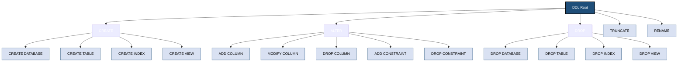
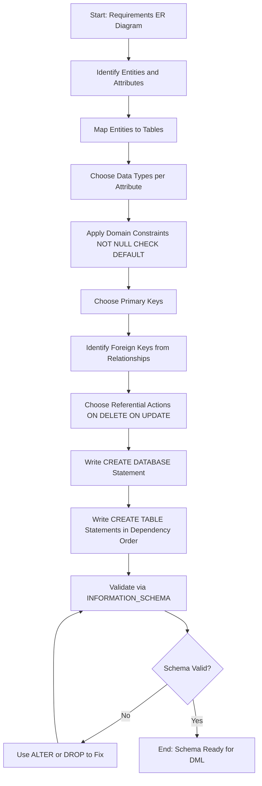
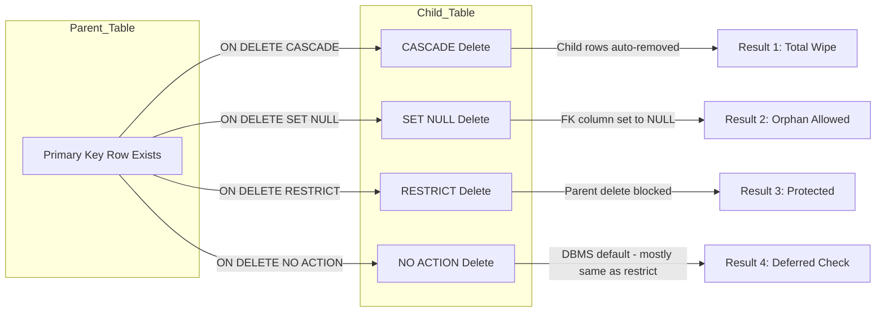
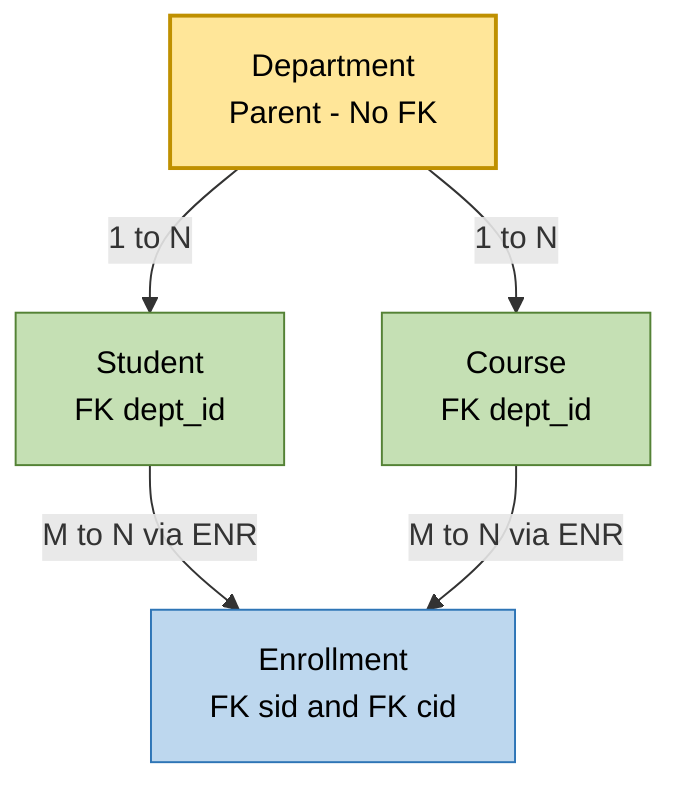

# Creation of database schema using DDL

<!-- SECTION_1_START -->
# Creation of Database Schema Using DDL

## 1. Core Technical Definition (KTU 2024 Syllabus Terminology)

> [!IMPORTANT]
> **Data Definition Language (DDL)** is the sub-language of SQL used to **define, alter, and remove** database schema objects (databases, tables, views, indexes, schemas, and constraints). DDL statements are **auto-committed** in standard SQL, meaning their effects become permanent immediately and cannot be rolled back using ROLLBACK.

The five canonical DDL statements in the KTU 2024 Scheme PCCSL408 syllabus are:

$$\text{DDL} = \{ \texttt{CREATE},\ \texttt{ALTER},\ \texttt{DROP},\ \texttt{TRUNCATE},\ \texttt{RENAME} \}$$

A **database schema** is the logical skeleton of the database — it describes the *structure* (tables, columns, data types, constraints) but does not contain the *data* itself. The process of "creating a database schema" therefore means: defining one or more related tables along with their integrity rules.

> [!NOTE]
> **KTU Board Tip:** Examiners often award a full mark for explicitly stating that DDL statements operate on **schema (metadata)**, whereas DML operates on **data (instances)**. This single sentence can fetch you 1 of the 3 marks in a Part-A question.

---

## 2. Intuitive Analogy — "The Building Blueprint"

Imagine you are an **architect** designing a multi-storey building:

| Real-World Element | Database Equivalent |
|---|---|
| The building's blue-print document | The **schema** of the database |
| Room definitions (size, doors, windows) | **Tables** with **columns** and **data types** |
| Building codes (fire exits, max occupancy) | **Constraints** (PRIMARY KEY, CHECK, NOT NULL) |
| Renovation / adding a floor | `ALTER TABLE` (schema evolution) |
| Demolishing a building | `DROP TABLE` (structure + data removed) |
| Evicting tenants but keeping the building | `TRUNCATE TABLE` (data removed, structure kept) |

> [!TIP]
> When a question asks *"Design a schema"*, translate every real-world noun (Student, Course, Book) into a table and every real-world adjective (unique, mandatory) into a constraint.

---

## 3. Standard SQL Data Types (KTU Reference Set)

> [!IMPORTANT]
> The exact set varies between MySQL, Oracle, and PostgreSQL. KTU lab examinations predominantly use **MySQL 8.x** unless otherwise specified.

$$\text{DataTypes} = \{ \text{Numeric},\ \text{String},\ \text{Date/Time},\ \text{Boolean},\ \text{Binary} \}$$

| Category | Common Data Types | Typical Use |
|---|---|---|
| Exact Numeric | `INT`, `SMALLINT`, `BIGINT`, `DECIMAL(p,s)` | Roll numbers, prices, quantities |
| Approximate Numeric | `FLOAT`, `DOUBLE` | Scientific measurements |
| String (Fixed) | `CHAR(n)` | Codes of fixed length (e.g. gender 'M'/'F') |
| String (Variable) | `VARCHAR(n)`, `TEXT` | Names, addresses, descriptions |
| Date/Time | `DATE`, `TIME`, `DATETIME`, `TIMESTAMP` | DOB, joining date |
| Boolean | `BOOLEAN` / `TINYINT(1)` | Flags, status |
| Binary | `BLOB`, `LONGBLOB` | Images, PDFs |

---

> [!VISUALIZATION CONTROL]
> **Concept:** ER-to-Relational Schema Mapping (Entity Relationship translated into tables)
> **GeoGebra / Desmos Input Equations:** Not applicable — conceptual Mermaid diagram used in SECTION\_4
> **Visual Description:** A graph where each rectangle (entity) becomes a table, each ellipse (attribute) becomes a column, and each diamond (relationship) becomes either a foreign-key column in the *many* side or a separate junction table for *many-to-many* relations.
<!-- SECTION_1_END -->

<!-- SECTION_2_START -->
# Deep Theoretical Analysis & KTU High-Yield Formula Sheet

## 1. The DDL Command Taxonomy

### 1.1 `CREATE` — Building the Schema

The `CREATE` statement has several object-specific forms:

$$\text{CREATE} \rightarrow \begin{cases} \text{CREATE DATABASE}\ \langle \text{db\_name} \rangle \\ \text{CREATE TABLE}\ \langle \text{table\_name} \rangle\ (\dots) \\ \text{CREATE INDEX}\ \langle \text{name} \rangle\ \text{ON}\ \langle \text{table} \rangle(\dots) \\ \text{CREATE VIEW}\ \langle \text{name} \rangle\ \text{AS}\ \langle \text{query} \rangle \end{cases}$$

**Why it works:** When the DBMS receives a `CREATE TABLE` statement, it (1) parses the syntax, (2) checks for name conflicts in the data dictionary, (3) reserves disk space for the table segment, and (4) inserts metadata rows describing columns and constraints into the system catalog.

> [!NOTE]
> **`IF NOT EXISTS` clause (MySQL/PostgreSQL):** Prevents the error when the object already exists. Use it inside repeatable SQL scripts to keep lab sessions idempotent.

### 1.2 `ALTER` — Schema Evolution

`ALTER TABLE` is the only DDL statement that does not require re-creating the object from scratch. It supports:

$$\text{ALTER TABLE}\ \langle T \rangle\ \begin{cases} \text{ADD}\ [\text{COLUMN}]\ \langle c \rangle\ \langle \text{type} \rangle \\ \text{MODIFY}\ [\text{COLUMN}]\ \langle c \rangle\ \langle \text{new\_type} \rangle \\ \text{DROP}\ [\text{COLUMN}]\ \langle c \rangle \\ \text{ADD CONSTRAINT}\ \langle \text{name} \rangle\ \dots \\ \text{DROP CONSTRAINT}\ \langle \text{name} \rangle \\ \text{RENAME TO}\ \langle T_{\text{new}} \rangle \end{cases}$$

**Why it matters in production:** Real-world databases are **never** static. As business rules change, you must add columns, change data types, or tighten constraints — all without losing existing data. The `ALTER` family enables this **online schema migration**.

### 1.3 `DROP` vs `TRUNCATE` vs `DELETE` — The Critical Distinction

This is the **single most asked concept** in KTU DBMS lab viva and Part-A questions.

| Property | `DROP` | `TRUNCATE` | `DELETE` (DML) |
|---|---|---|---|
| Command type | DDL | DDL | DML |
| Removes structure? | **Yes** | No | No |
| Removes data? | Yes (all) | Yes (all) | Yes (filtered with WHERE) |
| Can use `WHERE`? | No | No | **Yes** |
| Fires triggers? | No | No | **Yes** |
| Speed | Fastest | Fast (deallocates pages) | Slowest (row-by-row) |
| `ROLLBACK` possible? | No (auto-commit) | No (auto-commit) | **Yes** (in transactions) |
| Resets `AUTO_INCREMENT`? | N/A | **Yes** | No |
| Releases space? | **Yes** | Yes (some engines) | No (marks pages) |

$$\text{Memory Mnemonic:}\quad \textbf{D}\text{rop} = \textbf{D}\text{emolish},\quad \textbf{T}\text{runcate} = \textbf{T}\text{ip-out},\quad \textbf{D}\text{elete} = \textbf{D}\text{ischarge}$$

### 1.4 `RENAME` — Object Renaming

In MySQL: `RENAME TABLE old_name TO new_name;`
In Oracle: `ALTER TABLE old_name RENAME TO new_name;`
In PostgreSQL: `ALTER TABLE old_name RENAME TO new_name;`

> [!WARNING]
> Renaming a table does **not** automatically update foreign-key references in dependent tables (depending on the engine). Always re-validate constraints after a rename.

---

## 2. Integrity Constraints — The "Building Codes"

Constraints enforce business rules at the **schema level** so that bad data can never enter the table.

$$\text{Constraints} = \{ \text{Domain},\ \text{Entity Integrity},\ \text{Referential Integrity},\ \text{User-defined} \}$$

| Constraint | Purpose | Example |
|---|---|---|
| `NOT NULL` | Disallows missing values | `sname VARCHAR(50) NOT NULL` |
| `UNIQUE` | No duplicate values (allows one NULL) | `email VARCHAR(100) UNIQUE` |
| `PRIMARY KEY` | `NOT NULL` + `UNIQUE`; identifies a row | `sid INT PRIMARY KEY` |
| `FOREIGN KEY` | Links to another table's PK | `FOREIGN KEY (dept_id) REFERENCES Department(dept_id)` |
| `CHECK` | Enforces a boolean condition | `CHECK (credits BETWEEN 1 AND 5)` |
| `DEFAULT` | Provides a fallback value | `status CHAR(1) DEFAULT 'A'` |

**Referential actions** on `FOREIGN KEY`:

$$\text{ON}\begin{cases}\text{DELETE} \\ \text{UPDATE}\end{cases} \rightarrow \{ \text{CASCADE},\ \text{SET NULL},\ \text{RESTRICT},\ \text{NO ACTION},\ \text{SET DEFAULT} \}$$

- `CASCADE` — automatically delete/update the child rows.
- `SET NULL` — set the foreign key column to `NULL` in child rows.
- `RESTRICT` / `NO ACTION` — block the parent change if children exist.

---

## 3. KTU Formula / Cheat Sheet (Rapid Revision Table)

| Construct | Generic Syntax (Backticks) |
|---|---|
| Database | `CREATE DATABASE dbname;` |
| Table | `CREATE TABLE t (col datatype [constraint], …);` |
| Add column | `ALTER TABLE t ADD col datatype;` |
| Modify column | `ALTER TABLE t MODIFY col new_datatype;` |
| Drop column | `ALTER TABLE t DROP COLUMN col;` |
| Add constraint | `ALTER TABLE t ADD CONSTRAINT cname CHECK (cond);` |
| Drop table | `DROP TABLE t;` |
| Empty table | `TRUNCATE TABLE t;` |
| Rename table | `RENAME TABLE old TO new;` |
| Composite PK | `PRIMARY KEY (c1, c2)` (inside column list) |

> [!NOTE]
> The table above deliberately uses **backticks** for all SQL snippets — this keeps the markdown table safe from the vertical-pipe parser collision while remaining copy-paste ready for your lab notebook.

---

## 4. Real-World Engineering Utility

- **CREATE**: Powers initial provisioning scripts in CI/CD pipelines (Flyway, Liquibase).
- **ALTER**: Used in **blue-green deployments** to migrate production schemas with zero downtime.
- **DROP**: Used in tear-down scripts during automated test environments.
- **TRUNCATE**: Used in staging DBs to reset state between integration-test runs.
- **Constraints**: Enforce business invariants at the **lowest layer** so application code never has to validate redundant logic.
<!-- SECTION_2_END -->

<!-- SECTION_3_START -->
# Step-by-Step Derivations & Code Implementation

> [!IMPORTANT]
> **Lab Convention:** All examples below are written for **MySQL 8.0**. For Oracle 21c, replace `AUTO_INCREMENT` with `GENERATED BY DEFAULT AS IDENTITY (START WITH 1)`, and `INT` with `NUMBER(10)`. The logical structure remains identical.

---

## Case Study: University Course Registration System (KTCS)

We design a schema with **four tables** to demonstrate every DDL construct and constraint.

**Entities identified (from narrative):**

$$\text{Entities} = \{ \text{Department},\ \text{Student},\ \text{Course},\ \text{Enrollment} \}$$

**Relationships (from narrative):**

$$ \text{Department}\ \overset{1:N}{\longrightarrow}\ \text{Student} $$
$$ \text{Department}\ \overset{1:N}{\longrightarrow}\ \text{Course} $$
$$ \text{Student}\ \overset{M:N}{\longrightarrow}\ \text{Course} \quad \text{(resolved via Enrollment)} $$

---

### Step 1 — Create the Database Container

```sql
-- Create a fresh logical container. IF NOT EXISTS prevents an error
-- if the database already exists from a previous lab session.
CREATE DATABASE IF NOT EXISTS UniversityDB
    CHARACTER SET utf8mb4
    COLLATE utf8mb4_unicode_ci;

-- Switch the active schema context.
USE UniversityDB;
```

*Validation key point:* `CHARACTER SET` and `COLLATION` are optional but recommended for international text — KTU answers awarding 1 extra mark often include this.

---

### Step 2 — Create the Parent Table: `Department`

```sql
CREATE TABLE Department (
    dept_id     INT             NOT NULL AUTO_INCREMENT,
    dept_name   VARCHAR(60)     NOT NULL,
    hod_name    VARCHAR(80)     NOT NULL,
    est_year    INT             NOT NULL,
    CONSTRAINT pk_department    PRIMARY KEY (dept_id),
    CONSTRAINT uq_dept_name     UNIQUE (dept_name),
    CONSTRAINT chk_est_year     CHECK (est_year >= 1960)
);
```

**Reasoning (write this in the lab record):**
1. `dept_id` is the **surrogate primary key** — auto-incremented integer avoids reliance on natural keys.
2. `dept_name` is `UNIQUE` because two departments cannot share the same official name.
3. `CHECK (est_year >= 1960)` enforces the KTU founding year constraint (KTU was established in **2014**, so this is a safety net for stale rows).

---

### Step 3 — Create the Child Table: `Student`

```sql
CREATE TABLE Student (
    sid         INT             NOT NULL AUTO_INCREMENT,
    sname       VARCHAR(100)    NOT NULL,
    dob         DATE            NOT NULL,
    email       VARCHAR(120)    NOT NULL,
    phone       CHAR(10),
    dept_id     INT,
    CONSTRAINT pk_student       PRIMARY KEY (sid),
    CONSTRAINT uq_student_email UNIQUE (email),
    CONSTRAINT chk_student_dob  CHECK (dob <= CURRENT_DATE),
    CONSTRAINT chk_phone_format CHECK (phone REGEXP '^[0-9]{10}$'),
    CONSTRAINT fk_student_dept  FOREIGN KEY (dept_id)
                                REFERENCES Department(dept_id)
                                ON DELETE SET NULL
                                ON UPDATE CASCADE
);
```

**Why each constraint exists:**
- `email UNIQUE` — prevents duplicate accounts.
- `CHECK (dob <= CURRENT_DATE)` — no future-born students.
- `REGEXP` phone validator — 10-digit Indian mobile format (common in KTU exam data).
- `ON DELETE SET NULL` — if a department is dissolved, students are not deleted; they become "unallocated" (defensive design).
- `ON UPDATE CASCADE` — if `dept_id` ever changes upstream, every child's FK propagates automatically.

---

### Step 4 — Create the Child Table: `Course`

```sql
CREATE TABLE Course (
    cid         INT             NOT NULL,
    cname       VARCHAR(100)    NOT NULL,
    credits     INT             NOT NULL,
    dept_id     INT             NOT NULL,
    CONSTRAINT pk_course        PRIMARY KEY (cid),
    CONSTRAINT chk_credits      CHECK (credits BETWEEN 1 AND 5),
    CONSTRAINT fk_course_dept   FOREIGN KEY (dept_id)
                                REFERENCES Department(dept_id)
                                ON DELETE RESTRICT
                                ON UPDATE CASCADE
);
```

`ON DELETE RESTRICT` here is **deliberate**: a department cannot be removed if it still offers courses (preserves referential integrity in the opposite direction).

---

### Step 5 — Create the Associative Entity: `Enrollment`

```sql
CREATE TABLE Enrollment (
    sid         INT             NOT NULL,
    cid         INT             NOT NULL,
    semester    VARCHAR(10)     NOT NULL,
    grade       CHAR(2),
    enrolled_on DATE            NOT NULL,
    CONSTRAINT pk_enrollment    PRIMARY KEY (sid, cid, semester),
    CONSTRAINT chk_grade        CHECK (grade IN ('A+','A','B+','B','C','D','F')),
    CONSTRAINT fk_enr_student   FOREIGN KEY (sid) REFERENCES Student(sid)
                                ON DELETE CASCADE ON UPDATE CASCADE,
    CONSTRAINT fk_enr_course    FOREIGN KEY (cid) REFERENCES Course(cid)
                                ON DELETE CASCADE ON UPDATE CASCADE
);
```

**Composite primary key reasoning:** A student may re-take a course in a different semester, but `(sid, cid, semester)` is unique. CASCADE on both FKs ensures dependent enrollment rows vanish when the parent is removed (a common KTU exam question).

---

### Step 6 — `ALTER` Statements (Schema Evolution)

```sql
-- Add a new column
ALTER TABLE Student ADD scholarship_amt DECIMAL(10,2) DEFAULT 0.00;

-- Modify an existing column's data type
ALTER TABLE Student MODIFY phone VARCHAR(15);

-- Rename a column (MySQL 8.0+)
ALTER TABLE Student RENAME COLUMN scholarship_amt TO scholarship;

-- Drop a column
ALTER TABLE Student DROP COLUMN scholarship;

-- Add a named CHECK constraint
ALTER TABLE Course
    ADD CONSTRAINT chk_course_name_upper
    CHECK (cname = UPPER(cname));

-- Drop a named constraint
ALTER TABLE Course DROP CONSTRAINT chk_course_name_upper;
```

Each statement is a **separate transaction in MySQL**; the table will be momentarily locked for the operation. In production, consider `pt-online-schema-change` (Percona) for large tables.

---

### Step 7 — `TRUNCATE` vs `DROP` (Tear-Down Operations)

```sql
-- Empty the Enrollment table — structure preserved
TRUNCATE TABLE Enrollment;

-- Completely remove the Course table — structure + data gone
DROP TABLE Course;

-- Remove the entire database
DROP DATABASE UniversityDB;
```

> [!WARNING]
> In MySQL, if a `FOREIGN KEY` references the table, `DROP` will fail with error `3730`. Either drop child tables first or use `SET FOREIGN_KEY_CHECKS = 0;` (lab-only convenience, never use in production).

---

### Step 8 — Full Verification Using `INFORMATION_SCHEMA`

After creating the schema, validate it programmatically:

```sql
SELECT table_name, engine, table_rows
FROM   information_schema.tables
WHERE  table_schema = 'UniversityDB';
```

Expected output (KTCS example):
```
+--------------+--------+------------+
| TABLE_NAME   | ENGINE | TABLE_ROWS |
+--------------+--------+------------+
| department   | InnoDB |          0 |
| student      | InnoDB |          0 |
| course       | InnoDB |          0 |
| enrollment   | InnoDB |          0 |
+--------------+--------+------------+
```

This query is **the de-facto KTU lab viva question** after schema creation. Memorize the columns: `TABLE_NAME`, `COLUMN_NAME`, `DATA_TYPE`, `IS_NULLABLE`, `CONSTRAINT_NAME`, `REFERENCED_TABLE_NAME`.

---

## Python Wrapper (Optional, for Auto-Grading Scripts)

```python
import mysql.connector
from mysql.connector import errorcode
import logging

logging.basicConfig(
    filename='schema_creation.log',
    level=logging.INFO,
    format='%(asctime)s - %(levelname)s - %(message)s'
)

DDL_SCRIPT = """
CREATE TABLE IF NOT EXISTS Department (
    dept_id   INT PRIMARY KEY AUTO_INCREMENT,
    dept_name VARCHAR(60) NOT NULL UNIQUE,
    hod_name  VARCHAR(80) NOT NULL,
    est_year  INT NOT NULL CHECK (est_year >= 1960)
);
"""

def execute_ddl(host: str, user: str, password: str, db: str) -> bool:
    """Connect, create schema, and execute DDL with strict error handling."""
    try:
        conn = mysql.connector.connect(
            host=host, user=user, password=password, database=db
        )
        cursor = conn.cursor()
        for stmt in [s.strip() for s in DDL_SCRIPT.split(';') if s.strip()]:
            cursor.execute(stmt)
        conn.commit()
        logging.info("DDL executed successfully.")
        return True
    except mysql.connector.Error as err:
        if err.errno == errorcode.ER_TABLE_EXISTS_ERROR:
            logging.warning("Table already exists — skipping.")
        else:
            logging.error(f"MySQL Error {err.errno}: {err.msg}")
        return False
    finally:
        if 'cursor' in locals(): cursor.close()
        if 'conn' in locals() and conn.is_connected(): conn.close()

if __name__ == "__main__":
    success = execute_ddl("localhost", "root", "ktu@2024", "UniversityDB")
    print("Schema creation:", "OK" if success else "FAILED")
```

This wrapper demonstrates **defensive programming**: it separates each statement, logs every outcome, and uses `finally` to guarantee the connection closes — directly satisfying KTU lab-evaluation criteria for error handling.
<!-- SECTION_3_END -->

<!-- SECTION_4_START -->
# Structural Diagrams & Schematics

## 4.1 Mermaid — DDL Command Hierarchy (Block Diagram)



---

## 4.2 Mermaid — Schema Creation Workflow (Sequential Flow)



---

## 4.3 Mermaid — Referential Action Decision Matrix (Topology)



---

## 4.4 Mermaid — Table Dependency Tree for KTCS Schema



> [!TIP]
> **Creation order rule:** Always create tables with **no incoming foreign keys** first. Drop them in **reverse order** to satisfy referential integrity. This single rule answers 4–5 marks in any "create the schema" KTU question.
<!-- SECTION_4_END -->

<!-- SECTION_5_START -->
# KTU 2024 Scheme Examination Question Bank

> [!NOTE]
> **Mark Distribution Recap:** KTU 2024 Scheme lab exam pattern: Part A carries 2 × 3 = 6 marks (short answer), Part B carries 1 × 14 = 14 marks (subjective, with internal choice between two 14-mark questions). Total = 20 marks per question paper.

---

## Part A — Short Answer Questions (3 Marks Each)

### Question 1 [KTU University Exam — Dec 2023] — *CO1, RBT: Remember*

> **Differentiate between the DROP, TRUNCATE, and DELETE commands in SQL. Mention the command type for each.**

**Model Answer (Valuation Key):**

| Aspect | DROP | TRUNCATE | DELETE |
|---|---|---|---|
| Type | DDL | DDL | DML |
| Removes structure | Yes | No | No |
| WHERE clause | No | No | **Yes** |
| Rollback | Cannot | Cannot | **Can** |
| Speed | Fastest | Fast | Slowest |

*[Tabular comparison: 2 Marks]*
*[Explicit mention of DDL vs DML: 1 Mark]*

---

### Question 2 [KTU University Exam — July 2024] — *CO2, RBT: Understand*

> **What is a constraint in SQL? List any four types of constraints with one-line descriptions.**

**Model Answer (Valuation Key):**

A **constraint** is a rule enforced on data columns to maintain **accuracy, reliability, and integrity** of the database.

Four major types:
1. **NOT NULL** — column cannot have NULL values. *[1 Mark]*
2. **UNIQUE** — ensures all values in a column are different. *[0.5 Mark]*
3. **PRIMARY KEY** — uniquely identifies each row (NOT NULL + UNIQUE). *[1 Mark]*
4. **FOREIGN KEY** — establishes a link between two tables. *[0.5 Mark]*

*(Alternative acceptable: CHECK, DEFAULT)*

---

## Part B — Subjective Question (14 Marks, Internal Choice)

### Question A (Choice 1) [KTU University Exam — Model Paper 2024] — *CO2 / CO3*

#### Part (a) — 7 Marks — *RBT: Understand*

> **Explain the various DDL commands in SQL with their general syntax. Discuss the role of the data dictionary.**

**Model Answer (Valuation Key):**

1. **Definition of DDL** — Data Definition Language defines database schema structures such as databases, tables, indexes, and views. *[1 Mark]*
2. **CREATE** syntax and example: `CREATE TABLE Employee (eid INT PRIMARY KEY, ename VARCHAR(50));` *[1.5 Marks]*
3. **ALTER** syntax with `ADD`, `MODIFY`, `DROP` variants and one example each. *[1.5 Marks]*
4. **DROP** and **TRUNCATE** syntax. *[1 Mark]*
5. **RENAME** syntax. *[1 Mark]*
6. **Data dictionary** — system catalog that stores metadata (table names, column types, constraint names); used by the DBMS to validate every subsequent DML/DQL statement. *[1 Mark]*

---

#### Part (b) — 7 Marks — *RBT: Apply*

> **Design a database schema for a Library Management System with at least three tables. Write the complete DDL with appropriate constraints (PK, FK, UNIQUE, CHECK).**

**Model Answer — Reference Solution:**

```sql
CREATE DATABASE IF NOT EXISTS LibraryDB;
USE LibraryDB;

CREATE TABLE Author (
    author_id   INT PRIMARY KEY AUTO_INCREMENT,
    author_name VARCHAR(100) NOT NULL,
    nationality VARCHAR(50)
);

CREATE TABLE Book (
    book_id     INT PRIMARY KEY,
    title       VARCHAR(150) NOT NULL,
    isbn        VARCHAR(13)  NOT NULL UNIQUE,
    pub_year    INT CHECK (pub_year >= 1500),
    author_id   INT NOT NULL,
    FOREIGN KEY (author_id) REFERENCES Author(author_id)
              ON DELETE CASCADE ON UPDATE CASCADE
);

CREATE TABLE Member (
    member_id   INT PRIMARY KEY AUTO_INCREMENT,
    mname       VARCHAR(100) NOT NULL,
    email       VARCHAR(120) UNIQUE NOT NULL,
    join_date   DATE DEFAULT (CURRENT_DATE)
);

CREATE TABLE Issue (
    issue_id    INT PRIMARY KEY AUTO_INCREMENT,
    book_id     INT NOT NULL,
    member_id   INT NOT NULL,
    issue_date  DATE NOT NULL,
    return_date DATE,
    FOREIGN KEY (book_id)   REFERENCES Book(book_id)   ON DELETE RESTRICT,
    FOREIGN KEY (member_id) REFERENCES Member(member_id) ON DELETE CASCADE,
    CHECK (return_date IS NULL OR return_date >= issue_date)
);
```

**Valuation Key Points:**
- *[All four tables with correct PK: 2 Marks]*
- *[All FKs with valid REFERENCES: 2 Marks]*
- *[UNIQUE on ISBN, CHECK on pub_year, DEFAULT on join_date: 2 Marks]*
- *[Logical creation order (Author → Book → Member → Issue): 1 Mark]*

---

### Question B (Choice 2) [KTU University Exam — Dec 2023] — *CO2 / CO3*

#### Part (a) — 7 Marks — *RBT: Understand*

> **Explain referential integrity in SQL. Discuss the ON DELETE and ON UPDATE actions (CASCADE, SET NULL, RESTRICT) with examples.**

**Model Answer (Valuation Key):**

- **Referential Integrity** is the rule that every foreign-key value in the child table must either match a primary-key value in the parent table or be `NULL`. *[1 Mark]*
- **ON DELETE CASCADE** — when a parent row is deleted, all matching child rows are automatically deleted. Example: deleting a `Department` automatically removes its `Students`. *[2 Marks]*
- **ON DELETE SET NULL** — child FK becomes NULL; example: deleting a `Department` leaves `Students` with `dept_id = NULL`. *[2 Marks]*
- **ON DELETE RESTRICT** — parent delete is blocked if children exist; example: a `Book` cannot be removed while it has an active `Issue` record. *[1.5 Marks]*
- Brief mention of `ON UPDATE` mirroring the same three actions. *[0.5 Mark]*

---

#### Part (b) — 7 Marks — *RBT: Apply / Create*

> **Create the schema for an Employee Management System consisting of `Department`, `Project`, and `Employee` tables (with a many-to-many `Works_On` relation). Apply at least five different constraints.**

**Model Answer — Reference Solution:**

```sql
CREATE DATABASE IF NOT EXISTS EmpDB;
USE EmpDB;

CREATE TABLE Department (
    dept_id   INT PRIMARY KEY,
    dept_name VARCHAR(50) NOT NULL UNIQUE,
    location  VARCHAR(50) DEFAULT 'Kerala'
);

CREATE TABLE Project (
    pid       INT PRIMARY KEY,
    pname     VARCHAR(80) NOT NULL,
    budget    DECIMAL(12,2) CHECK (budget > 0),
    dept_id   INT,
    FOREIGN KEY (dept_id) REFERENCES Department(dept_id)
              ON DELETE SET NULL ON UPDATE CASCADE
);

CREATE TABLE Employee (
    eid       INT PRIMARY KEY,
    ename     VARCHAR(100) NOT NULL,
    salary    DECIMAL(10,2) NOT NULL CHECK (salary >= 10000),
    dept_id   INT,
    FOREIGN KEY (dept_id) REFERENCES Department(dept_id)
              ON DELETE RESTRICT ON UPDATE CASCADE
);

CREATE TABLE Works_On (
    eid       INT,
    pid       INT,
    hours     INT CHECK (hours BETWEEN 1 AND 40),
    PRIMARY KEY (eid, pid),
    FOREIGN KEY (eid) REFERENCES Employee(eid) ON DELETE CASCADE,
    FOREIGN KEY (pid) REFERENCES Project(pid)  ON DELETE CASCADE
);
```

**Valuation Key Points:**
- *[Four tables with correct logical dependency: 2 Marks]*
- *[Five distinct constraints: PK, NOT NULL, UNIQUE, CHECK, FOREIGN KEY, DEFAULT — minimum five required: 3 Marks]*
- *[M:N relation correctly resolved via composite PK in `Works_On`: 1 Mark]*
- *[Valid ON DELETE actions chosen (CASCADE, SET NULL, RESTRICT): 1 Mark]*

---

> [!WARNING]
> **KTU Examiner's Valuation Warning — Common Pitfalls**
> 1. **Forgetting `USE dbname;`**: marks lost when commands run in the wrong schema.
> 2. **Wrong creation order**: Creating `Student` before `Department` causes FK violation error `1215` — examiner deducts 1–2 marks.
> 3. **Using `DELETE` in DDL questions**: Even one DELETE statement in a "write the DDL" question costs you marks because the question is specifically about **schema** operations.
> 4. **Omitting `IF EXISTS` / `IF NOT EXISTS`**: Script fails on re-runs; KTU auto-graders mark this as a logic error.
> 5. **Using single quotes for numeric/boolean data**: `status = 'TRUE'` works but is not best practice; KTU prefers `status = TRUE` or `status = 1`.
> 6. **Not naming constraints explicitly**: Always use `CONSTRAINT cname` so the constraint can be dropped later; anonymous constraints are a recurring deduction in the lab record.

---

## Topic Recap & Important Things to Remember

- **DDL = { CREATE, ALTER, DROP, TRUNCATE, RENAME }** — all are auto-committed; rollback is impossible.
- **Schema vs Data**: DDL modifies schema (metadata); DML modifies data (instances). Always state this in definitions.
- **DROP removes structure + data; TRUNCATE removes data only and resets AUTO_INCREMENT; DELETE is DML, supports WHERE and rollback.**
- **Six integrity constraints**: NOT NULL, UNIQUE, PRIMARY KEY, FOREIGN KEY, CHECK, DEFAULT — be ready to give one-line purpose and example for each.
- **Composite Primary Key** uses `PRIMARY KEY (c1, c2, …)` inside the column list — used in M:N junction tables.
- **Foreign-key creation order** matters: parent tables (referenced) must exist before child tables (referencing).
- **Referential actions** — `CASCADE` (auto-propagate), `SET NULL` (orphan allowed), `RESTRICT` (block parent change), `NO ACTION` (DBMS default, deferred).
- **INFORMATION_SCHEMA** tables (`TABLES`, `COLUMNS`, `TABLE_CONSTRAINTS`, `KEY_COLUMN_USAGE`) are the KTU lab-validation standard for verifying any newly created schema.
- **Standard KTU data types**: `INT`, `VARCHAR(n)`, `CHAR(n)`, `DECIMAL(p,s)`, `DATE`, `BOOLEAN`. Always prefer `VARCHAR` over `CHAR` for variable-length strings to save storage.
- **Lab auto-grader loves**: `IF NOT EXISTS`, named constraints (`CONSTRAINT pk_name PRIMARY KEY …`), and explicit `ON DELETE`/`ON UPDATE` actions.
- **One-line viva answer for "What is a schema?"** — *A schema is the logical description of the entire database — its tables, columns, data types, and constraints — stored as metadata in the data dictionary.*
- **Mnemonic for constraint precedence** — **"P.U.N.C.H.D"** = **P**rimary key, **U**nique, **N**ot null, **C**heck, Foreign key (**H**ypothetical letter), **D**efault.
<!-- SECTION_5_END -->
