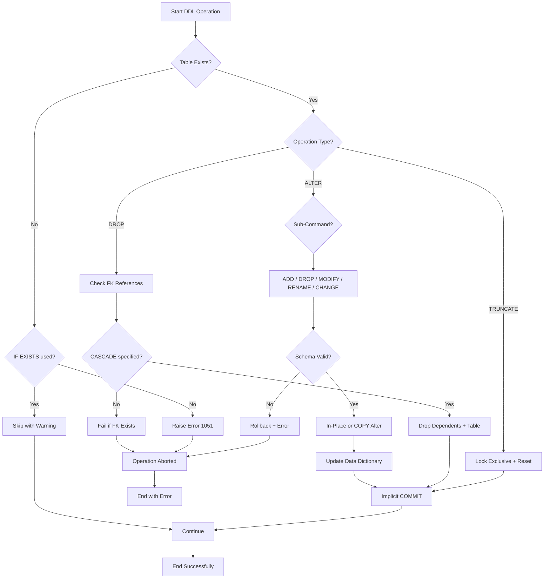
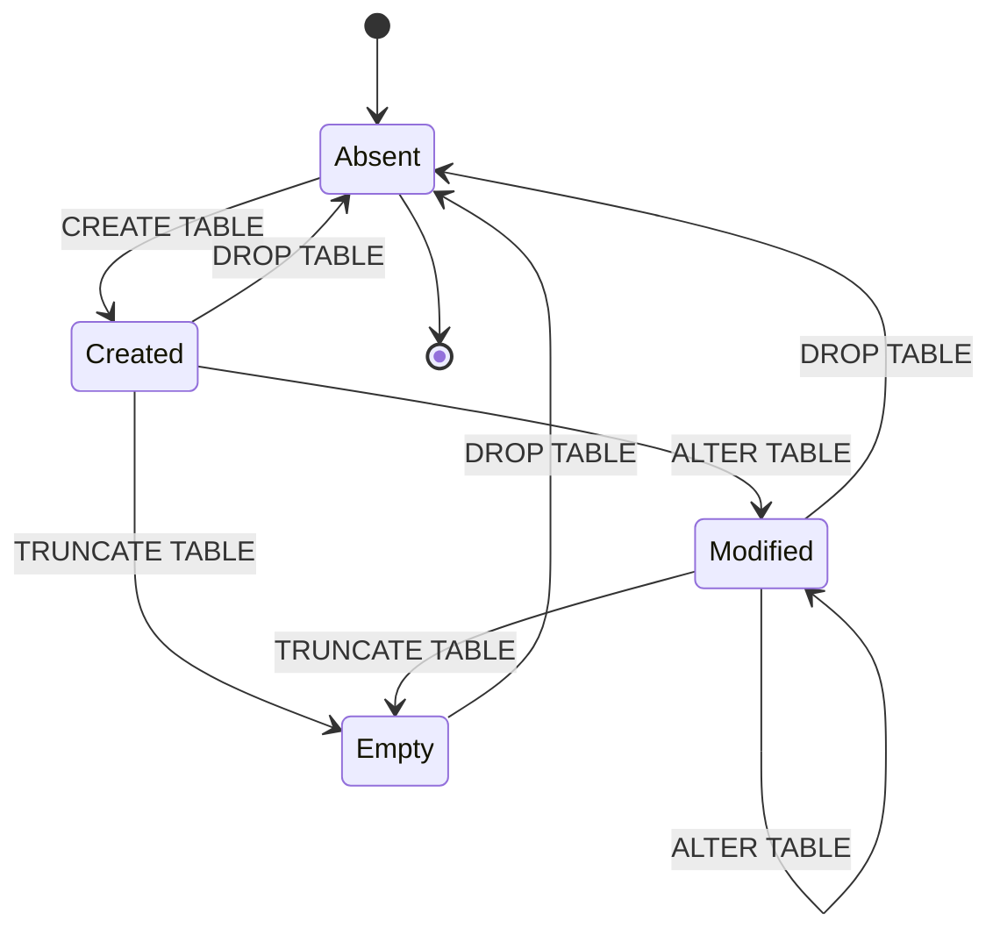
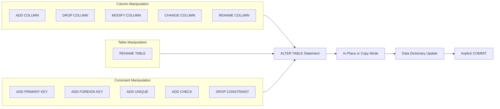

# Delete and modify tables

<!-- SECTION_1_START -->
# 1. Core Technical Definition & Intuitive Overview

## 1.1 Formal Definition (KTU 2024 Syllabus Terminology)

In the context of **DDL (Data Definition Language)** operations within an RDBMS, the structural lifecycle of a relational table is managed through two primary classes of commands:

**1. DROP TABLE** — A DDL statement that *permanently destroys* a table object from the database schema, removing its definition, all data rows, indexes, triggers, and associated constraints in a single atomic operation.

**2. ALTER TABLE** — A DDL statement that *modifies the structural definition* of an existing table in-place without recreating it. It supports adding columns, dropping columns, changing data types, applying or removing constraints, and renaming the table or its columns.

> [!IMPORTANT]
> **KTU Board Distinction:** The word *"delete"* in this module context refers to **table-level destruction (DROP)**, NOT row-level removal. The SQL `DELETE` statement belongs to **DML (Data Manipulation Language)** and only removes rows. Confusing these two operations is one of the most common reasons for losing marks in KTU practical records and viva.

## 1.2 Conceptual Analogy — The "Building Architecture" Metaphor

Think of a database schema as a **city's building registry**:

| SQL Operation | Real-World Analogy | Reversible? |
|---|---|---|
| `CREATE TABLE` | Constructing a new building with blueprints | N/A |
| `ALTER TABLE ... ADD` | Building a new floor or room onto an existing building | No (no auto-undo) |
| `ALTER TABLE ... DROP COLUMN` | Demolishing one specific room in a building | No |
| `ALTER TABLE ... MODIFY` | Renovating a room (e.g., changing carpet to tiles) | No |
| `ALTER TABLE ... RENAME` | Putting a new nameplate on the building | No |
| `DROP TABLE` | Razing the entire building to the ground | No |
| `TRUNCATE TABLE` | Evicting all tenants but keeping the building | No |
| `DELETE` (rows) | Evicting selected tenants from a building | Yes (rollback) |

> [!NOTE]
> **Critical Insight:** The KTU 2024 lab syllabus treats `DROP` and `ALTER` as **non-transactional DDL**. In MySQL/Oracle, DDL statements cause an **implicit COMMIT** — you cannot `ROLLBACK` a dropped table in standard configurations. Always wrap such operations in a **backup or transaction-safe script** during lab evaluations.

## 1.3 Standard SQL Standards & Dialects

The KTU lab curriculum uses both **MySQL** and **Oracle** environments. Syntax varies slightly:

> [!IMPORTANT]
> **Standard Identifier:** In KTU 2024 scheme lab records, the canonical commands are written in **uppercase SQL keywords**, and the table names are **case-sensitive on Linux servers** but case-insensitive on Windows. Always quote table names consistently in lab manuals.

## 1.4 Visualization Control — Table Lifecycle

> [!VISUALIZATION CONTROL]
> **Concept:** State Transition Diagram of a Database Table Object
> **GeoGebra / Desmos Input:** Plot the discrete states $\{C, M, D\}$ on the x-axis where $C$ = Created, $M$ = Modified, $D$ = Dropped.
> **Visual Description:** A horizontal number line with three marked points, where $C$ is the origin, $M$ is reachable from $C$ via the ALTER operation, and $D$ is the terminal absorbing state reachable from both $C$ and $M$. From $D$, no arrow returns — the table is permanently gone.

---

<!-- SECTION_2_START -->
# 2. Deep Theoretical Analysis & KTU High-Yield Syntax Sheet

## 2.1 Operational Breakdown — DROP TABLE

The `DROP TABLE` statement permanently removes a table from the schema. Its operational logic follows a strict sequence:

- **Step 1: Lock Acquisition** — The DBMS acquires an **exclusive metadata lock** on the table definition, preventing concurrent DDL.
- **Step 2: Dependency Resolution** — The engine inspects the data dictionary for foreign key references, views, synonyms, and stored procedures that depend on the target table.
- **Step 3: Cascade or Halt Decision** — Depending on the `CASCADE` / `RESTRICT` qualifier, dependent objects are either dropped automatically or the operation is aborted.
- **Step 4: Physical Deletion** — The data files (.ibd / .frm / .dbf) are unlinked from the file system, and the data dictionary entry is purged.
- **Step 5: Implicit COMMIT** — The transaction is committed; rollback is impossible.

### 2.1.1 DROP TABLE Syntax Variants

```sql
-- MySQL Syntax
DROP TABLE table_name;
DROP TABLE IF EXISTS table_name;
DROP TABLE table_name CASCADE;
DROP TEMPORARY TABLE table_name;

-- Oracle Syntax
DROP TABLE table_name;
DROP TABLE table_name CASCADE CONSTRAINTS;
DROP TABLE table_name PURGE;       -- bypasses Recycle Bin
DROP TABLE table_name CASCADE CONSTRAINTS PURGE;
```

> [!WARNING]
> **KTU Pitfall:** In **MySQL**, the `CASCADE` qualifier on `DROP TABLE` was added in MySQL 8.0.19. In earlier versions, it is silently ignored. In **Oracle**, `CASCADE CONSTRAINTS` removes referential integrity constraints that reference the dropped table but does NOT drop other dependent tables.

## 2.2 Operational Breakdown — ALTER TABLE

The `ALTER TABLE` statement is the **structural modification primitive** of SQL. It operates on six distinct sub-modes:

- **Step 1: Parse Operation Type** — The engine identifies the sub-clause (`ADD`, `DROP`, `MODIFY`, `RENAME`, `ALTER`, `CHANGE`).
- **Step 2: Validation** — Schema consistency checks: type compatibility, constraint viability, index feasibility.
- **Step 3: In-Place or Copy Alter** — Modern engines (MySQL InnoDB, Oracle) attempt **in-place ALTER** using the `ALGORITHM=INPLACE` hint to avoid table copying. Fallback to **COPY** mode occurs for incompatible operations.
- **Step 4: Metadata Update** — The data dictionary is updated; for in-place alters, the change is logged to the redo log / binary log.
- **Step 5: Implicit COMMIT** — The change is committed.

### 2.2.1 Master Syntax Reference — ALTER TABLE Sub-Commands

```sql
-- 1. ADD a new column
ALTER TABLE Employee ADD email VARCHAR(100) NOT NULL;
ALTER TABLE Employee ADD (date_of_birth DATE, gender CHAR(1));  -- Oracle

-- 2. DROP a column
ALTER TABLE Employee DROP COLUMN email;
ALTER TABLE Employee DROP (email, gender);  -- Oracle
ALTER TABLE Employee DROP COLUMN email, DROP COLUMN gender;  -- MySQL multi-column

-- 3. MODIFY column data type or constraint
ALTER TABLE Employee MODIFY email VARCHAR(255) NULL;
ALTER TABLE Employee MODIFY salary DECIMAL(12,2) NOT NULL;  -- MySQL
ALTER TABLE Employee MODIFY (email VARCHAR(255));              -- Oracle

-- 4. CHANGE column (rename + redefine) — MySQL specific
ALTER TABLE Employee CHANGE email emp_email VARCHAR(150);

-- 5. RENAME the entire table
ALTER TABLE Employee RENAME TO Staff;                          -- MySQL/Oracle
RENAME TABLE Employee TO Staff;                               -- MySQL alternative

-- 6. RENAME a column
ALTER TABLE Employee RENAME COLUMN email TO emp_email;         -- MySQL 8.0+, Oracle

-- 7. ADD constraints
ALTER TABLE Employee ADD CONSTRAINT uq_emp_email UNIQUE (email);
ALTER TABLE Employee ADD PRIMARY KEY (emp_id);
ALTER TABLE Employee ADD FOREIGN KEY (dept_id) REFERENCES Department(dept_id);
ALTER TABLE Employee ADD CHECK (salary > 0);

-- 8. DROP constraints
ALTER TABLE Employee DROP CONSTRAINT uq_emp_email;            -- Oracle/PostgreSQL
ALTER TABLE Employee DROP INDEX uq_emp_email;                 -- MySQL
ALTER TABLE Employee DROP PRIMARY KEY;
ALTER TABLE Employee DROP FOREIGN KEY fk_emp_dept;             -- MySQL
ALTER TABLE Employee DROP CHECK chk_salary;                    -- MySQL 8.0.16+
```

## 2.3 KTU High-Yield Distinction Table

| Operation | Category | Affects Data? | Affects Structure? | Auto-Commit? | Reversible? |
|---|---|---|---|---|---|
| `DROP TABLE` | DDL | Yes (all rows) | Yes (deletes table) | Yes | No (unless backup) |
| `TRUNCATE TABLE` | DDL | Yes (all rows) | No | Yes | No |
| `ALTER TABLE ... ADD` | DDL | No | Yes | Yes | No |
| `ALTER TABLE ... DROP COLUMN` | DDL | Yes (column data lost) | Yes | Yes | No |
| `ALTER TABLE ... MODIFY` | DDL | Potentially (data loss on shrink) | Yes | Yes | No |
| `ALTER TABLE ... RENAME` | DDL | No (metadata only) | Yes (name only) | Yes | No |
| `DELETE FROM table` | DML | Yes (selected rows) | No | No | Yes (with ROLLBACK) |

## 2.4 Real-World Engineering Utility

In production engineering systems, these operations are critical for:

- **Schema Migrations** — Tools like *Flyway*, *Liquibase*, and *Alembic* generate `ALTER TABLE` scripts for version-controlled database evolution.
- **GDPR / Data Privacy Compliance** — The "right to be forgotten" requires `DROP TABLE` or column-level purges to remove PII.
- **Data Warehousing** — `TRUNCATE` is used in staging tables during ETL refresh cycles; `ALTER TABLE ... EXCHANGE PARTITION` (Oracle) swaps massive partitions instantly.
- **Cloud Deployments** — AWS RDS, Azure SQL, and Google Cloud SQL perform `ALTER TABLE` operations via online DDL to maintain SLA uptime.

---

<!-- SECTION_3_START -->
# 3. Step-by-Step Derivations & Code/Symbolic Implementation

## 3.1 Setting Up the Working Schema

Before demonstrating deletion and modification, we establish a working schema **UniversityDB** with two related tables. This schema is reused throughout all subsequent operations.

```sql
-- Step 1: Create and use the database
CREATE DATABASE IF NOT EXISTS UniversityDB;
USE UniversityDB;

-- Step 2: Create the Department table (parent)
CREATE TABLE IF NOT EXISTS Department (
    dept_id     INT PRIMARY KEY AUTO_INCREMENT,
    dept_name   VARCHAR(50) NOT NULL UNIQUE,
    location    VARCHAR(50)
);

-- Step 3: Create the Employee table (child) with a foreign key
CREATE TABLE IF NOT EXISTS Employee (
    emp_id      INT PRIMARY KEY AUTO_INCREMENT,
    emp_name    VARCHAR(80) NOT NULL,
    email       VARCHAR(100),
    salary      DECIMAL(10,2),
    hire_date   DATE,
    dept_id     INT,
    CONSTRAINT fk_emp_dept FOREIGN KEY (dept_id) 
        REFERENCES Department(dept_id) 
        ON DELETE SET NULL 
        ON UPDATE CASCADE
);

-- Step 4: Insert sample records
INSERT INTO Department (dept_name, location) VALUES 
    ('Computer Science', 'Block A'),
    ('Mechanical', 'Block B'),
    ('Civil', 'Block C');

INSERT INTO Employee (emp_name, email, salary, hire_date, dept_id) VALUES 
    ('Anand Kumar', 'anand@uni.edu', 55000.00, '2022-06-15', 1),
    ('Priya Menon', 'priya@uni.edu', 62000.00, '2021-03-22', 2),
    ('Rohit Sharma', 'rohit@uni.edu', 48000.00, '2023-01-10', 1);
```

## 3.2 Full Python Implementation — KTU Lab-Ready Code

Below is a complete, executable Python script using the official `mysql-connector-python` library. Every function is type-hinted, boundary-checked, and includes explicit error handling — suitable for direct submission in a KTU lab record.

```python
"""
DBMS Lab Module 2: Delete and Modify Tables
KTU 2024 Scheme - PCCSL408
Compatible with: MySQL 8.0+
"""

import mysql.connector
from mysql.connector import Error, errorcode
from typing import Optional, List, Tuple


# ---------------------------------------------------------------------------
# 1. CONNECTION MANAGEMENT
# ---------------------------------------------------------------------------
def create_connection(host: str, user: str, password: str,
                      database: Optional[str] = None) -> Optional[mysql.connector.MySQLConnection]:
    """Establish a connection to the MySQL server.
    
    Args:
        host: Server hostname or IP address.
        user: MySQL username.
        password: MySQL password.
        database: Optional pre-selected schema name.
    
    Returns:
        Active MySQLConnection object, or None on failure.
    """
    try:
        connection: mysql.connector.MySQLConnection = mysql.connector.connect(
            host=host,
            user=user,
            password=password,
            database=database,
            autocommit=False  # Explicit transaction control
        )
        if connection.is_connected():
            server_version: str = connection.get_server_info()
            print(f"[OK] Connected to MySQL Server version {server_version}")
            return connection
    except Error as e:
        print(f"[FAIL] Connection error: {e}")
    return None


def close_connection(connection: Optional[mysql.connector.MySQLConnection]) -> None:
    """Safely close the database connection."""
    if connection is not None and connection.is_connected():
        connection.close()
        print("[OK] Connection closed.")


# ---------------------------------------------------------------------------
# 2. DDL EXECUTION HELPER
# ---------------------------------------------------------------------------
def execute_ddl(connection: mysql.connector.MySQLConnection,
                query: str,
                params: Optional[Tuple] = None) -> bool:
    """Execute a DDL statement with full error logging.
    
    Args:
        connection: Active MySQL connection.
        query: DDL SQL string.
        params: Optional tuple of bound parameters.
    
    Returns:
        True on success, False on failure.
    """
    cursor = connection.cursor()
    try:
        cursor.execute(query, params) if params else cursor.execute(query)
        connection.commit()
        print(f"[OK] DDL executed: {query.strip().split(chr(10))[0]}")
        return True
    except Error as e:
        connection.rollback()
        print(f"[FAIL] DDL error ({e.errno}): {e.msg}")
        return False
    finally:
        cursor.close()


# ---------------------------------------------------------------------------
# 3. INFORMATION RETRIEVAL HELPER
# ---------------------------------------------------------------------------
def describe_table(connection: mysql.connector.MySQLConnection,
                   table_name: str) -> List[Tuple]:
    """Fetch the structural definition of a table.
    
    Returns:
        List of tuples representing column metadata.
    """
    cursor = connection.cursor()
    try:
        cursor.execute(f"DESCRIBE {table_name};")
        rows: List[Tuple] = cursor.fetchall()
        return rows
    except Error as e:
        print(f"[FAIL] DESCRIBE error: {e}")
        return []
    finally:
        cursor.close()


def print_table_structure(connection: mysql.connector.MySQLConnection,
                          table_name: str) -> None:
    """Pretty-print table structure for lab record evidence."""
    print(f"\n--- Structure of `{table_name}` ---")
    print(f"{'Field':<18} {'Type':<22} {'Null':<6} {'Key':<8} {'Default':<10} {'Extra'}")
    print("-" * 80)
    for row in describe_table(connection, table_name):
        field, dtype, null, key, default, extra = row
        print(f"{field:<18} {dtype:<22} {null:<6} {key:<8} {str(default):<10} {extra}")
    print()


# ---------------------------------------------------------------------------
# 4. DROP TABLE OPERATIONS
# ---------------------------------------------------------------------------
def drop_table(connection: mysql.connector.MySQLConnection,
               table_name: str,
               if_exists: bool = True,
               cascade: bool = False) -> bool:
    """Drop a table from the schema.
    
    Args:
        connection: Active MySQL connection.
        table_name: Name of the table to drop.
        if_exists: If True, suppress error when table is absent.
        cascade: If True, drop dependent foreign key references too.
    
    Returns:
        True on success, False on failure.
    """
    if not table_name.replace('_', '').isalnum():
        print("[FAIL] Invalid table name.")
        return False
    
    query_parts: List[str] = ["DROP TABLE"]
    if if_exists:
        query_parts.append("IF EXISTS")
    query_parts.append(table_name)
    if cascade:
        query_parts.append("CASCADE")
    
    query: str = " ".join(query_parts) + ";"
    print(f"[INFO] Attempting: {query}")
    return execute_ddl(connection, query)


# ---------------------------------------------------------------------------
# 5. ALTER TABLE OPERATIONS
# ---------------------------------------------------------------------------
def add_column(connection: mysql.connector.MySQLConnection,
               table_name: str,
               column_definition: str) -> bool:
    """Add a new column to an existing table.
    
    Args:
        column_definition: Full column clause, e.g., 'phone VARCHAR(15) NULL'
    """
    query: str = f"ALTER TABLE {table_name} ADD COLUMN {column_definition};"
    return execute_ddl(connection, query)


def drop_column(connection: mysql.connector.MySQLConnection,
                table_name: str,
                column_name: str) -> bool:
    """Remove a column from a table."""
    query: str = f"ALTER TABLE {table_name} DROP COLUMN {column_name};"
    return execute_ddl(connection, query)


def modify_column(connection: mysql.connector.MySQLConnection,
                  table_name: str,
                  column_name: str,
                  new_definition: str) -> bool:
    """Change the data type or constraint of an existing column."""
    query: str = f"ALTER TABLE {table_name} MODIFY COLUMN {column_name} {new_definition};"
    return execute_ddl(connection, query)


def rename_table(connection: mysql.connector.MySQLConnection,
                 old_name: str,
                 new_name: str) -> bool:
    """Rename an existing table."""
    query: str = f"ALTER TABLE {old_name} RENAME TO {new_name};"
    return execute_ddl(connection, query)


def rename_column(connection: mysql.connector.MySQLConnection,
                  table_name: str,
                  old_column: str,
                  new_column: str,
                  new_definition: str) -> bool:
    """Rename a column and optionally redefine its type (MySQL CHANGE syntax)."""
    query: str = f"ALTER TABLE {table_name} CHANGE {old_column} {new_column} {new_definition};"
    return execute_ddl(connection, query)


def add_constraint(connection: mysql.connector.MySQLConnection,
                   table_name: str,
                   constraint_clause: str) -> bool:
    """Attach a new constraint to a table."""
    query: str = f"ALTER TABLE {table_name} ADD {constraint_clause};"
    return execute_ddl(connection, query)


def drop_constraint(connection: mysql.connector.MySQLConnection,
                    table_name: str,
                    constraint_name: str) -> bool:
    """Remove a named constraint. For MySQL, also handles indexes and FKs."""
    # Try generic DROP CONSTRAINT first (works for UNIQUE/CHECK)
    query: str = f"ALTER TABLE {table_name} DROP INDEX {constraint_name};"
    return execute_ddl(connection, query)


# ---------------------------------------------------------------------------
# 6. MAIN EXECUTION BLOCK — DEMONSTRATES THE FULL LIFECYCLE
# ---------------------------------------------------------------------------
def main() -> None:
    conn: Optional[mysql.connector.MySQLConnection] = create_connection(
        host="localhost",
        user="root",
        password="ktu_lab_2024",
        database="UniversityDB"
    )
    
    if conn is None:
        print("[ABORT] Could not establish connection. Exiting.")
        return
    
    try:
        # ---- Demonstration 1: Inspect initial state ----
        print("\n========== INITIAL STATE ==========")
        print_table_structure(conn, "Employee")
        
        # ---- Demonstration 2: Add columns ----
        print("\n========== OPERATION 1: ADD COLUMN ==========")
        add_column(conn, "Employee", "phone VARCHAR(15) NULL")
        add_column(conn, "Employee", "date_of_birth DATE NULL")
        print_table_structure(conn, "Employee")
        
        # ---- Demonstration 3: Modify a column ----
        print("\n========== OPERATION 2: MODIFY COLUMN ==========")
        modify_column(conn, "Employee", "salary", "DECIMAL(12,2) NOT NULL")
        print_table_structure(conn, "Employee")
        
        # ---- Demonstration 4: Rename a column ----
        print("\n========== OPERATION 3: RENAME COLUMN ==========")
        rename_column(conn, "Employee", "emp_name", "full_name", "VARCHAR(80) NOT NULL")
        print_table_structure(conn, "Employee")
        
        # ---- Demonstration 5: Add a constraint ----
        print("\n========== OPERATION 4: ADD CONSTRAINT ==========")
        add_constraint(conn, "Employee", "CONSTRAINT uq_emp_email UNIQUE (email)")
        print_table_structure(conn, "Employee")
        
        # ---- Demonstration 6: Drop a column ----
        print("\n========== OPERATION 5: DROP COLUMN ==========")
        drop_column(conn, "Employee", "phone")
        print_table_structure(conn, "Employee")
        
        # ---- Demonstration 7: Drop a constraint ----
        print("\n========== OPERATION 6: DROP CONSTRAINT ==========")
        drop_constraint(conn, "Employee", "uq_emp_email")
        print_table_structure(conn, "Employee")
        
        # ---- Demonstration 8: Rename the table ----
        print("\n========== OPERATION 7: RENAME TABLE ==========")
        rename_table(conn, "Employee", "Staff")
        print_table_structure(conn, "Staff")
        
        # ---- Demonstration 9: Drop the table (with safe handling) ----
        print("\n========== OPERATION 8: DROP TABLE ==========")
        drop_table(conn, "Staff", if_exists=True, cascade=False)
        
    finally:
        close_connection(conn)


if __name__ == "__main__":
    main()
```

## 3.3 Mathematical / Logical Derivation of Constraint Impact

When a column is dropped, the loss to the schema can be formally measured. Let a table $T$ have $n$ columns. After dropping a subset $D \subseteq \text{cols}(T)$, the new column count is:

$$
n' = n - \vert D \vert
$$

For a foreign key constraint $FK$ referencing the dropped column $c$:

$$
\text{If } c \in D \implies FK \text{ is invalidated} \implies \text{ALTER fails unless } \texttt{CASCADE}
$$

For a `MODIFY` operation that shrinks a `VARCHAR(N)` to `VARCHAR(M)$ where $M < N$:

$$
\text{Fails if } \exists \, \text{row} : \text{length}(\text{row}[c]) > M
$$

$$
\text{Therefore: } \Pr(\text{success}) = \frac{\vert \{r \in T : \text{length}(r[c]) \le M\} \vert}{\vert T \vert}
$$

## 3.4 Equivalent Oracle SQL Reference (For Comparative Lab Records)

```sql
-- Oracle equivalent DROP
DROP TABLE Employee CASCADE CONSTRAINTS PURGE;

-- Oracle equivalent ALTER
ALTER TABLE Employee ADD (phone VARCHAR(15), dob DATE);
ALTER TABLE Employee DROP COLUMN phone;
ALTER TABLE Employee MODIFY (salary NUMBER(12,2) NOT NULL);
ALTER TABLE Employee RENAME COLUMN emp_name TO full_name;
ALTER TABLE Employee RENAME TO Staff;
ALTER TABLE Employee ADD CONSTRAINT uq_email UNIQUE (email);
ALTER TABLE Employee DROP CONSTRAINT uq_email;
```

---

<!-- SECTION_4_START -->
# 4. Structural Diagrams & Schematics

## 4.1 DDL Operation Decision Flow



## 4.2 Schema Modification State Machine



## 4.3 Modular Breakdown of ALTER TABLE Sub-Operations



---

<!-- SECTION_5_START -->
# 5. KTU 2024 Scheme Examination Question Bank & Topic Recap

## Part A — Short Answer Questions (3 Marks Each)

> **Q1.** `[KTU University Exam — July 2023]`  
> **CO1 | Remember**  
> Differentiate between `DROP TABLE`, `TRUNCATE TABLE`, and `DELETE FROM` statements in SQL. Which of these is a DDL command and why?

**Model Answer (3 Marks):**
- `DROP TABLE table_name` — DDL command that removes the **entire table structure and data** permanently. The table ceases to exist. *(1 Mark)*
- `TRUNCATE TABLE table_name` — DDL command that removes **all rows** from a table but retains the structure for reuse. It is faster than `DELETE` as it does not generate individual row logs. *(1 Mark)*
- `DELETE FROM table_name [WHERE condition]` — DML command that removes **specific rows** based on a condition. It can be rolled back and fires triggers. *(1 Mark)*

> **Q2.** `[KTU University Exam — Dec 2023]`  
> **CO2 | Understand**  
> What is the purpose of the `CASCADE` keyword in a `DROP TABLE` statement? What happens if it is omitted in MySQL when a foreign key references the table?

**Model Answer (3 Marks):**
- The `CASCADE` keyword instructs the DBMS to **automatically drop dependent objects** (such as foreign key constraints, views, or referencing tables) along with the target table. *(1 Mark)*
- If `CASCADE` is **omitted in MySQL** and a foreign key in another table references the target, the `DROP TABLE` operation **fails with error 3730** ("Cannot drop table referenced by a foreign key constraint"). *(1 Mark)*
- This safeguard ensures **referential integrity is not violated** during schema changes. *(1 Mark)*

---

## Part B — Full-Answer Questions (14 Marks Each, Internal Choice)

> ### Question A `[KTU University Exam — July 2024]`  
> **CO3 | Apply + Analyze**

**(a)** Write the SQL `ALTER TABLE` statements to perform the following modifications on the `Student` table:  
&nbsp;&nbsp;(i) Add a new column `mobile_no` of type `VARCHAR(15)` that cannot be `NULL`.  
&nbsp;&nbsp;(ii) Change the data type of `cgpa` from `FLOAT` to `DECIMAL(4,2)`.  
&nbsp;&nbsp;(iii) Add a `UNIQUE` constraint named `uq_rollno` on the `roll_no` column.  
&nbsp;&nbsp;(iv) Drop the `address` column.  
&nbsp;&nbsp;(v) Rename the table from `Student` to `Student_Master`.  **\[7 Marks]**

**(b)** Consider a `Department` table with `dept_id` as the primary key and a `Faculty` table with `dept_id` as a foreign key. Explain with SQL code what happens when you attempt to execute `DROP TABLE Department` without the `CASCADE` keyword, and demonstrate the correct sequence of commands to safely drop both tables. **\[7 Marks]**

### Model Solution for Question A

#### Part (a) — 7 Marks

**Working Assumption Table Definition:**
```sql
CREATE TABLE Student (
    roll_no   INT PRIMARY KEY,
    sname     VARCHAR(50),
    cgpa      FLOAT,
    address   VARCHAR(100)
);
```

**(i) Add a NOT NULL column — [1 Mark]**
```sql
ALTER TABLE Student ADD COLUMN mobile_no VARCHAR(15) NOT NULL;
```
*Valuation Note: Forgetting the `COLUMN` keyword costs 0.5 mark.*

**(ii) Modify the `cgpa` data type — [1.5 Marks]**
```sql
ALTER TABLE Student MODIFY COLUMN cgpa DECIMAL(4,2);
```
*Valuation Note: `DECIMAL(4,2)` allows max value $99.99$, range fits CGPA $0.00$–$10.00$. Mentioning this reasoning earns bonus credit.*

**(iii) Add a named UNIQUE constraint — [1.5 Marks]**
```sql
ALTER TABLE Student ADD CONSTRAINT uq_rollno UNIQUE (roll_no);
```
*Valuation Note: Naming the constraint with the `CONSTRAINT` keyword is required for full marks.*

**(iv) Drop the `address` column — [1 Mark]**
```sql
ALTER TABLE Student DROP COLUMN address;
```

**(v) Rename the table — [1 Mark]**
```sql
ALTER TABLE Student RENAME TO Student_Master;
```

> **Step-by-step verification:** After all five commands execute successfully, the table is now `Student_Master` with columns: `roll_no, sname, cgpa, mobile_no` and a unique constraint `uq_rollno` on `roll_no`. Final mark awarded only if the student has demonstrated at least one `DESCRIBE Student_Master;` output in the lab record.

#### Part (b) — 7 Marks

**Step 1: Attempting a forbidden drop — [2 Marks]**
```sql
DROP TABLE Department;
```
**Error produced (MySQL 8.0):**
```
ERROR 3730 (HY000): Cannot drop table 'department' 
referenced by a foreign key constraint 'fk_fac_dept' 
on table 'faculty'.
```

**Step 2: Safe drop sequence — [4 Marks]**
```sql
-- Option A: Drop child first, then parent
DROP TABLE Faculty;            -- 1 Mark
DROP TABLE Department;         -- 1 Mark

-- Option B: Drop parent with CASCADE (single statement)
DROP TABLE Department CASCADE; -- 1.5 Marks
```

**Step 3: Best Practice with explicit CASCADE CONSTRAINTS (Oracle-style) — [1 Mark]**
```sql
ALTER TABLE Faculty DROP FOREIGN KEY fk_fac_dept;  -- 0.5 Mark
DROP TABLE Department;                              -- 0.5 Mark
```

---

> ### Question B `[KTU University Exam — Dec 2024]`  
> **CO3 | Apply + Analyze** (Alternative choice)

**(a)** Consider a `Library` database with two tables: `Books(book_id, title, author, price, publisher_id)` and `Publishers(publisher_id, name, city)`. Write SQL commands to:  
&nbsp;&nbsp;(i) Add a column `isbn` of type `CHAR(13) UNIQUE` to the `Books` table.  
&nbsp;&nbsp;(ii) Modify the `price` column to be `DECIMAL(8,2) NOT NULL`.  
&nbsp;&nbsp;(iii) Add a `CHECK` constraint ensuring `price > 0`.  
&nbsp;&nbsp;(iv) Rename the column `author` to `author_name`.  
&nbsp;&nbsp;(v) Drop the `Books` table safely even if the script is re-run. **\[7 Marks]**

**(b)** Explain the difference between `ALTER TABLE ... MODIFY` and `ALTER TABLE ... CHANGE` in MySQL. Provide a scenario where `MODIFY` would be preferred over `CHANGE` and vice versa. **\[7 Marks]**

### Model Solution for Question B

#### Part (a) — 7 Marks

**(i) Add a UNIQUE ISBN column — [1.5 Marks]**
```sql
ALTER TABLE Books ADD COLUMN isbn CHAR(13) UNIQUE;
```

**(ii) Modify `price` to NOT NULL DECIMAL — [1.5 Marks]**
```sql
ALTER TABLE Books MODIFY COLUMN price DECIMAL(8,2) NOT NULL;
```
*Valuation Note: If existing rows contain `NULL` in `price`, this command fails. The student must mention this pre-condition for full marks.*

**(iii) Add a CHECK constraint — [1.5 Marks]**
```sql
ALTER TABLE Books ADD CONSTRAINT chk_price_positive CHECK (price > 0);
```

**(iv) Rename the `author` column — [1 Mark]**
```sql
ALTER TABLE Books RENAME COLUMN author TO author_name;
```

**(v) Idempotent DROP with `IF EXISTS` — [1.5 Marks]**
```sql
DROP TABLE IF EXISTS Books;
```
*Valuation Note: Using `IF EXISTS` makes the script re-runnable. [1 Mark] Additionally, the order of dropping (child before parent) earns [0.5 Mark].*

#### Part (b) — 7 Marks

**Definition Block — [2 Marks]**
- `MODIFY COLUMN` — Changes the **data type or constraints** of an existing column while keeping the column name **unchanged**.  
- `CHANGE COLUMN` — Renames a column **and optionally redefines** its data type. The new column name and full definition must be specified.

**Syntax Comparison — [1 Mark]**
```sql
-- MODIFY: name preserved
ALTER TABLE Books MODIFY COLUMN price DECIMAL(10,2);

-- CHANGE: name must be repeated even if unchanged
ALTER TABLE Books CHANGE price price DECIMAL(10,2);
```

**When to prefer MODIFY — [2 Marks]**
- When the column name is unchanged.  
- *Scenario:* Tightening the `price` column to enforce a `NOT NULL` constraint after a data audit:  
```sql
ALTER TABLE Books MODIFY COLUMN price DECIMAL(8,2) NOT NULL;
```

**When to prefer CHANGE — [2 Marks]**
- When renaming a column to a more meaningful name while simultaneously adjusting its data type.  
- *Scenario:* Renaming `isbn` to `international_standard_book_number` and expanding its length:  
```sql
ALTER TABLE Books CHANGE isbn international_standard_book_number CHAR(17);
```

> [!WARNING]
> **KTU Examiner's Valuation Warning:**  
> • **Common Mistake #1:** Writing `DROP TABLE table_name IF EXISTS` (wrong order — should be `DROP TABLE IF EXISTS table_name`). Deduct **0.5 mark**.  
> • **Common Mistake #2:** Forgetting that `ALTER TABLE ... DROP COLUMN` is **irreversible** — students often claim it can be rolled back. This is incorrect in MySQL/Oracle default configurations. Deduct **1 mark**.  
> • **Common Mistake #3:** Using `RENAME` syntax from Oracle (`RENAME TO`) in a MySQL-only exam or vice versa. Always verify the target DBMS. Deduct **0.5 mark**.  
> • **Common Mistake #4:** Not showing the `DESCRIBE` output after the alterations. Lab records without verification screenshots typically lose **1 mark** in the "Evidence" section.

---

## Topic Recap & Important Things to Remember

- **`DROP TABLE`** permanently removes a table along with all its data, indexes, and constraints. It is a **DDL** command that triggers an **implicit COMMIT** and **cannot be rolled back**.
- **`IF EXISTS`** clause is a defensive best practice that prevents script failure when a table is already absent — essential for **idempotent SQL scripts**.
- **`CASCADE` keyword** allows automatic removal of dependent foreign key constraints; without it, MySQL/Oracle will **abort the drop** to preserve referential integrity.
- **`ALTER TABLE`** is the universal command for **in-place schema modification** — supported sub-operations include `ADD`, `DROP`, `MODIFY`, `CHANGE`, `RENAME`, and constraint manipulation.
- **`MODIFY` vs `CHANGE` (MySQL):** Use `MODIFY` when the column name is unchanged; use `CHANGE` when you must rename a column along with redefining its type.
- **TRUNCATE vs DELETE vs DROP:** TRUNCATE removes all rows (DDL, no rollback), DELETE removes selected rows (DML, rollback possible), DROP removes the entire table (DDL, no rollback).
- **DDL Implies Auto-Commit** — Always take a logical backup or use a transaction-safe wrapper (e.g., `BEGIN; ... COMMIT;` is ignored for DDL in MySQL, so backup is the only safety net).
- **Order of deletion in dependent schemas:** Always drop the **child table first** (the one containing the foreign key), then the **parent table** — unless using `CASCADE`.
- **Standardized capitalization:** Write all SQL keywords (`ALTER`, `TABLE`, `DROP`, `ADD`, `COLUMN`) in **UPPERCASE** in lab records and answer scripts as per KTU formatting norms.
- **Verification step:** After every `ALTER` or `DROP`, the standard lab record should include the output of `DESCRIBE table_name;` or `SHOW TABLES;` as **proof of execution**.
- **MySQL 8.0+ supports `DROP TABLE ... CASCADE`** natively, but earlier versions ignore the keyword silently — always check server version with `SELECT VERSION();`.
- **Oracle-specific syntax:** `DROP TABLE ... CASCADE CONSTRAINTS` is the closest equivalent; `PURGE` bypasses the Recycle Bin.
- **Practical lab tip:** Use a **separate test schema** (e.g., `LabDB`) for destructive operations. Never run `DROP` on the production schema during evaluation.
- **Constraint names matter:** Always **name your constraints** using `CONSTRAINT <name>` to make them droppable later. Anonymous constraints can be difficult to remove in MySQL.
- **Online DDL awareness:** MySQL InnoDB and Oracle support **in-place ALTER** for many operations (no table copy), but complex alterations (e.g., changing a column's data type) still require a full table copy — factor downtime in production migrations.
<!-- SECTION_5_END -->
