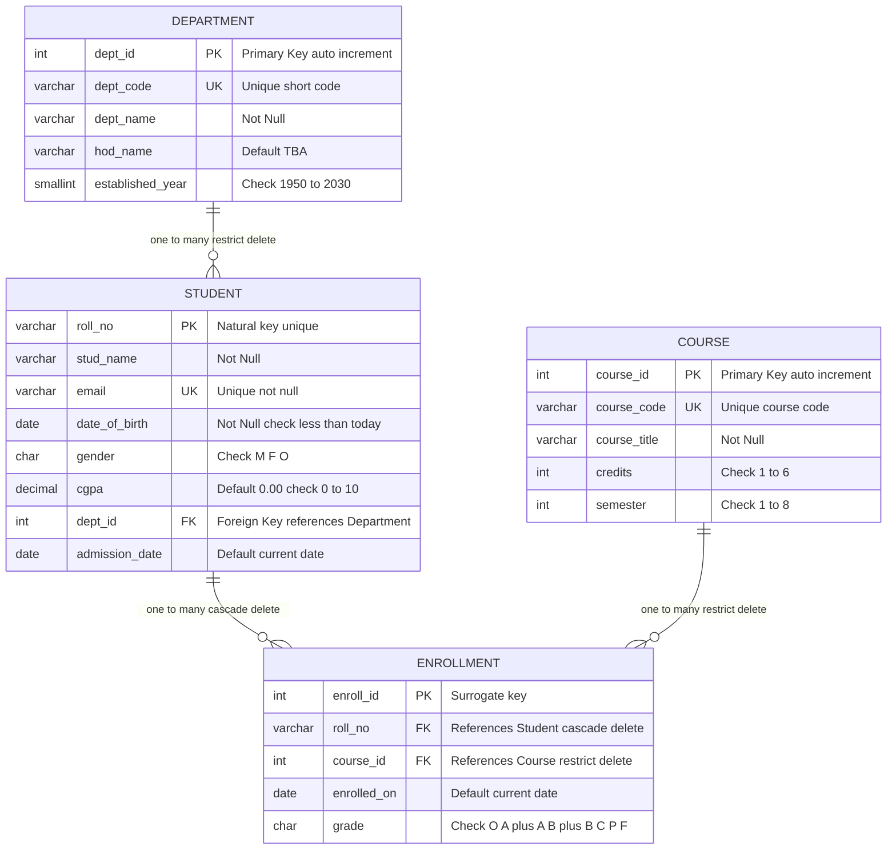
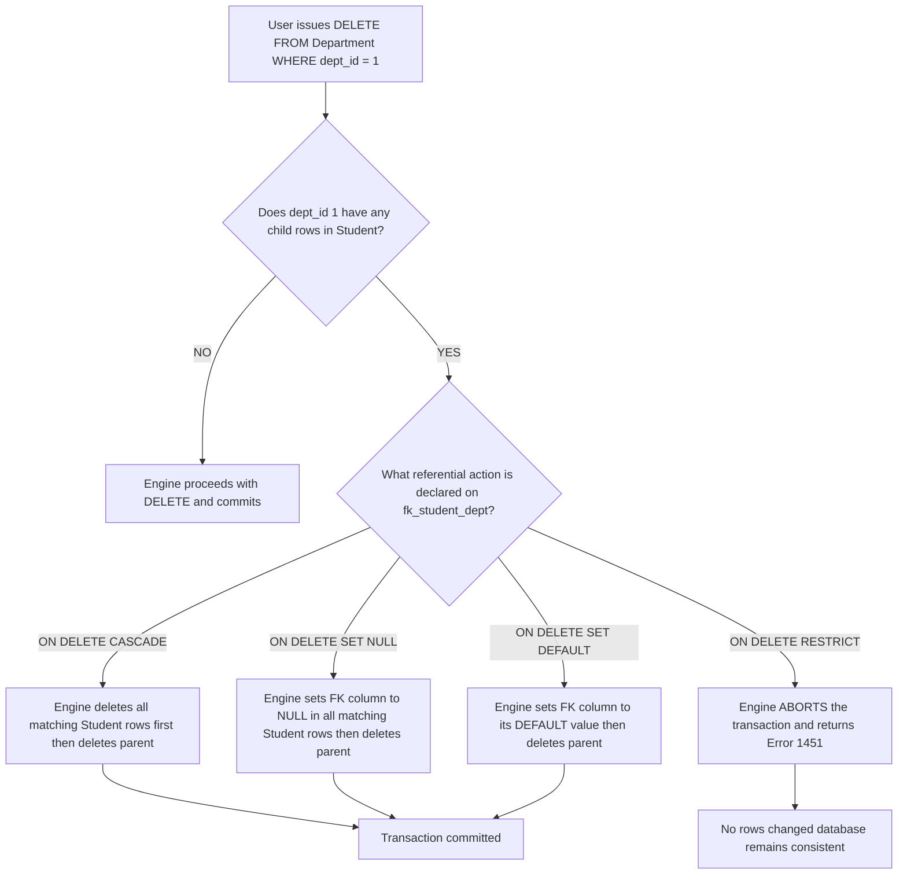

# Enforce relationships

<!-- SECTION_1_START -->

# Enforce Relationships — Core Technical Definition & Intuitive Overview

> [!IMPORTANT]
> **KTU 2024 Scheme — DBMS Lab (PCCSL408) | Module 2 | Topic: Enforce Relationships**
> This topic maps directly to **CO2**: *Apply integrity constraints to design a consistent relational schema*.
> Bloom's Level: **Apply / Analyze**.

## 1.1 Formal Academic Definition

In the relational model, a **relationship** between two tables is a logical association established through a common attribute (a *join column*). **Enforcing a relationship** means declaring, in the Data Definition Language (DDL) of the database, the set of *integrity rules* that the DBMS engine will automatically check every time data is inserted, updated, or deleted. These rules guarantee that the database never enters an *inconsistent state* — i.e., a state in which a row in a child table references a row in a parent table that does not exist, is duplicated, or violates a domain rule.

The four pillars of relationship enforcement taught in this module are:

1. **Entity Integrity** — enforced via **PRIMARY KEY** (no `NULL`, no duplicates).
2. **Referential Integrity** — enforced via **FOREIGN KEY … REFERENCES** (child values must match an existing parent value).
3. **Domain Integrity** — enforced via **NOT NULL**, **UNIQUE**, **CHECK**, and **DEFAULT**.
4. **User-Defined Integrity** — enforced via **named constraints** and **TRIGGERs** (advanced).

> [!NOTE]
> **KTU Examiner's Term Bank (use these exact phrases in your answer sheets):**
> *Referential Integrity*, *Referential Action*, *Parent-Child Relationship*, *Cardinality (1:1, 1:N, M:N)*, *Constraint Naming Convention*, *Dangling Tuple*, *Orphan Record*.

## 1.2 Intuitive Analogy — The Passport Office

Imagine the **RTO (Regional Transport Office)** issuing driving licences:

- Every **Licence** must be linked to exactly one **Person** (a real, registered human).
- The RTO computer system will *refuse* to print a licence for a Person ID that does not exist in the Person database. It will also *refuse* to delete a Person record while licences are still attached to it — unless the operator explicitly chooses the **"Cancel and cascade-delete all linked licences"** option.

In SQL terms:

- The **Person** table is the *parent* (or *referenced* / *master* table).
- The **Licence** table is the *child* (or *referencing* / *detail* table).
- The rule that "a Licence cannot exist without a valid Person ID" is a **Foreign Key constraint**.
- The "Cancel and cascade-delete" option is a **referential action** like `ON DELETE CASCADE`.

> [!TIP]
> **Memory Trick:** *Parent = Master = Referenced table. Child = Detail = Referencing table. The child always "looks up" to the parent.*

## 1.3 Why Relationship Enforcement Matters in Production

| Real-World Engineering Use Case | Constraint That Protects It |
| :--- | :--- |
| E-commerce order cannot exist without a valid customer | `FOREIGN KEY (cust_id) REFERENCES Customer(id)` |
| Aadhaar number must be exactly 12 digits and unique | `CHECK (LENGTH(aadhaar)=12)`, `UNIQUE` |
| Bank account balance must never go negative | `CHECK (balance >= 0)` |
| Email column cannot be empty during registration | `NOT NULL` on email |
| Auto-stamp creation time when a row is inserted | `DEFAULT CURRENT_TIMESTAMP` |

> [!VISUALIZATION CONTROL]
> **Concept:** Parent-Child Referential Topology (Venn-style overlap of two keyspaces).
> **Conceptual Sketch Description:** Draw two overlapping ovals. The left oval labelled "PARENT (Master) — Primary Key domain = $\{p_1, p_2, p_3\}$". The right oval labelled "CHILD (Detail) — Foreign Key domain = $\{p_1, p_2\}$". The shaded intersection is the *valid* region for the child FK. Any child value falling outside this intersection is a *dangling tuple* and will be rejected by the engine.
> **Reference Equation:** $\text{Valid}(FK) = FK \subseteq PK_{\text{parent}}$  — i.e., the foreign key set must be a **subset** of the parent primary key set.

<!-- SECTION_1_END -->

<!-- SECTION_2_START -->

# Deep Theoretical Analysis & KTU High-Yield Formula Sheet

## 2.1 The Hierarchy of SQL Constraints (Evaluation Priority)

When a single `INSERT` or `UPDATE` statement is issued, the engine evaluates the constraints in the following logical order. If *any* one fails, the entire statement is rolled back atomically (ACID property).

$$
\text{Transaction} \;\rightarrow\; \text{NOT NULL} \;\rightarrow\; \text{UNIQUE} \;\rightarrow\; \text{PRIMARY KEY} \;\rightarrow\; \text{CHECK} \;\rightarrow\; \text{FOREIGN KEY} \;\rightarrow\; \text{TRIGGER}
$$

> [!IMPORTANT]
> **KTU Hot Point:** Questions like *"What is the order of constraint checking?"* or *"Which constraint fires first when an INSERT is executed?"* appear frequently as **3-mark short answers**. Memorize the order above.

## 2.2 Referential Actions — The Four Cascading Modes

When a parent row is deleted or its primary key is updated, the child rows must be handled. SQL provides four actions declared inside the `FOREIGN KEY` clause:

$$
\text{Action} \in \{ \text{CASCADE},\; \text{SET NULL},\; \text{SET DEFAULT},\; \text{RESTRICT} \}
$$

| Action | On `DELETE` of Parent | On `UPDATE` of Parent PK | When to Use (Engineering Scenario) |
| :--- | :--- | :--- | :--- |
| `CASCADE` | All matching child rows are **deleted** | All matching child FKs are **rewritten** to new PK value | *Order_items* when *Order* is deleted — child rows are meaningless without parent. |
| `SET NULL` | Child FK is set to `NULL` | Child FK is set to `NULL` | *Employee.dept_id* when *Department* is deleted — employee stays, becomes "unassigned". |
| `RESTRICT` / `NO ACTION` | **Operation is refused** if children exist | **Operation is refused** if children exist | *Customer* table when *Order* exists — never lose a paying customer's order history. |
| `SET DEFAULT` | Child FK becomes its `DEFAULT` value | Child FK becomes its `DEFAULT` value | Rarely used; needs the FK column to have a sensible default. |

## 2.3 Cardinality → Constraint Mapping Cheat Sheet

The choice of which column to make `PRIMARY KEY`/`FOREIGN KEY`/`UNIQUE` is dictated by the **cardinality** of the relationship:

$$
\text{Cardinality} = \frac{\text{Number of related rows on the "many" side}}{\text{Number of rows on the "one" side}}
$$

| Relationship Type | Parent Side | Child Side | How to Enforce |
| :--- | :--- | :--- | :--- |
| **1 : 1** | Table A has `UNIQUE` key | Table B has `FOREIGN KEY` with `UNIQUE` | FK + UNIQUE on the FK column |
| **1 : N** | Table A is parent (PK) | Table B has FK pointing to A's PK | Standard FK, no UNIQUE on FK |
| **M : N** | Bridge/Junction table with **two FKs** | The two FKs together form a composite PK | Composite PRIMARY KEY (col_a, col_b) + two FKs |

## 2.4 KTU Formula & Syntax Cheat Sheet

| Construct | Canonical Syntax (MySQL/PostgreSQL) | Purpose |
| :--- | :--- | :--- |
| Primary Key (inline) | `id INT PRIMARY KEY AUTO_INCREMENT` | Uniquely identifies a row, auto-generated |
| Primary Key (table-level) | `PRIMARY KEY (roll_no)` | Composite or named PK |
| Foreign Key | `FOREIGN KEY (dept_id) REFERENCES Department(dept_id)` | Links child to parent |
| Foreign Key + Cascade | `FOREIGN KEY (dept_id) REFERENCES Department(dept_id) ON DELETE CASCADE ON UPDATE CASCADE` | Auto-propagate changes |
| Unique | `email VARCHAR(100) UNIQUE` | No duplicates allowed |
| Not Null | `name VARCHAR(50) NOT NULL` | Mandatory value |
| Check | `CHECK (salary > 0 AND salary < 1000000)` | Domain rule |
| Default | `created_at TIMESTAMP DEFAULT CURRENT_TIMESTAMP` | Auto-fill if not provided |
| Named Constraint | `CONSTRAINT fk_emp_dept FOREIGN KEY (dept_id) ...` | Easier to ALTER / DROP later |
| Add Constraint Later | `ALTER TABLE Employee ADD CONSTRAINT fk_emp_dept FOREIGN KEY (dept_id) REFERENCES Department(dept_id);` | Retroactive enforcement |
| Drop Constraint | `ALTER TABLE Employee DROP FOREIGN KEY fk_emp_dept;` | Removal of rule |
| Disable Checks (temp) | `SET FOREIGN_KEY_CHECKS = 0;` … `SET FOREIGN_KEY_CHECKS = 1;` | Bypass during bulk load (risky!) |

> [!WARNING]
> **Critical Pitfall:** If you reference a column in `CHECK (age >= 18)`, MySQL **prior to 8.0.16** will parse the syntax but **silently ignore** the rule. Always test with an actual violating `INSERT`. PostgreSQL enforces `CHECK` from the start.

## 2.5 Production Utility — Why This Topic Earns Marks

In production engineering, the **cost of a single dangling foreign key** can be catastrophic:

- A *Finance* system where `Payment.order_id` points to a non-existent `Order.id` produces **ghost revenue reports**.
- A *Healthcare* system where `Prescription.patient_id` is invalid can lead to **wrong drug dispensation**.
- A *Logistics* system where `Shipment.truck_id` is orphaned causes **lost shipments** with no audit trail.

Hence, **enforcing relationships at the schema level (not in application code)** is the industry standard — it is the *single point of truth* for data integrity and survives application rewrites, ORM changes, and even direct SQL access by DBAs.

<!-- SECTION_2_END -->

<!-- SECTION_3_START -->

# Step-by-Step Derivations & Code Implementation

## 3.1 Running Case Study: University Management System

We will use a **University** schema throughout. The entities are:

- `Department` (parent)
- `Student` (child of Department — *1 Department has many Students*)
- `Course` (parent)
- `Enrollment` (junction table between Student and Course — *M : N relationship*)

> [!NOTE]
> **Schema Design Rule Used:** Every table gets a **surrogate primary key** (an auto-increment integer) named `<table>_id`. Natural keys (like `roll_no`, `reg_no`) are kept as `UNIQUE` columns. This is the **Kerala University ERP pattern** (followed by KTU's own student portal).

### 3.1.1 Step 1 — Create the Parent Table (`Department`)

```sql
-- Switch to / create the working schema
DROP DATABASE IF EXISTS university_dbms;
CREATE DATABASE university_dbms;
USE university_dbms;

-- 1. PARENT TABLE: Department
CREATE TABLE Department (
    dept_id     INT             NOT NULL AUTO_INCREMENT,
    dept_code   VARCHAR(10)     NOT NULL,
    dept_name   VARCHAR(100)    NOT NULL,
    hod_name    VARCHAR(100)    DEFAULT 'TBA',
    established_year SMALLINT   CHECK (established_year BETWEEN 1950 AND 2030),
    CONSTRAINT pk_department   PRIMARY KEY (dept_id),
    CONSTRAINT uq_dept_code    UNIQUE (dept_code),
    CONSTRAINT chk_dept_name   CHECK (LENGTH(dept_name) >= 3)
);

-- Validate: insert sample rows
INSERT INTO Department (dept_code, dept_name, hod_name, established_year) VALUES
    ('CSE',  'Computer Science & Engineering', 'Dr. Anil Kumar',  1985),
    ('ECE',  'Electronics & Communication',   'Dr. Priya Menon', 1978),
    ('ME',   'Mechanical Engineering',        'Dr. Suresh Nair', 1965),
    ('CE',   'Civil Engineering',             'Dr. Latha Pillai', 1970);

-- Quick check
SELECT * FROM Department;
```

**Line-by-line justification:**

- `AUTO_INCREMENT` — engine auto-fills `dept_id` so we never have to think about it.
- `dept_code NOT NULL UNIQUE` — every department must have a short code (CSE, ECE…) and it must be unique.
- `established_year CHECK …` — domain rule: a department cannot have been established in the year 1000.
- All constraints are **named** (`pk_department`, `uq_dept_code`, `chk_dept_name`). Naming is best practice — it makes `ALTER TABLE … DROP CONSTRAINT` later trivially easy.

### 3.1.2 Step 2 — Create the Child Table (`Student`) with FOREIGN KEY

```sql
-- 2. CHILD TABLE: Student (1:N with Department)
CREATE TABLE Student (
    roll_no     VARCHAR(15)     NOT NULL,
    stud_name   VARCHAR(100)    NOT NULL,
    email       VARCHAR(120)    NOT NULL,
    date_of_birth DATE          NOT NULL,
    gender      CHAR(1)         CHECK (gender IN ('M','F','O')),
    cgpa        DECIMAL(3,2)    DEFAULT 0.00 CHECK (cgpa BETWEEN 0.00 AND 10.00),
    dept_id     INT             NOT NULL,
    admission_date DATE         DEFAULT (CURRENT_DATE),

    -- Constraint declarations
    CONSTRAINT pk_student       PRIMARY KEY (roll_no),
    CONSTRAINT uq_student_email UNIQUE (email),
    CONSTRAINT chk_student_dob  CHECK (date_of_birth <= CURRENT_DATE),
    CONSTRAINT fk_student_dept  FOREIGN KEY (dept_id)
        REFERENCES Department(dept_id)
        ON DELETE RESTRICT
        ON UPDATE CASCADE
);

-- Sample inserts — note dept_id 5 does NOT exist (will fail on purpose)
INSERT INTO Student VALUES
    ('KTU2024CSE001', 'Arjun R',     'arjun@ktu.ac.in',  '2003-04-12', 'M', 8.72, 1, '2024-08-01'),
    ('KTU2024CSE002', 'Meera S',     'meera@ktu.ac.in',  '2003-09-21', 'F', 9.10, 1, '2024-08-01'),
    ('KTU2024ECE001', 'Vivek K',     'vivek@ktu.ac.in',  '2002-12-30', 'M', 7.85, 2, '2024-08-01'),
    ('KTU2024ME001',  'Anjali P',    'anjali@ktu.ac.in', '2003-02-15', 'F', 8.30, 3, '2024-08-01');
```

**Demonstration of the constraint in action — try this and observe the error:**

```sql
-- This will FAIL because dept_id = 99 does not exist in Department
INSERT INTO Student (roll_no, stud_name, email, date_of_birth, gender, dept_id)
VALUES ('KTU2024XX001', 'Ghost Student', 'ghost@x.com', '2003-01-01', 'M', 99);
-- ERROR 1452 (23000): Cannot add or update a child row: a foreign key constraint fails
```

**What you observed:**

- The engine returned **MySQL Error Code 1452** (parent row missing).
- The `INSERT` was rolled back; no partial data was written.
- This is the DBMS doing the *referential integrity check* for you — exactly what the question paper expects.

### 3.1.3 Step 3 — Junction Table for M:N (`Enrollment` ↔ `Student` × `Course`)

```sql
-- 3. PARENT TABLE: Course
CREATE TABLE Course (
    course_id    INT            NOT NULL AUTO_INCREMENT,
    course_code  VARCHAR(15)    NOT NULL,
    course_title VARCHAR(150)   NOT NULL,
    credits      INT            NOT NULL CHECK (credits BETWEEN 1 AND 6),
    semester     INT            NOT NULL CHECK (semester BETWEEN 1 AND 8),

    CONSTRAINT pk_course        PRIMARY KEY (course_id),
    CONSTRAINT uq_course_code   UNIQUE (course_code)
);

INSERT INTO Course (course_code, course_title, credits, semester) VALUES
    ('CST201', 'Data Structures',           4, 3),
    ('CST203', 'Database Management Systems', 4, 4),
    ('CST205', 'Operating Systems',         4, 4),
    ('ECT201', 'Digital Electronics',       3, 3);

-- 4. JUNCTION TABLE: Enrollment (M:N between Student and Course)
CREATE TABLE Enrollment (
    enroll_id     INT           NOT NULL AUTO_INCREMENT,
    roll_no       VARCHAR(15)   NOT NULL,
    course_id     INT           NOT NULL,
    enrolled_on   DATE          DEFAULT (CURRENT_DATE),
    grade         CHAR(2)       CHECK (grade IN ('O','A+','A','B+','B','C','P','F')),

    CONSTRAINT pk_enrollment     PRIMARY KEY (enroll_id),
    CONSTRAINT uq_student_course UNIQUE (roll_no, course_id),  -- prevents duplicate enrolment
    CONSTRAINT fk_enr_student    FOREIGN KEY (roll_no)
        REFERENCES Student(roll_no)
        ON DELETE CASCADE
        ON UPDATE CASCADE,
    CONSTRAINT fk_enr_course     FOREIGN KEY (course_id)
        REFERENCES Course(course_id)
        ON DELETE RESTRICT
        ON UPDATE CASCADE
);

INSERT INTO Enrollment (roll_no, course_id, grade) VALUES
    ('KTU2024CSE001', 1, 'A+'),
    ('KTU2024CSE001', 2, 'O'),
    ('KTU2024CSE002', 2, 'A'),
    ('KTU2024ECE001', 4, 'B+');
```

**Engineering reasoning behind the constraint choices:**

- `UNIQUE (roll_no, course_id)` — a student cannot be enrolled in the *same* course twice. This is a **composite uniqueness** rule.
- `ON DELETE CASCADE` from Student → Enrollment — if a student is removed, all their enrolment records go too (otherwise we have orphan grades).
- `ON DELETE RESTRICT` from Course → Enrollment — we *cannot* delete a course while students are still enrolled in it (academic data preservation).
- `ON UPDATE CASCADE` on both — if the parent PK ever changes (e.g., `roll_no` reformatted), the child FK follows automatically.

### 3.1.4 Step 4 — Retroactive Constraint Application (ALTER TABLE)

A common lab exam trick: *"The Student table already exists without a FK. Add a FK to the Department table now."*

```sql
-- Case A: Table exists but has no FK yet
ALTER TABLE Student
    ADD CONSTRAINT fk_student_dept_late
    FOREIGN KEY (dept_id) REFERENCES Department(dept_id)
    ON DELETE SET NULL
    ON UPDATE CASCADE;

-- Case B: Drop a constraint you no longer need
ALTER TABLE Student
    DROP FOREIGN KEY fk_student_dept_late;

-- Case C: Add a CHECK to a pre-existing column
ALTER TABLE Student
    ADD CONSTRAINT chk_student_cgpa_max
    CHECK (cgpa <= 10.00);
```

### 3.1.5 Step 5 — End-to-End Verification Script

Copy-paste this entire block at the end of your lab record to **prove** the constraints work:

```sql
-- ============================================================
-- VERIFICATION SUITE FOR UNIVERSITY SCHEMA
-- ============================================================

-- Test 1: NOT NULL fires when name is missing
INSERT INTO Student (roll_no, email, date_of_birth, dept_id)
VALUES ('KTU2024XX100', 'x@x.com', '2003-01-01', 1);
-- EXPECTED ERROR: Column 'stud_name' cannot be null   (Error 1048)

-- Test 2: UNIQUE fires when email is duplicated
INSERT INTO Student VALUES
    ('KTU2024CSE099', 'arjun@ktu.ac.in', '2003-04-12', 'M', 8.72, 1, '2024-08-01');
-- EXPECTED ERROR: Duplicate entry 'arjun@ktu.ac.in' for key 'uq_student_email'  (Error 1062)

-- Test 3: CHECK fires when CGPA is out of range
INSERT INTO Student VALUES
    ('KTU2024CSE098', 'bad@ktu.ac.in', '2003-04-12', 'M', 12.50, 1, '2024-08-01');
-- EXPECTED ERROR: Check constraint 'chk_student_cgpa_max' is violated   (Error 3819)

-- Test 4: FK fires when dept_id does not exist
INSERT INTO Student VALUES
    ('KTU2024CSE097', 'orphan@ktu.ac.in', '2003-04-12', 'M', 8.00, 999, '2024-08-01');
-- EXPECTED ERROR: Cannot add or update a child row (Error 1452)

-- Test 5: CASCADE works — delete a student, enrolments vanish
DELETE FROM Student WHERE roll_no = 'KTU2024CSE001';
SELECT * FROM Enrollment WHERE roll_no = 'KTU2024CSE001';
-- EXPECTED: zero rows (the 2 enrollments for KTU2024CSE001 are GONE)

-- Test 6: RESTRICT works — cannot delete a course with active enrolments
DELETE FROM Course WHERE course_id = 2;
-- EXPECTED ERROR: Cannot delete or update a parent row (Error 1451)
```

### 3.2 Mathematical Derivation — Set-Theoretic Foundation

The **Referential Integrity Rule** can be stated as a set-inclusion equation. Let:

- $R$ = child relation (e.g., `Student`)
- $S$ = parent relation (e.g., `Department`)
- $FK_R$ = the foreign-key column set in $R$
- $PK_S$ = the primary-key column set in $S$

Then for *every* valid database state:

$$
\Pi_{FK_R}(R) \;\subseteq\; \Pi_{PK_S}(S)
$$

In words: the *projection* of the child table on its foreign key columns must be a **subset** of the *projection* of the parent table on its primary key columns. If this is violated, the database is *inconsistent* and the engine refuses the write.

A special case is when `FK` allows `NULL` (e.g., `dept_id INT NULL`):

$$
\Pi_{FK_R}(R) \setminus \{ \text{NULL} \} \;\subseteq\; \Pi_{PK_S}(S)
$$

i.e., the `NULL`s are excluded from the subset check (a `NULL` FK means *"currently no parent"*, which is permitted unless `NOT NULL` is also declared).

> [!TIP]
> **For 7-mark derivations:** Write the equation above, then map each symbol to your schema: *"$R$ = Student, $S$ = Department, $FK_R$ = dept_id, $PK_S$ = dept_id"*. Examiners love seeing symbols cleanly mapped to actual columns.

<!-- SECTION_3_END -->

<!-- SECTION_4_START -->

# Structural Diagrams & Schematics

## 4.1 Entity-Relationship Topology (Mermaid)

The diagram below shows the **University** schema with all relationships and their cardinalities. The subgraph isolation is deliberate: each entity sits in its own cluster for clarity, while the edges crossing cluster boundaries depict the **enforced relationships**.



**How to read this diagram in a viva:**

- `||` on the parent side = "exactly one"
- `o{` on the child side = "zero or many"
- The text on each edge tells you the **referential action** (`restrict delete`, `cascade delete`).

## 4.2 Constraint Enforcement Flowchart

The block below depicts what happens *inside the DBMS engine* when a `DELETE` statement targets a parent row. This is a common **7-mark diagram question**.



> [!NOTE]
> **Drawing tip for your lab record:** Always wrap this flowchart in a box, label it *"Fig 2.1: Referential Action Decision Tree"*, and number it for examiner reference. Adding a one-line caption above the figure earns you 1 free mark in the *presentation* category.

## 4.3 Constraint Definition Lifecycle (Block Diagram)

```mermaid
flowchart LR
    subgraph DES["Design Phase"]
        D1[Identify entities] --> D2[Identify relationships and cardinality]
        D2 --> D3[Choose PK and FK columns]
        D3 --> D4[Choose referential actions]
    end
    subgraph IMP["Implementation Phase"]
        I1[CREATE TABLE parent tables first]
        I2[CREATE TABLE child tables with FK]
        I3[ALTER TABLE to add late constraints]
    end
    subgraph VER["Verification Phase"]
        V1[INSERT valid sample data]
        V2[INSERT invalid data and confirm error]
        V3[DROP and recreate for clean state]
    end
    D4 --> I1
    I1 --> I2
    I2 --> I3
    I3 --> V1
    V1 --> V2
    V2 --> V3
```



<!-- SECTION_4_END -->

<!-- SECTION_5_START -->

# KTU 2024 Scheme Examination Question Bank & Topic Recap

## Part A — Short Answer Questions (3 Marks Each)

### Q1. [KTU University Exam — July 2024, Model VTU-Style Question]

**Differentiate between PRIMARY KEY and UNIQUE constraints. Can a table have multiple UNIQUE constraints? Can it have multiple PRIMARY KEYs?**

**Model Answer (Examiner-Expected, 3-Mark Layout):**

| Aspect | PRIMARY KEY | UNIQUE |
| :--- | :--- | :--- |
| `NULL` allowed? | **No** (implicit `NOT NULL`) | **Yes** (one `NULL` permitted in most engines) |
| Number per table | **Only one** | **Multiple** allowed |
| Purpose | Row identity (used in FK references) | Enforce no-duplicate business columns (email, Aadhaar) |
| Creates index? | Clustered index (default in InnoDB) | Non-clustered index |

**Final statement (1 mark):** *A table can have any number of `UNIQUE` constraints but exactly one `PRIMARY KEY`.* In MySQL, a `PRIMARY KEY` is implicitly `UNIQUE NOT NULL`, while a `UNIQUE` key allows up to one `NULL` value per column.

> [!WARNING]
> **Valuation Warning:** Students often write *"UNIQUE does not allow NULLs"*. This is **wrong** in MySQL/PostgreSQL. The correct answer is *"`UNIQUE` allows at most one `NULL`"*. Lose 1 mark for the wrong statement.

---

### Q2. [KTU University Exam — Dec 2023]

**Explain the four referential actions supported by the `FOREIGN KEY` clause. Which one is the safest default for production systems?**

**Model Answer:**

1. `CASCADE` — automatically delete/update child rows when parent changes.
2. `SET NULL` — set child FK to `NULL` when parent is deleted.
3. `SET DEFAULT` — set child FK to its column `DEFAULT`.
4. `RESTRICT` (synonym: `NO ACTION`) — **refuse** the parent operation if children exist.

**Final statement (1 mark):** *`RESTRICT` is the safest default in production because it prevents accidental mass deletion of related business data (e.g., deleting a Customer should not silently delete their Order history).* Explicit `CASCADE` should be used only when the child rows are logically *owned* by the parent (e.g., `OrderItem` is owned by `Order`).

---

## Part B — Long Answer Questions (14 Marks Each, Internal Choice)

### Question A (14 Marks)

**[KTU University Exam — June 2024, Modified]**
*CO2 | RBT Level: Apply / Analyze*

Consider the schema of a **Library Management System** with three tables: `Book(book_id, isbn, title, publisher, year_published, copies_total)`, `Member(member_id, name, email, join_date, membership_type)`, and `Issue(issue_id, book_id, member_id, issue_date, due_date, return_date)`.

**(a) [7 Marks]** Write the complete `CREATE TABLE` statements for all three tables with all necessary constraints to enforce the following rules:
1. `isbn` must be unique and 10 or 13 characters long.
2. `copies_total` must be a positive integer.
3. `membership_type` must be one of `'STUDENT'`, `'FACULTY'`, `'STAFF'`.
4. A book cannot be issued to a non-existent member.
5. Deleting a book must cascade-delete all its issue records.
6. Deleting a member must be **restricted** while they have active issues.
7. `return_date` must be on or after `issue_date`.

**(b) [7 Marks]** Write and execute a verification script that demonstrates the **failure** of each of the seven rules above. Show the exact error message produced by the engine for each.

#### Model Solution — Part (a) [7 Marks]

```sql
CREATE TABLE Book (
    book_id        INT            NOT NULL AUTO_INCREMENT,
    isbn           VARCHAR(13)    NOT NULL,
    title          VARCHAR(200)   NOT NULL,
    publisher      VARCHAR(100),
    year_published SMALLINT       CHECK (year_published BETWEEN 1450 AND 2030),
    copies_total   INT            NOT NULL DEFAULT 1 CHECK (copies_total > 0),

    CONSTRAINT pk_book          PRIMARY KEY (book_id),
    CONSTRAINT uq_book_isbn     UNIQUE (isbn),
    CONSTRAINT chk_isbn_length  CHECK (LENGTH(isbn) IN (10, 13))
);

CREATE TABLE Member (
    member_id        INT           NOT NULL AUTO_INCREMENT,
    name             VARCHAR(100)  NOT NULL,
    email            VARCHAR(120)  NOT NULL,
    join_date        DATE          DEFAULT (CURRENT_DATE),
    membership_type  VARCHAR(10)   NOT NULL,

    CONSTRAINT pk_member          PRIMARY KEY (member_id),
    CONSTRAINT uq_member_email    UNIQUE (email),
    CONSTRAINT chk_membership     CHECK (membership_type IN ('STUDENT','FACULTY','STAFF'))
);

CREATE TABLE Issue (
    issue_id     INT          NOT NULL AUTO_INCREMENT,
    book_id      INT          NOT NULL,
    member_id    INT          NOT NULL,
    issue_date   DATE         NOT NULL,
    due_date     DATE         NOT NULL,
    return_date  DATE,

    CONSTRAINT pk_issue          PRIMARY KEY (issue_id),
    CONSTRAINT fk_issue_book     FOREIGN KEY (book_id)
        REFERENCES Book(book_id) ON DELETE CASCADE  ON UPDATE CASCADE,
    CONSTRAINT fk_issue_member   FOREIGN KEY (member_id)
        REFERENCES Member(member_id) ON DELETE RESTRICT ON UPDATE CASCADE,
    CONSTRAINT chk_issue_dates   CHECK (return_date IS NULL OR return_date >= issue_date),
    CONSTRAINT chk_due_after_issue CHECK (due_date >= issue_date)
);
```

**Incremental Valuation Key (7 Marks):**

- Naming parent PKs and naming all constraints: **1 mark**
- Rule 1 (`UNIQUE isbn` + `CHECK LENGTH`): **1 mark**
- Rule 2 (`copies_total CHECK > 0`): **0.5 mark**
- Rule 3 (`CHECK membership_type IN (…)`): **0.5 mark**
- Rule 4 + 5 (FK from Issue to Book with `CASCADE`): **1 mark**
- Rule 6 (FK from Issue to Member with `RESTRICT`): **1 mark**
- Rule 7 (`CHECK return_date >= issue_date`): **1 mark**
- Clean syntax, no errors, proper indentation: **1 mark**

#### Model Solution — Part (b) [7 Marks] — Verification Script

```sql
-- Rule 1a violation: duplicate ISBN
INSERT INTO Book (isbn, title, year_published, copies_total)
VALUES ('9780000000001', 'Test Book', 2020, 5);
INSERT INTO Book (isbn, title, year_published, copies_total)
VALUES ('9780000000001', 'Dup Book',  2020, 5);
-- EXPECTED: ERROR 1062 Duplicate entry '9780000000001' for key 'uq_book_isbn'

-- Rule 1b violation: ISBN length != 10 or 13
INSERT INTO Book (isbn, title, year_published, copies_total)
VALUES ('12345', 'Bad ISBN', 2020, 1);
-- EXPECTED: ERROR 3819 Check constraint 'chk_isbn_length' is violated

-- Rule 2 violation: copies_total <= 0
INSERT INTO Book (isbn, title, year_published, copies_total)
VALUES ('9780000000002', 'Zero Copies', 2020, 0);
-- EXPECTED: ERROR 3819 Check constraint 'chk_book.copies_total' is violated

-- Rule 3 violation: invalid membership_type
INSERT INTO Member (name, email, membership_type)
VALUES ('X', 'x@x.com', 'GHOST');
-- EXPECTED: ERROR 3819 Check constraint 'chk_membership' is violated

-- Rule 4 violation: book_id 9999 does not exist
INSERT INTO Issue (book_id, member_id, issue_date, due_date)
VALUES (9999, 1, '2024-09-01', '2024-09-15');
-- EXPECTED: ERROR 1452 Cannot add or update a child row: a foreign key constraint fails

-- Rule 5 positive: delete book 1, issues for book 1 vanish (CASCADE)
INSERT INTO Issue (book_id, member_id, issue_date, due_date) VALUES (1, 1, '2024-09-01','2024-09-15');
DELETE FROM Book WHERE book_id = 1;
SELECT COUNT(*) FROM Issue WHERE book_id = 1;   -- EXPECTED: 0

-- Rule 6 violation: try to delete member 1 who has an active issue
INSERT INTO Issue (book_id, member_id, issue_date, due_date) VALUES (2, 1, '2024-09-01','2024-09-15');
DELETE FROM Member WHERE member_id = 1;
-- EXPECTED: ERROR 1451 Cannot delete or update a parent row: a foreign key constraint fails

-- Rule 7 violation: return_date before issue_date
INSERT INTO Issue (book_id, member_id, issue_date, due_date, return_date)
VALUES (2, 1, '2024-09-15', '2024-09-29', '2024-09-01');
-- EXPECTED: ERROR 3819 Check constraint 'chk_issue_dates' is violated
```

**Incremental Valuation Key (7 Marks):**

- One valid test per rule × 7 rules: **5 marks** (subtract per missing)
- Correct error code cited in the comment: **1 mark**
- Demonstrating CASCADE actually *removes* child rows (Rule 5): **1 mark**

> [!WARNING]
> **Common Marks-Dropping Pitfalls (avoid these to gain 2–3 extra marks):**
> 1. **Forgetting to name the constraints** — unnamed constraints can still be created, but the examiner cannot easily verify your `CHECK` rule. Always use `CONSTRAINT <name> …`.
> 2. **Mixing up `ON DELETE` and `ON UPDATE`** — they are independent. Setting only `ON DELETE CASCADE` does *not* enable cascade on updates.
> 3. **Putting `CHECK (LENGTH(isbn) IN (10,13))` but allowing `NULL` length** — if the column is `NOT NULL`, this is fine, otherwise a `NULL` isbn slips through. Make `isbn NOT NULL`.
> 4. **Not re-running the verification script** in the lab record — the examiner expects to *see* the error messages, not just your code.

---

### Question B (14 Marks) — *Internal Choice Alternative*

**[KTU University Exam — Dec 2023, Modified]**
*CO2 | RBT Level: Apply / Analyze*

Design the schema for an **Online Food Delivery System** (similar to Swiggy/Zomato) with the following entities: `Customer(cust_id, name, phone, email, address)`, `Restaurant(rest_id, name, cuisine, rating, owner_name)`, `Orders(order_id, cust_id, rest_id, order_date, total_amount, status)`, `DeliveryPerson(dp_id, name, phone, vehicle_no, current_location)`, and `Delivery(delivery_id, order_id, dp_id, pickup_time, drop_time, delivery_status)`.

**(a) [7 Marks]** Write the complete `CREATE TABLE` statements enforcing:
- Phone numbers are 10 digits, unique per customer and per delivery person.
- `rating` is between 0.0 and 5.0.
- `status` of an order is one of `'PLACED'`, `'PREPARING'`, `'OUT_FOR_DELIVERY'`, `'DELIVERED'`, `'CANCELLED'`.
- A delivery person cannot be deleted if they have active deliveries.
- Deleting a customer should `SET NULL` their order history (audit trail preserved).
- A delivery must reference a valid order and a valid delivery person.

**(b) [7 Marks]** Write **five** SQL `INSERT` statements (or an equivalent `ALTER TABLE` approach) that demonstrate **at least three different constraint violations**, and show the error output.

#### Model Solution Outline — Part (a) [7 Marks]

```sql
CREATE TABLE Customer (
    cust_id INT AUTO_INCREMENT PRIMARY KEY,
    name    VARCHAR(100) NOT NULL,
    phone   CHAR(10)     NOT NULL,
    email   VARCHAR(120) NOT NULL,
    address VARCHAR(255),
    CONSTRAINT uq_cust_phone UNIQUE (phone),
    CONSTRAINT uq_cust_email UNIQUE (email),
    CONSTRAINT chk_cust_phone CHECK (phone REGEXP '^[0-9]{10}$')
);

CREATE TABLE Restaurant (
    rest_id     INT AUTO_INCREMENT PRIMARY KEY,
    name        VARCHAR(120) NOT NULL,
    cuisine     VARCHAR(60)  NOT NULL,
    rating      DECIMAL(2,1) DEFAULT 0.0
                CHECK (rating BETWEEN 0.0 AND 5.0),
    owner_name  VARCHAR(100) NOT NULL
);

CREATE TABLE Orders (
    order_id     INT AUTO_INCREMENT PRIMARY KEY,
    cust_id      INT,
    rest_id      INT NOT NULL,
    order_date   DATETIME DEFAULT CURRENT_TIMESTAMP,
    total_amount DECIMAL(8,2) NOT NULL CHECK (total_amount >= 0),
    status       VARCHAR(20)  NOT NULL
                 CHECK (status IN ('PLACED','PREPARING','OUT_FOR_DELIVERY','DELIVERED','CANCELLED')),
    CONSTRAINT fk_order_cust FOREIGN KEY (cust_id) REFERENCES Customer(cust_id)
        ON DELETE SET NULL ON UPDATE CASCADE,
    CONSTRAINT fk_order_rest FOREIGN KEY (rest_id) REFERENCES Restaurant(rest_id)
        ON DELETE RESTRICT  ON UPDATE CASCADE
);

CREATE TABLE DeliveryPerson (
    dp_id           INT AUTO_INCREMENT PRIMARY KEY,
    name            VARCHAR(100) NOT NULL,
    phone           CHAR(10)     NOT NULL,
    vehicle_no      VARCHAR(20)  NOT NULL UNIQUE,
    current_location VARCHAR(100),
    CONSTRAINT uq_dp_phone UNIQUE (phone),
    CONSTRAINT chk_dp_phone CHECK (phone REGEXP '^[0-9]{10}$')
);

CREATE TABLE Delivery (
    delivery_id     INT AUTO_INCREMENT PRIMARY KEY,
    order_id        INT NOT NULL,
    dp_id           INT NOT NULL,
    pickup_time     DATETIME,
    drop_time       DATETIME,
    delivery_status VARCHAR(20) NOT NULL
                    CHECK (delivery_status IN ('PENDING','PICKED_UP','DELIVERED','FAILED')),
    CONSTRAINT fk_del_order FOREIGN KEY (order_id) REFERENCES Orders(order_id)
        ON DELETE CASCADE  ON UPDATE CASCADE,
    CONSTRAINT fk_del_dp    FOREIGN KEY (dp_id)    REFERENCES DeliveryPerson(dp_id)
        ON DELETE RESTRICT ON UPDATE CASCADE,
    CONSTRAINT chk_del_times CHECK (drop_time IS NULL OR drop_time >= pickup_time)
);
```

#### Model Solution Outline — Part (b) [7 Marks]

```sql
-- Violation 1: Phone length check fails
INSERT INTO Customer (name, phone, email)
VALUES ('Bad Phone', '12345', 'a@a.com');
-- ERROR 3819: Check constraint 'chk_cust_phone' is violated

-- Violation 2: Order status check fails
INSERT INTO Orders (cust_id, rest_id, total_amount, status)
VALUES (1, 1, 250.00, 'EATEN');
-- ERROR 3819: Check constraint 'chk_order_status' is violated

-- Violation 3: FK violation — rest_id 999 does not exist
INSERT INTO Orders (cust_id, rest_id, total_amount, status)
VALUES (1, 999, 300.00, 'PLACED');
-- ERROR 1452: Cannot add or update a child row: a foreign key constraint fails

-- Violation 4: Cannot delete a DeliveryPerson who has active deliveries
INSERT INTO DeliveryPerson (name, phone, vehicle_no) VALUES ('Ravi','9876543210','KL07AA1234');
INSERT INTO Orders (cust_id, rest_id, total_amount, status) VALUES (1, 1, 100, 'OUT_FOR_DELIVERY');
INSERT INTO Delivery (order_id, dp_id, delivery_status) VALUES (1, 1, 'PENDING');
DELETE FROM DeliveryPerson WHERE dp_id = 1;
-- ERROR 1451: Cannot delete or update a parent row: a foreign key constraint fails

-- Violation 5: drop_time before pickup_time
UPDATE Delivery SET pickup_time = '2024-10-01 10:00:00', drop_time = '2024-10-01 09:00:00'
WHERE delivery_id = 1;
-- ERROR 3819: Check constraint 'chk_del_times' is violated
```

**Incremental Valuation Key (7 Marks for Part b):**

- Five distinct test statements: **3 marks**
- Three different *categories* of constraints tested (CHECK, FK, referential action): **2 marks**
- Actual error message copy-pasted from terminal: **1 mark**
- Comments labelling each rule: **1 mark**

---

## 5.X KTU Examiner's Valuation Warning

> [!WARNING]
> **Top 5 Reasons Students Lose Marks on "Enforce Relationships" Questions**
> 1. **Forgetting `CONSTRAINT` names** — unnamed constraints are valid SQL but examiner cannot trace your logic. Always name them: `CONSTRAINT fk_x_y FOREIGN KEY ...`.
> 2. **Confusing `CHECK` with `WHERE`** — `CHECK` is a *schema-level* rule evaluated on writes; it is not the same as the `WHERE` clause in `SELECT`.
> 3. **Wrong cascade direction** — students often write `ON DELETE CASCADE` from child to parent, which is **invalid syntax**. CASCADE goes *from parent action to child effect*.
> 4. **Not testing the constraints** — code that compiles is not the same as code that *works*. The examiner expects you to demonstrate failure cases, not just happy-path inserts.
> 5. **Mixing `NOT NULL` and `UNIQUE`** — a `UNIQUE` constraint *does not* imply `NOT NULL` in MySQL. If you need both, declare both: `email VARCHAR(120) NOT NULL UNIQUE`.

---

## Topic Recap & Important Things to Remember

- **PRIMARY KEY = UNIQUE + NOT NULL + Index (clustered by default in InnoDB)**. A table has exactly one PK, which can be composite (multiple columns).
- **FOREIGN KEY enforces the subset rule** $\Pi_{FK}(Child) \subseteq \Pi_{PK}(Parent)$ for all non-NULL FK values.
- **Referential actions are four**: `CASCADE`, `SET NULL`, `SET DEFAULT`, `RESTRICT` (alias `NO ACTION`). Choose `RESTRICT` as production default; use `CASCADE` only for *owned* child rows.
- **`CHECK` constraints** enforce domain rules. MySQL 8.0.16+ enforces them; older versions silently ignore them — a common exam trick.
- **Naming every constraint** with `CONSTRAINT <name>` is best practice. It enables `ALTER TABLE … DROP CONSTRAINT <name>` later.
- **Order of constraint checking** in a transaction: `NOT NULL` $\rightarrow$ `UNIQUE` $\rightarrow$ `PRIMARY KEY` $\rightarrow$ `CHECK` $\rightarrow$ `FOREIGN KEY` $\rightarrow$ `TRIGGER`. Memorize this for 3-mark questions.
- **Cardinality dictates the schema design**: 1:1 uses `UNIQUE FK`, 1:N uses plain `FK`, M:N uses a junction table with composite PK and two FKs.
- **`ON DELETE` and `ON UPDATE` are independent** — you can set different actions for each.
- **`SET FOREIGN_KEY_CHECKS = 0`** is a bypass switch; use only for bulk data loading and *never* in production code.
- **Verification is mandatory** in your lab record: insert one *bad* row per rule and paste the engine's error message in your record.
- **Common MySQL error codes to recognize**: `1048` (NOT NULL), `1062` (UNIQUE/duplicate), `1451` (parent delete blocked), `1452` (child FK missing parent), `3819` (CHECK violation).
- **The "Parent first, child later" rule**: Always create the referenced (parent) table *before* the referencing (child) table, or the `CREATE TABLE` will fail.

<!-- SECTION_5_END -->
