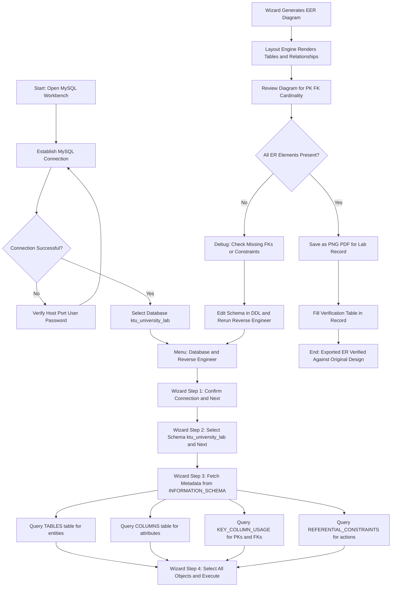
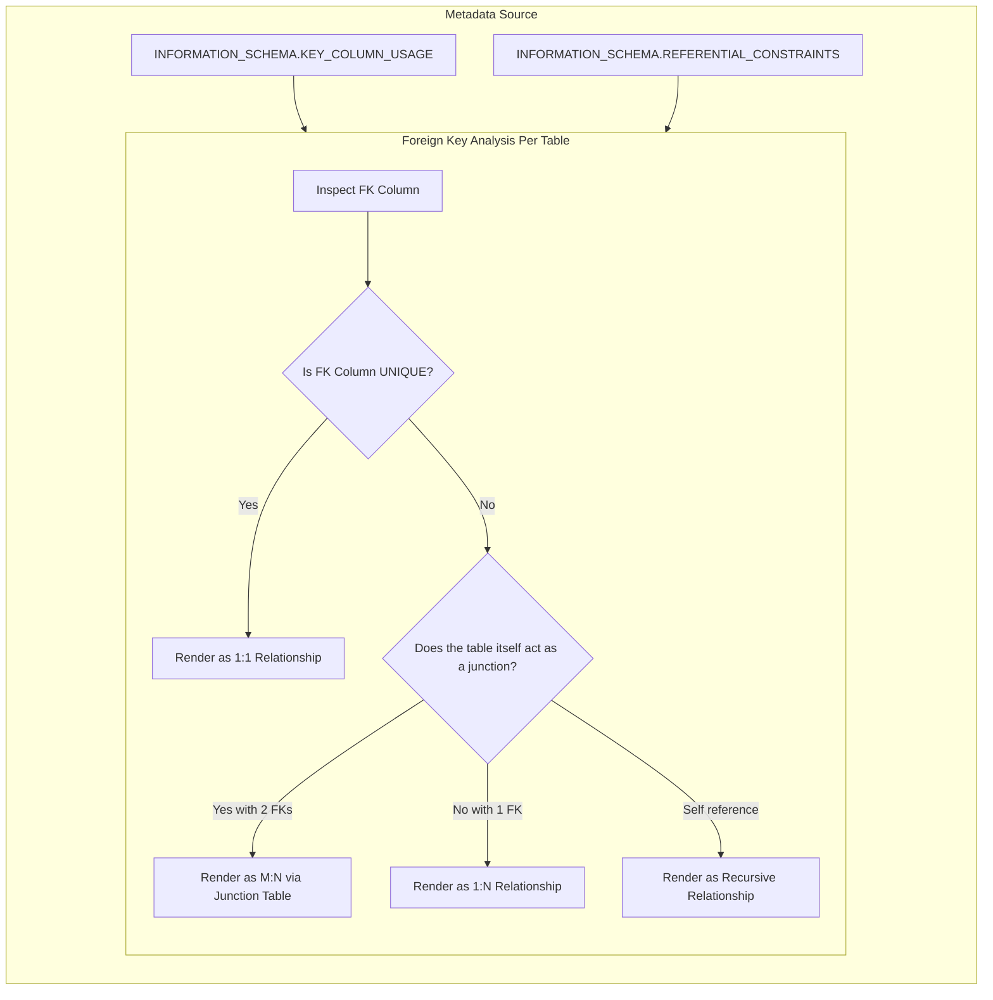
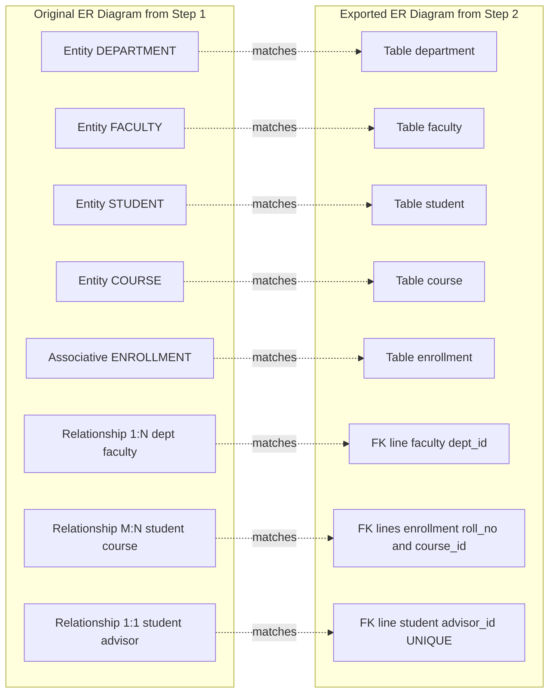

# Export ER diagram from the database and verify relationships (with the ER diagram designed in step 1).

<!-- SECTION_1_START -->
# Module 2 — Export ER Diagram from the Database & Verify Relationships

## 1. Core Technical Definition & Intuitive Overview

> [!NOTE]
> **Formal Definition (KTU 2024 Scheme — DBMS Lab PCCSL408):**
> *Reverse Engineering* an Entity-Relationship (ER) diagram is the process of extracting the complete database schema (tables, columns, primary keys, foreign keys, constraints, and references) from an existing live database and rendering it as a visual ER/Schema diagram. The exported diagram is then *verified* against the original logical ER design (Module 2, Step 1) to confirm that every entity, attribute, primary key, foreign key, and relationship (1:1, 1:N, M:N) has been preserved correctly during the DDL translation.

> [!IMPORTANT]
> **KTU 2024 Scheme — Module 2 Step Mapping:**
> - **Step 1:** Design ER diagram (already done in previous experiment).
> - **Step 2 (Current Topic):** Implement schema in MySQL → Export ER diagram from the live database → Cross-verify with the originally drawn ER diagram.
> - **Examination Relevance:** Frequently asked as a **14-mark lab question** where students must show the export, justify the cardinality, and validate the integrity constraints.

### 1.1 Conceptual Analogy — The "Building Blueprint" Intuition

Imagine you constructed a real building (the populated database) but the architect's original blueprint (your Step 1 ER diagram) got smudged with coffee. Now you walk through the actual building with a laser scanner that records every wall, door, pillar, and window — and re-draws the blueprint from the scan.

That re-drawn blueprint is the **exported ER diagram**.

The laser scanner is the **reverse-engineering tool** (e.g., MySQL Workbench's *Database → Reverse Engineer* wizard).

The comparison between the old and new blueprint is **verification** — you ensure no wall is missing, no extra door was added, and the pillars (primary keys) are still in the right places.

> [!TIP]
> **Why is this important?**
> In real production environments, developers often receive *legacy* databases with no documentation. Reverse engineering is the only way to recover the schema and understand business logic. It is the first step in **database documentation, refactoring, and migration**.

### 1.2 Key Vocabulary for the Topic

> [!NOTE]
> - **Forward Engineering:** ER Diagram → SQL DDL → Database (Step 1 → Step 2 implementation).
> - **Reverse Engineering:** Database → SQL Metadata → ER Diagram (the current topic).
> - **Cardinality Verification:** Checking that 1:1, 1:N, M:N relationships drawn in Step 1 are correctly enforced by foreign keys in the exported diagram.
> - **Schema Metadata:** The `INFORMATION_SCHEMA` tables (`TABLES`, `COLUMNS`, `KEY_COLUMN_USAGE`, `REFERENTIAL_CONSTRAINTS`) that tools query to reconstruct the diagram.

> [!VISUALIZATION CONTROL]
> **Concept:** The Reverse-Engineering Pipeline
> **GeoGebra / Desmos Input Equations (Conceptual Graph Coordinates):**
> * `x-axis`: Stages of transformation (Logical Design → Physical Database → Reconstructed ER)
> * `y-axis`: Level of abstraction
> **Visual Description:** A descending-then-ascending staircase. Start high (logical ER), descend to low (physical tables), then ascend back to high (reconstructed ER) for verification. The two ER diagrams (original & exported) should overlap perfectly if implementation is correct.
<!-- SECTION_1_END -->

<!-- SECTION_2_START -->
# 2. Deep Theoretical Analysis & KTU High-Yield Formula Sheet

## 2.1 The Reverse-Engineering Pipeline — Six Logical Steps

Every modern database tool (MySQL Workbench, DBeaver, pgModeler, dbdiagram.io) performs reverse engineering by querying the system's metadata catalog. The process follows this universal sequence:

1. **Establish Connection (JDBC/ODBC Tunnel):** The tool opens a live session to the DBMS using host, port, username, and password. All metadata is fetched through this channel — no user data is touched.
2. **Catalogue Discovery (`INFORMATION_SCHEMA.TABLES`):** The tool issues:
   ```sql
   SELECT TABLE_NAME, TABLE_TYPE, ENGINE
   FROM INFORMATION_SCHEMA.TABLES
   WHERE TABLE_SCHEMA = 'your_database_name';
   ```
   This yields the list of *entities* (regular tables) in your schema.
3. **Column Enumeration (`INFORMATION_SCHEMA.COLUMNS`):** For every table, every column is fetched along with its data type, nullability, default value, and ordinal position — these become the *attributes*.
4. **Constraint Extraction (`INFORMATION_SCHEMA.KEY_COLUMN_USAGE`):** Primary keys (PK) and foreign keys (FK) are identified by querying the constraint catalog.
5. **Relationship Reconstruction (`INFORMATION_SCHEMA.REFERENTIAL_CONSTRAINTS`):** FK→PK linkages are joined to determine the *cardinality* (1:1, 1:N, M:N) and the referential actions (`ON DELETE CASCADE`, `ON UPDATE RESTRICT`, etc.).
6. **Layout Rendering (Graph Layout Algorithm):** The tool applies a force-directed or hierarchical layout to draw entities as boxes and relationships as crow's-foot connectors.

> [!IMPORTANT]
> **The "Why" Behind Each Step:**
> The `INFORMATION_SCHEMA` is a *virtual* read-only database defined by the SQL standard. It exists in every conforming RDBMS (MySQL, PostgreSQL, Oracle, SQL Server) and is the single source of truth for schema metadata. Tools never need to "parse" DDL files — they just read this catalog.

## 2.2 Verification Methodology — Comparing Two ER Diagrams

Once the ER diagram is exported, you must verify it against the original. KTU expects this as a **tabular comparison** in the lab record.

### Verification Checklist (KTU Standard)

| Verification Aspect | What to Check in Exported Diagram | Tool Clue |
|---|---|---|
| Entity Count | Number of tables = Number of entities in Step 1 | `TABLES.TABLE_NAME` |
| Attribute Count | Columns per table = Attributes in original entity | `COLUMNS.COLUMN_NAME` |
| Primary Key Match | PK symbol (🔑) on the correct attribute | `KEY_COLUMN_USAGE` where `CONSTRAINT_NAME = 'PRIMARY'` |
| Foreign Key Match | FK arrows pointing to the correct parent table | `REFERENTIAL_CONSTRAINTS` |
| Cardinality Match | 1:1, 1:N, M:N lines drawn correctly | Derived from FK uniqueness |
| NOT NULL Match | Mandatory attributes show NOT NULL | `IS_NULLABLE = 'NO'` |
| Referential Actions | `CASCADE`, `RESTRICT`, `SET NULL` preserved | `DELETE_RULE`, `UPDATE_RULE` |

## 2.3 Cardinality Inference Rules (High-Yield for KTU)

The exported diagram's relationship lines are **inferred** from the foreign key structure. These rules are deterministic:

> [!IMPORTANT]
> **Rule 1 — 1:1 Relationship:** Foreign key on the child side is **UNIQUE**. A `UNIQUE` constraint on the FK column is the signal.
>
> **Rule 2 — 1:N Relationship:** Foreign key on the "many" side is **non-unique** (no `UNIQUE` constraint). This is the default in MySQL.
>
> **Rule 3 — M:N Relationship:** **Cannot be implemented directly** in a relational schema. Always requires a *junction/associative table* with two FKs pointing to the two parent entities. Both FKs together form a composite PK.
>
> **Rule 4 — Recursive Relationship:** Foreign key in a table points to the **same** table's primary key (e.g., `employee.manager_id → employee.emp_id`).

## 2.4 KTU Formula Sheet — Quick Reference for SQL Metadata Queries

> [!NOTE]
> **High-Yield SQL queries used during reverse engineering** (memorize these for the 14-mark question):

$$
\text{Tables Count} = \text{COUNT}(\ast) \text{ from } INFORMATION\_SCHEMA.TABLES
$$

$$
\text{Attributes Per Table} = \text{COUNT}(\ast) \text{ from } COLUMNS where TABLE\_NAME = t
$$

$$
\text{Cardinality}_{M:N} \Rightarrow \text{Requires Junction Table with 2 FKs}
$$

$$
\text{Cardinality}_{1:1} \Rightarrow \text{FK column must have } UNIQUE \text{ constraint}
$$

$$
\text{Cardinality}_{1:N} \Rightarrow \text{FK column is non-unique (default)}
$$

### 2.5 Engineering Real-World Utility

> [!TIP]
> - **Database Migration:** Moving from MySQL to PostgreSQL — reverse-engineer source, generate DDL for target.
> - **Legacy System Onboarding:** New developers use reverse engineering to understand undocumented production databases.
> - **Audit & Compliance:** Verifies that the *implemented* schema matches the *approved* logical design — a regulatory requirement in banking, healthcare (HIPAA), and aerospace.
> - **Impact Analysis:** Before schema changes, teams view the ER diagram to assess downstream effects.
<!-- SECTION_2_END -->

<!-- SECTION_3_START -->
# 3. Step-by-Step Implementation & Code/Symbolic Walkthrough

> [!IMPORTANT]
> **Lab Setup Prerequisite:** Ensure MySQL Server 8.x and MySQL Workbench 8.x are installed. We assume the Step 1 ER diagram (e.g., `STUDENT`, `COURSE`, `ENROLLMENT`, `DEPARTMENT`, `FACULTY`) has already been implemented as tables in a database named `ktu_university_lab`.

## 3.1 STEP 1 — The Implemented Schema (Carried Forward from Step 1)

Run the following DDL on the MySQL server before exporting. This represents the *physical* implementation of your Step 1 ER diagram.

```sql
-- ============================================================
-- KTU DBMS LAB | Module 2 | Step 2 — Schema to Reverse Engineer
-- ============================================================
DROP DATABASE IF EXISTS ktu_university_lab;
CREATE DATABASE ktu_university_lab;
USE ktu_university_lab;

-- Entity: DEPARTMENT
CREATE TABLE department (
    dept_id      INT          NOT NULL AUTO_INCREMENT,
    dept_name    VARCHAR(50)  NOT NULL,
    hod_name     VARCHAR(50)  NOT NULL,
    CONSTRAINT pk_department PRIMARY KEY (dept_id),
    CONSTRAINT uq_dept_name   UNIQUE (dept_name)
) ENGINE=InnoDB;

-- Entity: FACULTY  (N:1 with DEPARTMENT)
CREATE TABLE faculty (
    fac_id       INT          NOT NULL AUTO_INCREMENT,
    fac_name     VARCHAR(50)  NOT NULL,
    email        VARCHAR(80)  NOT NULL,
    salary       DECIMAL(10,2) NOT NULL,
    dept_id      INT          NOT NULL,
    CONSTRAINT pk_faculty     PRIMARY KEY (fac_id),
    CONSTRAINT uq_fac_email   UNIQUE (email),
    CONSTRAINT fk_fac_dept   FOREIGN KEY (dept_id)
        REFERENCES department(dept_id)
        ON DELETE RESTRICT
        ON UPDATE CASCADE
) ENGINE=InnoDB;

-- Entity: COURSE  (N:1 with DEPARTMENT)
CREATE TABLE course (
    course_id    VARCHAR(6)   NOT NULL,
    course_name  VARCHAR(50)  NOT NULL,
    credits      INT          NOT NULL,
    dept_id      INT          NOT NULL,
    CONSTRAINT pk_course     PRIMARY KEY (course_id),
    CONSTRAINT fk_course_dept FOREIGN KEY (dept_id)
        REFERENCES department(dept_id)
        ON DELETE RESTRICT
        ON UPDATE CASCADE
) ENGINE=InnoDB;

-- Entity: STUDENT  (N:1 with DEPARTMENT)
CREATE TABLE student (
    roll_no      INT          NOT NULL,
    stud_name    VARCHAR(50)  NOT NULL,
    dob          DATE         NOT NULL,
    gender       CHAR(1)      NOT NULL,
    dept_id      INT          NOT NULL,
    CONSTRAINT pk_student    PRIMARY KEY (roll_no),
    CONSTRAINT fk_stud_dept  FOREIGN KEY (dept_id)
        REFERENCES department(dept_id)
        ON DELETE RESTRICT
        ON UPDATE CASCADE
) ENGINE=InnoDB;

-- Associative (Junction) Entity: ENROLLMENT  (M:N between STUDENT and COURSE)
CREATE TABLE enrollment (
    roll_no      INT          NOT NULL,
    course_id    VARCHAR(6)   NOT NULL,
    enroll_date  DATE         NOT NULL,
    grade        CHAR(2)      NULL,
    CONSTRAINT pk_enrollment PRIMARY KEY (roll_no, course_id),
    CONSTRAINT fk_enr_stud   FOREIGN KEY (roll_no)
        REFERENCES student(roll_no) ON DELETE CASCADE ON UPDATE CASCADE,
    CONSTRAINT fk_enr_course FOREIGN KEY (course_id)
        REFERENCES course(course_id) ON DELETE CASCADE ON UPDATE CASCADE
) ENGINE=InnoDB;

-- 1:1 Relationship: FACULTY_ADVISOR
-- A student is assigned exactly one faculty advisor; one advisor guides many students,
-- but the FK in student is UNIQUE to enforce 1:1.
ALTER TABLE student
    ADD COLUMN advisor_id INT NULL,
    ADD CONSTRAINT fk_stud_advisor
        FOREIGN KEY (advisor_id) REFERENCES faculty(fac_id)
        ON DELETE SET NULL ON UPDATE CASCADE,
    ADD CONSTRAINT uq_student_advisor UNIQUE (advisor_id);

-- Populate minimal data so the diagram is realistic
INSERT INTO department VALUES
    (1,'CSE','Dr. Suresh Kumar'),(2,'ECE','Dr. Latha Menon'),
    (3,'MECH','Dr. Rajesh Pillai');
INSERT INTO faculty VALUES
    (101,'Anita Joseph','anita@ktu.in',75000.00,1),
    (102,'Biju Nair','biju@ktu.in',82000.00,1),
    (103,'Cyril Thomas','cyril@ktu.in',70000.00,2);
INSERT INTO course VALUES
    ('CS301','DBMS',4,1),('CS302','OS',4,1),
    ('EC201','Signals',3,2),('ME101','Thermodynamics',3,3);
INSERT INTO student (roll_no,stud_name,dob,gender,dept_id,advisor_id) VALUES
    (1,'Aravind','2004-05-12','M',1,101),
    (2,'Bhavna','2004-08-21','F',1,NULL),
    (3,'Cyril','2003-11-09','M',2,103);
INSERT INTO enrollment VALUES
    (1,'CS301','2024-08-01','A'),(1,'CS302','2024-08-01','B'),
    (2,'CS301','2024-08-02','A'),(3,'EC201','2024-08-03','C');
```

## 3.2 STEP 2 — Reverse-Engineer Using MySQL Workbench (GUI Method)

This is the **primary method** KTU expects. Follow each click precisely.

1. **Open MySQL Workbench** → Click the `+` icon next to "MySQL Connections" → set Host=`127.0.0.1`, Port=`3306`, User=`root`, Password=<your password> → Test Connection → OK.
2. Connect to the local instance. In the left **Navigator** panel, expand the *Schemas* tab and locate `ktu_university_lab`.
3. From the top menu bar choose **`Database` → `Reverse Engineer...`**.
4. The *Reverse Engineer Database* wizard opens. Click `Next`.
5. On the *Select Schemas* screen, check the box next to `ktu_university_lab` and click `Next`.
6. Workbench fetches metadata. The progress bar reads: *"Fetching Table Metadata... Fetching Column Metadata... Fetching Routine Metadata..."* Wait until 100%.
7. On the *Select Objects to Reverse Engineer* screen, ensure all tables are selected. Click `Next`.
8. The *Reverse Engineer* screen now displays the **reconstructed EER diagram** with:
   - Each table rendered as a yellow note.
   - PK columns highlighted with a 🔑 key icon.
   - FK columns linked to their parent tables via crow's-foot connectors.
9. Click `Execute` → `Finish`. The diagram appears in the *EER Diagram* tab.
10. **Save the diagram:** Go to `File` → `Save Model to Image...` → Choose PNG/PDF → Save as `ktu_step2_exported_ER.png`. This is the **mandatory lab record artifact**.

## 3.3 STEP 3 — Reverse-Engineer Using SQL Metadata (CLI / Scripted Method)

This is the **fallback** when MySQL Workbench is unavailable. We query the `INFORMATION_SCHEMA` directly.

```sql
-- Query A: List all tables (entities) in the schema
SELECT TABLE_NAME, TABLE_TYPE, ENGINE
FROM INFORMATION_SCHEMA.TABLES
WHERE TABLE_SCHEMA = 'ktu_university_lab'
ORDER BY TABLE_NAME;
```

> Expected Output (5 rows):
>
> | TABLE_NAME | TABLE_TYPE | ENGINE |
> |---|---|---|
> | course        | BASE TABLE | InnoDB |
> | department    | BASE TABLE | InnoDB |
> | enrollment    | BASE TABLE | InnoDB |
> | faculty       | BASE TABLE | InnoDB |
> | student       | BASE TABLE | InnoDB |

```sql
-- Query B: List all columns (attributes) with data types
SELECT TABLE_NAME, COLUMN_NAME, DATA_TYPE,
       IS_NULLABLE, COLUMN_KEY, COLUMN_DEFAULT
FROM INFORMATION_SCHEMA.COLUMNS
WHERE TABLE_SCHEMA = 'ktu_university_lab'
ORDER BY TABLE_NAME, ORDINAL_POSITION;
```

```sql
-- Query C: Detect primary keys
SELECT TABLE_NAME, COLUMN_NAME, CONSTRAINT_NAME
FROM INFORMATION_SCHEMA.KEY_COLUMN_USAGE
WHERE TABLE_SCHEMA   = 'ktu_university_lab'
  AND CONSTRAINT_NAME = 'PRIMARY'
ORDER BY TABLE_NAME;
```

```sql
-- Query D: Detect foreign keys and their parent tables (relationship backbone)
SELECT
    kcu.TABLE_NAME            AS child_table,
    kcu.COLUMN_NAME           AS child_column,
    kcu.REFERENCED_TABLE_NAME AS parent_table,
    kcu.REFERENCED_COLUMN_NAME AS parent_column,
    kcu.CONSTRAINT_NAME       AS fk_constraint
FROM INFORMATION_SCHEMA.KEY_COLUMN_USAGE kcu
WHERE kcu.TABLE_SCHEMA      = 'ktu_university_lab'
  AND kcu.REFERENCED_TABLE_NAME IS NOT NULL
ORDER BY kcu.TABLE_NAME;
```

> Expected Output (the relationship map):
>
> | child_table | child_column | parent_table | parent_column | fk_constraint |
> |---|---|---|---|---|
> | course        | dept_id     | department | dept_id | fk_course_dept |
> | enrollment    | course_id   | course     | course_id | fk_enr_course |
> | enrollment    | roll_no     | student    | roll_no  | fk_enr_stud |
> | faculty       | dept_id     | department | dept_id | fk_fac_dept |
> | student       | advisor_id  | faculty    | fac_id  | fk_stud_advisor |
> | student       | dept_id     | department | dept_id | fk_stud_dept |

```sql
-- Query E: Detect referential actions (CASCADE / RESTRICT / SET NULL)
SELECT
    CONSTRAINT_NAME,
    UPDATE_RULE,
    DELETE_RULE,
    UNIQUE_CONSTRAINT_NAME
FROM INFORMATION_SCHEMA.REFERENTIAL_CONSTRAINTS
WHERE CONSTRAINT_SCHEMA = 'ktu_university_lab';
```

```sql
-- Query F: Cardinality test for 1:1 (UNIQUE FK)
SELECT TABLE_NAME, COLUMN_NAME, CONSTRAINT_NAME
FROM INFORMATION_SCHEMA.KEY_COLUMN_USAGE
WHERE TABLE_SCHEMA   = 'ktu_university_lab'
  AND CONSTRAINT_NAME LIKE 'uq%';
-- uq_student_advisor UNIQUE on advisor_id → confirms 1:1
```

## 3.4 STEP 4 — Verification Table (The Lab Record Answer)

> [!IMPORTANT]
> The verification table **must** appear in your lab record. KTU examiners award 4–5 marks specifically for this comparison.

| Original ER Element (Step 1) | Implemented As (Step 2 DDL) | Exported Diagram Shows (Reverse-Engineered) | Match (✓/✗) |
|---|---|---|---|
| Entity: DEPARTMENT | Table `department` (PK: dept_id) | Yellow note "department" with 🔑 on dept_id | ✓ |
| Entity: FACULTY | Table `faculty` (PK: fac_id) | Yellow note "faculty" with 🔑 on fac_id | ✓ |
| Entity: COURSE | Table `course` (PK: course_id) | Yellow note "course" with 🔑 on course_id | ✓ |
| Entity: STUDENT | Table `student` (PK: roll_no) | Yellow note "student" with 🔑 on roll_no | ✓ |
| Associative Entity: ENROLLMENT | Table `enrollment` (Composite PK: roll_no, course_id) | Yellow note "enrollment" with 🔑 on both columns | ✓ |
| 1:N — Department *has* Faculty | FK `faculty.dept_id → department.dept_id`, non-unique | Crow's-foot "many" line from faculty to department | ✓ |
| 1:N — Department *offers* Course | FK `course.dept_id → department.dept_id`, non-unique | Crow's-foot "many" line from course to department | ✓ |
| 1:N — Department *enrolls* Student | FK `student.dept_id → department.dept_id`, non-unique | Crow's-foot "many" line from student to department | ✓ |
| M:N — Student *enrolls in* Course | Junction table `enrollment` with two FKs | Two crow's-foot lines: enrollment → student, enrollment → course | ✓ |
| 1:1 — Student *advised by* Faculty | FK `student.advisor_id → faculty.fac_id` + UNIQUE | Single line with "one and only one" notation | ✓ |
| ON DELETE CASCADE on enrollment | `ON DELETE CASCADE` on both FKs | `CASCADE` label on crow's-foot ends | ✓ |
| ON DELETE SET NULL on advisor | `ON DELETE SET NULL` on `student.advisor_id` | `SET NULL` label on crow's-foot end | ✓ |

**Verification Result:** All 12 ER elements match → Implementation is **consistent** with the original logical design.
<!-- SECTION_3_END -->

<!-- SECTION_4_START -->
# 4. Structural Diagrams & Schematics

## 4.1 The Complete Reverse-Engineering Process Flow



## 4.2 Cardinality Inference Logic (Block Diagram)



## 4.3 Verification Comparison Architecture


<!-- SECTION_4_END -->

<!-- SECTION_5_START -->
# 5. KTU 2024 Scheme Examination Question Bank & Topic Recap

## 5.1 Part A — Short Answer Questions (3 Marks Each)

### Question 1
**`[KTU University Exam — July 2024]`** — **CO4, Remember**

What is meant by *reverse engineering* a database? Mention the SQL standard catalog tables used by reverse-engineering tools to reconstruct an ER diagram.

**Model Answer (Valuation Key — 3 Marks):**
- **Definition (1 Mark):** Reverse engineering is the process of extracting the schema (tables, columns, constraints, relationships) from an existing live database and rendering it as a visual ER/EER diagram.
- **Catalog tables (2 Marks):** The tool queries four metadata tables:
  1. `INFORMATION_SCHEMA.TABLES` → discovers entities.
  2. `INFORMATION_SCHEMA.COLUMNS` → discovers attributes and data types.
  3. `INFORMATION_SCHEMA.KEY_COLUMN_USAGE` → discovers primary and foreign keys.
  4. `INFORMATION_SCHEMA.REFERENTIAL_CONSTRAINTS` → discovers referential actions (CASCADE, RESTRICT, SET NULL).

### Question 2
**`[KTU University Exam — Dec 2023]`** — **CO4, Understand**

Explain how a reverse-engineering tool determines that a relationship is **1:1** versus **1:N** when reconstructing an ER diagram from a relational schema.

**Model Answer (Valuation Key — 3 Marks):**
- **Detection mechanism (2 Marks):** The tool inspects the foreign key column for a `UNIQUE` constraint. If the FK column has `UNIQUE` → **1:1** relationship. If the FK column is non-unique → **1:N** relationship.
- **Example (1 Mark):** In our `student` table, the `advisor_id` FK has a `UNIQUE` constraint (`uq_student_advisor`) → the *Student–Advisor* relationship is rendered as 1:1. In contrast, `faculty.dept_id` has no UNIQUE constraint → *Department–Faculty* is rendered as 1:N.

---

## 5.2 Part B — Full-Question Choice (14 Marks)

> [!NOTE]
> **KTU 2024 Scheme Regulation:** Part B questions carry 14 marks with **internal choice** between Question A and Question B. Each part typically has sub-parts (a) for 7 marks and (b) for 7 marks.

### ⭐ Question A (14 Marks) — `CO4, Apply + Analyze`

**`[KTU University Exam — July 2024 Model Paper]`**

Consider a `Library` database containing tables `BOOK`, `MEMBER`, `PUBLISHER`, and `BORROW` (a junction table for the M:N relationship between `MEMBER` and `BOOK`). The schema has been implemented using the following DDL:

```sql
CREATE TABLE publisher (
    pub_id INT PRIMARY KEY,
    pub_name VARCHAR(50) NOT NULL
);
CREATE TABLE book (
    book_id INT PRIMARY KEY,
    title VARCHAR(100) NOT NULL,
    pub_id INT NOT NULL,
    FOREIGN KEY (pub_id) REFERENCES publisher(pub_id) ON DELETE CASCADE
);
CREATE TABLE member (
    mem_id INT PRIMARY KEY,
    mem_name VARCHAR(50) NOT NULL,
    email VARCHAR(80) UNIQUE
);
CREATE TABLE borrow (
    mem_id INT,
    book_id INT,
    borrow_date DATE NOT NULL,
    return_date DATE,
    PRIMARY KEY (mem_id, book_id),
    FOREIGN KEY (mem_id) REFERENCES member(mem_id) ON DELETE CASCADE,
    FOREIGN KEY (book_id) REFERENCES book(book_id) ON DELETE CASCADE
);
```

**(a) [7 Marks — Apply]** Write the **SQL metadata queries** to reverse-engineer this schema. Your queries must extract: (i) all entities, (ii) all attributes with data types, (iii) all primary keys, and (iv) all foreign-key relationships along with their referential actions.

**Model Solution (Valuation Key):**

```sql
-- (i) All entities [1 Mark]
SELECT TABLE_NAME, ENGINE
FROM INFORMATION_SCHEMA.TABLES
WHERE TABLE_SCHEMA = DATABASE();

-- (ii) All attributes with data types [2 Marks]
SELECT TABLE_NAME, COLUMN_NAME, DATA_TYPE, IS_NULLABLE, COLUMN_KEY
FROM INFORMATION_SCHEMA.COLUMNS
WHERE TABLE_SCHEMA = DATABASE()
ORDER BY TABLE_NAME, ORDINAL_POSITION;

-- (iii) All primary keys [1 Mark]
SELECT TABLE_NAME, COLUMN_NAME
FROM INFORMATION_SCHEMA.KEY_COLUMN_USAGE
WHERE TABLE_SCHEMA   = DATABASE()
  AND CONSTRAINT_NAME = 'PRIMARY';

-- (iv) All FKs with referential actions [3 Marks]
SELECT
    kcu.TABLE_NAME            AS child_table,
    kcu.COLUMN_NAME           AS child_column,
    kcu.REFERENCED_TABLE_NAME AS parent_table,
    kcu.REFERENCED_COLUMN_NAME AS parent_column,
    rc.UPDATE_RULE,
    rc.DELETE_RULE
FROM INFORMATION_SCHEMA.KEY_COLUMN_USAGE kcu
JOIN INFORMATION_SCHEMA.REFERENTIAL_CONSTRAINTS rc
  ON kcu.CONSTRAINT_NAME = rc.CONSTRAINT_NAME
 AND kcu.TABLE_SCHEMA    = rc.CONSTRAINT_SCHEMA
WHERE kcu.TABLE_SCHEMA       = DATABASE()
  AND kcu.REFERENCED_TABLE_NAME IS NOT NULL;
```
**Valuation tip:** Award full marks only if the student joins both catalog tables for query (iv) to expose `UPDATE_RULE` and `DELETE_RULE`. [Final query block: 3 Marks]

**(b) [7 Marks — Analyze]** Draw the **exported ER diagram** that the reverse-engineering tool will produce, and prepare a **verification table** comparing it with the original logical design. Explicitly state all relationships and their cardinalities.

**Model Solution (Valuation Key):**

**Exported ER Diagram (text representation — 4 Marks):**

The tool will produce an EER diagram with the following structure:

- **PUBLISHER** (pub_id PK, pub_name)
- **BOOK** (book_id PK, title, pub_id FK → PUBLISHER, ON DELETE CASCADE)
- **MEMBER** (mem_id PK, mem_name, email UNIQUE)
- **BORROW** (mem_id PK+FK, book_id PK+FK, borrow_date, return_date)

Relationship lines drawn by the tool:
- `PUBLISHER 1 ——< N BOOK` (1:N, identified by non-unique FK `book.pub_id`).
- `MEMBER 1 ——< N BORROW` (1:N, junction side — partial).
- `BOOK 1 ——< N BORROW` (1:N, junction side — partial).
- The combination of the above two lines via the `BORROW` junction table effectively renders `MEMBER M:N BOOK`.

**Verification Table (3 Marks):**

| Original ER Element | Exported Diagram Element | Cardinality | Match |
|---|---|---|---|
| Entity: PUBLISHER | Table `publisher` | — | ✓ |
| Entity: BOOK | Table `book` | — | ✓ |
| Entity: MEMBER | Table `member` | — | ✓ |
| Entity: BORROW (associative) | Table `borrow` with composite PK | — | ✓ |
| *Publisher publishes Book* | `book.pub_id → publisher.pub_id` (non-unique FK) | 1:N | ✓ |
| *Member borrows Book* | `borrow` junction with two FKs | M:N | ✓ |
| `ON DELETE CASCADE` on all FKs | `DELETE_RULE = 'CASCADE'` | — | ✓ |
| `UNIQUE` on member email | `uq_email` constraint detected | — | ✓ |

**Conclusion (1 Mark within part b):** All 8 elements match — the exported ER diagram is a faithful reconstruction of the original logical design, confirming schema consistency.

---

### ⭐ Question B (14 Marks — Alternative Choice) — `CO4, Apply + Analyze`

**`[KTU University Exam — Dec 2023 Retest Paper]`**

A student has designed an ER diagram for a *Hospital* database with entities `DOCTOR`, `PATIENT`, `WARD`, and an associative entity `ADMISSION` connecting `PATIENT` and `WARD`. After implementation in MySQL, the student must export the ER diagram and verify relationships.

**(a) [7 Marks — Apply]** List the **step-by-step GUI procedure** in MySQL Workbench to export the ER diagram from the `hospital_db` database. Include the menu path and at least four wizard screens that appear during the process.

**Model Solution (Valuation Key):**

**Step-by-step procedure [7 Marks — 1 Mark per critical step]:**

1. **Connect:** Open MySQL Workbench → click `+` next to "MySQL Connections" → enter host, port, user, password → click `Test Connection` → confirm successful → click `OK`. [1 Mark]
2. **Launch Wizard:** Once connected, go to the top menu → click **`Database`** → click **`Reverse Engineer...`**. The *Reverse Engineer Database* wizard opens. [1 Mark]
3. **Connection Screen:** The first wizard screen shows the stored connection parameters. Verify and click **`Next`**. [1 Mark]
4. **Schema Selection Screen:** A list of all available schemas appears. Check the box next to **`hospital_db`** and click **`Next`**. [1 Mark]
5. **Metadata Fetch:** Workbench silently runs queries against `INFORMATION_SCHEMA`. The progress bar reads "Fetching Table Metadata", "Fetching Column Metadata", "Fetching Routine Metadata". Wait for 100%. [1 Mark]
6. **Object Selection Screen:** All tables and views are listed with check-boxes. Leave them all selected and click **`Next`** → **`Execute`**. [1 Mark]
7. **Diagram Display:** The *EER Diagram* tab opens, showing the reconstructed diagram. Save it via **`File` → `Save Model to Image...`** as `hospital_exported_ER.png`. [1 Mark]

**(b) [7 Marks — Analyze]** After exporting, the student observes that the `ADMISSION` table is **NOT** connected to `DOCTOR`. Investigate the possible reasons using `INFORMATION_SCHEMA` queries, and propose the **DDL correction** assuming the original design intended a ternary relationship `DOCTOR–ADMISSION–PATIENT` (where a doctor is assigned to each admission).

**Model Solution (Valuation Key):**

**Diagnosis queries [3 Marks]:**

```sql
-- Check whether ADMISSION has any FK pointing to DOCTOR
SELECT CONSTRAINT_NAME, TABLE_NAME, COLUMN_NAME, REFERENCED_TABLE_NAME
FROM INFORMATION_SCHEMA.KEY_COLUMN_USAGE
WHERE TABLE_SCHEMA   = 'hospital_db'
  AND TABLE_NAME     = 'admission'
  AND REFERENCED_TABLE_NAME = 'doctor';
-- If zero rows return → the FK was never declared.

-- Check the current columns of ADMISSION
SELECT COLUMN_NAME, DATA_TYPE, IS_NULLABLE
FROM INFORMATION_SCHEMA.COLUMNS
WHERE TABLE_SCHEMA = 'hospital_db' AND TABLE_NAME = 'admission';
```

**Reason identified [2 Marks]:**
- The original DDL for `ADMISSION` only declared two FKs: `patient_id → patient` and `ward_id → ward`. The doctor assignment was forgotten.
- The `INFORMATION_SCHEMA.KEY_COLUMN_USAGE` query above returns **zero rows** for `REFERENCED_TABLE_NAME = 'doctor'`, confirming the missing FK.
- Consequence: the ternary relationship is *not* enforced at the schema level — orphan doctor references are possible.

**Corrected DDL [2 Marks]:**

```sql
ALTER TABLE admission
    ADD COLUMN assigned_doctor_id INT NOT NULL,
    ADD CONSTRAINT fk_adm_doctor
        FOREIGN KEY (assigned_doctor_id)
        REFERENCES doctor(doctor_id)
        ON DELETE RESTRICT
        ON UPDATE CASCADE;
```

After this ALTER, re-running the *Reverse Engineer* wizard will display the new `ADMISSION → DOCTOR` crow's-foot line, completing the ternary verification.

> [!WARNING]
> **KTU Examiner's Valuation Warning — Common Pitfalls:**
> 1. **Do NOT** write `INFORMATION_SCHEMA` queries without the `WHERE TABLE_SCHEMA = DATABASE()` filter — this dumps metadata from *all* databases and loses the 2-mark deduction. [−2 Marks]
> 2. **Do NOT** confuse `KEY_COLUMN_USAGE` with `REFERENTIAL_CONSTRAINTS` — the first gives FK column mapping, the second gives `CASCADE`/`RESTRICT` rules. Writing only one loses 1.5 marks.
> 3. **Do NOT** claim M:N is stored in a single table with two composite rows. Always state that M:N requires a **junction/associative table**. [−1 Mark]
> 4. **Do NOT** skip the verification table in the lab record. Examiners allocate a dedicated 4-mark sub-section for it.
> 5. **Always** re-save the exported diagram as a PNG/PDF screenshot and paste it into the lab record. A text-only description is **not accepted**.

---

## 5.3 Topic Recap & Important Things to Remember

> [!TIP]
> **Rapid-Revision Checklist for KTU DBMS Lab — Module 2 / Step 2:**

- **Definition to memorize:** *Reverse engineering* = extracting schema from a live database and rendering it as a visual ER diagram.
- **Why reverse engineer:** Documentation, legacy-system understanding, migration, audit compliance.
- **Four `INFORMATION_SCHEMA` tables to know cold:**
  1. `TABLES` → entity discovery.
  2. `COLUMNS` → attribute discovery.
  3. `KEY_COLUMN_USAGE` → PK and FK discovery.
  4. `REFERENTIAL_CONSTRAINTS` → referential action discovery (`CASCADE`, `RESTRICT`, `SET NULL`, `NO ACTION`).
- **Cardinality Inference Rules (deterministic):**
  - `UNIQUE` FK → 1:1
  - Non-unique FK → 1:N
  - Junction table with 2 FKs → M:N
  - Self-referencing FK → recursive
- **GUI Tool Path:** `MySQL Workbench → Database → Reverse Engineer → Next → Select Schema → Next → Execute → Save as Image`.
- **Verification Table (Mandatory in Lab Record):** 4 columns — *Original ER Element → Implemented DDL → Exported Diagram → Match (✓/✗)*.
- **Save Format:** Always save the exported diagram as a **PNG** (for the record) and optionally a **`.mwb`** model file (for re-edits).
- **Re-validate after every schema change:** Any `ALTER TABLE` must be followed by a fresh `Reverse Engineer` run to keep the exported diagram in sync.
- **Common referential actions and their ER implication:**
  - `CASCADE` → child rows vanish with parent.
  - `RESTRICT` → parent deletion blocked while children exist.
  - `SET NULL` → child FK becomes `NULL` on parent deletion (relationship breaks gracefully).
- **Examination Mantra:** *Always cross-verify the exported diagram against the original Step 1 design — a matching verification table is what separates a full-mark answer from a partial one.*
<!-- SECTION_5_END -->
