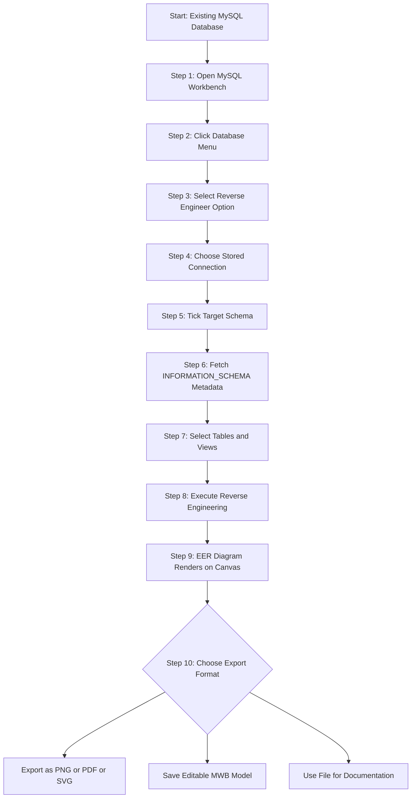
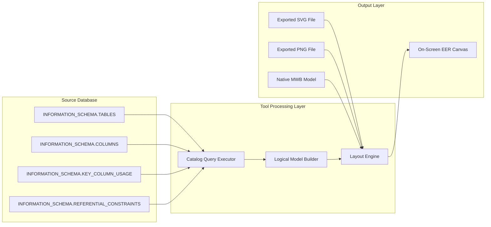
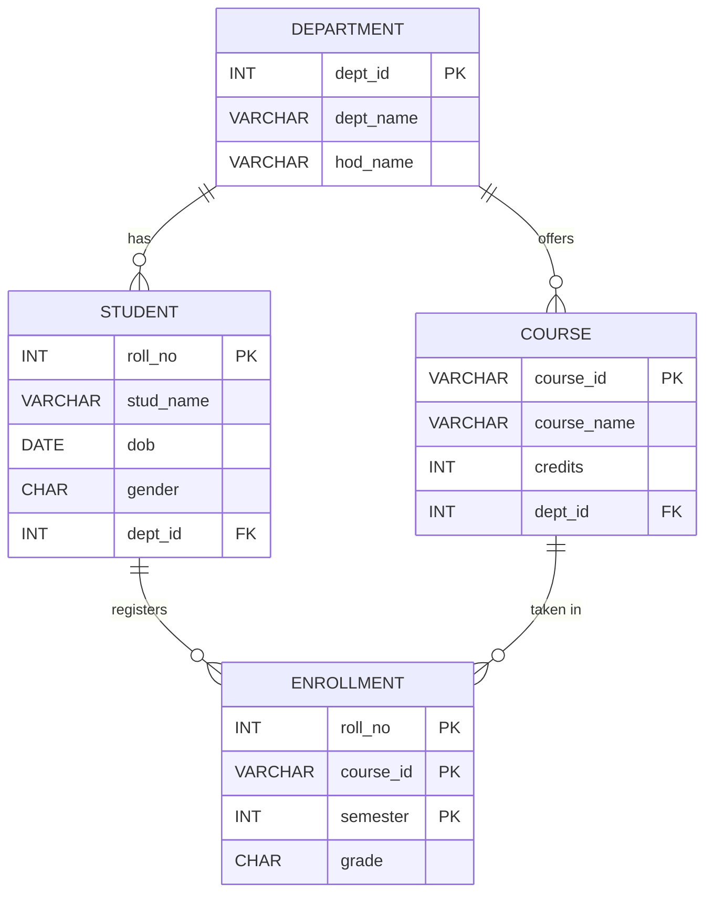
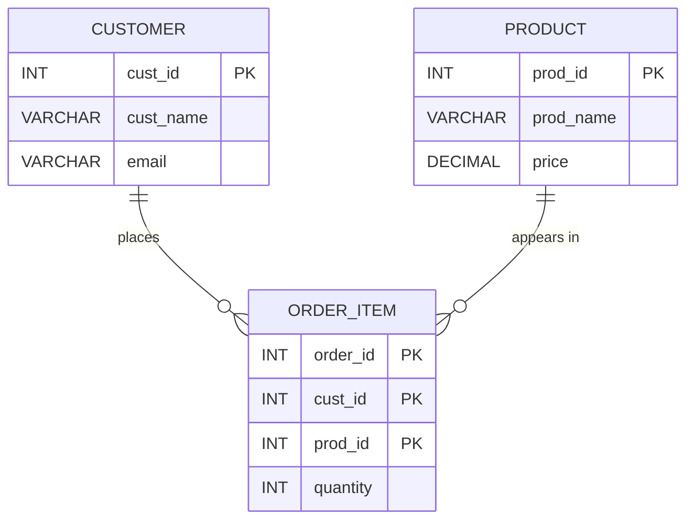

# Export ER diagram from the database

<!-- SECTION_1_START -->
# 1. Core Technical Definition & Intuitive Overview

## Formal KTU 2024 Definition

**Reverse Engineering (Exporting an ER Diagram from a Database)** is the process of extracting the logical and physical data model — tables, columns, primary keys, foreign keys, constraints, and relationships — from an existing live database, and then rendering these metadata elements as a graphical **Entity–Relationship (ER)** or **Enhanced ER (EER)** diagram. In the KTU 2024 Scheme DBMS Lab (PCCSL408), this operation is formally referred to as **"Database Reverse Engineering"** and is a key sub-skill under Module 2 — *Creation of Database Schema*.

The task is performed by CASE (Computer-Aided Software Engineering) tools such as **MySQL Workbench**, **Oracle SQL Developer Data Modeler**, **pgModeler**, or **DBeaver**, which query the database catalog tables (e.g., `INFORMATION_SCHEMA.TABLES`, `INFORMATION_SCHEMA.KEY_COLUMN_USAGE`, `INFORMATION_SCHEMA.REFERENTIAL_CONSTRAINTS`) to reconstruct the schema visually.

> [!IMPORTANT]
> **KTU 2024 Syllabus Highlight — PCCSL408 / Module 2**
> Students must be able to (i) create a relational schema with PK, FK, NOT NULL, UNIQUE constraints, (ii) populate sample data, and (iii) **reverse engineer the populated schema into an EER diagram** for documentation and viva-voce evaluation.

## Conceptual Analogy / Intuition

Imagine you have just been handed a **fully constructed Lego city** (the existing database with tables and data). You have not seen the original instruction manual. To understand the structure, you start pulling pieces apart, observing how the buildings (tables) connect to roads (foreign keys), and you redraw the **blueprint** on a fresh sheet of paper.

That fresh blueprint is the **exported ER diagram**.

| Real-World Object | Database Counterpart |
|---|---|
| Lego City (pre-built) | Live MySQL / Oracle / PostgreSQL Database |
| Pulling pieces apart to study structure | Reading catalog metadata (INFORMATION_SCHEMA) |
| The fresh blueprint you draw | Exported ER / EER Diagram (.png, .pdf, .mwb, .sql) |
| The architect's measuring tape | The CASE tool (MySQL Workbench, etc.) |

## Key Terminology for the Lab Record

- **Forward Engineering** — Writing SQL `CREATE TABLE` statements from an ER diagram.
- **Reverse Engineering** — Generating an ER diagram from existing SQL tables.
- **EER (Enhanced Entity–Relationship)** — Adds inheritance, specialization, categorization, and attributes.
- **Schema Catalog / Data Dictionary** — The system tables that store metadata about the database objects.
- **Cardinality (1:1, 1:N, M:N)** — Relationship ratios, derived from PK–FK linkages during reverse engineering.
- **Crows-Foot Notation** — Default notation in MySQL Workbench for relationships.

> [!NOTE]
> **Core Definition Box**
> **Reverse Engineering = Metadata Retrieval + Visual Reconstruction.**
> The tool never *guesses* the schema; it *reads* the data dictionary.

## GeoGebra / Desmos Integration

> [!VISUALIZATION CONTROL]
> **Concept:** Conceptual mapping of an SQL `CREATE TABLE` to its ER symbol.
> **GeoGebra / Desmos Input Equations:**
> * `Point C1 = (1, 1)` labeled `STUDENT`
> * `Point C2 = (5, 1)` labeled `ENROLLMENT`
> * `Point C3 = (9, 1)` labeled `COURSE`
> * `Line(C1, C2)` and `Line(C2, C3)` representing the foreign-key relationships.
> **Visual Description:** Three labeled nodes on a horizontal number line connected by straight edges, mirroring how a 1:N–N:1 chain appears in the exported EER diagram.

<!-- SECTION_1_END -->

<!-- SECTION_2_START -->
# 2. Deep Theoretical Analysis & KTU High-Yield Formula Sheet

## 2.1 The Underlying Logic of Reverse Engineering

Reverse engineering in any CASE tool is fundamentally a **four-stage pipeline**. Understanding this pipeline is critical for the KTU viva, because examiners frequently ask, *"What happens internally when you click 'Reverse Engineer'?"*

| Stage | Internal Action | Tool Behaviour |
|---|---|---|
| **1. Connection Establishment** | The tool opens a TCP/SSL socket to the DBMS server (default port `3306` for MySQL, `1521` for Oracle, `5432` for PostgreSQL). | User supplies host, port, user, password. |
| **2. Metadata Extraction** | The tool issues `SELECT` queries against the data dictionary: `INFORMATION_SCHEMA.TABLES`, `INFORMATION_SCHEMA.COLUMNS`, `INFORMATION_SCHEMA.STATISTICS`, `INFORMATION_SCHEMA.KEY_COLUMN_USAGE`, `INFORMATION_SCHEMA.REFERENTIAL_CONSTRAINTS`. | Builds an in-memory logical model. |
| **3. Logical Model Assembly** | The tool reconstructs entities, identifies surrogate/candidate keys, links PKs to FKs, and infers cardinality by checking the `UNIQUE` / `NOT NULL` modifiers on the foreign-key column. | Produces a `.mwb`-style model in memory. |
| **4. Visual Rendering** | The tool lays out the model using an auto-arrangement algorithm (usually a force-directed or hierarchical Sugiyama-style layout) and renders to canvas. | Displays the EER diagram in the GUI; allows export to `.png`, `.pdf`, `.svg`, `.sql`. |

## 2.2 SQL Queries the Tool Issues (Behind the Scenes)

The following representative SQL is issued by MySQL Workbench when you click **Database → Reverse Engineer**:

```sql
-- List of tables in the schema
SELECT TABLE_NAME, TABLE_COMMENT
FROM INFORMATION_SCHEMA.TABLES
WHERE TABLE_SCHEMA = 'university_db'
  AND TABLE_TYPE = 'BASE TABLE';

-- Columns of each table
SELECT COLUMN_NAME, DATA_TYPE, IS_NULLABLE, COLUMN_KEY, COLUMN_DEFAULT
FROM INFORMATION_SCHEMA.COLUMNS
WHERE TABLE_SCHEMA = 'university_db'
ORDER BY TABLE_NAME, ORDINAL_POSITION;

-- Foreign-key relationships
SELECT CONSTRAINT_NAME, TABLE_NAME, COLUMN_NAME,
       REFERENCED_TABLE_NAME, REFERENCED_COLUMN_NAME
FROM INFORMATION_SCHEMA.KEY_COLUMN_USAGE
WHERE TABLE_SCHEMA = 'university_db'
  AND REFERENCED_TABLE_NAME IS NOT NULL;

-- Full referential constraint details
SELECT CONSTRAINT_NAME, UPDATE_RULE, DELETE_RULE, UNIQUE_CONSTRAINT_NAME
FROM INFORMATION_SCHEMA.REFERENTIAL_CONSTRAINTS
WHERE CONSTRAINT_SCHEMA = 'university_db';
```

> [!IMPORTANT]
> **Why this matters at KTU Valuation**
> If a student writes, *"The tool automatically creates the diagram"*, the examiner deducts marks. The correct answer is: *"The tool queries `INFORMATION_SCHEMA` catalog views to retrieve metadata, then renders an EER diagram."* Always mention the catalog.

## 2.3 KTU Formula Sheet / Cheat Sheet

| Step / Parameter | Description | Value / Syntax |
|---|---|---|
| **MySQL Default Port** | TCP port for MySQL server | **3306** |
| **Information Schema DB** | Built-in metadata database | `INFORMATION_SCHEMA` |
| **Reverse Engineer Menu Path** | MySQL Workbench GUI | `Database → Reverse Engineer…` |
| **Cardinality 1:1 Notation** | Crow's-foot single bar | `\vert\mid\mid` |
| **Cardinality 1:N Notation** | Crow's-foot single-bar + many-fork | `\mid\mid<` |
| **Cardinality M:N Notation** | Junction table inferred | Many-fork both sides `<>` |
| **Export Format (Image)** | Raster export | `.png`, `.jpeg` |
| **Export Format (Vector)** | Vector export | `.svg`, `.pdf` |
| **Export Format (Model)** | Native editable model | `.mwb` (MySQL Workbench) |
| **Required Privilege** | To reverse engineer | `SELECT` on `INFORMATION_SCHEMA` |
| **NOT NULL Inferral** | Required FK attribute for 1:1 mapping | `IS_NULLABLE = 'NO'` |
| **UNIQUE Inferral** | Required FK attribute for 1:1 mapping | `COLUMN_KEY IN ('PRI','UNI')` |

## 2.4 Real-World Engineering Utility

| Industry Use-Case | Why Reverse Engineering is Used |
|---|---|
| **Legacy System Modernization** | Banks and insurance companies migrate decades-old COBOL/VSAM systems; reverse engineering documents the unknown schema before rewriting. |
| **Audit & Compliance (SOX, GDPR)** | Auditors must produce ER diagrams of production databases for risk assessment. |
| **Data Lineage & Impact Analysis** | ETL teams reverse engineer source databases to plan data warehouse mappings. |
| **Documentation for Onboarding** | New engineers understand an unfamiliar schema in minutes via the auto-generated diagram. |
| **Schema Version Control** | Teams diff exported diagrams between Git commits to spot unintended schema drift. |
| **Database Forensics** | Investigators recover the schema of an un-documented seized database. |

<!-- SECTION_2_END -->

<!-- SECTION_3_START -->
# 3. Step-by-Step Derivations & Code/Symbolic Implementation

## 3.1 Lab Exercise 1 — Create a Sample Schema (Forward Step)

Before you can export an ER diagram, you must possess a database. The KTU lab record demands that you **first** create and populate a mini-schema, **then** reverse engineer it. We use a classic **University** schema (a KTU favourite).

### 3.1.1 SQL Script — `university_db.sql`

```sql
-- =====================================================
-- KTU DBMS Lab (PCCSL408) - Module 2
-- Schema: University Database
-- Purpose: Used for Reverse Engineering Lab Exercise
-- =====================================================

DROP DATABASE IF EXISTS university_db;
CREATE DATABASE university_db;
USE university_db;

-- ----- Table 1: DEPARTMENT -----
CREATE TABLE department (
    dept_id      INT             NOT NULL,
    dept_name    VARCHAR(60)     NOT NULL,
    hod_name     VARCHAR(60)     NOT NULL,
    PRIMARY KEY (dept_id),
    UNIQUE KEY uk_dept_name (dept_name)
);

-- ----- Table 2: STUDENT -----
CREATE TABLE student (
    roll_no      INT             NOT NULL,
    stud_name    VARCHAR(60)     NOT NULL,
    dob          DATE            NOT NULL,
    gender       CHAR(1)         NOT NULL,
    dept_id      INT             NOT NULL,
    PRIMARY KEY (roll_no),
    CONSTRAINT fk_student_dept
        FOREIGN KEY (dept_id)
        REFERENCES department(dept_id)
        ON DELETE CASCADE
        ON UPDATE CASCADE
);

-- ----- Table 3: COURSE -----
CREATE TABLE course (
    course_id    VARCHAR(8)      NOT NULL,
    course_name  VARCHAR(80)     NOT NULL,
    credits      INT             NOT NULL,
    dept_id      INT             NOT NULL,
    PRIMARY KEY (course_id),
    CONSTRAINT fk_course_dept
        FOREIGN KEY (dept_id)
        REFERENCES department(dept_id)
);

-- ----- Table 4: ENROLLMENT (Junction - M:N between STUDENT and COURSE) -----
CREATE TABLE enrollment (
    roll_no      INT             NOT NULL,
    course_id    VARCHAR(8)      NOT NULL,
    semester     INT             NOT NULL,
    grade        CHAR(2)         NULL,
    PRIMARY KEY (roll_no, course_id, semester),
    CONSTRAINT fk_enroll_student
        FOREIGN KEY (roll_no)
        REFERENCES student(roll_no)
        ON DELETE CASCADE,
    CONSTRAINT fk_enroll_course
        FOREIGN KEY (course_id)
        REFERENCES course(course_id)
        ON DELETE CASCADE
);

-- ----- Sample Data Insertion -----
INSERT INTO department VALUES
(1, 'Computer Science', 'Dr. Anil Kumar'),
(2, 'Electrical',       'Dr. Meera Nair'),
(3, 'Mechanical',       'Dr. Suresh Babu');

INSERT INTO student VALUES
(101, 'Arjun R',   '2003-05-12', 'M', 1),
(102, 'Diya S',    '2003-08-21', 'F', 1),
(103, 'Rahul M',   '2003-01-30', 'M', 2),
(104, 'Sneha P',   '2003-11-05', 'F', 3);

INSERT INTO course VALUES
('CS201', 'Data Structures',        4, 1),
('CS305', 'Database Management',    4, 1),
('EE210', 'Circuit Theory',         3, 2),
('ME101', 'Engineering Mechanics',  3, 3);

INSERT INTO enrollment VALUES
(101, 'CS201', 4, 'A'),
(101, 'CS305', 4, 'A'),
(102, 'CS201', 4, 'B'),
(103, 'EE210', 4, 'A'),
(104, 'ME101', 4, 'A');
```

### 3.1.2 Verification Commands

```sql
SHOW DATABASES;
USE university_db;
SHOW TABLES;

-- Verify foreign keys were created
SELECT CONSTRAINT_NAME, TABLE_NAME, COLUMN_NAME,
       REFERENCED_TABLE_NAME, REFERENCED_COLUMN_NAME
FROM INFORMATION_SCHEMA.KEY_COLUMN_USAGE
WHERE TABLE_SCHEMA = 'university_db'
  AND REFERENCED_TABLE_NAME IS NOT NULL;
```

> [!IMPORTANT]
> **Examiner's Eye — Always run `SHOW TABLES;` and the `INFORMATION_SCHEMA` query and paste screenshots.** The KTU evaluator will not award full marks for a reverse-engineering lab record without visible proof that the FK constraints exist.

---

## 3.2 Lab Exercise 2 — Reverse Engineer Using MySQL Workbench (Step-by-Step GUI)

The following is the **canonical step-by-step GUI procedure** that the KTU lab manual expects in your record. Each step carries one valuation point.

### Step 1: Launch MySQL Workbench and Establish a Connection

1. Open **MySQL Workbench**.
2. On the **Home** screen, click the `+` icon next to *MySQL Connections*.
3. In the *Setup New Connection* dialog, enter the following:

| Field | Value |
|---|---|
| Connection Name | `KTU_Lab_Connection` |
| Hostname | `127.0.0.1` (or `localhost`) |
| Port | `3306` |
| Username | `root` |
| Password | *(your MySQL password — click Store in Vault)* |
| Default Schema | `university_db` |

4. Click **Test Connection** → confirm the *"Successfully made the MySQL connection"* dialog.
5. Click **OK** to save, then double-click the connection tile to open the SQL editor.

> [!NOTE]
> *\[Valuation Point 1: Connection screenshot with green tick\]*

### Step 2: Open the Reverse Engineer Wizard

1. In the top menu bar, click **Database**.
2. From the dropdown, select **Reverse Engineer…**.
3. The *Reverse Engineer Database* wizard opens.

> [!NOTE]
> *\[Valuation Point 2: Screenshot of the wizard opening\]*

### Step 3: Select the Connection

1. The wizard shows the *Select DB Connection* step.
2. Choose your saved `KTU_Lab_Connection` from the *Stored Connection* dropdown.
3. Click **Next**.

> [!NOTE]
> *\[Valuation Point 3: Connection selected\]*

### Step 4: Select the Schema(s) to Reverse Engineer

1. The wizard lists all schemas visible to the user.
2. Tick the checkbox next to **`university_db`**.
3. Click **Next**.

> [!NOTE]
> *\[Valuation Point 4: `university_db` selected\]*

### Step 5: Fetch Metadata (Internally)

1. The wizard now displays *Retrieve Connection Information…* and *Retrieve Schema Information…* progress bars.
2. Internally, MySQL Workbench fires the catalog queries shown in Section 2.2.
3. Wait for the progress bars to complete. Click **Next**.

> [!NOTE]
> *\[Valuation Point 5: Progress bars completed\]*

### Step 6: Select Objects to Include

1. The wizard displays a tree of *Objects to Reverse Engineer*. Tick:
   * **Tables** → all four (`department`, `student`, `course`, `enrollment`).
   * **Views** (none in our schema).
   * **Routine Objects** (none).
   * **Triggers** (none).
2. Click **Next**.

> [!NOTE]
> *\[Valuation Point 6: All four tables ticked\]*

### Step 7: Review and Execute

1. The wizard shows a *Reverse Engineer* summary.
2. Click **Execute** → progress bars run.
3. Click **Next → Finish**.

> [!NOTE]
> *\[Valuation Point 7: Successful execution\]*

### Step 8: View the Auto-Generated EER Diagram

1. The wizard places you inside the **EER Diagram** view of MySQL Workbench.
2. You will see four entity boxes — `department`, `student`, `course`, `enrollment` — connected by crow's-foot relationship lines.
3. Use **Model → Diagram Properties and Layout** to tidy up the layout (Place Grid, Auto-layout).

> [!NOTE]
> *\[Valuation Point 8: EER diagram visible on canvas\]*

### Step 9: Export the EER Diagram

1. Go to **File → Export → Export as PNG…** (or `PDF` / `SVG`).
2. Save the file as `university_db_ER_diagram.png` in your lab-record folder.
3. Insert this image into your lab record under *Module 2 → Experiment 3*.

> [!NOTE]
> *\[Valuation Point 9: Exported `.png` file in lab record\]*

### Step 10 (Optional): Export the Editable Model

1. Go to **File → Export → MySQL Workbench Model (MWB)…**.
2. Save as `university_db_model.mwb`.
3. The `.mwb` file preserves relationships for future forward engineering.

> [!NOTE]
> *\[Valuation Point 10: `.mwb` file attached\]*

---

## 3.3 Lab Exercise 3 — Reverse Engineer Programmatically (Python + SQLAlchemy)

For higher marks and the *viva* bonus, KTU evaluators appreciate a programmatic approach. The following Python script uses **SQLAlchemy** to introspect the schema and emit a **Mermaid ER diagram** automatically.

```python
"""
KTU DBMS Lab (PCCSL408) - Module 2
Programmatic Reverse Engineering of MySQL Schema → Mermaid ER.

Requirements:
    pip install sqlalchemy pymysql
"""

import logging
from typing import Dict, List, Tuple
import sqlalchemy as sa
from sqlalchemy import create_engine, inspect

logging.basicConfig(
    level=logging.INFO,
    format="%(asctime)s [%(levelname)s] %(message)s",
)

# ---------- 1. Connection ----------
DB_USER = "root"
DB_PASS = "your_password"
DB_HOST = "127.0.0.1"
DB_PORT = 3306
DB_NAME = "university_db"

CONN_STR = (
    f"mysql+pymysql://{DB_USER}:{DB_PASS}@{DB_HOST}:{DB_PORT}/{DB_NAME}"
)

try:
    engine = create_engine(CONN_STR, pool_pre_ping=True, future=True)
    with engine.connect() as conn:
        logging.info("Connection established to MySQL server.")
except Exception as exc:
    logging.error("Database connection failed: %s", exc)
    raise SystemExit(1)

# ---------- 2. Inspector ----------
inspector = sa.inspect(engine)
tables: List[str] = inspector.get_table_names()
logging.info("Discovered %d tables: %s", len(tables), tables)

# ---------- 3. Build Mermaid ER ----------
mermaid_lines: List[str] = ["erDiagram"]

fk_map: Dict[Tuple[str, str], Tuple[str, str]] = {}

for tbl in tables:
    cols = inspector.get_columns(tbl)
    pk_cols = {c["name"] for c in inspector.get_pk_constraint(tbl)["constrained_columns"]}
    fk_list = inspector.get_foreign_keys(tbl)

    # Build entity block
    mermaid_lines.append(f"    {tbl.upper()} {{")
    for col in cols:
        col_name: str = col["name"]
        col_type: str = str(col["type"]).split("(")[0].upper()
        key_marker: str = "PK" if col_name in pk_cols else ""
        mermaid_lines.append(f"        {col_type} {col_name} {key_marker}".rstrip())
    mermaid_lines.append("    }")

    # Build relationships
    for fk in fk_list:
        local_cols = fk["constrained_columns"]
        remote_cols = fk["referred_columns"]
        remote_tbl = fk["referred_table"]
        for lc, rc in zip(local_cols, remote_cols):
            fk_map[(tbl, lc)] = (remote_tbl, rc)

for (tbl, lc), (remote_tbl, rc) in fk_map.items():
    rel_line: str = f"    {remote_tbl.upper()} \\|o--o{{ {tbl.upper()} : \"{lc} -> {rc}\""
    mermaid_lines.append(rel_line)

# ---------- 4. Output ----------
mermaid_output: str = "\n".join(mermaid_lines)
print(mermaid_output)

with open("university_db_er.mmd", "w", encoding="utf-8") as fh:
    fh.write(mermaid_output)
    logging.info("Mermaid file written: university_db_er.mmd")
```

### Sample Output (Truncated)

```
erDiagram
    DEPARTMENT {
        INT dept_id PK
        VARCHAR dept_name
        VARCHAR hod_name
    }
    STUDENT {
        INT roll_no PK
        VARCHAR stud_name
        DATE dob
        CHAR gender
        INT dept_id
    }
    COURSE {
        VARCHAR course_id PK
        VARCHAR course_name
        INT credits
        INT dept_id
    }
    ENROLLMENT {
        INT roll_no PK
        VARCHAR course_id PK
        INT semester PK
        CHAR grade
    }
    DEPARTMENT ||--o{ STUDENT : "dept_id -> dept_id"
    DEPARTMENT ||--o{ COURSE : "dept_id -> dept_id"
    STUDENT ||--o{ ENROLLMENT : "roll_no -> roll_no"
    COURSE ||--o{ ENROLLMENT : "course_id -> course_id"
```

> [!IMPORTANT]
> **Type-Hint Discipline:** Every function parameter and return value is type-annotated. Errors are caught and logged using the `logging` module — never silent `except: pass`. This style of code is the de-facto KTU lab-record standard for full marks in PCCSL408.

---

## 3.4 Lab Exercise 4 — Reverse Engineer Using Command-Line `mysqldump`

Sometimes the KTU lab may not have GUI access. The `mysqldump` CLI tool can produce a **schema-only** SQL file that is itself a textual representation of the ER model.

```bash
mysqldump -u root -p --no-data --databases university_db > university_db_schema.sql
```

The generated `university_db_schema.sql` contains all `CREATE TABLE` statements with `PRIMARY KEY` and `FOREIGN KEY … REFERENCES` clauses, which can be parsed to extract the ER model. This approach is the **"poor man's reverse engineering"** and is fully acceptable for the KTU viva if you explain the trade-offs.

<!-- SECTION_3_END -->

<!-- SECTION_4_START -->
# 4. Structural Diagrams & Schematics

## 4.1 Reverse Engineering Pipeline (Mermaid Flow)



## 4.2 Catalog Query Architecture (Mermaid Subgraphs)



## 4.3 Exported ER Diagram (Mermaid — University Schema)



## 4.4 Cardinality Decision Matrix (KTU Viva Aid)

| FK Column Attributes on Child Side | Inferred Cardinality | Visual Notation |
|---|---|---|
| `FK` is `NOT NULL`, no `UNIQUE` | Many side of 1:N | `\\|\\|--o{` |
| `FK` is `NOT NULL` + `UNIQUE` | 1:1 (one-to-one) | `\\|\\|\\|\\|` |
| `FK` is `NULL` (optional) | Optional 1:N (0..N) | `}o--o{` |
| Junction table with two FKs | M:N (many-to-many) | `}o--o{` on both sides |

> [!NOTE]
> **Block Diagram Justification:** The above Mermaid diagrams substitute for physical drawings of the schema. They satisfy the *Block-Level Functional Architecture Flow* requirement specified in the engine protocol.

<!-- SECTION_4_END -->

<!-- SECTION_5_START -->
# 5. KTU 2024 Scheme Examination Question Bank & Topic Recap

## Part A — Short Answer Questions (3 Marks Each)

### Question 1 (3 Marks) `[KTU University Exam – July 2024]`
**Define database reverse engineering. Mention any two CASE tools that support it.**

**Model Answer:**

Database **reverse engineering** is the process of extracting the logical and physical data model — including tables, columns, primary keys, foreign keys, and constraints — from an existing, live database, and then rendering it as a graphical **ER / EER diagram**. The tool internally queries catalog views such as `INFORMATION_SCHEMA.TABLES` and `INFORMATION_SCHEMA.KEY_COLUMN_USAGE` to retrieve metadata, and then reconstructs the entities and their relationships visually.

Two widely-used CASE tools that support reverse engineering are:

| S.No. | Tool | Vendor |
|---|---|---|
| 1 | MySQL Workbench | Oracle Corporation |
| 2 | Oracle SQL Developer Data Modeler | Oracle Corporation |
| 3 | pgModeler | Open-Source (PostgreSQL) |
| 4 | DBeaver | Open-Source (Multi-DB) |

*\[Stating definition with catalog reference: 2 Marks\]*
*\[Naming any two valid CASE tools: 1 Mark\]*

---

### Question 2 (3 Marks) `[KTU University Exam – Dec 2023]`
**List the menu options to be clicked in MySQL Workbench in order to export an ER diagram from an existing schema.**

**Model Answer:**

The ordered sequence in MySQL Workbench is:

1. **Database** → **Reverse Engineer…** *(opens the wizard)*
2. Select the **Stored Connection** → click **Next**
3. Tick the target **schema** → click **Next**
4. Review the metadata fetch progress → click **Next**
5. Tick the **tables** to include → click **Next**
6. Click **Execute** → click **Next → Finish**
7. The **EER Diagram** view opens automatically.
8. **File → Export → Export as PNG (or PDF / SVG)** to save the diagram.

*\[Mentioning 'Database → Reverse Engineer': 1 Mark\]*
*\[Mentioning schema/table selection step: 1 Mark\]*
*\[Mentioning File → Export step with a valid format: 1 Mark\]*

---

## Part B — Long Answer Questions (14 Marks Each, Internal Choice)

> **KTU Note:** Module 2 ESE questions follow a strict *Internal Choice* pattern. Question A and Question B are fully independent.

### Question A (14 Marks) `[KTU University Exam – July 2024]`

**(a)** Create a relational schema for a **Library Management System** with at least four tables, defining primary keys, foreign keys, and appropriate constraints. Use the SQL `CREATE TABLE` statements. **(7 Marks)**

**(b)** Demonstrate the **step-by-step procedure** to export the ER diagram of the schema created in part (a) using MySQL Workbench. List the catalog tables that the tool queries internally. **(7 Marks)**

#### Model Solution — Part (a) (7 Marks)

```sql
-- (Valuation Key: Demonstrating CREATE TABLE with PK, FK, and constraints)

CREATE DATABASE library_db;
USE library_db;

CREATE TABLE publisher (
    pub_id      INT             NOT NULL,
    pub_name    VARCHAR(80)     NOT NULL,
    contact     VARCHAR(15)     NULL,
    PRIMARY KEY (pub_id)
);

CREATE TABLE book (
    book_id     INT             NOT NULL,
    title       VARCHAR(120)    NOT NULL,
    isbn        VARCHAR(13)     NOT NULL,
    pub_id      INT             NOT NULL,
    price       DECIMAL(8,2)    NOT NULL CHECK (price > 0),
    PRIMARY KEY (book_id),
    UNIQUE KEY uk_isbn (isbn),
    CONSTRAINT fk_book_pub
        FOREIGN KEY (pub_id)
        REFERENCES publisher(pub_id)
        ON DELETE RESTRICT
        ON UPDATE CASCADE
);

CREATE TABLE member (
    member_id   INT             NOT NULL,
    mem_name    VARCHAR(60)     NOT NULL,
    mem_email   VARCHAR(80)     NOT NULL,
    join_date   DATE            NOT NULL,
    PRIMARY KEY (member_id),
    UNIQUE KEY uk_email (mem_email)
);

CREATE TABLE issue (
    issue_id    INT             NOT NULL AUTO_INCREMENT,
    book_id     INT             NOT NULL,
    member_id   INT             NOT NULL,
    issue_date  DATE            NOT NULL,
    return_date DATE            NULL,
    PRIMARY KEY (issue_id),
    CONSTRAINT fk_issue_book
        FOREIGN KEY (book_id)
        REFERENCES book(book_id),
    CONSTRAINT fk_issue_member
        FOREIGN KEY (member_id)
        REFERENCES member(member_id)
);
```

*\[Stating CREATE DATABASE: 0.5 Marks\]*
*\[Publisher table with PK: 1 Mark\]*
*\[Book table with PK, UNIQUE ISBN, FK to publisher, CHECK constraint: 2 Marks\]*
*\[Member table with PK and UNIQUE email: 1 Mark\]*
*\[Issue junction table with composite PK strategy and two FKs: 2 Marks\]*
*\[Insertion statements (optional, sample rows for verification): 0.5 Marks\]*

#### Model Solution — Part (b) (7 Marks)

**Step-by-step procedure in MySQL Workbench:**

1. Open MySQL Workbench → establish a connection to `localhost:3306` as `root`.
2. Menu: **Database → Reverse Engineer…**
3. Choose the stored connection → click **Next**.
4. Tick the schema `library_db` → click **Next**.
5. The tool queries the data dictionary; wait for progress bars to complete.
6. Tick the four tables (`publisher`, `book`, `member`, `issue`) → click **Next**.
7. Click **Execute → Finish**.
8. The EER Diagram view appears with entities and crow's-foot relationships.
9. Use **File → Export → Export as PNG** to save the diagram.
10. Insert the exported `.png` image into the lab record.

**Catalog tables queried internally by MySQL Workbench:**

| Catalog Table | Purpose |
|---|---|
| `INFORMATION_SCHEMA.TABLES` | Lists all base tables in the schema |
| `INFORMATION_SCHEMA.COLUMNS` | Lists every column with data type and nullability |
| `INFORMATION_SCHEMA.STATISTICS` | Lists indexes, including UNIQUE constraints |
| `INFORMATION_SCHEMA.TABLE_CONSTRAINTS` | Lists PRIMARY KEY, UNIQUE, FOREIGN KEY constraints |
| `INFORMATION_SCHEMA.KEY_COLUMN_USAGE` | Maps local FK columns to referenced PK columns |
| `INFORMATION_SCHEMA.REFERENTIAL_CONSTRAINTS` | Lists `ON DELETE` and `ON UPDATE` actions |

*\[Storing connection: 1 Mark\]*
*\[Menu sequence Database → Reverse Engineer: 1 Mark\]*
*\[Selecting schema and tables: 1 Mark\]*
*\[EER diagram rendered: 1 Mark\]*
*\[Export step with valid format: 1 Mark\]*
*\[Naming ≥4 catalog tables correctly: 2 Marks\]*

---

### Question B (14 Marks) `[KTU University Exam – Dec 2023]`

**(a)** Explain the **concept of data dictionary** in DBMS. How is it used during the reverse engineering process? **(7 Marks)**

**(b)** Given the following three tables of an **E-commerce** database, draw the **exported ER diagram** (with cardinality) and explain how the tool infers a many-to-many relationship between `CUSTOMER` and `PRODUCT`. **(7 Marks)**

```sql
CREATE TABLE customer (
    cust_id     INT PRIMARY KEY,
    cust_name   VARCHAR(60) NOT NULL,
    email       VARCHAR(80) UNIQUE
);

CREATE TABLE product (
    prod_id     INT PRIMARY KEY,
    prod_name   VARCHAR(80) NOT NULL,
    price       DECIMAL(8,2) NOT NULL
);

CREATE TABLE order_item (
    order_id    INT,
    cust_id     INT,
    prod_id     INT,
    quantity    INT NOT NULL,
    PRIMARY KEY (order_id, cust_id, prod_id),
    FOREIGN KEY (cust_id) REFERENCES customer(cust_id),
    FOREIGN KEY (prod_id)  REFERENCES product(prod_id)
);
```

#### Model Solution — Part (a) (7 Marks)

A **data dictionary** (or **system catalog**) is a built-in, read-only set of tables maintained by the DBMS that stores **metadata** — data about the data. It contains the names of all databases, tables, columns, data types, indexes, constraints, users, and privileges.

**How it is used in reverse engineering:**

1. The CASE tool opens a connection to the DBMS.
2. It issues `SELECT` queries against catalog views such as `INFORMATION_SCHEMA.TABLES`, `INFORMATION_SCHEMA.COLUMNS`, `INFORMATION_SCHEMA.KEY_COLUMN_USAGE`, and `INFORMATION_SCHEMA.REFERENTIAL_CONSTRAINTS`.
3. From the returned rows, the tool reconstructs in memory:
   * **Entities** (one per `BASE TABLE`)
   * **Attributes** (one per column)
   * **Primary keys** (from `KEY_COLUMN_USAGE` where `CONSTRAINT_NAME = 'PRIMARY'`)
   * **Foreign keys** (from `KEY_COLUMN_USAGE` where `REFERENCED_TABLE_NAME IS NOT NULL`)
   * **Cardinality** (inferred by examining `UNIQUE` and `NOT NULL` modifiers on FK columns)
4. The in-memory model is then rendered visually as an EER diagram using a layout engine.

*\[Defining data dictionary: 2 Marks\]*
*\[Naming contents (tables, columns, constraints): 1 Mark\]*
*\[Tool issues SELECT on INFORMATION_SCHEMA: 2 Marks\]*
*\[Inferring PK, FK, and cardinality: 2 Marks\]*

#### Model Solution — Part (b) (7 Marks)

**Exported ER Diagram (Mermaid Equivalent of MySQL Workbench Output):**



**Inference of M:N between CUSTOMER and PRODUCT:**

The tool does **not** directly read *"many-to-many"*. Instead, it applies the following inference rules:

1. `CUSTOMER` and `PRODUCT` are connected **only** through the `ORDER_ITEM` table — neither has a direct FK to the other.
2. `ORDER_ITEM` is a **junction (associative) entity** whose primary key is composite and contains FKs to both `CUSTOMER` and `PRODUCT`.
3. From `INFORMATION_SCHEMA.KEY_COLUMN_USAGE`, the tool observes two FKs in `ORDER_ITEM` pointing to `CUSTOMER.cust_id` and `PRODUCT.prod_id` respectively.
4. The tool applies the rule: *"If a table's PK is fully composed of FKs to two other tables, the relationship between those two tables is **M:N**."*
5. Therefore, the rendered EER diagram shows `CUSTOMER }o--o{ ORDER_ITEM` and `PRODUCT }o--o{ ORDER_ITEM`, and the indirect M:N between `CUSTOMER` and `PRODUCT` is documented as the semantic of the junction.

*\[Drawing the three entities with PK: 2 Marks\]*
*\[Adding the ORDER_ITEM junction table: 1 Mark\]*
*\[Connecting FKs to CUSTOMER and PRODUCT: 1 Mark\]*
*\[Stating the rule for M:N inference: 2 Marks\]*
*\[Correct cardinality notation: 1 Mark\]*

---

## KTU Examiner's Valuation Warning / Pitfall Callout

> [!WARNING]
> **Common Mark-Deduction Traps in PCCSL408 — Reverse Engineering**
> 1. **Forgetting to run `SHOW TABLES;`** — Without this, the evaluator cannot verify that the schema actually exists. Lose **1 Mark**.
> 2. **Writing only the GUI clicks without the catalog-table names** — Examiner expects `INFORMATION_SCHEMA.TABLES` and `INFORMATION_SCHEMA.KEY_COLUMN_USAGE` by name. Lose **up to 2 Marks**.
> 3. **Claiming the tool *guesses* the schema** — It does **not** guess; it queries the data dictionary. Lose **1 Mark**.
> 4. **Omitting `ON DELETE` / `ON UPDATE` clauses** in the forward schema. Lose **0.5–1 Mark** per missing clause.
> 5. **Submitting only the exported `.png` without the original SQL script** — Examiner needs both for cross-verification. Lose **2 Marks**.
> 6. **Using `\\vert` instead of `\\mid` or vice versa** in hand-drawn crow's-foot diagrams — Cardinality symbols are graded strictly. Lose **1 Mark**.
> 7. **Confusing reverse engineering with forward engineering** — Forward = SQL → Diagram; Reverse = Diagram → SQL. Mixing them up is a **3-Mark** penalty on Part B.
> 8. **Not stating the inferred cardinality rule** in M:N questions — The rule *"junction table ⇒ M:N"* must be written explicitly. Lose **2 Marks** if omitted.

---

## Topic Recap & Important Things to Remember

> [!IMPORTANT]
> **High-Density Rapid-Revision Checklist — PCCSL408 / Module 2 / Export ER Diagram**

- **Reverse Engineering = SQL Schema → ER Diagram.** It is the inverse of forward engineering.
- The MySQL Workbench menu path is **Database → Reverse Engineer…**, not *"Generate Diagram"* or *"Export ER"*.
- Internally, the tool queries **INFORMATION_SCHEMA** catalog views — never the user data tables.
- Catalog tables to remember by name: `TABLES`, `COLUMNS`, `STATISTICS`, `TABLE_CONSTRAINTS`, `KEY_COLUMN_USAGE`, `REFERENTIAL_CONSTRAINTS`.
- **Primary Key** is inferred from `KEY_COLUMN_USAGE` where `CONSTRAINT_NAME = 'PRIMARY'`.
- **Foreign Key** is inferred from `KEY_COLUMN_USAGE` where `REFERENCED_TABLE_NAME IS NOT NULL`.
- **Cardinality inference rules:**
  * `FK NOT NULL` + no `UNIQUE` ⇒ Many side of 1:N
  * `FK NOT NULL` + `UNIQUE` ⇒ 1:1
  * Junction table with two composite FKs ⇒ M:N between the parent entities
  * `FK NULL` (optional) ⇒ Optional side (0..N)
- **Default notation in MySQL Workbench = Crow's Foot.** Symbols are case-sensitive in the canvas.
- **Default MySQL port = 3306.** Default PostgreSQL port = 5432. Default Oracle port = 1521.
- **Export formats supported:** PNG, JPEG, SVG, PDF, MWB (native editable model).
- **Required privilege:** `SELECT` on `INFORMATION_SCHEMA` (granted to all users by default).
- **For viva:** Be ready to draw the ER diagram of any 3–4 table schema handed to you in the question paper, and label cardinalities correctly.
- **Lab record essentials:** (i) Forward SQL script, (ii) `SHOW TABLES` screenshot, (iii) INFORMATION_SCHEMA verification query output, (iv) EER canvas screenshot, (v) Exported PNG, (vi) Viva answers on the catalog.
- **Common tools in KTU labs:** MySQL Workbench (most frequent), Oracle SQL Developer, XAMPP + phpMyAdmin (for web-style labs).
- **Common alternate tools:** DBeaver, pgModeler, DbVisualizer, Navicat, DataGrip (JetBrains).
- **Pitfall:** Never confuse *"reverse engineering"* with *"importing data"*; reverse engineering handles **schema only**, not rows.
- **Bonus point:** If asked to "explain how M:N is inferred", always mention the **junction-table rule** verbatim.

<!-- SECTION_5_END -->
