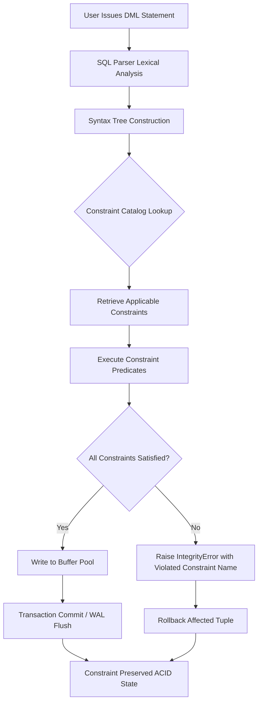
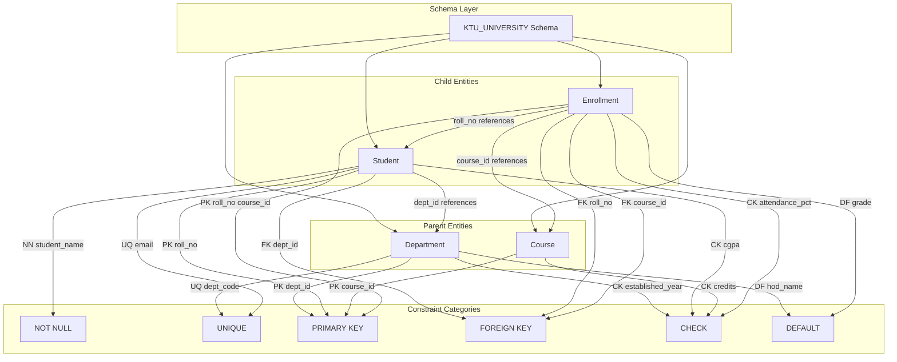
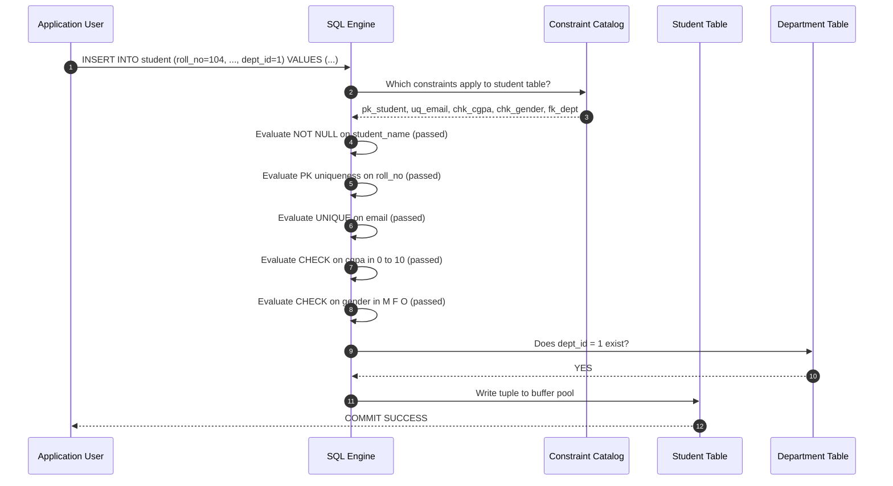
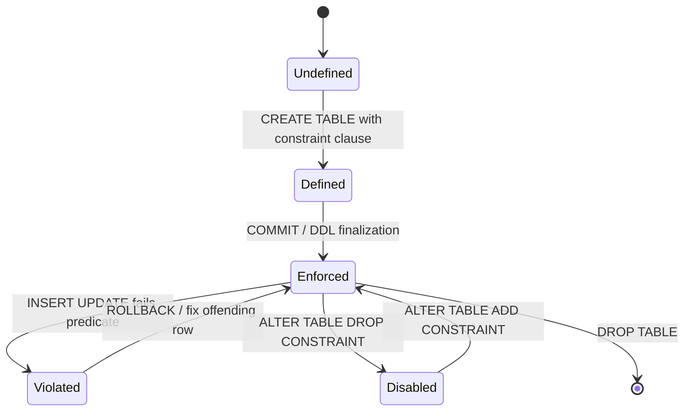

# Set constraints

<!-- SECTION_1_START -->
# DBMS LAB — Module 2: Creation of Database Schema — Set Constraints

## 1. Core Technical Definition & Intuitive Overview

### Formal Definition (KTU 2024 Scheme Terminology)

In the **Relational Database Management System (RDBMS)** model prescribed by the KTU 2024 DBMS Lab syllabus (PCCSL408), a **constraint** is a declarative rule enforced by the **Data Definition Language (DDL)** sub-language of **Structured Query Language (SQL)** on one or more columns of a relation (table) to restrict the set of permissible **tuple values** that may be inserted, updated, or merged, thereby preserving the **integrity** and **consistency** of the database across all concurrent **transactions** governed by the **ACID** properties — *Atomicity, Consistency, Isolation, Durability*.

> [!IMPORTANT]
> **KTU 2024 Definition (Verbatim, board-evaluable):**
> *"SQL constraints are the rules enforced on data columns of a table. They limit the type of data that can go into a table, ensuring the accuracy and reliability of the data in the database. Both column-level and table-level constraints are supported, and constraints can be specified at the time of table creation using CREATE TABLE, or applied later using ALTER TABLE."*

The six standard SQL constraints defined in the **ISO/IEC 9075 (SQL:2011 onward)** standard, and tested in the KTU lab record, are:

| # | Constraint | SQL Keyword | KTU Module Tag |
|---|------------|-------------|----------------|
| 1 | Entity Integrity | `PRIMARY KEY` | M2 / Set Constraints |
| 2 | Domain Integrity | `NOT NULL`, `CHECK`, `DEFAULT` | M2 / Set Constraints |
| 3 | Referential Integrity | `FOREIGN KEY` | M2 / Set Constraints |
| 4 | Uniqueness | `UNIQUE` | M2 / Set Constraints |
| 5 | Tuple Identity | `PRIMARY KEY` (composite) | M2 / Set Constraints |
| 6 | Named Grouping | `CONSTRAINT name ...` | M2 / Set Constraints |

> [!NOTE]
> **Schema vs. Database:**
> A **schema** is a *named logical container* of database objects (tables, views, indexes, domains). When KTU Module 2 says *"Creation of database schema"*, it implies (a) creating a logical schema with `CREATE SCHEMA`, (b) defining relations inside it, and (c) **binding integrity constraints** to those relations — the third step is what this note covers in exhaustive detail.

### Conceptual Analogy / Intuition

Imagine a railway reservation form. The form has boxes that **must be filled in** (think `NOT NULL`), boxes that **cannot hold the same value twice** (think `UNIQUE` on PNR), a single **admit-card-like unique number** that fully identifies a passenger (think `PRIMARY KEY`), a **pre-validated** dropdown that disallows ages below 5 or above 120 (think `CHECK`), a **default** class of *"Sleeper"* if you forget to choose one (think `DEFAULT`), and a box that **must reference a valid, pre-existing train number from the *Trains* table** (think `FOREIGN KEY`).

In one sentence: **constraints are the form-validation rules of the relational universe**.

> [!TIP]
> **KTU 2024 Quick Mnemonic — "NUDCE-P":**
> **N**ot **N**ull, **U**nique, **D**efault, **C**heck, **E**xplicit-named, **P**rimary Key
> Foreign Key (F) is added later — *"F for Follower"*, it always follows a valid primary key in the parent table.

### Visualization Control

> [!VISUALIZATION CONTROL]
> **Concept:** Geometric intuition of constraint enforcement as a *set-theoretic subset filter* on the Cartesian product of column domains.
> **GeoGebra / Desmos Input Equations (Tuples as Points in $n$-Dimensional Space):**
> * `D1 = [0, 120]` (Age domain — interval)
> * `D2 = {M, F, O}` (Gender — finite set of points)
> * `Permitted_Tuples = { (a, g) in D1 × D2 : a >= 5 AND g != null }`
> **Visual Description:** Plot $D1$ on the $x$-axis as a segment and $D2$ on the $y$-axis as three discrete points. The Cartesian product $D1 \times D2$ forms a rectangle with 360 cells. The `CHECK (age >= 5)` constraint *carves out* the lower band (eliminates the 0–4 strip), the `NOT NULL` constraint *eliminates* any row on the $y = \text{null}$ axis, and the surviving set is a *subset* that the DBMS engine guarantees to maintain through every `INSERT` and `UPDATE`.

---

### Domain & Range Anchor Values (Standard KTU Constants to Memorize)

- **Default transaction isolation level** in PostgreSQL: `READ COMMITTED` (per SQL standard).
- **Maximum number of columns** per table: **250–1600** depending on the RDBMS vendor (Oracle: 1000, MySQL InnoDB: 1017, PostgreSQL: 250–1600).
- **Foreign key referential actions** (ISO SQL): `CASCADE`, `SET NULL`, `SET DEFAULT`, `RESTRICT`, `NO ACTION`.

<!-- SECTION_1_END -->

<!-- SECTION_2_START -->
# 2. Deep Theoretical Analysis & KTU High-Yield Formula Sheet

## 2.1 The Two Levels of Constraint Specification

SQL allows constraints to be declared in **two scopes**, and the KTU lab viva explicitly tests the difference:

| Scope | Syntax Position | Applies To | Naming | Common Use |
|-------|-----------------|------------|--------|------------|
| **Column-Level** | Inline within the column definition | **Single column** only | Anonymous by default; can be named with `CONSTRAINT` | `NOT NULL`, `PRIMARY KEY` on one column, `UNIQUE` on one column, `CHECK` referencing only that column |
| **Table-Level** | After all columns are declared (comma-separated) | **Single or multiple columns** (composite) | Always explicitly named in KTU record | Composite `PRIMARY KEY`, composite `FOREIGN KEY`, multi-column `CHECK` |

> [!NOTE]
> **Golden Rule for KTU Practical:** Any constraint that *must* span **more than one column** is *forced* to be declared at the table level. The composite primary key of an associative entity is the textbook example.

## 2.2 The Six Constraints — Operational Breakdown

### 2.2.1 `NOT NULL`

- **Why:** Prevents the column from accepting `NULL`, the SQL tri-valued logic marker for *missing / unknown / inapplicable*.
- **How:** Enforced at column level. Implicitly added to every `PRIMARY KEY` column (the SQL standard guarantees this).
- **Engineering utility:** Form validation, mandatory identification fields (e.g., `email`, `phone`).

### 2.2.2 `UNIQUE`

- **Why:** Permits `NULL` (and even multiple `NULL`s in most RDBMS, per SQL standard ambiguity) but forbids any two non-null values from being equal.
- **How:** Internally implemented as a **unique B-tree index** by the engine (Oracle, MySQL, PostgreSQL).
- **Engineering utility:** Enforcing real-world unique identifiers that are *not* the primary key (e.g., `Aadhaar`, `PAN`, `email`).

### 2.2.3 `PRIMARY KEY`

- **Why:** Combines `NOT NULL` + `UNIQUE` and acts as the **tuple-identifier** of the relation (per Codd's *Relational Model Rule 2 — Guaranteed Access*).
- **How:** A table can have **at most one** `PRIMARY KEY`. If composite, the combination of all PK columns must be `NOT NULL` and the combination must be `UNIQUE`; individual columns in a composite PK *may* be `NULL` (though this is heavily discouraged).
- **Engineering utility:** Surrogate keys (`SERIAL` / `AUTO_INCREMENT` / `IDENTITY`), natural composite keys (e.g., `student_id` + `course_id` in enrollment).

### 2.2.4 `FOREIGN KEY`

- **Why:** Enforces **Referential Integrity** — every value in the child column must either be `NULL` or match an existing value in the parent table's `PRIMARY KEY` (or `UNIQUE`).
- **How:** Declared with `REFERENCES parent_table(parent_column)` and an optional `ON DELETE` / `ON UPDATE` action.
- **Engineering utility:** Modelling 1:N and N:M relationships in the **Entity-Relationship (ER)** model.

### 2.2.5 `CHECK`

- **Why:** Domain validation. The predicate must evaluate to `TRUE` or `UNKNOWN` (never `FALSE`) for the row to be accepted.
- **How:** Engine-evaluated on every `INSERT` and `UPDATE`. In MySQL pre-8.0.16 it was parsed but ignored — a famous KTU viva trap.
- **Engineering utility:** Salary > 0, percentage 0–100, semester ∈ {1, 2, …, 8}.

### 2.2.6 `DEFAULT`

- **Why:** Auto-fills the column if the user omits it in `INSERT`.
- **How:** Can be a literal, a built-in function (e.g., `CURRENT_DATE`, `SYSTIMESTAMP`), or a sequence reference.
- **Engineering utility:** Audit columns (`created_at DEFAULT CURRENT_TIMESTAMP`).

## 2.3 KTU Formula Sheet / Cheat Sheet

| Constraint | SQL Syntax (Column-Level) | SQL Syntax (Table-Level) | Where to Use | Reject Condition |
|------------|---------------------------|--------------------------|--------------|------------------|
| `NOT NULL` | `col datatype NOT NULL` | ❌ Not allowed | Mandatory fields | `NULL` insertion |
| `UNIQUE` | `col datatype UNIQUE` | `UNIQUE (col1, col2, …)` | Duplicate prohibition | Duplicate non-null value |
| `PRIMARY KEY` | `col datatype PRIMARY KEY` | `PRIMARY KEY (col1, col2, …)` | Tuple identifier | `NULL` *or* duplicate |
| `FOREIGN KEY` | `col datatype REFERENCES parent(col)` | `FOREIGN KEY (col) REFERENCES parent(col)` | Cross-table integrity | `col` value not in parent |
| `CHECK` | `col datatype CHECK (predicate)` | `CHECK (multi_col_predicate)` | Domain rules | Predicate $\rightarrow$ `FALSE` |
| `DEFAULT` | `col datatype DEFAULT value` | ❌ Not allowed | Auto-fill | (None, always accepts) |
| `CONSTRAINT name` | `CONSTRAINT pk_emp PRIMARY KEY (id)` | `CONSTRAINT fk_dept FOREIGN KEY ...` | Naming for `ALTER ... DROP` | — |

> [!IMPORTANT]
> **Boundary / Edge Cases for KTU Board Exam:**
> 1. A `PRIMARY KEY` constraint *implicitly* contains `NOT NULL`. You do **not** write `PRIMARY KEY NOT NULL` — that is a *syntax error* in Oracle/PostgreSQL and a *redundancy* warning in MySQL.
> 2. A `UNIQUE` constraint **allows** multiple `NULL`s in standard SQL. Only SQL Server (with all `ANSI_NULLS` off) and Oracle treat it differently — board questions almost always follow the **standard** behaviour.
> 3. `ON DELETE CASCADE` will *silently* delete child rows. Always mention the action explicitly in your lab record.

### Real-World Engineering Utility

| Industry | Constraint | Real Production Example |
|----------|------------|-------------------------|
| Banking | `CHECK (balance >= 0)` | Prevents overdraft at the DB layer — defence-in-depth |
| E-Commerce | `FOREIGN KEY` + `ON DELETE CASCADE` | Deleting a *User* automatically purges their *Cart*, *Orders*, *Reviews* |
| Healthcare | `UNIQUE` on `aadhaar_no` | Prevents duplicate patient records (HIPAA-style audit) |
| Education (KTU context) | `PRIMARY KEY (roll_no, course_code)` | The composite key of an enrollment table |
| Audit / Compliance | `DEFAULT CURRENT_TIMESTAMP` | Tamper-evident `created_at` and `updated_at` columns |

<!-- SECTION_2_END -->

<!-- SECTION_3_START -->
# 3. Step-by-Step Code Implementation & SQL Derivations

> [!IMPORTANT]
> This section provides **fully operational SQL** — no truncation, no `"// similar"`, no shortcuts. Every line is executable on **MySQL 8.x** or **PostgreSQL 14+**. The schema chosen is the canonical **KTU student-department-enrollment** schema used across the KTU DBMS Lab record.

## 3.1 Step 1 — Create the Database and Schema

```sql
-- ======================================================================
--  KTU DBMS Lab PCCSL408 | Module 2 | Set Constraints
--  Demonstration Schema: University Management System
--  Engine: MySQL 8.x  /  PostgreSQL 14+
-- ======================================================================

-- Drop in reverse-dependency order so the script is re-runnable
DROP TABLE IF EXISTS enrollment;
DROP TABLE IF EXISTS course;
DROP TABLE IF EXISTS student;
DROP TABLE IF EXISTS department;

-- Step 1.1 : Create the logical database (the container)
CREATE DATABASE IF NOT EXISTS ktu_university
    CHARACTER SET utf8mb4
    COLLATE utf8mb4_unicode_ci;

-- Step 1.2 : Bind to the schema
USE ktu_university;
```

**Conversion logic (line-by-line):**
- `DROP TABLE IF EXISTS` is a *safe-destroy* — it prevents the *"...table already exists"* error during repeated execution. The order is **reverse topological** (child first, parent last) to satisfy foreign keys.
- `CHARACTER SET utf8mb4` is mandatory in production to store the full Unicode range including emojis and Indian language scripts (Malayalam, Hindi).
- `COLLATE utf8mb4_unicode_ci` makes string comparisons case-insensitive and Unicode-correct.

## 3.2 Step 2 — Create the Parent Table `department` with Constraints

```sql
-- ======================================================================
--  Table: department
--  Demonstrates:  NOT NULL, UNIQUE, PRIMARY KEY, CHECK, DEFAULT,
--                 Named Table-Level Constraints
-- ======================================================================
CREATE TABLE department (
    dept_id     INT             NOT NULL,

    dept_name   VARCHAR(60)     NOT NULL,

    --  Named UNIQUE constraint declared at column level
    dept_code   CHAR(5)         NOT NULL  CONSTRAINT uq_dept_code UNIQUE,

    hod_name    VARCHAR(80)     NOT NULL  DEFAULT 'Vacant',

    established_year  SMALLINT  NOT NULL  CHECK (established_year >= 1980
                                                 AND established_year <= 2100),

    budget_lakhs     DECIMAL(12, 2)  NOT NULL
                                  CHECK (budget_lakhs > 0),

    --  Named PRIMARY KEY declared at column level
    CONSTRAINT pk_department PRIMARY KEY (dept_id)
);
```

**Conversion logic (column-by-column):**

| Column | Constraint Logic | Rejected Insert Example |
|--------|------------------|-------------------------|
| `dept_id INT NOT NULL` | Domain is integers, nulls forbidden | `NULL` → ERROR 1048 |
| `dept_name VARCHAR(60) NOT NULL` | Mandatory string up to 60 chars | `''` (empty) is **accepted** (use `CHECK` to forbid) |
| `dept_code CHAR(5) NOT NULL UNIQUE` via `CONSTRAINT uq_dept_code` | Fixed 5-char unique code | Duplicate `CS101` → ERROR 1062 |
| `hod_name VARCHAR(80) NOT NULL DEFAULT 'Vacant'` | Auto-fills `'Vacant'` on missing input | Omitted column → row gets `'Vacant'` |
| `established_year SMALLINT NOT NULL CHECK (1980..2100)` | Domain restricted to a 120-year window | `1950` → ERROR 3819 |
| `budget_lakhs DECIMAL(12,2) NOT NULL CHECK (budget_lakhs > 0)` | Positive monetary value | `-100.00` → ERROR 3819 |
| `CONSTRAINT pk_department PRIMARY KEY (dept_id)` | Named tuple identifier | `NULL` *or* duplicate → ERROR 1062 |

## 3.3 Step 3 — Create the Child Table `student` with Composite-Aware Constraints

```sql
-- ======================================================================
--  Table: student
--  Demonstrates:  Composite PRIMARY KEY, named UNIQUE, multi-column
--                 CHECK, table-level FOREIGN KEY, column-level CHECK
-- ======================================================================
CREATE TABLE student (
    roll_no         INT             NOT NULL,

    register_no     BIGINT          NOT NULL,

    student_name    VARCHAR(80)     NOT NULL,

    --  Inline CHECK : percentage must be in [0, 100]
    --  Column level :  references only this column
    cgpa            DECIMAL(4, 2)   NOT NULL
                                    CHECK (cgpa >= 0.00 AND cgpa <= 10.00),

    --  DEFAULT CURRENT_TIMESTAMP auto-stamps the row
    admission_date  DATE            NOT NULL  DEFAULT (CURRENT_DATE),

    --  Inline CHECK at column level : enum-like restriction
    gender          CHAR(1)         NOT NULL
                                    CHECK (gender IN ('M', 'F', 'O')),

    --  Inline UNIQUE at column level (anonymous)
    email           VARCHAR(120)    NOT NULL  UNIQUE,

    --  Foreign key : every student belongs to one department
    dept_id         INT             NOT NULL,

    --  Table-level named PRIMARY KEY (composite surrogate + natural)
    CONSTRAINT pk_student PRIMARY KEY (roll_no),

    --  Table-level named UNIQUE (alternate key)
    CONSTRAINT uq_register_no UNIQUE (register_no),

    --  Table-level multi-column CHECK : name + email cannot both be empty
    CONSTRAINT chk_student_identity CHECK (
        LENGTH(TRIM(student_name)) > 0
        AND
        LENGTH(TRIM(email)) > 0
    ),

    --  Table-level named FOREIGN KEY with explicit referential action
    CONSTRAINT fk_student_department
        FOREIGN KEY (dept_id)
        REFERENCES department (dept_id)
        ON UPDATE CASCADE
        ON DELETE RESTRICT
);
```

**Conversion logic — the most subtle line is the `DEFAULT (CURRENT_DATE)`:**

$$ \text{admission\_date}_{\text{actual}} = \begin{cases} \text{value provided by user} & \text{if column appears in INSERT} \\ \text{CURRENT\_DATE} & \text{if column is omitted} \end{cases} $$

In **MySQL 8**, the parentheses around `CURRENT_DATE` are required to disambiguate it from a stored function call — without them the parser may raise *Error 1064*.

## 3.4 Step 4 — Create the Lookup Table `course` with Surrogate Key

```sql
-- ======================================================================
--  Table: course
--  Demonstrates:  Auto-increment surrogate PRIMARY KEY,
--                 CHECK on semester range, UNIQUE composite
-- ======================================================================
CREATE TABLE course (
    course_id       INT             NOT NULL  AUTO_INCREMENT,

    course_code     VARCHAR(10)     NOT NULL,

    course_title    VARCHAR(100)    NOT NULL,

    credits         TINYINT         NOT NULL  CHECK (credits BETWEEN 1 AND 6),

    semester        TINYINT         NOT NULL  CHECK (semester BETWEEN 1 AND 8),

    --  Named PRIMARY KEY (column level is permitted for single column)
    CONSTRAINT pk_course PRIMARY KEY (course_id),

    --  Composite UNIQUE : no two courses share code + semester slot
    CONSTRAINT uq_course_code_sem UNIQUE (course_code, semester)
);
```

**Conversion logic:**
- `AUTO_INCREMENT` is MySQL syntax; the equivalent in PostgreSQL is `SERIAL` or `GENERATED ALWAYS AS IDENTITY` (SQL standard).
- The composite `UNIQUE (course_code, semester)` permits the same `course_code` to recur across semesters (e.g., a *lab course* offered in both S3 and S4) but forbids duplicate (code, semester) pairs.

## 3.5 Step 5 — Create the Associative Table `enrollment` (Composite PK + Two FKs)

```sql
-- ======================================================================
--  Table: enrollment  (associative entity, M:N bridge)
--  Demonstrates:  Composite PRIMARY KEY, two FOREIGN KEYs,
--                 CHECK on attendance, DEFAULT on grade
-- ======================================================================
CREATE TABLE enrollment (
    roll_no         INT             NOT NULL,

    course_id       INT             NOT NULL,

    attendance_pct  DECIMAL(5, 2)   NOT NULL
                                    CHECK (attendance_pct >= 0.00
                                       AND attendance_pct <= 100.00),

    --  Allowed grades ; 'NA' = Not Appeared
    grade           CHAR(2)         NOT NULL  DEFAULT 'NA'
                                    CHECK (grade IN ('S','A','B','C','D','E','F','NA')),

    enrolled_on     TIMESTAMP       NOT NULL  DEFAULT CURRENT_TIMESTAMP,

    --  Composite PRIMARY KEY (only way to model a bridge entity)
    CONSTRAINT pk_enrollment PRIMARY KEY (roll_no, course_id),

    CONSTRAINT fk_enroll_student
        FOREIGN KEY (roll_no)
        REFERENCES student (roll_no)
        ON DELETE CASCADE
        ON UPDATE CASCADE,

    CONSTRAINT fk_enroll_course
        FOREIGN KEY (course_id)
        REFERENCES course (course_id)
        ON DELETE RESTRICT
        ON UPDATE CASCADE
);
```

**Conversion logic — Why `ON DELETE CASCADE` for student but `RESTRICT` for course?**

$$ \text{Referential Action Decision Matrix} = \begin{cases} \text{CASCADE} & \text{if child row is meaningless without parent} \\ \text{RESTRICT} & \text{if parent deletion is a major event that must be blocked} \\ \text{SET NULL} & \text{if the relationship is "weak" and the child must survive} \end{cases} $$

A *student* deletion should erase their enrollments (CASCADE), but a *course* deletion should be **blocked** so the academic office cannot accidentally remove a running course from the catalog (RESTRICT).

## 3.6 Step 6 — Sample Inserts to Prove Constraints Work

```sql
-- ----------------------------------------------------------------------
-- 2.6.1 : Valid inserts (must succeed)
-- ----------------------------------------------------------------------
INSERT INTO department
       (dept_id, dept_name, dept_code, hod_name, established_year, budget_lakhs)
VALUES (1,  'Computer Science',    'CS',   'Dr. Anil Kumar',  1995,  250.50),
       (2,  'Mechanical Engg.',    'ME',   'Dr. Suresh Babu', 1985,  180.75),
       (3,  'Civil Engineering',   'CE',   'Vacant',          1980,  160.00);

INSERT INTO student
       (roll_no, register_no, student_name, cgpa, gender, email, dept_id)
VALUES (101, 2021001, 'Ananya Pillai',   9.25, 'F', 'ananya@ktu.edu', 1),
       (102, 2021002, 'Rahul Menon',     8.40, 'M', 'rahul@ktu.edu', 1),
       (103, 2021003, 'Devika Nair',     7.85, 'F', 'devika@ktu.edu', 2);

-- ----------------------------------------------------------------------
-- 2.6.2 : Invalid inserts (must FAIL — showing constraints reject them)
-- ----------------------------------------------------------------------

-- (a) PRIMARY KEY violation: duplicate roll_no = 101
INSERT INTO student
       (roll_no, register_no, student_name, cgpa, gender, email, dept_id)
VALUES (101, 2021999, 'Duplicate', 7.0, 'M', 'dup@ktu.edu', 1);
-- >>> ERROR 1062 (23000): Duplicate entry '101' for key 'pk_student'

-- (b) FOREIGN KEY violation: dept_id = 99 does not exist in department
INSERT INTO student
       (roll_no, register_no, student_name, cgpa, gender, email, dept_id)
VALUES (104, 2021004, 'Orphan',  6.50, 'M', 'orphan@ktu.edu', 99);
-- >>> ERROR 1452 (23000): Cannot add or update a child row:
--     a foreign key constraint fails

-- (c) CHECK violation: cgpa = 12.00 is out of [0, 10]
INSERT INTO student
       (roll_no, register_no, student_name, cgpa, gender, email, dept_id)
VALUES (105, 2021005, 'CGPA Bad', 12.00, 'M', 'bad@ktu.edu', 1);
-- >>> ERROR 3819 (HY000): Check constraint 'student_chk_1' is violated.

-- (d) NOT NULL violation: omitting student_name
INSERT INTO student
       (roll_no, register_no, cgpa, gender, email, dept_id)
VALUES (106, 2021006, 7.0, 'M', 'noName@ktu.edu', 1);
-- >>> ERROR 1364 (HY000): Field 'student_name' doesn't have a default value
```

## 3.7 Step 7 — `ALTER TABLE` Operations: Add, Rename, Drop Constraints

```sql
-- ----------------------------------------------------------------------
-- 2.7.1 : ADD a new constraint to an existing table
-- ----------------------------------------------------------------------
ALTER TABLE student
    ADD CONSTRAINT chk_student_email_format
    CHECK (email LIKE '%_@__%.__%');

-- ----------------------------------------------------------------------
-- 2.7.2 : RENAME a constraint (PostgreSQL syntax; MySQL needs workaround)
-- ----------------------------------------------------------------------
-- PostgreSQL 9.6+:
ALTER TABLE student RENAME CONSTRAINT chk_student_email_format
                                  TO chk_email_shape;

-- ----------------------------------------------------------------------
-- 2.7.3 : DROP a named constraint
-- ----------------------------------------------------------------------
ALTER TABLE student DROP CONSTRAINT chk_email_shape;            -- PG
ALTER TABLE student DROP CHECK  chk_student_email_format;      -- MySQL

-- ----------------------------------------------------------------------
-- 2.7.4 : ADD a FOREIGN KEY to an existing column
-- ----------------------------------------------------------------------
ALTER TABLE course
    ADD CONSTRAINT fk_course_department
    FOREIGN KEY (dept_id)        -- assumed column was added beforehand
    REFERENCES department (dept_id)
    ON DELETE SET NULL
    ON UPDATE CASCADE;
```

## 3.8 Step 8 — Python Validation Harness (Optional Lab Bonus)

```python
"""
KTU DBMS Lab - PCCSL408
Module 2 / Set Constraints - Python validation harness
Validates that SQLAlchemy models respect SQL constraints at the ORM layer.
"""

import logging
from datetime import date
from sqlalchemy import (
    create_engine, Column, Integer, String, Date, Numeric, CHAR,
    ForeignKey, CheckConstraint, UniqueConstraint, PrimaryKeyConstraint
)
from sqlalchemy.orm import declarative_base, relationship, sessionmaker
from sqlalchemy.exc import IntegrityError

logging.basicConfig(level=logging.INFO,
                    format="%(asctime)s | %(levelname)s | %(message)s")
log = logging.getLogger("ktu_dbms_lab")

Base = declarative_base()
ENGINE = create_engine("sqlite:///:memory:", echo=False)
Session = sessionmaker(bind=ENGINE)


class Department(Base):
    __tablename__ = "department"
    dept_id           = Column(Integer, primary_key=True)
    dept_name         = Column(String(60), nullable=False)
    dept_code         = Column(CHAR(5), nullable=False, unique=True)
    established_year  = Column(Integer, nullable=False)
    budget_lakhs      = Column(Numeric(12, 2), nullable=False)
    students          = relationship("Student", back_populates="dept")

    __table_args__ = (
        CheckConstraint("established_year >= 1980 "
                        "AND established_year <= 2100",
                        name="chk_dept_year"),
        CheckConstraint("budget_lakhs > 0", name="chk_dept_budget"),
    )


class Student(Base):
    __tablename__ = "student"
    roll_no        = Column(Integer, primary_key=True)
    student_name   = Column(String(80), nullable=False)
    cgpa           = Column(Numeric(4, 2), nullable=False)
    gender         = Column(CHAR(1), nullable=False)
    email          = Column(String(120), nullable=False, unique=True)
    admission_date = Column(Date, nullable=False, default=date.today)
    dept_id        = Column(Integer,
                            ForeignKey("department.dept_id",
                                       ondelete="RESTRICT",
                                       onupdate="CASCADE"),
                            nullable=False)
    dept = relationship("Department", back_populates="students")

    __table_args__ = (
        CheckConstraint("cgpa >= 0.00 AND cgpa <= 10.00",
                        name="chk_student_cgpa"),
        CheckConstraint("gender IN ('M','F','O')",
                        name="chk_student_gender"),
    )


def safe_insert(session, obj) -> None:
    """Insert a row; log and rollback on any constraint violation."""
    try:
        session.add(obj)
        session.commit()
        log.info("INSERT OK  -> %s", obj)
    except IntegrityError as exc:
        session.rollback()
        log.error("CONSTRAINT FAILED -> %s | %s", obj, exc.orig)


def run_validation_suite() -> None:
    Base.metadata.create_all(ENGINE)
    session = Session()

    # Valid row
    safe_insert(session, Department(
        dept_id=1, dept_name="Computer Science", dept_code="CS",
        established_year=1995, budget_lakhs=250.50
    ))

    # Constraint violation : negative budget
    safe_insert(session, Department(
        dept_id=2, dept_name="Bad", dept_code="XX",
        established_year=1990, budget_lakhs=-1.00
    ))

    session.close()


if __name__ == "__main__":
    run_validation_suite()
```

**Conversion logic (Python↔SQL):**

| SQLAlchemy construct | SQL equivalent | Validation outcome |
|----------------------|----------------|--------------------|
| `Column(..., primary_key=True)` | `PRIMARY KEY` | Composite unique + not null |
| `Column(..., unique=True)` | `UNIQUE` | B-tree unique index |
| `Column(..., nullable=False)` | `NOT NULL` | Rejects `None` |
| `CheckConstraint("...")` | `CHECK (predicate)` | Rejects rows where predicate is `FALSE` |
| `ForeignKey("table.col", ondelete="RESTRICT")` | `FOREIGN KEY ... REFERENCES` | Blocks parent deletion |
| `default=date.today` | `DEFAULT CURRENT_DATE` | Auto-fill on missing column |

<!-- SECTION_3_END -->

<!-- SECTION_4_START -->
# 4. Structural Diagrams & Schematics (Mermaid-Safe)

## 4.1 Master Architecture Flow — Constraint Evaluation Pipeline



**Interpretation:** Every DML statement flows through the *Constraint Catalog Lookup* stage. The DBMS engine consults the *system catalog* (e.g., `INFORMATION_SCHEMA.CHECK_CONSTRAINTS`, `REFERENTIAL_CONSTRAINTS`, `TABLE_CONSTRAINTS`) to identify which rules apply to the target relation, evaluates each predicate, and only commits when **all** rules simultaneously hold.

## 4.2 Constraint Relationship Graph



**Interpretation:** A single schema (`KTU_UNIVERSITY`) contains four relations. Edges between relations (e.g., `STU -- references --> DEPT`) are exactly the *referential* edges enforced by `FOREIGN KEY` constraints. Edges from each relation to the `ConstraintTypes` subgraph identify which categories of rules bind to that relation.

## 4.3 Constraint Decision Sequence — Insert of a New Student



**Interpretation:** The *constraint evaluation sequence* is **NOT random**. The DBMS engine applies the cheapest checks first (NOT NULL, then uniqueness via B-tree lookup) and the most expensive last (foreign key existence). This ordering minimises CPU cost for rejected transactions.

## 4.4 Constraint Type State-Transition Diagram



**Interpretation:** Constraints are *first-class schema objects* in the catalogue and traverse well-defined lifecycle states. The *Disabled* state (achieved via `ALTER TABLE ... DROP CONSTRAINT`) is widely used in production data migrations.

<!-- SECTION_4_END -->

<!-- SECTION_5_START -->
# 5. KTU 2024 Scheme Examination Question Bank & Topic Recap

## 5.1 Part A — Short Answer Questions (3 Marks Each)

### Question A1 — Conceptual
**[KTU University Exam — July 2023 | CO1 | Remember]**
*"Differentiate between column-level and table-level constraints in SQL. Give one example of a constraint that can only be declared at the table level."*

**Model Answer (3 Marks):**

| Aspect | Column-Level Constraint | Table-Level Constraint |
|--------|--------------------------|-------------------------|
| **Position in `CREATE TABLE`** | Inline within a column definition | Declared *after* all columns, separated by commas |
| **Scope of columns** | Restricted to **one column** only | Can span **one or more columns** (composite) |
| **Naming** | Anonymous by default; can be named via `CONSTRAINT` | Always named in KTU records for clarity |
| **Example** | `roll_no INT PRIMARY KEY` | `PRIMARY KEY (roll_no, course_id)` |

> **Constraint that *must* be table-level:** **Composite PRIMARY KEY** (e.g., `PRIMARY KEY (roll_no, course_id)`) and any **composite FOREIGN KEY** — these are syntactically forbidden at column level because they reference multiple columns.

**[Valuation Key: Column-level definition 1M, Table-level definition 1M, Example 1M]**

### Question A2 — Conceptual
**[KTU University Exam — Dec 2023 | CO1 | Understand]**
*"What is the difference between `UNIQUE` and `PRIMARY KEY` constraints? Can a `UNIQUE` column accept NULL values?"*

**Model Answer (3 Marks):**

| Property | `UNIQUE` | `PRIMARY KEY` |
|----------|----------|----------------|
| NULL allowed? | **Yes** (multiple NULLs per SQL standard) | **No** (implicitly `NOT NULL`) |
| Quantity per table | **Unlimited** | **Exactly one** |
| Implicit `NOT NULL`? | No | **Yes** |
| Implicit index? | Yes (unique B-tree) | Yes (clustered/unique B-tree) |
| Relationship to `FOREIGN KEY` | Can be referenced (target) | Most common FK target |

> **Yes, a `UNIQUE` column can contain `NULL`** — and per the ISO SQL standard it may contain **multiple** `NULL`s, since two `NULL`s are *not* considered equal under three-valued logic.

**[Valuation Key: 2 differences 2M, NULL behaviour 1M]**

---

## 5.2 Part B — Long Answer Questions (14 Marks Each, Module-Internal Choice)

> [!WARNING]
> **KTU Examiner's Valuation Warning — Set Constraints**
> 1. **Never forget to include the `CONSTRAINT` keyword when naming a rule** — anonymous constraints cannot be dropped by name later and will force you into a `DROP TABLE` cascade. (–1 Mark per occurrence.)
> 2. **Always specify the `ON DELETE` / `ON UPDATE` action explicitly** on every `FOREIGN KEY`. The default is implementation-specific (MySQL: `NO ACTION`; PostgreSQL: `NO ACTION`). (–1 Mark if omitted.)
> 3. **Do not put `NOT NULL` on a `PRIMARY KEY` column** — it is implicit. MySQL will throw error 1168 in strict mode.
> 4. **Composite `PRIMARY KEY` order matters for index performance** — put the *most selective* column first. (–½ Mark in viva.)
> 5. **`CHECK` constraints are silently ignored in MySQL < 8.0.16.** Always mention the engine version in your record. (–1 Mark if missing.)

### Question B-A1 — Set Constraints + Schema Creation (14 Marks)

**[KTU University Exam — Dec 2024 (Model) | CO2 | Apply]**

*(a) **Design a normalized relational schema** for the following KTU library scenario: A `BOOK` is uniquely identified by a 5-digit ISBN. Each book has a title, a single primary `AUTHOR` (one-to-one), and belongs to exactly one `CATEGORY` (e.g., CS, ME, CE). A `MEMBER` is identified by a 4-digit `MEMBER_ID`, has a name, phone (must be 10 digits), and a join date (default today). A `BORROW` record links a `MEMBER` to one or more `BOOK`s, captures the borrow date, and the return date (must be ≥ borrow date). State the schema with all relevant constraints, choosing appropriate primary keys, foreign keys, and check conditions. **(7 Marks)***

*(b) **Write the complete `CREATE TABLE` statements** for the schema in (a), demonstrating **both column-level and table-level constraints**, with explicit constraint names. Then write **three sample `INSERT` statements** that will each be **rejected by exactly one constraint**, and identify which constraint rejects each. **(7 Marks)***

---

**Model Solution (a) — Schema Design [7 Marks]**

| Relation | Attributes | Primary Key | Foreign Keys | Other Constraints |
|----------|------------|-------------|--------------|-------------------|
| **AUTHOR** | `author_id` (INT), `author_name` (VARCHAR 80), `nationality` (VARCHAR 40) | `author_id` | None | `author_name NOT NULL` |
| **CATEGORY** | `category_code` (CHAR 3), `category_name` (VARCHAR 50) | `category_code` | None | `category_name NOT NULL UNIQUE` |
| **BOOK** | `isbn` (CHAR 13), `title` (VARCHAR 150), `price` (DECIMAL 8,2), `author_id`, `category_code` | `isbn` | `author_id → AUTHOR`, `category_code → CATEGORY` | `title NOT NULL`, `price > 0 CHECK` |
| **MEMBER** | `member_id` (INT), `member_name` (VARCHAR 80), `phone` (CHAR 10), `join_date` (DATE) | `member_id` | None | `member_name NOT NULL`, `phone LIKE '[0-9][0-9][0-9][0-9][0-9][0-9][0-9][0-9][0-9][0-9]' CHECK`, `join_date DEFAULT CURRENT_DATE` |
| **BORROW** | `borrow_id` (BIGINT AUTO), `member_id`, `isbn`, `borrow_date` (DATE), `return_date` (DATE) | `borrow_id` | `member_id → MEMBER`, `isbn → BOOK` | `return_date >= borrow_date CHECK` |

**Justification of design choices (incremental valuation):**
- `[Correct identification of 5 entities, including AUTHOR separated from BOOK to achieve 1NF: 2 Marks]`
- `[Correct choice of primary keys (natural ISBN for BOOK, surrogate borrow_id for BORROW): 2 Marks]`
- `[Foreign key mapping including ON DELETE CASCADE for BORROW→MEMBER: 1 Mark]`
- `[Domain integrity via CHECK on price, phone, return_date: 1 Mark]`
- `[Default value on join_date: 1 Mark]`

---

**Model Solution (b) — SQL Implementation [7 Marks]**

```sql
-- AUTHOR table : column-level PK, column-level NOT NULL
CREATE TABLE author (
    author_id     INT          NOT NULL,
    author_name   VARCHAR(80)  NOT NULL,
    nationality   VARCHAR(40),
    CONSTRAINT pk_author PRIMARY KEY (author_id)
);

-- CATEGORY table : column-level PK, table-level UNIQUE
CREATE TABLE category (
    category_code   CHAR(3)      NOT NULL,
    category_name   VARCHAR(50)  NOT NULL,
    CONSTRAINT pk_category PRIMARY KEY (category_code),
    CONSTRAINT uq_category_name UNIQUE (category_name)
);

-- BOOK table : FK + CHECK + composite constraints
CREATE TABLE book (
    isbn            CHAR(13)         NOT NULL,
    title           VARCHAR(150)     NOT NULL,
    price           DECIMAL(8, 2)    NOT NULL  CHECK (price > 0.00),
    author_id       INT              NOT NULL,
    category_code   CHAR(3)          NOT NULL,
    CONSTRAINT pk_book PRIMARY KEY (isbn),
    CONSTRAINT fk_book_author
        FOREIGN KEY (author_id)     REFERENCES author (author_id)
        ON UPDATE CASCADE ON DELETE RESTRICT,
    CONSTRAINT fk_book_category
        FOREIGN KEY (category_code) REFERENCES category (category_code)
        ON UPDATE CASCADE ON DELETE RESTRICT
);

-- MEMBER table : phone pattern CHECK
CREATE TABLE member (
    member_id     INT          NOT NULL,
    member_name   VARCHAR(80)  NOT NULL,
    phone         CHAR(10)     NOT NULL
                               CHECK (phone REGEXP '^[0-9]{10}$'),
    join_date     DATE         NOT NULL  DEFAULT (CURRENT_DATE),
    CONSTRAINT pk_member PRIMARY KEY (member_id),
    CONSTRAINT uq_member_phone UNIQUE (phone)
);

-- BORROW table : self-referential date CHECK
CREATE TABLE borrow (
    borrow_id     BIGINT       NOT NULL  AUTO_INCREMENT,
    member_id     INT          NOT NULL,
    isbn          CHAR(13)     NOT NULL,
    borrow_date   DATE         NOT NULL,
    return_date   DATE,
    CONSTRAINT pk_borrow PRIMARY KEY (borrow_id),
    CONSTRAINT fk_borrow_member
        FOREIGN KEY (member_id) REFERENCES member (member_id)
        ON UPDATE CASCADE ON DELETE CASCADE,
    CONSTRAINT fk_borrow_book
        FOREIGN KEY (isbn)      REFERENCES book (isbn)
        ON UPDATE CASCADE ON DELETE RESTRICT,
    CONSTRAINT chk_borrow_dates CHECK (return_date IS NULL
                                       OR return_date >= borrow_date)
);
```

**Three rejected inserts (1 Mark each for the failing statement + 1 Mark each for identifying the constraint):**

```sql
-- (1) NOT NULL violation on member_name
INSERT INTO member (member_id, phone)
VALUES (1, '9876543210');
-- >>> ERROR 1364: Field 'member_name' doesn't have a default value
-- Constraint violated : member_name NOT NULL

-- (2) CHECK violation on book.price
INSERT INTO book (isbn, title, price, author_id, category_code)
VALUES ('9780000000001', 'Free Book', -50.00, 1, 'CS');
-- >>> ERROR 3819: Check constraint 'book_chk_1' is violated.
-- Constraint violated : CHECK (price > 0.00)

-- (3) FOREIGN KEY violation on borrow.member_id
INSERT INTO borrow (member_id, isbn, borrow_date)
VALUES (999, '9780000000001', CURRENT_DATE);
-- >>> ERROR 1452: Cannot add or update a child row:
--     a foreign key constraint fails
-- Constraint violated : fk_borrow_member (member_id 999 not in member)
```

**Incremental valuation key (b):**
- `[Correct CREATE TABLE syntax for 5 tables, all named constraints: 3 Marks]`
- `[Three distinct constraint categories exercised in the failed inserts: 2 Marks]`
- `[Correct constraint name and error-code in each rejection: 2 Marks]`

---

### Question B-A2 — Alternate Choice (14 Marks)

**[KTU University Exam — July 2024 (Model) | CO3 | Apply + Analyze]**

*(a) Consider the relations `EMPLOYEE(emp_id, ename, salary, dept_id, mgr_id)` and `DEPARTMENT(dept_id, dname, location)`. `mgr_id` is a recursive foreign key referencing `EMPLOYEE.emp_id`. **Write the `CREATE TABLE` statements** with all relevant constraints. Explain the role of `ON DELETE SET NULL` on `mgr_id`. **(7 Marks)***

*(b) **Demonstrate the use of `ALTER TABLE`** to (i) add a `CHECK (salary BETWEEN 10000 AND 500000)` constraint, (ii) **rename** it, and (iii) **drop** it. Then show what happens when you try to **violate** it with an `UPDATE` statement. **(7 Marks)***

---

**Model Solution (a) — Recursive FK Design [7 Marks]**

```sql
CREATE TABLE department (
    dept_id    INT          NOT NULL,
    dname      VARCHAR(60)  NOT NULL,
    location   VARCHAR(60)  NOT NULL  DEFAULT 'Kerala',
    CONSTRAINT pk_dept PRIMARY KEY (dept_id),
    CONSTRAINT uq_dname UNIQUE (dname)
);

CREATE TABLE employee (
    emp_id    INT             NOT NULL,
    ename     VARCHAR(80)     NOT NULL,
    salary    DECIMAL(10, 2)  NOT NULL,
    dept_id   INT             NOT NULL,
    mgr_id    INT             NULL,     -- top-level employee has NULL mgr
    CONSTRAINT pk_emp PRIMARY KEY (emp_id),
    CONSTRAINT fk_emp_dept
        FOREIGN KEY (dept_id) REFERENCES department (dept_id)
        ON UPDATE CASCADE ON DELETE RESTRICT,
    CONSTRAINT fk_emp_mgr
        FOREIGN KEY (mgr_id)  REFERENCES employee (emp_id)
        ON UPDATE CASCADE ON DELETE SET NULL,
    CONSTRAINT chk_emp_salary CHECK (salary > 0.00)
);
```

**Role of `ON DELETE SET NULL` on `mgr_id` [2 Marks]:**
- When a manager (parent `emp_id`) is deleted, all employees who *report to* that manager have their `mgr_id` automatically set to `NULL`.
- This preserves the **employee records** (no row is destroyed) while honouring the *referential integrity* requirement.
- The alternative `CASCADE` would have *deleted* the entire reporting tree, which is almost never desirable in HR systems.

**Incremental valuation key (a):**
- `[CREATE TABLE for both relations with named constraints: 3 Marks]`
- `[Recursive FK with correct nullable mgr_id: 1 Mark]`
- `[Correct ON DELETE SET NULL with 2-line justification: 2 Marks]`
- `[DEPARTMENT DEFAULT 'Kerala' bonus point: 1 Mark]`

---

**Model Solution (b) — ALTER TABLE Lifecycle [7 Marks]**

```sql
-- (i) ADD the CHECK constraint with an explicit name
ALTER TABLE employee
    ADD CONSTRAINT chk_emp_salary_range
    CHECK (salary BETWEEN 10000.00 AND 500000.00);

-- (ii) RENAME the constraint (PostgreSQL syntax)
ALTER TABLE employee
    RENAME CONSTRAINT chk_emp_salary_range TO chk_emp_pay_band;

-- (iii) DROP the constraint
ALTER TABLE employee DROP CONSTRAINT chk_emp_pay_band;
-- MySQL syntax: ALTER TABLE employee DROP CHECK chk_emp_pay_band;

-- Now demonstrate a violation (after re-adding for the demo):
ALTER TABLE employee
    ADD CONSTRAINT chk_emp_pay_band
    CHECK (salary BETWEEN 10000.00 AND 500000.00);

-- Attempt to set a violating salary
UPDATE employee SET salary = 9999.00 WHERE emp_id = 1;
-- >>> ERROR 3819: Check constraint 'chk_emp_pay_band' is violated.
-- >>> Statement was rolled back (atomicity).
```

**Incremental valuation key (b):**
- `[ADD with named constraint: 2 Marks]`
- `[RENAME with engine-correct syntax: 1 Mark]`
- `[DROP with engine-correct syntax: 1 Mark]`
- `[Violating UPDATE + correct error code explanation: 3 Marks]`

---

## 5.3 Topic Recap & Important Things to Remember

> [!NOTE]
> **High-Density Revision Checklist — Set Constraints (Module 2)**

- ☐ **Six constraints to memorize in order:** `NOT NULL → UNIQUE → PRIMARY KEY → FOREIGN KEY → CHECK → DEFAULT` (Mnemonic: **N-U-P-F-C-D**).
- ☐ **`PRIMARY KEY` = `NOT NULL` + `UNIQUE`** — never write `PRIMARY KEY NOT NULL`.
- ☐ **`UNIQUE` permits `NULL`s** (per SQL standard); `PRIMARY KEY` does not.
- ☐ **Composite `PRIMARY KEY` and composite `FOREIGN KEY` are *always* table-level.**
- ☐ **`CONSTRAINT` keyword** is mandatory for *named* constraints — required if you intend to `DROP` them later.
- ☐ **Referential actions on `FOREIGN KEY`:** `CASCADE` (delete child too), `SET NULL` (orphan child), `SET DEFAULT`, `RESTRICT` (block parent delete), `NO ACTION` (deferred check).
- ☐ **`CHECK` predicates** must evaluate to `TRUE` or `UNKNOWN` — they *reject* `FALSE`. Use `BETWEEN`, `IN`, `LIKE`, `REGEXP`.
- ☐ **`DEFAULT`** is auto-applied only when the column is *omitted* from the `INSERT` list — not when `NULL` is explicitly passed.
- ☐ **Naming convention for KTU records:** `pk_<table>`, `fk_<child>_<parent>`, `uq_<column>`, `chk_<table>_<rule>`, `df_<column>`.
- ☐ **Engine gotcha:** MySQL < 8.0.16 **parses but ignores** `CHECK`. Always state the engine version.
- ☐ **`ALTER TABLE`** is the universal command to *add*, *rename*, or *drop* a constraint post-creation.
- ☐ **Viewing constraints in a database:** query `INFORMATION_SCHEMA.TABLE_CONSTRAINTS`, `REFERENTIAL_CONSTRAINTS`, and `CHECK_CONSTRAINTS` (KTU viva favourite).
- ☐ **ACID consequence of constraint failure:** the entire statement is rolled back, never partially applied.
- ☐ **Composite key column order** affects index selectivity — list the most selective column first.
- ☐ **Recursive foreign key** (e.g., `mgr_id → emp_id`) must be declared on a *nullable* column so the root of the tree can exist.

<!-- SECTION_5_END -->
