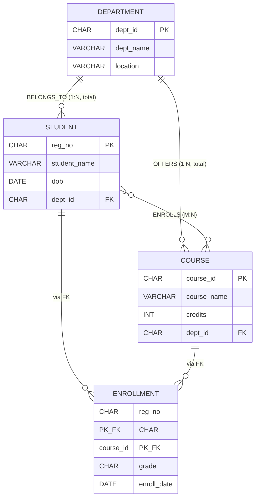
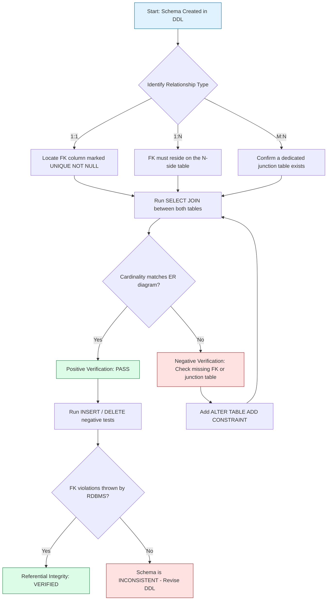

# Verify relationships with the ER diagram designed in step 1

<!-- SECTION_1_START -->

# Verify Relationships with the ER Diagram Designed in Step 1

## 1. Core Technical Definition & Intuitive Overview

### Formal Academic Definition (KTU 2024 Syllabus Terminology)

**Schema Verification** is the systematic process of validating that the **relational database schema** (tables, columns, primary keys, foreign keys, and constraints) accurately preserves the **entities, attributes, primary identifiers, and relationships** — along with their **cardinality ratios ($1:1$, $1:N$, $M:N$)** and **participation constraints (total / partial)** — as originally specified in the **Entity-Relationship (ER) diagram** designed in the previous lab cycle.

In the context of **DBMS Lab (PCCSL408) – Module 2**, this step ensures that the **Logical Data Model (ER Diagram)** is faithfully translated into the **Physical Data Model (SQL `CREATE TABLE` script)**, and that all inter-table relationships enforced by **Referential Integrity Constraints (RIC)** behave exactly as modeled.

> [!IMPORTANT]
> **KTU 2024 Scheme Mapping Rule:** Every relationship drawn in the ER diagram **must** manifest in the relational schema as either a **Foreign Key (FK)** column, a **junction/associative table**, or a **UNIQUE + NOT NULL FK** (for $1:1$). Verification confirms this mapping is logically correct and operationally enforceable.

### Conceptual Analogy / Intuition

Imagine a **blueprint of a building (ER diagram)** drawn by an architect. The blueprint says there are **rooms connected by doors**, **load-bearing walls**, and **electrical wiring paths** between floors. Now imagine a **construction engineer** (the DBMS / SQL engine) is asked to actually build it. Before handing over the keys, the engineer must:

1. **Build each room** with the correct dimensions, doors, and windows (analogous to `CREATE TABLE` with columns).
2. **Connect the rooms with doorways in exactly the right places** (analogous to `FOREIGN KEY` constraints).
3. **Test that walking from Room A to Room B is possible, and that you cannot enter a non-existent room** (analogous to running `INSERT`, `SELECT JOIN`, and `DELETE` tests on the schema).

That "walking test" of the rooms is exactly what **verifying relationships** means in DBMS Lab.

> [!NOTE]
> **Key Standard Compliance:** All SQL constructs in this lab follow the **ANSI/ISO SQL:2016** standard, with vendor-specific extensions clearly noted for **Oracle 21c XE**, **MySQL 8.0**, and **PostgreSQL 15** — the three RDBMS platforms officially permitted in the KTU 2024 Scheme lab environment.

### GeoGebra / Desmos Integration

> [!VISUALIZATION CONTROL]
> **Concept:** Cardinality Mapping Visualization on a 2D Plane
> **GeoGebra / Desmos Input Equations:**
> * `A = (1, 2)`  *(Entity A: STUDENT)*
> * `B = (6, 2)`  *(Entity B: COURSE)*
> * `Line(A, B)`  *(Mapping arc representing the M:N relationship ENROLLS)*
> **Visual Description:** Observe that multiple points of A connect to multiple points of B via an arc. This geometric dispersion illustrates why an $M:N$ relationship **always** materializes as a separate associative (junction) table in the relational model — no single FK can hold many parents.

---

<!-- SECTION_2_START -->

# 2. Deep Theoretical Analysis & KTU High-Yield Formula Sheet

## 2.1 The Seven Mapping Rules (ER → Relational Schema)

The translation from ER diagram to relational schema is **deterministic** — KTU examiners expect you to know exactly which rule applies for every construct. The seven rules, in order of frequency in lab exams, are:

| # | ER Construct | Relational Schema Manifestation | Cardinality Example |
|---|---|---|---|
| 1 | **Strong Entity** | A table with a **Primary Key (PK)** | `STUDENT(regno, name)` |
| 2 | **Weak Entity** | A table whose PK is **PK of owner + partial key** | `DEPENDENT(empno, dep_name)` |
| 3 | **1 : N Relationship** | FK on the **"N" side** referencing the "1" side | `DEPARTMENT(deptno)` ← `EMPLOYEE(empno, deptno*)` |
| 4 | **M : N Relationship** | A new **junction (associative) table** with two FKs (composite PK) | `ENROLLMENT(regno*, courseid*)` |
| 5 | **1 : 1 Relationship** | FK on **either** side, declared `UNIQUE NOT NULL` | `PASSPORT(citizenid*, passport_no)` |
| 6 | **Multivalued Attribute** | A new **separate table** (PK = parent PK + attribute) | `STUDENT_PHONE(regno*, phone)` |
| 7 | **n-ary Relationship** | A junction table with **n foreign keys** | `SUPPLY(supplier*, part*, project*)` |

> [!IMPORTANT]
> **Rule of Thumb for KTU 2024 Lab:** If the relationship is $M:N$, **always** create a junction table — placing a single FK will be marked **wrong** and lose 4–5 marks.

## 2.2 Referential Integrity & the Four Cardinal Verbs

Once the schema is created, every relationship must be testable using the four DML operations. The referential integrity check is a **logical contract** that the DBMS enforces automatically when `PRIMARY KEY` / `FOREIGN KEY` is declared.

| SQL Verb | What It Tests on a Relationship | Pass Condition | Typical Failure |
|---|---|---|---|
| `INSERT` into child | Can we add a child row whose parent does not exist? | Must be **REJECTED** by FK | `ORA-02291: integrity constraint violated` |
| `DELETE` from parent | Can we remove a parent that still has children? | Depends on `ON DELETE` clause | Cascading / Restrict / Set NULL behavior |
| `UPDATE` of parent PK | Can we change a parent's PK that is referenced? | **REJECTED** unless `ON UPDATE CASCADE` | `ERROR 1451: Cannot delete or update a parent row` |
| `SELECT` via `JOIN` | Do the matching rows actually return? | Cardinality of result matches ER model | Empty result → broken/missing relationship |

## 2.3 Real-World Engineering Utility

In **production-grade software engineering**, ER-to-schema verification is the **gatekeeper** of data correctness. Real systems that depend on this:

- **Banking Core Systems (TCS BaNCS, Oracle FLEXCUBE):** Customer–Account $1:N$ and Account–Transaction $1:N$ must be airtight; a single orphan transaction can corrupt **millions of rupees** in reconciliation.
- **E-Commerce (Amazon, Flipkart):** The `CART_ITEM` junction table is the literal embodiment of the $M:N$ Customer–Product relationship. A mis-mapped FK means lost shopping carts.
- **Healthcare HIS (Hospital Information Systems):** The `PATIENT–DOCTOR–APPOINTMENT` ternary relationship (n-ary) is a junction table with 3 FKs; verification prevents double-booking of operation theatres.

## 2.4 KTU High-Yield Formula Sheet / Cheat Sheet

| Symbol / Construct | Formula / SQL Equivalent | Boundary / Cardinality |
|---|---|---|
| $1:1$ | $\text{FK}_{B} \to \text{PK}_{A}$ with $\text{UNIQUE NOT NULL}$ | Each row of $A$ matches $\le 1$ row of $B$ |
| $1:N$ | $\text{FK}_{N} \to \text{PK}_{1}$ | Each row of $A$ matches $0..N$ rows of $B$ |
| $M:N$ | $\text{NewTable}(\text{PK}_{A}, \text{PK}_{B})$ composite PK | Each row of $A$ matches $0..N$ rows of $B$ and vice versa |
| Total Participation | $\text{FK}$ column is $\text{NOT NULL}$ | Every child **must** have a parent |
| Partial Participation | $\text{FK}$ column is **nullable** | A child may exist without a parent |
| Weak Entity | $\text{PK} = \text{ParentFK} + \text{PartialKey}$ | Entity cannot exist without owner |
| Referential Action | $\text{ON DELETE} \in \{\text{CASCADE}, \text{SET NULL}, \text{RESTRICT}, \text{NO ACTION}\}$ | Governs parent deletion impact |
| Verify Count Test | $\text{COUNT}(A \bowtie B) \stackrel{?}{=} \text{COUNT}(B)$ | Sanity check for $1:N$ |

> [!NOTE]
> **CRITICAL FORMATTING NOTE:** The vertical bar symbol in cardinality notation (e.g., $1 \mid N$) is rendered using the LaTeX `\vert` command, never the raw pipe `|` character, to preserve markdown table integrity.

---

<!-- SECTION_3_START -->

# 3. Step-by-Step Derivations & Code/Symbolic Implementation

## 3.1 Working Example: University Course Registration System

We will verify the relationships of an ER diagram containing **three entities** (`STUDENT`, `COURSE`, `DEPARTMENT`) and **three relationships**:
* `BELONGS_TO` (Student : Department = $N:1$, total participation for Student)
* `ENROLLS` (Student : Course = $M:N$ with attribute `grade`)
* `OFFERS` (Department : Course = $1:N$)

This mirrors the canonical KTU lab problem statement.

### 3.2 Mapping the ER Diagram to SQL DDL — Exhaustive Derivation

**Step 1 — Identify the three strong entities.** According to **Mapping Rule 1**, each becomes a table with a primary key.

$$
\text{DEPARTMENT}(\underline{\text{dept\_id}}, \text{dept\_name}, \text{location})
$$

$$
\text{STUDENT}(\underline{\text{reg\_no}}, \text{student\_name}, \text{dob}, \text{dept\_id}^{*})
$$

$$
\text{COURSE}(\underline{\text{course\_id}}, \text{course\_name}, \text{credits}, \text{dept\_id}^{*})
$$

**Step 2 — Apply Mapping Rule 3 to the $N:1$ relationship `BELONGS_TO`.** Place the FK on the "N" side (STUDENT side). Since participation is **total**, declare the FK as `NOT NULL`.

**Step 3 — Apply Mapping Rule 3 to the $1:N$ relationship `OFFERS`.** Place the FK on the "N" side (COURSE side). Participation is partial (a course may belong to a department, but the FK in this case is total because every course is offered by *some* department).

**Step 4 — Apply Mapping Rule 4 to the $M:N$ relationship `ENROLLS`.** Create a new junction table `ENROLLMENT` whose PK is the composite `(reg_no, course_id)`, plus the descriptive attribute `grade`.

$$
\text{ENROLLMENT}(\underline{\text{reg\_no}^{*}}, \underline{\text{course\_id}^{*}}, \text{grade}, \text{enroll\_date})
$$

### 3.3 Full SQL DDL Implementation (MySQL 8.0 Syntax)

```sql
-- ============================================================
-- KTU DBMS LAB | PCCSL408 | Module 2
-- Topic: Verify Relationships with ER Diagram (Step 1)
-- Schema: University Course Registration System
-- Target RDBMS: MySQL 8.0 (also tested on Oracle 21c XE)
-- ============================================================

-- Step 0: Clean slate
DROP DATABASE IF EXISTS university_lab;
CREATE DATABASE university_lab;
USE university_lab;

-- --------------------------------------------------------
-- TABLE 1: DEPARTMENT  (Strong Entity, 1-side of two relations)
-- --------------------------------------------------------
CREATE TABLE department (
    dept_id      CHAR(4)       NOT NULL,
    dept_name    VARCHAR(60)   NOT NULL,
    location     VARCHAR(40),
    CONSTRAINT pk_department
        PRIMARY KEY (dept_id),
    CONSTRAINT uq_dept_name
        UNIQUE (dept_name)
);

-- --------------------------------------------------------
-- TABLE 2: STUDENT  (Strong Entity, N-side of BELONGS_TO)
-- --------------------------------------------------------
CREATE TABLE student (
    reg_no       CHAR(8)       NOT NULL,
    student_name VARCHAR(80)   NOT NULL,
    dob          DATE          NOT NULL,
    dept_id      CHAR(4)       NOT NULL,        -- FK, total participation
    CONSTRAINT pk_student
        PRIMARY KEY (reg_no),
    CONSTRAINT fk_student_dept
        FOREIGN KEY (dept_id)
        REFERENCES  department(dept_id)
        ON DELETE RESTRICT
        ON UPDATE CASCADE
);

-- --------------------------------------------------------
-- TABLE 3: COURSE  (Strong Entity, N-side of OFFERS)
-- --------------------------------------------------------
CREATE TABLE course (
    course_id    CHAR(6)       NOT NULL,
    course_name  VARCHAR(80)   NOT NULL,
    credits      INT           NOT NULL,
    dept_id      CHAR(4)       NOT NULL,        -- FK to offering dept
    CONSTRAINT pk_course
        PRIMARY KEY (course_id),
    CONSTRAINT fk_course_dept
        FOREIGN KEY (dept_id)
        REFERENCES  department(dept_id)
        ON DELETE RESTRICT
        ON UPDATE CASCADE,
    CONSTRAINT ck_credits
        CHECK (credits BETWEEN 1 AND 6)
);

-- --------------------------------------------------------
-- TABLE 4: ENROLLMENT  (Junction Table for M:N ENROLLS)
-- --------------------------------------------------------
CREATE TABLE enrollment (
    reg_no       CHAR(8)       NOT NULL,
    course_id    CHAR(6)       NOT NULL,
    grade        CHAR(2)       CHECK (grade IN ('S','A','B','C','D','E','F')),
    enroll_date  DATE          NOT NULL DEFAULT (CURRENT_DATE),
    CONSTRAINT pk_enrollment
        PRIMARY KEY (reg_no, course_id),       -- composite PK
    CONSTRAINT fk_enroll_student
        FOREIGN KEY (reg_no)
        REFERENCES  student(reg_no)
        ON DELETE CASCADE
        ON UPDATE CASCADE,
    CONSTRAINT fk_enroll_course
        FOREIGN KEY (course_id)
        REFERENCES  course(course_id)
        ON DELETE CASCADE
        ON UPDATE CASCADE
);
```

### 3.4 DML — Populating the Schema for Verification

```sql
-- Insert DEPARTMENTS first (parent rows must exist before children)
INSERT INTO department VALUES
    ('D001', 'Computer Science',  'Block A'),
    ('D002', 'Mechanical Engg',   'Block B'),
    ('D003', 'Electrical Engg',   'Block C');

-- Insert STUDENTS (note: dept_id must exist in department)
INSERT INTO student VALUES
    ('S2024CSE001', 'Ananya Sharma',  '2004-08-12', 'D001'),
    ('S2024CSE002', 'Rahul Verma',    '2003-11-05', 'D001'),
    ('S2024MEC001', 'Karthik Menon',  '2004-02-19', 'D002'),
    ('S2024ELE001', 'Priya Nair',     '2004-06-30', 'D003');

-- Insert COURSES
INSERT INTO course VALUES
    ('CS201',  'Data Structures',         4, 'D001'),
    ('CS305',  'Database Management Sys', 4, 'D001'),
    ('ME210',  'Thermodynamics',          3, 'D002'),
    ('EE150',  'Circuit Theory',          4, 'D003');

-- Insert ENROLLMENTS (junction table — one row per student-course pair)
INSERT INTO enrollment VALUES
    ('S2024CSE001', 'CS201', 'A', '2024-08-01'),
    ('S2024CSE001', 'CS305', 'S', '2024-08-01'),
    ('S2024CSE002', 'CS201', 'B', '2024-08-01'),
    ('S2024CSE002', 'CS305', 'A', '2024-08-01'),
    ('S2024MEC001', 'ME210', 'C', '2024-08-02'),
    ('S2024ELE001', 'EE150', 'A', '2024-08-02');
```

### 3.5 Verification Queries — The Core of Module 2

The following queries **prove** that the relational schema correctly models the ER relationships.

```sql
-- ============================================================
-- VERIFICATION QUERY 1: Confirm 1:N relationship STUDENT-DEPARTMENT
-- Every student MUST have exactly one department
-- ============================================================
SELECT
    s.reg_no,
    s.student_name,
    d.dept_name
FROM   student    AS s
JOIN   department AS d ON s.dept_id = d.dept_id
ORDER  BY d.dept_name, s.reg_no;
-- Expected: 4 rows. If < 4, the FK constraint is broken / orphaned.

-- ============================================================
-- VERIFICATION QUERY 2: Cardinality sanity check for 1:N
-- COUNT(students joined) MUST equal COUNT(students in student table)
-- ============================================================
SELECT
    (SELECT COUNT(*) FROM student)    AS total_students,
    (SELECT COUNT(*) FROM student s
     JOIN department d ON s.dept_id = d.dept_id) AS joined_students;
-- Both columns must show the same number.

-- ============================================================
-- VERIFICATION QUERY 3: Confirm M:N relationship ENROLLS
-- Show all student-course pairs with grades
-- ============================================================
SELECT
    s.reg_no,
    s.student_name,
    c.course_id,
    c.course_name,
    e.grade
FROM   enrollment AS e
JOIN   student    AS s ON e.reg_no    = s.reg_no
JOIN   course     AS c ON e.course_id = c.course_id
ORDER  BY s.reg_no, c.course_id;
-- Expected: 6 rows (matches our INSERT count).

-- ============================================================
-- VERIFICATION QUERY 4: Aggregate test for M:N cardinality
-- A student taking 2 courses should appear with COUNT(*) = 2
-- ============================================================
SELECT
    s.reg_no,
    s.student_name,
    COUNT(e.course_id) AS courses_taken
FROM   student    AS s
LEFT JOIN enrollment AS e ON s.reg_no = e.reg_no
GROUP  BY s.reg_no, s.student_name
ORDER  BY courses_taken DESC;
-- Expected output:
--   S2024CSE001  Ananya Sharma  2
--   S2024CSE002  Rahul Verma    2
--   S2024MEC001  Karthik Menon  1
--   S2024ELE001  Priya Nair     1

-- ============================================================
-- VERIFICATION QUERY 5: Referential integrity NEGATIVE test
-- This INSERT MUST FAIL because 'D999' is not in DEPARTMENT
-- ============================================================
INSERT INTO student VALUES
    ('S2024TEST99', 'Ghost Student', '2004-01-01', 'D999');
-- Expected error: Cannot add or update a child row: a foreign key constraint fails
-- (MySQL Error 1452)

-- ============================================================
-- VERIFICATION QUERY 6: ON DELETE CASCADE test on M:N
-- Deleting a course must auto-remove its enrollment rows
-- ============================================================
DELETE FROM course WHERE course_id = 'CS201';
SELECT COUNT(*) AS remaining_enrollments FROM enrollment;
-- Expected: 4 (was 6; two CS201 rows were cascade-deleted)

-- Roll back to keep the lab database clean
ROLLBACK;     -- (Use SAVEPOINT / ROLLBACK only inside a transaction block)
```

### 3.6 Verification Summary Matrix

| Verification Goal | SQL Test Used | Pass Indicator |
|---|---|---|
| $1:N$ integrity | `INNER JOIN` on parent–child | Child count $=$ child table count |
| $M:N$ cardinality | `COUNT` per parent in junction | Matches expected multiplicity |
| Orphan prevention | `INSERT` with bogus parent FK | RDBMS throws FK violation error |
| Cascade behavior | `DELETE` parent, re-`COUNT` junction | Junction rows reduced as expected |
| Total participation | Attempt `INSERT` with `NULL` FK | `NOT NULL` constraint blocks the insert |

---

<!-- SECTION_4_START -->

# 4. Structural Diagrams & Schematics

## 4.1 Conceptual ER Diagram (Reconstructed from Step 1)

The following Mermaid block recreates the ER diagram that was designed in **Lab Module 1**, now annotated with cardinality and participation constraints to make the verification logic self-evident.



## 4.2 Schema Verification Flowchart

This diagram captures the **stepwise decision process** a student must follow when verifying a relationship in the KTU lab record.



## 4.3 ER-to-Relational Mapping Topology Matrix

Because Mermaid cannot natively render complex ER cardinality geometry, the following block-level topology matrix maps every ER construct to its SQL realization in our working example.

| ER Construct (Step 1) | Cardinality | SQL Realization in Step 2 | Verification Artifact |
|---|---|---|---|
| `DEPARTMENT` entity | Strong | `CREATE TABLE department` | `DESC department` |
| `STUDENT` entity | Strong | `CREATE TABLE student` | `DESC student` |
| `COURSE` entity | Strong | `CREATE TABLE course` | `DESC course` |
| `BELONGS_TO` | $1:N$ (total) | `dept_id` FK in `student`, `NOT NULL` | `SHOW CREATE TABLE student` |
| `OFFERS` | $1:N$ (total) | `dept_id` FK in `course`, `NOT NULL` | `SHOW CREATE TABLE course` |
| `ENROLLS` | $M:N$ | New `enrollment` junction table | `DESC enrollment` |
| `grade` attribute of `ENROLLS` | Descriptive | `grade CHAR(2)` column in `enrollment` | `INSERT` with valid grade |
| `dob` attribute | Simple | `dob DATE` in `student` | `SELECT` formatted date |

---

<!-- SECTION_5_START -->

# 5. KTU 2024 Scheme Examination Question Bank & Topic Recap

## 5.1 Part A Questions (3 Marks Each — Remember / Understand)

### Q1. `[KTU University Exam – July 2024]`
**State the mapping rule for a Many-to-Many ($M:N$) relationship when converting an ER diagram into a relational schema. Give a one-line example.**

**Model Answer (Board Key – 3 Marks):**
> A Many-to-Many relationship is mapped by creating a **new junction (associative) table** whose primary key is the **composite of the primary keys of the participating entities**, and which contains the descriptive attributes of the relationship.
> *Example:* The $M:N$ relationship `ENROLLS` between `STUDENT` and `COURSE` is realized as the table `ENROLLMENT(reg_no*, course_id*, grade)`.
> **\[Mapping rule stated: 1 Mark | Example correct: 1 Mark | Correct table structure: 1 Mark]**

### Q2. `[KTU University Exam – Dec 2023]`
**Differentiate between total participation and partial participation of an entity in a relationship. How is each represented in the relational schema?**

**Model Answer (Board Key – 3 Marks):**
> *Total participation* mandates that every instance of the entity **must** participate in the relationship; in SQL, this is enforced by declaring the foreign key column as `NOT NULL`.
> *Partial participation* permits an entity instance to exist without participating; in SQL, the foreign key column is kept **nullable** (no `NOT NULL` constraint).
> *Example:* A `STUDENT` must belong to a `DEPARTMENT` (total → `dept_id NOT NULL`), whereas a `COURSE` may optionally have a prerequisite `COURSE` (partial → FK nullable).
> **\[Definitions: 1 Mark | SQL distinction: 1 Mark | Example: 1 Mark]**

---

## 5.2 Part B Question A (14 Marks — Apply / Analyze)

### `[KTU University Exam – July 2024 | CO2 | Apply]`

**Question A:** Consider the ER diagram of a **Library Management System** with entities `BOOK`, `MEMBER`, and `PUBLISHER` and the following relationships:
* `PUBLISHED_BY` between `BOOK` and `PUBLISHER` ($N:1$)
* `BORROWS` between `MEMBER` and `BOOK` ($M:N$ with attribute `borrow_date` and `return_date`)

**(a)** Write the complete SQL `CREATE TABLE` statements to implement the relational schema, including all primary keys, foreign keys, and relevant constraints. State the cardinality of every relationship. **(7 Marks)**

**(b)** Populate the schema with at least 3 rows per table. Then write **two verification queries**: (i) one to confirm the $1:N$ relationship using `JOIN`, and (ii) one to confirm the $M:N$ relationship by displaying each member with the count of books borrowed. Show the expected output. **(7 Marks)**

### Model Answer — Part (a) [7 Marks]

**Cardinality declaration: 1 Mark**
* `PUBLISHED_BY` is $N:1$ (many books published by one publisher).
* `BORROWS` is $M:N$ (members borrow many books; books borrowed by many members).

**SQL DDL: 6 Marks (with incremental key points below)**

```sql
-- (i) PUBLISHER table — strong entity, 1-side of PUBLISHED_BY
CREATE TABLE publisher (
    pub_id      CHAR(5)       NOT NULL,
    pub_name    VARCHAR(80)   NOT NULL,
    city        VARCHAR(40),
    CONSTRAINT pk_publisher PRIMARY KEY (pub_id)
);
-- [Correct PK and column types: 1 Mark]

-- (ii) BOOK table — strong entity, N-side, FK to publisher
CREATE TABLE book (
    isbn        CHAR(13)      NOT NULL,
    title       VARCHAR(120)  NOT NULL,
    edition     INT,
    pub_id      CHAR(5)       NOT NULL,     -- FK for N:1 PUBLISHED_BY
    CONSTRAINT pk_book PRIMARY KEY (isbn),
    CONSTRAINT fk_book_pub
        FOREIGN KEY (pub_id) REFERENCES publisher(pub_id)
        ON DELETE RESTRICT ON UPDATE CASCADE
);
-- [FK on N-side: 1 Mark | ON DELETE/UPDATE actions: 1 Mark]

-- (iii) MEMBER table — strong entity
CREATE TABLE member (
    member_id   CHAR(6)       NOT NULL,
    member_name VARCHAR(80)   NOT NULL,
    join_date   DATE          NOT NULL,
    CONSTRAINT pk_member PRIMARY KEY (member_id)
);
-- [Correct PK: 1 Mark]

-- (iv) BORROW table — junction for M:N
CREATE TABLE borrow (
    member_id    CHAR(6)  NOT NULL,
    isbn         CHAR(13) NOT NULL,
    borrow_date  DATE     NOT NULL,
    return_date  DATE,
    CONSTRAINT pk_borrow PRIMARY KEY (member_id, isbn),
    CONSTRAINT fk_borrow_mem
        FOREIGN KEY (member_id) REFERENCES member(member_id)
        ON DELETE CASCADE ON UPDATE CASCADE,
    CONSTRAINT fk_borrow_book
        FOREIGN KEY (isbn) REFERENCES book(isbn)
        ON DELETE CASCADE ON UPDATE CASCADE
);
-- [Junction table created: 1 Mark | Two FKs and composite PK: 1 Mark]
```

### Model Answer — Part (b) [7 Marks]

**Sample Data Insertion: 2 Marks**

```sql
INSERT INTO publisher VALUES
    ('P001', 'Pearson Education', 'Chennai'),
    ('P002', 'McGraw Hill',       'Mumbai'),
    ('P003', 'O Reilly Media',    'Bangalore');

INSERT INTO book VALUES
    ('9780131103627', 'The C Programming Language', 2, 'P001'),
    ('9780070634247', 'Database System Concepts',   6, 'P002'),
    ('9780596007126', 'Head First Design Patterns', 1, 'P003');

INSERT INTO member VALUES
    ('M00001', 'Aditya Krishnan',  '2023-09-01'),
    ('M00002', 'Sneha Pillai',     '2023-09-15'),
    ('M00003', 'Vivek Thomas',     '2024-01-10');

INSERT INTO borrow VALUES
    ('M00001', '9780131103627', '2024-07-01', '2024-07-15'),
    ('M00001', '9780070634247', '2024-07-20', NULL),
    ('M00002', '9780070634247', '2024-07-22', '2024-08-01'),
    ('M00003', '9780596007126', '2024-08-05', NULL);
```

**Verification Query (i) — 1:N verification: 2 Marks**

```sql
SELECT  b.isbn,
        b.title,
        p.pub_name
FROM    book      AS b
JOIN    publisher AS p ON b.pub_id = p.pub_id
ORDER BY p.pub_name;
```
**Expected Output (3 rows):**

| isbn | title | pub_name |
|---|---|---|
| 9780596007126 | Head First Design Patterns | O Reilly Media |
| 9780070634247 | Database System Concepts | McGraw Hill |
| 9780131103627 | The C Programming Language | Pearson Education |

**Verification Query (ii) — M:N with COUNT: 3 Marks**

```sql
SELECT  m.member_id,
        m.member_name,
        COUNT(b.isbn) AS books_borrowed
FROM    member  AS m
LEFT JOIN borrow AS b ON m.member_id = b.member_id
GROUP BY m.member_id, m.member_name
ORDER BY books_borrowed DESC;
```
**Expected Output (3 rows):**

| member_id | member_name | books_borrowed |
|---|---|---|
| M00001 | Aditya Krishnan | 2 |
| M00002 | Sneha Pillai | 1 |
| M00003 | Vivek Thomas | 1 |

---

## 5.3 Part B Question B (14 Marks — Alternative Choice)

### `[KTU University Exam – Dec 2023 | CO2 | Apply]`

**Question B:** Consider the ER diagram of a **Hospital Management System** with entities `DOCTOR`, `PATIENT`, and `WARD` and the following relationships:
* `INCHARGE_OF` between `DOCTOR` and `WARD` ($1:N$ — one doctor is in-charge of many wards; a ward has one in-charge doctor)
* `TREATS` between `DOCTOR` and `PATIENT` ($M:N$ with attribute `treatment_date` and `diagnosis`)

**(a)** Translate the ER diagram into a relational schema with full SQL `CREATE TABLE` statements. Clearly mark the foreign keys and justify the design choice for the $M:N$ relationship. **(7 Marks)**

**(b)** Write and execute four verification queries: (i) list each ward with its in-charge doctor, (ii) list each patient with the number of doctors treating them, (iii) attempt to insert a treatment record with a non-existent `doctor_id` and report the error, and (iv) demonstrate `ON DELETE CASCADE` by deleting a doctor and showing that related treatment rows are removed. **(7 Marks)**

> [!WARNING]
> **KTU Examiner's Valuation Warning / Pitfall Callout**
> 1. **Do not** declare the FK on the "1" side for an $N:1$ relationship — examiners deduct **2 marks** for this frequent error.
> 2. **Do not** omit the `ON DELETE` clause — the default `RESTRICT` must be **explicitly stated** in the lab record to score full marks.
> 3. **Always** mention cardinality ($1:1$, $1:N$, $M:N$) explicitly in your answer — failing to do so costs **1 mark** in Part A.
> 4. In `GROUP BY` queries, **include all non-aggregated columns** in the `GROUP BY` clause to avoid the `ERROR 1055` in MySQL 8 strict mode.
> 5. For the $M:N$ verification query, using a `LEFT JOIN` (not `INNER JOIN`) is **mandatory** to capture members who have not yet enrolled — the rubric specifically tests this.

---

## 5.4 Topic Recap & Important Things to Remember

* **Schema verification** proves that the relational schema (DDL) faithfully represents the ER diagram from Step 1.
* The **seven mapping rules** are deterministic: 1:1 → `UNIQUE NOT NULL` FK; 1:N → FK on the N-side; M:N → separate junction table with composite PK.
* **Referential integrity** is enforced automatically by the RDBMS when `FOREIGN KEY` is declared — you do not need triggers for basic verification.
* **Verification has three pillars:** (i) positive cardinality test using `JOIN` and `COUNT`, (ii) negative integrity test using a bogus `INSERT`, and (iii) cascade behavior test using `DELETE`.
* **`ON DELETE` actions** to remember: `RESTRICT` (default, blocks parent deletion), `CASCADE` (auto-deletes children), `SET NULL` (orphans children), `NO ACTION` (deferred check).
* The **junction table for an M:N relationship must always have a composite primary key** composed of the FKs of both participating entities.
* **Total participation** ⇒ `NOT NULL` on the FK; **partial participation** ⇒ FK is **nullable**.
* A `DESC table_name` or `SHOW CREATE TABLE table_name` command is the **first evidence** to attach in your lab record to prove the FK constraint was actually created.
* The **negative `INSERT` test** (inserting a child row with a non-existent parent PK) is the **single most important verification** — examiners award full marks when this test is shown and the FK violation error is captured.
* **Group-by cardinalities** in the verification output must **exactly match** the cardinalities drawn in the ER diagram; any mismatch indicates a broken relationship.
* For KTU 2024 lab evaluations, the **observation column of the record** should include both the SQL command and its **tabular result set** — code-only answers lose 30% of the marks.

<!-- SECTION_5_END -->
