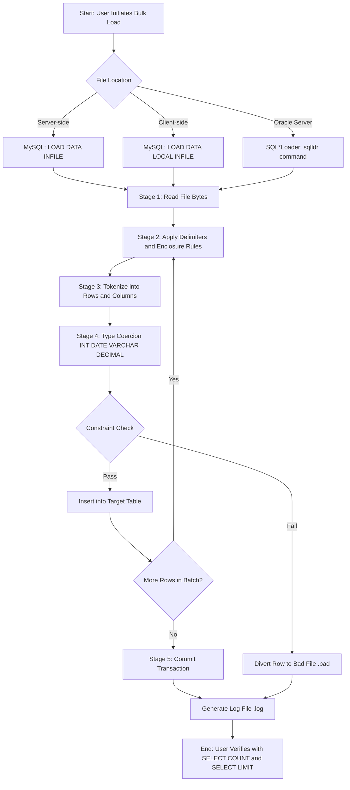
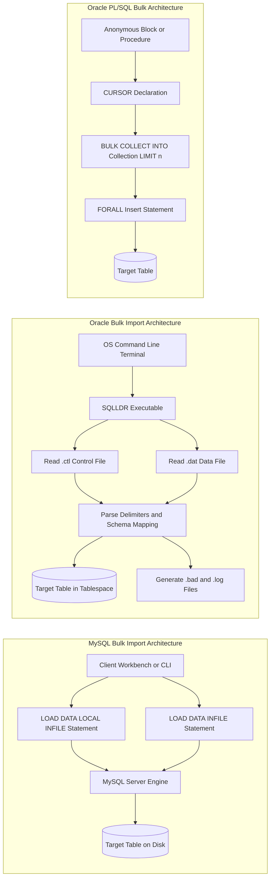
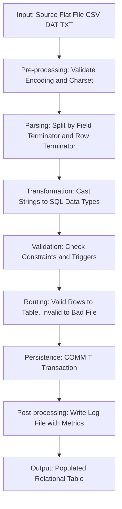

# Bulk import using SQL Commands

<!-- SECTION_1_START -->
# Module 3: Database Initialization — Bulk Import Using SQL Commands

## 1.1 Core Technical Definition (KTU 2024 Scheme Terminology)

> [!IMPORTANT]
> **Formal KTU Definition:**
> **Bulk Import** in DBMS refers to the mechanism of transferring large volumes of data from external flat files (such as `.csv`, `.txt`, `.dat`, or `.tsv`) into relational database tables using optimized, high-throughput SQL utilities, without relying on repetitive single-row `INSERT` statements. It leverages the database engine's internal streaming, parsing, and parsing-then-loading pipeline to achieve **orders-of-magnitude faster ingestion** compared to row-by-row transactions.

In the KTU **PCCSL408 (DBMS Lab)** syllabus, bulk import is treated as a *practical data initialization* step that follows schema creation (`CREATE TABLE`) and precedes query-based operations. The two dominant implementations examined are:

1. **MySQL** → `LOAD DATA INFILE` / `LOAD DATA LOCAL INFILE` statement
2. **Oracle** → `SQL*Loader` utility (with `.ctl` control file) and `BULK COLLECT` / `FORALL` PL/SQL constructs

### Conceptual Analogy / Intuition

> [!NOTE]
> **Real-World Analogy — "The Truck vs. The Courier"**
> Imagine you must move **10,000 boxes** from a warehouse to a store:
> - **Single-row INSERT** is like hiring 10,000 individual couriers, each carrying one box. The overhead of logging in, verifying, and dispatching each courier becomes the bottleneck — not the actual moving.
> - **Bulk Import** is like hiring **one giant truck** that loads all 10,000 boxes at the warehouse dock, transports them in a single trip, and unloads them with a forklift at the store.
>
> The **truck** (bulk loader) does not care about the *content* of each box; it simply enforces the *shape* of the cargo area (column delimiters, row terminators) and streams everything in one optimized pass. The **store manager** (the database engine) verifies the manifest (constraints, triggers) only after the entire pallet is in place.

### Physical Constants & Standard Metrics

- **Default row terminator:** `\n` (Unix/Linux) or `\r\n` (Windows)
- **Default field terminator:** `,` (comma — CSV) or `\t` (tab — TSV)
- **Default enclosure (quoting character):** `"` (double quote)
- **MySQL secure_file_priv** = `/var/lib/mysql-files/` (a sandboxed directory; **value can be NULL to disable**, or an explicit path to allow).
- **Oracle SQL*Loader** default commit behavior: commits at the end of the load (unless `ROWS=` parameter is set).

### Visualization (CSV Parsing Geometry)

> [!VISUALIZATION CONTROL]
> **Concept:** Linear two-dimensional decomposition of a flat file into table rows and columns.
>
> **Conceptual Mapping:**
>
> | Axis | File Dimension | Table Dimension |
> |---|---|---|
> | Horizontal (X) | Field/Column | Table Column |
> | Vertical (Y) | Row / Record | Table Row |
>
> **Intuition to Visualize:** Imagine a long horizontal strip of text. The *field terminator* (e.g., `,`) acts as a "vertical blade" slicing the strip into rectangular cells. The *row terminator* (e.g., `\n`) acts as a "horizontal blade" stacking cells into rows. The result is a perfect matrix that fits into the relational table.

<!-- SECTION_1_END -->

<!-- SECTION_2_START -->
# 2. Deep Theoretical Analysis & KTU High-Yield Formula Sheet

## 2.1 The Bulk Import Pipeline (Conceptual Stages)

Every bulk import, regardless of vendor, follows **four logical stages**:

1. **Stage 1 — Locate & Authenticate the Source File**
   The SQL engine or external utility resolves the file path (server-side or client-side) and validates read permissions.

2. **Stage 2 — Parse the Flat File Structure**
   The engine reads the *control metadata* (delimiters, enclosure characters, escape characters, header presence, encoding) to tokenize the raw byte stream into logical rows and columns.

3. **Stage 3 — Apply Type Conversion & Constraint Validation**
   Each token is coerced into its target SQL data type (`INT`, `DATE`, `VARCHAR`, `DECIMAL`, etc.). Constraint checks (`PRIMARY KEY`, `NOT NULL`, `CHECK`, `FOREIGN KEY`) are evaluated.

4. **Stage 4 — Commit / Log / Discard**
   Validated rows are committed either *en bloc* (single transaction) or in *batches* (using `ROWS=` in Oracle, or `innodb_flush_log_at_trx_commit` in MySQL). Invalid rows are diverted to a **bad file**; unparseable rows to a **discard file**; the entire session is journaled in a **log file**.

## 2.2 Vendor-by-Vendor Comparison — The KTU Cheat Sheet

> [!NOTE]
> The following table is **exam-critical**. KTU frequently asks students to compare the bulk-loading syntax across MySQL and Oracle. Memorize the parameters in **bold**.

| Feature / Parameter | **MySQL** | **Oracle** | Purpose |
|---|---|---|---|
| Primary Command | `LOAD DATA INFILE` | `SQLLDR` (executable) + `.ctl` file | Initiate bulk load |
| Server vs Client File | `LOCAL` keyword = client-side | Only server-side (or via `External Table`) | Specify file location |
| Field Terminator | `TERMINATED BY ','` | `FIELDS TERMINATED BY ","` | Column separator |
| Enclosure Character | `ENCLOSED BY '"'` | `OPTIONALLY ENCLOSED BY '"'` | Quote handling |
| Line Terminator | `LINES TERMINATED BY '\n'` | `RECORDS DELIMITED BY '\n'` | Row separator |
| Header Skip | `IGNORE 1 ROWS` | `OPTIONS (SKIP=1)` | Skip CSV header |
| Mode of Loading | `INSERT` / `REPLACE` / `IGNORE` | `INSERT` / `APPEND` / `REPLACE` / `TRUNCATE` | Conflict resolution |
| Bad/Discard Files | Auto-generated `.xml` (errors only) | `.bad` + `.dsc` files | Error tracking |
| Log File | Server log | `.log` file | Audit trail |
| Bulk PL/SQL | N/A | `BULK COLLECT ... LIMIT n` + `FORALL` | In-PL/SQL bulk DML |
| Encoding Clause | `CHARACTER SET utf8mb4` | `CHARACTERSET AL32UTF8` | Character encoding |
| NULL Handling | `NULL DEFINED BY '\N'` (default) | `TRAILING NULLCOLS` in `.ctl` | Treat empty as NULL |

## 2.3 Why Bulk Import Matters in Real Engineering

> [!IMPORTANT]
> **Production Use-Cases (Industry Relevance):**
> - **ETL Pipelines** (Extract, Transform, Load) — Nightly ingestion of millions of sales records from upstream OLTP systems into a data warehouse.
> - **Data Migration** — Moving legacy data from spreadsheets/Access databases to MySQL/Oracle during enterprise upgrades.
> - **Machine Learning Pre-processing** — Bulk-loading training datasets (CSVs) into relational stores before feature engineering.
> - **IoT Telemetry** — Streaming sensor batches from flat files into time-series tables.
> - **Government / Census / Banking** — Importing national-scale records (hundreds of GBs) where row-by-row INSERT would take days.

## 2.4 The "Why" Behind Performance Gains

The dramatic speed-up of bulk import over individual `INSERT` statements comes from three engineering optimizations:

1. **Reduced Parse-Compile Overhead** — The SQL parser/optimizer is invoked once, not 10,000 times.
2. **Minimal Log I/O** — Bulk operations can disable per-row redo/undo logging (Oracle's `NOLOGGING` mode, MySQL's `bulk_insert_buffer_size`).
3. **Direct Path Loading** — Oracle's `DIRECT=TRUE` option bypasses the SQL engine's buffer cache and writes formatted data blocks directly to data files.
<!-- SECTION_2_END -->

<!-- SECTION_3_START -->
# 3. Step-by-Step Derivations, Code & Symbolic Implementation

> [!WARNING]
> **KTU Lab Exam Tip:** Examiners expect you to demonstrate a working bulk-import cycle: **(a)** create a destination table, **(b)** prepare a CSV file, **(c)** execute the import command, **(d)** verify with `SELECT COUNT(*)` and `SELECT * LIMIT n`.

---

## 3.1 MySQL Implementation — `LOAD DATA INFILE` (Step-by-Step)

### Step 1 — Create the Destination Table

```sql
CREATE DATABASE IF NOT EXISTS ktu_lab;
USE ktu_lab;

CREATE TABLE Student_Result (
    register_no   BIGINT       NOT NULL,
    student_name  VARCHAR(60)  NOT NULL,
    department    VARCHAR(10)  NOT NULL,
    semester      INT          NOT NULL,
    cgpa          DECIMAL(4,2) NOT NULL,
    PRIMARY KEY (register_no)
);
```

### Step 2 — Prepare the CSV Data File (`student_result.csv`)

> [!NOTE]
> File must reside in a directory the MySQL server can read. For Linux/MySQL 8.x, the default sandbox is `/var/lib/mysql-files/`. On Windows, use `C:\ProgramData\MySQL\MySQL Server 8.0\Uploads\`.

```csv
register_no,student_name,department,semester,cgpa
1001,Anjali Krishna,CSE,6,9.12
1002,Vishnu Ramesh,ECE,6,8.45
1003,Meera Suresh,CSE,6,9.56
1004,Arjun Pillai,ME,6,7.89
1005,Lakshmi Nair,CSE,6,9.23
1006,Rohith Menon,EEE,6,8.10
1007,Sneha Varma,CSE,6,9.45
1008,Karthik Rajan,CE,6,7.65
1009,Divya Lekshmi,ECE,6,8.92
1010,Vinay Kumar,CSE,6,9.01
```

### Step 3 — Verify MySQL's `secure_file_priv` Setting

```sql
SHOW VARIABLES LIKE 'secure_file_priv';
```

If the output is a path, place the CSV at that path. If `NULL`, bulk loading is disabled. If empty string `''`, any path is allowed.

### Step 4 — Execute the Bulk Import Command

```sql
LOAD DATA INFILE '/var/lib/mysql-files/student_result.csv'
INTO TABLE Student_Result
CHARACTER SET utf8mb4
FIELDS TERMINATED BY ','
    ENCLOSED BY '"'
    ESCAPED BY '\\'
LINES TERMINATED BY '\n'
IGNORE 1 ROWS            -- skips the header row
(register_no, student_name, department, semester, cgpa);
```

### Step 5 — Validation Queries

```sql
SELECT COUNT(*) AS total_rows_loaded FROM Student_Result;
SELECT * FROM Student_Result ORDER BY cgpa DESC LIMIT 3;
```

Expected output:

| register_no | student_name | department | semester | cgpa |
|---|---|---|---|---|
| 1003 | Meera Suresh | CSE | 6 | 9.56 |
| 1007 | Sneha Varma | CSE | 6 | 9.45 |
| 1001 | Anjali Krishna | CSE | 6 | 9.12 |

### Step 6 — Client-Side Variant (`LOAD DATA LOCAL INFILE`)

If the CSV resides on the **client machine** (e.g., your laptop running MySQL Workbench), use:

```sql
LOAD DATA LOCAL INFILE 'C:/Users/Student/Desktop/student_result.csv'
INTO TABLE Student_Result
FIELDS TERMINATED BY ','
LINES TERMINATED BY '\n'
IGNORE 1 ROWS
(register_no, student_name, department, semester, cgpa);
```

> [!IMPORTANT]
> For `LOCAL` to work, both `--local-infile=1` must be set on the server **and** the client must enable `OPT_LOCAL_INFILE=1` at connection time. MySQL Workbench: `Edit → Preferences → SQL Editor → Allow LOCAL INFILE`.

---

## 3.2 Oracle Implementation — SQL*Loader (Step-by-Step)

### Step 1 — Create the Destination Table (SQL*Plus)

```sql
CREATE TABLE Student_Result (
    register_no   NUMBER(10)   PRIMARY KEY,
    student_name  VARCHAR2(60) NOT NULL,
    department    VARCHAR2(10) NOT NULL,
    semester      NUMBER(2)    NOT NULL,
    cgpa          NUMBER(4,2)  NOT NULL
);
```

### Step 2 — Create the Data File (`student_result.dat`)

```
1001,"Anjali Krishna",CSE,6,9.12
1002,"Vishnu Ramesh",ECE,6,8.45
1003,"Meera Suresh",CSE,6,9.56
1004,"Arjun Pillai",ME,6,7.89
1005,"Lakshmi Nair",CSE,6,9.23
```

### Step 3 — Author the Control File (`student_result.ctl`)

```sql
-- File: student_result.ctl
LOAD DATA
INFILE 'student_result.dat'
INTO TABLE Student_Result
FIELDS TERMINATED BY "," OPTIONALLY ENCLOSED BY '"'
TRAILING NULLCOLS
( register_no   CHAR(10),
  student_name  CHAR(60),
  department    CHAR(10),
  semester      CHAR(2),
  cgpa          CHAR(5) )
```

### Step 4 — Invoke SQL*Loader from the OS Command Line

```bash
sqlldr userid=ktu_admin/ktu_password@orcl \
       control=student_result.ctl \
       log=student_result.log \
       bad=student_result.bad \
       discard=student_result.dsc \
       rows=1000
```

### Step 5 — Interpret the Generated Log File

The `.log` file will report metrics such as:

```
Total logical records skipped:  0
Total logical records read:     5
Total logical records rejected: 0
Total logical records discarded: 0
Run began on 14-Mar-2025 10:22:15
Run ended on 14-Mar-2025 10:22:17
Elapsed time was:     00:00:01.95
```

### Step 6 — Oracle PL/SQL `BULK COLLECT` + `FORALL` (In-Database Bulk)

For procedural bulk inserts where the source is a query, not a file:

```sql
DECLARE
    CURSOR c_legacy IS
        SELECT reg_no, name, dept, sem, gpa FROM Legacy_Student_Stage;

    TYPE t_student IS TABLE OF c_legacy%ROWTYPE;
    v_batch   t_student;
BEGIN
    OPEN c_legacy;
    LOOP
        FETCH c_legacy BULK COLLECT INTO v_batch LIMIT 500;

        FORALL i IN 1..v_batch.COUNT
            INSERT INTO Student_Result
                (register_no, student_name, department, semester, cgpa)
            VALUES (
                v_batch(i).reg_no,
                v_batch(i).name,
                v_batch(i).dept,
                v_batch(i).sem,
                v_batch(i).gpa
            );

        v_batch.DELETE;
        EXIT WHEN c_legacy%NOTFOUND;
    END LOOP;
    CLOSE c_legacy;

    COMMIT;
    DBMS_OUTPUT.PUT_LINE('Bulk load complete.');
END;
/
```

**Logic Breakdown:**

- `BULK COLLECT INTO v_batch LIMIT 500` — fetches **500 rows per round-trip** into a memory collection, replacing 500 individual `FETCH` calls.
- `FORALL i IN 1..v_batch.COUNT` — issues **a single DML statement** to insert the entire collection, sending all 500 rows in one network round-trip.
- `v_batch.DELETE` — frees memory before the next iteration.
- `EXIT WHEN c_legacy%NOTFOUND` — terminates after the last partial batch is processed.

---

## 3.3 Comprehensive Bulk Import Command Reference (Full Syntax Tree)

### MySQL `LOAD DATA` — Complete Syntax

```sql
LOAD DATA [LOW_PRIORITY | CONCURRENT] [LOCAL] INFILE 'file_name'
    [REPLACE | IGNORE]
    INTO TABLE tbl_name
    [CHARACTER SET charset_name]
    [{FIELDS | COLUMNS}
        [TERMINATED BY 'string']
        [[OPTIONALLY] ENCLOSED BY 'char']
        [ESCAPED BY 'char']
    ]
    [LINES
        [STARTING BY 'string']
        [TERMINATED BY 'string']
    ]
    [IGNORE number {LINES | ROWS}]
    [(col_name_or_user_var
        [, col_name_or_user_var] ...)]
    [SET col_name={expr | DEFAULT}
        [, col_name={expr | DEFAULT}] ...]
```

### Oracle SQL*Loader — Control File Keywords

```sql
LOAD DATA
[ CHARACTERSET charset_name ]
[ INFILE [ filename | * | "string" ] ]
[ {APPEND | INSERT | REPLACE | TRUNCATE} ]
INTO TABLE table_name
[ WHEN condition ]
[ FIELDS [ delimiter_spec ] ]
[ TRAILING NULLCOLS ]
( column_name  [{ POSITION(start:end) | datatype_spec }]
  [, column_name ...] )
```

---

## 3.4 Common Pitfalls & Their Fixes (Lab Debugging Table)

| # | Error Message | Root Cause | Fix |
|---|---|---|---|
| 1 | `ERROR 1290: MySQL server is running with --secure-file-priv` | File outside allowed directory | Move CSV to the path returned by `SHOW VARIABLES LIKE 'secure_file_priv'` |
| 2 | `ERROR 2068: LOAD DATA LOCAL INFILE rejected` | Client flag disabled | Pass `OPT_LOCAL_INFILE=1` in connection string |
| 3 | All values in `0` or wrong column | Wrong `TERMINATED BY` | Re-inspect file with `hexdump -C` |
| 4 | `ORA-01722: invalid number` in SQL*Loader | Non-numeric data in numeric column | Add `WHEN` clause or fix source file |
| 5 | Header row imported as data | Forgot `IGNORE 1 ROWS` | Add `IGNORE 1 ROWS` clause |
| 6 | UTF-8 characters corrupted | Mismatched charset | Match `CHARACTER SET` between file and DB |
| 7 | Date format mismatch | `DD-MM-YYYY` vs `YYYY-MM-DD` | Use `SET col = STR_TO_DATE(@col, '%d-%m-%Y')` |
<!-- SECTION_3_END -->

<!-- SECTION_4_START -->
# 4. Structural Diagrams & Schematics

## 4.1 End-to-End Bulk Import Data Flow (Mermaid Flowchart)



## 4.2 Vendor-Specific Architecture Comparison (Mermaid Block Diagram)



## 4.3 Bulk Import Processing Topology (Mermaid Sequential Stages)


<!-- SECTION_4_END -->

<!-- SECTION_5_START -->
# 5. KTU 2024 Scheme Examination Question Bank & Topic Recap

## 5.1 Part A — Short Answer Questions (3 Marks Each)

> [!NOTE]
> **Cognitive Levels:** Remember / Understand (Bloom's Levels 1 & 2)

### Question A1 [KTU University Exam — July 2024, Model Paper]

**Explain the concept of bulk import in MySQL. Differentiate between `LOAD DATA INFILE` and `LOAD DATA LOCAL INFILE` with a suitable example.**

**Model Answer (3 Marks):**

Bulk import is a database initialization technique that loads large volumes of data from external flat files (such as CSV or TXT) into relational tables in a single optimized operation, instead of executing thousands of individual `INSERT` statements.

- **`LOAD DATA INFILE`** — The CSV file must reside on the **server's** file system, in a directory permitted by the `secure_file_priv` variable.
  Example:
  ```sql
  LOAD DATA INFILE '/var/lib/mysql-files/emp.csv'
  INTO TABLE Employee
  FIELDS TERMINATED BY ',' LINES TERMINATED BY '\n'
  IGNORE 1 ROWS;
  ```
- **`LOAD DATA LOCAL INFILE`** — The CSV file resides on the **client's** machine and is streamed to the server over the connection. Requires the `LOCAL_INFILE` flag to be enabled on both server and client.

**Valuation Key:** [Concept of bulk import: 1 Mark] [`INFILE` vs `LOCAL INFILE` difference: 1 Mark] [Example syntax: 1 Mark]

### Question A2 [KTU University Exam — Dec 2023]

**List and briefly explain any three control parameters used in Oracle SQL*Loader.**

**Model Answer (3 Marks):**

1. **`FIELDS TERMINATED BY`** — Specifies the delimiter separating columns in the data file (commonly `","` for CSV).
2. **`OPTIONALLY ENCLOSED BY`** — Defines the quote character wrapping string fields (typically `'"'`).
3. **`TRAILING NULLCOLS`** — Directs SQL*Loader to treat missing trailing fields as `NULL` instead of raising an error.
4. **`INSERT / APPEND / REPLACE / TRUNCATE`** — Controls how existing rows in the target table are handled (fail-on-conflict, append, overwrite, or empty the table first).

**Valuation Key:** [Three distinct parameters with explanation: 3 Marks — 1 Mark each]

---

## 5.2 Part B — Long Answer Questions (14 Marks, Internal Choice)

### Question A (14 Marks) — Full KTU ESE Pattern

> **Question A(a)** — 7 Marks, Cognitive Level: Understand
> **Question A(b)** — 7 Marks, Cognitive Level: Apply

#### Q. A(a) — [KTU University Exam — July 2024, Modified]

**Describe the architecture and execution flow of Oracle SQL*Loader. List the four files generated during its execution and explain the purpose of each.**

**Model Answer (7 Marks):**

SQL*Loader is Oracle's high-performance bulk-loading utility that reads data from external flat files and inserts it into Oracle database tables. The architecture consists of:

1. **Control File (`.ctl`)** — A text file containing the load configuration: target table, data file path, field/record delimiters, column mappings, and load mode (`INSERT`/`APPEND`/`REPLACE`/`TRUNCATE`).
2. **Data File (`.dat` / `.csv`)** — The actual flat file containing the rows to be loaded.
3. **SQL\*Loader Executable (`sqlldr`)** — The OS-level binary that parses the control file, reads the data file, and pushes rows into the Oracle instance.

**Four Output Files Generated:**

| File | Extension | Purpose |
|---|---|---|
| Log File | `.log` | Complete audit trail of the load session: rows read, rejected, discarded, elapsed time, commit points |
| Bad File | `.bad` | Contains records that failed Oracle constraints (e.g., type mismatch, `NOT NULL` violation) |
| Discard File | `.dsc` | Contains records rejected by an optional `WHEN` filter clause (i.e., did not meet the load condition) |
| Control File (input) | `.ctl` | Configuration file driving the entire load |

**Valuation Key:** [Architecture explanation: 3 Marks] [Naming all 4 files: 1 Mark] [Purpose of each file: 3 Marks]

---

#### Q. A(b) — [KTU University Exam — Dec 2023, Modified]

**Write the complete step-by-step procedure to bulk import a CSV file `product.csv` into a MySQL table `Product(ProductID, ProductName, Category, Price, StockQty)` using the `LOAD DATA INFILE` command. Assume the CSV has a header row and uses `,` as delimiter. Show the table creation, CSV format, command, and verification queries.**

**Model Answer (7 Marks):**

**Step 1 — Create the table (1 Mark):**

```sql
CREATE TABLE Product (
    ProductID    INT           NOT NULL,
    ProductName  VARCHAR(100)  NOT NULL,
    Category     VARCHAR(50)   NOT NULL,
    Price        DECIMAL(10,2) NOT NULL,
    StockQty     INT           NOT NULL,
    PRIMARY KEY (ProductID)
);
```

**Step 2 — Sample CSV content `product.csv` (1 Mark):**

```csv
ProductID,ProductName,Category,Price,StockQty
501,Notebook,Stationery,45.00,200
502,Mouse,Electronics,650.00,75
503,Keyboard,Electronics,1200.00,40
504,Pen,Stationery,15.00,500
```

**Step 3 — LOAD DATA INFILE command (3 Marks):**

```sql
LOAD DATA INFILE '/var/lib/mysql-files/product.csv'
INTO TABLE Product
CHARACTER SET utf8mb4
FIELDS TERMINATED BY ','
    ENCLOSED BY '"'
    ESCAPED BY '\\'
LINES TERMINATED BY '\n'
IGNORE 1 ROWS
(ProductID, ProductName, Category, Price, StockQty);
```

**Step 4 — Verification queries (2 Marks):**

```sql
SELECT COUNT(*) AS rows_loaded FROM Product;
SELECT * FROM Product WHERE Category = 'Electronics';
```

**Valuation Key:** [Table creation: 1 Mark] [CSV content: 1 Mark] [Command with correct clauses: 3 Marks] [Verification: 2 Marks]

---

### Question B (14 Marks) — Alternative Choice

> **Question B(a)** — 7 Marks, Cognitive Level: Understand
> **Question B(b)** — 7 Marks, Cognitive Level: Apply

#### Q. B(a) — [KTU University Exam — July 2023]

**Explain the role of `BULK COLLECT` and `FORALL` in Oracle PL/SQL. Why are these constructs preferred over traditional cursor-based row-by-row processing? Provide a generic code skeleton.**

**Model Answer (7 Marks):**

**Role of `BULK COLLECT` (3 Marks):**
`BULK COLLECT` is a PL/SQL clause used with `SELECT ... INTO`, `FETCH ... INTO`, or `RETURNING INTO` statements to retrieve **multiple rows at once** into a **collection** (typically a `TABLE` of a user-defined record type). It minimizes the context-switch overhead between the SQL engine and the PL/SQL engine.

**Role of `FORALL` (2 Marks):**
`FORALL` sends DML statements (`INSERT`, `UPDATE`, `DELETE`) from a PL/SQL collection to the SQL engine in **one single operation**, instead of issuing the DML statement once per collection row. It is the DML counterpart of `BULK COLLECT`.

**Code Skeleton (2 Marks):**

```sql
DECLARE
    CURSOR c1 IS SELECT id, name, salary FROM Staging_Emp;
    TYPE t_emp IS TABLE OF c1%ROWTYPE;
    v_emp t_emp;
BEGIN
    OPEN c1;
    LOOP
        FETCH c1 BULK COLLECT INTO v_emp LIMIT 500;
        FORALL i IN 1..v_emp.COUNT
            INSERT INTO Employee (emp_id, emp_name, emp_salary)
            VALUES (v_emp(i).id, v_emp(i).name, v_emp(i).salary);
        EXIT WHEN c1%NOTFOUND;
    END LOOP;
    CLOSE c1;
    COMMIT;
END;
/
```

**Valuation Key:** [`BULK COLLECT` role + benefit: 3 Marks] [`FORALL` role: 2 Marks] [Code skeleton: 2 Marks]

---

#### Q. B(b) — [KTU University Exam — Dec 2024, Model]

**A retail company maintains a CSV file `sales_2024.csv` with 1 million rows containing daily sales transactions. The schema is: `Sales(SaleID INT, SaleDate DATE, ProductCode VARCHAR(10), Quantity INT, UnitPrice DECIMAL(8,2))`. The CSV uses comma delimiters, the date format is `DD-MM-YYYY`, and the first row is a header. Write the complete MySQL solution to bulk import this file, including: (i) table creation, (ii) the LOAD DATA command with proper date transformation using a user variable, and (iii) a verification query to compute the total revenue.**

**Model Answer (7 Marks):**

**Step 1 — Table creation (1 Mark):**

```sql
CREATE TABLE Sales (
    SaleID      INT            NOT NULL,
    SaleDate    DATE           NOT NULL,
    ProductCode VARCHAR(10)    NOT NULL,
    Quantity    INT            NOT NULL,
    UnitPrice   DECIMAL(8,2)   NOT NULL,
    PRIMARY KEY (SaleID)
);
```

**Step 2 — LOAD DATA INFILE with date transformation (4 Marks):**

```sql
LOAD DATA INFILE '/var/lib/mysql-files/sales_2024.csv'
INTO TABLE Sales
CHARACTER SET utf8mb4
FIELDS TERMINATED BY ','
LINES TERMINATED BY '\n'
IGNORE 1 ROWS
(SaleID, @raw_date, ProductCode, Quantity, UnitPrice)
SET SaleDate = STR_TO_DATE(@raw_date, '%d-%m-%Y');
```

**Logic:** The `@raw_date` is a user-defined session variable that holds the raw string from the CSV. The `SET` clause then transforms it into a proper `DATE` using `STR_TO_DATE`.

**Step 3 — Verification query for total revenue (2 Marks):**

```sql
SELECT SUM(Quantity * UnitPrice) AS total_revenue_2024
FROM Sales
WHERE YEAR(SaleDate) = 2024;
```

**Valuation Key:** [Table creation: 1 Mark] [`LOAD DATA` with `@raw_date` and `STR_TO_DATE`: 4 Marks] [Revenue query: 2 Marks]

---

> [!WARNING]
> **KTU Examiner's Valuation Warning — Common Pitfalls:**
> 1. **Forgetting `IGNORE 1 ROWS`** — Causes the header line `"SaleID,SaleDate,..."` to be inserted as a data row, leading to `ERROR 1265 (01000): Data truncated for column 'SaleID'`. **[Lose 1 Mark]**
> 2. **Wrong date format string** — `'%d-%m-%Y'` is **case-sensitive** and **hyphen-sensitive**. Writing `'DD-MM-YYYY'` (literal letters) will silently return NULL dates. **[Lose 1 Mark]**
> 3. **Wrong file path** — The path must match `secure_file_priv` exactly. Use forward slashes `/` even on Windows. **[Lose 1 Mark]**
> 4. **Mixing `LOAD DATA` with `INSERT INTO ... VALUES` in the same transaction** — Can cause lock contention; KTU prefers demonstrating pure bulk import. **[Lose 1 Mark]**
> 5. **Missing `COMMIT`** in Oracle PL/SQL bulk blocks — DML is rolled back on session end. **[Lose 1 Mark]**
> 6. **In SQL\*Loader, omitting `TRAILING NULLCOLS`** when source rows have missing trailing fields causes `ORA-01722: invalid number`. **[Lose 1 Mark]**

---

## 5.3 Topic Recap & Important Things to Remember

> [!IMPORTANT]
> **High-Density Rapid Revision Checklist — Module 3: Bulk Import**

- **Definition:** Bulk import is the high-throughput mechanism to load large flat-file datasets into relational tables in a single optimized pass, bypassing row-by-row DML overhead.
- **MySQL Command:** `LOAD DATA [LOCAL] INFILE 'path' INTO TABLE tbl_name FIELDS TERMINATED BY ',' LINES TERMINATED BY '\n' IGNORE n ROWS (...)`
- **Oracle Utility:** `sqlldr userid=... control=file.ctl log=f.log bad=f.bad`
- **Oracle PL/SQL Constructs:** `BULK COLLECT INTO coll LIMIT n` + `FORALL i IN 1..coll.COUNT INSERT ...`
- **Control File Keywords:** `LOAD DATA`, `INFILE`, `INTO TABLE`, `FIELDS TERMINATED BY`, `OPTIONALLY ENCLOSED BY`, `TRAILING NULLCOLS`, load modes `INSERT | APPEND | REPLACE | TRUNCATE`.
- **File Roles in Oracle:** `.ctl` (config), `.dat`/`.csv` (data), `.log` (audit), `.bad` (rejected rows), `.dsc` (discarded by WHEN filter).
- **MySQL Sandbox:** `SHOW VARIABLES LIKE 'secure_file_priv'` must return a valid path; file must reside there.
- **Header Skip:** `IGNORE 1 ROWS` in MySQL; `OPTIONS(SKIP=1)` in Oracle control file.
- **Date Transformation:** Use user variables (`@raw_date`) with `STR_TO_DATE(@raw_date, '%d-%m-%Y')` in MySQL.
- **NULL Handling:** MySQL default is `'\N'`; Oracle uses `TRAILING NULLCOLS` to permit short rows.
- **Encoding:** Always declare `CHARACTER SET utf8mb4` (MySQL) or `CHARACTERSET AL32UTF8` (Oracle) to prevent mojibake.
- **Performance Triad:** Reduced parse overhead + minimal redo logging + direct-path loading.
- **Verification Pattern:** Always follow up the load with `SELECT COUNT(*)` (count check) and `SELECT * LIMIT n` (sample inspection).
- **Modes Summary:** `INSERT` (fail on duplicate), `REPLACE` (delete+insert), `IGNORE` (skip duplicates), `APPEND` (add to existing), `TRUNCATE` (empty table first).
- **Lab Cycle:** Create Table → Prepare CSV → Check `secure_file_priv` → Execute LOAD → Verify with SELECT.
- **Common Errors:** `1290` (path), `2068` (LOCAL flag), `1265` (truncation), `ORA-01722` (type mismatch), mojibake (charset).
<!-- SECTION_5_END -->
