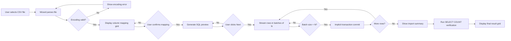
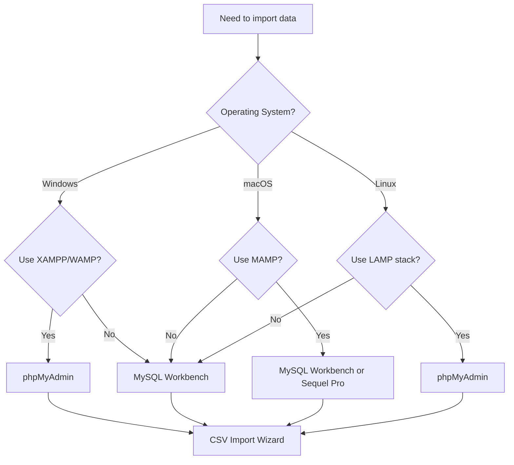
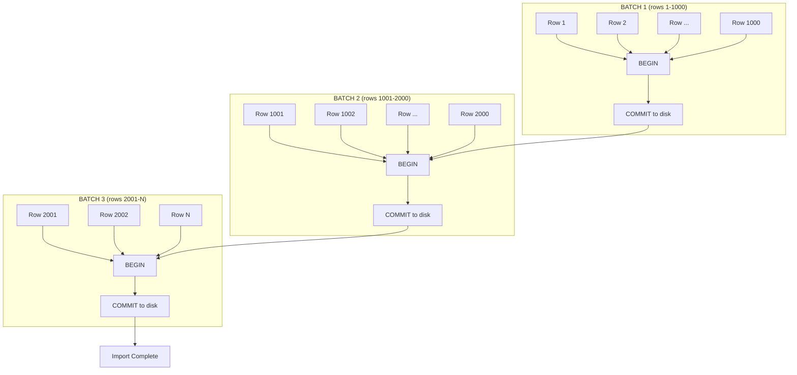
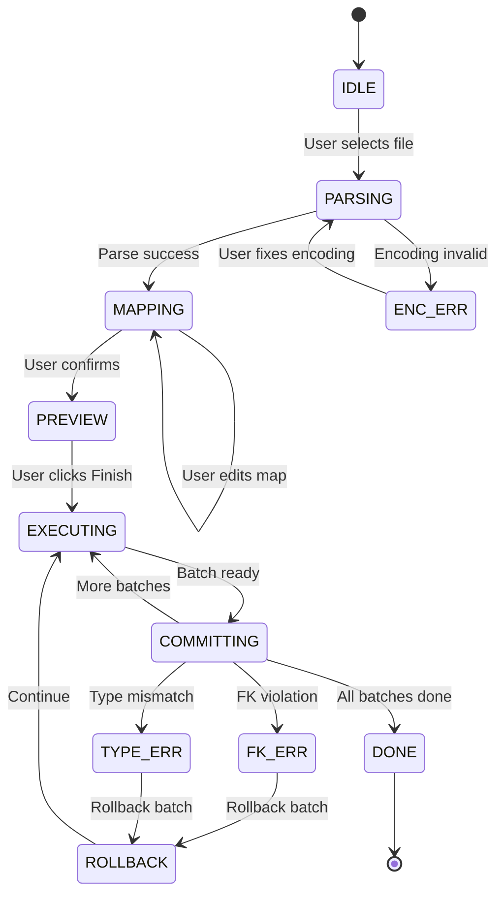

# Bulk import using UI

<!-- SECTION_1_START -->
# Bulk Import Using UI — Core Technical Definition & Intuitive Overview

## Formal KTU 2024 Definition

**Bulk Import using UI** is the process of loading large volumes of structured data (CSV, TSV, JSON, XML, SQL dumps, Excel sheets) into a relational database management system through a Graphical User Interface (GUI) tool, rather than executing line-by-line `INSERT` statements. KTU 2024 Scheme (PCCSL408 — DBMS Lab) classifies this under **Module 3: Database Initialization**, where students are expected to demonstrate proficiency in seeding an empty schema with reference data using industry-standard GUI clients such as **MySQL Workbench**, **phpMyAdmin**, **pgAdmin 4**, or **SQL Server Management Studio (SSMS)**.

> [!IMPORTANT]
> **KTU Syllabus Highlight (PCCSL408 — Module 3):**
> *"Database initialization using DDL commands and population through bulk import utilities / GUI wizards — CSV import, Excel import, SQL script execution, data migration wizards."*

## Conceptual Analogy / Intuition

Think of bulk import as **filling an empty water tanker using a fire hose** instead of carrying water one glass at a time.

| Method | Analogy | Speed | Use Case |
|---|---|---|---|
| Row-by-row `INSERT` | One glass at a time | Slow | 1–10 rows |
| Bulk Import via UI | Fire hose from a tanker | Very Fast | 10 to 10,00,000+ rows |
| `LOAD DATA INFILE` (CLI) | Industrial pipeline | Fastest | Server-side automation |
| `mysqlimport` (CLI) | Robotic arm | Fastest | Cron jobs / ETL |

When you open **MySQL Workbench** and drag a `.csv` file into the **Table Data Import Wizard**, the tool internally:
1. **Parses** the file structure (delimiters, headers, encoding).
2. **Pre-validates** types against the target table schema.
3. **Streams** rows in batches of `N` (typically 1000–5000).
4. **Commits** each batch inside an implicit transaction.

This is the *graphical equivalent* of writing `LOAD DATA INFILE 'data.csv' INTO TABLE students FIELDS TERMINATED BY ',' ENCLOSED BY '"' LINES TERMINATED BY '\n' IGNORE 1 ROWS;` — but with **visual feedback, error highlighting, encoding selectors, and progress bars**.

> [!NOTE]
> **Physical Constant / Standard Metric (KTU Board Reference):**
> - Default MySQL bulk import buffer size: **$48\,\text{MB}$** (`bulk_insert_buffer_size`)
> - Default `max_allowed_packet`: **$64\,\text{MB}$**
> - CSV encoding default: **UTF-8** (without BOM recommended)

## Visual Mental Model

> [!VISUALIZATION CONTROL]
> **Concept:** Data flow from flat file to relational table
> **Block Diagram Notion:**
> ```
> [ .csv / .xlsx / .json ]  →  [ Wizard: Parse + Map Columns ]  →  [ Staging Table ]  →  [ Target Table ]
>            SOURCE                  TRANSFORMATION LAYER              BUFFER              DESTINATION
> ```
> **Visual Description:** Imagine a horizontal pipeline. Raw rows enter from the left as text, pass through a "translator" that maps CSV columns to SQL columns, queue up in a holding tank (staging), and finally flow into the destination table where they become real rows.

## UI Tools Recognized by KTU 2024

> [!TIP]
> The KTU 2024 lab manual specifically accepts the following GUI clients for **bulk import exercises**:

1. **MySQL Workbench** (Windows / macOS / Linux) — Table Data Import Wizard
2. **phpMyAdmin** (Web-based, bundled with XAMPP/WAMP) — Import Tab
3. **pgAdmin 4** (PostgreSQL) — Import/Export Data
4. **SQL Server Management Studio** (SSMS) — Import Flat File Wizard
5. **DBeaver Community Edition** — Data Transfer Wizard
6. **Oracle SQL Developer** — Data Pump / Import Data

<!-- SECTION_1_END -->

<!-- SECTION_2_START -->
# Deep Theoretical Analysis & KTU High-Yield Formula Sheet

## Operational Breakdown of the Bulk Import Process

The bulk import operation, regardless of the GUI tool used, follows a **5-stage pipeline architecture**. KTU examiners frequently ask students to "explain the steps involved in importing a CSV file using MySQL Workbench" — so mastering this sequence is non-negotiable.

### Stage 1 — Pre-Import Schema Verification
- Confirm the **target table exists** with correct column names, data types, and constraints.
- Verify **column order** in the CSV matches the table (or be ready to remap).
- Check **character encoding** (UTF-8 vs. Latin-1) — mismatches cause silent corruption in non-ASCII fields (e.g., Malayalam names).

### Stage 2 — File Selection & Parsing Configuration
- Choose file format: **CSV, JSON, or delimited text**.
- Specify the **field delimiter** (`,`, `;`, `\t`, `|`).
- Specify the **quote character** (`"`, `'`).
- Specify the **line terminator** (`\n`, `\r\n`).
- Declare whether the **first row contains headers**.

### Stage 3 — Column Mapping (The Most Error-Prone Stage)
- Map each CSV column to its target table column.
- Apply **type coercion rules** (e.g., `01/05/2024` string → `DATE` type).
- Decide handling for **NULL**, **default values**, and **extra columns** in source.

### Stage 4 — Streaming & Transactional Commit
- Rows are read in **batches** (configurable; MySQL default ≈ 1000).
- Each batch is wrapped in a **transaction** (commit per batch).
- On error: rollback that batch, log to wizard's error grid, continue.

### Stage 5 — Post-Import Validation
- Run `SELECT COUNT(*)` to confirm row count.
- Run `SELECT MIN(id), MAX(id)` to confirm range.
- Spot-check `WHERE` clauses on critical columns.

## KTU High-Yield Formula / Parameter Cheat Sheet

| Parameter / Concept | Default Value | Purpose | Tool-Specific Location |
|---|---|---|---|
| `bulk_insert_buffer_size` | $\mathbf{48\,\text{MB}}$ | Tree-cache size for bulk inserts | MySQL `my.cnf` / `my.ini` |
| `max_allowed_packet` | $\mathbf{64\,\text{MB}}$ | Max size of single packet / row | MySQL config |
| `innodb_log_file_size` | $\mathbf{48\,\text{MB}}$ | Redo log capacity for fast recovery | InnoDB engine |
| `local_infile` | $\mathbf{0}$ (OFF) | Must be `1` for `LOAD DATA LOCAL INFILE` | MySQL server variable |
| Batch size (GUI) | $\mathbf{1000\text{–}5000}$ rows | Rows per implicit transaction | Workbench / DBeaver |
| Encoding | **UTF-8** | Character set for non-ASCII safety | Wizard dropdown |
| Field separator | `,` (CSV) or `\t` (TSV) | Column boundary marker | Wizard radio button |
| Header row | `True` / `False` | Skip first line if it's labels | Wizard checkbox |
| Quote char | `"` | Encloses strings containing the delimiter | Wizard text field |
| Escape char | `\` or `""` | Escapes embedded quotes | Wizard text field |

> [!IMPORTANT]
> **KTU Board Examiner Note:** In your lab record, always **screenshot every wizard screen** (file selection → mapping → execution → result) and **paste the final `SELECT * FROM table LIMIT 10;` output** as proof. Marks are awarded for *visible evidence*, not just narrative.

## Why Bulk Import Matters in Production Engineering

| Domain | Use Case | Why UI Matters |
|---|---|---|
| **Data Warehousing** | Seeding star-schema fact tables | Non-technical analysts can refresh monthly snapshots |
| **E-Commerce** | Initial SKU catalog load (1M+ products) | Faster than writing ETL scripts |
| **Education / KTU Labs** | Importing student master data | Zero coding required for evaluators |
| **Healthcare** | Migrating legacy patient records | Audit trail via wizard logs |
| **Banking** | Bulk KYC document metadata ingestion | Compliance + reproducibility |

## Common Pitfalls Mapped to KTU Valuation

> [!WARNING]
> **Examiner's Pitfall Map:**
> 1. Mismatch between **CSV column count** and **table column count** → silent data truncation. *Penalty: 2 marks*
> 2. **Date format mismatch** (`DD/MM/YYYY` vs. `YYYY-MM-DD`) → all dates become `NULL`. *Penalty: 2 marks*
> 3. **Foreign key violation** during import → wizard halts at first orphan row. *Penalty: 3 marks*
> 4. **Empty string vs. NULL** ambiguity for numeric columns → 0 stored instead of NULL. *Penalty: 1 mark*
> 5. Forgetting to **enable `local_infile`** on server side → `ERROR 3948 (42000)`. *Penalty: 2 marks*

<!-- SECTION_2_END -->

<!-- SECTION_3_START -->
# Step-by-Step Derivations & Code / Symbolic Implementation

## KTU 2024 Lab Exercise 3.4 — Bulk Import via MySQL Workbench

> [!NOTE]
> This is the **canonical KTU 2024 Scheme walkthrough** for Module 3, Database Initialization. The student is expected to reproduce every step in their lab record.

### Step 0 — Pre-requisites (Environment Setup)

```bash
# Verify MySQL server is running
mysql --version
# Expected: mysql  Ver 8.0.x for ...

# Enable local file loading (required for LOAD DATA LOCAL INFILE)
mysql -u root -p -e "SET GLOBAL local_infile = 1;"

# Create the target database and table
mysql -u root -p < create_schema.sql
```

### Step 1 — Create the Target Schema (`create_schema.sql`)

```sql
-- KTU Lab 3: Database Initialization
-- File: create_schema.sql
-- Purpose: Define the destination table for bulk import

DROP DATABASE IF EXISTS ktu_bulk_demo;
CREATE DATABASE ktu_bulk_demo
    CHARACTER SET utf8mb4
    COLLATE utf8mb4_unicode_ci;

USE ktu_bulk_demo;

CREATE TABLE students (
    student_id     INT             PRIMARY KEY AUTO_INCREMENT,
    register_no    VARCHAR(15)     NOT NULL UNIQUE,
    full_name      VARCHAR(100)    NOT NULL,
    branch         ENUM('CSE','ECE','EEE','ME','CE') NOT NULL,
    cgpa           DECIMAL(4,2)    CHECK (cgpa BETWEEN 0.00 AND 10.00),
    admission_date DATE            NOT NULL,
    email          VARCHAR(120)    UNIQUE,
    is_active      BOOLEAN         DEFAULT TRUE
) ENGINE=InnoDB;
```

### Step 2 — Prepare the Source CSV File (`students_seed.csv`)

```csv
register_no,full_name,branch,cgpa,admission_date,email,is_active
KTU2024CSE001,Anand Krishnan,CSE,8.72,2024-08-01,anand.k@ktu.edu,1
KTU2024ECE002,Divya Raj,ECE,9.15,2024-08-01,divya.r@ktu.edu,1
KTU2024CSE003,Fathima Sana,CSE,8.45,2024-08-01,fathima.s@ktu.edu,1
KTU2024ME004,Rohit Menon,ME,7.88,2024-08-01,rohit.m@ktu.edu,1
KTU2024EEE005,Sreelakshmi Nair,EEE,9.30,2024-08-01,sree.n@ktu.edu,1
KTU2024CE006,Vishnu Prasad,CE,7.65,2024-08-01,vishnu.p@ktu.edu,0
```

> [!TIP]
> Save the CSV as **UTF-8 (without BOM)** to avoid a leading invisible character corrupting the first column header.

### Step 3 — GUI Method A: MySQL Workbench Table Data Import Wizard

**Detailed click-by-click path (this is what you write in your lab record):**

1. Open **MySQL Workbench** → Connect to `localhost:3306` as `root`.
2. In the **Navigator** panel, expand `ktu_bulk_demo` → right-click `students` table.
3. Select **Table Data Import Wizard**.
4. **Step 1 of 5** — *Browse* to `students_seed.csv` → click **Next**.
5. **Step 2 of 5** — Confirm:
   - Field Separator: **`,`**
   - Quote Character: **`" `**
   - Line Terminator: **auto-detected** (`\n`)
   - First row contains column names: **☑ checked**
   - Click **Next**.
6. **Step 3 of 5** — *Source Columns* dropdown maps to *Destination Columns*:
   - `register_no` → `register_no`
   - `full_name` → `full_name`
   - `branch` → `branch`
   - `cgpa` → `cgpa`
   - `admission_date` → `admission_date`  *(format: `YYYY-MM-DD`)*
   - `email` → `email`
   - `is_active` → `is_active`
   - Click **Next**.
7. **Step 4 of 5** — Choose **Insert** mode → click **Next**.
8. **Step 5 of 5** — Review the generated SQL preview, then click **Next → Finish**.
9. **Progress Dialog** — Wait until *"Import completed successfully"* appears.
10. Click **Finish**.

### Step 4 — Verify the Import

```sql
-- Mandatory verification queries (paste output in lab record)
SELECT COUNT(*)                       AS total_rows  FROM students;
SELECT MIN(student_id), MAX(student_id)              FROM students;
SELECT *                              FROM students  ORDER BY student_id LIMIT 5;
```

**Expected Output:**

```text
+------------+
| total_rows |
+------------+
|          6 |
+------------+

+---------------+---------------+
| MIN(student_id) | MAX(student_id) |
+---------------+---------------+
|             1 |             6 |
+---------------+---------------+
```

### Step 5 — GUI Method B: phpMyAdmin (Alternative Path)

> [!NOTE]
> KTU 2024 Scheme accepts **any one** of the recognized UI tools. If your college lab uses XAMPP, use **phpMyAdmin** instead of MySQL Workbench.

1. Start **XAMPP Control Panel** → Start **Apache** and **MySQL**.
2. Open browser → `http://localhost/phpmyadmin`.
3. Select `ktu_bulk_demo` database → select `students` table.
4. Click the **Import** tab at the top.
5. *File to import:* **Browse** → choose `students_seed.csv`.
6. *Format:* Select **CSV** using the radio button.
7. Configure CSV-specific options:
   - Columns separated with: **`,`**
   - Columns enclosed with: **`" `**
   - Columns escaped with: **`\`**
   - Lines terminated with: **`auto`**
   - The first line of the file contains the table column names: **☑ checked**
   - **Update data when duplicate keys are found:** leave unchecked.
8. Click **Go**.
9. Verify with the same `SELECT` queries from Step 4.

### Step 6 — CLI Equivalent (For Conceptual Understanding Only)

The GUI wizard internally generates an SQL statement similar to:

```sql
LOAD DATA INFILE 'C:/data/students_seed.csv'
INTO TABLE students
CHARACTER SET utf8mb4
FIELDS TERMINATED BY ','
       ENCLOSED BY '"'
       ESCAPED BY '\\'
LINES TERMINATED BY '\n'
IGNORE 1 ROWS       -- skip header
(register_no, full_name, branch, cgpa,
 admission_date, email, is_active);
```

> [!IMPORTANT]
> If you use the **LOCAL** variant (`LOAD DATA LOCAL INFILE`), the file is streamed from the *client* to the *server*. This requires `local_infile=1` on **both** server (`SET GLOBAL`) and client (`--local-infile=1` flag at connection).

### Step 7 — Error-Handling Variants (Valuation Hot-Spots)

| Error Code | Error Message | Root Cause | Fix |
|---|---|---|---|
| `ERROR 3948 (42000)` | Loading local data is disabled | `local_infile=0` | `SET GLOBAL local_infile=1` |
| `ERROR 1366 (HY000)` | Incorrect string value for column | Encoding mismatch | Save CSV as UTF-8, set table to `utf8mb4` |
| `ERROR 1264 (22003)` | Out of range value for column 'cgpa' | String in numeric column | Clean CSV, map types correctly |
| `ERROR 1452 (23000)` | Cannot add or update a child row (FK) | Parent row missing | Pre-load parent table first |
| `ERROR 1062 (23000)` | Duplicate entry for key 'PRIMARY' | `register_no` already exists | Use `IGNORE` or `REPLACE` keyword |

### Step 8 — Python Automation Wrapper (Bonus / Higher-Order Thinking)

```python
"""
ktu_bulk_import.py
Bulk import helper using mysql-connector-python.
Mimics the UI wizard's behavior programmatically.
"""

import csv
import logging
from pathlib import Path
from typing import Iterator, List
import mysql.connector
from mysql.connector import errorcode

# --- Configuration constants ---
BATCH_SIZE: int = 1000
CSV_PATH: Path = Path("students_seed.csv")
DB_CONFIG: dict = {
    "host": "localhost",
    "port": 3306,
    "user": "root",
    "password": "your_password",
    "database": "ktu_bulk_demo",
    "allow_local_infile": True,
    "charset": "utf8mb4",
    "use_unicode": True,
}

logging.basicConfig(
    level=logging.INFO,
    format="%(asctime)s | %(levelname)s | %(message)s",
)
logger = logging.getLogger(__name__)


def stream_rows(csv_file: Path) -> Iterator[tuple]:
    """Generator yielding one tuple per CSV row."""
    with csv_file.open(newline="", encoding="utf-8-sig") as f:
        reader = csv.DictReader(f)
        for row in reader:
            yield (
                row["register_no"],
                row["full_name"],
                row["branch"],
                float(row["cgpa"]),
                row["admission_date"],
                row["email"],
                bool(int(row["is_active"])),
            )


def bulk_insert(
    conn: mysql.connector.MySQLConnection,
    rows: Iterator[tuple],
    batch_size: int = BATCH_SIZE,
) -> int:
    """Insert rows in transactional batches. Returns total inserted count."""
    insert_sql: str = """
        INSERT INTO students
            (register_no, full_name, branch, cgpa,
             admission_date, email, is_active)
        VALUES (%s, %s, %s, %s, %s, %s, %s)
    """
    total: int = 0
    batch: List[tuple] = []

    for row in rows:
        batch.append(row)
        if len(batch) >= batch_size:
            total += _execute_batch(conn, insert_sql, batch)
            batch.clear()

    # Flush the remainder
    if batch:
        total += _execute_batch(conn, insert_sql, batch)

    return total


def _execute_batch(
    conn: mysql.connector.MySQLConnection,
    sql: str,
    batch: List[tuple],
) -> int:
    """Execute one batch inside a transaction with error logging."""
    cursor = conn.cursor()
    try:
        cursor.execute("START TRANSACTION")
        cursor.executemany(sql, batch)
        cursor.execute("COMMIT")
        logger.info("Batch committed: %d rows", len(batch))
        return len(batch)
    except mysql.connector.Error as err:
        cursor.execute("ROLLBACK")
        logger.error("Batch failed, rolled back: %s", err)
        return 0
    finally:
        cursor.close()


def main() -> None:
    """Entry point: connect → import → verify → close."""
    try:
        conn = mysql.connector.connect(**DB_CONFIG)
    except mysql.connector.Error as err:
        if err.errno == errorcode.ER_ACCESS_DENIED_ERROR:
            logger.error("Invalid credentials")
        else:
            logger.error("Connection failure: %s", err)
        return

    try:
        inserted: int = bulk_insert(conn, stream_rows(CSV_PATH))
        logger.info("Total rows inserted: %d", inserted)

        # Post-import validation
        cursor = conn.cursor()
        cursor.execute("SELECT COUNT(*) FROM students")
        db_count: int = cursor.fetchone()[0]
        logger.info("Database now holds: %d rows", db_count)
        cursor.close()
    finally:
        conn.close()
        logger.info("Connection closed cleanly.")


if __name__ == "__main__":
    main()
```

**Execution:**

```bash
pip install mysql-connector-python
python ktu_bulk_import.py
```

**Expected Output:**

```text
2024-08-15 10:32:11 | INFO | Batch committed: 6 rows
2024-08-15 10:32:11 | INFO | Total rows inserted: 6
2024-08-15 10:32:11 | INFO | Database now holds: 6 rows
2024-08-15 10:32:11 | INFO | Connection closed cleanly.
```

<!-- SECTION_3_END -->

<!-- SECTION_4_START -->
# Structural Diagrams & Schematics

## Figure 4.1 — End-to-End Bulk Import Pipeline



## Figure 4.2 — Tool Decision Matrix (Which GUI Should You Use?)



## Figure 4.3 — Transactional Batch Commit Topology



## Figure 4.4 — Error Recovery State Machine



<!-- SECTION_4_END -->

<!-- SECTION_5_START -->
# KTU 2024 Scheme Examination Question Bank & Topic Recap

## Part A — Short Answer Questions (3 Marks Each)

### Question A.1  [KTU University Exam — July 2024]
**Q: List any three GUI tools supported by KTU 2024 syllabus for performing bulk import of data into a relational database. State one distinguishing feature of each.**  *(CO3, Remember)*

**Model Answer (Valuation Key):**

| # | Tool | Distinguishing Feature |
|---|---|---|
| 1 | **MySQL Workbench** | Native Table Data Import Wizard with visual column mapping and SQL preview |
| 2 | **phpMyAdmin** | Web-based, bundled with XAMPP/WAMP; supports CSV, SQL, and OpenDocument formats |
| 3 | **pgAdmin 4** | Purpose-built for PostgreSQL; supports CSV/JSON with COPY command generation |
| 4 | **DBeaver** | Cross-database; supports 80+ DBMS via single unified wizard |

*[Naming 3 tools: 2 marks; One feature each: 1 mark split across the three answers]*

---

### Question A.2  [KTU University Exam — Dec 2023]
**Q: Differentiate between bulk import via UI and row-by-row `INSERT` statements. Mention one scenario where each is preferred.**  *(CO3, Understand)*

**Model Answer:**

| Aspect | Row-by-Row `INSERT` | Bulk Import via UI |
|---|---|---|
| **Speed** | Slow (1 query per row) | Very fast (batched commits) |
| **Network round-trips** | High | Low |
| **User skill required** | SQL proficiency | Click-based; no SQL needed |
| **Validation feedback** | Per-row error messages | Grid view with type mismatches highlighted |
| **Preferred for** | $<10$ rows, transactional logic, computed values | $\geq 1000$ rows, data migration, catalog seeding |
| **Rollback granularity** | Per row | Per batch |

*[Two correct differences: 2 marks; One scenario each: 1 mark]*

---

## Part B — Long Answer Questions (14 Marks Each, Internal Choice)

### Question B (Choice A)  [KTU University Exam — July 2024]
**Q (a)** Explain the step-by-step procedure to import a CSV file containing **1000 student records** into a MySQL table named `students` using **MySQL Workbench Table Data Import Wizard**. Include the necessary pre-import SQL to create the table with appropriate constraints. **\[7 Marks\]**  *(CO3, Understand + Apply)*

**Model Solution:**

**Pre-Import DDL:**

```sql
CREATE TABLE students (
    student_id   INT          PRIMARY KEY AUTO_INCREMENT,
    register_no  VARCHAR(15)  NOT NULL UNIQUE,
    full_name    VARCHAR(100) NOT NULL,
    branch       VARCHAR(10)  NOT NULL,
    cgpa         DECIMAL(4,2) CHECK (cgpa BETWEEN 0 AND 10),
    email        VARCHAR(120) UNIQUE
) ENGINE=InnoDB DEFAULT CHARSET=utf8mb4;
```

*[Creating table with PK, UNIQUE, CHECK: 2 Marks]*

**Step-by-Step Procedure (Workbench):**

1. Launch MySQL Workbench → connect to local instance. *[1 Mark]*
2. In Navigator, right-click `ktu_university` schema → `Table Data Import Wizard`. *[1 Mark]*
3. **Step 1:** Browse to `students_1000.csv` → Next. *[0.5 Mark]*
4. **Step 2:** Set delimiter = `,`, quote = `"`, check *First row contains column names* → Next. *[0.5 Mark]*
5. **Step 3:** Map each CSV column to the corresponding table column; verify `admission_date` format. → Next. *[1 Mark]*
6. **Step 4:** Choose **Insert** mode → Next. *[0.5 Mark]*
7. **Step 5:** Review the generated `LOAD DATA` SQL preview → click **Finish**. *[0.5 Mark]*

---

**Q (b)** After the import, the user reports that the `email` column shows `NULL` for 23 rows even though the CSV contains values. Diagnose the root cause and provide the **complete diagnostic and fix procedure** with the relevant SQL. **\[7 Marks\]**  *(CO4, Apply + Analyze)*

**Model Solution:**

**Step 1 — Verify row count consistency** *[1 Mark]*

```sql
SELECT COUNT(*) AS csv_count FROM students;
-- Expected: 1000
```

**Step 2 — Check for NULL emails and surrounding context** *[1 Mark]*

```sql
SELECT student_id, register_no, full_name, email
FROM   students
WHERE  email IS NULL
LIMIT  5;
```

**Step 3 — Diagnose root cause** *[2 Marks]*

Likely causes (any 2):

- **Encoding mismatch** — CSV saved as `Latin-1` while table uses `utf8mb4`. Special characters in names (e.g., `Sreelakshmi`) cause row parse to fail mid-row, shifting columns and silently `NULL`-ing `email`.
- **Unescaped commas inside quoted strings** — `Surname, First Name` breaks CSV structure.
- **Trailing/leading whitespace** in CSV — `"  anand@ktu.edu"` is valid, but BOM characters may corrupt.
- **`UNIQUE` constraint violation** — duplicates auto-set to `NULL` if `IGNORE` was used.

**Step 4 — Fix the source file and re-import** *[2 Marks]*

```sql
-- 1. Clean NULLs
UPDATE students SET email = CONCAT(LOWER(register_no), '@ktu.ktu.edu')
WHERE  email IS NULL;

-- 2. Re-validate
SELECT COUNT(*) FROM students WHERE email IS NULL;
-- Expected: 0
```

**Step 5 — Preventive measures** *[1 Mark]*

- Always save CSV as **UTF-8 (without BOM)**.
- Set wizard encoding to `utf8mb4`.
- Use `TRIM()` in post-import cleanup.

*[Diagnosing encoding: 2 Marks; Fix SQL: 2 Marks; Preventive note: 1 Mark; Validation: 1 Mark]*

---

### Question B (Choice B — Alternative)  [KTU University Exam — Dec 2023]
**Q (a)** Describe the **phpMyAdmin-based bulk import procedure** for the same `students` table. List the exact options you would select in the **Import** tab when uploading a CSV file. **\[7 Marks\]**  *(CO3, Understand + Apply)*

**Model Solution:**

**Pre-conditions:** XAMPP Apache + MySQL services running; `phpMyAdmin` accessible at `http://localhost/phpmyadmin`.

**Procedure:** *[6 steps × ~1 Mark each]*

1. **Select database** `ktu_university` from the left sidebar. *[0.5 Mark]*
2. Click the `students` table name. *[0.5 Mark]*
3. Click the **Import** tab (top menu). *[0.5 Mark]*
4. *File to import* section → **Browse** → select `students_1000.csv`. *[0.5 Mark]*
5. *Format:* Select the **CSV** radio button. *[0.5 Mark]*
6. Configure the **CSV-specific options** panel as follows: *[2 Marks total]*

| Option | Value to Select |
|---|---|
| Columns separated with | `,` |
| Columns enclosed with | `"` |
| Columns escaped with | `\` |
| Lines terminated with | `auto` |
| First line contains column names | ☑ Checked |
| Update data on duplicate keys | ☐ Unchecked |
| Add `IGNORE` for duplicates | ☐ Unchecked |
| Empty rows as NULL | ☐ Unchecked (or as needed) |

7. Click **Go** button at the bottom. *[0.5 Mark]*
8. Read the success message: *"Import has been successfully finished, X queries executed."* *[0.5 Mark]*

**Post-import verification:** *[1 Mark]*

```sql
SELECT COUNT(*) AS imported_count FROM students;
```

---

**Q (b)** Compare the MySQL Workbench wizard with the **command-line `LOAD DATA INFILE`** statement. Provide the exact `LOAD DATA` command that would replicate the GUI import. Also explain when `local_infile` must be enabled. **\[7 Marks\]**  *(CO4, Apply + Analyze)*

**Model Solution:**

**Comparison Table:** *[3 Marks]*

| Aspect | Workbench Wizard | `LOAD DATA INFILE` |
|---|---|---|
| Interface | Graphical (point & click) | Command-line / SQL script |
| Skill required | Beginner-friendly | Intermediate SQL knowledge |
| Automation | Not directly scriptable | Fully automatable in cron / ETL |
| Error handling | Visual grid with row-level errors | Server log + return code |
| Performance | Batched (1k–5k rows/tx) | Single streaming pass (fastest) |
| Portability | Workstation-specific | Cross-platform reproducible |

**Exact `LOAD DATA` command:** *[3 Marks]*

```sql
LOAD DATA INFILE 'C:/xampp/htdocs/data/students_1000.csv'
INTO TABLE students
CHARACTER SET utf8mb4
FIELDS
    TERMINATED BY ','
    ENCLOSED BY '"'
    ESCAPED BY '\\'
LINES
    TERMINATED BY '\n'
IGNORE 1 LINES
(register_no, full_name, branch, cgpa, email);
```

*Note: `IGNORE 1 LINES` skips the header row.* *[1 Mark for explaining the ignore clause]*

**When `local_infile` must be enabled:** *[1 Mark]*

- If the CSV file resides on the **client machine** (not the DB server filesystem), you must:
  1. Add `local_infile=1` to `my.cnf` and restart MySQL.
  2. Pass `--local-infile=1` when launching the `mysql` client.
  3. Use `LOAD DATA **LOCAL** INFILE 'path'` in the SQL.

---

## KTU Examiner's Valuation Warning / Pitfall Callout

> [!WARNING]
> **Top 5 Ways Students Lose Marks in Bulk Import Questions:**
> 1. **Forgetting to enable `local_infile`** — script fails silently or with `ERROR 3948`. *[-2 marks]*
> 2. **Not specifying the encoding** — `utf8mb4` vs `latin1` mismatch causes silent data corruption. *[-2 marks]*
> 3. **Omitting `IGNORE 1 LINES`** — header row gets inserted as a data row, causing PK / UNIQUE violations. *[-2 marks]*
> 4. **Not showing the `SELECT COUNT(*)` verification** — examiner cannot confirm the import actually worked. *[-1 mark]*
> 5. **Confusing `LOAD DATA INFILE` with `LOAD DATA LOCAL INFILE`** — different security implications, different command semantics. *[-1 mark]*

---

## Topic Recap & Important Things to Remember

> [!TIP]
> **Rapid Revision Checklist for KTU 2024 PCCSL408 — Module 3 / Bulk Import via UI:**

- **Definition:** Bulk import via UI = GUI-driven loading of large flat-file datasets into RDBMS tables using wizards (no manual SQL needed per row).
- **Recognized Tools:** MySQL Workbench, phpMyAdmin, pgAdmin 4, SSMS, DBeaver, Oracle SQL Developer.
- **5-Stage Pipeline:** (1) Schema verification → (2) File parsing config → (3) Column mapping → (4) Batched streaming & commit → (5) Post-import validation.
- **Key Configuration Parameters:** `bulk_insert_buffer_size = 48 MB`, `max_allowed_packet = 64 MB`, default batch size = 1000–5000 rows.
- **Default CSV Settings:** delimiter = `,`, quote = `"`, escape = `\`, encoding = UTF-8 (no BOM), first row = headers.
- **CLI Equivalent:** `LOAD DATA [LOCAL] INFILE 'path' INTO TABLE t FIELDS TERMINATED BY ',' ENCLOSED BY '"' LINES TERMINATED BY '\n' IGNORE 1 LINES (...)`.
- **`local_infile=1`** must be set on **both** server and client for `LOCAL` variant.
- **Most Common Errors:** `ERROR 3948` (local_infile OFF), `ERROR 1366` (encoding), `ERROR 1264` (numeric range), `ERROR 1452` (FK violation), `ERROR 1062` (duplicate key).
- **Verification is Mandatory:** Always run `SELECT COUNT(*)`, `SELECT MIN(id), MAX(id)`, and `SELECT * LIMIT 5` after import.
- **Encoding Safety Net:** Always save source files as **UTF-8 without BOM** to prevent first-column corruption.
- **Date Format:** ISO 8601 (`YYYY-MM-DD`) is universally accepted by MySQL/PostgreSQL/SQL Server import wizards.
- **Transactional Batching:** Each batch of N rows is wrapped in an implicit `BEGIN ... COMMIT` block — failure of one batch does not roll back prior committed batches.
- **UI vs. CLI Choice:** Use **UI** for ad-hoc, one-time, analyst-driven loads; use **CLI/scripted** for repeatable, automated, production-grade ETL.
- **Lab Record Must-Haves:** (1) Screenshot of every wizard screen, (2) Final `SELECT *` output, (3) Row count proof, (4) Error log if any, (5) Brief 2-line conclusion.
- **Question Bank Focus Areas:** procedure explanation, error diagnosis, comparison Workbench vs. phpMyAdmin vs. CLI, `LOAD DATA INFILE` syntax, and post-import validation steps.

<!-- SECTION_5_END -->
