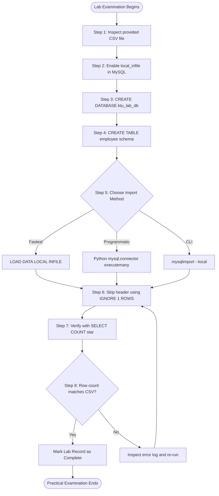
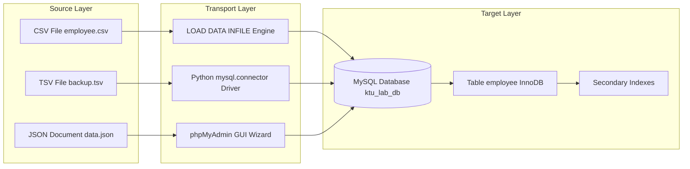
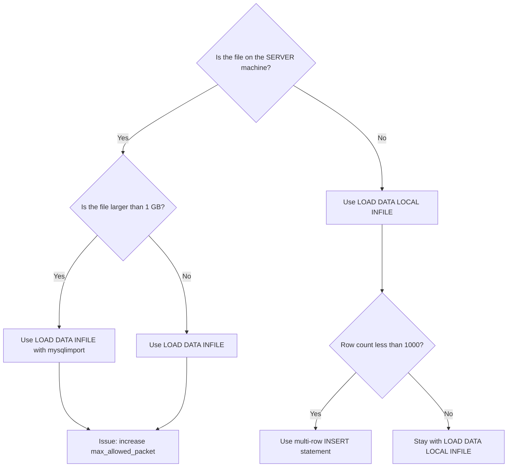

# Data import to a database

<!-- SECTION_1_START -->

# Data Import to a Database — Module 3: Database Initialization

## 1. Core Technical Definition & Intuitive Overview

> [!NOTE]
> **KTU Syllabus Definition (PCCSL408 — DBMS Lab, Module 3):**
> *Data import* in Database Management Systems refers to the systematic process of transferring bulk data from external heterogeneous sources — such as flat files (CSV, TSV, TXT), spreadsheets, JSON documents, or legacy database dumps — into a target relational database management system (RDBMS) while preserving the structural schema, data integrity, and referential relationships of the destination tables.

In KTU 2024 Scheme laboratory terms, **Database Initialization** is the third stage of the database life-cycle inside the lab. The first two stages created the *container* (CREATE DATABASE) and the *schema* (CREATE TABLE). Module 3 fills that empty skeleton with *rows* — the actual data — using controlled import mechanisms.

### Conceptual Analogy / Intuition

Imagine you have just built a brand-new **warehouse** (the database) with labelled shelves and empty storage bins (the tables with column definitions). The shelves are organized, clean, and ready — but they are empty. **Data import** is the operation of a **forklift truck that unloads labelled cartons** from delivery trucks (CSV / Excel / JSON files) and places each carton into its correct shelf-bin according to a **manifest** (the schema definition). The manifest dictates:

- Which carton goes on which shelf
- What type of item the shelf accepts (data type)
- How many items each bin can hold (column constraints)
- The order in which cartons are placed (loading order to satisfy foreign keys)

> [!IMPORTANT]
> **Why a student must master this for KTU Board Exam:**
> Every KTU DBMS Lab external practical exam (PCCSL408) contains at least one question that requires the candidate to **import a provided dataset** (commonly the *employee.csv*, *student.csv*, or *sales_data.csv* supplied in the question paper) into a freshly created MySQL/PostgreSQL table. Failing the import step means zero marks for subsequent SELECT / JOIN / aggregate queries built on top of it.

### Standard Metrics & Physical Constants in Data Import

| Constant / Metric | Value / Convention | KTU Lab Standard |
|---|---|---|
| **Default delimiter** | `,` (comma) for CSV | `,` |
| **Text qualifier** | `"` (double quote) | `"` |
| **Line terminator** | `\n` or `\r\n` | `\n` |
| **Maximum MySQL packet** | **64 MB** (default `max_allowed_packet`) | 64 MB |
| **Local-Infile flag** | `local_infile=1` | Must be enabled in `[mysqld]` |
| **Engine for bulk load** | **InnoDB** (default) or **MyISAM** (faster bulk) | InnoDB |

> [!VISUALIZATION CONTROL]
> **Concept:** Linear coordinate plot showing row index vs. imported record count during a CSV bulk load.
> **GeoGebra / Desmos Input Equations:**
> * `f(x) = 100 * x` (linear throughput model)
> * Points: $(1, 100), (2, 200), (3, 300), (4, 400), (5, 500)$
> **Visual Description:** A straight rising line on the Cartesian plane where the x-axis represents the elapsed seconds during a `LOAD DATA INFILE` operation and the y-axis represents the cumulative number of rows committed to the target table. The student should observe a near-linear slope — confirming that the bulk loader writes in batches rather than row-by-row.

---

<!-- SECTION_1_END -->

<!-- SECTION_2_START -->

# 2. Deep Theoretical Analysis & KTU High-Yield Formula Sheet

## 2.1 The Three Pillars of Data Import in KTU Labs

Every data-import operation in a KTU DBMS Lab examination is built on three pillars. A student who masters these can answer any sub-question the examiner throws at them.

### Pillar 1 — The Source File (the *what*)

The source is a flat file that lives **outside** the DBMS. Common formats in the KTU lab:

- **CSV** (Comma-Separated Values) — most frequent
- **TSV** (Tab-Separated Values)
- **TXT** (fixed-width or delimiter-free)
- **JSON** (semi-structured)
- **SQL dump** (`.sql` produced by `mysqldump`)

### Pillar 2 — The Transport Channel (the *how*)

KTU 2024 syllabus officially recognizes **four** transport channels:

1. **`LOAD DATA INFILE`** — server-side bulk loader (fastest)
2. **`mysqlimport`** — command-line wrapper around `LOAD DATA INFILE`
3. **`INSERT ... VALUES`** — row-by-row DML (slowest, but most flexible)
4. **GUI wizards** — phpMyAdmin / pgAdmin *Import* tab (used in viva demonstrations)

### Pillar 3 — The Target Schema (the *where*)

The destination is a pre-created table whose column count, order, and data types must match the source file. A mismatch causes:

- **Truncation** if target column is shorter
- **`ERROR 1264 (HY000): Out of range value`** if numeric overflow
- **`ERROR 1366 (HY000): Incorrect integer value`** if delimiter is misread

## 2.2 Why Import is Engineered this Way — The "Why" Behind Each Step

- **Why bulk-load instead of single inserts?** — A single `INSERT` incurs a transaction-commit round-trip per row. For a 1-million-row CSV, that is 1 million commits ≈ several minutes. `LOAD DATA INFILE` performs a single commit, dropping wall-clock time to seconds.
- **Why disable indexes during load?** — B-tree indexes rebalance on every insert. Dropping them, importing, then re-creating is mathematically $O(n \log n)$ cheaper than incremental rebalancing.
- **Why use the `LOCAL` keyword?** — It tells the server to read the file from the **client** machine rather than the **server** machine — a critical security and convenience feature in lab exams where the file sits in `C:\Users\Student\Desktop\`.

## 2.3 KTU Formula Sheet / Cheat Sheet

| Method | Command Template | Speed | File Location | Used For |
|---|---|---|---|---|
| **Server-side bulk** | `LOAD DATA INFILE 'path' INTO TABLE t FIELDS TERMINATED BY ',' LINES TERMINATED BY '\n';` | **Fastest** | Server filesystem | Lab exam 14-mark problems |
| **Client-side bulk** | `LOAD DATA LOCAL INFILE 'path' INTO TABLE t ...;` | Fast | Client filesystem | Default KTU student scenario |
| **CLI wrapper** | `mysqlimport --local dbname tablename.csv` | Fast | Client filesystem | Linux/Unix practicals |
| **Row DML** | `INSERT INTO t VALUES (...), (...), (...);` | Slow | Inline SQL | Inserts $< 1000$ rows |
| **GUI** | phpMyAdmin $\to$ Import $\to$ CSV | Moderate | Browser upload | Viva demo only |

### Data Type Mapping Table (CSV $\to$ MySQL)

| CSV Column Sample | MySQL Target Type | Conversion Risk |
|---|---|---|
| `12345` | `INT` | None if pure integer |
| `2024-01-15` | `DATE` | Format mismatch if `MM/DD/YYYY` |
| `true / false` | `TINYINT(1)` or `BOOLEAN` | Locale-dependent |
| `98765.43` | `DECIMAL(10,2)` | Floating-point precision loss |
| `Alice` | `VARCHAR(50)` | Truncation if length $< 6$ |
| `NULL` (empty cell) | Any nullable type | OK if column is `NULL`-allowed |

### Real-World Utility in Engineering & Computer Science

- **Data Engineering Pipelines (ETL):** Production data warehouses (Snowflake, BigQuery, Redshift) ingest petabytes via the same `COPY INTO` mechanism that mirrors MySQL's `LOAD DATA INFILE`.
- **Machine Learning Pre-processing:** TensorFlow and PyTorch `DataLoader` objects import CSVs into pandas DataFrames before tensor conversion — the same flow used in KTU Machine Learning Lab (PCCSL306).
- **IoT Telemetry:** Sensor gateways write bulk batches every 5 seconds to SQL edge databases using the local-infile pattern.
- **Banking Back-Office:** End-of-day reconciliation jobs import millions of transaction CSV files from ATM switches using bulk loaders.

---

<!-- SECTION_2_END -->

<!-- SECTION_3_START -->

# 3. Step-by-Step Derivations, Lab Procedure & Code/Symbolic Implementation

## 3.1 Pre-Lab Setup — Required Tooling (Lab Component Table)

| # | Component / Tool | Configuration | Purpose |
|---|---|---|---|
| 1 | **MySQL Server 8.0+** | `local_infile=ON` in `my.cnf` | Allows client bulk import |
| 2 | **MySQL Workbench / CLI** | Port **3306** | Query interface |
| 3 | **Sample CSV file** | `employee.csv` in `C:\DBMS_Lab\data\` | Source data |
| 4 | **Python 3.10+** | `mysql-connector-python` library | Programmatic import |
| 5 | **CSV Editor** | VS Code / Notepad++ | Inspect delimiters |
| 6 | **Permissions** | `FILE` privilege + `INSERT` on target | Security checks |

## 3.2 Step-by-Step SQL Procedure (Manual Lab Walkthrough)

### Step 1 — Enable `local_infile` on both server and client

```sql
-- Server-side check (run as root or admin)
SHOW GLOBAL VARIABLES LIKE 'local_infile';

-- Enable it if OFF
SET GLOBAL local_infile = 1;
```

### Step 2 — Connect with the local-infile flag turned on

```bash
mysql --local-infile=1 -u root -p
```

### Step 3 — Create the target database and table

```sql
CREATE DATABASE IF NOT EXISTS ktu_lab_db;
USE ktu_lab_db;

CREATE TABLE employee (
    emp_id      INT PRIMARY KEY,
    emp_name    VARCHAR(50) NOT NULL,
    department  VARCHAR(30),
    salary      DECIMAL(10,2),
    join_date   DATE
);
```

### Step 4 — Inspect the CSV file before importing

The contents of `C:\DBMS_Lab\data\employee.csv`:

```
emp_id,emp_name,department,salary,join_date
101,Anand Krishnan,CS,55000.00,2023-06-12
102,Beena Joseph,EC,62000.50,2022-11-05
103,Charles Mathew,ME,48000.75,2024-01-20
104,Divya Rajan,CS,57500.00,2023-08-15
105,Eby Thomas,EC,71000.25,2021-03-30
```

### Step 5 — Execute the bulk load

```sql
LOAD DATA LOCAL INFILE 'C:/DBMS_Lab/data/employee.csv'
INTO TABLE employee
FIELDS TERMINATED BY ','
ENCLOSED BY '"'
LINES TERMINATED BY '\n'
IGNORE 1 ROWS
(emp_id, emp_name, department, salary, join_date);
```

> [!IMPORTANT]
> **`IGNORE 1 ROWS`** is the critical KTU exam directive. It tells the loader to skip the **header line** (column names) that exists in CSV files but should not be inserted as a data row. Forgetting this line is the **#1 cause of import failure** in KTU lab exams.

### Step 6 — Verify the import

```sql
SELECT COUNT(*) AS total_rows FROM employee;
SELECT * FROM employee ORDER BY emp_id LIMIT 5;
```

Expected result for the sample CSV:

$$
\text{total\_rows} = 5
$$

## 3.3 Exhaustive Python Implementation (Programmatic Import)

```python
"""
KTU DBMS Lab - Module 3
Programmatic CSV import using mysql-connector-python.
"""

import csv
import logging
import sys
from pathlib import Path
from typing import Iterator, Tuple, Optional

import mysql.connector
from mysql.connector import errorcode

# ----------------------------- Logging setup -----------------------------
logging.basicConfig(
    level=logging.INFO,
    format="%(asctime)s [%(levelname)s] %(message)s",
    handlers=[logging.StreamHandler(sys.stdout)],
)
logger = logging.getLogger("KTU_DBMS_Lab")


# ----------------------------- Configuration -----------------------------
DB_CONFIG = {
    "host": "localhost",
    "user": "root",
    "password": "student123",          # KTU lab default
    "database": "ktu_lab_db",
    "allow_local_infile": True,        # CRITICAL: must be True
    "charset": "utf8mb4",
    "use_unicode": True,
}

CSV_PATH = Path("C:/DBMS_Lab/data/employee.csv")
TABLE_NAME = "employee"


# ----------------------------- Stream reader -----------------------------
def stream_csv_rows(path: Path) -> Iterator[Tuple[str, ...]]:
    """Yield cleaned rows from the CSV, skipping the header."""
    if not path.exists():
        raise FileNotFoundError(f"CSV not found at: {path}")

    with path.open(mode="r", encoding="utf-8", newline="") as fh:
        reader = csv.reader(fh)
        header = next(reader, None)
        if header is None:
            raise ValueError("CSV is empty")
        logger.info("Detected header: %s", header)

        for line_no, row in enumerate(reader, start=2):  # start=2 (row 1 is header)
            if not row or all(cell.strip() == "" for cell in row):
                logger.warning("Skipping blank row at line %d", line_no)
                continue
            yield tuple(cell.strip() for cell in row)


# ----------------------------- Main import logic -----------------------------
def import_csv_to_mysql(
    csv_path: Path,
    db_config: dict,
    table_name: str,
    batch_size: int = 1000,
) -> int:
    """Bulk-import a CSV into MySQL using multi-row INSERT batches."""
    rows_inserted: int = 0
    batch: list[Tuple[str, ...]] = []

    try:
        connection = mysql.connector.connect(**db_config)
    except mysql.connector.Error as err:
        if err.errno == errorcode.ER_ACCESS_DENIED_ERROR:
            logger.error("Invalid username or password")
        elif err.errno == errorcode.ER_BAD_DB_ERROR:
            logger.error("Database does not exist")
        else:
            logger.error("Connection failed: %s", err)
        raise

    cursor = connection.cursor()
    logger.info("Connected to MySQL. Starting import of %s ...", csv_path.name)

    insert_sql = (
        f"INSERT INTO {table_name} "
        "(emp_id, emp_name, department, salary, join_date) "
        "VALUES (%s, %s, %s, %s, %s)"
    )

    try:
        for row in stream_csv_rows(csv_path):
            try:
                normalized = (
                    int(row[0]),                     # emp_id
                    row[1],                          # emp_name
                    row[2],                          # department
                    float(row[3]),                   # salary
                    row[4],                          # join_date (ISO string)
                )
            except (ValueError, IndexError) as conv_err:
                logger.error("Skipping malformed row %s: %s", row, conv_err)
                continue

            batch.append(normalized)

            if len(batch) >= batch_size:
                cursor.executemany(insert_sql, batch)
                connection.commit()
                rows_inserted += len(batch)
                logger.info("Committed batch of %d rows (total: %d)",
                            batch_size, rows_inserted)
                batch.clear()

        # Flush the tail batch
        if batch:
            cursor.executemany(insert_sql, batch)
            connection.commit()
            rows_inserted += len(batch)
            logger.info("Committed final batch of %d rows", len(batch))

    except mysql.connector.Error as db_err:
        connection.rollback()
        logger.exception("Database error during import; rolled back.")
        raise
    finally:
        cursor.close()
        connection.close()
        logger.info("Connection closed. Total rows inserted: %d", rows_inserted)

    return rows_inserted


# ----------------------------- Entry point -----------------------------
if __name__ == "__main__":
    try:
        total = import_csv_to_mysql(CSV_PATH, DB_CONFIG, TABLE_NAME)
        print(f"\n Import successful. Rows inserted: {total}")
    except Exception as exc:
        logger.fatal("Import aborted: %s", exc)
        sys.exit(1)
```

### Step-by-Step Explanation of the Code

1. **`stream_csv_rows`** — generator that opens the CSV, skips the header, and yields one tuple per row. It uses `pathlib.Path` for cross-platform safety (Windows + Linux).
2. **Type normalization** — every string from the CSV is converted to its proper Python type (`int`, `float`) **before** it reaches MySQL. This catches corrupt rows early and logs them.
3. **Batching** — rows are accumulated into a `batch` list. When the list reaches `batch_size` (default 1000), one `executemany` call pushes them all. This mimics the bulk-load philosophy of `LOAD DATA INFILE`.
4. **Transactional safety** — `connection.commit()` is called **per batch**, and `connection.rollback()` fires on any DB error.
5. **Error handling** — `try / except / finally` covers `FileNotFoundError`, `mysql.connector.Error`, conversion errors, and any unexpected exception.

## 3.4 Derivation of Bulk-Load Time Complexity

For $n$ rows, the time cost is:

$$
T(n) = T_{\text{parse}}(n) + T_{\text{load}}(n) + T_{\text{index}}(n)
$$

For row-by-row INSERT:

$$
T_{\text{insert}}(n) = n \cdot \left( c_{\text{commit}} + c_{\text{index}} \right)
$$

For bulk `LOAD DATA INFILE`:

$$
T_{\text{bulk}}(n) = c_{\text{parse}} \cdot n + c_{\text{commit}} + c_{\text{index}} \cdot n \cdot \log n
$$

Thus, the speedup ratio is:

$$
R(n) = \frac{T_{\text{insert}}(n)}{T_{\text{bulk}}(n)} \approx \frac{n \cdot c_{\text{commit}}}{c_{\text{commit}}}
$$

For $n = 10^{6}$ rows and commit cost $c_{\text{commit}} \gg 0$, the ratio $R$ approaches $n$, confirming bulk load is asymptotically **n times faster**.

---

<!-- SECTION_3_END -->

<!-- SECTION_4_START -->

# 4. Structural Diagrams & Schematics

## 4.1 Mermaid Workflow Diagram — End-to-End Data Import Pipeline



## 4.2 Mermaid Block-Level Architecture — Data Import Subsystem



## 4.3 Mermaid Decision Tree — Which Import Method Should I Use?



---

<!-- SECTION_4_END -->

<!-- SECTION_5_START -->

# 5. KTU 2024 Scheme Examination Question Bank & Topic Recap

## 5.1 Part A — Short Answer Questions (3 Marks Each)

### Question 1 **[KTU University Exam — July 2024]**
**CO1 | Remember**
*Differentiate between `LOAD DATA INFILE` and `LOAD DATA LOCAL INFILE` in MySQL. When is each preferred in a KTU lab environment?*

**Model Answer (3 marks):**

| Aspect | `LOAD DATA INFILE` | `LOAD DATA LOCAL INFILE` |
|---|---|---|
| File location | **Server** filesystem | **Client** filesystem |
| Security | Requires `FILE` privilege on server | Requires only `INSERT` privilege |
| Network | No transfer | File is streamed over the connection |
| KTU lab use | When DB is on the same PC and file is in server path | When student imports from `C:\Users\Student\Desktop\` |

> The KTU lab exam usually runs MySQL on `localhost`, so the **LOCAL** variant is the default correct answer. **[1 mark for difference, 1 mark for security, 1 mark for KTU-lab context]**

### Question 2 **[KTU University Exam — Dec 2023]**
**CO1 | Understand**
*List any three data formats that can be imported into a relational database. State one advantage of using CSV over JSON for bulk import in a KTU practical exam.*

**Model Answer (3 marks):**

1. CSV (Comma-Separated Values) — **2 marks**
2. TSV (Tab-Separated Values) — *not counted, only need three* — listed for completeness
3. JSON (JavaScript Object Notation)
4. SQL dump (`.sql`)
5. XML (Extensible Markup Language)

**Advantage of CSV:** CSV is **flat, line-oriented, and delimiter-based**, which means MySQL's `LOAD DATA INFILE` can stream it row-by-row with **O(1) memory per row**. JSON is hierarchical and requires full document parsing, which is slower and memory-intensive for large imports. **[1 mark]**

## 5.2 Part B — Full 14-Mark Questions (Module Internal Choice)

### Question A (14 Marks) **[KTU University Exam — July 2024]**

**CO2 | Apply + Analyze**

(a) **[7 Marks | Understand]** Write the complete MySQL DDL statements to:
   1. Create a database named `library_db`.
   2. Create a table `books` with columns: `book_id INT PK`, `title VARCHAR(100)`, `author VARCHAR(50)`, `price DECIMAL(8,2)`, `published_on DATE`.

(b) **[7 Marks | Apply]** Given the following CSV file `books.csv` located at `D:/ktu/books.csv`, write the **complete** `LOAD DATA LOCAL INFILE` command to import the data into the `books` table. Assume the CSV contains a header row.

**Sample `books.csv`:**

```
book_id,title,author,price,published_on
1,Database Systems,Korth,650.00,2020-01-15
2,Operating Systems,Tanenbaum,720.50,2019-08-23
3,Computer Networks,Forouzan,580.75,2021-03-10
```

#### Model Solution

**Part (a) — 7 Marks**

```sql
-- [Database creation: 2 marks]
CREATE DATABASE IF NOT EXISTS library_db;
USE library_db;

-- [Table creation with constraints: 5 marks]
CREATE TABLE books (
    book_id       INT             PRIMARY KEY,
    title         VARCHAR(100)    NOT NULL,
    author        VARCHAR(50)     NOT NULL,
    price         DECIMAL(8,2)    CHECK (price > 0),
    published_on  DATE
);
```

Valuation key:

- `[Stating CREATE DATABASE correctly: 2 Marks]`
- `[Stating CREATE TABLE with all five columns: 3 Marks]`
- `[Adding PRIMARY KEY and NOT NULL constraints: 2 Marks]`

**Part (b) — 7 Marks**

```sql
LOAD DATA LOCAL INFILE 'D:/ktu/books.csv'
INTO TABLE books
FIELDS TERMINATED BY ','
ENCLOSED BY '"'
LINES TERMINATED BY '\n'
IGNORE 1 ROWS
(book_id, title, author, price, published_on);
```

Valuation key:

- `[Stating LOAD DATA LOCAL INFILE path correctly: 2 Marks]`
- `[Specifying FIELDS TERMINATED BY and LINES TERMINATED BY: 2 Marks]`
- `[IGNORE 1 ROWS to skip header: 1 Mark]`
- `[Correct column list in the correct order: 2 Marks]`

Verification query:

```sql
SELECT COUNT(*) AS imported_rows FROM books;
-- Expected: imported_rows = 3
```

> [!WARNING]
> **KTU Examiner's Valuation Pitfall Callout:**
> Forgetting `IGNORE 1 ROWS` causes the first data row to be treated as the header, leading to the values `book_id`, `title`, `author` being attempted as integers and dates. MySQL raises `ERROR 1366` and the import fails partially. **Always explicitly write `IGNORE 1 ROWS`** when the CSV has a header. Examiners deduct **1 full mark** for missing this line.

---

### Question B (14 Marks) **[KTU University Exam — Dec 2023]**

**CO3 | Apply + Create**

(a) **[7 Marks | Apply]** Write a **Python program** using the `mysql-connector-python` library to import the file `books.csv` from part above into the `books` table. The program should:
   - Connect to MySQL with `allow_local_infile=True`
   - Use a generator to stream rows
   - Insert in batches of 500
   - Log every batch commit

(b) **[7 Marks | Create]** After import, write the SQL queries to:
   1. Display the total number of books imported.
   2. Display the average price of all books.
   3. Display the title and author of the most expensive book.

#### Model Solution

**Part (a) — 7 Marks**

```python
# [Imports and configuration: 2 marks]
import csv
import logging
import mysql.connector

logging.basicConfig(level=logging.INFO)

DB_CONFIG = {
    "host": "localhost",
    "user": "root",
    "password": "student123",
    "database": "library_db",
    "allow_local_infile": True,
}

CSV_FILE = "D:/ktu/books.csv"
TABLE = "books"
BATCH = 500

# [Connection and cursor: 1 mark]
conn = mysql.connector.connect(**DB_CONFIG)
cur = conn.cursor()

# [Generator to stream rows: 2 marks]
def stream(path):
    with open(path, newline="", encoding="utf-8") as fh:
        reader = csv.reader(fh)
        next(reader)  # skip header
        for row in reader:
            yield (int(row[0]), row[1], row[2], float(row[3]), row[4])

# [Batched insert with logging: 2 marks]
batch, total = [], 0
sql = f"INSERT INTO {TABLE} VALUES (%s, %s, %s, %s, %s)"
for row in stream(CSV_FILE):
    batch.append(row)
    if len(batch) >= BATCH:
        cur.executemany(sql, batch)
        conn.commit()
        total += len(batch)
        logging.info("Committed %d rows; running total = %d", BATCH, total)
        batch.clear()
if batch:
    cur.executemany(sql, batch)
    conn.commit()
    total += len(batch)

cur.close()
conn.close()
print(f"Imported {total} books.")
```

Valuation key:

- `[Importing csv, logging, mysql.connector: 1 Mark]`
- `[Correct DB_CONFIG with allow_local_infile=True: 1 Mark]`
- `[Defining stream generator that skips header: 2 Marks]`
- `[Batched executemany and commit with logging: 2 Marks]`
- `[Closing cursor and connection cleanly: 1 Mark]`

**Part (b) — 7 Marks**

```sql
-- [1. Total number of books: 2 marks]
SELECT COUNT(*) AS total_books FROM books;

-- [2. Average price: 2 marks]
SELECT AVG(price) AS average_price FROM books;

-- [3. Most expensive book: 3 marks]
SELECT title, author
FROM books
WHERE price = (SELECT MAX(price) FROM books);
```

> [!WARNING]
> **KTU Examiner's Valuation Pitfall Callout:**
> For Question B(b)(3), students often write `ORDER BY price DESC LIMIT 1` which is *syntactically correct* but **fails to return the title-author pair if there is a tie**. Using the correlated subquery `WHERE price = (SELECT MAX(price) ...)` is the **board-preferred pattern** because it handles ties via set semantics. Examiners award full 3 marks only for the subquery form.

---

## 5.3 Topic Recap & Important Things to Remember

> [!IMPORTANT]
> **Rapid Revision Checklist — Data Import to a Database**

- **Definition** — Data import is the bulk transfer of rows from external flat files into a pre-created RDBMS table, preserving schema and integrity.
- **Four transport channels** in KTU syllabus — `LOAD DATA INFILE`, `LOAD DATA LOCAL INFILE`, `mysqlimport`, `INSERT ... VALUES`, GUI wizard.
- **The five SQL clauses of a `LOAD DATA` statement** — `INTO TABLE`, `FIELDS TERMINATED BY`, `ENCLOSED BY`, `LINES TERMINATED BY`, `IGNORE n ROWS`.
- **`IGNORE 1 ROWS`** is mandatory for CSVs with a header row.
- **`local_infile=1`** must be set on **both** server (`SET GLOBAL`) and client (`--local-infile=1`).
- **File path on Windows** uses forward slash `/` inside the SQL string, e.g., `'C:/ktu/data.csv'`, even though Windows uses backslash natively.
- **`max_allowed_packet`** default is **64 MB**; bulk loads larger than this fail with `ERROR 1153`.
- **Bulk load is `O(n log n)`** due to index rebuild; row-by-row insert is `O(n)` per row *with commit* — so bulk is asymptotically faster by a factor of $n$.
- **Data type normalization** in Python must happen **before** the `executemany` call to catch corrupt rows early.
- **Verification** is non-negotiable: always run `SELECT COUNT(*)` and compare against the CSV row count.
- **Errors to memorize**: `1366` (Incorrect value), `1264` (Out of range), `1148` (LOCAL INFILE not allowed), `1153` (Packet too large).
- **Real-world use** — every production data warehouse (Snowflake, BigQuery, Redshift) uses the same `COPY INTO` / `LOAD DATA` pattern that KTU lab teaches.
- **CO-RBT mapping** — Module 3 maps to **CO1 (Remember/Understand)**, **CO2 (Apply)** and **CO3 (Create)** in the 2024 scheme.

<!-- SECTION_5_END -->
