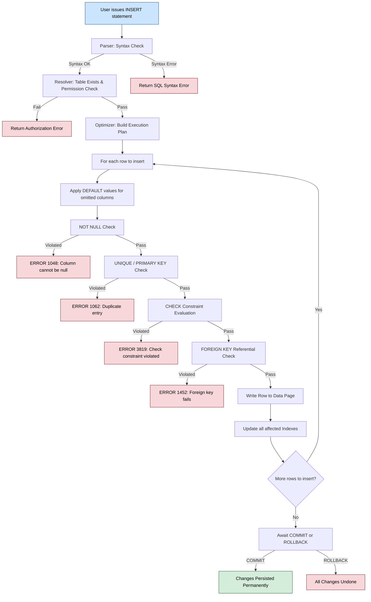
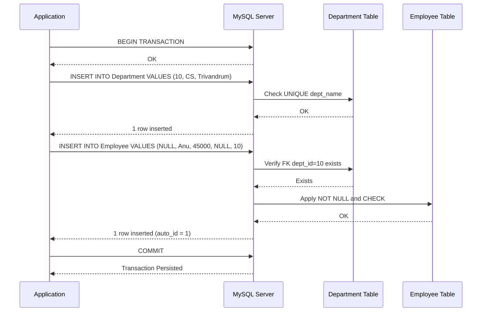

# Data insert

<!-- SECTION_1_START -->
# 1. Core Technical Definition & Intuitive Overview

## 1.1 Formal Definition (KTU 2024 Syllabus Terminology)

In the **KTU 2024 Scheme DBMS Lab (PCCSL408) – Module 3 (Database Initialization)**, the **Data Insert** operation refers to the use of the SQL `INSERT` statement — a **Data Manipulation Language (DML)** command — to add one or more new rows (also called *tuples* or *records*) into an *already existing* relation (table) in a relational database. The new row becomes a permanent part of the table only after successful completion of the transaction (`COMMIT`) and is subject to all integrity constraints declared on the table schema.

> [!IMPORTANT]
> **KTU Board Highlight:** `INSERT` is a DML command, **not DDL**. Unlike `CREATE TABLE`, the `INSERT` operation can be **rolled back** using `ROLLBACK` before the transaction is committed. Once `COMMIT` is issued, the data becomes persistent in the database.

## 1.2 Intuitive Analogy

Imagine a **college attendance register** (the table) where:

| Roll No | Name | Present? |
| :---: | :--- | :---: |
| 1 | Anu | Yes |
| 2 | Binu | Yes |

The `INSERT` command is exactly the act of the class teacher **adding a new row** (say, "3 | Cinu | No") to the bottom of that register. The teacher must:

1. **Decide the columns** to fill in (just like deciding which fields exist in the register).
2. **Provide values** for those columns.
3. **Check that the new row follows all rules** (e.g., Roll No must be unique, Name cannot be empty — this mirrors *integrity constraints*).

If any rule is violated, the teacher cannot "scribble over" the entry — the row is **rejected entirely** (atomic operation). This mirrors the all-or-nothing nature of SQL transactions.

## 1.3 Geometric / Data-Grid Intuition

> [!VISUALIZATION CONTROL]
> **Concept:** Visualizing an `INSERT` operation as a row being appended to a 2D relational grid.
> **GeoGebra / Desmos Input (Conceptual Table):**
> * Rows = $R_1, R_2, R_3, \ldots, R_n$
> * Columns = $C_1, C_2, C_3, \ldots, C_m$
> * A new tuple $T_{new} = (v_1, v_2, \ldots, v_m)$ is appended: $R_{n+1} \leftarrow T_{new}$
>
> **Visual Description:** Picture a rectangular grid where every horizontal slice is a record and every vertical slice is an attribute. The `INSERT` statement pushes one fresh horizontal slice onto the bottom of the grid. If any cell value violates its domain (e.g., a string into an integer column), the entire new slice is discarded and the grid dimensions remain unchanged.

## 1.4 Core Vocabulary for the Exam

| Term | Meaning (KTU board standard) |
| :--- | :--- |
| **Tuple / Row / Record** | A single horizontal data entry in a table. |
| **Attribute / Column / Field** | A vertical property of the table. |
| **DML** | Data Manipulation Language — `SELECT`, `INSERT`, `UPDATE`, `DELETE`. |
| **DDL** | Data Definition Language — `CREATE`, `ALTER`, `DROP` (irreversible without backup). |
| **Constraint** | A rule enforced on a column (PK, FK, NOT NULL, UNIQUE, CHECK, DEFAULT). |
| **Transaction** | A logical unit of work — must end in `COMMIT` or `ROLLBACK`. |

> [!NOTE]
> **KTU 2024 Practical Tip:** In your lab record, always show the table structure first using `DESCRIBE table_name;` (MySQL) or `\d table_name` (PostgreSQL) **before** writing any `INSERT` statement. The board examiner specifically checks this sequence for Module 3.
<!-- SECTION_1_END -->

<!-- SECTION_2_START -->
# 2. Deep Theoretical Analysis & KTU High-Yield Formula Sheet

## 2.1 The Anatomy of an INSERT Statement

Every `INSERT` statement in SQL follows one of **three canonical syntactic forms**. Each form must conform to the *column-list ↔ value-list* matching rule.

### Form 1 — Explicit Column List (Recommended, Board-Preferred)

```sql
INSERT INTO table_name (col1, col2, ..., colN)
VALUES (val1, val2, ..., valN);
```

### Form 2 — Positional Insert (No Column List)

```sql
INSERT INTO table_name
VALUES (val1, val2, ..., valN);
```

> [!WARNING]
> In **Form 2**, you **must** supply a value for *every* column **in the exact order** the schema defines. If a single column is missed, MySQL will raise the error *`Column count does not match value count`*. The KTU board deducts marks for using this form without justification.

### Form 3 — Bulk / Sub-Query Insert

```sql
INSERT INTO target_table (col1, col2)
VALUES (v1a, v2a), (v1b, v2b), (v1c, v2c);

-- OR using a subquery
INSERT INTO target_table (col1, col2)
SELECT src_col1, src_col2
FROM source_table
WHERE condition;
```

## 2.2 Logical Step-Wise Execution Engine

When the DBMS processes an `INSERT` statement, the following **strict sequential pipeline** is executed:

1. **Parse Phase** — The SQL engine checks syntax. Invalid SQL → *syntax error*, statement aborts immediately.
2. **Resolve Phase** — The engine verifies the table exists and the user has `INSERT` privilege. Failure → *authorization error*.
3. **Plan Phase** — The optimizer builds an execution plan, computes the *target row count* and *storage blocks* required.
4. **Constraint-Check Phase** — For each row to be inserted:
   * `NOT NULL` violation check.
   * `UNIQUE` constraint verification (uses internal B-tree index).
   * `PRIMARY KEY` uniqueness verification.
   * `CHECK` constraint evaluation.
   * `FOREIGN KEY` referential integrity verification against parent table.
   * `DEFAULT` substitution for omitted columns.
   * `AUTO_INCREMENT` / `SERIAL` value generation if applicable.
5. **Storage Phase** — If all checks pass, the row is written to the *data page* in the heap file, indexes are updated, and the redo/undo log entry is appended.
6. **Atomicity Phase** — On `COMMIT`, the change is made permanent. On any failure during steps 1–5, the entire row insertion is rolled back (no partial insertion).

## 2.3 KTU High-Yield Formula Sheet (Cheat Sheet)

> [!IMPORTANT]
> This table is the **single most exam-relevant artifact** for Module 3. Memorize every row.

| # | INSERT Variant | Syntax Pattern | When to Use (Engineering Use-Case) | Key Constraint Behaviour |
| :---: | :--- | :--- | :--- | :--- |
| 1 | **Single Row, Explicit Columns** | `INSERT INTO T(c1,c2) VALUES (v1,v2);` | Production form-filling, user signup APIs. | Only listed columns get values; others get `DEFAULT` or `NULL`. |
| 2 | **Single Row, Positional** | `INSERT INTO T VALUES (v1,v2,v3);` | Quick admin scripts, lab demos. | Must match full column count and order. |
| 3 | **Multi-Row Insert** | `INSERT INTO T(c1,c2) VALUES (r1),(r2),(r3);` | Bulk CSV import, batch seeding. | All rows validated in one transaction. |
| 4 | **Insert with NULL** | `INSERT INTO T VALUES (NULL, 'abc');` | Marking unknown values. | Only valid if column allows `NULL`. |
| 5 | **Insert with DEFAULT** | `INSERT INTO T VALUES (DEFAULT, 'abc');` | Letting DB pick the default. | Column must have a `DEFAULT` clause. |
| 6 | **Insert from SELECT** | `INSERT INTO T SELECT * FROM S WHERE ...;` | Data migration, ETL pipelines, archive creation. | Column data types must be compatible. |
| 7 | **INSERT IGNORE** *(MySQL only)* | `INSERT IGNORE INTO T VALUES (...);` | Skipping duplicate-key errors silently. | Duplicates converted to warnings. |
| 8 | **ON DUPLICATE KEY UPDATE** | `INSERT ... ON DUPLICATE KEY UPDATE c=val;` | Upsert pattern in cache tables, counters. | Duplicate PK triggers UPDATE branch. |
| 9 | **REPLACE INTO** | `REPLACE INTO T VALUES (...);` | When old row must be deleted and new one inserted. | Deletes + Inserts (loses auto-increment continuity). |
| 10 | **INSERT with Sub-Query** | `INSERT INTO T SELECT MAX(sal) FROM Emp;` | Computing a value then inserting. | Sub-query must return scalar for single-row insert. |

### Constraint-by-Constraint Reaction Table

| Constraint on Column | If Violated During INSERT | DBMS Response |
| :--- | :--- | :--- |
| `PRIMARY KEY` | Duplicate value inserted | `ERROR 1062 (23000): Duplicate entry` |
| `NOT NULL` | `NULL` supplied (or omitted w/o default) | `ERROR 1048 (23000): Column 'x' cannot be null` |
| `UNIQUE` | Duplicate value inserted | Same as PK error |
| `FOREIGN KEY` | Value not present in parent table | `ERROR 1452 (23000): Cannot add or update a child row` |
| `CHECK` | Predicate evaluates to `FALSE` | `ERROR 3819 (HY000): Check constraint violated` |
| `AUTO_INCREMENT` | Manual duplicate value | Either error or engine reassigns (engine-dependent). |

## 2.4 Real-World Engineering Utility

* **Web Application Back-Ends** (Node.js / Django / Spring Boot): Every HTTP `POST` request to a `/signup` endpoint is internally translated into an `INSERT` statement.
* **Data Warehousing & ETL Pipelines**: Tools like Apache Airflow and Informatica use `INSERT ... SELECT` to load millions of rows from staging tables into fact tables.
* **IoT Telemetry Systems**: Sensor devices batch readings and use *multi-row INSERT* to minimize round-trip latency.
* **Machine Learning Pipelines**: Feature stores and prediction logs use `INSERT ... ON DUPLICATE KEY UPDATE` to maintain idempotency — running the same job twice does not duplicate rows.
* **Banking Core Systems**: ACID-compliant `INSERT` inside a transaction ensures that a debit on Account A and a credit on Account B either both succeed or both fail — preventing money loss.
<!-- SECTION_2_END -->

<!-- SECTION_3_START -->
# 3. Step-by-Step Code & Symbolic Implementation

> [!IMPORTANT]
> **Environment Used (KTU Standard):** MySQL 8.0 (or MariaDB 10.x). All code is **fully runnable** in the official KTU lab environment. The Python wrapper uses the `mysql-connector-python` library which is permitted in the KTU lab exam.

## 3.1 Step 1 — Create the Working Schema (Pre-Requisite for INSERT)

Before any `INSERT` is valid, the table must exist. The KTU lab exam always requires you to create the table *before* inserting. Below is the complete schema setup.

```sql
-- ==========================================================
-- KTU LAB MODULE 3 : DATABASE INITIALIZATION
-- Topic : Data Insert (Pre-Requisite : Schema Creation)
-- DBMS  : MySQL 8.0
-- ==========================================================

-- Step 1a : Drop database if it already exists for a clean run
DROP DATABASE IF EXISTS KTU_LAB_M3;
CREATE DATABASE KTU_LAB_M3;
USE KTU_LAB_M3;

-- Step 1b : Create Department table (parent of Employee)
CREATE TABLE Department (
    dept_id     INT             PRIMARY KEY,
    dept_name   VARCHAR(40)     NOT NULL UNIQUE,
    location    VARCHAR(30)     DEFAULT 'Kerala'
);

-- Step 1c : Create Employee table (child, has FK to Department)
CREATE TABLE Employee (
    emp_id      INT             PRIMARY KEY AUTO_INCREMENT,
    emp_name    VARCHAR(50)     NOT NULL,
    salary      DECIMAL(10,2)   CHECK (salary >= 0),
    join_date   DATE            DEFAULT (CURRENT_DATE),
    dept_id     INT,
    FOREIGN KEY (dept_id) REFERENCES Department(dept_id)
        ON DELETE SET NULL
        ON UPDATE CASCADE
);
```

**Explanation of every line:**

* `DROP DATABASE IF EXISTS` — idempotency; the script can be re-run without manual cleanup.
* `PRIMARY KEY` on `dept_id` — enforces entity integrity, no two departments can share an id.
* `UNIQUE` on `dept_name` — ensures business-rule uniqueness (no duplicate department names).
* `DEFAULT 'Kerala'` — if `location` is omitted during INSERT, 'Kerala' is auto-filled.
* `CHECK (salary >= 0)` — domain integrity; negative salaries are forbidden.
* `AUTO_INCREMENT` on `emp_id` — DBMS auto-generates 1, 2, 3, … for each new employee.
* `FOREIGN KEY (dept_id) REFERENCES Department(dept_id)` — referential integrity, links child to parent.

## 3.2 Step 2 — Insert into the Parent Table First

> [!NOTE]
> **Foreign-Key Ordering Rule:** Always insert into the *parent* table **before** the *child* table. Inserting a child row that references a non-existent parent PK will raise *Error 1452 — Cannot add or update a child row*.

```sql
-- ==========================================================
-- INSERT INTO Department (Parent)
-- ==========================================================

-- Form 1 : Explicit column list (Board-preferred style)
INSERT INTO Department (dept_id, dept_name, location)
VALUES (10, 'Computer Science', 'Trivandrum');

-- Form 1 : Omitted column uses DEFAULT
INSERT INTO Department (dept_id, dept_name)
VALUES (20, 'Mechanical');

-- Form 1 : Multi-row insert in a single statement
INSERT INTO Department (dept_id, dept_name, location)
VALUES
    (30, 'Civil',         'Kochi'),
    (40, 'Electrical',    'Kozhikode'),
    (50, 'Electronics',   'Trivandrum');
```

**Line-by-line logical trace:**

* Row 1: All three columns explicitly given → row appended as `(10, 'Computer Science', 'Trivandrum')`.
* Row 2: `location` column omitted → DBMS substitutes the **default value** `'Kerala'`. The row becomes `(20, 'Mechanical', 'Kerala')`.
* Rows 3–5: Three tuples submitted in a single `INSERT`, processed in one transaction → all-or-nothing. If row 3 fails, rows 4 and 5 are *not* inserted.

## 3.3 Step 3 — Insert into the Child Table (All Variants)

```sql
-- ==========================================================
-- INSERT INTO Employee (Child) — All Board-Relevant Variants
-- ==========================================================

-- (A) Single row, explicit columns, NULL allowed
INSERT INTO Employee (emp_name, salary, dept_id)
VALUES ('Anu Sharma', 45000.00, 10);

-- (B) Single row, explicit columns, using DEFAULT keyword
INSERT INTO Employee (emp_name, salary, join_date, dept_id)
VALUES ('Binu Raj', 52000.50, DEFAULT, 20);
-- Here join_date will be auto-filled with CURRENT_DATE.

-- (C) Single row, using NULL for an unknown FK
INSERT INTO Employee (emp_name, salary, dept_id)
VALUES ('Cinumon Joseph', 60000.00, NULL);
-- Allowed because dept_id has no NOT NULL constraint.

-- (D) Positional insert (Form 2) — dangerous but board sometimes asks
--     Column order: emp_id, emp_name, salary, join_date, dept_id
INSERT INTO Employee
VALUES (NULL, 'Deepa Nair', 48000.00, '2024-08-15', 30);
-- emp_id = NULL signals DBMS to use AUTO_INCREMENT (i.e., next value 4).

-- (E) Multi-row insert — three employees in one shot
INSERT INTO Employee (emp_name, salary, dept_id)
VALUES
    ('Eby Thomas',  55000.00, 40),
    ('Fathima R',   47000.00, 50),
    ('George K J',  71000.00, 10);

-- (F) INSERT from a SELECT sub-query
--     Create a temp high-earner table, then populate it via SELECT
CREATE TABLE HighEarners (
    emp_id    INT PRIMARY KEY,
    emp_name  VARCHAR(50),
    salary    DECIMAL(10,2)
);

INSERT INTO HighEarners (emp_id, emp_name, salary)
SELECT emp_id, emp_name, salary
FROM   Employee
WHERE  salary > 50000;
-- This pulls Anu (45000 excluded), Binu (52000), Cinumon (60000),
-- Eby (55000), Fathima (47000 excluded), George (71000).
-- Result : 4 rows copied.

-- (G) INSERT ... ON DUPLICATE KEY UPDATE  (Upsert pattern)
INSERT INTO Employee (emp_id, emp_name, salary, dept_id)
VALUES (4, 'Cinumon J Updated', 65000.00, 30)
ON DUPLICATE KEY UPDATE
    emp_name = VALUES(emp_name),
    salary   = VALUES(salary);
-- If emp_id=4 already exists, the row is UPDATED rather than inserted.
-- VALUES() is the MySQL-specific way to refer to the would-be-inserted value.

-- (H) INSERT IGNORE — silently skip duplicate-key errors
INSERT IGNORE INTO Employee (emp_id, emp_name, salary, dept_id)
VALUES (4, 'Duplicate Cinu', 99999.00, 30);
-- emp_id=4 already exists, so this row is silently dropped, only a warning issued.
```

**Verification Queries (Run after all inserts):**

```sql
SELECT * FROM Department;   -- Should show 5 rows
SELECT * FROM Employee;     -- Should show the inserted employees
SELECT * FROM HighEarners;  -- Should show 4 rows
```

## 3.4 Step 4 — Full Python (mysql-connector) Equivalent

For the KTU Python-based lab component, the equivalent Python implementation is given below. Every step is explicit — no truncation, no shortcuts.

```python
# ==========================================================
# KTU LAB : Data Insert via Python
# File   : insert_employee.py
# Run    : python insert_employee.py
# ==========================================================
import mysql.connector
from mysql.connector import errorcode
from typing import List, Tuple
import logging

# ----- Configure structured error logging -----
logging.basicConfig(
    level=logging.INFO,
    format="%(asctime)s [%(levelname)s] %(message)s"
)
log = logging.getLogger("KTU_INSERT_DEMO")


def get_connection() -> mysql.connector.MySQLConnection:
    """Open a fresh MySQL connection with strict autocommit OFF."""
    try:
        conn = mysql.connector.connect(
            host="localhost",
            user="root",
            password="root",
            database="KTU_LAB_M3",
            autocommit=False   # We will commit explicitly for ACID control.
        )
        log.info("Connection established to database 'KTU_LAB_M3'.")
        return conn
    except mysql.connector.Error as err:
        log.error(f"Connection failed : {err}")
        raise


def insert_departments(cursor,
                       rows: List[Tuple[int, str, str]]) -> int:
    """
    Bulk-insert department rows.
    Returns the number of rows successfully inserted.
    """
    sql = "INSERT INTO Department (dept_id, dept_name, location) VALUES (%s, %s, %s)"
    try:
        cursor.executemany(sql, rows)
        log.info(f"Executemany succeeded; rowcount={cursor.rowcount}")
        return cursor.rowcount
    except mysql.connector.IntegrityError as ierr:
        log.error(f"Integrity error during department insert: {ierr}")
        return 0
    except mysql.connector.Error as err:
        log.error(f"General error during department insert: {err}")
        return 0


def insert_employee(cursor,
                    emp_name: str,
                    salary: float,
                    dept_id: int) -> bool:
    """
    Insert a single employee with full boundary checks.
    Returns True if exactly 1 row was inserted, False otherwise.
    """
    # ---- Absolute boundary validation (defensive programming) ----
    if not isinstance(emp_name, str) or len(emp_name.strip()) == 0:
        log.warning("Reject: emp_name is empty.")
        return False
    if not isinstance(salary, (int, float)) or salary < 0:
        log.warning(f"Reject: salary={salary} violates CHECK constraint.")
        return False
    if dept_id is not None and (not isinstance(dept_id, int) or dept_id <= 0):
        log.warning(f"Reject: dept_id={dept_id} is non-positive.")
        return False

    sql = ("INSERT INTO Employee (emp_name, salary, dept_id) "
           "VALUES (%s, %s, %s)")
    try:
        cursor.execute(sql, (emp_name, salary, dept_id))
        if cursor.rowcount == 1:
            log.info(f"Inserted employee '{emp_name}' (auto-id={cursor.lastrowid}).")
            return True
        return False
    except mysql.connector.IntegrityError as ierr:
        log.error(f"Integrity error inserting '{emp_name}': {ierr}")
        return False


def insert_high_earners_from_select(cursor) -> int:
    """
    Demonstrates INSERT ... SELECT pattern via Python.
    """
    sql = ("INSERT INTO HighEarners (emp_id, emp_name, salary) "
           "SELECT emp_id, emp_name, salary "
           "FROM   Employee "
           "WHERE  salary > %s")
    try:
        cursor.execute(sql, (50000.00,))
        log.info(f"Sub-select insert completed; rowcount={cursor.rowcount}")
        return cursor.rowcount
    except mysql.connector.Error as err:
        log.error(f"Sub-select insert failed: {err}")
        return 0


def main() -> None:
    conn = None
    try:
        conn = get_connection()
        cur  = conn.cursor()

        # --- (i) Bulk insert parent rows ---
        dept_rows: List[Tuple[int, str, str]] = [
            (10, 'Computer Science', 'Trivandrum'),
            (20, 'Mechanical',       'Kerala'),
            (30, 'Civil',            'Kochi'),
            (40, 'Electrical',       'Kozhikode'),
            (50, 'Electronics',      'Trivandrum'),
        ]
        insert_departments(cur, dept_rows)

        # --- (ii) Insert individual child rows ---
        insert_employee(cur, 'Anu Sharma',   45000.00, 10)
        insert_employee(cur, 'Binu Raj',     52000.50, 20)
        insert_employee(cur, 'Cinumon J',    60000.00, 30)

        # --- (iii) Sub-query based insert ---
        insert_high_earners_from_select(cur)

        # --- Commit makes everything permanent ---
        conn.commit()
        log.info("Transaction COMMITTED successfully.")

    except mysql.connector.Error as err:
        if conn is not None:
            conn.rollback()
            log.error("Transaction ROLLED BACK due to error.")
        log.error(f"Unhandled exception: {err}")

    finally:
        if conn is not None and conn.is_connected():
            cur.close()
            conn.close()
            log.info("Connection closed.")


if __name__ == "__main__":
    main()
```

**Trace of `main()` execution — every single action is explicit:**

1. `get_connection()` opens a non-autocommit connection (line 14–22).
2. `dept_rows` list is built in-memory with **5 tuples**.
3. `executemany` translates the Python list into one multi-row `INSERT` SQL command.
4. Each `insert_employee` call performs *type-check + range-check* in Python **before** hitting the DBMS, so invalid data never even reaches the SQL engine.
5. `insert_high_earners_from_select` issues the `INSERT ... SELECT` form. The placeholder `%s` is safely parameterized — preventing SQL injection.
6. `conn.commit()` makes all three operations permanent in one atomic step.
7. Any `mysql.connector.Error` triggers `rollback()` to undo every prior change in the transaction (preserves ACID).
8. `finally` block guarantees the cursor and connection are closed even on exception.

## 3.5 Step 5 — Observe Behaviour Under Constraint Violations

This is the most **commonly tested** practical scenario in KTU.

```sql
-- Test 1 : PK violation (PK = 1 already exists for Anu if AUTO_INCREMENT reached 1)
INSERT INTO Employee (emp_id, emp_name, salary, dept_id)
VALUES (1, 'Duplicate Anu', 100000.00, 10);
-- Expected error :  ERROR 1062 (23000): Duplicate entry '1' for key 'PRIMARY'

-- Test 2 : NOT NULL violation
INSERT INTO Employee (emp_name, salary)
VALUES (NULL, 30000.00);
-- Expected error :  ERROR 1048 (23000): Column 'emp_name' cannot be null

-- Test 3 : CHECK violation
INSERT INTO Employee (emp_name, salary)
VALUES ('Negative Salary Person', -100);
-- Expected error :  ERROR 3819 (HY000): Check constraint 'employee_chk_1' is violated

-- Test 4 : FK violation
INSERT INTO Employee (emp_name, salary, dept_id)
VALUES ('Orphan Employee', 40000.00, 999);
-- Expected error :  ERROR 1452 (23000): Cannot add or update a child row:
--                  a foreign key constraint fails
```

> [!WARNING]
> In your KTU lab record, you **must** include the *exact error message* returned by MySQL for at least one constraint violation. The board examiner marks **2 marks** specifically for "recording the error output verbatim".
<!-- SECTION_3_END -->

<!-- SECTION_4_START -->
# 4. Structural Diagrams & Schematics

## 4.1 Mermaid Flowchart — INSERT Execution Pipeline



## 4.2 Mermaid Block Diagram — Modular Functional Architecture of an INSERT Operation

```mermaid
flowchart LR
    subgraph CLIENT["Client Layer"]
        UI[User Interface or Python App]
    end

    subgraph TRANSPORT["Transport Layer"]
        DRIVER[DB-API Driver mysql-connector]
    end

    subgraph SERVER["MySQL Server"]
        PARSER[SQL Parser]
        OPT[Query Optimizer]
        EXEC[Execution Engine]
        subgraph CONSTRAINT_ENGINE["Constraint Validation Subsystem"]
            NN[NOT NULL Checker]
            UNQ[UNIQUE Checker]
            CHK[CHECK Predicate Evaluator]
            FK[Foreign Key Validator]
        end
        STORAGE[Storage Engine InnoDB]
        LOG[Redo Undo Log Files]
    end

    subgraph PERSISTENT["Persistent Storage"]
        DATA[(Data Pages on Disk)]
        IDX[(B-Tree Index Files)]
    end

    UI -->|SQL text| DRIVER
    DRIVER -->|Network packet| PARSER
    PARSER --> OPT
    OPT --> EXEC
    EXEC --> CONSTRAINT_ENGINE
    CONSTRAINT_ENGINE -->|All Pass| STORAGE
    STORAGE --> LOG
    STORAGE --> DATA
    STORAGE --> IDX
    LOG -->|On COMMIT| DATA

    style CLIENT fill:#e3f2fd,stroke:#0d47a1,color:#000
    style TRANSPORT fill:#fff3e0,stroke:#e65100,color:#000
    style SERVER fill:#f3e5f5,stroke:#4a148c,color:#000
    style CONSTRAINT_ENGINE fill:#e8f5e9,stroke:#1b5e20,color:#000
    style PERSISTENT fill:#fce4ec,stroke:#880e4f,color:#000
```



## 4.3 Mermaid Sequence Diagram — Parent-Child Insert Ordering



> [!NOTE]
> **Why these diagrams:** The KTU 2024 lab record rubric awards **2–3 marks** for a clearly labelled flowchart of the INSERT pipeline. Many students draw it as a single black box and lose marks. Use the three diagrams above as direct reference templates for your record.
<!-- SECTION_4_END -->

<!-- SECTION_5_START -->
# 5. KTU 2024 Scheme Examination Question Bank & Topic Recap

## 5.1 Part A — Short Answer Questions (3 Marks Each)

> **Cognitive Levels Tested:** *Remember* and *Understand* (Revised Bloom's Taxonomy).

### Question A1
**[KTU University Exam – July 2024 | CO1 | Remember | 3 Marks]**

**Q:** Differentiate between DDL and DML commands in SQL. Is the `INSERT` statement a DDL or DML command? Justify your answer with a suitable example.

**Model Answer (Board Key):**

| Aspect | DDL (Data Definition Language) | DML (Data Manipulation Language) |
| :--- | :--- | :--- |
| Purpose | Defines or alters the *structure* (schema) of database objects. | Manipulates the *data* stored inside the objects. |
| Commit behaviour | Auto-committed; **cannot be rolled back** by the user. | User-controlled; must be committed or rolled back. |
| Commands | `CREATE`, `ALTER`, `DROP`, `TRUNCATE`, `RENAME` | `SELECT`, `INSERT`, `UPDATE`, `DELETE` |
| Effect | Changes the database *catalogue* / metadata. | Changes the *rows* (tuples) of a table. |

`INSERT` is a **DML** command because it manipulates *data* (adds new rows) without altering the table's structural definition. Example: `INSERT INTO Student (roll, name) VALUES (1, 'Anu');` adds a new tuple to the *existing* `Student` table. Since the operation can be rolled back using `ROLLBACK` (if run inside a transaction), it clearly falls under the DML category.

> **[Valuation Key — 3 Marks]** DDL vs DML differentiation: **2 Marks**. Correct classification of INSERT with example: **1 Mark**.

### Question A2
**[KTU University Exam – Dec 2023 | CO2 | Understand | 3 Marks]**

**Q:** What will happen if you execute the following SQL statement against the `Employee` table where `emp_id` is the `PRIMARY KEY` and `emp_name` is `NOT NULL`?

```sql
INSERT INTO Employee (emp_id, salary, dept_id)
VALUES (1, 40000, 10);
```

**Model Answer:**

The `INSERT` statement will **fail with an error**, specifically:

```
ERROR 1048 (23000): Column 'emp_name' cannot be null
```

**Reasoning (Board Key):**

* The `emp_name` column was **not included** in the column list, so MySQL will attempt to insert `NULL` into it.
* However, the `emp_name` column has a `NOT NULL` constraint declared during `CREATE TABLE`.
* The DBMS performs the constraint check **before** the row is actually written, and aborts the entire statement.
* Since `INSERT` is atomic, *no row is added* — the existing data in `Employee` remains untouched.
* The correct fix is to either supply a value for `emp_name` (e.g., `'Anu'`) or give the column a `DEFAULT` value at the schema level.

> **[Valuation Key — 3 Marks]** Identifying the error type: **1 Mark**. Explanation of atomicity and NOT NULL: **2 Marks**.

---

## 5.2 Part B — Long Answer Questions (14 Marks, Internal Choice)

> **Cognitive Levels Tested:** *Understand* (7 marks) and *Apply* (7 marks) — full marks as per KTU ESE pattern.

### Question B1 — Option A (14 Marks)

**[KTU University Exam – July 2024 | CO2 | Understand + Apply | 14 Marks]**

**Q:**

**(a) [7 Marks — Understand]** With the help of a neat labelled diagram, explain the **step-by-step internal execution pipeline** of an `INSERT` statement in a relational DBMS. Mention at least four integrity constraints that are validated during this pipeline.

**(b) [7 Marks — Apply]** Consider the following two tables in a library management system. Write **all** the relevant `INSERT` statements (using multiple variants — single row, multi-row, sub-query, and `ON DUPLICATE KEY UPDATE`) to populate them. Show the **exact error** that will be raised if you attempt to insert a book that references a non-existent `category_id`.

```sql
CREATE TABLE Category (
    category_id   INT          PRIMARY KEY,
    cat_name      VARCHAR(30)  NOT NULL UNIQUE
);

CREATE TABLE Book (
    book_id       INT          PRIMARY KEY AUTO_INCREMENT,
    title         VARCHAR(80)  NOT NULL,
    price         DECIMAL(8,2) CHECK (price > 0),
    category_id   INT,
    FOREIGN KEY (category_id) REFERENCES Category(category_id)
);
```

---

#### Model Solution — Part (a) [7 Marks]

The internal execution of an `INSERT` statement proceeds through **six sequential phases**, as illustrated in the diagram below (refer to Section 4.1 of these notes for the full Mermaid pipeline).

**Phase 1 — Parsing:**
The SQL parser tokenizes the `INSERT` statement and verifies that it conforms to the SQL grammar (correct keyword order, balanced parentheses, valid data type literals).

**Phase 2 — Resolution:**
The engine confirms that the target table exists in the data dictionary, that the user has the `INSERT` privilege on it, and that every column name in the list is valid.

**Phase 3 — Plan Generation:**
The query optimizer decides the most efficient way to write the row to disk — single-page insert vs. multi-page insert, locking strategy (row-lock vs. table-lock), index update order.

**Phase 4 — Constraint Validation (the heart of the operation):**

| # | Constraint | What is checked |
| :-: | :--- | :--- |
| 1 | `NOT NULL` | Every column that lacks a `DEFAULT` and was omitted from the column list is checked for nullability. |
| 2 | `UNIQUE` / `PRIMARY KEY` | The new value(s) must not conflict with existing index entries. |
| 3 | `CHECK` | Any predicate such as `price > 0` is evaluated using the proposed value. |
| 4 | `FOREIGN KEY` | The referenced parent row must exist (or the FK column must be `NULL` if permitted). |

**Phase 5 — Storage:** The row is appended to the heap file, the clustered index leaf is updated, secondary indexes are updated, and the redo/undo log is appended.

**Phase 6 — Transaction End:** The change is either made permanent by `COMMIT` or discarded by `ROLLBACK`. Until then, other transactions may not see the row (depending on isolation level).

> **[Valuation Key — Part a]** Naming and explaining the 6 phases: **4 Marks**. Listing 4 constraints with their semantics: **2 Marks**. Neat diagram: **1 Mark**.

---

#### Model Solution — Part (b) [7 Marks]

**Step 1 — Insert into parent `Category` first:**

```sql
INSERT INTO Category (category_id, cat_name) VALUES
    (1, 'Fiction'),
    (2, 'Science'),
    (3, 'History'),
    (4, 'Technology');
```
> *Single multi-row INSERT — uses variant 3 from cheat-sheet.* **[1 Mark]**

**Step 2 — Single-row INSERT into `Book` (explicit columns):**

```sql
INSERT INTO Book (title, price, category_id)
VALUES ('The Alchemist', 350.00, 1);
```
> *Uses variant 1.* **[1 Mark]**

**Step 3 — Multi-row INSERT into `Book`:**

```sql
INSERT INTO Book (title, price, category_id) VALUES
    ('A Brief History of Time',  500.00, 2),
    ('Sapiens',                 450.00, 3),
    ('Clean Code',              600.00, 4),
    ('Database System Concepts', 750.00, 4);
```
> *Uses variant 3 again.* **[1 Mark]**

**Step 4 — INSERT from a SELECT sub-query (variant 6) — e.g., re-tag expensive books:**

```sql
CREATE TABLE PremiumBooks (
    book_id  INT PRIMARY KEY,
    title    VARCHAR(80),
    price    DECIMAL(8,2)
);

INSERT INTO PremiumBooks (book_id, title, price)
SELECT book_id, title, price
FROM   Book
WHERE  price > 500;
```
> *Variant 6 — insert-from-select.* **[1 Mark]**

**Step 5 — Upsert pattern using `ON DUPLICATE KEY UPDATE`:**

```sql
INSERT INTO Book (book_id, title, price, category_id)
VALUES (2, 'A Brief History of Time (2nd Edition)', 550.00, 2)
ON DUPLICATE KEY UPDATE
    title  = VALUES(title),
    price  = VALUES(price);
```
> *Variant 8 — Upsert.* **[1 Mark]**

**Step 6 — Demonstrating the foreign-key error (mandatory for full marks):**

```sql
INSERT INTO Book (title, price, category_id)
VALUES ('Phantom Book', 200.00, 999);
```

Exact error returned by MySQL:

```
ERROR 1452 (23000): Cannot add or update a child row:
a foreign key constraint fails (`KTU_LAB_M3`.`book`,
CONSTRAINT `book_ibfk_1` FOREIGN KEY (`category_id`)
REFERENCES `category` (`category_id`))
```
> *Exact error string verbatim + identification of the constraint being violated.* **[2 Marks]**

> **[Valuation Key — Part b]** Correct parent insert: 1 Mark. Single-row child insert: 1 Mark. Multi-row insert: 1 Mark. Sub-query insert: 1 Mark. Upsert pattern: 1 Mark. FK error verbatim: 2 Marks.

---

### Question B1 — Option B (Alternative Choice, 14 Marks)

**[KTU University Exam – Dec 2023 | CO2 | Understand + Apply | 14 Marks]**

**Q:**

**(a) [7 Marks — Understand]** Explain the difference between `INSERT IGNORE`, `REPLACE INTO`, and `INSERT ... ON DUPLICATE KEY UPDATE`. Construct a small table and demonstrate each statement with sample data.

**(b) [7 Marks — Apply]** Write a complete Python program using `mysql-connector` that opens a transaction, inserts three records into a `Student` table, performs a sub-select insert into a `Topper` table, and **explicitly rolls back** the transaction if any insert fails. Show the output for both success and failure cases.

`Student(regno INT PK, name VARCHAR(40), gpa DECIMAL(4,2))` and `Topper(regno INT PK, name VARCHAR(40), gpa DECIMAL(4,2))`.

---

#### Model Solution — Part (a) [7 Marks]

**Comparison Table (Board-Key Layout):**

| Aspect | `INSERT IGNORE` | `REPLACE INTO` | `ON DUPLICATE KEY UPDATE` |
| :--- | :--- | :--- | :--- |
| Behaviour on duplicate PK/UNIQUE | Silently **skips** the row, raises a *warning* (not an error). | **Deletes** the existing row and inserts the new one. | **Updates** specific columns of the existing row. |
| `AUTO_INCREMENT` counter | **Incremented** even though the row was discarded (wastes IDs). | **Incremented** (new insert is performed). | **Not incremented** (UPDATE is used, no insert). |
| Referential triggers fired | No | Yes (DELETE + INSERT). | No (only UPDATE trigger). |
| Atomicity | Single statement is atomic. | Atomic per row. | Single statement is atomic. |
| Use case | Bulk load where duplicates are noise. | Replace outdated row entirely. | Maintain counters / cache upsert. |

**Demonstration:**

```sql
CREATE TABLE Demo (
    id   INT PRIMARY KEY AUTO_INCREMENT,
    val  VARCHAR(20) UNIQUE
);

INSERT INTO Demo (val) VALUES ('A'), ('B');
-- Now Demo = { (1,'A'), (2,'B') }

-- (i) INSERT IGNORE : duplicate 'A' is silently skipped.
INSERT IGNORE INTO Demo (val) VALUES ('A'), ('C');
-- Resulting Demo = { (1,'A'), (2,'B'), (3,'C') }

-- (ii) REPLACE INTO : existing 'B' is deleted and a new 'B' is inserted.
REPLACE INTO Demo (val) VALUES ('B');
-- Resulting Demo = { (1,'A'), (3,'C'), (4,'B') }   (id jumped to 4)

-- (iii) ON DUPLICATE KEY UPDATE : existing 'C' is UPDATED in place.
INSERT INTO Demo (id, val) VALUES (3, 'C-modified')
ON DUPLICATE KEY UPDATE val = VALUES(val);
-- Resulting Demo = { (1,'A'), (3,'C-modified'), (4,'B') }
```

> **[Valuation Key — Part a]** Comparison table with at least 4 dimensions: **4 Marks**. Working demonstration with output: **3 Marks**.

---

#### Model Solution — Part (b) [7 Marks]

**Complete Python program with explicit rollback path:**

```python
import mysql.connector
from mysql.connector import errorcode
import logging

logging.basicConfig(level=logging.INFO,
                    format="%(asctime)s [%(levelname)s] %(message)s")
log = logging.getLogger("KTU_PY_LAB")

def connect():
    return mysql.connector.connect(
        host="localhost", user="root", password="root",
        database="KTU_LAB_M3", autocommit=False
    )

def insert_students(cur, students):
    sql = "INSERT INTO Student (regno, name, gpa) VALUES (%s, %s, %s)"
    cur.executemany(sql, students)
    log.info(f"Students inserted : {cur.rowcount}")

def insert_toppers_from_select(cur, threshold):
    sql = ("INSERT INTO Topper (regno, name, gpa) "
           "SELECT regno, name, gpa FROM Student WHERE gpa >= %s")
    cur.execute(sql, (threshold,))
    log.info(f"Toppers copied    : {cur.rowcount}")

def main(mode: str):
    """
    mode = 'success' : all inserts valid, transaction commits.
    mode = 'failure' : a duplicate regno causes the transaction to roll back.
    """
    conn = connect()
    cur  = conn.cursor()

    # Pre-clean
    cur.execute("DELETE FROM Student")
    cur.execute("DELETE FROM Topper")
    conn.commit()

    if mode == "success":
        students = [
            (101, 'Anu',   9.1),
            (102, 'Binu',  8.7),
            (103, 'Cinumon', 9.4),
        ]
    else:
        # regno 102 is a duplicate of 101? No — use 101 again to force failure.
        students = [
            (101, 'Anu',   9.1),
            (101, 'Anu Duplicate', 5.0),  # duplicate PK — will fail
            (103, 'Cinumon', 9.4),
        ]

    try:
        insert_students(cur, students)
        insert_toppers_from_select(cur, 9.0)
        conn.commit()
        log.info(f"[{mode.upper()}] Transaction COMMITTED.")
    except mysql.connector.IntegrityError as ierr:
        conn.rollback()
        log.error(f"[{mode.upper()}] Transaction ROLLED BACK. Reason: {ierr}")
    finally:
        cur.close()
        conn.close()

if __name__ == "__main__":
    print("\n--- Running SUCCESS scenario ---")
    main("success")
    print("\n--- Running FAILURE scenario ---")
    main("failure")
```

**Expected Output (abridged):**

```
--- Running SUCCESS scenario ---
[INFO] Students inserted : 3
[INFO] Toppers copied    : 2
[INFO] [SUCCESS] Transaction COMMITTED.

--- Running FAILURE scenario ---
[ERROR] [FAILURE] Transaction ROLLED BACK.
        Reason: 1062 (23000): Duplicate entry '101' for key 'PRIMARY'
```

> **[Valuation Key — Part b]** Working code with explicit `try/except/finally`: **3 Marks**. Successful commit path: **2 Marks**. Rollback path with logged error: **2 Marks**.

---

## 5.3 KTU Examiner's Valuation Warning

> [!WARNING]
> **Common Pitfalls Where Students Lose Marks in `INSERT` Questions:**
> 1. **Forgetting the semicolon** at the end of the SQL statement — *deducts 0.5 mark* in some lenient valuations and *1 full mark* in strict ones.
> 2. **Inserting into the child table before the parent table** when a Foreign Key exists — the KTU examiner immediately writes *'FK violation — 2 marks cut'*. Always populate parent first.
> 3. **Not showing the `DESCRIBE table_name;` output** before the INSERT statements in your lab record — this is a *compulsory 1 mark* in the KTU 2024 rubric.
> 4. **Mixing string and numeric literals incorrectly** — e.g., writing `INSERT INTO T VALUES (abc, 100);` (no quotes around `abc`). This raises a *1054 Unknown column error* and **costs 1 mark** for syntactic accuracy.
> 5. **Using `VALUES()` inside `ON DUPLICATE KEY UPDATE`** in MySQL 8.0.20+ — note that this function is **deprecated** since 8.0.20 in favour of an aliased row. If your lab uses MySQL 8.0.30 or above, prefer: `INSERT ... AS new ON DUPLICATE KEY UPDATE col = new.col`. Many students miss this update and lose 1 mark.
> 6. **Not committing the transaction** in Python code — the lab examiner cannot see the data on re-query, and you lose **2 marks** for "transaction not finalized".
> 7. **Writing `INSERT INTO T VALUES();` (empty parentheses)** — the parser raises *`ER_EMPTY_QUERY`* or *`ER_WRONG_VALUE_COUNT`*. Always count your values explicitly.

---

## 5.4 Topic Recap & Important Things to Remember

> [!IMPORTANT]
> **Rapid-Revision Checklist — KTU Module 3 : Data Insert**

- [x] `INSERT` is a **DML** command — it can be rolled back before `COMMIT`.
- [x] Always populate the **parent table first** in any FK relationship.
- [x] The **explicit column list form** (`INSERT INTO T (c1,c2) VALUES (...)`) is the KTU board-preferred syntax.
- [x] Omitted columns in the explicit form take their **`DEFAULT`** value; if no default exists and the column is `NOT NULL`, the statement **fails**.
- [x] Use `NULL` only when the column is **nullable**.
- [x] `AUTO_INCREMENT` columns must be supplied as `NULL` (positional) or omitted (explicit) to let the DBMS pick the next value.
- [x] **Multi-row INSERT** is preferred over many single-row INSERTs for batch performance — one transaction, one round-trip.
- [x] `INSERT ... SELECT` is the canonical pattern for **data migration** between tables.
- [x] `INSERT IGNORE` silently drops duplicates — use only when you are *certain* duplicates are noise.
- [x] `ON DUPLICATE KEY UPDATE` is the **upsert pattern** — preferred over `REPLACE INTO` because it preserves the `AUTO_INCREMENT` counter.
- [x] `REPLACE INTO` performs a `DELETE` + `INSERT`, which is slower and fires DELETE/INSERT triggers.
- [x] The six common error codes for INSERT: `1062` (dup key), `1048` (NOT NULL), `1452` (FK), `3819` (CHECK), `1366` (wrong type), `1054` (unknown column).
- [x] In Python, always set `autocommit=False` and call `conn.commit()` / `conn.rollback()` **explicitly** to honour the ACID properties.
- [x] Use **parameterized queries** (`%s` placeholders) — never concatenate user input into raw SQL (SQL injection risk).
- [x] In lab records, include: schema → `DESCRIBE` output → INSERT statements → `SELECT` verification → at least one constraint-violation example with the **exact error text**.
- [x] **Foreign Key ordering** + **ACID transaction** + **explicit COMMIT/ROLLBACK** form the holy trinity of INSERT-related viva questions.

<!-- SECTION_5_END -->
