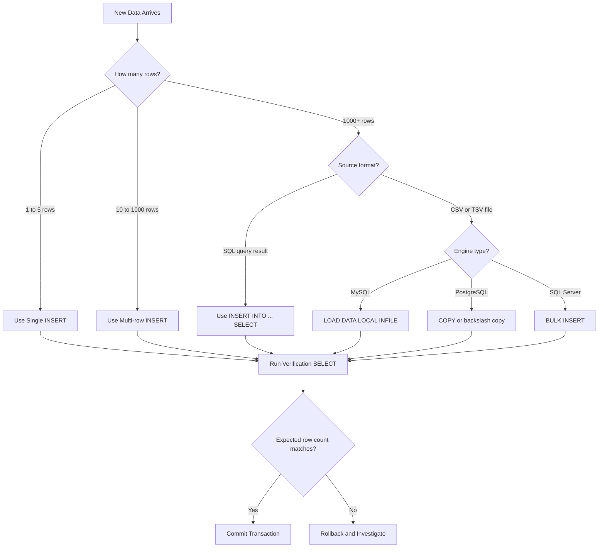
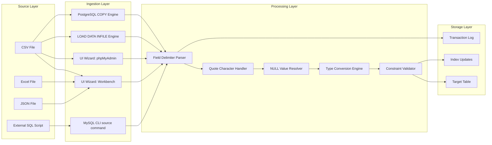
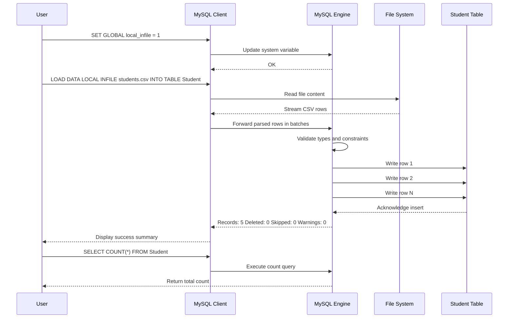
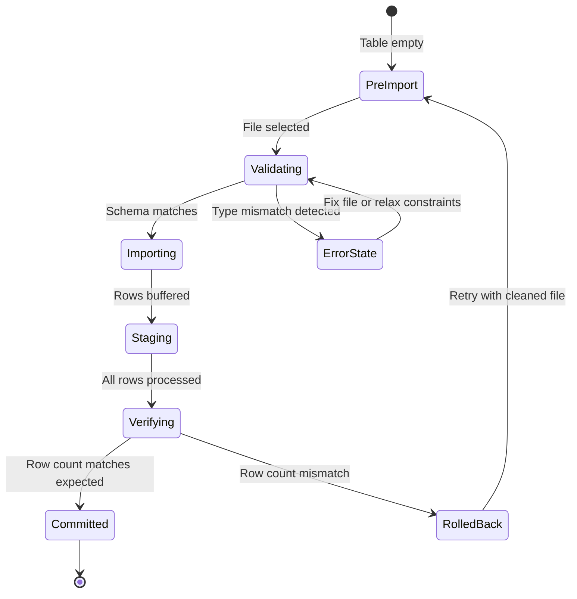

# Database initialization - Data insert, Data import to a database (bulk import using UI and SQL Commands).

<!-- SECTION_1_START -->
# Database Initialization: Data Insert & Data Import

## 1. Core Technical Definition & Intuitive Overview

### Formal KTU 2024 Definition
**Database initialization** in the context of DBMS Lab (PCCSL408) refers to the process of **populating a freshly created relational database** with structured data using standardized SQL operations. This encompasses two principal operations: **Data Insertion** (writing new rows into existing tables using `INSERT` statements) and **Data Importation** (transferring large volumes of pre-existing data from external sources like CSV, Excel, or JSON files into the database through UI tools or SQL bulk commands).

> [!IMPORTANT]
> **KTU 2024 Syllabus Highlight (PCCSL408 - Module 3):**
> Students must demonstrate proficiency in both **manual SQL-based data insertion** and **automated bulk import techniques** using GUI tools (phpMyAdmin, MySQL Workbench, pgAdmin) and command-line utilities (`LOAD DATA INFILE`, `COPY`, `BULK INSERT`).

### Conceptual Analogy / Intuition
Think of a newly built **warehouse (database)** as a system of empty **shelves (tables)**. **Data insertion** is like a worker manually placing individual items onto specific shelves one by one — slow but precise, useful for adding single records or corrections. **Data import**, on the other hand, is like using a **forklift to unload an entire truckload of pre-packaged boxes (CSV/Excel files)** onto the shelves — fast, efficient, and necessary when thousands of items arrive simultaneously.

```
Analogy Mapping:
┌─────────────────────────┬──────────────────────────────┐
│  Warehouse Concept      │  Database Concept             │
├─────────────────────────┼──────────────────────────────┤
│ Warehouse Building      │  Database                    │
│ Shelf Section           │  Table                       │
│ Individual Item         │  Single Row (Record)         │
│ Manual Item Placement   │  INSERT Statement            │
│ Forklift + Truckload    │  Bulk Import (CSV/LOAD DATA) │
│ Loading Dock Manifest   │  Source CSV / Excel File     │
└─────────────────────────┴──────────────────────────────┘
```

### Key Terminology Checklist

> [!NOTE]
> **Must-Know Terms Before Proceeding:**
> - **Tuple / Row / Record** — A single horizontal entry in a table
> - **Attribute / Column / Field** — A vertical data category in a table
> - **CSV (Comma-Separated Values)** — Plain-text file format where each line is a data row
> - **Delimiter** — Character used to separate fields (comma `,`, tab `\t`, pipe `|`, semicolon `;`)
> - **Bulk Insert** — Loading thousands/millions of rows in a single operation
> - **Path Specification** — Absolute (`C:\data\file.csv`) vs Relative (`./data/file.csv`) file locations
> - **Schema Validation** — Ensuring imported data conforms to the table's column types and constraints
> - **Character Set** — Encoding standard (UTF-8, Latin-1) for international character support

### GeoGebra / Data Visualization Concept

> [!VISUALIZATION CONTROL]
> **Concept:** Data Insertion Rate vs Method Comparison
> **Conceptual Plot Inputs:**
> * `x` = Number of rows to insert
> * `y` = Time taken (seconds)
> * `f(x) = 0.002 * x + 0.5` — Single INSERT (linear, slow)
> * `g(x) = 0.0003 * x + 1.0` — Batch INSERT (faster)
> * `h(x) = 0.00005 * x + 0.3` — Bulk LOAD DATA (fastest)
> **Visual Description:** On a coordinate plane, plot three lines starting from different y-intercepts. Observe that as `x` (rows) increases, the gap between the three lines widens dramatically — showing that bulk import is exponentially more efficient for large datasets.

---

<!-- SECTION_1_END -->

<!-- SECTION_2_START -->
# 2. Deep Theoretical Analysis & KTU High-Yield Formula Sheet

## 2.1 Classification of Data Insertion Methods

### A. Single-Row INSERT (Row-at-a-time)
The most granular insertion method. One tuple is added per SQL execution.

```sql
INSERT INTO table_name (column1, column2, ...) 
VALUES (value1, value2, ...);
```

### B. Multi-Row INSERT (Batch INSERT)
Multiple tuples inserted in a single SQL statement — significantly faster than repeated single inserts due to reduced query parsing overhead.

```sql
INSERT INTO table_name (column1, column2, ...) 
VALUES 
    (value1a, value2a, ...),
    (value1b, value2b, ...),
    (value1c, value2c, ...);
```

### C. INSERT with Subquery (Derived Insert)
Inserts the result set of a `SELECT` query into a target table.

```sql
INSERT INTO target_table (col1, col2)
SELECT source_col1, source_col2 
FROM source_table 
WHERE condition;
```

### D. Bulk Import Methods

| Method | Engine | Best For |
|--------|--------|----------|
| `LOAD DATA INFILE` | MySQL | CSV/TSV bulk load (fastest) |
| `COPY ... FROM` | PostgreSQL | CSV bulk load with delimiters |
| `BULK INSERT` | SQL Server | High-volume enterprise imports |
| `\.` or `source` | MySQL CLI | Executing `.sql` script files |
| `\copy` | psql CLI | Client-side bulk import (no superuser) |
| GUI Wizard | phpMyAdmin, Workbench, pgAdmin | Visual learners, prototyping |

## 2.2 KTU Formula Sheet / Cheat Sheet

> [!IMPORTANT]
> **High-Yield Reference Table for KTU Lab Exam:**

| Operation | SQL Syntax Pattern | Typical Use Case | Performance Tier |
|-----------|-------------------|------------------|------------------|
| Single row insert | `INSERT INTO T(c) VALUES (v);` | One-time record entry | **Tier 1** (Slow) |
| Multi-row insert | `INSERT INTO T(c) VALUES (r1),(r2),...;` | 10–1000 records via SQL | **Tier 2** (Medium) |
| Insert from SELECT | `INSERT INTO T SELECT ... FROM S;` | ETL, table duplication | **Tier 2** (Medium) |
| MySQL `LOAD DATA` | `LOAD DATA INFILE 'p' INTO TABLE T FIELDS TERMINATED BY ',';` | Millions of rows from CSV | **Tier 3** (Fast) |
| PostgreSQL `COPY` | `COPY T FROM 'p' WITH (FORMAT csv, HEADER true);` | Millions of rows from CSV | **Tier 3** (Fast) |
| SQL Server `BULK INSERT` | `BULK INSERT T FROM 'p' WITH (FIELDTERMINATOR=',');` | Enterprise bulk loads | **Tier 3** (Fast) |
| MySQL CLI source | `source /path/script.sql;` | Replaying schema + data scripts | **Tier 2** (Medium) |
| GUI Import Wizard | Workbench → Table → Import Data | Visual CSV/JSON import | **Tier 2** (Medium) |

## 2.3 Critical Configuration Parameters

Before any bulk import, the following parameters must be understood:

> [!NOTE]
> **MySQL Bulk Import Configuration:**
> - `local_infile` — Must be enabled on **both** server (`my.cnf`) and client (`SET GLOBAL local_infile=1;`)
> - `secure_file_priv` — Server variable that restricts import file location (defaults to a specific directory on modern MySQL)
> - `max_allowed_packet` — Maximum size of a single packet; increase for large multi-row inserts
> - `innodb_buffer_pool_size` — Memory available for caching import operations

> [!NOTE]
> **PostgreSQL Bulk Import Configuration:**
> - File must be readable by the `postgres` OS user when using server-side `COPY`
> - Use `\copy` (psql meta-command) for client-side import to bypass OS permission issues
> - `FORMAT` can be `csv`, `text`, or `binary`

## 2.4 Real-World Engineering Utility

In production systems:
- **E-commerce platforms** like Amazon bulk-load product catalogs (millions of SKUs) nightly using `LOAD DATA INFILE` or equivalent.
- **Banking systems** import transaction logs in batches using `BULK INSERT` to maintain ACID compliance and audit trails.
- **Data warehousing** (Snowflake, BigQuery, Redshift) uses `COPY INTO` commands that are direct descendants of these traditional bulk import methods.
- **ETL pipelines** (Extract-Transform-Load) often use `INSERT ... SELECT` to move data between staging and production tables.

---

<!-- SECTION_2_END -->

<!-- SECTION_3_START -->
# 3. Step-by-Step Implementations & Lab Procedures

## 3.1 Lab Environment Setup Matrix

| Component | Specification | Verification Command |
|-----------|---------------|---------------------|
| RDBMS Software | MySQL 8.0+ / PostgreSQL 14+ | `SELECT VERSION();` |
| GUI Tool | MySQL Workbench / phpMyAdmin / pgAdmin | Launch and connect |
| Sample Database | `university_db` or `student_db` | `SHOW DATABASES;` |
| Source File Format | CSV with header row | `head -n 3 file.csv` |
| Operating System | Windows 10/11 or Ubuntu 20.04+ | `ver` / `uname -a` |
| File Permissions | Read access for DB user | `ls -l file.csv` (Linux) |

## 3.2 Exhaustive Lab Exercise 1: Single & Multi-Row INSERT

**Step 1 — Create and select the working database:**
```sql
CREATE DATABASE IF NOT EXISTS ktu_lab_db;
USE ktu_lab_db;
```

**Step 2 — Create the student table:**
```sql
CREATE TABLE Student (
    roll_no     INT PRIMARY KEY,
    name        VARCHAR(50) NOT NULL,
    department  VARCHAR(30),
    cgpa        DECIMAL(4,2),
    join_year   INT
);
```

**Step 3 — Single-row INSERT (one student at a time):**
```sql
INSERT INTO Student (roll_no, name, department, cgpa, join_year) 
VALUES (101, 'Arjun Krishnan', 'CSE', 8.75, 2022);
```

**Step 4 — Verify the insertion:**
```sql
SELECT * FROM Student WHERE roll_no = 101;
```

**Step 5 — Multi-row INSERT (batch insertion):**
```sql
INSERT INTO Student (roll_no, name, department, cgpa, join_year) 
VALUES 
    (102, 'Meera Nair', 'CSE', 9.12, 2022),
    (103, 'Rahul Menon', 'ECE', 7.88, 2021),
    (104, 'Sneha Pillai', 'IT', 8.45, 2023),
    (105, 'Vivek Sharma', 'CSE', 7.20, 2022);
```

**Step 6 — Insert using a subquery (derived insert):**
```sql
CREATE TABLE Student_Backup AS SELECT * FROM Student WHERE 1=0;

INSERT INTO Student_Backup (roll_no, name, department, cgpa, join_year)
SELECT roll_no, name, department, cgpa, join_year
FROM Student
WHERE department = 'CSE';
```

**Step 7 — Final verification:**
```sql
SELECT * FROM Student;
SELECT * FROM Student_Backup;
```

**Expected Output:**
```
+---------+----------------+------------+-------+-----------+
| roll_no | name           | department | cgpa  | join_year |
+---------+----------------+------------+-------+-----------+
| 101     | Arjun Krishnan | CSE        |  8.75 |      2022 |
| 102     | Meera Nair     | CSE        |  9.12 |      2022 |
| 103     | Rahul Menon    | ECE        |  7.88 |      2021 |
| 104     | Sneha Pillai   | IT         |  8.45 |      2023 |
| 105     | Vivek Sharma   | CSE        |  7.20 |      2022 |
+---------+----------------+------------+-------+-----------+
```

## 3.3 Exhaustive Lab Exercise 2: Bulk Import via SQL Commands (MySQL)

**Step 1 — Prepare a sample CSV file `students_bulk.csv`:**
```csv
roll_no,name,department,cgpa,join_year
201,Anjali Rajan,CSE,8.95,2023
202,Karthik Bose,ECE,7.65,2022
203,Divya Suresh,IT,9.10,2023
204,Manoj Varma,CSE,8.20,2021
205,Lakshmi Iyer,EEE,7.95,2022
```

> [!IMPORTANT]
> Place the CSV in a location accessible to the MySQL server. For `LOCAL` keyword, place it on the **client** machine instead. Default MySQL `secure_file_priv` path is something like `C:\ProgramData\MySQL\MySQL Server 8.0\Uploads\` on Windows.

**Step 2 — Enable local file loading (MySQL 8.0+):**
```sql
SET GLOBAL local_infile = 1;
```

**Step 3 — Use `LOAD DATA LOCAL INFILE`:**
```sql
LOAD DATA LOCAL INFILE 'C:/lab_data/students_bulk.csv'
INTO TABLE Student
FIELDS TERMINATED BY ','
ENCLOSED BY '"'
LINES TERMINATED BY '\n'
IGNORE 1 ROWS
(roll_no, name, department, cgpa, join_year);
```

**Step 4 — Explanation of each clause:**
- `LOAD DATA LOCAL INFILE 'path'` — Loads from the client machine
- `INTO TABLE Student` — Target table
- `FIELDS TERMINATED BY ','` — Comma-separated values
- `ENCLOSED BY '"'` — Text fields wrapped in double quotes
- `LINES TERMINATED BY '\n'` — Each row ends with newline
- `IGNORE 1 ROWS` — Skips the CSV header row
- `(roll_no, name, department, cgpa, join_year)` — Column mapping

**Step 5 — Verify bulk import:**
```sql
SELECT COUNT(*) AS total_students FROM Student;
SELECT * FROM Student WHERE roll_no BETWEEN 201 AND 205;
```

## 3.4 Exhaustive Lab Exercise 3: Bulk Import via SQL Commands (PostgreSQL)

**Step 1 — Server-side `COPY` (requires superuser + OS-level file access):**
```sql
COPY Student(roll_no, name, department, cgpa, join_year)
FROM 'C:/lab_data/students_bulk.csv'
WITH (FORMAT csv, HEADER true, DELIMITER ',', QUOTE '"');
```

**Step 2 — Client-side `\copy` (psql meta-command, no superuser required):**
```sql
\copy Student(roll_no, name, department, cgpa, join_year) 
FROM 'C:/lab_data/students_bulk.csv' 
WITH (FORMAT csv, HEADER true);
```

**Step 3 — Verify:**
```sql
SELECT * FROM Student ORDER BY roll_no;
```

## 3.5 Exhaustive Lab Exercise 4: Bulk Import via GUI (MySQL Workbench)

**Step-By-Step Wiring / Click Sequence:**

| Step | Action | Path / Click Target |
|------|--------|---------------------|
| 1 | Launch MySQL Workbench | Open application |
| 2 | Connect to local instance | Click existing connection tile |
| 3 | Select target schema | Navigator → Right-click `ktu_lab_db` → Set as Default Schema |
| 4 | Open Table Data Import Wizard | Server → Data Import |
| 5 | Choose import source | Select `Import from Self-Contained File` → Browse to `students_bulk.csv` |
| 6 | Select target schema & table | Dropdown → `ktu_lab_db` → `Student` |
| 7 | Map CSV columns to table columns | Adjust via `Edit` columns if names differ |
| 8 | Configure import options | Encoding: `utf8`, Line ending: `\n` |
| 9 | Start import | Click `Next` → `Next` → `Progress` tab shows rows imported |
| 10 | Verify | `SELECT COUNT(*) FROM Student;` |

## 3.6 Exhaustive Lab Exercise 5: Executing a `.sql` Script File

**Step 1 — Create a script `init_data.sql`:**
```sql
USE ktu_lab_db;

INSERT INTO Student (roll_no, name, department, cgpa, join_year) 
VALUES 
    (301, 'Fathima Zahra', 'CSE', 9.25, 2023),
    (302, 'Arun Mathew', 'ME', 8.10, 2022),
    (303, 'Priya George', 'CE', 7.85, 2021);

SELECT 'Data initialization complete' AS status;
SELECT COUNT(*) AS total_rows FROM Student;
```

**Step 2 — Execute from MySQL CLI:**
```bash
mysql -u root -p ktu_lab_db < init_data.sql
```

**Step 3 — Execute from inside MySQL CLI:**
```sql
SOURCE C:/lab_data/init_data.sql;
```

**Step 4 — Execute from PostgreSQL CLI (psql):**
```bash
psql -U postgres -d ktu_lab_db -f init_data.sql
```

## 3.7 Common Error Handling & Safety Checks

> [!WARNING]
> **Lab Safety & Error Monitoring Checklist:**
> 1. **Always backup the table before bulk import:**
>    ```sql
>    CREATE TABLE Student_backup_2024 AS SELECT * FROM Student;
>    ```
> 2. **Use transactions for atomicity:**
>    ```sql
>    START TRANSACTION;
>    LOAD DATA LOCAL INFILE 'path' INTO TABLE Student ...;
>    -- If verification succeeds:
>    COMMIT;
>    -- If errors found:
>    ROLLBACK;
>    ```
> 3. **Disable foreign key checks temporarily** (if loading related tables in incorrect order):
>    ```sql
>    SET FOREIGN_KEY_CHECKS = 0;
>    -- import operations
>    SET FOREIGN_KEY_CHECKS = 1;
>    ```
> 4. **Validate encoding:** CSV files saved as UTF-8 prevent character corruption in non-ASCII names.

---

<!-- SECTION_3_END -->

<!-- SECTION_4_START -->
# 4. Structural Diagrams & Schematics

## 4.1 Mermaid Workflow: Data Insertion Decision Tree



## 4.2 Mermaid Block Architecture: Bulk Import Processing Pipeline



## 4.3 Mermaid Sequence Diagram: End-to-End CSV Import Session



## 4.4 Mermaid State Diagram: Data Integrity States During Import



---

<!-- SECTION_4_END -->

<!-- SECTION_5_START -->
# 5. KTU 2024 Scheme Examination Question Bank & Topic Recap

## Part A Questions (3 Marks Each)

### Question 1
**[KTU University Exam - July 2024 | CO1 | Remember]**

Differentiate between single-row `INSERT` and bulk import using `LOAD DATA INFILE`. State two scenarios where bulk import is preferred over single-row insertion.

**Model Answer (Valuation Key: 1 Mark per point):**

Single-row `INSERT` adds one tuple to a table per SQL execution and requires the user to manually type every value. `LOAD DATA INFILE` is a MySQL bulk operation that reads rows directly from an external file and writes them into the target table in a single command, achieving significantly higher throughput.

Scenarios where bulk import is preferred:
1. **Initial database seeding:** Loading a CSV containing thousands of products, students, or employees into a freshly created table where manual entry is infeasible.
2. **Nightly data synchronization:** Importing log files, transaction batches, or ETL feeds from upstream systems that generate flat-file exports on a schedule.

### Question 2
**[KTU University Exam - Dec 2023 | CO2 | Understand]**

List any three clauses used with the `LOAD DATA INFILE` statement in MySQL and explain the role of the `IGNORE` clause.

**Model Answer (Valuation Key: 1 Mark per clause, 1 Mark for explanation, 1 Mark for role of IGNORE):**

1. `FIELDS TERMINATED BY ','` — Specifies the delimiter that separates column values within a row.
2. `LINES TERMINATED BY '\n'` — Specifies the character that ends each row of the file.
3. `ENCLOSED BY '"'` — Specifies the quote character wrapping text fields.

The `IGNORE n ROWS` clause instructs MySQL to **skip the first `n` lines of the input file** before beginning the import. Its primary use is to **bypass the header row** present in CSV files, ensuring that column titles like `roll_no,name,...` are not interpreted as actual data and inserted into the table.

---

## Part B Questions (14 Marks Each — Internal Choice)

### Question 3A
**[KTU University Exam - July 2024 | CO2, CO3 | Apply, Analyze]**

**(a)** Consider the table `Employee(emp_id, name, department, salary, doj)` created in the `company_db` schema. Write SQL commands to perform the following operations: **[7 Marks]**

   1. Insert three records using a single multi-row `INSERT` statement.
   2. Insert all employees from the `Trainee` table (columns: `emp_id, name, department`) into the `Employee` table by selecting only those whose salary is greater than 30000 — assuming the `Trainee` table contains a `salary` column.
   3. Update the `salary` of employee with `emp_id = 504` by 10 percent.

**(b)** Demonstrate the steps to bulk import a CSV file named `new_employees.csv` containing 5000 employee records into the `Employee` table using MySQL `LOAD DATA INFILE` command. Show the file format and explain each clause. **[7 Marks]**

**Model Solution:**

### Part (a) — 7 Marks

**Step 1 — Multi-row INSERT (3 Marks):**
```sql
INSERT INTO Employee (emp_id, name, department, salary, doj) 
VALUES 
    (501, 'Rahul Dev', 'IT', 45000.00, '2023-06-15'),
    (502, 'Sneha Raj', 'HR', 38000.00, '2023-07-20'),
    (503, 'Arun Varma', 'Finance', 52000.00, '2023-05-10');
```
[Correct syntax with five columns mapped: 1 Mark] [Three valid rows: 1 Mark] [Single statement wrapping all rows: 1 Mark]

**Step 2 — INSERT from SELECT (2 Marks):**
```sql
INSERT INTO Employee (emp_id, name, department, salary, doj)
SELECT emp_id, name, department, salary, '2024-01-01' AS doj
FROM Trainee
WHERE salary > 30000;
```
[Correct SELECT subquery: 1 Mark] [Filter condition applied: 1 Mark]

**Step 3 — UPDATE (2 Marks):**
```sql
UPDATE Employee 
SET salary = salary * 1.10 
WHERE emp_id = 504;
```
[Correct UPDATE syntax: 1 Mark] [Salary increment expression `* 1.10`: 1 Mark]

### Part (b) — 7 Marks

**Sample CSV file `new_employees.csv`:**
```csv
emp_id,name,department,salary,doj
601,Anjali Menon,Sales,42000,2024-01-15
602,Vivek Nair,IT,55000,2024-02-20
603,Meera Iyer,HR,39000,2024-03-10
```

[CSV structure with header row: 1 Mark]

**MySQL bulk import command (4 Marks):**
```sql
SET GLOBAL local_infile = 1;

LOAD DATA LOCAL INFILE 'C:/lab_data/new_employees.csv'
INTO TABLE Employee
FIELDS TERMINATED BY ','
ENCLOSED BY '"'
LINES TERMINATED BY '\n'
IGNORE 1 ROWS
(emp_id, name, department, salary, doj);
```

[Enabling `local_infile`: 1 Mark] [Correct `LOAD DATA` keyword and file path: 1 Mark] [All four field/line/ignore clauses correctly stated: 1 Mark] [Correct column mapping: 1 Mark]

**Clause-by-Clause Explanation (2 Marks):**
- `FIELDS TERMINATED BY ','` — Comma is the field separator in the CSV
- `IGNORE 1 ROWS` — Skips the header line so it is not inserted as data
- `ENCLOSED BY '"'` — Handles text values wrapped in double quotes
- `(emp_id, name, ...)` — Maps CSV columns in the correct order to the target table columns

---

### Question 3B (Alternative Choice)
**[KTU University Exam - Dec 2023 | CO2, CO3 | Apply, Analyze]**

**(a)** Write the PostgreSQL `COPY` command to import a CSV file `students_2024.csv` into the `Student` table having columns `(roll_no, name, branch, marks, semester)`. The file uses comma as the delimiter and contains a header row. Also write the equivalent `\copy` meta-command. **[7 Marks]**

**(b)** Describe the step-by-step procedure to import a CSV file into a MySQL table using the **MySQL Workbench GUI Data Import Wizard**. Mention at least five steps with the navigation path. **[7 Marks]**

**Model Solution:**

### Part (a) — 7 Marks

**PostgreSQL `COPY` (server-side, requires superuser access):**
```sql
COPY Student(roll_no, name, branch, marks, semester)
FROM 'C:/lab_data/students_2024.csv'
WITH (FORMAT csv, HEADER true, DELIMITER ',', QUOTE '"');
```
[Correct `COPY FROM` syntax: 1 Mark] [File path quoted: 1 Mark] [FORMAT csv specified: 1 Mark] [HEADER true specified: 1 Mark]

**psql `\copy` meta-command (client-side, no special privileges):**
```sql
\copy Student(roll_no, name, branch, marks, semester) 
FROM 'C:/lab_data/students_2024.csv' 
WITH (FORMAT csv, HEADER true)
```
[Backslash before `copy`: 1 Mark] [Same `WITH` options: 1 Mark] [Difference explained: client-side vs server-side: 1 Mark]

### Part (b) — 7 Marks

**Step-by-step GUI import procedure:**

| Step | Navigation Path / Action | Marks |
|------|--------------------------|-------|
| 1 | Open MySQL Workbench and connect to the local MySQL instance. | 1 |
| 2 | From the top menu, click **Server → Data Import**. | 1 |
| 3 | In the import wizard, select **Import from Self-Contained File** and browse to `students_2024.csv`. | 1 |
| 4 | Choose the target schema (`ktu_lab_db`) and the target table (`Student`) using the dropdown selectors. | 1 |
| 5 | Click **Edit** to manually map each CSV column to the corresponding table column if names differ. | 1 |
| 6 | Click **Next** → **Next** → **Start Import** and monitor the progress log. | 1 |
| 7 | After import, run `SELECT COUNT(*) FROM Student;` to verify the number of inserted rows matches the CSV line count (minus the header). | 1 |

---

> [!WARNING]
> **KTU Examiner's Valuation Warning — Common Pitfalls:**
> 1. **Forgetting `IGNORE 1 ROWS`:** Students frequently import the CSV header as a data row, causing a `Data too long` or type-mismatch error on the first insertion. Always remember to skip the header.
> 2. **Not enabling `local_infile`:** MySQL 8.0+ disables this by default. Without `SET GLOBAL local_infile = 1;` the bulk import command will fail with `ERROR 3948: Loading local data is disabled`.
> 3. **Wrong file path separator on Windows:** Use forward slashes `/` in the SQL string (e.g., `'C:/data/file.csv'`) — backslashes `\` are treated as escape characters and will cause `File not found` errors.
> 4. **Mixing up `\copy` and `COPY`:** In PostgreSQL, uppercase `COPY` runs on the server (needs file accessibility from server process), while `\copy` (lowercase with backslash) runs on the client. Forgetting this difference leads to permission errors.
> 5. **Skipping the `SELECT COUNT(*)` verification:** Examiners award partial marks for the verification query after every bulk import.
> 6. **Not wrapping the import in a transaction:** If 4,999 of 5,000 rows succeed and the last one fails, an unwrapped import leaves the table in a partially-loaded state.

---

## Topic Recap & Important Things to Remember

> [!IMPORTANT]
> **High-Density Rapid Revision Checklist:**

- **Data Insertion** in SQL has three primary forms: **single-row INSERT**, **multi-row INSERT**, and **INSERT ... SELECT**.
- **Bulk import** is used when the dataset is too large for manual entry; the three engine-specific commands are **`LOAD DATA INFILE` (MySQL)**, **`COPY`/`\copy` (PostgreSQL)**, and **`BULK INSERT` (SQL Server)**.
- The five mandatory clauses of `LOAD DATA INFILE` are: **`INTO TABLE`**, **`FIELDS TERMINATED BY`**, **`LINES TERMINATED BY`**, **`IGNORE n ROWS`**, and the **column list**.
- **`local_infile` must be set to 1** on both client and server before `LOAD DATA LOCAL INFILE` works in MySQL 8.0+.
- **CSV files must be UTF-8 encoded** to avoid character corruption for non-ASCII names.
- The **default file path for MySQL secure imports** is the directory specified by `secure_file_priv` (commonly `C:\ProgramData\MySQL\MySQL Server 8.0\Uploads\` on Windows).
- **GUI tools** (MySQL Workbench, phpMyAdmin, pgAdmin) provide visual Data Import Wizards accessible from the **Server / File / Tools** menu.
- **psql `\copy`** is a **client-side** command and does not require superuser privileges, unlike the server-side `COPY` command.
- **Transactions (`START TRANSACTION` ... `COMMIT` / `ROLLBACK`)** must wrap large bulk imports to ensure atomicity and recoverability.
- **Verification step** after every import: always run `SELECT COUNT(*)` and compare with the expected row count.
- **GUI import navigation in MySQL Workbench:** `Server → Data Import → Import from Self-Contained File → Select Schema → Map Columns → Start Import`.
- **CLI script execution:** `mysql -u root -p dbname < script.sql` (MySQL) and `psql -U user -d dbname -f script.sql` (PostgreSQL).
- **Format keywords to memorize:** `FORMAT csv`, `HEADER true`, `DELIMITER ','`, `QUOTE '"'`, `FIELDS ENCLOSED BY` — these appear in almost every bulk import command.
- **Performance rule of thumb:** Bulk import via `LOAD DATA` / `COPY` is approximately **10x to 100x faster** than equivalent multi-row INSERT statements for datasets exceeding 10,000 rows.

<!-- SECTION_5_END -->
