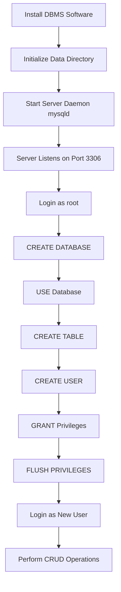
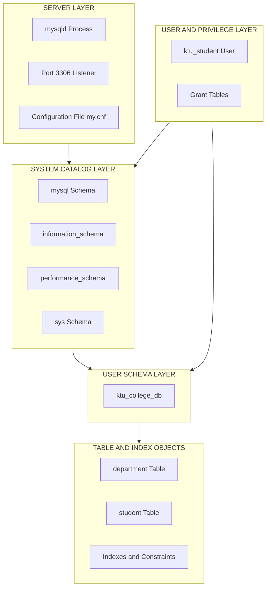
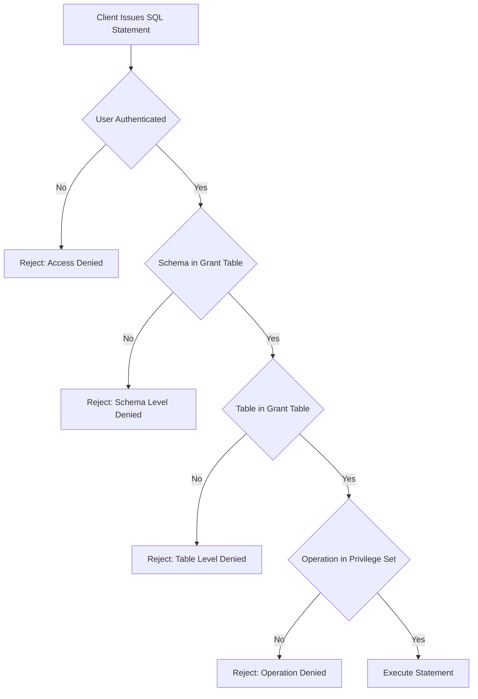

# Database initialization

<!-- SECTION_1_START -->
# Database Initialization — Core Technical Definition & Intuitive Overview

## Formal Academic Definition (KTU 2024 Syllabus Terminology)

**Database Initialization** is the foundational, one-time preparatory procedure performed immediately after the installation of a Database Management System (DBMS) software (such as MySQL, PostgreSQL, or Oracle). It encompasses the creation of the data dictionary, system catalogs, default schemas, configuration parameter files, and the allocation of physical storage structures (data files, log files, redo logs, undo tablespaces) required to bring a DBMS instance to a usable, queryable state.

> [!IMPORTANT]
> **KTU 2024 — Module 3 Highlight:**
> Database initialization is the *first* step in the database lifecycle. Without a properly initialized server (daemon/service) and a properly created **SCHEMA** (logical container), no `CREATE TABLE`, `INSERT`, or `SELECT` operation can succeed.

The three classical sub-phases recognized in the KTU PCCSL408 lab manual are:

1. **Server/Instance Initialization** — Starting the DBMS background process (`mysqld`, `postgres`).
2. **Schema Initialization** — Executing the `CREATE DATABASE` DDL command.
3. **Authorization Initialization** — Creating users (`CREATE USER`) and granting privileges (`GRANT`).

## Conceptual Analogy — The "New Office" Intuition

Imagine a brand-new, empty corporate office building has just been constructed.

| Real-World Analogy | Database Initialization Equivalent |
|---|---|
| The building's electrical wiring, plumbing, and elevators | DBMS Server (background daemon) |
| A specific floor/room allocated to your team | A logical **Database / Schema** |
| The empty filing cabinets, shelves, and folders | **Tables**, **Indexes**, and **Tablespaces** |
| The security guard checking ID cards at the door | **User Authentication & Privileges** |
| The official directory listing every room & cabinet | **Data Dictionary / System Catalog** (`information_schema`, `mysql`) |
| Deciding whether files will be in English or Malayalam | **Character Set & Collation** |

You cannot store a single file in a room that does not exist; similarly, you cannot store a tuple in a table that does not exist within a database that has not been initialized.

## Standard Metrics, Constants & Defaults (MySQL 8.0 Reference)

> [!NOTE]
> **Physical Constants to Memorize for the Lab Exam:**
> - Default MySQL port: **3306**
> - Default PostgreSQL port: **5432**
> - Default root user: `root` @ `localhost`
> - Default MySQL system databases: `mysql`, `information_schema`, `performance_schema`, `sys`
> - Default storage character set (MySQL 8.0+): **utf8mb4**
> - Default collation: **utf8mb4_0900_ai_ci**
> - MySQL configuration file (Linux): **`/etc/mysql/my.cnf`**
> - MySQL data directory: **`/var/lib/mysql/`**

## GeoGebra / Desmos Visualization (Conceptual)

> [!VISUALIZATION CONTROL]
> **Concept:** Layered Hierarchy of Database Initialization
> **GeoGebra Input Equations:**
> * `Circle((0,0), 5)` — Outer boundary representing the **DBMS Server**
> * `Circle((0,0), 3.5)` — Middle boundary representing the **Schema / Database**
> * `Circle((0,0), 2)` — Inner boundary representing the **Table**
> * `Point((0,0))` — Central point representing the **Tuple / Row**
> **Visual Description:** The student should observe four concentric circles. The outer circle must be created **first** (Server), then the next (Database), then the next (Table), and finally the center point (Data). This visualizes the strict dependency order in initialization: *no inner layer can exist without its outer layer being initialized.*

<!-- SECTION_1_END -->

<!-- SECTION_2_START -->
# Deep Theoretical Analysis & KTU High-Yield Formula Sheet

## The Four Pillars of Database Initialization

### Pillar 1 — Server (Instance) Initialization

The DBMS engine is launched as a background OS process. This process allocates shared memory pools, parses the configuration file, and opens the data directory.

- **MySQL:** The server is `mysqld`. It is started via `service mysql start` or `systemctl start mysql`.
- **PostgreSQL:** The server is `postgres`. It is started via `pg_ctlcluster 14 main start`.
- **Oracle:** Initialization is performed by reading the `init.ora` / `spfile.ora` file and starting the **System Global Area (SGA)**.

### Pillar 2 — Data Dictionary / System Catalog

The system catalog is a *meta-database* — a database that describes all other databases. It is created automatically during the very first server start. It tracks:

- All schemas present on the server
- All tables, columns, and their data types
- All users and their encrypted password hashes
- All indexes, constraints, views, and triggers

> [!IMPORTANT]
> In MySQL, the system catalog is split across the `mysql` schema (for users, privileges, plugins) and the `information_schema` schema (for table/column metadata). Querying `information_schema.tables` is the canonical way to "ask the database what it knows about itself."

### Pillar 3 — Schema (Database) Initialization

A **schema** (synonymous with `DATABASE` in MySQL; distinct in Oracle/PostgreSQL) is created using Data Definition Language (DDL).

- `CREATE DATABASE db_name;` — Creates an empty logical container.
- `USE db_name;` — Sets the current schema as the default scope for subsequent DML/DDL.
- `DROP DATABASE db_name;` — Destructively removes the schema and all its contents.

### Pillar 4 — User & Privilege Initialization

A freshly created database has only one authorized user: the `root` administrator. Best-practice lab procedure (and a KTU expected answer) requires creating a least-privilege user.

- `CREATE USER 'username'@'host' IDENTIFIED BY 'password';`
- `GRANT privilege_type ON db_name.table_name TO 'username'@'host';`
- `FLUSH PRIVILEGES;` — Forces the server to reload the grant tables from disk into memory.

## KTU Formula Sheet / Cheat Sheet

> [!NOTE]
> Use `\vert` instead of the pipe symbol `|` in tables to avoid markdown breakage.

| Concept | SQL Syntax / Constant | Purpose / Engineering Utility |
|---|---|---|
| Server start (Linux) | `sudo systemctl start mysql` | Boots the DBMS daemon; required before any session. |
| Server status check | `sudo systemctl status mysql` | Verifies the process is active and healthy. |
| Create schema | `CREATE DATABASE college_db;` | Allocates a logical namespace for tables. |
| Select schema | `USE college_db;` | Sets the current working schema. |
| Set character set | `CREATE DATABASE college_db CHARACTER SET utf8mb4;` | Ensures multilingual support (e.g., Malayalam, Hindi). |
| Set collation | `COLLATE utf8mb4_unicode_ci;` | Defines string-sorting rules (case-insensitive default). |
| Create user | `CREATE USER 'app_user'@'localhost' IDENTIFIED BY 'P@ssw0rd!';` | Establishes a non-root identity. |
| Grant privileges | `GRANT ALL PRIVILEGES ON college_db.* TO 'app_user'@'localhost';` | Authorizes the user to read/write the schema. |
| Reload privileges | `FLUSH PRIVILEGES;` | Commits in-memory changes to grant tables. |
| List databases | `SHOW DATABASES;` | Inspects initialized schemas. |
| List users | `SELECT user, host FROM mysql.user;` | Inspects the system catalog for accounts. |
| Storage engine | `ENGINE=InnoDB;` (default in MySQL 8) | Provides ACID transactions and foreign keys. |
| MySQL port | 3306 | Default TCP port used for client-server communication. |
| Max connections | 151 (default) | Limits concurrent client sessions. |
| InnoDB buffer pool | 128 MiB (default) | In-memory cache for table and index data pages. |

## Real-World Engineering Utility

In production-grade systems (e.g., banking, e-commerce), database initialization is automated through **Infrastructure-as-Code (IaC)** tools such as Terraform, Ansible, or Helm charts. The lab exercise of manually typing `CREATE DATABASE` and `CREATE USER` directly mirrors what tools like AWS RDS perform behind the scenes during the provisioning of a managed DB instance. Failing to initialize a proper schema or set a correct character set in production is a root cause of classic bugs such as the *Mojibake* character corruption problem (e.g., `é` becoming `é`).

<!-- SECTION_2_END -->

<!-- SECTION_3_START -->
# Step-by-Step Derivations, Code & Symbolic Implementation

## Lab Setup — Pre-Requisites

> [!IMPORTANT]
> Before executing any code below, ensure the MySQL server is installed and the service is running. In the KTU Linux lab, the canonical command is: `sudo systemctl start mysql`.

## Exercise 1 — Server Initialization & Status Verification

```bash
# Step 1: Start the MySQL server daemon
sudo systemctl start mysql

# Step 2: Verify the server process is alive
sudo systemctl status mysql
# Expected output contains: "active (running)"

# Step 3: Check the listening TCP port (should be 3306)
sudo ss -tlnp | grep 3306
```

**Logic Explanation:**
- `systemctl start` triggers the systemd service manager to launch the `mysqld` binary.
- `ss -tlnp` inspects the kernel's socket table; the presence of port 3306 confirms the server is ready to accept client connections.

## Exercise 2 — Logging in as the Root Administrator

```bash
# Login as the default superuser
sudo mysql -u root -p
# The -p flag prompts for the password defined during installation.
```

Once inside the MySQL monitor (`mysql>`), every subsequent command ends with a semicolon `;`.

## Exercise 3 — Inspecting the System Catalog (Meta-Query)

```sql
-- Show all currently initialized databases
SHOW DATABASES;
```

**Expected output:**

```
+--------------------+
| Database           |
+--------------------+
| information_schema |
| mysql              |
| performance_schema |
| sys                |
+--------------------+
```

> [!NOTE]
> These four databases are **automatically initialized** at first server start. They are not user-created. Removing them (`DROP DATABASE mysql`) will destroy the server.

```sql
-- Inspect all tables in the system catalog
SELECT table_schema, table_name, table_type
FROM information_schema.tables
WHERE table_schema = 'mysql'
LIMIT 10;
```

This query demonstrates that the database is *self-describing* — it can answer questions about its own structure.

## Exercise 4 — Schema Initialization (The Core Lab Task)

```sql
-- Create a database with explicit character set and collation
CREATE DATABASE ktu_college_db
CHARACTER SET utf8mb4
COLLATE utf8mb4_unicode_ci;

-- Select the newly created database as the working context
USE ktu_college_db;

-- Verify the current context
SELECT DATABASE();
-- Expected output: ktu_college_db
```

**Logic Explanation of Each Clause:**

| Clause | Meaning | Why it Matters |
|---|---|---|
| `CREATE DATABASE ktu_college_db` | Allocates a logical directory in the data folder. | Establishes an isolated namespace. |
| `CHARACTER SET utf8mb4` | Sets 4-byte Unicode encoding. | Supports all world languages + emoji. |
| `COLLATE utf8mb4_unicode_ci` | Sets case-insensitive sorting rules. | Ensures `Apple` and `apple` are considered equal. |
| `USE ktu_college_db;` | Sets the session-level default schema. | Avoids prefixing every table with `ktu_college_db.`. |

## Exercise 5 — Initial Table Creation to Verify Schema Readiness

```sql
-- Confirm the database is now writable
CREATE TABLE department (
    dept_id   INT PRIMARY KEY AUTO_INCREMENT,
    dept_name VARCHAR(50) NOT NULL UNIQUE,
    location  VARCHAR(50) DEFAULT 'Trivandrum'
);

-- Insert a sanity-check row
INSERT INTO department (dept_name, location)
VALUES ('Computer Science', 'Trivandrum');

-- Read back the data to prove end-to-end initialization
SELECT * FROM department;
```

## Exercise 6 — User & Privilege Initialization (Mandatory Lab Step)

```sql
-- Step 6.1: Create a new user restricted to local connections
CREATE USER 'ktu_student'@'localhost'
IDENTIFIED BY 'Ktu@2024!';

-- Step 6.2: Grant CRUD privileges on the schema ONLY
GRANT SELECT, INSERT, UPDATE, DELETE
ON ktu_college_db.*
TO 'ktu_student'@'localhost';

-- Step 6.3: Force the server to re-read the grant tables
FLUSH PRIVILEGES;

-- Step 6.4: Verify the grant
SHOW GRANTS FOR 'ktu_student'@'localhost';
```

**Expected output of `SHOW GRANTS`:**

```
+------------------------------------------------------------------+
| Grants for ktu_student@localhost                                 |
+------------------------------------------------------------------+
| GRANT USAGE ON *.* TO `ktu_student`@`localhost`                  |
| GRANT SELECT, INSERT, UPDATE, DELETE ON `ktu_college_db`.*       |
| TO `ktu_student`@`localhost`                                     |
+------------------------------------------------------------------+
```

## Exercise 7 — Symbolic Algebra: Privileges as a Set

The privilege set $P_{user}$ granted to a user is the **Cartesian-style union** of explicit grants:

$$
P_{user} = \bigcup_{i=1}^{n} G_i
$$

where each $G_i$ is a tuple $(priv\_type, db\_name, table\_name)$ produced by a `GRANT` statement.

**Example derivation for the `ktu_student` user:**

$$
P_{ktu\_student} = \{ (\text{SELECT}, \text{ktu\_college\_db}, *), (\text{INSERT}, \text{ktu\_college\_db}, *), (\text{UPDATE}, \text{ktu\_college\_db}, *), (\text{DELETE}, \text{ktu\_college\_db}, *) \}
$$

Any attempt by `ktu_student` to query a database **outside** this set will result in:

```
ERROR 1142 (42000): SELECT command denied to user 'ktu_student'@'localhost' for table 'mysql.user'
```

## Exercise 8 — Complete Teardown (Reversal Procedure)

```sql
-- Step 8.1: Revoke privileges
REVOKE ALL PRIVILEGES ON ktu_college_db.*
FROM 'ktu_student'@'localhost';

-- Step 8.2: Drop the user
DROP USER 'ktu_student'@'localhost';

-- Step 8.3: Drop the schema (irreversible)
DROP DATABASE ktu_college_db;

-- Step 8.4: Verify the database list
SHOW DATABASES;
```

<!-- SECTION_3_END -->

<!-- SECTION_4_START -->
# Structural Diagrams & Schematics

## Figure 1 — Sequential Initialization Flow (Mermaid)



## Figure 2 — Layered Architecture of the Initialized System (Mermaid)



## Figure 3 — Privilege Resolution Decision Tree (Mermaid)



## Figure 4 — Block-Level Functional Architecture (Initialization Stack)

| Layer # | Layer Name | Component | Initialization Command / Artifact |
|---|---|---|---|
| 1 | OS Layer | File system, users | Pre-installed by Linux |
| 2 | DBMS Engine | `mysqld` binary | `apt install mysql-server` |
| 3 | Data Directory | `/var/lib/mysql/` | `mysqld --initialize` |
| 4 | Configuration | `my.cnf` | Read at server start |
| 5 | System Catalogs | `mysql`, `information_schema` | Auto-created |
| 6 | User Schemas | `ktu_college_db` | `CREATE DATABASE` |
| 7 | Logical Objects | Tables, views, indexes | `CREATE TABLE` |
| 8 | Authorization | Users, grants | `CREATE USER`, `GRANT` |
| 9 | Application Access | Client connection | `mysql -u user -p` |

<!-- SECTION_4_END -->

<!-- SECTION_5_START -->
# KTU 2024 Scheme Examination Question Bank & Topic Recap

## Part A — Short Answer Questions (3 Marks Each)

### Question 1 (3 Marks) `[KTU University Exam — July 2024]`
**CO1, Remember**

**Q:** List any four system databases that are automatically initialized when MySQL Server 8.0 is started for the first time.

**Model Answer (Valuation Key):**
1. `mysql` — stores user accounts, privileges, and time zone information. **[1 Mark]**
2. `information_schema` — provides read-only access to metadata about all schemas, tables, and columns. **[1 Mark]**
3. `performance_schema` — monitors server execution at a low level (mutexes, file I/O, query events). **[0.5 Mark]**
4. `sys` — provides convenient views to interpret `performance_schema` data for DBAs. **[0.5 Mark]**

> [!WARNING]
> **KTU Examiner's Pitfall:** Do **not** list user-created databases such as `test`. Only the four auto-initialized catalogs carry marks. Writing `mysql` twice with different spellings scores zero.

---

### Question 2 (3 Marks) `[KTU University Exam — Dec 2023]`
**CO1, Understand**

**Q:** Differentiate between `DROP DATABASE` and `DELETE FROM <table>` in MySQL with respect to DDL/DML classification and recovery.

**Model Answer:**

| Aspect | `DROP DATABASE` | `DELETE FROM` |
|---|---|---|
| Category | DDL (Data Definition Language) | DML (Data Manipulation Language) |
| Scope | Removes the entire schema and all its objects | Removes rows from a single table only |
| Reversibility | Cannot be rolled back in MySQL without a backup | Can be rolled back inside a `TRANSACTION` |
| Effect on Structure | Deletes tables, views, triggers, indexes | Structure remains intact |

**[1 Mark] for DDL/DML classification, [1 Mark] for scope, [1 Mark] for the recovery/rollback distinction.**

---

## Part B — Full-Question Choices (14 Marks Each — Internal Choice)

### QUESTION A (14 Marks) `[KTU University Exam — July 2024]`
**Mapped COs:** CO1, CO2 | **RBT Levels:** Understand, Apply

**Q:** As a database administrator of the KTU examination cell, you are required to:
**(a)** Initialize a fresh MySQL server environment and create a database named `exam_cell_db` with the character set `utf8mb4`. Create a user `exam_officer` with password `Ex@m2024` and grant the user `SELECT`, `INSERT`, and `UPDATE` privileges **only** on the new database. **(7 Marks)**
**(b)** Demonstrate, with a sample table `exam_schedule` having columns `exam_id` (PK), `subject_name`, `exam_date`, and `max_marks`, that the initialization is successful by inserting two rows and retrieving them. **(7 Marks)**

---

#### Solution to Part (a) — (7 Marks)

**Step 1: Server Initialization** **[0.5 Mark]**
```bash
sudo systemctl start mysql
```

**Step 2: Login as root** **[0.5 Mark]**
```bash
sudo mysql -u root -p
```

**Step 3: Create the database with character set** **[2 Marks]**
```sql
CREATE DATABASE exam_cell_db
CHARACTER SET utf8mb4
COLLATE utf8mb4_unicode_ci;
```

**Step 4: Create the user** **[2 Marks]**
```sql
CREATE USER 'exam_officer'@'localhost'
IDENTIFIED BY 'Ex@m2024';
```

**Step 5: Grant specific privileges and reload** **[2 Marks]**
```sql
GRANT SELECT, INSERT, UPDATE
ON exam_cell_db.*
TO 'exam_officer'@'localhost';

FLUSH PRIVILEGES;
```

**[Final verification command: 1 Mark — embedded in Step 5]**
```sql
SHOW GRANTS FOR 'exam_officer'@'localhost;
```

---

#### Solution to Part (b) — (7 Marks)

**Step 1: Switch to the new schema** **[1 Mark]**
```sql
USE exam_cell_db;
```

**Step 2: Create the table** **[2 Marks]**
```sql
CREATE TABLE exam_schedule (
    exam_id      INT PRIMARY KEY AUTO_INCREMENT,
    subject_name VARCHAR(100) NOT NULL,
    exam_date    DATE NOT NULL,
    max_marks    INT CHECK (max_marks > 0)
);
```

**Step 3: Insert two rows** **[2 Marks]**
```sql
INSERT INTO exam_schedule (subject_name, exam_date, max_marks)
VALUES ('Database Management Systems', '2024-11-15', 100),
       ('Engineering Mathematics',    '2024-11-18', 100);
```

**Step 4: Retrieve the data** **[1 Mark]**
```sql
SELECT * FROM exam_schedule;
```

**Step 5: Logout and re-login as the new user to prove the grant works** **[1 Mark]**
```bash
exit;
mysql -u exam_officer -p
USE exam_cell_db;
SELECT * FROM exam_schedule;
```

---

### QUESTION B (14 Marks) `[KTU University Exam — Dec 2023]`
**Mapped COs:** CO1, CO2 | **RBT Levels:** Understand, Apply

**Q:** Write step-by-step MySQL commands for the following:
**(a)** Explain the role of the `information_schema` and `mysql` system databases. Write a query to list all tables whose names start with the prefix `emp` in any schema of the current MySQL server. **(7 Marks)**
**(b)** Create a database `hr_init_db`. Inside it, create a table `employee` with columns `emp_id` (PK), `emp_name`, `dept`, and `salary`. Write a query to display all employees whose salary is greater than the average salary of their respective department. **(7 Marks)**

---

#### Solution to Part (a) — (7 Marks)

**Step 1: Role of `information_schema`** **[2 Marks]**
The `information_schema` is a read-only ANSI-standard set of views that exposes metadata about every database object on the server. It is the primary tool for *schema discovery* — listing tables, columns, indexes, constraints, and user privileges programmatically.

**Step 2: Role of the `mysql` system database** **[2 Marks]**
The `mysql` schema stores server-internal control data: user account credentials (in `mysql.user`), grant tables (`mysql.db`, `mysql.tables_priv`), time zone tables, replication metadata, and the InnoDB data dictionary starting from MySQL 8.0. It is mutable only by privileged users.

**Step 3: Query to list tables starting with `emp`** **[3 Marks]**
```sql
SELECT table_schema, table_name, table_type
FROM information_schema.tables
WHERE table_name LIKE 'emp%'
  AND table_schema NOT IN ('information_schema', 'mysql', 'performance_schema', 'sys');
```

**[Writing the SELECT clause: 1 Mark] [Using the LIKE 'emp%' predicate: 1 Mark] [Excluding system schemas: 1 Mark]**

---

#### Solution to Part (b) — (7 Marks)

**Step 1: Create the database and switch** **[1 Mark]**
```sql
CREATE DATABASE hr_init_db;
USE hr_init_db;
```

**Step 2: Create the employee table** **[2 Marks]**
```sql
CREATE TABLE employee (
    emp_id   INT PRIMARY KEY AUTO_INCREMENT,
    emp_name VARCHAR(50) NOT NULL,
    dept     VARCHAR(30),
    salary   DECIMAL(10, 2) CHECK (salary >= 0)
);
```

**Step 3: Insert sample data** **[1 Mark]**
```sql
INSERT INTO employee (emp_name, dept, salary) VALUES
('Arjun',   'CS', 50000),
('Meera',   'CS', 70000),
('Rohit',   'EC', 45000),
('Sneha',   'EC', 65000),
('Vishnu',  'ME', 55000);
```

**Step 4: Query using correlated subquery** **[3 Marks]**
```sql
SELECT emp_id, emp_name, dept, salary
FROM employee AS e1
WHERE salary > (
    SELECT AVG(salary)
    FROM employee AS e2
    WHERE e2.dept = e1.dept
);
```

**Expected output (for sample data):**

| emp_id | emp_name | dept | salary |
|---|---|---|---|
| 2 | Meera | CS | 70000.00 |
| 4 | Sneha | EC | 65000.00 |

**[Subquery formulation: 2 Marks] [Correlation `e2.dept = e1.dept`: 1 Mark]**

---

> [!WARNING]
> **KTU Examiner's Valuation Warning — Common Marks Lost:**
> 1. **Missing `FLUSH PRIVILEGES;`** after a `GRANT` statement costs 1 mark. The grant is technically active in memory, but the KTU key explicitly requires the flush command.
> 2. **Using `DELETE` instead of `DROP` for schemas** — the KTU key requires `DROP DATABASE` when removing a whole schema.
> 3. **Forgetting the `USE` statement** — many students write `CREATE TABLE` without first selecting a schema; the query then fails with `ERROR 1046 (3D000): No database selected`. Always issue `USE <db>;` first.
> 4. **Quoting the password string incorrectly** — passwords with `@` or `!` must still be in single quotes: `IDENTIFIED BY 'Ex@m2024';`.
> 5. **Querying `information_schema` without the `WHERE` filter** — listing 100+ system tables wastes exam time and shows poor understanding; always exclude the four system schemas.

---

## Topic Recap & Important Things to Remember

- **Initialization order is non-negotiable:** Server → System Catalogs (auto) → User Database (`CREATE DATABASE`) → Tables (`CREATE TABLE`) → Users (`CREATE USER`) → Privileges (`GRANT`).
- **The four auto-created system databases are `mysql`, `information_schema`, `performance_schema`, and `sys`.** Never `DROP` them.
- **`CREATE DATABASE` is DDL, not DML.** It is auto-committed and cannot be rolled back in MySQL.
- **Character Set `utf8mb4` is the modern KTU-expected default.** It is a 4-byte superset of `utf8` that correctly stores emoji and all Unicode code points.
- **Collation** governs string comparison rules. `utf8mb4_unicode_ci` is case-insensitive (`_ci`).
- **A user is uniquely identified by the tuple `(user, host)`** — `'app'@'localhost'` and `'app'@'%'` are *two different users* in MySQL.
- **`GRANT` syntax is `GRANT priv_type ON db.tb TO user;`** The `ON db.tb` clause accepts the wildcard `*` to mean "all tables."
- **`FLUSH PRIVILEGES;`** is required when grant tables are modified by direct `INSERT`/`UPDATE` statements on `mysql.user`. It is good practice to issue it after every `GRANT`.
- **`SHOW DATABASES;`** lists all databases the current user has privilege to see.
- **`USE db_name;`** changes the session's default schema, equivalent to `cd` in a file system.
- **MySQL's default port is 3306, and the default storage engine is InnoDB** (provides ACID transactions and foreign keys).
- **The system catalog is queried via `information_schema.tables`, `information_schema.columns`, and `information_schema.schemata`.**
- **For lab records, always include the screenshot of `SHOW DATABASES;` and the output of `SHOW GRANTS FOR ...;` as proof of successful initialization.**
- **Default location of the data directory in Linux is `/var/lib/mysql/`**; the configuration file is read from `/etc/mysql/my.cnf`.
- **A privilege set is a union of all `GRANT` tuples:** $P_{user} = \bigcup_{i=1}^{n} G_i$.
<!-- SECTION_5_END -->
