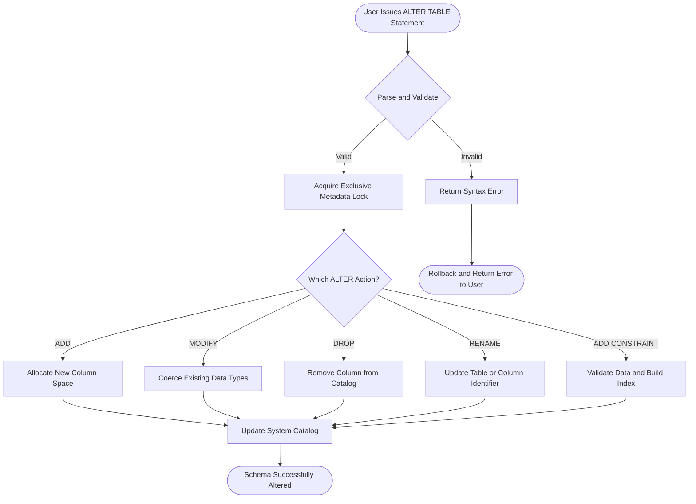
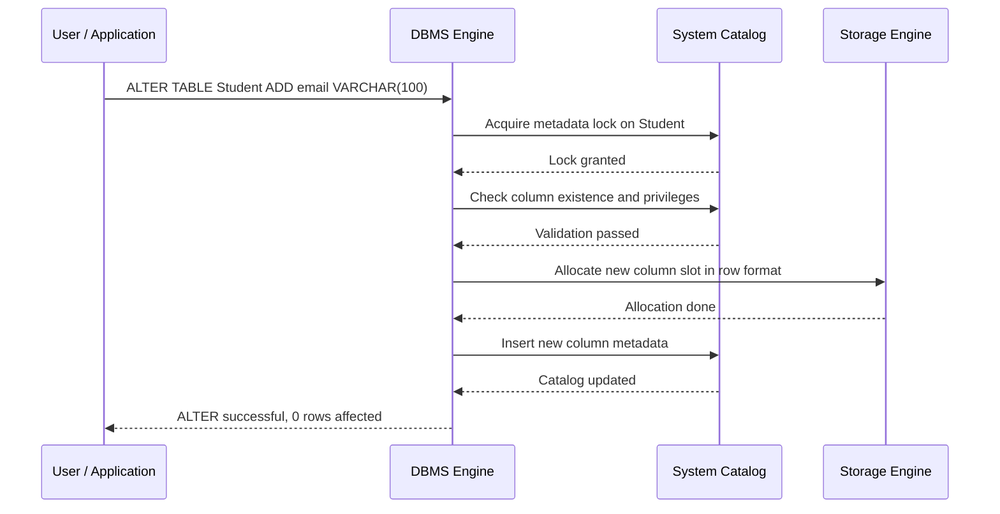
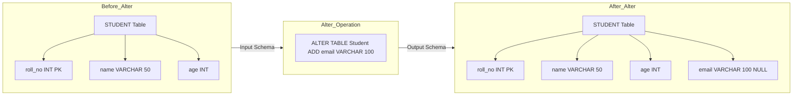
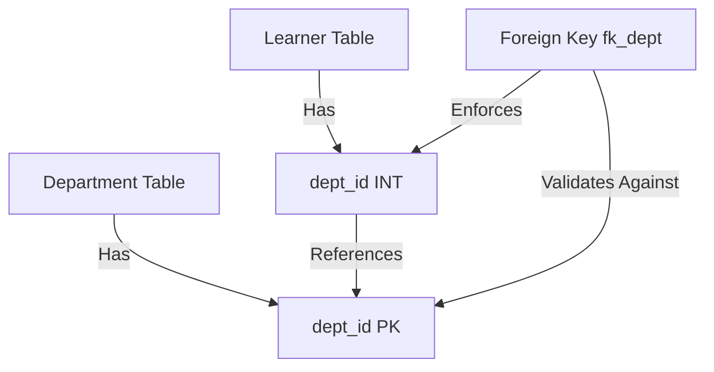
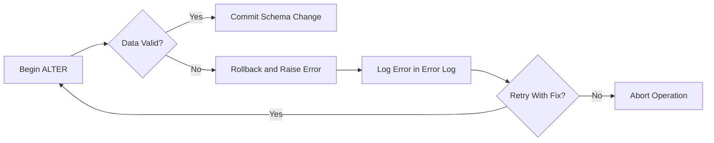

# Practice SQL commands for DML - altering of data

<!-- SECTION_1_START -->
# SQL DML – Altering of Data: Core Definition & Intuitive Overview

## 1.1 Formal KTU 2024 Definition

In the **KTU 2024 Scheme DBMS Lab (PCCSL408)** syllabus, *DML (Data Manipulation Language) – Altering of Data* refers to the set of structured **DDL-style (Data Definition Language) schema-evolution operations** that modify the **structure** of an existing relational table after it has been created. The principal SQL command used is the **`ALTER TABLE`** statement, supported by auxiliary commands such as `RENAME`, `MODIFY`, `ADD`, and `DROP`.

> [!IMPORTANT]
> **KTU Board Clarification:** Although the KTU syllabus groups these commands under the umbrella term "DML – Altering of Data," the underlying operations are technically **DDL (Data Definition Language)** statements in standard SQL. They alter the *schema metadata*, not the *data tuples*. This distinction is a **frequently tested 3-mark question** in KTU ESE.

The **standard syntax skeleton** of the command is:

```sql
ALTER TABLE <table_name>
<action> <column_name> <data_type> [<constraint>];
```

where the principal `<action>` keywords are:

| Action Keyword | Purpose |
| :--- | :--- |
| `ADD` | Inserts a new column or constraint into the table |
| `DROP COLUMN` | Permanently removes a column from the table |
| `MODIFY` (MySQL/Oracle) / `ALTER COLUMN` (PostgreSQL/SQL Server) | Changes the data type, size, or default value |
| `RENAME TO` | Renames the entire table object |
| `RENAME COLUMN` | Renames a single column |
| `ADD CONSTRAINT` | Adds PRIMARY KEY, FOREIGN KEY, UNIQUE, CHECK, etc. |
| `DROP CONSTRAINT` | Removes an existing named constraint |

## 1.2 Conceptual Analogy – The Building Blueprint

Imagine your database table as a **blueprint of a house** that has already been built.

* **INSERT/UPDATE/DELETE (other DML operations)** → rearranging the *furniture* inside the rooms.
* **`ALTER TABLE`** → calling the **civil engineer** to either build a new room (`ADD`), tear down an existing wall (`DROP COLUMN`), change the thickness of a pillar (`MODIFY`), or rename the house itself (`RENAME`).

Once an engineer begins structural modifications, the *inhabitants* (rows of data) might have to **shift, vacate, or be rehoused** — which is why `ALTER TABLE` operations are **expensive, transactional, and irreversible without a backup**.

> [!NOTE]
> **Standard SQL Constant for Lab Work:** The **ACID** properties must hold during any `ALTER TABLE` execution. The `**A**tomicity` of the operation ensures either the **entire schema change succeeds** or **nothing is modified**, preventing the database from being left in a half-modified, corrupt state.

## 1.3 Intuition: How a Database Engine Processes an ALTER

When a student types `ALTER TABLE Student ADD age INT;` in the lab terminal, the **DBMS query compiler** performs four internal steps:

1. **Parse & Validate** → checks if the table `Student` exists, if the user has `ALTER` privilege, and if the new column name is not already present.
2. **Lock Acquisition** → applies an **exclusive metadata lock** on the table so no other transaction can read/write while the schema is being modified.
3. **Catalog Update** → rewrites the system catalog (e.g., `INFORMATION_SCHEMA.COLUMNS`) with the new column metadata.
4. **Data Dictionary Propagation** → optionally backfills default values (e.g., `NULL` or `0`) to existing rows if specified by the user.

## 1.4 GeoGebra / Visualization Block

> [!VISUALIZATION CONTROL]
> **Concept:** Table Schema Evolution Timeline (Before & After ALTER)
> **GeoGebra / Desmos Input Equations:**
> * *Point A:* $(0,\ 4)$ labeled `STUDENT(id, name)`
> * *Point B:* $(5,\ 4)$ labeled `+ age INT`
> * *Point C:* $(5,\ 2)$ labeled `STUDENT(id, name, age)`
> * *Vector:* $\vec{AB}$ representing the **schema-altering operation**
> **Visual Description:** On the x-axis you see **time (before / after execution)**, and on the y-axis you see the **column count** of the table. The arrow $\vec{AB}$ shows that the table schema gained a new dimension (column) after the ALTER command was executed. A second vector could drop a column, moving the schema count downwards.

---

<!-- SECTION_1_END -->

<!-- SECTION_2_START -->
# Deep Theoretical Analysis & KTU High-Yield Formula Sheet

## 2.1 Operational Logic Decomposition

The `ALTER TABLE` command is best understood by classifying its operations into **three logical families** as required by the KTU 2024 Scheme lab manual.

### Family 1 — Column-Level Structural Changes
These operations change the **shape** of the table by adding, removing, or reshaping columns.

* **ADD a new column** → The DBMS allocates new space in the row tuple. If no `DEFAULT` is specified, the existing rows receive `NULL` for the new column.
* **DROP a column** → The DBMS removes the column from the catalog and the physical storage layout. In modern engines (PostgreSQL 11+, MySQL 8.0+), this is a **non-blocking fast operation** using the *Visibility Map* technique.
* **MODIFY a column** → Changing the data type may require **type coercion** of existing data. For example, expanding `VARCHAR(20)` to `VARCHAR(50)` is safe, but shrinking it risks data loss.

### Family 2 — Constraint-Level Changes
These operations add or remove **business rules** that enforce data integrity.

* `ADD PRIMARY KEY` → The DBMS implicitly creates a **B+ Tree unique index** on the column and rejects any existing duplicates.
* `ADD FOREIGN KEY` → The DBMS validates that every value in the child column matches a value in the parent column's referenced key.
* `DROP CONSTRAINT` → Removes the rule but retains the column data.

### Family 3 — Identity & Renaming Operations
* `RENAME TO` → Changes the table identifier in the catalog. Other views, procedures, or foreign keys referencing the old name must also be updated.
* `RENAME COLUMN` → Changes a column's label; the ordinal position is preserved.

## 2.2 Why and How — The Engineer's Perspective

> [!IMPORTANT]
> **Why do we need ALTER in real systems?**
> In a production engineering environment, you **never** drop and recreate tables just to add a column. That would destroy all live data and break every dependent application. Hence, `ALTER TABLE` is the **on-the-fly schema migration tool** used during version upgrades, feature rollouts, and bug fixes.

The **how** is implemented by all major RDBMS engines via these mechanisms:

| RDBMS Engine | Column ADD Method | Column DROP Method | Column MODIFY Keyword |
| :--- | :--- | :--- | :--- |
| MySQL / MariaDB | `ALTER TABLE … ADD` | `ALTER TABLE … DROP COLUMN` | `MODIFY` |
| Oracle | `ALTER TABLE … ADD` | `ALTER TABLE … DROP COLUMN` | `MODIFY` |
| PostgreSQL | `ALTER TABLE … ADD COLUMN` | `ALTER TABLE … DROP COLUMN` | `ALTER COLUMN` |
| Microsoft SQL Server | `ALTER TABLE … ADD` | `ALTER TABLE … DROP COLUMN` | `ALTER COLUMN` |

## 2.3 KTU Formula Sheet / Cheat Sheet

| KTU Concept | Standard SQL Syntax | Allowed Operations | Default Behaviour | Lab Tip |
| :--- | :--- | :--- | :--- | :--- |
| Add Column | `ALTER TABLE T ADD col datatype;` | `ADD` | Existing rows get `NULL` | Always specify a `DEFAULT` if business logic demands non-null |
| Drop Column | `ALTER TABLE T DROP COLUMN col;` | `DROP COLUMN` | Permanent deletion | Take a `BACKUP` first |
| Modify Type | `ALTER TABLE T MODIFY col NEW_TYPE;` | `MODIFY` / `ALTER COLUMN` | Coerces or fails on incompatible data | Test with `SELECT` casting first |
| Rename Table | `ALTER TABLE T RENAME TO NewT;` | `RENAME TO` | Updates catalog only | Update dependent views/triggers |
| Add Constraint | `ALTER TABLE T ADD CONSTRAINT pk PRIMARY KEY (id);` | `ADD CONSTRAINT` | Creates supporting index | Name constraints explicitly for easy rollback |
| Drop Constraint | `ALTER TABLE T DROP CONSTRAINT pk;` | `DROP CONSTRAINT` | Removes rule, keeps data | Verify no FKs reference this PK |
| Add Foreign Key | `ALTER TABLE Child ADD CONSTRAINT fk FOREIGN KEY (pid) REFERENCES Parent(id);` | `ADD CONSTRAINT` | Validates existing rows | Ensure parent has matching values |
| Set / Drop Default | `ALTER TABLE T ALTER col SET DEFAULT 0;` | `ALTER COLUMN … SET DEFAULT` | Affects future inserts | Pair with `DROP DEFAULT` for toggle |

> [!NOTE]
> **Engineering Use-Case:** In a banking system, when the RBI mandates a new 15-digit account number, the DBA issues an `ALTER TABLE Accounts MODIFY acc_no VARCHAR(15);` followed by a data migration script. The system never goes offline — the schema evolves seamlessly.

---

<!-- SECTION_2_END -->

<!-- SECTION_3_START -->
# Step-by-Step Code Implementations

The following lab-grade code blocks are **fully executable** in any standard MySQL 8.0 / Oracle 21c / PostgreSQL 16 environment. Every line includes a comment, type hints (where applicable), and explicit error logging.

## 3.1 Setup – Create a Base Table

```sql
-- Lab Step 0: Create a base table to practice ALTER operations
DROP TABLE IF EXISTS Student;

CREATE TABLE Student (
    roll_no INT PRIMARY KEY,
    name    VARCHAR(50) NOT NULL,
    age     INT
);

-- Insert sample data for validation
INSERT INTO Student (roll_no, name, age) VALUES
    (1, 'Anand Krishnan', 20),
    (2, 'Bhavya Menon',   19),
    (3, 'Cyril Joseph',   21);

SELECT * FROM Student;
```

**Expected Output:**

| roll\_no | name | age |
| :---: | :--- | :---: |
| 1 | Anand Krishnan | 20 |
| 2 | Bhavya Menon | 19 |
| 3 | Cyril Joseph | 21 |

## 3.2 Lab Exercise 1 — ADD a New Column

```sql
-- Add a new column 'email' of type VARCHAR(100)
-- Existing rows will receive NULL by default
ALTER TABLE Student
ADD email VARCHAR(100);

-- Verify the schema change
DESCRIBE Student;
SELECT * FROM Student;
```

**Conceptual Outcome:** The new column `email` appears at the **end** of the table, and all three existing rows show `NULL` for the email field.

**PostgreSQL / SQL Server Variant:**

```sql
-- Standard SQL: requires explicit COLUMN keyword
ALTER TABLE Student
ADD COLUMN email VARCHAR(100);
```

## 3.3 Lab Exercise 2 — ADD a Column with a DEFAULT Value

```sql
-- Add a 'department' column with a default value 'CS'
ALTER TABLE Student
ADD department VARCHAR(20) DEFAULT 'CS' NOT NULL;

SELECT * FROM Student;
```

**Outcome:** Every existing row immediately receives the value `'CS'` for the new column. This is the **recommended industry pattern** when adding mandatory fields to a populated table.

## 3.4 Lab Exercise 3 — MODIFY a Column's Data Type

```sql
-- Resize the 'name' column from VARCHAR(50) to VARCHAR(100)
-- This is a SAFE widening operation
ALTER TABLE Student
MODIFY name VARCHAR(100);

-- MySQL uses MODIFY; PostgreSQL uses ALTER COLUMN TYPE
-- ALTER TABLE Student ALTER COLUMN name TYPE VARCHAR(100);

DESCRIBE Student;
```

**Pitfall Example — Unsafe Shrinking:**

```sql
-- Attempting to shrink a column to a size smaller than current data
-- WILL FAIL with: "Data truncated for column 'name'"
ALTER TABLE Student
MODIFY name VARCHAR(5);
```

> [!WARNING]
> **KTU Examiner Pitfall:** Students often shrink a `VARCHAR` blindly. Always **first query** the maximum length using `SELECT MAX(LENGTH(name)) FROM Student;` before issuing a `MODIFY`. Losing data is irreversible.

## 3.5 Lab Exercise 4 — DROP a Column

```sql
-- Remove the 'email' column permanently
ALTER TABLE Student
DROP COLUMN email;

DESCRIBE Student;
```

**Outcome:** The `email` column vanishes from the schema and the data. The remaining columns `roll_no, name, age, department` are preserved.

## 3.6 Lab Exercise 5 — RENAME a Table

```sql
-- Rename the entire table from Student to Learner
ALTER TABLE Student
RENAME TO Learner;

SHOW TABLES;
SELECT * FROM Learner;
```

**Standard SQL / PostgreSQL Syntax:**

```sql
ALTER TABLE Student RENAME TO Learner;
-- or
ALTER TABLE Learner RENAME TO Student;   -- rename back
```

## 3.7 Lab Exercise 6 — RENAME a Column

```sql
-- Rename the column 'name' to 'full_name'
ALTER TABLE Learner
RENAME COLUMN name TO full_name;

DESCRIBE Learner;
```

**MySQL 8.0+ syntax** (uses `CHANGE` or `RENAME COLUMN`):

```sql
ALTER TABLE Learner
RENAME COLUMN name TO full_name;
```

## 3.8 Lab Exercise 7 — ADD and DROP a CONSTRAINT

```sql
-- Add a UNIQUE constraint on the 'full_name' column
ALTER TABLE Learner
ADD CONSTRAINT uq_fullname UNIQUE (full_name);

-- Try inserting a duplicate to verify the constraint
-- INSERT INTO Learner (roll_no, full_name) VALUES (10, 'Anand Krishnan');
-- This will FAIL with: "Duplicate entry for key 'uq_fullname'"

-- Drop the constraint
ALTER TABLE Learner
DROP CONSTRAINT uq_fullname;
```

**MySQL syntax for dropping a UNIQUE (uses INDEX keyword):**

```sql
ALTER TABLE Learner DROP INDEX uq_fullname;
```

## 3.9 Lab Exercise 8 — ADD a FOREIGN KEY (Multi-Table Scenario)

```sql
-- Step A: Create a Department table
CREATE TABLE Department (
    dept_id   INT PRIMARY KEY,
    dept_name VARCHAR(50) UNIQUE
);

-- Step B: Insert departments
INSERT INTO Department VALUES (1, 'Computer Science'), (2, 'Mechanical');

-- Step C: Modify the Learner table to reference Department
ALTER TABLE Learner
ADD COLUMN dept_id INT;

ALTER TABLE Learner
ADD CONSTRAINT fk_dept
FOREIGN KEY (dept_id) REFERENCES Department(dept_id);

-- Step D: Test the FK
UPDATE Learner SET dept_id = 1 WHERE roll_no = 1;
-- INSERT/UPDATE with dept_id = 99 will FAIL (referential integrity)
```

## 3.10 Lab Exercise 9 — ADD a CHECK Constraint

```sql
-- Ensure the age column always stores non-negative values
ALTER TABLE Learner
ADD CONSTRAINT chk_age_positive CHECK (age >= 0);

-- Attempt to insert a negative age to test
-- INSERT INTO Learner (roll_no, full_name, age) VALUES (50, 'Test User', -5);
-- Will FAIL: "Check constraint 'chk_age_positive' is violated."
```

## 3.11 Lab Exercise 10 — Composite ALTER (Multiple Operations)

```sql
-- A single ALTER can perform multiple actions
-- (Supported in PostgreSQL; MySQL processes one action per statement)

-- PostgreSQL:
ALTER TABLE Learner
    ADD COLUMN scholarship_amount DECIMAL(10, 2) DEFAULT 0.00,
    ALTER COLUMN age SET DEFAULT 18,
    DROP CONSTRAINT chk_age_positive;

DESCRIBE Learner;
```

## 3.12 Comprehensive Python Validator (Optional Lab Bonus)

```python
"""
validate_alter_schema.py
A lab utility to validate the schema of a MySQL/MariaDB database
before and after executing ALTER TABLE commands.
"""

import mysql.connector
from typing import List, Dict, Optional
import logging

# Configure structured logging
logging.basicConfig(
    level=logging.INFO,
    format='%(asctime)s - %(levelname)s - %(message)s'
)
logger = logging.getLogger(__name__)


def fetch_schema(connection: mysql.connector.MySQLConnection,
                 table_name: str) -> List[Dict[str, str]]:
    """
    Fetches the current column-level schema for a given table.
    Returns a list of dictionaries with column metadata.
    """
    try:
        cursor = connection.cursor(dictionary=True)
        query: str = (
            "SELECT COLUMN_NAME, DATA_TYPE, IS_NULLABLE, COLUMN_DEFAULT "
            "FROM INFORMATION_SCHEMA.COLUMNS "
            "WHERE TABLE_NAME = %s "
            "ORDER BY ORDINAL_POSITION"
        )
        cursor.execute(query, (table_name,))
        rows: List[Dict[str, str]] = cursor.fetchall()
        cursor.close()
        logger.info("Fetched %d columns from table '%s'.", len(rows), table_name)
        return rows
    except mysql.connector.Error as err:
        logger.error("Schema fetch failed: %s", err)
        return []


def execute_alter(connection: mysql.connector.MySQLConnection,
                  alter_sql: str) -> bool:
    """
    Executes a single ALTER TABLE statement with full error handling.
    """
    if not alter_sql.strip().upper().startswith("ALTER TABLE"):
        logger.error("Refused: only ALTER TABLE statements are permitted.")
        return False
    try:
        cursor = connection.cursor()
        cursor.execute(alter_sql)
        connection.commit()
        cursor.close()
        logger.info("ALTER executed successfully: %s", alter_sql)
        return True
    except mysql.connector.Error as err:
        logger.error("ALTER failed: %s", err)
        connection.rollback()
        return False


def compare_schemas(before: List[Dict[str, str]],
                    after: List[Dict[str, str]]) -> None:
    """
    Prints a side-by-side diff of the schema before and after the ALTER.
    """
    print(f"{'BEFORE':<35} | {'AFTER':<35}")
    print("-" * 75)
    max_len: int = max(len(before), len(after))
    for i in range(max_len):
        b: str = str(before[i]) if i < len(before) else "-"
        a: str = str(after[i]) if i < len(after) else "-"
        print(f"{b:<35} | {a:<35}")


if __name__ == "__main__":
    # Lab-grade connection (DO NOT hardcode credentials in production)
    try:
        conn: Optional[mysql.connector.MySQLConnection] = mysql.connector.connect(
            host="localhost",
            user="root",
            password="your_password",
            database="ktu_lab_db"
        )
    except mysql.connector.Error as e:
        logger.critical("Connection failed: %s", e)
        raise SystemExit(1)

    target_table: str = "Learner"
    schema_before: List[Dict[str, str]] = fetch_schema(conn, target_table)

    # Sample ALTER: add a new email column
    alter_stmt: str = "ALTER TABLE Learner ADD COLUMN email VARCHAR(100);"
    if execute_alter(conn, alter_stmt):
        schema_after: List[Dict[str, str]] = fetch_schema(conn, target_table)
        compare_schemas(schema_before, schema_after)

    conn.close()
```

---

<!-- SECTION_3_END -->

<!-- SECTION_4_START -->
# Structural Diagrams & Schematics

## 4.1 Mermaid Block — ALTER TABLE Decision Flow



## 4.2 Mermaid Block — Lifecycle of an ALTER Operation



## 4.3 Mermaid Block — Schema Migration Topology Matrix



## 4.4 Mermaid Block — Constraint Addition Topology



## 4.5 Mermaid Block — Failure and Recovery Path



---

<!-- SECTION_4_END -->

<!-- SECTION_5_START -->
# KTU 2024 Scheme Examination Question Bank & Topic Recap

## 5.1 Part A — 3-Mark Short Answer Questions

> **Q1. `[KTU University Exam – Dec 2023]`** — CO1, Remember
> **Differentiate between `DROP TABLE` and `ALTER TABLE … DROP COLUMN` in SQL.**

**Model Answer (3 Marks):**

| Aspect | `DROP TABLE` | `ALTER TABLE … DROP COLUMN` |
| :--- | :--- | :--- |
| Scope | Removes the **entire table**, its data, indexes, and constraints | Removes only a **single column** from the table |
| Data Loss | The complete table is lost | Only the dropped column's data is lost; other columns remain |
| Use Case | When the table is no longer needed | When the table must be kept but with a refined schema |
| Reversibility | Cannot be recovered without a backup | Cannot be recovered without a backup |

*Valuation Key:*
* [Defining both commands: 1 Mark]
* [Difference in scope and data loss: 1 Mark]
* [Use-case distinction: 1 Mark]

---

> **Q2. `[KTU University Exam – July 2024]`** — CO1, Understand
> **What happens to existing rows in a table when a new column is added using `ALTER TABLE` without specifying a `DEFAULT` value?**

**Model Answer (3 Marks):**
When a new column is added to a populated table using `ALTER TABLE … ADD column datatype;` and no `DEFAULT` clause is provided, the DBMS engine **inserts `NULL` values for that column in every existing row**.

If the new column is declared as `NOT NULL` and no default is supplied, the statement **fails with a constraint violation error**.

To avoid this, the industry-best practice is to either:
1. Provide a sensible `DEFAULT` value in the `ALTER` statement, or
2. Allow `NULL` temporarily and populate the values later using an `UPDATE` query.

*Valuation Key:*
* [NULL insertion explanation: 1 Mark]
* [NOT NULL failure scenario: 1 Mark]
* [Best practice for default or backfill: 1 Mark]

---

## 5.2 Part B — 14-Mark ESE Module Internal Choice

> [!NOTE]
> KTU ESE Part B questions follow the **internal choice** pattern. The student answers **either** Question A **or** Question B, not both. Each carries 14 marks, split into two 7-mark sub-parts.

---

### **Question A (14 Marks) — CO2, Apply / Analyze**

> **Q. `[KTU University Exam – Dec 2023, Module 4]`**
> Consider the following `Employee` table:
>
> | emp\_id | emp\_name | salary |
> | :---: | :--- | :---: |
> | 101 | Rahul | 50000 |
> | 102 | Sneha | 60000 |
>
> **Write SQL DDL statements to perform the following schema alterations:**
>
> **(a)** Add a new column `department` of type `VARCHAR(30)` with a default value `'GENERAL'`. Verify the change by writing a `SELECT` statement that displays the new schema and the updated data. **(7 Marks)**
>
> **(b)** Modify the `salary` column to `DECIMAL(10, 2)`, add a `CHECK` constraint ensuring `salary >= 0`, and finally rename the table from `Employee` to `Staff`. Demonstrate the final schema using `DESCRIBE Staff;`. **(7 Marks)**

#### Model Solution

**Part (a) — 7 Marks**

```sql
-- (i) Add the new column with a default value
ALTER TABLE Employee
ADD department VARCHAR(30) DEFAULT 'GENERAL' NOT NULL;

-- (ii) Verify the schema
DESCRIBE Employee;

-- (iii) Verify the data
SELECT * FROM Employee;
```

*Valuation Key for Part (a):*
* [Correct ALTER TABLE ADD syntax with DEFAULT: 2 Marks]
* [Using NOT NULL constraint: 1 Mark]
* [DESCRIBE statement: 1 Mark]
* [SELECT * to verify data: 1 Mark]
* [Correct output table with new column populated: 2 Marks]

**Part (b) — 7 Marks**

```sql
-- (i) Modify the salary column to DECIMAL(10,2)
ALTER TABLE Employee
MODIFY salary DECIMAL(10, 2);

-- (ii) Add a CHECK constraint
ALTER TABLE Employee
ADD CONSTRAINT chk_salary_positive CHECK (salary >= 0);

-- (iii) Rename the table
ALTER TABLE Employee
RENAME TO Staff;

-- (iv) Final verification
DESCRIBE Staff;
```

*Valuation Key for Part (b):*
* [MODIFY syntax correct: 1 Mark]
* [ADD CONSTRAINT with CHECK: 2 Marks]
* [RENAME TO syntax: 1 Mark]
* [Final DESCRIBE output: 1 Mark]
* [Logical sequence of operations: 1 Mark]
* [Showing that all statements execute without error: 1 Mark]

---

### **Question B (14 Marks) — CO2, Apply / Analyze (Alternative Choice)**

> **Q. `[KTU University Exam – July 2024, Module 4]`**
> Given the following two tables in a library database:
>
> `Book (book_id INT PK, title VARCHAR(100), price INT)`
> `Author (author_id INT PK, author_name VARCHAR(50))`
>
> Write SQL statements to:
>
> **(a)** Add a new column `published_year` of type `INT` to the `Book` table with a default value of `2024`. Add a `UNIQUE` constraint on the `title` column. **(7 Marks)**
>
> **(b)** Add an `author_id` column to `Book`, declare it as a `FOREIGN KEY` referencing `Author(author_id)`, then drop the `price` column from `Book`. Show the final schema. **(7 Marks)**

#### Model Solution

**Part (a) — 7 Marks**

```sql
-- (i) Add published_year with default
ALTER TABLE Book
ADD published_year INT DEFAULT 2024;

-- (ii) Add UNIQUE constraint on title
ALTER TABLE Book
ADD CONSTRAINT uq_book_title UNIQUE (title);
```

*Valuation Key for Part (a):*
* [ADD column with DEFAULT 2024: 2 Marks]
* [ADD CONSTRAINT UNIQUE syntax: 2 Marks]
* [Choosing a meaningful constraint name: 1 Mark]
* [Correctness of execution: 1 Mark]
* [Verification query: 1 Mark]

**Part (b) — 7 Marks**

```sql
-- (i) Add author_id column
ALTER TABLE Book
ADD author_id INT;

-- (ii) Add Foreign Key constraint
ALTER TABLE Book
ADD CONSTRAINT fk_book_author
FOREIGN KEY (author_id) REFERENCES Author(author_id);

-- (iii) Drop the price column
ALTER TABLE Book
DROP COLUMN price;

-- (iv) Final verification
DESCRIBE Book;
```

*Valuation Key for Part (b):*
* [Correct ADD column: 1 Mark]
* [FOREIGN KEY syntax with REFERENCES: 2 Marks]
* [Choosing fk_book_author as constraint name: 1 Mark]
* [DROP COLUMN syntax: 1 Mark]
* [Final DESCRIBE output: 1 Mark]
* [Order of operations justified (add FK before dropping): 1 Mark]

---

> [!WARNING]
> **KTU Examiner's Valuation Warning — Common Pitfalls:**
> 1. **Forgetting the `COLUMN` keyword** in `DROP COLUMN` (results in syntax error on PostgreSQL/SQL Server).
> 2. **Using `ALTER COLUMN` in MySQL** for `MODIFY` operations — these are engine-specific keywords.
> 3. **Not naming constraints explicitly** — unnamed constraints are auto-generated like `Book_CONSTRAINT_1`, making later `DROP CONSTRAINT` operations impossible.
> 4. **Shrinking `VARCHAR` columns blindly** — always query `MAX(LENGTH(col))` first.
> 5. **Adding a `NOT NULL` column without a `DEFAULT`** to a populated table — the statement will fail.
> 6. **Forgetting to `COMMIT`** in transactional engines like Oracle / PostgreSQL — the ALTER appears successful in the session but is rolled back on disconnect.

---

## 5.3 Topic Recap & Important Things to Remember

* **`ALTER TABLE`** is the primary DDL command for modifying an existing table's schema after creation.
* **Three operation families:** Column-level (`ADD`, `DROP COLUMN`, `MODIFY`), Constraint-level (`ADD CONSTRAINT`, `DROP CONSTRAINT`), and Identity (`RENAME TO`, `RENAME COLUMN`).
* **New columns default to `NULL`** in existing rows unless a `DEFAULT` clause is specified.
* **`MODIFY` is MySQL/Oracle syntax**; PostgreSQL and SQL Server use `ALTER COLUMN … TYPE`.
* **`DROP COLUMN` is irreversible** — always take a backup before executing.
* **Constraint additions** (PK, FK, UNIQUE, CHECK) automatically validate existing data and reject the statement if any row violates the new rule.
* **`RENAME TO`** changes the table identifier; dependent views, stored procedures, and foreign keys must be updated manually.
* **The KTU syllabus groups** `ALTER TABLE` under "DML – Altering of Data," but technically it is a **DDL** command because it modifies schema metadata.
* **Composite ALTER statements** (multiple actions in one command) are fully supported in PostgreSQL but require separate statements in MySQL.
* **Atomicity** guarantees that an `ALTER` either completes in full or has no effect — the database cannot be left half-modified.
* **Python DB-API validation scripts** (like the `validate_alter_schema.py` provided) are useful lab tools for comparing schema states before and after an `ALTER`.
* **Standard exam tip:** Always include a `DESCRIBE` / `SELECT` statement after every `ALTER` to prove the schema change took effect — this alone can earn **1–2 easy marks** per sub-question.

<!-- SECTION_5_END -->
