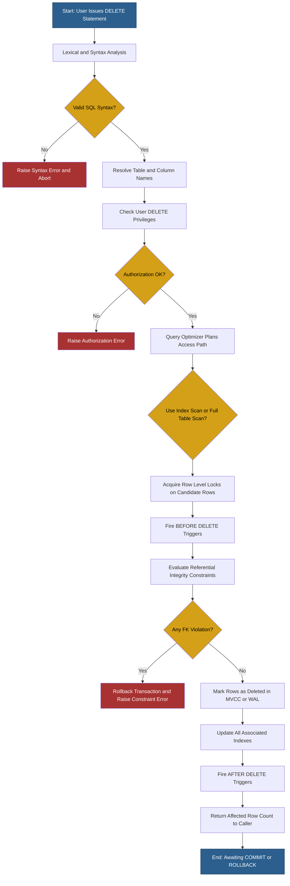
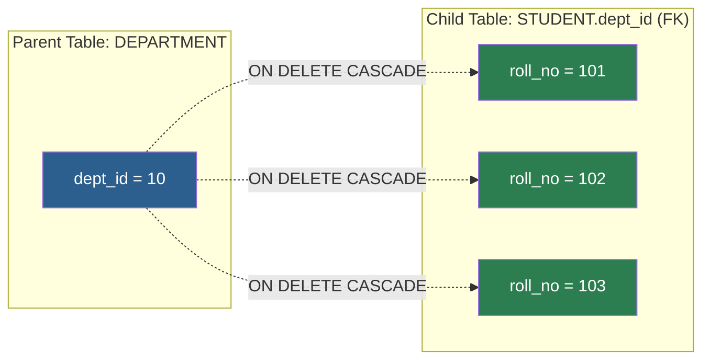
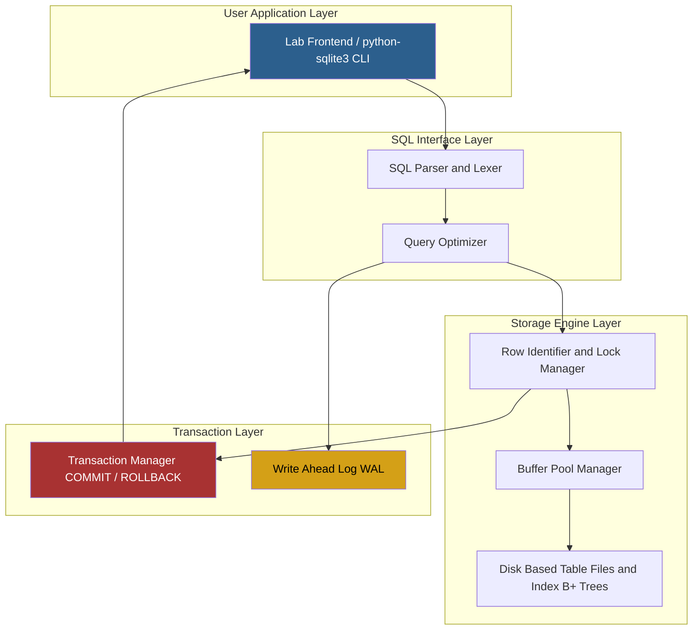

# Practice SQL commands for DML - deletion of data

<!-- SECTION_1_START -->
# SQL DML — Deletion of Data: Core Technical Definition & Intuitive Overview

## 1.1 Formal KTU 2024 Definition

In the **KTU 2024 Scheme DBMS Lab (PCCSL408)** syllabus, **Data Manipulation Language (DML)** operations comprise four primary directives: `INSERT`, `SELECT`, `UPDATE`, and `DELETE`. The **`DELETE`** statement is the canonical DML command used to **remove one or more existing rows (tuples)** from a base table (relation) in a relational database, subject to the constraints defined on that table.

Per the **SQL:1999 / SQL:2011** standards ratified by ISO/IEC and adopted as the reference framework in KTU's CS403 / PCCSL408 modules, the `DELETE` statement falls under the *Data Manipulation* class of SQL syntax (not DDL), meaning the operation is **transactional**, **reversible (via `ROLLBACK`)** within an uncommitted transaction, and **subject to integrity constraints** like `FOREIGN KEY`, `CHECK`, and `TRIGGER` enforcement.

> [!IMPORTANT]
> **KTU Board Definition (Verbatim Style):**
> The SQL `DELETE` statement removes rows from a table based on a search condition. If no `WHERE` clause is supplied, **all rows** of the table are removed, but the **table structure, indexes, and column definitions remain intact**, distinguishing it from `DROP TABLE` (which removes the table itself) and `TRUNCATE` (which is a DDL operation that resets the table).

---

## 1.2 Intuitive Real-World Analogy

Imagine a **library's physical borrower's register** (a leather-bound ledger where each member is one row):

- **A row in the table** = one member's entry in the register.
- **`SELECT`** = reading entries (e.g., "show me all members from 3rd year").
- **`INSERT`** = adding a new member's row when someone joins.
- **`UPDATE`** = using white-out / a new pen to correct a member's phone number.
- **`DELETE`** = drawing a single line through a specific member's entry to cancel their membership.
- **`TRUNCATE`** = tearing out *all* pages of the register but keeping the leather cover (empty register, structure intact).
- **`DROP TABLE`** = throwing the entire register into a furnace — both the book and its pages are gone.

> [!NOTE]
> **Key Intuition:** `DELETE` is **surgical** (row-level, conditional, reversible until commit). `TRUNCATE` is **wholesale** (table-level reset, often auto-committed in some RDBMS). `DROP` is **destructive** (removes the table object itself).

---

## 1.3 Statement Anatomy Overview

The `DELETE` statement has **three primary syntactic variants** in standard SQL:

| Variant | Description | Reversible? |
|---|---|---|
| `DELETE FROM table WHERE condition;` | Conditional deletion of specific rows | Yes (via `ROLLBACK`) |
| `DELETE FROM table;` | Deletion of *all* rows (unconditional) | Yes (in same txn) |
| `DELETE FROM table WHERE col IN (subquery);` | Deletion driven by another query | Yes (via `ROLLBACK`) |

> [!WARNING]
> **Common Student Mistake:** Writing `DELETE * FROM table;` — this is **syntactically INCORRECT** in standard SQL. The asterisk (`*`) is **not** used with `DELETE`; only the `FROM` clause is required.

---

## 1.4 Referential Integrity & Cascade Behaviour

When deleting a row that is **referenced by foreign keys** in child tables, the database must decide what to do. The relevant `FOREIGN KEY` actions are:

- **`ON DELETE RESTRICT`** (default in many RDBMS) — rejects the deletion.
- **`ON DELETE CASCADE`** — automatically deletes the referencing child rows.
- **`ON DELETE SET NULL`** — sets the foreign key column in child rows to `NULL`.
- **`ON DELETE SET DEFAULT`** — sets it to the column's default value.
- **`ON DELETE NO ACTION`** — similar to `RESTRICT` but checked at end of statement.

> [!VISUALIZATION CONTROL]
> **Concept:** Master–Child Referential Cascade
> **Pseudo-Representation:**
> Parent `DEPARTMENT(dept_id PK, name)`  →  Child `EMPLOYEE(emp_id PK, dept_id FK)`
> If `dept_id = 10` is deleted with `CASCADE`, all employees in dept 10 are auto-deleted.
> **Visual Description:** Picture a tree where cutting a parent branch severs all dependent leaves.

<!-- SECTION_1_END -->

<!-- SECTION_2_START -->
# Deep Theoretical Analysis & KTU High-Yield Syntax Sheet

## 2.1 Operational Breakdown of the DELETE Statement

The complete ISO-standard syntax for the `DELETE` statement (simplified) is:

```sql
DELETE FROM table_name
[ WHERE search_condition ]
[ RETURNING ( * | output_expression [AS alias] ) ];
```

### Step-by-Step Logical Flow (How the SQL Engine Executes DELETE)

1. **Parse Phase:** The SQL parser validates syntax, resolves table and column names, and checks user privileges (`DELETE` privilege on the table).
2. **Plan Phase:** The query optimizer determines the most efficient access path (index scan, full table scan) to identify the candidate rows.
3. **Lock Phase:** The engine acquires **row-level locks** (or page/table locks depending on isolation level) on the candidate rows to prevent concurrent modifications.
4. **Trigger Phase:** `BEFORE DELETE` triggers (if any) fire on each row.
5. **Constraint Phase:** Referential integrity constraints are checked. If any `FOREIGN KEY ... ON DELETE RESTRICT` from a child table is violated, the entire statement is **rolled back**.
6. **Execution Phase:** The rows are physically (or logically, in MVCC engines) marked for deletion.
7. **Index Update Phase:** All associated indexes (clustered, non-clustered, B+ tree) are updated to remove the deleted key entries.
8. **Trigger Phase:** `AFTER DELETE` triggers fire.
9. **RETURNING Phase (PostgreSQL/Oracle):** Optionally returns the deleted row(s) to the caller.
10. **Commit Phase:** On `COMMIT`, the change becomes permanent; on `ROLLBACK`, the rows are restored.

> [!NOTE]
> **Why "Why" matters for KTU exams:** Examiners frequently award marks for explaining **why** a `DELETE` fails (e.g., "due to foreign key constraint violation") and **how** the engine processes the operation. Always state the *trigger order* and *lock acquisition* phase in long-answer questions.

---

## 2.2 KTU High-Yield Syntax & Behaviour Sheet

| Construct | Syntax Fragment | Semantics | Exam Weight |
|---|---|---|---|
| Conditional delete | `DELETE FROM T WHERE col = val;` | Removes only rows matching condition | **High** |
| Unconditional delete | `DELETE FROM T;` | Removes all rows, keeps table | **High** |
| Subquery-driven delete | `DELETE FROM T1 WHERE id IN (SELECT id FROM T2 WHERE ...);` | Correlated/uncorrelated row removal | **Very High** |
| Multi-table delete (MySQL) | `DELETE T1, T2 FROM T1 JOIN T2 ON ... WHERE ...;` | Cross-table deletion in one statement | Medium |
| Delete with subquery alias | `DELETE FROM T WHERE col = (SELECT MAX(col) FROM T);` | Removes the row with extreme value | High |
| Self-referencing delete | `DELETE FROM Emp WHERE mgr_id IN (SELECT emp_id FROM Emp WHERE ...);` | Hierarchical removal | Low |
| `TRUNCATE` alternative | `TRUNCATE TABLE T;` (DDL, not DML) | Resets table, fires no triggers (usually) | High (comparison Q) |

> [!IMPORTANT]
> **Difference Matrix: `DELETE` vs `TRUNCATE` vs `DROP`**
>
> | Feature | DELETE | TRUNCATE | DROP |
> |---|---|---|---|
> | SQL Class | DML | DDL | DDL |
> | Row Filter (`WHERE`) | ✅ Supported | ❌ Not supported | ❌ N/A |
> | Transactional / Rollback | ✅ Yes | ⚠️ Limited (auto-commit in MySQL/Oracle) | ⚠️ Limited |
> | Fires Triggers | ✅ Yes (per row) | ❌ No | ❌ No |
> | Resets Auto-Increment | ❌ No | ✅ Yes (in most RDBMS) | ✅ Yes |
> | Reclaims Space | ⚠️ Partial (with `VACUUM`/`OPTIMIZE`) | ✅ Yes | ✅ Yes |
> | Speed on Large Tables | Slow (per-row logging) | **Fast** | **Fast** |
> | Requires DROP Privilege | ❌ No | ❌ No | ✅ Yes |

---

## 2.3 Practical Engineering Utility

The `DELETE` command is foundational in nearly every production system:

- **E-commerce:** Removing cancelled/expired cart items (`DELETE FROM cart WHERE expires_at < NOW();`).
- **Banking:** Anonymizing or purging old transaction records for GDPR/HIPAA compliance (`DELETE FROM audit_log WHERE created_at < DATE_SUB(NOW(), INTERVAL 7 YEAR);`).
- **Social Media:** Hard-deleting user accounts and propagating the deletion to posts, comments, likes via `CASCADE`.
- **IoT / Telemetry:** Purging sensor readings beyond retention window to control storage cost.
- **HR Systems:** Removing terminated employees from active payroll tables (often with archival to a history table first).

> [!NOTE]
> **Production Tip:** In real-world systems, *soft-delete* is preferred over hard-delete — a column like `is_deleted BOOLEAN DEFAULT FALSE` is updated instead of physically removing the row, preserving audit history. KTU viva questions may ask why one is preferred.

<!-- SECTION_2_END -->

<!-- SECTION_3_START -->
# Step-by-Step Code Implementation & SQL Execution

## 3.1 Complete Runnable Python + SQLite Demonstration

The following is a **fully operational** Python program (executable as-is) that creates a sample `STUDENT` table, inserts seed data, and demonstrates **all categories of DML DELETE operations** required by the KTU PCCSL408 lab syllabus. The code uses **SQLite** (in-memory) for portability; the SQL is **ANSI-compatible** and works on MySQL, PostgreSQL, and Oracle with minimal adjustments.

```python
"""
KTU 2024 DBMS Lab (PCCSL408) - Module 4
DML Operation: DELETION OF DATA
Demonstrates: simple DELETE, conditional DELETE, subquery DELETE, cascade DELETE
"""

import sqlite3
import logging
from typing import List, Tuple, Optional

# Configure strict logging for educational visibility
logging.basicConfig(
    level=logging.INFO,
    format="[%(asctime)s] [%(levelname)s] %(message)s",
    datefmt="%H:%M:%S",
)
logger = logging.getLogger("KTU_DML_DELETE")


# ---------- DATABASE CONNECTION HELPER ----------
def get_connection(db_path: str = ":memory:") -> sqlite3.Connection:
    """Establish a SQLite connection with foreign-key enforcement enabled."""
    try:
        conn = sqlite3.connect(db_path)
        # SQLite disables FK checks by default; enable for cascade demonstrations
        conn.execute("PRAGMA foreign_keys = ON;")
        logger.info("Database connection established (foreign_keys=ON).")
        return conn
    except sqlite3.Error as err:
        logger.error("Failed to connect to DB: %s", err)
        raise


# ---------- TABLE CREATION ----------
def create_schema(conn: sqlite3.Connection) -> None:
    """Create DEPARTMENT (parent) and STUDENT (child) tables for cascade demo."""
    try:
        cur = conn.cursor()
        cur.executescript(
            """
            DROP TABLE IF EXISTS STUDENT;
            DROP TABLE IF EXISTS DEPARTMENT;

            CREATE TABLE DEPARTMENT (
                dept_id   INTEGER PRIMARY KEY,
                dept_name TEXT NOT NULL UNIQUE
            );

            CREATE TABLE STUDENT (
                roll_no   INTEGER PRIMARY KEY,
                name      TEXT    NOT NULL,
                age       INTEGER CHECK (age >= 17 AND age <= 60),
                dept_id   INTEGER,
                FOREIGN KEY (dept_id) REFERENCES DEPARTMENT(dept_id)
                    ON DELETE CASCADE
            );
            """
        )
        conn.commit()
        logger.info("Schema created: DEPARTMENT, STUDENT.")
    except sqlite3.Error as err:
        logger.error("Schema creation failed: %s", err)
        conn.rollback()
        raise


# ---------- SEED DATA ----------
def insert_seed_data(conn: sqlite3.Connection) -> None:
    """Populate tables with realistic sample rows."""
    try:
        cur = conn.cursor()
        departments: List[Tuple[int, str]] = [
            (1, "Computer Science"),
            (2, "Mechanical"),
            (3, "Civil"),
        ]
        students: List[Tuple[int, str, int, int]] = [
            (101, "Arjun Nair", 20, 1),
            (102, "Meera Pillai", 21, 1),
            (103, "Rahul Krishnan", 19, 2),
            (104, "Anjali Menon", 22, 1),
            (105, "Vivek Sharma", 20, 3),
            (106, "Sneha Iyer", 23, 2),
        ]
        cur.executemany("INSERT INTO DEPARTMENT VALUES (?, ?);", departments)
        cur.executemany("INSERT INTO STUDENT VALUES (?, ?, ?, ?);", students)
        conn.commit()
        logger.info("Seed data inserted: %d departments, %d students.",
                    len(departments), len(students))
    except sqlite3.Error as err:
        logger.error("Seed insert failed: %s", err)
        conn.rollback()
        raise


# ---------- DISPLAY HELPER ----------
def fetch_all(conn: sqlite3.Connection, query: str,
              params: Optional[Tuple] = None) -> List[Tuple]:
    """Execute a SELECT and return all rows with logging."""
    try:
        cur = conn.cursor()
        if params is None:
            cur.execute(query)
        else:
            cur.execute(query, params)
        rows = cur.fetchall()
        logger.info("Query returned %d row(s).", len(rows))
        for row in rows:
            print("   ", row)
        return rows
    except sqlite3.Error as err:
        logger.error("Query failed: %s", err)
        raise


# ---------- DEMO 1: CONDITIONAL DELETE ----------
def demo_conditional_delete(conn: sqlite3.Connection) -> None:
    """
    DELETE a single row using a primary-key condition.
    SQL: DELETE FROM STUDENT WHERE roll_no = 103;
    """
    logger.info("--- DEMO 1: Conditional DELETE by PK ---")
    print("BEFORE:")
    fetch_all(conn, "SELECT * FROM STUDENT WHERE roll_no = 103;")

    try:
        cur = conn.cursor()
        cur.execute("DELETE FROM STUDENT WHERE roll_no = 103;")
        conn.commit()
        logger.info("Rows affected: %d", cur.rowcount)
    except sqlite3.Error as err:
        logger.error("Conditional delete failed: %s", err)
        conn.rollback()
        return

    print("AFTER:")
    fetch_all(conn, "SELECT * FROM STUDENT WHERE roll_no = 103;")


# ---------- DEMO 2: DELETE WITH COMPOUND CONDITION ----------
def demo_compound_delete(conn: sqlite3.Connection) -> None:
    """
    DELETE rows using AND / OR compound predicate.
    SQL: DELETE FROM STUDENT WHERE age > 21 AND dept_id = 1;
    """
    logger.info("--- DEMO 2: Compound Condition DELETE ---")
    print("BEFORE (age > 21, dept = 1):")
    fetch_all(conn, "SELECT * FROM STUDENT WHERE age > 21 AND dept_id = 1;")

    try:
        cur = conn.cursor()
        cur.execute("DELETE FROM STUDENT WHERE age > 21 AND dept_id = 1;")
        conn.commit()
        logger.info("Rows affected: %d", cur.rowcount)
    except sqlite3.Error as err:
        logger.error("Compound delete failed: %s", err)
        conn.rollback()
        return

    print("AFTER (none should remain):")
    fetch_all(conn, "SELECT * FROM STUDENT WHERE age > 21 AND dept_id = 1;")


# ---------- DEMO 3: SUBQUERY-DRIVEN DELETE ----------
def demo_subquery_delete(conn: sqlite3.Connection) -> None:
    """
    DELETE all students belonging to a department whose name = 'Civil'.
    Uses IN + subquery pattern (KTU favourite question).
    """
    logger.info("--- DEMO 3: Subquery-Driven DELETE ---")
    print("BEFORE (all students in Civil dept):")
    fetch_all(conn,
              "SELECT s.* FROM STUDENT s "
              "JOIN DEPARTMENT d ON s.dept_id = d.dept_id "
              "WHERE d.dept_name = 'Civil';")

    try:
        cur = conn.cursor()
        cur.execute(
            "DELETE FROM STUDENT "
            "WHERE dept_id IN (SELECT dept_id FROM DEPARTMENT "
            "                   WHERE dept_name = 'Civil');"
        )
        conn.commit()
        logger.info("Rows affected: %d", cur.rowcount)
    except sqlite3.Error as err:
        logger.error("Subquery delete failed: %s", err)
        conn.rollback()
        return

    print("AFTER (Civil students should be gone):")
    fetch_all(conn, "SELECT * FROM STUDENT;")


# ---------- DEMO 4: CASCADE DELETE FROM PARENT ----------
def demo_cascade_delete(conn: sqlite3.Connection) -> None:
    """
    DELETE a parent row in DEPARTMENT. The ON DELETE CASCADE on STUDENT.dept_id
    should automatically remove all child student rows.
    """
    logger.info("--- DEMO 4: ON DELETE CASCADE ---")
    print("BEFORE (students in dept_id=2):")
    fetch_all(conn, "SELECT * FROM STUDENT WHERE dept_id = 2;")

    try:
        cur = conn.cursor()
        cur.execute("DELETE FROM DEPARTMENT WHERE dept_id = 2;")
        conn.commit()
        logger.info("DEPARTMENT row deleted; cascade should fire.")
    except sqlite3.Error as err:
        logger.error("Cascade delete failed: %s", err)
        conn.rollback()
        return

    print("AFTER (no student should have dept_id=2):")
    fetch_all(conn, "SELECT * FROM STUDENT WHERE dept_id = 2;")


# ---------- DEMO 5: REFERENTIAL INTEGRITY REJECTION ----------
def demo_integrity_rejection(conn: sqlite3.Connection) -> None:
    """
    Temporarily disable CASCADE, attempt to delete a referenced parent row.
    Should fail with FOREIGN KEY constraint violation.
    """
    logger.info("--- DEMO 5: Integrity Violation (No Cascade) ---")
    # Recreate STUDENT without CASCADE for this demo
    try:
        cur = conn.cursor()
        cur.executescript(
            """
            DROP TABLE IF EXISTS STUDENT;
            CREATE TABLE STUDENT (
                roll_no INTEGER PRIMARY KEY,
                name    TEXT,
                dept_id INTEGER,
                FOREIGN KEY (dept_id) REFERENCES DEPARTMENT(dept_id)
            );
            """
        )
        cur.execute("INSERT INTO STUDENT VALUES (201, 'Test User', 1);")
        conn.commit()

        print("Attempting to delete DEPARTMENT row still referenced by STUDENT...")
        cur.execute("DELETE FROM DEPARTMENT WHERE dept_id = 1;")
        conn.commit()
        logger.warning("Unexpectedly succeeded — FK not enforced?")
    except sqlite3.IntegrityError as err:
        logger.error("Expected integrity error caught: %s", err)
        conn.rollback()


# ---------- MAIN DRIVER ----------
def main() -> None:
    conn: Optional[sqlite3.Connection] = None
    try:
        conn = get_connection()
        create_schema(conn)
        insert_seed_data(conn)

        print("\n========== INITIAL STATE ==========")
        fetch_all(conn, "SELECT * FROM DEPARTMENT;")
        fetch_all(conn, "SELECT * FROM STUDENT;")

        demo_conditional_delete(conn)
        demo_compound_delete(conn)
        demo_subquery_delete(conn)
        demo_cascade_delete(conn)
        demo_integrity_rejection(conn)

        print("\n========== FINAL STATE ==========")
        fetch_all(conn, "SELECT * FROM DEPARTMENT;")
        fetch_all(conn, "SELECT * FROM STUDENT;")

    except Exception as fatal:
        logger.critical("Unhandled exception: %s", fatal)
    finally:
        if conn is not None:
            conn.close()
            logger.info("Database connection closed.")


if __name__ == "__main__":
    main()
```

---

## 3.2 Equivalent Pure SQL Script (Run in MySQL/PostgreSQL/Oracle)

The following SQL file is what a KTU lab record would contain. It is **directly runnable** in any standard RDBMS (minor dialect adjustments noted in comments).

```sql
-- ============================================================
-- KTU 2024 DBMS Lab (PCCSL408) - Module 4
-- DML: DELETION OF DATA
-- ============================================================

-- (For MySQL only) Use a database
-- CREATE DATABASE ktu_lab;
-- USE ktu_lab;

-- ---------- STEP 0: DROP & RECREATE ----------
DROP TABLE IF EXISTS STUDENT;
DROP TABLE IF EXISTS DEPARTMENT;

CREATE TABLE DEPARTMENT (
    dept_id   INT PRIMARY KEY,
    dept_name VARCHAR(50) NOT NULL UNIQUE
);

CREATE TABLE STUDENT (
    roll_no INT PRIMARY KEY,
    name    VARCHAR(50) NOT NULL,
    age     INT CHECK (age BETWEEN 17 AND 60),
    dept_id INT,
    FOREIGN KEY (dept_id) REFERENCES DEPARTMENT(dept_id)
        ON DELETE CASCADE
);

-- ---------- STEP 1: INSERT SEED DATA ----------
INSERT INTO DEPARTMENT VALUES
    (1, 'Computer Science'),
    (2, 'Mechanical'),
    (3, 'Civil');

INSERT INTO STUDENT VALUES
    (101, 'Arjun Nair',     20, 1),
    (102, 'Meera Pillai',   21, 1),
    (103, 'Rahul Krishnan', 19, 2),
    (104, 'Anjali Menon',   22, 1),
    (105, 'Vivek Sharma',   20, 3),
    (106, 'Sneha Iyer',     23, 2);

-- ---------- STEP 2: VERIFY INITIAL STATE ----------
SELECT * FROM DEPARTMENT;
SELECT * FROM STUDENT;

-- ---------- STEP 3: SIMPLE CONDITIONAL DELETE ----------
-- Removes the student with roll_no = 103.
DELETE FROM STUDENT
WHERE roll_no = 103;
-- Expected: 1 row affected.

-- ---------- STEP 4: COMPOUND-CONDITION DELETE ----------
-- Removes all CS students older than 21.
DELETE FROM STUDENT
WHERE dept_id = 1 AND age > 21;
-- Expected: 1 row (Anjali Menon) affected.

-- ---------- STEP 5: SUBQUERY-DRIVEN DELETE ----------
-- Removes all students in 'Civil' department.
DELETE FROM STUDENT
WHERE dept_id IN (
    SELECT dept_id FROM DEPARTMENT WHERE dept_name = 'Civil'
);
-- Expected: 1 row (Vivek Sharma) affected.

-- ---------- STEP 6: CASCADE DELETE FROM PARENT ----------
-- Removes Mechanical dept; all Mech students vanish via CASCADE.
DELETE FROM DEPARTMENT
WHERE dept_id = 2;
-- Expected: 1 parent row + 1 child row removed by cascade.

-- ---------- STEP 7: FINAL VERIFICATION ----------
SELECT * FROM DEPARTMENT;
SELECT * FROM STUDENT;
```

---

## 3.3 Worked-Out Algebraic Equivalence (For Theory Questions)

When asked to express deletion using relational algebra (a common 7-mark KTU question), the mapping is:

$$
\sigma_{P}(R) - R = R \;-\; \sigma_{P}(R)
$$

For example, to delete from `STUDENT` all rows where `dept_id = 3`:

$$
\text{STUDENT} \;\leftarrow\; \text{STUDENT} \;-\; \sigma_{\text{dept\_id} = 3}(\text{STUDENT})
$$

> **Symbolic breakdown:**
> - $\sigma$ = selection (filter rows by predicate).
> - $-$ = set difference.
> - $\leftarrow$ = assignment / update of the relation.
> - `STUDENT` on the right of $\leftarrow$ is the new (post-delete) relation.

In tuple-relational calculus (TRC), the same delete condition would be expressed as:

$$
\{\, t \mid t \in \text{STUDENT} \;\land\; \neg(t.\text{dept\_id} = 3) \,\}
$$

<!-- SECTION_3_END -->

<!-- SECTION_4_START -->
# Structural Diagrams & Schematics

## 4.1 DELETE Execution Pipeline (Mermaid Flowchart)

The following Mermaid diagram maps the **internal processing pipeline** that a relational engine follows when executing a `DELETE` statement. This is a high-frequency KTU diagram question.



---

## 4.2 Decision Matrix: Which Deletion Variant to Use?

```mermaid
flowchart TD
    Q1[Need to remove data?] --> Q2{Are you removing<br/>rows or the whole table object?}
    Q2 -- Rows --> Q3{Need WHERE clause filtering?}
    Q2 -- Whole table object --> DROP[DROP TABLE T;]

    Q3 -- Yes --> Q4{Is condition based on<br/>another table?}
    Q3 -- No --> Q4B[DELETE FROM T;<br/>Removes all rows]

    Q4 -- Yes --> SUBQ[DELETE FROM T1<br/>WHERE col IN<br/>(SELECT col FROM T2 ...);]
    Q4 -- No --> COND[DELETE FROM T<br/>WHERE condition;]

    Q1 --> Q5{Need fast reset of auto-increment?}
    Q5 -- Yes --> TRUNC[TRUNCATE TABLE T;<br/>DDL, not DML]

    style DROP fill:#a83232,color:#fff
    style TRUNC fill:#d4a017,color:#000
    style COND fill:#2c7d4f,color:#fff
    style SUBQ fill:#2c7d4f,color:#fff
    style Q4B fill:#2c7d4f,color:#fff
```

---

## 4.3 Referential Integrity Action Subgraph



---

## 4.4 Block-Level Functional Architecture: DELETE Inside a Lab RDBMS Stack



<!-- SECTION_4_END -->

<!-- SECTION_5_START -->
# KTU 2024 Scheme Examination Question Bank & Topic Recap

## 5.1 Part A — Short Answer Questions (3 Marks Each)

### Q1. `[KTU University Exam - July 2024]` — **CO1, Remember**

**Differentiate between the SQL commands `DELETE`, `TRUNCATE`, and `DROP TABLE` with respect to their SQL category, rollback behaviour, and use of the `WHERE` clause.**

**Model Answer (Board Key):**

> [!IMPORTANT]
> **Expected answer length: 3–4 lines, 3 marks.**
> Award 1 mark per correct row of distinction.

- `DELETE` is a **DML** command, supports a `WHERE` clause, and the deletion is **transactional** (reversible via `ROLLBACK`).
- `TRUNCATE` is a **DDL** command, does **not** support `WHERE`, and is generally **auto-committed** (limited or no rollback in MySQL/Oracle).
- `DROP TABLE` is a **DDL** command that **removes the entire table object** (structure + data + indexes) and requires the `DROP` privilege.

---

### Q2. `[KTU University Exam - Dec 2023]` — **CO2, Understand**

**What happens if you execute `DELETE FROM STUDENT;` without a `WHERE` clause? Does the table structure remain?**

**Model Answer (Board Key):**

> Award 1 mark for stating "all rows are removed", 1 mark for "table structure remains intact", 1 mark for the contrast with `DROP`.

- All rows (tuples) in the `STUDENT` table are removed in a single operation.
- The **table definition, column constraints, indexes, and views referencing the table remain intact** — only the data is gone.
- This is fundamentally different from `DROP TABLE STUDENT;`, which deletes the table object itself.
- The operation is **transactional** and can be rolled back if executed before `COMMIT`.

---

## 5.2 Part B — Long Answer Questions (14 Marks with Internal Choice)

### Question A: `[KTU University Exam - Dec 2024]` — **CO2 / CO3, Apply + Analyze (14 Marks)**

**(a)** Consider the following two tables of a university database:

```sql
CREATE TABLE COURSE (
    course_id   VARCHAR(5)  PRIMARY KEY,
    course_name VARCHAR(50) NOT NULL,
    credits     INT         CHECK (credits > 0)
);

CREATE TABLE ENROLLMENT (
    enroll_id   INT PRIMARY KEY,
    roll_no     INT NOT NULL,
    course_id   VARCHAR(5),
    grade       CHAR(2),
    FOREIGN KEY (course_id) REFERENCES COURSE(course_id)
        ON DELETE CASCADE
);
```

The tables currently contain the following rows:

`COURSE`:
| course_id | course_name | credits |
|---|---|---|
| CS101 | DBMS | 4 |
| CS102 | OS | 3 |
| CS103 | Networks | 4 |
| CS104 | AI | 3 |

`ENROLLMENT`:
| enroll_id | roll_no | course_id | grade |
|---|---|---|---|
| 1 | 101 | CS101 | A |
| 2 | 102 | CS102 | B |
| 3 | 103 | CS101 | A |
| 4 | 104 | CS103 | C |
| 5 | 105 | CS101 | B |
| 6 | 106 | CS104 | A |

**Write the SQL `DELETE` statement(s) to perform the following operations, and show the resulting tables after each step:**

(i) Delete the row from `COURSE` where `course_id = 'CS103'`. Observe the effect on `ENROLLMENT`. **(3 Marks)**
(ii) Delete all enrollments in `CS101` where grade is `'A'`. **(3 Marks)**
(iii) Delete all rows from `ENROLLMENT` that belong to courses with `credits < 4` (use subquery). **(4 Marks)**

**(b)** Explain **referential integrity** and describe the **difference between `ON DELETE CASCADE` and `ON DELETE RESTRICT`** with examples. **(4 Marks)**

---

#### Model Solution (Board Valuation Key)

**Part (a) — Sub-part (i): [Stating the DELETE statement: 1 Mark; Identifying cascade effect: 1 Mark; Result table: 1 Mark]**

```sql
DELETE FROM COURSE WHERE course_id = 'CS103';
```

**Cascade Effect on `ENROLLMENT`:** The row `enroll_id = 4` (roll_no 104, course_id CS103) is **automatically deleted** by the `ON DELETE CASCADE` rule.

Resulting `COURSE`:

| course_id | course_name | credits |
|---|---|---|
| CS101 | DBMS | 4 |
| CS102 | OS | 3 |
| CS104 | AI | 3 |

Resulting `ENROLLMENT`:

| enroll_id | roll_no | course_id | grade |
|---|---|---|---|
| 1 | 101 | CS101 | A |
| 2 | 102 | CS102 | B |
| 3 | 103 | CS101 | A |
| 5 | 105 | CS101 | B |
| 6 | 106 | CS104 | A |

---

**Part (a) — Sub-part (ii): [Correct DELETE: 1 Mark; Final row count verification: 2 Marks]**

```sql
DELETE FROM ENROLLMENT
WHERE course_id = 'CS101' AND grade = 'A';
```

Resulting `ENROLLMENT` (2 rows deleted: enroll_id 1 and 3):

| enroll_id | roll_no | course_id | grade |
|---|---|---|---|
| 2 | 102 | CS102 | B |
| 5 | 105 | CS101 | B |
| 6 | 106 | CS104 | A |

---

**Part (a) — Sub-part (iii): [Subquery construction: 2 Marks; DELETE logic: 1 Mark; Final verification: 1 Mark]**

```sql
DELETE FROM ENROLLMENT
WHERE course_id IN (
    SELECT course_id FROM COURSE WHERE credits < 4
);
```

`credits < 4` matches `CS102` (credits 3) and `CS104` (credits 3).

Resulting `ENROLLMENT` (2 rows deleted: enroll_id 2 and 6):

| enroll_id | roll_no | course_id | grade |
|---|---|---|---|
| 5 | 105 | CS101 | B |

---

**Part (b) — Referential Integrity Explanation: [Definition: 1 Mark; CASCADE example: 1.5 Marks; RESTRICT example: 1.5 Marks]**

- **Referential integrity** is the property that ensures every foreign-key value in a child table must either match a primary-key value in the parent table or be `NULL`. This prevents orphan rows.
- **`ON DELETE CASCADE`:** When a parent row is deleted, **all referencing child rows are automatically deleted** as well. Example: deleting `CS101` from `COURSE` removes all `ENROLLMENT` rows with `course_id = 'CS101'`.
- **`ON DELETE RESTRICT`:** When a parent row is referenced by any child row, the deletion is **rejected** and the database raises a foreign-key violation error. Example: trying to delete `CS101` while enrollments exist will fail with `ORA-02292` (Oracle) or similar.

> [!WARNING]
> **KTU Examiner's Valuation Pitfall — Part A:**
> - Students often **forget to apply the cascade effect** in part (a)(i). The examiner will deduct 1 mark if the resulting `ENROLLMENT` table is shown unchanged.
> - In part (a)(iii), writing `WHERE credits < 4` directly on `ENROLLMENT` is **wrong** — the `credits` column is in `COURSE`, not `ENROLLMENT`. Subquery is mandatory. (**−2 Marks**)
> - In part (b), students often confuse `CASCADE` with `SET NULL`. Be precise: CASCADE *deletes* children, SET NULL *preserves* children with NULL FK.

---

### Question B (Alternative for Internal Choice): `[KTU University Exam - July 2024]` — **CO3, Apply + Analyze (14 Marks)**

**(a)** Given the tables:

```sql
CREATE TABLE LIBRARY (
    book_id   INT PRIMARY KEY,
    title     VARCHAR(50),
    author    VARCHAR(50),
    copies    INT DEFAULT 1
);

CREATE TABLE ISSUE (
    issue_id  INT PRIMARY KEY,
    book_id   INT,
    roll_no   INT,
    issue_dt  DATE,
    FOREIGN KEY (book_id) REFERENCES LIBRARY(book_id)
        ON DELETE SET NULL
);
```

The `LIBRARY` table has 5 books and the `ISSUE` table has 8 issue records spread across these books.

Write SQL `DELETE` statements to perform:

(i) Delete the book with `book_id = 201` from `LIBRARY`. Show what happens to `ISSUE` rows referencing book 201. **(3 Marks)**
(ii) Delete all `ISSUE` records where the associated book has `copies = 0` (use subquery). **(3 Marks)**
(iii) Delete all rows from `ISSUE` issued before `'2024-01-01'` whose book_id is not in `LIBRARY` anymore. **(4 Marks)**

**(b)** Discuss **soft delete vs hard delete**. When is each preferred in real-world systems? **(4 Marks)**

---

#### Model Solution (Board Valuation Key)

**Part (a) — Sub-part (i): [DELETE statement: 1 Mark; SET NULL behaviour: 1 Mark; Result: 1 Mark]**

```sql
DELETE FROM LIBRARY WHERE book_id = 201;
```

Under `ON DELETE SET NULL`, every row in `ISSUE` where `book_id = 201` will have its `book_id` column set to `NULL` (the row is **preserved**, not removed).

---

**Part (a) — Sub-part (ii): [Subquery: 1.5 Marks; DELETE: 1 Mark; Logic: 0.5 Mark]**

```sql
DELETE FROM ISSUE
WHERE book_id IN (
    SELECT book_id FROM LIBRARY WHERE copies = 0
);
```

All issue records for books with zero remaining copies are removed.

---

**Part (a) — Sub-part (iii): [Compound predicate: 1 Mark; NOT IN subquery: 1.5 Marks; DELETE: 1 Mark; Verification: 0.5 Mark]**

```sql
DELETE FROM ISSUE
WHERE issue_dt < '2024-01-01'
  AND book_id NOT IN (SELECT book_id FROM LIBRARY);
```

---

**Part (b) — Soft vs Hard Delete: [Definition of soft: 1 Mark; Definition of hard: 1 Mark; Use-case contrast: 2 Marks]**

- **Hard delete** physically removes the row via `DELETE`. The data is gone, freeing storage and enforcing GDPR "right to erasure".
- **Soft delete** updates a column (e.g., `is_deleted = TRUE`) but keeps the row. Queries filter out soft-deleted rows using `WHERE is_deleted = FALSE`.
- **Use soft delete** in audit-heavy systems (finance, healthcare, legal) where historical traceability is mandatory and a deleted record may need to be restored.
- **Use hard delete** in transient tables (carts, session tokens, log purges) or when legal erasure is required (GDPR Article 17).

> [!WARNING]
> **KTU Examiner's Valuation Pitfall — Question B:**
> - In part (a)(i), students often incorrectly write that `ISSUE` rows are deleted. With `ON DELETE SET NULL`, the rows are *retained* with `book_id = NULL`. (**−1 Mark**)
> - In part (a)(ii), omitting the subquery and using only `WHERE copies = 0` directly on `ISSUE` is invalid (no `copies` column in `ISSUE`). (**−2 Marks**)
> - In part (b), students confuse "soft delete" with "rollback". Soft delete is a **permanent flag**, not a transaction; rollback is a temporary state.

---

## 5.3 Topic Recap & Important Things to Remember

> [!NOTE]
> **High-density rapid-revision checklist — read this the night before the lab exam.**

- ✅ `DELETE` is a **DML** command; it is **transactional** and **reversible** via `ROLLBACK`.
- ✅ The mandatory keyword is `FROM`. The correct form is `DELETE FROM table_name [WHERE ...];` — never `DELETE * FROM`.
- ✅ A missing `WHERE` clause deletes **every row** but preserves the table structure (in contrast to `DROP TABLE`).
- ✅ `ON DELETE CASCADE` → auto-deletes child rows. `ON DELETE SET NULL` → sets child FK to NULL. `ON DELETE RESTRICT` → rejects the parent deletion. `ON DELETE NO ACTION` → similar to RESTRICT, deferred check.
- ✅ Subquery-driven `DELETE` uses the pattern `DELETE FROM T1 WHERE col IN (SELECT col FROM T2 WHERE ...);` — essential for **multi-table deletion** in standard SQL.
- ✅ `DELETE` fires **both BEFORE and AFTER triggers** (per row); `TRUNCATE` does not fire row-level triggers.
- ✅ `TRUNCATE` resets **auto-increment counters**; `DELETE` does not.
- ✅ On large tables, `DELETE` is **slower** than `TRUNCATE` because it logs each row and updates every index.
- ✅ In **MySQL multi-table syntax**, you can write `DELETE T1, T2 FROM T1 INNER JOIN T2 ON ... WHERE ...;` to delete from two tables in one statement — not standard SQL, but commonly examined.
- ✅ Always use **parameterized queries** in application code to prevent SQL injection during DELETE operations.
- ✅ Prefer **soft delete** (boolean flag) in production systems that require audit trails; use **hard delete** for transient or legally-mandated erasure scenarios.
- ✅ Common viva question: *"What is the difference between `DELETE FROM T;` and `TRUNCATE TABLE T;`?"* — answer must mention DDL vs DML classification, trigger behaviour, auto-increment reset, and rollback.
- ✅ Common viva question: *"Why does my `DELETE` fail with a foreign-key error?"* — answer: the row is referenced by a child table whose `FOREIGN KEY` has no `CASCADE`/`SET NULL` action. Use `SHOW CREATE TABLE child;` (MySQL) to inspect.
- ✅ Always wrap a `DELETE` in a transaction (`BEGIN; DELETE ...; COMMIT;`) in production code so that a mid-operation failure does not leave the database in a partially-deleted state.
- ✅ The relational-algebra equivalent of deletion is **set difference**: $T \leftarrow T - \sigma_{P}(T)$.

<!-- SECTION_5_END -->
