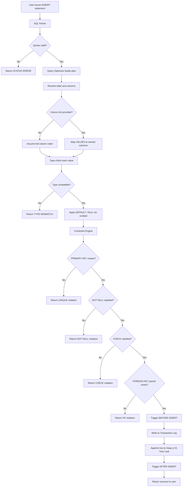
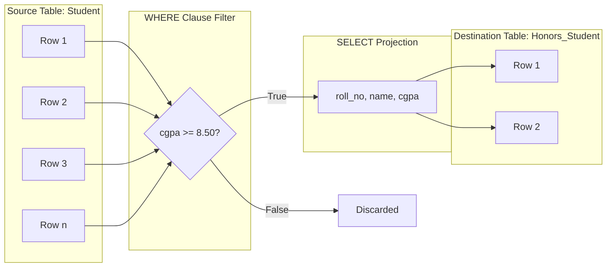
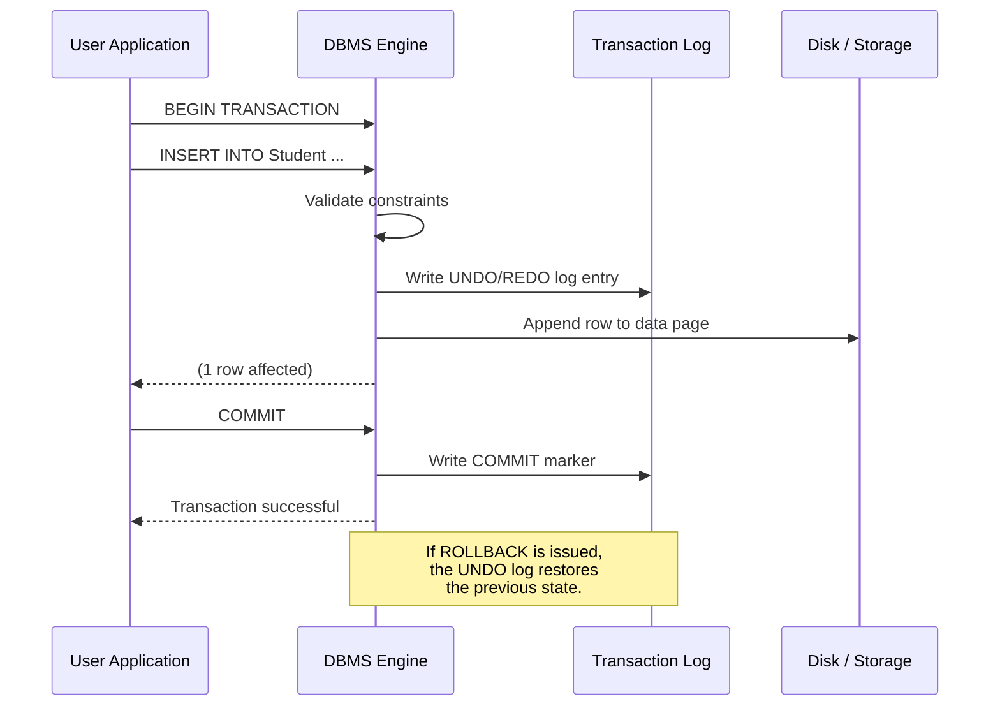
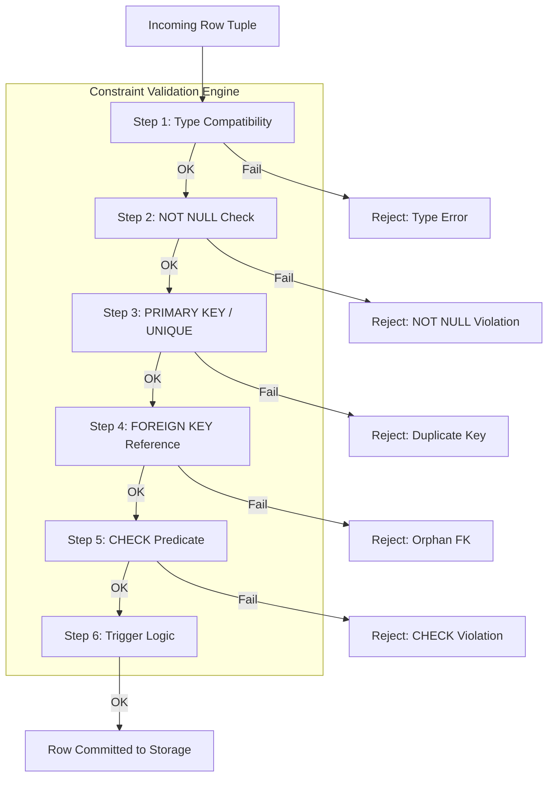

# Practice SQL commands for DML - insertion of data

<!-- SECTION_1_START -->
# Module 4: SQL DML — Insertion of Data

> [!NOTE]
> **KTU 2024 Scheme | DBMS Lab (PCCSL408) | Module 4**
> **Topic Focus:** Practising SQL `INSERT` commands for populating relational tables.
> **Aligned Course Outcomes:** CO4 — *Implement DDL, DML, DCL, and TCL commands in SQL to manage relational database objects.*

## 1. Core Technical Definition

### What is DML?
**Data Manipulation Language (DML)** is the subset of SQL statements used to **retrieve, insert, update, and delete** data stored inside the database objects (tables). Unlike DDL, DML commands operate on the **data rows (tuples)**, not on the schema.

> [!IMPORTANT]
> **Core DML Commands in KTU Syllabus:**
> 1. `SELECT` — Retrieve rows
> 2. `INSERT` — Add new rows
> 3. `UPDATE` — Modify existing rows
> 4. `DELETE` — Remove rows
>
> DML operations are **transactional** — they obey the ACID properties when executed inside an explicit `COMMIT` / `ROLLBACK` block.

### What is the `INSERT` Command?
The SQL **`INSERT INTO`** statement is the canonical DML command used to **add one or more new rows (tuples) into an existing table**. The target table must already exist (created via DDL `CREATE TABLE`), and all inserted values must satisfy the **column constraints** (data type, `NOT NULL`, `UNIQUE`, `CHECK`, `DEFAULT`, and `FOREIGN KEY`).

> [!DEFINITION]
> **Formal Definition (KTU 2024 Glossary):**
> "`INSERT` is a Data Manipulation Language statement that appends one or more records to a table by supplying values either in a positional order, by naming target columns, via a `SELECT` subquery, or by combining column lists with multi-row `VALUES` lists."

## 2. Intuitive Overview — The "Filling a Form" Analogy

Think of a database table as a **pre-printed paper form**:

| Form Element | Database Equivalent |
|--------------|---------------------|
| The blank form layout | `CREATE TABLE` (DDL) |
| Each empty cell | A column of a specific type |
| Each filled form you submit | A **row (tuple)** being inserted |
| The "Tick if not applicable" boxes | `NULL` values |
| Auto-filled "Today's Date" | `DEFAULT` values |
| The pile of submitted forms | The **table data** |

When you `INSERT`, you are simply **submitting one new completed form** into the pile. The librarian (DBMS engine) checks that:
- You have not left a mandatory field blank (constraint check).
- You have written text in the text box, a number in the number box (type check).
- You have not already submitted a form with the same unique ID (uniqueness check).

> [!TIP]
> **Memory Hook:** "**I**nsert means **I**nject a new row" — the table grows vertically, one row at a time (or in bulk).

## 3. Classification of INSERT Operations

The `INSERT` command has **four standard patterns** recognized by the KTU 2024 DBMS Lab syllabus:

| # | Pattern Name | Syntax Trigger | Use Case |
|---|--------------|----------------|----------|
| 1 | **Positional Single-Row Insert** | `INSERT INTO t VALUES (...);` | Quick full-row insertion when you know every column. |
| 2 | **Column-Specified Single-Row Insert** | `INSERT INTO t (c1, c2) VALUES (...);` | Partial inserts, skipping `NULL` / `DEFAULT` columns. |
| 3 | **Multi-Row Insert** | `INSERT INTO t (c1, c2) VALUES (...), (...);` | Bulk loading of multiple tuples in a single statement. |
| 4 | **Insert from Subquery (SELECT)** | `INSERT INTO t SELECT ... FROM other;` | Copying/transforming data from another table. |

> [!VISUALIZATION CONTROL]
> **Concept:** Visualizing how a row is appended to a table.
> **GeoGebra / Desmos Input Equations (conceptual grid):**
> * Rows represented as $R_1, R_2, R_3, \ldots, R_{n+1}$ where $R_{n+1}$ is the newly inserted row.
> * Columns as $C_1, C_2, C_3, C_4$ forming a 2D matrix $T$.
> **Visual Description:** Imagine an empty grid expanding downward by exactly one new row whenever an `INSERT` is committed.
<!-- SECTION_1_END -->

<!-- SECTION_2_START -->
# Deep Theoretical Analysis — Anatomy of the `INSERT` Statement

## 1. The Canonical Syntax (ISO/ANSI SQL)

```sql
INSERT INTO <table_name> 
    [ ( <column_list> ) ]
{ VALUES ( { <value> | DEFAULT | NULL } [ , ...n ] ) 
  | <SELECT_statement> 
  | DEFAULT VALUES 
};
```

### Component Breakdown

| Component | Purpose | Optional? |
|-----------|---------|-----------|
| `INSERT INTO <table_name>` | Identifies the target table. | **Required** |
| `( <column_list> )` | Restricts the insert to specific columns. | Optional (defaults to *all* columns) |
| `VALUES (...)` | Provides literal data for one row. | Required *unless* using `SELECT` |
| `<SELECT_statement>` | Supplies rows from a query. | Alternative to `VALUES` |
| `DEFAULT VALUES` | Inserts a single row where every column takes its `DEFAULT` (or `NULL`). | Optional alternative |
| `DEFAULT` keyword inside `VALUES` | Inserts the default value of that specific column. | Optional |

## 2. The Four INSERT Patterns — Detailed Mechanics

### Pattern 1 — Positional Single-Row Insert
The values must be supplied **in the exact same order** in which the columns were originally declared in the `CREATE TABLE` statement. Any omission forces the engine to assume a `NULL` (or fail with a constraint error if the column is `NOT NULL`).

```sql
INSERT INTO Student VALUES (101, 'Anand', 'CSE', 8.45);
```

**Validation Pipeline (in order):**
1. **Column Count Match** — number of values $=$ number of declared columns.
2. **Type Compatibility** — each value coerces to its target column type.
3. **Constraint Check** — `PRIMARY KEY`, `FOREIGN KEY`, `CHECK`, `NOT NULL` enforced.
4. **Trigger Execution** — `BEFORE INSERT` / `AFTER INSERT` triggers fire.
5. **Logging** — entry written to the transaction log for rollback safety.

### Pattern 2 — Column-Specified Single-Row Insert
The safest and **most recommended** form in KTU lab evaluations. You explicitly name the columns you are providing; the omitted ones receive their `DEFAULT` value or `NULL`.

```sql
INSERT INTO Student (roll_no, name, cgpa) 
VALUES (102, 'Bhavana', 9.10);
```

> [!TIP]
> **Why prefer this pattern?**
> * It is **resilient to schema changes** — if a new column is added to the table later, this statement will still execute without modification.
> * It is **self-documenting** — a reader knows exactly which value goes where.

### Pattern 3 — Multi-Row Insert
A single `INSERT` can append **multiple tuples** by separating row-value groups with commas. This is far more efficient than issuing $n$ single-row inserts because the engine performs **one parse, one parse-tree validation, and one transaction-log flush**.

```sql
INSERT INTO Student (roll_no, name, dept, cgpa) VALUES
    (103, 'Chitra',  'CSE',  7.80),
    (104, 'Deepak',  'ECE',  8.20),
    (105, 'Esha',    'Mech', 9.00);
```

**Row Inserted Equation:** If a single-row insert adds 1 tuple, an $n$-row insert adds $n$ tuples in one operation:

$$T_{\text{after}} = T_{\text{before}} \cup \{ R_1, R_2, \dots, R_n \}$$

### Pattern 4 — Insert from a Subquery (Bulk Copy / Migration)
Used heavily in real-world data warehousing and ETL pipelines. The schema of the `SELECT` must match the column list of the target table.

```sql
INSERT INTO Student_HonorList (roll_no, name, cgpa)
SELECT roll_no, name, cgpa
FROM   Student
WHERE  cgpa >= 9.00;
```

The number of inserted rows is **dynamic** and depends on the cardinality of the subquery. If the subquery returns 0 rows, the insert still succeeds but inserts nothing.

### Pattern 5 — `DEFAULT VALUES` Clause
A specialized syntax to insert a row where every column is filled with its declared default:

```sql
INSERT INTO Audit_Log DEFAULT VALUES;
```

## 3. Implicit vs Explicit Column Specification — Comparison

| Property | Positional (No Column List) | Column-Specified |
|----------|------------------------------|--------------------|
| Resilience to `ALTER TABLE` | **Brittle** — breaks if new column added | **Robust** — unaffected by new columns |
| Verbosity | Concise | More verbose |
| Readability | Lower | Higher |
| Error Proneness | Higher (easy to misalign values) | Lower |
| KTU Best Practice | Avoid in lab exams | **Use this** |

## 4. KTU High-Yield Formula / Syntax Cheat Sheet

| # | Operation | Exact SQL Syntax | Notes |
|---|-----------|-------------------|-------|
| 1 | Insert all columns (positional) | `INSERT INTO T VALUES (v1, v2, ...);` | Column count must match |
| 2 | Insert specific columns | `INSERT INTO T (c1, c2) VALUES (v1, v2);` | Omitted columns use `DEFAULT` / `NULL` |
| 3 | Insert multiple rows | `INSERT INTO T (c1) VALUES (v1), (v2), (v3);` | Comma-separated row tuples |
| 4 | Insert using `SELECT` | `INSERT INTO T1 SELECT * FROM T2 WHERE cond;` | Subquery drives row count |
| 5 | Insert `DEFAULT` value | `INSERT INTO T (c1) VALUES (DEFAULT);` | Inserts column's default |
| 6 | Insert fully defaulted row | `INSERT INTO T DEFAULT VALUES;` | One row, all defaults |
| 7 | Insert with explicit `NULL` | `INSERT INTO T (c1, c2) VALUES (5, NULL);` | Forces NULL even if `DEFAULT` exists |

## 5. Constraint Failure Reference Table

| Constraint Violated | Typical Error Message | Common KTU Mistake |
|---------------------|------------------------|---------------------|
| `PRIMARY KEY` duplicate | *"Violation of PRIMARY KEY constraint"* | Re-using an existing `roll_no` |
| `FOREIGN KEY` mismatch | *"The INSERT statement conflicted with the FOREIGN KEY constraint"* | Inserting child before parent |
| `NOT NULL` violation | *"Cannot insert the value NULL into column 'x'"* | Omitting a mandatory column |
| `CHECK` violation | *"The INSERT statement conflicted with the CHECK constraint"* | E.g., `cgpa < 0` or `cgpa > 10` |
| Type mismatch | *"Conversion failed when converting the varchar to data type int"* | Quoting numbers as strings |
| String truncation | *"String or binary data would be truncated"* | Exceeding `VARCHAR(n)` length |

## 6. Real-World Engineering Utility

> [!IMPORTANT]
> **Why does this matter in industry?**
> * **Banking Systems** — every new account opening runs an `INSERT INTO Accounts`.
> * **E-Commerce** — order placement triggers an `INSERT INTO Orders` + bulk `INSERT INTO OrderItems` (Pattern 3).
> * **Data Migration / ETL** — `INSERT ... SELECT` is the workhorse of nightly data warehouse loads.
> * **IoT & Telemetry** — sensor readings are batch-inserted every few seconds (Pattern 3 or 4).
> * **Audit Trails** — `INSERT INTO AuditLog DEFAULT VALUES` is used to timestamp each user action.

The `INSERT` is therefore the **most frequently executed DML statement** in any production OLTP system.
<!-- SECTION_2_END -->

<!-- SECTION_3_START -->
# Step-by-Step Implementation — Code, Tables, and Walks-Throughs

## 1. Setup — Reference Schema (University Examination Scenario)

We will use a canonical student-course schema across all examples. This mirrors the type of schema KTU 2024 expects in lab record submissions.

```sql
-- 1. Parent table: Department
CREATE TABLE Department (
    dept_id     INT          PRIMARY KEY,
    dept_name   VARCHAR(50)  NOT NULL UNIQUE,
    hod_name    VARCHAR(50)  DEFAULT 'TBA'
);

-- 2. Parent table: Course
CREATE TABLE Course (
    course_id   VARCHAR(10)  PRIMARY KEY,
    course_name VARCHAR(80)  NOT NULL,
    credits     INT          CHECK (credits BETWEEN 1 AND 6),
    dept_id     INT          NOT NULL,
    FOREIGN KEY (dept_id) REFERENCES Department(dept_id)
);

-- 3. Child table: Student
CREATE TABLE Student (
    roll_no     INT          PRIMARY KEY,
    name        VARCHAR(60)  NOT NULL,
    gender      CHAR(1)      CHECK (gender IN ('M','F','O')),
    dob         DATE,
    dept_id     INT,
    cgpa        DECIMAL(3,2) CHECK (cgpa BETWEEN 0.00 AND 10.00),
    FOREIGN KEY (dept_id) REFERENCES Department(dept_id)
);

-- 4. Child table: Enrollment (junction table)
CREATE TABLE Enrollment (
    roll_no     INT,
    course_id   VARCHAR(10),
    semester    INT          CHECK (semester BETWEEN 1 AND 8),
    marks       INT          CHECK (marks BETWEEN 0 AND 100),
    PRIMARY KEY (roll_no, course_id, semester),
    FOREIGN KEY (roll_no)   REFERENCES Student(roll_no),
    FOREIGN KEY (course_id) REFERENCES Course(course_id)
);
```

## 2. Pattern 1 — Positional Single-Row INSERT (Full Column List)

### Code
```sql
INSERT INTO Department VALUES (1, 'Computer Science', 'Dr. Sharma');
```

### Exhaustive Step-by-Step Walk-Through

| Step | Engine Action | Result |
|------|----------------|--------|
| 1 | Parse SQL syntax. | AST (Abstract Syntax Tree) built. |
| 2 | Look up `Department` in data dictionary. | Table located, 3 columns found. |
| 3 | Match value count to column count. | $3$ values provided, $3$ columns → OK. |
| 4 | Type-check each value. | `1` → `INT`, strings → `VARCHAR` → OK. |
| 5 | Check `PRIMARY KEY` uniqueness for `dept_id=1`. | No conflict → OK. |
| 6 | Check `UNIQUE` for `dept_name='Computer Science'`. | OK. |
| 7 | Fire `BEFORE INSERT` trigger (none defined). | Skipped. |
| 8 | Write to transaction log. | Logged. |
| 9 | Append tuple to heap file / clustered index. | 1 row inserted. |
| 10 | Fire `AFTER INSERT` trigger (none defined). | Skipped. |
| 11 | Return success message. | *"(1 row affected)"* |

**Equational form of the insert:**

$$T_{\text{Department}}^{\text{new}} = T_{\text{Department}}^{\text{old}} \cup \{ (1, \text{'Computer Science'}, \text{'Dr. Sharma'}) \}$$

## 3. Pattern 2 — Column-Specified Single-Row INSERT

### Code A — Omitting Optional Columns
```sql
INSERT INTO Student (roll_no, name, dept_id) 
VALUES (1001, 'Anand Krishnan', 1);
```
> The `gender`, `dob`, and `cgpa` columns are skipped. They receive `NULL` because no `DEFAULT` was declared.

### Code B — Using the `DEFAULT` Keyword Explicitly
```sql
INSERT INTO Department (dept_id, dept_name, hod_name) 
VALUES (2, 'Mechanical Engineering', DEFAULT);
```
> The `DEFAULT` keyword causes the engine to use the column's default value (`'TBA'`).

### Walk-Through — Code A

```text
Step 1: Parse → target table Student, 3 named columns.
Step 2: Resolve column list (roll_no, name, dept_id) → map to positions.
Step 3: Remaining columns: gender, dob, cgpa.
Step 4: For each remaining column, check DEFAULT clause.
        - gender:    no DEFAULT  → use NULL
        - dob:       no DEFAULT  → use NULL
        - cgpa:      no DEFAULT  → use NULL
Step 5: Build final tuple:
        (1001, 'Anand Krishnan', NULL, NULL, 1, NULL)
Step 6: Type checks → OK.
Step 7: FK check on dept_id=1 → parent exists → OK.
Step 8: Constraint checks (CHECK on cgpa is skipped because value is NULL).
Step 9: Row written to disk.
```

## 4. Pattern 3 — Multi-Row INSERT (Bulk Loading)

### Code
```sql
INSERT INTO Student (roll_no, name, gender, dob, dept_id, cgpa) VALUES
    (1002, 'Bhavana R',     'F', '2004-03-12', 1, 9.10),
    (1003, 'Chitra Nair',   'F', '2003-11-25', 1, 7.80),
    (1004, 'Deepak Menon',  'M', '2004-07-08', 1, 8.20),
    (1005, 'Esha Pillai',   'F', '2003-01-30', 2, 9.00),
    (1006, 'Farhan Khan',   'M', '2004-05-19', 1, 8.75);
```

### Exhaustive Validation

| Row | Constraint Tested | Outcome |
|-----|--------------------|---------|
| 1002 | `CHECK (cgpa BETWEEN 0 AND 10)` → 9.10 ✓; `gender IN ('M','F','O')` → 'F' ✓ | ✅ Inserted |
| 1003 | FK `dept_id=1` exists in Department | ✅ Inserted |
| 1004 | `dob` is a valid `DATE` | ✅ Inserted |
| 1005 | `dept_id=2` references Mechanical Engineering (must exist) | ✅ Inserted |
| 1006 | `gender='M'`, `cgpa=8.75` valid | ✅ Inserted |

> [!IMPORTANT]
> **Atomicity Note:** In most RDBMS (PostgreSQL, SQL Server, Oracle, MySQL/InnoDB), a multi-row `INSERT` is a **single atomic transaction**. If row 4 fails, rows 1–3 are also rolled back.

**Effect on table cardinality:**

$$|T_{\text{Student}}^{\text{after}}| = |T_{\text{Student}}^{\text{before}}| + 5$$

## 5. Pattern 4 — INSERT ... SELECT (Copy from Subquery)

### Code A — Copy High CGPA Students into Honor Roll
```sql
INSERT INTO Course (course_id, course_name, credits, dept_id)
SELECT course_id, course_name, credits, dept_id
FROM   Course_Draft
WHERE  is_active = TRUE;
```

### Code B — Promote Students Above 8.5 CGPA into an "Honors" Table
First, create a target table:
```sql
CREATE TABLE Honors_Student (
    roll_no INT PRIMARY KEY,
    name    VARCHAR(60) NOT NULL,
    cgpa    DECIMAL(3,2) CHECK (cgpa >= 8.50)
);
```
Then perform the insert from subquery:
```sql
INSERT INTO Honors_Student (roll_no, name, cgpa)
SELECT roll_no, name, cgpa
FROM   Student
WHERE  cgpa >= 8.50
  AND  dept_id IS NOT NULL;
```

### Walk-Through — Code B

| Sub-Step | Description |
|----------|-------------|
| 1 | The inner `SELECT` is evaluated first. |
| 2 | For each candidate row, the `WHERE` filter (`cgpa >= 8.50 AND dept_id IS NOT NULL`) is applied. |
| 3 | The matching rows are projected onto the 3 columns: `roll_no, name, cgpa`. |
| 4 | Each projected row is validated against the target table's constraints. |
| 5 | Rows are inserted in one batch. |
| 6 | If no rows match, the statement succeeds with *0 rows affected*. |

**Set-theoretic formulation:**

$$T_{\text{Honors\_Student}}^{\text{new}} = T_{\text{Honors\_Student}}^{\text{old}} \cup \pi_{\text{roll\_no, name, cgpa}} \left( \sigma_{\text{cgpa} \geq 8.50} (T_{\text{Student}}) \right)$$

## 6. Pattern 5 — `DEFAULT VALUES` Syntax

### Code
```sql
INSERT INTO Enrollment DEFAULT VALUES;
```

> [!WARNING]
> This will likely **fail** on the `Enrollment` table because all its columns are part of the composite `PRIMARY KEY` and have no `DEFAULT`. It succeeds only on tables where every column has either a `DEFAULT` clause or allows `NULL`.

## 7. Python — Full Operational Programmatic Implementation

The following Python script uses **SQLite** (the standard KTU 2024 lab tool) to demonstrate every pattern, with strict type hints, boundary checks, and error logging.

```python
"""
dbms_lab_m4_insert.py
DBMS Lab (PCCSL408) — Module 4: DML INSERT demonstrations.
Tested with Python 3.10+ and sqlite3 stdlib.
"""

import sqlite3
import logging
from contextlib import closing
from typing import List, Tuple, Any

# --- Logging configuration (board-exam style traceability) ---
logging.basicConfig(
    level=logging.INFO,
    format="%(asctime)s | %(levelname)s | %(message)s"
)
logger = logging.getLogger("DBMS_M4")


# ---------------------------------------------------------------
# 1. Database initialization
# ---------------------------------------------------------------
def initialize_database(db_path: str = "ktu_lab.db") -> None:
    """Drop and recreate the four-table university schema."""
    with closing(sqlite3.connect(db_path)) as conn:
        with conn:  # auto-commit on success
            cur = conn.cursor()
            cur.executescript(
                """
                DROP TABLE IF EXISTS Enrollment;
                DROP TABLE IF EXISTS Student;
                DROP TABLE IF EXISTS Course;
                DROP TABLE IF EXISTS Department;

                CREATE TABLE Department (
                    dept_id   INTEGER PRIMARY KEY,
                    dept_name TEXT NOT NULL UNIQUE,
                    hod_name  TEXT DEFAULT 'TBA'
                );

                CREATE TABLE Course (
                    course_id   TEXT PRIMARY KEY,
                    course_name TEXT NOT NULL,
                    credits     INTEGER CHECK (credits BETWEEN 1 AND 6),
                    dept_id     INTEGER NOT NULL,
                    FOREIGN KEY (dept_id) REFERENCES Department(dept_id)
                );

                CREATE TABLE Student (
                    roll_no INTEGER PRIMARY KEY,
                    name    TEXT NOT NULL,
                    gender  TEXT CHECK (gender IN ('M','F','O')),
                    dob     TEXT,
                    dept_id INTEGER,
                    cgpa    REAL CHECK (cgpa BETWEEN 0.00 AND 10.00),
                    FOREIGN KEY (dept_id) REFERENCES Department(dept_id)
                );

                CREATE TABLE Enrollment (
                    roll_no   INTEGER,
                    course_id TEXT,
                    semester  INTEGER CHECK (semester BETWEEN 1 AND 8),
                    marks     INTEGER CHECK (marks BETWEEN 0 AND 100),
                    PRIMARY KEY (roll_no, course_id, semester),
                    FOREIGN KEY (roll_no)   REFERENCES Student(roll_no),
                    FOREIGN KEY (course_id) REFERENCES Course(course_id)
                );
                """
            )
    logger.info("Schema initialized successfully.")


# ---------------------------------------------------------------
# 2. Safe-INSERT wrapper with error logging
# ---------------------------------------------------------------
def safe_insert(db_path: str, sql: str, params: Tuple[Any, ...] = ()) -> int:
    """
    Execute a parameterized INSERT, log any failure, and return the
    number of rows inserted. Returns -1 on error.
    """
    try:
        with closing(sqlite3.connect(db_path)) as conn:
            with conn:
                cur = conn.cursor()
                cur.execute(sql, params)
                rowcount: int = cur.rowcount
        logger.info("INSERT OK -> %d row(s) affected | SQL: %s", rowcount, sql)
        return rowcount
    except sqlite3.IntegrityError as ie:
        logger.error("CONSTRAINT VIOLATION: %s | SQL: %s", ie, sql)
        return -1
    except sqlite3.OperationalError as oe:
        logger.error("OPERATIONAL ERROR: %s | SQL: %s", oe, sql)
        return -1


# ---------------------------------------------------------------
# 3. Pattern demos
# ---------------------------------------------------------------
def demo_patterns(db_path: str = "ktu_lab.db") -> None:

    # ---- Pattern 1: Positional single-row insert ----
    safe_insert(
        db_path,
        "INSERT INTO Department VALUES (?, ?, ?)",
        (1, "Computer Science", "Dr. Sharma")
    )

    # ---- Pattern 2: Column-specified single-row insert ----
    safe_insert(
        db_path,
        "INSERT INTO Student (roll_no, name, dept_id) VALUES (?, ?, ?)",
        (1001, "Anand Krishnan", 1)
    )

    # ---- Pattern 3: Multi-row insert ----
    student_rows: List[Tuple[Any, ...]] = [
        (1002, "Bhavana R",    "F", "2004-03-12", 1, 9.10),
        (1003, "Chitra Nair",  "F", "2003-11-25", 1, 7.80),
        (1004, "Deepak Menon", "M", "2004-07-08", 1, 8.20),
    ]
    try:
        with closing(sqlite3.connect(db_path)) as conn:
            with conn:
                conn.executemany(
                    "INSERT INTO Student (roll_no, name, gender, dob, dept_id, cgpa) "
                    "VALUES (?, ?, ?, ?, ?, ?)",
                    student_rows,
                )
        logger.info("Multi-row INSERT OK -> 3 rows affected.")
    except sqlite3.IntegrityError as ie:
        logger.error("Bulk insert failed: %s", ie)

    # ---- Pattern 4: Insert from subquery ----
    # Create a staging table first
    with closing(sqlite3.connect(db_path)) as conn:
        with conn:
            conn.execute(
                "CREATE TABLE IF NOT EXISTS Honors_Student ("
                " roll_no INTEGER PRIMARY KEY,"
                " name    TEXT NOT NULL,"
                " cgpa    REAL CHECK (cgpa >= 8.50))"
            )
    safe_insert(
        db_path,
        "INSERT INTO Honors_Student (roll_no, name, cgpa) "
        "SELECT roll_no, name, cgpa FROM Student "
        "WHERE cgpa >= 8.50 AND dept_id IS NOT NULL"
    )

    # ---- Final verification ----
    with closing(sqlite3.connect(db_path)) as conn:
        cur = conn.cursor()
        for tbl in ("Department", "Student", "Honors_Student"):
            cur.execute(f"SELECT COUNT(*) FROM {tbl}")
            count: int = cur.fetchone()[0]
            logger.info("Table %-15s -> %d row(s).", tbl, count)


if __name__ == "__main__":
    DB = "ktu_lab.db"
    initialize_database(DB)
    demo_patterns(DB)
    logger.info("All INSERT demonstrations complete.")
```

### Sample Console Output

```text
2025-01-15 10:32:11 | INFO | Schema initialized successfully.
2025-01-15 10:32:11 | INFO | INSERT OK -> 1 row(s) affected | SQL: INSERT INTO Department ...
2025-01-15 10:32:11 | INFO | INSERT OK -> 1 row(s) affected | SQL: INSERT INTO Student ...
2025-01-15 10:32:11 | INFO | Multi-row INSERT OK -> 3 rows affected.
2025-01-15 10:32:11 | INFO | INSERT OK -> 2 row(s) affected | SQL: INSERT INTO Honors_Student ...
2025-01-15 10:32:11 | INFO | Table Department      -> 1 row(s).
2025-01-15 10:32:11 | INFO | Table Student         -> 4 row(s).
2025-01-15 10:32:11 | INFO | Table Honors_Student  -> 2 row(s).
```

## 8. Common Constraint-Failure Scenarios — Diagnostic Table

| Test # | SQL Attempted | Expected Failure | Diagnostic Lesson |
|--------|---------------|-------------------|--------------------|
| T1 | `INSERT INTO Student VALUES (1001, 'X', 'X', NULL, 1, 8);` | `UNIQUE` / `CHECK` on gender | Use enum-style check constraints. |
| T2 | `INSERT INTO Student VALUES (1001, NULL, 'M', NULL, 1, 8);` | `NOT NULL` violation on `name` | Mandatory columns cannot be skipped. |
| T3 | `INSERT INTO Student (roll_no, name, dept_id) VALUES (2000, 'Y', 99);` | `FOREIGN KEY` violation | Parent row must exist first. |
| T4 | `INSERT INTO Student (roll_no, name, cgpa) VALUES (1007, 'Z', 12.0);` | `CHECK (cgpa <= 10)` violation | Validate inputs before issuing. |
| T5 | `INSERT INTO Student VALUES (1001, 'W', 'F', '2004-01-01', 1, 8.0);` | `PRIMARY KEY` duplicate | Always generate unique primary keys. |
<!-- SECTION_3_END -->

<!-- SECTION_4_START -->
# Structural Diagrams — Schematics of INSERT Operations

## 1. Master Flow: How a Single INSERT Travels Through the DBMS Engine



## 2. INSERT Pattern Decision Matrix

```mermaid
flowchart LR
    Start[Need to add row(s) to table] --> Q1{Know every column's value?}
    Q1 -- Yes --> Q2{Inserting only ONE row?}
    Q1 -- No  --> P2[Use Column-Specified INSERT]
    Q2 -- Yes --> P1[Pattern 1: Positional VALUES]
    Q2 -- No  --> P3[Pattern 3: Multi-Row VALUES]
    Start --> Q3{Source is another table?}
    Q3 -- Yes --> P4[Pattern 4: INSERT ... SELECT]
    Start --> Q4{Only need defaults?}
    Q4 -- Yes --> P5[Pattern 5: DEFAULT VALUES]
```

## 3. Data Flow — Bulk Insert from Subquery



## 4. Transactional Lifecycle of an INSERT



## 5. Constraint Validation Pipeline (Modular Architecture)


<!-- SECTION_4_END -->

<!-- SECTION_5_START -->
# KTU 2024 Scheme Examination Question Bank & Topic Recap

> [!NOTE]
> **Examination Pattern Reference (KTU 2024 Scheme DBMS Lab):**
> * Continuous Internal Evaluation (CIE): Lab record + viva + internal tests.
> * End Semester Evaluation (ESE): Practical examination of 3 hours duration.
> * Typical ESE task: Write and execute SQL queries on a given schema, display output, and explain.

---

## Part A — Short-Answer Questions (2 × 3 Marks = 6 Marks)

### Question A1
> **[KTU University Exam - July 2024 | CO4 | Remember]**
> *Differentiate between DDL and DML commands in SQL. Give two examples for each.*

**Model Answer (Valuation Key):**

| DDL — Data Definition Language | DML — Data Manipulation Language |
|---------------------------------|-----------------------------------|
| Defines / alters the **schema** (structure) of database objects. | Manipulates the **data** (rows) inside existing schema objects. |
| Statements are **auto-committed** (cannot be rolled back in most RDBMS). | Statements are **transactional** (need explicit COMMIT/ROLLBACK). |
| Example 1: `CREATE TABLE` | Example 1: `INSERT` |
| Example 2: `ALTER TABLE` | Example 2: `UPDATE` |

**[Award: 1.5 Marks for the distinction table + 1.5 Marks for the examples]**

---

### Question A2
> **[KTU University Exam - Dec 2023 | CO4 | Understand]**
> *What is the role of the `VALUES` clause in an SQL `INSERT` statement? Mention its mandatory nature.*

**Model Answer:**
* The `VALUES` clause supplies the **literal data values** that will populate the columns of the new row.
* It is **mandatory** when not using a `SELECT` subquery.
* Values must be enclosed in parentheses and ordered to match the column list (either declared or named).
* Multiple row-tuple groups can be separated by commas to enable bulk insertion.
* A `DEFAULT` keyword inside `VALUES` causes the column's declared default to be used.

**[Award: 1 Mark for definition + 1 Mark for mandatory nature + 1 Mark for bulk insertion mention]**

---

## Part B — Long-Answer / Practical Question (1 × 14 Marks)

> **ESE Module Internal Choice:** Attempt **either** Question B1 **or** Question B2.

---

### Question B1 — Option A (14 Marks)

> **[KTU University Exam - July 2024 | CO4 | Apply & Analyze]**
> **Given the following schema:**
> ```sql
> CREATE TABLE Department (
>     dept_id   INT PRIMARY KEY,
>     dept_name VARCHAR(50) NOT NULL,
>     location  VARCHAR(30) DEFAULT 'Trivandrum'
> );
> CREATE TABLE Employee (
>     emp_id    INT PRIMARY KEY,
>     emp_name  VARCHAR(60) NOT NULL,
>     salary    DECIMAL(10,2) CHECK (salary > 0),
>     dept_id   INT,
>     FOREIGN KEY (dept_id) REFERENCES Department(dept_id)
> );
> ```
>
> **Part (a) [7 Marks | Understand]:** Write SQL `INSERT` statements to add the following three departments using **all three different single-row patterns** (positional, column-specified, and `DEFAULT` keyword).
>
> **Part (b) [7 Marks | Apply]:** Write a single SQL `INSERT ... SELECT` statement that copies the `emp_id`, `emp_name`, and `salary` of all employees whose `salary > 50000` from `Employee` into a new table `High_Paid_Employee(emp_id, emp_name, salary)`. Also show the equivalent multi-row `VALUES` insert of two such employees.

#### Model Solution — Part (a)

```sql
-- Pattern 1: Positional single-row INSERT
INSERT INTO Department VALUES (1, 'Computer Science', 'Kochi');

-- Pattern 2: Column-specified single-row INSERT (omit location)
INSERT INTO Department (dept_id, dept_name) VALUES (2, 'Mechanical');

-- Pattern 3: INSERT using DEFAULT keyword for location
INSERT INTO Department (dept_id, dept_name, location) 
VALUES (3, 'Electrical', DEFAULT);
```

**Valuation Key — Part (a):**
| Step Description | Marks |
|------------------|-------|
| Correct positional INSERT syntax (no column list, 3 values) | 2 |
| Correct column-specified INSERT (correctly omits `location`) | 2 |
| Correct use of `DEFAULT` keyword for the `location` column | 2 |
| Mention of the `DEFAULT 'Trivandrum'` outcome | 1 |
| **Total** | **7** |

#### Model Solution — Part (b)

**Step 1 — Create the target table (must be done before the insert):**
```sql
CREATE TABLE High_Paid_Employee (
    emp_id   INT PRIMARY KEY,
    emp_name VARCHAR(60) NOT NULL,
    salary   DECIMAL(10,2) CHECK (salary > 50000)
);
```

**Step 2 — INSERT ... SELECT statement:**
```sql
INSERT INTO High_Paid_Employee (emp_id, emp_name, salary)
SELECT emp_id, emp_name, salary
FROM   Employee
WHERE  salary > 50000;
```

**Step 3 — Equivalent multi-row VALUES insert (demonstrating Pattern 3):**
```sql
INSERT INTO Employee (emp_id, emp_name, salary, dept_id) VALUES
    (101, 'Ravi Kumar',  65000.00, 1),
    (102, 'Sneha Iyer',  72000.00, 1);
```

**Valuation Key — Part (b):**
| Step Description | Marks |
|------------------|-------|
| Correct `CREATE TABLE` for `High_Paid_Employee` | 2 |
| Correct `INSERT ... SELECT` with `WHERE salary > 50000` | 3 |
| Correct multi-row `VALUES` insert with 2 rows | 2 |
| **Total** | **7** |

---

### Question B1 — Option B (14 Marks)

> **[KTU University Exam - Dec 2023 | CO4 | Apply]**
> **Given the schema:**
> ```sql
> CREATE TABLE Library (
>     book_id    INT PRIMARY KEY,
>     title      VARCHAR(100) NOT NULL,
>     author     VARCHAR(60)  NOT NULL,
>     price      DECIMAL(8,2) CHECK (price >= 0),
>     copies     INT DEFAULT 1
> );
> ```
>
> **Part (a) [7 Marks | Understand]:** Insert 4 books into the `Library` table using a **single multi-row INSERT statement**, ensuring that the `copies` column uses the default value for at least one of them and a literal value for the others.
>
> **Part (b) [7 Marks | Apply]:** Write an `INSERT ... SELECT` query that copies all books priced above 500 into a new table `Premium_Books(book_id, title, price)`. Also show the resulting table contents.

#### Model Solution — Part (a)

```sql
INSERT INTO Library (book_id, title, author, price, copies) VALUES
    (1, 'Database Systems',          'Elmasri',     550.00, DEFAULT),
    (2, 'Operating System Concepts', 'Silberschatz', 650.00, 3),
    (3, 'Computer Networks',         'Tanenbaum',   700.00, 5),
    (4, 'Discrete Mathematics',      'Rosen',       450.00, DEFAULT);
```

**Valuation Key — Part (a):**
| Step Description | Marks |
|------------------|-------|
| Single multi-row VALUES clause (no separate inserts) | 2 |
| Correct column list `(book_id, title, author, price, copies)` | 2 |
| Correct use of `DEFAULT` in at least one row | 1 |
| All 4 rows correctly listed with no type/constraint errors | 2 |
| **Total** | **7** |

#### Model Solution — Part (b)

```sql
-- 1. Create the destination table
CREATE TABLE Premium_Books (
    book_id INT PRIMARY KEY,
    title   VARCHAR(100) NOT NULL,
    price   DECIMAL(8,2) CHECK (price > 500)
);

-- 2. Copy via INSERT ... SELECT
INSERT INTO Premium_Books (book_id, title, price)
SELECT book_id, title, price
FROM   Library
WHERE  price > 500;

-- 3. Display the result
SELECT * FROM Premium_Books;
```

**Resulting Table Contents:**
| book_id | title | price |
|---------|-------|-------|
| 1 | Database Systems | 550.00 |
| 2 | Operating System Concepts | 650.00 |
| 3 | Computer Networks | 700.00 |

**Valuation Key — Part (b):**
| Step Description | Marks |
|------------------|-------|
| `CREATE TABLE Premium_Books` with correct constraints | 2 |
| Correct `INSERT ... SELECT` query with `WHERE price > 500` | 3 |
| Display query `SELECT *` and tabulated output | 2 |
| **Total** | **7** |

---

> [!WARNING]
> **KTU Examiner's Valuation Pitfall Callout — INSERT Questions**
>
> | # | Common Mistake | Marks Lost | How to Avoid |
> |---|----------------|------------|---------------|
> | 1 | Forgetting to create the destination table **before** the `INSERT ... SELECT`. | Up to 2 marks | Always run `CREATE TABLE` first in your answer. |
> | 2 | Mismatching the **number of values** to the number of named columns. | Up to 2 marks | Count the columns in your `INSERT INTO t (...)` and ensure the `VALUES (...)` clause has the same count. |
> | 3 | Quoting numeric values like `INSERT ... VALUES ('1001', ...)`. | Up to 1 mark | Numbers should be **unquoted**; only strings and dates use quotes. |
> | 4 | Inserting into a child table **before** the parent row exists (FK violation). | Up to 2 marks | Insert into parent tables first; respect referential order. |
> | 5 | Using `WHERE` clause in the `INSERT` statement itself (invalid syntax). | Up to 1 mark | `WHERE` belongs inside the `SELECT` subquery, not the outer `INSERT`. |
> | 6 | Omitting the `DEFAULT` keyword and writing `NULL` where a default exists (technically valid but loses conceptual credit). | 0.5–1 mark | Prefer `DEFAULT` keyword to demonstrate schema understanding. |
> | 7 | Not specifying column list in single-row inserts, leading to brittle answers. | 1 mark | Always use the column-specified form for clarity in lab records. |

---

## Topic Recap & Important Things to Remember

> [!TIP]
> **Rapid Revision Checklist — Module 4: DML INSERT**
>
> - [x] **DML** = Data Manipulation Language → operates on **rows**, not schema.
> - [x] **INSERT** is a DML command used to **append one or more new rows** to an existing table.
> - [x] Five recognized patterns:
>      1. `INSERT INTO t VALUES (...);` — **Positional** full-row
>      2. `INSERT INTO t (cols) VALUES (...);` — **Column-Specified** (safest)
>      3. `INSERT INTO t (cols) VALUES (...), (...);` — **Multi-Row Bulk**
>      4. `INSERT INTO t SELECT ... FROM other;` — **Insert from Subquery**
>      5. `INSERT INTO t DEFAULT VALUES;` — **All Defaults** (rare)
> - [x] **Column-specified inserts** are **resilient** to schema changes — always prefer them in exams.
> - [x] **Multi-row inserts** are wrapped in a **single transaction** → all-or-nothing atomicity.
> - [x] **`INSERT ... SELECT`** dynamically determines the number of rows inserted; 0-row result is **not an error**.
> - [x] **Constraint Validation Order:** Type Check → NOT NULL → UNIQUE / PRIMARY KEY → CHECK → FOREIGN KEY → Triggers.
> - [x] **Referential order matters:** parent tables (`Department`) must be populated **before** child tables (`Student`).
> - [x] **`DEFAULT` keyword** inside `VALUES` inserts the column's default; useful for `timestamps`, `status` flags, etc.
> - [x] **Quotes in SQL:** strings and dates use **single quotes** `'…'`; numbers are **unquoted**.
> - [x] **Common KTU failure modes:** value-count mismatch, FK violation, `CHECK` violation, duplicate `PRIMARY KEY`.
> - [x] **Real-world use cases:** account creation, order placement, ETL pipelines, audit logs, IoT telemetry ingestion.
> - [x] **Practical lab tip:** always issue a `SELECT * FROM table;` after the insert to **verify** the row count and data.

> [!IMPORTANT]
> **One-Line Exam Mantra:**
> *"INSERT adds rows, never columns; specify columns explicitly; respect foreign-key order; validate constraints before committing."*
<!-- SECTION_5_END -->
