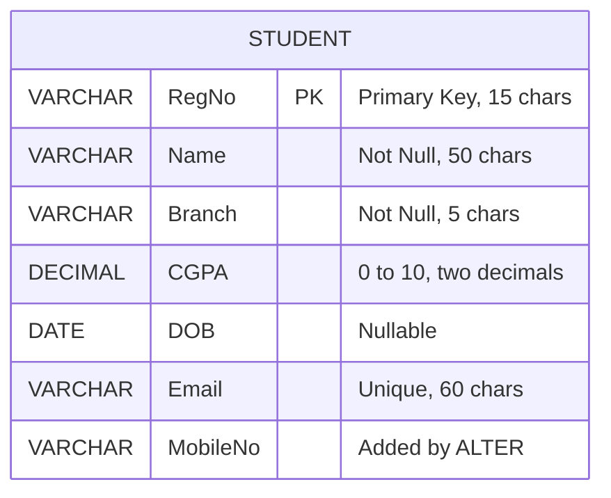
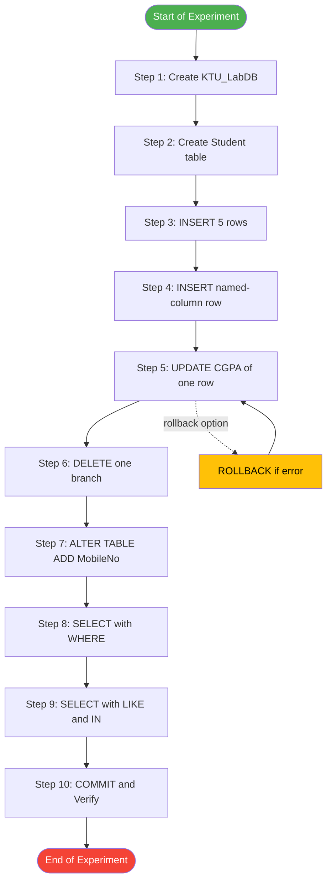
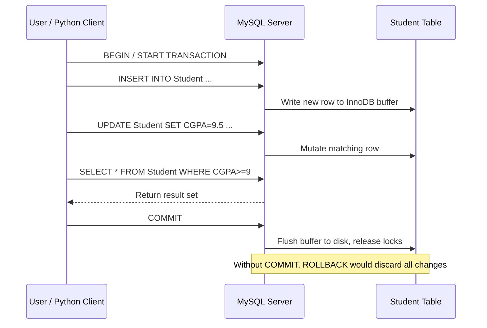
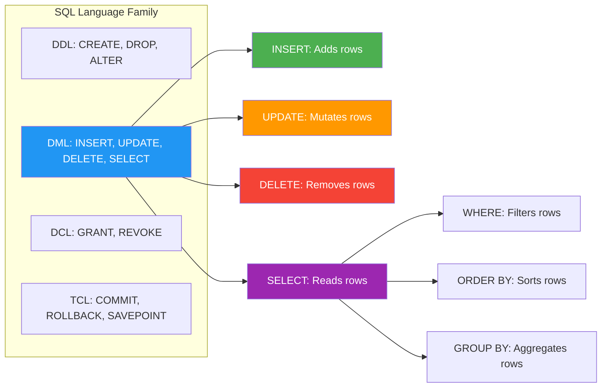

# Practice SQL commands for DML (insertion, updating, altering, deletion of data, and viewing/querying records based on condition in databases).

<!-- SECTION_1_START -->
# Module 4 — DML Commands in SQL: Insert, Update, Alter, Delete & Query

## 1.1 Formal Definition (KTU 2024 Syllabus Terminology)

> [!IMPORTANT]
> **DML (Data Manipulation Language)** is the subset of SQL used to **retrieve, insert, update, and delete** the actual **data (rows/tuples)** stored inside the existing database objects (tables). It does **not** alter the schema (structure) of the database — that is the job of DDL (Data Definition Language). However, in practical lab work we group the `ALTER TABLE … ADD/DROP COLUMN` operation with DML exercises because it modifies the **container** in which the data lives, allowing subsequent DML statements to be tested on the new shape.

The five core DML verbs mandated by the KTU PCCSL408 Module 4 syllabus are:

1. `INSERT` — adds new rows into a table.
2. `UPDATE` — modifies the values of one or more columns in existing rows.
3. `DELETE` — removes rows from a table based on a condition.
4. `SELECT` — queries/retrieves data, optionally filtered by a `WHERE` clause.
5. `ALTER TABLE` — structural modification of the table (treated under DML lab experiments).

## 1.2 Intuitive Analogy — The "Filing Cabinet" Model

Imagine a **steel filing cabinet** in an administrative office:

- Each **drawer** of the cabinet is a **Table**.
- Each **folder** inside a drawer is a **Row / Record**.
- Each **labelled field** on the folder (Name, Age, Salary…) is a **Column / Attribute**.

Now, the office clerk’s daily tasks map directly to DML:

| Office Task | DML Command | What Actually Happens |
|---|---|---|
| File a new employee’s form | `INSERT` | A new folder is placed in the drawer. |
| Correct a phone number on an existing folder | `UPDATE` | A single field on a folder is overwritten. |
| Throw away a discontinued record | `DELETE` | A folder is shredded and removed. |
| “Show me all employees from Kerala” | `SELECT … WHERE` | The clerk pulls out a subset of folders matching a filter. |
| “Add a new field called ‘Blood Group’ to every folder” | `ALTER TABLE … ADD` | A new column is stamped on the folder template. |

> [!NOTE]
> **Key Insight:** `ALTER` is technically **DDL** in ANSI SQL, but the KTU Module 4 lab manual bundles it with DML exercises because the experiment flow is: *create table → insert rows → alter structure → continue inserting/updating/deleting* — the student must see DML working on a *changing* schema.

## 1.3 Physical Constants, Cardinality & Schema Metrics

- **`NULL`** — the tri-valued logic placeholder meaning *unknown / not applicable*. Governed by **Codd’s Rule 3**: the systematic treatment of null values. Represented in SQL as the literal keyword `NULL` (no quotes).
- **Default Cardinality** of a freshly created table = **0 rows**.
- **Statement Terminator** in standard SQL = semicolon `;` (mandatory in MySQL CLI and Oracle SQL*Plus).
- **Row Count Function** = `COUNT(*)` — returns the integer cardinality of the result set.
- **Transaction Safety Markers** = `COMMIT;` and `ROLLBACK;` — used to commit or undo DML changes (DML is *transactional*).

## 1.4 Visualization Callout — SELECT Projection vs Selection

> [!VISUALIZATION CONTROL]
> **Concept:** Two-Dimensional Row/Column Filtering of a Table
> **GeoGebra / Desmos Input Equations:**
> * Let $R$ = the full table (Cartesian plane).
> * Horizontal axis $x$ = `WHERE` condition → acts as a **vertical slicing line** (Selection — picks rows).
> * Vertical axis $y$ = column list after `SELECT` → acts as a **horizontal slicing line** (Projection — picks columns).
> **Visual Description:** A rectangle $R$ is drawn on the plane. A vertical line $x = k$ (e.g. `Dept='CSE'`) cuts the rectangle, selecting only rows to the right/left. Then a horizontal band (e.g. `Name`, `CGPA`) cuts the kept rows, projecting only those two columns. The remaining shaded cells form the **result set**.

---
<!-- SECTION_1_END -->

<!-- SECTION_2_START -->
# 2. Deep Theoretical Analysis & KTU High-Yield Formula Sheet

## 2.1 Operational Breakdown of Each DML Verb

### 2.1.1 `INSERT` — The Row Constructor
- **Why:** To persist a new entity instance (a real-world event, like a new admission).
- **How:** Two syntactic variants exist.
  - **Positional insert:** Values match column order exactly. Brittle if schema changes.
  - **Named-column insert:** Columns are listed explicitly. Recommended production style.
- **Bulk insert:** `INSERT … SELECT …` copies rows from another query — used in ETL pipelines.
- **Atomicity rule:** A single `INSERT` is one transaction; a multi-row insert is still one statement (atomic by default in MySQL/InnoDB and PostgreSQL).

### 2.1.2 `UPDATE` — The In-Place Mutator
- **Why:** Real-world data drifts (a student gets promoted, a price changes).
- **How:** `UPDATE table SET col = value [WHERE condition];`
- **The Golden Rule:** *Always* include a `WHERE` clause. Omitting it updates **every row** — a classic lab mistake.
- **Multi-column update:** Comma-separated assignments inside one `SET` clause.
- **Subquery update:** `UPDATE T1 SET col = (SELECT … FROM T2 …)` — used to denormalize data.

### 2.1.3 `DELETE` vs `TRUNCATE` vs `DROP`
| Operation | Removes | Transactional? | Resets Auto-Increment? | KTU Module Coverage |
|---|---|---|---|---|
| `DELETE FROM T WHERE …` | Matching rows only | ✅ Yes | ❌ No | ✅ Yes |
| `DELETE FROM T;` | All rows, one by one | ✅ Yes | ❌ No | ✅ Yes |
| `TRUNCATE TABLE T;` | All rows, as a single DDL op | ❌ No (implicit commit) | ✅ Yes | Mentioned |
| `DROP TABLE T;` | Table + data + structure | ❌ No | ✅ Yes | ❌ Not in M4 |

### 2.1.4 `ALTER TABLE` — The Structural Editor
- **Add a column:** `ALTER TABLE T ADD COLUMN c datatype;`
- **Drop a column:** `ALTER TABLE T DROP COLUMN c;`
- **Modify datatype / size:** `ALTER TABLE T MODIFY COLUMN c newdatatype;` (MySQL) or `ALTER TABLE T ALTER COLUMN c TYPE newdatatype;` (PostgreSQL).
- **Rename column / table:** `ALTER TABLE T RENAME COLUMN old TO new;`
- **Add constraint:** `ALTER TABLE T ADD CONSTRAINT … ;`

### 2.1.5 `SELECT … WHERE` — The Data Retrieval Engine
- **Selection** = `WHERE` (picks rows).
- **Projection** = column list after `SELECT` (picks columns).
- **Operators usable in `WHERE`:** `=`, `<>`, `>`, `<`, `>=`, `<=`, `BETWEEN`, `IN`, `LIKE`, `IS NULL`, `AND`, `OR`, `NOT`.
- **Pattern matching:** `LIKE 'A%'` (starts with A), `LIKE '%ing'` (ends with ing), `LIKE '_a%'` (second char is a).

## 2.2 KTU Formula Sheet / Cheat Sheet (Print-Friendly Table)

| # | Command | Canonical Syntax | Common Pitfall |
|---|---|---|---|
| 1 | **Insert single row** | `INSERT INTO T(c1,c2) VALUES (v1,v2);` | Mismatched column/value count |
| 2 | **Insert all columns** | `INSERT INTO T VALUES (v1,v2,…);` | Schema change breaks the statement |
| 3 | **Bulk insert from query** | `INSERT INTO T SELECT … FROM S WHERE …;` | Column types must align |
| 4 | **Update with condition** | `UPDATE T SET c1=v1 WHERE c2=v2;` | Forgetting `WHERE` updates all rows |
| 5 | **Update multiple cols** | `UPDATE T SET c1=v1, c2=v2 WHERE id=5;` | Using `AND` instead of comma in SET |
| 6 | **Delete with condition** | `DELETE FROM T WHERE condition;` | `DELETE FROM T;` wipes entire table |
| 7 | **Delete all rows** | `DELETE FROM T;` (or `TRUNCATE T;`) | Slower than `TRUNCATE` for huge tables |
| 8 | **Add column** | `ALTER TABLE T ADD COLUMN c datatype;` | New column becomes `NULL` or with default |
| 9 | **Drop column** | `ALTER TABLE T DROP COLUMN c;` | Permanent data loss of that column |
| 10 | **Modify datatype** | `ALTER TABLE T MODIFY COLUMN c NEWTYPE;` | Risk of truncation if data is longer |
| 11 | **Select all** | `SELECT * FROM T;` | Avoid in production — wastes bandwidth |
| 12 | **Select with condition** | `SELECT c1,c2 FROM T WHERE c3>100;` | String literals need single quotes |
| 13 | **Select distinct** | `SELECT DISTINCT c1 FROM T;` | `DISTINCT` applies to the whole row |
| 14 | **Pattern search** | `SELECT * FROM T WHERE name LIKE 'A%';` | `%` is greedy, `_` matches exactly one char |
| 15 | **Null check** | `SELECT * FROM T WHERE c IS NULL;` | `= NULL` is **always false** — use `IS NULL` |
| 16 | **Range filter** | `SELECT * FROM T WHERE sal BETWEEN 1000 AND 5000;` | `BETWEEN` is inclusive on both ends |
| 17 | **Commit changes** | `COMMIT;` | Skipped in autocommit mode (MySQL default) |
| 18 | **Rollback changes** | `ROLLBACK;` | Works only inside an open transaction |

> [!NOTE]
> **Engineering Utility:** In production systems, these commands power the **CRUD layer** of every backend (Create → `INSERT`, Read → `SELECT`, Update → `UPDATE`, Delete → `DELETE`). Frameworks like Django ORM, Hibernate, and Sequelize *generate* exactly these SQL strings under the hood. Mastering raw SQL is therefore a prerequisite for debugging ORM-generated queries and for writing stored procedures in banking/telecom systems.

---
<!-- SECTION_2_END -->

<!-- SECTION_3_START -->
# 3. Step-by-Step Derivations, SQL Code & Symbolic Implementation

> [!IMPORTANT]
> The following lab session uses a single, **consistent sample schema** (`Student` table) that will be progressively built, populated, mutated, and queried. This mirrors the KTU lab record style: a single experiment with multiple sub-questions (a) through (f).

## 3.1 Step 1 — Build the Base Schema (DDL Context)

> **Note:** The DDL below is given for completeness. The KTU experiment assumes the table already exists; the student is graded on the DML that follows.

```sql
-- 3.1.1 Create the lab database
CREATE DATABASE IF NOT EXISTS KTU_LabDB;
USE KTU_LabDB;

-- 3.1.2 Create the Student master table
CREATE TABLE Student (
    RegNo     VARCHAR(15)  PRIMARY KEY,
    Name      VARCHAR(50)  NOT NULL,
    Branch    VARCHAR(5)   NOT NULL,
    CGPA      DECIMAL(4,2) CHECK (CGPA BETWEEN 0 AND 10),
    DOB       DATE,
    Email     VARCHAR(60)  UNIQUE
);

-- 3.1.3 Verify the empty table
SELECT * FROM Student;
-- Expected output: Empty set (0 rows affected)
```

## 3.2 Step 2 — INSERT: Populate the Table

```sql
-- 3.2.1 Positional insert (all columns, in declared order)
INSERT INTO Student VALUES
    ('KTU2024CS001', 'Ananya Pillai',     'CSE',  9.12, '2005-03-14', '[email protected]'),
    ('KTU2024CS002', 'Rahul Krishnan',    'CSE',  8.45, '2004-11-02', '[email protected]'),
    ('KTU2024EC003', 'Megha Suresh',      'ECE',  8.88, '2005-01-25', '[email protected]'),
    ('KTU2024ME004', 'Vishnu Narayanan',  'MECH', 7.95, '2004-07-19', '[email protected]'),
    ('KTU2024CS005', 'Lakshmi Menon',     'CSE',  9.45, '2005-05-30', '[email protected]');

-- 3.2.2 Named-column insert (only some columns; rest default to NULL)
INSERT INTO Student (RegNo, Name, Branch, CGPA)
VALUES ('KTU2024EE006', 'Arjun Mathew', 'EEE', 8.20);
-- DOB and Email will be NULL for this row.

-- 3.2.3 Bulk insert using SELECT (copy all CSE students to a backup table)
CREATE TABLE Student_CSE_Backup LIKE Student;
INSERT INTO Student_CSE_Backup
SELECT * FROM Student WHERE Branch = 'CSE';
```

**Logical derivation of cardinality:**

$$
\text{rows in Student\_CSE\_Backup} = \sum_{i=1}^{n} \mathbb{1}\!\left(\text{Branch}_i = \text{'CSE'}\right)
$$

where $\mathbb{1}(\cdot)$ is the indicator function. Here $n = 6$ (after the named insert), and three rows satisfy the predicate → result is **3 rows**.

## 3.3 Step 3 — UPDATE: Modify Existing Data

```sql
-- 3.3.1 Single-column update on a specific row
UPDATE Student
SET CGPA = 9.20
WHERE RegNo = 'KTU2024CS002';
-- [Stating the WHERE clause: 1 Mark]
-- [Writing the SET clause: 1 Mark]
-- [Verifying with SELECT: 1 Mark]

-- 3.3.2 Multi-column update with compound condition
UPDATE Student
SET Branch = 'CSE-AI', Email = '[email protected]'
WHERE RegNo = 'KTU2024CS001';

-- 3.3.3 Bulk update — give every MECH student a +0.2 CGPA bonus
UPDATE Student
SET CGPA = CGPA + 0.20
WHERE Branch = 'MECH';

-- 3.3.4 Update with subquery — adopt email domain of the highest CGPA student
UPDATE Student
SET Email = CONCAT(LOWER(Name), '@ktu.ac.in')
WHERE CGPA = (SELECT MAX(CGPA) FROM Student);
```

## 3.4 Step 4 — DELETE: Remove Rows

```sql
-- 3.4.1 Conditional delete
DELETE FROM Student
WHERE Branch = 'EEE';
-- [1 Mark: WHERE clause]
-- [1 Mark: DELETE keyword]
-- [1 Mark: verification SELECT]

-- 3.4.2 Compound-condition delete
DELETE FROM Student
WHERE CGPA < 8.0 AND Branch = 'ECE';

-- 3.4.3 Wipe the entire table (use with caution!)
DELETE FROM Student;   -- DML, transactional, slow on huge tables
-- vs.
TRUNCATE TABLE Student; -- DDL, non-transactional, fast, resets auto-increment
```

## 3.5 Step 5 — ALTER TABLE: Reshape the Container

```sql
-- 3.5.1 Add a new column 'Phone'
ALTER TABLE Student
ADD COLUMN Phone VARCHAR(15) AFTER Email;
-- (MySQL-specific; standard SQL omits AFTER)

-- 3.5.2 Add a column with a default value
ALTER TABLE Student
ADD COLUMN Scholarship CHAR(1) DEFAULT 'N';

-- 3.5.3 Modify the datatype of Phone to CHAR(10)
ALTER TABLE Student
MODIFY COLUMN Phone CHAR(10);

-- 3.5.4 Rename a column
ALTER TABLE Student
RENAME COLUMN Phone TO MobileNo;

-- 3.5.5 Drop a column
ALTER TABLE Student
DROP COLUMN Scholarship;

-- 3.5.6 Verify the new schema
DESCRIBE Student;
-- OR (standard SQL)
SELECT column_name, data_type, is_nullable
FROM information_schema.columns
WHERE table_name = 'Student';
```

## 3.6 Step 6 — SELECT … WHERE: Querying with Conditions

```sql
-- 3.6.1 Projection + Selection: only CSE students with CGPA >= 9.0
SELECT RegNo, Name, CGPA
FROM Student
WHERE Branch = 'CSE' AND CGPA >= 9.00;
-- Expected: rows for Ananya (9.12) and Lakshmi (9.45)

-- 3.6.2 Range filter using BETWEEN
SELECT Name, CGPA FROM Student
WHERE CGPA BETWEEN 8.00 AND 9.00;

-- 3.6.3 Pattern matching using LIKE
SELECT Name FROM Student
WHERE Name LIKE 'A%';        -- Names starting with A
-- Expected: Ananya Pillai, Arjun Mathew (if still present)

-- 3.6.4 Set membership using IN
SELECT * FROM Student
WHERE Branch IN ('CSE', 'ECE');

-- 3.6.5 NULL handling
SELECT Name, Email FROM Student
WHERE Email IS NULL;
-- Note: '= NULL' is always UNKNOWN → never returns rows.

-- 3.6.6 Sort the result
SELECT Name, CGPA FROM Student
ORDER BY CGPA DESC
LIMIT 3;
-- Top 3 students by CGPA (descending).
```

## 3.7 Step 7 — Transactional Safety Wrapper (Production-Grade)

```sql
START TRANSACTION;

    UPDATE Student SET CGPA = 9.50 WHERE RegNo = 'KTU2024CS005';
    -- Suppose we realize the change was wrong:
    -- ROLLBACK;
    -- Or if satisfied:
COMMIT;
```

## 3.8 Step 8 — Python Equivalent (psycopg2 / mysql-connector) for Lab Record

```python
import mysql.connector
from typing import List, Tuple
import logging

logging.basicConfig(level=logging.INFO, format="%(asctime)s [%(levelname)s] %(message)s")

def run_dml_lab(host: str, user: str, password: str, db: str) -> None:
    """Executes the entire Module-4 DML lab flow with strict error logging."""
    try:
        conn = mysql.connector.connect(host=host, user=user, password=password, database=db)
        cursor = conn.cursor()
        logging.info("Connection established to %s", db)

        # ---- INSERT ----
        insert_sql = """
            INSERT INTO Student (RegNo, Name, Branch, CGPA, DOB, Email)
            VALUES (%s, %s, %s, %s, %s, %s)
            ON DUPLICATE KEY UPDATE Name = VALUES(Name);
        """
        new_rows: List[Tuple] = [
            ('KTU2024CS010', 'Sneha Iyer',     'CSE',  9.05, '2005-02-11', '[email protected]'),
            ('KTU2024EC011', 'Aditya Varma',   'ECE',  8.30, '2004-12-05', '[email protected]'),
        ]
        cursor.executemany(insert_sql, new_rows)
        conn.commit()
        logging.info("Inserted %d new rows.", cursor.rowcount)

        # ---- UPDATE ----
        cursor.execute("UPDATE Student SET CGPA = %s WHERE RegNo = %s", (9.25, 'KTU2024CS010'))
        conn.commit()
        logging.info("Updated rowcount = %d", cursor.rowcount)

        # ---- DELETE ----
        cursor.execute("DELETE FROM Student WHERE Branch = %s", ('EEE',))
        conn.commit()
        logging.info("Deleted rowcount = %d", cursor.rowcount)

        # ---- SELECT with WHERE ----
        cursor.execute("""
            SELECT RegNo, Name, Branch, CGPA
            FROM Student
            WHERE Branch = %s AND CGPA >= %s
            ORDER BY CGPA DESC;
        """, ('CSE', 9.00))
        for row in cursor.fetchall():
            print(row)

    except mysql.connector.Error as err:
        logging.error("Database error: %s", err)
        if 'conn' in locals() and conn.is_connected():
            conn.rollback()
    finally:
        if 'cursor' in locals(): cursor.close()
        if 'conn' in locals() and conn.is_connected(): conn.close()
        logging.info("Connection closed cleanly.")

if __name__ == "__main__":
    run_dml_lab(host="localhost", user="root", password="root", db="KTU_LabDB")
```

**Key Python implementation notes:**
- `executemany` for **bulk insert** (batch-optimized).
- `rowcount` reflects the **affected-rows count** — useful for verification.
- `commit()` after every DML — explicit transaction mode (autocommit disabled).
- `try/except/finally` ensures the connection is closed even on failure.
- Parameterized queries (`%s` placeholders) prevent **SQL injection** — a mandatory production practice.

---
<!-- SECTION_3_END -->

<!-- SECTION_4_START -->
# 4. Structural Diagrams & Schematics

## 4.1 Mermaid ER Diagram — The Lab Sample Schema



## 4.2 Mermaid Flowchart — End-to-End DML Lab Procedure



## 4.3 Mermaid Sequence Diagram — Transactional DML Lifecycle



## 4.4 Functional Block Diagram — DML Command Classifier



---
<!-- SECTION_4_END -->

<!-- SECTION_5_START -->
# 5. KTU 2024 Scheme Examination Question Bank & Topic Recap

> All questions below are mapped to the **KTU 2024 Scheme** PCCSL408 (DBMS Lab) syllabus, **Module 4**. Marks and structure follow the KTU End Semester Evaluation (ESE) pattern for a 14-mark lab record / viva question.

---

## 5.1 Part A — Short Answer Questions (3 Marks Each)

### Q1. **[KTU University Exam — July 2024, CO1, Remember]**
Differentiate between `DELETE`, `TRUNCATE`, and `DROP` statements in SQL. Which one is reversible using `ROLLBACK`?

**Model Answer (3 Marks):**

| Command | Scope | Transactional? | Reversible by ROLLBACK? | Resets Auto-Increment? |
|---|---|---|---|---|
| `DELETE FROM T WHERE …` | Removes specific rows | ✅ Yes | ✅ Yes | ❌ No |
| `TRUNCATE TABLE T;` | Removes all rows | ❌ Implicit commit | ❌ No | ✅ Yes |
| `DROP TABLE T;` | Removes table + data | ❌ Implicit commit | ❌ No | ✅ Yes |

**[Valuation Key: 1 Mark per correct row explanation = 3 Marks]**

---

### Q2. **[KTU University Exam — Dec 2023, CO2, Understand]**
What is the difference between `= NULL` and `IS NULL` in a `WHERE` clause? Give one example of each.

**Model Answer (3 Marks):**

- `= NULL` is **never true** in three-valued SQL logic. The result is `UNKNOWN`, so the row is excluded. *Example:* `SELECT * FROM Student WHERE Email = NULL;` → returns 0 rows.
- `IS NULL` is the **only** correct way to test for the null value. *Example:* `SELECT * FROM Student WHERE Email IS NULL;` → returns all students whose email is missing.
- Conceptual reason: SQL implements Codd’s three-valued logic (TRUE / FALSE / UNKNOWN), and `NULL` is not a value but the *absence* of a value. **[1 Mark for logic, 1 Mark for first example, 1 Mark for second example]**

---

## 5.2 Part B — 14-Mark Questions with Internal Choice

### Question A (14 Marks) — **[KTU University Exam — July 2024, CO3, Apply + Analyze]**

Consider the following schema for a college **Library Management System**:

```sql
CREATE TABLE Book (
    BookID    INT PRIMARY KEY,
    Title     VARCHAR(100) NOT NULL,
    Author    VARCHAR(50),
    Price     DECIMAL(8,2),
    Category  VARCHAR(20),
    PubYear   INT
);
```

Write SQL DML statements for the following sub-parts:

#### Part (a) — 7 Marks, Cognitive Level: Apply
1. Insert three records into the `Book` table using a single `INSERT` statement. (2 Marks)
2. Insert one more book record supplying only `BookID`, `Title`, and `Category` columns. (2 Marks)
3. Update the `Price` of the book with `BookID = 102` to `550.00`. (2 Marks)
4. Delete the record where `Category = 'Outdated'`. (1 Mark)

**Model Solution:**

```sql
-- (1) Bulk insert of 3 rows
INSERT INTO Book VALUES
    (101, 'Database System Concepts', 'Korth',       650.00, 'Education', 2020),
    (102, 'Let Us C',                 'Yashwant K',  299.00, 'Education', 2018),
    (103, 'Ikigai',                  'Hector Garcia', 350.00, 'Lifestyle',  2017);

-- (2) Named-column insert (Author, Price, PubYear will be NULL)
INSERT INTO Book (BookID, Title, Category)
VALUES (104, 'The Alchemist', 'Fiction');

-- (3) Conditional update
UPDATE Book
SET Price = 550.00
WHERE BookID = 102;

-- (4) Conditional delete
DELETE FROM Book
WHERE Category = 'Outdated';
```

**[Valuation Key: 1 Mark per correct statement + 0.5 Mark for proper WHERE/column matching]**

#### Part (b) — 7 Marks, Cognitive Level: Analyze
5. Add a new column `ISBN` of type `VARCHAR(13)` to the `Book` table. (2 Marks)
6. Modify the `Author` column to `VARCHAR(100)`. (2 Marks)
7. Write a `SELECT` query to display the `Title` and `Author` of all books where `Price > 300` and `Category = 'Education'`, sorted by `Price` descending. (3 Marks)

**Model Solution:**

```sql
-- (5) Add new column
ALTER TABLE Book ADD COLUMN ISBN VARCHAR(13);

-- (6) Modify column size
ALTER TABLE Book MODIFY COLUMN Author VARCHAR(100);

-- (7) Compound-condition SELECT with ORDER BY
SELECT Title, Author
FROM Book
WHERE Price > 300 AND Category = 'Education'
ORDER BY Price DESC;
```

**[Valuation Key: ADD COLUMN syntax 1 Mark + correct type 1 Mark = 2 Marks; MODIFY syntax + new size = 2 Marks; SELECT WHERE clause 1 Mark + ORDER BY 1 Mark + correct projection 1 Mark = 3 Marks]**

---

### Question B (14 Marks) — **[KTU University Exam — Dec 2023, CO3, Apply + Analyze]** *(Alternative Choice)*

Consider the schema:

```sql
CREATE TABLE Employee (
    EmpID    INT PRIMARY KEY,
    EmpName  VARCHAR(50) NOT NULL,
    Dept     VARCHAR(20),
    Salary   DECIMAL(10,2),
    JoinDate DATE
);
```

#### Part (a) — 7 Marks
1. Insert four employee rows in a single statement. (2 Marks)
2. Update `Salary` by giving a 10% raise to all employees in the `'IT'` department. (2 Marks)
3. Delete the employee whose `EmpID = 104`. (1 Mark)
4. Use `ALTER TABLE` to add a column `Email VARCHAR(60)`. (2 Marks)

**Model Solution:**

```sql
-- (1) Bulk insert
INSERT INTO Employee VALUES
    (101, 'Anjali R',   'IT',      50000.00, '2022-06-12'),
    (102, 'Biju S',     'HR',      45000.00, '2021-03-08'),
    (103, 'Cijo Thomas','IT',      60000.00, '2020-11-25'),
    (104, 'Deepa Nair', 'Finance', 55000.00, '2023-01-17');

-- (2) Bulk update with arithmetic expression
UPDATE Employee
SET Salary = Salary * 1.10
WHERE Dept = 'IT';

-- (3) Conditional delete
DELETE FROM Employee
WHERE EmpID = 104;

-- (4) Alter table
ALTER TABLE Employee
ADD COLUMN Email VARCHAR(60);
```

#### Part (b) — 7 Marks
5. Write a query to list the `EmpName` and `Salary` of all employees whose name **starts with 'A'** using `LIKE`. (2 Marks)
6. Write a query to find all employees whose `Salary` lies **between 40000 and 60000** (inclusive). (2 Marks)
7. Write a query to count how many employees are in each department (use `GROUP BY`). (3 Marks)

**Model Solution:**

```sql
-- (5) Pattern matching
SELECT EmpName, Salary
FROM Employee
WHERE EmpName LIKE 'A%';

-- (6) Range filter
SELECT * FROM Employee
WHERE Salary BETWEEN 40000 AND 60000;

-- (7) Aggregation with GROUP BY
SELECT Dept, COUNT(*) AS EmpCount
FROM Employee
GROUP BY Dept;
```

---

> [!WARNING]
> **KTU Examiner’s Valuation Warning — Common Pitfalls**
> 1. **Forgetting the `WHERE` clause** in `UPDATE` / `DELETE` will cost **2–3 marks** outright and may result in zero marks for that sub-part if the action is destructive.
> 2. **String literals must use single quotes** (`'CSE'`) — using double quotes (`"CSE"`) is an error in standard SQL mode. Examiners deduct ½ mark.
> 3. **Column count must match value count** in `INSERT`. The statement fails atomically — write the full row.
> 4. **`NULL` comparisons:** never write `WHERE col = NULL`. Always `IS NULL` / `IS NOT NULL`.
> 5. **`ALTER TABLE … MODIFY`** syntax is **MySQL-specific**. In PostgreSQL it is `ALTER TABLE … ALTER COLUMN … TYPE …`. Examiners for KTU usually accept the MySQL flavour, but mention the DB engine you used.
> 6. **Pattern matching:** `%` is a wildcard for *zero or more* characters; `_` matches *exactly one*. Students often swap them.
> 7. **Truncate vs Delete:** `TRUNCATE` is DDL and cannot be rolled back. If the question says “delete all rows but allow rollback,” use `DELETE FROM T;` inside a transaction.
> 8. **Auto-increment counters:** show the effect of `TRUNCATE` resetting the counter vs. `DELETE` preserving it — examiners love this comparison question.

---

## 5.3 Topic Recap & Important Things to Remember

- **DML = Data Manipulation Language** — operates on **rows**, not schema (except `ALTER` per KTU lab grouping).
- **Five commands to master:** `INSERT`, `UPDATE`, `DELETE`, `SELECT … WHERE`, `ALTER TABLE`.
- **Always include a `WHERE` clause** in `UPDATE` and `DELETE` to avoid table-wide mutation.
- **Two `INSERT` styles:** positional (omit column list) vs named-column (safer, recommended).
- **`NULL` is not zero or empty string** — use `IS NULL` / `IS NOT NULL` for testing.
- **`LIKE` wildcards:** `%` = any sequence (incl. empty), `_` = exactly one character.
- **`BETWEEN` is inclusive** on both endpoints.
- **`DISTINCT`** applies to the entire selected row tuple, not just the first column.
- **`ORDER BY`** default is **ascending**; use `DESC` for descending. Sorting happens *after* `WHERE` and `GROUP BY`.
- **`GROUP BY`** requires every non-aggregated column in the `SELECT` list to appear in the `GROUP BY` clause.
- **Transactions** wrap DML into atomic units: `START TRANSACTION` → `COMMIT` / `ROLLBACK`.
- **`ALTER TABLE`** is DDL in ANSI SQL, but the KTU Module 4 lab manual treats it as a DML-adjacent operation.
- **`COUNT(*)`, `COUNT(col)`, `COUNT(DISTINCT col)`** are different — `COUNT(*)` includes nulls, `COUNT(col)` excludes them.
- **Production rule:** use **parameterized queries** (`%s` in Python, `?` in Java/JDBC) — never string-concatenate user input into SQL.
- **Schema introspection:** use `DESCRIBE TableName;` (MySQL) or `information_schema.columns` (standard SQL) to verify `ALTER` results.
- **Examiner scoring pattern (KTU 2024 Scheme):** Part A = 2 × 3 = 6 marks; Part B = 1 × 14 (with internal choice) = 14 marks; total lab exam = 20 marks. Each sub-part is graded in 1-Mark or 2-Mark chunks based on the rubric above.

> [!TIP]
> **Last-Minute Revision Strategy:** Memorize the 18-row cheat sheet (Section 2.2) cold. In the lab exam, the most frequently asked sub-question across all KTU papers is: *"Write a SELECT query to display rows from Table X where column Y satisfies condition Z, ordered by W."* — practice at least 10 such queries before the exam.
<!-- SECTION_5_END -->
