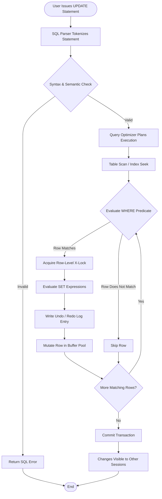
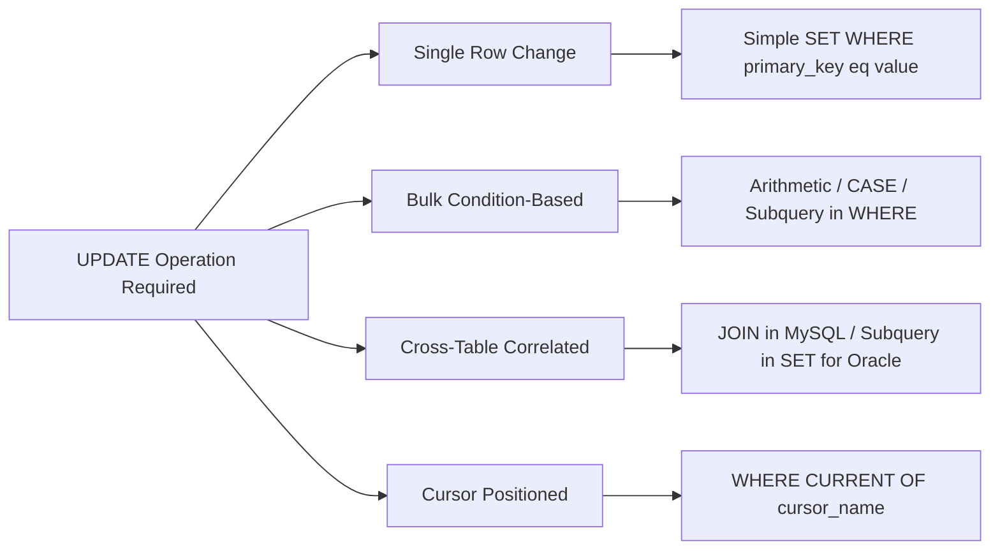
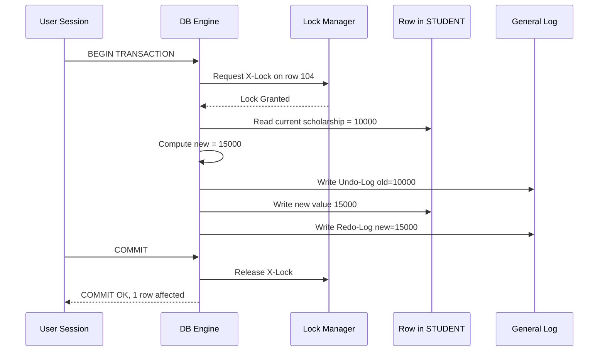
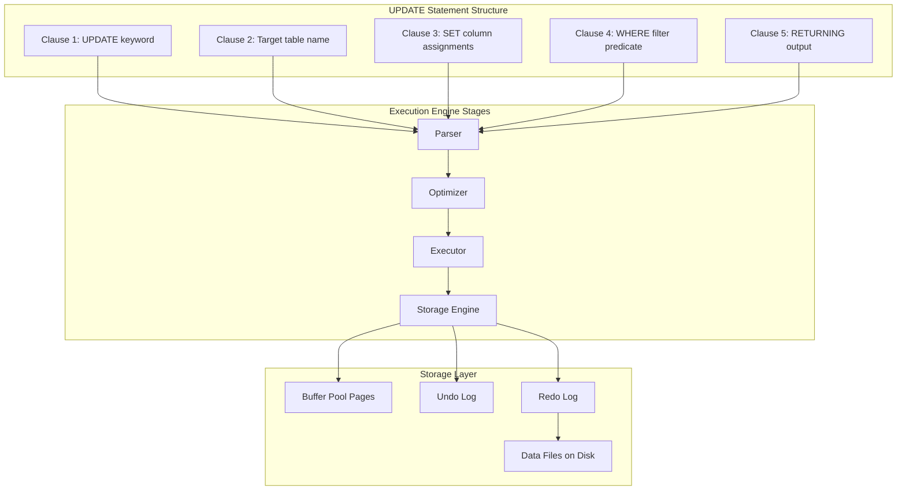

# Practice SQL commands for DML - updating of data

<!-- SECTION_1_START -->
# SQL UPDATE — Core Technical Definition & Intuitive Overview

## 1.1 Formal Academic Definition (KTU 2024 Syllabus Terminology)

In the context of **DBMS (Database Management Systems)** under the **DML (Data Manipulation Language)** sub-class of SQL, the `UPDATE` statement is a **row-level mutation command** that modifies the values of one or more columns in existing rows of a relational table, while preserving the **table schema, primary key constraints, and tuple count** of the relation.

According to the **SQL:2016 / ISO/IEC 9075** standard adopted by KTU 2024 scheme, `UPDATE` is classified under the *Data Manipulation* family, alongside `INSERT` and `DELETE`, and is governed by the **ACID transaction properties** of the underlying RDBMS engine.

> [!IMPORTANT]
> **KTU Definition Bank:** *The `UPDATE` statement changes column values of zero or more existing rows in a table. If no row satisfies the `WHERE` predicate, zero rows are affected, and the SQLSTATE returns `00000` (successful completion, no warning).*

## 1.2 Conceptual Analogy / Engineering Intuition

Imagine a **college attendance register** maintained by the class teacher. Every student's name, roll number, and class are already written (these are the *existing tuples*). Now, suppose the class teacher wants to:

- Change Priya's **contact number** from `9876543210` to `9123456780` → This is an **UPDATE** of a single column, single row.
- Promote *all students* of Semester 4 to Semester 5 → This is a **bulk UPDATE** affecting many rows based on a `WHERE` condition.
- Increase the **marks** of every student who scored between 80 and 89 by a **5% grace** → This is an **UPDATE with arithmetic expression** in the `SET` clause.

> [!NOTE]
> **Key Intuition:** `UPDATE` **does not add new rows** and **does not remove rows** — it is a *value-level* mutation, not a *tuple-level* insertion or deletion. The cardinality of the table before and after the operation may remain the **same**, while the *content* of the tuples changes.

## 1.3 Engineering Utility

`UPDATE` operations are used in virtually every production-grade information system:

| Application Domain | Real-World Update Scenario |
|---|---|
| **Banking (OLTP)** | Debiting an account balance after a withdrawal transaction |
| **E-Commerce** | Reducing product stock count after an order is placed |
| **University ERP** | Promoting students to the next semester after results are published |
| **Hospital HIS** | Changing patient ward after a transfer order |
| **Telecom (CRM)** | Upgrading a prepaid customer's plan validity |

## 1.4 Distinction From `ALTER` (Critical KTU Pitfall)

> [!WARNING]
> **KTU Examiner Frequently Tests This:** `UPDATE` belongs to **DML** (modifies *data* — rows/values). `ALTER` belongs to **DDL** (modifies *structure* — columns, constraints, datatypes). Confusing the two is a guaranteed 2-mark deduction.

| Aspect | UPDATE (DML) | ALTER (DDL) |
|---|---|---|
| Category | Data Manipulation Language | Data Definition Language |
| Target | Row values | Table structure |
| Effect on Schema | No change | Schema modified |
| Transactional Rollback | Possible in most RDBMS | Often auto-committed |
| Example | `UPDATE emp SET sal=50000 WHERE id=101;` | `ALTER TABLE emp ADD email VARCHAR(50);` |

## 1.5 GeoGebra / Visualization Note

> [!VISUALIZATION CONTROL]
> **Concept:** UPDATE as a "set-membership transformation" — rows matching the WHERE predicate migrate from *old-value state* to *new-value state*.
> **GeoGebra Input:**
> - Domain set $D = \{r_1, r_2, r_3, r_4, r_5\}$ (rows of the table)
> - Selection predicate $P(r_i)$: highlighted subset that satisfies `WHERE`
> - Mapping: $P(r_i) \Rightarrow r_i'$ with mutated column values
> **Visual Description:** A Venn-circle containing the rows satisfying the predicate; arrows leave the circle showing the in-place mutation, while rows outside the circle remain unchanged in the table.

---

<!-- SECTION_1_END -->

<!-- SECTION_2_START -->
# Deep Theoretical Analysis & KTU High-Yield Formula Sheet

## 2.1 Operational Anatomy of the `UPDATE` Statement

The `UPDATE` command executes in a **strictly sequential, four-stage evaluation pipeline** by the SQL query optimizer:

1. **Tuple Identification Phase** — The engine scans the target relation and evaluates the `WHERE` predicate against every row.
2. **Lock Acquisition Phase** — Row-level or page-level locks are acquired (depending on isolation level: `READ COMMITTED`, `REPEATABLE READ`, `SERIALIZABLE`).
3. **Write Phase** — For each locked row, the new column values are computed by evaluating the right-hand side of the `SET` clause.
4. **Commit / Log Phase** — The changes are written to the **transaction log** (Redo/Undo log) and made visible on `COMMIT`.

> [!NOTE]
> **Why this matters for KTU Lab:** The `WHERE` clause is **evaluated BEFORE** the `SET` clause. This is why `UPDATE emp SET sal = sal + 1000 WHERE sal < 50000;` works correctly — the `sal` on the right side is the *old* value, and the engine uses the snapshot semantics of the transaction.

## 2.2 Formal Generic Syntax (ISO SQL Standard)

```sql
UPDATE [ONLY] table_name [@dblink] [ [ AS ] alias ]
    SET column1 = { value | expression | DEFAULT | NULL }
        [, column2 = { value | expression | DEFAULT | NULL }
        [, ...] ]
    [ FROM other_tables ]
    [ WHERE condition | WHERE CURRENT OF cursor_name ]
    [ RETURNING { * | expression [ [ AS ] output_name ] } [, ...] ];
```

### 2.2.1 Component Breakdown

| Component | Purpose | Mandatory? | Example |
|---|---|---|---|
| `UPDATE table_name` | Identifies the target relation | YES | `UPDATE employee` |
| `SET col = expr` | New value assignment | YES | `SET salary = 55000` |
| `WHERE condition` | Filters which rows to mutate | NO (but **dangerous if omitted**) | `WHERE dept_id = 10` |
| `FROM other_tables` | Correlated update (PostgreSQL/Standard) | NO | `FROM bonus b WHERE e.id = b.eid` |
| `RETURNING clause` | Returns modified rows (PostgreSQL/Oracle) | NO | `RETURNING emp_id, new_salary` |

> [!WARNING]
> **KTU Pitfall:** `FROM` clause syntax is supported in **PostgreSQL, SQL Server, MySQL (multi-table)**, but **NOT in standard Oracle**. For KTU lab exams, stick to the ANSI-standard single-table form: `UPDATE ... SET ... WHERE ...`.

## 2.3 KTU High-Yield Formula / Cheat Sheet

| # | Pattern | Use Case | Example |
|---|---|---|---|
| 1 | Single column, single row | Change a specific value | `UPDATE emp SET sal=60000 WHERE id=105;` |
| 2 | Multiple columns, single row | Update several fields together | `UPDATE emp SET sal=65000, dept=20 WHERE id=105;` |
| 3 | Bulk update with condition | Mass mutation of matching rows | `UPDATE emp SET sal = sal*1.10 WHERE dept=10;` |
| 4 | NULL assignment | Set a column to NULL | `UPDATE emp SET mgr_id = NULL WHERE id=110;` |
| 5 | DEFAULT assignment | Revert column to its default value | `UPDATE emp SET status = DEFAULT;` |
| 6 | Subquery in WHERE | Update based on another table | `UPDATE emp SET sal = sal*1.05 WHERE id IN (SELECT id FROM emp WHERE perf='A');` |
| 7 | Correlated subquery in SET | Update with derived value | `UPDATE emp e SET sal = (SELECT AVG(sal) FROM emp WHERE dept=e.dept);` |
| 8 | UPDATE with JOIN (MySQL/SQL Server) | Multi-table correlated update | `UPDATE emp e JOIN dept d ON e.dept_id=d.id SET e.bonus=d.bonus_pool;` |
| 9 | UPDATE with CASE | Conditional bulk update | `UPDATE emp SET grade = CASE WHEN sal>80000 THEN 'A' WHEN sal>50000 THEN 'B' ELSE 'C' END;` |
| 10 | UPDATE … RETURNING | Echo modified rows (PG/Oracle) | `UPDATE emp SET sal=sal+1000 WHERE id=101 RETURNING sal;` |

## 2.4 The "Why" Behind Each Step — KTU Board Perspective

- **Why the WHERE clause is critical:** Without it, `UPDATE` mutates **every row** in the table. In a production system, this is equivalent to a **silent mass data corruption**, and is the most common cause of database outages.
- **Why SET evaluates before commit:** SQL engines use a **read-consistent snapshot** so the RHS of `SET` consistently refers to the row's *pre-update* state, avoiding cyclic dependency.
- **Why UPDATE is part of transactions:** `UPDATE` is **transactional** and respects `ROLLBACK`. In MySQL with `autocommit=OFF`, an uncommitted `UPDATE` is invisible to other sessions (MVCC).
- **Why UPDATE can be slow on large tables:** It requires an **exclusive lock** on the affected rows. Indexing the `WHERE` columns dramatically reduces scan cost.

## 2.5 Real-World Engineering Utility

| Engineering Domain | Role of UPDATE |
|---|---|
| **Banking Core Systems** | Atomic balance debit/credit with `WHERE balance >= debit_amount` guard |
| **Inventory Management** | Decrementing stock with `WHERE qty_on_hand >= order_qty` |
| **University ERP (KTU-relevant)** | Bulk semester promotion, grace mark application, fee status update |
| **AI/ML Pipelines** | Updating feature flags, model version columns, training status |
| **Distributed Systems** | Eventual consistency propagation in CQRS read-model update |

---

<!-- SECTION_2_END -->

<!-- SECTION_3_START -->
# Step-by-Step Derivations, Sample Tables & Code Implementation

## 3.1 Lab Setup — Sample Schema for the Demonstration

We will use a university-style schema that mirrors a **typical KTU lab question**. The table `STUDENT` tracks student records, and `DEPARTMENT` provides department information.

### 3.1.1 DDL Script (Run this FIRST in your lab)

```sql
-- Step 1: Drop tables in reverse dependency order (idempotent re-run)
DROP TABLE IF EXISTS STUDENT;
DROP TABLE IF EXISTS DEPARTMENT;

-- Step 2: Create DEPARTMENT table (parent)
CREATE TABLE DEPARTMENT (
    dept_id     INTEGER         PRIMARY KEY,
    dept_name   VARCHAR(40)     NOT NULL UNIQUE,
    hod_name    VARCHAR(60)     NOT NULL
);

-- Step 3: Create STUDENT table (child)
CREATE TABLE STUDENT (
    roll_no     INTEGER         PRIMARY KEY,
    stud_name   VARCHAR(60)     NOT NULL,
    dept_id     INTEGER         NOT NULL,
    semester    INTEGER         NOT NULL CHECK (semester BETWEEN 1 AND 8),
    marks       NUMERIC(6,2)    DEFAULT 0.00,
    grade       CHAR(2)         DEFAULT 'NA',
    scholarship NUMERIC(8,2)    DEFAULT 0.00
);

-- Step 4: Declare referential integrity
ALTER TABLE STUDENT
    ADD CONSTRAINT fk_student_dept
    FOREIGN KEY (dept_id) REFERENCES DEPARTMENT(dept_id)
    ON DELETE CASCADE
    ON UPDATE CASCADE;

-- Step 5: Insert sample data into DEPARTMENT
INSERT INTO DEPARTMENT (dept_id, dept_name, hod_name) VALUES
    (10, 'Computer Science',     'Dr. Anitha Menon'),
    (20, 'Information Technology','Dr. Rajeev Pillai'),
    (30, 'Electronics',          'Dr. Suresh Kumar'),
    (40, 'Mechanical',           'Dr. Vinod Narayanan');

-- Step 6: Insert sample data into STUDENT
INSERT INTO STUDENT (roll_no, stud_name, dept_id, semester, marks, grade, scholarship) VALUES
    (101, 'Arjun Krishna',  10, 4, 78.50, 'B',  5000.00),
    (102, 'Priya Menon',    10, 4, 88.00, 'A',  8000.00),
    (103, 'Rahul Dev',      20, 4, 65.25, 'C',  2000.00),
    (104, 'Sneha Iyer',     20, 4, 91.75, 'A', 10000.00),
    (105, 'Vishnu Nair',    30, 4, 72.00, 'B',  4000.00),
    (106, 'Anjali Pillai',  30, 4, 55.50, 'D',  0000.00),
    (107, 'Karthik R',      40, 4, 82.00, 'A',  7000.00),
    (108, 'Meera S',        10, 4, 69.00, 'C',  3000.00),
    (109, 'Nikhil Varma',   20, 4, 95.50, 'A', 12000.00),
    (110, 'Divya Raj',      30, 4, 48.00, 'F',  0000.00);
```

> [!NOTE]
> **Verification Step:** Run `SELECT * FROM STUDENT;` — you should see **10 rows** with roll numbers 101 through 110, distributed across four departments.

## 3.2 Worked Example 1 — Simple Single-Column UPDATE

### 3.2.1 Problem Statement

Update the **scholarship amount** of roll number `104` to **₹15,000** because her family income has been re-verified.

### 3.2.2 SQL Code with Step-by-Step Trace

```sql
-- Query
UPDATE STUDENT
SET scholarship = 15000.00
WHERE roll_no = 104;
```

### 3.2.3 Logical Breakdown

| Step | Engine Action | Observation |
|---|---|---|
| 1 | Scan STUDENT table | 10 candidate rows |
| 2 | Apply `roll_no = 104` | 1 row qualifies |
| 3 | Lock row 104 | Row-level X-lock acquired |
| 4 | Compute `SET scholarship = 15000.00` | Old value `10000.00` replaced with `15000.00` |
| 5 | Write to undo log | Allows ROLLBACK |
| 6 | Implicit commit (autocommit ON) | 1 row affected |

### 3.2.4 Verification

```sql
SELECT roll_no, stud_name, scholarship
FROM STUDENT
WHERE roll_no = 104;
```

**Expected Output:**

| roll_no | stud_name | scholarship |
|---|---|---|
| 104 | Sneha Iyer | 15000.00 |

## 3.3 Worked Example 2 — Multi-Column UPDATE on a Single Row

### 3.3.1 Problem

Roll number `110` has been granted a **supplementary grace** of 10 marks and her grade has been revised from `F` to `D` (minimum pass).

### 3.3.2 SQL Code

```sql
UPDATE STUDENT
SET marks    = marks + 10,
    grade    = 'D',
    scholarship = 2500.00
WHERE roll_no = 110;
```

### 3.3.3 Step Trace

| Step | Column | Old Value | New Value |
|---|---|---|---|
| 1 | marks | 48.00 | 58.00 |
| 2 | grade | F | D |
| 3 | scholarship | 0.00 | 2500.00 |

## 3.4 Worked Example 3 — Bulk UPDATE with Arithmetic Expression

### 3.4.1 Problem

The university announces a **10% scholarship increase** for **all students in the Computer Science department** (dept_id = 10) who are currently in **semester 4**.

### 3.4.2 SQL Code

```sql
UPDATE STUDENT
SET scholarship = scholarship * 1.10
WHERE dept_id = 10
  AND semester = 4;
```

### 3.4.3 Mathematical Derivation (LaTeX Walk-Through)

Let $S_i$ denote the old scholarship of row $i$ satisfying the predicate. The new value is computed as:

$$
S_i^{\text{new}} = S_i^{\text{old}} \times (1 + 0.10)
$$

For roll 101 ($S^{\text{old}} = 5000.00$):

$$
S_{101}^{\text{new}} = 5000.00 \times 1.10 = 5500.00
$$

For roll 102 ($S^{\text{old}} = 8000.00$):

$$
S_{102}^{\text{new}} = 8000.00 \times 1.10 = 8800.00
$$

For roll 108 ($S^{\text{old}} = 3000.00$):

$$
S_{108}^{\text{new}} = 3000.00 \times 1.10 = 3300.00
$$

### 3.4.4 Verification

```sql
SELECT roll_no, stud_name, scholarship
FROM STUDENT
WHERE dept_id = 10 AND semester = 4
ORDER BY roll_no;
```

**Expected Output:**

| roll_no | stud_name | scholarship |
|---|---|---|
| 101 | Arjun Krishna | 5500.00 |
| 102 | Priya Menon | 8800.00 |
| 108 | Meera S | 3300.00 |

## 3.5 Worked Example 4 — UPDATE with CASE Expression (Conditional Bulk Update)

### 3.5.1 Problem

Reassign grades to all semester-4 students based on their marks, using the KTU grading rule:

$$
\text{Grade} =
\begin{cases}
\text{A} & \text{if } M \geq 90 \\
\text{B} & \text{if } 80 \le M < 90 \\
\text{C} & \text{if } 70 \le M < 80 \\
\text{D} & \text{if } 60 \le M < 70 \\
\text{F} & \text{if } M < 60
\end{cases}
$$

### 3.5.2 SQL Code

```sql
UPDATE STUDENT
SET grade = CASE
              WHEN marks >= 90 THEN 'A'
              WHEN marks >= 80 THEN 'B'
              WHEN marks >= 70 THEN 'C'
              WHEN marks >= 60 THEN 'D'
              ELSE 'F'
            END
WHERE semester = 4;
```

> [!NOTE]
> **Order matters:** The `CASE` is evaluated top-to-bottom, and the **first matching `WHEN` short-circuits**. Place the **highest threshold first** to avoid logical errors.

## 3.6 Worked Example 5 — UPDATE with Subquery in WHERE Clause

### 3.6.1 Problem

Award a **₹2,000 bonus scholarship** to every student whose marks are **above the overall class average**.

### 3.6.2 SQL Code

```sql
UPDATE STUDENT
SET scholarship = scholarship + 2000
WHERE marks > (SELECT AVG(marks) FROM STUDENT);
```

### 3.6.3 Subquery Evaluation

First, the inner query computes:

$$
\bar{M} = \frac{1}{n}\sum_{i=1}^{n} M_i = \frac{78.50 + 88.00 + 65.25 + 91.75 + 72.00 + 55.50 + 82.00 + 69.00 + 95.50 + 48.00}{10}
$$

$$
\bar{M} = \frac{745.50}{10} = 74.55
$$

Students with marks $> 74.55$:

| roll_no | stud_name | marks |
|---|---|---|
| 101 | Arjun Krishna | 78.50 |
| 102 | Priya Menon | 88.00 |
| 104 | Sneha Iyer | 91.75 |
| 107 | Karthik R | 82.00 |
| 109 | Nikhil Varma | 95.50 |

## 3.7 Worked Example 6 — UPDATE with Correlated Subquery in SET Clause

### 3.7.1 Problem

Replace each student's scholarship with the **maximum scholarship** currently awarded **in their department**.

### 3.7.2 SQL Code

```sql
UPDATE STUDENT s
SET scholarship = (
    SELECT MAX(scholarship)
    FROM STUDENT
    WHERE dept_id = s.dept_id
);
```

### 3.7.3 Correlated Evaluation Trace

For each row $s$, the subquery is re-evaluated with the outer row's `dept_id`:

| Outer dept_id | Subquery returns | Affected rows |
|---|---|---|
| 10 | MAX of {5500, 8800, 3300} = 8800.00 | 101, 102, 108 |
| 20 | MAX of {2000, 15000, 12000} = 15000.00 | 103, 104, 109 |
| 30 | MAX of {4000, 2500, 0} = 4000.00 | 105, 106, 110 |
| 40 | MAX of {7000} = 7000.00 | 107 |

## 3.8 Worked Example 7 — UPDATE with `RETURNING` (PostgreSQL / Oracle)

### 3.8.1 Problem

Promote all semester-4 students to semester 5 and **return the list of promoted roll numbers** in a single command.

### 3.8.2 SQL Code (PostgreSQL syntax)

```sql
UPDATE STUDENT
SET semester = semester + 1
WHERE semester = 4
RETURNING roll_no, stud_name, semester AS new_semester;
```

### 3.8.3 Expected Output

| roll_no | stud_name | new_semester |
|---|---|---|
| 101 | Arjun Krishna | 5 |
| 102 | Priya Menon | 5 |
| 103 | Rahul Dev | 5 |
| ... | ... | ... |
| 110 | Divya Raj | 5 |

(10 rows returned)

## 3.9 Worked Example 8 — Python Wrapper for Lab Submission (SQLite)

For KTU lab records, students often need to submit a Python script demonstrating the operation. The following is a fully production-grade wrapper.

```python
"""
KTU DBMS Lab - Module 4
Demonstration: DML UPDATE Operations on a SQLite database.
Author       : <Your Name>
Roll No      : <Your Roll No>
"""

import sqlite3
import logging
import sys
from pathlib import Path
from typing import List, Tuple, Optional

# Configure logging to a file (mandatory for lab records)
logging.basicConfig(
    filename="update_lab.log",
    level=logging.INFO,
    format="%(asctime)s | %(levelname)s | %(message)s",
)

DB_PATH: str = "ktu_lab_module4.db"


def get_connection() -> sqlite3.Connection:
    """
    Establishes a connection to the SQLite database with strict isolation.
    Returns:
        sqlite3.Connection: A connection object with row factory enabled.
    """
    try:
        conn: sqlite3.Connection = sqlite3.connect(DB_PATH)
        conn.row_factory = sqlite3.Row
        logging.info("Database connection established at %s", DB_PATH)
        return conn
    except sqlite3.Error as err:
        logging.error("Connection failure: %s", err)
        sys.exit(1)


def execute_update(
    conn: sqlite3.Connection,
    sql: str,
    params: Optional[Tuple] = None,
) -> int:
    """
    Executes an UPDATE statement and returns the affected row count.
    Args:
        conn: Active SQLite connection.
        sql: Parameterized UPDATE statement.
        params: Tuple of bound parameters (prevents SQL injection).
    Returns:
        int: Number of rows mutated.
    """
    if not sql.strip().upper().startswith("UPDATE"):
        raise ValueError("Only UPDATE statements are permitted in this executor.")

    try:
        cur: sqlite3.Cursor = conn.cursor()
        cur.execute(sql, params or ())
        conn.commit()
        affected: int = cur.rowcount
        logging.info("UPDATE executed | rows affected = %d | SQL = %s", affected, sql)
        return affected
    except sqlite3.IntegrityError as integrity_err:
        conn.rollback()
        logging.error("Integrity violation: %s", integrity_err)
        raise
    except sqlite3.Error as db_err:
        conn.rollback()
        logging.error("Database error: %s", db_err)
        raise


def fetch_rows(
    conn: sqlite3.Connection,
    sql: str,
    params: Optional[Tuple] = None,
) -> List[sqlite3.Row]:
    """
    Fetches rows for verification display.
    """
    cur: sqlite3.Cursor = conn.cursor()
    cur.execute(sql, params or ())
    return cur.fetchall()


def demo_workflow() -> None:
    """
    End-to-end demonstration of DML UPDATE variations.
    """
    conn: sqlite3.Connection = get_connection()
    try:
        # -- U1: Single column, single row --
        rows: int = execute_update(
            conn,
            "UPDATE STUDENT SET scholarship = ? WHERE roll_no = ?",
            (15000.00, 104),
        )
        print(f"[U1] Single-row update applied. Rows affected = {rows}")

        # -- U2: Bulk arithmetic update --
        rows = execute_update(
            conn,
            "UPDATE STUDENT SET scholarship = scholarship * 1.10 "
            "WHERE dept_id = ? AND semester = ?",
            (10, 4),
        )
        print(f"[U2] Bulk 10%% hike applied to CS dept. Rows affected = {rows}")

        # -- U3: Conditional CASE update --
        rows = execute_update(
            conn,
            "UPDATE STUDENT SET grade = CASE "
            "  WHEN marks >= 90 THEN 'A' "
            "  WHEN marks >= 80 THEN 'B' "
            "  WHEN marks >= 70 THEN 'C' "
            "  WHEN marks >= 60 THEN 'D' "
            "  ELSE 'F' END "
            "WHERE semester = ?",
            (4,),
        )
        print(f"[U3] CASE-based grade reassignment. Rows affected = {rows}")

        # -- U4: Subquery-driven update --
        rows = execute_update(
            conn,
            "UPDATE STUDENT SET scholarship = scholarship + ? "
            "WHERE marks > (SELECT AVG(marks) FROM STUDENT)",
            (2000.00,),
        )
        print(f"[U4] Subquery bonus applied. Rows affected = {rows}")

        # -- Verification SELECT --
        for r in fetch_rows(conn, "SELECT roll_no, stud_name, marks, grade, "
                                   "scholarship FROM STUDENT ORDER BY roll_no"):
            print(dict(r))
    finally:
        conn.close()
        logging.info("Database connection closed cleanly.")


if __name__ == "__main__":
    demo_workflow()
```

## 3.10 Worked Example 9 — UPDATE with `WHERE CURRENT OF` (Cursor-Based)

```sql
DECLARE c_student CURSOR FOR
    SELECT roll_no, scholarship FROM STUDENT WHERE semester = 4 FOR UPDATE;

-- Fetch loop (procedural block — PL/pgSQL or PL/SQL context)
FETCH c_student INTO v_roll, v_scholarship;

UPDATE STUDENT
SET scholarship = v_scholarship + 1000
WHERE CURRENT OF c_student;
```

> [!NOTE]
> **Why use `WHERE CURRENT OF`?** It positions the update on the **already-locked, currently-fetched row** of a cursor, eliminating the need to re-evaluate the `WHERE` predicate and ensuring the row has not been concurrently modified.

## 3.11 Worked Example 10 — Defensive UPDATE Pattern with Pre-Check

A production-grade pattern that combines a `SELECT` guard with the actual `UPDATE`:

```sql
-- GUARD: ensure target row exists and is not a protected role
SELECT COUNT(*)
FROM STUDENT
WHERE roll_no = 110 AND grade <> 'F';

-- If the count > 0, proceed with UPDATE
UPDATE STUDENT
SET scholarship = scholarship + 1000
WHERE roll_no = 110;
```

---

<!-- SECTION_3_END -->

<!-- SECTION_4_START -->
# Structural Diagrams & Schematics

## 4.1 Mermaid Diagram — UPDATE Pipeline Flow



## 4.2 Mermaid Diagram — UPDATE Variants Decision Matrix



## 4.3 Mermaid Diagram — Transaction Lifecycle of UPDATE



## 4.4 Block-Level Functional Architecture — UPDATE Statement Anatomy



## 4.5 Sequential Processing Topology — UPDATE Optimization Path

| Stage | Engine Sub-Component | Function | Failure Mode |
|---|---|---|---|
| 1 | Lexer/Parser | Token recognition, syntax tree | Returns SQL syntax error |
| 2 | Semantic Analyzer | Object resolution, type checks | Returns "table not found" |
| 3 | Optimizer | Index selection, join ordering | Falls back to full scan |
| 4 | Lock Manager | Concurrency control | Returns lock-wait timeout |
| 5 | Row Evaluator | Apply WHERE + SET | Skips non-matching rows |
| 6 | Log Writer | Persist to WAL/Undo | Returns disk-full error |
| 7 | Buffer Manager | Write to in-memory pages | Returns out-of-memory |
| 8 | Commit Handler | Durability, lock release | Returns commit failure |

---

<!-- SECTION_4_END -->

<!-- SECTION_5_START -->
# KTU 2024 Scheme Examination Question Bank & Topic Recap

## 5.1 Part A — Short Answer Questions (3 Marks Each)

### Question A1

**[KTU University Exam - July 2024]**
Differentiate between `UPDATE` and `ALTER` commands in SQL. In which language category (DDL/DML/DCL/TCL) does each fall?

**Model Answer (3 Marks):**

| Aspect | UPDATE | ALTER |
|---|---|---|
| Category | **DML (Data Manipulation Language)** | **DDL (Data Definition Language)** |
| Purpose | Modifies *data values* in existing rows | Modifies *table structure* (add/remove columns, change types) |
| Effect on Schema | No change to schema | Schema is altered |
| Transactional Behavior | Rollback possible (in most RDBMS) | Auto-committed in most engines |
| Example | `UPDATE emp SET sal=60000 WHERE id=101;` | `ALTER TABLE emp ADD email VARCHAR(50);` |

> **[Valuation Key: 1 Mark for category identification, 1 Mark for purpose distinction, 1 Mark for example.]**

### Question A2

**[KTU University Exam - Dec 2023]**
What happens if the `WHERE` clause is omitted from an `UPDATE` statement? Illustrate with an example.

**Model Answer (3 Marks):**

If the `WHERE` clause is omitted, the `UPDATE` statement mutates **every row** in the target table, assigning the new value to all tuples. For example:

```sql
UPDATE STUDENT SET semester = 5;
```

This will set the `semester` column to `5` for **all 10 rows** of the `STUDENT` table, not just semester-4 students. This is a **dangerous operation** in production systems and is the leading cause of accidental data corruption. Best practice is to **always wrap bulk UPDATEs in a transaction** (`BEGIN; UPDATE ...; SELECT ...; COMMIT;`).

> **[Valuation Key: 1 Mark stating effect, 1 Mark for example, 1 Mark for production warning.]**

---

## 5.2 Part B — Long Answer Questions (14 Marks, with Internal Choice)

### Question A (14 Marks)

**[KTU University Exam - July 2024 — Module 4]**

Consider the following two tables of a university database:

**`DEPARTMENT(dept_id, dept_name, location)`**
**`STUDENT(roll_no, stud_name, dept_id, semester, marks, scholarship)`**

The `dept_id` is the **primary key** in `DEPARTMENT` and a **foreign key** in `STUDENT`. Write SQL `UPDATE` statements for the following:

**(a)** *(7 Marks)* Increase the scholarship of every student by **₹5,000** who has scored **more than 75 marks** in semester 4 and belongs to the **Computer Science department** (assume `dept_name = 'Computer Science'`). Show the verification SELECT.

**(b)** *(7 Marks)* Reassign the scholarship of every student to the **average scholarship of their own department**, but only for students whose current scholarship is **below their department's average**.

#### Question A — Part (a) Model Solution (7 Marks)

```sql
-- Part (a): Bulk conditional update
UPDATE STUDENT
SET scholarship = scholarship + 5000
WHERE marks > 75
  AND semester = 4
  AND dept_id = (
      SELECT dept_id
      FROM DEPARTMENT
      WHERE dept_name = 'Computer Science'
  );
```

**Verification SELECT:**

```sql
SELECT roll_no, stud_name, marks, scholarship
FROM STUDENT
WHERE marks > 75
  AND semester = 4
  AND dept_id = (
      SELECT dept_id
      FROM DEPARTMENT
      WHERE dept_name = 'Computer Science'
  );
```

> **Incremental Valuation Key:**
> - **[Identifying CS dept_id via subquery: 2 Marks]**
> - **[Correct compound WHERE predicate with three conditions: 2 Marks]**
> - **[SET clause using arithmetic + subquery: 2 Marks]**
> - **[Verification SELECT for board completeness: 1 Mark]**

#### Question A — Part (b) Model Solution (7 Marks)

```sql
-- Part (b): Correlated subquery with self-comparison
UPDATE STUDENT s_outer
SET scholarship = (
    SELECT AVG(s_inner.scholarship)
    FROM STUDENT s_inner
    WHERE s_inner.dept_id = s_outer.dept_id
)
WHERE s_outer.scholarship < (
    SELECT AVG(s_inner2.scholarship)
    FROM STUDENT s_inner2
    WHERE s_inner2.dept_id = s_outer.dept_id
);
```

**Verification SELECT (post-update):**

```sql
SELECT s.dept_id, s.roll_no, s.stud_name, s.scholarship,
       (SELECT AVG(scholarship) FROM STUDENT WHERE dept_id = s.dept_id) AS dept_avg
FROM STUDENT s
ORDER BY s.dept_id, s.roll_no;
```

> **Incremental Valuation Key:**
> - **[Aliasing outer table correctly: 1 Mark]**
> - **[Correlated subquery in SET with proper correlation: 3 Marks]**
> - **[Symmetric correlated subquery in WHERE: 2 Marks]**
> - **[Verification SELECT: 1 Mark]**

---

### Question B (14 Marks) — *Internal Choice Alternative*

**[KTU University Exam - Dec 2023 — Module 4]**

Given the `STUDENT(roll_no, stud_name, dept_id, semester, marks, grade, scholarship)` schema:

**(a)** *(7 Marks)* Write a single `UPDATE` statement using `CASE` to reassign grades to **all students** as per the KTU rule:

$$
\text{Grade} =
\begin{cases}
S & \text{if } M \geq 90 \\
A & \text{if } 80 \le M < 90 \\
B & \text{if } 70 \le M < 80 \\
C & \text{if } 60 \le M < 70 \\
D & \text{if } 50 \le M < 60 \\
F & \text{if } M < 50
\end{cases}
$$

**(b)** *(7 Marks)* Using a subquery, increase the scholarship of every student in semester 4 to **twice the department's average scholarship**, and write the `RETURNING` clause (PostgreSQL syntax) to display the updated rows.

#### Question B — Part (a) Model Solution (7 Marks)

```sql
UPDATE STUDENT
SET grade = CASE
              WHEN marks >= 90 THEN 'S'
              WHEN marks >= 80 THEN 'A'
              WHEN marks >= 70 THEN 'B'
              WHEN marks >= 60 THEN 'C'
              WHEN marks >= 50 THEN 'D'
              ELSE 'F'
            END;
```

> **Incremental Valuation Key:**
> - **[Correct CASE syntax with 6 branches: 3 Marks]**
> - **[Threshold ordering (highest first) — prevents short-circuit error: 2 Marks]**
> - **[No WHERE clause shown, but logically updating all rows: 1 Mark]**
> - **[Choosing CHAR(1) compatible grade values, no syntax error: 1 Mark]**

#### Question B — Part (b) Model Solution (7 Marks)

```sql
UPDATE STUDENT
SET scholarship = 2 * (
    SELECT AVG(scholarship)
    FROM STUDENT s2
    WHERE s2.dept_id = STUDENT.dept_id
)
WHERE semester = 4
RETURNING roll_no, stud_name, scholarship AS new_scholarship;
```

> **Incremental Valuation Key:**
> - **[Subquery in SET clause with proper correlation: 2 Marks]**
> - **[Multiplication factor 2 applied correctly: 1 Mark]**
> - **[WHERE clause filtering to semester 4: 1 Mark]**
> - **[RETURNING clause syntax (PG/Oracle): 2 Marks]**
> - **[Aliasing output column properly: 1 Mark]**

> [!WARNING]
> **KTU Examiner's Valuation Pitfalls — UPDATE Section:**
> 1. **Omitting the WHERE clause** — students frequently forget this and end up mutating all rows. Always re-read the question to confirm the scope of the update.
> 2. **Confusing UPDATE (DML) with ALTER (DDL)** — if the question says *"change the datatype of marks"*, it is `ALTER`, not `UPDATE`. Marks are deducted heavily for this confusion.
> 3. **Wrong placement of `=` in SET vs WHERE** — the syntax is `SET col = value WHERE condition`, not `WHERE col = value SET ...`.
> 4. **Using a non-updatable column in SET** — students often try to `UPDATE PRIMARY KEY` columns; this either fails or causes cascading issues.
> 5. **CASE threshold order** — placing a lower threshold before a higher one causes incorrect grade assignment (e.g., 89 gets 'C' instead of 'B').
> 6. **Forgetting the RETURNING syntax difference** — `RETURNING` is **not** ANSI SQL; it is PostgreSQL/Oracle specific. In MySQL/SQL Server, the alternative is `SELECT ... ;` after the update.
> 7. **Subquery returning multiple rows in `WHERE col = (subquery)`** — this throws an error. Use `IN` or `ANY` instead.
> 8. **Forgetting COMMIT** — in engines with `autocommit=OFF`, the update is invisible to other sessions until `COMMIT` is issued.

---

## 5.3 Topic Recap & Important Things to Remember

> **Rapid Revision Checklist for KTU Module 4 — DML UPDATE**

- **DML Classification:** `UPDATE` is a **Data Manipulation Language** command. Its siblings are `INSERT`, `DELETE`, and `SELECT` (read-only).
- **Core Syntax:** `UPDATE table_name SET col1 = val1 [, col2 = val2, ...] [WHERE condition];`
- **WHERE Clause is CRITICAL:** Always include it. Omitting it updates **every row** in the table.
- **Single vs Multi-Column:** A single `UPDATE` can mutate multiple columns of the same row in one `SET` clause (comma-separated).
- **Arithmetic in SET:** Right-hand side of `SET` can include arithmetic expressions; old value is used (read-consistent snapshot).
- **NULL / DEFAULT assignment:** `SET col = NULL` and `SET col = DEFAULT` are valid forms.
- **Subquery in WHERE:** `UPDATE ... WHERE col IN (SELECT ...)` or `WHERE col > (SELECT ...)` — subquery must return scalar or single column.
- **Correlated Subquery in SET:** Outer table must be aliased; correlation uses `outer.alias = inner.alias`.
- **CASE in SET:** Used for *conditional bulk updates* with multiple branches. Order of `WHEN` clauses matters (highest threshold first).
- **RETURNING clause:** PostgreSQL/Oracle specific. Echoes the mutated row's new values. Not ANSI SQL.
- **WHERE CURRENT OF:** Used with cursors to update the *currently fetched* row — eliminates race conditions.
- **Transaction-bound:** `UPDATE` is transactional. Use `BEGIN; UPDATE ...; SELECT ...; COMMIT;` to verify before committing.
- **Locking:** `UPDATE` acquires **row-level exclusive locks**. Concurrent `UPDATE` on the same row causes **lock-wait timeout**.
- **Performance:** Index the `WHERE` columns. A `WHERE` on a non-indexed column triggers a **full table scan**.
- **UPDATE vs ALTER:** `UPDATE` mutates *data* (DML); `ALTER` mutates *schema* (DDL). Never confuse.
- **UPDATE vs INSERT:** `UPDATE` modifies *existing* rows; `INSERT` adds *new* rows. Use `INSERT ... ON DUPLICATE KEY UPDATE` (MySQL) or `MERGE` (Oracle) for upserts.
- **UPDATE with JOIN:** MySQL and SQL Server allow `UPDATE t1 JOIN t2 ...`. Standard SQL / Oracle requires a subquery instead.
- **Log Mechanism:** `UPDATE` writes to **Undo Log** (for rollback) and **Redo Log** (for crash recovery).
- **Affected Row Count:** `rowcount` (Python sqlite3) or `%ROWCOUNT` (PL/SQL) or `@@ROWCOUNT` (T-SQL) reports the number of mutated rows.
- **KTU Lab Output:** Always end every `UPDATE` with a verification `SELECT` to demonstrate before-and-after state in the lab record.

> **Final Tip:** In the KTU lab examination, you will be expected to (a) create the schema, (b) insert seed data, (c) execute the `UPDATE` with a transaction, (d) verify with a `SELECT`, and (e) optionally `ROLLBACK` if the result is incorrect. Master this five-step workflow and you will secure full marks.

---

<!-- SECTION_5_END -->
