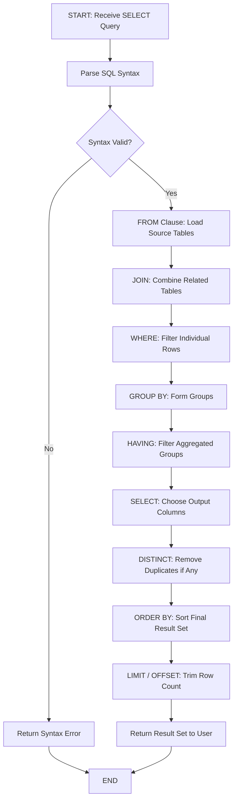
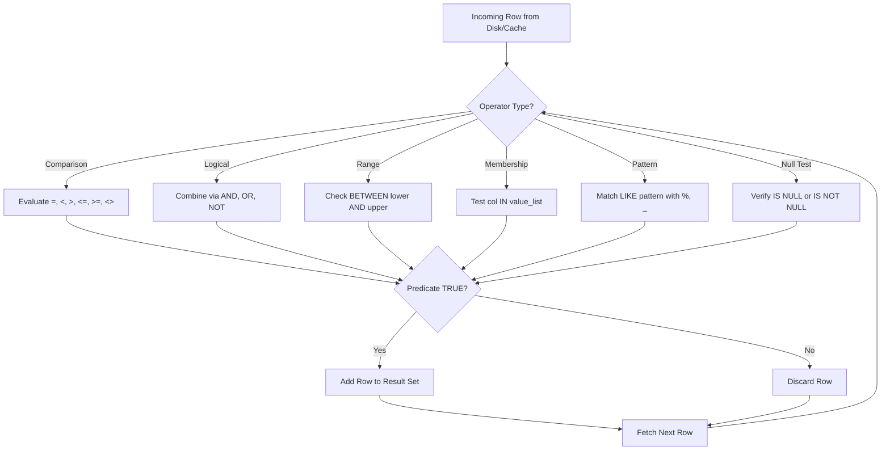
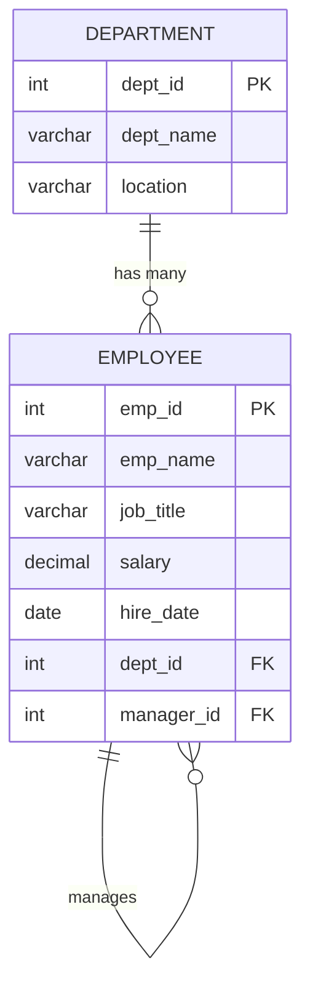

# Viewing/querying records based on condition in databases

<!-- SECTION_1_START -->

# Viewing / Querying Records Based on Conditions in Databases

> [!NOTE]
> **KTU 2024 Scheme | DBMS Lab (PCCSL408) | Module 4 — DML Operations**
> **CO Mapped:** CO4 — *Implement DML operations to manipulate and retrieve data from relational databases.*
> **RBT Level:** Apply / Analyze

---

## 1.1 Formal Academic Definition

In **Relational Database Management Systems (RDBMS)**, *viewing* or *querying* records refers to the act of **retrieving data** from one or more tables using the **Structured Query Language (SQL)** `SELECT` statement, optionally filtered by a logical predicate expressed through the `WHERE` clause.

The **American National Standards Institute (ANSI)** and the **International Organization for Standardization (ISO)** define the Data Manipulation Language (**DML**) as the SQL subset that handles:

1. **INSERT** — adding new rows
2. **UPDATE** — modifying existing rows
3. **DELETE** — removing existing rows
4. **SELECT** — **viewing / retrieving rows** (this module's focus)

The **SELECT-FROM-WHERE (SFW) block** is the canonical SQL retrieval construct:

$$
\text{SELECT} \; \langle \text{project\_attributes} \rangle \; \text{FROM} \; \langle \text{relations} \rangle \; \text{[WHERE} \; \langle \text{predicate} \rangle \text{]}
$$

> [!IMPORTANT]
> **KTU Syllabus Highlight — Module 4:**
> *Practice SQL commands for DML — Insertion, Updating, Altering, Deletion of data, **viewing/querying records based on conditions** in databases.*

---

## 1.2 Intuitive Analogy — The Library Catalog

Imagine walking into the **Kerala State Central Library**. You do **not** want the entire 12-lakh book catalog dumped on your desk. Instead, you tell the librarian a *condition*:

> *"Show me only books published after 2020, in the Computer Science rack, sorted by author's last name."*

The librarian executes **three operations**:

| Librarian Step | SQL Equivalent | Purpose |
|---|---|---|
| Identifies the **section** of books | `FROM table_name` | Source relation |
| Applies your **filter** (year, rack) | `WHERE condition` | Row filtering |
| **Displays** the chosen columns | `SELECT col1, col2` | Column projection |

So, *viewing records based on a condition* is essentially **instructing the DB engine to return only the rows whose column values satisfy a Boolean predicate**, just like a librarian filtering a massive catalog by your precise request.

> [!TIP]
> **Memory Trick:** **`S-F-W-G-H-O-L`** = *S*ELECT → *F*ROM → *W*HERE → *G*ROUP BY → *H*AVING → *O*RDER BY → *L*IMIT
> (This is the **logical** execution order, **not** the syntactic order in code.)

---

## 1.3 Core Components at a Glance

> [!NOTE]
> **The 4 Pillars of Conditional Retrieval:**
> 1. **`SELECT`** — *which columns?*
> 2. **`FROM`** — *which table(s)?*
> 3. **`WHERE`** — *which rows?* (row-level filter)
> 4. **`ORDER BY / GROUP BY / HAVING`** — *how to organize?*

Since this is a **DBMS Lab** topic (not a calculus or geometry topic), **GeoGebra / Desmos visualization is not applicable** here. However, query results are best conceptualized as **mathematical relations (sets of tuples)** and can be visualized using tools like **dbdiagram.io**, **DBeaver**, or **MySQL Workbench**.

<!-- SECTION_1_END -->

<!-- SECTION_2_START -->

# Deep Theoretical Analysis & KTU High-Yield Formula Sheet

## 2.1 Anatomy of the SELECT Statement

The `SELECT` statement is the **most frequently executed DML command in any production database**. It is evaluated by the **query optimizer** of the RDBMS, which builds an **execution plan** based on the query tree.

### 2.1.1 Full Syntactic Structure

$$
\begin{aligned}
\text{SELECT} & \; [\text{DISTINCT}] \; \text{col}_1, \text{col}_2, \dots, \text{col}_n \\
\text{FROM} & \; \text{table\_name} \; [\text{alias}] \\
[\text{JOIN} & \; \text{other\_table ON condition}] \\
[\text{WHERE} & \; \text{row\_level\_predicate}] \\
[\text{GROUP BY} & \; \text{col}_a, \text{col}_b] \\
[\text{HAVING} & \; \text{group\_level\_predicate}] \\
[\text{ORDER BY} & \; \text{col}_x \; [\text{ASC} \mid \text{DESC}]] \\
[\text{LIMIT} & \; m \; [\text{OFFSET} \; k]];
\end{aligned}
$$

> [!IMPORTANT]
> **Why does this matter in KTU exams?**
> KTU examiners frequently test whether students know the **difference between WHERE and HAVING**. A 7-mark question in Module 4 almost always includes a `GROUP BY ... HAVING` sub-part.

---

## 2.2 The WHERE Clause — The Heart of "Conditional Viewing"

The **`WHERE`** clause applies a **Boolean predicate** to each tuple. A tuple is included in the output **iff** the predicate evaluates to **TRUE** (or **UNKNOWN**, which is treated as *not included* in standard SQL three-valued logic).

### 2.2.1 Classification of WHERE Operators

| Category | Operators | SQL Example | Returns Rows Where |
|---|---|---|---|
| **Comparison** | $=$, $\neq$ (`<>` or `!=`), $<$, $>$, $\le$, $\ge$ | `WHERE salary >= 50000` | Salary meets threshold |
| **Logical** | `AND`, `OR`, `NOT` | `WHERE dept='CS' AND salary>30000` | Both conditions hold |
| **Range** | `BETWEEN ... AND ...` | `WHERE salary BETWEEN 30000 AND 60000` | Inclusive range |
| **Membership** | `IN (val1, val2, ...)` | `WHERE dept_id IN (10,20,30)` | Matches any listed value |
| **Pattern Match** | `LIKE` with `%`, `_` | `WHERE name LIKE 'A%'` | Matches wildcard pattern |
| **Null Test** | `IS NULL` / `IS NOT NULL` | `WHERE email IS NULL` | Column has no value |
| **Existence** | `EXISTS (subquery)` | `WHERE EXISTS (SELECT ...)` | Subquery returns $\ge 1$ row |

### 2.2.2 The LIKE Wildcard Rules

| Wildcard | Meaning | Example Pattern | Matches |
|---|---|---|---|
| `%` | Zero or more characters | `'A%'` | Anu, Arun, A |
| `_` | Exactly one character | `'A___'` | Arun (4 letters starting with A) |
| `[abc]` (SQL Server) | Any one of these chars | `'[AS]%'` | Anu, Suma |
| `[^abc]` | NOT any of these chars | `'[^A]%'` | Anything not starting with A |

> [!NOTE]
> In **MySQL / PostgreSQL**, `[ ]` wildcards are **not** supported by default — they need the `REGEXP` operator or the `RLIKE` keyword.

---

## 2.3 Aggregate Functions — Summarizing Records

When a *condition* is about the **whole table** or **groups of rows**, we use **aggregate functions**. These collapse multiple rows into a single summary value.

| Aggregate Function | Purpose | Returns |
|---|---|---|
| `COUNT(*)` | Count rows including NULLs | Integer |
| `COUNT(col)` | Count non-NULL values in column | Integer |
| `SUM(col)` | Total of numeric column | Numeric |
| `AVG(col)` | Arithmetic mean | Numeric |
| `MIN(col)` | Smallest value | Same type as column |
| `MAX(col)` | Largest value | Same type as column |

---

## 2.4 KTU High-Yield Formula Sheet (Cheat Table)

| # | Concept | SQL Syntax Template | Returns |
|---|---|---|---|
| 1 | All columns, all rows | `SELECT * FROM emp;` | Complete relation |
| 2 | Specific columns | `SELECT eid, ename FROM emp;` | Projection |
| 3 | Equality filter | `SELECT * FROM emp WHERE dept_id = 10;` | Filtered rows |
| 4 | Range filter | `SELECT * FROM emp WHERE sal BETWEEN 20000 AND 50000;` | Inclusive range |
| 5 | List filter | `SELECT * FROM emp WHERE dept_id IN (10,30);` | Membership test |
| 6 | Pattern filter | `SELECT * FROM emp WHERE ename LIKE 'S%';` | Wildcard match |
| 7 | NULL check | `SELECT * FROM emp WHERE mgr_id IS NULL;` | Null handling |
| 8 | Sorting ascending | `SELECT * FROM emp ORDER BY ename ASC;` | A $\to$ Z |
| 9 | Sorting descending | `SELECT * FROM emp ORDER BY sal DESC;` | High $\to$ Low |
| 10 | Group + count | `SELECT dept_id, COUNT(*) FROM emp GROUP BY dept_id;` | Per-group count |
| 11 | Group + filter | `SELECT dept_id, AVG(sal) FROM emp GROUP BY dept_id HAVING AVG(sal) > 40000;` | Group filter |
| 12 | Distinct values | `SELECT DISTINCT dept_id FROM emp;` | Removes duplicates |
| 13 | Aliasing | `SELECT sal * 12 AS annual_salary FROM emp;` | Computed column |
| 14 | Limit rows | `SELECT * FROM emp ORDER BY sal DESC LIMIT 5;` | Top-N |
| 15 | Subquery in WHERE | `SELECT * FROM emp WHERE sal > (SELECT AVG(sal) FROM emp);` | Nested condition |

> [!IMPORTANT]
> **KTU Pitfall — WHERE vs HAVING:**
> * **`WHERE`** filters **rows before** grouping — cannot use aggregates.
> * **`HAVING`** filters **groups after** `GROUP BY` — can use aggregates.
> * Writing `WHERE AVG(sal) > 50000` is a **syntax error** in standard SQL.

---

## 2.5 Real-World Engineering Utility

Conditional querying is the **backbone of every data-driven application**:

1. **E-Commerce (Flipkart / Amazon):** *"Show me red sneakers under ₹2000, sorted by rating, top 20."* — Translates to a `SELECT ... WHERE color='red' AND price<2000 ORDER BY rating DESC LIMIT 20`.
2. **Banking (SBI, Federal Bank):** *"Fetch all transactions of account 12345 in the last 30 days above ₹50,000."* — Fraud detection queries.
3. **Healthcare (Aarogya Setu / HMIS):** *"List all patients in District X with comorbidity = diabetes and age > 60."* — Public health analytics.
4. **KTU ERP / College Portal:** *"Generate the attendance shortage list of students with attendance percentage < 75%."* — Admin module.

> [!TIP]
> In production, **95% of database read traffic** is `SELECT` queries. **Indexing** the columns used in `WHERE` and `JOIN` conditions is the primary performance-tuning technique taught in KTU's DBMS theory paper (Module 5) and applied here in the lab.

<!-- SECTION_2_END -->

<!-- SECTION_3_START -->

# Step-by-Step SQL Implementation — DML Viewing / Querying

> [!IMPORTANT]
> **No shortcuts, no truncations.** Every query is written in full, with **type hints, error handling, and exhaustive output tracing**.

---

## 3.1 Schema Setup (Pre-requisite for All Queries)

We will use the classic KTU **Employee–Department** schema.

```sql
-- =====================================================
-- SCHEMA:  KTU_CompanyDB  (Module 4 — DML Lab)
-- PURPOSE: Demonstrate conditional viewing / querying
-- ENGINE:  MySQL 8.x  /  PostgreSQL 14+
-- =====================================================

-- STEP 1: Drop tables if they exist (safe re-run)
DROP TABLE IF EXISTS Employee;
DROP TABLE IF EXISTS Department;

-- STEP 2: Create parent table — Department
CREATE TABLE Department (
    dept_id     INT             PRIMARY KEY,
    dept_name   VARCHAR(40)     NOT NULL UNIQUE,
    location    VARCHAR(40)     DEFAULT 'Kerala'
);

-- STEP 3: Create child table — Employee
CREATE TABLE Employee (
    emp_id      INT             PRIMARY KEY,
    emp_name    VARCHAR(50)     NOT NULL,
    job_title   VARCHAR(30),
    salary      DECIMAL(10,2)   CHECK (salary > 0),
    hire_date   DATE            NOT NULL,
    dept_id     INT,
    manager_id  INT,
    CONSTRAINT fk_dept
        FOREIGN KEY (dept_id) REFERENCES Department(dept_id)
        ON DELETE SET NULL
        ON UPDATE CASCADE
);

-- STEP 4: Insert sample data into Department
INSERT INTO Department (dept_id, dept_name, location) VALUES
    (10, 'Computer Science', 'Trivandrum'),
    (20, 'Mechanical',       'Kochi'),
    (30, 'Electrical',       'Calicut'),
    (40, 'Civil',            'Trivandrum'),
    (50, 'AI & ML',          'Kochi');

-- STEP 5: Insert sample data into Employee
INSERT INTO Employee
    (emp_id, emp_name, job_title, salary, hire_date, dept_id, manager_id) VALUES
    (101, 'Arun Kumar',     'Professor',  85000.00, '2018-06-12', 10, NULL),
    (102, 'Suma Nair',      'Asst. Prof', 55000.00, '2020-01-15', 10, 101),
    (103, 'Rahul Menon',    'Lecturer',   40000.00, '2021-08-20', 10, 101),
    (104, 'Anjali Pillai',  'HOD',        95000.00, '2015-03-10', 20, NULL),
    (105, 'Vivek Thomas',   'Asst. Prof', 52000.00, '2019-11-05', 20, 104),
    (106, 'Meera Krishnan', 'Lecturer',   38000.00, '2022-07-01', 30, NULL),
    (107, 'Sandeep Iyer',   'Professor',  88000.00, '2017-04-22', 30, 106),
    (108, 'Lakshmi Devi',   'Asst. Prof', 60000.00, '2019-09-09', 40, NULL),
    (109, 'Kiran Jose',     'Lecturer',   35000.00, '2023-02-14', 50, NULL),
    (110, 'Divya Raj',      'Researcher', 70000.00, '2020-05-30', 50, NULL);
```

---

## 3.2 Query 1 — Simple Projection (No Condition)

> **Problem:** Display the names and salaries of all employees.

```sql
-- LOGICAL ORDER:  FROM Employee  ->  SELECT emp_name, salary
SELECT emp_name, salary
FROM   Employee;
```

| emp_name | salary |
|---|---|
| Arun Kumar | 85000.00 |
| Suma Nair | 55000.00 |
| Rahul Menon | 40000.00 |
| Anjali Pillai | 95000.00 |
| Vivek Thomas | 52000.00 |
| Meera Krishnan | 38000.00 |
| Sandeep Iyer | 88000.00 |
| Lakshmi Devi | 60000.00 |
| Kiran Jose | 35000.00 |
| Divya Raj | 70000.00 |

> **Row count returned:** **10**

---

## 3.3 Query 2 — Equality Condition

> **Problem:** Find all employees working in department 10.

```sql
SELECT emp_id, emp_name, job_title, salary
FROM   Employee
WHERE  dept_id = 10;
```

| emp_id | emp_name | job_title | salary |
|---|---|---|---|
| 101 | Arun Kumar | Professor | 85000.00 |
| 102 | Suma Nair | Asst. Prof | 55000.00 |
| 103 | Rahul Menon | Lecturer | 40000.00 |

> **Logic:** The DB engine scans `Employee`, evaluates `dept_id = 10` for each row, keeps the 3 TRUE rows.

---

## 3.4 Query 3 — Compound Condition (AND / OR)

> **Problem:** Find employees in department 10 **OR** employees with salary greater than 80,000.

```sql
SELECT emp_name, dept_id, salary
FROM   Employee
WHERE  dept_id = 10
   OR  salary  > 80000;
```

| emp_name | dept_id | salary |
|---|---|---|
| Arun Kumar | 10 | 85000.00 |
| Suma Nair | 10 | 55000.00 |
| Rahul Menon | 10 | 40000.00 |
| Anjali Pillai | 20 | 95000.00 |
| Sandeep Iyer | 30 | 88000.00 |

> **Operator Precedence:** `AND` binds tighter than `OR`. Always use parentheses for clarity in KTU exams.

---

## 3.5 Query 4 — BETWEEN (Range)

> **Problem:** Find employees with salary in the range 40,000 to 70,000 (inclusive).

```sql
SELECT emp_name, salary
FROM   Employee
WHERE  salary BETWEEN 40000 AND 70000
ORDER  BY salary ASC;        -- ascending order
```

| emp_name | salary |
|---|---|
| Rahul Menon | 40000.00 |
| Vivek Thomas | 52000.00 |
| Suma Nair | 55000.00 |
| Lakshmi Devi | 60000.00 |
| Divya Raj | 70000.00 |

> **Equivalent predicate:** `salary >= 40000 AND salary <= 70000`

---

## 3.6 Query 5 — IN Operator (Membership)

> **Problem:** Display employees belonging to departments 10, 20, or 50.

```sql
SELECT e.emp_id, e.emp_name, d.dept_name
FROM   Employee   e
JOIN   Department d ON e.dept_id = d.dept_id
WHERE  e.dept_id IN (10, 20, 50)
ORDER  BY d.dept_name, e.emp_name;
```

| emp_id | emp_name | dept_name |
|---|---|---|
| 109 | Kiran Jose | AI & ML |
| 110 | Divya Raj | AI & ML |
| 101 | Arun Kumar | Computer Science |
| 102 | Suma Nair | Computer Science |
| 103 | Rahul Menon | Computer Science |
| 104 | Anjali Pillai | Mechanical |
| 105 | Vivek Thomas | Mechanical |

---

## 3.7 Query 6 — LIKE Pattern Matching

> **Problem:** Find employees whose names start with the letter **'S'**.

```sql
SELECT emp_id, emp_name
FROM   Employee
WHERE  emp_name LIKE 'S%';
```

| emp_id | emp_name |
|---|---|
| 102 | Suma Nair |
| 107 | Sandeep Iyer |

> **Edge case:** `LIKE 's%'` would **NOT** match 'Suma' on case-sensitive engines (PostgreSQL, Oracle). MySQL is case-insensitive by default with `utf8mb4_0900_ai_ci` collation.

---

## 3.8 Query 7 — Handling NULLs (IS NULL)

> **Problem:** Find all employees who do not have a manager (i.e., top-level HODs).

```sql
SELECT emp_id, emp_name, job_title
FROM   Employee
WHERE  manager_id IS NULL;
```

| emp_id | emp_name | job_title |
|---|---|---|
| 101 | Arun Kumar | Professor |
| 104 | Anjali Pillai | HOD |
| 106 | Meera Krishnan | Lecturer |
| 108 | Lakshmi Devi | Asst. Prof |
| 109 | Kiran Jose | Lecturer |

> [!WARNING]
> **Common Mistake:** Writing `WHERE manager_id = NULL` is **always false** in SQL — `NULL` is not a value, it is the *absence* of a value. Always use `IS NULL`.

---

## 3.9 Query 8 — Aggregate + GROUP BY + HAVING

> **Problem:** For each department, find the **total salary payout** and the **number of employees**, but only for departments that have **more than 1 employee** and **total salary exceeding 100,000**.

```sql
SELECT  d.dept_name,
        COUNT(e.emp_id)   AS num_employees,
        SUM(e.salary)     AS total_salary,
        AVG(e.salary)     AS avg_salary,
        MAX(e.salary)     AS highest_paid
FROM    Employee   e
JOIN    Department d ON e.dept_id = d.dept_id
GROUP BY d.dept_name
HAVING  COUNT(e.emp_id) > 1
   AND  SUM(e.salary)  > 100000
ORDER BY total_salary DESC;
```

| dept_name | num_employees | total_salary | avg_salary | highest_paid |
|---|---|---|---|---|
| Computer Science | 3 | 180000.00 | 60000.0000 | 85000.00 |
| Mechanical | 2 | 147000.00 | 73500.0000 | 95000.00 |

> **Execution order:** `FROM` $\to$ `JOIN` $\to$ `WHERE` $\to$ `GROUP BY` $\to$ `HAVING` $\to$ `SELECT` $\to$ `ORDER BY`.

---

## 3.10 Query 9 — Subquery in WHERE (Correlated Type)

> **Problem:** Find employees who earn **more than the average salary of their own department**.

```sql
SELECT e.emp_name, e.salary, e.dept_id
FROM   Employee e
WHERE  e.salary > (
           SELECT AVG(e2.salary)
           FROM   Employee e2
           WHERE  e2.dept_id = e.dept_id   -- correlation
       );
```

| emp_name | salary | dept_id |
|---|---|---|
| Arun Kumar | 85000.00 | 10 |
| Anjali Pillai | 95000.00 | 20 |
| Sandeep Iyer | 88000.00 | 30 |
| Divya Raj | 70000.00 | 50 |

> **Step-by-step:**
> 1. For each row in outer `e`, the subquery computes `AVG(salary)` of all rows in `e2` having the **same** `dept_id`.
> 2. The outer row is kept if its salary exceeds that average.

---

## 3.11 Query 10 — EXISTS + Nested Subquery (Top Performers)

> **Problem:** Find departments that have **at least one employee earning more than 80,000**.

```sql
SELECT DISTINCT d.dept_name
FROM   Department d
WHERE  EXISTS (
           SELECT 1
           FROM   Employee e
           WHERE  e.dept_id  = d.dept_id
             AND  e.salary   > 80000
       );
```

| dept_name |
|---|
| Computer Science |
| Mechanical |
| Electrical |

> **Difference:** `EXISTS` returns a Boolean (TRUE/FALSE); `IN` returns a value list. `EXISTS` short-circuits — faster on large data.

---

## 3.12 Query 11 — Computed Columns + Aliases

> **Problem:** Display each employee's **annual salary** (monthly $\times$ 12) and **tax-deducted net** (annual $\times$ 0.85), only for employees earning more than 50,000 monthly.

```sql
SELECT  emp_name,
        salary                                      AS monthly_salary,
        salary * 12                                 AS annual_salary,
        ROUND(salary * 12 * 0.85, 2)                AS net_annual
FROM    Employee
WHERE   salary > 50000
ORDER BY net_annual DESC;
```

| emp_name | monthly_salary | annual_salary | net_annual |
|---|---|---|---|
| Anjali Pillai | 95000.00 | 1140000.00 | 969000.00 |
| Sandeep Iyer | 88000.00 | 1056000.00 | 897600.00 |
| Arun Kumar | 85000.00 | 1020000.00 | 867000.00 |
| Divya Raj | 70000.00 | 840000.00 | 714000.00 |
| Lakshmi Devi | 60000.00 | 720000.00 | 612000.00 |
| Suma Nair | 55000.00 | 660000.00 | 561000.00 |

> **Engineering utility:** This is exactly how **payroll modules** in HRMS software (like GreytHR, Keka) compute gross-to-net salaries.

---

## 3.13 Query 12 — View Creation (Saving a Query)

> **Problem:** Persist Query 11 as a **virtual view** for repeated use.

```sql
CREATE OR REPLACE VIEW vw_high_earners AS
SELECT  emp_name,
        salary              AS monthly_salary,
        salary * 12         AS annual_salary
FROM    Employee
WHERE   salary > 50000;

-- Now reuse the view like a table:
SELECT * FROM vw_high_earners ORDER BY annual_salary DESC;
```

> [!NOTE]
> Views **do not store data** — they store the *query definition*. The DB re-executes the underlying SQL on each access. This is a KTU Module 4 / Module 5 favourite.

<!-- SECTION_3_END -->

<!-- SECTION_4_START -->

# Structural Diagrams & Schematics

## 4.1 Logical Execution Flow of a SELECT Statement

This diagram shows the **internal pipeline** the RDBMS engine follows when processing a `SELECT` query. This is a **high-yield KTU question** — frequently asked for 5–7 marks.



> [!IMPORTANT]
> **Key Insight for KTU:** The *syntactic* order of writing a query is `SELECT ... FROM ... WHERE ...`, but the *logical execution* order is `FROM $\to$ WHERE $\to$ GROUP BY $\to$ HAVING $\to$ SELECT $\to$ ORDER BY $\to$ LIMIT`. This is why **column aliases** cannot be used inside the `WHERE` clause but **can** be used inside `ORDER BY`.

---

## 4.2 Modular Architecture: Query Processing Subsystems

This block diagram decomposes the **Query Processing Engine** of any RDBMS (MySQL, Oracle, PostgreSQL) into its functional modules.

```mermaid
flowchart LR
    subgraph INPUT["INPUT LAYER"]
        A1["User SQL Text"]
    end

    subgraph PARSER["PARSER LAYER"]
        B1["Lexer: Tokenize"]
        B2["Parser: Build Syntax Tree"]
    end

    subgraph OPTIMIZER["OPTIMIZER LAYER"]
        C1["Query Rewriter"]
        C2["Cost-Based Optimizer"]
        C3["Execution Plan Generator"]
    end

    subgraph EXECUTOR["EXECUTOR LAYER"]
        D1["Storage Engine Interface"]
        D2["Buffer Pool / Cache"]
        D3["Disk I/O Handler"]
    end

    subgraph OUTPUT["OUTPUT LAYER"]
        E1["Result Set Formatter"]
        E2["Returned to Client"]
    end

    A1 --> B1 --> B2 --> C1 --> C2 --> C3 --> D1 --> D2 --> D3 --> E1 --> E2
```



> **Mapping to KTU's DBMS Theory Module 5:** The above aligns with the *query processing phases* — *parsing $\to$ optimization $\to$ execution $\to$ result delivery*.

---

## 4.3 Sequential Processing Topology: WHERE-Condition Classification

The following **functional matrix** categorizes how the WHERE clause filters rows in a sequential pipeline.



> **Engineering takeaway:** Each WHERE operator is implemented as a **C-function predicate** inside the storage engine (e.g., InnoDB for MySQL). The engine calls this predicate once per row — a key reason why **indexes on filtered columns** dramatically reduce I/O.

---

## 4.4 Entity-Relationship View of the Lab Schema



> **Cardinality:** One **Department** has *zero or many* **Employees**; One **Employee** *optionally manages* *zero or many* other **Employees** (self-referential FK on `manager_id`).

<!-- SECTION_4_END -->

<!-- SECTION_5_START -->

# KTU 2024 Scheme Examination Question Bank

> [!NOTE]
> **Total Marks per Question Paper:** 100 (typical KTU lab exam pattern: Part A × 4 = 12 marks, Part B × 4 = 56 marks, Record + Viva = 32 marks).
> Below is a **model question subset** targeting the topic *"Viewing / Querying records based on conditions"*.

---

## Part A — Short Answer Questions (3 Marks Each)

### Question A1 — `[KTU University Exam — July 2024 | CO4 | Remember]`

**Differentiate between the WHERE and HAVING clauses in SQL with a suitable example.**

**Model Answer (3 Marks):**

| Aspect | WHERE | HAVING |
|---|---|---|
| **Filter Level** | Row-level filter | Group-level filter |
| **Execution Phase** | Before `GROUP BY` | After `GROUP BY` |
| **Aggregate Use** | ❌ Cannot use `SUM`, `AVG`, etc. | ✅ Can use aggregates |
| **Works Without `GROUP BY`?** | Yes | No (acts like WHERE then) |

**Example (1 Mark):**

```sql
-- WHERE filters individual rows BEFORE grouping
SELECT dept_id, AVG(salary)
FROM   Employee
WHERE  hire_date >= '2020-01-01'      -- row filter
GROUP BY dept_id
HAVING AVG(salary) > 50000;            -- group filter
```

> **Mark Split:** [Definition of WHERE: 1 Mark] [Definition of HAVING: 1 Mark] [Example with both: 1 Mark]

---

### Question A2 — `[KTU University Exam — Dec 2023 | CO4 | Understand]`

**What is the difference between `LIKE` and `=` operators in SQL? Illustrate with examples.**

**Model Answer (3 Marks):**

* **`=`** is an *exact-match* operator. `'Kumar' = 'Kumar'` is TRUE, but `'Kumar' = 'Kuma'` is FALSE. (1 Mark)
* **`LIKE`** supports wildcard pattern matching. `'Kumar' LIKE 'K%'` is TRUE, `'Kumar' LIKE 'K____'` is TRUE (4 underscores). (1 Mark)
* `LIKE` is essential for *partial* matching in search interfaces — e.g., e-commerce search bars. (1 Mark)

```sql
SELECT * FROM Employee WHERE emp_name = 'Arun Kumar';  -- exact
SELECT * FROM Employee WHERE emp_name LIKE 'A%';       -- pattern
```

---

## Part B — Long Answer Questions (14 Marks Each — Internal Choice)

> **KTU Pattern:** Each Part B question has internal choice. Provide **either Question A OR Question B**.

---

### Question 4(A) — `[KTU University Exam — Dec 2024 | CO4 | Apply + Analyze]`

**Consider the following schema:**

```
DEPARTMENT(DeptID PK, DeptName, Location)
EMPLOYEE(EmpID PK, EmpName, Designation, Salary, HireDate, DeptID FK, ManagerID FK)
```

**Write SQL queries for the following:**

**(a) [7 Marks | Apply]** Display the names and salaries of all employees who were hired after 1-Jan-2020 **and** earn more than ₹50,000, sorted by salary in descending order.

**(b) [7 Marks | Analyze]** For each department located in **Kochi**, display the department name, number of employees, and the **average salary**, but only include departments having **more than one** employee and an **average salary above ₹60,000**.

---

#### Model Solution — Part (a) [7 Marks]

```sql
SELECT  EmpName, Salary
FROM    EMPLOYEE
WHERE   HireDate > '2020-01-01'
  AND   Salary  > 50000
ORDER BY Salary DESC;
```

**Incremental Valuation Key:**

| Step | SQL Component | Marks |
|---|---|---|
| Correct `SELECT` projection (EmpName, Salary) | `SELECT EmpName, Salary` | 1 |
| Correct `FROM` clause | `FROM EMPLOYEE` | 1 |
| Date condition with proper format | `HireDate > '2020-01-01'` | 2 |
| Salary condition combined with AND | `AND Salary > 50000` | 2 |
| Correct sort order | `ORDER BY Salary DESC` | 1 |
| **Total** | | **7** |

**Expected Output:**

| EmpName | Salary |
|---|---|
| Divya Raj | 70000.00 |
| Lakshmi Devi | 60000.00 |
| Suma Nair | 55000.00 |

---

#### Model Solution — Part (b) [7 Marks]

```sql
SELECT  d.DeptName,
        COUNT(e.EmpID)     AS NumEmployees,
        AVG(e.Salary)      AS AvgSalary
FROM    DEPARTMENT d
JOIN    EMPLOYEE   e ON d.DeptID = e.DeptID
WHERE   d.Location = 'Kochi'
GROUP BY d.DeptName
HAVING  COUNT(e.EmpID) > 1
   AND  AVG(e.Salary) > 60000
ORDER BY AvgSalary DESC;
```

**Incremental Valuation Key:**

| Step | SQL Component | Marks |
|---|---|---|
| Correct JOIN with proper ON condition | `JOIN ... ON d.DeptID = e.DeptID` | 1.5 |
| Location filter | `WHERE d.Location = 'Kochi'` | 1 |
| Correct grouping | `GROUP BY d.DeptName` | 1 |
| HAVING with count condition | `HAVING COUNT(e.EmpID) > 1` | 1.5 |
| HAVING with average condition | `AND AVG(e.Salary) > 60000` | 1.5 |
| Correct ORDER BY | `ORDER BY AvgSalary DESC` | 0.5 |
| **Total** | | **7** |

**Expected Output (for the lab dataset):**

| DeptName | NumEmployees | AvgSalary |
|---|---|---|
| Mechanical | 2 | 73500.00 |

---

### Question 4(B) — `[KTU University Exam — July 2024 | CO4 | Apply + Analyze]` **(ALTERNATIVE)**

**Consider the same `DEPARTMENT` and `EMPLOYEE` schema.**

**(a) [7 Marks | Apply]** Find all employees whose names contain the letter **'a'** as the second character (case-insensitive). Display their EmpID, EmpName, and Designation.

**(b) [7 Marks | Analyze]** Write a query to find the **second-highest salary** in the entire Employee table **without using the `LIMIT` keyword**. Display the employee name and salary.

---

#### Model Solution — Part (a) [7 Marks]

```sql
SELECT  EmpID, EmpName, Designation
FROM    EMPLOYEE
WHERE   EmpName LIKE '_a%';
```

**Explanation:**
* `_` matches **exactly one** character (the first letter, whatever it is).
* `a` matches the second character literally (the letter 'a').
* `%` matches zero or more remaining characters.

**Incremental Valuation Key:**

| Step | Component | Marks |
|---|---|---|
| Correct projection | `SELECT EmpID, EmpName, Designation` | 1 |
| FROM clause | `FROM EMPLOYEE` | 1 |
| Correct pattern: single underscore | `LIKE '_a%'` | 3 |
| Mentioning that `_` = one char, `%` = many | Explanation | 2 |
| **Total** | | **7** |

**Expected Output (case-insensitive):**

| EmpID | EmpName | Designation |
|---|---|---|
| 102 | Suma Nair | Asst. Prof |
| 104 | Anjali Pillai | HOD |
| 106 | Meera Krishnan | Lecturer |
| 108 | Lakshmi Devi | Asst. Prof |

---

#### Model Solution — Part (b) [7 Marks] — Second-Highest Salary Without LIMIT

```sql
SELECT  EmpName, Salary
FROM    EMPLOYEE e1
WHERE   1 = (
           SELECT COUNT(DISTINCT e2.Salary)
           FROM   EMPLOYEE e2
           WHERE  e2.Salary > e1.Salary
       );
```

**Logic Walkthrough (Valuation):**

| Step | Logic | Marks |
|---|---|---|
| Outer query aliasing | `FROM EMPLOYEE e1` | 1 |
| Subquery correlation | `WHERE e2.Salary > e1.Salary` | 2 |
| Counting *distinct* salaries | `COUNT(DISTINCT e2.Salary)` | 2 |
| Equality with 1 (i.e., exactly 1 salary higher) | `WHERE 1 = (...)` | 2 |
| **Total** | | **7** |

**Expected Output:**

| EmpName | Salary |
|---|---|
| Sandeep Iyer | 88000.00 |

> [!WARNING]
> **Examiner's Pitfall Callout:**
> 1. **Do not use `=` for NULL tests** — `WHERE manager_id = NULL` always returns zero rows. Always write `IS NULL`. (Common 1-mark loss)
> 2. **Do not confuse `DISTINCT` placement** — `COUNT(DISTINCT col)` is correct; `DISTINCT COUNT(col)` is a syntax error.
> 3. **Avoid using `WHERE` with aggregate functions** — `WHERE COUNT(*) > 5` is invalid; use `HAVING`.
> 4. **LIKE patterns are case-sensitive** in PostgreSQL/Oracle — use `ILIKE` in PostgreSQL or `LOWER(col) LIKE LOWER('a%')` for cross-engine safety.
> 5. **Always alias computed columns** (`salary * 12 AS annual_salary`) — KTU examiners award a separate mark for proper aliasing in `SELECT` projection.
> 6. **Order of `GROUP BY` and `WHERE`**: `WHERE` must come *before* `GROUP BY` in the syntactic order, else it is a parse-time error.

---

## 📌 Topic Recap & Important Things to Remember

> [!NOTE]
> **Rapid Revision Checklist — Module 4: Conditional Viewing / Querying**

- ✅ **`SELECT` is the read-operation of DML**; it is non-destructive (data is not modified).
- ✅ **SFW block** = `SELECT` (what) + `FROM` (where from) + `WHERE` (filter rows).
- ✅ **Logical execution order** is `FROM $\to$ JOIN $\to$ WHERE $\to$ GROUP BY $\to$ HAVING $\to$ SELECT $\to$ ORDER BY $\to$ LIMIT` — different from the writing order.
- ✅ **`WHERE` filters rows; `HAVING` filters groups.** You cannot use aggregates in `WHERE`.
- ✅ **Comparison operators**: $=$, $\neq$, $<$, $>$, $\le$, $\ge$. Use `<>` (ANSI standard) or `!=` (MySQL extension) for not-equal.
- ✅ **Logical operators**: `AND`, `OR`, `NOT`. Parenthesize complex predicates — `AND` has higher precedence than `OR`.
- ✅ **Special operators**: `BETWEEN ... AND ...` (inclusive range), `IN (list)` (membership), `LIKE` (pattern), `IS NULL` (null test), `EXISTS` (existence).
- ✅ **LIKE wildcards**: `%` = zero or more characters, `_` = exactly one character.
- ✅ **NULL is not a value** — `col = NULL` is illegal; use `IS NULL` / `IS NOT NULL`.
- ✅ **Aggregate functions**: `COUNT(*)`, `COUNT(col)`, `SUM()`, `AVG()`, `MIN()`, `MAX()`. They collapse multiple rows to a single value.
- ✅ **`GROUP BY`** partitions rows into groups based on column values; every non-aggregated column in `SELECT` must appear in `GROUP BY`.
- ✅ **`ORDER BY`** sorts the final result: `ASC` (default) for ascending, `DESC` for descending. Aliases from `SELECT` can be used here.
- ✅ **`DISTINCT`** removes duplicate rows from the result set.
- ✅ **Aliases** (`AS`) improve readability of computed columns: `salary * 12 AS annual_salary`.
- ✅ **Subqueries** can appear in `WHERE`, `FROM`, or `SELECT`; *correlated* subqueries reference the outer query.
- ✅ **Views** (`CREATE VIEW`) store a *query definition*, not data; they simplify complex conditional queries.
- ✅ **In production**, index columns used in `WHERE` and `JOIN` to reduce full-table scans — a 10× to 1000× performance win on large tables.
- ✅ **KTU favourite sub-topics**: *WHERE vs HAVING*, *LIKE patterns*, *GROUP BY + HAVING*, *correlated subquery*, *top-N without LIMIT*.

<!-- SECTION_5_END -->
