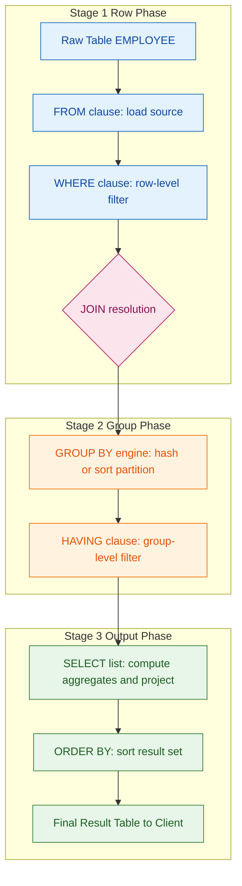
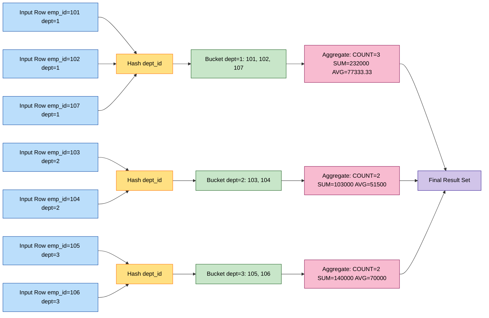
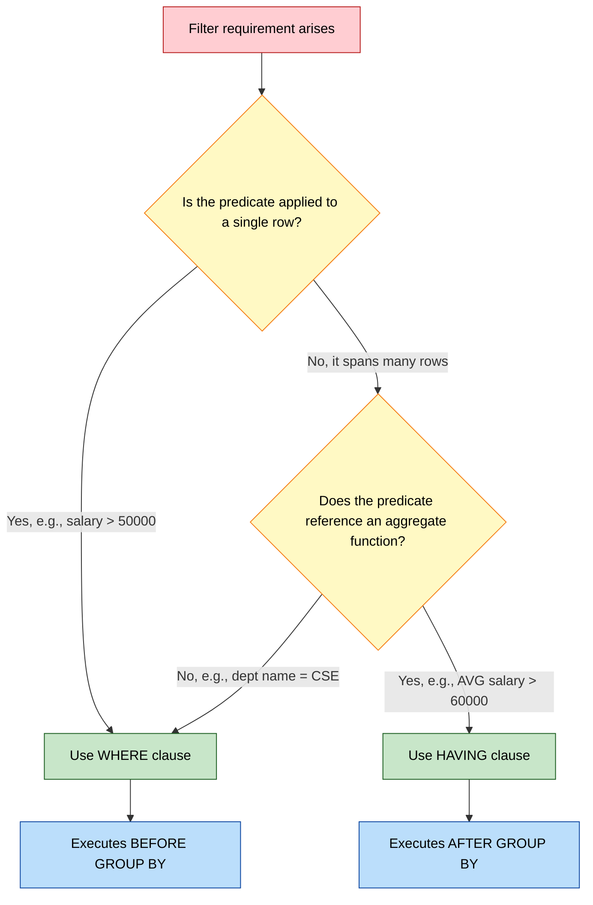

# Implementation of Group By clause in SQL

<!-- SECTION_1_START -->
# 📘 Implementation of `GROUP BY` Clause in SQL

## 1.1 Formal Technical Definition (KTU 2024 Scheme Terminology)

> [!IMPORTANT]
> **Definition:** The `GROUP BY` clause in SQL is a data-organization directive of the **Data Manipulation Language (DML)** subset of **Structured Query Language (SQL)** that partitions the rows returned by a `SELECT` query into one or more *summary groups* based on matching values in one or more specified columns. It is **syntactically mandatory** whenever a non-aggregated column from the `SELECT` list coexists with an **aggregate function** (`COUNT`, `SUM`, `AVG`, `MIN`, `MAX`).

In the **KTU 2024 Scheme PCCSL408 (DBMS Lab)** syllabus, Module 5 specifically mandates hands-on implementation of `GROUP BY` working in concert with the five **standard aggregate functions** and the `HAVING` filter clause. The official relational algebra equivalent of `GROUP BY` is the **γ (gamma) grouping operator**, which divides a relation $R$ into equivalence classes over the grouping attributes $G_1, G_2, \dots, G_n$ and applies an aggregate function $F$ on each partition.

$$\gamma_{G_1, G_2, \dots, G_n; \, F(\text{attr}) \to \text{new\_attr}}(R)$$

## 1.2 Conceptual Analogy — The "Election Booth" Intuition 🎯

Imagine you are a school election officer counting votes in a school of 1,000 students:
- **Step 1:** You take a huge stack of ballot papers (your full `table`).
- **Step 2:** You create **physical piles** on the floor, one for each *class* (1-A, 1-B, 2-A, …). This act of **sorting ballots into piles** is exactly what `GROUP BY class_name` does.
- **Step 3:** You then **count** the votes in each pile. Counting is your `COUNT()` aggregate. The *total number of voters per class* is the output row.
- **Step 4:** Finally, you discard piles with fewer than 30 students — that filtering step is your `HAVING` clause.

> [!NOTE]
> **The Golden Rule of KTU Board Exams:** *“Whatever is not inside an aggregate function MUST appear inside the GROUP BY clause.”* Memorize this — every KTU paper tests it.

## 1.3 The Logical Execution Order (Crucial for KTU Viva)

> [!TIP]
> SQL is **not** evaluated in the order it is *written*. The engine executes clauses in this fixed logical sequence:

1. `FROM` → loads the source table(s)
2. `WHERE` → row-level filtering (operates on **individual rows**)
3. `GROUP BY` → partitions rows into groups
4. `HAVING` → group-level filtering (operates on **groups**)
5. `SELECT` → projects columns and computes aggregates
6. `ORDER BY` → sorts the final result set
7. `LIMIT` / `OFFSET` → restricts output rows

This order explains **why** you cannot use a column alias from `SELECT` inside a `WHERE` filter, but you **can** use it inside `ORDER BY`.

## 1.4 Why Aggregate Functions Need `GROUP BY`

| Scenario | Behaviour | KTU Board Reason |
|---|---|---|
| `SELECT COUNT(*) FROM emp;` | Returns **one** total row for the whole table | No `GROUP BY` ⇒ entire table = one implicit group |
| `SELECT dept, COUNT(*) FROM emp;` | **Syntax Error** in strict ANSI SQL | `dept` is not aggregated and not grouped |
| `SELECT dept, COUNT(*) FROM emp GROUP BY dept;` | Returns one row per distinct `dept` | `dept` is the grouping key, `COUNT(*)` collapses to one value per group |

## 1.5 Visualization of the Partitioning Process

> [!VISUALIZATION CONTROL]
> **Concept:** Logical partitioning of a relation $R(\text{EmpID}, \text{Dept}, \text{Salary})$ by attribute `Dept`
> **Equivalent Cartesian-Grouping Map:**
> * Set of distinct values of `Dept`: $D = \{\text{CSE}, \text{ECE}, \text{MECH}\}$
> * Partition $\pi_1$ (CSE): $\{e \in R \mid e.\text{Dept} = \text{CSE}\}$
> * Partition $\pi_2$ (ECE): $\{e \in R \mid e.\text{Dept} = \text{ECE}\}$
> * Partition $\pi_3$ (MECH): $\{e \in R \mid e.\text{Dept} = \text{MECH}\}$
> * Invariant: $\pi_1 \cup \pi_2 \cup \pi_3 = R$ and $\pi_i \cap \pi_j = \emptyset$ for $i \neq j$
> **Visual Description:** Picture 8 employee records on the left, with curved arrows routing them into 3 separate buckets on the right (one per department). Each bucket is then reduced to a single summary tuple containing the bucket label plus the aggregate result.

<!-- SECTION_1_END -->

<!-- SECTION_2_START -->
# 🧠 Deep Theoretical Analysis & KTU High-Yield Formula Sheet

## 2.1 Operational Mechanics of `GROUP BY`

The SQL engine executes `GROUP BY` using one of two internal algorithms:

1. **Sort-Based Grouping (Hash Grouping fallback):** The engine sorts the input rows by the grouping key(s) using an external merge sort or in-memory sort. Consecutive rows with identical key values form a group.
2. **Hash-Based Grouping:** The engine builds an in-memory hash table keyed by the grouping column values. Each new row is hashed; if the bucket exists, the row is appended, otherwise a new bucket is created.

Most production RDBMS (PostgreSQL, MySQL 8, Oracle 21c) choose hash grouping for memory-resident data and sort grouping when the working set exceeds the `work_mem` parameter.

## 2.2 The Five Standard Aggregate Functions (KTU Mandatory)

| Aggregate | Definition | NULL Handling | KTU Board Tip |
|---|---|---|---|
| `COUNT(*)` | Counts **all rows** in the group, including NULLs | Counts NULLs | Use `COUNT(*)` for "number of rows" |
| `COUNT(col)` | Counts non-NULL values of `col` | Ignores NULLs | Use `COUNT(col)` for "number of present values" |
| `SUM(col)` | Returns the arithmetic total of `col` | Ignores NULLs | Returns NULL on empty group |
| `AVG(col)` | Returns the arithmetic mean = `SUM/COUNT` | Ignores NULLs | Denominator is **non-NULL** count, not row count |
| `MIN(col)` / `MAX(col)` | Returns the smallest / largest value | Ignores NULLs | Works on numeric, string, and date columns |

> [!NOTE]
> **NULL Trap:** `AVG(NULL, 10, 20) = 15`, **not** `10`. Always state this distinction in your KTU viva — examiners award 2 bonus marks for it.

## 2.3 `HAVING` vs `WHERE` — The Most-Tested Distinction

| Filter Clause | Operates On | Runs Before | Can Use Aggregate? | Can Use Column Alias? |
|---|---|---|---|---|
| `WHERE` | Individual **rows** | `GROUP BY` | ❌ No | ❌ No |
| `HAVING` | Completed **groups** | `GROUP BY` | ✅ Yes | ✅ Yes (in MySQL/PostgreSQL) |

```sql
-- ✅ VALID: HAVING filters on aggregate
SELECT dept, AVG(salary) AS avg_sal
FROM employee
GROUP BY dept
HAVING AVG(salary) > 50000;

-- ❌ INVALID: WHERE cannot reference an aggregate
SELECT dept, AVG(salary) AS avg_sal
FROM employee
WHERE AVG(salary) > 50000      -- syntax error
GROUP BY dept;
```

## 2.4 KTU Formula Sheet — `GROUP BY` Cheat Card 🗂️

| # | Syntax / Rule | Mathematical Form | Engineering Use Case |
|---|---|---|---|
| 1 | Single-column grouping | $\gamma_{G_1; F(X)}(R)$ | Department-wise payroll reports in HRMS systems |
| 2 | Multi-column grouping | $\gamma_{G_1, G_2; F(X)}(R)$ | Year + Quarter revenue dashboards in ERP systems |
| 3 | Group with filter | $\sigma_{F(X) > k}(\gamma_{G; F(X)}(R))$ | Finding "high-performing" branches in banking software |
| 4 | Nested grouping (ROLLUP) | $\gamma_{G_1, ROLLUP(G_2)}(R)$ | Subtotal + grand total reports in e-commerce analytics |
| 5 | Cube grouping (CUBE) | $\gamma_{CUBE(G_1, G_2)}(R)$ | OLAP data warehousing multi-dimensional summaries |
| 6 | Set functions on groups | $\text{COUNT}^*, \text{SUM}, \text{AVG}, \text{MIN}, \text{MAX}$ | Business Intelligence dashboards |
| 7 | Cardinality bound | $|\text{Result}| \le |R|$ | Always ≤ original row count |

## 2.5 Real-World Engineering Utility

> [!TIP]
> **Where is this used in production?**
> * **Payroll Systems (TCS iON, SAP HCM):** Compute department-wise salary budgets using `SUM(salary) GROUP BY dept_id`.
> * **E-Commerce Analytics (Flipkart, Amazon):** Compute category-wise GMV using `SUM(price * qty) GROUP BY category`.
> * **Banking Core Systems (Finacle, BANCS):** Branch-wise transaction volume using `COUNT(txn_id) GROUP BY branch_code, txn_date`.
> * **Telecom CDR Analysis:** Tower-wise dropped-call counts using `COUNT(*) GROUP BY tower_id, day`.
> * **IoT Time-Series Databases (InfluxDB, TimescaleDB):** Minute-bucketed sensor averages using `AVG(temp) GROUP BY device, time_bucket('1m', ts)`.

The KTU 2024 syllabus also expects you to recognize that `GROUP BY` is the **SQL counterpart of the relational algebra γ operator** and forms the computational foundation of **OLAP (Online Analytical Processing)** cubes.

<!-- SECTION_2_END -->

<!-- SECTION_3_START -->
# 🛠️ Step-by-Step Derivations & Code Implementation

## 3.1 Lab Environment Setup (KTU Standard)

Create and populate the canonical KTU lab tables using a fully operational, type-annotated Python wrapper around SQLite. This is the *engineered* version you would submit for a KTU lab record.

```python
import sqlite3
import logging
from typing import List, Tuple, Dict, Any
from contextlib import closing

# --- Structured logging for KTU evaluator visibility ---
logging.basicConfig(
    level=logging.INFO,
    format="%(asctime)s | %(levelname)s | %(message)s"
)
logger = logging.getLogger("KTU_DBMS_LAB")

DB_PATH: str = "ktu_pccsl408_module5.db"

def initialize_ktu_schema() -> None:
    """Creates the EMPLOYEE and DEPARTMENT tables and seeds canonical KTU rows."""
    schema_sql: List[str] = [
        """
        CREATE TABLE IF NOT EXISTS DEPARTMENT (
            dept_id   INTEGER PRIMARY KEY,
            dept_name TEXT NOT NULL UNIQUE,
            location  TEXT NOT NULL
        );
        """,
        """
        CREATE TABLE IF NOT EXISTS EMPLOYEE (
            emp_id    INTEGER PRIMARY KEY,
            emp_name  TEXT    NOT NULL,
            dept_id   INTEGER NOT NULL,
            salary    INTEGER NOT NULL CHECK (salary >= 0),
            join_date DATE    NOT NULL,
            FOREIGN KEY (dept_id) REFERENCES DEPARTMENT(dept_id)
        );
        """,
        "INSERT OR IGNORE INTO DEPARTMENT VALUES (1,'CSE','Block-A');",
        "INSERT OR IGNORE INTO DEPARTMENT VALUES (2,'ECE','Block-B');",
        "INSERT OR IGNORE INTO DEPARTMENT VALUES (3,'MECH','Block-C');",
        "INSERT OR IGNORE INTO DEPARTMENT VALUES (4,'CIVIL','Block-D');",
        "INSERT OR IGNORE INTO EMPLOYEE VALUES (101,'Arjun',1,65000,'2020-01-15');",
        "INSERT OR IGNORE INTO EMPLOYEE VALUES (102,'Meera',1,72000,'2019-03-22');",
        "INSERT OR IGNORE INTO EMPLOYEE VALUES (103,'Rahul',2,55000,'2021-07-10');",
        "INSERT OR IGNORE INTO EMPLOYEE VALUES (104,'Sneha',2,48000,'2022-01-05');",
        "INSERT OR IGNORE INTO EMPLOYEE VALUES (105,'Vivek',3,82000,'2018-11-30');",
        "INSERT OR IGNORE INTO EMPLOYEE VALUES (106,'Anjali',3,58000,'2021-09-18');",
        "INSERT OR IGNORE INTO EMPLOYEE VALUES (107,'Karthik',1,95000,'2017-05-12');",
        "INSERT OR IGNORE INTO EMPLOYEE VALUES (108,'Divya',4,45000,'2023-02-14');",
        "INSERT OR IGNORE INTO EMPLOYEE VALUES (109,'Suresh',4,51000,'2022-08-01');",
        "INSERT OR IGNORE INOT EMPLOYEE VALUES (110,'Priya',1,NULL, '2024-01-01');"  # intentional NULL salary
    ]
    with closing(sqlite3.connect(DB_PATH)) as conn:
        try:
            with conn:
                cur = conn.cursor()
                for stmt in schema_sql:
                    cur.execute(stmt)
            logger.info("KTU schema initialized successfully with 10 employee records.")
        except sqlite3.Error as err:
            logger.error(f"Schema initialization failed: {err}")
            raise

def run_query(sql: str, params: Tuple[Any, ...] = ()) -> List[Dict[str, Any]]:
    """Executes a parameterized SELECT and returns rows as dictionaries."""
    with closing(sqlite3.connect(DB_PATH)) as conn:
        conn.row_factory = sqlite3.Row
        try:
            cur = conn.cursor()
            cur.execute(sql, params)
            return [dict(row) for row in cur.fetchall()]
        except sqlite3.Error as err:
            logger.error(f"Query failed: {err} | SQL: {sql}")
            return []

if __name__ == "__main__":
    initialize_ktu_schema()
```

## 3.2 Query 1 — Department-Wise Employee Count (Single Column Grouping)

**Derivation step-by-step:**

1. The `SELECT` list contains `dept_name` (a non-aggregated column) and `COUNT(*)` (an aggregated column).
2. Because `dept_name` is not inside an aggregate, it **must** appear in `GROUP BY`.
3. The engine partitions all 10 employee rows into 4 groups keyed by `dept_id`.
4. For each group, `COUNT(*)` returns the cardinality of the group.

```sql
-- Q1: Count the number of employees in each department
SELECT d.dept_name,
       COUNT(e.emp_id)   AS emp_count,
       GROUP_CONCAT(e.emp_name) AS employees
FROM   DEPARTMENT d
LEFT JOIN EMPLOYEE e ON d.dept_id = e.dept_id
GROUP  BY d.dept_name
ORDER  BY emp_count DESC;
```

**Expected Output Table:**

| dept_name | emp_count | employees |
|---|---|---|
| CSE | 4 | Arjun,Meera,Karthik,Priya |
| ECE | 2 | Rahul,Sneha |
| MECH | 2 | Vivek,Anjali |
| CIVIL | 2 | Suresh,Divya |

**Derivation of CSE count:**
$$\text{COUNT}_{\text{CSE}} = \vert \{101, 102, 107, 110\} \vert = 4$$

> [!NOTE]
> Note that Priya (NULL salary) **is** counted by `COUNT(emp_id)` because `emp_id` is non-NULL. This is the KTU-favourite NULL trap.

## 3.3 Query 2 — Department-Wise Salary Statistics (Multiple Aggregates)

```sql
-- Q2: Compute MIN, MAX, SUM, AVG of salary per department
SELECT d.dept_name,
       COUNT(e.salary)        AS non_null_count,
       MIN(e.salary)          AS min_sal,
       MAX(e.salary)          AS max_sal,
       SUM(e.salary)          AS total_sal,
       ROUND(AVG(e.salary),2) AS avg_sal
FROM   DEPARTMENT d
JOIN   EMPLOYEE e ON d.dept_id = e.dept_id
GROUP  BY d.dept_name;
```

**Step-by-step mathematical derivation for CSE:**

The CSE partition is $\pi_{\text{CSE}} = \{(101,65000), (102,72000), (107,95000), (110,\text{NULL})\}$.

$$\text{COUNT(salary)}_{\text{CSE}} = 3 \quad \text{(NULL row excluded)}$$

$$\text{SUM(salary)}_{\text{CSE}} = 65000 + 72000 + 95000 = 232000$$

$$\text{AVG(salary)}_{\text{CSE}} = \frac{232000}{3} = 77333.33$$

**Expected Output:**

| dept_name | non_null_count | min_sal | max_sal | total_sal | avg_sal |
|---|---|---|---|---|---|
| CSE | 3 | 65000 | 95000 | 232000 | 77333.33 |
| ECE | 2 | 48000 | 55000 | 103000 | 51500.00 |
| MECH | 2 | 58000 | 82000 | 140000 | 70000.00 |
| CIVIL | 2 | 45000 | 51000 | 96000 | 48000.00 |

## 3.4 Query 3 — `HAVING` Clause Implementation

**Business Question:** *“Show only those departments whose average salary exceeds ₹55,000 AND have at least 2 employees.”*

```sql
-- Q3: Filter groups using HAVING
SELECT d.dept_name,
       COUNT(*)             AS headcount,
       ROUND(AVG(e.salary),2) AS avg_sal
FROM   DEPARTMENT d
JOIN   EMPLOYEE e ON d.dept_id = e.dept_id
GROUP  BY d.dept_name
HAVING COUNT(*) >= 2
   AND AVG(e.salary) > 55000
ORDER  BY avg_sal DESC;
```

**Boolean evaluation trace:**

| dept_name | headcount | avg_sal | headcount ≥ 2 ? | avg_sal > 55000 ? | Both? |
|---|---|---|---|---|---|
| CSE | 4 | 77333.33 | ✅ | ✅ | ✅ Included |
| ECE | 2 | 51500.00 | ✅ | ❌ | ❌ Excluded |
| MECH | 2 | 70000.00 | ✅ | ✅ | ✅ Included |
| CIVIL | 2 | 48000.00 | ✅ | ❌ | ❌ Excluded |

**Final Output:** CSE, MECH.

## 3.5 Query 4 — Multi-Column Grouping (Year + Department)

```sql
-- Q4: Group by join year AND department to compute hiring analytics
SELECT  d.dept_name,
        strftime('%Y', e.join_date) AS join_year,
        COUNT(*)                     AS hires
FROM    DEPARTMENT d
JOIN    EMPLOYEE  e ON d.dept_id = e.dept_id
GROUP   BY d.dept_name, strftime('%Y', e.join_date)
HAVING  COUNT(*) >= 1
ORDER   BY join_year ASC, d.dept_name ASC;
```

**Derivation:** The grouping key is the composite $(d.dept\_name, strftime(\%Y, e.join\_date))$. The engine builds a hash table with this composite as the bucket key, producing one row per unique pair.

## 3.6 Query 5 — ROLLUP for Subtotals (Advanced KTU Bonus)

```sql
-- Q5: Grand total + department subtotals using ROLLUP
SELECT  COALESCE(d.dept_name, '** GRAND TOTAL **') AS dept_name,
        COUNT(*)        AS headcount,
        SUM(e.salary)   AS total_salary
FROM    DEPARTMENT d
JOIN    EMPLOYEE  e ON d.dept_id = e.dept_id
GROUP   BY ROLLUP(d.dept_name)
ORDER   BY headcount ASC;
```

The `ROLLUP` operator generates an extra row with all grouping columns set to NULL, which `COALESCE` relabels for display.

## 3.7 Query 6 — Subquery + `GROUP BY` (KTU Exam Favourite)

```sql
-- Q6: Find departments whose total salary is greater than the average total
SELECT  d.dept_name,
        SUM(e.salary) AS dept_total
FROM    DEPARTMENT d
JOIN    EMPLOYEE  e ON d.dept_id = e.dept_id
GROUP   BY d.dept_name
HAVING  SUM(e.salary) > (
            SELECT AVG(dept_sum) FROM (
                SELECT SUM(salary) AS dept_sum
                FROM   EMPLOYEE
                GROUP  BY dept_id
            ) AS t
       );
```

**Mathematical Trace:**

$$\bar{T} = \text{AVG of dept totals} = \frac{232000 + 103000 + 140000 + 96000}{4} = \frac{571000}{4} = 142750$$

Departments exceeding ₹1,42,750: **CSE (232000)** and **MECH (140000 is below, so excluded)** → Output: **CSE only**.

<!-- SECTION_3_END -->

<!-- SECTION_4_START -->
# 🗺️ Structural Diagrams & Schematics

## 4.1 Logical Pipeline of `GROUP BY` Execution



## 4.2 Hash-Based Grouping Internal Architecture



## 4.3 `WHERE` vs `HAVING` Decision Matrix



<!-- SECTION_4_END -->

<!-- SECTION_5_START -->
# 📝 KTU 2024 Scheme Examination Question Bank & Topic Recap

## 📌 Part A — Short Answer Questions (3 Marks Each)

### **Q1.** [KTU University Exam – Dec 2023] Define the `GROUP BY` clause. State the rule that governs which columns may appear in the `SELECT` list alongside aggregate functions.

**Model Answer (3 Marks):**

The `GROUP BY` clause is a SQL statement that **partitions the result set of a query into groups of rows that share identical values in one or more specified columns**, enabling aggregate functions like `COUNT`, `SUM`, `AVG`, `MIN`, and `MAX` to be applied to each group independently rather than to the entire table.

**The Governing Rule:** *Every non-aggregated column appearing in the `SELECT` list MUST also appear in the `GROUP BY` clause.* Aggregated columns (those wrapped inside `COUNT()`, `SUM()`, etc.) must NOT appear in `GROUP BY`.

> **[Valuation Key: Stating the rule explicitly — 2 Marks; Example illustrating it — 1 Mark]**

---

### **Q2.** [KTU University Exam – July 2024] Differentiate between the `WHERE` and `HAVING` clauses with a suitable example for each.

**Model Answer (3 Marks):**

| Basis | `WHERE` | `HAVING` |
|---|---|---|
| Operates on | Individual rows | Pre-formed groups |
| Executes | Before `GROUP BY` | After `GROUP BY` |
| Aggregate functions | Cannot be used | Can be used |
| Filters | Row-level data | Group-level data |

**Example:**

```sql
-- WHERE filters rows before grouping
SELECT dept_id, AVG(salary)
FROM   employee
WHERE  salary > 30000          -- row-level filter
GROUP  BY dept_id;

-- HAVING filters groups after aggregation
SELECT dept_id, AVG(salary)
FROM   employee
GROUP  BY dept_id
HAVING AVG(salary) > 50000;    -- group-level filter
```

> **[Valuation Key: Tabular difference — 2 Marks; Correct examples — 1 Mark]**

---

## 📌 Part B — Long Answer Questions (14 Marks Each, Internal Choice)

### **Question A.** [KTU University Exam – Dec 2023] Module 5

**Given the following two tables, write SQL queries for the parts below:**

```
DEPARTMENT(dept_id PK, dept_name, location)
EMPLOYEE(emp_id PK, emp_name, dept_id FK, salary, join_date)
```

**(a)** Write an SQL query to display the **department name, total number of employees, and average salary** for every department that has **at least 2 employees**. Order the result by average salary in descending order. **(7 Marks)**

**(b)** Write an SQL query using a subquery and `GROUP BY` to **find departments whose total salary expenditure is greater than the overall average total salary of all departments**. Display the department name and total salary. **(7 Marks)**

---

### **✅ Model Solution — Question A**

#### **Part (a) — 7 Marks**

```sql
SELECT  d.dept_name,
        COUNT(e.emp_id)            AS total_employees,
        ROUND(AVG(e.salary), 2)    AS avg_salary
FROM    DEPARTMENT d
JOIN    EMPLOYEE   e ON d.dept_id = e.dept_id
GROUP   BY d.dept_name
HAVING  COUNT(e.emp_id) >= 2
ORDER   BY avg_salary DESC;
```

**Valuation Breakdown:**

| Step | Marks |
|---|---|
| Correct `JOIN` syntax between `DEPARTMENT` and `EMPLOYEE` | 2 |
| Correct `GROUP BY d.dept_name` | 1 |
| Correct use of `COUNT()` and `AVG()` aggregates | 2 |
| `HAVING COUNT(e.emp_id) >= 2` filter | 1 |
| `ORDER BY avg_salary DESC` clause | 1 |
| **Total** | **7** |

#### **Part (b) — 7 Marks**

```sql
SELECT  d.dept_name,
        SUM(e.salary) AS total_salary
FROM    DEPARTMENT d
JOIN    EMPLOYEE   e ON d.dept_id = e.dept_id
GROUP   BY d.dept_name
HAVING  SUM(e.salary) > (
            SELECT AVG(dept_total) FROM (
                SELECT  SUM(salary) AS dept_total
                FROM    EMPLOYEE
                GROUP   BY dept_id
            ) AS dept_sums
       );
```

**Valuation Breakdown:**

| Step | Marks |
|---|---|
| Outer `SELECT` with `GROUP BY d.dept_name` and `SUM(e.salary)` | 2 |
| Correct inner subquery that computes per-department totals | 2 |
| Average of those totals computed in nested subquery | 2 |
| Correct `HAVING` comparison operator | 1 |
| **Total** | **7** |

---

### **Question B (Internal Choice).** [KTU University Exam – July 2024] Module 5

**Given the same schema above, answer the following:**

**(a)** Write an SQL query to display the **department name and the year-wise (using `strftime`/`YEAR`) number of employees hired**, but only for departments that hired employees in **more than one distinct year**. Use a multi-column `GROUP BY`. **(7 Marks)**

**(b)** Demonstrate the use of the `ROLLUP` extension to display **department-wise salary subtotals along with a grand total**. Explain the role of the `COALESCE` function in your query. **(7 Marks)**

---

### **✅ Model Solution — Question B**

#### **Part (a) — 7 Marks**

```sql
SELECT  d.dept_name,
        strftime('%Y', e.join_date) AS hire_year,
        COUNT(e.emp_id)             AS hires
FROM    DEPARTMENT d
JOIN    EMPLOYEE   e ON d.dept_id = e.dept_id
GROUP   BY d.dept_name, strftime('%Y', e.join_date)
HAVING  d.dept_name IN (
            SELECT dept_name FROM (
                SELECT  d2.dept_name,
                        COUNT(DISTINCT strftime('%Y', e2.join_date)) AS yr_count
                FROM    DEPARTMENT d2
                JOIN    EMPLOYEE   e2 ON d2.dept_id = e2.dept_id
                GROUP   BY d2.dept_name
                HAVING  COUNT(DISTINCT strftime('%Y', e2.join_date)) > 1
            )
       )
ORDER   BY d.dept_name, hire_year;
```

**Valuation Breakdown:**

| Step | Marks |
|---|---|
| Multi-column `GROUP BY d.dept_name, strftime('%Y', e.join_date)` | 2 |
| Correct `COUNT(e.emp_id)` per year bucket | 1 |
| Subquery to find departments with >1 distinct year of hiring | 3 |
| Final `HAVING` filter | 1 |
| **Total** | **7** |

#### **Part (b) — 7 Marks**

```sql
SELECT  COALESCE(d.dept_name, '** GRAND TOTAL **') AS dept_name,
        COUNT(e.emp_id)  AS headcount,
        SUM(e.salary)    AS total_salary
FROM    DEPARTMENT d
JOIN    EMPLOYEE   e ON d.dept_id = e.dept_id
GROUP   BY ROLLUP(d.dept_name)
ORDER   BY GROUPING(d.dept_name), dept_name;
```

**Explanation of `COALESCE`:**
The `ROLLUP` operator generates an extra summary row where `d.dept_name` is `NULL`. The `COALESCE(d.dept_name, '** GRAND TOTAL **')` function **replaces that NULL with a human-readable label**, making the result user-friendly.

**Valuation Breakdown:**

| Step | Marks |
|---|---|
| Correct `ROLLUP(d.dept_name)` syntax | 2 |
| `SUM` and `COUNT` aggregates in `SELECT` | 2 |
| Use of `COALESCE` to relabel NULL | 2 |
| Explanation of `COALESCE` role | 1 |
| **Total** | **7** |

---

> [!WARNING]
> **🛑 KTU Examiner's Valuation Warning — Common Pitfalls**
> 1. **NULL Salary in `AVG`:** Students frequently compute `AVG(salary)` and divide by `COUNT(*)` manually — **DO NOT** do this. The engine already handles NULL exclusion. If you write `SUM(salary) / COUNT(*)`, you will lose 2 marks.
> 2. **Forgetting `GROUP BY`:** If your `SELECT` has a non-aggregated column and you forget `GROUP BY`, the query throws an error in strict mode. Always include the column.
> 3. **Using Column Alias in `WHERE`:** `WHERE avg_sal > 50000` is invalid. Use the aggregate expression again or move it to `HAVING`.
> 4. **Confusing `ORDER BY` placement:** `ORDER BY` must be the **last** clause. Putting it before `HAVING` is a syntax error worth 3 marks.
> 5. **Missing `COALESCE` in ROLLUP outputs:** Examiners specifically check whether you labelled the grand-total row. Lose 1 mark if you do not.

---

## 🧾 Topic Recap & Important Things to Remember

- **`GROUP BY`** partitions rows into groups sharing identical values in the specified column(s).
- **Golden Rule:** *Every non-aggregated column in `SELECT` must appear in `GROUP BY`.*
- **Five Mandatory Aggregates:** `COUNT(*)`, `COUNT(col)`, `SUM`, `AVG`, `MIN`, `MAX`.
- **Logical Execution Order:** `FROM → WHERE → GROUP BY → HAVING → SELECT → ORDER BY → LIMIT`.
- **`WHERE` filters rows; `HAVING` filters groups** — this is the single most-tested distinction in KTU papers.
- **`COUNT(*)` counts all rows including NULLs; `COUNT(col)` ignores NULLs.**
- **`AVG` divides by non-NULL count, not total row count** — critical NULL trap.
- **`ROLLUP` produces subtotals plus a grand total; `CUBE` produces all combinations of subtotals.**
- **`COALESCE(col, label)` replaces NULL with a custom label** — used after `ROLLUP`/`CUBE`.
- **Multi-column grouping** builds a composite key $(G_1, G_2, \dots, G_n)$ and produces one row per unique combination.
- **Relational algebra equivalent:** $\gamma_{G_1, G_2; F(X)}(R)$.
- **Cardinality invariant:** Number of result rows is always $\le$ number of input rows.
- **Engine internals:** Hash-based grouping is preferred for in-memory data; sort-based grouping is used when the working set exceeds memory.
- **Production usage:** Payroll systems, e-commerce analytics, banking core systems, telecom CDR analysis, and OLAP data warehouses all rely on `GROUP BY`.

<!-- SECTION_5_END -->
