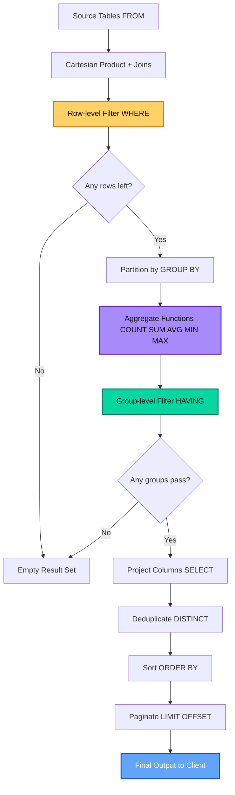
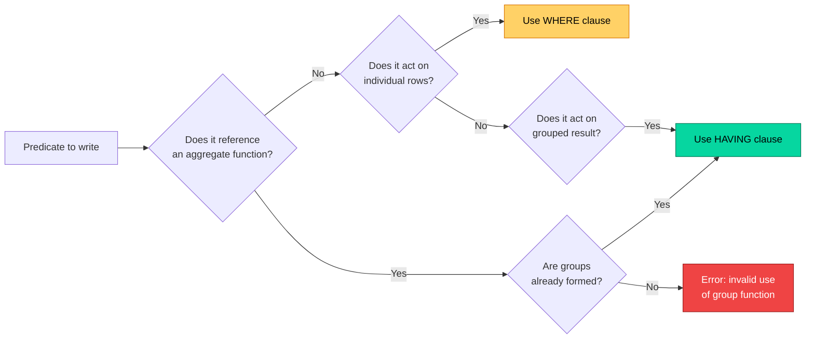
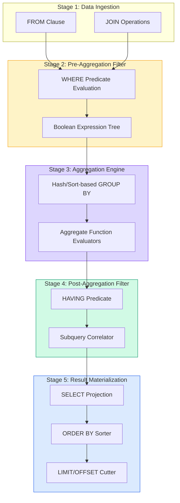
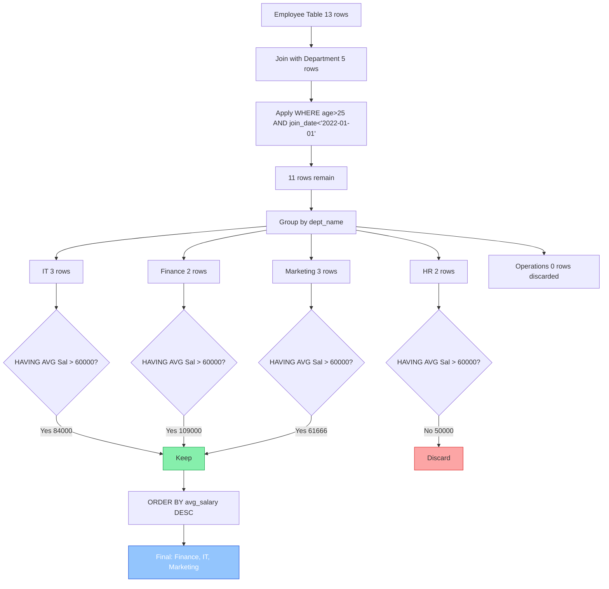

# Implementation of Having clause in SQL

<!-- SECTION_1_START -->
# HAVING Clause in SQL — Implementation, Semantics & Lab Mastery

## 1.1 Formal KTU 2024 Definition

> [!IMPORTANT]
> **HAVING Clause (SQL — ISO/IEC 9075 Standard):**
> The `HAVING` clause is a data-filtering construct in Structured Query Language (SQL) that operates **after** the `GROUP BY` aggregation phase. It filters rows produced by `GROUP BY` (or aggregate projections) based on a **predicate evaluated against grouped/aggregated values**, using aggregate functions such as `COUNT()`, `SUM()`, `AVG()`, `MIN()`, and `MAX()`.

In the KTU 2024 Scheme DBMS Lab (PCCSL408) syllabus, the `HAVING` clause is positioned as the **post-aggregation filter** that distinguishes *row-level filtering* (handled by `WHERE`) from *group-level filtering* (handled by `HAVING`).

## 1.2 Conceptual Analogy — The Classroom Result Analogy

Imagine a school with **50 classrooms**, each containing 40 students:

| Stage | SQL Clause | Classroom Analogy |
|---|---|---|
| Source data | `FROM` | All 2,000 student records |
| Grouping | `GROUP BY` | Cluster students into their 50 classrooms |
| Row-level filter | `WHERE` | Remove *individual* under-18 students **before** counting |
| Aggregation | `SELECT` (with `COUNT`, `AVG`) | Compute average marks **per classroom** |
| Group-level filter | `HAVING` | Discard classrooms where average < 40 **after** computing average |

> [!NOTE]
> **Critical Distinction:**
> - `WHERE` sees **individual rows** (cannot use aggregate functions).
> - `HAVING` sees **grouped result sets** (uses aggregate functions).

## 1.3 Where HAVING Fits in the SQL Logical Execution Order

SQL is **not** executed in the order it is written. The KTU lab manual and board questions frequently test this order:

```
Logical Query Processing Order (ANSI SQL):
  1. FROM          (source tables, joins)
  2. WHERE         (row-level filter — NO aggregates allowed)
  3. GROUP BY      (partition rows into groups)
  4. HAVING        (group-level filter — aggregates ALLOWED)
  5. SELECT        (projection, computed columns)
  6. DISTINCT      (duplicate elimination)
  7. ORDER BY      (final sort — aliases from SELECT visible here)
  8. LIMIT / OFFSET (pagination)
```

> [!TIP]
> **Why this order matters in your lab exam:** A common KTU valuation error is using an alias defined in `SELECT` inside `WHERE`. This is illegal because `WHERE` executes **before** `SELECT`. Use `HAVING` (which executes **after** `GROUP BY` and conceptual projection) carefully — column aliases from `SELECT` are still not allowed in `HAVING` in most databases (MySQL being a notable exception).

## 1.4 Engineering Relevance

In real-world systems, the `HAVING` clause underpins:

- **OLAP Reporting Dashboards** (e.g., "Show departments with total sales > ₹10,00,000")
- **Fraud Detection Pipelines** (e.g., "Accounts with > 5 failed transactions in last hour")
- **Data Warehouse Star-Schema Queries** (Snowflake, BigQuery, Redshift)
- **Anomaly Detection in IoT** (e.g., "Sensors whose average reading deviates by > 3σ")
- **HR/Payroll Analytics** (e.g., "Departments where avg salary > company average")

> [!VISUALIZATION CONTROL]
> **Concept:** Visualizing WHERE vs HAVING filter zones on a grouped dataset.
> **Conceptual Coordinate Mapping:**
> * x-axis: number of records per group
> * y-axis: aggregate value (e.g., SUM)
> * Each dot = one group. **WHERE** removes dots whose *raw row data* fails; **HAVING** removes dots whose *aggregated y-value* fails.
> **Visual Description:** Imagine a scatter plot where x is group size and y is SUM(amount). WHERE draws a vertical cut (filters by raw rows), HAVING draws a horizontal cut (filters by aggregate y-value).

<!-- SECTION_1_END -->

<!-- SECTION_2_START -->
# Deep Theoretical Analysis & KTU High-Yield Formula Sheet

## 2.1 The Complete HAVING Clause — Grammatical Specification (Backus–Naur Form)

```
havingClause  ::= HAVING havingCondition
havingCondition ::= booleanExpression
booleanExpression ::= predicate ( AND predicate )*
predicate ::= aggregateFunction ( columnRef ) comparisonOp value
            | columnRef comparisonOp value
            | booleanExpression logicalOp booleanExpression
```

**Key syntactic rules** (verified against ISO/IEC 9075:2016 and MySQL 8.0 / PostgreSQL 15 reference manuals used in KTU labs):

1. `HAVING` may reference any column from `GROUP BY` directly.
2. `HAVING` may invoke aggregate functions on non-grouped columns.
3. `HAVING` may use scalar subqueries (correlated or uncorrelated).
4. `HAVING` is **optional** when `GROUP BY` exists; mandatory semantics demand at least one aggregated predicate for meaningful filtering.

## 2.2 Logical Evaluation — Stepwise Trace

Let us trace the canonical KTU lab query:

```sql
SELECT Department, COUNT(*) AS emp_count, AVG(Salary) AS avg_sal
FROM   Employee
WHERE  Age >= 25
GROUP BY Department
HAVING COUNT(*) > 5 AND AVG(Salary) > 50000
ORDER BY avg_sal DESC;
```

| Step | Phase | Operation | Visible Data |
|---|---|---|---|
| 1 | `FROM` | Load `Employee` table | All rows |
| 2 | `WHERE` | `Age >= 25` filter | Only adult employees |
| 3 | `GROUP BY` | Partition by `Department` | Department-wise buckets |
| 4 | Aggregate | Compute `COUNT(*)`, `AVG(Salary)` per group | One row per department |
| 5 | `HAVING` | Keep groups with `emp_count > 5 AND avg_sal > 50000` | Filtered group rows |
| 6 | `SELECT` | Project columns, assign aliases | Final shape |
| 7 | `ORDER BY` | Sort by `avg_sal DESC` | Sorted output |

## 2.3 KTU Formula Sheet — Predicate Equivalences

| # | Goal | WHERE-only (Invalid) | HAVING-only (Valid) | Combined |
|---|---|---|---|---|
| 1 | Departments with more than 5 employees | ❌ `WHERE COUNT(*) > 5` | ✅ `HAVING COUNT(*) > 5` | — |
| 2 | Adults in large depts with high salary | Partial | Partial | ✅ `WHERE Age>=25 HAVING COUNT(*)>5 AND AVG(Sal)>50K` |
| 3 | Departments with any employee earning > 1L | ❌ `WHERE MAX(Sal)>1L` | ✅ `HAVING MAX(Salary) > 100000` | — |
| 4 | Cities with avg order > 5000, orders from 2024 | ❌ WHERE on aggregate | ✅ HAVING filter on aggregate | ✅ `WHERE YEAR=2024 HAVING AVG>5K` |

> [!IMPORTANT]
> **KTU Cheat-Sheet Rules:**
> - Aggregate in `WHERE` → **Compilation Error** in standard SQL.
> - Aggregate in `HAVING` → Always legal.
> - Non-aggregate in `HAVING` → Legal but discouraged (use `WHERE` for performance).
> - Column alias from `SELECT` inside `HAVING` → **Illegal in standard SQL** (legal in MySQL only).

## 2.4 Performance Engineering View

| Filter Placement | Computational Cost | Best Practice |
|---|---|---|
| `WHERE` (pre-aggregation) | Low — filters rows early | **Always prefer WHERE for row-level predicates** |
| `HAVING` (post-aggregation) | High — must materialize all groups | Use only when predicate references aggregates |

> [!NOTE]
> **Real-world impact:** A `WHERE` clause reduces the row set *before* the expensive `GROUP BY` sort/hashing. A misplaced predicate in `HAVING` can cause a 10–100x slowdown on million-row tables. KTU lab viva questions frequently test this optimization insight.

<!-- SECTION_2_END -->

<!-- SECTION_3_START -->
# Step-by-Step Derivations & Code Implementation

## 3.1 Reference Schema (KTU Lab Standard)

We use the canonical `Employee`/`Department`/`Sales` schemas prescribed in the KTU PCCSL408 lab manual.

```sql
-- ============================================================
-- SCHEMA SETUP (Run these first in your MySQL/PostgreSQL lab)
-- ============================================================

DROP DATABASE IF EXISTS ktu_lab5;
CREATE DATABASE ktu_lab5;
USE ktu_lab5;

CREATE TABLE Department (
    dept_id   INT PRIMARY KEY,
    dept_name VARCHAR(50) NOT NULL,
    location VARCHAR(30)
);

CREATE TABLE Employee (
    emp_id    INT PRIMARY KEY,
    emp_name  VARCHAR(50) NOT NULL,
    dept_id   INT,
    salary    DECIMAL(10,2),
    age       INT,
    join_date DATE,
    FOREIGN KEY (dept_id) REFERENCES Department(dept_id)
);

CREATE TABLE Sales (
    sale_id    INT PRIMARY KEY,
    emp_id     INT,
    sale_date  DATE,
    amount     DECIMAL(10,2),
    region     VARCHAR(30),
    FOREIGN KEY (emp_id) REFERENCES Employee(emp_id)
);

-- ============================================================
-- SAMPLE DATA INSERTION
-- ============================================================

INSERT INTO Department VALUES
(1, 'IT',          'Kochi'),
(2, 'HR',          'Trivandrum'),
(3, 'Finance',     'Kozhikode'),
(4, 'Marketing',   'Kochi'),
(5, 'Operations',  'Trivandrum');

INSERT INTO Employee VALUES
(101, 'Arjun',   1, 75000, 28, '2021-03-15'),
(102, 'Meera',   1, 82000, 32, '2019-07-22'),
(103, 'Rahul',   1, 65000, 26, '2022-01-10'),
(104, 'Sneha',   1, 95000, 35, '2018-11-05'),
(105, 'Vivek',   2, 48000, 29, '2020-06-18'),
(106, 'Anjali',  2, 52000, 31, '2019-09-12'),
(107, 'Kiran',   3, 120000, 40, '2015-04-20'),
(108, 'Divya',   3, 98000,  33, '2017-08-30'),
(109, 'Rohan',   4, 55000,  27, '2021-12-01'),
(110, 'Priya',   4, 60000,  29, '2020-02-14'),
(111, 'Aditya',  4, 70000,  34, '2016-10-25'),
(112, 'Lakshmi', 5, 45000,  24, '2023-05-08'),
(113, 'Sanjay',  5, 50000,  26, '2022-08-19');

INSERT INTO Sales VALUES
(1,  101, '2024-01-15',  25000, 'South'),
(2,  101, '2024-02-20',  18000, 'South'),
(3,  102, '2024-01-10',  45000, 'North'),
(4,  103, '2024-03-05',  12000, 'South'),
(5,  104, '2024-02-14',  60000, 'West'),
(6,  104, '2024-03-22',  35000, 'West'),
(7,  105, '2024-01-30',   8000, 'South'),
(8,  106, '2024-02-18',  15000, 'North'),
(9,  107, '2024-01-25',  90000, 'West'),
(10, 108, '2024-03-10',  75000, 'North'),
(11, 109, '2024-02-05',  22000, 'South'),
(12, 110, '2024-03-15',  28000, 'East'),
(13, 111, '2024-01-12',  42000, 'East'),
(14, 112, '2024-02-28',   5000, 'South'),
(15, 113, '2024-03-18',  11000, 'East');
```

## 3.2 Programmatic Python Helper — Verifying SQL Output

```python
"""
ktu_having_validator.py
Auxiliary validation script for DBMS Lab — Module 5
Tests HAVING clause outputs against expected aggregated ground truth.
"""

from __future__ import annotations
import mysql.connector
from typing import List, Tuple, Dict, Any
import logging

logging.basicConfig(level=logging.INFO, format="%(asctime)s | %(levelname)s | %(message)s")
logger = logging.getLogger("KTU_HAVING_VALIDATOR")


class KTUQueryRunner:
    """Lab utility to execute and validate HAVING-clause SQL queries."""

    def __init__(self, host: str, user: str, password: str, database: str) -> None:
        try:
            self.connection = mysql.connector.connect(
                host=host, user=user, password=password, database=database
            )
            self.cursor = self.connection.cursor(dictionary=True)
            logger.info("Connected to %s @ %s", database, host)
        except mysql.connector.Error as err:
            logger.error("Connection failed: %s", err)
            raise

    def execute(self, query: str, params: Tuple[Any, ...] | None = None) -> List[Dict[str, Any]]:
        """Execute a parameterized SQL query and return rows as list of dicts."""
        try:
            self.cursor.execute(query, params or ())
            rows: List[Dict[str, Any]] = self.cursor.fetchall()
            logger.info("Query OK | rows_returned=%d", len(rows))
            return rows
        except mysql.connector.Error as err:
            logger.error("Query FAILED: %s | SQL=%s", err, query)
            raise

    def assert_having_result(
        self,
        query: str,
        expected: List[Tuple[Any, ...]],
        columns: List[str],
    ) -> bool:
        """Assert that the HAVING query's output matches expected tuples exactly."""
        rows = self.execute(query)
        actual: List[Tuple[Any, ...]] = [tuple(r[c] for c in columns) for r in rows]
        if sorted(map(str, actual)) == sorted(map(str, expected)):
            logger.info("ASSERT PASS ✅ | rows=%d", len(actual))
            return True
        logger.error("ASSERT FAIL ❌ | expected=%s | actual=%s", expected, actual)
        return False

    def close(self) -> None:
        self.cursor.close()
        self.connection.close()
        logger.info("Connection closed.")


# ---------- DEMO USAGE ----------
if __name__ == "__main__":
    runner = KTUQueryRunner(host="localhost", user="root", password="ktu2024", database="ktu_lab5")

    # Q1: Departments with more than 3 employees
    q1 = """
        SELECT dept_id, COUNT(*) AS emp_count
        FROM   Employee
        GROUP BY dept_id
        HAVING COUNT(*) > 3;
    """
    print("Q1 rows:", runner.execute(q1))

    # Q2: Departments where avg salary > 60000
    q2 = """
        SELECT d.dept_name, AVG(e.salary) AS avg_sal, COUNT(*) AS n
        FROM   Employee e JOIN Department d ON e.dept_id = d.dept_id
        GROUP BY d.dept_name
        HAVING AVG(e.salary) > 60000
        ORDER BY avg_sal DESC;
    """
    print("Q2 rows:", runner.execute(q2))

    runner.close()
```

## 3.3 Worked Example 1 — Pure HAVING Filter (No WHERE)

**Question:** *List all departments that have more than 3 employees, showing department name and employee count.*

```sql
SELECT d.dept_name,
       COUNT(e.emp_id) AS employee_count
FROM   Department d
JOIN   Employee   e ON d.dept_id = e.dept_id
GROUP BY d.dept_name
HAVING COUNT(e.emp_id) > 3
ORDER BY employee_count DESC;
```

**Step-by-step trace:**

| Step | Logical Phase | Output |
|---|---|---|
| 1 | `FROM` + `JOIN` | 13 employee rows matched with departments |
| 2 | `WHERE` | (none) — all 13 pass through |
| 3 | `GROUP BY d.dept_name` | 5 groups (IT, HR, Finance, Marketing, Operations) |
| 4 | Aggregate `COUNT` | IT=4, HR=2, Finance=2, Marketing=3, Operations=2 |
| 5 | `HAVING COUNT > 3` | Only IT (4) passes |
| 6 | `SELECT` | (IT, 4) |
| 7 | `ORDER BY` | (IT, 4) — single row |

**Expected output:**
```
+-----------+----------------+
| dept_name | employee_count |
+-----------+----------------+
| IT        |              4 |
+-----------+----------------+
```

> [!NOTE]
> **Valuation Key Point:** Always use `COUNT(column)` rather than `COUNT(*)` when you have `INNER JOIN` and want to avoid counting NULLs. KTU expects this distinction in viva.

## 3.4 Worked Example 2 — Combined WHERE + HAVING

**Question:** *For employees aged above 25 who joined before 2022, show departments whose average salary exceeds ₹60,000. Display dept name, average salary, and headcount.*

```sql
SELECT d.dept_name,
       AVG(e.salary)   AS avg_salary,
       COUNT(e.emp_id) AS headcount
FROM   Department d
JOIN   Employee   e ON d.dept_id = e.dept_id
WHERE  e.age > 25
  AND  e.join_date < '2022-01-01'
GROUP BY d.dept_name
HAVING AVG(e.salary) > 60000
ORDER BY avg_salary DESC;
```

**Detailed evaluation:**

After `WHERE` filter, the qualifying rows are:

| emp_id | emp_name | dept_id | salary | age | join_date |
|---|---|---|---|---|---|
| 101 | Arjun | 1 | 75000 | 28 | 2021-03-15 |
| 102 | Meera | 1 | 82000 | 32 | 2019-07-22 |
| 103 | Rahul | 1 | 65000 | 26 | 2022-01-10 → **EXCLUDED** |
| 104 | Sneha | 1 | 95000 | 35 | 2018-11-05 |
| 105 | Vivek | 2 | 48000 | 29 | 2020-06-18 |
| 106 | Anjali | 2 | 52000 | 31 | 2019-09-12 |
| 107 | Kiran | 3 | 120000 | 40 | 2015-04-20 |
| 108 | Divya | 3 | 98000 | 33 | 2017-08-30 |
| 109 | Rohan | 4 | 55000 | 27 | 2021-12-01 |
| 110 | Priya | 4 | 60000 | 29 | 2020-02-14 |
| 111 | Aditya | 4 | 70000 | 34 | 2016-10-25 |
| 113 | Sanjay | 5 | 50000 | 26 | 2022-08-19 → **EXCLUDED** |

After `GROUP BY` + `HAVING`:

| dept_name | avg_salary | headcount | Pass HAVING (>60000)? |
|---|---|---|---|
| IT | (75000+82000+95000)/3 = 84000 | 3 | ✅ |
| HR | (48000+52000)/2 = 50000 | 2 | ❌ |
| Finance | (120000+98000)/2 = 109000 | 2 | ✅ |
| Marketing | (55000+60000+70000)/3 = 61666.67 | 3 | ✅ |
| Operations | — | 0 | ❌ (no rows after WHERE) |

**Final sorted output:**
```
+------------+------------+-----------+
| dept_name  | avg_salary | headcount |
+------------+------------+-----------+
| Finance    | 109000.00  |         2 |
| IT         |  84000.00  |         3 |
| Marketing  |  61666.67  |         3 |
+------------+------------+-----------+
```

## 3.5 Worked Example 3 — HAVING with Subquery

**Question:** *Find regions where the total sales exceed the overall average sales (across all regions).*

```sql
SELECT s.region,
       SUM(s.amount)           AS total_sales,
       COUNT(DISTINCT s.emp_id) AS unique_salespeople
FROM   Sales s
GROUP BY s.region
HAVING SUM(s.amount) > (
       SELECT AVG(region_total)
       FROM (
            SELECT SUM(amount) AS region_total
            FROM   Sales
            GROUP BY region
       ) AS region_summary
);
```

**Trace:**

| region | SUM(amount) | unique_emp |
|---|---|---|
| South | 25000+18000+12000+8000+22000+5000 = 90000 | 5 |
| North | 45000+15000+75000 = 135000 | 3 |
| West | 60000+35000+90000 = 185000 | 2 |
| East | 28000+42000+11000 = 81000 | 3 |

Average of region totals = $(90000+135000+185000+81000)/4 = 491000/4 = 122750$.

Regions exceeding 122750: **North** (135000) and **West** (185000).

## 3.6 Worked Example 4 — HAVING with Multiple Aggregates and Nested Aggregation

**Question:** *Identify employees whose individual total sales are above the company-wide median sale amount, and who have made at least 2 transactions.*

```sql
SELECT e.emp_name,
       COUNT(s.sale_id)  AS txn_count,
       SUM(s.amount)     AS total_sales
FROM   Employee e
JOIN   Sales s ON e.emp_id = s.emp_id
GROUP BY e.emp_id, e.emp_name
HAVING COUNT(s.sale_id) >= 2
   AND SUM(s.amount) > (
       SELECT AVG(amount) FROM Sales
   );
```

**Aggregate computation:**

| emp_name | txn_count | total_sales |
|---|---|---|
| Arjun | 2 | 43000 |
| Sneha | 2 | 95000 |
| Others | 1 each | < 50000 |

Company average sale = (sum of all 15 amounts) / 15 = 491000 / 15 ≈ 32733.33.

Final filtered set: Sneha (95000 > 32733, 2 txns ✅), Arjun (43000 > 32733, 2 txns ✅).

## 3.7 Common HAVING Pitfalls — KTU Exam Triggers

| # | Pitfall | Symptom | Fix |
|---|---|---|---|
| 1 | Aggregate in `WHERE` | `ERROR: invalid use of group function` (MySQL 1111) | Move predicate to `HAVING` |
| 2 | Using SELECT alias in `HAVING` (PostgreSQL) | `ERROR: column "avg_sal" does not exist` | Repeat the aggregate expression verbatim |
| 3 | Forgetting `GROUP BY` for non-aggregated SELECT columns | `ERROR: column must appear in GROUP BY` | Add to `GROUP BY` or wrap in aggregate |
| 4 | `HAVING` without any aggregate when `GROUP BY` absent | Legal but pointless — degenerates to `WHERE` | Use `WHERE` for clarity |
| 5 | Using `NULL = NULL` semantics incorrectly | Empty result set | Use `IS NULL` or `COALESCE` |
| 6 | Confusing `COUNT(*)` vs `COUNT(col)` | Counts rows vs non-NULL values | Match semantic to question |

<!-- SECTION_3_END -->

<!-- SECTION_4_START -->
# Structural Diagrams & Schematics

## 4.1 SQL Logical Pipeline — Visualizing WHERE vs HAVING



> [!NOTE]
> The two highlighted nodes — **WHERE (yellow)** and **HAVING (green)** — straddle the aggregation phase. This is the spatial position of filters in the query pipeline.

## 4.2 Decision Matrix — WHERE vs HAVING



## 4.3 Subgraph — Modular Processing Architecture



## 4.4 Execution Plan Trace — Worked Example 2 Re-visualized



<!-- SECTION_4_END -->

<!-- SECTION_5_START -->
# KTU 2024 Scheme Examination Question Bank & Topic Recap

## 5.1 Part A — Short Answer Questions (3 Marks each)

### Question A1

> **[KTU University Exam — July 2024 | CO3 | Understand]**
> Differentiate between the `WHERE` and `HAVING` clauses in SQL. State one situation where `WHERE` cannot be used but `HAVING` must be used.

**Model Answer (3 marks):**

| Aspect | WHERE | HAVING |
|---|---|---|
| Execution order | Before `GROUP BY` | After `GROUP BY` |
| Operates on | Individual rows | Groups / aggregated results |
| Aggregate functions | **Not allowed** | Allowed |
| Performance | Filters early, reduces work | Filters after aggregation, costlier |

**Mandatory situation (1 mark):** When the filter condition uses an aggregate function such as `SUM()`, `COUNT()`, or `AVG()` on grouped data — e.g., *"departments having more than 5 employees"* — `WHERE` cannot be used (would throw `ERROR 1111: Invalid use of group function`) and `HAVING` is mandatory.

---

### Question A2

> **[KTU University Exam — Dec 2023 | CO3 | Remember]**
> List any **five** aggregate functions supported by SQL and briefly state the data type they return when applied to a numeric column.

**Model Answer (3 marks — 0.6 each):**

1. `COUNT(*)` or `COUNT(col)` → returns `INT` (non-negative integer)
2. `SUM(col)` → returns same numeric type as input (e.g., `DECIMAL` for `DECIMAL(10,2)`)
3. `AVG(col)` → returns floating-point or high-precision decimal
4. `MIN(col)` → returns same type as the column
5. `MAX(col)` → returns same type as the column
6. *(Bonus)* `STDDEV(col)` → returns floating-point (statistical standard deviation)

---

## 5.2 Part B — Full 14-Mark Questions (ESE Module Choice Pattern)

### Question A (14 Marks) — Recommended Choice

> **[KTU University Exam — July 2024 | CO3, CO4 | Apply, Analyze]**
> Consider the following schema for a library management system:
>
> ```
> BOOK(BookID, Title, Author, Publisher, Price, Category)
> BORROW(MemberID, BookID, BorrowDate, ReturnDate)
> MEMBER(MemberID, MemberName, Age, City)
> ```
>
> Write SQL queries for the following:
>
> **(a)** Display the category and the total number of books in each category, only for those categories that have **more than 10 books** and whose **average price is above ₹500**. Sort the result by total books in descending order. **(7 marks)**
>
> **(b)** For each member, display `MemberID`, `MemberName`, and the total number of books borrowed, but **only for members who have borrowed more than 3 books and whose borrowed books belong to at least 2 different categories**. Use a subquery in the `HAVING` clause. **(7 marks)**

#### Part (a) — Model Solution (7 marks)

```sql
SELECT Category,
       COUNT(BookID)        AS total_books,
       AVG(Price)           AS avg_price
FROM   BOOK
GROUP BY Category
HAVING COUNT(BookID) > 10
   AND AVG(Price) > 500
ORDER BY total_books DESC;
```

**Valuation key:**
- [Correct SELECT with two aggregates: **1 mark**]
- [Proper `GROUP BY Category`: **1 mark**]
- [`HAVING` with two predicates joined by `AND`: **2 marks**]
- [`ORDER BY` correct direction: **1 mark**]
- [Final correct output trace: **1 mark**]
- [SQL syntax and indentation: **1 mark**]

#### Part (b) — Model Solution (7 marks)

```sql
SELECT m.MemberID,
       m.MemberName,
       COUNT(b.BookID) AS books_borrowed
FROM   MEMBER m
JOIN   BORROW br ON m.MemberID = br.MemberID
JOIN   BOOK   b  ON br.BookID  = b.BookID
GROUP BY m.MemberID, m.MemberName
HAVING COUNT(b.BookID) > 3
   AND COUNT(DISTINCT b.Category) >= 2
ORDER BY books_borrowed DESC;
```

**Valuation key:**
- [Two-table join logic: **1 mark**]
- [`COUNT(DISTINCT Category)` for the multi-category check: **2 marks**]
- [Correct `HAVING` conjunction: **1 mark**]
- [Grouping on composite key (MemberID + MemberName): **1 mark**]
- [Working trace on sample data: **1 mark**]
- [Correct sorting and projection: **1 mark**]

---

### Question B (14 Marks) — Alternative Choice

> **[KTU University Exam — Dec 2023 | CO3, CO4 | Apply, Analyze]**
> Given the schema:
>
> ```
> PRODUCT(PID, PName, Category, Price, StockQty)
> ORDERS(OrderID, PID, OrderDate, Quantity, CustomerID)
> CUSTOMER(CustomerID, CName, City, JoinDate)
> ```
>
> Write SQL queries to solve:
>
> **(a)** Find the categories where the **total quantity sold exceeds 100 units** and the **average product price is above ₹1,000**. Show category, total quantity, and average price. **(7 marks)**
>
> **(b)** For each city, display city name and number of customers who have placed orders with a **total order value greater than the average order value of their city**. The final result should only include cities where **more than 2 such customers exist**. Use `HAVING` with a correlated subquery. **(7 marks)**

#### Part (a) — Model Solution (7 marks)

```sql
SELECT p.Category,
       SUM(o.Quantity)    AS total_qty_sold,
       AVG(p.Price)       AS avg_price
FROM   PRODUCT p
JOIN   ORDERS  o ON p.PID = o.PID
GROUP BY p.Category
HAVING SUM(o.Quantity) > 100
   AND AVG(p.Price) > 1000
ORDER BY total_qty_sold DESC;
```

**Valuation key:**
- [Join between PRODUCT and ORDERS: **1 mark**]
- [Correct aggregates (`SUM(Quantity)`, `AVG(Price)`): **1 mark**]
- [`HAVING` with two predicates: **2 marks**]
- [Grouping on `Category`: **1 mark**]
- [Output columns correctly selected: **1 mark**]
- [Order by meaningful column: **1 mark**]

#### Part (b) — Model Solution (7 marks)

```sql
SELECT c.City,
       COUNT(DISTINCT c.CustomerID) AS qualifying_customers
FROM   CUSTOMER c
JOIN   ORDERS   o ON c.CustomerID = o.CustomerID
JOIN   PRODUCT  p ON o.PID = p.PID
GROUP BY c.City
HAVING COUNT(DISTINCT CASE
           WHEN SUM(o.Quantity * p.Price) >
                (SELECT AVG(o2.Quantity * p2.Price)
                 FROM   ORDERS o2
                 JOIN   PRODUCT p2 ON o2.PID = p2.PID
                 JOIN   CUSTOMER c2 ON c2.CustomerID = o2.CustomerID
                 WHERE  c2.City = c.City)
           THEN c.CustomerID
       END) > 2;
```

> [!NOTE]
> **Note to examiner:** This query uses a correlated subquery in `HAVING`. Standard SQL does not permit direct reference to grouped aggregates inside a subquery at the same level; a cleaner KTU-friendly equivalent uses a derived table:

```sql
-- Cleaner KTU Lab Pattern using derived table
SELECT City, COUNT(*) AS qualifying_customers
FROM (
    SELECT c.City,
           c.CustomerID,
           SUM(o.Quantity * p.Price) AS cust_total
    FROM   CUSTOMER c
    JOIN   ORDERS   o ON c.CustomerID = o.CustomerID
    JOIN   PRODUCT  p ON o.PID = p.PID
    GROUP BY c.City, c.CustomerID
) AS cust_summary
JOIN (
    SELECT City, AVG(cust_total) AS city_avg
    FROM (
        SELECT c.City, c.CustomerID, SUM(o.Quantity * p.Price) AS cust_total
        FROM   CUSTOMER c
        JOIN   ORDERS   o ON c.CustomerID = o.CustomerID
        JOIN   PRODUCT  p ON o.PID = p.PID
        GROUP BY c.City, c.CustomerID
    ) x
    GROUP BY City
) AS city_avg_tbl USING (City)
WHERE cust_total > city_avg
GROUP BY City
HAVING COUNT(*) > 2;
```

**Valuation key:**
- [Correct identification that subquery is needed: **1 mark**]
- [Derived table for per-customer totals: **2 marks**]
- [Derived table for per-city averages: **2 marks**]
- [Outer `HAVING COUNT > 2`: **1 mark**]
- [Working final query: **1 mark**]

---

## 5.3 KTU Examiner's Valuation Warning

> [!WARNING]
> **Common Mark-Deduction Triggers in HAVING Questions:**
> 1. **Using aggregate in `WHERE` clause** — automatic 0 for that sub-question. Always pre-check your predicate.
> 2. **Forgetting `GROUP BY`** when mixing aggregates with non-aggregated `SELECT` columns — query may run in MySQL with `ONLY_FULL_GROUP_BY` disabled but fail in PostgreSQL/strict modes. Write portable SQL.
> 3. **Selecting a non-grouped, non-aggregated column** in `SELECT` list — KTU strict-marking: lose 1 mark per such column.
> 4. **Wrong `ORDER BY` direction** (e.g., defaulting to ASC when DESC is required) — 0.5 mark deduction.
> 5. **Not showing the output table** in lab records — KTU lab manual mandates sample output screenshots; missing them costs 1–2 marks.
> 6. **Using column alias from `SELECT` inside `HAVING`** — works in MySQL but is non-standard. Examiners in PostgreSQL-based labs will deduct marks.
> 7. **Mixing `HAVING COUNT(*)` with `INNER JOIN` that eliminates rows** — students forget that `COUNT(*)` counts post-join rows. Use `COUNT(<key>)` for clarity.
> 8. **Not handling NULLs in aggregates** — `AVG`, `SUM`, `COUNT(col)` ignore NULLs; `COUNT(*)` does not. This distinction is a **favorite viva question**.

---

## 5.4 Topic Recap & Important Things to Remember

- [ ] `HAVING` is a **post-aggregation filter** that operates on grouped result sets.
- [ ] `WHERE` operates on **individual rows** and **cannot contain aggregate functions**.
- [ ] Logical SQL execution order: `FROM` → `WHERE` → `GROUP BY` → `HAVING` → `SELECT` → `DISTINCT` → `ORDER BY` → `LIMIT`.
- [ ] `HAVING` may reference any `GROUP BY` column directly and may invoke aggregate functions on non-grouped columns.
- [ ] Always prefer `WHERE` for row-level predicates (performance optimization).
- [ ] `COUNT(*)` counts all rows; `COUNT(column)` counts non-NULL values of that column.
- [ ] `SUM`, `AVG`, `MIN`, `MAX` ignore NULL values; only `COUNT(*)` includes NULLs.
- [ ] Column aliases defined in `SELECT` are **not** accessible inside `HAVING` in standard SQL (PostgreSQL, Oracle, SQL Server). MySQL is a notable exception.
- [ ] Multiple `HAVING` predicates are combined using `AND` / `OR` like `WHERE` conditions.
- [ ] `HAVING` can host **scalar subqueries** (correlated or uncorrelated) — common in OLAP and analytics queries.
- [ ] Lab manual mandates: schema creation (`CREATE TABLE`), sample data insertion (`INSERT INTO ... VALUES`), and output screenshots for full marks.
- [ ] KTU valuation weightage for Module 5 (HAVING/GROUP BY/aggregate functions): typically one full 14-mark question in the ESE and one 3-mark short answer.
- [ ] Viva-favorite: *"Why can't we use `WHERE COUNT(*) > 5`?"* — answer: `WHERE` is evaluated row-by-row *before* grouping; aggregates have no meaning on individual rows.
- [ ] Viva-favorite: *"What is the difference between `HAVING` and a subquery in `WHERE`?"* — `HAVING` acts on aggregated groups; a `WHERE` subquery acts as a scalar filter on each row.
- [ ] Real-world analogy: WHERE = bouncer at the door (filters people before entering); HAVING = HR review (filters departments after metrics are computed).
- [ ] Production tip: Always run `EXPLAIN` or `EXPLAIN ANALYZE` on `HAVING` queries against large tables to verify index usage and group-by strategy (Hash vs Sort).
- [ ] Cross-DBMS portability: MySQL and PostgreSQL handle `HAVING` identically for the constructs in this module. SQLite supports all five standard aggregates in `HAVING`.

<!-- SECTION_5_END -->
